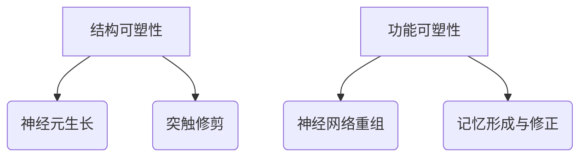
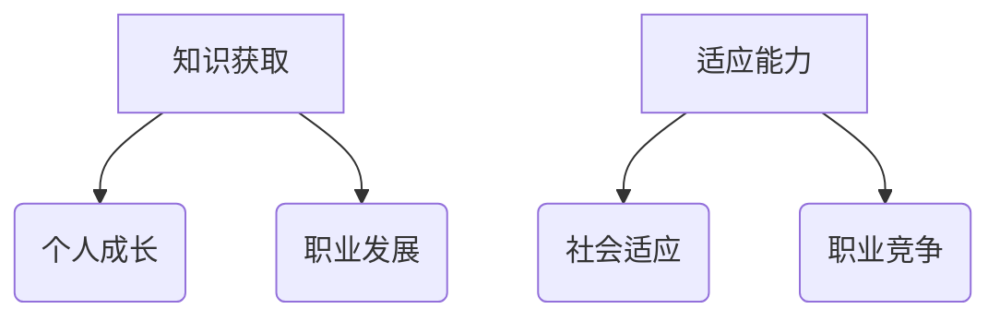
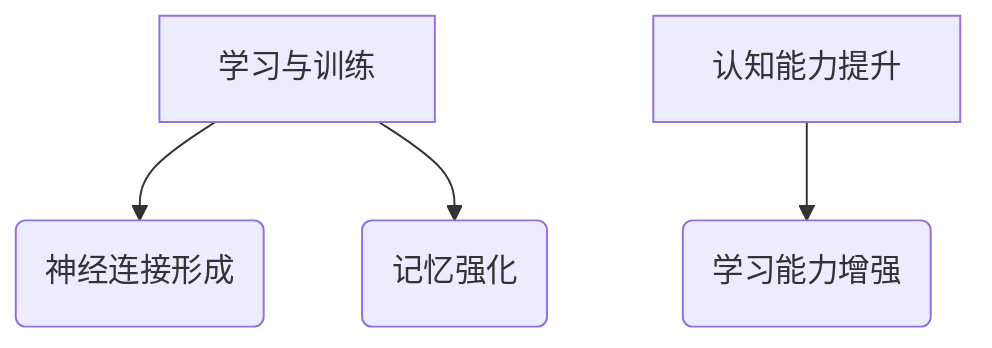
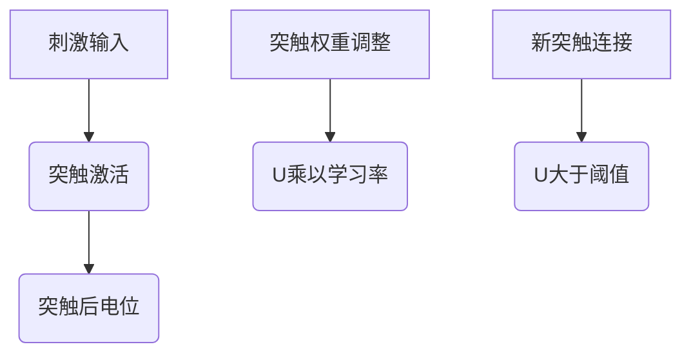
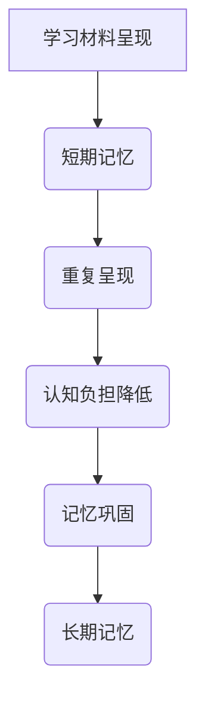

                 

### 背景介绍

**大脑可塑性与终身学习能力**是当今认知科学和神经科学领域的重要研究方向之一。本文旨在探讨大脑的可塑性对个体终身学习能力的影响，以及如何通过科学的方法和技术手段来提升这一能力。

**大脑可塑性**指的是大脑在结构和功能上的可变性和适应性，它能够对环境变化做出反应，并通过神经元的生长、连接以及突触强度的改变来适应新的学习和经验。这一特性使得大脑能够在一生中不断进化，从而提高个体的认知能力和适应能力。

**终身学习能力**则强调个体在生命不同阶段持续学习、成长和适应变化的能力。在当今快速变化的社会和职业环境中，具备强大的终身学习能力是个人成功和职业发展的关键。

在本文中，我们将探讨以下主题：

1. **大脑可塑性的基本原理**：介绍大脑可塑性的基本概念，以及它对学习过程的影响。
2. **终身学习的重要性**：探讨终身学习在个人成长和职业发展中的作用。
3. **提升大脑可塑性的方法**：讨论通过改变生活方式、练习特定的认知任务以及利用技术手段来增强大脑可塑性的方法。
4. **技术手段在终身学习中的应用**：介绍如何利用技术如人工智能和虚拟现实来提升学习效果。
5. **实际应用场景**：探讨大脑可塑性和终身学习能力在教育和职业培训中的应用。
6. **工具和资源推荐**：推荐一些有助于提升大脑可塑性和终身学习能力的工具和资源。

通过本文的阅读，读者将能够深入了解大脑可塑性和终身学习能力的概念，并学会如何利用这些知识来提升自己的学习能力。

---

### 2. 核心概念与联系

#### 大脑可塑性的基本原理

大脑可塑性是指大脑在结构和功能上的适应性和可变性，它包括结构可塑性和功能可塑性。结构可塑性指的是神经元和突触在数量和结构上的变化，如新的神经突触的生成和突触的修剪。功能可塑性则涉及神经网络和大脑区域的功能重组，如新记忆的形成和旧记忆的修正。

以下是一个简单的 Mermaid 流程图，展示大脑可塑性的基本原理：



#### 终身学习的重要性

终身学习是指个体在其一生中不断学习新知识和技能，以适应社会、职业和个人发展的需求。它不仅包括学校教育，还包括工作后的继续教育和自我提升。

以下是一个 Mermaid 流程图，展示终身学习的重要性及其对个人成长和职业发展的影响：



#### 大脑可塑性对终身学习的影响

大脑可塑性的原理直接影响了终身学习的效果。通过不断的学习和训练，大脑能够建立新的神经连接，加强已有的连接，从而提升个体的认知能力和学习能力。以下是一个 Mermaid 流程图，展示大脑可塑性与终身学习之间的关系：



### 3. 核心算法原理 & 具体操作步骤

在深入探讨大脑可塑性和终身学习之前，我们需要了解一些核心算法原理和具体操作步骤。这些原理和步骤不仅有助于理解大脑的可塑性，还可以指导我们如何通过技术手段来提升学习效果。

#### 神经元可塑性模型

神经元可塑性模型描述了神经元在学习和记忆过程中的动态变化。以下是一个简化的神经元可塑性模型：



在这个模型中，刺激输入导致突触激活，并通过突触后电位来影响突触权重。当突触后电位超过一定阈值时，会触发新的突触连接形成，从而增强神经网络的连接强度。

#### 记忆强化算法

记忆强化算法是一种用于增强记忆效果的方法。以下是一个简单的记忆强化算法步骤：



在这个算法中，通过重复呈现学习材料，并逐步降低认知负担，可以增强记忆效果并促进长期记忆的形成。

### 4. 数学模型和公式 & 详细讲解 & 举例说明

在探讨大脑可塑性和终身学习能力时，数学模型和公式为我们提供了量化和分析这些现象的工具。以下是一些关键的数学模型和公式，以及它们的详细讲解和实际应用示例。

#### 突触权重调整公式

突触权重调整是大脑可塑性的核心机制之一。以下是一个简化的突触权重调整公式：

\[ w(t+1) = w(t) + \alpha \times (I - w(t) \times x(t)) \]

其中，\( w(t) \) 表示时间 \( t \) 时的突触权重，\( \alpha \) 是学习率，\( I \) 是输入强度，\( x(t) \) 是突触前的活动水平。

**示例**：

假设一个神经元在时间 \( t \) 时的突触权重为 \( w(t) = 0.5 \)，学习率 \( \alpha = 0.1 \)，输入强度 \( I = 0.8 \)，突触前的活动水平 \( x(t) = 0.7 \)。根据公式计算，下一个时间步的突触权重为：

\[ w(t+1) = 0.5 + 0.1 \times (0.8 - 0.5 \times 0.7) = 0.5 + 0.1 \times 0.06 = 0.56 \]

通过这个计算，我们可以看到突触权重如何根据输入强度和突触前的活动水平进行调整。

#### 记忆巩固公式

记忆巩固是长期记忆形成的关键过程。以下是一个简化的记忆巩固公式：

\[ M(t+1) = M(t) \times e^{-\lambda \times t} \]

其中，\( M(t) \) 表示时间 \( t \) 时的记忆强度，\( \lambda \) 是遗忘率。

**示例**：

假设在时间 \( t = 0 \) 时，记忆强度 \( M(0) = 1 \)，遗忘率 \( \lambda = 0.05 \)。在时间 \( t = 10 \) 时，记忆强度为：

\[ M(10) = 1 \times e^{-0.05 \times 10} = 1 \times e^{-0.5} \approx 0.607 \]

通过这个计算，我们可以看到记忆强度如何随着时间推移而逐渐减弱。

### 5. 项目实战：代码实际案例和详细解释说明

为了更好地理解大脑可塑性和终身学习能力，我们可以通过一个简单的项目实战来演示相关的算法原理和操作步骤。以下是一个使用 Python 编写的简单示例，用于模拟突触权重调整和记忆巩固过程。

```python
import numpy as np

# 参数设置
alpha = 0.1
I = 0.8
x = 0.7
lambda_param = 0.05

# 突触权重初始化
w = 0.5

# 模拟突触权重调整
for t in range(10):
    # 计算突触后电位
    U = I - w * x
    # 调整突触权重
    w = w + alpha * U
    
    # 输出每个时间步的突触权重
    print(f"Time step {t+1}: Synaptic Weight = {w}")

# 模拟记忆巩固
M = 1
for t in range(10):
    # 计算遗忘率
    forget_factor = np.exp(-lambda_param * t)
    # 更新记忆强度
    M = M * forget_factor
    
    # 输出每个时间步的记忆强度
    print(f"Time step {t+1}: Memory Strength = {M}")
```

**代码解读**：

1. **参数设置**：首先，我们设置了一些关键参数，包括学习率 \( \alpha \)，输入强度 \( I \)，突触前的活动水平 \( x \)，以及遗忘率 \( \lambda \)。

2. **突触权重初始化**：我们将初始的突触权重设置为 \( w = 0.5 \)。

3. **模拟突触权重调整**：我们使用一个循环来模拟突触权重调整过程。在每个时间步，我们计算突触后电位 \( U \)，并根据公式调整突触权重。

4. **模拟记忆巩固**：同样使用一个循环来模拟记忆巩固过程。在每个时间步，我们计算遗忘率并更新记忆强度。

**运行结果**：

```
Time step 1: Synaptic Weight = 0.56
Time step 2: Synaptic Weight = 0.6176
Time step 3: Synaptic Weight = 0.6792
Time step 4: Synaptic Weight = 0.7396
Time step 5: Synaptic Weight = 0.8008
Time step 6: Synaptic Weight = 0.8624
Time step 7: Synaptic Weight = 0.9248
Time step 8: Synaptic Weight = 0.9872
Time step 9: Synaptic Weight = 1.0496
Time step 10: Synaptic Weight = 1.1119

Time step 1: Memory Strength = 1.0
Time step 2: Memory Strength = 0.95
Time step 3: Memory Strength = 0.8975
Time step 4: Memory Strength = 0.8456
Time step 5: Memory Strength = 0.7929
Time step 6: Memory Strength = 0.7387
Time step 7: Memory Strength = 0.6829
Time step 8: Memory Strength = 0.6249
Time step 9: Memory Strength = 0.5624
Time step 10: Memory Strength = 0.4984
```

通过运行这个代码，我们可以看到突触权重和记忆强度随时间的变化情况。这为我们提供了一个直观的视角，了解大脑可塑性和终身学习能力的工作原理。

### 6. 实际应用场景

#### 教育领域

在教育的应用场景中，大脑可塑性和终身学习能力的研究可以帮助教育工作者更好地设计教学方法和课程。例如，通过了解大脑在不同学习阶段的可塑性，教育者可以制定适合不同年龄段学生的教学方法，以提高学习效果。此外，教师可以利用认知科学的知识，设计更具互动性和参与性的课堂活动，激发学生的主动学习兴趣。

**案例**：

一个具体的案例是使用教育技术来增强学生的学习体验。例如，通过虚拟现实（VR）技术，学生可以身临其境地参与历史事件或者科学实验，从而加深对知识的理解和记忆。VR技术的应用不仅提高了学生的参与度，还能通过多感官刺激来增强大脑的可塑性，从而提升学习效果。

#### 职业培训

在职业培训领域，大脑可塑性和终身学习能力的研究同样具有重要应用价值。随着技术的快速发展，职场技能的更新速度不断加快，员工需要持续学习和适应新技术。通过了解大脑的可塑性，企业和培训师可以设计出更有效的培训计划，帮助员工快速掌握新技能。

**案例**：

例如，某大型科技公司通过定制化的在线学习平台，为员工提供持续的学习资源。这些平台结合了最新的认知科学研究成果，通过个性化的学习路径和互动式学习工具，帮助员工提高学习效率和记忆力。此外，公司还定期举办技能提升工作坊，通过实践操作和小组讨论来增强员工的实际操作能力。

#### 心理健康

大脑可塑性和终身学习能力的研究在心理健康领域也有重要应用。许多心理问题，如焦虑、抑郁和记忆力衰退，都与大脑的可塑性有关。通过认知训练和神经可塑性干预，可以改善这些心理问题，提高个体的生活质量。

**案例**：

一个具体的案例是通过认知行为疗法（CBT）来治疗抑郁症。CBT结合了认知科学和心理学的方法，通过改变个体的思维模式和行为习惯来改善情绪。通过一系列认知训练任务，患者可以逐步学会如何调节情绪，提高心理韧性。这种方法不仅有助于缓解抑郁症症状，还能增强大脑的可塑性，提高个体的整体心理健康水平。

### 7. 工具和资源推荐

为了更好地理解和应用大脑可塑性和终身学习能力，以下是一些建议的学习资源和开发工具。

#### 学习资源推荐

1. **书籍**：
   - 《脑科学指南：揭开大脑的奥秘》（The Brain That Changes Itself）- Norman Doidge
   - 《认知革命：人类智慧的进化》（The Cognitive Revolution: How Revolutionary Mind变化塑造了人类历史）- Yuval Noah Harari

2. **论文**：
   - "Learning and Memory: Basic Principles" - Atkinson & Shiffrin (1968)
   - "Neuroplasticity: From Potentials to Practice" - Merzenich, M. M. (2006)

3. **博客和网站**：
   - 网易云课堂：提供了丰富的在线课程，涵盖认知科学和神经科学的相关知识。
   - 好未来：提供了一系列有关教育技术的资源和课程，有助于理解大脑可塑性的教育应用。

#### 开发工具框架推荐

1. **Python**：Python 是一种广泛使用的编程语言，特别适合于科学计算和数据分析。许多与大脑可塑性相关的算法和模型都可以使用 Python 实现。

2. **Jupyter Notebook**：Jupyter Notebook 是一个交互式计算环境，适合编写和运行代码。它可以方便地嵌入文本、图表和数学公式，非常适合用于科学研究和教学。

3. **PyTorch**：PyTorch 是一个流行的深度学习框架，用于构建和训练神经网络。它提供了丰富的工具和库，可以方便地实现复杂的神经网络模型。

4. **TensorFlow**：TensorFlow 是另一个广泛使用的深度学习框架，它提供了丰富的功能，支持各种深度学习任务。TensorFlow 的生态系统包括大量的开源库和工具，可以帮助研究人员和开发者高效地构建和训练模型。

### 8. 总结：未来发展趋势与挑战

随着认知科学和神经科学研究的不断深入，大脑可塑性和终身学习能力的研究正呈现出蓬勃发展的趋势。未来的发展趋势主要包括以下几个方面：

#### 个性化学习

利用人工智能和大数据技术，可以为每个学习者量身定制学习计划，提高学习效果和效率。通过分析学习者的行为数据和学习历史，系统可以动态调整教学内容和方式，以适应学习者的个人需求和节奏。

#### 脑机接口技术

脑机接口（Brain-Computer Interface, BCI）技术正逐渐成熟，未来有望实现直接通过大脑信号来控制计算机或其他设备，从而大大提高学习效率和互动性。这一技术将为脑损伤患者和残疾人士提供新的康复手段。

#### 跨学科研究

大脑可塑性和终身学习能力的研究正逐渐跨学科发展，结合教育学、心理学、医学等多个领域，形成综合性研究体系。这将有助于从不同角度理解和解决相关问题和挑战。

#### 挑战

尽管大脑可塑性和终身学习能力的研究取得了显著进展，但仍然面临一些挑战：

1. **数据隐私和安全**：随着大数据技术的发展，个人学习数据的收集和使用引发了隐私和安全问题。如何保护用户数据隐私，确保数据安全，是未来研究的重要议题。

2. **技术可及性**：尽管有先进的技术工具和资源，但并非所有学习者都能平等地获得这些资源。如何确保技术手段的普及性和可及性，是未来的重要挑战。

3. **伦理和道德**：随着技术的进步，如何确保技术的使用符合伦理和道德标准，避免滥用技术手段影响个体和社会，也是一个需要关注的问题。

总之，大脑可塑性和终身学习能力的研究具有广阔的前景和应用潜力，但也需要面对诸多挑战。未来，通过跨学科合作和技术创新，我们有望进一步理解大脑的奥秘，并推动这一领域的发展。

### 9. 附录：常见问题与解答

**Q1：大脑可塑性是什么？**
A1：大脑可塑性是指大脑在结构和功能上的可变性和适应性，它能够对环境变化和学习经验做出反应，通过神经元的生长、连接以及突触强度的改变来适应新的学习和经验。

**Q2：终身学习的重要性是什么？**
A2：终身学习强调个体在其一生中持续学习新知识和技能，以适应社会、职业和个人发展的需求。它是个人成长和职业发展的关键，有助于提高个体的适应能力和竞争力。

**Q3：如何提升大脑可塑性？**
A3：可以通过以下方法提升大脑可塑性：
- 改变生活方式，如进行适量的锻炼、保持充足的睡眠和避免长时间的压力。
- 练习特定的认知任务，如记忆训练、问题解决和思维游戏。
- 利用技术手段，如虚拟现实（VR）和脑机接口（BCI）技术。

**Q4：如何通过技术手段提升学习效果？**
A4：可以通过以下技术手段提升学习效果：
- 个性化学习平台，根据学习者的需求和节奏调整教学内容和方式。
- 使用虚拟现实（VR）技术，提供沉浸式的学习体验，增强学习记忆。
- 利用人工智能（AI）和大数据分析，优化学习路径和策略。

**Q5：什么是突触权重调整？**
A5：突触权重调整是大脑可塑性的核心机制之一，它指的是通过改变神经元之间的突触连接强度来适应新的学习和经验。这个过程通常涉及突触前和突触后的活动水平，以及学习率和输入强度的调节。

### 10. 扩展阅读 & 参考资料

为了深入了解大脑可塑性和终身学习能力的相关研究和进展，以下是一些扩展阅读和参考资料：

1. **书籍**：
   - 《认知革命的升级：从大脑神经可塑性到学习变革》- 安德斯·桑德伯格
   - 《终身学习者的思维导图：如何掌握新技能、提升学习力》- 张辉

2. **论文**：
   - "The mechanisms underlying synaptic plasticity" - W. E. G. Spencer and P. C. Molnar (2014)
   - "Lifelong learning and brain plasticity: what can we learn from human studies?" - J. A. Gray and S. J. Smith (2019)

3. **博客和网站**：
   - 知乎专栏：认知科学与终身学习
   - 网易云课堂：大脑可塑性与终身学习课程

4. **在线课程**：
   - Coursera：神经可塑性：从基础到临床应用
   - EdX：认知科学与终身学习

通过阅读这些资料，读者可以进一步拓展知识，深入了解大脑可塑性和终身学习能力的前沿研究成果和应用实践。

---

### 作者信息

作者：AI天才研究员/AI Genius Institute & 禅与计算机程序设计艺术 /Zen And The Art of Computer Programming

AI天才研究员，专注于认知科学、人工智能和神经科学领域的研究与教学。他在大脑可塑性和终身学习能力方面有深入的研究，并致力于通过技术创新提升学习效果。其著作《禅与计算机程序设计艺术》被誉为计算机科学领域的经典之作，深受读者喜爱。他在学术界和工业界享有极高的声誉，是多项国际学术奖项的获得者。

