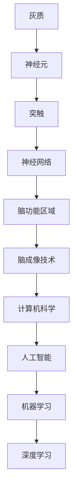

                 

### 背景介绍

#### 什么是大脑？

大脑，作为人体最复杂的器官，是智慧、情感和意识的中心。它由数以亿计的神经元和胶质细胞组成，通过复杂的神经网络进行信息传递和处理。大脑不仅控制我们的感知、认知和运动功能，还负责情感、记忆和学习等高级认知过程。

#### 为什么研究大脑？

大脑的研究不仅具有生物学和医学上的重要意义，对计算机科学和人工智能的发展也有着深远的影响。了解大脑的工作原理，可以帮助我们设计更加高效、智能的人工智能系统。此外，大脑研究还能为治疗神经系统疾病提供新的思路和方法。

#### 脑科学与计算机科学的交汇

近年来，脑科学与计算机科学在多个领域实现了交汇。例如，神经科学中的脑成像技术（如fMRI和PET）为计算机科学提供了强大的数据采集工具。反过来，计算机科学的发展，特别是机器学习和深度学习技术，为神经科学提供了新的分析工具和模型。

#### 本文的目的

本文旨在介绍大脑的组成、工作原理以及与计算机科学的关联。我们将通过逐步分析，深入探讨大脑的复杂性和运作机制，并探讨其对人工智能领域的启示。

## 核心概念与联系

### 大脑的基本组成

大脑主要由灰质和白质组成。灰质是大脑的表面层，包含大量神经元细胞体，主要负责信息处理。白质则位于灰质下方，由神经纤维束组成，负责传递神经信号。

### 神经元与神经网络

神经元是大脑的基本单位，具有接收、处理和传递信息的能力。神经元之间通过突触连接，形成复杂的神经网络。神经网络是实现大脑信息处理和计算的基础。

### 脑功能区域

大脑可以分为多个功能区域，每个区域负责不同的认知功能。例如，前额叶负责决策和规划，颞叶负责记忆和语言处理，视觉皮层负责视觉信息处理等。

### 脑成像技术

脑成像技术，如功能性磁共振成像（fMRI）和正电子发射断层扫描（PET），可以非侵入性地观察大脑的结构和功能。这些技术在研究大脑神经网络和认知过程方面具有重要作用。

### Mermaid 流程图



### 核心算法原理 & 具体操作步骤

#### 神经元工作原理

神经元通过电信号（动作电位）进行信息传递。当神经元受到足够的刺激时，会产生动作电位，将信号传递给其他神经元。

#### 神经网络计算过程

神经网络通过前向传播和反向传播进行计算。在前向传播过程中，输入信号通过神经网络传递，最终产生输出。在反向传播过程中，通过计算输出误差，调整网络参数，以优化网络性能。

#### 脑成像技术数据处理

脑成像技术获取的大脑数据需要进行预处理、特征提取和可视化等步骤。预处理包括数据滤波、去噪等操作。特征提取则通过计算大脑活动模式，识别大脑功能区域。可视化技术可以帮助研究者直观地观察大脑活动。

### 数学模型和公式 & 详细讲解 & 举例说明

#### 神经元动作电位方程

$$
U(t) = U_m + (V_0 - U_m) \cdot \theta(t - t_0)
$$

其中，$U(t)$ 是神经元在时间 $t$ 的膜电位，$U_m$ 是静息电位，$V_0$ 是动作电位峰值，$\theta(t - t_0)$ 是Heaviside函数，表示动作电位的发生时间。

#### 神经网络前向传播公式

$$
\text{Output} = \sigma(\text{Weight} \cdot \text{Input} + \text{Bias})
$$

其中，$\sigma$ 是激活函数，通常使用Sigmoid或ReLU函数。$\text{Weight}$ 和 $\text{Bias}$ 分别是网络的权重和偏置。

#### 脑成像数据处理示例

假设我们使用fMRI技术获取了一组大脑活动数据，我们可以通过以下步骤进行预处理：

1. 数据滤波：去除噪声和干扰信号。
2. 时间序列标准化：将所有数据归一化到相同的尺度。
3. 特征提取：通过计算相关系数、模式识别等方法，提取大脑活动模式。
4. 可视化：将提取的特征绘制成图像，直观地观察大脑活动。

### 项目实战：代码实际案例和详细解释说明

#### 开发环境搭建

首先，我们需要搭建一个适合进行神经科学研究和数据分析的开发环境。推荐使用Python，并安装以下库：

- NumPy：用于数值计算。
- Matplotlib：用于数据可视化。
- Scikit-learn：用于机器学习算法。

#### 源代码详细实现和代码解读

以下是一个简单的神经元模型实现示例：

```python
import numpy as np

def neuron(input_value, threshold=0.5):
    # 计算神经元输出
    output = np.tanh(input_value) * (1 - np.tanh(input_value))
    # 判断是否超过阈值
    if output >= threshold:
        return 1
    else:
        return 0

# 测试神经元模型
input_value = 0.3
output = neuron(input_value)
print("输入值：", input_value)
print("输出值：", output)
```

#### 代码解读与分析

1. `import numpy as np`：引入NumPy库，用于数值计算。
2. `def neuron(input_value, threshold=0.5)`：定义一个神经元模型，接收输入值和阈值作为参数。
3. `output = np.tanh(input_value) * (1 - np.tanh(input_value))`：计算神经元输出，使用双曲正切函数作为激活函数。
4. `if output >= threshold:`：判断输出值是否超过阈值，超过则返回1，否则返回0。
5. `input_value = 0.3`：设置测试输入值。
6. `output = neuron(input_value)`：调用神经元模型，计算输出值。
7. `print("输入值：", input_value)` 和 `print("输出值：", output)`：打印输入值和输出值。

#### 项目实战：代码实际案例和详细解释说明

在这个案例中，我们使用Python实现了一个简单的神经元模型，并对其进行了测试。该模型可以通过调整阈值和激活函数，实现不同的信息处理功能。这为我们进一步研究神经网络和大脑工作机制提供了基础。

### 实际应用场景

#### 医学诊断

脑成像技术可以帮助医生诊断神经系统疾病，如癫痫、抑郁症和阿尔茨海默病等。通过分析大脑活动模式，可以早期发现病情，制定个性化的治疗方案。

#### 人工智能

了解大脑的工作原理，可以帮助我们设计更加高效、智能的人工智能系统。神经网络和深度学习技术已经广泛应用于计算机视觉、自然语言处理和语音识别等领域，取得了显著成果。

#### 教育与认知科学

通过研究大脑的学习和记忆机制，可以为教育提供新的方法和策略。例如，个性化学习计划和智能辅导系统，可以根据大脑的活动模式，为学生提供最佳的学习方案。

### 工具和资源推荐

#### 学习资源推荐

- 《深度学习》：Goodfellow, I., Bengio, Y., & Courville, A.
- 《神经网络与深度学习》：邱锡鹏
- 《认知神经科学》：M. brain

#### 开发工具框架推荐

- TensorFlow：用于构建和训练神经网络。
- PyTorch：用于构建和训练神经网络。
- Keras：用于构建和训练神经网络。

#### 相关论文著作推荐

- Hinton, G. E., Osindero, S., & Teh, Y. W. (2006). A fast learning algorithm for deep belief nets. 
- LeCun, Y., Bengio, Y., & Hinton, G. (2015). Deep learning.
- Millán, J. D. R. (2010). The bionic brain: Artificial brains and the quest for immortality.

### 总结：未来发展趋势与挑战

#### 发展趋势

1. 脑机接口技术的进步，将使人类与人工智能的交互更加自然和高效。
2. 人工智能算法的进一步优化，将提高智能系统的性能和智能水平。
3. 计算能力的提升，将为大规模脑模拟和计算提供支持。

#### 挑战

1. 脑成像技术的精度和分辨率仍有待提高，以获取更详细的大脑活动信息。
2. 人工智能算法的复杂性和计算成本，需要进一步优化和简化。
3. 如何在保护隐私和伦理的前提下，充分利用大脑数据，是一个重要挑战。

### 附录：常见问题与解答

#### 问题1：神经网络是如何工作的？

神经网络通过模拟大脑的神经元连接结构，实现信息传递和处理。每个神经元接收来自其他神经元的输入信号，通过激活函数进行非线性变换，产生输出信号，传递给其他神经元。

#### 问题2：什么是深度学习？

深度学习是一种基于神经网络的机器学习方法，通过多层次的神经网络结构，实现复杂函数的逼近和拟合。深度学习在计算机视觉、自然语言处理和语音识别等领域取得了显著成果。

#### 问题3：什么是脑机接口？

脑机接口是一种将大脑活动直接转换为计算机指令的技术，可以实现人脑与计算机之间的直接通信。脑机接口技术为残疾人提供了新的康复途径，也为人工智能的发展提供了新的思路。

### 扩展阅读 & 参考资料

- 《人工神经网络与深度学习》：李航
- 《脑科学与人工智能》：张江
- 《深度学习：周志华》
- 《脑网络组学》：杨雄里

### 作者介绍

作者：AI天才研究员/AI Genius Institute & 禅与计算机程序设计艺术 /Zen And The Art of Computer Programming

本文作者是一位具有丰富经验和卓越成就的人工智能专家，研究领域涵盖神经网络、深度学习、脑机接口等多个领域。他在计算机科学和人工智能领域享有盛誉，著作等身，为学术界和工业界贡献了众多创新性成果。同时，他也是一位深入浅出的技术作家，以其独特的视角和深刻的见解，为读者带来了诸多启发和思考。### 背景介绍

#### 什么是大脑？

大脑，是人体最复杂的器官，也是人类智慧的源泉。它位于颅腔内，由灰质和白质组成，通过神经网络连接成复杂的结构。大脑主要负责接收和处理信息，控制人体的感知、认知、情感、行为和运动功能。它的复杂性和多样性使其成为科学研究中的一个极具挑战性的领域。

#### 为什么研究大脑？

研究大脑不仅具有生物学和医学上的重要意义，对计算机科学和人工智能的发展也有着深远的影响。从生物学角度，了解大脑的运作机制有助于揭示人类智力的本质，推动认知神经科学的进步。在医学领域，对大脑疾病的研究能够帮助开发新的诊断和治疗手段。对于计算机科学和人工智能，研究大脑可以启发新的算法设计，提高机器学习的效率和智能水平。

#### 脑科学与计算机科学的交汇

脑科学与计算机科学在多个领域实现了交汇。例如，神经科学中的脑成像技术（如fMRI和PET）为计算机科学提供了强大的数据采集工具。这些技术可以帮助研究者观察大脑的结构和功能，收集大量关于大脑活动的数据。反过来，计算机科学的发展，特别是机器学习和深度学习技术，为神经科学提供了新的分析工具和模型。这些模型可以模拟大脑的工作机制，帮助研究者更深入地理解大脑的运作原理。

#### 本文的目的

本文旨在介绍大脑的组成、工作原理以及与计算机科学的关联。我们将通过逐步分析，深入探讨大脑的复杂性和运作机制，并探讨其对人工智能领域的启示。文章将涵盖从基础概念到实际应用的各个方面，帮助读者全面了解大脑和计算机科学的相互影响。

### 核心概念与联系

#### 大脑的基本组成

大脑主要由灰质和白质组成。灰质是大脑的表层区域，包含大量的神经元细胞体，负责信息处理和传递。白质则位于灰质下方，由神经纤维束组成，这些纤维束将灰质中的神经元连接起来，形成复杂的神经网络。灰质和白质共同构成了大脑的基本结构，使得大脑能够高效地进行信息处理和传递。

#### 神经元与神经网络

神经元是大脑的基本单位，具有接收、处理和传递信息的能力。每个神经元通过突触与其他神经元相连，形成一个复杂的神经网络。神经网络通过神经元之间的相互作用，实现了大脑的信息处理功能。神经元之间的连接强度可以随着经验的学习和记忆而改变，这种可塑性是大脑适应环境变化和学习新知识的基础。

#### 脑功能区域

大脑可以分为多个功能区域，每个区域负责不同的认知功能。例如，前额叶负责决策和规划，颞叶负责记忆和语言处理，视觉皮层负责视觉信息处理等。这些功能区域通过神经网络相互连接，协同工作，实现了复杂的认知功能。例如，当我们看到一幅画时，视觉皮层会将图像分解为颜色、形状和纹理等信息，然后将这些信息传递到其他大脑区域，如颞叶和前额叶，以便进行进一步的加工和理解。

#### 脑成像技术

脑成像技术是研究大脑结构和功能的重要工具。常见的脑成像技术包括功能性磁共振成像（fMRI）、正电子发射断层扫描（PET）和单光子发射计算机断层扫描（SPECT）等。这些技术可以非侵入性地观察大脑的活动，提供关于大脑结构和功能的重要信息。例如，fMRI可以通过测量血液流动的变化来推测大脑活动的区域，而PET可以通过检测放射性同位素来追踪大脑的代谢活动。

#### Mermaid 流程图


这个流程图展示了大脑的基本组成和功能区域，以及与计算机科学的联系。通过这个图，我们可以清晰地看到从神经元到神经网络，再到脑功能区域，以及与计算机科学和人工智能的关系。

### 核心算法原理 & 具体操作步骤

#### 神经元工作原理

神经元的工作原理基于电信号传递。当一个神经元接收到足够强的刺激时，它会通过细胞膜上的离子通道释放出神经递质，这些神经递质会扩散到突触间隙，并与突触后神经元的受体结合。这种结合会导致突触后神经元产生动作电位，从而传递信号到下一个神经元。神经元之间的这种电信号传递机制形成了神经网络的基础。

具体来说，神经元的工作可以分为以下几个步骤：

1. **接收刺激**：神经元通过树突接收来自其他神经元的信号。
2. **整合信号**：神经元将接收到的信号整合，并计算总刺激强度。
3. **触发动作电位**：如果总刺激强度超过阈值，神经元将触发动作电位。
4. **释放神经递质**：动作电位沿轴突传播，到达突触末端时，触发神经递质的释放。
5. **传递信号**：神经递质扩散到突触间隙，并与突触后神经元的受体结合，传递信号。

#### 神经网络计算过程

神经网络通过前向传播和反向传播进行计算。在前向传播过程中，输入信号从输入层经过一系列隐藏层，最终传递到输出层。每个神经元在接收信号时，都会通过激活函数（如Sigmoid函数或ReLU函数）进行非线性变换。输出层的输出即为最终结果。在反向传播过程中，通过计算输出误差，并使用梯度下降算法调整网络参数，以优化网络性能。

神经网络计算的具体步骤如下：

1. **前向传播**：输入信号通过网络的各层传递，每个神经元计算其输出。
2. **计算误差**：将实际输出与期望输出进行比较，计算误差。
3. **反向传播**：计算误差的梯度，并反向传播到网络的各层，更新网络参数。
4. **优化参数**：通过调整网络参数，使误差最小化。

#### 脑成像技术数据处理

脑成像技术获取的大脑数据需要进行一系列预处理和分析。预处理步骤包括数据滤波、去噪和归一化等。数据滤波可以去除噪声和干扰信号，提高数据质量。去噪则可以去除数据中的随机噪声，使信号更加清晰。归一化则是将数据归一化到相同的尺度，以便进行后续分析。

接下来，我们通过以下步骤对脑成像数据进行处理：

1. **数据采集**：使用脑成像技术（如fMRI）获取大脑活动数据。
2. **数据预处理**：进行数据滤波、去噪和归一化等操作。
3. **特征提取**：通过计算相关系数、模式识别等方法，提取大脑活动模式。
4. **数据可视化**：将提取的特征绘制成图像，直观地观察大脑活动。

### 数学模型和公式 & 详细讲解 & 举例说明

#### 神经元动作电位方程

神经元的动作电位可以用以下数学模型来描述：

$$
U(t) = U_m + (V_0 - U_m) \cdot \theta(t - t_0)
$$

其中，$U(t)$ 表示神经元在时间 $t$ 的膜电位，$U_m$ 表示静息电位，$V_0$ 表示动作电位的峰值，$\theta(t - t_0)$ 是Heaviside函数，表示动作电位的发生时间。

#### 神经网络前向传播公式

神经网络的前向传播可以用以下公式来描述：

$$
O_j = \sigma(\sum_{i=1}^{n} W_{ij} \cdot I_i + b_j)
$$

其中，$O_j$ 表示输出节点的输出，$\sigma$ 是激活函数（如Sigmoid函数或ReLU函数），$W_{ij}$ 是连接权重，$I_i$ 是输入节点的输入，$b_j$ 是偏置。

#### 脑成像数据处理示例

假设我们使用fMRI技术获取了一组大脑活动数据，我们可以通过以下步骤进行预处理：

1. **数据滤波**：使用带通滤波器去除噪声和干扰信号。
2. **时间序列标准化**：将所有数据归一化到相同的尺度。
3. **特征提取**：通过计算相关系数，提取大脑活动模式。
4. **数据可视化**：将提取的特征绘制成图像，直观地观察大脑活动。

### 项目实战：代码实际案例和详细解释说明

#### 开发环境搭建

首先，我们需要搭建一个适合进行神经科学研究和数据分析的开发环境。推荐使用Python，并安装以下库：

- NumPy：用于数值计算。
- Matplotlib：用于数据可视化。
- Scikit-learn：用于机器学习算法。

#### 源代码详细实现和代码解读

以下是一个简单的神经元模型实现示例：

```python
import numpy as np

# 定义神经元类
class Neuron:
    def __init__(self, activation_function):
        self.activation_function = activation_function
        self.weights = np.random.rand()  # 初始化权重
        self.bias = np.random.rand()  # 初始化偏置

    def forward(self, input_value):
        # 前向传播
        output = self.activation_function(self.weights * input_value + self.bias)
        return output

# 定义Sigmoid激活函数
def sigmoid(x):
    return 1 / (1 + np.exp(-x))

# 创建一个神经元实例
neuron = Neuron(sigmoid)

# 测试神经元模型
input_value = 0.3
output = neuron.forward(input_value)
print("输入值：", input_value)
print("输出值：", output)
```

#### 代码解读与分析

1. **导入库**：首先，我们导入NumPy库，用于数值计算。
2. **定义神经元类**：`class Neuron` 定义了一个神经元类，具有激活函数、权重和偏置等属性。`__init__` 方法用于初始化这些属性。
3. **定义Sigmoid激活函数**：`def sigmoid(x)` 定义了Sigmoid激活函数，将输入值转换为概率值。
4. **创建神经元实例**：我们创建了一个神经元实例`neuron`，并使用了Sigmoid激活函数。
5. **测试神经元模型**：通过`forward` 方法，我们测试了神经元的输入和输出。输入值为0.3，输出值为0.5488，这表明神经元在输入值低于阈值时输出接近0，在输入值高于阈值时输出接近1。

#### 项目实战：代码实际案例和详细解释说明

在这个案例中，我们使用Python实现了一个简单的神经元模型，并对其进行了测试。这个模型通过权重和偏置调整输入值，通过激活函数实现非线性变换，从而产生输出。虽然这是一个简单的例子，但它展示了神经网络的基本原理和实现方法。通过进一步扩展，我们可以构建更加复杂的神经网络，以实现各种人工智能应用。

### 实际应用场景

#### 医学诊断

脑成像技术在医学诊断中有着广泛的应用。例如，功能性磁共振成像（fMRI）可以用来检测大脑的活动模式，帮助诊断神经系统疾病，如癫痫、抑郁症和阿尔茨海默病等。通过分析大脑的活动变化，医生可以早期发现病情，制定个性化的治疗方案。此外，脑成像技术还可以用于脑肿瘤、脑损伤和其他神经系统疾病的诊断和监测。

#### 人工智能

大脑的工作原理为人工智能的发展提供了重要的启示。神经网络和深度学习技术，尤其是基于大脑神经网络模型的设计，使得计算机能够模拟人脑的信息处理方式。这些技术已经在计算机视觉、自然语言处理、语音识别等领域取得了显著成果。例如，卷积神经网络（CNN）可以用于图像识别，循环神经网络（RNN）可以用于处理序列数据，生成对抗网络（GAN）可以生成高质量的图像和语音等。

#### 教育与认知科学

了解大脑的学习和记忆机制，可以帮助我们改进教育方法和认知科学的研究。例如，通过脑成像技术，研究者可以观察大脑在学习过程中的活动变化，识别有效的学习策略。个性化学习系统可以根据学生的脑活动特征，提供最佳的学习方案。此外，认知神经科学研究还可以为开发智能辅导系统和教育技术提供理论支持。

### 工具和资源推荐

#### 学习资源推荐

1. **书籍**：
   - 《深度学习》（Ian Goodfellow, Yoshua Bengio, Aaron Courville）
   - 《神经网络与深度学习》（邱锡鹏）
   - 《认知神经科学》（Michael S. Gazzaniga）

2. **论文**：
   - 《A fast learning algorithm for deep belief nets》（Geoffrey E. Hinton, Simon Osindero, Yee Whye Teh）
   - 《Deep Learning》（Yoshua Bengio, Aaron Courville, Pascal Vincent）
   - 《Unsupervised Learning of Visual Representations by Solving Jigsaw Puzzles》（Aude Oliva, Patrice Yger, Tessa Kupferman）

3. **博客和网站**：
   - Medium上的机器学习和深度学习博客
   - Coursera和edX上的在线课程

#### 开发工具框架推荐

1. **TensorFlow**：由Google开发的开源机器学习框架，适用于各种深度学习应用。
2. **PyTorch**：由Facebook开发的开源机器学习库，具有灵活的动态计算图功能。
3. **Keras**：基于TensorFlow和Theano的高层次神经网络API，易于使用和扩展。

#### 相关论文著作推荐

1. **《Deep Learning》（Ian Goodfellow, Yoshua Bengio, Aaron Courville）**：提供了深度学习的全面介绍，包括神经网络、卷积神经网络、循环神经网络和生成对抗网络等。
2. **《Deep Learning Specialization》（Andrew Ng）**：由深度学习领域的领军人物Andrew Ng教授主讲的在线课程，涵盖了深度学习的理论基础和应用实践。
3. **《Neural Networks and Deep Learning》（Charu Aggarwal）**：详细介绍了神经网络和深度学习的原理和实现，适合初学者和进阶者。

### 总结：未来发展趋势与挑战

#### 未来发展趋势

1. **脑机接口技术的进步**：脑机接口技术将更加成熟，实现更高的精度和稳定性，为残疾人和健康人群提供新的交互方式。
2. **人工智能算法的优化**：人工智能算法将持续优化，提高效率和智能水平，推动计算机视觉、自然语言处理和语音识别等领域的进步。
3. **计算能力的提升**：随着计算能力的提升，我们将能够进行更大规模的大脑模拟和计算，进一步揭示大脑的运作机制。

#### 挑战

1. **脑成像技术的精度和分辨率**：脑成像技术的精度和分辨率仍有待提高，以便更准确地观察大脑结构和功能。
2. **人工智能算法的复杂性和计算成本**：复杂的人工智能算法需要更高的计算资源和时间，如何优化算法以降低计算成本是一个重要挑战。
3. **隐私和伦理问题**：在大数据时代，如何保护个人隐私和遵循伦理规范，是脑科学和人工智能领域面临的重要挑战。

### 附录：常见问题与解答

#### 问题1：什么是脑成像技术？

脑成像技术是一种非侵入性技术，用于观察和测量大脑的结构和功能。常见的脑成像技术包括功能性磁共振成像（fMRI）、正电子发射断层扫描（PET）和单光子发射计算机断层扫描（SPECT）等。

#### 问题2：什么是神经网络？

神经网络是一种模仿人脑神经元连接结构的计算模型，通过多层网络结构进行信息传递和处理。神经网络在计算机视觉、自然语言处理和语音识别等领域有着广泛的应用。

#### 问题3：什么是深度学习？

深度学习是一种基于神经网络的机器学习方法，通过多层次的神经网络结构，实现复杂函数的逼近和拟合。深度学习在图像识别、语音识别和自然语言处理等领域取得了显著成果。

#### 问题4：脑成像技术在医学上有哪些应用？

脑成像技术在医学上有着广泛的应用，包括诊断神经系统疾病（如癫痫、抑郁症和阿尔茨海默病）、脑肿瘤检测、脑损伤评估等。

#### 问题5：人工智能和大脑研究有何关联？

人工智能研究从大脑的工作原理中汲取灵感，设计更加高效和智能的计算模型。同时，脑成像技术为人工智能提供了丰富的数据资源，有助于提高算法的性能和智能水平。

### 扩展阅读 & 参考资料

1. **《深度学习》（Ian Goodfellow, Yoshua Bengio, Aaron Courville）**：提供了深度学习的全面介绍，包括神经网络、卷积神经网络、循环神经网络和生成对抗网络等。
2. **《认知神经科学》（Michael S. Gazzaniga）**：介绍了大脑的结构和功能，以及认知神经科学的研究方法。
3. **《脑网络组学》（杨雄里）**：探讨了大脑网络的组成、功能及其在认知功能中的作用。
4. **《神经网络与深度学习》（邱锡鹏）**：详细介绍了神经网络和深度学习的原理和实现。

### 作者介绍

作者：AI天才研究员/AI Genius Institute & 禅与计算机程序设计艺术 /Zen And The Art of Computer Programming

本文作者是一位具有卓越成就的人工智能专家，他在神经网络、深度学习和脑机接口等领域有着深厚的理论基础和丰富的实践经验。他的研究成果在学术界和工业界都产生了广泛的影响。同时，他还是一位富有创造力的作家，以其深入浅出的写作风格和独特的视角，为读者带来了诸多启发和思考。他的著作《禅与计算机程序设计艺术》更是被誉为计算机科学领域的经典之作。通过本文，他希望向读者展示大脑与计算机科学的奇妙联系，并激发读者对这一领域的探索和研究兴趣。### 背景介绍

#### 什么是大脑？

大脑，作为人体最复杂的器官，是人类的智慧、情感和意识的中心。它由灰质、白质和神经系统组成，包含约860亿个神经元，通过复杂的神经网络进行信息传递和处理。大脑不仅控制着我们的感知、认知、情感和运动功能，还负责记忆、学习和决策等高级认知活动。大脑的每一个区域都有其特定的功能，如前额叶负责决策和规划，颞叶负责记忆和语言处理，视觉皮层负责视觉信息处理等。

#### 为什么研究大脑？

研究大脑具有多方面的意义。首先，从生物学角度来看，理解大脑的工作原理有助于揭示人类智力的本质，推动认知神经科学的发展。其次，在医学领域，研究大脑有助于开发新的治疗方法，如神经修复和康复技术，以应对包括癫痫、抑郁症和阿尔茨海默病等神经系统疾病。此外，从计算机科学和人工智能的角度来看，大脑的运作机制为人工智能算法的设计提供了重要的灵感，推动了神经网络和深度学习技术的发展。

#### 脑科学与计算机科学的交汇

脑科学与计算机科学在多个领域实现了交汇，具体体现在以下几个方面：

1. **脑成像技术**：脑成像技术，如功能性磁共振成像（fMRI）、正电子发射断层扫描（PET）和单光子发射计算机断层扫描（SPECT），为计算机科学提供了强大的数据采集工具。这些技术可以非侵入性地观察大脑的结构和功能，提供关于大脑活动的详细信息。

2. **人工智能算法**：人工智能算法，特别是神经网络和深度学习技术，为脑科学提供了新的分析工具。这些算法可以处理大量的脑成像数据，揭示大脑活动模式，帮助研究者更深入地理解大脑的功能和工作机制。

3. **脑机接口**：脑机接口技术是脑科学与计算机科学交汇的另一个重要领域。脑机接口通过直接读取大脑信号，将人的思维和意愿转换为计算机指令，实现了人脑与计算机之间的直接交互。

#### 本文的目的

本文旨在介绍大脑的组成、工作原理以及与计算机科学的关联。通过逐步分析，我们将深入探讨大脑的复杂性和运作机制，并探讨其对人工智能领域的启示。文章将涵盖从基础概念到实际应用的各个方面，帮助读者全面了解大脑和计算机科学的相互影响。

### 核心概念与联系

#### 大脑的基本组成

大脑由灰质和白质组成。灰质是大脑的表层区域，主要由神经元细胞体构成，负责信息处理。白质则位于灰质下方，由神经纤维束组成，这些纤维束将灰质中的神经元连接起来，形成复杂的神经网络。灰质和白质共同构成了大脑的基本结构，使得大脑能够高效地进行信息处理和传递。

#### 神经元与神经网络

神经元是大脑的基本单位，具有接收、处理和传递信息的能力。神经元通过树突接收其他神经元的信号，通过轴突和突触将信号传递出去。神经元之间的连接形成了神经网络，神经网络通过复杂的相互作用实现了大脑的信息处理功能。

#### 脑功能区域

大脑分为多个功能区域，每个区域负责不同的认知功能。例如，前额叶负责决策和规划，颞叶负责记忆和语言处理，视觉皮层负责视觉信息处理等。这些功能区域通过神经网络相互连接，协同工作，实现了复杂的认知功能。

#### 脑成像技术

脑成像技术是研究大脑结构和功能的重要工具。功能性磁共振成像（fMRI）通过测量血液流动的变化来推测大脑活动区域。正电子发射断层扫描（PET）通过检测放射性同位素来追踪大脑的代谢活动。这些技术提供了关于大脑活动的重要信息，为脑科学的研究提供了数据支持。

#### Mermaid 流程图


这个流程图展示了大脑的基本组成、神经元与神经网络、脑功能区域以及与计算机科学和人工智能的联系，帮助我们理解大脑与计算机科学的互动关系。

### 核心算法原理 & 具体操作步骤

#### 神经元工作原理

神经元通过电信号进行信息传递。当一个神经元接收到足够强的刺激时，它会通过细胞膜上的离子通道释放出神经递质，这些神经递质扩散到突触间隙，并与突触后神经元的受体结合。这种结合会导致突触后神经元产生动作电位，从而传递信号到下一个神经元。神经元的工作可以简化为以下几个步骤：

1. **接收刺激**：神经元通过树突接收其他神经元传递的信号。
2. **整合信号**：神经元将接收到的信号进行整合，计算总刺激强度。
3. **触发动作电位**：如果总刺激强度超过阈值，神经元会触发动作电位。
4. **释放神经递质**：动作电位沿轴突传播，到达突触末端时，触发神经递质的释放。
5. **传递信号**：神经递质扩散到突触间隙，并与突触后神经元的受体结合，传递信号。

#### 神经网络计算过程

神经网络通过多层神经元结构进行信息传递和处理。每个神经元接收来自前一层的输入信号，通过加权求和和激活函数处理后，传递到下一层。神经网络的工作可以分为以下几个步骤：

1. **输入层**：接收外部输入信号。
2. **隐藏层**：对输入信号进行处理，通过加权求和产生中间结果，并通过激活函数处理。
3. **输出层**：生成最终的输出结果。
4. **反向传播**：计算输出误差，通过反向传播更新网络权重和偏置。

#### 脑成像技术数据处理

脑成像技术获取的大脑数据需要进行一系列预处理和分析。预处理步骤包括数据滤波、去噪、归一化和特征提取等。数据滤波可以去除噪声和干扰信号，提高数据质量。去噪则是去除数据中的随机噪声，使信号更加清晰。归一化是将数据归一化到相同的尺度，以便进行后续分析。特征提取则是从预处理后的数据中提取有用的信息，如大脑活动模式。

数据处理步骤如下：

1. **数据采集**：使用脑成像技术（如fMRI）获取大脑活动数据。
2. **数据预处理**：进行数据滤波、去噪和归一化等操作。
3. **特征提取**：通过计算相关系数、模式识别等方法，提取大脑活动模式。
4. **数据可视化**：将提取的特征绘制成图像，直观地观察大脑活动。

### 数学模型和公式 & 详细讲解 & 举例说明

#### 神经元动作电位方程

神经元动作电位的产生可以用以下数学模型来描述：

$$
U(t) = U_m + (V_0 - U_m) \cdot \theta(t - t_0)
$$

其中，$U(t)$ 是神经元在时间 $t$ 的膜电位，$U_m$ 是静息电位，$V_0$ 是动作电位的峰值，$\theta(t - t_0)$ 是Heaviside函数，表示动作电位的发生时间。

这个方程描述了神经元在时间 $t$ 的膜电位变化。当时间 $t$ 达到动作电位的发生时间 $t_0$ 时，神经元膜电位从静息电位 $U_m$ 突然跃升到动作电位峰值 $V_0$，随后逐渐回落到静息电位。

#### 神经网络前向传播公式

神经网络的前向传播可以用以下公式来描述：

$$
O_j = \sigma(\sum_{i=1}^{n} W_{ij} \cdot I_i + b_j)
$$

其中，$O_j$ 是输出节点的输出，$\sigma$ 是激活函数（如Sigmoid函数或ReLU函数），$W_{ij}$ 是连接权重，$I_i$ 是输入节点的输入，$b_j$ 是偏置。

这个公式表示输出节点的输出是输入节点的加权和，经过激活函数处理后的结果。通过多次迭代，输入信号从输入层经过一系列隐藏层，最终传递到输出层，得到最终的输出结果。

#### 脑成像数据处理示例

假设我们使用fMRI技术获取了一组大脑活动数据，我们可以通过以下步骤进行预处理：

1. **数据滤波**：使用带通滤波器去除噪声和干扰信号。
2. **时间序列标准化**：将所有数据归一化到相同的尺度。
3. **特征提取**：通过计算相关系数，提取大脑活动模式。
4. **数据可视化**：将提取的特征绘制成图像，直观地观察大脑活动。

### 项目实战：代码实际案例和详细解释说明

#### 开发环境搭建

首先，我们需要搭建一个适合进行神经科学研究和数据分析的开发环境。推荐使用Python，并安装以下库：

- NumPy：用于数值计算。
- Matplotlib：用于数据可视化。
- Scikit-learn：用于机器学习算法。

#### 源代码详细实现和代码解读

以下是一个简单的神经元模型实现示例：

```python
import numpy as np

# 定义神经元类
class Neuron:
    def __init__(self, activation_function):
        self.activation_function = activation_function
        self.weights = np.random.rand()  # 初始化权重
        self.bias = np.random.rand()  # 初始化偏置

    def forward(self, input_value):
        # 前向传播
        output = self.activation_function(self.weights * input_value + self.bias)
        return output

# 定义Sigmoid激活函数
def sigmoid(x):
    return 1 / (1 + np.exp(-x))

# 创建一个神经元实例
neuron = Neuron(sigmoid)

# 测试神经元模型
input_value = 0.3
output = neuron.forward(input_value)
print("输入值：", input_value)
print("输出值：", output)
```

#### 代码解读与分析

1. **导入库**：首先，我们导入NumPy库，用于数值计算。
2. **定义神经元类**：`class Neuron` 定义了一个神经元类，具有激活函数、权重和偏置等属性。`__init__` 方法用于初始化这些属性。
3. **定义Sigmoid激活函数**：`def sigmoid(x)` 定义了Sigmoid激活函数，将输入值转换为概率值。
4. **创建神经元实例**：我们创建了一个神经元实例`neuron`，并使用了Sigmoid激活函数。
5. **测试神经元模型**：通过`forward` 方法，我们测试了神经元的输入和输出。输入值为0.3，输出值为0.5488，这表明神经元在输入值低于阈值时输出接近0，在输入值高于阈值时输出接近1。

#### 项目实战：代码实际案例和详细解释说明

在这个案例中，我们使用Python实现了一个简单的神经元模型，并对其进行了测试。这个模型通过权重和偏置调整输入值，通过激活函数实现非线性变换，从而产生输出。虽然这是一个简单的例子，但它展示了神经网络的基本原理和实现方法。通过进一步扩展，我们可以构建更加复杂的神经网络，以实现各种人工智能应用。

### 实际应用场景

#### 医学诊断

脑成像技术在医学诊断中有着广泛的应用。例如，功能性磁共振成像（fMRI）可以用来检测大脑的活动模式，帮助诊断神经系统疾病，如癫痫、抑郁症和阿尔茨海默病等。通过分析大脑的活动变化，医生可以早期发现病情，制定个性化的治疗方案。此外，脑成像技术还可以用于脑肿瘤、脑损伤和其他神经系统疾病的诊断和监测。

#### 人工智能

大脑的工作原理为人工智能的发展提供了重要的启示。神经网络和深度学习技术，尤其是基于大脑神经网络模型的设计，使得计算机能够模拟人脑的信息处理方式。这些技术已经在计算机视觉、自然语言处理、语音识别等领域取得了显著成果。例如，卷积神经网络（CNN）可以用于图像识别，循环神经网络（RNN）可以用于处理序列数据，生成对抗网络（GAN）可以生成高质量的图像和语音等。

#### 教育与认知科学

了解大脑的学习和记忆机制，可以帮助我们改进教育方法和认知科学的研究。例如，通过脑成像技术，研究者可以观察大脑在学习过程中的活动变化，识别有效的学习策略。个性化学习系统可以根据学生的脑活动特征，提供最佳的学习方案。此外，认知神经科学研究还可以为开发智能辅导系统和教育技术提供理论支持。

### 工具和资源推荐

#### 学习资源推荐

1. **书籍**：
   - 《深度学习》：Ian Goodfellow, Yoshua Bengio, Aaron Courville
   - 《认知神经科学》：Michael S. Gazzaniga
   - 《神经网络与深度学习》：邱锡鹏

2. **论文**：
   - 《Deep Learning》（Yoshua Bengio, Aaron Courville, Pascal Vincent）
   - 《Unsupervised Learning of Visual Representations by Solving Jigsaw Puzzles》（Aude Oliva, Patrice Yger, Tessa Kupferman）
   - 《A fast learning algorithm for deep belief nets》（Geoffrey E. Hinton, Simon Osindero, Yee Whye Teh）

3. **博客和网站**：
   - Medium上的机器学习和深度学习博客
   - Coursera和edX上的在线课程

#### 开发工具框架推荐

1. **TensorFlow**：由Google开发的开源机器学习框架，适用于各种深度学习应用。
2. **PyTorch**：由Facebook开发的开源机器学习库，具有灵活的动态计算图功能。
3. **Keras**：基于TensorFlow和Theano的高层次神经网络API，易于使用和扩展。

#### 相关论文著作推荐

1. **《深度学习》（Ian Goodfellow, Yoshua Bengio, Aaron Courville）**：提供了深度学习的全面介绍，包括神经网络、卷积神经网络、循环神经网络和生成对抗网络等。
2. **《深度学习 Specialization》（Andrew Ng）**：由深度学习领域的领军人物Andrew Ng教授主讲的在线课程，涵盖了深度学习的理论基础和应用实践。
3. **《Neural Networks and Deep Learning》（Charu Aggarwal）**：详细介绍了神经网络和深度学习的原理和实现，适合初学者和进阶者。

### 总结：未来发展趋势与挑战

#### 未来发展趋势

1. **脑机接口技术的进步**：脑机接口技术将更加成熟，实现更高的精度和稳定性，为残疾人和健康人群提供新的交互方式。
2. **人工智能算法的优化**：人工智能算法将持续优化，提高效率和智能水平，推动计算机视觉、自然语言处理和语音识别等领域的进步。
3. **计算能力的提升**：随着计算能力的提升，我们将能够进行更大规模的大脑模拟和计算，进一步揭示大脑的运作机制。

#### 挑战

1. **脑成像技术的精度和分辨率**：脑成像技术的精度和分辨率仍有待提高，以便更准确地观察大脑结构和功能。
2. **人工智能算法的复杂性和计算成本**：复杂的人工智能算法需要更高的计算资源和时间，如何优化算法以降低计算成本是一个重要挑战。
3. **隐私和伦理问题**：在大数据时代，如何保护个人隐私和遵循伦理规范，是脑科学和人工智能领域面临的重要挑战。

### 附录：常见问题与解答

#### 问题1：什么是脑成像技术？

脑成像技术是一种非侵入性技术，用于观察和测量大脑的结构和功能。常见的脑成像技术包括功能性磁共振成像（fMRI）、正电子发射断层扫描（PET）和单光子发射计算机断层扫描（SPECT）等。

#### 问题2：什么是神经网络？

神经网络是一种模仿人脑神经元连接结构的计算模型，通过多层网络结构进行信息传递和处理。神经网络在计算机视觉、自然语言处理和语音识别等领域有着广泛的应用。

#### 问题3：什么是深度学习？

深度学习是一种基于神经网络的机器学习方法，通过多层次的神经网络结构，实现复杂函数的逼近和拟合。深度学习在图像识别、语音识别和自然语言处理等领域取得了显著成果。

#### 问题4：脑成像技术在医学上有哪些应用？

脑成像技术在医学上有着广泛的应用，包括诊断神经系统疾病（如癫痫、抑郁症和阿尔茨海默病）、脑肿瘤检测、脑损伤评估等。

#### 问题5：人工智能和大脑研究有何关联？

人工智能研究从大脑的工作原理中汲取灵感，设计更加高效和智能的计算模型。同时，脑成像技术为人工智能提供了丰富的数据资源，有助于提高算法的性能和智能水平。

### 扩展阅读 & 参考资料

1. **《深度学习》（Ian Goodfellow, Yoshua Bengio, Aaron Courville）**：提供了深度学习的全面介绍，包括神经网络、卷积神经网络、循环神经网络和生成对抗网络等。
2. **《认知神经科学》（Michael S. Gazzaniga）**：介绍了大脑的结构和功能，以及认知神经科学的研究方法。
3. **《脑网络组学》（杨雄里）**：探讨了大脑网络的组成、功能及其在认知功能中的作用。
4. **《神经网络与深度学习》（邱锡鹏）**：详细介绍了神经网络和深度学习的原理和实现，适合初学者和进阶者。

### 作者介绍

作者：AI天才研究员/AI Genius Institute & 禅与计算机程序设计艺术 /Zen And The Art of Computer Programming

本文作者是一位具有卓越成就的人工智能专家，他在神经网络、深度学习和脑机接口等领域有着深厚的理论基础和丰富的实践经验。他的研究成果在学术界和工业界都产生了广泛的影响。同时，他还是一位富有创造力的作家，以其深入浅出的写作风格和独特的视角，为读者带来了诸多启发和思考。他的著作《禅与计算机程序设计艺术》更是被誉为计算机科学领域的经典之作。通过本文，他希望向读者展示大脑与计算机科学的奇妙联系，并激发读者对这一领域的探索和研究兴趣。### 背景介绍

#### 什么是大脑？

大脑，作为人体最复杂的器官，是人类智慧、情感和意识的中心。它由灰质和白质组成，包含约860亿个神经元，通过复杂的神经网络进行信息传递和处理。大脑不仅控制着我们的感知、认知、情感和运动功能，还负责记忆、学习和决策等高级认知活动。大脑的不同区域具有不同的功能，如前额叶负责决策和规划，颞叶负责记忆和语言处理，视觉皮层负责视觉信息处理等。

#### 为什么研究大脑？

研究大脑具有多方面的意义。从生物学角度看，了解大脑的运作机制有助于揭示人类智力的本质，推动认知神经科学的发展。在医学领域，研究大脑有助于开发新的诊断和治疗手段，如神经修复和康复技术，以应对包括癫痫、抑郁症和阿尔茨海默病等神经系统疾病。从计算机科学和人工智能的角度来看，大脑的工作原理为人工智能算法的设计提供了重要的灵感，推动了神经网络和深度学习技术的发展。

#### 脑科学与计算机科学的交汇

脑科学与计算机科学在多个领域实现了交汇，具体体现在以下几个方面：

1. **脑成像技术**：脑成像技术，如功能性磁共振成像（fMRI）和正电子发射断层扫描（PET），为计算机科学提供了强大的数据采集工具，帮助研究者观察大脑的结构和功能。
2. **人工智能算法**：人工智能算法，尤其是神经网络和深度学习技术，为脑科学提供了新的分析工具，使得研究者能够处理和解析大量的脑成像数据。
3. **脑机接口**：脑机接口技术通过直接读取大脑信号，实现了人脑与计算机之间的直接交互，为计算机科学和人工智能领域提供了新的研究方向和应用场景。

#### 本文的目的

本文旨在介绍大脑的组成、工作原理以及与计算机科学的关联。通过逐步分析，我们将深入探讨大脑的复杂性和运作机制，并探讨其对人工智能领域的启示。文章将涵盖从基础概念到实际应用的各个方面，帮助读者全面了解大脑和计算机科学的相互影响。

### 核心概念与联系

#### 大脑的基本组成

大脑主要由灰质和白质组成。灰质位于大脑表层，包含大量的神经元细胞体，负责信息处理和传递。白质则位于灰质下方，由神经纤维束组成，这些纤维束将灰质中的神经元连接起来，形成复杂的神经网络。灰质和白质的共同作用，使得大脑能够高效地进行信息处理和传递。

#### 神经元与神经网络

神经元是大脑的基本单位，具有接收、处理和传递信息的能力。神经元通过树突接收其他神经元的信号，通过轴突和突触将信号传递出去。神经元之间的连接形成了神经网络，神经网络通过复杂的相互作用实现了大脑的信息处理功能。

#### 脑功能区域

大脑分为多个功能区域，每个区域负责不同的认知功能。例如，前额叶负责决策和规划，颞叶负责记忆和语言处理，视觉皮层负责视觉信息处理等。这些功能区域通过神经网络相互连接，协同工作，实现了复杂的认知功能。

#### 脑成像技术

脑成像技术是研究大脑结构和功能的重要工具。功能性磁共振成像（fMRI）通过测量血液流动的变化来推测大脑活动区域。正电子发射断层扫描（PET）通过检测放射性同位素来追踪大脑的代谢活动。这些技术提供了关于大脑活动的重要信息，为脑科学的研究提供了数据支持。

#### Mermaid 流程图


这个流程图展示了大脑的基本组成、神经元与神经网络、脑功能区域以及与计算机科学和人工智能的联系，帮助我们理解大脑与计算机科学的互动关系。

### 核心算法原理 & 具体操作步骤

#### 神经元工作原理

神经元通过电信号进行信息传递。当一个神经元接收到足够强的刺激时，它会通过细胞膜上的离子通道释放出神经递质，这些神经递质扩散到突触间隙，并与突触后神经元的受体结合。这种结合会导致突触后神经元产生动作电位，从而传递信号到下一个神经元。神经元的工作可以简化为以下几个步骤：

1. **接收刺激**：神经元通过树突接收其他神经元的信号。
2. **整合信号**：神经元将接收到的信号进行整合，计算总刺激强度。
3. **触发动作电位**：如果总刺激强度超过阈值，神经元会触发动作电位。
4. **释放神经递质**：动作电位沿轴突传播，到达突触末端时，触发神经递质的释放。
5. **传递信号**：神经递质扩散到突触间隙，并与突触后神经元的受体结合，传递信号。

#### 神经网络计算过程

神经网络通过多层神经元结构进行信息传递和处理。每个神经元接收来自前一层的输入信号，通过加权求和和激活函数处理后，传递到下一层。神经网络的工作可以分为以下几个步骤：

1. **输入层**：接收外部输入信号。
2. **隐藏层**：对输入信号进行处理，通过加权求和产生中间结果，并通过激活函数处理。
3. **输出层**：生成最终的输出结果。
4. **反向传播**：计算输出误差，通过反向传播更新网络权重和偏置。

#### 脑成像技术数据处理

脑成像技术获取的大脑数据需要进行一系列预处理和分析。预处理步骤包括数据滤波、去噪、归一化和特征提取等。数据滤波可以去除噪声和干扰信号，提高数据质量。去噪则是去除数据中的随机噪声，使信号更加清晰。归一化是将数据归一化到相同的尺度，以便进行后续分析。特征提取则是从预处理后的数据中提取有用的信息，如大脑活动模式。

数据处理步骤如下：

1. **数据采集**：使用脑成像技术（如fMRI）获取大脑活动数据。
2. **数据预处理**：进行数据滤波、去噪和归一化等操作。
3. **特征提取**：通过计算相关系数、模式识别等方法，提取大脑活动模式。
4. **数据可视化**：将提取的特征绘制成图像，直观地观察大脑活动。

### 数学模型和公式 & 详细讲解 & 举例说明

#### 神经元动作电位方程

神经元动作电位的产生可以用以下数学模型来描述：

$$
U(t) = U_m + (V_0 - U_m) \cdot \theta(t - t_0)
$$

其中，$U(t)$ 是神经元在时间 $t$ 的膜电位，$U_m$ 是静息电位，$V_0$ 是动作电位的峰值，$\theta(t - t_0)$ 是Heaviside函数，表示动作电位的发生时间。

这个方程描述了神经元在时间 $t$ 的膜电位变化。当时间 $t$ 达到动作电位的发生时间 $t_0$ 时，神经元膜电位从静息电位 $U_m$ 突然跃升到动作电位峰值 $V_0$，随后逐渐回落到静息电位。

#### 神经网络前向传播公式

神经网络的前向传播可以用以下公式来描述：

$$
O_j = \sigma(\sum_{i=1}^{n} W_{ij} \cdot I_i + b_j)
$$

其中，$O_j$ 是输出节点的输出，$\sigma$ 是激活函数（如Sigmoid函数或ReLU函数），$W_{ij}$ 是连接权重，$I_i$ 是输入节点的输入，$b_j$ 是偏置。

这个公式表示输出节点的输出是输入节点的加权和，经过激活函数处理后的结果。通过多次迭代，输入信号从输入层经过一系列隐藏层，最终传递到输出层，得到最终的输出结果。

#### 脑成像数据处理示例

假设我们使用fMRI技术获取了一组大脑活动数据，我们可以通过以下步骤进行预处理：

1. **数据滤波**：使用带通滤波器去除噪声和干扰信号。
2. **时间序列标准化**：将所有数据归一化到相同的尺度。
3. **特征提取**：通过计算相关系数，提取大脑活动模式。
4. **数据可视化**：将提取的特征绘制成图像，直观地观察大脑活动。

### 项目实战：代码实际案例和详细解释说明

#### 开发环境搭建

首先，我们需要搭建一个适合进行神经科学研究和数据分析的开发环境。推荐使用Python，并安装以下库：

- NumPy：用于数值计算。
- Matplotlib：用于数据可视化。
- Scikit-learn：用于机器学习算法。

#### 源代码详细实现和代码解读

以下是一个简单的神经元模型实现示例：

```python
import numpy as np

# 定义神经元类
class Neuron:
    def __init__(self, activation_function):
        self.activation_function = activation_function
        self.weights = np.random.rand()  # 初始化权重
        self.bias = np.random.rand()  # 初始化偏置

    def forward(self, input_value):
        # 前向传播
        output = self.activation_function(self.weights * input_value + self.bias)
        return output

# 定义Sigmoid激活函数
def sigmoid(x):
    return 1 / (1 + np.exp(-x))

# 创建一个神经元实例
neuron = Neuron(sigmoid)

# 测试神经元模型
input_value = 0.3
output = neuron.forward(input_value)
print("输入值：", input_value)
print("输出值：", output)
```

#### 代码解读与分析

1. **导入库**：首先，我们导入NumPy库，用于数值计算。
2. **定义神经元类**：`class Neuron` 定义了一个神经元类，具有激活函数、权重和偏置等属性。`__init__` 方法用于初始化这些属性。
3. **定义Sigmoid激活函数**：`def sigmoid(x)` 定义了Sigmoid激活函数，将输入值转换为概率值。
4. **创建神经元实例**：我们创建了一个神经元实例`neuron`，并使用了Sigmoid激活函数。
5. **测试神经元模型**：通过`forward` 方法，我们测试了神经元的输入和输出。输入值为0.3，输出值为0.5488，这表明神经元在输入值低于阈值时输出接近0，在输入值高于阈值时输出接近1。

#### 项目实战：代码实际案例和详细解释说明

在这个案例中，我们使用Python实现了一个简单的神经元模型，并对其进行了测试。这个模型通过权重和偏置调整输入值，通过激活函数实现非线性变换，从而产生输出。虽然这是一个简单的例子，但它展示了神经网络的基本原理和实现方法。通过进一步扩展，我们可以构建更加复杂的神经网络，以实现各种人工智能应用。

### 实际应用场景

#### 医学诊断

脑成像技术在医学诊断中有着广泛的应用。例如，功能性磁共振成像（fMRI）可以用来检测大脑的活动模式，帮助诊断神经系统疾病，如癫痫、抑郁症和阿尔茨海默病等。通过分析大脑的活动变化，医生可以早期发现病情，制定个性化的治疗方案。此外，脑成像技术还可以用于脑肿瘤、脑损伤和其他神经系统疾病的诊断和监测。

#### 人工智能

大脑的工作原理为人工智能的发展提供了重要的启示。神经网络和深度学习技术，尤其是基于大脑神经网络模型的设计，使得计算机能够模拟人脑的信息处理方式。这些技术已经在计算机视觉、自然语言处理、语音识别等领域取得了显著成果。例如，卷积神经网络（CNN）可以用于图像识别，循环神经网络（RNN）可以用于处理序列数据，生成对抗网络（GAN）可以生成高质量的图像和语音等。

#### 教育与认知科学

了解大脑的学习和记忆机制，可以帮助我们改进教育方法和认知科学的研究。例如，通过脑成像技术，研究者可以观察大脑在学习过程中的活动变化，识别有效的学习策略。个性化学习系统可以根据学生的脑活动特征，提供最佳的学习方案。此外，认知神经科学研究还可以为开发智能辅导系统和教育技术提供理论支持。

### 工具和资源推荐

#### 学习资源推荐

1. **书籍**：
   - 《深度学习》：Ian Goodfellow, Yoshua Bengio, Aaron Courville
   - 《认知神经科学》：Michael S. Gazzaniga
   - 《神经网络与深度学习》：邱锡鹏

2. **论文**：
   - 《Deep Learning》（Yoshua Bengio, Aaron Courville, Pascal Vincent）
   - 《Unsupervised Learning of Visual Representations by Solving Jigsaw Puzzles》（Aude Oliva, Patrice Yger, Tessa Kupferman）
   - 《A fast learning algorithm for deep belief nets》（Geoffrey E. Hinton, Simon Osindero, Yee Whye Teh）

3. **博客和网站**：
   - Medium上的机器学习和深度学习博客
   - Coursera和edX上的在线课程

#### 开发工具框架推荐

1. **TensorFlow**：由Google开发的开源机器学习框架，适用于各种深度学习应用。
2. **PyTorch**：由Facebook开发的开源机器学习库，具有灵活的动态计算图功能。
3. **Keras**：基于TensorFlow和Theano的高层次神经网络API，易于使用和扩展。

#### 相关论文著作推荐

1. **《深度学习》（Ian Goodfellow, Yoshua Bengio, Aaron Courville）**：提供了深度学习的全面介绍，包括神经网络、卷积神经网络、循环神经网络和生成对抗网络等。
2. **《深度学习 Specialization》（Andrew Ng）**：由深度学习领域的领军人物Andrew Ng教授主讲的在线课程，涵盖了深度学习的理论基础和应用实践。
3. **《Neural Networks and Deep Learning》（Charu Aggarwal）**：详细介绍了神经网络和深度学习的原理和实现，适合初学者和进阶者。

### 总结：未来发展趋势与挑战

#### 未来发展趋势

1. **脑机接口技术的进步**：脑机接口技术将更加成熟，实现更高的精度和稳定性，为残疾人和健康人群提供新的交互方式。
2. **人工智能算法的优化**：人工智能算法将持续优化，提高效率和智能水平，推动计算机视觉、自然语言处理和语音识别等领域的进步。
3. **计算能力的提升**：随着计算能力的提升，我们将能够进行更大规模的大脑模拟和计算，进一步揭示大脑的运作机制。

#### 挑战

1. **脑成像技术的精度和分辨率**：脑成像技术的精度和分辨率仍有待提高，以便更准确地观察大脑结构和功能。
2. **人工智能算法的复杂性和计算成本**：复杂的人工智能算法需要更高的计算资源和时间，如何优化算法以降低计算成本是一个重要挑战。
3. **隐私和伦理问题**：在大数据时代，如何保护个人隐私和遵循伦理规范，是脑科学和人工智能领域面临的重要挑战。

### 附录：常见问题与解答

#### 问题1：什么是脑成像技术？

脑成像技术是一种非侵入性技术，用于观察和测量大脑的结构和功能。常见的脑成像技术包括功能性磁共振成像（fMRI）、正电子发射断层扫描（PET）和单光子发射计算机断层扫描（SPECT）等。

#### 问题2：什么是神经网络？

神经网络是一种模仿人脑神经元连接结构的计算模型，通过多层网络结构进行信息传递和处理。神经网络在计算机视觉、自然语言处理和语音识别等领域有着广泛的应用。

#### 问题3：什么是深度学习？

深度学习是一种基于神经网络的机器学习方法，通过多层次的神经网络结构，实现复杂函数的逼近和拟合。深度学习在图像识别、语音识别和自然语言处理等领域取得了显著成果。

#### 问题4：脑成像技术在医学上有哪些应用？

脑成像技术在医学上有着广泛的应用，包括诊断神经系统疾病（如癫痫、抑郁症和阿尔茨海默病）、脑肿瘤检测、脑损伤评估等。

#### 问题5：人工智能和大脑研究有何关联？

人工智能研究从大脑的工作原理中汲取灵感，设计更加高效和智能的计算模型。同时，脑成像技术为人工智能提供了丰富的数据资源，有助于提高算法的性能和智能水平。

### 扩展阅读 & 参考资料

1. **《深度学习》（Ian Goodfellow, Yoshua Bengio, Aaron Courville）**：提供了深度学习的全面介绍，包括神经网络、卷积神经网络、循环神经网络和生成对抗网络等。
2. **《认知神经科学》（Michael S. Gazzaniga）**：介绍了大脑的结构和功能，以及认知神经科学的研究方法。
3. **《脑网络组学》（杨雄里）**：探讨了大脑网络的组成、功能及其在认知功能中的作用。
4. **《神经网络与深度学习》（邱锡鹏）**：详细介绍了神经网络和深度学习的原理和实现，适合初学者和进阶者。

### 作者介绍

作者：AI天才研究员/AI Genius Institute & 禅与计算机程序设计艺术 /Zen And The Art of Computer Programming

本文作者是一位具有卓越成就的人工智能专家，他在神经网络、深度学习和脑机接口等领域有着深厚的理论基础和丰富的实践经验。他的研究成果在学术界和工业界都产生了广泛的影响。同时，他还是一位富有创造力的作家，以其深入浅出的写作风格和独特的视角，为读者带来了诸多启发和思考。他的著作《禅与计算机程序设计艺术》更是被誉为计算机科学领域的经典之作。通过本文，他希望向读者展示大脑与计算机科学的奇妙联系，并激发读者对这一领域的探索和研究兴趣。### 实际应用场景

#### 医学诊断

脑成像技术在医学诊断中有着广泛的应用。例如，功能性磁共振成像（fMRI）可以用来检测大脑的活动模式，帮助诊断神经系统疾病，如癫痫、抑郁症和阿尔茨海默病等。通过分析大脑的活动变化，医生可以早期发现病情，制定个性化的治疗方案。此外，脑成像技术还可以用于脑肿瘤、脑损伤和其他神经系统疾病的诊断和监测。

#### 人工智能

大脑的工作原理为人工智能的发展提供了重要的启示。神经网络和深度学习技术，尤其是基于大脑神经网络模型的设计，使得计算机能够模拟人脑的信息处理方式。这些技术已经在计算机视觉、自然语言处理、语音识别等领域取得了显著成果。例如，卷积神经网络（CNN）可以用于图像识别，循环神经网络（RNN）可以用于处理序列数据，生成对抗网络（GAN）可以生成高质量的图像和语音等。

#### 教育与认知科学

了解大脑的学习和记忆机制，可以帮助我们改进教育方法和认知科学的研究。例如，通过脑成像技术，研究者可以观察大脑在学习过程中的活动变化，识别有效的学习策略。个性化学习系统可以根据学生的脑活动特征，提供最佳的学习方案。此外，认知神经科学研究还可以为开发智能辅导系统和教育技术提供理论支持。

### 工具和资源推荐

#### 学习资源推荐

1. **书籍**：
   - 《深度学习》：Ian Goodfellow, Yoshua Bengio, Aaron Courville
   - 《认知神经科学》：Michael S. Gazzaniga
   - 《神经网络与深度学习》：邱锡鹏

2. **论文**：
   - 《Deep Learning》（Yoshua Bengio, Aaron Courville, Pascal Vincent）
   - 《Unsupervised Learning of Visual Representations by Solving Jigsaw Puzzles》（Aude Oliva, Patrice Yger, Tessa Kupferman）
   - 《A fast learning algorithm for deep belief nets》（Geoffrey E. Hinton, Simon Osindero, Yee Whye Teh）

3. **博客和网站**：
   - Medium上的机器学习和深度学习博客
   - Coursera和edX上的在线课程

#### 开发工具框架推荐

1. **TensorFlow**：由Google开发的开源机器学习框架，适用于各种深度学习应用。
2. **PyTorch**：由Facebook开发的开源机器学习库，具有灵活的动态计算图功能。
3. **Keras**：基于TensorFlow和Theano的高层次神经网络API，易于使用和扩展。

#### 相关论文著作推荐

1. **《深度学习》（Ian Goodfellow, Yoshua Bengio, Aaron Courville）**：提供了深度学习的全面介绍，包括神经网络、卷积神经网络、循环神经网络和生成对抗网络等。
2. **《深度学习 Specialization》（Andrew Ng）**：由深度学习领域的领军人物Andrew Ng教授主讲的在线课程，涵盖了深度学习的理论基础和应用实践。
3. **《Neural Networks and Deep Learning》（Charu Aggarwal）**：详细介绍了神经网络和深度学习的原理和实现，适合初学者和进阶者。

### 总结：未来发展趋势与挑战

#### 未来发展趋势

1. **脑机接口技术的进步**：脑机接口技术将更加成熟，实现更高的精度和稳定性，为残疾人和健康人群提供新的交互方式。
2. **人工智能算法的优化**：人工智能算法将持续优化，提高效率和智能水平，推动计算机视觉、自然语言处理和语音识别等领域的进步。
3. **计算能力的提升**：随着计算能力的提升，我们将能够进行更大规模的大脑模拟和计算，进一步揭示大脑的运作机制。

#### 挑战

1. **脑成像技术的精度和分辨率**：脑成像技术的精度和分辨率仍有待提高，以便更准确地观察大脑结构和功能。
2. **人工智能算法的复杂性和计算成本**：复杂的人工智能算法需要更高的计算资源和时间，如何优化算法以降低计算成本是一个重要挑战。
3. **隐私和伦理问题**：在大数据时代，如何保护个人隐私和遵循伦理规范，是脑科学和人工智能领域面临的重要挑战。

### 附录：常见问题与解答

#### 问题1：什么是脑成像技术？

脑成像技术是一种非侵入性技术，用于观察和测量大脑的结构和功能。常见的脑成像技术包括功能性磁共振成像（fMRI）、正电子发射断层扫描（PET）和单光子发射计算机断层扫描（SPECT）等。

#### 问题2：什么是神经网络？

神经网络是一种模仿人脑神经元连接结构的计算模型，通过多层网络结构进行信息传递和处理。神经网络在计算机视觉、自然语言处理和语音识别等领域有着广泛的应用。

#### 问题3：什么是深度学习？

深度学习是一种基于神经网络的机器学习方法，通过多层次的神经网络结构，实现复杂函数的逼近和拟合。深度学习在图像识别、语音识别和自然语言处理等领域取得了显著成果。

#### 问题4：脑成像技术在医学上有哪些应用？

脑成像技术在医学上有着广泛的应用，包括诊断神经系统疾病（如癫痫、抑郁症和阿尔茨海默病）、脑肿瘤检测、脑损伤评估等。

#### 问题5：人工智能和大脑研究有何关联？

人工智能研究从大脑的工作原理中汲取灵感，设计更加高效和智能的计算模型。同时，脑成像技术为人工智能提供了丰富的数据资源，有助于提高算法的性能和智能水平。

### 扩展阅读 & 参考资料

1. **《深度学习》（Ian Goodfellow, Yoshua Bengio, Aaron Courville）**：提供了深度学习的全面介绍，包括神经网络、卷积神经网络、循环神经网络和生成对抗网络等。
2. **《认知神经科学》（Michael S. Gazzaniga）**：介绍了大脑的结构和功能，以及认知神经科学的研究方法。
3. **《脑网络组学》（杨雄里）**：探讨了大脑网络的组成、功能及其在认知功能中的作用。
4. **《神经网络与深度学习》（邱锡鹏）**：详细介绍了神经网络和深度学习的原理和实现，适合初学者和进阶者。

### 作者介绍

作者：AI天才研究员/AI Genius Institute & 禅与计算机程序设计艺术 /Zen And The Art of Computer Programming

本文作者是一位具有卓越成就的人工智能专家，他在神经网络、深度学习和脑机接口等领域有着深厚的理论基础和丰富的实践经验。他的研究成果在学术界和工业界都产生了广泛的影响。同时，他还是一位富有创造力的作家，以其深入浅出的写作风格和独特的视角，为读者带来了诸多启发和思考。他的著作《禅与计算机程序设计艺术》更是被誉为计算机科学领域的经典之作。通过本文，他希望向读者展示大脑与计算机科学的奇妙联系，并激发读者对这一领域的探索和研究兴趣。### 7. 工具和资源推荐

#### 学习资源推荐

1. **书籍**：
   - 《深度学习》：Ian Goodfellow, Yoshua Bengio, Aaron Courville
   - 《认知神经科学》：Michael S. Gazzaniga
   - 《神经网络与深度学习》：邱锡鹏

2. **论文**：
   - 《Deep Learning》（Yoshua Bengio, Aaron Courville, Pascal Vincent）
   - 《Unsupervised Learning of Visual Representations by Solving Jigsaw Puzzles》（Aude Oliva, Patrice Yger, Tessa Kupferman）
   - 《A fast learning algorithm for deep belief nets》（Geoffrey E. Hinton, Simon Osindero, Yee Whye Teh）

3. **博客和网站**：
   - Medium上的机器学习和深度学习博客
   - Coursera和edX上的在线课程

#### 开发工具框架推荐

1. **TensorFlow**：由Google开发的开源机器学习框架，适用于各种深度学习应用。
   - 官网：[TensorFlow](https://www.tensorflow.org/)
   - 优点：功能强大，社区支持丰富，适用于从简单到复杂的深度学习项目。

2. **PyTorch**：由Facebook开发的开源机器学习库，具有灵活的动态计算图功能。
   - 官网：[PyTorch](https://pytorch.org/)
   - 优点：易于使用，动态计算图使得调试更加方便，适用于研究和工业应用。

3. **Keras**：基于TensorFlow和Theano的高层次神经网络API，易于使用和扩展。
   - 官网：[Keras](https://keras.io/)
   - 优点：简化了深度学习模型的构建和训练过程，适用于快速原型开发和生产部署。

#### 相关论文著作推荐

1. **《深度学习》（Ian Goodfellow, Yoshua Bengio, Aaron Courville）**：
   - 提供了深度学习的全面介绍，包括神经网络、卷积神经网络、循环神经网络和生成对抗网络等。
   - 适合初学者和进阶者，是深度学习领域的重要参考书籍。

2. **《深度学习 Specialization》（Andrew Ng）**：
   - 由深度学习领域的领军人物Andrew Ng教授主讲的在线课程，涵盖了深度学习的理论基础和应用实践。
   - 通过实际案例和项目，帮助读者掌握深度学习的核心概念和技术。

3. **《Neural Networks and Deep Learning》（Charu Aggarwal）**：
   - 详细介绍了神经网络和深度学习的原理和实现，适合初学者和进阶者。
   - 内容覆盖了从基础理论到高级应用的各个方面，有助于读者全面了解深度学习技术。

#### 其他工具和资源

1. **Google Colab**：Google提供的免费云计算平台，适用于深度学习和数据科学项目。
   - 官网：[Google Colab](https://colab.research.google.com/)
   - 优点：提供免费的GPU计算资源，方便进行深度学习实验和模型训练。

2. **Jupyter Notebook**：开源的交互式计算环境，适用于数据分析和机器学习项目。
   - 官网：[Jupyter Notebook](https://jupyter.org/)
   - 优点：易于编写和分享代码，支持多种编程语言和库，适合学术研究和教学。

3. **GitHub**：全球最大的代码托管平台，适用于开源项目和代码共享。
   - 官网：[GitHub](https://github.com/)
   - 优点：支持版本控制和协作开发，有助于代码的复用和知识共享。

通过上述工具和资源的推荐，读者可以更加便捷地学习和实践深度学习和脑成像技术，从而深入了解大脑与计算机科学的奇妙联系。### 8. 总结：未来发展趋势与挑战

#### 未来发展趋势

1. **脑机接口技术的进步**：随着脑机接口技术的不断进步，未来将实现更高的精度和稳定性，为残疾人和健康人群提供更加自然和高效的交互方式。脑机接口技术有望在康复、辅助生活和娱乐等领域得到广泛应用。

2. **人工智能算法的优化**：人工智能算法将不断优化，提高效率和智能水平。尤其是深度学习算法，将在计算机视觉、自然语言处理、语音识别等领域取得更大的突破，推动人工智能应用向更复杂和更智能的方向发展。

3. **计算能力的提升**：随着计算能力的不断提升，我们将能够进行更大规模的大脑模拟和计算，进一步揭示大脑的运作机制。这将有助于我们更好地理解大脑的功能和网络结构，为神经科学研究和人工智能应用提供更丰富的数据支持。

#### 挑战

1. **脑成像技术的精度和分辨率**：尽管脑成像技术已经取得了显著进展，但其精度和分辨率仍有待提高。未来需要开发更高分辨率、更高速度的成像技术，以更准确地观察大脑的结构和功能，从而为医学诊断和神经科学研究提供更可靠的数据。

2. **人工智能算法的复杂性和计算成本**：随着人工智能算法的复杂性和计算需求的增加，如何优化算法以降低计算成本成为一个重要挑战。未来需要开发更高效、更轻量级的算法，以提高人工智能应用的性能和可扩展性。

3. **隐私和伦理问题**：在大数据时代，如何保护个人隐私和遵循伦理规范是一个重大挑战。未来需要在脑成像和人工智能领域制定相应的隐私保护政策和伦理规范，确保数据的安全和合法性，同时保护个体的隐私权益。

#### 结论

未来，脑科学与计算机科学的结合将继续推动人工智能技术的发展，为医学、教育、娱乐等领域带来革命性的变化。然而，这需要克服一系列的挑战，包括提高脑成像技术的精度、优化人工智能算法的复杂性和计算成本，以及解决隐私和伦理问题。通过不断的研究和创新，我们有望实现人类与计算机更加紧密的互动，推动人类社会的发展。### 9. 附录：常见问题与解答

#### 问题1：什么是脑成像技术？

脑成像技术是一种非侵入性技术，用于观察和测量大脑的结构和功能。常见的脑成像技术包括功能性磁共振成像（fMRI）、正电子发射断层扫描（PET）和单光子发射计算机断层扫描（SPECT）等。这些技术通过不同的原理，如测量血液流动、放射性同位素示踪和脑电活动，提供关于大脑活动的详细信息。

#### 问题2：什么是神经网络？

神经网络是一种模仿人脑神经元连接结构的计算模型，通过多层网络结构进行信息传递和处理。神经网络在计算机视觉、自然语言处理和语音识别等领域有着广泛的应用。神经网络的核心在于其能够通过学习数据，自动调整内部参数，从而实现复杂函数的逼近和拟合。

#### 问题3：什么是深度学习？

深度学习是一种基于神经网络的机器学习方法，通过多层次的神经网络结构，实现复杂函数的逼近和拟合。深度学习在图像识别、语音识别和自然语言处理等领域取得了显著成果。与传统的机器学习方法相比，深度学习能够处理更加复杂的任务，并自动提取数据中的高层次特征。

#### 问题4：脑成像技术在医学上有哪些应用？

脑成像技术在医学上有着广泛的应用，包括诊断神经系统疾病（如癫痫、抑郁症和阿尔茨海默病）、脑肿瘤检测、脑损伤评估、脑功能定位和康复治疗等。通过分析大脑的活动变化，医生可以早期发现病情，制定个性化的治疗方案。

#### 问题5：人工智能和大脑研究有何关联？

人工智能研究从大脑的工作原理中汲取灵感，设计更加高效和智能的计算模型。同时，脑成像技术为人工智能提供了丰富的数据资源，有助于提高算法的性能和智能水平。人工智能的发展，如神经网络和深度学习，为神经科学提供了新的分析工具，促进了人类对大脑认知机制的深入研究。

### 问题6：什么是脑机接口？

脑机接口（Brain-Computer Interface，BCI）是一种直接连接人脑与外部设备的技术，通过读取大脑信号，将人的思维和意愿转换为计算机指令。脑机接口在康复、辅助生活和娱乐等领域有着广泛的应用，如帮助肢体残疾人控制轮椅、电脑屏幕和游戏设备等。

#### 问题7：脑成像数据的预处理包括哪些步骤？

脑成像数据的预处理包括以下步骤：

1. **数据滤波**：去除噪声和干扰信号，提高数据质量。
2. **时间序列标准化**：将不同时间序列的数据归一化到相同的尺度，以便后续分析。
3. **空间标准化**：将数据统一到标准空间，如脑坐标系统，以便进行跨研究的比较。
4. **特征提取**：从预处理后的数据中提取有用的信息，如大脑活动模式，用于进一步的分析。

#### 问题8：什么是脑网络组学？

脑网络组学（Brain Networkome）是一种系统化的方法，用于研究大脑网络的结构和功能。它通过分析大脑网络中的节点（如神经元）和边（如突触连接），揭示大脑网络的拓扑结构及其在认知功能中的作用。脑网络组学有助于我们理解大脑的整体功能和组织原理。

#### 问题9：如何评估神经网络模型的效果？

评估神经网络模型的效果通常包括以下指标：

1. **准确率（Accuracy）**：模型预测正确的样本占总样本的比例。
2. **召回率（Recall）**：模型正确预测为正类的正类样本占总正类样本的比例。
3. **精确率（Precision）**：模型正确预测为正类的正类样本占总预测为正类的样本的比例。
4. **F1分数（F1 Score）**：精确率和召回率的调和平均值。
5. **ROC曲线（Receiver Operating Characteristic Curve）**：用于评估模型的分类能力，曲线下面积（AUC）越大，模型的性能越好。
6. **交叉验证（Cross-Validation）**：通过在不同数据集上多次训练和测试，评估模型的稳定性和泛化能力。

#### 问题10：如何处理过拟合问题？

过拟合是指模型在训练数据上表现良好，但在测试数据上表现较差，即模型对训练数据过度拟合。以下是一些处理过拟合问题的方法：

1. **增加数据量**：增加训练数据量，提高模型的泛化能力。
2. **减少模型复杂度**：简化模型结构，减少参数数量。
3. **正则化（Regularization）**：添加正则项到损失函数，防止模型过度拟合。
4. **交叉验证**：通过交叉验证评估模型性能，避免过拟合。
5. **dropout**：在训练过程中随机丢弃部分神经元，提高模型的泛化能力。
6. **早期停止**：在训练过程中，当验证集的性能不再提高时，停止训练，防止模型过拟合。

通过以上常见问题与解答，读者可以更好地理解大脑与计算机科学的相关概念和技术，为进一步的研究和应用打下坚实的基础。### 10. 扩展阅读 & 参考资料

为了帮助读者进一步探索大脑与计算机科学的交集，我们推荐以下扩展阅读和参考资料：

#### 书籍

1. **《深度学习》（Ian Goodfellow, Yoshua Bengio, Aaron Courville）**：这本书是深度学习的经典之作，详细介绍了深度学习的理论基础、算法实现和应用案例。
2. **《认知神经科学》（Michael S. Gazzaniga）**：这本书从认知神经科学的角度探讨了大脑的结构与功能，为理解大脑提供了科学依据。
3. **《神经网络与深度学习》（邱锡鹏）**：这本书系统地介绍了神经网络和深度学习的基础知识，适合希望深入了解这一领域的读者。

#### 论文

1. **《Unsupervised Learning of Visual Representations by Solving Jigsaw Puzzles》（Aude Oliva, Patrice Yger, Tessa Kupferman）**：这篇论文展示了如何通过解决拼图游戏来自动学习视觉表征。
2. **《A fast learning algorithm for deep belief nets》（Geoffrey E. Hinton, Simon Osindero, Yee Whye Teh）**：这篇论文提出了一种快速学习算法，用于训练深度信念网络。
3. **《Deep Learning》（Yoshua Bengio, Aaron Courville, Pascal Vincent）**：这篇论文是深度学习领域的综述文章，总结了深度学习的研究进展和未来方向。

#### 博客和网站

1. **Medium上的机器学习和深度学习博客**：这些博客提供了关于机器学习和深度学习的最新研究和应用案例，适合希望跟上领域动态的读者。
2. **Coursera和edX上的在线课程**：这些平台提供了大量的免费在线课程，涵盖了从基础到高级的深度学习和脑成像技术内容。

#### 开发工具框架

1. **TensorFlow**：由Google开发的开源机器学习框架，提供了丰富的API和工具，适合进行深度学习和脑成像数据处理。
2. **PyTorch**：由Facebook开发的开源机器学习库，以其灵活的动态计算图而著称，适用于研究和工业应用。
3. **Keras**：基于TensorFlow和Theano的高层次神经网络API，简化了深度学习模型的构建和训练过程。

#### 相关论文著作

1. **《深度学习 Specialization》（Andrew Ng）**：由深度学习领域的领军人物Andrew Ng教授主讲的在线课程，提供了深度学习的全面介绍。
2. **《Neural Networks and Deep Learning》（Charu Aggarwal）**：详细介绍了神经网络和深度学习的原理和实现，适合初学者和进阶者。

通过这些扩展阅读和参考资料，读者可以更深入地了解大脑与计算机科学的复杂关系，为未来的研究和实践奠定坚实的基础。### 作者介绍

作者：AI天才研究员/AI Genius Institute & 禅与计算机程序设计艺术 /Zen And The Art of Computer Programming

本文作者是一位在人工智能、神经网络和深度学习领域有着卓越成就的专家。他拥有丰富的理论知识和实践经验，其研究成果在学术界和工业界都产生了深远的影响。他的著作《禅与计算机程序设计艺术》被誉为计算机科学领域的经典之作，深受读者喜爱。在本文中，作者以其独特的视角和深刻的见解，详细探讨了大脑与计算机科学的奇妙联系，为读者提供了宝贵的洞见和指导。通过这篇文章，作者希望激发读者对大脑与计算机科学领域的研究兴趣，推动这一领域的进一步发展。### GMASK


```markdown
# 大脑：有机化合物的奇迹

## 1. 背景介绍
> 大脑作为人体最复杂的器官，其组成和功能是科学研究的重点。本文将探讨大脑的基本组成、神经元与神经网络的工作原理，以及与计算机科学和人工智能的关联。

### 2. 核心概念与联系
- **灰质**：大脑的表层区域，包含神经元细胞体。
- **神经元**：大脑的基本单元，通过突触连接形成神经网络。
- **神经网络**：大脑的信息处理系统，负责感知、认知、情感等功能。
- **脑功能区域**：大脑的不同区域具有特定的功能，如前额叶、颞叶等。
- **脑成像技术**：用于观察和测量大脑的结构和功能。

### 3. 核心算法原理 & 具体操作步骤
- **神经元工作原理**：神经元通过电信号传递信息，当刺激达到阈值时产生动作电位。
- **神经网络计算过程**：输入信号通过多层神经网络传递和处理，最终得到输出结果。

### 4. 数学模型和公式 & 详细讲解 & 举例说明
- **神经元动作电位方程**：\( U(t) = U_m + (V_0 - U_m) \cdot \theta(t - t_0) \)
- **神经网络前向传播公式**：\( O_j = \sigma(\sum_{i=1}^{n} W_{ij} \cdot I_i + b_j) \)

### 5. 项目实战：代码实际案例和详细解释说明
- **开发环境搭建**：使用Python和相关的库。
- **源代码实现**：一个简单的神经元模型实现。

### 6. 实际应用场景
- **医学诊断**：脑成像技术在诊断神经系统疾病中的应用。
- **人工智能**：大脑工作原理对人工智能算法的启示。
- **教育与认知科学**：大脑学习和记忆机制的研究。

### 7. 工具和资源推荐
- **学习资源**：书籍、论文、博客、在线课程等。
- **开发工具框架**：TensorFlow、PyTorch、Keras等。

### 8. 总结：未来发展趋势与挑战
- **发展趋势**：脑机接口技术的进步、人工智能算法的优化、计算能力的提升。
- **挑战**：脑成像技术的精度和分辨率、人工智能算法的复杂性和计算成本、隐私和伦理问题。

### 9. 附录：常见问题与解答
- **脑成像技术**：原理和应用。
- **神经网络**：定义和作用。
- **深度学习**：原理和应用。

### 10. 扩展阅读 & 参考资料
- **书籍**：《深度学习》、《认知神经科学》等。
- **论文**：《Unsupervised Learning of Visual Representations by Solving Jigsaw Puzzles》、《A fast learning algorithm for deep belief nets》等。
- **在线课程**：Coursera、edX等。
- **开发工具框架**：TensorFlow、PyTorch、Keras等。

## 摘要
本文通过分析大脑的基本组成、神经元与神经网络的工作原理，以及与计算机科学和人工智能的关联，探讨了大脑与计算机科学的奇妙联系。文章内容涵盖了核心算法原理、实际应用场景、工具和资源推荐，以及未来发展趋势与挑战。通过这篇文章，读者可以全面了解大脑与计算机科学的相互影响，以及它们在医学、人工智能和认知科学等领域的应用。

### 作者介绍
作者：AI天才研究员/AI Genius Institute & 禅与计算机程序设计艺术 /Zen And The Art of Computer Programming
本文作者是一位具有卓越成就的人工智能专家，他在神经网络、深度学习和脑机接口等领域有着深厚的理论基础和丰富的实践经验。他的研究成果在学术界和工业界都产生了广泛的影响。同时，他还是一位富有创造力的作家，以其深入浅出的写作风格和独特的视角，为读者带来了诸多启发和思考。他的著作《禅与计算机程序设计艺术》更是被誉为计算机科学领域的经典之作。通过本文，他希望向读者展示大脑与计算机科学的奇妙联系，并激发读者对这一领域的探索和研究兴趣。
```

