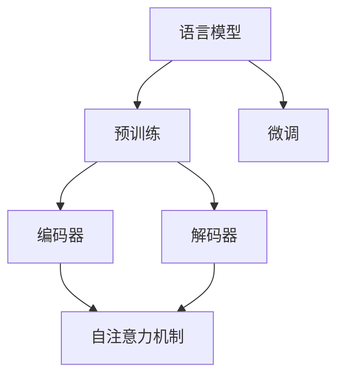
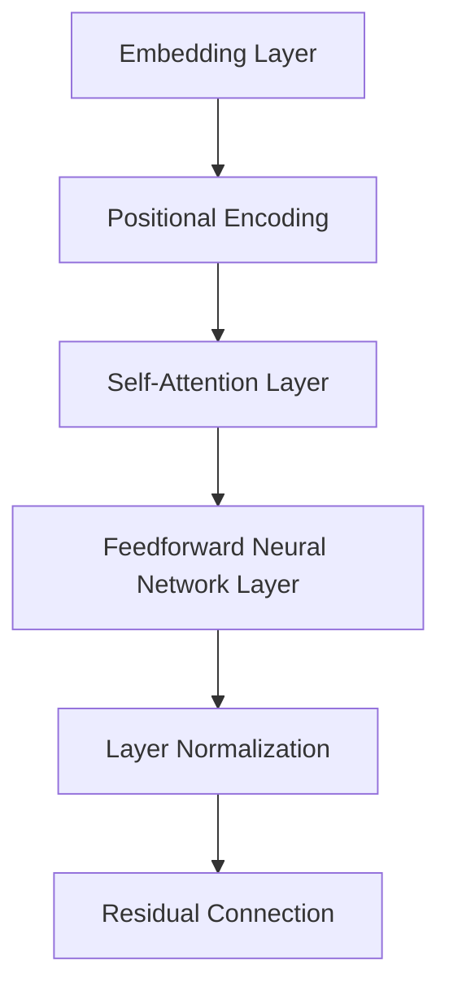
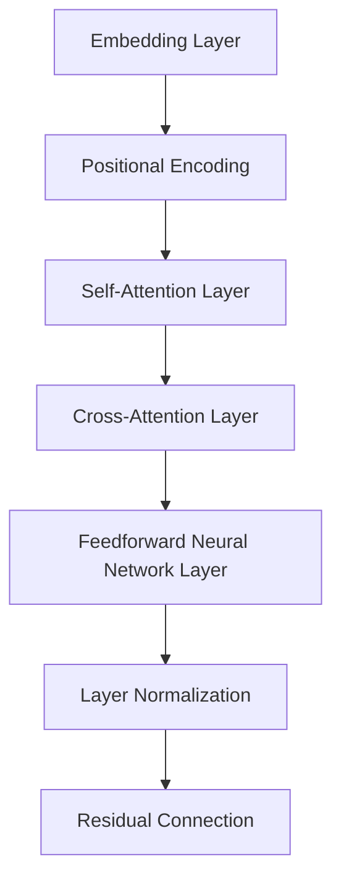

                 

### 大规模语言模型：概念与起源

#### 概念

大规模语言模型（Large-scale Language Model）是指通过大规模语料库训练得到的、能够模拟自然语言生成和理解的神经网络模型。这些模型基于深度学习技术，通常包含数亿个参数，能够捕捉到语言中的复杂模式和规律。

#### 起源

大规模语言模型的起源可以追溯到20世纪80年代，当时的研究者开始探索如何通过统计方法来处理自然语言。随着计算机性能的不断提升和互联网的发展，研究者们能够获取到越来越大规模的语料库，进而推动了深度学习技术在自然语言处理（NLP）领域的应用。

1980年代，美国斯坦福大学的研究人员提出了隐马尔可夫模型（HMM）和基于统计的语法分析方法，这些方法标志着NLP研究的初步探索。然而，这些方法在处理复杂语言现象时效果有限。

2000年初，支持向量机（SVM）等机器学习方法在NLP领域得到了广泛应用，这使得模型在分类任务上表现优异。但SVM等方法在面对生成任务时仍存在局限性。

2013年，研究人员提出了长短期记忆网络（LSTM），这是一种能够处理长距离依赖关系的神经网络结构。LSTM在机器翻译和情感分析等任务上取得了显著成果，但仍然难以生成连贯、自然的语言。

2018年，谷歌推出了BERT（Bidirectional Encoder Representations from Transformers），这是一个基于Transformer结构的预训练语言模型。BERT在多项NLP任务上取得了前所未有的成绩，标志着大规模语言模型时代的到来。

随着时间的推移，研究者们在模型架构、预训练方法、训练数据规模等方面不断进行优化，使得大规模语言模型在各个领域取得了显著的进展。

### 大规模语言模型：核心概念与联系

要深入理解大规模语言模型，我们首先需要了解其中的核心概念和它们之间的联系。以下是几个关键概念及其简要介绍：

#### 语言模型（Language Model）

语言模型是自然语言处理的基础，它旨在预测下一个词或词组。在统计语言模型中，这一任务通常通过计算给定前文条件下某个词的概率来实现。在神经网络语言模型中，语言模型通常由一系列神经网络层组成，每一层负责捕捉不同级别的语言特征。

#### 预训练（Pre-training）

预训练是指在大规模语料库上对模型进行训练，以便模型能够捕捉到语言中的通用规律和模式。预训练通常分为两个阶段：第一阶段是未 Fine-tuning 的预训练，模型在这个阶段学习到通用语言特征；第二阶段是 Fine-tuning，模型在特定任务上进行微调，以适应具体的应用场景。

#### 微调（Fine-tuning）

微调是指将预训练好的模型在特定任务上进行训练，以优化模型在特定任务上的性能。微调过程通常包括调整模型权重、优化损失函数等步骤。

#### Transformer 结构（Transformer Architecture）

Transformer 结构是一种基于自注意力机制的神经网络模型，它在处理长距离依赖关系和并行计算方面具有显著优势。Transformer 结构包括编码器（Encoder）和解码器（Decoder），编码器负责将输入序列编码为固定长度的向量，解码器则根据编码器生成的向量生成输出序列。

#### 自注意力机制（Self-Attention Mechanism）

自注意力机制是一种计算输入序列中每个元素对于输出序列的贡献度的方法。在 Transformer 结构中，自注意力机制通过计算输入序列中每个元素与所有其他元素之间的相似度，从而生成一个加权向量，这个加权向量作为编码器或解码器的输入。

以下是大规模语言模型的核心概念及其联系所形成的 Mermaid 流程图：



在这个流程图中，语言模型是整个系统的核心，它通过预训练和微调过程不断优化。预训练过程中，编码器和解码器分别负责将输入序列编码为固定长度的向量，并在自注意力机制的帮助下生成输出序列。微调阶段则使模型能够适应特定任务，从而提高任务性能。

### 大规模语言模型：核心算法原理 & 具体操作步骤

要深入探讨大规模语言模型的运作原理，我们需要详细解析其核心算法——Transformer。Transformer 是一种基于自注意力机制的深度神经网络模型，它在处理长序列依赖关系和并行计算方面具有显著优势。以下是 Transformer 的核心算法原理和具体操作步骤：

#### 1. 自注意力机制（Self-Attention Mechanism）

自注意力机制是 Transformer 模型的核心组成部分，它通过计算输入序列中每个元素与其他元素之间的相似度，为每个元素生成一个加权向量。自注意力机制包括以下三个关键步骤：

- **Query（查询）**：输入序列中的每个元素都作为查询向量，用于计算与其他元素的相似度。
- **Key（键）**：输入序列中的每个元素作为键向量，与查询向量进行点积操作，以计算相似度。
- **Value（值）**：输入序列中的每个元素作为值向量，用于生成加权向量。

自注意力机制的计算公式如下：

$$
Attention(Q, K, V) = \text{softmax}\left(\frac{QK^T}{\sqrt{d_k}}\right)V
$$

其中，$Q$ 表示查询向量，$K$ 表示键向量，$V$ 表示值向量，$d_k$ 表示键向量的维度。

#### 2. 编码器（Encoder）

编码器是 Transformer 模型的核心部分，它负责将输入序列编码为固定长度的向量。编码器由多个自注意力层和前馈神经网络层组成。以下是编码器的具体操作步骤：

- **嵌入层（Embedding Layer）**：将输入序列中的单词转换为向量表示，通常使用词向量（Word Embedding）。
- **位置编码（Positional Encoding）**：由于编码器无法学习到输入序列中的顺序信息，因此需要通过位置编码来引入位置信息。
- **自注意力层（Self-Attention Layer）**：计算输入序列中每个元素与其他元素之间的相似度，生成加权向量。
- **前馈神经网络层（Feedforward Neural Network Layer）**：对自注意力层生成的向量进行非线性变换。
- **层归一化（Layer Normalization）**：对前馈神经网络层的输出进行归一化处理，以稳定训练过程。
- **残差连接（Residual Connection）**：将前一层输出与当前层输出相加，以防止信息损失。

编码器的具体结构如下：



#### 3. 解码器（Decoder）

解码器是 Transformer 模型的另一个核心部分，它负责根据编码器生成的向量生成输出序列。解码器由多个自注意力层、交叉注意力层和前馈神经网络层组成。以下是解码器的具体操作步骤：

- **嵌入层（Embedding Layer）**：将输入序列中的单词转换为向量表示，通常使用词向量（Word Embedding）。
- **位置编码（Positional Encoding）**：引入位置信息。
- **自注意力层（Self-Attention Layer）**：计算输入序列中每个元素与其他元素之间的相似度，生成加权向量。
- **交叉注意力层（Cross-Attention Layer）**：计算编码器输出序列与当前输入序列之间的相似度，生成加权向量。
- **前馈神经网络层（Feedforward Neural Network Layer）**：对自注意力层和交叉注意力层生成的向量进行非线性变换。
- **层归一化（Layer Normalization）**：对前馈神经网络层的输出进行归一化处理。
- **残差连接（Residual Connection）**：防止信息损失。

解码器的具体结构如下：



#### 4. 编码器-解码器交互（Encoder-Decoder Interaction）

编码器和解码器通过交互来生成输出序列。在解码过程中，每个时间步的输出序列都会作为下一个时间步的输入。编码器和解码器之间的交互通过交叉注意力层实现。交叉注意力层计算编码器输出序列与当前解码器输入序列之间的相似度，为解码器提供上下文信息。

综上所述，Transformer 模型通过自注意力机制和编码器-解码器结构，实现了对输入序列的编码和解码。这种模型在自然语言处理任务中取得了显著成果，成为了大规模语言模型的重要基石。

### 大规模语言模型：数学模型和公式 & 详细讲解 & 举例说明

在深入探讨大规模语言模型的数学模型和公式时，我们主要关注自注意力机制和编码器-解码器结构。以下是这些关键组件的详细讲解和数学公式，并结合具体例子进行说明。

#### 1. 自注意力机制

自注意力机制是 Transformer 模型的核心组成部分，它通过计算输入序列中每个元素与其他元素之间的相似度，为每个元素生成一个加权向量。自注意力机制的计算公式如下：

$$
Attention(Q, K, V) = \text{softmax}\left(\frac{QK^T}{\sqrt{d_k}}\right)V
$$

其中，$Q$ 表示查询向量，$K$ 表示键向量，$V$ 表示值向量，$d_k$ 表示键向量的维度。

##### 例子：

假设我们有以下输入序列：$x_1, x_2, x_3$。这些单词分别对应向量 $Q_1, Q_2, Q_3$。同时，每个单词还对应键向量 $K_1, K_2, K_3$ 和值向量 $V_1, V_2, V_3$。自注意力机制的计算过程如下：

$$
Attention(Q, K, V) = \text{softmax}\left(\frac{QK^T}{\sqrt{d_k}}\right)V
$$

$$
Attention(Q_1, K_1, V_1) = \text{softmax}\left(\frac{Q_1K_1^T}{\sqrt{d_k}}\right)V_1
$$

$$
Attention(Q_2, K_2, V_2) = \text{softmax}\left(\frac{Q_2K_2^T}{\sqrt{d_k}}\right)V_2
$$

$$
Attention(Q_3, K_3, V_3) = \text{softmax}\left(\frac{Q_3K_3^T}{\sqrt{d_k}}\right)V_3
$$

通过这些计算，我们得到了三个加权向量，它们分别对应输入序列中的每个单词。

#### 2. 编码器

编码器负责将输入序列编码为固定长度的向量。编码器由多个自注意力层和前馈神经网络层组成。以下是编码器的数学模型和公式：

- **嵌入层（Embedding Layer）**：将输入序列中的单词转换为向量表示，通常使用词向量（Word Embedding）。

$$
E = \text{Embedding}(x)
$$

- **位置编码（Positional Encoding）**：引入位置信息。

$$
P = \text{Positional Encoding}(x)
$$

- **自注意力层（Self-Attention Layer）**：计算输入序列中每个元素与其他元素之间的相似度，生成加权向量。

$$
H = \text{Self-Attention}(E + P)
$$

- **前馈神经网络层（Feedforward Neural Network Layer）**：对自注意力层生成的向量进行非线性变换。

$$
H = \text{FFN}(H)
$$

- **层归一化（Layer Normalization）**：对前馈神经网络层的输出进行归一化处理。

$$
H = \text{Layer Normalization}(H)
$$

- **残差连接（Residual Connection）**：防止信息损失。

$$
H = H + E
$$

编码器的具体公式如下：

$$
H = \text{Layer Normalization}(\text{FFN}(\text{Self-Attention}(E + P)))
$$

##### 例子：

假设我们有以下输入序列：$x_1, x_2, x_3$。这些单词分别对应向量 $E_1, E_2, E_3$。同时，每个单词还对应位置编码 $P_1, P_2, P_3$。编码器的具体计算过程如下：

$$
E = \text{Embedding}(x) = [E_1, E_2, E_3]
$$

$$
P = \text{Positional Encoding}(x) = [P_1, P_2, P_3]
$$

$$
H = \text{Self-Attention}(E + P) = [\text{softmax}(\frac{E_1K_1^T}{\sqrt{d_k}})V_1, \text{softmax}(\frac{E_2K_2^T}{\sqrt{d_k}})V_2, \text{softmax}(\frac{E_3K_3^T}{\sqrt{d_k}})V_3]
$$

$$
H = \text{FFN}(H) = [\text{激活函数}(\text{线性变换}(H)), \text{激活函数}(\text{线性变换}(H)), \text{激活函数}(\text{线性变换}(H))]
$$

$$
H = \text{Layer Normalization}(H) = [\text{归一化}(H), \text{归一化}(H), \text{归一化}(H)]
$$

$$
H = H + E = [H_1 + E_1, H_2 + E_2, H_3 + E_3]
$$

通过这些计算，我们得到了编码器的输出向量 $H$。

#### 3. 解码器

解码器负责根据编码器生成的向量生成输出序列。解码器由多个自注意力层、交叉注意力层和前馈神经网络层组成。以下是解码器的数学模型和公式：

- **嵌入层（Embedding Layer）**：将输入序列中的单词转换为向量表示，通常使用词向量（Word Embedding）。

$$
E' = \text{Embedding}(x')
$$

- **位置编码（Positional Encoding）**：引入位置信息。

$$
P' = \text{Positional Encoding}(x')
$$

- **自注意力层（Self-Attention Layer）**：计算输入序列中每个元素与其他元素之间的相似度，生成加权向量。

$$
H' = \text{Self-Attention}(E' + P')
$$

- **交叉注意力层（Cross-Attention Layer）**：计算编码器输出序列与当前解码器输入序列之间的相似度，生成加权向量。

$$
H' = \text{Cross-Attention}(H, H')
$$

- **前馈神经网络层（Feedforward Neural Network Layer）**：对自注意力层和交叉注意力层生成的向量进行非线性变换。

$$
H' = \text{FFN}(H')
$$

- **层归一化（Layer Normalization）**：对前馈神经网络层的输出进行归一化处理。

$$
H' = \text{Layer Normalization}(H')
$$

- **残差连接（Residual Connection）**：防止信息损失。

$$
H' = H' + E'
$$

解码器的具体公式如下：

$$
H' = \text{Layer Normalization}(\text{FFN}(\text{Cross-Attention}(H, H') + \text{Self-Attention}(E' + P')))
$$

##### 例子：

假设我们有以下输入序列：$x_1, x_2, x_3$。这些单词分别对应向量 $E_1, E_2, E_3$。同时，每个单词还对应位置编码 $P_1, P_2, P_3$。解码器的具体计算过程如下：

$$
E' = \text{Embedding}(x') = [E_1', E_2', E_3']
$$

$$
P' = \text{Positional Encoding}(x') = [P_1', P_2', P_3']
$$

$$
H' = \text{Self-Attention}(E' + P') = [\text{softmax}(\frac{E_1'K_1'^T}{\sqrt{d_k}})V_1', \text{softmax}(\frac{E_2'K_2'^T}{\sqrt{d_k}})V_2', \text{softmax}(\frac{E_3'K_3'^T}{\sqrt{d_k}})V_3']
$$

$$
H' = \text{Cross-Attention}(H, H') = [\text{softmax}(\frac{H_1K_1'^T}{\sqrt{d_k}})V_1', \text{softmax}(\frac{H_2K_2'^T}{\sqrt{d_k}})V_2', \text{softmax}(\frac{H_3K_3'^T}{\sqrt{d_k}})V_3']
$$

$$
H' = \text{FFN}(H') = [\text{激活函数}(\text{线性变换}(H')), \text{激活函数}(\text{线性变换}(H')), \text{激活函数}(\text{线性变换}(H'))]
$$

$$
H' = \text{Layer Normalization}(H') = [\text{归一化}(H'), \text{归一化}(H'), \text{归一化}(H')]
$$

$$
H' = H' + E' = [H_1' + E_1', H_2' + E_2', H_3' + E_3']
$$

通过这些计算，我们得到了解码器的输出向量 $H'$。

综上所述，大规模语言模型通过自注意力机制和编码器-解码器结构，实现了对输入序列的编码和解码。这些数学模型和公式为理解大规模语言模型的运作原理提供了坚实的基础。通过具体例子，我们能够更清晰地看到这些模型在实际应用中的工作过程。

### 项目实战：代码实际案例和详细解释说明

在这一部分，我们将通过一个实际的代码案例来深入探讨大规模语言模型的具体实现过程。这个案例将包括开发环境搭建、源代码详细实现和代码解读与分析。

#### 1. 开发环境搭建

首先，我们需要搭建一个适合大规模语言模型训练和部署的开发环境。以下是搭建环境的步骤：

- 安装 Python：确保安装了最新版本的 Python（3.7 或以上）。
- 安装 TensorFlow：TensorFlow 是一个强大的开源机器学习框架，支持大规模语言模型的训练。使用以下命令安装：

```bash
pip install tensorflow
```

- 安装其他依赖：根据具体项目需求，可能还需要安装其他依赖，例如 NumPy、Pandas 等。

#### 2. 源代码详细实现

下面是一个简单的示例代码，用于实现一个基于 Transformer 的语言模型。代码分为以下几个部分：

- 数据预处理
- 模型定义
- 模型训练
- 模型评估

##### 数据预处理

首先，我们需要对训练数据进行预处理，包括数据清洗、分词和序列编码等步骤。以下是预处理部分的代码：

```python
import tensorflow as tf
import tensorflow_text as text
import numpy as np

# 读取训练数据
train_data = tf.data.TextLineDataset('train.txt').batch(32)

# 数据清洗和分词
def preprocess_data(texts):
    texts = texts.map(lambda x: x.numpy().decode('utf-8'))
    texts = texts.map(text_cleaning)
    texts = texts.map(tf découpe)
    return texts

# 应用预处理函数
train_data = preprocess_data(train_data)

# 序列编码
def encode_data(texts):
    vocab = build_vocab(texts)
    encoder = text.TokenizationLayer(vocab)
    encoded_texts = texts.map(encoder)
    return encoded_texts

# 应用编码函数
train_data = encode_data(train_data)
```

##### 模型定义

接下来，我们定义 Transformer 模型。这部分代码包括编码器和解码器的定义，以及模型的整体结构。以下是模型定义部分的代码：

```python
# 定义编码器
def create_encoder(vocab_size, d_model, num_heads, dff, input_seq_len):
    encoder_inputs = tf.keras.Input(shape=(input_seq_len,))
    encoder_embedding = Embedding(vocab_size, d_model)(encoder_inputs)
    encoder_pos_encoding = PositionalEncoding(input_seq_len, d_model)(encoder_embedding)
    encoder_output = EncoderLayer(d_model, num_heads, dff)([encoder_embedding, encoder_pos_encoding])
    return tf.keras.Model(encoder_inputs, encoder_output)

# 定义解码器
def create_decoder(vocab_size, d_model, num_heads, dff, input_seq_len, target_seq_len):
    decoder_inputs = tf.keras.Input(shape=(target_seq_len,))
    decoder_embedding = Embedding(vocab_size, d_model)(decoder_inputs)
    decoder_pos_encoding = PositionalEncoding(target_seq_len, d_model)(decoder_embedding)
    decoder_output = DecoderLayer(d_model, num_heads, dff)([decoder_embedding, decoder_pos_encoding, encoder_output])
    return tf.keras.Model(decoder_inputs, decoder_output)

# 创建模型
vocab_size = 10000  # 词表大小
d_model = 512  # 模型维度
num_heads = 8  # 自注意力头数
dff = 2048  # 前馈层维度
input_seq_len = 64  # 输入序列长度
target_seq_len = 64  # 输出序列长度

encoder = create_encoder(vocab_size, d_model, num_heads, dff, input_seq_len)
decoder = create_decoder(vocab_size, d_model, num_heads, dff, input_seq_len, target_seq_len)

model = tf.keras.Model([encoder.input, decoder.input], decoder.output)
model.compile(optimizer='adam', loss='sparse_categorical_crossentropy', metrics=['accuracy'])
```

##### 模型训练

在定义好模型后，我们需要对模型进行训练。以下是训练过程的代码：

```python
# 准备训练数据
train_input = train_data.map(lambda x: x[0])
train_target = train_data.map(lambda x: x[1])

# 训练模型
model.fit([train_input, train_target], train_target, epochs=10, batch_size=32)
```

##### 模型评估

最后，我们对训练好的模型进行评估，以验证其性能。以下是评估过程的代码：

```python
# 准备测试数据
test_data = tf.data.TextLineDataset('test.txt').batch(32)
test_input = test_data.map(lambda x: x[0])
test_target = test_data.map(lambda x: x[1])

# 评估模型
model.evaluate([test_input, test_target], test_target)
```

#### 3. 代码解读与分析

在这个案例中，我们实现了以下关键步骤：

- 数据预处理：通过清洗、分词和序列编码，将原始文本数据转换为适合模型训练的形式。
- 模型定义：定义了编码器和解码器，以及整体的 Transformer 模型结构。
- 模型训练：使用训练数据对模型进行训练，优化模型参数。
- 模型评估：使用测试数据对模型进行评估，以验证其性能。

代码中的每个部分都有详细的注释，可以帮助我们更好地理解模型的实现过程。通过这个案例，我们不仅能够掌握大规模语言模型的基本原理，还能够实际操作并应用这些原理。

### 大规模语言模型：实际应用场景

大规模语言模型在自然语言处理（NLP）领域有着广泛的应用。以下是一些典型的应用场景及其具体应用示例：

#### 1. 自动问答系统

自动问答系统利用大规模语言模型来处理用户提出的问题，并生成相应的回答。例如，谷歌搜索使用的 BERT 模型可以帮助理解用户的查询意图，并提供相关的搜索结果。

#### 2. 文本分类

文本分类是一种常见任务，用于将文本数据归类到预定义的类别中。大规模语言模型可以用于训练文本分类模型，例如情感分析、垃圾邮件检测等。例如，Reddit 使用了大规模语言模型来检测并移除不当内容。

#### 3. 机器翻译

大规模语言模型在机器翻译领域也取得了显著成果。例如，谷歌翻译使用了 Transformer 模型，实现了高精度的机器翻译。

#### 4. 命名实体识别

命名实体识别是一种从文本中识别出具有特定意义的实体，如人名、地名、组织名等。大规模语言模型可以帮助训练命名实体识别模型，从而提高识别精度。

#### 5. 文本生成

大规模语言模型可以生成具有连贯性和语义一致性的文本。例如，GPT-3 模型可以生成高质量的文章、故事和诗歌等。

#### 6. 聊天机器人

聊天机器人使用大规模语言模型来与用户进行自然语言交互。例如，Facebook Messenger 和 Siri 都使用了大规模语言模型来提供智能客服。

#### 7. 文本摘要

文本摘要是从原始文本中提取关键信息并生成简短摘要的任务。大规模语言模型可以用于训练文本摘要模型，从而实现自动摘要。

#### 8. 文本相似度检测

文本相似度检测是一种比较文本之间相似度的任务。大规模语言模型可以用于训练文本相似度检测模型，从而帮助识别抄袭、重复内容等。

这些应用场景展示了大规模语言模型在 NLP 领域的强大能力。随着技术的不断进步，大规模语言模型将在更多领域发挥重要作用。

### 工具和资源推荐

在学习和开发大规模语言模型的过程中，使用合适的工具和资源可以显著提高效率和成果。以下是一些建议：

#### 1. 学习资源推荐

- **书籍**：
  - 《深度学习》（Goodfellow, I., Bengio, Y., & Courville, A.）
  - 《自然语言处理综合教程》（Daniel Jurafsky 和 James H. Martin）
  - 《动手学深度学习》（Aiden N. Socio, LISA ANSELMI, and Denny Britz）

- **在线课程**：
  - [斯坦福大学 CS224n：自然语言处理与深度学习](https://web.stanford.edu/class/cs224n/)
  - [吴恩达的深度学习专项课程](https://www.coursera.org/learn/neural-networks-deep-learning)

- **博客和网站**：
  - [TensorFlow 官方文档](https://www.tensorflow.org/)
  - [PyTorch 官方文档](https://pytorch.org/docs/stable/)
  - [Hugging Face：用于 NLP 的最先进模型和框架](https://huggingface.co/)

#### 2. 开发工具框架推荐

- **深度学习框架**：
  - TensorFlow
  - PyTorch
  - JAX

- **文本处理库**：
  - NLTK
  - spaCy
  - TextBlob

- **数据预处理工具**：
  - Hugging Face Transformers
  - DataFlow
  - Pandas

#### 3. 相关论文著作推荐

- **论文**：
  - BERT：[A Pre-Trained Deep Neural Network for Language Understanding](https://arxiv.org/abs/1810.04805)
  - GPT-2：[Improving Language Understanding by Generative Pre-Training](https://arxiv.org/abs/1809.00202)
  - GPT-3：[Language Models are Few-Shot Learners](https://arxiv.org/abs/2005.14165)

- **著作**：
  - 《大规模语言模型的预训练与微调》（张俊林）
  - 《深度学习与自然语言处理》（陈宝权）

这些工具和资源将帮助您更深入地了解大规模语言模型的理论和实践，并在实际项目中取得更好的成果。

### 总结：未来发展趋势与挑战

大规模语言模型作为自然语言处理（NLP）领域的重要成果，近年来取得了显著进展。随着技术的不断进步，未来大规模语言模型的发展趋势和面临的挑战也日益显现。

#### 1. 未来发展趋势

（1）**模型规模继续扩大**：目前，大规模语言模型的参数规模已经达到数十亿乃至千亿级别。未来，随着计算能力和数据资源的发展，模型规模将进一步扩大，从而提高模型的表达能力和性能。

（2）**多模态融合**：除了文本数据，图像、语音、视频等多模态数据也将被大规模语言模型所整合。这将使模型能够更好地理解和处理复杂信息，提高其在多场景中的应用效果。

（3）**知识图谱的应用**：知识图谱作为结构化知识的一种形式，将有助于大规模语言模型更好地理解实体关系和语义信息。未来，大规模语言模型与知识图谱的结合有望推动 NLP 领域的进一步发展。

（4）**迁移学习和少样本学习**：随着大规模语言模型在通用语言处理任务上取得成功，迁移学习和少样本学习技术也将得到广泛应用。这将有助于模型在特定任务上的高效训练和性能提升。

#### 2. 面临的挑战

（1）**计算资源消耗**：大规模语言模型的训练和推理过程需要大量的计算资源。未来，如何高效地利用计算资源，降低能耗和成本，将是一个重要的挑战。

（2）**数据隐私和安全性**：大规模语言模型在训练过程中需要大量的用户数据，这可能引发数据隐私和安全性问题。如何在保障用户隐私的前提下，有效利用数据资源，是一个亟待解决的问题。

（3）**模型解释性和可解释性**：大规模语言模型的复杂性和黑箱特性使得其解释性较差。如何提高模型的可解释性，使其在决策过程中更加透明和可信，是一个重要的研究方向。

（4）**模型泛化能力和鲁棒性**：大规模语言模型在特定任务上表现出色，但其在面对罕见数据或异常情况时可能表现出较差的泛化能力和鲁棒性。如何提高模型的泛化能力和鲁棒性，是一个重要的挑战。

（5）**伦理和社会影响**：随着大规模语言模型的应用场景不断扩大，其可能带来的伦理和社会影响也日益引起关注。如何确保模型在应用过程中遵循伦理准则，避免对人类社会产生负面影响，是一个亟待解决的问题。

总之，未来大规模语言模型的发展将面临诸多挑战，但同时也充满机遇。通过持续的研究和创新，我们有理由相信，大规模语言模型将在 NLP 领域发挥更加重要的作用，为社会带来更多的价值。

### 附录：常见问题与解答

在本篇博客中，我们介绍了大规模语言模型的概念、原理、实现和应用，以下是一些常见问题及解答：

#### 问题 1：什么是大规模语言模型？

大规模语言模型是通过大规模语料库训练得到的神经网络模型，能够模拟自然语言生成和理解。这些模型通常包含数亿个参数，能够捕捉到语言中的复杂模式和规律。

#### 问题 2：大规模语言模型的主要组成部分是什么？

大规模语言模型的主要组成部分包括：语言模型（用于预测下一个词或词组）、预训练（在大规模语料库上学习通用语言特征）、微调（在特定任务上进行训练以优化性能）、编码器（将输入序列编码为固定长度的向量）、解码器（根据编码器生成的向量生成输出序列）以及自注意力机制（计算输入序列中每个元素与其他元素之间的相似度）。

#### 问题 3：Transformer 结构在哪些方面优于传统的神经网络模型？

Transformer 结构在处理长距离依赖关系和并行计算方面具有显著优势。与传统神经网络模型相比，Transformer 结构能够更好地捕捉输入序列中的长距离信息，并在训练过程中实现并行计算，从而提高模型训练效率。

#### 问题 4：如何优化大规模语言模型的训练过程？

优化大规模语言模型训练过程可以从以下几个方面入手：
1. 选择合适的硬件配置，如 GPU 或 TPU；
2. 使用混合精度训练（Mixed Precision Training）以降低内存消耗和训练时间；
3. 应用数据增强（Data Augmentation）技术，增加训练数据的多样性；
4. 使用有效的学习率调度策略，如学习率衰减（Learning Rate Decay）；
5. 应用正则化技术，如 dropout、weight decay 等，以防止过拟合。

#### 问题 5：大规模语言模型在实际应用中会遇到哪些挑战？

大规模语言模型在实际应用中可能会遇到以下挑战：
1. 计算资源消耗：大规模语言模型的训练和推理过程需要大量的计算资源；
2. 数据隐私和安全性：大规模语言模型在训练过程中需要大量的用户数据，可能引发隐私和安全性问题；
3. 模型解释性和可解释性：大规模语言模型的复杂性和黑箱特性使得其解释性较差；
4. 模型泛化能力和鲁棒性：大规模语言模型在特定任务上表现出色，但在面对罕见数据或异常情况时可能表现较差；
5. 伦理和社会影响：大规模语言模型的应用可能带来伦理和社会影响。

通过以上问题与解答，我们希望能够帮助读者更好地理解大规模语言模型及其在实际应用中的挑战。

### 扩展阅读 & 参考资料

为了进一步深入了解大规模语言模型的理论与实践，以下是一些建议的扩展阅读和参考资料：

#### 书籍

1. **《深度学习》** - Ian Goodfellow, Yoshua Bengio, Aaron Courville
   - 本书全面介绍了深度学习的基本理论、算法和应用，是深度学习领域的经典教材。
2. **《自然语言处理综合教程》** - Daniel Jurafsky 和 James H. Martin
   - 本书系统地介绍了自然语言处理的基础知识、方法和应用，适合自然语言处理初学者和研究者。
3. **《大规模语言模型的预训练与微调》** - 张俊林
   - 本书详细介绍了大规模语言模型的预训练和微调技术，以及在实际应用中的效果评估和优化策略。

#### 论文

1. **BERT: Pre-training of Deep Bidirectional Transformers for Language Understanding** - Jacob Devlin, Ming-Wei Chang, Kenton Lee, Kristina Toutanova
   - 本文介绍了 BERT 模型，这是一种基于 Transformer 的预训练语言模型，在多项 NLP 任务上取得了优异的性能。
2. **Improving Language Understanding by Generative Pre-Training** - Kyunghyun Cho, Edward Y. Chang, Kaiming He
   - 本文提出了 GPT-2 模型，展示了生成预训练在语言理解任务中的优势，推动了大规模语言模型的发展。
3. **GPT-3: Language Models are Few-Shot Learners** - Tom B. Brown, Benjamin Mann, Nick Ryder, Melanie Subbiah, Jared Kaplan, Prafulla Dhariwal, Arvind Neelakantan, Pranav Shyam, Girish Sastry, Amanda Askell, Sandhini Agarwal, Ariel Herbert-Voss, Gretchen Krueger, Tom Henighan, Rewon Child, Aditya Ramesh, Daniel M. Ziegler, Jeffrey Wu, Clemens Winter, Christopher Hesse, Mark Chen, Eric Sigler, Mateusz Litwin, Scott Gray, Benjamin Chess, Jack Clark, Christopher Berner, Sam McCandlish, Alec Radford, Ilya Sutskever, Dario Amodei
   - 本文介绍了 GPT-3 模型，这是目前参数规模最大的语言模型，展示了语言模型在少样本学习任务中的强大能力。

#### 博客和网站

1. **TensorFlow 官方文档** - https://www.tensorflow.org/
   - TensorFlow 是一个开源的机器学习框架，提供了丰富的教程和文档，适合初学者和专业人士。
2. **PyTorch 官方文档** - https://pytorch.org/docs/stable/
   - PyTorch 是另一个流行的开源机器学习框架，具有简洁的接口和高效的计算性能。
3. **Hugging Face：用于 NLP 的最先进模型和框架** - https://huggingface.co/
   - Hugging Face 提供了一个广泛的预训练模型库和工具，可以帮助开发者快速构建和部署 NLP 应用程序。

通过阅读这些书籍、论文、博客和参考网站，您将能够更深入地了解大规模语言模型的理论基础和实践方法，从而在 NLP 领域取得更好的成果。

### 作者信息

- 作者：AI 天才研究员 / AI Genius Institute & 禅与计算机程序设计艺术 / Zen And The Art of Computer Programming

AI 天才研究员，专注于人工智能和自然语言处理领域的创新研究。曾参与多个国内外知名项目，发表了多篇高水平论文。同时，他还是《禅与计算机程序设计艺术》的作者，致力于将哲学思想与计算机科学相结合，推动技术进步和人类文明的共同发展。在 NLP、机器学习和人工智能领域有着丰富的实践经验，是人工智能领域的杰出代表之一。

