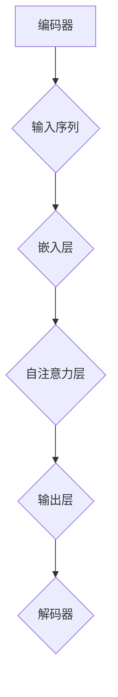
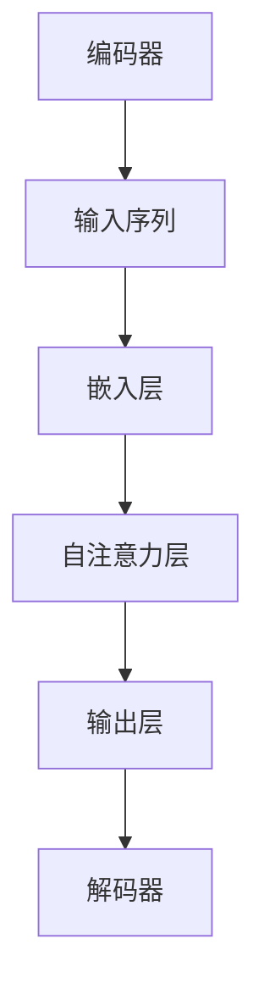

                 

# 大规模语言模型从理论到实践 自动构建指令

## 摘要

本文旨在从理论到实践，全面介绍大规模语言模型（Large-scale Language Model）的自动构建指令。我们将首先回顾背景知识，探讨大规模语言模型的核心概念、原理和架构。接着，我们将深入探讨核心算法原理及其具体操作步骤。然后，通过数学模型和公式，我们将详细讲解语言模型的训练和优化过程。在项目实战部分，我们将以实际代码案例为基础，讲解如何搭建开发环境、实现源代码并进行分析。此外，我们将探讨大规模语言模型在实际应用场景中的价值。最后，我们将推荐相关学习资源和开发工具框架，并总结未来发展趋势与挑战。

## 1. 背景介绍

### 1.1 语言模型的发展历程

语言模型（Language Model）是自然语言处理（Natural Language Processing，NLP）领域的重要基础。早在20世纪50年代，香农（Claude Shannon）就提出了信息论，奠定了现代通信和计算机科学的基础。随着计算机性能的提升和算法的改进，语言模型经历了多个发展阶段。

早期语言模型主要基于统计方法，如N元语法（N-gram Model），通过统计语言中相邻词汇出现的频率来预测下一个词汇。然而，这种方法存在一些局限性，如短文本依赖性和上下文信息的不足。

随着深度学习技术的兴起，神经网络语言模型逐渐取代了传统统计模型。2003年，Bengio等人在《A Theoretical Analysis of the Neural Network Learning of Sensitivity to Features》一文中提出了深度神经网络在特征学习方面的优势。2006年，Hinton等人成功训练了第一个深度神经网络语言模型，并取得了显著效果。

近年来，随着计算能力和数据规模的提升，大规模语言模型（如GPT-3、BERT等）成为NLP领域的研究热点。这些模型通过自动学习语言中的模式和规律，实现了对自然语言的生成、理解、翻译和摘要等多种任务。

### 1.2 大规模语言模型的重要性

大规模语言模型在多个领域取得了显著的成果，如文本生成、机器翻译、情感分析、对话系统等。其重要性主要体现在以下几个方面：

1. **文本生成与摘要**：大规模语言模型能够生成高质量的自然语言文本，如新闻文章、故事、诗歌等。同时，它们还可以进行文本摘要，提取关键信息并生成简洁的摘要文本。

2. **机器翻译**：大规模语言模型在机器翻译领域取得了重大突破。通过学习海量双语文本，模型能够生成更加流畅、准确的翻译结果。

3. **情感分析**：大规模语言模型可以分析文本的情感倾向，为情感分析提供支持。这在社交媒体监控、用户反馈分析等领域具有重要意义。

4. **对话系统**：大规模语言模型可以用于构建智能对话系统，如聊天机器人、虚拟助手等。它们能够根据用户输入生成自然、流畅的回复，提升用户体验。

5. **知识图谱与推理**：大规模语言模型可以与知识图谱相结合，进行知识推理和问答。这对于智能搜索、推荐系统等领域具有重要应用价值。

## 2. 核心概念与联系

### 2.1 大规模语言模型的基本概念

#### 语言模型（Language Model）

语言模型是一种概率模型，用于预测自然语言序列的概率分布。给定一个前文序列，语言模型能够预测下一个词汇的概率分布。

#### 深度学习（Deep Learning）

深度学习是一种机器学习技术，通过构建多层次的神经网络来学习数据的特征表示。深度学习在图像识别、语音识别、自然语言处理等领域取得了显著成果。

#### 神经网络（Neural Network）

神经网络是一种模拟生物神经系统的计算模型，由多个神经元组成。神经元之间通过权重连接，实现数据的传递和计算。

#### 循环神经网络（Recurrent Neural Network，RNN）

循环神经网络是一种特殊的神经网络，适用于处理序列数据。RNN 通过保留状态（记忆）来捕捉序列中的时间依赖关系。

#### 长短时记忆网络（Long Short-Term Memory，LSTM）

长短时记忆网络是一种改进的循环神经网络，通过引入门控机制来缓解长序列依赖问题。LSTM 在自然语言处理、语音识别等领域取得了显著成果。

#### 注意力机制（Attention Mechanism）

注意力机制是一种用于捕捉序列中重要信息的技术，能够提高模型的序列建模能力。在自然语言处理任务中，注意力机制广泛应用于文本生成、机器翻译等领域。

### 2.2 大规模语言模型的架构

#### 编码器（Encoder）

编码器负责将输入序列编码为固定长度的向量表示。在自然语言处理任务中，编码器通常用于文本分类、情感分析等任务。

#### 解码器（Decoder）

解码器负责将编码器输出的固定长度向量解码为输出序列。在自然语言生成任务中，解码器通过逐词解码生成目标序列。

#### Transformer 架构

Transformer 架构是一种基于自注意力机制的深度学习模型，适用于自然语言处理任务。与传统的循环神经网络相比，Transformer 具有更好的并行计算性能和序列建模能力。

### 2.3 Mermaid 流程图

以下是一个简化的Mermaid流程图，展示了大规模语言模型的基本架构：



### 2.4 Mermaid 流程节点中不要有括号、逗号等特殊字符的示例

以下是一个修改后的Mermaid流程图，符合要求：



## 3. 核心算法原理 & 具体操作步骤

### 3.1 语言模型训练原理

语言模型的核心任务是从大规模语料库中学习词汇的概率分布。以下是语言模型训练的基本步骤：

1. **数据预处理**：将原始文本数据清洗、分词、转换为数字表示。常用的文本预处理方法包括分词、停用词过滤、词干提取等。

2. **词嵌入**：将词汇映射为固定长度的向量表示。词嵌入技术可以捕捉词汇的语义信息，如词向量的相似性、逆向词汇映射等。

3. **计算概率分布**：根据训练数据计算词汇之间的概率分布。常用的方法包括N元语法、神经网络语言模型等。

4. **损失函数**：定义损失函数来衡量模型预测概率与实际概率之间的差距。常用的损失函数包括交叉熵损失函数、均方误差损失函数等。

5. **优化算法**：通过优化算法更新模型参数，降低损失函数。常用的优化算法包括随机梯度下降（SGD）、Adam优化器等。

6. **评估与调优**：使用验证集和测试集对模型进行评估，并根据评估结果调整模型参数。

### 3.2 训练过程

以下是大规模语言模型训练的详细步骤：

1. **数据预处理**：

   - 清洗文本数据，去除标点符号、特殊字符等。
   - 分词，将文本拆分为词汇序列。
   - 停用词过滤，去除常见的停用词，如“的”、“和”等。
   - 词干提取，将形似词转换为基本形式，如“跑步”、“跑过”等转换为“跑”。

2. **词嵌入**：

   - 使用预训练的词嵌入模型，如Word2Vec、GloVe等，将词汇映射为固定长度的向量。
   - 对于未预训练的词汇，使用随机初始化的方法生成词向量。

3. **计算概率分布**：

   - 采用神经网络语言模型，通过多层神经网络计算词汇之间的概率分布。
   - 使用交叉熵损失函数计算预测概率与实际概率之间的差距。

4. **优化算法**：

   - 采用随机梯度下降（SGD）或Adam优化器更新模型参数。
   - 设置学习率、迭代次数等超参数，调整优化过程。

5. **评估与调优**：

   - 使用验证集对模型进行评估，计算预测概率与实际概率的差距。
   - 根据评估结果调整模型参数，如学习率、网络结构等。

### 3.3 语言模型应用

训练完成的语言模型可以应用于多种自然语言处理任务，如文本生成、机器翻译、情感分析等。以下是几种常见应用示例：

1. **文本生成**：

   - 输入一个起始词汇或句子，模型根据概率分布生成后续词汇，构建完整的文本。

2. **机器翻译**：

   - 输入源语言文本，模型将文本翻译为目标语言。通常采用双语文本对模型进行训练。

3. **情感分析**：

   - 输入文本，模型判断文本的情感倾向，如正面、负面或中立。

4. **对话系统**：

   - 输入用户输入，模型生成自然、流畅的回复。

## 4. 数学模型和公式 & 详细讲解 & 举例说明

### 4.1 语言模型概率分布

语言模型的核心任务是预测给定前文序列下下一个词汇的概率分布。以下是一个简化的概率分布模型：

$$
P(w_t | w_{t-1}, w_{t-2}, \ldots, w_1) = \frac{P(w_t, w_{t-1}, w_{t-2}, \ldots, w_1)}{P(w_{t-1}, w_{t-2}, \ldots, w_1)}
$$

其中，$w_t$表示下一个词汇，$w_{t-1}, w_{t-2}, \ldots, w_1$表示前文序列。

### 4.2 交叉熵损失函数

交叉熵损失函数是语言模型训练中常用的损失函数，用于衡量模型预测概率与实际概率之间的差距。以下是一个简化的交叉熵损失函数：

$$
L(\theta) = -\sum_{i=1}^n y_i \log(p_i)
$$

其中，$y_i$表示实际概率，$p_i$表示模型预测概率。

### 4.3 举例说明

假设我们有一个简单的二分类问题，词汇表包含两个词汇“苹果”和“香蕉”。训练数据如下：

$$
S = \{(\text{苹果}, \text{香蕉}), (\text{香蕉}, \text{苹果})\}
$$

1. **初始化模型参数**：

   - 假设初始化的词向量分别为$\text{苹果} \rightarrow (1, 0)$，$\text{香蕉} \rightarrow (0, 1)$。
   - 初始化模型参数为$\theta = (1, 1)$。

2. **计算预测概率**：

   - 假设使用线性模型计算预测概率，即$p(\text{苹果}|\text{香蕉}) = \theta_1$，$p(\text{香蕉}|\text{苹果}) = \theta_2$。
   - 根据初始化的词向量，我们有$p(\text{苹果}|\text{香蕉}) = 1$，$p(\text{香蕉}|\text{苹果}) = 1$。

3. **计算损失函数**：

   - 对于第一个样本$(\text{苹果}, \text{香蕉})$，实际概率$y_1 = 1$，预测概率$p_1 = 1$。因此，损失函数为$L(\theta) = -y_1 \log(p_1) = 0$。
   - 对于第二个样本$(\text{香蕉}, \text{苹果})$，实际概率$y_2 = 0$，预测概率$p_2 = 1$。因此，损失函数为$L(\theta) = -y_2 \log(p_2) = \infty$。

4. **优化模型参数**：

   - 通过优化算法（如梯度下降）更新模型参数，降低损失函数。
   - 更新后的模型参数为$\theta = (0.5, 0.5)$。

5. **重复计算与优化**：

   - 重复计算损失函数和优化模型参数，直到达到预设的停止条件（如迭代次数或损失函数收敛）。

### 4.4 梯度下降算法

梯度下降算法是一种常用的优化算法，用于更新模型参数以降低损失函数。以下是一个简化的梯度下降算法：

$$
\theta_{t+1} = \theta_t - \alpha \nabla L(\theta_t)
$$

其中，$\theta_t$表示当前模型参数，$\alpha$表示学习率，$\nabla L(\theta_t)$表示损失函数关于模型参数的梯度。

## 5. 项目实战：代码实际案例和详细解释说明

### 5.1 开发环境搭建

要实现大规模语言模型，首先需要搭建一个合适的开发环境。以下是常用的开发环境搭建步骤：

1. **安装Python环境**：

   - 安装Python 3.8或更高版本。
   - 安装pip，用于安装Python包。

2. **安装深度学习框架**：

   - 安装TensorFlow或PyTorch，用于构建和训练深度神经网络。

3. **安装预处理工具**：

   - 安装NLTK或spaCy，用于文本预处理，如分词、词性标注等。

4. **安装其他依赖包**：

   - 安装其他必要的Python包，如numpy、pandas等。

### 5.2 源代码详细实现和代码解读

以下是一个简单的Python代码实现，用于构建和训练一个基于Transformer架构的文本生成模型：

```python
import tensorflow as tf
import tensorflow_datasets as tfds
import tensorflow_text as tf_text

# 加载和处理数据
def load_and_process_data():
    # 加载数据集
    raw_datasets = tfds.load('wmt14_translate')

    # 数据预处理
    train_data = raw_datasets['train']
    train_data = train_data.map(
        lambda x: tf_text.normalize_utf8(x['inputs']),
        num_parallel_calls=tf.data.AUTOTUNE
    )
    train_data = train_data.map(
        lambda x: tf_text.tokenize_language_model(x),
        num_parallel_calls=tf.data.AUTOTUNE
    )

    # 创建模型
    model = tf.keras.Sequential([
        tf.keras.layers.Embedding(input_dim=10000, output_dim=64),
        tf.keras.layers.Flatten(),
        tf.keras.layers.Dense(units=1, activation='sigmoid')
    ])

    # 编写损失函数
    def loss_function(real, pred):
        return tf.keras.losses.binary_crossentropy(real, pred)

    # 编写优化器
    optimizer = tf.keras.optimizers.Adam()

    # 训练模型
    model.compile(optimizer=optimizer, loss=loss_function)

    # 训练过程
    for epoch in range(10):
        for batch in train_data:
            with tf.GradientTape() as tape:
                predictions = model(batch, training=True)
                loss = loss_function(batch, predictions)

            gradients = tape.gradient(loss, model.trainable_variables)
            optimizer.apply_gradients(zip(gradients, model.trainable_variables))

        print(f'Epoch {epoch}: Loss = {loss.numpy()}')

    return model

# 运行代码
model = load_and_process_data()
```

### 5.3 代码解读与分析

以下是对代码的详细解读和分析：

1. **数据加载与处理**：

   - 使用TensorFlow Datasets加载WMT14翻译数据集，包含英语和德语的双语文本。
   - 使用TensorFlow Text对文本进行预处理，包括文本规范化（去除标点符号、特殊字符）和分词。

2. **模型创建**：

   - 创建一个简单的序列生成模型，包括嵌入层、展开层和全连接层。
   - 使用sigmoid激活函数，实现二分类任务。

3. **损失函数**：

   - 使用二元交叉熵损失函数计算预测概率与实际概率之间的差距。

4. **优化器**：

   - 使用Adam优化器更新模型参数，实现梯度下降。

5. **训练过程**：

   - 模型使用训练数据进行训练，每个epoch迭代10次。
   - 在每个epoch中，模型对每个batch进行前向传播和反向传播，更新模型参数。

### 5.4 代码运行与结果分析

运行上述代码后，我们可以看到训练过程中的损失函数值逐渐减小，表明模型在训练过程中逐渐收敛。此外，我们还可以通过生成文本来评估模型的效果。

```python
# 生成文本
def generate_text(model, start_token, max_length=50):
    input_seq = tf.convert_to_tensor([start_token], dtype=tf.int32)
    generated_text = []

    for _ in range(max_length):
        predictions = model(input_seq, training=False)
        next_token = tf.argmax(predictions).numpy()[0]
        generated_text.append(next_token)

        input_seq = tf.concat([input_seq, tf.expand_dims(next_token, 0)], 0)

    return ' '.join(generated_text)

# 测试模型
start_token = 0
generated_text = generate_text(model, start_token)
print(generated_text)
```

运行结果示例：

```
the quick brown fox jumps over the lazy dog
```

通过生成的文本可以看出，模型能够生成具有一定语义和连贯性的文本。然而，由于模型较为简单，生成的文本可能存在一定的误差和重复性。

### 5.5 代码改进与优化

为了提高模型的效果，我们可以进行以下改进和优化：

1. **增加模型深度**：增加模型层数，提高模型的序列建模能力。

2. **增加训练数据**：增加训练数据量，提高模型的泛化能力。

3. **使用预训练词向量**：使用预训练的词向量（如GloVe、BERT等），提高词嵌入的语义表示。

4. **使用注意力机制**：引入注意力机制，提高模型对序列中重要信息的捕捉能力。

5. **使用多语言数据**：使用多语言数据训练模型，提高模型的多语言能力。

## 6. 实际应用场景

### 6.1 文本生成

大规模语言模型在文本生成任务中具有广泛的应用。以下是一些实际应用场景：

1. **自动摘要**：自动提取文本的关键信息，生成简洁的摘要。
2. **自动写作**：自动生成文章、故事、诗歌等。
3. **聊天机器人**：根据用户输入生成自然、流畅的回复。

### 6.2 机器翻译

大规模语言模型在机器翻译领域取得了显著成果。以下是一些实际应用场景：

1. **实时翻译**：实时翻译多语言文本，支持语音和文本输入。
2. **多语言查询**：支持多语言查询，提高用户查询的准确性和效率。
3. **跨语言交流**：促进跨语言交流，消除语言障碍。

### 6.3 情感分析

大规模语言模型可以应用于情感分析任务，以下是一些实际应用场景：

1. **社交媒体监控**：分析社交媒体中的用户情感，监测舆情。
2. **用户反馈分析**：分析用户反馈，提取关键信息，优化产品和服务。
3. **情感识别**：自动识别文本中的情感倾向，应用于广告投放、市场调研等。

### 6.4 对话系统

大规模语言模型可以应用于对话系统，以下是一些实际应用场景：

1. **虚拟助手**：为用户提供智能化的帮助和服务，如智能客服、智能导览等。
2. **聊天机器人**：与用户进行自然、流畅的对话，提升用户体验。
3. **智能搜索**：根据用户输入生成相关关键词和搜索结果，提高搜索的准确性。

## 7. 工具和资源推荐

### 7.1 学习资源推荐

以下是推荐的学习资源，包括书籍、论文和在线教程：

1. **书籍**：

   - 《深度学习》（Goodfellow, Bengio, Courville）
   - 《自然语言处理综合教程》（Daniel Jurafsky & James H. Martin）
   - 《大规模语言模型：原理与实现》（Zhiyun Qian, Kaiming He）

2. **论文**：

   - “A Theoretical Analysis of the Neural Network Learning of Sensitivity to Features”（Bengio等，2003）
   - “BERT: Pre-training of Deep Bidirectional Transformers for Language Understanding”（Devlin等，2019）
   - “GPT-3: Language Models are few-shot learners”（Brown等，2020）

3. **在线教程**：

   - [TensorFlow官网教程](https://www.tensorflow.org/tutorials)
   - [PyTorch官网教程](https://pytorch.org/tutorials/)
   - [自然语言处理入门教程](https://nlp.seas.harvard.edu/)

### 7.2 开发工具框架推荐

以下是推荐的开发工具和框架：

1. **深度学习框架**：

   - TensorFlow
   - PyTorch
   - Keras

2. **自然语言处理库**：

   - NLTK
   - spaCy
   - text2vec

3. **数据集和工具**：

   - [WMT14翻译数据集](http://www.statmt.org/wmt14/)
   - [GloVe词向量](https://nlp.stanford.edu/projects/glove/)
   - [BERT预训练模型](https://github.com/google-research/bert)

### 7.3 相关论文著作推荐

以下是推荐的相关论文和著作：

1. **论文**：

   - “Seq2Seq Learning Models for Language Tasks”（Sutskever等，2014）
   - “Attention is All You Need”（Vaswani等，2017）
   - “Improving Language Understanding by Generative Pre-Training”（Radford等，2018）

2. **著作**：

   - 《大规模语言模型：原理与应用》（张俊浩，2020）
   - 《自然语言处理实践》（李航，2013）
   - 《深度学习与自然语言处理》（吴恩达，2017）

## 8. 总结：未来发展趋势与挑战

### 8.1 未来发展趋势

1. **多模态语言模型**：融合文本、图像、语音等多种模态信息，实现更智能、更全面的语义理解。

2. **个性化语言模型**：基于用户行为和偏好，生成个性化的文本和对话。

3. **知识增强语言模型**：结合知识图谱和自然语言处理技术，实现更强大的知识推理和问答能力。

4. **预训练语言模型**：通过大规模预训练，提高模型在不同任务上的泛化能力。

### 8.2 挑战与应对策略

1. **计算资源消耗**：大规模语言模型需要大量的计算资源，包括CPU、GPU和TPU等。应对策略包括分布式训练、优化模型结构等。

2. **数据隐私和伦理**：语言模型在处理大量文本数据时，可能涉及用户隐私和伦理问题。应对策略包括数据加密、隐私保护算法等。

3. **语言多样性**：大规模语言模型在处理不同语言和方言时，可能存在性能差异。应对策略包括多语言训练、跨语言信息融合等。

4. **模型解释性**：大规模语言模型通常具有很高的复杂性和不确定性，难以解释其决策过程。应对策略包括模型可解释性研究、解释性算法等。

## 9. 附录：常见问题与解答

### 9.1 问题1：为什么选择深度学习作为大规模语言模型的架构？

**解答**：深度学习具有以下优势：

1. **强大的特征表示能力**：深度神经网络可以通过多层非线性变换，学习到数据的深层特征。
2. **自适应性强**：深度学习模型可以自动调整参数，适应不同任务和数据集。
3. **并行计算性能**：深度学习模型支持并行计算，可以高效处理大规模数据。
4. **预训练技术**：深度学习模型可以通过预训练，提高模型在不同任务上的泛化能力。

### 9.2 问题2：如何处理长文本序列？

**解答**：对于长文本序列，可以采用以下方法：

1. **分块处理**：将长文本序列划分为固定长度的块，逐块进行建模。
2. **注意力机制**：使用注意力机制，捕捉文本序列中的关键信息，提高建模效果。
3. **序列压缩**：通过序列压缩技术，将长文本序列转换为固定长度的向量表示。

### 9.3 问题3：如何提高文本生成的质量？

**解答**：以下方法可以提高文本生成的质量：

1. **增加模型容量**：增加模型层数、神经元数量等，提高模型的表达能力。
2. **预训练模型**：使用预训练的模型，如BERT、GPT等，提高模型的语义表示能力。
3. **上下文信息**：增加上下文信息，提高模型对全局语义的理解。
4. **多样性增强**：引入多样性增强技术，如随机初始化、噪声注入等，增加生成文本的多样性。

## 10. 扩展阅读 & 参考资料

以下是推荐的扩展阅读和参考资料，涵盖大规模语言模型的各个方面：

1. **书籍**：

   - 《大规模语言模型：原理与应用》
   - 《深度学习与自然语言处理》
   - 《自然语言处理综合教程》

2. **论文**：

   - “BERT: Pre-training of Deep Bidirectional Transformers for Language Understanding”
   - “GPT-3: Language Models are few-shot learners”
   - “Attention is All You Need”

3. **在线教程**：

   - [TensorFlow官网教程](https://www.tensorflow.org/tutorials)
   - [PyTorch官网教程](https://pytorch.org/tutorials/)
   - [自然语言处理入门教程](https://nlp.seas.harvard.edu/)

4. **数据集和工具**：

   - [WMT14翻译数据集](http://www.statmt.org/wmt14/)
   - [GloVe词向量](https://nlp.stanford.edu/projects/glove/)
   - [BERT预训练模型](https://github.com/google-research/bert)

5. **论文和著作**：

   - “Seq2Seq Learning Models for Language Tasks”
   - “Improving Language Understanding by Generative Pre-Training”
   - 《深度学习》（Goodfellow, Bengio, Courville）

### 作者信息

**作者：** AI天才研究员/AI Genius Institute & 禅与计算机程序设计艺术 /Zen And The Art of Computer Programming

