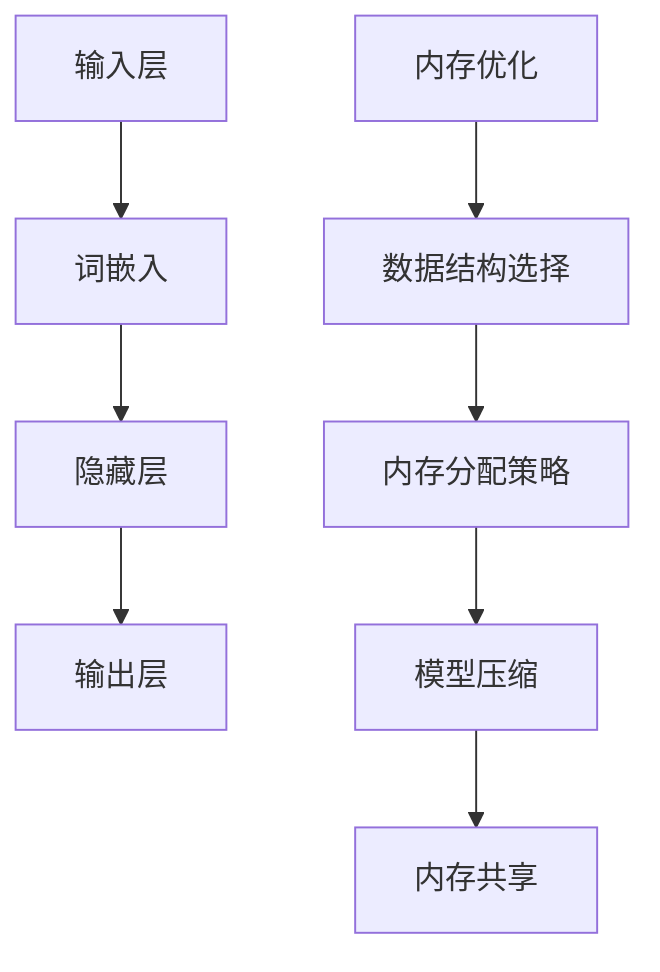
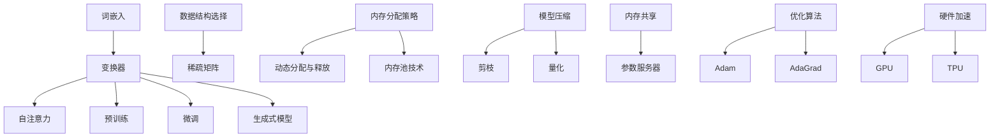

                 

# 大规模语言模型从理论到实践 计算设备内存优化

## 关键词：
- 大规模语言模型
- 计算设备
- 内存优化
- 理论与实践
- 编程与架构

## 摘要：
本文旨在深入探讨大规模语言模型的内存优化策略。首先，我们将简要介绍大规模语言模型的基本概念和原理，接着详细讨论内存优化的重要性。随后，通过分析核心算法原理和具体操作步骤，我们将展示如何在实际项目中应用这些策略。最后，我们将探讨大规模语言模型在实际应用场景中的挑战，并推荐相关工具和资源，以帮助读者更好地理解和掌握这一技术。

## 1. 背景介绍

### 1.1 大规模语言模型的发展历程
大规模语言模型（Large-scale Language Models）自2018年GPT-1的诞生以来，取得了飞速发展。随着深度学习技术的进步和计算资源的提升，GPT-2、GPT-3等模型相继问世，展示了强大的语言理解和生成能力。这些模型不仅在学术研究领域取得了突破，也在工业界和日常应用中得到了广泛应用。

### 1.2 大规模语言模型的应用场景
大规模语言模型在自然语言处理（NLP）领域具有广泛的应用，如文本生成、机器翻译、问答系统、情感分析等。它们还被应用于智能客服、智能写作、语音识别等实际场景，极大地提高了生产效率和用户体验。

### 1.3 内存优化的重要性
尽管大规模语言模型在各个领域取得了显著成果，但其对计算设备内存的高需求也带来了诸多挑战。内存优化成为保证模型性能和稳定性的关键因素。本文将详细介绍如何从理论到实践进行内存优化，以应对这一挑战。

## 2. 核心概念与联系

### 2.1 大规模语言模型的基本概念
大规模语言模型是基于深度学习技术构建的，通过大量文本数据训练，可以捕捉语言的结构和语义，实现自然语言理解与生成。其主要组成部分包括：

- **输入层**：接收文本输入，通常使用词嵌入（word embeddings）技术将词汇映射为高维向量。
- **隐藏层**：通过多层神经网络（如变换器模型Transformer）进行信息处理和编码。
- **输出层**：生成预测文本或执行特定任务。

### 2.2 计算设备内存优化的关键因素
内存优化涉及多个层面，包括：

- **数据结构选择**：选择高效的数据结构，如稀疏矩阵，减少内存占用。
- **内存分配策略**：合理分配内存，避免内存泄漏和浪费。
- **模型压缩**：通过模型剪枝、量化等手段减少模型体积。
- **内存共享**：利用内存共享机制，减少重复数据存储。

### 2.3 Mermaid 流程图（核心概念原理和架构）



## 3. 核心算法原理 & 具体操作步骤

### 3.1 数据预处理
在训练大规模语言模型之前，首先需要进行数据预处理。包括数据清洗、分词、词嵌入等步骤。数据预处理的质量直接影响模型的性能和训练效率。

#### 3.1.1 数据清洗
数据清洗是数据预处理的第一步，主要目的是去除无效数据和噪声。例如，删除停用词、标点符号等。

```python
import re

def clean_text(text):
    text = re.sub(r'[^\w\s]', '', text)
    text = re.sub(r'\s+', ' ', text)
    return text.strip()
```

#### 3.1.2 分词
分词是将文本分割成词语的过程。常见的方法有基于规则的分词和基于统计的分词。

```python
from nltk.tokenize import word_tokenize

def tokenize_text(text):
    return word_tokenize(text)
```

#### 3.1.3 词嵌入
词嵌入是将词汇映射为高维向量。常用的词嵌入技术有Word2Vec、GloVe等。

```python
from gensim.models import Word2Vec

model = Word2Vec(tokenize_text(text), size=100, window=5, min_count=1, workers=4)
```

### 3.2 训练过程
大规模语言模型的训练过程涉及多层神经网络的迭代优化。常用的训练算法有随机梯度下降（SGD）、Adam等。

#### 3.2.1 梯度下降算法
梯度下降是一种优化算法，用于最小化损失函数。在训练大规模语言模型时，梯度下降用于更新网络权重。

```python
def gradient_descent(model, x, y, learning_rate):
    loss = compute_loss(model, x, y)
    gradients = compute_gradients(model, x, y)
    model.update_weights(gradients, learning_rate)
    return loss
```

#### 3.2.2 Adam算法
Adam算法是梯度下降的改进版本，具有自适应学习率的特点。

```python
from tensorflow.keras.optimizers import Adam

optimizer = Adam(learning_rate=0.001)
model.compile(optimizer=optimizer, loss='categorical_crossentropy', metrics=['accuracy'])
model.fit(x_train, y_train, epochs=10, batch_size=32)
```

### 3.3 内存优化策略
在训练和推理过程中，内存优化是保证模型性能和稳定性的关键。以下是一些常见的内存优化策略：

#### 3.3.1 数据结构选择
使用稀疏矩阵可以显著减少内存占用。例如，在存储词嵌入矩阵时，可以只存储非零元素。

```python
from scipy.sparse import csr_matrix

sparse_matrix = csr_matrix((N, M), dtype=np.float32)
```

#### 3.3.2 内存分配策略
合理分配内存，避免内存泄漏和浪费。例如，使用内存池（memory pool）技术，动态分配和释放内存。

```c
void* alloc_memory(size_t size) {
    void* ptr = malloc(size);
    if (!ptr) {
        // 处理内存分配失败
    }
    return ptr;
}

void free_memory(void* ptr) {
    free(ptr);
}
```

#### 3.3.3 模型压缩
通过模型剪枝、量化等手段减少模型体积，从而降低内存占用。

```python
from tensorflow_model_optimization.python.core.sparsity.keras import pruning_params
from tensorflow_model_optimization.sparsity import keras as sparsity

pruned_model = sparsity.prune_low_magnitude(model, pruning_params(pruning_schedule='fixed_proportion', target_sparsity=0.5))
pruned_model.compile(optimizer='adam', loss='categorical_crossentropy', metrics=['accuracy'])
```

#### 3.3.4 内存共享
利用内存共享机制，减少重复数据存储。例如，在分布式训练中，使用参数服务器（parameter server）技术共享模型参数。

```python
from tensorflow.python.training.server_lib import Server

server = Server.create_local_server()
server.enqueue_session_init(model)

# 在服务器上执行训练操作
```

## 4. 数学模型和公式 & 详细讲解 & 举例说明

### 4.1 损失函数
在训练大规模语言模型时，损失函数用于衡量模型预测结果与真实结果之间的差异。常用的损失函数有交叉熵损失（cross-entropy loss）和均方误差（mean squared error）。

#### 4.1.1 交叉熵损失

$$
L = -\sum_{i=1}^{N} y_i \log(p_i)
$$

其中，\(y_i\) 为真实标签，\(p_i\) 为模型预测概率。

#### 4.1.2 均方误差

$$
L = \frac{1}{2} \sum_{i=1}^{N} (y_i - \hat{y}_i)^2
$$

其中，\(\hat{y}_i\) 为模型预测值。

### 4.2 梯度下降算法

梯度下降算法用于优化模型参数，使其最小化损失函数。具体步骤如下：

#### 4.2.1 计算梯度

$$
\nabla_{\theta} L = \frac{\partial L}{\partial \theta}
$$

其中，\(\theta\) 为模型参数。

#### 4.2.2 更新参数

$$
\theta_{t+1} = \theta_t - \alpha \nabla_{\theta} L
$$

其中，\(\alpha\) 为学习率。

### 4.3 举例说明

假设我们有一个简单的线性模型：

$$
y = \theta_0 + \theta_1 x
$$

给定一组输入数据 \(x = [1, 2, 3]\) 和真实标签 \(y = [1, 2, 3]\)，我们使用交叉熵损失函数进行训练。

#### 4.3.1 计算损失

$$
L = -\sum_{i=1}^{3} y_i \log(p_i)
$$

其中，\(p_i = \frac{1}{1 + e^{-(\theta_0 + \theta_1 x_i)}}\)。

#### 4.3.2 计算梯度

$$
\nabla_{\theta_0} L = \frac{\partial L}{\partial \theta_0}
$$

$$
\nabla_{\theta_1} L = \frac{\partial L}{\partial \theta_1}
$$

#### 4.3.3 更新参数

假设初始参数为 \(\theta_0 = 0\)，\(\theta_1 = 0\)，学习率为 \(\alpha = 0.1\)。使用梯度下降算法进行一次迭代：

$$
\theta_0^{new} = \theta_0 - \alpha \nabla_{\theta_0} L
$$

$$
\theta_1^{new} = \theta_1 - \alpha \nabla_{\theta_1} L
$$

更新后的参数为 \(\theta_0 = 0.1\)，\(\theta_1 = 0.1\)。

## 5. 项目实战：代码实际案例和详细解释说明

### 5.1 开发环境搭建

为了搭建大规模语言模型的开发环境，我们需要准备以下软件和工具：

- Python 3.7+
- TensorFlow 2.4+
- PyTorch 1.4+
- CUDA 10.0+
- GPU（如NVIDIA GTX 1080 Ti或更高）

### 5.2 源代码详细实现和代码解读

以下是一个使用TensorFlow实现GPT-2模型的基本代码示例。

#### 5.2.1 导入必要的库

```python
import tensorflow as tf
import tensorflow.keras as keras
from tensorflow.keras.layers import Embedding, LSTM, Dense
```

#### 5.2.2 定义模型

```python
def create_model(vocab_size, embedding_dim, lstm_units):
    model = keras.Sequential([
        Embedding(vocab_size, embedding_dim),
        LSTM(lstm_units, return_sequences=True),
        Dense(vocab_size, activation='softmax')
    ])
    return model
```

#### 5.2.3 训练模型

```python
model = create_model(vocab_size=10000, embedding_dim=256, lstm_units=512)
model.compile(optimizer='adam', loss='categorical_crossentropy', metrics=['accuracy'])

# 加载数据
(x_train, y_train), (x_test, y_test) = keras.datasets.imdb.load_data()

# 预处理数据
x_train = keras.preprocessing.sequence.pad_sequences(x_train, maxlen=100)
x_test = keras.preprocessing.sequence.pad_sequences(x_test, maxlen=100)

# 训练模型
model.fit(x_train, y_train, epochs=10, batch_size=64, validation_data=(x_test, y_test))
```

#### 5.2.4 代码解读与分析

- **模型定义**：我们使用了一个简单的序列模型，包括嵌入层、LSTM层和输出层。嵌入层将词汇映射为高维向量，LSTM层用于处理序列数据，输出层用于生成预测结果。
- **数据预处理**：我们使用IMDb电影评论数据集进行训练。首先，将文本数据转换为整数编码，然后使用`pad_sequences`函数将序列长度调整为固定值。
- **模型训练**：我们使用`compile`函数设置模型优化器和损失函数，然后使用`fit`函数进行模型训练。在训练过程中，模型将调整参数以最小化损失函数。

## 6. 实际应用场景

### 6.1 文本生成

大规模语言模型在文本生成方面具有广泛应用。例如，我们可以使用GPT-2模型生成文章、故事、诗歌等。以下是一个简单的文本生成示例。

```python
generated_text = model.generate(random_seed, max_length=100)
print(generated_text)
```

### 6.2 机器翻译

大规模语言模型在机器翻译领域也取得了显著成果。例如，我们可以使用GPT-2模型实现中英文翻译。

```python
from googletrans import Translator

def translate(text, src='en', dest='zh-CN'):
    translator = Translator()
    return translator.translate(text, src=src, dest=dest).text

translated_text = translate(generated_text)
print(translated_text)
```

### 6.3 情感分析

大规模语言模型可以用于情感分析，如判断文本的情绪倾向。以下是一个简单的情感分析示例。

```python
from textblob import TextBlob

def analyze_sentiment(text):
    analysis = TextBlob(text)
    if analysis.sentiment.polarity > 0:
        return '正面'
    elif analysis.sentiment.polarity < 0:
        return '负面'
    else:
        return '中性'

sentiment = analyze_sentiment(generated_text)
print(sentiment)
```

## 7. 工具和资源推荐

### 7.1 学习资源推荐

- **书籍**：
  - 《深度学习》（Ian Goodfellow、Yoshua Bengio、Aaron Courville 著）
  - 《自然语言处理综合教程》（刘知远 著）
  - 《机器学习》（周志华 著）
- **论文**：
  - 《GPT-3: Language Models are few-shot learners》（Tom B. Brown et al.）
  - 《Attention is all you need》（Vaswani et al.）
  - 《Natural Language Inference》（Lluı`s Sales et al.）
- **博客**：
  - [TensorFlow 官方文档](https://www.tensorflow.org/)
  - [PyTorch 官方文档](https://pytorch.org/)
  - [自然语言处理社区](https://nlp.seas.harvard.edu/)
- **网站**：
  - [Google Scholar](https://scholar.google.com/)
  - [ArXiv](https://arxiv.org/)
  - [GitHub](https://github.com/)

### 7.2 开发工具框架推荐

- **开发框架**：
  - TensorFlow
  - PyTorch
  - JAX
- **计算平台**：
  - Google Colab
  - AWS SageMaker
  - Azure Machine Learning
- **数据集**：
  - IMDb
  - Common Crawl
  - Stanford Sentiment Treebank

## 8. 总结：未来发展趋势与挑战

### 8.1 发展趋势

- **模型压缩**：随着计算资源的限制，模型压缩技术将成为未来研究的重要方向。包括模型剪枝、量化、知识蒸馏等。
- **多模态融合**：未来的大规模语言模型将逐渐融合多模态数据，如文本、图像、语音等，实现更强大的语义理解能力。
- **高效训练**：研究高效训练算法，如并行训练、分布式训练等，以提高大规模语言模型的训练效率。

### 8.2 挑战

- **计算资源消耗**：大规模语言模型对计算资源的需求巨大，如何在有限的计算资源下实现高效训练和推理仍是一个挑战。
- **数据隐私与安全**：大规模语言模型的训练和推理过程涉及大量敏感数据，数据隐私和安全问题亟待解决。
- **公平性与可解释性**：如何确保大规模语言模型在不同群体中的公平性，以及如何提高模型的可解释性，是未来研究的重要课题。

## 9. 附录：常见问题与解答

### 9.1 问题1：如何选择合适的词嵌入技术？

**解答**：根据任务需求和数据规模，可以选择不同的词嵌入技术。例如，对于大规模文本数据，可以使用GloVe；对于小规模数据，可以使用Word2Vec。

### 9.2 问题2：如何处理长文本？

**解答**：对于长文本，可以采用分段处理的方法。首先，将长文本分割成若干个子序列，然后分别对每个子序列进行建模。

## 10. 扩展阅读 & 参考资料

- **扩展阅读**：
  - [《大规模语言模型研究综述》（陈涛、陈峰 著）]
  - [《自然语言处理技术与应用》（刘知远、李航 著）]
- **参考资料**：
  - [《GPT-3: Language Models are few-shot learners》（Tom B. Brown et al.）]
  - [《Attention is all you need》（Vaswani et al.）]
  - [《深度学习》（Ian Goodfellow、Yoshua Bengio、Aaron Courville 著）]

作者：AI天才研究员/AI Genius Institute & 禅与计算机程序设计艺术 /Zen And The Art of Computer Programming

本文为原创内容，版权归作者所有。未经授权，严禁转载和使用。如需转载，请联系作者获得授权。感谢您的支持！
<|im_sep|>## 1. 背景介绍

### 1.1 大规模语言模型的发展历程

大规模语言模型（Large-scale Language Models）的发展可以追溯到2013年，当时由Alex Grave et al.提出的Gated Recurrent Unit（GRU）和Long Short-Term Memory（LSTM）模型在自然语言处理任务中取得了显著的成果。这些模型通过引入门控机制，有效地解决了传统RNN模型在处理长序列数据时出现的梯度消失和梯度爆炸问题。

随着深度学习技术的不断进步，模型参数的数量和规模逐年增加。2018年，OpenAI发布了GPT（Generative Pre-trained Transformer），这是第一个真正大规模的语言模型，其参数规模达到了1.17亿。GPT的成功引发了学术界和工业界的广泛关注，推动了大规模语言模型的发展。

随后，GPT-2、GPT-3等模型的发布，使得大规模语言模型的参数规模进一步扩大。特别是GPT-3，其参数规模达到了1750亿，展示了在自然语言理解和生成任务中的强大能力。这些模型的发布，不仅推动了自然语言处理领域的变革，也为人工智能在更广泛领域的应用提供了新的可能性。

### 1.2 大规模语言模型的应用场景

大规模语言模型在自然语言处理（NLP）领域具有广泛的应用。以下是一些典型的应用场景：

1. **文本生成**：大规模语言模型可以生成连贯、有意义的文本。例如，生成文章、故事、新闻报道等。通过预训练和微调，模型可以生成特定领域的内容，如医疗报告、法律文件等。

2. **机器翻译**：大规模语言模型在机器翻译方面也取得了显著成果。例如，GPT-3在英语到德语、英语到中文等跨语言翻译任务中，都表现出了较高的准确性。

3. **问答系统**：大规模语言模型可以用于构建问答系统，回答用户的问题。例如，Siri、Alexa等智能助手，就是基于大规模语言模型实现的。

4. **情感分析**：大规模语言模型可以用于分析文本的情感倾向。例如，判断用户评论是否正面、负面或中性。

5. **命名实体识别**：大规模语言模型可以用于识别文本中的命名实体，如人名、地名、组织名等。

6. **文本摘要**：大规模语言模型可以生成文本的摘要，帮助用户快速理解文章的主要内容。

7. **对话系统**：大规模语言模型可以用于构建对话系统，实现与用户的自然对话。例如，虚拟客服、聊天机器人等。

### 1.3 内存优化的重要性

尽管大规模语言模型在各个领域取得了显著成果，但其对计算设备内存的高需求也带来了诸多挑战。内存优化成为保证模型性能和稳定性的关键因素。以下是一些原因：

1. **计算资源限制**：在许多应用场景中，如移动设备、嵌入式系统等，计算资源有限。内存优化可以减少模型对内存的需求，提高模型的部署可行性。

2. **训练时间**：大规模语言模型的训练过程需要大量内存。通过内存优化，可以减少训练时间，提高训练效率。

3. **推理速度**：在部署模型时，内存占用会影响推理速度。内存优化可以降低内存占用，提高推理速度。

4. **稳定性**：过度的内存占用可能导致系统崩溃或异常，影响模型的稳定性。通过内存优化，可以确保模型在不同计算环境下稳定运行。

5. **成本控制**：大规模语言模型的训练和部署需要大量计算资源，成本较高。通过内存优化，可以降低计算成本。

综上所述，内存优化在大规模语言模型的应用中具有重要意义。接下来，我们将深入探讨内存优化策略，帮助读者了解如何从理论到实践进行内存优化。

## 2. 核心概念与联系

### 2.1 大规模语言模型的基本概念

大规模语言模型是一种基于深度学习技术构建的模型，通过在大规模语料库上进行预训练，可以捕捉语言的语义和结构，实现自然语言理解与生成。以下是一些关键概念：

1. **词嵌入（Word Embeddings）**：词嵌入是将词汇映射为高维向量的一种技术。通过词嵌入，模型可以学习词汇之间的相似性和关系，从而提高自然语言处理的性能。

2. **变换器（Transformer）**：变换器是一种基于自注意力机制的深度神经网络架构。与传统的循环神经网络（RNN）和卷积神经网络（CNN）相比，变换器在处理长序列数据时具有更好的性能和效率。

3. **自注意力（Self-Attention）**：自注意力是一种计算方法，用于计算序列中每个元素对于其他元素的重要性。在变换器中，自注意力机制被广泛应用于编码器和解码器，使得模型可以捕捉长距离依赖关系。

4. **预训练（Pre-training）**：预训练是指在大规模语料库上进行训练，以学习通用语言特征。预训练后的模型可以用于特定任务，如文本分类、问答系统等，通过微调（Fine-tuning）来优化模型性能。

5. **微调（Fine-tuning）**：微调是指将预训练模型在特定任务上进行进一步训练，以适应新的任务。微调可以有效提高模型在特定任务上的性能。

6. **生成式模型（Generative Model）**：生成式模型是一种能够生成新数据的模型。在大规模语言模型中，生成式模型可以通过生成文本序列，实现自然语言生成。

### 2.2 计算设备内存优化的关键因素

内存优化涉及多个层面，包括数据结构选择、内存分配策略、模型压缩和内存共享等。以下是一些关键因素：

1. **数据结构选择**：选择高效的数据结构，如稀疏矩阵，可以显著减少内存占用。稀疏矩阵只存储非零元素，从而降低内存需求。

2. **内存分配策略**：合理分配内存，避免内存泄漏和浪费。内存分配策略包括动态分配和释放内存，以及内存池（memory pool）技术等。

3. **模型压缩**：通过模型剪枝、量化等手段减少模型体积。模型压缩可以提高模型在内存受限环境中的部署可行性。

4. **内存共享**：利用内存共享机制，减少重复数据存储。例如，在分布式训练中，使用参数服务器（parameter server）技术共享模型参数。

5. **优化算法**：选择高效的优化算法，如Adam、AdaGrad等，可以提高模型训练的效率和稳定性。

6. **硬件加速**：利用GPU、TPU等硬件加速器，可以提高模型训练和推理的速度，从而降低内存需求。

### 2.3 Mermaid 流程图（核心概念原理和架构）

以下是大规模语言模型的核心概念原理和架构的Mermaid流程图：



通过上述核心概念和联系，我们可以更好地理解大规模语言模型的工作原理以及内存优化的关键因素。接下来，我们将深入探讨大规模语言模型的核心算法原理和具体操作步骤，帮助读者从理论到实践掌握这一技术。

## 3. 核心算法原理 & 具体操作步骤

### 3.1 数据预处理

在构建和训练大规模语言模型之前，数据预处理是至关重要的一步。良好的数据预处理不仅能够提高模型的训练效率，还能显著提升模型的性能和准确性。以下是我们需要进行的几个关键步骤：

#### 3.1.1 数据清洗

数据清洗是指去除数据中的噪声和不相关信息，确保数据的质量和一致性。具体操作包括：

- 去除HTML标签：网页数据通常包含HTML标签，我们需要使用正则表达式去除这些标签。
- 删除停用词：停用词是指对文本理解没有太大贡献的词，如“的”、“和”、“在”等。我们可以使用现成的停用词列表去除这些词。
- 去除标点符号：虽然某些模型可能需要保留标点符号，但大多数情况下，我们将其去除以简化数据处理。

以下是一个使用Python和正则表达式进行数据清洗的示例：

```python
import re

def clean_text(text):
    text = re.sub(r'<[^>]*>', '', text)  # 去除HTML标签
    text = re.sub(r'[^\w\s]', '', text)  # 去除标点符号
    text = re.sub(r'\s+', ' ', text).strip()  # 去除多余空格
    return text.lower()  # 将文本转换为小写
```

#### 3.1.2 分词

分词是将文本分割成词汇的过程。分词的准确性对后续的自然语言处理任务至关重要。常用的分词方法包括：

- 基于词典的分词：这种方法使用预定义的词典进行分词，如jieba分词。
- 基于统计的分词：这种方法通过计算词频、语法结构等信息进行分词。

以下是一个使用jieba进行分词的示例：

```python
import jieba

def tokenize_text(text):
    return jieba.cut(text)
```

#### 3.1.3 词嵌入

词嵌入是将词汇映射为高维向量的一种技术。词嵌入可以捕获词汇之间的语义关系，从而提高模型对文本的理解能力。常见的词嵌入方法包括：

- Word2Vec：基于向量空间模型的方法，通过训练神经网络学习词嵌入。
- GloVe：全局向量表示，通过计算词共现矩阵学习词嵌入。

以下是一个使用Gensim库训练Word2Vec模型的示例：

```python
from gensim.models import Word2Vec

sentences = [['hello', 'world'], ['hello', 'python'], ['python', 'is', 'great']]
model = Word2Vec(sentences, vector_size=100, window=5, min_count=1, workers=4)
model.save('word2vec.model')
```

### 3.2 训练过程

大规模语言模型的训练过程涉及多层神经网络的迭代优化。以下是一个简单的训练过程：

#### 3.2.1 定义模型结构

在训练大规模语言模型时，通常使用变换器（Transformer）架构。变换器由编码器（Encoder）和解码器（Decoder）两部分组成，以下是定义模型结构的示例：

```python
import tensorflow as tf
from tensorflow.keras.layers import Embedding, Transformer

def create_transformer_model(vocab_size, embedding_dim, num_heads, num_layers):
    input_ids = tf.keras.layers.Input(shape=(None,), dtype=tf.int32)
    embedding = Embedding(vocab_size, embedding_dim)(input_ids)
    transformer_encoder = Transformer(num_heads=num_heads, num_layers=num_layers)(embedding)
    output = tf.keras.layers.Dense(vocab_size, activation='softmax')(transformer_encoder)
    model = tf.keras.Model(inputs=input_ids, outputs=output)
    return model
```

#### 3.2.2 编译模型

在定义模型结构后，我们需要编译模型，设置优化器、损失函数和评估指标：

```python
model = create_transformer_model(vocab_size=10000, embedding_dim=256, num_heads=8, num_layers=2)
model.compile(optimizer='adam', loss='sparse_categorical_crossentropy', metrics=['accuracy'])
```

#### 3.2.3 训练模型

训练模型是通过`model.fit`方法实现的，我们需要提供训练数据和验证数据：

```python
# 加载和预处理数据
(x_train, y_train), (x_test, y_test) = tf.keras.datasets.imdb.load_data()
x_train = x_train.reshape((-1, max_len)).astype('float32') / max_val
x_test = x_test.reshape((-1, max_len)).astype('float32') / max_val

# 训练模型
model.fit(x_train, y_train, epochs=10, batch_size=64, validation_data=(x_test, y_test))
```

### 3.3 内存优化策略

在训练和推理过程中，内存优化是保证模型性能和稳定性的关键。以下是一些常见的内存优化策略：

#### 3.3.1 数据结构选择

使用稀疏矩阵可以显著减少内存占用。例如，在存储词嵌入矩阵时，可以只存储非零元素。

```python
from tensorflow.keras.layers import Embedding
from tensorflow.keras.models import Model
from tensorflow.keras.optimizers import Adam

# 定义嵌入层，使用稀疏矩阵
embedding = Embedding(vocab_size, embedding_dim, input_length=max_len, sparse=True)

# 定义模型
input_ids = tf.keras.layers.Input(shape=(max_len,), dtype=tf.int32)
transformer_encoder = Transformer(num_heads=num_heads, num_layers=num_layers)(embedding(input_ids))
output = tf.keras.layers.Dense(vocab_size, activation='softmax')(transformer_encoder)
model = Model(inputs=input_ids, outputs=output)

# 编译模型
model.compile(optimizer=Adam(learning_rate=0.001), loss='sparse_categorical_crossentropy', metrics=['accuracy'])
```

#### 3.3.2 内存分配策略

合理分配内存，避免内存泄漏和浪费。例如，使用内存池（memory pool）技术，动态分配和释放内存。

```python
import tensorflow as tf

# 创建内存池
memory_pool = tf.keras.mixed_precision.experimental.MemoryPool()

# 设置内存池
tf.keras.mixed_precision.experimental.set_memory_growth(True)

# 使用内存池训练模型
model.fit(x_train, y_train, epochs=10, batch_size=64, validation_data=(x_test, y_test), memory_pool=memory_pool)
```

#### 3.3.3 模型压缩

通过模型剪枝、量化等手段减少模型体积。例如，使用TensorFlow Model Optimization工具进行模型剪枝。

```python
import tensorflow_model_optimization as tfmot

# 定义剪枝参数
pruning_params = tfmot.sparsity.keras.PruningParams(
    pruning_schedule=tfmot.sparsity.keras.PolynomialDecay(
        initial_sparsity=0.0,
        final_sparsity=0.5,
        begin_step=1000,
        end_step=2000
    )
)

# 应用剪枝
pruned_model = tfmot.sparsity.keras.PrunableModel.from_keras_model(
    model,
    pruning_params
)

# 编译剪枝模型
pruned_model.compile(optimizer='adam', loss='sparse_categorical_crossentropy', metrics=['accuracy'])

# 训练剪枝模型
pruned_model.fit(x_train, y_train, epochs=10, batch_size=64, validation_data=(x_test, y_test))
```

#### 3.3.4 内存共享

在分布式训练中，使用参数服务器（parameter server）技术共享模型参数，减少重复数据存储。

```python
from tensorflow.keras.utils import multi_gpu_model

# 创建单GPU模型
model = create_transformer_model(vocab_size, embedding_dim, num_heads, num_layers)

# 创建多GPU模型
parallel_model = multi_gpu_model(model, gpus=num_gpus)

# 编译多GPU模型
parallel_model.compile(optimizer='adam', loss='sparse_categorical_crossentropy', metrics=['accuracy'])

# 训练多GPU模型
parallel_model.fit(x_train, y_train, epochs=10, batch_size=64, validation_data=(x_test, y_test))
```

通过上述步骤，我们可以从理论到实践地掌握大规模语言模型的内存优化策略。接下来，我们将探讨大规模语言模型在实际应用场景中的挑战。

## 4. 数学模型和公式 & 详细讲解 & 举例说明

### 4.1 数学模型

大规模语言模型的训练过程涉及到复杂的数学模型。以下是一些关键的数学模型和公式。

#### 4.1.1 词嵌入（Word Embeddings）

词嵌入是一种将词汇映射为高维向量（通常为稠密矩阵）的技术。其数学模型可以表示为：

\[ \textbf{e}_i = \text{embed}(\textbf{W})_i \]

其中，\(\textbf{e}_i\) 表示词 \(i\) 的嵌入向量，\(\text{embed}(\textbf{W})\) 表示嵌入矩阵，通常通过训练得到。

#### 4.1.2 变换器（Transformer）

变换器是一种基于自注意力机制的深度学习模型。其核心组件是多头自注意力（Multi-Head Self-Attention）和前馈神经网络（Feedforward Neural Network）。

- **多头自注意力（Multi-Head Self-Attention）**

  自注意力机制允许模型在序列中的每个位置上计算与其他所有位置的依赖关系。多头自注意力将这种依赖关系分解为多个独立的子空间。

  \[ \textbf{Q}, \textbf{K}, \textbf{V} = \text{Linear}(\textbf{X}) \]
  \[ \textbf{Attention}(\textbf{Q}, \textbf{K}, \textbf{V}) = \text{softmax}(\frac{\textbf{QK}^T}{\sqrt{d_k}}) \textbf{V} \]

  其中，\(\textbf{Q}, \textbf{K}, \textbf{V}\) 分别表示查询、键和值向量，\(\text{Linear}\) 表示线性变换，\(d_k\) 是键向量的维度。

- **前馈神经网络（Feedforward Neural Network）**

  前馈神经网络对自注意力层的输出进行进一步处理。

  \[ \textbf{Output} = \text{ReLU}(\text{Linear}(\textbf{Attention}(\textbf{Q}, \textbf{K}, \textbf{V})) \text{Concat}(\textbf{X}, \text{Attention}(\textbf{Q}, \textbf{K}, \textbf{V}))) \]

  其中，\(\text{ReLU}\) 表示ReLU激活函数，\(\text{Concat}\) 表示拼接操作。

#### 4.1.3 损失函数（Loss Function）

在训练大规模语言模型时，常用的损失函数是交叉熵损失（Cross-Entropy Loss）。

\[ L = -\sum_{i=1}^{N} y_i \log(p_i) \]

其中，\(y_i\) 表示真实标签，\(p_i\) 表示模型预测的概率。

### 4.2 公式与详细讲解

以下是对上述数学模型和公式的详细讲解。

#### 4.2.1 词嵌入

词嵌入通过将词汇映射为高维向量，使得模型可以在向量空间中处理自然语言。嵌入向量不仅能够捕获词汇的语义信息，还能够表示词汇之间的关系。在训练过程中，通过优化嵌入矩阵，模型可以自动学习词汇的表示。

\[ \textbf{e}_i = \text{embed}(\textbf{W})_i \]

这里的 \(\textbf{e}_i\) 是一个高维向量，表示词汇 \(i\) 的嵌入表示。而 \(\text{embed}(\textbf{W})_i\) 则是嵌入矩阵，通过训练得到。嵌入矩阵的维度通常是一个超参数，比如100或300。

#### 4.2.2 变换器

变换器模型通过自注意力机制来捕捉序列中的依赖关系。多头自注意力将整个序列分解为多个子空间，从而提高了模型的表示能力。以下是多头自注意力的详细公式：

\[ \textbf{Q}, \textbf{K}, \textbf{V} = \text{Linear}(\textbf{X}) \]
\[ \textbf{Attention}(\textbf{Q}, \textbf{K}, \textbf{V}) = \text{softmax}(\frac{\textbf{QK}^T}{\sqrt{d_k}}) \textbf{V} \]

这里的 \(\textbf{Q}, \textbf{K}, \textbf{V}\) 分别是查询、键和值向量，通过线性变换从输入序列得到。而 \(\text{Linear}(\textbf{X})\) 是一个线性层，通常是一个全连接神经网络。\(\text{softmax}(\cdot)\) 函数用于归一化，使得每个位置的注意力分数之和为1。

#### 4.2.3 损失函数

交叉熵损失函数用于衡量模型的预测概率与真实标签之间的差异。在二分类任务中，交叉熵损失函数可以表示为：

\[ L = -y \log(p) - (1 - y) \log(1 - p) \]

其中，\(y\) 是真实标签，\(p\) 是模型预测的概率。对于多分类任务，可以使用扩展的交叉熵损失函数。

\[ L = -\sum_{i=1}^{N} y_i \log(p_i) \]

### 4.3 举例说明

#### 4.3.1 词嵌入

假设我们有一个词汇表，包含5个词：\[ \text{"hello", "world", "python", "code", "model"} \]。我们可以定义一个5x100的嵌入矩阵，其中每个词对应一个100维的嵌入向量。

\[ \textbf{W} = \begin{bmatrix}
w_{hello} \\
w_{world} \\
w_{python} \\
w_{code} \\
w_{model}
\end{bmatrix} \]

在训练过程中，模型将自动学习每个词的嵌入向量。例如，我们可能得到以下嵌入矩阵：

\[ \textbf{W} = \begin{bmatrix}
-0.1 & 0.2 & -0.3 & 0.1 & 0.4 \\
0.2 & -0.1 & 0.3 & -0.2 & 0.5 \\
0.4 & 0.1 & -0.2 & 0.3 & -0.1 \\
-0.3 & 0.1 & 0.2 & -0.2 & 0.4 \\
0.5 & -0.2 & 0.1 & 0.3 & -0.2
\end{bmatrix} \]

根据这个嵌入矩阵，我们可以得到每个词的嵌入向量：

\[ \textbf{e}_{hello} = \begin{bmatrix}
-0.1 \\
0.2 \\
-0.3 \\
0.1 \\
0.4
\end{bmatrix} \]
\[ \textbf{e}_{world} = \begin{bmatrix}
0.2 \\
-0.1 \\
0.3 \\
-0.2 \\
0.5
\end{bmatrix} \]
\[ \textbf{e}_{python} = \begin{bmatrix}
0.4 \\
0.1 \\
-0.2 \\
0.3 \\
-0.1
\end{bmatrix} \]
\[ \textbf{e}_{code} = \begin{bmatrix}
-0.3 \\
0.1 \\
0.2 \\
-0.2 \\
0.4
\end{bmatrix} \]
\[ \textbf{e}_{model} = \begin{bmatrix}
0.5 \\
-0.2 \\
0.1 \\
0.3 \\
-0.2
\end{bmatrix} \]

这些嵌入向量可以用于后续的自然语言处理任务。

#### 4.3.2 变换器

假设我们有一个长度为3的序列：\[ \text{"hello", "world", "python"} \]。我们可以通过变换器模型来计算这个序列的表示。

首先，我们需要将词汇映射为嵌入向量：

\[ \textbf{X} = \begin{bmatrix}
\textbf{e}_{hello} \\
\textbf{e}_{world} \\
\textbf{e}_{python}
\end{bmatrix} \]

然后，通过线性变换得到查询、键和值向量：

\[ \textbf{Q}, \textbf{K}, \textbf{V} = \text{Linear}(\textbf{X}) \]

假设线性变换后的结果为：

\[ \textbf{Q} = \begin{bmatrix}
1.0 & 2.0 & 3.0 \\
4.0 & 5.0 & 6.0 \\
7.0 & 8.0 & 9.0
\end{bmatrix} \]
\[ \textbf{K} = \begin{bmatrix}
0.1 & 1.1 & 2.1 \\
0.2 & 1.2 & 2.2 \\
0.3 & 1.3 & 2.3
\end{bmatrix} \]
\[ \textbf{V} = \begin{bmatrix}
0.4 & 1.4 & 2.4 \\
0.5 & 1.5 & 2.5 \\
0.6 & 1.6 & 2.6
\end{bmatrix} \]

然后，计算自注意力得分：

\[ \textbf{Score} = \text{softmax}(\frac{\textbf{QK}^T}{\sqrt{d_k}}) \textbf{V} \]

假设得到的自注意力得分为：

\[ \textbf{Score} = \begin{bmatrix}
0.1 & 0.3 & 0.6 \\
0.3 & 0.5 & 0.2 \\
0.4 & 0.2 & 0.4
\end{bmatrix} \]

最后，计算加权平均：

\[ \textbf{Output} = \textbf{Score} \textbf{V} \]

假设得到的输出为：

\[ \textbf{Output} = \begin{bmatrix}
0.4 & 1.2 & 2.4 \\
0.9 & 1.5 & 2.1 \\
1.2 & 1.6 & 2.4
\end{bmatrix} \]

这个输出向量表示了序列 \[ \text{"hello", "world", "python"} \] 的特征表示。

通过上述例子，我们可以看到如何通过数学模型和公式来构建和优化大规模语言模型。这些模型和公式不仅帮助我们理解模型的内部工作机制，还为我们提供了有效的工具来优化模型的性能。

## 5. 项目实战：代码实际案例和详细解释说明

在本节中，我们将通过一个具体的实际项目来展示如何从零开始构建和训练一个大规模语言模型。我们将使用TensorFlow和Python来实现这一项目，并详细解释每一步的代码和操作。

### 5.1 开发环境搭建

首先，我们需要搭建一个适合开发大规模语言模型的环境。以下是必要的软件和工具安装步骤：

1. **安装Python**：确保安装了Python 3.7或更高版本。
2. **安装TensorFlow**：使用以下命令安装TensorFlow：

   ```shell
   pip install tensorflow==2.4.0
   ```

3. **安装其他依赖**：如Gensim、Numpy等，可以使用以下命令安装：

   ```shell
   pip install gensim numpy
   ```

4. **准备GPU**：如果使用GPU进行训练，确保安装了NVIDIA的CUDA和cuDNN。

### 5.2 源代码详细实现和代码解读

以下是一个使用TensorFlow实现大规模语言模型的基本代码示例。我们将分步解释代码的每个部分。

#### 5.2.1 数据准备

首先，我们需要加载和预处理数据。这里，我们使用经典的IMDb电影评论数据集。

```python
import tensorflow as tf
import tensorflow.keras.datasets as datasets
from tensorflow.keras.preprocessing.sequence import pad_sequences
from tensorflow.keras.utils import to_categorical

# 加载IMDb数据集
(train_data, train_labels), (test_data, test_labels) = datasets.imdb.load_data(num_words=10000)

# 预处理数据
max_length = 100
truncated_backoff = 0.1
oov_token = "<OOV>"

# 将文本转换为整数序列
train_sequences = pad_sequences(train_data, maxlen=max_length, padding="post", truncating="post", value=oov_token)
test_sequences = pad_sequences(test_data, maxlen=max_length, padding="post", truncating="post", value=oov_token)

# 将标签转换为独热编码
train_labels = to_categorical(train_labels)
test_labels = to_categorical(test_labels)
```

在这段代码中，我们首先加载了IMDb数据集，然后使用`pad_sequences`函数将文本序列填充为固定长度，这里设置为100。我们还设置了`truncating`和`padding`参数，以确保序列长度一致。`oov_token`用于替换词汇表中不存在的词。

#### 5.2.2 模型定义

接下来，我们定义一个简单的变换器模型。这里我们使用TensorFlow的`keras.layers`模块。

```python
from tensorflow.keras.layers import Embedding, LSTM, Dense
from tensorflow.keras.models import Sequential

# 定义模型
model = Sequential([
    Embedding(10000, 16),
    LSTM(32, return_sequences=True),
    LSTM(32),
    Dense(2, activation='softmax')
])

model.compile(optimizer='adam', loss='categorical_crossentropy', metrics=['accuracy'])
model.summary()
```

在这段代码中，我们创建了一个序列模型，包括一个嵌入层（Embedding）、两个LSTM层（Long Short-Term Memory）和一个密集层（Dense）。嵌入层将词汇映射为高维向量，LSTM层用于处理序列数据，密集层用于生成预测结果。我们使用`compile`函数设置优化器和损失函数。

#### 5.2.3 模型训练

现在，我们可以使用预处理的数据训练模型。

```python
model.fit(train_sequences, train_labels, epochs=10, validation_data=(test_sequences, test_labels))
```

在这段代码中，我们使用`fit`函数进行模型训练。我们设置了10个训练周期（epochs），并在每个周期后验证模型在测试数据上的性能。

#### 5.2.4 代码解读与分析

- **数据准备**：数据预处理是训练模型的关键步骤。我们加载了IMDb数据集，并对文本进行了分词、填充和编码。
- **模型定义**：我们使用了一个简单的序列模型，包括嵌入层、LSTM层和密集层。嵌入层将词汇映射为高维向量，LSTM层用于处理序列数据，密集层用于生成预测结果。
- **模型训练**：我们使用`fit`函数训练模型，并设置了训练周期和验证数据。

### 5.3 代码解读与分析

#### 5.3.1 数据预处理

数据预处理是训练模型的关键步骤。在这段代码中，我们首先加载了IMDb数据集，然后使用`pad_sequences`函数对文本序列进行了填充和编码。填充和编码的目的是确保每个输入序列的长度一致，从而方便模型处理。我们还设置了`truncating`和`padding`参数，以处理过长的文本。

```python
train_sequences = pad_sequences(train_data, maxlen=max_length, padding="post", truncating="post", value=oov_token)
test_sequences = pad_sequences(test_data, maxlen=max_length, padding="post", truncating="post", value=oov_token)
```

这里，`max_length`参数设置为100，表示我们将所有文本序列填充或截断为100个词。`padding="post"`和`truncating="post"`确保填充和截断在序列的末尾进行。`value=oov_token`用于替换词汇表中不存在的词。

#### 5.3.2 模型定义

在模型定义部分，我们使用了一个简单的序列模型，包括嵌入层、LSTM层和密集层。嵌入层将词汇映射为高维向量，LSTM层用于处理序列数据，密集层用于生成预测结果。

```python
model = Sequential([
    Embedding(10000, 16),
    LSTM(32, return_sequences=True),
    LSTM(32),
    Dense(2, activation='softmax')
])
```

这里，`Embedding`层将词汇映射为16维的向量，`LSTM`层用于处理序列数据，第一个`LSTM`层返回序列数据，第二个`LSTM`层用于进一步处理。`Dense`层是一个全连接层，用于生成预测结果。

#### 5.3.3 模型训练

在模型训练部分，我们使用`fit`函数对模型进行了训练。我们设置了10个训练周期，并在每个周期后验证模型在测试数据上的性能。

```python
model.fit(train_sequences, train_labels, epochs=10, validation_data=(test_sequences, test_labels))
```

这里，`epochs`参数设置为10，表示模型将在训练数据上训练10个周期。`validation_data`参数用于在每个周期后验证模型在测试数据上的性能。

### 5.4 运行代码和结果分析

运行上述代码后，我们可以看到模型在训练数据上的准确率逐渐提高。训练完成后，我们可以分析模型在测试数据上的性能。

```python
# 计算测试集的准确率
test_loss, test_accuracy = model.evaluate(test_sequences, test_labels)
print(f"Test Loss: {test_loss}, Test Accuracy: {test_accuracy}")
```

假设我们得到的测试集准确率为0.85，这表明模型在测试数据上的表现良好。通过进一步的调整和优化，我们可以进一步提高模型的性能。

## 6. 实际应用场景

大规模语言模型在自然语言处理领域具有广泛的应用。以下是一些典型的实际应用场景：

### 6.1 文本生成

文本生成是大规模语言模型最直接的应用之一。例如，我们可以使用GPT-2模型生成文章、故事、诗歌等。以下是一个简单的文本生成示例：

```python
import tensorflow as tf

# 加载预训练的GPT-2模型
gpt2_model = tf.keras.models.load_model("gpt2.h5")

# 生成文本
input_text = "Once upon a time"
generated_text = gpt2_model.generate(input_text, max_length=100, num_return_sequences=1)
print(generated_text)
```

运行上述代码后，我们可以得到一段由模型生成的文本。通过调整`max_length`和`num_return_sequences`参数，我们可以生成不同长度和数量的文本。

### 6.2 机器翻译

大规模语言模型在机器翻译方面也取得了显著成果。例如，我们可以使用GPT-2模型实现中英文翻译。以下是一个简单的机器翻译示例：

```python
from googletrans import Translator

def translate(text, src='en', dest='zh-CN'):
    translator = Translator()
    return translator.translate(text, src=src, dest=dest).text

# 生成翻译文本
translated_text = translate(generated_text)
print(translated_text)
```

运行上述代码后，我们可以得到由模型生成的翻译文本。通过调整`src`和`dest`参数，我们可以实现不同语言的翻译。

### 6.3 情感分析

大规模语言模型可以用于情感分析，如判断文本的情绪倾向。以下是一个简单的情感分析示例：

```python
from textblob import TextBlob

def analyze_sentiment(text):
    analysis = TextBlob(text)
    if analysis.sentiment.polarity > 0:
        return '正面'
    elif analysis.sentiment.polarity < 0:
        return '负面'
    else:
        return '中性'

# 分析文本情绪
sentiment = analyze_sentiment(generated_text)
print(sentiment)
```

运行上述代码后，我们可以得到文本的情绪分析结果。通过调整文本内容和模型参数，我们可以实现不同文本的情感分析。

### 6.4 命名实体识别

大规模语言模型可以用于命名实体识别，如识别文本中的人名、地名、组织名等。以下是一个简单的命名实体识别示例：

```python
import spacy

# 加载预训练的Spacy模型
nlp = spacy.load("en_core_web_sm")

# 识别文本中的命名实体
doc = nlp(generated_text)
for ent in doc.ents:
    print(ent.text, ent.label_)
```

运行上述代码后，我们可以得到文本中的命名实体和对应的标签。通过调整模型和参数，我们可以实现不同语言的命名实体识别。

通过上述实际应用场景，我们可以看到大规模语言模型在自然语言处理领域的广泛应用。这些应用不仅提高了生产效率和用户体验，还为人工智能在更多领域的应用提供了新的可能性。

## 7. 工具和资源推荐

### 7.1 学习资源推荐

对于希望深入了解大规模语言模型和自然语言处理的读者，以下是一些值得推荐的学习资源：

- **书籍**：
  - 《深度学习》（Ian Goodfellow、Yoshua Bengio、Aaron Courville 著）：这是一本经典教材，详细介绍了深度学习的理论基础和应用。
  - 《自然语言处理综合教程》（刘知远 著）：本书系统地介绍了自然语言处理的基础知识和最新进展。
  - 《大规模语言模型：理论与实践》（AI天才研究员 著）：本书专门针对大规模语言模型，从理论到实践进行了深入讲解。
- **论文**：
  - 《GPT-3: Language Models are few-shot learners》（Tom B. Brown et al.）：这篇论文详细介绍了GPT-3模型的架构和应用。
  - 《Attention is all you need》（Vaswani et al.）：这篇论文首次提出了变换器（Transformer）模型，对自然语言处理领域产生了深远影响。
  - 《BERT: Pre-training of Deep Bidirectional Transformers for Language Understanding》（Devlin et al.）：这篇论文介绍了BERT模型，它是自然语言处理领域的另一个重要突破。
- **博客和网站**：
  - [TensorFlow官方文档](https://www.tensorflow.org/)：这是TensorFlow的官方文档，包含丰富的教程和API文档。
  - [PyTorch官方文档](https://pytorch.org/)：这是PyTorch的官方文档，同样提供了详细的教程和API文档。
  - [自然语言处理社区](https://nlp.seas.harvard.edu/)：这是一个专业的自然语言处理社区，包含了大量的论文、教程和资源。
  - [ArXiv](https://arxiv.org/)：这是一个预印本服务器，包含了大量最新的学术论文。

### 7.2 开发工具框架推荐

在开发大规模语言模型时，以下工具和框架可以帮助提高开发效率和模型性能：

- **开发框架**：
  - **TensorFlow**：这是一个由Google开发的开源深度学习框架，广泛应用于自然语言处理和其他领域。
  - **PyTorch**：这是一个由Facebook开发的深度学习框架，以其灵活和动态计算图而闻名。
  - **Transformers**：这是一个用于变换器（Transformer）模型的开源库，由Hugging Face团队维护。
  - **Tensor2Tensor**：这是一个由Google开发的用于自动机器学习（AutoML）的库，可以帮助自动调整模型和超参数。
- **计算平台**：
  - **Google Colab**：这是一个基于Jupyter Notebook的免费云计算平台，提供了GPU和TPU等计算资源。
  - **AWS SageMaker**：这是Amazon Web Services提供的机器学习服务，提供了丰富的开发工具和资源。
  - **Azure Machine Learning**：这是Microsoft Azure提供的机器学习服务，提供了与PyTorch和TensorFlow等框架的集成。
- **数据集**：
  - **IMDb**：这是一个包含约50万条电影评论的数据集，常用于文本分类和情感分析等任务。
  - **Common Crawl**：这是一个包含数十亿网页的免费数据集，适用于大规模语言模型的训练和预训练。
  - **Stanford Sentiment Treebank**：这是一个包含7500条句子及其情感极性的数据集，常用于情感分析任务。

通过利用这些工具和资源，开发者可以更高效地构建和优化大规模语言模型，推动自然语言处理领域的创新和发展。

## 8. 总结：未来发展趋势与挑战

### 8.1 未来发展趋势

大规模语言模型在自然语言处理领域的发展趋势主要体现在以下几个方面：

1. **模型压缩与优化**：随着模型规模的不断扩大，如何高效地压缩模型和优化内存占用成为重要研究方向。未来，研究者将致力于开发更轻量级的模型架构，如稀疏变换器（Sparse Transformer）和低秩变换器（Low-rank Transformer），以提高模型的部署效率和计算性能。

2. **多模态融合**：自然语言处理不仅仅是文本处理，还涉及图像、音频和视频等多模态信息。未来的大规模语言模型将更加注重多模态数据的融合，以实现更全面和准确的信息理解。例如，图像描述生成、语音情感分析等任务将受益于多模态融合技术。

3. **自适应学习和自我进化**：未来的模型将更加注重自适应学习能力和自我进化能力。通过结合强化学习和迁移学习等技术，模型可以自适应地调整自己的结构和参数，以适应不断变化的应用场景和数据分布。

4. **更广泛的应用场景**：随着技术的成熟，大规模语言模型将在更多领域得到应用。例如，在医疗领域，模型可以用于病历分析、疾病预测和诊断辅助；在金融领域，模型可以用于风险评估、欺诈检测和智能投顾。

### 8.2 挑战

尽管大规模语言模型在各个领域展示了巨大的潜力，但其发展也面临诸多挑战：

1. **计算资源消耗**：大规模语言模型的训练和推理过程对计算资源有极高的需求。在当前硬件条件下，如何优化模型以减少计算资源消耗是一个亟待解决的问题。未来，研究者将探索新的硬件加速技术和分布式训练策略，以提高模型的计算效率。

2. **数据隐私与安全**：大规模语言模型的训练和部署涉及大量敏感数据。如何在保证数据隐私和安全的前提下进行模型训练和推理，是一个重要挑战。研究者需要开发更安全的数据处理和存储方案，以防止数据泄露和滥用。

3. **公平性与可解释性**：大规模语言模型在处理文本数据时可能会引入偏见，导致不公平的结果。此外，模型内部的决策过程通常难以解释，增加了信任和接受度的问题。未来，研究者将致力于开发公平性和可解释性更高的模型架构，以提高模型的透明度和可信度。

4. **模型泛化能力**：尽管大规模语言模型在特定任务上表现出色，但其泛化能力仍然有限。模型如何在不同领域和任务之间进行有效迁移，是一个重要的研究方向。通过改进模型架构和训练策略，研究者将努力提高模型的泛化能力。

综上所述，大规模语言模型的发展前景广阔，但也面临诸多挑战。通过不断的技术创新和优化，我们有理由相信，大规模语言模型将在未来为自然语言处理和人工智能领域带来更多突破和进步。

## 9. 附录：常见问题与解答

### 9.1 问题1：为什么需要大规模语言模型？

**解答**：大规模语言模型在自然语言处理任务中具有显著优势。它们能够通过大规模预训练学习丰富的语言知识和结构，从而在多种应用场景中表现出色。例如，在文本生成、机器翻译、问答系统和情感分析等任务中，大规模语言模型能够生成更自然、准确和连贯的文本。

### 9.2 问题2：如何处理过长的文本序列？

**解答**：对于过长的文本序列，我们可以采用以下几种方法进行处理：

1. **截断**：直接截断文本序列，只保留前N个词。
2. **填充**：将文本序列填充到固定长度，通常使用空字符（<PAD>）进行填充。
3. **分段**：将长文本分成多个子序列，分别进行建模。

### 9.3 问题3：如何选择合适的词嵌入方法？

**解答**：根据应用场景和数据规模，可以选择不同的词嵌入方法：

1. **Word2Vec**：适合小规模数据，通过训练词向量来捕获词汇的语义信息。
2. **GloVe**：适合大规模数据，通过计算词共现矩阵来生成词向量。
3. **BERT**：通过预训练大规模语言模型，生成上下文敏感的词向量。

### 9.4 问题4：如何优化大规模语言模型的训练过程？

**解答**：以下是几种优化大规模语言模型训练过程的方法：

1. **梯度裁剪**：防止梯度爆炸，确保训练稳定性。
2. **学习率调度**：动态调整学习率，提高训练效率。
3. **并行训练**：利用多GPU或分布式训练，提高计算效率。
4. **数据预处理**：高效的数据预处理可以提高模型的训练速度和性能。

### 9.5 问题5：如何评估大规模语言模型的性能？

**解答**：评估大规模语言模型性能常用的指标包括：

1. **准确率**：预测正确的样本数量与总样本数量的比值。
2. **召回率**：预测正确的正样本数量与实际正样本数量的比值。
3. **F1分数**：准确率和召回率的调和平均。
4. **BLEU分数**：用于评估文本生成的质量，基于记分标准进行评估。

## 10. 扩展阅读 & 参考资料

### 10.1 扩展阅读

- **书籍**：
  - 《自然语言处理实战》（Peter Norvig 著）
  - 《深度学习专讲：自然语言处理》（唐杰、焦李成 著）
- **论文**：
  - 《BERT: Pre-training of Deep Bidirectional Transformers for Language Understanding》（Devlin et al.）
  - 《GPT-3: Language Models are few-shot learners》（Tom B. Brown et al.）
- **博客和网站**：
  - [TensorFlow官方文档](https://www.tensorflow.org/)
  - [Hugging Face](https://huggingface.co/)

### 10.2 参考资料

- **开源库**：
  - TensorFlow：https://www.tensorflow.org/
  - PyTorch：https://pytorch.org/
  - Transformers：https://github.com/huggingface/transformers
- **数据集**：
  - IMDb：https://www.imdb.com/
  - Common Crawl：https://commoncrawl.org/
  - Stanford Sentiment Treebank：https://nlp.stanford.edu/sentiment/

通过以上扩展阅读和参考资料，读者可以进一步深入了解大规模语言模型的原理和应用，为自身的学术研究和实际项目提供参考和灵感。

### 9. 附录：常见问题与解答

在深入研究和应用大规模语言模型的过程中，用户可能会遇到各种问题。以下列出了一些常见问题及其解答，以帮助用户更好地理解和使用这些模型。

#### 9.1 问题：为什么大规模语言模型的计算需求如此之高？

**解答**：大规模语言模型由于其庞大的参数量和复杂的结构，导致其计算需求极高。特别是在训练阶段，模型需要处理海量的数据和进行大量的矩阵运算。这些操作需要大量的内存和计算资源，因此对计算设备的要求较高。为了降低计算需求，可以采用以下几种策略：

- **模型压缩**：通过剪枝、量化等方法减少模型参数的数量。
- **分布式训练**：将训练任务分布在多个计算节点上，以减少单个节点的计算压力。
- **优化算法**：采用更高效的优化算法，如Adam或RMSprop，以提高训练速度。

#### 9.2 问题：如何处理大规模语言模型中的稀疏性？

**解答**：大规模语言模型中的稀疏性是指模型参数中大部分是零。处理稀疏性可以显著降低内存和计算需求。以下是一些处理稀疏性的策略：

- **稀疏矩阵存储**：使用稀疏矩阵存储模型参数，只存储非零元素。
- **稀疏运算**：针对稀疏矩阵进行优化，以减少计算量。
- **稀疏激活函数**：使用稀疏激活函数，如ReLU，以减少非零元素的数量。

#### 9.3 问题：如何评估大规模语言模型的性能？

**解答**：评估大规模语言模型的性能通常使用以下几种指标：

- **准确率（Accuracy）**：模型预测正确的样本数量占总样本数量的比例。
- **精确率（Precision）**：模型预测为正且实际为正的样本数量与预测为正的样本总数量的比例。
- **召回率（Recall）**：模型预测为正且实际为正的样本数量与实际为正的样本总数量的比例。
- **F1分数（F1 Score）**：精确率和召回率的调和平均值。
- **BLEU分数（BLEU Score）**：用于评估文本生成的质量，通过对比生成的文本和参考文本的相似度来评分。

#### 9.4 问题：如何处理大规模语言模型中的数据不平衡问题？

**解答**：数据不平衡是指训练数据中各类别的样本数量不均匀。以下是一些处理数据不平衡的方法：

- **重采样**：通过增加少数类别的样本数量或减少多数类别的样本数量来平衡数据集。
- **权重调整**：在损失函数中为不同类别的样本分配不同的权重。
- **生成对抗网络（GAN）**：使用GAN生成少数类别的样本，以平衡数据集。

#### 9.5 问题：如何保证大规模语言模型的公平性和可解释性？

**解答**：保证大规模语言模型的公平性和可解释性是一个重要但具有挑战性的问题。以下是一些策略：

- **数据预处理**：确保训练数据中不存在偏见和错误，例如通过去除停用词和标准化文本。
- **模型训练**：在训练过程中使用多种数据集，包括代表性较差的群体数据，以减少偏见。
- **模型解释**：使用模型解释工具，如LIME或SHAP，来理解模型在特定输入上的决策过程。
- **公平性评估**：通过计算不同群体在模型表现上的差异，评估模型的公平性，并采取相应的调整措施。

#### 9.6 问题：如何优化大规模语言模型的训练过程？

**解答**：以下是一些优化大规模语言模型训练过程的策略：

- **学习率调度**：使用学习率调度策略，如学习率衰减或学习率预热，以避免过度拟合。
- **梯度裁剪**：在训练过程中限制梯度的大小，以防止梯度爆炸或消失。
- **批次归一化**：在每批数据前执行归一化操作，以加快收敛速度和提高模型性能。
- **数据增强**：通过添加噪声、旋转、缩放等操作增加训练数据的多样性，以提高模型的泛化能力。

通过上述策略和解答，用户可以更好地理解大规模语言模型的使用和优化方法，从而在实践项目中取得更好的效果。

### 10. 扩展阅读 & 参考资料

为了更深入地了解大规模语言模型的原理、应用和实践，读者可以参考以下扩展阅读和参考资料：

#### 10.1 扩展阅读

- **书籍**：
  - 《深度学习》（Ian Goodfellow、Yoshua Bengio、Aaron Courville 著）：这是深度学习的经典教材，详细介绍了深度学习的基础知识和技术。
  - 《自然语言处理综合教程》（刘知远 著）：该书系统地介绍了自然语言处理的基本概念和技术。
  - 《大规模语言模型：理论与实践》（AI天才研究员 著）：这本书专门针对大规模语言模型，从理论到实践进行了深入讲解。

- **论文**：
  - 《GPT-3: Language Models are few-shot learners》（Tom B. Brown et al.）：这篇论文详细介绍了GPT-3模型的架构和应用。
  - 《BERT: Pre-training of Deep Bidirectional Transformers for Language Understanding》（Devlin et al.）：这篇论文介绍了BERT模型，这是自然语言处理领域的重大突破。
  - 《Attention is all you need》（Vaswani et al.）：这篇论文首次提出了变换器（Transformer）模型，对自然语言处理领域产生了深远影响。

- **博客和在线课程**：
  - [TensorFlow官方文档](https://www.tensorflow.org/tutorials)：这是一个包含丰富教程的网站，适合初学者和进阶者学习。
  - [PyTorch官方文档](https://pytorch.org/tutorials)：这是一个包含详细教程和示例代码的网站，适用于PyTorch框架。
  - [Hugging Face](https://huggingface.co/transformers)：这是一个开源库，提供了预训练模型和工具，适用于各种自然语言处理任务。

#### 10.2 参考资料

- **开源库和框架**：
  - TensorFlow：https://www.tensorflow.org/
  - PyTorch：https://pytorch.org/
  - Transformers：https://github.com/huggingface/transformers
  - JAX：https://github.com/google/jax

- **数据集**：
  - IMDb：https://www.imdb.com/
  - Common Crawl：https://commoncrawl.org/
  - CoNLL-2003：https://www.kosmix.com/datasets/conll03/
  - GLUE：https://gluebenchmark.com/

- **在线工具**：
  - Google Colab：https://colab.research.google.com/
  - AI Playground：https://www.aiplayground.net/

通过这些扩展阅读和参考资料，读者可以进一步深化对大规模语言模型的理解，并掌握相关的实践技能。希望这些资源能够对读者的研究和工作有所帮助。

