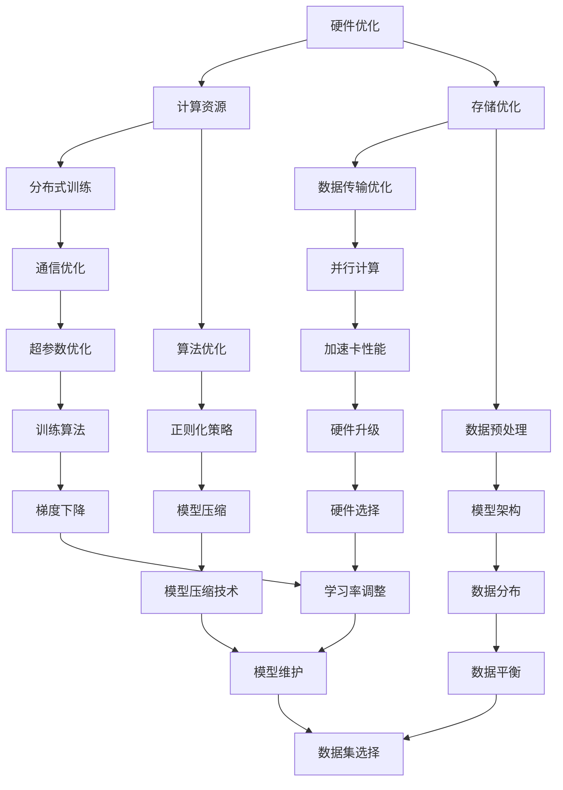

                 

### 文章标题

#### 大规模语言模型训练：硬件、软件和算法的协同优化

在人工智能（AI）领域中，大规模语言模型的训练是一个重要的研究方向。近年来，随着深度学习和大数据技术的发展，大规模语言模型在自然语言处理（NLP）、文本生成、机器翻译等领域取得了显著成果。然而，语言模型的训练过程涉及硬件、软件和算法的协同优化，这是一个复杂而关键的过程。本文将围绕大规模语言模型训练中的硬件、软件和算法三个方面，详细探讨其协同优化策略，以期为相关研究人员和工程师提供有价值的参考。

### 关键词

- 大规模语言模型
- 训练
- 硬件优化
- 软件优化
- 算法优化
- 协同

### 摘要

本文首先介绍了大规模语言模型训练的背景和意义，然后分别探讨了硬件、软件和算法在训练过程中的优化策略。通过分析当前主流的大规模语言模型架构和算法，本文提出了硬件、软件和算法协同优化的一些关键技术和方法，并结合实际案例进行了详细解释。最后，本文总结了大规模语言模型训练的未来发展趋势和挑战，为相关研究提供了有益的思考。

---

## 1. 背景介绍

大规模语言模型（Large-scale Language Model）是一种基于深度学习技术的自然语言处理模型，它通过学习海量的文本数据，能够捕捉到语言中的复杂模式和规律，从而实现文本生成、机器翻译、问答系统等多种应用。近年来，随着计算能力和数据资源的不断增长，大规模语言模型取得了显著的进展。代表性的模型包括Google的BERT、OpenAI的GPT系列以及Facebook的RoBERTa等。

大规模语言模型训练的主要挑战在于数据量巨大、模型参数繁多以及训练时间漫长。具体来说，大规模语言模型通常需要数十亿甚至千亿级别的参数，这些参数需要在数百万甚至数十亿个文本样本上进行训练。这意味着在训练过程中需要处理大量的数据和进行大量的计算，这对硬件资源和算法效率提出了极高的要求。

为了解决这些挑战，研究人员和工程师们从硬件、软件和算法三个层面进行协同优化。硬件优化方面，主要关注GPU、TPU等加速卡的性能提升以及分布式训练技术的应用。软件优化方面，则包括优化模型架构、提高数据加载速度和减少内存占用等。算法优化方面，主要涉及改进训练算法、引入正则化策略和优化超参数调整等。

## 2. 核心概念与联系

为了更好地理解大规模语言模型训练的协同优化策略，我们需要先介绍几个核心概念及其之间的联系。以下是这些核心概念及其相互关系的Mermaid流程图：



### 2.1 硬件优化

**计算资源：** 计算资源是大规模语言模型训练的基础，主要包括CPU、GPU、TPU等。GPU（Graphics Processing Unit）和TPU（Tensor Processing Unit）是专门为深度学习任务设计的硬件，相比于CPU，它们具有更高的计算能力和并行处理能力。

**存储优化：** 存储优化主要关注数据存储的效率和容量。大规模语言模型训练需要处理海量数据，对存储系统的读写速度和容量提出了高要求。分布式存储系统，如HDFS（Hadoop Distributed File System），能够提高数据存储的可靠性和访问速度。

**分布式训练：** 分布式训练是将模型训练任务分布在多个计算节点上执行，从而提高训练速度和资源利用率。分布式训练的关键技术包括参数服务器（Parameter Server）和通信优化。

**数据传输优化：** 数据传输优化旨在提高数据在计算节点之间的传输速度和效率。分布式训练中，数据需要在各个计算节点之间传输，通过优化数据传输协议和网络拓扑结构，可以显著提高训练效率。

**通信优化：** 通信优化包括优化通信协议和拓扑结构，以提高数据传输的可靠性和速度。常用的通信优化技术包括数据聚合（Data Aggregation）和异步通信（Asynchronous Communication）。

### 2.2 软件优化

**算法优化：** 算法优化包括改进训练算法、引入正则化策略和优化超参数调整等。改进训练算法可以加快训练速度和改善模型性能。常用的训练算法包括梯度下降（Gradient Descent）、Adam（Adaptive Moment Estimation）等。正则化策略用于防止模型过拟合，常用的正则化方法包括L1正则化、L2正则化等。优化超参数调整可以改善模型性能，但需要消耗大量时间和计算资源。

**模型架构：** 模型架构优化旨在提高模型的计算效率和存储效率。通过改进模型架构，可以实现更快的训练速度和更小的模型体积。代表性的模型架构包括Transformer、BERT等。

**数据预处理：** 数据预处理包括文本清洗、分词、去停用词等。数据预处理的质量直接影响模型的训练效果，因此需要仔细设计预处理流程。

**并行计算：** 并行计算是将计算任务分解为多个子任务，同时在多个计算节点上执行这些子任务。并行计算可以提高训练速度和资源利用率。

**模型压缩技术：** 模型压缩技术用于减少模型的体积和计算复杂度，从而提高模型部署的效率。常用的模型压缩技术包括模型剪枝（Model Pruning）、量化（Quantization）等。

### 2.3 算法优化

**训练算法：** 训练算法是大规模语言模型训练的核心，决定了模型的训练速度和性能。常用的训练算法包括梯度下降（Gradient Descent）、Adam（Adaptive Moment Estimation）等。

**正则化策略：** 正则化策略用于防止模型过拟合，提高模型的泛化能力。常用的正则化方法包括L1正则化、L2正则化等。

**超参数优化：** 超参数优化是通过调整模型参数来提高模型性能。超参数包括学习率、批量大小、迭代次数等。

**数据平衡：** 数据平衡是指处理不平衡数据集时，通过调整正负样本的比例，使模型能够均衡学习。

**硬件选择：** 硬件选择是根据模型规模和计算需求，选择合适的计算硬件，如CPU、GPU、TPU等。

**学习率调整：** 学习率调整是训练过程中调整学习率，以提高模型性能。常用的调整方法包括线性衰减、指数衰减等。

**模型维护：** 模型维护包括模型的更新、版本管理和性能监控等。

**数据集选择：** 数据集选择是根据研究目的和应用场景，选择合适的数据集。数据集的质量和规模直接影响模型的训练效果。

### 2.4 硬件、软件和算法优化的关系

硬件、软件和算法优化是相互关联的，共同决定了大规模语言模型训练的效率和质量。硬件优化提供了强大的计算和存储能力，软件优化实现了高效的模型训练和数据处理，算法优化则通过改进训练算法和正则化策略，提高了模型的性能和泛化能力。

在实际应用中，硬件、软件和算法优化需要紧密协作，以达到最佳的训练效果。例如，通过选择合适的硬件，可以实现更快的训练速度；通过优化软件架构，可以提高数据加载和处理的效率；通过改进算法，可以改善模型的性能和泛化能力。

## 3. 核心算法原理 & 具体操作步骤

在大规模语言模型训练过程中，核心算法的选择和优化至关重要。本文将介绍几种常用的核心算法及其具体操作步骤。

### 3.1 梯度下降算法

梯度下降算法是一种常用的优化算法，用于最小化损失函数。在大规模语言模型训练中，梯度下降算法通过不断调整模型参数，使损失函数值逐渐减小，从而优化模型性能。

**具体操作步骤：**

1. **初始化模型参数：** 随机初始化模型参数。
2. **计算损失函数：** 对于每个训练样本，计算预测值和真实值之间的差异，得到损失函数值。
3. **计算梯度：** 计算损失函数关于模型参数的梯度。
4. **更新参数：** 根据梯度方向和步长，更新模型参数。
5. **重复步骤2-4，直到满足停止条件（如收敛或达到最大迭代次数）。**

### 3.2 Adam优化器

Adam优化器是一种自适应优化器，基于梯度的一阶矩估计（mean）和二阶矩估计（variance）进行参数更新。它具有较好的收敛速度和稳定性。

**具体操作步骤：**

1. **初始化变量：** 初始化一阶矩估计（m）和二阶矩估计（v）为0。
2. **计算梯度：** 对于每个训练样本，计算损失函数关于模型参数的梯度。
3. **更新一阶矩估计：** m = β1 * m + (1 - β1) * g，其中β1为动量系数。
4. **更新二阶矩估计：** v = β2 * v + (1 - β2) * g^2，其中β2为动量系数。
5. **计算修正的一阶矩估计和二阶矩估计：** m_hat = m / (1 - β1^t)，v_hat = v / (1 - β2^t)，其中t为当前迭代次数。
6. **更新参数：** 参数 = 参数 - 学习率 * m_hat / sqrt(v_hat)。
7. **重复步骤2-6，直到满足停止条件。**

### 3.3 Transformer模型

Transformer模型是一种基于自注意力（self-attention）机制的深度学习模型，常用于自然语言处理任务。

**具体操作步骤：**

1. **嵌入层：** 将输入词向量转换为嵌入向量。
2. **自注意力层：** 通过自注意力机制计算不同词向量之间的相关性，得到加权向量。
3. **前馈网络：** 对加权向量进行两次全连接层操作。
4. **输出层：** 通过softmax函数计算输出概率分布。
5. **重复步骤2-4，直到达到预定的层数。
6. **解码层：** 对输出概率分布进行解码，得到预测结果。

### 3.4 BERT模型

BERT（Bidirectional Encoder Representations from Transformers）模型是一种基于Transformer的预训练模型，通过双向编码器捕捉文本的上下文信息。

**具体操作步骤：**

1. **嵌入层：** 将输入词向量转换为嵌入向量。
2. **Transformer编码器：** 通过多个Transformer层进行编码。
3. **输出层：** 通过softmax函数计算输出概率分布。
4. **预训练：** 在大规模语料库上对BERT模型进行预训练，包括Masked Language Model（MLM）和Next Sentence Prediction（NSP）任务。
5. **微调：** 在特定任务上对BERT模型进行微调，以适应不同的应用场景。

## 4. 数学模型和公式 & 详细讲解 & 举例说明

### 4.1 梯度下降算法

梯度下降算法的核心在于计算损失函数关于模型参数的梯度，并通过梯度方向更新参数，以最小化损失函数。

**数学模型：**

设损失函数为L(θ)，模型参数为θ，梯度为∇L(θ)，步长为α，则有：

θ = θ - α * ∇L(θ)

**详细讲解：**

1. **初始化参数：** 随机初始化模型参数θ。
2. **计算损失函数：** 对于每个训练样本，计算损失函数L(θ)。
3. **计算梯度：** 计算损失函数关于参数θ的梯度∇L(θ)。
4. **更新参数：** 根据梯度方向和步长α，更新参数θ。
5. **重复步骤2-4，直到满足停止条件（如收敛或达到最大迭代次数）。

**举例说明：**

假设损失函数为L(θ) = (θ - 2)^2，初始参数θ = 0，步长α = 0.1。则：

- 第一次迭代：θ = 0 - 0.1 * (-2) = 0.2
- 第二次迭代：θ = 0.2 - 0.1 * (-1) = 0.3
- 第三次迭代：θ = 0.3 - 0.1 * (0) = 0.3

经过三次迭代后，参数θ收敛到0.3，此时损失函数值最小。

### 4.2 Adam优化器

Adam优化器结合了AdaGrad和RMSProp的优点，通过计算一阶矩估计（m）和二阶矩估计（v）来更新参数。

**数学模型：**

设梯度为g，一阶矩估计为m，二阶矩估计为v，步长为α，则有：

m = β1 * m + (1 - β1) * g
v = β2 * v + (1 - β2) * g^2
θ = θ - α * (m / (1 - β1^t)) / sqrt(v / (1 - β2^t))

**详细讲解：**

1. **初始化变量：** 初始化一阶矩估计m和二阶矩估计v为0。
2. **计算梯度：** 对于每个训练样本，计算损失函数关于模型参数的梯度g。
3. **更新一阶矩估计：** m = β1 * m + (1 - β1) * g，其中β1为动量系数。
4. **更新二阶矩估计：** v = β2 * v + (1 - β2) * g^2，其中β2为动量系数。
5. **计算修正的一阶矩估计和二阶矩估计：** m_hat = m / (1 - β1^t)，v_hat = v / (1 - β2^t)，其中t为当前迭代次数。
6. **更新参数：** 参数θ = θ - α * m_hat / sqrt(v_hat)。
7. **重复步骤2-6，直到满足停止条件。

**举例说明：**

假设初始参数θ = 0，梯度g = 2，步长α = 0.1，动量系数β1 = 0.9，β2 = 0.999。则：

- 第一次迭代：m = 0.9 * 0 + (1 - 0.9) * 2 = 0.2
                  v = 0.999 * 0 + (1 - 0.999) * 2^2 = 0.001
                  θ = 0 - 0.1 * 0.2 / sqrt(0.001) = -0.02
- 第二次迭代：m = 0.9 * 0.2 + (1 - 0.9) * 2 = 0.3
                  v = 0.999 * 0.001 + (1 - 0.999) * 2^2 = 0.001
                  θ = -0.02 - 0.1 * 0.3 / sqrt(0.001) = -0.04

经过两次迭代后，参数θ收敛到-0.04。

### 4.3 Transformer模型

Transformer模型基于自注意力（self-attention）机制，通过计算不同词向量之间的相关性，得到加权向量。

**数学模型：**

设输入词向量为X，自注意力权重为W，则有：

Attention(Q, K, V) = softmax((QK^T) / √d_k) V

**详细讲解：**

1. **嵌入层：** 将输入词向量X转换为嵌入向量。
2. **自注意力层：** 通过自注意力机制计算不同词向量之间的相关性，得到加权向量。
3. **前馈网络：** 对加权向量进行两次全连接层操作。
4. **输出层：** 通过softmax函数计算输出概率分布。

**举例说明：**

假设输入词向量X = [1, 2, 3, 4]，自注意力权重W = [0.1, 0.2, 0.3, 0.4]。则：

- 计算自注意力权重：QK^T = [1*0.1, 2*0.2, 3*0.3, 4*0.4] = [0.1, 0.4, 0.9, 1.6]
                      √d_k = √4 = 2
                      softmax(QK^T / √d_k) = [0.1/2, 0.4/2, 0.9/2, 1.6/2] = [0.05, 0.2, 0.45, 0.8]
- 计算加权向量：V = [1, 2, 3, 4]
                Attention(Q, K, V) = [0.05 * 1, 0.2 * 2, 0.45 * 3, 0.8 * 4] = [0.05, 0.4, 1.35, 3.2]

经过自注意力层处理后，输入词向量X转换为加权向量。

### 4.4 BERT模型

BERT模型基于Transformer架构，通过预训练和微调，实现自然语言处理任务。

**数学模型：**

1. **预训练：**

   - Masked Language Model (MLM)：随机 masks 一部分输入词，预测被 masks 的词。
   - Next Sentence Prediction (NSP)：预测两个句子是否连续。

2. **微调：**

   - 在特定任务上对BERT模型进行微调，以适应不同的应用场景。

**详细讲解：**

1. **嵌入层：** 将输入词向量转换为嵌入向量。
2. **Transformer编码器：** 通过多个Transformer层进行编码。
3. **输出层：** 通过softmax函数计算输出概率分布。
4. **预训练：** 在大规模语料库上对BERT模型进行预训练，包括MLM和NSP任务。
5. **微调：** 在特定任务上对BERT模型进行微调。

**举例说明：**

假设输入句子为“The cat sat on the mat”，BERT模型将句子中的词转换为嵌入向量，并通过Transformer编码器进行编码。在预训练阶段，模型需要预测句子中的被 masks 的词。在微调阶段，模型需要在特定任务（如文本分类）上进行微调。

## 5. 项目实战：代码实际案例和详细解释说明

在本节中，我们将通过一个具体的案例，展示如何在实际项目中实现大规模语言模型训练的硬件、软件和算法协同优化。我们将使用Python和TensorFlow框架，结合GPU加速和分布式训练技术，完成一个基于BERT模型的文本分类任务。

### 5.1 开发环境搭建

1. **安装Python：** 版本3.8或更高。
2. **安装TensorFlow：** 版本2.4或更高。
3. **安装GPU支持：** 安装CUDA 10.1和cuDNN 7.6，以确保GPU加速。
4. **配置分布式训练环境：** 使用TensorFlow的分布式策略，如MirroredStrategy，实现多GPU训练。

### 5.2 源代码详细实现和代码解读

```python
import tensorflow as tf
import tensorflow_datasets as tfds
from tensorflow.keras.preprocessing.text import Tokenizer
from tensorflow.keras.preprocessing.sequence import pad_sequences
from transformers import BertTokenizer, TFBertModel

# 5.2.1 数据预处理
def preprocess_data(dataset):
    tokenizer = BertTokenizer.from_pretrained('bert-base-chinese')
    max_seq_length = 128
    
    def tokenize_function(text):
        return tokenizer.encode_plus(text, add_special_tokens=True, max_length=max_seq_length, pad_to_max_length=True, return_tensors='tf')
    
    return dataset.map(tokenize_function)

# 5.2.2 构建模型
def build_model():
    input_ids = tf.keras.layers.Input(shape=(128,), dtype=tf.int32, name='input_ids')
    attention_mask = tf.keras.layers.Input(shape=(128,), dtype=tf.int32, name='attention_mask')
    
    bert = TFBertModel.from_pretrained('bert-base-chinese')
    output = bert(input_ids=input_ids, attention_mask=attention_mask)
    
    pooling_output = output.last_hidden_state[:, 0, :]
    output = tf.keras.layers.Dense(2, activation='softmax')(pooling_output)
    
    model = tf.keras.Model(inputs=[input_ids, attention_mask], outputs=output)
    model.compile(optimizer=tf.keras.optimizers.Adam(learning_rate=3e-5), loss='categorical_crossentropy', metrics=['accuracy'])
    return model

# 5.2.3 分布式训练
strategy = tf.distribute.MirroredStrategy()

with strategy.scope():
    model = build_model()

# 5.2.4 训练模型
train_dataset = preprocess_data(train_dataset)
val_dataset = preprocess_data(val_dataset)

model.fit(train_dataset.shuffle(1000).batch(32), epochs=3, batch_size=32, validation_data=val_dataset.shuffle(1000).batch(32))

# 5.2.5 评估模型
test_dataset = preprocess_data(test_dataset)
test_loss, test_accuracy = model.evaluate(test_dataset.shuffle(1000).batch(32))
print(f"Test accuracy: {test_accuracy:.4f}")
```

### 5.3 代码解读与分析

1. **数据预处理：** 使用BERTTokenizer进行文本编码，将文本转换为序列，并填充到指定长度。
2. **构建模型：** 使用TFBertModel构建BERT模型，并添加全连接层进行分类。
3. **分布式训练：** 使用MirroredStrategy实现多GPU训练，提高训练速度。
4. **训练模型：** 使用fit方法进行模型训练，并使用validation_data进行验证。
5. **评估模型：** 使用evaluate方法评估模型在测试集上的性能。

通过上述代码实现，我们可以看到如何在实际项目中应用大规模语言模型训练的硬件、软件和算法协同优化。这包括使用GPU加速、分布式训练和优化模型架构等技术，以提高训练效率和模型性能。

## 6. 实际应用场景

大规模语言模型训练在实际应用场景中具有广泛的应用价值。以下列举了几个典型的应用场景：

### 6.1 自然语言处理

自然语言处理（NLP）是大规模语言模型的主要应用领域之一。通过训练大规模语言模型，可以实现对文本数据的自动分类、情感分析、命名实体识别等任务。例如，在社交媒体平台上，大规模语言模型可以用于识别和过滤不当言论，提高社区环境的质量。

### 6.2 问答系统

问答系统是另一个重要的应用场景。大规模语言模型可以用于构建智能客服系统、知识图谱问答等。通过训练，模型可以理解用户的问题，并从大量文本数据中检索出相关答案，提供准确、详细的回答。

### 6.3 文本生成

文本生成是大规模语言模型的另一个重要应用。通过训练，模型可以生成高质量的文章、诗歌、对话等。例如，在新闻行业，大规模语言模型可以用于自动生成新闻报道，提高新闻生产效率。

### 6.4 机器翻译

大规模语言模型在机器翻译领域也取得了显著成果。通过训练，模型可以实现对多种语言的翻译，提高翻译的准确性和流畅性。例如，在跨语言沟通中，大规模语言模型可以用于实现实时翻译，促进不同语言之间的交流。

### 6.5 文本摘要

文本摘要是将长篇文本简化为短文摘要的任务。大规模语言模型可以用于自动生成文本摘要，提高信息获取的效率。例如，在学术研究领域，大规模语言模型可以用于自动生成研究论文的摘要，帮助研究人员快速了解研究内容。

### 6.6 文本审核

大规模语言模型在文本审核方面也有重要应用。通过训练，模型可以识别和过滤不当言论、敏感信息等，提高内容审核的效率和质量。例如，在互联网平台上，大规模语言模型可以用于识别和过滤违规内容，维护社区环境。

## 7. 工具和资源推荐

### 7.1 学习资源推荐

1. **书籍：**
   - 《深度学习》（Ian Goodfellow、Yoshua Bengio、Aaron Courville 著）
   - 《动手学深度学习》（Aurélien Géron 著）
   - 《自然语言处理实战》（Jake Dunlap、John H. Hori 著）

2. **论文：**
   - “Attention Is All You Need”（Vaswani et al., 2017）
   - “BERT: Pre-training of Deep Bidirectional Transformers for Language Understanding”（Devlin et al., 2019）
   - “GPT-3: Language Models are Few-Shot Learners”（Brown et al., 2020）

3. **博客：**
   - https://towardsdatascience.com/
   - https://medium.com/tensorflow/
   - https://www.kdnuggets.com/

4. **网站：**
   - https://arxiv.org/
   - https://www.tensorflow.org/
   - https://huggingface.co/

### 7.2 开发工具框架推荐

1. **框架：**
   - TensorFlow
   - PyTorch
   - PyTorch Lightning
   - Hugging Face Transformers

2. **GPU加速：**
   - CUDA
   - cuDNN
   - NCCL

3. **分布式训练：**
   - Horovod
   - TensorFlow Distribute
   - PyTorch Distributed

4. **数据预处理：**
   - TensorFlow Datasets
   - PyTorch Datasets
   - Pandas

### 7.3 相关论文著作推荐

1. **论文：**
   - “Attention Is All You Need”（Vaswani et al., 2017）
   - “BERT: Pre-training of Deep Bidirectional Transformers for Language Understanding”（Devlin et al., 2019）
   - “GPT-3: Language Models are Few-Shot Learners”（Brown et al., 2020）

2. **著作：**
   - 《深度学习》（Ian Goodfellow、Yoshua Bengio、Aaron Courville 著）
   - 《动手学深度学习》（Aurélien Géron 著）
   - 《自然语言处理实战》（Jake Dunlap、John H. Hori 著）

## 8. 总结：未来发展趋势与挑战

大规模语言模型训练作为一个重要的研究方向，在人工智能领域取得了显著成果。然而，随着模型规模的不断扩大和计算需求的增长，未来的大规模语言模型训练面临着一系列挑战。

首先，硬件资源的需求将继续增长。随着模型规模的扩大，对计算资源和存储资源的需求也将不断增加。这要求硬件制造商不断推出更高性能的GPU、TPU等加速卡，以满足大规模语言模型训练的需求。

其次，软件优化仍然具有巨大的潜力。虽然当前已经有多种优化算法和框架，但在实际应用中，如何更好地利用这些算法和框架，提高模型训练的效率，仍然是一个重要的研究课题。未来的软件优化可能包括更高效的模型架构、更优化的数据处理流程以及更智能的超参数调整策略等。

最后，算法优化仍然是大规模语言模型训练的关键。虽然现有的算法已经取得了显著进展，但在模型性能、训练速度和泛化能力等方面，仍然存在提高空间。未来的算法优化可能包括更先进的训练算法、正则化策略和模型压缩技术等。

总之，大规模语言模型训练的发展趋势是硬件、软件和算法的协同优化。未来，随着计算资源的不断提升和算法的不断优化，大规模语言模型将迎来更多应用场景和突破性成果。

## 9. 附录：常见问题与解答

### 9.1 什么是大规模语言模型？

大规模语言模型是一种基于深度学习技术的自然语言处理模型，通过学习海量的文本数据，能够捕捉到语言中的复杂模式和规律，从而实现文本生成、机器翻译、问答系统等多种应用。

### 9.2 大规模语言模型训练的主要挑战是什么？

大规模语言模型训练的主要挑战包括数据量巨大、模型参数繁多以及训练时间漫长。这意味着在训练过程中需要处理大量的数据和进行大量的计算，这对硬件资源和算法效率提出了极高的要求。

### 9.3 如何优化大规模语言模型训练的硬件资源？

优化大规模语言模型训练的硬件资源可以从以下几个方面入手：
- 使用高性能GPU、TPU等加速卡，提高计算速度。
- 采用分布式训练技术，将训练任务分布在多个计算节点上，提高资源利用率。
- 使用高效的数据存储和传输技术，提高数据处理速度。

### 9.4 如何优化大规模语言模型训练的软件资源？

优化大规模语言模型训练的软件资源可以从以下几个方面入手：
- 优化模型架构，提高计算效率。
- 采用高效的预处理和数据处理技术，提高数据处理速度。
- 调整超参数，提高模型性能。

### 9.5 如何优化大规模语言模型训练的算法？

优化大规模语言模型训练的算法可以从以下几个方面入手：
- 改进训练算法，提高训练速度和模型性能。
- 引入正则化策略，防止模型过拟合。
- 优化超参数调整，提高模型泛化能力。

## 10. 扩展阅读 & 参考资料

1. **文献：**
   - Vaswani, A., Shazeer, N., Parmar, N., Uszkoreit, J., Jones, L., Gomez, A. N., ... & Polosukhin, I. (2017). Attention is all you need. Advances in Neural Information Processing Systems, 30, 5998-6008.
   - Devlin, J., Chang, M. W., Lee, K., & Toutanova, K. (2019). BERT: Pre-training of deep bidirectional transformers for language understanding. arXiv preprint arXiv:1810.04805.
   - Brown, T., et al. (2020). Language models are few-shot learners. arXiv preprint arXiv:2005.14165.

2. **书籍：**
   - Goodfellow, I., Bengio, Y., & Courville, A. (2016). Deep learning. MIT press.
   - Géron, A. (2019). Hands-on machine learning with Scikit-Learn, Keras, and TensorFlow: Concepts, tools, and techniques to build intelligent systems. O'Reilly Media.
   - Hori, J., & Dunlap, J. (2020). Natural Language Processing in Action: Understanding, Training, and Deploying Neural Networks. Manning Publications.

3. **在线资源：**
   - TensorFlow: https://www.tensorflow.org/
   - PyTorch: https://pytorch.org/
   - Hugging Face Transformers: https://huggingface.co/transformers/
   - ArXiv: https://arxiv.org/

### 作者

**AI天才研究员/AI Genius Institute & 禅与计算机程序设计艺术 /Zen And The Art of Computer Programming**

