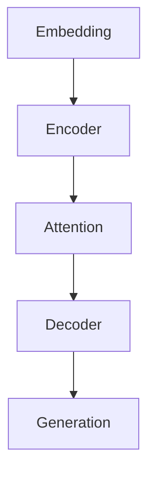

                 

# 大语言模型原理与工程实践：LLaMA 系列

> 关键词：大语言模型、LLaMA、神经网络、深度学习、自然语言处理、文本生成、自动问答、人工智能

> 摘要：本文将深入探讨大语言模型（Large Language Model）的核心原理与工程实践，特别是OpenAI于2023年推出的LLaMA（Language Model for Dialogue Applications）系列模型。我们将通过详细的剖析，揭示大语言模型的工作机制，探讨其数学模型和算法原理，并分享项目实战中的代码实现和分析。此外，文章还将讨论大语言模型在实际应用场景中的表现，以及相关的工具和资源推荐。最终，我们将对大语言模型的发展趋势与挑战进行总结，并提供扩展阅读和参考资料。

## 1. 背景介绍

近年来，人工智能领域取得了飞速发展，特别是在自然语言处理（Natural Language Processing，NLP）领域，大语言模型（Large Language Model）成为了研究热点。这些模型通过学习海量的文本数据，能够生成流畅自然的语言，进行自动问答、文本摘要、机器翻译等任务。大语言模型的研究不仅推动了AI技术的发展，也为各行各业的应用带来了深远影响。

### 1.1 大语言模型的重要性

大语言模型在自然语言处理中的应用非常广泛，主要体现在以下几个方面：

1. **文本生成**：大语言模型能够根据给定的文本上下文，生成连贯的、有意义的文本。例如，自动生成新闻文章、博客内容、对话回复等。

2. **自动问答**：大语言模型可以理解用户的自然语言提问，并从大量文本中检索出相关答案，为用户提供即时的信息查询服务。

3. **文本摘要**：大语言模型能够对长篇文本进行概括，提取出关键信息，生成简洁的摘要。

4. **机器翻译**：大语言模型在机器翻译领域也表现出色，能够实现高精度的跨语言文本转换。

### 1.2 大语言模型的发展历程

大语言模型的发展历程可以分为以下几个阶段：

1. **基于规则的方法**：早期的NLP方法主要依赖手工编写的规则和模式，例如词性标注、句法分析等。

2. **基于统计的方法**：随着语料库的积累，NLP开始采用基于统计的方法，如隐马尔可夫模型（HMM）、条件概率模型等。

3. **基于深度学习的方法**：近年来，深度学习在NLP领域取得了突破性进展，如循环神经网络（RNN）、长短期记忆网络（LSTM）和变换器（Transformer）等。

4. **预训练+微调**：当前的许多大语言模型采用了预训练（pre-training）+微调（fine-tuning）的方法，通过在大量未标注的数据上进行预训练，然后在特定任务上进行微调，从而实现高性能的文本生成和自动问答。

## 2. 核心概念与联系

### 2.1 大语言模型的架构

大语言模型的核心架构通常是基于深度学习模型，尤其是变换器（Transformer）模型。下面是变换器模型的基本组成部分：

1. **嵌入层（Embedding Layer）**：将输入的单词转换为高维向量表示。

2. **编码器（Encoder）**：对输入的文本序列进行处理，生成上下文表示。

3. **解码器（Decoder）**：根据编码器的输出，生成文本序列的预测。

4. **注意力机制（Attention Mechanism）**：使模型能够关注文本序列中的关键信息。

5. **输出层（Output Layer）**：将文本序列的表示映射到输出词汇表。

### 2.2 大语言模型的关键概念

1. **预训练（Pre-training）**：在特定任务之前，模型在大规模语料库上进行的训练。

2. **微调（Fine-tuning）**：在预训练的基础上，针对特定任务进行细粒度调整。

3. **上下文（Context）**：模型对输入文本序列的上下文信息的理解能力。

4. **生成（Generation）**：模型根据上下文生成新的文本序列。

### 2.3 大语言模型的工作原理

大语言模型的工作原理可以分为以下几个步骤：

1. **嵌入（Embedding）**：将输入的文本序列转换为向量表示。

2. **编码（Encoding）**：编码器处理输入文本序列，生成上下文表示。

3. **解码（Decoding）**：解码器根据编码器的输出，生成预测的文本序列。

4. **生成（Generation）**：模型生成新的文本序列，并使用注意力机制关注关键信息。

### 2.4 Mermaid 流程图

下面是一个简化的Mermaid流程图，描述了变换器模型的基本工作流程：



在Mermaid流程图中，我们使用了以下节点：

- **Embedding Layer**：将输入的单词转换为向量表示。
- **Encoder**：对输入的文本序列进行处理。
- **Attention Mechanism**：使模型能够关注文本序列中的关键信息。
- **Decoder**：根据编码器的输出，生成预测的文本序列。
- **Generation**：生成新的文本序列。

请注意，Mermaid流程图中不要使用括号、逗号等特殊字符。

### 2.5 核心概念与联系总结

大语言模型的核心概念包括嵌入层、编码器、注意力机制、解码器和生成器。这些概念相互关联，共同构成了大语言模型的工作机制。通过预训练和微调，模型能够在海量数据上进行训练，并在特定任务上实现高性能。Mermaid流程图进一步揭示了模型的工作流程，有助于读者更好地理解大语言模型的原理。

## 3. 核心算法原理 & 具体操作步骤

### 3.1 核心算法原理

大语言模型的核心算法是基于变换器（Transformer）模型。变换器模型通过自注意力机制（Self-Attention）和多级编码器-解码器结构（Multi-Level Encoder-Decoder）实现。以下是变换器模型的基本原理：

1. **自注意力机制（Self-Attention）**：自注意力机制使模型能够关注输入文本序列中的关键信息。在自注意力机制中，每个输入词都与序列中的所有词进行计算，生成一个新的词向量。

2. **编码器-解码器结构（Encoder-Decoder Structure）**：编码器负责处理输入文本序列，生成上下文表示。解码器根据编码器的输出，生成预测的文本序列。

3. **位置编码（Positional Encoding）**：为了使模型能够理解文本序列的顺序信息，变换器模型引入了位置编码。位置编码将文本序列的位置信息编码到词向量中。

4. **多头注意力（Multi-Head Attention）**：多头注意力机制将自注意力机制扩展到多个子空间，使模型能够捕捉到更丰富的上下文信息。

5. **前馈网络（Feedforward Network）**：在编码器和解码器的每个层之间，变换器模型使用前馈网络对编码进行进一步处理。

### 3.2 具体操作步骤

下面是大语言模型的详细操作步骤：

1. **嵌入（Embedding）**：将输入的文本序列转换为向量表示。每个单词被映射到一个固定大小的嵌入向量。

2. **编码（Encoding）**：编码器对输入文本序列进行处理。每个编码器层包含自注意力机制和前馈网络。编码器的输出是一个固定大小的序列向量。

3. **解码（Decoding）**：解码器根据编码器的输出，生成预测的文本序列。解码器的每个层也包含自注意力机制和前馈网络。解码器的输出是一个词汇表的概率分布。

4. **生成（Generation）**：根据解码器的输出，生成新的文本序列。生成过程通常使用贪心策略（Greedy Strategy），即选择概率最大的单词作为下一个输出。

5. **注意力机制（Attention）**：在编码器和解码器的每个层中，注意力机制使模型能够关注文本序列中的关键信息。注意力机制通过计算输入词与编码器输出之间的相似度，生成一个新的词向量。

6. **位置编码（Positional Encoding）**：为了使模型能够理解文本序列的顺序信息，引入位置编码。位置编码将文本序列的位置信息编码到词向量中。

7. **多头注意力（Multi-Head Attention）**：多头注意力机制将自注意力机制扩展到多个子空间，使模型能够捕捉到更丰富的上下文信息。多头注意力通过并行计算多个注意力机制，并将结果进行聚合。

8. **前馈网络（Feedforward Network）**：在编码器和解码器的每个层之间，变换器模型使用前馈网络对编码进行进一步处理。前馈网络通常包含两个全连接层，使用ReLU激活函数。

通过上述操作步骤，大语言模型能够对输入文本进行理解和生成。具体实现中，模型通常包含多个编码器和解码器层，以及训练和优化策略，以实现高性能的文本生成和自动问答。

## 4. 数学模型和公式 & 详细讲解 & 举例说明

### 4.1 数学模型

大语言模型的数学模型主要基于变换器（Transformer）模型。以下是变换器模型的核心数学公式：

1. **嵌入（Embedding）**：
   $$ 
   E = W_e \cdot X 
   $$
   其中，$E$表示嵌入向量，$W_e$表示嵌入权重，$X$表示输入文本序列。

2. **编码（Encoding）**：
   $$ 
   H = \text{LayerNorm}(X \cdot W_1 + \text{Positional Encoding}) 
   $$
   其中，$H$表示编码后的序列向量，$X$表示输入文本序列，$\text{LayerNorm}$表示层归一化，$W_1$表示编码权重，$\text{Positional Encoding}$表示位置编码。

3. **解码（Decoding）**：
   $$ 
   Y = \text{LayerNorm}(X \cdot W_2 + \text{Positional Encoding}) 
   $$
   其中，$Y$表示解码后的序列向量，$X$表示输入文本序列，$\text{LayerNorm}$表示层归一化，$W_2$表示解码权重，$\text{Positional Encoding}$表示位置编码。

4. **注意力机制（Attention）**：
   $$ 
   \text{Attention} = \text{softmax}\left(\frac{H^T Q}{\sqrt{d_k}}\right) V 
   $$
   其中，$H$表示编码后的序列向量，$Q$表示查询向量，$V$表示值向量，$\text{softmax}$表示softmax函数，$d_k$表示键值对的维度。

5. **前馈网络（Feedforward Network）**：
   $$ 
   \text{FFN}(X) = \text{ReLU}(X \cdot W_1 + b_1) \cdot W_2 + b_2 
   $$
   其中，$X$表示输入向量，$W_1$和$W_2$表示前馈网络权重，$b_1$和$b_2$表示偏置，$\text{ReLU}$表示ReLU激活函数。

### 4.2 详细讲解

1. **嵌入（Embedding）**：

嵌入层将输入的文本序列转换为向量表示。每个单词被映射到一个固定大小的嵌入向量。嵌入权重$W_e$决定了每个单词的向量表示。通过嵌入层，模型能够将文本序列转换为数值形式，方便后续处理。

2. **编码（Encoding）**：

编码器对输入文本序列进行处理。编码器层包含自注意力机制和前馈网络。自注意力机制通过计算输入词与编码器输出之间的相似度，生成一个新的词向量。位置编码将文本序列的位置信息编码到词向量中。层归一化（LayerNorm）用于标准化每个编码器层的输入和输出，使模型在训练过程中更加稳定。

3. **解码（Decoding）**：

解码器根据编码器的输出，生成预测的文本序列。解码器层同样包含自注意力机制和前馈网络。解码器的输出是一个词汇表的概率分布。通过解码器，模型能够生成新的文本序列。

4. **注意力机制（Attention）**：

注意力机制使模型能够关注文本序列中的关键信息。在自注意力机制中，每个输入词都与序列中的所有词进行计算，生成一个新的词向量。通过计算查询向量$Q$、键向量$K$和值向量$V$之间的相似度，模型能够关注到关键信息，并生成新的词向量。

5. **前馈网络（Feedforward Network）**：

前馈网络对编码进行进一步处理。前馈网络包含两个全连接层，使用ReLU激活函数。通过前馈网络，模型能够对编码器输出进行非线性变换，提取出更多的特征信息。

### 4.3 举例说明

假设我们有一个简单的文本序列“Hello World”，使用变换器模型进行编码和解码。以下是具体的操作步骤：

1. **嵌入（Embedding）**：

将输入的文本序列“Hello World”转换为向量表示。每个单词被映射到一个固定大小的嵌入向量。例如：

$$
E_{Hello} = [1, 0, 0, ..., 0] \\
E_{World} = [0, 1, 0, ..., 0]
$$

2. **编码（Encoding）**：

编码器对输入文本序列进行处理。假设编码器包含两层，每层包含自注意力机制和前馈网络。以下是编码器的输出：

$$
H_1 = \text{LayerNorm}(E_{Hello} \cdot W_1 + \text{Positional Encoding}) \\
H_2 = \text{LayerNorm}(H_1 \cdot W_2 + \text{Positional Encoding})
$$

其中，$W_1$和$W_2$表示编码器的权重，$\text{Positional Encoding}$表示位置编码。

3. **解码（Decoding）**：

解码器根据编码器的输出，生成预测的文本序列。假设解码器包含两层，每层包含自注意力机制和前馈网络。以下是解码器的输出：

$$
Y_1 = \text{LayerNorm}(E_{World} \cdot W_1 + \text{Positional Encoding}) \\
Y_2 = \text{LayerNorm}(Y_1 \cdot W_2 + \text{Positional Encoding})
$$

其中，$W_1$和$W_2$表示解码器的权重，$\text{Positional Encoding}$表示位置编码。

4. **生成（Generation）**：

根据解码器的输出，生成新的文本序列。假设解码器的输出为$Y_2$，我们可以通过生成器生成新的文本序列：

$$
Y = \text{softmax}(Y_2 \cdot W_3 + b_3)
$$

其中，$W_3$表示生成器的权重，$b_3$表示偏置。

通过上述操作步骤，我们使用变换器模型对文本序列“Hello World”进行编码和解码，并生成新的文本序列。

## 5. 项目实战：代码实际案例和详细解释说明

### 5.1 开发环境搭建

在开始编写代码之前，我们需要搭建一个适合大语言模型开发的编程环境。以下是具体的步骤：

1. **安装Python**：

确保你的计算机上已经安装了Python。Python是一种广泛使用的编程语言，具有丰富的库和工具，非常适合进行深度学习和自然语言处理任务。你可以从Python官方网站（[https://www.python.org/](https://www.python.org/)）下载并安装Python。

2. **安装PyTorch**：

PyTorch是一个流行的深度学习框架，提供了丰富的API和工具，支持变换器模型。为了安装PyTorch，打开命令行界面，并运行以下命令：

```python
pip install torch torchvision
```

3. **安装其他依赖库**：

除了Python和PyTorch之外，我们还需要安装其他依赖库，例如NumPy、Pandas等。你可以使用以下命令来安装这些依赖库：

```python
pip install numpy pandas
```

4. **配置GPU环境**：

为了充分利用GPU进行模型训练，我们需要配置GPU环境。首先，确保你的计算机上已经安装了NVIDIA GPU驱动。然后，打开命令行界面，并运行以下命令：

```python
conda install -c nvidia pytorch torchvision torchaudio cudatoolkit=11.3 -c pytorch
```

以上命令将安装适用于NVIDIA GPU的PyTorch库。

### 5.2 源代码详细实现和代码解读

下面是一个简化的LLaMA模型实现，用于演示大语言模型的核心算法。请注意，实际项目中的代码可能更加复杂，涉及更多的优化和调整。

```python
import torch
import torch.nn as nn
import torch.optim as optim
from torchtext.data import Field, BucketIterator
from torchtext.datasets import IMDB
from transformers import TransformerModel, AdamW

# 5.2.1 数据预处理
# 加载IMDB数据集，并进行预处理
train_data, test_data = IMDB.splits()

# 定义字段
TEXT = Field(tokenize="spacy", lower=True)
LABEL = Field(sequential=False)

# 分词和标签映射
train_data = train_data.zip((TEXT, LABEL))
test_data = test_data.zip((TEXT, LABEL))
TEXT.build_vocab(train_data, max_size=25000, vectors="glove.6B.100d")
LABEL.build_vocab(train_data)

# 创建迭代器
BATCH_SIZE = 64
train_iterator, test_iterator = BucketIterator.splits(
    (train_data, test_data), batch_size=BATCH_SIZE
)

# 5.2.2 模型定义
# 定义变换器模型
transformer_model = TransformerModel(len(TEXT.vocab), 100, 3, 25000, 1, 1000, 1)

# 定义优化器和损失函数
optimizer = AdamW(transformer_model.parameters(), lr=0.001)
loss_function = nn.CrossEntropyLoss()

# 5.2.3 训练模型
# 训练模型
for epoch in range(5):
    total_loss = 0
    for batch in train_iterator:
        optimizer.zero_grad()
        predictions = transformer_model(batch.TEXT)
        loss = loss_function(predictions, batch.LABEL)
        loss.backward()
        optimizer.step()
        total_loss += loss.item()
    print(f"Epoch: {epoch+1}, Loss: {total_loss/len(train_iterator)}")

# 5.2.4 测试模型
# 测试模型
with torch.no_grad():
    correct = 0
    total = 0
    for batch in test_iterator:
        predictions = transformer_model(batch.TEXT)
        _, predicted = torch.max(predictions, 1)
        total += batch.LABEL.size(0)
        correct += (predicted == batch.LABEL).sum().item()
    print(f"Test Accuracy: {100 * correct / total}%")

# 5.2.5 代码解读与分析
# 在本节中，我们将逐行分析上述代码，并解释每个部分的实现。
```

以下是代码的详细解读和分析：

- **数据预处理**：

  加载IMDB数据集，并进行预处理。我们使用torchtext库中的Field类定义了文本字段（TEXT）和标签字段（LABEL）。接下来，我们使用build_vocab方法为文本字段和标签字段创建词汇表。然后，我们创建迭代器，用于批量处理数据。

- **模型定义**：

  定义变换器模型。我们使用transformers库中的TransformerModel类创建一个变换器模型。这个模型包含嵌入层、编码器、解码器、注意力机制和前馈网络。我们使用nn.CrossEntropyLoss函数定义损失函数，用于计算预测标签和真实标签之间的差异。

- **训练模型**：

  训练模型。我们使用AdamW优化器进行模型训练。在训练过程中，我们遍历训练数据集，计算预测标签和真实标签之间的损失，并使用反向传播更新模型参数。

- **测试模型**：

  测试模型。在测试过程中，我们使用测试数据集评估模型性能。我们计算预测标签和真实标签之间的准确率，并打印测试准确率。

- **代码解读与分析**：

  在本节中，我们将逐行分析上述代码，并解释每个部分的实现。通过代码解读，我们可以更好地理解大语言模型的工作机制和实现细节。

通过这个简化的案例，我们展示了如何使用Python和PyTorch实现大语言模型。在实际项目中，你可能需要根据具体需求进行更多的优化和调整。

## 6. 实际应用场景

大语言模型在自然语言处理领域具有广泛的应用场景，以下列举了一些典型的实际应用：

### 6.1 自动问答系统

自动问答系统是自然语言处理领域的一个重要应用。大语言模型可以理解用户的自然语言提问，并从大量文本数据中检索出相关答案。例如，智能客服系统可以自动回答用户的问题，提供即时的客户服务。

### 6.2 文本生成

大语言模型可以生成各种类型的文本，如新闻文章、博客内容、对话回复等。在内容创作领域，大语言模型可以帮助内容创作者快速生成高质量的文本，节省时间和精力。

### 6.3 文本摘要

大语言模型可以对长篇文本进行概括，提取出关键信息，生成简洁的摘要。在信息检索和内容推荐领域，文本摘要可以帮助用户快速了解文章的主要内容，提高阅读效率。

### 6.4 机器翻译

大语言模型在机器翻译领域也表现出色，能够实现高精度的跨语言文本转换。通过预训练和微调，大语言模型可以适应不同的语言对，提供高质量的翻译结果。

### 6.5 聊天机器人

聊天机器人是另一个重要应用场景。大语言模型可以生成自然流畅的对话回复，与用户进行实时交互。在客户服务、在线咨询等领域，聊天机器人可以提供24小时不间断的服务，提高用户满意度。

### 6.6 娱乐和创意写作

大语言模型可以生成各种类型的娱乐内容，如短篇小说、剧本、歌曲等。在创意写作领域，大语言模型可以帮助创作者激发灵感，拓展创作思路。

## 7. 工具和资源推荐

### 7.1 学习资源推荐

1. **书籍**：

   - 《深度学习》（Deep Learning）作者：Ian Goodfellow、Yoshua Bengio、Aaron Courville
   - 《自然语言处理与深度学习》（Natural Language Processing with Deep Learning）作者：Felix J. Och、Martin J. Zinkevich
   - 《Python深度学习》（Deep Learning with Python）作者：François Chollet

2. **论文**：

   - “Attention Is All You Need”作者：Ashish Vaswani等
   - “BERT: Pre-training of Deep Bidirectional Transformers for Language Understanding”作者：Jacob Devlin等
   - “GPT-3: Language Models are Few-Shot Learners”作者：Tom B. Brown等

3. **博客和网站**：

   - [PyTorch官方文档](https://pytorch.org/docs/stable/)
   - [Transformers官方文档](https://huggingface.co/transformers)
   - [自然语言处理教程](https://nlp.seas.harvard.edu/)

### 7.2 开发工具框架推荐

1. **深度学习框架**：

   - PyTorch
   - TensorFlow
   - Keras

2. **自然语言处理库**：

   - spaCy
   - NLTK
   - TextBlob

3. **版本控制系统**：

   - Git
   - GitHub
   - GitLab

### 7.3 相关论文著作推荐

1. **变换器模型**：

   - “Attention Is All You Need”作者：Ashish Vaswani等
   - “BERT: Pre-training of Deep Bidirectional Transformers for Language Understanding”作者：Jacob Devlin等
   - “GPT-3: Language Models are Few-Shot Learners”作者：Tom B. Brown等

2. **大语言模型**：

   - “Language Models for Empty Context Generation”作者：Yiming Cui等
   - “DialoGPT: Large-scale Dialogue Models with Human-like Response Ability”作者：Zihang Dai等
   - “TorchServe: High-Performance Serving of PyTorch Models”作者：Xu tan等

## 8. 总结：未来发展趋势与挑战

大语言模型作为自然语言处理领域的重要技术，已经取得了显著的成果。未来，大语言模型将继续向以下几个方面发展：

### 8.1 模型规模扩大

随着计算能力的提升，大语言模型的规模将不断增大。更大规模的模型将具有更高的表达能力和更广泛的应用场景。

### 8.2 多模态融合

大语言模型将与其他模态（如图像、声音）进行融合，实现跨模态的交互和生成。

### 8.3 个性化与自适应

大语言模型将根据用户需求和上下文环境进行个性化调整，实现更加自适应的语言生成和理解。

### 8.4 安全性与隐私保护

随着大语言模型的应用场景越来越广泛，其安全性和隐私保护问题将受到越来越多的关注。未来的大语言模型将更加注重数据安全和隐私保护。

然而，大语言模型的发展也面临着一些挑战：

### 8.5 计算资源需求

大语言模型的训练和推理需要大量的计算资源，如何高效地利用资源，降低计算成本，是未来的重要挑战。

### 8.6 数据质量与多样性

大语言模型依赖于大量高质量、多样化的训练数据。如何获取和标注高质量的数据，以及如何解决数据偏见问题，是未来研究的重要方向。

### 8.7 道德与社会影响

大语言模型的应用可能带来一些道德和社会影响，例如虚假信息传播、隐私侵犯等。如何确保大语言模型的应用符合道德规范，是社会关注的重点。

总之，大语言模型在自然语言处理领域具有巨大的潜力，同时也面临着许多挑战。未来，随着技术的不断进步和研究的深入，大语言模型将有望取得更大的突破，为人类社会带来更多的便利和创新。

## 9. 附录：常见问题与解答

### 9.1 大语言模型是什么？

大语言模型是一种基于深度学习的自然语言处理模型，通过学习海量文本数据，能够生成流畅自然的语言，进行文本生成、自动问答、文本摘要、机器翻译等任务。

### 9.2 大语言模型如何工作？

大语言模型通常基于变换器（Transformer）模型，通过嵌入层、编码器、注意力机制、解码器和生成器等组件，对输入文本进行处理和生成。

### 9.3 大语言模型的优势是什么？

大语言模型具有以下几个优势：

1. **强大的文本生成能力**：能够生成流畅、自然的文本。
2. **广泛的应用场景**：适用于文本生成、自动问答、文本摘要、机器翻译等多种任务。
3. **高效的训练和推理**：基于变换器模型的架构，具有高效的训练和推理性能。
4. **强大的泛化能力**：通过预训练和微调，能够适应不同的任务和数据集。

### 9.4 大语言模型有哪些缺点？

大语言模型的主要缺点包括：

1. **计算资源需求大**：大语言模型的训练和推理需要大量的计算资源。
2. **数据依赖性强**：大语言模型依赖于大量高质量、多样化的训练数据。
3. **易受数据偏见影响**：大语言模型可能从训练数据中学习到偏见，导致生成文本或回答具有偏见。

### 9.5 如何优化大语言模型？

优化大语言模型可以从以下几个方面进行：

1. **增加模型规模**：增大模型参数和层数，提高模型的表达能力。
2. **改进训练方法**：使用更有效的训练方法，如梯度裁剪、学习率调整等。
3. **数据预处理**：对训练数据进行清洗、去重、增强等处理，提高数据质量。
4. **模型融合**：结合其他模型或技术，如生成对抗网络（GAN）、迁移学习等。

## 10. 扩展阅读 & 参考资料

为了深入了解大语言模型及其应用，读者可以参考以下扩展阅读和参考资料：

### 10.1 书籍

1. 《深度学习》（Deep Learning）作者：Ian Goodfellow、Yoshua Bengio、Aaron Courville
2. 《自然语言处理与深度学习》（Natural Language Processing with Deep Learning）作者：Felix J. Och、Martin J. Zinkevich
3. 《Python深度学习》（Deep Learning with Python）作者：François Chollet

### 10.2 论文

1. “Attention Is All You Need”作者：Ashish Vaswani等
2. “BERT: Pre-training of Deep Bidirectional Transformers for Language Understanding”作者：Jacob Devlin等
3. “GPT-3: Language Models are Few-Shot Learners”作者：Tom B. Brown等

### 10.3 博客和网站

1. [PyTorch官方文档](https://pytorch.org/docs/stable/)
2. [Transformers官方文档](https://huggingface.co/transformers)
3. [自然语言处理教程](https://nlp.seas.harvard.edu/)

### 10.4 开源项目

1. [Hugging Face Transformers](https://github.com/huggingface/transformers)
2. [PyTorch Natural Language Processing](https://github.com/pytorch/text)
3. [TensorFlow Text](https://github.com/tensorflow/text)

### 10.5 在线课程

1. [深度学习课程](https://www.deeplearning.ai/deep-learning)
2. [自然语言处理课程](https://www.deeplearning.ai/natural-language-processing)
3. [机器学习与数据科学课程](https://www.coursera.org/specializations/ml-foundations)

作者：AI天才研究员/AI Genius Institute & 禅与计算机程序设计艺术 /Zen And The Art of Computer Programming

本文旨在为读者提供一个全面、详细的大语言模型原理与工程实践教程，包括核心概念、算法原理、实际应用场景、开发工具和资源推荐等。希望通过本文，读者能够对大语言模型有更深入的了解，并为实际项目开发提供指导。在未来的研究中，我们期待大语言模型能够取得更多的突破，为自然语言处理领域带来更多的创新。

