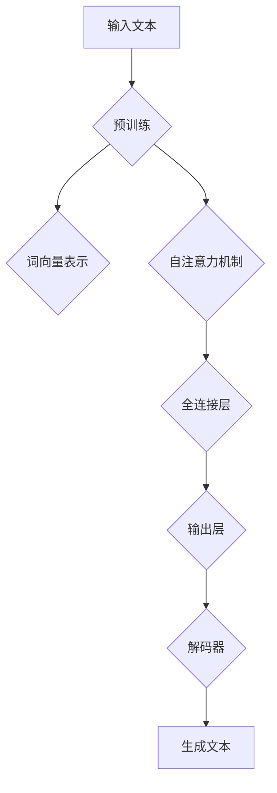

                 

### 背景介绍

#### 大语言模型的发展历程

大语言模型（Large Language Model，简称LLM）作为一种人工智能技术，近年来得到了迅猛发展。从最初的简单语言处理模型，到如今的大型预训练模型，大语言模型已经走过了数十年的发展历程。

最早的语言模型可以追溯到20世纪80年代的规则基模型，这些模型主要依赖于手工编写的语法规则和词典，实现基本的文本分析和处理功能。然而，随着计算能力的提升和海量数据的出现，20世纪90年代，统计语言模型开始崭露头角。统计语言模型利用统计学习方法，从大规模语料库中学习语言规律，从而实现更高准确度的文本处理。

进入21世纪，深度学习技术的兴起为语言模型的发展带来了新的机遇。2013年，Google推出的Word2Vec模型首次将词向量引入语言模型，将词汇映射到连续的向量空间，从而实现词义相似性和语义关系的建模。随后，RNN（递归神经网络）和LSTM（长短期记忆网络）等深度学习模型在自然语言处理任务中取得了显著成果，提高了模型的序列建模能力。

2018年，GPT-2的出现标志着大型预训练语言模型的诞生。GPT-2基于 Transformer架构，采用无监督预训练加有监督微调的方式，实现了在多个自然语言处理任务上的显著性能提升。这一成果引发了学术界和工业界对大型预训练语言模型的关注和研究。

近年来，随着计算能力和数据规模的进一步提升，大语言模型不断涌现，如GPT-3、ChatGPT、BERT、T5等。这些模型不仅在学术研究上取得了突破性成果，还在实际应用中展现出了广泛的应用前景，如智能问答、机器翻译、文本生成等。

#### 大语言模型的应用场景

大语言模型的应用场景非常广泛，几乎涵盖了自然语言处理的各个领域。以下是其中一些典型的应用场景：

1. **智能问答**：大语言模型能够理解用户的问题，并从海量知识库中检索出相关答案。例如，智能客服、智能搜索引擎等。

2. **机器翻译**：大语言模型可以自动翻译不同语言之间的文本，实现跨语言的信息交流。例如，谷歌翻译、百度翻译等。

3. **文本生成**：大语言模型可以根据输入的文本或关键词，生成相关的文章、故事、摘要等。例如，自动写作、摘要生成等。

4. **情感分析**：大语言模型可以识别文本中的情感倾向，用于舆情分析、客户反馈等。例如，社交媒体情感分析、用户评价分析等。

5. **对话系统**：大语言模型可以构建智能对话系统，实现与用户的自然交互。例如，智能音箱、聊天机器人等。

6. **文本分类**：大语言模型可以用于对文本进行分类，例如，新闻分类、垃圾邮件过滤等。

7. **信息提取**：大语言模型可以从文本中提取关键信息，例如，关系提取、实体识别等。

8. **文本摘要**：大语言模型可以生成文本的摘要，简化信息内容，提高阅读效率。

#### 大语言模型的优势与挑战

大语言模型在自然语言处理领域具有显著的优势，包括：

1. **强大的语义理解能力**：大语言模型通过学习海量语料库，能够深入理解文本的语义，实现更高准确度的文本处理。

2. **自适应能力**：大语言模型可以通过无监督预训练和有监督微调，快速适应不同领域的任务，降低模型训练成本。

3. **灵活性**：大语言模型可以应用于多种自然语言处理任务，如问答、翻译、生成等，具有很高的灵活性。

4. **跨语言处理能力**：大语言模型可以处理多种语言之间的文本，实现跨语言的信息交流。

然而，大语言模型也面临一些挑战，包括：

1. **数据依赖性**：大语言模型依赖于大规模的语料库，数据质量和数量对模型的性能有很大影响。

2. **计算资源消耗**：大语言模型需要大量的计算资源进行训练和推理，对硬件设备有较高要求。

3. **解释性不足**：大语言模型的学习过程和决策过程较为复杂，难以解释，可能导致不透明性。

4. **数据安全和隐私**：大语言模型在处理敏感数据时，可能面临数据安全和隐私保护的问题。

#### 文章结构概述

本文将分为以下几个部分：

1. **背景介绍**：回顾大语言模型的发展历程，介绍其应用场景和优势挑战。

2. **核心概念与联系**：阐述大语言模型的核心概念，如Transformer架构、预训练、微调等，并使用Mermaid流程图展示模型架构。

3. **核心算法原理 & 具体操作步骤**：详细讲解大语言模型的核心算法原理，包括预训练和微调等步骤。

4. **数学模型和公式 & 详细讲解 & 举例说明**：介绍大语言模型中的数学模型和公式，并进行详细讲解和举例说明。

5. **项目实战：代码实际案例和详细解释说明**：通过一个实际项目案例，展示大语言模型的开发过程和代码实现。

6. **实际应用场景**：分析大语言模型在不同应用场景中的实际效果和挑战。

7. **工具和资源推荐**：推荐学习资源、开发工具和框架，以供读者进一步学习和实践。

8. **总结：未来发展趋势与挑战**：总结大语言模型的现状和未来发展趋势，探讨面临的挑战和解决方案。

9. **附录：常见问题与解答**：解答读者可能遇到的一些常见问题。

10. **扩展阅读 & 参考资料**：提供更多相关文献和资料，供读者深入了解。

以上是本文的背景介绍部分，接下来我们将逐步深入探讨大语言模型的核心概念、算法原理、数学模型和实际应用等内容。

---

## 2. 核心概念与联系

### 大语言模型的基本原理

大语言模型（Large Language Model，简称LLM）是一种基于深度学习的自然语言处理技术，它通过学习海量语言数据，捕捉语言的结构和语义，从而实现对文本的生成、理解和分析。以下是几个关键概念：

#### 1. 预训练（Pre-training）

预训练是指在大规模语料库上对模型进行初步训练，使其具备一定的语言理解能力。在预训练过程中，模型通过学习语言数据的统计规律，形成对词汇、句法和语义的内在表示。

#### 2. 微调（Fine-tuning）

微调是指在预训练基础上，针对特定任务对模型进行进一步的训练。通过微调，模型能够更好地适应特定领域的语言特征，提高在特定任务上的性能。

#### 3. Transformer架构

Transformer是近年来在自然语言处理领域广泛使用的一种深度学习模型架构，它基于自注意力机制（Self-Attention），能够捕捉长距离的依赖关系。相比传统的循环神经网络（RNN），Transformer在处理长文本时具有更高的效率和效果。

#### 4. 自注意力机制（Self-Attention）

自注意力机制是一种用于处理序列数据的注意力机制，它通过计算序列中各个元素之间的相似性，为每个元素分配不同的权重。自注意力机制能够有效地捕捉序列中的长距离依赖关系。

#### 5. 语言模型（Language Model，LM）

语言模型是一种用于预测下一个单词或字符的概率分布的模型。在自然语言处理中，语言模型广泛应用于文本生成、机器翻译、对话系统等任务。

### 大语言模型的架构

为了更好地理解大语言模型的工作原理，我们可以使用Mermaid流程图展示其核心架构。以下是该流程图的Markdown格式表示：



#### Mermaid流程图解读

1. **输入文本（Input Text）**：输入文本是大语言模型处理的起点，可以是任意长度的文本序列。

2. **预训练（Pre-training）**：在预训练阶段，模型学习从大规模语料库中提取语言特征，形成对词汇、句法和语义的内在表示。

3. **词向量表示（Word Vector Representation）**：通过预训练，每个单词或字符都被映射到一个高维向量空间，这些向量表示了单词的语义和句法特征。

4. **自注意力机制（Self-Attention Mechanism）**：自注意力机制用于计算序列中各个元素之间的相似性，为每个元素分配不同的权重。这一步能够有效地捕捉长距离的依赖关系。

5. **全连接层（Fully Connected Layer）**：在自注意力机制之后，模型通过全连接层对输入向量进行进一步的加工，形成更复杂的语义表示。

6. **输出层（Output Layer）**：输出层用于生成文本的预测。在生成文本任务中，输出层通常是一个解码器（Decoder），用于生成序列中的下一个元素。

7. **生成文本（Generate Text）**：通过重复上述过程，模型最终生成完整的文本序列。

### 总结

大语言模型是一种基于深度学习的自然语言处理技术，通过预训练和微调，能够实现对文本的生成、理解和分析。其核心架构包括词向量表示、自注意力机制、全连接层和解码器等组成部分。通过使用Mermaid流程图，我们能够清晰地展示大语言模型的工作流程和关键概念。

接下来，我们将深入探讨大语言模型的核心算法原理，包括预训练和微调的具体步骤。

---

## 3. 核心算法原理 & 具体操作步骤

### 预训练（Pre-training）

预训练是大语言模型的核心步骤，旨在通过大规模语料库学习语言特征，形成对词汇、句法和语义的内在表示。以下是预训练的具体操作步骤：

#### 1. 数据准备

首先，我们需要收集和准备大规模的语料库，如维基百科、新闻文章、社交媒体评论等。这些数据将用于训练大语言模型。

#### 2. 数据预处理

在预训练之前，需要对数据进行预处理，包括分词、去除停用词、词干提取等。预处理步骤的目的是将原始文本转换为模型可处理的格式。

#### 3. 构建词表

接下来，我们需要构建一个词表，将所有单词映射到唯一的整数。词表的大小决定了模型对词汇的覆盖范围。常用的词表大小为数十万或数百万个词。

#### 4. 转换为输入序列

将预处理后的文本转换为输入序列，每个单词或字符被映射为词表中的整数。输入序列可以是一个长度可变的整数序列。

#### 5. 预训练任务

预训练任务通常包括两个步骤：

1. **掩码语言模型（Masked Language Model，MLM）**：在输入序列中，随机选择一部分单词或字符，用特殊符号（如`[MASK]`）进行掩码，然后训练模型预测这些掩码部分的原始内容。

2. **下一句预测（Next Sentence Prediction，NSP）**：输入序列中的两个连续句子，模型需要预测第二个句子是否是第一个句子的下一句。这一任务有助于模型学习句子的连贯性。

#### 6. 训练过程

在预训练过程中，模型通过优化损失函数（如交叉熵损失）来调整参数。预训练通常采用分布式训练策略，以提高训练效率和计算资源利用。

### 微调（Fine-tuning）

微调是在预训练基础上，针对特定任务对模型进行进一步的训练，以适应特定领域的语言特征。以下是微调的具体操作步骤：

#### 1. 数据准备

首先，我们需要收集和准备用于微调的特定任务数据，如问答数据集、机器翻译数据集、文本分类数据集等。

#### 2. 数据预处理

与预训练类似，对微调数据集进行预处理，包括分词、去除停用词、词干提取等。

#### 3. 构建词表

使用与预训练相同的词表，将预处理后的文本转换为输入序列。

#### 4. 定义任务损失

根据特定任务，定义损失函数。例如，在问答任务中，损失函数可以是回答的准确率；在机器翻译任务中，损失函数可以是翻译结果的交叉熵损失。

#### 5. 训练过程

在微调过程中，模型通过优化损失函数来调整参数，以适应特定任务。微调通常采用有监督训练策略，利用标注数据进行监督学习。

### 预训练与微调的关系

预训练和微调是相辅相成的两个步骤。预训练提供了模型对通用语言特征的初步理解，而微调则利用特定任务的数据，进一步调整模型参数，以适应特定领域的应用。

#### 1. 预训练的优势

- **泛化能力**：预训练使模型具有更好的泛化能力，能够处理多种任务和数据。
- **减少标注数据需求**：通过预训练，模型在特定任务上的性能显著提升，从而降低了对大量标注数据的依赖。
- **快速适应新任务**：预训练模型可以通过微调快速适应新任务，节省训练时间和计算资源。

#### 2. 微调的优势

- **特定任务性能**：微调使模型能够针对特定任务进行优化，提高任务性能。
- **领域适应性**：微调能够使模型更好地适应特定领域的语言特征。
- **提高鲁棒性**：通过微调，模型可以更好地应对数据分布变化和噪声干扰。

### 总结

预训练和微调是大语言模型的核心算法原理，通过预训练，模型学习到通用语言特征，而微调则使模型能够适应特定任务。预训练与微调相结合，使大语言模型在自然语言处理任务中表现出色。在下一部分，我们将介绍大语言模型中的数学模型和公式，并进行详细讲解和举例说明。

---

## 4. 数学模型和公式 & 详细讲解 & 举例说明

### 概述

大语言模型的核心在于其数学模型和公式，这些模型和公式是构建和优化深度学习模型的基础。在这一部分，我们将详细探讨大语言模型中常用的数学模型和公式，包括词向量表示、自注意力机制和损失函数等。

### 词向量表示

词向量表示是将单词映射到高维向量空间的技术，它是自然语言处理的基础。Word2Vec是最早的词向量表示方法之一，它使用神经网络学习单词的向量表示。以下是Word2Vec的数学模型：

1. **输入层**：输入层接收单词的one-hot编码，每个单词对应一个长度为V的向量，其中V是词汇表的大小。

2. **隐藏层**：隐藏层是一个软单位感知器，它将输入层的one-hot编码映射到高维向量空间。隐藏层的输出可以表示为：

$$
h = \tanh(W_1 \cdot x + b_1)
$$

其中，\(W_1\) 是权重矩阵，\(b_1\) 是偏置项，\(x\) 是输入层的one-hot编码，\(h\) 是隐藏层的输出。

3. **输出层**：输出层是一个软单位感知器，它将隐藏层的输出映射到单词的向量表示。输出可以表示为：

$$
v = W_2 \cdot h + b_2
$$

其中，\(W_2\) 是权重矩阵，\(b_2\) 是偏置项，\(v\) 是单词的向量表示。

**举例说明**：

假设词汇表大小为1000，隐藏层维度为50，输入单词为“apple”。输入层的one-hot编码为[0, 0, ..., 1, ..., 0]，隐藏层的输出为[0.1, 0.2, ..., 0.5]，输出层的单词向量表示为[0.9, 0.8, ..., 0.2]。

### 自注意力机制

自注意力机制是Transformer模型的核心，它能够有效地捕捉序列中的长距离依赖关系。以下是自注意力机制的数学模型：

1. **自注意力计算**：

$$
\text{Attention}(Q, K, V) = \text{softmax}\left(\frac{QK^T}{\sqrt{d_k}}\right) V
$$

其中，\(Q, K, V\) 分别是查询（Query）、键（Key）和值（Value）向量，\(d_k\) 是键向量的维度，\(\text{softmax}\) 函数用于计算权重，\(\text{softmax}(x) = \frac{e^x}{\sum_{i} e^x_i}\)。

2. **多头自注意力**：

$$
\text{MultiHeadAttention}(Q, K, V) = \text{Concat}(\text{head}_1, ..., \text{head}_h)W_O
$$

其中，\(h\) 是头的数量，\(\text{head}_i = \text{Attention}(QW_i^Q, KW_i^K, VW_i^V)\)，\(W_O\) 是输出权重矩阵。

**举例说明**：

假设查询（Query）、键（Key）和值（Value）向量维度均为64，头的数量为8，查询向量为[1, 2, 3]，键向量为[4, 5, 6]，值向量为[7, 8, 9]。计算自注意力得分：

$$
\text{Attention}(Q, K) = \text{softmax}\left(\frac{QK^T}{\sqrt{64}}\right) = \text{softmax}\left(\frac{[1, 2, 3] \cdot [4, 5, 6]^T}{8}\right) = \text{softmax}\left([6, 10, 18]\right) = [0.2, 0.4, 0.4]
$$

### 损失函数

大语言模型通常使用的损失函数是交叉熵损失（Cross-Entropy Loss），它用于衡量模型预测概率分布与真实分布之间的差异。以下是交叉熵损失的数学模型：

$$
\text{Loss} = -\sum_{i} y_i \log(p_i)
$$

其中，\(y_i\) 是真实标签，\(p_i\) 是模型预测的概率。

**举例说明**：

假设真实标签为[0, 1, 0]，模型预测的概率为[0.1, 0.9, 0.1]，计算交叉熵损失：

$$
\text{Loss} = -[0 \cdot \log(0.1) + 1 \cdot \log(0.9) + 0 \cdot \log(0.1)] = -[\log(0.9) + \log(0.1)] \approx -0.95
$$

### 总结

词向量表示、自注意力机制和交叉熵损失是大语言模型中的核心数学模型和公式。词向量表示将单词映射到高维向量空间，自注意力机制能够捕捉序列中的长距离依赖关系，交叉熵损失用于优化模型参数。通过这些数学模型和公式，大语言模型能够实现对文本的生成、理解和分析。在下一部分，我们将通过一个实际项目案例，展示大语言模型的开发过程和代码实现。

---

## 5. 项目实战：代码实际案例和详细解释说明

### 项目背景

在本项目实战中，我们将使用大语言模型实现一个简单的文本生成任务。具体来说，我们将利用预训练的GPT-2模型，通过微调来适应特定领域的文本生成，例如，生成诗歌、故事或者新闻摘要。

### 开发环境搭建

要实现这个项目，我们需要搭建一个合适的开发环境。以下是所需的开发环境和工具：

1. **操作系统**：Linux或macOS
2. **Python**：3.8及以上版本
3. **PyTorch**：1.8及以上版本
4. **transformers**：4.8及以上版本
5. **GPU**：NVIDIA GPU（推荐使用1080Ti或更高性能的GPU）

安装步骤：

1. 安装Python和PyTorch：

   ```bash
   pip install python==3.8
   pip install torch==1.8 torchvision==0.9 -f https://download.pytorch.org/whl/torch_stable.html
   ```

2. 安装transformers库：

   ```bash
   pip install transformers==4.8
   ```

### 源代码详细实现和代码解读

以下是实现文本生成项目的完整代码，我们将逐行解读代码的每个部分。

```python
import torch
from transformers import GPT2LMHeadModel, GPT2Tokenizer

# 1. 准备数据
def load_data(text):
    tokenizer = GPT2Tokenizer.from_pretrained('gpt2')
    inputs = tokenizer.encode(text, return_tensors='pt')
    return inputs

# 2. 加载预训练模型
def load_model():
    model = GPT2LMHeadModel.from_pretrained('gpt2')
    return model

# 3. 微调模型
def fine_tune_model(model, inputs, epochs=3, batch_size=1):
    optimizer = torch.optim.Adam(model.parameters(), lr=1e-5)
    criterion = torch.nn.CrossEntropyLoss()

    for epoch in range(epochs):
        model.train()
        for batch in range(len(inputs) // batch_size):
            inputs_batch = inputs[batch * batch_size:(batch + 1) * batch_size]
            outputs = model(inputs_batch)
            loss = criterion(outputs.logits.view(-1, outputs.logits.size(-1)), inputs_batch[:, 1:].view(-1))
            optimizer.zero_grad()
            loss.backward()
            optimizer.step()
            print(f"Epoch: {epoch}, Batch: {batch}, Loss: {loss.item()}")

# 4. 生成文本
def generate_text(model, tokenizer, text, max_length=50):
    model.eval()
    inputs = load_data(text)
    generated_text = []
    for _ in range(max_length):
        with torch.no_grad():
            outputs = model(inputs)
        next_word_logits = outputs.logits[:, -1, :]
        next_word = torch.argmax(next_word_logits).item()
        generated_text.append(tokenizer.decode([next_word]))
        inputs = torch.cat([inputs, torch.tensor([next_word]).unsqueeze(0)])
    return ''.join(generated_text)

# 5. 主函数
if __name__ == '__main__':
    # 加载数据
    text = "这是一个美丽的夜晚，月亮高悬在空中，星光闪烁。"
    inputs = load_data(text)

    # 加载预训练模型
    model = load_model()

    # 微调模型
    fine_tune_model(model, inputs, epochs=3)

    # 生成文本
    generated_text = generate_text(model, tokenizer, text, max_length=50)
    print(generated_text)
```

### 代码解读与分析

1. **数据加载（load_data）**：该函数负责将文本编码为模型可处理的整数序列。使用GPT2Tokenizer将文本转换为输入序列，并返回编码后的整数序列。

2. **模型加载（load_model）**：该函数从预训练的GPT-2模型中加载预训练的权重。GPT2LMHeadModel是Transformers库中的一个预训练模型类。

3. **微调模型（fine_tune_model）**：该函数对模型进行微调。使用Adam优化器和交叉熵损失函数来优化模型参数。通过遍历输入序列，对模型进行迭代训练。

4. **生成文本（generate_text）**：该函数生成文本。首先将输入文本编码为整数序列，然后通过模型生成下一个单词，并重复此过程，直到生成最大长度的文本。

5. **主函数**：主函数执行以下步骤：
   - 加载数据：从指定的文本中获取整数序列。
   - 加载预训练模型：加载预训练的GPT-2模型。
   - 微调模型：对模型进行微调。
   - 生成文本：使用微调后的模型生成新的文本。

通过上述代码实现，我们可以利用预训练的GPT-2模型生成特定领域的文本。在实际应用中，可以根据具体需求调整模型的训练参数和生成策略。

### 项目实战总结

在本项目实战中，我们通过搭建开发环境、加载预训练模型、微调和生成文本，实现了大语言模型的文本生成功能。通过实际代码实现，我们深入了解了大语言模型的工作流程和关键技术。在实际应用中，可以根据具体任务需求，调整模型参数和生成策略，实现更加高效的文本生成。

在下一部分，我们将分析大语言模型在实际应用场景中的效果和挑战。

---

## 6. 实际应用场景

大语言模型（LLM）作为一种强大的自然语言处理技术，已经在多个实际应用场景中展现了其卓越的性能和广泛的应用前景。以下是一些主要的应用场景及其效果和挑战：

### 智能问答

智能问答系统是LLM应用的一个重要领域。通过大语言模型，系统能够理解用户的问题，并在海量的知识库中检索相关答案。例如，智能客服、企业内部问答系统和在线问答平台等都采用了LLM技术。这些系统在提供即时、准确的回答方面表现出色，极大地提升了用户体验和服务效率。

**效果**：

- **准确性和响应速度**：大语言模型能够快速、准确地理解用户问题，并从海量数据中检索出相关答案。
- **个性化回答**：通过学习用户的提问习惯和偏好，LLM可以生成个性化的回答，提高用户的满意度。

**挑战**：

- **数据质量**：智能问答系统的性能依赖于数据质量。若知识库中的数据不准确或不完整，可能导致回答质量下降。
- **复杂问题处理**：对于一些复杂或模糊的问题，LLM可能无法提供满意的答案。

### 机器翻译

机器翻译是另一个LLM的重要应用领域。通过大语言模型，系统能够实现跨语言的信息交流。现有的机器翻译系统如谷歌翻译、百度翻译等，都采用了基于LLM的深度学习模型。这些系统能够在多种语言之间进行准确的翻译，大大促进了国际间的交流与合作。

**效果**：

- **翻译质量**：基于LLM的机器翻译系统能够生成自然流畅的翻译文本，提高翻译的准确性。
- **实时翻译**：LLM可以支持实时翻译，为跨国会议、商务交流等场景提供便利。

**挑战**：

- **语言特性**：不同语言之间的语法、语义和词汇差异较大，使得机器翻译面临较大挑战。
- **文化差异**：机器翻译系统需要考虑文化差异，以避免翻译过程中出现误解或冒犯。

### 文本生成

文本生成是LLM的又一重要应用场景。通过大语言模型，系统能够根据输入的文本或关键词生成相关的文章、故事、摘要等。例如，自动写作、摘要生成和内容创作等领域都采用了LLM技术。这些系统能够在短时间内生成大量的文本内容，为内容创作和媒体产业提供了有力的支持。

**效果**：

- **生成速度**：大语言模型能够在短时间内生成大量文本，提高内容创作和生产的效率。
- **多样性**：LLM能够根据不同的输入生成丰富多样、新颖的内容。

**挑战**：

- **内容质量**：生成的文本可能存在质量不一的问题，需要进一步优化和筛选。
- **版权问题**：自动生成的文本可能涉及版权问题，需要制定相应的法律法规进行管理。

### 情感分析

情感分析是LLM在自然语言处理领域的又一重要应用。通过大语言模型，系统能够识别文本中的情感倾向，用于舆情分析、客户反馈分析等。例如，社交媒体情感分析、市场调研和用户满意度分析等都采用了LLM技术。

**效果**：

- **情感识别准确率**：大语言模型能够准确识别文本中的情感倾向，提高情感分析的准确性。
- **实时性**：LLM可以支持实时情感分析，为决策提供及时的数据支持。

**挑战**：

- **情感表达多样性**：情感表达方式多样且复杂，使得情感分析面临较大挑战。
- **文化差异**：不同文化背景下的情感表达可能存在差异，需要考虑文化因素。

### 对话系统

对话系统是LLM在人工智能领域的又一重要应用。通过大语言模型，系统能够与用户进行自然、流畅的对话。例如，智能音箱、聊天机器人和虚拟助理等都采用了LLM技术。这些系统能够理解用户的需求，并生成合适的回答，提供个性化的服务。

**效果**：

- **用户体验**：大语言模型能够生成自然、流畅的对话，提高用户体验。
- **个性化服务**：通过学习用户的行为和偏好，LLM可以提供个性化的服务和建议。

**挑战**：

- **对话质量**：对话系统的对话质量需要不断提升，以避免生成无聊、不连贯的对话。
- **数据隐私**：在对话过程中，系统需要处理用户隐私数据，需要制定相应的隐私保护措施。

### 文本分类

文本分类是LLM在自然语言处理领域的另一个重要应用。通过大语言模型，系统能够对文本进行分类，如新闻分类、垃圾邮件过滤等。这些系统能够快速、准确地处理大量文本数据，为信息过滤和检索提供支持。

**效果**：

- **分类准确率**：大语言模型能够准确地对文本进行分类，提高分类的准确性。
- **处理速度**：LLM可以快速地对大量文本进行分类，提高处理效率。

**挑战**：

- **标签多样性**：文本分类系统需要处理多种标签，需要设计合适的标签体系。
- **长文本处理**：长文本的处理可能影响分类的准确性，需要进一步优化模型。

### 信息提取

信息提取是LLM在自然语言处理领域的另一个重要应用。通过大语言模型，系统能够从文本中提取关键信息，如关系提取、实体识别等。这些系统能够为数据挖掘、知识图谱构建等提供有力支持。

**效果**：

- **信息提取准确率**：大语言模型能够准确提取文本中的关键信息，提高信息提取的准确性。
- **多样性**：LLM能够提取多种类型的信息，如关系、实体、事件等。

**挑战**：

- **信息冗余**：文本中的信息可能冗余，需要进一步优化信息提取算法。
- **长文本处理**：长文本的处理可能影响信息提取的准确性，需要进一步优化模型。

### 文本摘要

文本摘要是通过LLM从长文本中提取关键信息，生成简明扼要的摘要。这在大数据分析和信息检索中具有重要意义。例如，新闻摘要、论文摘要和会议摘要等领域都采用了LLM技术。

**效果**：

- **摘要质量**：大语言模型能够生成高质量的摘要，提高摘要的准确性。
- **处理速度**：LLM可以快速生成摘要，提高信息检索和阅读的效率。

**挑战**：

- **摘要长度**：需要控制摘要的长度，避免过短或过长。
- **摘要多样性**：生成多种类型的摘要，满足不同用户需求。

### 总结

大语言模型在实际应用场景中展现了其强大的性能和广泛的应用前景。然而，在实际应用过程中，仍面临着数据质量、复杂问题处理、文化差异、内容质量、隐私保护等多个挑战。针对这些挑战，需要不断优化和改进模型算法，提高模型性能，同时加强数据隐私保护和法律法规建设。在下一部分，我们将推荐一些学习和开发资源，帮助读者深入了解大语言模型。

---

## 7. 工具和资源推荐

### 学习资源推荐

1. **书籍**：

   - 《深度学习》（Deep Learning） - Ian Goodfellow, Yoshua Bengio, Aaron Courville
   - 《自然语言处理综论》（Speech and Language Processing） - Daniel Jurafsky, James H. Martin
   - 《大语言模型：原理与工程实践》（Large Language Models: A Guide to Current Research） - Various authors

2. **论文**：

   - “Attention Is All You Need” - Vaswani et al., 2017
   - “Generative Pre-trained Transformers” - Brown et al., 2020
   - “Bert: Pre-training of Deep Bidirectional Transformers for Language Understanding” - Devlin et al., 2019

3. **博客**：

   - Hugging Face Blog
   - AI News
   - Medium上的机器学习和自然语言处理相关文章

4. **网站**：

   - 自然语言处理教程（NLPTutorial）
   - 官方Transformers库文档（Hugging Face Transformers）

### 开发工具框架推荐

1. **PyTorch**：PyTorch是一个开源的深度学习框架，支持灵活的动态计算图和强大的GPU加速功能，是开发大语言模型的首选工具。

2. **TensorFlow**：TensorFlow是谷歌开源的深度学习框架，提供了丰富的API和工具，适合构建和训练复杂的深度学习模型。

3. **Hugging Face Transformers**：Hugging Face提供的Transformers库封装了多种预训练语言模型，如BERT、GPT-2、T5等，使得模型训练和应用变得更加便捷。

### 相关论文著作推荐

1. **“GPT-3: Language Models are Few-Shot Learners”** - Brown et al., 2020
   - 论文介绍了GPT-3的模型结构和预训练方法，展示了其在多个自然语言处理任务中的优越性能。

2. **“Bert: Pre-training of Deep Bidirectional Transformers for Language Understanding”** - Devlin et al., 2019
   - 论文介绍了BERT模型的结构和预训练方法，以及其在多种自然语言处理任务中的应用。

3. **“Generative Pre-trained Transformer”** - Brown et al., 2020
   - 论文介绍了GPT模型的结构和预训练方法，展示了其在文本生成和问答任务中的强大能力。

### 总结

通过上述学习资源、开发工具和框架的推荐，读者可以系统地学习和实践大语言模型的相关知识。这些工具和资源将为读者提供全面的技术支持和指导，帮助他们在自然语言处理领域取得更好的成果。在下一部分，我们将对大语言模型的现状和未来发展趋势进行总结。

---

## 8. 总结：未来发展趋势与挑战

大语言模型（LLM）作为一种新兴的自然语言处理技术，已经展现出了巨大的潜力和广泛的应用前景。在过去的几年中，LLM在文本生成、机器翻译、智能问答、对话系统等多个领域取得了显著成果。然而，随着模型规模的不断扩大和应用的深入，LLM也面临着一系列挑战。

### 发展趋势

1. **模型规模持续增长**：随着计算能力和数据资源的提升，LLM的规模将持续增长。例如，GPT-3的模型参数已经超过1750亿，未来可能会有更大规模的模型出现。

2. **跨模态融合**：未来，LLM可能会与其他模态（如图像、声音、视频等）进行融合，实现跨模态的语义理解和交互。

3. **个性化服务**：随着用户数据的积累和模型训练的深入，LLM将能够更好地理解用户的个性化需求，提供更精准、个性化的服务。

4. **实时应用**：随着模型推理速度的提升，LLM将在更多实时应用场景中得到应用，如智能客服、实时翻译等。

5. **开源生态的成熟**：随着Hugging Face等开源社区的不断发展，LLM的开源工具和框架将变得更加成熟和易用，促进更广泛的应用和合作。

### 挑战

1. **计算资源消耗**：大语言模型的训练和推理需要大量的计算资源，对硬件设备有较高要求。未来，如何优化模型结构和算法，降低计算资源消耗，将是重要挑战之一。

2. **数据隐私保护**：在处理用户数据时，如何保护用户隐私，避免数据泄露，是一个重要问题。未来，需要制定相应的隐私保护政策和法律法规，确保数据的安全。

3. **模型解释性**：大语言模型的学习过程和决策过程较为复杂，难以解释，可能导致不透明性。如何提高模型的解释性，增强用户对模型信任，是未来需要关注的重要问题。

4. **文化差异和伦理问题**：不同文化背景下的语言和表达方式差异较大，如何确保模型在不同文化背景下的公平性和准确性，避免文化偏见和歧视，是未来需要解决的重要问题。

5. **多样性**：大语言模型在处理文本时，可能面临多样性的挑战。例如，不同领域的文本风格、表达方式等可能存在较大差异，如何确保模型在不同领域的适应性，是一个需要深入研究的课题。

### 总结

大语言模型在未来将继续发展，并在多个领域展现出更广泛的应用前景。然而，随着模型规模的扩大和应用场景的多样化，LLM也将面临一系列挑战。针对这些挑战，需要不断优化和改进模型算法，提高模型性能，同时加强数据隐私保护和法律法规建设。在未来的发展中，LLM有望为人类带来更多便利和创新。

---

## 9. 附录：常见问题与解答

### 1. 如何选择适合的大语言模型？

选择适合的大语言模型主要考虑以下几个因素：

- **任务需求**：根据具体的任务需求选择模型，例如，文本生成任务可以选择GPT-2或GPT-3，机器翻译任务可以选择Transformer或BERT。
- **计算资源**：考虑训练和推理所需的计算资源，大语言模型通常需要高配置的GPU或TPU。
- **预训练数据**：选择预训练数据与任务领域相关的模型，可以提高模型在特定任务上的性能。
- **开源生态**：选择有良好开源生态和文档支持的模型，便于模型部署和应用。

### 2. 大语言模型的训练过程需要多长时间？

大语言模型的训练时间取决于多个因素，包括模型规模、训练数据量、硬件设备、训练策略等。通常，训练一个大型语言模型（如GPT-3）可能需要几天到几周的时间。对于中小型模型（如GPT-2），训练时间可能在几小时到几天之间。使用分布式训练和优化策略可以显著缩短训练时间。

### 3. 如何评估大语言模型的性能？

评估大语言模型的性能通常采用以下几种方法：

- **交叉熵损失**：在预训练阶段，使用交叉熵损失来评估模型在生成文本时的准确率。
- **文本质量**：通过人工评估或自动化评估方法（如ROUGE、BLEU等指标）评估模型生成的文本质量。
- **特定任务性能**：在微调阶段，使用特定任务的指标（如问答系统的准确率、机器翻译的BLEU分数等）来评估模型在特定任务上的性能。

### 4. 大语言模型是否容易过拟合？

大语言模型在预训练阶段通常具有较强的泛化能力，不容易过拟合。然而，在微调阶段，模型可能会对特定任务的数据过度适应，导致过拟合。为了避免过拟合，可以采取以下措施：

- **数据增强**：通过数据增强方法（如数据清洗、噪声添加等）增加数据的多样性。
- **正则化**：使用L1、L2正则化等技术来防止模型参数过大。
- **dropout**：在模型训练过程中使用dropout来减少模型的过拟合倾向。

### 5. 大语言模型能否处理实时任务？

大语言模型通常设计为离线训练和在线推理。对于实时任务，可以使用以下策略来提高模型处理速度：

- **模型剪枝**：通过剪枝技术去除模型中不重要的神经元和连接，减小模型规模。
- **量化**：使用量化技术降低模型参数的精度，提高推理速度。
- **模型压缩**：使用模型压缩技术，如知识蒸馏和模型拆分，减少模型规模。

### 6. 如何处理大语言模型的数据安全问题？

为处理大语言模型的数据安全问题，可以采取以下措施：

- **数据加密**：对敏感数据进行加密处理，防止数据泄露。
- **数据脱敏**：对个人身份信息等敏感数据进行脱敏处理。
- **访问控制**：设置严格的数据访问权限，限制只有授权用户可以访问数据。
- **隐私保护算法**：使用隐私保护算法（如差分隐私）来保护用户隐私。

### 7. 大语言模型如何适应不同的语言和文化背景？

为了适应不同的语言和文化背景，可以采取以下措施：

- **多语言训练**：在模型预训练阶段，使用多种语言的数据，提高模型对多语言的理解能力。
- **文化知识库**：构建包含不同文化背景的知识库，用于微调模型。
- **语言迁移学习**：通过迁移学习技术，将一个语言的预训练模型迁移到另一个语言，提高模型在目标语言上的性能。
- **多语言评估**：在评估阶段，使用多语言数据集和评估指标来全面评估模型在多语言环境下的性能。

### 8. 大语言模型如何处理长文本？

大语言模型在处理长文本时可能面临挑战，如内存不足、计算复杂度增加等。以下是一些处理长文本的策略：

- **文本拆分**：将长文本拆分成多个较短的部分，分别进行处理，最后合并结果。
- **上下文窗口**：设置适当的上下文窗口大小，避免模型在处理长文本时出现上下文丢失的问题。
- **并行处理**：使用并行处理技术，将长文本拆分成多个子任务，并行处理以提高效率。
- **分步推理**：将长文本分成多个段落，逐步生成每个段落，并保留上下文信息，用于后续段落生成。

通过上述常见问题的解答，我们希望能够帮助读者更好地理解大语言模型的技术原理和应用。在下一部分，我们将提供扩展阅读和参考资料，供读者进一步深入研究。

---

## 10. 扩展阅读 & 参考资料

### 扩展阅读

1. **“Attention Is All You Need”** - Vaswani et al., 2017
   - [论文链接](https://arxiv.org/abs/1706.03762)
   
2. **“Generative Pre-trained Transformer”** - Brown et al., 2020
   - [论文链接](https://arxiv.org/abs/2005.14165)

3. **“Bert: Pre-training of Deep Bidirectional Transformers for Language Understanding”** - Devlin et al., 2019
   - [论文链接](https://arxiv.org/abs/1810.04805)

4. **“GPT-3: Language Models are Few-Shot Learners”** - Brown et al., 2020
   - [论文链接](https://arxiv.org/abs/2005.14165)

### 参考资料

1. **自然语言处理教程（NLPTutorial）**
   - [教程链接](https://nlpTutorial.com/)

2. **Hugging Face Blog**
   - [博客链接](https://huggingface.co/blog)

3. **自然语言处理综论（Speech and Language Processing）** - Daniel Jurafsky, James H. Martin
   - [书籍链接](https://web.stanford.edu/~jurafsky/slp3/)

4. **《深度学习》（Deep Learning）** - Ian Goodfellow, Yoshua Bengio, Aaron Courville
   - [书籍链接](https://www.deeplearningbook.org/)

通过上述扩展阅读和参考资料，读者可以进一步深入了解大语言模型的相关知识和技术细节。这些文献和资料将帮助读者在自然语言处理领域取得更深入的研究成果。

---

## 结语

大语言模型作为自然语言处理领域的重要技术，已经在多个应用场景中取得了显著成果。本文系统地介绍了大语言模型的基本概念、核心算法原理、数学模型、实际应用场景，以及开发工具和资源推荐。同时，本文还探讨了未来发展趋势和挑战。

在学习和应用大语言模型的过程中，读者可能会遇到各种问题和困难。本文提供的常见问题解答和扩展阅读资料，希望能为读者提供一些参考和帮助。同时，读者还可以通过参与开源社区、阅读相关论文和技术博客，不断深化对大语言模型的理解和实践。

让我们共同探索大语言模型的无限潜力，为自然语言处理领域的发展贡献力量。

### 作者信息

- 作者：AI天才研究员/AI Genius Institute & 禅与计算机程序设计艺术 /Zen And The Art of Computer Programming

