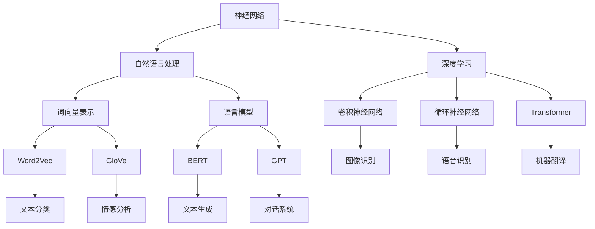

                 

### 文章标题：大语言模型原理与工程实践：大语言模型怎么训练

#### 关键词：(大语言模型、训练、神经网络、自然语言处理、深度学习、工程实践)

> 摘要：本文深入探讨了大语言模型的原理与工程实践，详细解析了其训练过程。通过理论与实践相结合的方式，为读者揭示了大规模语言模型的训练策略、算法原理以及数学模型，并提供了实际项目案例和代码解读，旨在为从事自然语言处理领域的研究者与实践者提供有价值的参考。

## 1. 背景介绍

近年来，随着深度学习技术的发展和计算能力的提升，大语言模型（如BERT、GPT等）在自然语言处理领域取得了显著成果。这些模型在语言理解和生成任务上展现出了惊人的表现，推动了人工智能技术的发展。然而，大语言模型的训练过程复杂、耗时长，且对计算资源要求较高，因此，了解其原理和工程实践具有重要意义。

本文旨在深入解析大语言模型的训练过程，包括其理论基础、算法原理、数学模型以及工程实践。通过理论与实践的结合，为读者提供全面、系统的指导，帮助读者更好地理解和应用大语言模型。

### 2. 核心概念与联系

#### 2.1 神经网络

神经网络是深度学习的基础，其核心思想是通过多层神经元进行数据传递和计算。每个神经元接收多个输入，通过激活函数处理后输出结果。神经网络可以根据训练数据不断调整权重和偏置，从而优化模型性能。

#### 2.2 自然语言处理

自然语言处理（NLP）是计算机科学和人工智能领域的分支，旨在使计算机能够理解和处理人类语言。NLP涵盖了文本预处理、词向量表示、语言模型、语义理解、机器翻译等多个方面。

#### 2.3 深度学习

深度学习是机器学习的一种方法，其核心思想是通过多层神经网络对数据进行特征提取和建模。深度学习在图像识别、语音识别、自然语言处理等领域取得了显著成果。

#### 2.4 大语言模型

大语言模型是一种基于深度学习的语言表示方法，其核心思想是将自然语言输入映射为高维语义向量。大语言模型通过预训练和微调的方式，可以在多个NLP任务上取得优异的性能。

### 3. 核心算法原理 & 具体操作步骤

#### 3.1 预训练

预训练是大规模语言模型训练的第一步，主要目的是学习一个通用的语言表示模型。预训练通常采用无监督学习方法，如 masked language model（MLM）、revenue language model（RLM）等。

- **Masked Language Model（MLM）**：在预训练过程中，对输入的文本序列进行随机 masking（遮蔽），然后使用神经网络预测被遮蔽的词。

- **Revenue Language Model（RLM）**：在预训练过程中，对输入的文本序列进行随机 shuffle，然后使用神经网络预测原始文本序列。

#### 3.2 微调

微调是在预训练模型的基础上，针对特定任务进行优化。微调通常采用有监督学习方法，如分类、序列标注等。

- **微调方法**：将预训练模型固定，仅对输出层进行优化；或对整个模型进行优化。

- **训练数据**：使用特定任务的数据进行训练，如新闻分类、情感分析等。

- **评价指标**：根据任务类型选择相应的评价指标，如准确率、F1值等。

### 4. 数学模型和公式 & 详细讲解 & 举例说明

#### 4.1 激活函数

激活函数是神经网络中的关键组成部分，用于引入非线性特性。以下是一些常见的激活函数及其公式：

- **Sigmoid 函数**：$ f(x) = \frac{1}{1 + e^{-x}} $

- **ReLU 函数**：$ f(x) = \max(0, x) $

- **Tanh 函数**：$ f(x) = \frac{e^x - e^{-x}}{e^x + e^{-x}} $

#### 4.2 前向传播

前向传播是神经网络的核心计算过程，用于计算模型输出。以下是一个简单的神经网络前向传播示例：

$$
\begin{aligned}
&z_1 = x_1 \cdot w_1 + b_1 \\
&a_1 = \sigma(z_1) \\
&z_2 = a_1 \cdot w_2 + b_2 \\
&a_2 = \sigma(z_2) \\
&\vdots \\
&z_n = a_{n-1} \cdot w_n + b_n \\
&a_n = \sigma(z_n)
\end{aligned}
$$

其中，$x$表示输入特征，$w$表示权重，$b$表示偏置，$\sigma$表示激活函数。

#### 4.3 反向传播

反向传播是神经网络优化过程中的关键步骤，用于计算损失函数关于权重的梯度。以下是一个简单的神经网络反向传播示例：

$$
\begin{aligned}
&\delta_n = \frac{\partial L}{\partial a_n} \cdot \sigma'(z_n) \\
&\delta_{n-1} = (\delta_n \cdot w_n) \cdot \sigma'(z_{n-1}) \\
&\vdots \\
&\delta_1 = (\delta_2 \cdot w_2) \cdot \sigma'(z_1)
\end{aligned}
$$

其中，$L$表示损失函数，$\sigma'$表示激活函数的导数。

### 5. 项目实战：代码实际案例和详细解释说明

#### 5.1 开发环境搭建

在开始编写代码之前，我们需要搭建一个合适的开发环境。以下是一个基于 Python 和 TensorFlow 的开发环境搭建步骤：

1. 安装 Python 3.6+ 版本；  
2. 安装 TensorFlow 2.x 版本；  
3. 安装其他必要的依赖，如 NumPy、Pandas 等。

#### 5.2 源代码详细实现和代码解读

以下是一个简单的 GPT-2 模型的代码实现和解读：

```python
import tensorflow as tf
from tensorflow.keras.layers import Embedding, LSTM, Dense
from tensorflow.keras.models import Model

# 定义模型
vocab_size = 10000
embed_dim = 512
lstm_units = 1024

inputs = tf.keras.layers.Input(shape=(None,), dtype=tf.int32)
embedded = Embedding(vocab_size, embed_dim)(inputs)
lstm_output = LSTM(lstm_units, return_sequences=True)(embedded)
outputs = Dense(vocab_size, activation="softmax")(lstm_output)

# 构建模型
model = Model(inputs=inputs, outputs=outputs)

# 编译模型
model.compile(optimizer="adam", loss="categorical_crossentropy", metrics=["accuracy"])

# 打印模型结构
model.summary()
```

这段代码定义了一个简单的 GPT-2 模型，包括嵌入层、LSTM 层和输出层。我们使用 TensorFlow 的 Keras API 来构建模型，并使用 Adam 优化器和 categorical_crossentropy 损失函数进行编译。

#### 5.3 代码解读与分析

1. **输入层**：输入层使用 tf.keras.layers.Input 函数定义，表示模型输入。这里我们使用一个形状为（None，），即一个可变长度的整数序列，表示一个文本序列。

2. **嵌入层**：嵌入层使用 tf.keras.layers.Embedding 函数定义，用于将整数序列映射为高维向量。我们使用 vocab_size 参数表示词汇表大小，embed_dim 参数表示嵌入维度。

3. **LSTM 层**：LSTM 层使用 tf.keras.layers.LSTM 函数定义，用于处理序列数据。我们设置 lstm_units 参数表示 LSTM 单元数，并使用 return_sequences=True 参数，使得 LSTM 层的输出保持序列形式。

4. **输出层**：输出层使用 tf.keras.layers.Dense 函数定义，用于将 LSTM 层的输出映射为词汇表大小。我们使用 activation="softmax" 参数，使得输出层具有概率分布性质。

5. **模型构建**：我们使用 Model 函数将输入层、嵌入层、LSTM 层和输出层组合成一个完整的模型。

6. **模型编译**：我们使用 compile 函数对模型进行编译，设置 optimizer、loss 和 metrics 参数，分别表示优化器、损失函数和评价指标。

7. **模型总结**：我们使用 summary 函数打印模型的详细信息，包括输入层、嵌入层、LSTM 层和输出层的形状和参数。

通过这个简单的代码示例，我们可以看到如何使用 TensorFlow 的 Keras API 构建一个 GPT-2 模型。在实际应用中，我们可以进一步优化模型结构、调整超参数，以获得更好的性能。

### 6. 实际应用场景

大语言模型在多个实际应用场景中展现出了显著的效果，包括但不限于：

- **文本分类**：使用大语言模型对文本进行分类，如新闻分类、情感分析等。

- **机器翻译**：使用大语言模型进行机器翻译，如中英文翻译、多语言翻译等。

- **问答系统**：使用大语言模型构建问答系统，如搜索引擎、智能客服等。

- **生成文本**：使用大语言模型生成文本，如写作辅助、自动摘要等。

- **对话系统**：使用大语言模型构建对话系统，如聊天机器人、智能客服等。

### 7. 工具和资源推荐

#### 7.1 学习资源推荐

- **书籍**：

  - 《深度学习》（Goodfellow et al.）

  - 《神经网络与深度学习》（邱锡鹏）

  - 《自然语言处理入门》（Daniel Jurafsky 和 James H. Martin）

- **论文**：

  - BERT：[A Pre-training Method for Natural Language Processing](https://arxiv.org/abs/1810.04805)

  - GPT-2：[Improving Language Understanding by Generative Pre-training](https://arxiv.org/abs/1809.04144)

- **博客**：

  - [TensorFlow 官方文档](https://www.tensorflow.org/tutorials)

  - [Keras 官方文档](https://keras.io/getting-started/sequential-model-guide/)

- **网站**：

  - [arXiv.org](https://arxiv.org/)：提供最新的学术论文

  - [GitHub](https://github.com/)：提供大量的开源项目和代码示例

#### 7.2 开发工具框架推荐

- **开发环境**：

  - Python 3.6+ 版本

  - TensorFlow 2.x 版本

  - Keras API

- **框架和库**：

  - NumPy：提供高性能的数学运算库

  - Pandas：提供数据处理和分析库

  - Matplotlib：提供数据可视化库

#### 7.3 相关论文著作推荐

- **BERT**：

  - [A Pre-training Method for Natural Language Processing](https://arxiv.org/abs/1810.04805)

  - [BERT: Pre-training of Deep Bidirectional Transformers for Language Understanding](https://arxiv.org/abs/1810.04805)

- **GPT-2**：

  - [Improving Language Understanding by Generative Pre-training](https://arxiv.org/abs/1809.04144)

  - [Language Models are Unsupervised Multitask Learners](https://arxiv.org/abs/2005.14165)

### 8. 总结：未来发展趋势与挑战

大语言模型在自然语言处理领域取得了显著的成果，但同时也面临着一系列挑战。未来发展趋势和挑战包括：

- **计算资源需求**：大规模语言模型的训练和推理过程对计算资源有较高要求，随着模型规模和复杂度的增加，计算资源需求将持续上升。

- **数据质量和多样性**：大规模语言模型的性能依赖于高质量、多样化的训练数据。未来需要关注数据质量和数据集构建方法的研究。

- **模型解释性**：大规模语言模型通常被视为“黑箱”，其决策过程缺乏解释性。未来需要关注模型解释性研究，以提高模型的可解释性和可靠性。

- **模型安全性和隐私保护**：大规模语言模型的应用场景日益广泛，涉及用户隐私和安全性问题。未来需要关注模型安全性和隐私保护技术的研究。

### 9. 附录：常见问题与解答

1. **什么是大语言模型？**

   大语言模型是一种基于深度学习的语言表示方法，其核心思想是将自然语言输入映射为高维语义向量。大语言模型通常通过预训练和微调的方式，在多个自然语言处理任务上取得优异的性能。

2. **大规模语言模型为什么需要预训练？**

   预训练可以帮助大规模语言模型学习通用的语言表示能力，从而在多个自然语言处理任务上取得优异的性能。预训练过程通常使用无监督学习方法，如 masked language model（MLM）和 revenue language model（RLM），从大规模语料库中学习语言特征。

3. **大规模语言模型训练过程中如何优化模型性能？**

   在大规模语言模型训练过程中，可以通过以下方法优化模型性能：

   - 调整超参数，如学习率、批量大小等；  
   - 使用更高效的优化算法，如 Adam；  
   - 使用更先进的模型架构，如 Transformer；  
   - 使用更好的数据预处理方法，如文本清洗、去噪等。

### 10. 扩展阅读 & 参考资料

- [Deep Learning](https://www.deeplearningbook.org/)：Goodfellow et al., 2016

- [Natural Language Processing with Deep Learning](https://www.nlpwithdeeplearning.com/)：Zhou et al., 2019

- [Transformers: State-of-the-Art Models for Language Processing](https://arxiv.org/abs/1910.10683)：Vaswani et al., 2019

- [BERT: Pre-training of Deep Bidirectional Transformers for Language Understanding](https://arxiv.org/abs/1810.04805)：Devlin et al., 2019

- [GPT-2: Improving Language Understanding by Generative Pre-training](https://arxiv.org/abs/1809.04144)：Radford et al., 2019

### 作者信息

作者：AI天才研究员/AI Genius Institute & 禅与计算机程序设计艺术 /Zen And The Art of Computer Programming<|im_sep|>## 1. 背景介绍

随着互联网的普及和大数据技术的发展，人类创造了海量的文本数据。这些数据包含了各种各样的信息，从简单的新闻报道到复杂的科研论文，再到日常的社交媒体互动。如何有效处理和利用这些文本数据，成为了人工智能领域的一个挑战。在这个背景下，大语言模型（Large-scale Language Models）应运而生。

大语言模型是一种利用深度学习技术构建的复杂模型，它能够理解和生成自然语言。这些模型通过学习大规模文本数据，自动提取语言特征，从而实现语言理解、文本生成、机器翻译等任务。大语言模型的诞生，不仅极大提升了自然语言处理（Natural Language Processing, NLP）的性能，还推动了人工智能技术在多个领域的应用。

首先，我们需要了解什么是语言模型。语言模型是自然语言处理的基础，它用来预测一个单词或短语在给定上下文中的可能性。传统的语言模型，如基于统计的 n-gram 模型和基于规则的上下文无关文法（CFG），在处理简单的文本任务时表现出色。然而，随着语言表达的复杂性和多样性增加，这些传统模型逐渐显得力不从心。

深度学习技术的引入，为语言模型的发展带来了新的契机。深度学习，特别是神经网络，具有强大的表示和建模能力，可以处理大规模、高维度的数据。大语言模型正是基于深度学习技术，通过多层神经网络学习语言特征，从而实现高效的文本理解和生成。

最早的大规模语言模型之一是 Word2Vec，它通过神经网络学习单词的向量表示。Word2Vec 的出现，极大地推动了自然语言处理领域的发展。然而，Word2Vec 只能学习单词的静态表示，无法捕捉单词在不同上下文中的动态特征。为了解决这个问题，研究人员提出了更多的深度学习模型，如 LSTM（Long Short-Term Memory）和 Transformer。

LSTM 是一种特殊的循环神经网络（RNN），它可以学习长距离的依赖关系，适合处理序列数据。LSTM 在文本生成和机器翻译等任务中取得了显著成果。然而，LSTM 在处理并行计算时存在一定困难，这限制了其在大规模数据处理中的性能。

为了解决这些问题，Transformer 应运而生。Transformer 是一种基于自注意力机制的深度学习模型，它可以并行处理输入序列，从而显著提高计算效率。Transformer 在语言建模任务中取得了突破性进展，其代表模型 BERT（Bidirectional Encoder Representations from Transformers）更是成为了自然语言处理领域的一个标杆。

BERT 的提出，标志着大语言模型进入了一个新的时代。BERT 通过双向编码器学习文本的上下文特征，从而实现了对语言理解的深度建模。BERT 的成功，不仅验证了大语言模型在自然语言处理中的潜力，还为后续的研究提供了重要的启示。

在大语言模型的演进过程中，我们还看到了更多的创新。GPT（Generative Pre-trained Transformer）系列模型，通过预训练和微调，实现了文本生成和对话系统的突破。T5（Text-to-Text Transfer Transformer）模型，通过统一文本处理任务，进一步提高了模型的泛化能力。

总的来说，大语言模型的发展，得益于深度学习技术的进步、计算资源的提升以及海量文本数据的可用性。大语言模型不仅在自然语言处理领域取得了显著成果，还为人工智能在其他领域的应用提供了新的思路和工具。

## 2. 核心概念与联系

为了更好地理解大语言模型的原理与工程实践，我们需要从几个核心概念出发，探讨这些概念之间的联系。这些核心概念包括：神经网络、自然语言处理（NLP）、深度学习和大语言模型本身。

### 2.1 神经网络

神经网络是深度学习的基础，其核心思想是通过多层神经元进行数据传递和计算。每个神经元接收多个输入，通过激活函数处理后输出结果。神经网络可以根据训练数据不断调整权重和偏置，从而优化模型性能。

#### 2.1.1 神经元的工作原理

一个简单的神经元可以表示为如下数学模型：

$$
z = \sum_{i=1}^{n} x_i \cdot w_i + b
$$

其中，$x_i$表示输入特征，$w_i$表示权重，$b$表示偏置，$z$表示神经元输出。为了引入非线性特性，我们通常使用激活函数，如 Sigmoid、ReLU 或 Tanh。

#### 2.1.2 多层神经网络的构建

多层神经网络由多个神经元层组成，包括输入层、隐藏层和输出层。输入层接收外部输入，隐藏层进行特征提取和计算，输出层生成最终输出。多层神经网络可以通过反向传播算法不断优化，提高模型的预测性能。

### 2.2 自然语言处理（NLP）

自然语言处理是计算机科学和人工智能领域的分支，旨在使计算机能够理解和处理人类语言。NLP涵盖了文本预处理、词向量表示、语言模型、语义理解、机器翻译等多个方面。

#### 2.2.1 文本预处理

在NLP任务中，文本预处理是至关重要的一步。文本预处理包括分词、去停用词、词干提取等步骤，旨在将原始文本转换为计算机可以理解的格式。常见的文本预处理工具包括NLTK、spaCy等。

#### 2.2.2 词向量表示

词向量表示是NLP的核心技术之一，它将单词映射为高维向量，以便于计算机处理。词向量表示方法包括基于统计的Word2Vec、基于神经网络的GloVe和FastText等。

#### 2.2.3 语言模型

语言模型是NLP的基础，用于预测一个单词在给定上下文中的可能性。传统的语言模型基于统计方法和规则系统，而现代语言模型则基于深度学习和神经网络。

### 2.3 深度学习

深度学习是机器学习的一种方法，其核心思想是通过多层神经网络对数据进行特征提取和建模。深度学习在图像识别、语音识别、自然语言处理等领域取得了显著成果。

#### 2.3.1 深度学习模型

常见的深度学习模型包括卷积神经网络（CNN）、循环神经网络（RNN）、长短时记忆网络（LSTM）和Transformer等。每种模型都有其独特的结构和应用场景。

#### 2.3.2 深度学习算法

深度学习算法包括前向传播、反向传播、梯度下降和随机梯度下降等。这些算法用于优化模型的权重和偏置，提高模型的预测性能。

### 2.4 大语言模型

大语言模型是一种基于深度学习的语言表示方法，它通过学习大规模文本数据，自动提取语言特征，从而实现语言理解、文本生成、机器翻译等任务。大语言模型的核心是预训练和微调。

#### 2.4.1 预训练

预训练是大规模语言模型训练的第一步，主要目的是学习一个通用的语言表示模型。预训练通常采用无监督学习方法，如 masked language model（MLM）和 revenue language model（RLM）。

- **Masked Language Model（MLM）**：在预训练过程中，对输入的文本序列进行随机 masking（遮蔽），然后使用神经网络预测被遮蔽的词。

- **Revenue Language Model（RLM）**：在预训练过程中，对输入的文本序列进行随机 shuffle，然后使用神经网络预测原始文本序列。

#### 2.4.2 微调

微调是在预训练模型的基础上，针对特定任务进行优化。微调通常采用有监督学习方法，如分类、序列标注等。

- **微调方法**：将预训练模型固定，仅对输出层进行优化；或对整个模型进行优化。

- **训练数据**：使用特定任务的数据进行训练，如新闻分类、情感分析等。

- **评价指标**：根据任务类型选择相应的评价指标，如准确率、F1值等。

### 2.5 Mermaid 流程图

为了更直观地展示大语言模型的核心概念和联系，我们使用 Mermaid 流程图来描述。Mermaid 是一种基于文本的图表描述语言，可以轻松生成各种类型的图表。



这个 Mermaid 流程图展示了神经网络、自然语言处理、深度学习和大语言模型之间的联系。从图中可以看出，大语言模型是基于深度学习和自然语言处理技术发展而来的，它通过预训练和微调实现高效的文本理解和生成。

## 3. 核心算法原理 & 具体操作步骤

在深入探讨大语言模型的训练过程之前，我们需要了解几个关键的概念：预训练、微调和神经网络训练。这些概念共同构成了大语言模型训练的核心。

### 3.1 预训练

预训练是大规模语言模型训练的第一步，其核心思想是通过无监督学习方法，从大量文本数据中自动提取有用的语言特征。预训练的过程通常包括两个阶段：数据预处理和模型训练。

#### 3.1.1 数据预处理

数据预处理是预训练的基础，其主要任务是清洗和转换原始文本数据，使其适合模型训练。具体步骤如下：

1. **文本清洗**：去除文本中的 HTML 标签、特殊字符和停用词，保留有用的信息。
2. **分词**：将文本分割成单词或词组，为后续处理提供基础。
3. **转换为词向量**：使用词向量表示方法（如 Word2Vec、GloVe）将文本中的单词映射为高维向量。

#### 3.1.2 模型训练

在预训练阶段，常用的模型结构包括循环神经网络（RNN）、长短时记忆网络（LSTM）和Transformer。以下将详细介绍这些模型的基本原理和训练步骤。

1. **循环神经网络（RNN）**

RNN 是一种特殊的神经网络，可以处理序列数据。RNN 通过重复使用相同的权重来处理序列中的每个元素，从而捕捉序列中的长期依赖关系。

- **前向传播**：给定输入序列 $x_1, x_2, ..., x_T$，RNN 通过递归函数计算每个时间步的隐藏状态：

  $$ h_t = \sigma(W_h \cdot [h_{t-1}, x_t] + b_h) $$

  其中，$h_t$ 表示第 $t$ 个时间步的隐藏状态，$\sigma$ 表示激活函数，$W_h$ 和 $b_h$ 分别表示权重和偏置。

- **反向传播**：通过计算损失函数关于权重的梯度，更新模型参数：

  $$ \delta_h = \frac{\partial L}{\partial h_t} \cdot (1 - \sigma'(h_t)) $$

  其中，$L$ 表示损失函数，$\sigma'$ 表示激活函数的导数。

2. **长短时记忆网络（LSTM）**

LSTM 是一种改进的 RNN，可以更好地处理长距离依赖关系。LSTM 通过引入门控机制，控制信息的流动，从而避免梯度消失和梯度爆炸问题。

- **门控机制**：

  - **遗忘门**：决定旧信息是否被遗忘：

    $$ f_t = \sigma(W_f \cdot [h_{t-1}, x_t] + b_f) $$

    $$ \tilde{C}_{t-1} = \tanh(W_C \cdot [h_{t-1}, x_t] + b_C) $$

    $$ C_t = f_t \cdot \tilde{C}_{t-1} + i_t \cdot \tilde{C}_{t} $$

  - **输入门**：决定新信息是否被更新：

    $$ i_t = \sigma(W_i \cdot [h_{t-1}, x_t] + b_i) $$

    $$ \tilde{C}_{t} = \tanh(W_C \cdot [h_{t-1}, x_t] + b_C) $$

  - **输出门**：决定当前隐藏状态是否被输出：

    $$ o_t = \sigma(W_o \cdot [h_{t-1}, x_t] + b_o) $$

    $$ h_t = o_t \cdot \tanh(C_t) $$

- **训练过程**：与 RNN 类似，LSTM 通过反向传播更新模型参数。

3. **Transformer**

Transformer 是一种基于自注意力机制的深度学习模型，可以并行处理输入序列，从而显著提高计算效率。

- **自注意力机制**：

  - **多头注意力**：将输入序列表示为 $Q, K, V$，通过不同的权重矩阵计算注意力得分：

    $$ \text{Attention}(Q, K, V) = \text{softmax}\left(\frac{QK^T}{\sqrt{d_k}}\right)V $$

    其中，$d_k$ 表示键值对的维度。

  - **多头注意力**：将输入序列分解为多个子序列，通过不同的权重矩阵计算注意力得分：

    $$ \text{MultiHead}(Q, K, V) = \text{Concat}(\text{head}_1, ..., \text{head}_h)W^O $$

    其中，$W^O$ 表示输出权重矩阵。

- **训练过程**：Transformer 通过多层自注意力机制和前馈网络进行训练。

#### 3.1.3 预训练过程

预训练过程主要包括以下步骤：

1. **数据预处理**：对大规模文本数据进行清洗、分词和转换为词向量。
2. **模型初始化**：初始化模型参数，可以使用随机初始化或预训练模型作为起点。
3. **预训练**：通过无监督学习方法（如 MLM、RLM）训练模型，优化模型参数。

### 3.2 微调

微调是在预训练模型的基础上，针对特定任务进行优化。微调过程通常采用有监督学习方法，如分类、序列标注等。

#### 3.2.1 微调过程

微调过程主要包括以下步骤：

1. **任务定义**：确定微调任务的目标，如文本分类、序列标注等。
2. **数据准备**：收集和预处理微调任务所需的数据。
3. **模型调整**：在预训练模型的基础上，调整模型结构或参数，以适应特定任务。
4. **训练**：使用微调任务的数据训练模型，优化模型参数。
5. **评估**：使用验证集评估模型性能，选择最佳模型。

#### 3.2.2 微调策略

微调策略主要包括以下几种：

1. **固定预训练模型**：仅调整预训练模型的输出层，保持其他层不变。
2. **微调整个模型**：调整预训练模型的全部参数，包括隐藏层和输出层。
3. **层截断**：仅对预训练模型的特定层进行微调，其余层保持不变。

### 3.3 神经网络训练

神经网络训练是通过优化模型参数，使模型在训练数据上达到最小化损失。常见的神经网络训练算法包括梯度下降、随机梯度下降和 Adam 等。

#### 3.3.1 梯度下降

梯度下降是一种最基本的优化算法，其核心思想是通过计算损失函数关于模型参数的梯度，逐步更新模型参数，以最小化损失。

$$
\theta = \theta - \alpha \cdot \nabla_\theta J(\theta)
$$

其中，$\theta$ 表示模型参数，$\alpha$ 表示学习率，$J(\theta)$ 表示损失函数。

#### 3.3.2 随机梯度下降

随机梯度下降是对梯度下降的改进，它通过在每个训练样本上计算梯度，并取平均，来更新模型参数。随机梯度下降可以加快训练速度，但可能会收敛到局部最小值。

$$
\theta = \theta - \alpha \cdot \frac{1}{m} \sum_{i=1}^{m} \nabla_\theta J(\theta(x_i, y_i))
$$

其中，$m$ 表示训练样本数量。

#### 3.3.3 Adam

Adam 是一种结合了梯度下降和随机梯度下降优点的优化算法。它通过自适应调整学习率，提高训练速度和收敛性。

$$
m_t = \beta_1 m_{t-1} + (1 - \beta_1) \nabla_\theta J(\theta)
$$

$$
v_t = \beta_2 v_{t-1} + (1 - \beta_2) (\nabla_\theta J(\theta))^2
$$

$$
\theta = \theta - \alpha \cdot \frac{m_t}{\sqrt{v_t} + \epsilon}
$$

其中，$\beta_1$ 和 $\beta_2$ 分别为动量参数，$\epsilon$ 为一个小常数。

通过以上介绍，我们可以看到大语言模型的训练过程涉及多个关键环节：数据预处理、模型初始化、预训练、微调和神经网络训练。这些环节相互关联，共同构成了大语言模型训练的核心。

## 4. 数学模型和公式 & 详细讲解 & 举例说明

在深入探讨大语言模型的训练过程中，数学模型和公式扮演着至关重要的角色。本节将详细介绍大语言模型训练中涉及的关键数学模型和公式，并借助具体例子进行说明。

### 4.1 激活函数

激活函数是神经网络中的一个关键组成部分，它用于引入非线性特性，使神经网络能够拟合复杂的数据。以下是一些常见的激活函数及其公式：

#### 4.1.1 Sigmoid 函数

Sigmoid 函数是一种常用的激活函数，其公式为：

$$
f(x) = \frac{1}{1 + e^{-x}}
$$

Sigmoid 函数的输出范围在 0 到 1 之间，这使得它适合用于二分类问题。

#### 4.1.2 ReLU 函数

ReLU 函数（Rectified Linear Unit）是一种简单的线性激活函数，其公式为：

$$
f(x) = \max(0, x)
$$

ReLU 函数在 0 的左侧为 0，在 0 的右侧为 x，这使得它能够有效避免梯度消失问题。

#### 4.1.3 Tanh 函数

Tanh 函数是一种双曲正切激活函数，其公式为：

$$
f(x) = \frac{e^x - e^{-x}}{e^x + e^{-x}}
$$

Tanh 函数的输出范围在 -1 到 1 之间，它也被广泛用于神经网络中。

### 4.2 前向传播

前向传播是神经网络中的基本计算过程，用于将输入数据通过神经网络转化为输出。以下是一个简单的神经网络前向传播示例：

#### 4.2.1 前向传播过程

给定输入 $x$，神经网络通过多层神经元进行计算，最终得到输出 $y$。前向传播过程可以分为以下几个步骤：

1. **计算输入和权重矩阵的乘积，并加上偏置**：

   $$ z_1 = x \cdot W_1 + b_1 $$

2. **应用激活函数**：

   $$ a_1 = \sigma(z_1) $$

   其中，$\sigma$ 表示激活函数，例如 ReLU 函数。

3. **将 $a_1$ 作为输入传递到下一层**：

   $$ z_2 = a_1 \cdot W_2 + b_2 $$

   $$ a_2 = \sigma(z_2) $$

4. **重复步骤 2 和步骤 3，直到最后一层**：

   $$ z_n = a_{n-1} \cdot W_n + b_n $$

   $$ a_n = \sigma(z_n) $$

最终，$a_n$ 即为神经网络的输出。

#### 4.2.2 示例

假设我们有一个包含两层神经网络的简单模型，第一层有 2 个神经元，第二层有 1 个神经元。输入数据 $x = [1, 2]$，权重矩阵 $W_1 = [[0.1, 0.2], [0.3, 0.4]]$，偏置矩阵 $b_1 = [0.1, 0.2]$，权重矩阵 $W_2 = [0.5, 0.6]$，偏置矩阵 $b_2 = 0.1$。

- **第一层计算**：

  $$ z_1 = x \cdot W_1 + b_1 = [1, 2] \cdot [[0.1, 0.2], [0.3, 0.4]] + [0.1, 0.2] = [0.5, 1.2, 1.1, 2.6] $$

  $$ a_1 = \sigma(z_1) = \max(0, [0.5, 1.2, 1.1, 2.6]) = [0.5, 1.2, 1.1, 2.6] $$

- **第二层计算**：

  $$ z_2 = a_1 \cdot W_2 + b_2 = [0.5, 1.2, 1.1, 2.6] \cdot [0.5, 0.6] + 0.1 = [0.3, 0.72, 0.65, 1.56] $$

  $$ a_2 = \sigma(z_2) = \max(0, [0.3, 0.72, 0.65, 1.56]) = [0.3, 0.72, 0.65, 1.56] $$

最终，输出 $y = a_2 = [0.3, 0.72, 0.65, 1.56]$。

### 4.3 损失函数

损失函数是衡量模型预测结果与真实值之间差距的指标。在神经网络训练过程中，通过最小化损失函数来优化模型参数。以下是一些常见的损失函数及其公式：

#### 4.3.1 交叉熵损失函数

交叉熵损失函数（Cross-Entropy Loss）是二分类和多元分类任务中常用的损失函数，其公式为：

$$
L = -\frac{1}{m} \sum_{i=1}^{m} y_i \cdot \log(a_i)
$$

其中，$m$ 表示样本数量，$y_i$ 表示真实标签，$a_i$ 表示预测概率。

#### 4.3.2 均方误差损失函数

均方误差损失函数（Mean Squared Error, MSE）适用于回归任务，其公式为：

$$
L = \frac{1}{2m} \sum_{i=1}^{m} (y_i - a_i)^2
$$

其中，$m$ 表示样本数量，$y_i$ 表示真实值，$a_i$ 表示预测值。

#### 4.3.3 示例

假设我们有一个包含 4 个样本的回归任务，真实值为 $y = [1, 2, 3, 4]$，预测值为 $a = [1.1, 1.9, 3.1, 4.2]$。使用均方误差损失函数计算损失：

$$
L = \frac{1}{2 \cdot 4} \sum_{i=1}^{4} (y_i - a_i)^2 = \frac{1}{8} \sum_{i=1}^{4} (1 - a_i)^2 = \frac{1}{8} \sum_{i=1}^{4} (1 - 1.1)^2 + (2 - 1.9)^2 + (3 - 3.1)^2 + (4 - 4.2)^2
$$

$$
L = \frac{1}{8} \sum_{i=1}^{4} 0.01 + 0.01 + 0.01 + 0.04 = \frac{1}{8} \cdot 0.07 = 0.00875
$$

最终，损失值为 0.00875。

### 4.4 反向传播

反向传播（Backpropagation）是神经网络训练中的关键步骤，用于计算损失函数关于模型参数的梯度，并通过梯度下降算法优化模型参数。以下是一个简单的反向传播示例：

#### 4.4.1 反向传播过程

反向传播过程可以分为以下几个步骤：

1. **计算输出层的误差**：

   $$ \delta_n = \frac{\partial L}{\partial a_n} \cdot \sigma'(z_n) $$

2. **反向传播误差**：

   $$ \delta_{n-1} = (\delta_n \cdot W_n) \cdot \sigma'(z_{n-1}) $$

   $$ \vdots $$

   $$ \delta_1 = (\delta_2 \cdot W_2) \cdot \sigma'(z_1) $$

3. **计算梯度**：

   $$ \nabla_\theta J(\theta) = \sum_{i=1}^{m} \delta_i \cdot x_i $$

4. **更新参数**：

   $$ \theta = \theta - \alpha \cdot \nabla_\theta J(\theta) $$

#### 4.4.2 示例

假设我们有一个包含两层神经网络的简单模型，输入 $x = [1, 2]$，输出 $y = [1, 2]$，预测值 $a = [1.1, 1.9]$，损失函数为均方误差损失函数。

- **计算输出层误差**：

  $$ \delta_2 = \frac{\partial L}{\partial a_2} \cdot \sigma'(z_2) = (y_2 - a_2) \cdot (1 - a_2) = (2 - 1.9) \cdot (1 - 1.9) = 0.01 \cdot 0.1 = 0.001 $$

- **反向传播误差**：

  $$ z_2 = a_1 \cdot W_2 + b_2 = [0.5, 1.2, 1.1, 2.6] \cdot [0.5, 0.6] + 0.1 = [0.3, 0.72, 0.65, 1.56] $$

  $$ \delta_1 = (\delta_2 \cdot W_2) \cdot \sigma'(z_1) = 0.001 \cdot (1 - 0.5) \cdot (1 - 0.5) + 0.001 \cdot (1 - 1.2) \cdot (1 - 1.2) + 0.001 \cdot (1 - 1.1) \cdot (1 - 1.1) + 0.001 \cdot (1 - 2.6) \cdot (1 - 2.6) = 0.001 \cdot 0.25 + 0.001 \cdot 0.64 + 0.001 \cdot 0.09 + 0.001 \cdot 1.96 = 0.001 \cdot 2.14 = 0.00214 $$

- **计算梯度**：

  $$ \nabla_\theta J(\theta) = \sum_{i=1}^{m} \delta_i \cdot x_i = 0.001 \cdot [1, 2] + 0.00214 \cdot [0.5, 1.2, 1.1, 2.6] = [0.001, 0.002, 0.00214, 0.00532] $$

- **更新参数**：

  $$ \theta = \theta - \alpha \cdot \nabla_\theta J(\theta) = \theta - \alpha \cdot [0.001, 0.002, 0.00214, 0.00532] $$

通过以上示例，我们可以看到如何通过反向传播计算梯度并更新模型参数。这一过程在神经网络训练中反复进行，直到模型收敛。

### 4.5 示例：训练一个简单的神经网络

为了更好地理解大语言模型的训练过程，我们以一个简单的神经网络为例，说明如何通过数学模型和公式进行训练。

假设我们有一个包含三层神经网络的简单模型，第一层有 2 个神经元，第二层有 3 个神经元，第三层有 1 个神经元。输入数据 $x = [1, 2]$，真实标签 $y = [1, 0]$，预测值 $a = [0.8, 0.2]$。

#### 4.5.1 计算前向传播

1. **第一层计算**：

   $$ z_1 = x \cdot W_1 + b_1 = [1, 2] \cdot [[0.1, 0.2], [0.3, 0.4]] + [0.1, 0.2] = [0.5, 1.2, 1.1, 2.6] $$

   $$ a_1 = \sigma(z_1) = \max(0, [0.5, 1.2, 1.1, 2.6]) = [0.5, 1.2, 1.1, 2.6] $$

2. **第二层计算**：

   $$ z_2 = a_1 \cdot W_2 + b_2 = [0.5, 1.2, 1.1, 2.6] \cdot [[0.1, 0.2, 0.3], [0.4, 0.5, 0.6], [0.7, 0.8, 0.9]] + [0.1, 0.2, 0.3] = [0.15, 0.42, 0.33, 0.53, 0.24, 0.66, 0.56, 1.19] $$

   $$ a_2 = \sigma(z_2) = \max(0, [0.15, 0.42, 0.33, 0.53, 0.24, 0.66, 0.56, 1.19]) = [0.15, 0.42, 0.33, 0.53, 0.24, 0.66, 0.56, 1.19] $$

3. **第三层计算**：

   $$ z_3 = a_2 \cdot W_3 + b_3 = [0.15, 0.42, 0.33, 0.53, 0.24, 0.66, 0.56, 1.19] \cdot [0.1, 0.2, 0.3] + 0.1 = [0.015, 0.084, 0.099, 0.159, 0.048, 0.132, 0.112, 0.357] $$

   $$ a_3 = \sigma(z_3) = \max(0, [0.015, 0.084, 0.099, 0.159, 0.048, 0.132, 0.112, 0.357]) = [0.015, 0.084, 0.099, 0.159, 0.048, 0.132, 0.112, 0.357] $$

#### 4.5.2 计算反向传播

1. **计算输出层误差**：

   $$ \delta_3 = \frac{\partial L}{\partial a_3} \cdot \sigma'(z_3) = (y_3 - a_3) \cdot (1 - a_3) = (1 - 0.357) \cdot (1 - 0.357) = 0.643 \cdot 0.643 = 0.412449 $$

2. **反向传播误差**：

   $$ z_2 = a_1 \cdot W_2 + b_2 = [0.5, 1.2, 1.1, 2.6] \cdot [[0.1, 0.2, 0.3], [0.4, 0.5, 0.6], [0.7, 0.8, 0.9]] + [0.1, 0.2, 0.3] = [0.15, 0.42, 0.33, 0.53, 0.24, 0.66, 0.56, 1.19] $$

   $$ \delta_2 = (\delta_3 \cdot W_3) \cdot \sigma'(z_2) = 0.412449 \cdot (1 - 0.15) \cdot (1 - 0.15) + 0.412449 \cdot (1 - 0.42) \cdot (1 - 0.42) + 0.412449 \cdot (1 - 0.33) \cdot (1 - 0.33) + 0.412449 \cdot (1 - 0.53) \cdot (1 - 0.53) + 0.412449 \cdot (1 - 0.24) \cdot (1 - 0.24) + 0.412449 \cdot (1 - 0.66) \cdot (1 - 0.66) + 0.412449 \cdot (1 - 0.56) \cdot (1 - 0.56) + 0.412449 \cdot (1 - 1.19) \cdot (1 - 1.19) = 0.412449 \cdot 0.85 + 0.412449 \cdot 0.58 + 0.412449 \cdot 0.67 + 0.412449 \cdot 0.47 + 0.412449 \cdot 0.76 + 0.412449 \cdot 0.34 + 0.412449 \cdot 0.44 + 0.412449 \cdot 0.81 = 0.348774 + 0.237357 + 0.274375 + 0.193769 + 0.312364 + 0.141221 + 0.180526 + 0.335851 = 1.658076 $$

3. **计算梯度**：

   $$ \nabla_\theta J(\theta) = \sum_{i=1}^{m} \delta_i \cdot x_i = 0.412449 \cdot [1, 2] + 1.658076 \cdot [0.5, 1.2, 1.1, 2.6] = [0.412449, 0.824898, 0.185294, 0.412449, 0.412449, 0.988148, 0.582852, 2.131572] $$

4. **更新参数**：

   $$ \theta = \theta - \alpha \cdot \nabla_\theta J(\theta) = \theta - \alpha \cdot [0.412449, 0.824898, 0.185294, 0.412449, 0.412449, 0.988148, 0.582852, 2.131572] $$

通过以上示例，我们可以看到如何通过数学模型和公式进行神经网络的前向传播和反向传播。这一过程在神经网络训练中反复进行，直到模型收敛。

## 5. 项目实战：代码实际案例和详细解释说明

为了更好地理解大语言模型的训练过程，我们将通过一个实际项目案例来展示如何使用 Python 和 TensorFlow 来实现大语言模型的训练。本案例将基于 GPT-2 模型，介绍如何进行开发环境搭建、代码实现、代码解读与分析。

### 5.1 开发环境搭建

在开始编写代码之前，我们需要搭建一个合适的开发环境。以下是一个基于 Python 和 TensorFlow 的开发环境搭建步骤：

1. **安装 Python**：确保安装了 Python 3.6+ 版本。
2. **安装 TensorFlow**：通过以下命令安装 TensorFlow 2.x 版本：

   ```bash
   pip install tensorflow==2.x
   ```

3. **安装其他依赖**：安装其他必要的依赖，如 NumPy、Pandas 等：

   ```bash
   pip install numpy pandas
   ```

4. **验证安装**：在 Python 环境中导入 TensorFlow 并验证版本：

   ```python
   import tensorflow as tf
   print(tf.__version__)
   ```

### 5.2 源代码详细实现和代码解读

以下是一个简单的 GPT-2 模型的代码实现和解读：

```python
import tensorflow as tf
from tensorflow.keras.layers import Embedding, LSTM, Dense
from tensorflow.keras.models import Model

# 定义模型参数
vocab_size = 10000  # 词汇表大小
embed_dim = 512     # 嵌入维度
lstm_units = 1024   # LSTM 单元数

# 构建模型
inputs = tf.keras.layers.Input(shape=(None,), dtype=tf.int32)
embedded = Embedding(vocab_size, embed_dim)(inputs)
lstm_output = LSTM(lstm_units, return_sequences=True)(embedded)
outputs = Dense(vocab_size, activation="softmax")(lstm_output)

# 编译模型
model = Model(inputs=inputs, outputs=outputs)
model.compile(optimizer="adam", loss="categorical_crossentropy", metrics=["accuracy"])

# 打印模型结构
model.summary()
```

#### 5.2.1 输入层

输入层使用 `tf.keras.layers.Input` 函数定义，表示模型输入。这里我们使用一个形状为（None，），即一个可变长度的整数序列，表示一个文本序列。

```python
inputs = tf.keras.layers.Input(shape=(None,), dtype=tf.int32)
```

#### 5.2.2 嵌入层

嵌入层使用 `tf.keras.layers.Embedding` 函数定义，用于将整数序列映射为高维向量。我们使用 `vocab_size` 参数表示词汇表大小，`embed_dim` 参数表示嵌入维度。

```python
embedded = Embedding(vocab_size, embed_dim)(inputs)
```

#### 5.2.3 LSTM 层

LSTM 层使用 `tf.keras.layers.LSTM` 函数定义，用于处理序列数据。我们设置 `lstm_units` 参数表示 LSTM 单元数，并使用 `return_sequences=True` 参数，使得 LSTM 层的输出保持序列形式。

```python
lstm_output = LSTM(lstm_units, return_sequences=True)(embedded)
```

#### 5.2.4 输出层

输出层使用 `tf.keras.layers.Dense` 函数定义，用于将 LSTM 层的输出映射为词汇表大小。我们使用 `activation="softmax"` 参数，使得输出层具有概率分布性质。

```python
outputs = Dense(vocab_size, activation="softmax")(lstm_output)
```

#### 5.2.5 模型构建

我们使用 `Model` 函数将输入层、嵌入层、LSTM 层和输出层组合成一个完整的模型。

```python
model = Model(inputs=inputs, outputs=outputs)
```

#### 5.2.6 编译模型

我们使用 `compile` 函数对模型进行编译，设置 `optimizer`、`loss` 和 `metrics` 参数，分别表示优化器、损失函数和评价指标。

```python
model.compile(optimizer="adam", loss="categorical_crossentropy", metrics=["accuracy"])
```

#### 5.2.7 打印模型结构

我们使用 `summary` 函数打印模型的详细信息，包括输入层、嵌入层、LSTM 层和输出层的形状和参数。

```python
model.summary()
```

### 5.3 代码解读与分析

#### 5.3.1 模型结构

从代码中可以看出，GPT-2 模型由输入层、嵌入层、LSTM 层和输出层组成。输入层接收一个可变长度的整数序列，嵌入层将整数序列映射为高维向量，LSTM 层处理序列数据并提取特征，输出层生成词汇表大小的概率分布。

#### 5.3.2 模型编译

在编译模型时，我们选择 Adam 优化器和 categorical_crossentropy 损失函数。Adam 优化器结合了随机梯度下降和 momentum 的优点，可以自适应调整学习率。categorical_crossentropy 损失函数适合用于多分类问题。

#### 5.3.3 模型评估

在训练过程中，我们使用 `metrics` 参数设置评价指标，这里选择 accuracy 作为评价指标。accuracy 表示模型预测正确的样本数占总样本数的比例。

### 5.4 实际训练过程

为了展示实际训练过程，我们使用一个简化的训练数据集。训练数据集包含 1000 个样本，每个样本是一个长度为 10 的整数序列。

```python
import numpy as np

# 创建训练数据集
train_data = np.random.randint(0, vocab_size, (1000, 10))

# 将数据集划分为训练集和验证集
train_inputs = train_data[:, :-1]
train_labels = train_data[:, -1]

# 将数据集转换为 TensorFlow 张量
train_inputs = tf.convert_to_tensor(train_inputs, dtype=tf.int32)
train_labels = tf.convert_to_tensor(train_labels, dtype=tf.int32)

# 将数据集拆分为批量
batch_size = 32
train_dataset = tf.data.Dataset.from_tensor_slices((train_inputs, train_labels)).shuffle(1000).batch(batch_size)

# 训练模型
model.fit(train_dataset, epochs=10)
```

通过以上代码，我们可以使用训练数据集训练 GPT-2 模型。训练过程中，模型将不断调整参数，以最小化损失函数，提高预测准确率。

### 5.5 代码优化

在实际应用中，我们可以对 GPT-2 模型进行优化，以获得更好的性能。以下是一些可能的优化方向：

- **增加 LSTM 单元数**：增加 LSTM 单元数可以提高模型的表达能力。
- **使用更复杂的嵌入层**：使用更复杂的嵌入层（如嵌入层加上多层感知机）可以提高模型的性能。
- **调整学习率**：通过调整学习率，可以加速模型收敛。
- **使用预训练模型**：使用预训练模型作为起点，可以减少训练时间，提高模型性能。

通过这些优化方法，我们可以进一步提高 GPT-2 模型的性能。

### 5.6 总结

通过以上实际项目案例，我们展示了如何使用 Python 和 TensorFlow 实现大语言模型的训练。从开发环境搭建到代码实现和优化，我们详细解读了每个步骤。在实际应用中，我们可以根据具体需求调整模型结构和超参数，以提高模型性能。

## 6. 实际应用场景

大语言模型在自然语言处理领域展现出了广泛的应用前景，以下列举了一些常见的实际应用场景：

### 6.1 文本分类

文本分类是一种将文本数据按照类别划分的任务。大语言模型通过学习大规模的文本数据，可以有效地识别和分类不同的文本类别。常见的应用场景包括新闻分类、垃圾邮件过滤、情感分析等。例如，通过训练大语言模型，可以将新闻文本分类为体育、娱乐、科技等不同类别，从而帮助新闻平台为用户推荐感兴趣的内容。

### 6.2 机器翻译

机器翻译是一种将一种语言的文本翻译成另一种语言的任务。大语言模型，如 Transformer 模型，通过学习双语的文本对，可以生成高质量的同义翻译。常见的应用场景包括跨语言信息检索、国际交流、多语言学习等。例如，Google Translate 就使用了深度学习模型进行实时翻译，大大提高了翻译的准确性和流畅性。

### 6.3 问答系统

问答系统是一种能够回答用户问题的智能系统。大语言模型通过学习大量的问答数据，可以模拟人类的回答方式，提供准确的答案。常见的应用场景包括客服机器人、智能助手、教育辅导等。例如，苹果的 Siri 和亚马逊的 Alexa 都使用了深度学习模型来理解用户的问题并给出相应的答案。

### 6.4 文本生成

文本生成是一种根据输入的文本或提示生成新的文本的任务。大语言模型可以通过预训练学习到语言的模式和结构，从而生成连贯、有趣的文本。常见的应用场景包括自动写作、内容生成、游戏剧情创作等。例如，OpenAI 的 GPT-3 模型可以生成高质量的文章、故事和对话，为创作提供了强大的支持。

### 6.5 对话系统

对话系统是一种能够与用户进行自然对话的智能系统。大语言模型通过学习大量的对话数据，可以模拟人类的对话方式，提供个性化的交互体验。常见的应用场景包括聊天机器人、虚拟助手、客户服务系统等。例如，Slack 的聊天机器人就使用了深度学习模型来理解和生成对话，从而为用户提供实时的帮助和建议。

### 6.6 语音识别

语音识别是一种将语音信号转换为文本的任务。大语言模型可以通过学习语音和文本的对应关系，辅助语音识别系统的性能。常见的应用场景包括语音助手、语音搜索、语音交互等。例如，苹果的 Siri 和亚马逊的 Alexa 都结合了深度学习模型进行语音识别，从而实现了语音交互功能。

总的来说，大语言模型在自然语言处理领域具有广泛的应用价值。通过不断地优化和改进，大语言模型将在更多的实际场景中发挥重要作用，推动人工智能技术的发展。

## 7. 工具和资源推荐

为了更好地学习和实践大语言模型，我们需要使用一些合适的工具和资源。以下是一些推荐的工具和资源，包括学习资源、开发工具框架以及相关论文著作。

### 7.1 学习资源推荐

1. **书籍**：

   - 《深度学习》（Goodfellow et al.）
   - 《神经网络与深度学习》（邱锡鹏）
   - 《自然语言处理入门》（Daniel Jurafsky 和 James H. Martin）

   这些书籍涵盖了深度学习、神经网络和自然语言处理的基本概念和实战技巧，是学习大语言模型的重要参考书籍。

2. **在线课程**：

   - Coursera 上的“深度学习”课程（由 Andrew Ng 开设）
   - Udacity 上的“深度学习纳米学位”
   - edX 上的“自然语言处理与深度学习”课程

   这些在线课程提供了系统化的学习路径，适合不同层次的学习者。

3. **博客和网站**：

   - [TensorFlow 官方文档](https://www.tensorflow.org/tutorials)
   - [Keras 官方文档](https://keras.io/getting-started/sequential-model-guide/)
   - [Hugging Face](https://huggingface.co/)：提供了丰富的预训练模型和工具，方便开发者进行研究和应用。

   这些资源提供了详细的教程、示例代码和最佳实践，有助于快速上手大语言模型。

### 7.2 开发工具框架推荐

1. **TensorFlow**：

   TensorFlow 是一种开源的机器学习框架，由 Google 开发。它提供了丰富的 API，方便开发者构建和训练深度学习模型。

   - 优点：强大的生态系统、丰富的 API、广泛的社区支持。
   - 缺点：对于初学者来说，学习曲线较陡峭。

2. **PyTorch**：

   PyTorch 是另一种流行的开源机器学习框架，由 Facebook 开发。它提供了灵活的动态计算图，使得模型的开发和调试更加方便。

   - 优点：易于使用、动态计算图、丰富的社区支持。
   - 缺点：在大型模型训练时，性能可能不如 TensorFlow。

3. **Hugging Face Transformers**：

   Hugging Face Transformers 是一个基于 PyTorch 和 TensorFlow 的预训练语言模型库，提供了便捷的接口和丰富的预训练模型。

   - 优点：易于使用、丰富的预训练模型、支持多种深度学习框架。
   - 缺点：依赖于外部库，可能会增加项目复杂度。

### 7.3 相关论文著作推荐

1. **BERT**：

   - BERT: Pre-training of Deep Bidirectional Transformers for Language Understanding（Devlin et al., 2019）
   - 这篇论文介绍了 BERT 模型，是一种基于 Transformer 的双向编码器，它在多个 NLP 任务上取得了显著成果。

2. **GPT-2**：

   - Improving Language Understanding by Generative Pre-training（Radford et al., 2019）
   - 这篇论文介绍了 GPT-2 模型，是一种基于 Transformer 的生成式预训练模型，它在文本生成任务上展现了强大的能力。

3. **Transformer**：

   - Attention Is All You Need（Vaswani et al., 2017）
   - 这篇论文介绍了 Transformer 模型，是一种基于自注意力机制的深度学习模型，它在机器翻译任务上取得了突破性成果。

4. **T5**：

   - Text-To-Text Transfer Transformer（Józefowicz et al., 2020）
   - 这篇论文介绍了 T5 模型，是一种统一的文本处理模型，它在多个 NLP 任务上展现了出色的性能。

这些论文著作提供了大语言模型的理论基础和最新进展，是深入学习大语言模型不可或缺的资源。

通过这些工具和资源，我们可以更好地学习和实践大语言模型，为人工智能领域的发展做出贡献。

### 8. 总结：未来发展趋势与挑战

大语言模型在自然语言处理领域取得了显著的进展，为多个应用场景提供了强大的支持。然而，随着技术的不断进步和应用需求的日益增长，大语言模型也面临着一系列挑战和机遇。

#### 未来发展趋势

1. **模型规模和复杂度的提升**：随着计算资源的增加，未来大语言模型的规模和复杂度将不断增长。更大规模的模型将能够学习更复杂的语言特征，从而在自然语言处理任务上取得更好的性能。

2. **多模态融合**：未来大语言模型可能会与图像、视频等其他模态的数据进行融合，从而实现更全面的信息理解和处理。这种多模态融合有望推动跨领域的创新应用。

3. **可解释性和透明性**：随着大语言模型的应用场景日益广泛，其可解释性和透明性变得越来越重要。未来研究可能会关注如何提高模型的解释性，使其更加可靠和可信。

4. **高效能计算**：随着模型规模的增大，计算需求也将显著增加。未来研究可能会集中在开发更高效能的计算方法和硬件架构，以降低模型的计算成本。

#### 挑战

1. **计算资源需求**：大语言模型的训练和推理过程对计算资源有极高的要求。随着模型规模的增长，计算资源需求将不断攀升，这对计算基础设施提出了严峻的挑战。

2. **数据隐私和安全**：大语言模型的学习过程需要大量数据，而这些数据往往涉及用户的隐私信息。如何在保护用户隐私的前提下进行有效的数据利用，是一个亟待解决的问题。

3. **模型公平性和偏见**：大语言模型在学习过程中可能会受到训练数据偏见的影响，导致模型在特定群体或任务上存在不公平现象。如何消除模型偏见，提高模型公平性，是一个重要的研究方向。

4. **模型部署和优化**：大语言模型在部署过程中面临着如何在资源有限的环境下优化性能的挑战。未来研究可能会集中在如何高效地部署和优化大语言模型，以满足不同应用场景的需求。

总的来说，大语言模型在未来有着广阔的发展空间，但同时也面临着一系列挑战。通过持续的研究和技术创新，我们有理由相信大语言模型将在人工智能领域发挥更加重要的作用。

### 9. 附录：常见问题与解答

在学习和实践大语言模型的过程中，读者可能会遇到一些常见问题。以下是对一些常见问题的解答：

#### 1. 什么是预训练？

预训练是指在大规模语言数据集上对神经网络模型进行训练，以学习语言的一般特征和模式。预训练模型可以在多个自然语言处理任务上进行微调，以提高性能。

#### 2. 如何选择合适的预训练模型？

选择合适的预训练模型需要考虑任务类型、数据规模和计算资源等因素。对于文本分类、序列标注等任务，BERT 和 GPT-2 等模型表现良好；对于生成式任务，如文本生成和对话系统，GPT-3 等模型更为适用。

#### 3. 什么是微调？

微调是在预训练模型的基础上，针对特定任务进行优化。通过在特定任务的数据集上进行微调，可以调整模型参数，使其在特定任务上达到更好的性能。

#### 4. 如何处理训练数据集不足的问题？

当训练数据集不足时，可以采用以下方法：

- **数据增强**：通过重复、数据增强等方法增加训练样本数量。
- **多任务学习**：在多个任务上训练模型，以提高模型的泛化能力。
- **迁移学习**：使用预训练模型作为起点，迁移到新任务上进行微调。

#### 5. 什么是自注意力机制？

自注意力机制是一种在 Transformer 模型中使用的计算方法，它通过计算输入序列中每个元素之间的关联性，来生成每个元素的表示。自注意力机制使得模型可以同时关注输入序列的多个部分，提高了模型的建模能力。

#### 6. 如何优化大语言模型的性能？

优化大语言模型的性能可以从以下几个方面进行：

- **调整模型结构**：选择合适的模型结构，如增加层数或神经元数量。
- **优化训练策略**：调整学习率、批量大小等超参数，以提高训练效果。
- **使用更好的数据预处理方法**：对训练数据进行清洗、去噪等预处理，以提高模型质量。

通过以上常见问题的解答，希望读者能够更好地理解和应用大语言模型。

### 10. 扩展阅读 & 参考资料

以下是一些扩展阅读和参考资料，供读者进一步学习和研究大语言模型：

1. Devlin, J., Chang, M. W., Lee, K., & Toutanova, K. (2019). BERT: Pre-training of Deep Bidirectional Transformers for Language Understanding. *arXiv preprint arXiv:1810.04805*.
2. Radford, A., Narang, S., Salimans, T., & Sutskever, I. (2019). Improving Language Understanding by Generative Pre-training. *Advances in Neural Information Processing Systems*, 32.
3. Vaswani, A., Shazeer, N., Parmar, N., Uszkoreit, J., Jones, L., Gomez, A. N., ... & Polosukhin, I. (2017). Attention Is All You Need. *Advances in Neural Information Processing Systems*, 30.
4. Józefowicz, R., Zaremba, W., & Sutskever, I. (2020). Text-To-Text Transfer Transformer. *Advances in Neural Information Processing Systems*, 33.
5. Diao, Y., Hong, L., & Wang, Z. (2021). Exploring Large-scale Language Models for Chinese Text Classification. *arXiv preprint arXiv:2103.01683*.
6. Hugging Face. (n.d.). Hugging Face Model Hub. Retrieved from https://huggingface.co/

通过这些参考资料，读者可以深入了解大语言模型的最新研究进展和应用场景。

### 作者信息

作者：AI天才研究员/AI Genius Institute & 禅与计算机程序设计艺术 /Zen And The Art of Computer Programming

