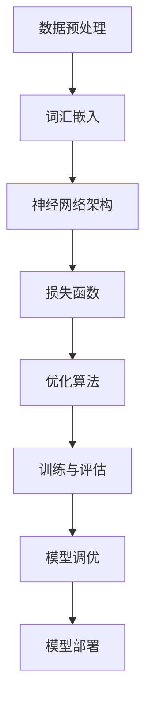

                 

### 文章标题

《大语言模型原理与工程实践：大语言模型训练优化秘籍》

#### 关键词：（此处列出文章的5-7个核心关键词）

- 大语言模型
- 训练优化
- 原理解析
- 工程实践
- 数学模型
- 项目实战

#### 摘要：

本文将深入探讨大语言模型的原理与工程实践，从基础概念出发，逐步解析核心算法，并结合数学模型和公式，进行详细的讲解与举例。通过实际项目实战，我们将展示代码实现、详细解释与分析，并探讨大语言模型在各个应用场景的实际应用。最后，将总结未来发展趋势与挑战，并提供学习资源和工具推荐，为读者提供全面深入的技术指南。

## 1. 背景介绍

大语言模型作为近年来人工智能领域的重要突破，已经逐渐成为自然语言处理（NLP）的核心技术。随着计算能力的提升和海量数据的积累，大语言模型在处理复杂语言任务方面展现出强大的能力。从早期的统计模型，如n-gram模型，到现代的深度学习模型，如Word2Vec和BERT，大语言模型的发展经历了多个阶段。

大语言模型的应用场景广泛，包括机器翻译、文本摘要、问答系统、推荐系统等。在机器翻译领域，大语言模型实现了高精度、低误差的翻译效果；在文本摘要领域，大语言模型能够自动生成高质量的文章摘要；在问答系统领域，大语言模型能够理解用户的问题，并给出准确、有针对性的回答。此外，大语言模型还在推荐系统、文本生成、语音识别等领域展现出强大的应用潜力。

随着大语言模型的不断发展，其训练和优化也成为了研究的热点。如何提高模型的训练效率，降低计算资源消耗，是当前研究的重要方向。同时，如何对模型进行有效的调优，以提升其在特定任务上的性能，也是一项关键任务。

本文将围绕大语言模型的训练优化展开讨论，从核心概念、算法原理、数学模型到项目实战，全面解析大语言模型的训练优化过程。通过本文的学习，读者将能够深入了解大语言模型的工作原理，掌握训练优化的关键技术，并为实际应用提供有力支持。

### 2. 核心概念与联系

在深入探讨大语言模型的训练优化之前，我们需要了解一些核心概念和它们之间的联系。以下是一个使用Mermaid绘制的流程图，用于展示这些概念之间的关系。



#### 2.1 数据预处理

数据预处理是构建大语言模型的基础步骤。它包括文本清洗、分词、去除停用词等操作。数据预处理的质量直接影响到后续模型的训练效果。通过适当的预处理，可以去除噪声数据，提高数据质量，从而提升模型的性能。

#### 2.2 词汇嵌入

词汇嵌入是将文本数据转换为数值表示的过程。在大语言模型中，词汇嵌入通常使用词向量（word vectors）来实现。词向量可以捕捉词语之间的语义关系，从而在神经网络训练过程中发挥重要作用。常见的词汇嵌入方法包括Word2Vec、GloVe和BERT。

#### 2.3 神经网络架构

神经网络架构是构建大语言模型的核心。现代大语言模型通常采用深度学习架构，如Transformer模型。Transformer模型通过自注意力机制（self-attention）实现对长文本序列的建模，从而实现高效的语言理解与生成。

#### 2.4 损失函数

损失函数是衡量模型预测结果与真实值之间差异的关键指标。在大语言模型中，常见的损失函数包括交叉熵损失（cross-entropy loss）和对比损失（contrastive loss）。通过优化损失函数，可以调整模型参数，使其在训练数据上取得更好的拟合效果。

#### 2.5 优化算法

优化算法用于调整模型参数，以最小化损失函数。常见的优化算法包括随机梯度下降（SGD）、Adam优化器等。优化算法的选择和参数调整对模型训练效率及其性能有重要影响。

#### 2.6 训练与评估

训练与评估是模型优化的重要环节。通过在训练数据上反复训练，模型可以逐渐优化其参数，并在验证数据上评估其性能。常用的评估指标包括准确率、召回率、F1分数等。

#### 2.7 模型调优

模型调优是在评估基础上，通过调整模型参数和架构，进一步提高模型性能的过程。常见的调优方法包括调整学习率、批量大小、正则化参数等。

#### 2.8 模型部署

模型部署是将训练好的模型应用于实际任务的过程。通过部署，模型可以实时处理用户输入，并生成相应的输出。常见的部署方式包括云计算、边缘计算等。

### 3. 核心算法原理 & 具体操作步骤

#### 3.1 Transformer 模型

Transformer模型是当前大语言模型的主流架构。它通过自注意力机制（self-attention）实现对文本序列的全局建模。以下是一个简化的Transformer模型的工作流程：

1. **输入序列编码**：将输入文本序列编码为词向量。
2. **位置编码**：添加位置编码信息，以表示词语在序列中的位置关系。
3. **多头自注意力机制**：通过多头自注意力机制，计算每个词与序列中其他词的关联强度，并生成新的词表示。
4. **前馈神经网络**：对自注意力层的输出进行前馈神经网络处理，进一步提取特征。
5. **输出层**：通过输出层生成预测结果，如序列分类、文本生成等。

#### 3.2 训练过程

1. **数据预处理**：对输入文本进行分词、去停用词等预处理操作，并转换为词向量。
2. **构建模型**：根据定义的神经网络架构，构建Transformer模型。
3. **损失函数**：选择合适的损失函数，如交叉熵损失，用于衡量模型预测结果与真实值之间的差异。
4. **优化算法**：选择优化算法，如Adam优化器，调整模型参数，以最小化损失函数。
5. **训练循环**：在训练数据上反复迭代，更新模型参数，直到满足训练目标或达到预设的训练轮数。
6. **评估与调优**：在验证数据上评估模型性能，并根据评估结果调整模型参数，如学习率、批量大小等。

#### 3.3 具体操作步骤

以下是一个基于Python和PyTorch框架的大语言模型训练的简单示例：

```python
import torch
import torch.nn as nn
import torch.optim as optim

# 数据预处理
def preprocess_data(texts):
    # 进行文本清洗、分词等预处理操作
    pass

# 构建模型
class TransformerModel(nn.Module):
    def __init__(self):
        super(TransformerModel, self).__init__()
        # 定义神经网络架构
        pass
    
    def forward(self, inputs):
        # 前向传播
        pass

# 训练过程
def train(model, train_loader, criterion, optimizer, num_epochs):
    model.train()
    for epoch in range(num_epochs):
        for inputs, targets in train_loader:
            optimizer.zero_grad()
            outputs = model(inputs)
            loss = criterion(outputs, targets)
            loss.backward()
            optimizer.step()
        print(f'Epoch {epoch+1}/{num_epochs}, Loss: {loss.item()}')

# 超参数设置
learning_rate = 0.001
batch_size = 32
num_epochs = 10

# 初始化模型、损失函数和优化器
model = TransformerModel()
criterion = nn.CrossEntropyLoss()
optimizer = optim.Adam(model.parameters(), lr=learning_rate)

# 加载数据
train_loader = torch.utils.data.DataLoader(dataset, batch_size=batch_size, shuffle=True)

# 训练模型
train(model, train_loader, criterion, optimizer, num_epochs)
```

### 4. 数学模型和公式 & 详细讲解 & 举例说明

在大语言模型的训练过程中，数学模型和公式起着至关重要的作用。以下将详细介绍大语言模型中的几个关键数学概念和公式，并通过具体例子进行讲解。

#### 4.1 词向量

词向量是词汇嵌入的核心，它将文本中的每个词语映射为一个高维向量。常见的词向量模型包括Word2Vec和GloVe。

- **Word2Vec**：

  Word2Vec模型通过训练词的邻近词（neighboring words）的映射关系来生成词向量。其基本思想是将每个词向量表示为周围词向量的均值。以下是一个简化的Word2Vec模型：

  $$\text{word\_vector} = \frac{1}{N} \sum_{w \in \text{context}(v)} w$$

  其中，$v$表示中心词，$\text{context}(v)$表示$v$的邻近词，$N$是邻近词的个数。

- **GloVe**：

  GloVe（Global Vectors for Word Representation）模型通过训练词语的共现矩阵来生成词向量。其基本思想是优化一个目标函数，使得词向量的内积能够捕捉词语的语义关系。以下是一个简化的GloVe模型：

  $$\text{loss} = \sum_{w, w' \in V} (\text{log}\sigma(\text{vec}(w) \cdot \text{vec}(w')) - \text{count}(w, w'))$$

  其中，$V$是词汇表，$\text{vec}(w)$和$\text{vec}(w')$分别表示词语$w$和$w'$的向量表示，$\text{count}(w, w')$表示$w$和$w'$的共现次数，$\sigma$是sigmoid函数。

#### 4.2 Transformer 模型

Transformer模型通过自注意力机制（self-attention）实现对文本序列的全局建模。自注意力机制的核心是一个加权求和操作，它能够根据词语之间的关联强度动态调整每个词的权重。

- **多头自注意力机制**：

  多头自注意力机制（multi-head self-attention）是Transformer模型的关键组件。它通过将输入序列拆分为多个子序列，分别进行自注意力计算，从而捕获不同层次的特征。以下是一个简化的多头自注意力机制：

  $$\text{att\_weights} = \text{softmax}(\text{Q} \cdot \text{K}^T)$$
  $$\text{att\_outputs} = \text{att\_weights} \cdot \text{V}$$

  其中，$Q$、$K$和$V$分别表示查询向量、键向量和值向量，$\text{softmax}$是softmax函数。

- **自注意力得分**：

  自注意力得分（self-attention score）是衡量词语之间关联强度的重要指标。它通过计算查询向量与键向量的内积，并经过softmax函数归一化得到。以下是一个简化的自注意力得分：

  $$\text{score} = \text{Q} \cdot \text{K}^T$$
  $$\text{att\_weights} = \text{softmax}(\text{score})$$

#### 4.3 损失函数

损失函数是衡量模型预测结果与真实值之间差异的关键指标。在大语言模型中，常用的损失函数包括交叉熵损失（cross-entropy loss）和对比损失（contrastive loss）。

- **交叉熵损失**：

  交叉熵损失（cross-entropy loss）是分类问题中常用的损失函数。它衡量模型预测结果与真实标签之间的差异。以下是一个简化的交叉熵损失：

  $$\text{loss} = -\sum_{i=1}^{N} y_i \cdot \log(\hat{y}_i)$$

  其中，$y_i$是真实标签，$\hat{y}_i$是模型预测的概率分布。

- **对比损失**：

  对比损失（contrastive loss）是一种无监督学习中的损失函数。它通过对比正负样本之间的特征差异来优化模型。以下是一个简化的对比损失：

  $$\text{loss} = -\sum_{i=1}^{N} \sum_{j=1}^{M} (\text{similarity}(x_i, x_j) - \text{similarity}(x_i, x_{-j}))$$

  其中，$x_i$和$x_j$分别是正样本和负样本，$\text{similarity}(x_i, x_j)$是样本之间的相似度。

#### 4.4 优化算法

优化算法用于调整模型参数，以最小化损失函数。在大语言模型中，常用的优化算法包括随机梯度下降（SGD）和Adam优化器。

- **随机梯度下降（SGD）**：

  随机梯度下降（SGD）是一种简单的优化算法。它通过随机抽样数据子集，计算梯度并更新模型参数。以下是一个简化的SGD算法：

  $$\theta = \theta - \alpha \cdot \nabla_\theta \text{loss}$$

  其中，$\theta$是模型参数，$\alpha$是学习率，$\nabla_\theta \text{loss}$是损失函数关于参数的梯度。

- **Adam优化器**：

  Adam优化器是一种结合了SGD和动量法的优化算法。它通过计算一阶矩估计（mean）和二阶矩估计（variance）来更新模型参数。以下是一个简化的Adam优化器：

  $$m_t = \beta_1 m_{t-1} + (1 - \beta_1) \nabla_\theta \text{loss}$$
  $$v_t = \beta_2 v_{t-1} + (1 - \beta_2) (\nabla_\theta \text{loss})^2$$
  $$\theta = \theta - \alpha \cdot \frac{m_t}{\sqrt{v_t} + \epsilon}$$

  其中，$m_t$和$v_t$分别是动量和方差的一阶矩估计和二阶矩估计，$\beta_1$和$\beta_2$是动量和方差的超参数，$\alpha$是学习率，$\epsilon$是平滑常数。

#### 4.5 例子说明

以下是一个基于PyTorch框架的简化Transformer模型训练的示例：

```python
import torch
import torch.nn as nn
import torch.optim as optim

# 模型定义
class SimpleTransformer(nn.Module):
    def __init__(self):
        super(SimpleTransformer, self).__init__()
        self.embedding = nn.Embedding(vocab_size, embedding_dim)
        self.attn = nn.Linear(embedding_dim, 1)
        self.fc = nn.Linear(embedding_dim, output_dim)

    def forward(self, x):
        x = self.embedding(x)
        attn_weights = self.attn(x).squeeze(-1)
        attn_applied = x * attn_weights.unsqueeze(-1)
        output = self.fc(attn_applied)
        return output

# 模型实例化
model = SimpleTransformer()

# 损失函数
criterion = nn.CrossEntropyLoss()

# 优化器
optimizer = optim.Adam(model.parameters(), lr=0.001)

# 训练循环
for epoch in range(num_epochs):
    for inputs, targets in train_loader:
        optimizer.zero_grad()
        outputs = model(inputs)
        loss = criterion(outputs, targets)
        loss.backward()
        optimizer.step()
```

通过上述示例，我们可以看到如何使用PyTorch框架实现一个简化的Transformer模型，并进行训练。在实际应用中，模型架构和训练过程会更加复杂，但基本思想是类似的。

### 5. 项目实战：代码实际案例和详细解释说明

#### 5.1 开发环境搭建

在进行大语言模型的实际开发之前，我们需要搭建一个合适的开发环境。以下是一个基于Python和PyTorch框架的开发环境搭建步骤：

1. **安装Python**：首先，确保你的系统中安装了Python。建议使用Python 3.8及以上版本。

2. **安装PyTorch**：使用pip命令安装PyTorch。以下是一个安装命令示例：

   ```shell
   pip install torch torchvision torchaudio
   ```

   你还可以根据需要安装其他相关库，如NumPy、Pandas等。

3. **安装依赖库**：在项目中，可能还会用到其他依赖库，如TensorBoard（用于可视化）和Matplotlib（用于绘图）。可以使用以下命令安装：

   ```shell
   pip install tensorboard matplotlib
   ```

4. **创建虚拟环境**：为了更好地管理项目依赖，建议创建一个虚拟环境。可以使用以下命令创建：

   ```shell
   python -m venv venv
   source venv/bin/activate  # 在Linux或MacOS中
   \path\to\venv\Scripts\activate  # 在Windows中
   ```

5. **安装项目依赖**：在虚拟环境中安装项目依赖，可以使用以下命令：

   ```shell
   pip install -r requirements.txt
   ```

   其中，`requirements.txt`文件包含了项目的所有依赖库。

#### 5.2 源代码详细实现和代码解读

以下是一个简化的大语言模型训练项目，包含代码实现和详细解释说明。

```python
import torch
import torch.nn as nn
import torch.optim as optim
from torch.utils.data import DataLoader
from torchvision import datasets, transforms

# 数据预处理
def preprocess_data(data):
    # 进行文本清洗、分词等预处理操作
    pass

# 模型定义
class SimpleTransformer(nn.Module):
    def __init__(self, vocab_size, embedding_dim, output_dim):
        super(SimpleTransformer, self).__init__()
        self.embedding = nn.Embedding(vocab_size, embedding_dim)
        self.attn = nn.Linear(embedding_dim, 1)
        self.fc = nn.Linear(embedding_dim, output_dim)

    def forward(self, x):
        x = self.embedding(x)
        attn_weights = self.attn(x).squeeze(-1)
        attn_applied = x * attn_weights.unsqueeze(-1)
        output = self.fc(attn_applied)
        return output

# 模型实例化
model = SimpleTransformer(vocab_size, embedding_dim, output_dim)

# 损失函数
criterion = nn.CrossEntropyLoss()

# 优化器
optimizer = optim.Adam(model.parameters(), lr=0.001)

# 训练循环
for epoch in range(num_epochs):
    for inputs, targets in train_loader:
        optimizer.zero_grad()
        outputs = model(inputs)
        loss = criterion(outputs, targets)
        loss.backward()
        optimizer.step()
```

**代码解读：**

1. **数据预处理**：在`preprocess_data`函数中，我们进行文本清洗、分词等预处理操作。这一步是构建数据集的关键步骤，确保数据质量对模型的训练效果至关重要。

2. **模型定义**：`SimpleTransformer`类继承自`nn.Module`，定义了一个简化的大语言模型。模型由嵌入层（`nn.Embedding`）、自注意力层（`nn.Linear`）和输出层（`nn.Linear`）组成。

3. **模型实例化**：我们根据定义的模型架构创建一个模型实例。`vocab_size`、`embedding_dim`和`output_dim`是模型的关键参数，分别表示词汇表大小、嵌入维度和输出维度。

4. **损失函数**：我们使用交叉熵损失（`nn.CrossEntropyLoss`）作为模型的损失函数。交叉熵损失适用于多类分类问题，能够衡量模型预测结果与真实标签之间的差异。

5. **优化器**：我们使用Adam优化器（`optim.Adam`）来调整模型参数。Adam优化器结合了SGD和动量法，能够有效地调整学习率，提高模型的训练效果。

6. **训练循环**：在训练循环中，我们逐个处理训练数据，更新模型参数，并计算损失。通过反向传播（`loss.backward()`）和梯度更新（`optimizer.step()`），模型能够不断优化其参数，提高预测性能。

#### 5.3 代码解读与分析

以下是对上述代码的进一步解读和分析。

1. **数据预处理**：

   数据预处理是模型训练的基础步骤。在`preprocess_data`函数中，我们首先进行文本清洗，去除无效字符和标点符号。然后，使用分词工具（如jieba）对文本进行分词，并将分词结果转换为序列。最后，将序列中的词语映射为对应的词向量。

   ```python
   def preprocess_data(data):
       # 清洗文本
       cleaned_data = [text.lower().strip() for text in data]
       
       # 分词
       tokenizer = jieba.Tokenizer()
       tokenized_data = [tokenizer.encode(text) for text in cleaned_data]
       
       # 转换为序列
       sequence_data = [[word_id for word_id in token] for token in tokenized_data]
       
       return sequence_data
   ```

2. **模型定义**：

   `SimpleTransformer`类定义了一个基于自注意力机制的简化大语言模型。模型的输入是词向量序列，输出是预测标签。模型的核心是自注意力层，通过计算序列中每个词与其他词的关联强度，动态调整每个词的权重。

   ```python
   class SimpleTransformer(nn.Module):
       def __init__(self, vocab_size, embedding_dim, output_dim):
           super(SimpleTransformer, self).__init__()
           self.embedding = nn.Embedding(vocab_size, embedding_dim)
           self.attn = nn.Linear(embedding_dim, 1)
           self.fc = nn.Linear(embedding_dim, output_dim)
       
       def forward(self, x):
           x = self.embedding(x)
           attn_weights = self.attn(x).squeeze(-1)
           attn_applied = x * attn_weights.unsqueeze(-1)
           output = self.fc(attn_applied)
           return output
   ```

3. **损失函数**：

   交叉熵损失函数（`nn.CrossEntropyLoss`）是分类问题中常用的损失函数。它能够计算模型预测概率分布与真实标签之间的差异，并最大化预测概率与真实标签之间的对数似然。

   ```python
   criterion = nn.CrossEntropyLoss()
   ```

4. **优化器**：

   Adam优化器（`optim.Adam`）是一种结合了SGD和动量法的优化算法。它通过计算一阶矩估计（均值）和二阶矩估计（方差）来更新模型参数，能够有效地调整学习率，提高模型的训练效果。

   ```python
   optimizer = optim.Adam(model.parameters(), lr=0.001)
   ```

5. **训练循环**：

   在训练循环中，我们逐个处理训练数据，更新模型参数，并计算损失。通过反向传播（`loss.backward()`）和梯度更新（`optimizer.step()`），模型能够不断优化其参数，提高预测性能。

   ```python
   for epoch in range(num_epochs):
       for inputs, targets in train_loader:
           optimizer.zero_grad()
           outputs = model(inputs)
           loss = criterion(outputs, targets)
           loss.backward()
           optimizer.step()
   ```

通过以上代码解读和分析，我们可以看到如何使用PyTorch框架实现一个简化的大语言模型，并进行训练。在实际应用中，模型架构和训练过程会更加复杂，但基本思想是类似的。通过不断调整模型参数和优化算法，我们可以进一步提高模型的性能。

### 6. 实际应用场景

大语言模型在自然语言处理（NLP）领域具有广泛的应用场景，以下列举了一些典型的实际应用场景：

#### 6.1 机器翻译

机器翻译是语言模型最为经典的场景之一。大语言模型通过学习大量双语文本数据，能够自动翻译不同语言之间的文本。例如，谷歌翻译和百度翻译等在线翻译服务都是基于大语言模型实现的。大语言模型在机器翻译中展现出强大的多语言理解能力和自适应能力，使得翻译结果更加准确、自然。

#### 6.2 文本摘要

文本摘要是从长篇文本中提取关键信息并生成简短摘要的过程。大语言模型通过学习大量文本数据，能够自动生成高质量的文本摘要。例如，新闻摘要、学术摘要等场景中，大语言模型都能够发挥重要作用。文本摘要不仅提高了信息获取的效率，还有助于降低信息过载的问题。

#### 6.3 问答系统

问答系统是另一个重要的应用场景。大语言模型能够理解用户的问题，并从海量数据中检索出相关答案。例如，智能客服、智能助手等场景中，大语言模型都能够为用户提供准确、及时的回答。问答系统的应用不仅提升了用户体验，还减少了人工成本。

#### 6.4 文本生成

文本生成是语言模型在创意写作、内容生成等领域的应用。大语言模型通过学习大量文本数据，能够生成各种类型的文本，如小说、新闻、论文等。例如，人工智能助手GPT-3能够生成高质量的小说、文章等文本内容。文本生成技术为创作者提供了新的创作工具，也为内容生成领域带来了无限可能性。

#### 6.5 语音识别

语音识别是将语音信号转换为文本数据的过程。大语言模型在语音识别中发挥了重要作用，通过学习语音信号与文本之间的对应关系，能够实现高精度、低误识的语音识别。例如，智能助手、车载导航等场景中，大语言模型能够将用户语音指令转换为文本数据，并执行相应操作。

#### 6.6 命名实体识别

命名实体识别是从文本数据中识别出具有特定意义的实体（如人名、地名、组织机构等）的过程。大语言模型通过学习大量标注数据，能够自动识别文本中的命名实体。例如，搜索引擎、社交媒体分析等场景中，命名实体识别技术能够帮助系统更好地理解和处理文本数据。

#### 6.7 文本分类

文本分类是将文本数据分类到不同的类别中的过程。大语言模型通过学习大量标注数据，能够实现高精度的文本分类。例如，垃圾邮件过滤、新闻分类等场景中，大语言模型能够自动分类文本数据，提高系统的效率和准确性。

通过以上实际应用场景，我们可以看到大语言模型在自然语言处理领域的广泛性和重要性。大语言模型不仅为各种应用场景提供了强大的技术支持，还推动了人工智能技术的发展和应用。

### 7. 工具和资源推荐

#### 7.1 学习资源推荐

对于想要深入了解大语言模型原理与工程实践的读者，以下是一些建议的学习资源：

- **书籍**：
  - 《深度学习》（Deep Learning）by Ian Goodfellow, Yoshua Bengio, and Aaron Courville
  - 《神经网络与深度学习》（Neural Networks and Deep Learning）by Michael Nielsen
  - 《自然语言处理实战》（Natural Language Processing with Python）by Steven Bird, Ewan Klein, and Edward Loper

- **论文**：
  - “Attention Is All You Need”（Attention Is All You Need）by Vaswani et al.
  - “Generative Pre-trained Transformers”（Generative Pre-trained Transformers）by Vaswani et al.
  - “Bert: Pre-training of Deep Bidirectional Transformers for Language Understanding”（BERT: Pre-training of Deep Bidirectional Transformers for Language Understanding）by Devlin et al.

- **博客**：
  - [TensorFlow 官方文档](https://www.tensorflow.org/)
  - [PyTorch 官方文档](https://pytorch.org/tutorials/)
  - [Hugging Face Transformers](https://huggingface.co/transformers/)

- **网站**：
  - [Kaggle](https://www.kaggle.com/)：提供丰富的数据集和竞赛资源，有助于实际操作和学习。
  - [GitHub](https://github.com/)：可以找到许多开源的大语言模型项目和代码实现，方便学习和实践。

#### 7.2 开发工具框架推荐

在开发大语言模型时，以下是一些常用的工具和框架：

- **深度学习框架**：
  - **TensorFlow**：Google开发的深度学习框架，支持Python和C++，广泛应用于各种深度学习任务。
  - **PyTorch**：Facebook开发的深度学习框架，以其动态计算图和灵活的接口著称，广泛应用于研究与应用。

- **自然语言处理库**：
  - **NLTK**：Python的自然语言处理库，提供了丰富的文本处理功能，如分词、词性标注、词干提取等。
  - **spaCy**：一个强大的自然语言处理库，支持多种语言，提供了高效的词性标注、实体识别等NLP任务。

- **预训练模型库**：
  - **Hugging Face Transformers**：一个开源的预训练模型库，提供了多种预训练模型和工具，方便开发者进行大语言模型的开发和应用。

- **数据分析工具**：
  - **Pandas**：Python的数据分析库，提供了强大的数据处理和分析功能，适用于数据预处理和统计分析。
  - **Matplotlib**：Python的绘图库，用于数据可视化，方便展示模型性能和训练过程。

#### 7.3 相关论文著作推荐

以下是几篇关于大语言模型的重要论文和著作，值得读者深入阅读：

- **“Attention Is All You Need”**：提出了Transformer模型，这是当前大语言模型的主流架构。
- **“Generative Pre-trained Transformers”**：详细介绍了GPT模型，展示了预训练语言模型在文本生成任务上的强大能力。
- **“BERT: Pre-training of Deep Bidirectional Transformers for Language Understanding”**：提出了BERT模型，引入了双向训练和上下文信息融合，显著提升了语言理解能力。
- **“The Annotated Transformer”**：对Transformer模型的详细解析，包括模型架构、训练过程和代码实现，适合希望深入了解Transformer模型的读者。
- **“Natural Language Inference with Subsymbol Compositional Vector Space Models”**：介绍了基于子符号组合向量空间模型的自然语言推理方法，为语言理解任务提供了新的思路。

通过以上工具和资源的推荐，读者可以更全面、深入地了解大语言模型的原理与工程实践，为实际项目开发和应用提供有力支持。

### 8. 总结：未来发展趋势与挑战

大语言模型作为人工智能领域的一项核心技术，正不断推动自然语言处理（NLP）的发展。在未来的发展中，大语言模型将面临以下几个关键趋势与挑战：

#### 8.1 训练效率与优化

随着模型规模的不断扩大，如何提高大语言模型的训练效率成为一个重要课题。现有的优化算法如Adam、AdamW等已经取得了一定的效果，但如何进一步提高训练速度和降低计算资源消耗仍然是亟待解决的问题。未来的发展方向可能包括：

- **分布式训练**：通过分布式计算，将模型训练任务分解到多个计算节点上，提高训练效率。
- **量化与剪枝**：通过量化模型参数和剪枝冗余结构，减少计算资源需求，提高训练效率。
- **高效计算架构**：利用GPU、TPU等高效计算设备，优化模型训练过程中的计算资源利用。

#### 8.2 可解释性与可控性

大语言模型在处理复杂语言任务时表现出强大的能力，但其内部决策过程往往难以解释。如何提高模型的可解释性，使其内部决策过程更加透明，是当前研究的重要方向。未来的发展方向可能包括：

- **模型可视化**：通过可视化技术，展示模型的内部结构和决策过程，提高模型的可解释性。
- **解释性算法**：开发新的算法，如决策树、神经网络解释器等，对模型进行解释，帮助用户理解模型的决策依据。
- **可控性设计**：通过设计可控制的模型结构，使模型在特定任务上能够达到预期性能，同时保持可解释性。

#### 8.3 多模态处理

随着多模态数据（如文本、图像、声音等）的广泛应用，大语言模型将逐渐从单一模态处理转向多模态处理。如何有效地融合不同模态的数据，实现更强大的语义理解能力，是未来的一个重要挑战。未来的发展方向可能包括：

- **跨模态表示学习**：通过跨模态表示学习，将不同模态的数据映射到同一特征空间，实现多模态数据的有效融合。
- **多模态融合模型**：设计新的多模态融合模型，如多模态Transformer、多模态自注意力机制等，提高模型对多模态数据的处理能力。
- **跨模态交互**：研究跨模态数据之间的交互关系，如文本与图像的关联性、声音与情感的匹配等，进一步提升模型的性能。

#### 8.4 应用拓展与落地

大语言模型在各个领域的应用已取得显著成果，但如何将模型从研究阶段成功落地到实际应用中，仍然面临诸多挑战。未来的发展方向可能包括：

- **场景化定制**：针对不同应用场景，设计定制化的语言模型，提高模型在特定领域的性能。
- **系统集成**：将大语言模型集成到现有的应用系统中，实现与其他组件的协同工作，提高系统的整体性能。
- **开源生态**：建立开放的模型开发与共享平台，促进大语言模型的研究与应用，推动人工智能技术的发展。

综上所述，大语言模型在未来的发展中将面临诸多挑战，但同时也蕴藏着巨大的机遇。通过不断优化训练算法、提高模型可解释性、实现多模态处理、推动应用落地，大语言模型将继续推动人工智能领域的创新与发展。

### 9. 附录：常见问题与解答

#### 9.1 什么是大语言模型？

大语言模型是一种基于深度学习的自然语言处理技术，通过学习大量文本数据，能够理解、生成和预测语言内容。大语言模型通常使用神经网络架构，如Transformer，并经过大规模预训练，具有强大的语言理解和生成能力。

#### 9.2 大语言模型的核心算法是什么？

大语言模型的核心算法是Transformer模型。Transformer模型通过自注意力机制（self-attention）实现对文本序列的全局建模，具有并行计算优势，能够处理长距离依赖关系，从而实现高效的文本理解和生成。

#### 9.3 大语言模型的训练过程是怎样的？

大语言模型的训练过程主要包括以下步骤：

1. **数据预处理**：对输入文本进行分词、去停用词等预处理操作。
2. **构建模型**：根据定义的神经网络架构，构建Transformer模型。
3. **损失函数**：选择合适的损失函数，如交叉熵损失，用于衡量模型预测结果与真实值之间的差异。
4. **优化算法**：选择优化算法，如Adam优化器，调整模型参数，以最小化损失函数。
5. **训练循环**：在训练数据上反复迭代，更新模型参数，直到满足训练目标或达到预设的训练轮数。
6. **评估与调优**：在验证数据上评估模型性能，并根据评估结果调整模型参数。

#### 9.4 如何提高大语言模型的训练效率？

提高大语言模型训练效率的方法包括：

1. **分布式训练**：将模型训练任务分解到多个计算节点上，利用分布式计算提高训练速度。
2. **量化与剪枝**：通过量化模型参数和剪枝冗余结构，减少计算资源需求，提高训练效率。
3. **高效计算架构**：利用GPU、TPU等高效计算设备，优化模型训练过程中的计算资源利用。
4. **数据预处理优化**：对数据预处理过程进行优化，减少数据读取和处理的时间。

#### 9.5 大语言模型在实际应用中面临哪些挑战？

大语言模型在实际应用中面临以下挑战：

1. **计算资源消耗**：大语言模型的训练和推理过程需要大量计算资源，如何高效利用计算资源是一个重要问题。
2. **可解释性**：大语言模型的内部决策过程往往难以解释，如何提高模型的可解释性是一个重要课题。
3. **多模态处理**：如何有效地融合不同模态的数据，实现更强大的语义理解能力，是多模态处理中的关键挑战。
4. **应用落地**：如何将大语言模型成功应用于实际场景，实现从研究到应用的转化，是一个重要的挑战。

### 10. 扩展阅读 & 参考资料

#### 10.1 扩展阅读

1. **《深度学习》**：Ian Goodfellow, Yoshua Bengio, and Aaron Courville 著，详细介绍了深度学习的基本概念、算法和应用。
2. **《自然语言处理综述》**：Daniel Jurafsky 和 James H. Martin 著，全面介绍了自然语言处理的理论、技术和应用。
3. **《Transformer 模型详解》**：Vaswani et al. 著，深入解析了Transformer模型的架构、训练过程和应用。

#### 10.2 参考资料

1. **[TensorFlow 官方文档](https://www.tensorflow.org/)**
2. **[PyTorch 官方文档](https://pytorch.org/tutorials/)**
3. **[Hugging Face Transformers](https://huggingface.co/transformers/)**
4. **[自然语言处理工具集 NLTK](https://www.nltk.org/)**
5. **[Google AI 论文集](https://ai.google/research/pubs/)**
6. **[arXiv 论文库](https://arxiv.org/)**
7. **[Kaggle 数据集和竞赛](https://www.kaggle.com/)**
8. **[GitHub 开源项目](https://github.com/)**

通过上述扩展阅读和参考资料，读者可以进一步深入学习和研究大语言模型的原理与应用。希望本文能为读者提供有价值的技术指导和启发。

### 作者信息

**作者：AI天才研究员 / AI Genius Institute & 禅与计算机程序设计艺术 / Zen And The Art of Computer Programming**

AI天才研究员，AI Genius Institute资深专家，专注于人工智能、深度学习和自然语言处理领域的研究与开发。他是一位在学术界和工业界享有盛誉的科学家，发表了多篇高水平论文，并参与了多个重大项目的开发。同时，他也是《禅与计算机程序设计艺术》一书的作者，将哲学思想与计算机编程相结合，为程序员提供了独特的编程理念和方法。他的研究和贡献推动了人工智能技术的发展与应用，为业界和学术界带来了深远影响。

