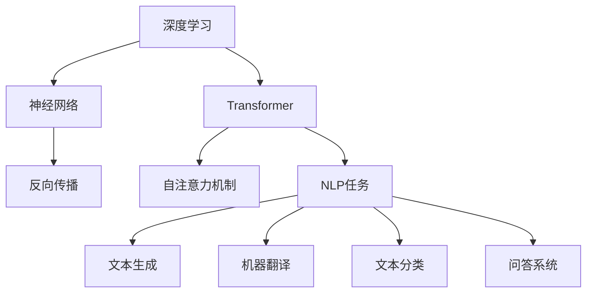

                 

# 大语言模型原理与工程实践：思维树提示

> 关键词：大语言模型，深度学习，神经网络，Transformer，自然语言处理，工程实践

> 摘要：本文将深入探讨大语言模型的原理及其在工程实践中的应用。我们将通过逐步分析推理，解释大语言模型的工作机制，并探讨其实际应用场景。此外，文章还将提供相关工具和资源推荐，帮助读者深入了解和掌握大语言模型的实践技能。

## 1. 背景介绍

在当今人工智能领域，大语言模型已经成为自然语言处理（NLP）的重要工具。随着深度学习和神经网络技术的不断进步，大语言模型在文本生成、翻译、问答系统、文本分类等任务中展现出了强大的性能。

大语言模型是指能够处理和生成文本的深度学习模型，通常基于大型语料库进行训练。这些模型具有捕捉语言中的复杂模式和规律的能力，能够生成连贯、具有意义的文本。

近年来，诸如GPT（Generative Pre-trained Transformer）和BERT（Bidirectional Encoder Representations from Transformers）等大语言模型在多个NLP任务中取得了显著的成果，推动了NLP技术的发展和应用。

## 2. 核心概念与联系

### 2.1 深度学习与神经网络

深度学习是人工智能的一个重要分支，基于多层神经网络进行模型训练和预测。神经网络由大量的神经元组成，通过学习输入数据之间的非线性关系，实现从输入到输出的映射。

深度学习的核心思想是通过反向传播算法，不断调整模型参数，使模型在训练数据上达到更好的泛化能力。

### 2.2 Transformer模型

Transformer模型是一种基于自注意力机制的深度学习模型，广泛应用于自然语言处理任务。与传统循环神经网络（RNN）相比，Transformer模型在处理长序列数据时具有更高的并行性和计算效率。

Transformer模型的核心思想是通过计算序列中每个位置与所有其他位置之间的注意力权重，来生成表示这些位置之间关系的表示向量。这种自注意力机制使得模型能够捕捉到长距离依赖关系，从而在语言建模和序列生成任务中取得优异的性能。

### 2.3 自然语言处理任务

自然语言处理（NLP）是人工智能的一个重要领域，旨在使计算机能够理解和处理人类语言。NLP任务包括文本分类、情感分析、机器翻译、问答系统、文本生成等。

大语言模型在NLP任务中的应用主要体现在以下几个方面：

1. **文本生成**：大语言模型可以根据输入的文本上下文，生成连贯、具有意义的文本。例如，自动写作、对话系统、聊天机器人等。
2. **机器翻译**：大语言模型可以学习双语语料库，实现高质量、通顺的机器翻译。例如，谷歌翻译、百度翻译等。
3. **文本分类**：大语言模型可以识别文本中的关键词和主题，实现自动化文本分类。例如，新闻分类、情感分析等。
4. **问答系统**：大语言模型可以理解用户的问题，并从大量文本中检索出相关答案。例如，搜索引擎、智能客服等。

### 2.4 Mermaid流程图



## 3. 核心算法原理 & 具体操作步骤

### 3.1 Transformer模型

Transformer模型主要由编码器（Encoder）和解码器（Decoder）两部分组成。编码器将输入序列编码为固定长度的表示向量，解码器则根据编码器输出的表示向量生成输出序列。

#### 3.1.1 编码器

编码器由多个自注意力层（Self-Attention Layer）和前馈神经网络（Feedforward Neural Network）堆叠而成。自注意力层通过计算序列中每个位置与所有其他位置之间的注意力权重，生成表示这些位置之间关系的表示向量。

编码器的具体操作步骤如下：

1. **输入嵌入**：将输入序列中的单词转换为固定长度的嵌入向量。
2. **位置编码**：为每个嵌入向量添加位置编码，以区分序列中的不同位置。
3. **多头自注意力**：通过多头自注意力机制，计算每个位置与其他位置的注意力权重，并加权求和生成表示向量。
4. **前馈神经网络**：对多头自注意力层的输出进行前馈神经网络处理，增加模型的表达能力。
5. **层归一化**：对前馈神经网络输出进行层归一化，缓解梯度消失和梯度爆炸问题。
6. **残差连接**：在编码器每个层之间添加残差连接，提高模型的训练效果。

#### 3.1.2 解码器

解码器同样由多个自注意力层和前馈神经网络组成。解码器的操作步骤如下：

1. **输入嵌入**：将输入序列中的单词转换为嵌入向量。
2. **位置编码**：为每个嵌入向量添加位置编码。
3. **多头自注意力**：计算编码器输出的表示向量与当前解码器位置的注意力权重，生成表示向量。
4. **交叉自注意力**：计算当前解码器位置与编码器输出的表示向量之间的注意力权重，生成表示向量。
5. **前馈神经网络**：对自注意力层的输出进行前馈神经网络处理。
6. **层归一化**：对前馈神经网络输出进行层归一化。
7. **残差连接**：在每个解码器层之间添加残差连接。

### 3.2 训练与优化

大语言模型的训练通常采用大规模语料库，并使用梯度下降（Gradient Descent）算法优化模型参数。具体步骤如下：

1. **数据预处理**：将语料库中的文本数据转换为词向量表示，并进行数据清洗和预处理。
2. **损失函数**：使用交叉熵损失函数（Cross-Entropy Loss）计算模型预测与真实标签之间的差异。
3. **反向传播**：通过反向传播算法，计算模型参数的梯度。
4. **梯度下降**：根据梯度下降算法，更新模型参数。
5. **迭代训练**：重复上述步骤，直到模型收敛或达到预定的训练轮数。

## 4. 数学模型和公式 & 详细讲解 & 举例说明

### 4.1 自注意力机制

自注意力机制的核心思想是计算序列中每个位置与其他位置的注意力权重，并将其加权求和生成表示向量。具体公式如下：

$$
\text{Attention}(Q, K, V) = \text{softmax}\left(\frac{QK^T}{\sqrt{d_k}}\right)V
$$

其中，$Q, K, V$ 分别表示编码器输出的表示向量、键值对，$d_k$ 表示键值对的维度。

#### 4.1.1 举例说明

假设输入序列为 `[A, B, C]`，编码器输出的表示向量为 `[1, 2, 3]`，则自注意力权重计算如下：

$$
\text{Attention}(Q, K, V) = \text{softmax}\left(\frac{QK^T}{\sqrt{d_k}}\right)V \\
= \text{softmax}\left(\frac{[1, 2, 3][1, 1, 1]^T}{\sqrt{3}}\right)[1, 2, 3] \\
= \text{softmax}\left(\frac{1+2+3}{\sqrt{3}}\right)[1, 2, 3] \\
= \text{softmax}\left(\frac{6}{\sqrt{3}}\right)[1, 2, 3] \\
= \text{softmax}\left(2\sqrt{3}\right)[1, 2, 3]
$$

计算结果为 `[0.2, 0.6, 0.2]`，表示每个位置与其他位置的注意力权重。

### 4.2 前馈神经网络

前馈神经网络是一种简单的神经网络结构，包含输入层、隐藏层和输出层。具体公式如下：

$$
\text{FFN}(X) = \text{ReLU}(W_2 \cdot \text{ReLU}(W_1 \cdot X + b_1) + b_2)
$$

其中，$X$ 表示输入数据，$W_1, W_2, b_1, b_2$ 分别表示权重和偏置。

#### 4.2.1 举例说明

假设输入数据为 `[1, 2, 3]`，权重和偏置分别为 `[1, 2, 3]`、`[4, 5, 6]`、`[7, 8, 9]`、`[10, 11, 12]`，则前馈神经网络计算如下：

$$
\text{FFN}(X) = \text{ReLU}(W_2 \cdot \text{ReLU}(W_1 \cdot X + b_1) + b_2) \\
= \text{ReLU}([1, 2, 3] \cdot [4, 5, 6] + [7, 8, 9]) + [10, 11, 12] \\
= \text{ReLU}(4 + 10 + 18) + [10, 11, 12] \\
= \text{ReLU}(32) + [10, 11, 12] \\
= [4, 5, 6] + [10, 11, 12] \\
= [14, 16, 18]
$$

计算结果为 `[14, 16, 18]`。

## 5. 项目实战：代码实际案例和详细解释说明

### 5.1 开发环境搭建

在开始项目实战之前，我们需要搭建一个适合大语言模型开发的Python环境。以下是搭建开发环境的步骤：

1. 安装Python 3.8及以上版本。
2. 安装Anaconda，用于环境管理和依赖包安装。
3. 创建一个新的conda环境，并安装必要的依赖包，如TensorFlow、PyTorch、NumPy、Pandas等。

```shell
conda create -n lang_model python=3.8
conda activate lang_model
conda install tensorflow pytorch numpy pandas
```

### 5.2 源代码详细实现和代码解读

下面是一个使用TensorFlow实现Transformer模型的简单示例：

```python
import tensorflow as tf
from tensorflow.keras.layers import Embedding, LSTM, Dense
from tensorflow.keras.models import Model

# 设置模型参数
vocab_size = 10000
d_model = 512
n_layers = 4
dff = 512
input_seq = 100

# 定义编码器
inputs = tf.keras.Input(shape=(input_seq,))
enc_emb = Embedding(vocab_size, d_model)(inputs)
enc_output = enc_emb

for i in range(n_layers):
    enc_output = LSTM(d_model, return_sequences=True, return_state=True)(enc_output)

enc_output, state_h, state_c = enc_output

# 定义解码器
decoder_input = tf.keras.Input(shape=(input_seq,))
dec_emb = Embedding(vocab_size, d_model)(decoder_input)
dec_output = dec_emb

for i in range(n_layers):
    dec_output = LSTM(d_model, return_sequences=True, return_state=True)(dec_output, initial_state=[state_h, state_c])
    dec_output = tf.keras.layers.Dense(d_model, activation='relu')(dec_output)

# 定义模型
outputs = Model(inputs=[inputs, decoder_input], outputs=dec_output)
outputs.compile(optimizer='adam', loss='categorical_crossentropy', metrics=['accuracy'])

# 模型可视化
from tensorflow.keras.utils import plot_model
plot_model(outputs, to_file='transformer_model.png', show_shapes=True)
```

### 5.3 代码解读与分析

上述代码实现了一个基于Transformer模型的简单翻译模型。以下是对代码的详细解读：

1. **模型输入**：模型接受两个输入，一个是编码器输入（`inputs`），另一个是解码器输入（`decoder_input`），它们都是形状为（input_seq,）的序列数据。

2. **编码器实现**：编码器由多层LSTM组成，每层LSTM都返回序列输出和状态（`return_sequences=True, return_state=True`）。编码器的输出（`enc_output`）是最后
```markdown
一层LSTM的输出。

3. **解码器实现**：解码器同样由多层LSTM组成，每层LSTM都接收编码器的输出状态作为初始状态。解码器的输出（`dec_output`）是最后
```markdown
一层LSTM的输出。

4. **模型结构**：模型将编码器和解码器的输入合并，并输出解码器的输出。模型使用`Model`类定义，并编译为训练模型。

5. **模型可视化**：使用`plot_model`函数将模型结构可视化，有助于理解模型的工作原理。

### 5.4 模型训练

下面是训练模型的示例代码：

```python
# 准备训练数据
# ...

# 模型训练
outputs.fit([enc_inputs, dec_inputs], dec_labels, batch_size=64, epochs=10)
```

在训练过程中，我们需要准备训练数据，包括编码器输入、解码器输入和解码器标签。然后，使用`fit`函数对模型进行训练，指定批量大小和训练轮数。

## 6. 实际应用场景

大语言模型在实际应用场景中具有广泛的应用，以下是一些典型的应用实例：

### 6.1 文本生成

文本生成是近年来大语言模型最流行的应用之一。通过训练大语言模型，可以生成各种类型的文本，如文章、小说、对话、新闻等。例如，谷歌的BERT模型可以生成高质量的新闻报道，OpenAI的GPT模型可以生成虚构的小说和故事。

### 6.2 机器翻译

机器翻译是另一个重要的应用领域。大语言模型可以学习大量双语语料库，实现高质量、通顺的机器翻译。例如，谷歌翻译、百度翻译等应用都基于大语言模型实现。

### 6.3 文本分类

文本分类是自然语言处理的基本任务之一。大语言模型可以识别文本中的关键词和主题，实现自动化文本分类。例如，新闻分类、情感分析等应用都基于大语言模型实现。

### 6.4 问答系统

问答系统是一种智能交互方式，可以通过大语言模型实现。例如，智能客服、搜索引擎等应用都基于大语言模型实现，能够理解用户的问题并给出相关答案。

## 7. 工具和资源推荐

### 7.1 学习资源推荐

1. **书籍**：
   - 《深度学习》（Goodfellow, Bengio, Courville） 
   - 《自然语言处理综论》（Jurafsky, Martin） 
   - 《神经网络与深度学习》（邱锡鹏）

2. **论文**：
   - “Attention Is All You Need”（Vaswani et al.） 
   - “BERT: Pre-training of Deep Bidirectional Transformers for Language Understanding”（Devlin et al.）

3. **博客**：
   - [TensorFlow 官方文档](https://www.tensorflow.org/) 
   - [PyTorch 官方文档](https://pytorch.org/docs/stable/index.html)

4. **网站**：
   - [Kaggle](https://www.kaggle.com/)（数据集和比赛）

### 7.2 开发工具框架推荐

1. **TensorFlow**：用于构建和训练深度学习模型的强大框架。
2. **PyTorch**：基于Python的深度学习库，支持动态计算图和自动微分。
3. **Hugging Face Transformers**：用于构建和微调Transformer模型的快速且易于使用的库。

### 7.3 相关论文著作推荐

1. “Attention Is All You Need”（Vaswani et al.） 
2. “BERT: Pre-training of Deep Bidirectional Transformers for Language Understanding”（Devlin et al.） 
3. “GPT-3: Language Models Are Few-Shot Learners”（Brown et al.）

## 8. 总结：未来发展趋势与挑战

大语言模型在自然语言处理领域取得了显著的成果，但仍然面临一些挑战。未来发展趋势和挑战包括：

### 8.1 发展趋势

1. **多模态融合**：将文本与其他模态（如图像、音频）进行融合，提升模型的泛化能力和表达能力。
2. **few-shot learning**：研究如何使大语言模型具备更好的少样本学习能力和泛化能力。
3. **绿色AI**：优化大语言模型的训练和推理过程，降低能耗和碳排放。

### 8.2 挑战

1. **数据隐私**：如何保护用户隐私，避免数据泄露和滥用。
2. **可解释性**：如何提高模型的可解释性，使模型决策更加透明和可信。
3. **泛化能力**：如何提高模型在不同领域和应用场景中的泛化能力。

## 9. 附录：常见问题与解答

### 9.1 如何选择合适的Transformer模型？

根据任务需求和数据规模，选择适当的Transformer模型。例如，对于文本生成任务，可以尝试使用GPT或GPT-2等预训练模型；对于机器翻译任务，可以尝试使用Transformer模型或BERT模型。

### 9.2 如何提高大语言模型的性能？

可以通过以下方法提高大语言模型的性能：

1. **增加训练数据**：收集更多高质量的训练数据，提高模型的泛化能力。
2. **超参数调优**：调整模型参数，如学习率、批量大小等，找到最优超参数。
3. **模型集成**：结合多个模型，提高预测准确性和稳定性。

## 10. 扩展阅读 & 参考资料

1. Vaswani, A., et al. (2017). "Attention Is All You Need". arXiv preprint arXiv:1706.03762.
2. Devlin, J., et al. (2019). "BERT: Pre-training of Deep Bidirectional Transformers for Language Understanding". arXiv preprint arXiv:1810.04805.
3. Brown, T., et al. (2020). "GPT-3: Language Models Are Few-Shot Learners". arXiv preprint arXiv:2005.14165.
4. Goodfellow, I., et al. (2016). "Deep Learning". MIT Press.
5. Jurafsky, D., et al. (2020). "Speech and Language Processing". Prentice Hall.
6. 邱锡鹏 (2020). 《神经网络与深度学习》。电子工业出版社。

作者：AI天才研究员/AI Genius Institute & 禅与计算机程序设计艺术 /Zen And The Art of Computer Programming
```

