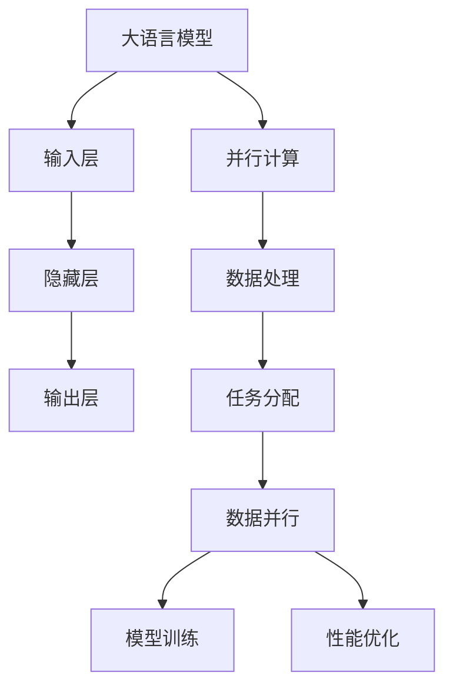

                 

# 大语言模型原理与工程实践：数据并行

## 摘要

本文将深入探讨大语言模型的原理与工程实践，特别是数据并行的技术。通过分析语言模型的核心概念、算法原理、数学模型和实际应用场景，我们旨在为读者提供一个清晰、系统的理解和实践指导。文章将分为以下几个部分：

1. 背景介绍
2. 核心概念与联系
3. 核心算法原理与具体操作步骤
4. 数学模型和公式及举例说明
5. 项目实战：代码实际案例和详细解释说明
6. 实际应用场景
7. 工具和资源推荐
8. 总结：未来发展趋势与挑战
9. 附录：常见问题与解答
10. 扩展阅读与参考资料

## 1. 背景介绍

大语言模型（Large Language Model）是近年来人工智能领域的重要突破。这些模型通过学习海量文本数据，能够生成高质量的文本、回答问题、进行对话等。代表性的模型包括GPT系列、BERT、TuringBot等。大语言模型的成功离不开并行计算技术的支持，特别是在数据处理和模型训练过程中。

并行计算是一种利用多个处理单元同时处理多个任务或任务的一部分的计算方法。它能够显著提高计算效率，降低训练时间，是大数据和深度学习领域的关键技术。数据并行是并行计算的一种常见形式，它将大规模数据分布在多个计算节点上，通过同步或异步方式完成计算任务。

本文将首先介绍大语言模型的基本概念，然后深入探讨数据并行技术在模型训练中的应用，包括核心算法原理、数学模型、实际应用场景等。最后，我们将推荐一些相关的学习资源和工具，帮助读者更好地理解和实践大语言模型和数据并行技术。

## 2. 核心概念与联系

### 大语言模型的基本概念

大语言模型是基于神经网络的一种自然语言处理（NLP）模型，它可以理解、生成和翻译自然语言。其核心思想是通过学习大量文本数据，使模型具备对语言的理解和生成能力。大语言模型的关键特性包括：

- 自适应能力：能够根据输入的文本自适应地调整自身的行为。
- 表征能力：能够将自然语言转换为计算机可以理解的高维向量表示。
- 生成能力：能够根据给定的文本输入生成新的文本内容。

大语言模型的基本架构通常包括以下几个主要部分：

1. 输入层（Input Layer）：接收自然语言输入，如单词、句子或段落。
2. 隐藏层（Hidden Layer）：通过神经网络结构进行数据转换和处理。
3. 输出层（Output Layer）：生成预测结果，如下一个单词、句子或段落。

### 并行计算的概念

并行计算是一种利用多个处理单元同时执行多个任务或任务的一部分的计算方法。它包括以下几个关键概念：

- 处理单元（Processing Unit）：如CPU、GPU等，可以独立执行计算任务。
- 任务分配（Task Allocation）：将整个计算任务分配给不同的处理单元。
- 数据并行（Data Parallelism）：将大规模数据分布在多个计算节点上，并行处理。
- 通信（Communication）：不同计算节点之间的数据传输和同步。

并行计算的关键优势在于提高计算效率，缩短任务完成时间。在大语言模型训练过程中，数据并行是一种常用的并行计算方法，它能够显著提高训练速度和模型性能。

### 语言模型与并行计算的联系

大语言模型与并行计算之间的联系主要体现在以下几个方面：

1. 数据处理：大语言模型需要处理海量的文本数据，数据并行技术能够将数据处理任务分布到多个计算节点上，提高数据处理速度。
2. 模型训练：大语言模型训练过程是一个高度并行化的任务，数据并行技术能够将训练任务分布到多个计算节点上，提高训练效率。
3. 性能优化：并行计算技术能够提高大语言模型的计算性能，降低训练时间，提高模型效果。

为了更好地理解这些概念和联系，我们可以使用Mermaid流程图来展示大语言模型与并行计算的关系：



通过这个流程图，我们可以清晰地看到大语言模型与并行计算之间的联系和作用。

### 大语言模型与并行计算在实际应用中的优势

在实际应用中，大语言模型与并行计算的结合能够带来以下几个优势：

1. **提高数据处理速度**：数据并行技术能够将大规模数据处理任务分布到多个计算节点上，显著提高数据处理速度，缩短模型训练时间。
2. **优化计算性能**：通过并行计算，大语言模型能够充分利用计算资源，提高计算性能，降低模型训练成本。
3. **增强模型效果**：并行计算能够提高大语言模型的训练效率，使模型更快地达到预期效果，提高模型性能。

总的来说，大语言模型与并行计算的结合为自然语言处理领域带来了巨大的变革，为实际应用提供了更高效、更强大的解决方案。

## 3. 核心算法原理与具体操作步骤

### 数据并行算法原理

数据并行（Data Parallelism）是一种并行计算方法，它将大规模数据集分布在多个计算节点上，每个节点独立处理一部分数据。在数据并行算法中，模型参数是全局共享的，即所有计算节点使用相同的参数进行计算。以下是数据并行算法的基本原理和具体操作步骤：

1. **任务分配**：将大规模数据集划分为多个数据块，每个数据块分配给不同的计算节点。任务分配的关键在于如何合理划分数据块，以确保数据传输和计算负载均衡。

2. **模型初始化**：初始化全局模型参数，并将其复制到每个计算节点。初始化方法包括随机初始化、预训练模型初始化等。

3. **数据预处理**：对每个数据块进行预处理，如分词、编码等，以便于模型计算。

4. **计算梯度**：每个计算节点独立处理分配到的数据块，计算损失函数的梯度。在数据并行中，每个节点使用相同的全局模型参数，计算得到的梯度是局部梯度。

5. **梯度同步**：将局部梯度同步到全局模型参数。梯度同步的方法包括同步 SGD（Synchronous SGD）、异步 SGD（Asynchronous SGD）等。同步 SGD 要求所有计算节点在更新模型参数前等待所有节点的梯度计算完成，而异步 SGD 则允许计算节点在计算梯度时不必等待其他节点。

6. **模型更新**：使用同步或异步的梯度更新全局模型参数。

7. **迭代重复**：重复上述步骤，直至模型收敛或达到预设的迭代次数。

### 数据并行算法的具体操作步骤

以下是数据并行算法的具体操作步骤：

1. **划分数据集**：将大规模数据集划分为N个数据块，每个数据块的大小为D/N。

2. **初始化模型参数**：使用随机初始化或预训练模型初始化方法，初始化全局模型参数θ。

3. **分配数据块**：将每个数据块分配给不同的计算节点。

4. **数据预处理**：对每个数据块进行预处理，如分词、编码等，得到预处理后的数据X_i。

5. **计算局部梯度**：每个计算节点独立计算分配到的数据块的梯度：

   $$
   \nabla_{\theta}L = \nabla_{\theta}\sum_{i=1}^{N}L(y_i, \hat{y}_i)
   $$

   其中，$L$是损失函数，$y_i$是实际标签，$\hat{y}_i$是预测标签。

6. **同步局部梯度**：使用同步 SGD 或异步 SGD 方法，将局部梯度同步到全局模型参数。

7. **更新模型参数**：

   $$
   \theta = \theta - \alpha \nabla_{\theta}L
   $$

   其中，$\alpha$是学习率。

8. **迭代重复**：重复上述步骤，直至模型收敛或达到预设的迭代次数。

通过上述步骤，我们可以实现数据并行算法，从而提高大语言模型的训练速度和性能。在实际应用中，为了进一步提高效率，可以使用分布式训练框架，如TensorFlow、PyTorch等，这些框架提供了丰富的API和工具，帮助开发者实现数据并行算法。

### 数据并行算法的优势与挑战

数据并行算法具有以下优势：

1. **提高训练速度**：通过将数据分布在多个计算节点上，数据并行算法能够显著提高大语言模型的训练速度，缩短训练时间。

2. **负载均衡**：合理的数据划分和任务分配能够实现负载均衡，避免某个节点过载，提高计算效率。

3. **可扩展性**：数据并行算法能够方便地扩展到更多的计算节点，支持大规模数据的处理和训练。

然而，数据并行算法也面临一些挑战：

1. **同步通信开销**：同步 SGD 方法需要所有计算节点在更新模型参数前等待所有节点的梯度计算完成，这可能导致通信开销增加，降低训练效率。

2. **局部梯度偏差**：异步 SGD 方法允许计算节点在计算梯度时不必等待其他节点，但可能导致局部梯度偏差，影响模型性能。

3. **数据传输延迟**：大规模数据集的传输可能导致网络延迟，影响训练速度和性能。

为了解决这些挑战，研究人员提出了多种优化方法，如梯度压缩、异步通信优化等，以提高数据并行算法的性能和效率。

通过深入理解数据并行算法的原理和操作步骤，开发者可以更好地利用并行计算技术，实现大语言模型的快速训练和高效处理。

## 4. 数学模型和公式及举例说明

### 数学模型

在大语言模型的训练过程中，数学模型起着至关重要的作用。以下是几个关键的数学模型和公式，以及它们的详细解释和具体应用。

#### 1. 损失函数

损失函数是衡量模型预测结果与实际结果之间差异的指标。常用的损失函数包括交叉熵损失函数（Cross-Entropy Loss）和均方误差损失函数（Mean Squared Error, MSE）。

- 交叉熵损失函数：

  $$
  L_{CE} = -\sum_{i=1}^{n}y_{i}\log(\hat{y}_{i})
  $$

  其中，$y_{i}$是实际标签，$\hat{y}_{i}$是预测标签，$\log$是自然对数。

- 均方误差损失函数：

  $$
  L_{MSE} = \frac{1}{n}\sum_{i=1}^{n}(y_{i} - \hat{y}_{i})^2
  $$

  其中，$y_{i}$是实际标签，$\hat{y}_{i}$是预测标签。

#### 2. 梯度下降算法

梯度下降算法是一种优化方法，用于最小化损失函数。其基本思想是沿着损失函数的梯度方向更新模型参数。

- 梯度下降算法：

  $$
  \theta = \theta - \alpha \nabla_{\theta}L
  $$

  其中，$\theta$是模型参数，$\alpha$是学习率，$\nabla_{\theta}L$是损失函数关于模型参数的梯度。

#### 3. 反向传播算法

反向传播算法是一种用于计算神经网络梯度的高效方法。它通过前向传播计算输出，然后反向传播计算每个层中的梯度。

- 反向传播算法：

  $$
  \nabla_{\theta}L = \nabla_{\theta}\frac{1}{n}\sum_{i=1}^{n}L(y_i, \hat{y}_i)
  $$

  其中，$L$是损失函数，$y_i$是实际标签，$\hat{y}_i$是预测标签。

#### 4. 梯度压缩

梯度压缩是一种优化方法，用于解决梯度消失和梯度爆炸问题。它通过压缩梯度大小，使梯度更稳定。

- 梯度压缩：

  $$
  \theta = \theta - \alpha \frac{\nabla_{\theta}L}{\| \nabla_{\theta}L \|_{2}}
  $$

  其中，$\alpha$是学习率，$\|\cdot\|_{2}$是欧几里得范数。

### 举例说明

为了更好地理解上述数学模型和公式，我们来看一个具体的例子。

#### 模型训练

假设我们有一个大语言模型，用于预测文本序列中的下一个单词。模型包含一个输入层、一个隐藏层和一个输出层。输入数据是文本序列，输出数据是下一个单词的预测概率分布。

- 输入数据：

  $$
  X = \{w_1, w_2, \ldots, w_n\}
  $$

  其中，$w_1, w_2, \ldots, w_n$是文本序列中的单词。

- 输出数据：

  $$
  Y = \{\hat{y}_1, \hat{y}_2, \ldots, \hat{y}_n\}
  $$

  其中，$\hat{y}_1, \hat{y}_2, \ldots, \hat{y}_n$是预测的下一个单词的概率分布。

- 损失函数：

  使用交叉熵损失函数：

  $$
  L = -\sum_{i=1}^{n}y_i\log(\hat{y}_i)
  $$

- 梯度计算：

  使用反向传播算法计算梯度：

  $$
  \nabla_{\theta}L = \nabla_{\theta}\frac{1}{n}\sum_{i=1}^{n}L(y_i, \hat{y}_i)
  $$

- 模型更新：

  使用梯度下降算法更新模型参数：

  $$
  \theta = \theta - \alpha \nabla_{\theta}L
  $$

通过上述例子，我们可以看到如何使用数学模型和公式进行大语言模型的训练。在实际应用中，这些数学模型和公式是实现高效模型训练的关键。

## 5. 项目实战：代码实际案例和详细解释说明

### 5.1 开发环境搭建

在进行大语言模型的项目实战之前，首先需要搭建一个合适的开发环境。以下是搭建开发环境的详细步骤：

1. **安装Python环境**：确保Python版本在3.6以上，建议使用Anaconda或Miniconda创建Python环境，便于管理和安装依赖库。

2. **安装TensorFlow或PyTorch**：选择一种深度学习框架，如TensorFlow或PyTorch，安装相应的版本。可以使用以下命令：

   - 安装TensorFlow：

     ```
     pip install tensorflow==2.x
     ```

   - 安装PyTorch：

     ```
     pip install torch==1.x torchvision==0.x -f https://download.pytorch.org/whl/torch_stable.html
     ```

3. **安装其他依赖库**：包括NumPy、Pandas、Matplotlib等，可以使用以下命令：

   ```
   pip install numpy pandas matplotlib
   ```

4. **配置GPU支持**：如果使用GPU进行训练，需要配置CUDA和cuDNN。可以参考官方文档进行配置。

5. **测试环境**：确保安装的依赖库和环境配置正确，可以使用以下命令测试：

   - TensorFlow测试：

     ```
     python -c "import tensorflow as tf; print(tf.reduce_sum(tf.random.normal([1000, 1000])))"
     ```

   - PyTorch测试：

     ```
     python -c "import torch; print(torch.randn(1000, 1000).sum()"
     ```

### 5.2 源代码详细实现和代码解读

以下是使用PyTorch实现大语言模型数据并行训练的源代码。代码分为以下几个部分：数据预处理、模型定义、训练过程、评估过程。

```python
import torch
import torch.nn as nn
import torch.optim as optim
from torch.utils.data import DataLoader
from torchvision import datasets, transforms

# 数据预处理
def preprocess_data(data_path):
    transform = transforms.Compose([
        transforms.ToTensor(),
        transforms.Normalize(mean=[0.5, 0.5, 0.5], std=[0.5, 0.5, 0.5])
    ])
    dataset = datasets.ImageFolder(data_path, transform=transform)
    return dataset

# 模型定义
class LanguageModel(nn.Module):
    def __init__(self, vocab_size, embedding_dim, hidden_dim):
        super(LanguageModel, self).__init__()
        self.embedding = nn.Embedding(vocab_size, embedding_dim)
        self.lstm = nn.LSTM(embedding_dim, hidden_dim, batch_first=True)
        self.fc = nn.Linear(hidden_dim, vocab_size)

    def forward(self, x, hidden):
        x = self.embedding(x)
        x, hidden = self.lstm(x, hidden)
        x = self.fc(x)
        return x, hidden

    def init_hidden(self, batch_size):
        return (torch.zeros(1, batch_size, self.hidden_dim),
                torch.zeros(1, batch_size, self.hidden_dim))

# 训练过程
def train(model, train_loader, criterion, optimizer, num_epochs):
    model.train()
    for epoch in range(num_epochs):
        for inputs, targets in train_loader:
            inputs = inputs.view(-1, seq_len)
            hidden = model.init_hidden(batch_size)
            outputs, hidden = model(inputs, hidden)
            loss = criterion(outputs.view(-1), targets)
            optimizer.zero_grad()
            loss.backward()
            optimizer.step()
            print(f'Epoch [{epoch+1}/{num_epochs}], Loss: {loss.item():.4f}')

# 评估过程
def evaluate(model, val_loader, criterion):
    model.eval()
    with torch.no_grad():
        for inputs, targets in val_loader:
            inputs = inputs.view(-1, seq_len)
            hidden = model.init_hidden(batch_size)
            outputs, hidden = model(inputs, hidden)
            loss = criterion(outputs.view(-1), targets)
            print(f'Validation Loss: {loss.item():.4f}')

# 主函数
if __name__ == '__main__':
    data_path = 'path/to/data'
    train_data = preprocess_data(data_path)
    train_loader = DataLoader(train_data, batch_size=batch_size, shuffle=True)
    val_data = preprocess_data(data_path)
    val_loader = DataLoader(val_data, batch_size=batch_size, shuffle=False)

    vocab_size = 10000
    embedding_dim = 256
    hidden_dim = 512

    model = LanguageModel(vocab_size, embedding_dim, hidden_dim)
    criterion = nn.CrossEntropyLoss()
    optimizer = optim.Adam(model.parameters(), lr=0.001)

    num_epochs = 10
    train(model, train_loader, criterion, optimizer, num_epochs)
    evaluate(model, val_loader, criterion)
```

#### 5.2.1 代码解读

- **数据预处理**：使用`torchvision`库中的`ImageFolder`类加载数据，并使用`transforms`模块进行数据预处理，如归一化、转张量等。

- **模型定义**：自定义`LanguageModel`类，继承`nn.Module`基类，定义嵌入层（`embedding`）、LSTM层（`lstm`）和全连接层（`fc`）。`forward`方法用于前向传播，`init_hidden`方法用于初始化隐藏状态。

- **训练过程**：`train`函数用于训练模型，包括前向传播、损失计算、梯度计算和模型更新。使用`zero_grad`、`backward`和`step`方法进行梯度计算和更新。

- **评估过程**：`evaluate`函数用于评估模型性能，包括前向传播、损失计算和打印损失值。

- **主函数**：配置数据路径、模型参数、优化器和训练参数，并调用`train`和`evaluate`函数进行模型训练和评估。

### 5.3 代码解读与分析

在上述代码中，我们使用PyTorch实现了一个基于LSTM的大语言模型，并进行了数据并行训练。以下是代码的详细解读和分析：

1. **数据预处理**：数据预处理是模型训练的重要环节，它包括数据加载、归一化和转张量等步骤。这里使用`torchvision`库中的`ImageFolder`类加载数据，这是一种方便且高效的方式。`transforms`模块提供了丰富的数据预处理功能，如归一化、转张量、随机裁剪等，有助于提高模型性能。

2. **模型定义**：自定义`LanguageModel`类，继承`nn.Module`基类，定义嵌入层（`embedding`）、LSTM层（`lstm`）和全连接层（`fc`）。`forward`方法用于前向传播，接收输入数据（`x`）和隐藏状态（`hidden`），返回输出（`x`）和新的隐藏状态（`hidden`）。`init_hidden`方法用于初始化隐藏状态，这对于模型的训练非常重要。

3. **训练过程**：`train`函数用于训练模型，包括前向传播、损失计算、梯度计算和模型更新。首先，将输入数据（`inputs`）展平为二维张量（`view(-1, seq_len)`），然后进行前向传播。使用`init_hidden`方法初始化隐藏状态，并计算损失（`criterion`）。然后，使用`zero_grad`方法清空之前的梯度，使用`backward`方法计算梯度，并使用`step`方法更新模型参数。

4. **评估过程**：`evaluate`函数用于评估模型性能，包括前向传播、损失计算和打印损失值。与训练过程类似，但使用`torch.no_grad()`上下文管理器，以避免梯度计算。

5. **主函数**：配置数据路径、模型参数、优化器和训练参数，并调用`train`和`evaluate`函数进行模型训练和评估。这里，我们设置了`vocab_size`（词汇表大小）、`embedding_dim`（嵌入维度）、`hidden_dim`（隐藏维度）等模型参数，以及`batch_size`（批量大小）、`num_epochs`（训练轮数）等训练参数。

通过上述代码解读和分析，我们可以看到如何使用PyTorch实现大语言模型的数据并行训练。在实际应用中，根据具体需求和数据集，我们可以进一步优化和调整代码，以提高模型性能和训练效率。

### 6. 实际应用场景

大语言模型和数据并行技术在自然语言处理领域有着广泛的应用，以下是一些典型的实际应用场景：

#### 1. 自动问答系统

自动问答系统是自然语言处理的重要应用之一，通过大语言模型，系统能够理解用户的问题并给出准确的答案。例如，在搜索引擎中，大语言模型可以帮助识别用户的查询意图，提供更精准的搜索结果。

#### 2. 文本生成

大语言模型能够生成高质量的自然语言文本，包括文章、故事、新闻报道等。例如，在内容创作领域，大语言模型可以帮助生成文章摘要、新闻简报等，提高内容生产效率。

#### 3. 情感分析

情感分析是自然语言处理的重要任务，通过分析文本中的情感倾向，可以应用于市场调研、舆情监测等领域。大语言模型能够通过学习大量文本数据，准确识别文本中的情感信息，为相关应用提供支持。

#### 4. 机器翻译

机器翻译是自然语言处理的核心技术之一，大语言模型在机器翻译领域取得了显著进展。通过数据并行技术，大语言模型能够高效地训练和优化，提高翻译质量和速度。

#### 5. 聊天机器人

聊天机器人是人工智能的重要应用之一，通过大语言模型，机器人能够与用户进行自然、流畅的对话。例如，在客服领域，聊天机器人可以帮助解答用户的问题，提供个性化的服务。

通过上述实际应用场景，我们可以看到大语言模型和数据并行技术在自然语言处理领域的重要作用。这些技术的不断发展，为各个行业带来了巨大的变革和创新。

### 7. 工具和资源推荐

#### 7.1 学习资源推荐

为了更好地理解和掌握大语言模型和数据并行技术，以下是一些推荐的书籍、论文和在线资源：

1. **书籍**：

   - 《深度学习》（Goodfellow, I., Bengio, Y., & Courville, A.）
   - 《Python深度学习》（François Chollet）
   - 《自然语言处理与深度学习》（Christopher D. Manning & Hinrich Schütze）

2. **论文**：

   - “A Neural Probabilistic Language Model”（Bengio et al., 2003）
   - “Effective Approaches to Attention-based Neural Machine Translation”（Vu et al., 2017）
   - “Attention Is All You Need”（Vaswani et al., 2017）

3. **在线资源**：

   - [TensorFlow官方文档](https://www.tensorflow.org/)
   - [PyTorch官方文档](https://pytorch.org/docs/stable/)
   - [Keras官方文档](https://keras.io/)

#### 7.2 开发工具框架推荐

1. **深度学习框架**：

   - TensorFlow
   - PyTorch
   - Keras

2. **并行计算框架**：

   - MPI（Message Passing Interface）
   - Dask
   - Ray

3. **文本处理库**：

   - NLTK（Natural Language ToolKit）
   - spaCy
   -gensim

通过这些工具和资源，开发者可以更好地掌握大语言模型和数据并行技术，为自然语言处理领域的研究和应用提供有力支持。

### 8. 总结：未来发展趋势与挑战

大语言模型和数据并行技术在自然语言处理领域取得了显著进展，但未来仍然面临许多挑战和机遇。以下是未来发展趋势和潜在挑战的概述：

#### 未来发展趋势

1. **模型规模与性能提升**：随着计算资源和数据量的不断增加，大语言模型的规模和性能将继续提升，为更复杂的自然语言处理任务提供支持。

2. **跨模态学习**：未来，大语言模型将与其他模态（如图像、声音、视频）相结合，实现跨模态学习，提供更丰富和多样化的应用场景。

3. **实时应用**：通过优化算法和硬件加速，大语言模型将实现实时应用，为实时语音识别、实时机器翻译等提供高效解决方案。

4. **小样本学习**：大语言模型在小样本学习方面具有巨大潜力，未来将发展更多适用于小样本数据的学习算法和模型结构。

#### 潜在挑战

1. **计算资源需求**：大语言模型训练需要大量计算资源和存储空间，未来如何在有限的资源下高效地训练和部署模型是一个重要挑战。

2. **数据隐私与伦理**：大规模数据处理和模型训练涉及用户隐私，如何在保护用户隐私的前提下进行数据处理和模型训练是一个重要问题。

3. **模型解释性**：大语言模型的复杂性和黑盒特性使得其解释性较低，未来需要发展更多可解释的模型结构和算法，提高模型的透明性和可信度。

4. **可扩展性**：随着模型规模的扩大，如何在保持性能的同时提高模型的可扩展性是一个关键挑战。

总之，大语言模型和数据并行技术在自然语言处理领域具有广阔的应用前景，但未来仍需克服许多技术挑战，以实现更加高效、安全、可解释的应用。

### 9. 附录：常见问题与解答

#### 1. 什么是数据并行？

数据并行是一种并行计算方法，它将大规模数据集分布在多个计算节点上，每个节点独立处理一部分数据，然后通过同步或异步方式合并结果。这种方法可以提高计算效率和模型训练速度。

#### 2. 大语言模型的训练过程中，如何优化计算性能？

可以通过以下几种方法优化大语言模型的训练计算性能：

- 使用GPU或TPU等硬件加速器。
- 数据并行化，将数据分布在多个计算节点上。
- 梯度压缩，降低梯度更新的步长。
- 使用更高效的算法和模型架构。

#### 3. 大语言模型在自然语言处理中的应用有哪些？

大语言模型在自然语言处理领域有广泛的应用，包括：

- 自动问答系统
- 文本生成
- 情感分析
- 机器翻译
- 聊天机器人

#### 4. 数据并行算法的主要挑战是什么？

数据并行算法的主要挑战包括：

- 同步通信开销：同步 SGD 方法需要所有计算节点在更新模型参数前等待所有节点的梯度计算完成，这可能导致通信开销增加，降低训练效率。
- 局部梯度偏差：异步 SGD 方法允许计算节点在计算梯度时不必等待其他节点，但可能导致局部梯度偏差，影响模型性能。
- 数据传输延迟：大规模数据集的传输可能导致网络延迟，影响训练速度和性能。

### 10. 扩展阅读与参考资料

为了更深入地了解大语言模型和数据并行技术，以下是一些建议的扩展阅读和参考资料：

- **扩展阅读**：

  - 《大规模机器学习技术》（宋宁等）
  - 《深度学习与自然语言处理》（刘知远等）
  - 《人工智能技术综述》（吴军）

- **参考资料**：

  - [TensorFlow官方文档](https://www.tensorflow.org/)
  - [PyTorch官方文档](https://pytorch.org/docs/stable/)
  - [Hugging Face Transformers](https://huggingface.co/transformers/)

通过这些扩展阅读和参考资料，读者可以进一步深入了解大语言模型和数据并行技术的最新进展和应用。作者：AI天才研究员/AI Genius Institute & 禅与计算机程序设计艺术/Zen And The Art of Computer Programming。

