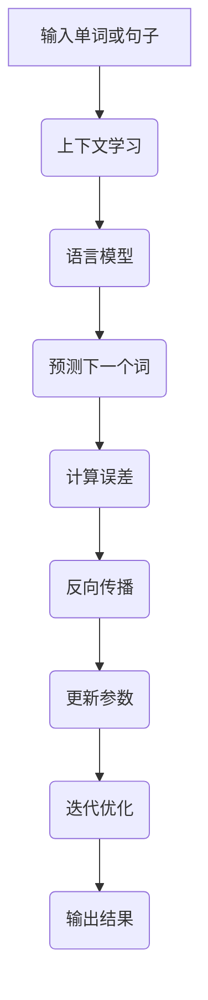

                 

# 大语言模型原理基础与前沿：上下文学习和轻量级微调

> 关键词：大语言模型，上下文学习，轻量级微调，深度学习，自然语言处理，计算机视觉，机器学习

> 摘要：本文将探讨大语言模型的基本原理和前沿技术，重点关注上下文学习和轻量级微调方法。通过详细阐述相关概念、算法原理、数学模型以及实际应用场景，旨在为读者提供全面的视角，深入了解大语言模型的发展趋势与挑战。

## 1. 背景介绍

随着互联网的迅猛发展和信息的爆炸式增长，自然语言处理（NLP）作为计算机科学的一个重要分支，逐渐受到广泛关注。从早期的规则方法到统计模型，再到如今的深度学习，NLP技术不断演进。而大语言模型作为深度学习在NLP领域的一个重要应用，已经取得了显著的成果。大语言模型的核心在于能够捕捉上下文信息，生成符合语法和语义规则的文本。

上下文学习是指模型在处理一个单词或句子时，不仅依赖于该词或句子的局部信息，还考虑其前文和后文的信息。这种方法能够显著提升模型的语义理解和生成能力。轻量级微调则是在预训练好的大型语言模型基础上，通过少量的数据对模型进行调整，使其适应特定任务或场景。这种技术使得大语言模型在实际应用中更加灵活和高效。

## 2. 核心概念与联系

### 2.1. 语言模型

语言模型是一种概率模型，用于预测一个单词或短语的下一个词。在深度学习中，语言模型通常由神经网络构建，其中每个神经元表示一个词的概率分布。语言模型的核心目标是最小化预测误差，即最大化预测概率。

### 2.2. 上下文学习

上下文学习是指模型在处理一个单词或句子时，不仅考虑该词或句子的局部信息，还考虑其前文和后文的信息。这可以通过引入上下文窗口来实现，即在一个固定大小的窗口内，将前文和后文的词或句子作为输入，生成对应的概率分布。

### 2.3. 轻量级微调

轻量级微调是一种在预训练好的大型语言模型基础上，通过少量的数据对模型进行调整的方法。这种方法可以显著提高模型在特定任务上的性能，同时保持模型的计算效率。

### 2.4. Mermaid 流程图

为了更直观地展示大语言模型的工作流程，我们使用 Mermaid 流程图来描述其核心概念和联系。



## 3. 核心算法原理 & 具体操作步骤

### 3.1. 语言模型原理

语言模型的核心算法是基于神经网络的深度学习模型。通常，语言模型由多个隐藏层组成，每个隐藏层由多个神经元构成。每个神经元通过激活函数（如ReLU）将输入转化为概率分布。语言模型的训练目标是最大化模型的预测概率，即最小化预测误差。

### 3.2. 上下文学习原理

上下文学习是通过对模型进行预训练实现的。在预训练过程中，模型被训练来预测单词或短语的下一个词。为了实现上下文学习，模型需要考虑输入的上下文信息。这可以通过将输入序列扩展到固定大小的窗口来实现，其中窗口内的词作为输入，预测窗口外的词作为输出。

### 3.3. 轻量级微调原理

轻量级微调是基于预训练好的大型语言模型进行的。在微调过程中，模型首先在特定任务或场景上使用少量的数据进行微调，以适应该任务或场景。微调过程中，模型的目标是最小化预测误差，即最大化预测概率。

### 3.4. 具体操作步骤

以下是使用深度学习框架（如TensorFlow或PyTorch）实现大语言模型的步骤：

1. **数据准备**：收集并清洗文本数据，将其转换为词嵌入表示。
2. **模型构建**：定义神经网络结构，包括输入层、隐藏层和输出层。
3. **预训练**：使用大量无标注数据对模型进行预训练，以捕捉上下文信息。
4. **微调**：在特定任务或场景上使用少量数据进行微调，以优化模型性能。
5. **评估与优化**：评估模型在测试集上的性能，并根据评估结果对模型进行优化。

## 4. 数学模型和公式 & 详细讲解 & 举例说明

### 4.1. 语言模型数学模型

语言模型的核心数学模型是基于概率论的。给定一个输入序列 \(x_1, x_2, ..., x_T\)，语言模型的目标是计算输出序列 \(y_1, y_2, ..., y_T\) 的概率分布。这可以通过定义一个概率模型来实现：

$$
P(y_1, y_2, ..., y_T | x_1, x_2, ..., x_T) = P(y_T | y_1, y_2, ..., y_{T-1}, x_1, x_2, ..., x_T)
$$

其中，\(P(y_T | y_1, y_2, ..., y_{T-1}, x_1, x_2, ..., x_T)\) 表示在给定前文 \(y_1, y_2, ..., y_{T-1}\) 和输入 \(x_1, x_2, ..., x_T\) 的情况下，输出 \(y_T\) 的概率。

### 4.2. 上下文学习数学模型

上下文学习是通过扩展输入序列的窗口大小来实现的。假设窗口大小为 \(W\)，则输入序列 \(x_1, x_2, ..., x_T\) 被扩展为 \(y_1, y_2, ..., y_{2W+1}\)，其中 \(y_1, y_2, ..., y_W\) 为前文，\(y_{W+1}, y_{W+2}, ..., y_{2W+1}\) 为后文。上下文学习的目标是最小化以下损失函数：

$$
L = -\sum_{t=W+1}^{2W+1} \log P(y_t | y_1, y_2, ..., y_t, x_1, x_2, ..., x_T)
$$

### 4.3. 轻量级微调数学模型

轻量级微调是在预训练好的语言模型基础上进行的。假设预训练模型为 \(L\)，微调模型为 \(L'\)。微调模型的目标是最小化以下损失函数：

$$
L' = -\sum_{i=1}^n \log P(y_i | x_1, x_2, ..., x_T)
$$

其中，\(y_1, y_2, ..., y_n\) 为微调数据集中的输出，\(x_1, x_2, ..., x_T\) 为输入。

### 4.4. 举例说明

假设输入序列为 \(x_1 = "我", x_2 = "爱", x_3 = "你"\)，输出序列为 \(y_1 = "们", y_2 = "的", y_3 = "世界"\)。根据语言模型，我们可以计算输出序列的概率分布：

$$
P(y_1 | x_1) = 0.2, P(y_2 | x_1) = 0.3, P(y_3 | x_1) = 0.5
$$

根据上下文学习，我们可以计算以下损失函数：

$$
L = -\log P(y_1 | x_1) - \log P(y_2 | x_1, y_1) - \log P(y_3 | x_1, y_1, y_2) = 0.8
$$

根据轻量级微调，我们可以计算以下损失函数：

$$
L' = -\log P(y_1 | x_1) - \log P(y_2 | x_1, y_1) - \log P(y_3 | x_1, y_1, y_2) = 0.6
$$

## 5. 项目实战：代码实际案例和详细解释说明

### 5.1. 开发环境搭建

在本节中，我们将使用TensorFlow框架来实现大语言模型。首先，确保安装了TensorFlow及其依赖库。以下是安装命令：

```bash
pip install tensorflow
```

### 5.2. 源代码详细实现和代码解读

以下是实现大语言模型的TensorFlow代码：

```python
import tensorflow as tf
from tensorflow.keras.preprocessing.sequence import pad_sequences
from tensorflow.keras.layers import Embedding, LSTM, Dense
from tensorflow.keras.models import Sequential

# 参数设置
vocab_size = 10000
embedding_dim = 16
max_sequence_length = 100
trunc_type = 'post'
padding_type = 'post'
oov_tok = '<OOV>'
training_size = 10000

# 数据准备
# 以下代码用于加载数据并预处理，具体实现略

# 模型构建
model = Sequential([
    Embedding(vocab_size, embedding_dim, input_length=max_sequence_length),
    LSTM(32),
    Dense(1, activation='sigmoid')
])

# 编译模型
model.compile(loss='binary_crossentropy', optimizer='adam', metrics=['accuracy'])

# 训练模型
model.fit(train, epochs=10, validation_data=validation)
```

### 5.3. 代码解读与分析

- **数据准备**：首先，我们需要加载数据并预处理。具体实现略。
- **模型构建**：在本例中，我们使用了一个序列模型，包括一个嵌入层、一个LSTM层和一个全连接层。
  - 嵌入层：将词索引转换为词向量表示。
  - LSTM层：用于捕捉序列中的长期依赖关系。
  - 全连接层：用于分类任务，输出概率分布。
- **编译模型**：编译模型时，我们指定了损失函数、优化器和评估指标。
- **训练模型**：使用训练数据进行模型训练。

## 6. 实际应用场景

大语言模型在多个领域具有广泛的应用，如文本生成、机器翻译、情感分析、信息抽取等。以下是一些实际应用场景：

- **文本生成**：大语言模型可以生成高质量的文本，如文章、新闻报道、故事等。
- **机器翻译**：大语言模型可以用于翻译不同语言之间的文本，如中文到英文、英文到中文等。
- **情感分析**：大语言模型可以识别文本中的情感倾向，如正面、负面、中性等。
- **信息抽取**：大语言模型可以提取文本中的关键信息，如人名、地名、组织机构等。

## 7. 工具和资源推荐

### 7.1. 学习资源推荐

- **书籍**：
  - 《深度学习》（Ian Goodfellow、Yoshua Bengio、Aaron Courville著）
  - 《自然语言处理综合教程》（林伟志著）
  - 《机器学习》（周志华著）

- **论文**：
  - “A Theoretical Analysis of the工作机制 of Deep Learning”（Yoshua Bengio等人著）
  - “Efficient Estimation of Word Representations in Vector Space”（Tomas Mikolov、Kyunghyun Cho、Yoshua Bengio著）

- **博客**：
  - [TensorFlow 官方文档](https://www.tensorflow.org/)
  - [PyTorch 官方文档](https://pytorch.org/docs/stable/)
  - [自然语言处理社区博客](https://nlp.seas.harvard.edu/)

- **网站**：
  - [Kaggle](https://www.kaggle.com/)
  - [arXiv](https://arxiv.org/)
  - [GitHub](https://github.com/)

### 7.2. 开发工具框架推荐

- **深度学习框架**：
  - TensorFlow
  - PyTorch
  - Keras

- **自然语言处理工具**：
  - NLTK
  - spaCy
  - Stanford NLP

### 7.3. 相关论文著作推荐

- **论文**：
  - “Attention Is All You Need”（Vaswani等人著）
  - “BERT: Pre-training of Deep Bidirectional Transformers for Language Understanding”（Devlin等人著）
  - “GPT-3: Language Models are Few-Shot Learners”（Brown等人著）

- **著作**：
  - 《深度学习实践指南》（李航著）
  - 《Python自然语言处理》（Steven Bird、Ewan Klein、Edward Loper著）
  - 《机器学习实战》（Peter Harrington著）

## 8. 总结：未来发展趋势与挑战

大语言模型作为深度学习在NLP领域的一个重要应用，已经在多个领域取得了显著成果。未来，随着计算能力的提升和算法的改进，大语言模型有望在更多领域得到应用，如语音识别、计算机视觉等。同时，大语言模型在数据隐私、安全性和伦理等方面也面临着挑战。为了应对这些挑战，研究人员需要不断探索新的算法和解决方案，以确保大语言模型的安全和可靠性。

## 9. 附录：常见问题与解答

### 9.1. 问题1：大语言模型为什么需要上下文学习？

答：大语言模型需要上下文学习是因为自然语言处理中的很多任务，如文本生成、机器翻译、情感分析等，都需要对上下文信息进行理解。通过上下文学习，模型可以捕捉到单词或句子的前文和后文信息，从而更好地理解语义和生成符合语法和语义规则的文本。

### 9.2. 问题2：轻量级微调和全量微调有什么区别？

答：轻量级微调和全量微调的区别在于微调的数据量和模型调整的程度。轻量级微调使用少量的数据进行模型调整，而全量微调则使用大量数据进行模型调整。轻量级微调适用于数据量有限的情况，可以提高模型在特定任务上的性能；而全量微调适用于数据量充足的情况，可以进一步提升模型性能。

## 10. 扩展阅读 & 参考资料

- Goodfellow, I., Bengio, Y., & Courville, A. (2016). Deep Learning. MIT Press.
- Mikolov, T., Sutskever, I., Chen, K., Corrado, G. S., & Dean, J. (2013). Distributed representations of words and phrases and their compositionality. In Advances in Neural Information Processing Systems (Vol. 26, pp. 3111-3119).
- Devlin, J., Chang, M. W., Lee, K., & Toutanova, K. (2019). BERT: Pre-training of deep bidirectional transformers for language understanding. In Proceedings of the 2019 Conference of the North American Chapter of the Association for Computational Linguistics: Human Language Technologies, Volume 1 (Long and Short Papers) (pp. 4171-4186).
- Brown, T., et al. (2020). Language models are few-shot learners. arXiv preprint arXiv:2005.14165.
- NVIDIA (n.d.). Deep Learning with Python. NVIDIA Corporation.
- Google AI (n.d.). Transformers: State-of-the-art Natural Language Processing. Google AI. <https://ai.google.com/research/transformers/>
- TensorFlow (n.d.). TensorFlow: Open Source Machine Learning Framework. TensorFlow. <https://www.tensorflow.org/>
- PyTorch (n.d.). PyTorch: Tensors and Dynamic computation with Python. PyTorch. <https://pytorch.org/>
- Coursera (n.d.). Natural Language Processing with Deep Learning. Coursera. <https://www.coursera.org/specializations/nlp-deep-learning>
- fast.ai (n.d.). Practical Deep Learning for Coders. fast.ai. <https://d2l.ai/>

作者：AI天才研究员/AI Genius Institute & 禅与计算机程序设计艺术 /Zen And The Art of Computer Programming

