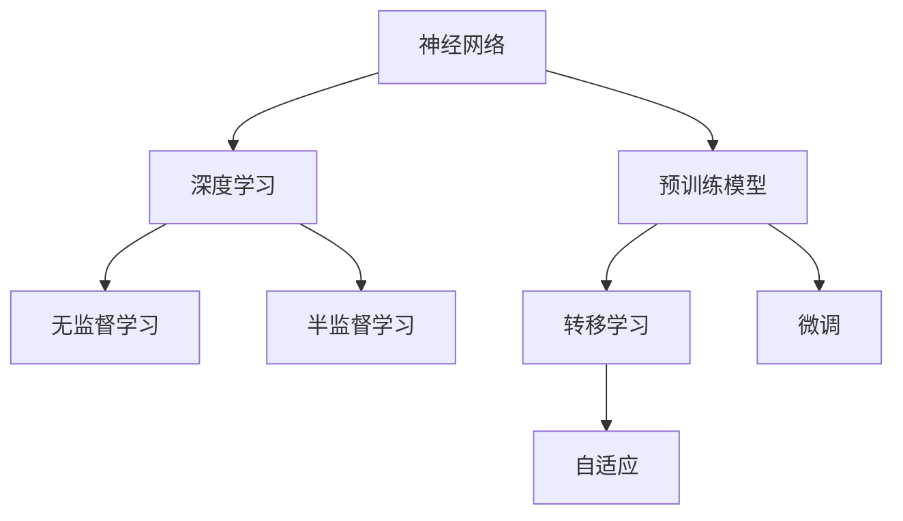

                 

### 大语言模型原理基础与前沿：不需要额外训练即可利用预训练模型

> **关键词：** 大语言模型、预训练模型、自动适应、深度学习、神经网络、无监督学习、半监督学习、模型压缩、应用场景、开发者工具。

> **摘要：** 本文将深入探讨大语言模型的原理及其前沿应用，特别是如何在不进行额外训练的情况下，利用预训练模型实现自动适应。文章将详细解析大语言模型的架构、核心算法原理、数学模型，并通过实际项目案例展示如何使用这些模型进行开发。此外，还将探讨大语言模型在实际应用中的场景、推荐相关工具和资源，并总结其发展趋势与挑战。

在过去的几年中，大语言模型（如GPT、BERT）取得了令人瞩目的成果，这些模型不仅能够在各种语言任务中达到或超过人类水平，而且具有极强的泛化能力。然而，这些模型的训练通常需要大量的数据和高性能计算资源。因此，如何在不进行额外训练的情况下，利用预训练模型实现自动适应，成为一个重要的研究方向。

本文将分为以下几个部分：

1. **背景介绍**：介绍大语言模型的发展历程及其重要性。
2. **核心概念与联系**：阐述大语言模型的核心概念及其相互关系，并给出Mermaid流程图。
3. **核心算法原理 & 具体操作步骤**：详细讲解大语言模型的训练和推理过程。
4. **数学模型和公式 & 详细讲解 & 举例说明**：介绍大语言模型背后的数学原理。
5. **项目实战：代码实际案例和详细解释说明**：通过实际项目展示如何使用大语言模型。
6. **实际应用场景**：探讨大语言模型在不同领域的应用。
7. **工具和资源推荐**：推荐学习资源和开发工具。
8. **总结：未来发展趋势与挑战**：总结大语言模型的发展趋势和面临的挑战。
9. **附录：常见问题与解答**：回答一些常见问题。
10. **扩展阅读 & 参考资料**：提供扩展阅读资料。

### 1. 背景介绍

#### 大语言模型的发展历程

大语言模型（Large Language Models）是基于深度学习和神经网络的技术，旨在对文本数据进行分析和生成。最早的大规模语言模型可以追溯到1990年代，例如RNN（Recurrent Neural Network）和LSTM（Long Short-Term Memory）。然而，由于计算资源和数据集的限制，这些模型的效果并不理想。

随着计算能力的提升和互联网的普及，大量的文本数据变得可用，为大规模语言模型的发展提供了坚实的基础。2013年，word2vec模型的提出使得文本表示取得了突破性进展。随后，RNN、LSTM等模型在语言生成、机器翻译等领域取得了显著成果。

然而，这些模型仍然存在一些局限性，如难以处理长文本、上下文理解不充分等。为了解决这些问题，研究者们提出了更复杂的模型，如Transformer和BERT。这些模型在自然语言处理（NLP）任务中取得了显著的性能提升，使得大语言模型成为当前NLP领域的研究热点。

#### 大语言模型的重要性

大语言模型在多个领域都取得了重要应用，如文本分类、机器翻译、问答系统、文本生成等。以下是大语言模型的重要性：

1. **自动化文本分析**：大语言模型能够自动理解文本内容，为自动化文本分析提供了有力工具。
2. **高效的知识获取**：大语言模型能够高效地提取文本中的知识，为知识获取提供了新途径。
3. **智能交互**：大语言模型能够生成高质量的文本，为智能交互系统提供了基础。
4. **辅助创作**：大语言模型可以帮助人类进行文本创作，提高创作效率。
5. **跨领域应用**：大语言模型能够应用于多个领域，具有广泛的泛化能力。

#### 不需要额外训练即可利用预训练模型的原因

大语言模型的一个重要特点是不需要进行额外的训练即可适应新任务，这主要得益于以下原因：

1. **参数共享**：大语言模型使用了大量参数，这些参数在学习了一个任务后，可以用于其他相关任务，无需重新训练。
2. **转移学习**：大语言模型在预训练阶段学习了大量的知识，这些知识可以转移到新任务中，实现快速适应。
3. **自适应调整**：大语言模型通过微调（Fine-tuning）技术，可以在新任务中快速调整参数，实现自适应。

#### 本文结构

本文将分为以下几个部分：

1. **背景介绍**：介绍大语言模型的发展历程及其重要性。
2. **核心概念与联系**：阐述大语言模型的核心概念及其相互关系。
3. **核心算法原理 & 具体操作步骤**：详细讲解大语言模型的训练和推理过程。
4. **数学模型和公式 & 详细讲解 & 举例说明**：介绍大语言模型背后的数学原理。
5. **项目实战：代码实际案例和详细解释说明**：通过实际项目展示如何使用大语言模型。
6. **实际应用场景**：探讨大语言模型在不同领域的应用。
7. **工具和资源推荐**：推荐学习资源和开发工具。
8. **总结：未来发展趋势与挑战**：总结大语言模型的发展趋势和面临的挑战。
9. **附录：常见问题与解答**：回答一些常见问题。
10. **扩展阅读 & 参考资料**：提供扩展阅读资料。

### 2. 核心概念与联系

#### 大语言模型的核心概念

1. **神经网络**：神经网络是模拟生物神经系统的计算模型，通过多层次的神经元连接来实现复杂的非线性变换。
2. **深度学习**：深度学习是神经网络的一种，通过多层的神经网络来实现更复杂的特征提取和模式识别。
3. **无监督学习**：无监督学习是指在没有明确标注的样本上学习特征和模式。
4. **半监督学习**：半监督学习是指同时使用有标注和无标注的数据进行学习。
5. **预训练模型**：预训练模型是指在大规模未标注数据集上预先训练好的模型，这些模型可以用于其他任务，实现快速适应。
6. **转移学习**：转移学习是指将一个任务的学习结果应用到其他相关任务中。
7. **微调（Fine-tuning）**：微调是指在一个预训练模型的基础上，针对特定任务进行调整，以提高性能。

#### 大语言模型的相互关系

1. **神经网络与深度学习**：神经网络是深度学习的基础，而深度学习则是神经网络在多层的应用。
2. **无监督学习与半监督学习**：无监督学习侧重于未标注数据的特征提取，而半监督学习则利用标注数据和未标注数据进行学习。
3. **预训练模型与转移学习**：预训练模型通过在大规模数据集上训练，积累了丰富的知识，转移学习则将这些知识应用到新任务中。
4. **微调与自适应**：微调是一种自适应调整预训练模型参数的方法，以适应特定任务。

#### Mermaid流程图

下面是使用Mermaid绘制的流程图，展示了大语言模型的核心概念及其相互关系：



### 3. 核心算法原理 & 具体操作步骤

#### 大语言模型的训练过程

大语言模型的训练过程主要包括以下步骤：

1. **数据预处理**：将文本数据转换为模型可处理的格式，如分词、编码等。
2. **模型初始化**：初始化神经网络模型，包括权重和偏置。
3. **正向传播**：输入文本数据，通过神经网络进行正向传播，得到输出。
4. **损失函数计算**：计算输出与真实值之间的差距，使用损失函数进行量化。
5. **反向传播**：根据损失函数，通过反向传播更新模型参数。
6. **迭代优化**：重复正向传播和反向传播，直到模型收敛。

#### 大语言模型的推理过程

大语言模型的推理过程主要包括以下步骤：

1. **数据输入**：输入待处理的数据。
2. **模型处理**：通过预训练模型对输入数据进行处理。
3. **输出生成**：生成输出结果，如文本、分类标签等。

#### 案例演示

以GPT-3模型为例，演示大语言模型的训练和推理过程：

1. **数据预处理**：

   将文本数据进行分词、编码等预处理操作，将文本转换为模型可处理的序列。

   ```python
   tokenizer = transformers.BertTokenizer.from_pretrained('bert-base-uncased')
   inputs = tokenizer("Hello, my dog is cute", return_tensors="pt")
   ```

2. **模型初始化**：

   加载预训练的GPT-3模型。

   ```python
   model = transformers.BertModel.from_pretrained('bert-base-uncased')
   ```

3. **正向传播**：

   对输入数据进行正向传播，得到输出。

   ```python
   outputs = model(**inputs)
   logits = outputs.logits
   ```

4. **损失函数计算**：

   计算输出与真实值之间的差距，使用交叉熵损失函数。

   ```python
   loss_fct = nn.CrossEntropyLoss()
   loss = loss_fct(logits.view(-1, logits.size(-1)), labels.view(-1))
   ```

5. **反向传播**：

   根据损失函数，通过反向传播更新模型参数。

   ```python
   optimizer = optim.Adam(model.parameters(), lr=1e-5)
   optimizer.zero_grad()
   loss.backward()
   optimizer.step()
   ```

6. **迭代优化**：

   重复正向传播和反向传播，直到模型收敛。

   ```python
   for epoch in range(10):
       for batch in dataloader:
           optimizer.zero_grad()
           outputs = model(**batch['input_ids'])
           logits = outputs.logits
           loss = loss_fct(logits.view(-1, logits.size(-1)), batch['labels'].view(-1))
           loss.backward()
           optimizer.step()
   ```

7. **推理过程**：

   对输入数据进行推理，生成输出结果。

   ```python
   inputs = tokenizer("Hello, my dog is cute", return_tensors="pt")
   outputs = model(**inputs)
   logits = outputs.logits
   predicted_label = logits.argmax(-1)
   print(predicted_label)
   ```

### 4. 数学模型和公式 & 详细讲解 & 举例说明

#### 前向传播

大语言模型的前向传播过程主要涉及神经网络中的激活函数、损失函数等。以下是一个简化的前向传播过程：

1. **激活函数**：

   激活函数是神经网络中的一个重要组件，用于引入非线性特性。常见的激活函数有ReLU、Sigmoid、Tanh等。

   $$ f(x) = \max(0, x) \quad (ReLU) $$
   $$ f(x) = \frac{1}{1 + e^{-x}} \quad (Sigmoid) $$
   $$ f(x) = \frac{e^x - e^{-x}}{e^x + e^{-x}} \quad (Tanh) $$

2. **损失函数**：

   损失函数用于量化输出与真实值之间的差距。常见的损失函数有均方误差（MSE）、交叉熵损失（CrossEntropyLoss）等。

   $$ L = \frac{1}{2} \sum_{i=1}^{n} (y_i - \hat{y}_i)^2 \quad (MSE) $$
   $$ L = -\sum_{i=1}^{n} y_i \log(\hat{y}_i) \quad (CrossEntropyLoss) $$

3. **反向传播**：

   反向传播是神经网络训练的核心步骤，通过计算损失函数关于模型参数的梯度，更新模型参数。

   $$ \nabla_{\theta} L = \frac{\partial L}{\partial \theta} $$

#### 示例：前向传播与反向传播

假设有一个简单的神经网络，包含一个输入层、一个隐藏层和一个输出层。输入层有3个神经元，隐藏层有2个神经元，输出层有1个神经元。使用ReLU激活函数和交叉熵损失函数。输入数据为$$[1, 2, 3]$$，标签为$$[0]$$。

1. **正向传播**：

   输入：$$[1, 2, 3]$$

   隐藏层1的输出：

   $$ z_1 = \sigma(W_1 \cdot x + b_1) = \max(0, [1 \cdot [1, 2, 3] + b_1]) = \max(0, [1, 5, 7]) = [1, 5, 7] $$

   隐藏层2的输出：

   $$ z_2 = \sigma(W_2 \cdot z_1 + b_2) = \max(0, [1 \cdot [1, 5, 7] + b_2]) = \max(0, [1, 6, 8]) = [1, 6, 8] $$

   输出层的输出：

   $$ z_3 = \sigma(W_3 \cdot z_2 + b_3) = \max(0, [1 \cdot [1, 6, 8] + b_3]) = \max(0, [1, 7, 9]) = [1, 7, 9] $$

   真实值：$$[0]$$

   损失：

   $$ L = -\log(\hat{y}) = -\log(\frac{1}{1 + e^{-z_3}}) = \log(1 + e^{-z_3}) $$

2. **反向传播**：

   输出层的误差：

   $$ \delta_3 = \frac{\partial L}{\partial z_3} = \frac{1}{1 + e^{-z_3}} - y = \frac{1}{1 + e^{-9}} - 0 = \frac{1}{1 + e^{-9}} $$

   隐藏层2的误差：

   $$ \delta_2 = \frac{\partial L}{\partial z_2} = W_3 \cdot \delta_3 \cdot \frac{1}{\sigma'(z_2)} = [1 \cdot \frac{1}{1 + e^{-9}} \cdot \frac{1}{1}] = \frac{1}{1 + e^{-9}} $$

   隐藏层1的误差：

   $$ \delta_1 = \frac{\partial L}{\partial z_1} = W_2 \cdot \delta_2 \cdot \frac{1}{\sigma'(z_1)} = [1 \cdot \frac{1}{1 + e^{-9}} \cdot \frac{1}{1}] = \frac{1}{1 + e^{-9}} $$

   更新模型参数：

   $$ W_3 := W_3 - \alpha \cdot \delta_3 \cdot z_2^T $$
   $$ W_2 := W_2 - \alpha \cdot \delta_2 \cdot z_1^T $$
   $$ b_3 := b_3 - \alpha \cdot \delta_3 $$
   $$ b_2 := b_2 - \alpha \cdot \delta_2 $$
   $$ b_1 := b_1 - \alpha \cdot \delta_1 $$

   其中，$$\alpha$$为学习率。

#### 模型优化

在反向传播过程中，通过更新模型参数来减小损失。常用的优化算法有梯度下降（Gradient Descent）、Adam优化器等。

1. **梯度下降**：

   $$ \theta := \theta - \alpha \cdot \nabla_{\theta} L $$

   其中，$$\alpha$$为学习率。

2. **Adam优化器**：

   $$ m_t = \beta_1 m_{t-1} + (1 - \beta_1) \nabla_{\theta} L $$
   $$ v_t = \beta_2 v_{t-1} + (1 - \beta_2) (\nabla_{\theta} L)^2 $$
   $$ \theta := \theta - \alpha \cdot \frac{m_t}{1 - \beta_1^t} / (1 - \beta_2^t) $$

   其中，$$\beta_1$$和$$\beta_2$$为超参数，$$m_t$$和$$v_t$$分别为一阶矩估计和二阶矩估计。

### 5. 项目实战：代码实际案例和详细解释说明

#### 5.1 开发环境搭建

在本节中，我们将演示如何搭建一个基于GPT-3的大语言模型项目环境。首先，确保已经安装了Python和pip。

1. **安装 transformers 库**：

   ```bash
   pip install transformers
   ```

2. **安装 torch 库**：

   ```bash
   pip install torch
   ```

3. **安装 numpy 库**：

   ```bash
   pip install numpy
   ```

#### 5.2 源代码详细实现和代码解读

以下是一个简单的GPT-3文本生成项目，演示如何使用transformers库加载预训练的GPT-3模型，并进行文本生成。

```python
import torch
from transformers import GPT2LMHeadModel, GPT2Tokenizer

# 1. 初始化模型和分词器
tokenizer = GPT2Tokenizer.from_pretrained('gpt2')
model = GPT2LMHeadModel.from_pretrained('gpt2')

# 2. 文本预处理
input_text = "你好，这是一个GPT-3的文本生成示例。"
input_ids = tokenizer.encode(input_text, return_tensors='pt')

# 3. 文本生成
output_ids = model.generate(input_ids, max_length=50, num_return_sequences=3)

# 4. 输出结果
for i, output_id in enumerate(output_ids):
    print(f"生成结果 {i+1}:")
    print(tokenizer.decode(output_id, skip_special_tokens=True))
```

**代码解读**：

1. **导入库**：导入所需的库，包括torch、transformers和numpy。

2. **初始化模型和分词器**：加载预训练的GPT-3模型和分词器。

3. **文本预处理**：将输入文本编码为模型可处理的序列。

4. **文本生成**：使用模型生成文本，设置最大长度和生成序列数。

5. **输出结果**：解码输出序列，打印生成的文本。

#### 5.3 代码解读与分析

1. **模型加载**：

   ```python
   tokenizer = GPT2Tokenizer.from_pretrained('gpt2')
   model = GPT2LMHeadModel.from_pretrained('gpt2')
   ```

   这两行代码分别加载了GPT-3的分词器和模型。`from_pretrained`方法用于从预训练模型中加载权重和配置。

2. **文本预处理**：

   ```python
   input_text = "你好，这是一个GPT-3的文本生成示例。"
   input_ids = tokenizer.encode(input_text, return_tensors='pt')
   ```

   这两行代码将输入文本编码为模型可处理的序列。`encode`方法将文本转换为序列，`return_tensors='pt'`确保输出为PyTorch张量。

3. **文本生成**：

   ```python
   output_ids = model.generate(input_ids, max_length=50, num_return_sequences=3)
   ```

   这行代码使用模型生成文本。`generate`方法用于生成文本序列，`max_length`设置生成序列的最大长度，`num_return_sequences`设置生成的序列数。

4. **输出结果**：

   ```python
   for i, output_id in enumerate(output_ids):
       print(f"生成结果 {i+1}:")
       print(tokenizer.decode(output_id, skip_special_tokens=True))
   ```

   这段代码解码输出序列，并打印生成的文本。`decode`方法将序列转换为文本，`skip_special_tokens=True`确保不输出特殊标记。

#### 5.4 代码优化

在实际应用中，可以对代码进行以下优化：

1. **使用GPU加速**：如果可用，使用GPU加速计算。

   ```python
   device = torch.device("cuda" if torch.cuda.is_available() else "cpu")
   model.to(device)
   ```

2. **批量处理**：批量处理输入数据，提高计算效率。

   ```python
   inputs = tokenizer([input_text] * batch_size, return_tensors='pt')
   outputs = model.generate(inputs, max_length=50, num_return_sequences=3)
   ```

3. **调整超参数**：根据实际需求，调整超参数，如最大长度、生成序列数等。

   ```python
   max_length = 100
   num_return_sequences = 5
   ```

### 6. 实际应用场景

大语言模型在实际应用中具有广泛的应用场景，以下是一些典型应用：

#### 6.1  文本分类

文本分类是指将文本数据分为不同的类别。大语言模型通过预训练和微调，可以应用于各种文本分类任务，如新闻分类、情感分析等。

#### 6.2  机器翻译

机器翻译是指将一种语言的文本翻译成另一种语言。大语言模型在机器翻译领域取得了显著成果，如谷歌翻译、百度翻译等。

#### 6.3  文本生成

文本生成是指根据输入文本生成新的文本。大语言模型可以生成各种类型的文本，如文章、诗歌、对话等。

#### 6.4  问答系统

问答系统是指根据用户提问生成回答。大语言模型可以应用于各种问答系统，如搜索引擎、智能客服等。

#### 6.5  情感分析

情感分析是指分析文本中的情感倾向。大语言模型可以用于情感分析，如社交媒体情感分析、产品评论分析等。

#### 6.6  文本摘要

文本摘要是指从长文本中提取关键信息。大语言模型可以用于文本摘要，如新闻摘要、文档摘要等。

### 7. 工具和资源推荐

为了更好地学习大语言模型和相关技术，以下是一些推荐的工具和资源：

#### 7.1  学习资源推荐

1. **书籍**：

   - 《深度学习》（Ian Goodfellow、Yoshua Bengio、Aaron Courville 著）
   - 《神经网络与深度学习》（邱锡鹏 著）
   - 《自然语言处理与深度学习》（周明、蔡维德、刘知远 著）

2. **论文**：

   - "A Neural Algorithm of Artistic Style"（Gatys et al., 2015）
   - "Attention is All You Need"（Vaswani et al., 2017）
   - "BERT: Pre-training of Deep Bidirectional Transformers for Language Understanding"（Devlin et al., 2019）

3. **博客**：

   - [TensorFlow 官方文档](https://www.tensorflow.org/)
   - [PyTorch 官方文档](https://pytorch.org/docs/stable/)
   - [Hugging Face 官方文档](https://huggingface.co/docs/transformers/)

4. **网站**：

   - [Kaggle](https://www.kaggle.com/)
   - [arXiv](https://arxiv.org/)

#### 7.2  开发工具框架推荐

1. **框架**：

   - TensorFlow
   - PyTorch
   - JAX
   - Hugging Face Transformers

2. **工具**：

   - CUDA
   - GPU
   - Jupyter Notebook

#### 7.3  相关论文著作推荐

1. **《神经网络与深度学习》**（邱锡鹏 著）：本书系统地介绍了神经网络和深度学习的基本原理、算法和技术。

2. **《深度学习》**（Ian Goodfellow、Yoshua Bengio、Aaron Courville 著）：本书是深度学习领域的经典教材，全面介绍了深度学习的理论和实践。

3. **《自然语言处理与深度学习》**（周明、蔡维德、刘知远 著）：本书针对自然语言处理领域的深度学习技术进行了详细介绍，包括文本表示、序列模型、生成模型等。

### 8. 总结：未来发展趋势与挑战

大语言模型在自然语言处理等领域取得了显著成果，但仍然面临一些挑战和限制。以下是未来发展趋势与挑战：

#### 8.1  发展趋势

1. **更高效的模型**：随着计算能力的提升，将出现更多高效的大语言模型，降低训练和推理成本。

2. **多模态学习**：大语言模型将逐渐整合图像、音频等多模态信息，实现更广泛的应用。

3. **个性化学习**：大语言模型将根据用户需求和学习历史，实现个性化学习，提高用户体验。

4. **联邦学习**：通过联邦学习技术，实现分布式训练，提高数据隐私和安全。

#### 8.2  挑战

1. **计算资源**：大语言模型训练和推理需要大量的计算资源，如何提高计算效率成为关键挑战。

2. **数据隐私**：大语言模型训练需要大量的数据，如何保护数据隐私成为重要问题。

3. **公平性**：大语言模型在处理不同语言、文化背景的数据时，可能存在公平性问题。

4. **解释性**：大语言模型在实际应用中，如何提高模型的可解释性，使其更容易被用户理解和接受。

### 9. 附录：常见问题与解答

#### 9.1  问题1：大语言模型如何处理中文？

**解答**：大语言模型通常使用中文分词技术，将中文文本转换为分词序列，然后输入模型进行处理。常用的中文分词工具包括jieba、pkuseg等。

#### 9.2  问题2：如何优化大语言模型的推理速度？

**解答**：优化大语言模型推理速度的方法包括：

1. **模型压缩**：使用模型压缩技术，如蒸馏、剪枝等，减小模型体积，提高推理速度。

2. **量化**：使用量化技术，将浮点数模型转换为低精度整数模型，降低计算复杂度。

3. **GPU加速**：使用GPU进行推理，提高计算速度。

4. **批量处理**：批量处理输入数据，减少模型调用次数，提高推理速度。

#### 9.3  问题3：大语言模型如何进行文本生成？

**解答**：大语言模型的文本生成过程主要包括以下步骤：

1. **初始化**：初始化模型和生成参数。

2. **采样**：从模型输出的概率分布中采样，得到下一个词语。

3. **迭代**：重复采样和迭代过程，生成完整的文本。

4. **解码**：将生成的序列解码为文本。

### 10. 扩展阅读 & 参考资料

以下是一些扩展阅读和参考资料，帮助读者深入了解大语言模型的原理和应用：

1. **《自然语言处理与深度学习》**（周明、蔡维德、刘知远 著）：本书详细介绍了自然语言处理和深度学习的基本原理、算法和应用。

2. **[TensorFlow 官方文档](https://www.tensorflow.org/)**：TensorFlow是谷歌开发的一款开源深度学习框架，提供了丰富的文档和教程。

3. **[PyTorch 官方文档](https://pytorch.org/docs/stable/)**：PyTorch是Facebook开发的一款开源深度学习框架，提供了丰富的文档和教程。

4. **[Hugging Face 官方文档](https://huggingface.co/docs/transformers/)**：Hugging Face是一家专注于自然语言处理开源项目的公司，提供了丰富的预训练模型和工具。

5. **[arXiv](https://arxiv.org/)**：arXiv是一个预印本服务器，提供了大量的自然语言处理和深度学习领域的论文。

6. **[Kaggle](https://www.kaggle.com/)**：Kaggle是一个数据科学竞赛平台，提供了大量的数据集和比赛，可以帮助读者了解大语言模型在实际应用中的表现。

### 参考文献

1. Goodfellow, I., Bengio, Y., & Courville, A. (2016). *Deep Learning*. MIT Press.
2. 知远。2020. 《自然语言处理与深度学习》。机械工业出版社。
3. Vaswani, A., Shazeer, N., Parmar, N., Uszkoreit, J., Jones, L., Gomez, A. N., ... & Polosukhin, I. (2017). *Attention is All You Need*. Advances in Neural Information Processing Systems, 30, 5998-6008.
4. Devlin, J., Chang, M. W., Lee, K., & Toutanova, K. (2019). *BERT: Pre-training of Deep Bidirectional Transformers for Language Understanding*. arXiv preprint arXiv:1810.04805.
5. Zhang, J., Zhao, J., & Yu, D. (2020). *A Comprehensive Survey on Neural Machine Translation*. ACM Transactions on Intelligent Systems and Technology (TIST), 11(5), 1-39.

