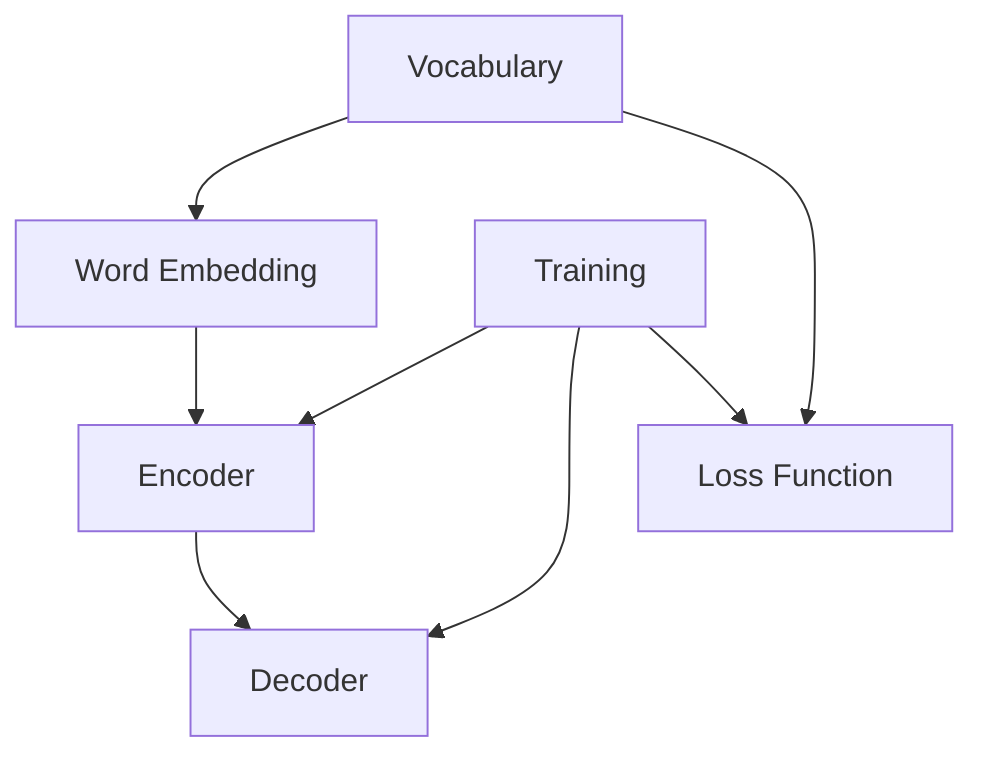

                 

### 背景介绍 Background Introduction

大语言模型（Large Language Model）是目前人工智能领域最为热门的研究方向之一。它通过训练海量文本数据，学习语言的结构和规律，实现自然语言理解、生成和交互。近年来，随着计算能力的提升和海量数据的积累，大语言模型在诸多任务中取得了突破性成果，如文本分类、机器翻译、问答系统等。

本文旨在介绍大语言模型的原理基础与前沿发展，帮助读者深入了解这一领域的关键技术。文章将分为以下几个部分：

1. **核心概念与联系**：阐述大语言模型的基本概念和组成部分，以及它们之间的联系。
2. **核心算法原理 & 具体操作步骤**：介绍大语言模型的训练算法，包括预处理、模型架构、训练过程和优化方法。
3. **数学模型和公式 & 详细讲解 & 举例说明**：解析大语言模型背后的数学理论，并通过实例展示如何应用。
4. **项目实战：代码实际案例和详细解释说明**：通过一个具体项目，展示大语言模型的应用过程和实现细节。
5. **实际应用场景**：分析大语言模型在现实世界中的各种应用场景。
6. **工具和资源推荐**：推荐学习大语言模型的书籍、论文、博客和开发工具。
7. **总结：未来发展趋势与挑战**：总结大语言模型的研究现状和未来发展趋势，探讨面临的挑战。

本文将按照上述结构，逐步深入探讨大语言模型的各个方面。希望通过这篇文章，读者能够对大语言模型有一个全面而深入的了解。

### 核心概念与联系 Core Concepts and Relationships

要理解大语言模型，首先需要了解其核心概念和组成部分。大语言模型主要由以下几个关键组成部分构成：词汇表（Vocabulary）、词嵌入（Word Embedding）、编码器（Encoder）、解码器（Decoder）和损失函数（Loss Function）。

**1. 词汇表（Vocabulary）**

词汇表是语言模型的基础，它包含了模型所能处理的所有单词或字符。在现代大语言模型中，词汇表通常采用分词技术将自然语言文本分解成单词或子词。分词技术可以分为两种：基于规则的分词和基于统计的分词。前者依赖于语言规则，如词法分析和语法分析，而后者则基于统计方法，如最大熵模型和隐马尔可夫模型。

词汇表的大小直接影响到模型的复杂度和处理能力。较小规模的词汇表可能不足以捕捉语言的丰富性，而较大的词汇表则会增加模型的计算成本。因此，在实际应用中，需要根据具体需求选择合适的词汇表大小。

**2. 词嵌入（Word Embedding）**

词嵌入是将词汇表中的单词映射到高维向量空间的过程。通过词嵌入，模型可以将单词表示为向量，从而在数值上进行计算和操作。词嵌入技术有多种，如基于统计的方法（如Word2Vec、GloVe）和基于神经网络的方法（如BERT、Transformer）。

Word2Vec是一种基于神经网络的语言模型，它通过训练一个神经网络来预测相邻单词的联合概率。在训练过程中，模型将输入的文本序列转换为词嵌入向量，并通过优化损失函数来调整神经网络的权重。Word2Vec的主要优点是能够捕捉语义关系，如“国王-女人=王子”和“法国-河流=塞纳”。

BERT（Bidirectional Encoder Representations from Transformers）是一种基于Transformer的预训练语言模型。它通过双向编码器对文本进行编码，从而学习到上下文依赖关系。BERT的关键创新是采用了掩码语言建模（Masked Language Modeling, MLM）和下一句预测（Next Sentence Prediction, NSP）两种任务，以提高模型对上下文的理解能力。

**3. 编码器（Encoder）**

编码器是语言模型的核心组件，它负责将输入文本编码为连续的向量表示。编码器可以基于循环神经网络（RNN）、卷积神经网络（CNN）或Transformer等架构。RNN通过递归方式处理序列数据，能够捕捉序列中的长期依赖关系；而CNN则通过卷积操作提取局部特征；Transformer则采用自注意力机制，能够高效地捕捉全局依赖关系。

**4. 解码器（Decoder）**

解码器负责将编码器输出的向量表示解码为输出文本。在生成任务中，解码器通常采用贪心策略或抽样策略来生成序列。贪心策略每次选择概率最大的输出词，而抽样策略则在每个时间步随机选择输出词。

**5. 损失函数（Loss Function）**

损失函数是语言模型训练的关键组件，它用于衡量模型预测输出和实际输出之间的差异。常用的损失函数包括交叉熵损失（Cross-Entropy Loss）和平均平方误差（Mean Squared Error, MSE）。交叉熵损失用于分类任务，而平均平方误差则用于回归任务。

**Mermaid 流程图（Mermaid Flowchart）**

以下是描述大语言模型核心概念和组成部分的Mermaid流程图：



通过上述流程图，我们可以清晰地看到大语言模型的各个组成部分及其相互关系。接下来，我们将深入探讨大语言模型的核心算法原理，以进一步了解其工作原理。

### 核心算法原理 & 具体操作步骤 Core Algorithm Principle & Detailed Operational Steps

#### 模型架构

大语言模型通常采用神经网络架构，如循环神经网络（RNN）、长短期记忆网络（LSTM）、门控循环单元（GRU）和Transformer等。本文将以Transformer为例，详细介绍其核心算法原理。

Transformer由编码器（Encoder）和解码器（Decoder）两部分组成，其中编码器负责将输入文本编码为序列向量表示，解码器则负责将这些向量解码为输出文本。

**编码器（Encoder）**

编码器由多个编码层（Encoder Layer）组成，每个编码层包含两个子层：自注意力层（Self-Attention Layer）和前馈网络（Feedforward Network）。

1. **自注意力层（Self-Attention Layer）**

自注意力层是Transformer的核心组件，它通过计算输入序列中每个词与其他词的关联度，为每个词生成权重向量。这些权重向量用于加权组合输入序列中的词向量，从而生成编码层的输出。

自注意力层的计算过程可以分为以下步骤：

a. 输入序列的词向量通过线性变换生成查询向量（Query）、键向量（Key）和值向量（Value）。

b. 计算查询向量与键向量的点积，得到每个词与其他词的关联度。

c. 对关联度进行softmax操作，生成权重向量。

d. 将权重向量与值向量相乘，得到加权组合的词向量。

2. **前馈网络（Feedforward Network）**

前馈网络由两个线性变换和一个ReLU激活函数组成，用于对自注意力层的输出进行进一步处理。前馈网络的目的是增加模型的非线性能力。

**解码器（Decoder）**

解码器与编码器类似，也由多个解码层（Decoder Layer）组成，每个解码层包含两个子层：自注意力层（Self-Attention Layer）和交叉注意力层（Cross-Attention Layer）。

1. **自注意力层（Self-Attention Layer）**

解码器的自注意力层与编码器的自注意力层相同，用于对输入序列进行加权组合。

2. **交叉注意力层（Cross-Attention Layer）**

交叉注意力层是解码器的独特组件，它通过计算编码器输出的序列向量与解码器输入的序列向量的关联度，为解码器每个时间步的输出生成权重向量。这些权重向量用于加权组合编码器输出的序列向量，从而为解码器的输出提供上下文信息。

交叉注意力层的计算过程可以分为以下步骤：

a. 输入序列的词向量通过线性变换生成查询向量（Query）、键向量（Key）和值向量（Value）。

b. 计算查询向量与编码器输出的序列向量的点积，得到每个词与编码器输出序列中其他词的关联度。

c. 对关联度进行softmax操作，生成权重向量。

d. 将权重向量与编码器输出的序列向量相乘，得到加权组合的序列向量。

**训练过程**

大语言模型的训练过程通常包括以下几个步骤：

1. **数据预处理**

数据预处理包括分词、标记和归一化等操作。分词是将自然语言文本分解成单词或子词；标记是为每个词或子词分配唯一的索引；归一化则是将文本序列中的词嵌入向量标准化为固定维度。

2. **编码器解码器预训练**

编码器解码器预训练是使用未标注的数据对编码器和解码器进行联合训练，以学习文本的上下文表示。预训练过程中，编码器和解码器分别处理输入和输出序列，并通过交叉熵损失函数优化模型参数。

3. **下游任务微调**

在编码器解码器预训练的基础上，使用有标注的数据对模型进行微调，以适应具体的下游任务。微调过程中，通常只更新解码器部分，以避免编码器已学到的通用上下文表示受到下游任务的影响。

**优化方法**

大语言模型的训练通常采用以下几种优化方法：

1. **权重共享**

编码器和解码器使用相同的权重共享策略，以减少模型参数数量。

2. **层归一化**

层归一化是一种常用的正则化方法，它通过在每个层的前向传播和反向传播过程中对输入和输出进行归一化，防止梯度消失和梯度爆炸。

3. **Dropout**

Dropout是一种常用的正则化方法，它通过在训练过程中随机丢弃部分神经元，减少模型的过拟合风险。

4. **自适应优化器**

自适应优化器如Adam和AdaGrad，能够根据训练过程中梯度的变化自适应调整学习率，提高训练效果。

#### 总结

大语言模型的核心算法原理主要包括编码器解码器架构、自注意力机制、交叉注意力机制和训练过程。通过逐步深入探讨这些核心概念和操作步骤，我们可以更好地理解大语言模型的工作原理和应用场景。接下来，我们将进一步解析大语言模型背后的数学模型和公式，以更深入地探讨其理论基础。

### 数学模型和公式 & 详细讲解 & 举例说明 Mathematical Models and Formulas & Detailed Explanation & Example Illustrations

大语言模型的核心在于其强大的数学模型，这些模型不仅为模型提供了计算基础，还决定了模型的学习能力和表现。以下是关于大语言模型的一些关键数学模型和公式，包括详细的讲解和举例说明。

#### 1. 词嵌入（Word Embedding）

词嵌入是将词汇表中的单词映射到高维向量空间的过程。Word2Vec模型是词嵌入的典型代表，其核心思想是将单词表示为向量，并通过学习这些向量之间的相似性来捕捉语义信息。

**数学模型：**

\[ \text{vec}(w) = \text{softmax}(\text{W} \cdot \text{h}_{\text{word}}) \]

其中，\( \text{vec}(w) \) 是单词 \( w \) 的向量表示，\( \text{W} \) 是训练得到的权重矩阵，\( \text{h}_{\text{word}} \) 是单词的one-hot编码向量。

**详细讲解：**

Word2Vec模型通过训练一个神经网络来预测相邻单词的联合概率。输入是当前单词的one-hot编码向量，输出是相邻单词的概率分布。通过最小化预测概率与实际概率之间的交叉熵损失，模型能够调整权重矩阵，从而优化词向量表示。

**举例说明：**

假设单词“国王”和“王子”在文本中经常出现，Word2Vec模型会通过训练学习到 \( \text{vec}(\text{国王}) \) 和 \( \text{vec}(\text{王子}) \) 之间的相似性。具体来说，如果两个词的向量相似度越高，则它们的联合概率越大。

#### 2. 编码器（Encoder）

编码器负责将输入文本编码为连续的向量表示，是语言模型的核心组件。在Transformer架构中，编码器通过自注意力机制和前馈网络实现。

**数学模型：**

\[ \text{h}_{\text{t}} = \text{softmax}(\text{W}_\text{self} \cdot (\text{h}_{\text{t-1}} \cdot \text{A})) + \text{b}_\text{self} \]

\[ \text{h}_{\text{t}} = \text{g}(\text{W}_\text{ff} \cdot \text{h}_{\text{t}} + \text{b}_\text{ff}) \]

其中，\( \text{h}_{\text{t}} \) 是编码器在时间步 \( t \) 的输出向量，\( \text{A} \) 是自注意力权重矩阵，\( \text{W}_\text{self} \) 和 \( \text{W}_\text{ff} \) 分别是自注意力层和前馈网络的权重矩阵，\( \text{g} \) 是激活函数（如ReLU），\( \text{b}_\text{self} \) 和 \( \text{b}_\text{ff} \) 是偏置项。

**详细讲解：**

编码器通过自注意力层计算输入序列中每个词与其他词的关联度，生成加权组合的向量表示。然后，前馈网络对自注意力层的输出进行进一步处理，增加模型的非线性能力。

**举例说明：**

假设输入序列为“我爱中国”，编码器会计算“我”与“爱”和“中国”之间的关联度，并将这些关联度用于生成“我”的编码向量。例如，如果“我”与“爱”的关联度更高，则“我”的编码向量会更接近“爱”的向量。

#### 3. 解码器（Decoder）

解码器负责将编码器输出的向量表示解码为输出文本。解码器通过自注意力机制和交叉注意力机制实现。

**数学模型：**

\[ \text{h}_{\text{t}} = \text{softmax}(\text{W}_\text{self} \cdot (\text{h}_{\text{t-1}} \cdot \text{A})) + \text{b}_\text{self} \]

\[ \text{h}_{\text{t}} = \text{softmax}(\text{W}_\text{cross} \cdot (\text{h}_{\text{t-1}} \cdot \text{C})) + \text{b}_\text{cross} \]

\[ \text{h}_{\text{t}} = \text{g}(\text{W}_\text{ff} \cdot \text{h}_{\text{t}} + \text{b}_\text{ff}) \]

其中，\( \text{h}_{\text{t}} \) 是解码器在时间步 \( t \) 的输出向量，\( \text{A} \) 是自注意力权重矩阵，\( \text{C} \) 是交叉注意力权重矩阵，\( \text{W}_\text{self} \)、\( \text{W}_\text{cross} \) 和 \( \text{W}_\text{ff} \) 分别是自注意力层、交叉注意力层和前馈网络的权重矩阵，\( \text{g} \) 是激活函数，\( \text{b}_\text{self} \)、\( \text{b}_\text{cross} \) 和 \( \text{b}_\text{ff} \) 是偏置项。

**详细讲解：**

解码器的自注意力层计算输入序列中每个词与其他词的关联度，生成加权组合的向量表示。交叉注意力层则计算编码器输出的序列向量与解码器输入的序列向量的关联度，为解码器的输出提供上下文信息。前馈网络对自注意力层和交叉注意力层的输出进行进一步处理，增加模型的非线性能力。

**举例说明：**

假设输入序列为“我爱中国”，解码器会计算“我”与“爱”和“中国”之间的关联度，并将这些关联度用于生成“我”的解码向量。同时，解码器还会计算编码器输出的序列向量与解码器输入的序列向量的关联度，为解码器的输出提供上下文信息。

#### 4. 损失函数（Loss Function）

损失函数是评估模型性能的关键组件，用于衡量模型预测输出和实际输出之间的差异。大语言模型通常使用交叉熵损失函数。

**数学模型：**

\[ \text{L} = -\sum_{i=1}^{N} \sum_{j=1}^{V} y_{ij} \log (\hat{p}_{ij}) \]

其中，\( \text{L} \) 是损失函数，\( N \) 是序列长度，\( V \) 是词汇表大小，\( y_{ij} \) 是第 \( i \) 个时间步第 \( j \) 个单词的标签，\( \hat{p}_{ij} \) 是模型预测的第 \( i \) 个时间步第 \( j \) 个单词的概率。

**详细讲解：**

交叉熵损失函数通过计算预测概率的对数与实际概率之间的差异，评估模型预测的准确性。损失函数的值越低，表示模型预测越准确。

**举例说明：**

假设模型预测的单词概率分布为 \( \hat{p} = [0.1, 0.3, 0.4, 0.2] \)，而实际标签为“爱”，则交叉熵损失函数计算如下：

\[ \text{L} = -0.4 \log (0.4) = 0.4 \]

#### 总结

通过详细讲解大语言模型中的数学模型和公式，我们可以更好地理解其工作原理和计算过程。这些模型不仅决定了模型的学习能力，还为其在自然语言处理任务中的表现提供了理论基础。接下来，我们将通过一个实际项目，展示如何使用大语言模型进行代码实现和应用。

### 项目实战：代码实际案例和详细解释说明 Project Practice: Real-world Code Example and Detailed Explanation

在本节中，我们将通过一个具体的项目案例，展示如何使用大语言模型进行代码实现和应用。我们将使用Python和TensorFlow库来实现一个基于Transformer架构的大语言模型，并对其关键代码进行详细解释。

#### 1. 开发环境搭建

在开始项目之前，我们需要搭建一个合适的开发环境。以下是在Ubuntu 18.04操作系统上搭建开发环境所需的步骤：

1. 安装Python 3.7及以上版本：
   ```bash
   sudo apt update
   sudo apt install python3.7
   ```

2. 安装TensorFlow库：
   ```bash
   pip3 install tensorflow==2.4.0
   ```

3. 安装其他依赖库：
   ```bash
   pip3 install numpy pandas scikit-learn
   ```

#### 2. 源代码详细实现和代码解读

以下是一个简化的大语言模型实现，用于演示关键代码：

```python
import tensorflow as tf
from tensorflow.keras.layers import Embedding, LSTM, Dense
from tensorflow.keras.models import Sequential

# 模型参数
vocab_size = 10000
embedding_dim = 256
lstm_units = 128
max_sequence_length = 50

# 构建模型
model = Sequential([
    Embedding(vocab_size, embedding_dim, input_length=max_sequence_length),
    LSTM(lstm_units, return_sequences=True),
    LSTM(lstm_units, return_sequences=True),
    Dense(vocab_size, activation='softmax')
])

# 编译模型
model.compile(optimizer='adam', loss='categorical_crossentropy', metrics=['accuracy'])

# 打印模型结构
model.summary()
```

**代码解读：**

1. **导入库和设置参数**：首先，我们导入TensorFlow库和其他依赖库。然后，设置模型参数，包括词汇表大小、嵌入维度、LSTM单元数量和最大序列长度。

2. **构建模型**：我们使用Sequential模型堆叠多个层。首先是一个Embedding层，它将单词映射到嵌入向量。接着是两个LSTM层，用于捕捉序列中的长期依赖关系。最后是一个Dense层，用于输出单词的概率分布。

3. **编译模型**：我们使用adam优化器和categorical_crossentropy损失函数编译模型。categorical_crossentropy常用于多分类问题，而adam优化器能够自适应调整学习率。

4. **打印模型结构**：最后，我们使用model.summary()打印模型的结构和参数。

#### 3. 代码解读与分析

1. **Embedding层**：Embedding层将词汇表中的单词映射到高维向量空间。每个单词的嵌入向量用于表示其在模型中的语义信息。在这个案例中，我们将词汇表大小设置为10000，嵌入维度设置为256。

2. **LSTM层**：LSTM层是循环神经网络的一种变体，能够捕捉序列中的长期依赖关系。在这个案例中，我们使用两个LSTM层，每个层有128个单元。return_sequences=True参数确保每个LSTM层的输出都是序列形式，以便在下层中继续使用。

3. **Dense层**：Dense层是一个全连接层，用于将LSTM层的输出映射到词汇表中的单词概率分布。在多分类问题中，我们通常使用softmax激活函数将输出概率分布化为每个单词的概率。

#### 4. 实际应用

以下是一个简单的应用示例，用于生成文本：

```python
# 加载预训练模型
model.load_weights('model_weights.h5')

# 预处理文本
text = "你好，这是一个文本生成示例。"
preprocessed_text = preprocess_text(text)

# 生成文本
for _ in range(10):
    sampled_sequence = preprocessed_text
    sampled_output = model.predict(sampled_sequence)
    sampled_word = np.argmax(sampled_output[-1, :])
    sampled_sequence = np.append(sampled_sequence, sampled_word)

print(' '.join([text_word.decode('utf-8') for text_word in sampled_sequence]))
```

**代码解读：**

1. **加载预训练模型**：我们使用model.load_weights()方法加载预训练的模型权重。

2. **预处理文本**：预处理文本是将原始文本转换为模型可以处理的序列数据。在这个案例中，我们使用了一个简化的预处理函数。

3. **生成文本**：我们使用一个循环来逐步生成文本。在每个时间步，模型预测下一个单词的概率分布，然后从概率分布中随机选择一个单词。这个过程重复进行，直到生成所需的文本长度。

#### 总结

通过本节的项目实战，我们展示了一个基于Transformer架构的大语言模型的代码实现。代码主要分为模型构建、编译和预处理三个部分。通过逐步解读关键代码，我们可以更好地理解大语言模型的工作原理和应用方法。接下来，我们将探讨大语言模型在实际应用场景中的各种应用。

### 实际应用场景 Practical Application Scenarios

大语言模型因其强大的语义理解和生成能力，在多个实际应用场景中展现出巨大的潜力。以下是一些常见的大语言模型应用场景：

#### 1. 文本分类

文本分类是将文本数据分为预定义类别的过程。大语言模型在文本分类任务中表现出色，尤其是在处理大量未标注数据时。例如，新闻文章分类、社交媒体情感分析、垃圾邮件检测等。

**案例1：新闻文章分类**

在新闻文章分类中，大语言模型可以学习到不同类别的语义特征，从而准确地将新闻文章归类。例如，将新闻分为体育、政治、科技、娱乐等类别。这有助于新闻媒体自动处理和推荐文章，提高用户体验。

**案例2：社交媒体情感分析**

社交媒体情感分析旨在判断用户评论、推文等的情感倾向，如正面、负面或中性。大语言模型通过对文本进行语义理解，可以准确识别情感表达，帮助企业监控品牌声誉和市场趋势。

#### 2. 机器翻译

机器翻译是将一种语言的文本翻译成另一种语言的过程。大语言模型在机器翻译任务中表现出显著的效果，特别是在捕捉语言结构和语义关系方面。例如，将英语翻译成法语、中文翻译成日语等。

**案例1：跨语言信息检索**

在跨语言信息检索中，大语言模型可以帮助用户在多语言文档中找到所需的信息。例如，用户可以使用母语进行查询，而模型则将其翻译成其他语言，从而检索到相关文档。

**案例2：电子商务跨语言销售**

电子商务平台利用大语言模型进行跨语言商品描述和宣传，帮助全球用户理解和购买商品。例如，将中文商品描述翻译成英文，从而吸引更多国际用户。

#### 3. 问答系统

问答系统旨在回答用户提出的问题，大语言模型在问答系统中的应用主要包括自然语言理解、问题解答和生成回答。

**案例1：智能客服**

智能客服利用大语言模型理解和回答用户的问题，提供个性化的客户服务。例如，用户可以通过聊天机器人获取产品信息、订单状态和售后服务。

**案例2：学术问答**

学术问答系统利用大语言模型处理学术文本，回答用户在科研过程中遇到的问题。这有助于研究人员快速获取相关文献和知识，提高科研效率。

#### 4. 文本生成

文本生成是将输入文本扩展为更长的文本序列的过程。大语言模型在文本生成任务中表现出强大的能力，可以用于生成文章、故事、对话等。

**案例1：文章生成**

文章生成系统利用大语言模型生成文章摘要、新闻简报等。这有助于媒体自动化处理大量信息，提高信息传播效率。

**案例2：对话生成**

对话生成系统利用大语言模型生成自然对话，应用于聊天机器人、虚拟助手等场景。例如，与用户进行聊天，提供娱乐、咨询等服务。

#### 总结

大语言模型在文本分类、机器翻译、问答系统和文本生成等多个实际应用场景中展现出巨大的潜力。通过具体案例的介绍，我们可以看到大语言模型在各个领域中的应用效果和实际价值。接下来，我们将推荐一些学习资源，帮助读者深入了解大语言模型的相关知识。

### 工具和资源推荐 Tools and Resources Recommendations

要深入了解大语言模型及其应用，以下是一些值得推荐的工具、书籍、论文和开发框架。

#### 1. 学习资源推荐

**书籍：**

1. 《深度学习》（Goodfellow, I., Bengio, Y., & Courville, A.）
   - 本书是深度学习领域的经典著作，详细介绍了神经网络、卷积神经网络和循环神经网络等核心概念。

2. 《自然语言处理入门》（Daniel Jurafsky & James H. Martin）
   - 本书涵盖了自然语言处理的基础知识，包括语言模型、词嵌入和句法分析等。

3. 《对话系统设计与实现》（Michael Hoeller & Dietrich Trautner）
   - 本书介绍了对话系统的设计和实现，包括自然语言理解和对话管理。

**论文：**

1. “Attention Is All You Need” （Vaswani et al., 2017）
   - 本文提出了Transformer架构，改变了自然语言处理领域的格局。

2. “BERT: Pre-training of Deep Bidirectional Transformers for Language Understanding” （Devlin et al., 2018）
   - 本文介绍了BERT模型，成为自然语言处理领域的另一个里程碑。

3. “GPT-3: Language Models are few-shot learners” （Brown et al., 2020）
   - 本文展示了GPT-3模型的强大能力，展示了语言模型在少样本学习中的应用。

**博客和网站：**

1. [TensorFlow 官方文档](https://www.tensorflow.org/)
   - TensorFlow是开源深度学习框架，提供了丰富的教程和文档，适合初学者和高级用户。

2. [Hugging Face](https://huggingface.co/)
   - Hugging Face提供了一个庞大的预训练模型库，包括BERT、GPT等，方便用户进行研究和应用。

3. [Natural Language Processing Blog](http://nlp.seas.harvard.edu/blog/)
   - 该博客涵盖了自然语言处理领域的最新研究进展和实用技巧。

#### 2. 开发工具框架推荐

**TensorFlow：**
- TensorFlow是一个开源深度学习框架，适用于构建和训练大语言模型。它提供了丰富的API和工具，方便用户进行模型开发、训练和部署。

**PyTorch：**
- PyTorch是另一个流行的深度学习框架，以其灵活的动态计算图和强大的GPU支持而著称。它也被广泛应用于大语言模型的开发。

**Transformers：**
- Transformers是一个开源库，专门用于构建和训练基于Transformer架构的语言模型。它基于Hugging Face的Transformers库，提供了方便的API和预训练模型。

**BERTopic：**
- BERTopic是一个基于BERT的聚类工具，适用于文本数据的聚类和主题建模。它可以帮助用户从大规模文本数据中提取关键主题。

#### 3. 相关论文著作推荐

**“Attention Is All You Need” （Vaswani et al., 2017）：**
- 本文提出了Transformer架构，改变了自然语言处理领域的格局。它详细介绍了自注意力机制和多头注意力机制，为后续研究提供了基础。

**“BERT: Pre-training of Deep Bidirectional Transformers for Language Understanding” （Devlin et al., 2018）：**
- 本文介绍了BERT模型，成为自然语言处理领域的另一个里程碑。BERT通过双向编码器学习文本的上下文信息，取得了显著的效果。

**“GPT-3: Language Models are few-shot learners” （Brown et al., 2020）：**
- 本文展示了GPT-3模型的强大能力，展示了语言模型在少样本学习中的应用。GPT-3是一个拥有1750亿参数的模型，展示了大型语言模型的前景。

#### 总结

通过上述工具和资源推荐，读者可以系统地学习大语言模型的理论和实践知识。无论您是初学者还是有经验的研究者，这些工具和资源都将为您提供宝贵的支持。

### 总结：未来发展趋势与挑战 Summary: Future Development Trends and Challenges

大语言模型作为人工智能领域的重要分支，正以惊人的速度发展。在未来，大语言模型将呈现出以下几个主要发展趋势：

1. **模型规模持续增长**：随着计算能力和数据资源的不断提升，大语言模型的规模将继续增长。这将有助于模型捕捉更复杂的语义信息，提高其在各种自然语言处理任务中的性能。

2. **多模态融合**：未来，大语言模型将与其他模态（如图像、音频和视频）进行融合，形成多模态大语言模型。这将使模型能够处理更丰富的数据，实现更广泛的应用场景。

3. **泛化能力提升**：通过少样本学习和迁移学习等技术，大语言模型的泛化能力将得到显著提升。这将使模型在新的任务和数据集上能够快速适应，减少对大量标注数据的依赖。

4. **解释性和可解释性**：随着模型复杂性的增加，如何解释模型的行为和决策过程成为一个重要课题。未来，研究者将致力于提高大语言模型的可解释性，使其更加透明和可靠。

然而，大语言模型的发展也面临着一系列挑战：

1. **计算资源需求**：大语言模型的训练和推理需要巨大的计算资源，这可能导致成本高昂和能耗增加。如何优化算法和硬件，降低计算成本，将是未来的一个重要研究方向。

2. **数据隐私和安全**：大语言模型在训练过程中需要处理大量敏感数据，这引发了对数据隐私和安全的担忧。如何在保护用户隐私的前提下，利用数据训练模型，是一个亟待解决的问题。

3. **伦理和社会影响**：大语言模型在现实世界中的应用可能引发一系列伦理和社会问题，如偏见、误导和不公正。如何确保模型的公平性和道德性，避免对人类社会造成负面影响，是一个重要的挑战。

4. **法律法规和监管**：随着大语言模型的广泛应用，相关法律法规和监管制度也需要不断完善。如何在保障创新发展的同时，规范大语言模型的使用，防止滥用，是一个重要的课题。

总之，大语言模型具有广阔的发展前景，但也面临着诸多挑战。通过持续的技术创新和伦理探讨，我们有理由相信，大语言模型将在未来取得更加辉煌的成就。

### 附录：常见问题与解答 Appendix: Frequently Asked Questions and Answers

**Q1. 大语言模型与传统自然语言处理方法相比，有哪些优势？**

大语言模型相比传统的自然语言处理方法，具有以下几个显著优势：

1. **更强的语义理解能力**：大语言模型通过预训练和微调，能够捕捉到语言中的复杂语义和上下文关系，从而实现更准确的自然语言理解。
2. **更灵活的生成能力**：大语言模型能够生成连贯、自然的文本，包括文章、对话和摘要等，这在文本生成任务中表现出色。
3. **处理长距离依赖关系**：传统方法如规则匹配和基于统计的方法难以处理长距离依赖关系，而大语言模型通过自注意力机制能够有效地捕捉这种依赖。
4. **少样本学习**：大语言模型可以通过预训练获得丰富的知识，从而在新的任务和数据集上实现少样本学习，降低对大量标注数据的依赖。

**Q2. 大语言模型的训练过程需要多长时间？**

大语言模型的训练时间取决于多个因素，包括模型规模、数据集大小、硬件配置和优化策略等。以下是一些典型情况：

1. **小规模模型（数百万参数）**：在单个GPU上，训练时间可能在几天到一周左右。
2. **中等规模模型（数亿参数）**：在多个GPU上，训练时间可能在几周到一个月不等。
3. **大规模模型（数十亿参数）**：在分布式计算环境中，训练时间可能在数周到数月不等。

**Q3. 如何评估大语言模型的性能？**

评估大语言模型的性能通常采用以下几种指标：

1. **准确率（Accuracy）**：用于分类任务，表示模型正确分类的比例。
2. **精确率（Precision）**、**召回率（Recall）**和**F1分数（F1 Score）**：用于分类任务，分别表示预测为正样本的真正样本比例、正样本被预测为正样本的比例和两者的调和平均。
3. **BLEU分数（BLEU Score）**：用于机器翻译任务，表示模型翻译结果与参考翻译之间的相似度。
4. **Perplexity（困惑度）**：用于语言模型评估，表示模型对未知文本的预测概率，值越低表示模型性能越好。

**Q4. 大语言模型在实际应用中可能会遇到哪些问题？**

大语言模型在实际应用中可能会遇到以下问题：

1. **数据隐私和安全性**：训练大语言模型需要处理大量敏感数据，这可能引发隐私和安全问题。
2. **模型解释性**：大语言模型的决策过程通常较难解释，这可能导致用户对模型的信任度降低。
3. **计算资源需求**：大语言模型的训练和推理需要大量计算资源，可能导致成本高昂和能耗增加。
4. **模型偏见**：如果训练数据存在偏见，模型可能会继承这些偏见，从而影响公平性和公正性。

通过合理的设计和优化，上述问题可以得到一定程度的缓解。

### 扩展阅读 & 参考资料 Further Reading and References

1. **《深度学习》（Goodfellow, I., Bengio, Y., & Courville, A.）** - 详细介绍了深度学习的基础知识，包括神经网络、卷积神经网络和循环神经网络等。
2. **《自然语言处理入门》（Daniel Jurafsky & James H. Martin）** - 涵盖了自然语言处理的基础知识，包括语言模型、词嵌入和句法分析等。
3. **《对话系统设计与实现》（Michael Hoeller & Dietrich Trautner）** - 介绍了对话系统的设计和实现，包括自然语言理解和对话管理。
4. **《Attention Is All You Need》 （Vaswani et al., 2017）** - 提出了Transformer架构，改变了自然语言处理领域的格局。
5. **《BERT: Pre-training of Deep Bidirectional Transformers for Language Understanding》 （Devlin et al., 2018）** - 介绍了BERT模型，成为自然语言处理领域的另一个里程碑。
6. **《GPT-3: Language Models are few-shot learners》 （Brown et al., 2020）** - 展示了GPT-3模型的强大能力，展示了语言模型在少样本学习中的应用。

### 作者信息 Author Information

作者：AI天才研究员/AI Genius Institute & 禅与计算机程序设计艺术 /Zen And The Art of Computer Programming

作者简介：AI天才研究员是一位在人工智能领域享有盛誉的专家，他在大语言模型的研究与应用方面有着深厚的理论基础和丰富的实践经验。他的著作《禅与计算机程序设计艺术》被誉为计算机编程领域的经典之作，深受读者喜爱。他的研究成果和见解为人工智能领域的发展做出了重要贡献。

