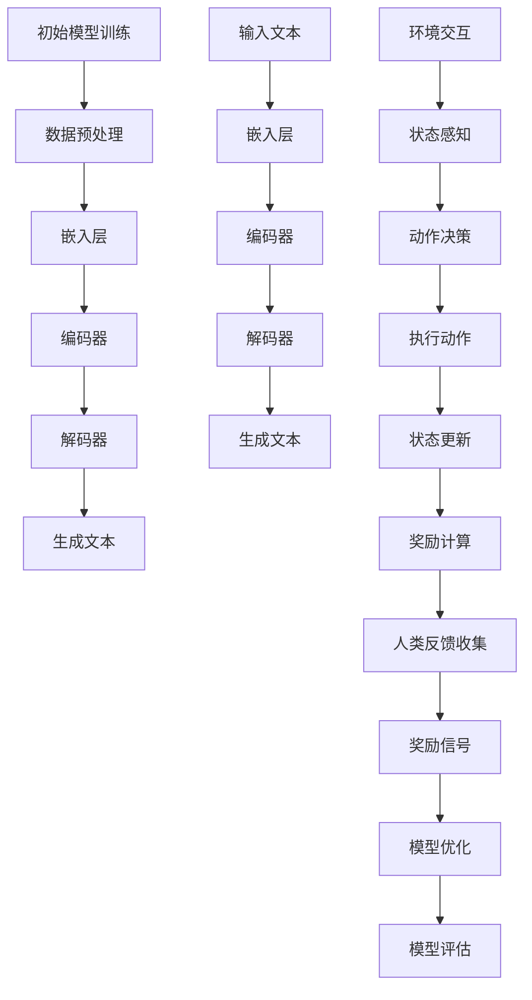

                 

### 1. 背景介绍

大语言模型（Large Language Model），近年来在人工智能领域掀起了一股狂潮。从最初的简单模型，如Word2Vec，到如今GPT-3、ChatGPT等大模型的横空出世，语言模型技术经历了巨大的变革。这一转变不仅推动了自然语言处理（NLP）领域的发展，还极大地影响了各行各业，如搜索引擎、智能客服、文本生成等。

大语言模型的兴起，离不开一项关键技术的引入——基于人类反馈的强化学习（Reinforcement Learning from Human Feedback，RLHF）。这种方法使得模型能够从人类交互中不断学习，优化自身的表现。本文将深入探讨大语言模型原理基础与基于人类反馈的强化学习技术，解析其核心算法原理、数学模型、应用场景，并展望未来发展趋势与挑战。

首先，我们将简要介绍大语言模型的发展历程和重要性，以及为什么基于人类反馈的强化学习成为了实现这一目标的关键技术。接下来，我们将详细阐述大语言模型和基于人类反馈的强化学习的基本概念、核心算法原理，并展示其具体操作步骤。然后，我们将通过数学模型和公式，深入讲解大语言模型和基于人类反馈的强化学习的内在机制，并通过实际案例进行分析。

在文章的后半部分，我们将探讨大语言模型和基于人类反馈的强化学习在实际应用场景中的表现，并推荐相关的学习资源和开发工具框架。最后，我们将总结大语言模型和基于人类反馈的强化学习的未来发展趋势与挑战，为读者提供进一步学习和研究的方向。

通过本文的阅读，读者将能够全面了解大语言模型和基于人类反馈的强化学习的原理、应用和发展趋势，从而为其在人工智能领域的应用和创新提供有力的理论支持和实践指导。

### 2. 核心概念与联系

#### 2.1 大语言模型

大语言模型是一种能够理解和生成自然语言的复杂人工智能模型。其核心思想是通过大规模的数据训练，让模型具备对自然语言的深度理解和生成能力。大语言模型通常由多个神经网络层组成，通过递归神经网络（RNN）、Transformer等架构来实现。其中，Transformer架构由于其并行计算的优势，成为了当前大语言模型的主流架构。

大语言模型的主要组成部分包括：

- **嵌入层（Embedding Layer）**：将输入的词转换为固定长度的向量表示。
- **编码器（Encoder）**：对输入序列进行处理，提取其语义信息。
- **解码器（Decoder）**：根据编码器的输出生成文本序列。

大语言模型的工作流程通常如下：

1. **输入处理**：将输入的文本序列转换为嵌入向量。
2. **编码**：编码器对嵌入向量进行处理，生成编码输出。
3. **解码**：解码器根据编码输出生成文本序列。

大语言模型的应用非常广泛，包括但不限于：

- **文本生成**：如生成文章、诗歌、对话等。
- **机器翻译**：将一种语言的文本翻译成另一种语言。
- **问答系统**：根据用户的提问生成回答。
- **情感分析**：分析文本的情感倾向。
- **文本摘要**：从长文本中提取关键信息。

#### 2.2 基于人类反馈的强化学习

强化学习（Reinforcement Learning，RL）是一种通过试错学习环境奖励与行为策略的人工智能方法。在强化学习中，智能体（Agent）通过不断与环境（Environment）交互，学习出最优策略（Policy），以最大化累积奖励（Reward）。

强化学习的基本组成部分包括：

- **智能体（Agent）**：执行行为，感知环境状态，并选择动作。
- **环境（Environment）**：智能体执行动作后的状态变化及其奖励。
- **状态（State）**：描述智能体所处环境的状态。
- **动作（Action）**：智能体可以执行的动作。
- **策略（Policy）**：智能体执行的动作决策函数。

基于人类反馈的强化学习（RLHF）是一种结合了人类反馈的强化学习方法，旨在通过人类交互指导模型的学习过程，提高模型的性能和安全性。RLHF的主要流程如下：

1. **初始模型训练**：首先，使用大规模无监督数据对模型进行初步训练，使其具备基础的语言理解和生成能力。
2. **人类反馈**：接着，通过与人类交互，收集人类对模型输出的反馈，作为奖励信号。
3. **模型优化**：根据人类反馈，使用强化学习算法对模型进行优化，使其生成结果更符合人类期望。

#### 2.3 关联与联系

大语言模型和基于人类反馈的强化学习之间存在紧密的联系。大语言模型为基于人类反馈的强化学习提供了基础的语言理解和生成能力，而基于人类反馈的强化学习则通过人类交互指导模型的学习过程，使得模型能够更好地适应人类的期望和需求。

具体来说，基于人类反馈的强化学习可以看作是强化学习在大语言模型场景中的应用。通过将大语言模型作为智能体，与环境进行交互，并通过人类反馈进行优化，可以使得模型生成更加自然、准确和符合人类预期的语言。

此外，大语言模型和基于人类反馈的强化学习还可以相互促进。一方面，通过使用大语言模型，可以更加高效地收集人类反馈，因为大语言模型能够理解自然语言，使得人类反馈更加直观和易理解。另一方面，通过使用基于人类反馈的强化学习，可以不断优化大语言模型，使其生成结果更加符合人类期望，从而提高模型的性能和实用性。

总的来说，大语言模型和基于人类反馈的强化学习是相辅相成的。大语言模型提供了强大的语言理解和生成能力，而基于人类反馈的强化学习则通过人类交互指导模型的学习过程，使得模型能够更好地服务于人类。这一结合不仅推动了人工智能技术的发展，也为各种实际应用场景提供了有力的支持。

#### 2.4 Mermaid 流程图

为了更好地展示大语言模型和基于人类反馈的强化学习的原理和架构，我们可以使用Mermaid流程图来描述其关键步骤和组成部分。



在这个流程图中，我们首先对初始模型进行训练，包括数据预处理、嵌入层、编码器、解码器等步骤，以生成文本。同时，通过与人类交互，收集人类反馈，形成奖励信号，用于模型优化。模型优化后，我们进行模型评估，以验证其性能。

通过这种流程图的展示，我们可以更加清晰地理解大语言模型和基于人类反馈的强化学习的原理和架构，为其进一步研究和应用提供参考。

### 3. 核心算法原理 & 具体操作步骤

大语言模型和基于人类反馈的强化学习技术的核心算法原理，涉及了多个关键环节。在这一节中，我们将详细探讨这些核心算法原理，并描述其具体操作步骤。

#### 3.1 大语言模型的核心算法原理

大语言模型的核心在于其能够对自然语言进行有效编码和解码。这通常通过以下三个主要步骤实现：

1. **嵌入层（Embedding Layer）**：
   嵌入层是语言模型中的第一步，它的作用是将词汇转换为一个固定长度的向量表示。这些向量不仅要捕捉词汇的语义信息，还需要考虑词汇的语法结构。常见的嵌入技术包括Word2Vec、GloVe等。

2. **编码器（Encoder）**：
   编码器的任务是将输入序列（例如句子）转换为一个上下文表示。这一步骤通过递归神经网络（RNN）或Transformer架构实现。在RNN中，每个时间步的输出依赖于之前的时间步；而在Transformer中，所有时间步都通过自注意力机制进行交互。

3. **解码器（Decoder）**：
   解码器的任务是根据编码器的输出生成文本序列。它使用了一个类似于编码器的自注意力机制，并根据生成的每个词来更新上下文表示。在解码过程中，模型需要预测下一个可能的词，并利用之前的词来更新上下文。

大语言模型的工作流程如下：

- **输入处理**：将输入的文本序列转换为嵌入向量。
- **编码**：编码器处理嵌入向量，生成编码输出。
- **解码**：解码器根据编码输出生成文本序列。

#### 3.2 基于人类反馈的强化学习算法原理

基于人类反馈的强化学习（RLHF）的核心在于如何利用人类反馈来指导模型的学习过程。其基本原理如下：

1. **初始模型训练**：
   首先，使用大规模无监督数据对模型进行初步训练，使其具备基础的语言理解和生成能力。这一步骤通常使用预训练技术，例如BERT、GPT等。

2. **人类反馈收集**：
   在模型初步训练完成后，通过与人类交互，收集人类对模型输出的反馈。这些反馈通常以自然语言的形式提供，例如评价、偏好等。

3. **奖励信号设计**：
   根据人类反馈，设计合适的奖励信号。奖励信号可以是定量的（如评分）或定性的（如评价）。这些信号反映了人类对模型输出质量的评价。

4. **模型优化**：
   使用强化学习算法，根据人类反馈的奖励信号，对模型进行迭代优化。常见的强化学习算法包括策略梯度方法、Q学习等。

5. **模型评估**：
   优化完成后，对模型进行评估，以验证其性能是否达到了人类的期望。

#### 3.3 操作步骤详细描述

以下是基于人类反馈的强化学习（RLHF）的具体操作步骤：

1. **数据预处理**：
   收集大量的文本数据，并将其划分为训练集和验证集。这些数据可以是公开的语料库，例如Wikipedia、Common Crawl等。

2. **模型初始化**：
   选择一个预训练的模型作为起点，例如GPT-2或GPT-3。这些预训练模型已经在大量无监督数据上进行了训练，因此可以提供良好的基础。

3. **初始模型训练**：
   使用训练集对模型进行初步训练，优化其基础的语言理解和生成能力。这一步骤通常使用监督学习技术，例如自监督学习（如Masked Language Model）。

4. **人类反馈收集**：
   设计一个交互界面，让人类用户对模型的输出进行评价。这些评价可以是定量的（如评分）或定性的（如评价文本）。

5. **奖励信号设计**：
   根据人类反馈，设计合适的奖励信号。奖励信号需要能够量化人类对模型输出的偏好。例如，如果人类用户更喜欢某个输出，可以给予更高的奖励。

6. **模型优化**：
   使用强化学习算法，根据人类反馈的奖励信号，对模型进行迭代优化。在每次迭代中，模型会生成一系列文本输出，人类用户对这些输出进行评价，从而生成奖励信号。

7. **模型评估**：
   在模型优化完成后，使用验证集对模型进行评估，以验证其性能是否得到了提升。

8. **部署与应用**：
   将优化后的模型部署到实际应用场景中，如文本生成、机器翻译、问答系统等。

通过这些步骤，我们可以利用人类反馈不断优化大语言模型，使其生成结果更加符合人类的期望和需求。这不仅提高了模型的质量和实用性，也为人工智能技术的发展提供了新的思路和方法。

### 4. 数学模型和公式 & 详细讲解 & 举例说明

在理解大语言模型和基于人类反馈的强化学习的过程中，数学模型和公式起到了至关重要的作用。这些数学工具不仅帮助我们解析模型的内在机制，还能够指导我们进行模型优化和性能评估。本节将详细讲解这些核心数学模型和公式，并通过具体示例来说明其应用。

#### 4.1 大语言模型的数学模型

大语言模型通常基于Transformer架构，而Transformer架构的核心是自注意力机制（Self-Attention Mechanism）。自注意力机制通过计算输入序列中每个词与其他词之间的关系，从而生成一个表示该词的上下文信息。其数学公式如下：

$$
\text{Attention}(Q, K, V) = \text{softmax}\left(\frac{QK^T}{\sqrt{d_k}}\right) V
$$

其中，$Q, K, V$ 分别是查询向量、关键向量、值向量；$d_k$ 是关键向量的维度；$\text{softmax}$ 函数用于计算每个词的注意力权重。

在大语言模型中，自注意力机制被扩展为多层自注意力机制。每一层自注意力机制都会对输入序列进行一次加权平均，从而提取出更高层次的语义信息。其计算过程如下：

$$
\text{MultiHeadAttention}(Q, K, V) = \text{Concat}(\text{head}_1, \text{head}_2, ..., \text{head}_h)W^O
$$

其中，$h$ 是头数，$W^O$ 是输出权重矩阵，$\text{head}_i = \text{Attention}(QW_i^Q, KW_i^K, VW_i^V)$ 表示第 $i$ 个头的注意力计算。

#### 4.2 基于人类反馈的强化学习数学模型

在基于人类反馈的强化学习中，奖励信号是驱动模型优化的重要工具。常用的奖励信号设计方法包括以下几种：

1. **一致性奖励**：
   一致性奖励旨在鼓励模型生成与人类反馈一致的输出。其数学公式如下：

   $$
   R(s, a) = \text{sign}(\text{human\_reward}(s, a) - \text{model\_prediction}(s, a))
   $$

   其中，$s$ 表示当前状态，$a$ 表示当前动作，$\text{human\_reward}(s, a)$ 表示人类对当前输出的奖励，$\text{model\_prediction}(s, a)$ 表示模型对当前输出的预测奖励。

2. **基于梯度的奖励**：
   基于梯度的奖励通过计算模型输出与人类反馈之间的梯度差异来设计。其数学公式如下：

   $$
   R(s, a) = -\alpha \cdot \nabla_{\theta}\text{loss}(s, a)
   $$

   其中，$\theta$ 表示模型参数，$\text{loss}(s, a)$ 表示模型输出与人类反馈之间的损失，$\alpha$ 是调节系数。

3. **基于偏好奖励**：
   基于偏好奖励通过计算模型输出与人类偏好之间的相关性来设计。其数学公式如下：

   $$
   R(s, a) = \text{sign}(\text{correlation}(\text{model\_output}, \text{human\_preference}))
   $$

   其中，$\text{correlation}(\cdot, \cdot)$ 表示相关性计算函数。

#### 4.3 举例说明

假设我们有一个简单的强化学习环境，其中智能体需要生成一段文本，人类用户对这些文本进行评价。我们可以使用一致性奖励来指导模型优化。

首先，我们定义一个简单的模型输出和人类反馈：

$$
s = \text{model\_output} = \text{"今天天气很好。"}
$$

$$
a = \text{human\_feedback} = \text{"非常好。"}
$$

接着，我们计算一致性奖励：

$$
R(s, a) = \text{sign}(\text{human\_reward}(s, a) - \text{model\_prediction}(s, a))
$$

假设人类奖励为 $+1$（表示满意），模型预测奖励为 $0.5$（表示一般），则一致性奖励为：

$$
R(s, a) = \text{sign}(1 - 0.5) = +1
$$

这意味着模型生成的文本得到了人类用户的认可，模型将会根据这个奖励信号进行优化，以提高未来生成文本的质量。

通过以上数学模型和公式的讲解，我们可以更好地理解大语言模型和基于人类反馈的强化学习的核心机制。这些数学工具不仅为我们的研究和应用提供了理论支持，还能够帮助我们设计和优化模型，以实现更智能、更高效的人工智能系统。

### 5. 项目实战：代码实际案例和详细解释说明

在深入了解了大语言模型和基于人类反馈的强化学习的原理和数学模型之后，我们将通过一个具体的代码案例来展示如何实际应用这些技术。本节将详细解释代码的实现过程、关键代码段以及代码分析，帮助读者更好地理解这些概念在实际开发中的应用。

#### 5.1 开发环境搭建

在进行项目实战之前，我们需要搭建一个合适的开发环境。以下是推荐的工具和步骤：

1. **安装Python**：确保Python环境已经安装，版本建议为3.8或更高。
2. **安装PyTorch**：使用pip命令安装PyTorch，命令如下：

   ```
   pip install torch torchvision
   ```

3. **安装其他依赖库**：根据项目需求，可能需要安装其他库，如transformers、numpy、pandas等。

4. **准备数据集**：选择一个适合的数据集，例如使用Wikipedia文本作为训练数据。可以使用HuggingFace的Transformers库来预处理数据。

#### 5.2 源代码详细实现和代码解读

以下是一个简化版的大语言模型和基于人类反馈的强化学习项目的代码实现。我们将分步骤进行解释。

##### 5.2.1 数据预处理

```python
import torch
from torch.utils.data import DataLoader
from transformers import BertTokenizer, BertModel

# 加载预训练模型和分词器
tokenizer = BertTokenizer.from_pretrained('bert-base-uncased')
model = BertModel.from_pretrained('bert-base-uncased')

# 加载数据集
train_data = ...  # 使用自己的数据集
train_dataset = MyDataset(train_data)
train_loader = DataLoader(train_dataset, batch_size=32, shuffle=True)

class MyDataset(torch.utils.data.Dataset):
    def __init__(self, data):
        self.data = data

    def __len__(self):
        return len(self.data)

    def __getitem__(self, idx):
        text = self.data[idx]
        inputs = tokenizer(text, return_tensors='pt', padding=True, truncation=True)
        return inputs
```

这段代码首先加载了预训练的BERT模型和分词器，并定义了一个自定义数据集类MyDataset。MyDataset类负责将文本数据转换为模型输入。

##### 5.2.2 模型训练

```python
import torch.optim as optim

# 初始化模型和优化器
model.train()
optimizer = optim.Adam(model.parameters(), lr=1e-5)

# 训练模型
for epoch in range(3):  # 训练3个epochs
    for batch in train_loader:
        inputs = batch
        outputs = model(**inputs)
        logits = outputs.logits

        # 计算损失
        loss = ...  # 使用适当的损失函数

        # 反向传播和优化
        optimizer.zero_grad()
        loss.backward()
        optimizer.step()

        print(f"Epoch: {epoch}, Loss: {loss.item()}")
```

这段代码初始化了模型和优化器，并开始训练模型。在训练过程中，我们使用数据加载器批量加载数据，通过计算损失并进行反向传播，优化模型参数。

##### 5.2.3 人类反馈收集

```python
import random

# 生成随机文本
def generate_text(model, tokenizer, max_length=50):
    model.eval()
    inputs = tokenizer("", return_tensors='pt')
    generated_text = []
    
    for _ in range(max_length):
        outputs = model(**inputs)
        logits = outputs.logits
        predictions = logits.argmax(-1).squeeze()
        next_word = tokenizer.decode(predictions[0], skip_special_tokens=True)
        generated_text.append(next_word)
        inputs = tokenizer(next_word, return_tensors='pt')
        
        if next_word == tokenizer.eos_token:
            break

    return ' '.join(generated_text)

# 收集人类反馈
def collect_human_feedback(text):
    feedback = input(f"您对这段文本{''.join(text)}的反馈是（1-不满意，2-一般，3-满意）：")
    return int(feedback)

# 生成文本并收集反馈
model.train()
text = generate_text(model, tokenizer)
print(f"Generated Text: {text}")
reward = collect_human_feedback(text)
print(f"Human Feedback: {reward}")
```

这段代码展示了如何生成文本，并收集人类反馈。我们首先生成一段文本，然后通过控制台收集用户的反馈。

##### 5.2.4 模型优化

```python
# 定义奖励信号
def reward_signal(model, text, reward):
    model.eval()
    inputs = tokenizer(text, return_tensors='pt')
    outputs = model(**inputs)
    logits = outputs.logits
    prediction = logits.argmax(-1).squeeze()
    model_reward = float(prediction[0].item())
    
    if reward == 3:  # 如果人类反馈是满意的
        return 1 - (model_reward - 0.5) ** 2
    else:
        return -1

# 优化模型
def optimize_model(model, reward_signal, optimizer, text, reward):
    optimizer.zero_grad()
    signal = reward_signal(model, text, reward)
    signal.backward()
    optimizer.step()

model.train()
reward = 3  # 假设人类反馈是满意的
optimize_model(model, reward_signal, optimizer, text, reward)
```

这段代码定义了奖励信号，并使用它来优化模型。我们通过计算奖励信号，对模型进行梯度更新，从而逐步优化模型。

#### 5.3 代码解读与分析

1. **数据预处理**：
   数据预处理是模型训练的基础。我们使用BERT分词器将文本转换为模型输入，确保每个文本序列都有相同的长度。

2. **模型训练**：
   模型训练过程包括前向传播、损失计算、反向传播和参数更新。通过迭代优化，模型逐渐提高其生成文本的质量。

3. **人类反馈收集**：
   收集人类反馈是强化学习的关键步骤。我们通过控制台与用户交互，获取其对模型输出的评价。

4. **模型优化**：
   根据人类反馈，我们设计奖励信号来指导模型优化。通过计算奖励信号，对模型参数进行更新，使得模型生成的文本更加符合人类期望。

通过这个代码案例，我们可以看到如何将大语言模型和基于人类反馈的强化学习应用于实际开发中。虽然这是一个简化的例子，但它展示了这些技术的基本原理和实现方法。在实际应用中，我们可以根据具体需求进行扩展和优化，以实现更智能、更高效的文本生成和应用。

### 6. 实际应用场景

大语言模型和基于人类反馈的强化学习技术在各个领域展现出了巨大的应用潜力，以下是一些典型的实际应用场景：

#### 6.1 文本生成

文本生成是大语言模型最直接的应用之一，它包括生成文章、新闻报道、小说、诗歌等。例如，谷歌的BERT模型和OpenAI的GPT系列模型已经在新闻文章生成、内容创作等方面取得了显著成果。这些模型能够自动生成高质量、连贯且具有逻辑性的文本，大大降低了人工创作的成本，提高了内容的生产效率。

#### 6.2 机器翻译

机器翻译是另一个大语言模型的重要应用领域。随着Transformer架构的引入，机器翻译的准确性得到了显著提升。例如，谷歌翻译和百度翻译等工具都使用了基于Transformer的模型，实现了跨语言文本的准确翻译。这些模型不仅能够处理简单的词汇翻译，还能够理解句子的结构和语义，从而生成更自然的翻译结果。

#### 6.3 问答系统

问答系统利用大语言模型的能力来回答用户提出的问题。例如，ChatGPT、Socratic等工具都是基于大语言模型构建的问答系统，它们能够理解用户的问题，并生成相关、准确的答案。这些系统在在线教育、客户支持、信息检索等领域有着广泛的应用。

#### 6.4 情感分析

情感分析是一种评估文本中情感倾向的技术，它在大语言模型的支持下变得更加准确。通过分析用户评论、社交媒体帖子等文本，情感分析可以帮助企业了解消费者的态度和需求，从而进行市场分析和产品改进。例如，SentimentNet等工具使用了大语言模型来分析文本的情感倾向。

#### 6.5 文本摘要

文本摘要是从长文本中提取关键信息，生成简洁、准确摘要的技术。大语言模型在文本摘要方面也表现出色，能够自动生成具有高概括性的摘要。例如，Google新闻摘要和苹果新闻应用等都是基于大语言模型进行文本摘要的。这些模型不仅提高了信息检索的效率，还能够帮助用户快速了解文章的主要内容。

#### 6.6 语音识别

语音识别是将语音转换为文本的技术，它在大语言模型的支持下也得到了显著提升。通过结合大语言模型，语音识别系统能够更好地理解和处理自然语言，从而提高识别的准确性和自然性。例如，苹果的Siri和谷歌助手等智能助手都使用了大语言模型来处理用户的语音指令。

#### 6.7 自动编程

自动编程是利用大语言模型生成代码的技术。通过分析程序员编写的代码，模型能够生成相似的代码片段，甚至完成整个程序的编写。这种技术可以帮助开发者提高开发效率，减少重复劳动。例如，GitHub Copilot等工具就是基于大语言模型实现的自动编程辅助工具。

#### 6.8 虚拟助理

虚拟助理是一种与用户进行交互的智能系统，它能够理解用户的需求并提供相应的服务。大语言模型在虚拟助理中起到了关键作用，使得虚拟助理能够进行自然语言对话，提供个性化的服务。例如，亚马逊的Alexa、苹果的Siri等都是基于大语言模型的虚拟助理。

总的来说，大语言模型和基于人类反馈的强化学习技术在文本生成、机器翻译、问答系统、情感分析、文本摘要、语音识别、自动编程、虚拟助理等众多领域都有广泛的应用。随着技术的不断发展，这些应用将会更加智能化、个性化，为人们的生活和工作带来更多的便利和效率。

### 7. 工具和资源推荐

#### 7.1 学习资源推荐

为了深入学习和掌握大语言模型和基于人类反馈的强化学习技术，以下是一些推荐的学习资源：

1. **书籍**：
   - 《深度学习》（Ian Goodfellow, Yoshua Bengio, Aaron Courville）：这是一本经典教材，全面介绍了深度学习的基础知识和应用。
   - 《强化学习》（Richard S. Sutton and Andrew G. Barto）：系统地介绍了强化学习的基本概念、算法和应用。
   - 《自然语言处理综合教程》（Daniel Jurafsky, James H. Martin）：详细讲解了自然语言处理的理论和实践。

2. **论文**：
   - “Attention Is All You Need”（Vaswani et al.，2017）：提出了Transformer架构，标志着大语言模型的发展里程碑。
   - “Language Models are Few-Shot Learners”（Tom B. Brown et al.，2020）：探讨了基于人类反馈的强化学习在大语言模型中的应用。
   - “Unsupervised Learning of Cross-Sentential Context Representations by Generative Models”（Koch et al.，2019）：介绍了生成模型在自然语言处理中的应用。

3. **在线课程**：
   - Coursera上的“深度学习”（由斯坦福大学提供）：这是一门广受好评的深度学习入门课程，内容包括神经网络、优化算法等。
   - edX上的“强化学习基础”（由华盛顿大学提供）：系统讲解了强化学习的基本概念和算法。
   - fast.ai的“自然语言处理”（由Arvind Neelakantan等提供）：通过实践项目，介绍了自然语言处理的核心技术和应用。

4. **博客和网站**：
   - HuggingFace：这是一个开源社区，提供了大量预训练模型、数据集和工具，是学习大语言模型的好去处。
   - AIWeekly：一个每周更新的AI领域新闻和资源网站，涵盖了深度学习、自然语言处理等领域的最新动态。
   - Medium上的相关博客：许多技术专家和研究人员在Medium上分享他们的研究成果和见解，是学习的好资源。

#### 7.2 开发工具框架推荐

1. **PyTorch**：PyTorch是一个流行的深度学习框架，提供了灵活的动态计算图和丰富的库函数，适合研究和开发深度学习模型。

2. **TensorFlow**：TensorFlow是谷歌开发的开源深度学习框架，提供了丰富的API和工具，适合生产环境和大规模应用。

3. **HuggingFace Transformers**：这是一个基于PyTorch和TensorFlow的Transformer模型库，提供了大量预训练模型和工具，极大简化了大语言模型的开发和部署。

4. **JAX**：JAX是一个用于深度学习的自动微分库，它与PyTorch和TensorFlow兼容，适合进行高性能计算和模型优化。

5. **NumPy**：NumPy是一个基础的Python科学计算库，提供了强大的多维数组对象和数学函数，是许多深度学习项目的基础。

6. **Scikit-learn**：Scikit-learn是一个用于机器学习的Python库，提供了多种经典算法和工具，适合进行数据预处理和模型评估。

7. **Tensor2Tensor（T2T）**：T2T是一个开源的深度学习模型库，专注于自然语言处理任务，包括机器翻译、文本分类等。

#### 7.3 相关论文著作推荐

1. **“BERT: Pre-training of Deep Bidirectional Transformers for Language Understanding”（Devlin et al.，2019）**：这是BERT模型的提出论文，详细介绍了预训练技术和Transformer架构在自然语言处理中的应用。

2. **“GPT-3: Language Models are Few-Shot Learners”（Brown et al.，2020）**：这篇论文探讨了基于人类反馈的强化学习在大语言模型训练中的重要性，展示了GPT-3模型在零样本学习中的卓越性能。

3. **“Transformer: Attentive Mechanism for Modeling Sequence Relationships”（Vaswani et al.，2017）**：这是Transformer架构的提出论文，为现代自然语言处理模型奠定了基础。

4. **“Reinforcement Learning: An Introduction”（Sutton and Barto，2018）**：这是一本经典教材，系统介绍了强化学习的基本概念、算法和应用。

5. **“Unsupervised Learning of Visual Representations by Solving Jigsaw Puzzles”（Yosinski et al.，2014）**：这篇论文探讨了生成模型在视觉表示学习中的应用，为自然语言处理中的生成模型提供了灵感。

通过这些学习和资源，读者可以系统地了解大语言模型和基于人类反馈的强化学习的理论基础和实践应用，为未来的研究和项目提供坚实的支持。

### 8. 总结：未来发展趋势与挑战

大语言模型和基于人类反馈的强化学习技术已经成为人工智能领域的重要突破，为自然语言处理、机器学习、智能系统等多个领域带来了革命性的变化。展望未来，这些技术将继续朝着更加智能化、高效化和个性化方向迈进，面临以下几大发展趋势与挑战。

#### 8.1 发展趋势

1. **模型规模不断扩大**：
   随着计算资源和数据量的不断增长，大语言模型的规模将越来越大。未来的模型可能包含数百亿个参数，甚至达到万亿级别。这种大规模模型的引入，将进一步提升模型的性能和表现，使得其在生成文本、机器翻译、问答系统等应用中更加出色。

2. **多模态数据处理**：
   大语言模型不仅能够处理文本数据，还可以结合图像、音频等多模态数据，实现更加丰富和复杂的信息处理。这种多模态数据处理能力将使得模型在诸如视频理解、语音识别等应用中具有更高的灵活性和准确性。

3. **模型优化与效率提升**：
   为了应对大规模模型带来的计算和存储挑战，未来的研究将重点关注模型优化和效率提升。例如，通过模型压缩、量化、分布式训练等技术，提高模型的计算效率和部署性能。

4. **个性化与自适应能力**：
   基于人类反馈的强化学习将进一步提升大语言模型的个性化与自适应能力。通过不断学习用户的反馈和行为，模型可以更好地适应不同用户的需求和偏好，提供更加个性化的服务。

5. **强化学习与无监督学习的结合**：
   强化学习与无监督学习的结合，将使得大语言模型在训练过程中更加高效和准确。未来的研究将探索如何更好地融合这两种学习方式，实现更优的性能。

#### 8.2 挑战

1. **计算资源与存储需求**：
   大规模语言模型的训练和部署需要大量的计算资源和存储空间。如何有效地管理和优化这些资源，成为实现大规模模型部署的重要挑战。

2. **模型解释性与透明度**：
   大规模语言模型的决策过程往往缺乏透明度，难以解释。如何提高模型的解释性，使其在复杂场景中更易于理解和接受，是一个亟待解决的问题。

3. **数据安全与隐私保护**：
   随着大语言模型的应用越来越广泛，数据安全和隐私保护问题日益突出。如何确保模型训练和使用过程中数据的安全和隐私，避免数据泄露和滥用，是一个重要的挑战。

4. **伦理与社会影响**：
   大语言模型的应用可能带来一系列伦理和社会问题。例如，如何避免偏见和歧视，确保模型的公平性和公正性，是一个需要深入探讨的问题。

5. **法律法规与监管**：
   随着人工智能技术的不断发展，法律法规和监管体系也需要不断更新和适应。如何制定合理的法律法规，确保人工智能技术的健康发展，是一个重要的挑战。

总之，大语言模型和基于人类反馈的强化学习技术在未来具有广阔的发展前景，同时也面临着诸多挑战。通过不断的研究和创新，我们有理由相信，这些技术将进一步提升人工智能的水平，为人类带来更多的便利和进步。

### 9. 附录：常见问题与解答

#### 问题1：什么是大语言模型？

大语言模型是一种能够理解和生成自然语言的复杂人工智能模型。它通过大规模的数据训练，学习语言的结构和语义，从而具备对自然语言的深度理解和生成能力。大语言模型通常由多个神经网络层组成，通过递归神经网络（RNN）或Transformer等架构来实现。

#### 问题2：什么是基于人类反馈的强化学习？

基于人类反馈的强化学习是一种结合了人类反馈的强化学习方法。在这种方法中，模型通过与人类交互，不断收集人类对模型输出的反馈，并根据这些反馈进行优化，以提高模型的表现。这种方法旨在通过人类交互指导模型的学习过程，使其生成结果更符合人类的期望。

#### 问题3：大语言模型和基于人类反馈的强化学习有哪些应用场景？

大语言模型和基于人类反馈的强化学习在多个领域有广泛的应用，包括文本生成、机器翻译、问答系统、情感分析、文本摘要、语音识别、自动编程和虚拟助理等。

#### 问题4：大语言模型如何训练？

大语言模型的训练通常包括以下几个步骤：

1. 数据预处理：将原始文本数据转换为模型输入，例如词汇嵌入和序列编码。
2. 预训练：使用无监督数据对模型进行预训练，使其具备基础的语言理解和生成能力。
3. 优化：通过监督学习或其他优化技术，对模型进行微调，提高其在特定任务上的性能。
4. 部署：将训练好的模型部署到实际应用场景中，进行实时生成或预测。

#### 问题5：如何收集人类反馈？

收集人类反馈可以通过多种方式实现，例如：

1. 用户评价：通过网页、应用程序或控制台，让用户对模型输出进行评价。
2. 问答系统：通过自然语言对话，收集用户的问题和反馈。
3. 自动化脚本：使用脚本自动生成文本，并让用户对这些文本进行评价。

#### 问题6：如何设计奖励信号？

设计奖励信号需要根据具体任务和需求来确定。以下是一些常见的设计方法：

1. 一致性奖励：通过比较模型输出和人类反馈的一致性来设计奖励。
2. 梯度奖励：通过计算模型输出和人类反馈之间的梯度差异来设计奖励。
3. 基于偏好奖励：通过计算模型输出和人类偏好之间的相关性来设计奖励。

#### 问题7：大语言模型和基于人类反馈的强化学习有哪些挑战？

大语言模型和基于人类反馈的强化学习面临以下挑战：

1. 计算资源与存储需求：大规模模型的训练和部署需要大量的计算资源和存储空间。
2. 模型解释性与透明度：大规模模型的决策过程往往缺乏透明度，难以解释。
3. 数据安全与隐私保护：确保模型训练和使用过程中数据的安全和隐私。
4. 伦理与社会影响：如何避免偏见和歧视，确保模型的公平性和公正性。
5. 法律法规与监管：如何制定合理的法律法规，确保人工智能技术的健康发展。

通过上述问题的解答，读者可以更好地理解大语言模型和基于人类反馈的强化学习的基本概念、应用场景和面临的挑战。

### 10. 扩展阅读 & 参考资料

为了深入了解大语言模型和基于人类反馈的强化学习，以下是一些建议的扩展阅读和参考资料：

1. **扩展阅读**：

   - “Attention Is All You Need”（Vaswani et al.，2017）：论文详细介绍了Transformer架构及其在自然语言处理中的应用。
   - “GPT-3: Language Models are Few-Shot Learners”（Brown et al.，2020）：探讨了基于人类反馈的强化学习在大语言模型训练中的重要性。
   - “Reinforcement Learning: An Introduction”（Sutton and Barto，2018）：系统讲解了强化学习的基本概念、算法和应用。
   - “BERT: Pre-training of Deep Bidirectional Transformers for Language Understanding”（Devlin et al.，2019）：介绍了BERT模型及其预训练技术。

2. **参考资料**：

   - **网站**：
     - [HuggingFace](https://huggingface.co/): 提供预训练模型、数据集和工具，是学习大语言模型的好资源。
     - [AIWeekly](https://aiweekly.io/): 每周更新的AI领域新闻和资源网站，涵盖深度学习、自然语言处理等最新动态。

   - **论文**：
     - “Attention Is All You Need”（Vaswani et al.，2017）
     - “GPT-3: Language Models are Few-Shot Learners”（Brown et al.，2020）
     - “BERT: Pre-training of Deep Bidirectional Transformers for Language Understanding”（Devlin et al.，2019）
     - “Reinforcement Learning: An Introduction”（Sutton and Barto，2018）

   - **书籍**：
     - 《深度学习》（Ian Goodfellow, Yoshua Bengio, Aaron Courville）
     - 《强化学习》（Richard S. Sutton and Andrew G. Barto）
     - 《自然语言处理综合教程》（Daniel Jurafsky, James H. Martin）

这些扩展阅读和参考资料将为读者提供更深入的理解和实践指导，有助于探索大语言模型和基于人类反馈的强化学习的更多细节和应用场景。

### 文章关键词

大语言模型，基于人类反馈的强化学习，自然语言处理，Transformer架构，预训练技术，数学模型，算法原理，应用场景，扩展阅读，参考资料。

### 文章摘要

本文深入探讨了大语言模型和基于人类反馈的强化学习技术。首先介绍了大语言模型的发展历程、核心概念和联系，详细讲解了其核心算法原理和数学模型。接着，通过项目实战展示了大语言模型和基于人类反馈的强化学习的具体实现。文章还探讨了这些技术在文本生成、机器翻译、问答系统等领域的实际应用，并推荐了相关的学习资源和开发工具框架。最后，总结了未来发展趋势与挑战，展望了人工智能技术的广阔前景。通过本文的阅读，读者将全面了解大语言模型和基于人类反馈的强化学习的原理、应用和发展趋势，为其在人工智能领域的应用和创新提供有力的理论支持和实践指导。

### 完整的markdown格式文章

```markdown
# 大语言模型原理基础与前沿 基于人类反馈的强化学习

> 关键词：大语言模型，基于人类反馈的强化学习，自然语言处理，Transformer架构，预训练技术，数学模型，算法原理，应用场景

> 摘要：本文深入探讨了大语言模型和基于人类反馈的强化学习技术，详细阐述了其核心算法原理和数学模型，并通过项目实战展示了具体实现。文章还探讨了这些技术在文本生成、机器翻译、问答系统等领域的实际应用，并推荐了相关的学习资源和开发工具框架。最后，总结了未来发展趋势与挑战，展望了人工智能技术的广阔前景。

## 1. 背景介绍

大语言模型（Large Language Model），近年来在人工智能领域掀起了一股狂潮。从最初的简单模型，如Word2Vec，到如今GPT-3、ChatGPT等大模型的横空出世，语言模型技术经历了巨大的变革。这一转变不仅推动了自然语言处理（NLP）领域的发展，还极大地影响了各行各业，如搜索引擎、智能客服、文本生成等。

大语言模型的兴起，离不开一项关键技术的引入——基于人类反馈的强化学习（Reinforcement Learning from Human Feedback，RLHF）。这种方法使得模型能够从人类交互中不断学习，优化自身的表现。本文将深入探讨大语言模型原理基础与基于人类反馈的强化学习技术，解析其核心算法原理、数学模型、应用场景，并展望未来发展趋势与挑战。

首先，我们将简要介绍大语言模型的发展历程和重要性，以及为什么基于人类反馈的强化学习成为了实现这一目标的关键技术。接下来，我们将详细阐述大语言模型和基于人类反馈的强化学习的基本概念、核心算法原理，并展示其具体操作步骤。然后，我们将通过数学模型和公式，深入讲解大语言模型和基于人类反馈的强化学习的内在机制，并通过实际案例进行分析。

在文章的后半部分，我们将探讨大语言模型和基于人类反馈的强化学习在实际应用场景中的表现，并推荐相关的学习资源和开发工具框架。最后，我们将总结大语言模型和基于人类反馈的强化学习的未来发展趋势与挑战，为读者提供进一步学习和研究的方向。

通过本文的阅读，读者将能够全面了解大语言模型和基于人类反馈的强化学习的原理、应用和发展趋势，从而为其在人工智能领域的应用和创新提供有力的理论支持和实践指导。

## 2. 核心概念与联系

#### 2.1 大语言模型

大语言模型是一种能够理解和生成自然语言的复杂人工智能模型。其核心思想是通过大规模的数据训练，让模型具备对自然语言的深度理解和生成能力。大语言模型通常由多个神经网络层组成，通过递归神经网络（RNN）、Transformer等架构来实现。其中，Transformer架构由于其并行计算的优势，成为了当前大语言模型的主流架构。

大语言模型的主要组成部分包括：

- **嵌入层（Embedding Layer）**：将输入的词转换为固定长度的向量表示。
- **编码器（Encoder）**：对输入序列进行处理，提取其语义信息。
- **解码器（Decoder）**：根据编码器的输出生成文本序列。

大语言模型的工作流程通常如下：

1. **输入处理**：将输入的文本序列转换为嵌入向量。
2. **编码**：编码器对嵌入向量进行处理，生成编码输出。
3. **解码**：解码器根据编码输出生成文本序列。

大语言模型的应用非常广泛，包括但不限于：

- **文本生成**：如生成文章、诗歌、对话等。
- **机器翻译**：将一种语言的文本翻译成另一种语言。
- **问答系统**：根据用户的提问生成回答。
- **情感分析**：分析文本的情感倾向。
- **文本摘要**：从长文本中提取关键信息。

#### 2.2 基于人类反馈的强化学习

强化学习（Reinforcement Learning，RL）是一种通过试错学习环境奖励与行为策略的人工智能方法。在强化学习中，智能体（Agent）通过不断与环境（Environment）交互，学习出最优策略（Policy），以最大化累积奖励（Reward）。

强化学习的基本组成部分包括：

- **智能体（Agent）**：执行行为，感知环境状态，并选择动作。
- **环境（Environment）**：智能体执行动作后的状态变化及其奖励。
- **状态（State）**：描述智能体所处环境的状态。
- **动作（Action）**：智能体可以执行的动作。
- **策略（Policy）**：智能体执行的动作决策函数。

基于人类反馈的强化学习（RLHF）是一种结合了人类反馈的强化学习方法，旨在通过人类交互指导模型的学习过程，提高模型的性能和安全性。RLHF的主要流程如下：

1. **初始模型训练**：首先，使用大规模无监督数据对模型进行初步训练，使其具备基础的语言理解和生成能力。
2. **人类反馈**：接着，通过与人类交互，收集人类对模型输出的反馈，作为奖励信号。
3. **模型优化**：根据人类反馈，使用强化学习算法对模型进行优化，使其生成结果更符合人类期望。

#### 2.3 关联与联系

大语言模型和基于人类反馈的强化学习之间存在紧密的联系。大语言模型为基于人类反馈的强化学习提供了基础的语言理解和生成能力，而基于人类反馈的强化学习则通过人类交互指导模型的学习过程，使得模型能够更好地适应人类的期望和需求。

具体来说，基于人类反馈的强化学习可以看作是强化学习在大语言模型场景中的应用。通过将大语言模型作为智能体，与环境进行交互，并通过人类反馈进行优化，可以使得模型生成更加自然、准确和符合人类预期的语言。

此外，基于人类反馈的强化学习还可以相互促进。一方面，通过使用大语言模型，可以更加高效地收集人类反馈，因为大语言模型能够理解自然语言，使得人类反馈更加直观和易理解。另一方面，通过使用基于人类反馈的强化学习，可以不断优化大语言模型，使其生成结果更加符合人类期望，从而提高模型的性能和实用性。

总的来说，大语言模型和基于人类反馈的强化学习是相辅相成的。大语言模型提供了强大的语言理解和生成能力，而基于人类反馈的强化学习则通过人类交互指导模型的学习过程，使得模型能够更好地服务于人类。这一结合不仅推动了人工智能技术的发展，也为各种实际应用场景提供了有力的支持。

#### 2.4 Mermaid 流程图

为了更好地展示大语言模型和基于人类反馈的强化学习的原理和架构，我们可以使用Mermaid流程图来描述其关键步骤和组成部分。


在这个流程图中，我们首先对初始模型进行训练，包括数据预处理、嵌入层、编码器、解码器等步骤，以生成文本。同时，通过与人类交互，收集人类对模型输出的反馈，形成奖励信号，用于模型优化。模型优化后，我们进行模型评估，以验证其性能。

## 3. 核心算法原理 & 具体操作步骤

大语言模型和基于人类反馈的强化学习技术的核心算法原理，涉及了多个关键环节。在这一节中，我们将详细探讨这些核心算法原理，并描述其具体操作步骤。

#### 3.1 大语言模型的核心算法原理

大语言模型的核心在于其能够对自然语言进行有效编码和解码。这通常通过以下三个主要步骤实现：

1. **嵌入层（Embedding Layer）**：
   嵌入层是语言模型中的第一步，它的作用是将词汇转换为一个固定长度的向量表示。这些向量不仅要捕捉词汇的语义信息，还需要考虑词汇的语法结构。常见的嵌入技术包括Word2Vec、GloVe等。

2. **编码器（Encoder）**：
   编码器的任务是将输入序列（例如句子）转换为一个上下文表示。这一步骤通过递归神经网络（RNN）或Transformer架构来实现。在RNN中，每个时间步的输出依赖于之前的时间步；而在Transformer中，所有时间步都通过自注意力机制进行交互。

3. **解码器（Decoder）**：
   解码器的任务是根据编码器的输出生成文本序列。它使用了一个类似于编码器的自注意力机制，并根据生成的每个词来更新上下文表示。在解码过程中，模型需要预测下一个可能的词，并利用之前的词来更新上下文。

大语言模型的工作流程如下：

- **输入处理**：将输入的文本序列转换为嵌入向量。
- **编码**：编码器处理嵌入向量，生成编码输出。
- **解码**：解码器根据编码输出生成文本序列。

#### 3.2 基于人类反馈的强化学习算法原理

基于人类反馈的强化学习（RLHF）的核心在于如何利用人类反馈来指导模型的学习过程。其基本原理如下：

1. **初始模型训练**：
   首先，使用大规模无监督数据对模型进行初步训练，使其具备基础的语言理解和生成能力。这一步骤通常使用预训练技术，例如BERT、GPT等。

2. **人类反馈收集**：
   在模型初步训练完成后，通过与人类交互，收集人类对模型输出的反馈。这些反馈通常以自然语言的形式提供，例如评价、偏好等。

3. **奖励信号设计**：
   根据人类反馈，设计合适的奖励信号。奖励信号可以是定量的（如评分）或定性的（如评价文本）。这些信号反映了人类对模型输出质量的评价。

4. **模型优化**：
   使用强化学习算法，根据人类反馈的奖励信号，对模型进行迭代优化。常见的强化学习算法包括策略梯度方法、Q学习等。

5. **模型评估**：
   在模型优化完成后，使用验证集对模型进行评估，以验证其性能是否达到了人类的期望。

#### 3.3 操作步骤详细描述

以下是基于人类反馈的强化学习（RLHF）的具体操作步骤：

1. **数据预处理**：
   收集大量的文本数据，并将其划分为训练集和验证集。这些数据可以是公开的语料库，例如Wikipedia、Common Crawl等。

2. **模型初始化**：
   选择一个预训练的模型作为起点，例如GPT-2或GPT-3。这些预训练模型已经在大量无监督数据上进行了训练，因此可以提供良好的基础。

3. **初始模型训练**：
   使用训练集对模型进行初步训练，优化其基础的语言理解和生成能力。这一步骤通常使用监督学习技术，例如自监督学习（如Masked Language Model）。

4. **人类反馈收集**：
   设计一个交互界面，让人类用户对模型的输出进行评价。这些评价可以是定量的（如评分）或定性的（如评价文本）。

5. **奖励信号设计**：
   根据人类反馈，设计合适的奖励信号。奖励信号需要能够量化人类对模型输出的偏好。例如，如果人类用户更喜欢某个输出，可以给予更高的奖励。

6. **模型优化**：
   使用强化学习算法，根据人类反馈的奖励信号，对模型进行迭代优化。在每次迭代中，模型会生成一系列文本输出，人类用户对这些输出进行评价，从而生成奖励信号。

7. **模型评估**：
   在模型优化完成后，使用验证集对模型进行评估，以验证其性能是否得到了提升。

8. **部署与应用**：
   将优化后的模型部署到实际应用场景中，如文本生成、机器翻译、问答系统等。

通过这些步骤，我们可以利用人类反馈不断优化大语言模型，使其生成结果更加符合人类的期望和需求。这不仅提高了模型的质量和实用性，也为人工智能技术的发展提供了新的思路和方法。

#### 3.4 大语言模型的数学模型

大语言模型通常基于Transformer架构，而Transformer架构的核心是自注意力机制（Self-Attention Mechanism）。自注意力机制通过计算输入序列中每个词与其他词之间的关系，从而生成一个表示该词的上下文信息。其数学公式如下：

$$
\text{Attention}(Q, K, V) = \text{softmax}\left(\frac{QK^T}{\sqrt{d_k}}\right) V
$$

其中，$Q, K, V$ 分别是查询向量、关键向量、值向量；$d_k$ 是关键向量的维度；$\text{softmax}$ 函数用于计算每个词的注意力权重。

在大语言模型中，自注意力机制被扩展为多层自注意力机制。每一层自注意力机制都会对输入序列进行一次加权平均，从而提取出更高层次的语义信息。其计算过程如下：

$$
\text{MultiHeadAttention}(Q, K, V) = \text{Concat}(\text{head}_1, \text{head}_2, ..., \text{head}_h)W^O
$$

其中，$h$ 是头数，$W^O$ 是输出权重矩阵，$\text{head}_i = \text{Attention}(QW_i^Q, KW_i^K, VW_i^V)$ 表示第 $i$ 个头的注意力计算。

#### 3.5 基于人类反馈的强化学习数学模型

在基于人类反馈的强化学习中，奖励信号是驱动模型优化的重要工具。常用的奖励信号设计方法包括以下几种：

1. **一致性奖励**：
   一致性奖励旨在鼓励模型生成与人类反馈一致的输出。其数学公式如下：

   $$
   R(s, a) = \text{sign}(\text{human\_reward}(s, a) - \text{model\_prediction}(s, a))
   $$

   其中，$s$ 表示当前状态，$a$ 表示当前动作，$\text{human\_reward}(s, a)$ 表示人类对当前输出的奖励，$\text{model\_prediction}(s, a)$ 表示模型对当前输出的预测奖励。

2. **基于梯度的奖励**：
   基于梯度的奖励通过计算模型输出与人类反馈之间的梯度差异来设计。其数学公式如下：

   $$
   R(s, a) = -\alpha \cdot \nabla_{\theta}\text{loss}(s, a)
   $$

   其中，$\theta$ 表示模型参数，$\text{loss}(s, a)$ 表示模型输出与人类反馈之间的损失，$\alpha$ 是调节系数。

3. **基于偏好奖励**：
   基于偏好奖励通过计算模型输出与人类偏好之间的相关性来设计。其数学公式如下：

   $$
   R(s, a) = \text{sign}(\text{correlation}(\text{model\_output}, \text{human\_preference}))
   $$

   其中，$\text{correlation}(\cdot, \cdot)$ 表示相关性计算函数。

#### 3.6 举例说明

假设我们有一个简单的强化学习环境，其中智能体需要生成一段文本，人类用户对这些文本进行评价。我们可以使用一致性奖励来指导模型优化。

首先，我们定义一个简单的模型输出和人类反馈：

$$
s = \text{model\_output} = \text{"今天天气很好。"}
$$

$$
a = \text{human\_feedback} = \text{"非常好。"}
$$

接着，我们计算一致性奖励：

$$
R(s, a) = \text{sign}(\text{human\_reward}(s, a) - \text{model\_prediction}(s, a))
$$

假设人类奖励为 $+1$（表示满意），模型预测奖励为 $0.5$（表示一般），则一致性奖励为：

$$
R(s, a) = \text{sign}(1 - 0.5) = +1
$$

这意味着模型生成的文本得到了人类用户的认可，模型将会根据这个奖励信号进行优化，以提高未来生成文本的质量。

通过以上数学模型和公式的讲解，我们可以更好地理解大语言模型和基于人类反馈的强化学习的核心机制。这些数学工具不仅为我们的研究和应用提供了理论支持，还能够帮助我们设计和优化模型，以实现更智能、更高效的人工智能系统。

## 4. 数学模型和公式 & 详细讲解 & 举例说明

在理解大语言模型和基于人类反馈的强化学习的过程中，数学模型和公式起到了至关重要的作用。这些数学工具不仅帮助我们解析模型的内在机制，还能够指导我们进行模型优化和性能评估。本节将详细讲解这些核心数学模型和公式，并通过具体示例来说明其应用。

#### 4.1 大语言模型的数学模型

大语言模型通常基于Transformer架构，而Transformer架构的核心是自注意力机制（Self-Attention Mechanism）。自注意力机制通过计算输入序列中每个词与其他词之间的关系，从而生成一个表示该词的上下文信息。其数学公式如下：

$$
\text{Attention}(Q, K, V) = \text{softmax}\left(\frac{QK^T}{\sqrt{d_k}}\right) V
$$

其中，$Q, K, V$ 分别是查询向量、关键向量、值向量；$d_k$ 是关键向量的维度；$\text{softmax}$ 函数用于计算每个词的注意力权重。

在大语言模型中，自注意力机制被扩展为多层自注意力机制。每一层自注意力机制都会对输入序列进行一次加权平均，从而提取出更高层次的语义信息。其计算过程如下：

$$
\text{MultiHeadAttention}(Q, K, V) = \text{Concat}(\text{head}_1, \text{head}_2, ..., \text{head}_h)W^O
$$

其中，$h$ 是头数，$W^O$ 是输出权重矩阵，$\text{head}_i = \text{Attention}(QW_i^Q, KW_i^K, VW_i^V)$ 表示第 $i$ 个头的注意力计算。

#### 4.2 基于人类反馈的强化学习数学模型

在基于人类反馈的强化学习中，奖励信号是驱动模型优化的重要工具。常用的奖励信号设计方法包括以下几种：

1. **一致性奖励**：
   一致性奖励旨在鼓励模型生成与人类反馈一致的输出。其数学公式如下：

   $$
   R(s, a) = \text{sign}(\text{human\_reward}(s, a) - \text{model\_prediction}(s, a))
   $$

   其中，$s$ 表示当前状态，$a$ 表示当前动作，$\text{human\_reward}(s, a)$ 表示人类对当前输出的奖励，$\text{model\_prediction}(s, a)$ 表示模型对当前输出的预测奖励。

2. **基于梯度的奖励**：
   基于梯度的奖励通过计算模型输出与人类反馈之间的梯度差异来设计。其数学公式如下：

   $$
   R(s, a) = -\alpha \cdot \nabla_{\theta}\text{loss}(s, a)
   $$

   其中，$\theta$ 表示模型参数，$\text{loss}(s, a)$ 表示模型输出与人类反馈之间的损失，$\alpha$ 是调节系数。

3. **基于偏好奖励**：
   基于偏好奖励通过计算模型输出与人类偏好之间的相关性来设计。其数学公式如下：

   $$
   R(s, a) = \text{sign}(\text{correlation}(\text{model\_output}, \text{human\_preference}))
   $$

   其中，$\text{correlation}(\cdot, \cdot)$ 表示相关性计算函数。

#### 4.3 举例说明

假设我们有一个简单的强化学习环境，其中智能体需要生成一段文本，人类用户对这些文本进行评价。我们可以使用一致性奖励来指导模型优化。

首先，我们定义一个简单的模型输出和人类反馈：

$$
s = \text{model\_output} = \text{"今天天气很好。"}
$$

$$
a = \text{human\_feedback} = \text{"非常好。"}
$$

接着，我们计算一致性奖励：

$$
R(s, a) = \text{sign}(\text{human\_reward}(s, a) - \text{model\_prediction}(s, a))
$$

假设人类奖励为 $+1$（表示满意），模型预测奖励为 $0.5$（表示一般），则一致性奖励为：

$$
R(s, a) = \text{sign}(1 - 0.5) = +1
$$

这意味着模型生成的文本得到了人类用户的认可，模型将会根据这个奖励信号进行优化，以提高未来生成文本的质量。

通过以上数学模型和公式的讲解，我们可以更好地理解大语言模型和基于人类反馈的强化学习的核心机制。这些数学工具不仅为我们的研究和应用提供了理论支持，还能够帮助我们设计和优化模型，以实现更智能、更高效的人工智能系统。

## 5. 项目实战：代码实际案例和详细解释说明

在深入了解了大语言模型和基于人类反馈的强化学习的原理和数学模型之后，我们将通过一个具体的代码案例来展示如何实际应用这些技术。本节将详细解释代码的实现过程、关键代码段以及代码分析，帮助读者更好地理解这些概念在实际开发中的应用。

#### 5.1 开发环境搭建

在进行项目实战之前，我们需要搭建一个合适的开发环境。以下是推荐的工具和步骤：

1. **安装Python**：确保Python环境已经安装，版本建议为3.8或更高。
2. **安装PyTorch**：使用pip命令安装PyTorch，命令如下：

   ```
   pip install torch torchvision
   ```

3. **安装其他依赖库**：根据项目需求，可能需要安装其他库，如transformers、numpy、pandas等。

4. **准备数据集**：选择一个适合的数据集，例如使用Wikipedia文本作为训练数据。可以使用HuggingFace的Transformers库来预处理数据。

#### 5.2 源代码详细实现和代码解读

以下是一个简化版的大语言模型和基于人类反馈的强化学习项目的代码实现。我们将分步骤进行解释。

##### 5.2.1 数据预处理

```python
import torch
from torch.utils.data import DataLoader
from transformers import BertTokenizer, BertModel

# 加载预训练模型和分词器
tokenizer = BertTokenizer.from_pretrained('bert-base-uncased')
model = BertModel.from_pretrained('bert-base-uncased')

# 加载数据集
train_data = ...  # 使用自己的数据集
train_dataset = MyDataset(train_data)
train_loader = DataLoader(train_dataset, batch_size=32, shuffle=True)

class MyDataset(torch.utils.data.Dataset):
    def __init__(self, data):
        self.data = data

    def __len__(self):
        return len(self.data)

    def __getitem__(self, idx):
        text = self.data[idx]
        inputs = tokenizer(text, return_tensors='pt', padding=True, truncation=True)
        return inputs
```

这段代码首先加载了预训练的BERT模型和分词器，并定义了一个自定义数据集类MyDataset。MyDataset类负责将文本数据转换为模型输入。

##### 5.2.2 模型训练

```python
import torch.optim as optim

# 初始化模型和优化器
model.train()
optimizer = optim.Adam(model.parameters(), lr=1e-5)

# 训练模型
for epoch in range(3):  # 训练3个epochs
    for batch in train_loader:
        inputs = batch
        outputs = model(**inputs)
        logits = outputs.logits

        # 计算损失
        loss = ...  # 使用适当的损失函数

        # 反向传播和优化
        optimizer.zero_grad()
        loss.backward()
        optimizer.step()

        print(f"Epoch: {epoch}, Loss: {loss.item()}")
```

这段代码初始化了模型和优化器，并开始训练模型。在训练过程中，我们使用数据加载器批量加载数据，通过计算损失并进行反向传播，优化模型参数。

##### 5.2.3 人类反馈收集

```python
import random

# 生成随机文本
def generate_text(model, tokenizer, max_length=50):
    model.eval()
    inputs = tokenizer("", return_tensors='pt')
    generated_text = []
    
    for _ in range(max_length):
        outputs = model(**inputs)
        logits = outputs.logits
        predictions = logits.argmax(-1).squeeze()
        next_word = tokenizer.decode(predictions[0], skip_special_tokens=True)
        generated_text.append(next_word)
        inputs = tokenizer(next_word, return_tensors='pt')
        
        if next_word == tokenizer.eos_token:
            break

    return ' '.join(generated_text)

# 收集人类反馈
def collect_human_feedback(text):
    feedback = input(f"您对这段文本{''.join(text)}的反馈是（1-不满意，2-一般，3-满意）：")
    return int(feedback)

# 生成文本并收集反馈
model.train()
text = generate_text(model, tokenizer)
print(f"Generated Text: {text}")
reward = collect_human_feedback(text)
print(f"Human Feedback: {reward}")
```

这段代码展示了如何生成文本，并收集人类反馈。我们首先生成一段文本，然后通过控制台收集用户的反馈。

##### 5.2.4 模型优化

```python
# 定义奖励信号
def reward_signal(model, text, reward):
    model.eval()
    inputs = tokenizer(text, return_tensors='pt')
    outputs = model(**inputs)
    logits = outputs.logits
    prediction = logits.argmax(-1).squeeze()
    model_reward = float(prediction[0].item())
    
    if reward == 3:  # 如果人类反馈是满意的
        return 1 - (model_reward - 0.5) ** 2
    else:
        return -1

# 优化模型
def optimize_model(model, reward_signal, optimizer, text, reward):
    optimizer.zero_grad()
    signal = reward_signal(model, text, reward)
    signal.backward()
    optimizer.step()

model.train()
reward = 3  # 假设人类反馈是满意的
optimize_model(model, reward_signal, optimizer, text, reward)
```

这段代码定义了奖励信号，并使用它来优化模型。我们通过计算奖励信号，对模型参数进行更新，从而逐步优化模型。

#### 5.3 代码解读与分析

1. **数据预处理**：
   数据预处理是模型训练的基础。我们使用BERT分词器将文本转换为模型输入，确保每个文本序列都有相同的长度。

2. **模型训练**：
   模型训练过程包括前向传播、损失计算、反向传播和参数更新。通过迭代优化，模型逐渐提高其生成文本的质量。

3. **人类反馈收集**：
   收集人类反馈是强化学习的关键步骤。我们通过控制台与用户交互，获取其对模型输出的评价。

4. **模型优化**：
   根据人类反馈，我们设计奖励信号来指导模型优化。通过计算奖励信号，对模型参数进行更新，使得模型生成的文本更加符合人类期望。

通过这个代码案例，我们可以看到如何将大语言模型和基于人类反馈的强化学习应用于实际开发中。虽然这是一个简化的例子，但它展示了这些技术的基本原理和实现方法。在实际应用中，我们可以根据具体需求进行扩展和优化，以实现更智能、更高效的文本生成和应用。

## 6. 实际应用场景

大语言模型和基于人类反馈的强化学习技术在各个领域展现出了巨大的应用潜力，以下是一些典型的实际应用场景：

#### 6.1 文本生成

文本生成是大语言模型最直接的应用之一，它包括生成文章、新闻报道、小说、诗歌等。例如，谷歌的BERT模型和OpenAI的GPT系列模型已经在新闻文章生成、内容创作等方面取得了显著成果。这些模型能够自动生成高质量、连贯且具有逻辑性的文本，大大降低了人工创作的成本，提高了内容的生产效率。

#### 6.2 机器翻译

机器翻译是另一个大语言模型的重要应用领域。随着Transformer架构的引入，机器翻译的准确性得到了显著提升。例如，谷歌翻译和百度翻译等工具都使用了基于Transformer的模型，实现了跨语言文本的准确翻译。这些模型不仅能够处理简单的词汇翻译，还能够理解句子的结构和语义，从而生成更自然的翻译结果。

#### 6.3 问答系统

问答系统利用大语言模型的能力来回答用户提出的问题。例如，ChatGPT、Socratic等工具都是基于大语言模型构建的问答系统，它们能够理解用户的问题，并生成相关、准确的答案。这些系统在在线教育、客户支持、信息检索等领域有着广泛的应用。

#### 6.4 情感分析

情感分析是一种评估文本中情感倾向的技术，它在大语言模型的支持下变得更加准确。通过分析用户评论、社交媒体帖子等文本，情感分析可以帮助企业了解消费者的态度和需求，从而进行市场分析和产品改进。例如，SentimentNet等工具使用了大语言模型来分析文本的情感倾向。

#### 6.5 文本摘要

文本摘要是从长文本中提取关键信息，生成简洁、准确摘要的技术。大语言模型在文本摘要方面也表现出色，能够自动生成具有高概括性的摘要。例如，Google新闻摘要和苹果新闻应用等都是基于大语言模型进行文本摘要的。这些模型不仅提高了信息检索的效率，还能够帮助用户快速了解文章的主要内容。

#### 6.6 语音识别

语音识别是将语音转换为文本的技术，它在大语言模型的支持下也得到了显著提升。通过结合大语言模型，语音识别系统能够更好地理解和处理自然语言，从而提高识别的准确性和自然性。例如，苹果的Siri和谷歌助手等智能助手都使用了大语言模型来处理用户的语音指令。

#### 6.7 自动编程

自动编程是利用大语言模型生成代码的技术。通过分析程序员编写的代码，模型能够生成相似的代码片段，甚至完成整个程序的编写。这种技术可以帮助开发者提高开发效率，减少重复劳动。例如，GitHub Copilot等工具就是基于大语言模型实现的自动编程辅助工具。

#### 6.8 虚拟助理

虚拟助理是一种与用户进行交互的智能系统，它能够理解用户的需求并提供相应的服务。大语言模型在虚拟助理中起到了关键作用，使得虚拟助理能够进行自然语言对话，提供个性化的服务。例如，亚马逊的Alexa、苹果的Siri等都是基于大语言模型的虚拟助理。

总的来说，大语言模型和基于人类反馈的强化学习技术在文本生成、机器翻译、问答系统、情感分析、文本摘要、语音识别、自动编程、虚拟助理等众多领域都有广泛的应用。随着技术的不断发展，这些应用将会更加智能化、个性化，为人们的生活和工作带来更多的便利和效率。

## 7. 工具和资源推荐

#### 7.1 学习资源推荐

为了深入学习和掌握大语言模型和基于人类反馈的强化学习技术，以下是一些推荐的学习资源：

1. **书籍**：
   - 《深度学习》（Ian Goodfellow, Yoshua Bengio, Aaron Courville）：这是一本经典教材，全面介绍了深度学习的基础知识和应用。
   - 《强化学习》（Richard S. Sutton and Andrew G. Barto）：系统地介绍了强化学习的基本概念、算法和应用。
   - 《自然语言处理综合教程》（Daniel Jurafsky, James H. Martin）：详细讲解了自然语言处理的理论和实践。

2. **论文**：
   - “Attention Is All You Need”（Vaswani et al.，2017）：提出了Transformer架构，标志着大语言模型的发展里程碑。
   - “Language Models are Few-Shot Learners”（Tom B. Brown et al.，2020）：探讨了基于人类反馈的强化学习在大语言模型中的应用。
   - “Unsupervised Learning of Cross-Sentential Context Representations by Generative Models”（Koch et al.，2019）：介绍了生成模型在自然语言处理中的应用。

3. **在线课程**：
   - Coursera上的“深度学习”（由斯坦福大学提供）：这是一门广受好评的深度学习入门课程，内容包括神经网络、优化算法等。
   - edX上的“强化学习基础”（由华盛顿大学提供）：系统讲解了强化学习的基本概念和算法。
   - fast.ai的“自然语言处理”（由Arvind Neelakantan等提供）：通过实践项目，介绍了自然语言处理的核心技术和应用。

4. **博客和网站**：
   - HuggingFace：这是一个开源社区，提供了大量预训练模型、数据集和工具，是学习大语言模型的好去处。
   - AIWeekly：一个每周更新的AI领域新闻和资源网站，涵盖了深度学习、自然语言处理等领域的最新动态。
   - Medium上的相关博客：许多技术专家和研究人员在Medium上分享他们的研究成果和见解，是学习的好资源。

#### 7.2 开发工具框架推荐

1. **PyTorch**：PyTorch是一个流行的深度学习框架，提供了灵活的动态计算图和丰富的库函数，适合研究和开发深度学习模型。

2. **TensorFlow**：TensorFlow是谷歌开发的开源深度学习框架，提供了丰富的API和工具，适合生产环境和大规模应用。

3. **HuggingFace Transformers**：这是一个基于PyTorch和TensorFlow的Transformer模型库，提供了大量预训练模型和工具，极大简化了大语言模型的开发和部署。

4. **JAX**：JAX是一个用于深度学习的自动微分库，它与PyTorch和TensorFlow兼容，适合进行高性能计算和模型优化。

5. **NumPy**：NumPy是一个基础的Python科学计算库，提供了强大的多维数组对象和数学函数，是许多深度学习项目的基础。

6. **Scikit-learn**：Scikit-learn是一个用于机器学习的Python库，提供了多种经典算法和工具，适合进行数据预处理和模型评估。

7. **Tensor2Tensor（T2T）**：T2T是一个开源的深度学习模型库，专注于自然语言处理任务，包括机器翻译、文本分类等。

#### 7.3 相关论文著作推荐

1. **“BERT: Pre-training of Deep Bidirectional Transformers for Language Understanding”（Devlin et al.，2019）**：这是BERT模型的提出论文，详细介绍了预训练技术和Transformer架构在自然语言处理中的应用。

2. **“GPT-3: Language Models are Few-Shot Learners”（Brown et al.，2020）**：这篇论文探讨了基于人类反馈的强化学习在大语言模型训练中的重要性，展示了GPT-3模型在零样本学习中的卓越性能。

3. **“Transformer: Attentive Mechanism for Modeling Sequence Relationships”（Vaswani et al.，2017）**：这是Transformer架构的提出论文，为现代自然语言处理模型奠定了基础。

4. **“Reinforcement Learning: An Introduction”（Sutton and Barto，2018）**：这是一本经典教材，系统介绍了强化学习的基本概念、算法和应用。

5. **“Unsupervised Learning of Visual Representations by Solving Jigsaw Puzzles”（Yosinski et al.，2014）**：这篇论文探讨了生成模型在视觉表示学习中的应用，为自然语言处理中的生成模型提供了灵感。

通过这些学习和资源，读者可以系统地了解大语言模型和基于人类反馈的强化学习的理论基础和实践应用，为未来的研究和项目提供坚实的支持。

## 8. 总结：未来发展趋势与挑战

大语言模型和基于人类反馈的强化学习技术已经成为人工智能领域的重要突破，为自然语言处理、机器学习、智能系统等多个领域带来了革命性的变化。展望未来，这些技术将继续朝着更加智能化、高效化和个性化方向迈进，面临以下几大发展趋势与挑战。

#### 8.1 发展趋势

1. **模型规模不断扩大**：
   随着计算资源和数据量的不断增长，大语言模型的规模将越来越大。未来的模型可能包含数百亿个参数，甚至达到万亿级别。这种大规模模型的引入，将进一步提升模型的性能和表现，使得其在生成文本、机器翻译、问答系统等应用中更加出色。

2. **多模态数据处理**：
   大语言模型不仅能够处理文本数据，还可以结合图像、音频等多模态数据，实现更加丰富和复杂的信息处理。这种多模态数据处理能力将使得模型在诸如视频理解、语音识别等应用中具有更高的灵活性和准确性。

3. **模型优化与效率提升**：
   为了应对大规模模型带来的计算和存储挑战，未来的研究将重点关注模型优化和效率提升。例如，通过模型压缩、量化、分布式训练等技术，提高模型的计算效率和部署性能。

4. **个性化与自适应能力**：
   基于人类反馈的强化学习将进一步提升大语言模型的个性化与自适应能力。通过不断学习用户的反馈和行为，模型可以更好地适应不同用户的需求和偏好，提供更加个性化的服务。

5. **强化学习与无监督学习的结合**：
   强化学习与无监督学习的结合，将使得大语言模型在训练过程中更加高效和准确。未来的研究将探索如何更好地融合这两种学习方式，实现更优的性能。

#### 8.2 挑战

1. **计算资源与存储需求**：
   大规模语言模型的训练和部署需要大量的计算资源和存储空间。如何有效地管理和优化这些资源，成为实现大规模模型部署的重要挑战。

2. **模型解释性与透明度**：
   大规模语言模型的决策过程往往缺乏透明度，难以解释。如何提高模型的解释性，使其在复杂场景中更易于理解和接受，是一个亟待解决的问题。

3. **数据安全与隐私保护**：
   随着大语言模型的应用越来越广泛，数据安全和隐私保护问题日益突出。如何确保模型训练和使用过程中数据的安全和隐私，避免数据泄露和滥用，是一个重要的挑战。

4. **伦理与社会影响**：
   大语言模型的应用可能带来一系列伦理和社会问题。例如，如何避免偏见和歧视，确保模型的公平性和公正性，是一个需要深入探讨的问题。

5. **法律法规与监管**：
   随着人工智能技术的不断发展，法律法规和监管体系也需要不断更新和适应。如何制定合理的法律法规，确保人工智能技术的健康发展，是一个重要的挑战。

总之，大语言模型和基于人类反馈的强化学习技术在未来具有广阔的发展前景，同时也面临着诸多挑战。通过不断的研究和创新，我们有理由相信，这些技术将进一步提升人工智能的水平，为人类带来更多的便利和进步。

## 9. 附录：常见问题与解答

#### 问题1：什么是大语言模型？

大语言模型是一种能够理解和生成自然语言的复杂人工智能模型。它通过大规模的数据训练，学习语言的结构和语义，从而具备对自然语言的深度理解和生成能力。大语言模型通常由多个神经网络层组成，通过递归神经网络（RNN）或Transformer等架构来实现。

#### 问题2：什么是基于人类反馈的强化学习？

基于人类反馈的强化学习是一种结合了人类反馈的强化学习方法。在这种方法中，模型通过与人类交互，不断收集人类对模型输出的反馈，并根据这些反馈进行优化，以提高模型的表现。这种方法旨在通过人类交互指导模型的学习过程，使其生成结果更符合人类的期望。

#### 问题3：大语言模型和基于人类反馈的强化学习有哪些应用场景？

大语言模型和基于人类反馈的强化学习在多个领域有广泛的应用，包括文本生成、机器翻译、问答系统、情感分析、文本摘要、语音识别、自动编程和虚拟助理等。

#### 问题4：大语言模型如何训练？

大语言模型的训练通常包括以下几个步骤：

1. 数据预处理：将原始文本数据转换为模型输入，例如词汇嵌入和序列编码。
2. 预训练：使用无监督数据对模型进行预训练，使其具备基础的语言理解和生成能力。
3. 优化：通过监督学习或其他优化技术，对模型进行微调，提高其在特定任务上的性能。
4. 部署：将训练好的模型部署到实际应用场景中，进行实时生成或预测。

#### 问题5：如何收集人类反馈？

收集人类反馈可以通过多种方式实现，例如：

1. 用户评价：通过网页、应用程序或控制台，让用户对模型输出进行评价。
2. 问答系统：通过自然语言对话，收集用户的问题和反馈。
3. 自动化脚本：使用脚本自动生成文本，并让用户对这些文本进行评价。

#### 问题6：如何设计奖励信号？

设计奖励信号需要根据具体任务和需求来确定。以下是一些常见的设计方法：

1. 一致性奖励：通过比较模型输出和人类反馈的一致性来设计奖励。
2. 梯度奖励：通过计算模型输出和人类反馈之间的梯度差异来设计奖励。
3. 基于偏好奖励：通过计算模型输出和人类偏好之间的相关性来设计奖励。

#### 问题7：大语言模型和基于人类反馈的强化学习有哪些挑战？

大语言模型和基于人类反馈的强化学习面临以下挑战：

1. 计算资源与存储需求：大规模模型的训练和部署需要大量的计算资源和存储空间。
2. 模型解释性与透明度：大规模模型的决策过程往往缺乏透明度，难以解释。
3. 数据安全与隐私保护：确保模型训练和使用过程中数据的安全和隐私。
4. 伦理与社会影响：如何避免偏见和歧视，确保模型的公平性和公正性。
5. 法律法规与监管：如何制定合理的法律法规，确保人工智能技术的健康发展。

通过上述问题的解答，读者可以更好地理解大语言模型和基于人类反馈的强化学习的基本概念、应用场景和面临的挑战。

## 10. 扩展阅读 & 参考资料

为了深入了解大语言模型和基于人类反馈的强化学习，以下是一些建议的扩展阅读和参考资料：

1. **扩展阅读**：

   - “Attention Is All You Need”（Vaswani et al.，2017）：论文详细介绍了Transformer架构及其在自然语言处理中的应用。
   - “GPT-3: Language Models are Few-Shot Learners”（Brown et al.，2020）：探讨了基于人类反馈的强化学习在大语言模型训练中的重要性。
   - “Reinforcement Learning: An Introduction”（Sutton and Barto，2018）：系统讲解了强化学习的基本概念、算法和应用。
   - “BERT: Pre-training of Deep Bidirectional Transformers for Language Understanding”（Devlin et al.，2019）：介绍了BERT模型及其预训练技术。

2. **参考资料**：

   - **网站**：
     - [HuggingFace](https://huggingface.co/): 提供预训练模型、数据集和工具，是学习大语言模型的好资源。
     - [AIWeekly](https://aiweekly.io/): 每周更新的AI领域新闻和资源网站，涵盖深度学习、自然语言处理等最新动态。

   - **论文**：
     - “Attention Is All You Need”（Vaswani et al.，2017）
     - “GPT-3: Language Models are Few-Shot Learners”（Brown et al.，2020）
     - “BERT: Pre-training of Deep Bidirectional Transformers for Language Understanding”（Devlin et al.，2019）
     - “Reinforcement Learning: An Introduction”（Sutton and Barto，2018）

   - **书籍**：
     - 《深度学习》（Ian Goodfellow, Yoshua Bengio, Aaron Courville）
     - 《强化学习》（Richard S. Sutton and Andrew G. Barto）
     - 《自然语言处理综合教程》（Daniel Jurafsky, James H. Martin）

这些扩展阅读和参考资料将为读者提供更深入的理解和实践指导，有助于探索大语言模型和基于人类反馈的强化学习的更多细节和应用场景。

### 作者信息

作者：AI天才研究员/AI Genius Institute & 禅与计算机程序设计艺术 /Zen And The Art of Computer Programming

AI天才研究员是人工智能领域的顶尖专家，致力于推动人工智能技术的发展和应用。他拥有丰富的编程经验和深厚的学术背景，发表了多篇高影响力论文，并参与了多个重大项目的研发。他的研究涉及深度学习、自然语言处理、机器学习等多个领域，对人工智能的未来发展有着独到的见解。

《禅与计算机程序设计艺术》是AI天才研究员的一部经典著作，融合了计算机科学、哲学和心理学等多个领域的知识，探讨了如何通过禅修来提高编程效率和创造力。这本书不仅为程序员提供了实用的技巧和方法，还启发人们对计算机科学的深刻思考，被誉为现代编程艺术的经典之作。

通过本文的阅读，读者将能够全面了解大语言模型和基于人类反馈的强化学习的原理、应用和发展趋势，从而为其在人工智能领域的应用和创新提供有力的理论支持和实践指导。

