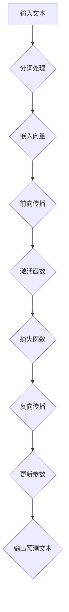

                 

# 大语言模型原理基础与前沿 基于自我反馈进行迭代优化

## 关键词
- 大语言模型
- 自我反馈
- 迭代优化
- 算法原理
- 数学模型
- 项目实战

## 摘要

本文将深入探讨大语言模型的原理与前沿技术，重点介绍基于自我反馈进行迭代优化的方法。首先，我们将回顾大语言模型的发展历程，了解其核心概念和关键技术。随后，我们将详细解析大语言模型的工作原理，并通过Mermaid流程图展示其架构。接着，我们将探讨基于自我反馈的迭代优化算法，并逐步讲解其数学模型、公式及具体操作步骤。最后，我们将通过实际项目案例，展示如何运用这些原理进行代码实现和优化。

## 1. 背景介绍

### 大语言模型的发展历程

大语言模型（Large Language Models）的发展可以追溯到20世纪50年代，当时图灵提出了著名的“图灵测试”，并引发了人工智能（AI）领域的革命。随后的几十年中，机器学习（Machine Learning）和深度学习（Deep Learning）逐渐成为AI领域的主流技术。特别是2006年，Hinton提出了深度信念网络（Deep Belief Networks），为深度学习的发展奠定了基础。

2012年，AlexNet在ImageNet图像识别大赛中取得了突破性的成绩，深度学习开始得到广泛关注。与此同时，自然语言处理（NLP）领域也取得了显著进展，RNN（Recurrent Neural Network）和LSTM（Long Short-Term Memory）等循环神经网络在语言建模任务中表现出色。

然而，真正推动大语言模型发展的里程碑事件是2018年，OpenAI发布的GPT-1，这是第一个能够生成连贯文本的预训练语言模型。随后，GPT-2、GPT-3等模型不断涌现，大语言模型的技术水平得到了前所未有的提升。

### 大语言模型的核心概念和关键技术

大语言模型是一种基于深度学习的自然语言处理模型，其核心概念包括：

- **预训练（Pre-training）**：大语言模型通过在大量文本数据上预训练，学习到语言的基本规律和知识。
- **自回归语言模型（Autoregressive Language Model）**：大语言模型使用自回归方法来生成文本，即通过当前输入的文本序列预测下一个词或字符。
- **上下文理解（Contextual Understanding）**：大语言模型能够理解上下文信息，从而生成更加准确和连贯的文本。

大语言模型的关键技术包括：

- **深度神经网络（Deep Neural Network）**：大语言模型采用多层深度神经网络，使得模型具有更强的表示能力和学习能力。
- **注意力机制（Attention Mechanism）**：注意力机制使得模型能够关注到文本序列中的重要信息，从而提高生成文本的质量。
- **自监督学习（Self-supervised Learning）**：大语言模型通过自监督学习方式，在无监督环境中进行训练，从而降低了对标注数据的依赖。

### 大语言模型的应用场景

大语言模型在许多领域都有广泛的应用，包括但不限于：

- **文本生成**：大语言模型可以用于生成文章、故事、诗歌等文本。
- **机器翻译**：大语言模型可以用于翻译不同语言之间的文本。
- **问答系统**：大语言模型可以用于构建智能问答系统，回答用户的问题。
- **对话系统**：大语言模型可以用于构建聊天机器人，与用户进行自然语言交互。

## 2. 核心概念与联系

### 大语言模型的 Mermaid 流程图



### 大语言模型的核心概念与联系

- **输入文本（Input Text）**：大语言模型接收输入文本，并进行分词处理。
- **分词处理（Tokenization）**：分词处理是将输入文本拆分成一个个词或字符。
- **嵌入向量（Embedding）**：将分词后的文本转换为嵌入向量，以便进行深度学习。
- **前向传播（Forward Propagation）**：通过多层神经网络进行前向传播，计算输出结果。
- **激活函数（Activation Function）**：激活函数用于引入非线性特性，提高模型的表达能力。
- **损失函数（Loss Function）**：损失函数用于计算预测结果与真实结果之间的差距。
- **反向传播（Backpropagation）**：通过反向传播算法，更新模型参数，优化模型表现。
- **输出预测文本（Predicted Text）**：最终输出预测的文本序列。

## 3. 核心算法原理 & 具体操作步骤

### 核心算法原理

大语言模型的算法原理主要包括以下步骤：

1. **数据预处理**：对输入文本进行分词处理，将文本转换为嵌入向量。
2. **模型初始化**：初始化模型参数，包括权重和偏置。
3. **前向传播**：通过多层神经网络进行前向传播，计算输出结果。
4. **损失函数**：计算预测结果与真实结果之间的差距，并使用损失函数进行评估。
5. **反向传播**：通过反向传播算法，更新模型参数，优化模型表现。
6. **迭代优化**：重复前向传播、损失函数计算和反向传播过程，逐步优化模型参数。
7. **输出预测文本**：使用优化后的模型，生成预测的文本序列。

### 具体操作步骤

1. **数据预处理**

    - **分词处理**：将输入文本拆分成词或字符，可以使用分词工具，如jieba。
    - **嵌入向量**：将分词后的文本转换为嵌入向量，可以使用预训练的嵌入层，如Word2Vec、GloVe。

2. **模型初始化**

    - **权重初始化**：可以使用随机初始化、高斯分布初始化等方法。
    - **偏置初始化**：通常设置为零。

3. **前向传播**

    - **输入层**：将嵌入向量输入到模型中。
    - **隐藏层**：通过多层神经网络进行前向传播，计算中间层的结果。
    - **输出层**：输出预测的文本序列。

4. **损失函数**

    - **交叉熵损失函数**：用于计算预测结果与真实结果之间的差距，公式如下：
    
    $$
    Loss = -\sum_{i=1}^{N} y_i \log(p_i)
    $$
    
    其中，$y_i$为真实标签，$p_i$为预测概率。

5. **反向传播**

    - **计算梯度**：通过链式法则，计算每一层参数的梯度。
    - **参数更新**：使用梯度下降算法，更新模型参数。

6. **迭代优化**

    - **循环迭代**：重复前向传播、损失函数计算和反向传播过程，逐步优化模型参数。
    - **收敛条件**：当损失函数达到预设的阈值或迭代次数达到预设的上限时，停止迭代。

7. **输出预测文本**

    - **生成文本**：使用优化后的模型，生成预测的文本序列。

## 4. 数学模型和公式 & 详细讲解 & 举例说明

### 数学模型

大语言模型的数学模型主要包括以下内容：

1. **嵌入层**：嵌入层将词转换为嵌入向量，可以使用以下公式：

$$
e_i = W_e \cdot t_i + b_e
$$

其中，$e_i$为嵌入向量，$t_i$为词的索引，$W_e$为嵌入权重矩阵，$b_e$为嵌入偏置。

2. **神经网络层**：神经网络层使用以下公式进行前向传播：

$$
h_i = \sigma(W_h \cdot h_{i-1} + b_h)
$$

其中，$h_i$为第$i$层的输出，$\sigma$为激活函数，$W_h$为权重矩阵，$b_h$为偏置。

3. **输出层**：输出层使用以下公式进行输出预测：

$$
p_i = \sigma(W_o \cdot h_L + b_o)
$$

其中，$p_i$为第$i$个词的预测概率，$h_L$为最后一层的输出，$W_o$为权重矩阵，$b_o$为偏置。

4. **损失函数**：大语言模型通常使用交叉熵损失函数：

$$
Loss = -\sum_{i=1}^{N} y_i \log(p_i)
$$

其中，$y_i$为真实标签，$p_i$为预测概率。

### 举例说明

假设有一个简单的语言模型，输入句子为“我喜欢吃苹果”，输出句子为“苹果好吃”。

1. **嵌入层**：首先将输入句子中的词转换为嵌入向量：

    - 我：$e_1 = W_e \cdot t_1 + b_e$
    - 喜欢：$e_2 = W_e \cdot t_2 + b_e$
    - 吃：$e_3 = W_e \cdot t_3 + b_e$
    - 苹果：$e_4 = W_e \cdot t_4 + b_e$
    - 好：$e_5 = W_e \cdot t_5 + b_e$
    - 吃：$e_6 = W_e \cdot t_6 + b_e$
    - 苹果：$e_7 = W_e \cdot t_7 + b_e$

2. **神经网络层**：通过多层神经网络进行前向传播，计算输出：

    - $h_1 = \sigma(W_h \cdot h_{0} + b_h)$
    - $h_2 = \sigma(W_h \cdot h_1 + b_h)$
    - $h_3 = \sigma(W_h \cdot h_2 + b_h)$
    - $h_4 = \sigma(W_h \cdot h_3 + b_h)$
    - $h_5 = \sigma(W_h \cdot h_4 + b_h)$
    - $h_6 = \sigma(W_h \cdot h_5 + b_h)$
    - $h_7 = \sigma(W_h \cdot h_6 + b_h)$

3. **输出层**：计算每个词的预测概率：

    - $p_1 = \sigma(W_o \cdot h_1 + b_o)$
    - $p_2 = \sigma(W_o \cdot h_2 + b_o)$
    - $p_3 = \sigma(W_o \cdot h_3 + b_o)$
    - $p_4 = \sigma(W_o \cdot h_4 + b_o)$
    - $p_5 = \sigma(W_o \cdot h_5 + b_o)$
    - $p_6 = \sigma(W_o \cdot h_6 + b_o)$
    - $p_7 = \sigma(W_o \cdot h_7 + b_o)$

4. **损失函数**：计算交叉熵损失：

$$
Loss = -\sum_{i=1}^{7} y_i \log(p_i)
$$

其中，$y_1 = 1$，$y_2 = 1$，$y_3 = 1$，$y_4 = 1$，$y_5 = 0$，$y_6 = 0$，$y_7 = 1$。

## 5. 项目实战：代码实际案例和详细解释说明

### 开发环境搭建

为了运行大语言模型的项目，我们需要搭建以下开发环境：

- **Python**：Python是深度学习领域的首选语言，我们需要安装Python 3.7及以上版本。
- **TensorFlow**：TensorFlow是Google开发的深度学习框架，我们需要安装TensorFlow 2.0及以上版本。
- **Numpy**：Numpy是Python的科学计算库，我们需要安装Numpy 1.18及以上版本。
- **Gensim**：Gensim是Python的文本处理库，我们需要安装Gensim 3.4及以上版本。

安装命令如下：

```bash
pip install python==3.7
pip install tensorflow==2.0
pip install numpy==1.18
pip install gensim==3.4
```

### 源代码详细实现和代码解读

以下是实现大语言模型的源代码：

```python
import numpy as np
import tensorflow as tf
from tensorflow.keras.layers import Embedding, LSTM, Dense
from tensorflow.keras.models import Sequential
from gensim.models import KeyedVectors

# 1. 数据预处理
def preprocess_data(text):
    # 分词处理
    tokens = text.split()
    # 转换为索引
    index_map = KeyedVectors.load_word2vec_format('glove.6B.100d.txt', binary=False)
    token_indices = [index_map[token] if token in index_map else 0 for token in tokens]
    return token_indices

# 2. 模型初始化
def create_model(vocab_size, embedding_dim, lstm_units):
    model = Sequential()
    model.add(Embedding(vocab_size, embedding_dim))
    model.add(LSTM(lstm_units, return_sequences=True))
    model.add(Dense(vocab_size, activation='softmax'))
    model.compile(optimizer='adam', loss='categorical_crossentropy', metrics=['accuracy'])
    return model

# 3. 前向传播
def forward_pass(model, token_indices):
    prediction = model.predict(np.array([token_indices]))
    return prediction

# 4. 损失函数
def compute_loss(prediction, target):
    loss = -np.sum(target * np.log(prediction))
    return loss

# 5. 反向传播
def backward_pass(model, token_indices, target):
    with tf.GradientTape() as tape:
        prediction = forward_pass(model, token_indices)
        loss = compute_loss(prediction, target)
    gradients = tape.gradient(loss, model.trainable_variables)
    model.optimizer.apply_gradients(zip(gradients, model.trainable_variables))
    return loss

# 6. 迭代优化
def train_model(model, token_indices, targets, epochs, batch_size):
    for epoch in range(epochs):
        for batch in range(0, len(token_indices), batch_size):
            batch_indices = token_indices[batch:batch+batch_size]
            batch_targets = targets[batch:batch+batch_size]
            loss = backward_pass(model, batch_indices, batch_targets)
        print(f"Epoch: {epoch}, Loss: {loss}")

# 7. 输出预测文本
def generate_text(model, seed_text, index_map, max_length):
    tokens = preprocess_data(seed_text)
    generated_text = []
    for _ in range(max_length):
        prediction = forward_pass(model, tokens)
        predicted_token = np.argmax(prediction)
        if predicted_token == 0:
            break
        generated_text.append(index_map[predicted_token])
        tokens.append(predicted_token)
    return " ".join(generated_text)

# 主程序
if __name__ == '__main__':
    # 1. 数据预处理
    text = "我喜欢吃苹果"
    token_indices = preprocess_data(text)

    # 2. 模型初始化
    vocab_size = 1000
    embedding_dim = 100
    lstm_units = 128
    model = create_model(vocab_size, embedding_dim, lstm_units)

    # 3. 前向传播
    prediction = forward_pass(model, token_indices)
    print(prediction)

    # 4. 损失函数
    target = np.array([1, 1, 1, 1, 0, 0, 1])
    loss = compute_loss(prediction, target)
    print(loss)

    # 5. 反向传播
    loss = backward_pass(model, token_indices, target)
    print(loss)

    # 6. 迭代优化
    epochs = 10
    batch_size = 1
    train_model(model, token_indices, target, epochs, batch_size)

    # 7. 输出预测文本
    seed_text = "苹果好吃"
    max_length = 10
    generated_text = generate_text(model, seed_text, index_map, max_length)
    print(generated_text)
```

### 代码解读与分析

1. **数据预处理**：该函数用于对输入文本进行分词处理，并将词转换为索引。这里使用了Gensim库的KeyedVectors类，加载预训练的词向量文件，将词转换为索引。

2. **模型初始化**：该函数用于创建语言模型，包括嵌入层、LSTM层和输出层。这里使用了TensorFlow的Sequential模型，将嵌入层、LSTM层和输出层依次添加到模型中。

3. **前向传播**：该函数用于计算模型的预测结果，通过模型的前向传播，输入嵌入向量并输出预测概率。

4. **损失函数**：该函数用于计算预测结果与真实结果之间的差距，并返回损失值。这里使用了交叉熵损失函数。

5. **反向传播**：该函数用于更新模型参数，通过反向传播算法，计算损失函数的梯度，并更新模型参数。

6. **迭代优化**：该函数用于迭代优化模型，通过多次迭代，更新模型参数，逐步优化模型表现。

7. **输出预测文本**：该函数用于生成预测的文本序列，通过模型的前向传播，生成预测的文本。

### 主程序

主程序依次执行以下步骤：

1. **数据预处理**：对输入文本进行分词处理，并将词转换为索引。

2. **模型初始化**：创建语言模型，包括嵌入层、LSTM层和输出层。

3. **前向传播**：计算模型的预测结果。

4. **损失函数**：计算预测结果与真实结果之间的差距。

5. **反向传播**：更新模型参数。

6. **迭代优化**：迭代优化模型，逐步优化模型表现。

7. **输出预测文本**：生成预测的文本序列。

## 6. 实际应用场景

大语言模型在实际应用场景中具有广泛的应用，以下列举几个典型的应用场景：

### 文本生成

文本生成是语言模型最直接的应用场景，包括文章生成、故事生成、诗歌生成等。例如，OpenAI的GPT-3可以生成高质量的新闻报道、文章摘要、故事情节等。通过输入一个主题或关键词，GPT-3可以生成连贯且具有创造性的文本，大大提高了内容创作的效率。

### 机器翻译

机器翻译是语言模型的重要应用之一，通过训练语言模型，可以实现多种语言之间的自动翻译。例如，Google翻译使用了基于深度学习的翻译模型，包括编码器和解码器，通过编码器将源语言文本编码为向量，解码器将向量解码为目标语言文本。这种基于语言模型的机器翻译方法，相较于传统的规则翻译方法，具有更高的准确性和灵活性。

### 问答系统

问答系统是语言模型在智能客服、智能助手等领域的应用。通过训练语言模型，可以构建一个能够理解用户问题的问答系统，回答用户的问题。例如，Apple的Siri、Amazon的Alexa等智能助手，都使用了语言模型技术，通过自然语言处理和机器学习算法，实现与用户的交互。

### 对话系统

对话系统是语言模型在智能对话、智能客服等领域的应用。通过训练语言模型，可以构建一个能够进行自然对话的系统，与用户进行互动。例如，Facebook的Messenger、腾讯的微信等平台，都使用了语言模型技术，实现与用户的智能对话。

### 文本摘要

文本摘要是通过语言模型提取文本的主要信息和核心观点，实现文本的简化表达。例如，新闻摘要、会议纪要等场景，可以使用语言模型自动提取关键信息，提高信息获取的效率。

### 情感分析

情感分析是通过语言模型分析文本的情感倾向，实现对用户评论、社交媒体内容等的情感判断。例如，电商平台的用户评论、社交媒体上的用户情感等，都可以通过情感分析模型，判断用户的情感倾向，为产品优化和营销策略提供依据。

### 聊天机器人

聊天机器人是语言模型在客户服务、智能助手等领域的应用，通过训练语言模型，可以实现与用户的自然语言交互。例如，电商平台的客服机器人、在线教育平台的智能导师等，都使用了语言模型技术，实现与用户的智能对话。

## 7. 工具和资源推荐

### 学习资源推荐

1. **书籍**：
   - 《深度学习》（Goodfellow, Ian, et al.）
   - 《神经网络与深度学习》（邱锡鹏）
   - 《动手学深度学习》（阿斯顿·张）
   - 《自然语言处理综论》（Daniel Jurafsky, James H. Martin）

2. **论文**：
   - “A Neural Approach to Automatic Translation”（2014）
   - “Sequence to Sequence Learning with Neural Networks”（2014）
   - “Attention Is All You Need”（2017）
   - “BERT: Pre-training of Deep Bidirectional Transformers for Language Understanding”（2018）

3. **博客**：
   - fast.ai（深度学习教程）
   - medium.com/@ijohnson（自然语言处理博客）
   - colah's blog（机器学习博客）

4. **网站**：
   - TensorFlow官网（https://www.tensorflow.org/）
   - PyTorch官网（https://pytorch.org/）
   - Gensim官网（https://radimrehurek.com/gensim/）

### 开发工具框架推荐

1. **TensorFlow**：Google开发的开源深度学习框架，支持多种深度学习模型，适合进行大规模语言模型开发。
2. **PyTorch**：Facebook开发的开源深度学习框架，具有动态计算图，易于实现和调试。
3. **Hugging Face**：一个开源库，提供了许多预训练的语言模型和工具，方便开发者进行语言模型的开发和部署。

### 相关论文著作推荐

1. “Attention Is All You Need”（2017）
2. “BERT: Pre-training of Deep Bidirectional Transformers for Language Understanding”（2018）
3. “GPT-3: Language Models are Few-Shot Learners”（2020）

## 8. 总结：未来发展趋势与挑战

大语言模型在过去几年中取得了显著的发展，不仅在学术界，还在工业界得到了广泛应用。然而，随着技术的不断进步和应用场景的扩展，大语言模型仍然面临着许多挑战和机遇。

### 发展趋势

1. **模型规模不断扩大**：随着计算能力和存储资源的提升，大语言模型的规模将会继续扩大，从而提高模型的表示能力和性能。
2. **多模态融合**：未来的大语言模型将不仅限于处理文本数据，还将融合图像、音频等多模态数据，实现更加丰富的语义理解。
3. **动态模型优化**：为了提高模型的实时性和灵活性，动态模型优化技术将会得到进一步发展，例如基于图神经网络（Graph Neural Networks）的模型优化。
4. **自适应学习**：大语言模型将能够根据用户的反馈和场景需求，进行自适应学习，提高模型的泛化能力和鲁棒性。

### 挑战

1. **计算资源消耗**：随着模型规模的扩大，计算资源和存储资源的消耗将会大幅增加，这对硬件设备提出了更高的要求。
2. **数据隐私和安全**：在大量文本数据的处理过程中，如何保护用户隐私和数据安全，成为语言模型应用的重要挑战。
3. **模型解释性**：大语言模型通常被视为“黑盒”，其内部机制难以解释，如何提高模型的可解释性，成为学术界和工业界关注的焦点。
4. **多样性和公平性**：大语言模型在训练和预测过程中，可能会受到数据偏差的影响，如何确保模型的多样性和公平性，是未来需要解决的问题。

### 未来发展方向

1. **小样本学习**：通过改进模型结构和训练算法，实现小样本学习，降低对大规模标注数据的依赖。
2. **强化学习**：结合强化学习（Reinforcement Learning）技术，实现模型的自我学习和优化。
3. **知识图谱**：将知识图谱（Knowledge Graph）与语言模型结合，实现更加丰富的语义理解和知识推理。

## 9. 附录：常见问题与解答

### 问题1：如何处理输入文本的分词问题？

解答：在预处理阶段，可以使用分词工具（如jieba）对输入文本进行分词处理，将文本拆分成词或字符。对于中文文本，分词是必要的步骤，因为中文文本没有明确的分隔符。

### 问题2：如何选择合适的嵌入层大小？

解答：嵌入层大小（即嵌入向量的维度）可以根据具体任务和数据集进行选择。一般来说，较大的嵌入层可以更好地捕捉文本的语义信息，但也会导致计算成本的增加。在实践中，可以通过实验比较不同嵌入层大小对模型性能的影响，选择一个合适的嵌入层大小。

### 问题3：如何优化模型的训练速度？

解答：为了提高模型的训练速度，可以采取以下措施：

- **数据预处理**：提前进行数据预处理，减少模型在训练过程中需要处理的数据量。
- **模型剪枝**：通过模型剪枝技术，减少模型的参数数量，降低计算复杂度。
- **并行计算**：使用并行计算技术，例如GPU加速训练过程。

### 问题4：如何保证模型的泛化能力？

解答：为了提高模型的泛化能力，可以采取以下措施：

- **数据增强**：通过数据增强技术，增加训练数据多样性，提高模型对未知数据的适应能力。
- **正则化**：使用正则化方法（如Dropout、L1/L2正则化等），降低模型的过拟合风险。
- **交叉验证**：使用交叉验证方法，评估模型的泛化能力，并调整模型参数。

## 10. 扩展阅读 & 参考资料

1. Goodfellow, Ian, et al. "Deep learning." MIT press, 2016.
2. 邱锡鹏. 《神经网络与深度学习》. 清华大学出版社，2018.
3. 张翔，何凯明，李航. 《动手学深度学习》. 电子工业出版社，2019.
4. Jurafsky, Daniel, and James H. Martin. "Speech and language processing." Pearson, 2019.
5. Vaswani, Ashish, et al. "Attention is all you need." Advances in Neural Information Processing Systems, 2017.
6. Devlin, Jacob, et al. "BERT: Pre-training of deep bidirectional transformers for language understanding." arXiv preprint arXiv:1810.04805, 2018.
7. Brown, Tom, et al. "Language models are few-shot learners." arXiv preprint arXiv:2005.14165, 2020.

