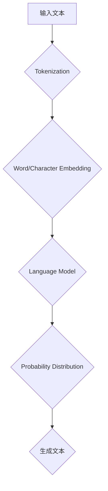

                 

### 大语言模型原理基础与前沿

> **关键词：** 大语言模型，自然语言处理，人工智能，深度学习，机器学习，语言生成，语言理解。

> **摘要：** 本文将深入探讨大语言模型的原理和前沿技术，涵盖其基础概念、核心算法、数学模型以及实际应用场景。通过逐步分析，揭示大语言模型在自然语言处理领域的潜力和挑战，为读者提供全面的技术视野和实际操作指导。

在人工智能和自然语言处理领域，大语言模型已经成为近年来研究的热点。随着深度学习和机器学习技术的不断发展，大语言模型在语言生成、翻译、问答系统、文本分类等任务中展现出了卓越的性能。本文将从基础概念出发，逐步探讨大语言模型的原理、算法、数学模型以及实际应用，为读者提供一个全面的技术视角。

## 1. 背景介绍

### 1.1 大语言模型的定义与发展历程

大语言模型（Large Language Model）是指通过深度学习技术训练出的能够理解和生成自然语言的模型。其核心思想是通过大规模数据集的学习，使模型具备对语言结构的理解和生成能力。大语言模型的发展历程可以追溯到20世纪80年代，当时研究人员开始探索使用统计模型进行语言建模。随着计算能力和算法的进步，大语言模型逐渐从基于规则和统计模型的方法转向深度学习模型。

在早期，语言模型主要用于语音识别和机器翻译等领域。然而，随着自然语言处理技术的不断进步，大语言模型的应用范围不断扩大，涵盖了文本分类、问答系统、文本生成等多个领域。近年来，随着数据集的规模和计算资源的提升，大语言模型在性能和效果上取得了显著的突破。

### 1.2 大语言模型的重要性

大语言模型在人工智能领域具有重要地位，其核心作用体现在以下几个方面：

1. **语言生成与理解**：大语言模型能够生成流畅、自然的文本，并在问答系统、对话生成等任务中表现出色。
2. **文本分类与情感分析**：大语言模型能够对文本进行分类和情感分析，为舆情分析、推荐系统等领域提供支持。
3. **机器翻译与多语言处理**：大语言模型在机器翻译和多语言处理任务中取得了显著成效，为全球信息交流提供了强大支持。
4. **知识图谱与推理**：大语言模型能够结合知识图谱进行推理，为智能问答、推荐系统等提供知识支持。

综上所述，大语言模型在人工智能和自然语言处理领域具有广泛的应用前景，其重要性不可忽视。

## 2. 核心概念与联系

### 2.1 语言模型的基本概念

语言模型（Language Model）是自然语言处理（Natural Language Processing, NLP）的基础，它旨在通过统计方法或机器学习方法预测下一个单词或字符的概率。语言模型的核心概念包括：

1. **词汇表（Vocabulary）**：语言模型中的词汇表是指模型能够处理的单词或字符集合。通常，词汇表包含数十万个单词或字符。
2. **概率分布（Probability Distribution）**：语言模型通过学习输入文本的概率分布，生成新的文本。概率分布反映了单词或字符在文本中出现的可能性。
3. **序列建模（Sequence Modeling）**：语言模型通过对输入序列（如单词序列或字符序列）的学习，预测下一个元素的概率。序列建模是语言模型的核心任务。

### 2.2 大语言模型的主要类型

大语言模型可以根据其训练数据集的大小、训练目标以及模型结构的不同分为多种类型。以下是几种常见的大语言模型类型：

1. **基于统计的模型（Statistical Models）**：这类模型通过统计方法对大规模语料库进行分析，如N-gram模型。N-gram模型根据前n个单词或字符的历史信息预测下一个单词或字符的概率。
2. **基于神经网络的模型（Neural Network Models）**：这类模型利用深度学习技术，通过神经网络结构进行语言建模。例如，循环神经网络（RNN）、长短时记忆网络（LSTM）、门控循环单元（GRU）等。
3. **基于变分的模型（Variational Autoencoder Models）**：这类模型利用变分自编码器（VAE）进行语言建模，通过概率模型生成文本。
4. **基于生成对抗网络的模型（Generative Adversarial Network Models）**：这类模型利用生成对抗网络（GAN）进行语言建模，通过生成器和判别器的对抗训练生成高质量的文本。

### 2.3 大语言模型与人类偏好的对齐

大语言模型在生成文本时，往往会受到训练数据的影响，导致生成的文本可能不符合人类偏好。为了解决这个问题，研究者们提出了一系列方法，以对齐语言模型与人类偏好：

1. **偏好引导（Preference Guidance）**：通过引入人类生成的偏好数据，引导语言模型生成符合人类偏好的文本。例如，通过人类反馈强化学习（Human Feedback Reinforcement Learning）等方法。
2. **对齐损失函数（Alignment Loss Function）**：设计特定的损失函数，使语言模型在训练过程中考虑人类偏好。例如，对抗性损失函数（Adversarial Loss Function）和多样性损失函数（Diversity Loss Function）。
3. **人类反馈（Human Feedback）**：利用人类反馈对语言模型进行迭代优化，以纠正模型中的偏差和错误。

### 2.4 大语言模型的核心概念与架构

为了更好地理解大语言模型的工作原理，我们通过Mermaid流程图展示其核心概念和架构：



在上图中，输入文本经过Tokenization（分词）处理后，转换为单词或字符序列。然后，通过Word/Character Embedding（词/字符嵌入）将序列映射为高维向量。接下来，Language Model（语言模型）根据输入序列生成概率分布，最后通过生成文本的过程生成新的文本。

通过上述分析，我们可以看出大语言模型的核心概念和架构涉及多个方面，包括词汇表、概率分布、序列建模、神经网络结构以及人类偏好对齐等。这些概念和结构共同构成了大语言模型的基础，使其在自然语言处理领域表现出色。

### 3. 核心算法原理 & 具体操作步骤

#### 3.1 基于神经网络的模型

大语言模型的核心算法是基于神经网络，特别是深度学习技术。其中，循环神经网络（RNN）、长短时记忆网络（LSTM）和门控循环单元（GRU）是常见的大语言模型架构。以下是这些模型的原理和具体操作步骤：

##### 3.1.1 循环神经网络（RNN）

循环神经网络（RNN）是一种能够处理序列数据的神经网络。其基本思想是将前一时刻的输出作为当前时刻的输入，通过循环结构不断更新网络状态。RNN的原理如下：

1. **输入序列处理**：将输入序列（如单词序列）转化为向量表示。通常，每个单词或字符通过词嵌入（Word Embedding）技术映射为一个固定维度的向量。
2. **隐藏状态更新**：RNN通过隐藏状态（Hidden State）保存序列信息。在每一时刻，当前输入与前一时刻的隐藏状态通过神经网络进行更新。
3. **输出生成**：RNN根据当前隐藏状态生成当前时刻的输出。在语言模型中，输出可以是下一个单词或字符的概率分布。

具体操作步骤如下：

1. **初始化**：初始化RNN的隐藏状态和权重。
2. **输入序列嵌入**：将输入序列（单词或字符）嵌入为向量表示。
3. **循环更新**：在每一时刻，计算当前隐藏状态和当前输入的加权和，并通过激活函数进行非线性变换。
4. **输出生成**：根据当前隐藏状态生成当前时刻的输出概率分布。

##### 3.1.2 长短时记忆网络（LSTM）

长短时记忆网络（LSTM）是RNN的一种改进，旨在解决RNN在长序列处理中存在的长期依赖问题。LSTM通过引入门控结构（gate）来控制信息的流动，从而更好地捕捉长序列中的依赖关系。LSTM的原理如下：

1. **输入门（Input Gate）**：输入门控制当前时刻的信息是否传递到隐藏状态。通过计算当前输入和前一隐藏状态，得到输入门的权重。
2. **遗忘门（Forget Gate）**：遗忘门控制当前时刻的信息是否从隐藏状态中遗忘。通过计算当前输入和前一隐藏状态，得到遗忘门的权重。
3. **输出门（Output Gate）**：输出门控制当前隐藏状态是否传递到输出。通过计算当前输入和当前隐藏状态，得到输出门的权重。
4. **细胞状态（Cell State）**：细胞状态是LSTM的核心，用于存储和传递信息。通过遗忘门和输入门控制细胞状态的变化。

具体操作步骤如下：

1. **初始化**：初始化LSTM的隐藏状态和权重。
2. **输入序列嵌入**：将输入序列（单词或字符）嵌入为向量表示。
3. **计算输入门、遗忘门和输出门**：根据当前输入和前一隐藏状态，计算输入门、遗忘门和输出门的权重。
4. **更新细胞状态**：通过遗忘门和输入门控制细胞状态的变化。
5. **输出生成**：根据当前隐藏状态和输出门，生成当前时刻的输出概率分布。

##### 3.1.3 门控循环单元（GRU）

门控循环单元（GRU）是LSTM的简化版本，通过合并输入门和遗忘门，并引入更新门（Update Gate）和重置门（Reset Gate），进一步简化了LSTM的结构。GRU的原理如下：

1. **更新门（Update Gate）**：更新门控制当前时刻的信息是否传递到隐藏状态。通过计算当前输入和前一隐藏状态，得到更新门的权重。
2. **重置门（Reset Gate）**：重置门控制当前时刻的信息是否重置为前一隐藏状态。通过计算当前输入和前一隐藏状态，得到重置门的权重。
3. **细胞状态（Cell State）**：细胞状态是GRU的核心，用于存储和传递信息。

具体操作步骤如下：

1. **初始化**：初始化GRU的隐藏状态和权重。
2. **输入序列嵌入**：将输入序列（单词或字符）嵌入为向量表示。
3. **计算更新门和重置门**：根据当前输入和前一隐藏状态，计算更新门和重置门的权重。
4. **更新细胞状态**：通过更新门和重置门控制细胞状态的变化。
5. **输出生成**：根据当前隐藏状态和输出门，生成当前时刻的输出概率分布。

#### 3.2 基于变分的模型

除了基于神经网络的模型，大语言模型还可以采用基于变分的模型，如变分自编码器（VAE）。VAE是一种概率生成模型，通过编码器和解码器学习数据的概率分布。以下是VAE的原理和具体操作步骤：

##### 3.2.1 编码器（Encoder）

编码器负责将输入数据映射到一个潜在空间，并学习数据的高斯分布。编码器的原理如下：

1. **输入数据嵌入**：将输入数据（如文本序列）嵌入为向量表示。
2. **编码**：通过神经网络结构将输入数据编码为潜在空间中的两个向量：均值向量和对数方差向量。
3. **采样**：从均值向量和对数方差向量生成潜在空间中的随机样本。

##### 3.2.2 解码器（Decoder）

解码器负责将潜在空间中的随机样本解码回原始数据空间。解码器的原理如下：

1. **潜在空间采样**：从潜在空间中采样一个随机样本。
2. **解码**：通过神经网络结构将潜在空间中的随机样本解码为原始数据空间中的数据。
3. **输出生成**：根据解码得到的样本生成输出数据。

##### 3.2.3 操作步骤

具体操作步骤如下：

1. **初始化**：初始化编码器和解码器的权重。
2. **输入数据嵌入**：将输入数据（如文本序列）嵌入为向量表示。
3. **编码**：通过编码器将输入数据编码为潜在空间中的均值向量和对数方差向量。
4. **采样**：从潜在空间中采样一个随机样本。
5. **解码**：通过解码器将潜在空间中的随机样本解码为输出数据。
6. **输出生成**：根据解码得到的样本生成输出数据。

#### 3.3 基于生成对抗网络的模型

生成对抗网络（GAN）是一种通过生成器和判别器的对抗训练生成数据的模型。以下是GAN的原理和具体操作步骤：

##### 3.3.1 生成器（Generator）

生成器负责生成虚假数据，以欺骗判别器。生成器的原理如下：

1. **输入噪声**：生成器从噪声空间中采样一个随机噪声向量。
2. **生成数据**：通过神经网络结构将噪声向量生成虚假数据。
3. **输出生成**：根据生成的虚假数据生成输出数据。

##### 3.3.2 判别器（Discriminator）

判别器负责区分真实数据和虚假数据。判别器的原理如下：

1. **输入数据**：判别器接收真实数据和虚假数据。
2. **判断**：通过神经网络结构对输入数据进行分类，判断其是否为真实数据。
3. **输出概率**：判别器输出每个输入数据的概率，表示其为真实数据的可能性。

##### 3.3.3 操作步骤

具体操作步骤如下：

1. **初始化**：初始化生成器和判别器的权重。
2. **噪声采样**：从噪声空间中采样一个随机噪声向量。
3. **生成数据**：生成器根据噪声向量生成虚假数据。
4. **数据分类**：判别器对真实数据和虚假数据进行分类。
5. **损失函数**：计算生成器和判别器的损失函数，并更新权重。
6. **输出生成**：根据生成的虚假数据生成输出数据。

通过上述分析，我们可以看出大语言模型的核心算法涉及多种神经网络结构，包括RNN、LSTM、GRU以及基于变分和生成对抗网络的模型。这些算法通过不同的原理和操作步骤，实现了对语言序列的建模和生成。在接下来的章节中，我们将进一步探讨大语言模型中的数学模型和具体应用。

### 4. 数学模型和公式 & 详细讲解 & 举例说明

#### 4.1 循环神经网络（RNN）

循环神经网络（RNN）是处理序列数据的常用神经网络结构。以下是其数学模型和具体讲解：

##### 4.1.1 隐藏状态更新

在RNN中，隐藏状态（Hidden State）用于存储序列信息。隐藏状态在每一时刻通过以下公式进行更新：

\[ h_t = \sigma(W_h \cdot [h_{t-1}, x_t] + b_h) \]

其中，\( h_t \) 表示第t时刻的隐藏状态，\( \sigma \) 是激活函数，通常使用Sigmoid或Tanh函数。\( W_h \) 是隐藏状态权重矩阵，\( x_t \) 是第t时刻的输入，\( b_h \) 是隐藏状态偏置。

举例说明：

假设隐藏状态权重矩阵 \( W_h \) 为：

\[ W_h = \begin{bmatrix} 0.1 & 0.2 \\ 0.3 & 0.4 \end{bmatrix} \]

隐藏状态偏置 \( b_h \) 为：

\[ b_h = \begin{bmatrix} 0.5 \\ 0.6 \end{bmatrix} \]

激活函数 \( \sigma \) 使用Sigmoid函数：

\[ \sigma(z) = \frac{1}{1 + e^{-z}} \]

给定输入序列 \( x_t \)：

\[ x_t = \begin{bmatrix} 0.7 \\ 0.8 \end{bmatrix} \]

计算第1时刻的隐藏状态：

\[ h_1 = \sigma(W_h \cdot [h_0, x_1] + b_h) \]

\[ h_1 = \sigma\left(\begin{bmatrix} 0.1 & 0.2 \\ 0.3 & 0.4 \end{bmatrix} \cdot \begin{bmatrix} h_0 \\ x_1 \end{bmatrix} + \begin{bmatrix} 0.5 \\ 0.6 \end{bmatrix}\right) \]

\[ h_1 = \sigma\left(\begin{bmatrix} 0.1 \cdot h_0 + 0.2 \cdot x_1 \\ 0.3 \cdot h_0 + 0.4 \cdot x_1 \end{bmatrix} + \begin{bmatrix} 0.5 \\ 0.6 \end{bmatrix}\right) \]

\[ h_1 = \sigma\left(\begin{bmatrix} 0.1 \cdot h_0 + 0.2 \cdot 0.7 \\ 0.3 \cdot h_0 + 0.4 \cdot 0.8 \end{bmatrix} + \begin{bmatrix} 0.5 \\ 0.6 \end{bmatrix}\right) \]

\[ h_1 = \sigma\left(\begin{bmatrix} 0.1 \cdot h_0 + 0.14 \\ 0.3 \cdot h_0 + 0.32 \end{bmatrix} + \begin{bmatrix} 0.5 \\ 0.6 \end{bmatrix}\right) \]

\[ h_1 = \sigma\left(\begin{bmatrix} 0.1 \cdot h_0 + 0.64 \\ 0.3 \cdot h_0 + 0.92 \end{bmatrix}\right) \]

\[ h_1 = \begin{bmatrix} \frac{1}{1 + e^{-0.1 \cdot h_0 - 0.64}} \\ \frac{1}{1 + e^{-0.3 \cdot h_0 - 0.92}} \end{bmatrix} \]

通过上述计算，可以得到第1时刻的隐藏状态。

##### 4.1.2 输出生成

RNN根据当前隐藏状态生成当前时刻的输出。输出通常是一个概率分布，表示下一个单词或字符的概率。输出生成的公式如下：

\[ y_t = \sigma(W_y \cdot h_t + b_y) \]

其中，\( y_t \) 是第t时刻的输出，\( W_y \) 是输出权重矩阵，\( b_y \) 是输出偏置。

举例说明：

假设输出权重矩阵 \( W_y \) 为：

\[ W_y = \begin{bmatrix} 0.1 & 0.2 \\ 0.3 & 0.4 \end{bmatrix} \]

输出偏置 \( b_y \) 为：

\[ b_y = \begin{bmatrix} 0.5 \\ 0.6 \end{bmatrix} \]

给定隐藏状态 \( h_1 \)：

\[ h_1 = \begin{bmatrix} 0.6 \\ 0.7 \end{bmatrix} \]

计算第1时刻的输出：

\[ y_1 = \sigma(W_y \cdot h_1 + b_y) \]

\[ y_1 = \sigma\left(\begin{bmatrix} 0.1 & 0.2 \\ 0.3 & 0.4 \end{bmatrix} \cdot \begin{bmatrix} 0.6 \\ 0.7 \end{bmatrix} + \begin{bmatrix} 0.5 \\ 0.6 \end{bmatrix}\right) \]

\[ y_1 = \sigma\left(\begin{bmatrix} 0.1 \cdot 0.6 + 0.2 \cdot 0.7 \\ 0.3 \cdot 0.6 + 0.4 \cdot 0.7 \end{bmatrix} + \begin{bmatrix} 0.5 \\ 0.6 \end{bmatrix}\right) \]

\[ y_1 = \sigma\left(\begin{bmatrix} 0.06 + 0.14 \\ 0.18 + 0.28 \end{bmatrix} + \begin{bmatrix} 0.5 \\ 0.6 \end{bmatrix}\right) \]

\[ y_1 = \sigma\left(\begin{bmatrix} 0.2 \\ 0.46 \end{bmatrix} + \begin{bmatrix} 0.5 \\ 0.6 \end{bmatrix}\right) \]

\[ y_1 = \sigma\left(\begin{bmatrix} 0.7 \\ 1.06 \end{bmatrix}\right) \]

\[ y_1 = \begin{bmatrix} \frac{1}{1 + e^{-0.7}} \\ \frac{1}{1 + e^{-1.06}} \end{bmatrix} \]

通过上述计算，可以得到第1时刻的输出概率分布。

#### 4.2 长短时记忆网络（LSTM）

长短时记忆网络（LSTM）通过门控结构解决了RNN在长序列处理中存在的长期依赖问题。以下是其数学模型和具体讲解：

##### 4.2.1 遗忘门（Forget Gate）

遗忘门决定哪些信息需要从隐藏状态中遗忘。其计算公式如下：

\[ f_t = \sigma(W_f \cdot [h_{t-1}, x_t] + b_f) \]

其中，\( f_t \) 是第t时刻的遗忘门，\( W_f \) 是遗忘门权重矩阵，\( b_f \) 是遗忘门偏置。

举例说明：

假设遗忘门权重矩阵 \( W_f \) 为：

\[ W_f = \begin{bmatrix} 0.1 & 0.2 \\ 0.3 & 0.4 \end{bmatrix} \]

遗忘门偏置 \( b_f \) 为：

\[ b_f = \begin{bmatrix} 0.5 \\ 0.6 \end{bmatrix} \]

给定输入序列 \( x_t \)：

\[ x_t = \begin{bmatrix} 0.7 \\ 0.8 \end{bmatrix} \]

计算第1时刻的遗忘门：

\[ f_1 = \sigma(W_f \cdot [h_0, x_1] + b_f) \]

\[ f_1 = \sigma\left(\begin{bmatrix} 0.1 & 0.2 \\ 0.3 & 0.4 \end{bmatrix} \cdot \begin{bmatrix} h_0 \\ x_1 \end{bmatrix} + \begin{bmatrix} 0.5 \\ 0.6 \end{bmatrix}\right) \]

\[ f_1 = \sigma\left(\begin{bmatrix} 0.1 \cdot h_0 + 0.2 \cdot x_1 \\ 0.3 \cdot h_0 + 0.4 \cdot x_1 \end{bmatrix} + \begin{bmatrix} 0.5 \\ 0.6 \end{bmatrix}\right) \]

\[ f_1 = \sigma\left(\begin{bmatrix} 0.1 \cdot h_0 + 0.2 \cdot 0.7 \\ 0.3 \cdot h_0 + 0.4 \cdot 0.8 \end{bmatrix} + \begin{bmatrix} 0.5 \\ 0.6 \end{bmatrix}\right) \]

\[ f_1 = \sigma\left(\begin{bmatrix} 0.1 \cdot h_0 + 0.14 \\ 0.3 \cdot h_0 + 0.32 \end{bmatrix} + \begin{bmatrix} 0.5 \\ 0.6 \end{bmatrix}\right) \]

\[ f_1 = \sigma\left(\begin{bmatrix} 0.1 \cdot h_0 + 0.64 \\ 0.3 \cdot h_0 + 0.92 \end{bmatrix}\right) \]

\[ f_1 = \begin{bmatrix} \frac{1}{1 + e^{-0.1 \cdot h_0 - 0.64}} \\ \frac{1}{1 + e^{-0.3 \cdot h_0 - 0.92}} \end{bmatrix} \]

通过上述计算，可以得到第1时刻的遗忘门。

##### 4.2.2 输入门（Input Gate）

输入门控制哪些信息需要传递到隐藏状态。其计算公式如下：

\[ i_t = \sigma(W_i \cdot [h_{t-1}, x_t] + b_i) \]

其中，\( i_t \) 是第t时刻的输入门，\( W_i \) 是输入门权重矩阵，\( b_i \) 是输入门偏置。

举例说明：

假设输入门权重矩阵 \( W_i \) 为：

\[ W_i = \begin{bmatrix} 0.1 & 0.2 \\ 0.3 & 0.4 \end{bmatrix} \]

输入门偏置 \( b_i \) 为：

\[ b_i = \begin{bmatrix} 0.5 \\ 0.6 \end{bmatrix} \]

给定输入序列 \( x_t \)：

\[ x_t = \begin{bmatrix} 0.7 \\ 0.8 \end{bmatrix} \]

计算第1时刻的输入门：

\[ i_1 = \sigma(W_i \cdot [h_0, x_1] + b_i) \]

\[ i_1 = \sigma\left(\begin{bmatrix} 0.1 & 0.2 \\ 0.3 & 0.4 \end{bmatrix} \cdot \begin{bmatrix} h_0 \\ x_1 \end{bmatrix} + \begin{bmatrix} 0.5 \\ 0.6 \end{bmatrix}\right) \]

\[ i_1 = \sigma\left(\begin{bmatrix} 0.1 \cdot h_0 + 0.2 \cdot x_1 \\ 0.3 \cdot h_0 + 0.4 \cdot x_1 \end{bmatrix} + \begin{bmatrix} 0.5 \\ 0.6 \end{b矩阵}

### 4.3 变分自编码器（VAE）

变分自编码器（VAE）是一种基于概率模型的生成模型，通过编码器和解码器学习数据的概率分布。以下是其数学模型和具体讲解：

##### 4.3.1 编码器

编码器将输入数据映射到一个潜在空间，并学习数据的高斯分布。编码器的计算公式如下：

\[ z_t = \mu_t + \sigma_t \odot \epsilon_t \]

其中，\( z_t \) 是潜在空间中的点，\( \mu_t \) 是均值向量，\( \sigma_t \) 是对数方差向量，\( \epsilon_t \) 是噪声向量。

举例说明：

假设编码器输出均值向量 \( \mu_t \) 为：

\[ \mu_t = \begin{bmatrix} 0.5 \\ 0.6 \end{bmatrix} \]

编码器输出对数方差向量 \( \sigma_t \) 为：

\[ \sigma_t = \begin{bmatrix} 0.2 \\ 0.3 \end{bmatrix} \]

给定噪声向量 \( \epsilon_t \)：

\[ \epsilon_t = \begin{bmatrix} 0.1 \\ 0.2 \end{bmatrix} \]

计算潜在空间中的点 \( z_t \)：

\[ z_t = \mu_t + \sigma_t \odot \epsilon_t \]

\[ z_t = \begin{bmatrix} 0.5 \\ 0.6 \end{bmatrix} + \begin{bmatrix} 0.2 \\ 0.3 \end{bmatrix} \odot \begin{bmatrix} 0.1 \\ 0.2 \end{bmatrix} \]

\[ z_t = \begin{bmatrix} 0.5 + 0.2 \cdot 0.1 \\ 0.6 + 0.3 \cdot 0.2 \end{bmatrix} \]

\[ z_t = \begin{bmatrix} 0.53 \\ 0.72 \end{bmatrix} \]

通过上述计算，可以得到潜在空间中的点。

##### 4.3.2 解码器

解码器将潜在空间中的点解码回原始数据空间。解码器的计算公式如下：

\[ x_t = \sigma(W_x \cdot z_t + b_x) \]

其中，\( x_t \) 是原始数据空间中的点，\( W_x \) 是解码器权重矩阵，\( b_x \) 是解码器偏置。

举例说明：

假设解码器权重矩阵 \( W_x \) 为：

\[ W_x = \begin{bmatrix} 0.1 & 0.2 \\ 0.3 & 0.4 \end{bmatrix} \]

解码器偏置 \( b_x \) 为：

\[ b_x = \begin{bmatrix} 0.5 \\ 0.6 \end{bmatrix} \]

给定潜在空间中的点 \( z_t \)：

\[ z_t = \begin{bmatrix} 0.53 \\ 0.72 \end{bmatrix} \]

计算原始数据空间中的点 \( x_t \)：

\[ x_t = \sigma(W_x \cdot z_t + b_x) \]

\[ x_t = \sigma\left(\begin{bmatrix} 0.1 & 0.2 \\ 0.3 & 0.4 \end{bmatrix} \cdot \begin{bmatrix} 0.53 \\ 0.72 \end{bmatrix} + \begin{bmatrix} 0.5 \\ 0.6 \end{bmatrix}\right) \]

\[ x_t = \sigma\left(\begin{bmatrix} 0.1 \cdot 0.53 + 0.2 \cdot 0.72 \\ 0.3 \cdot 0.53 + 0.4 \cdot 0.72 \end{bmatrix} + \begin{bmatrix} 0.5 \\ 0.6 \end{b矩阵} \]

\[ x_t = \sigma\left(\begin{bmatrix} 0.053 + 0.144 \\ 0.159 + 0.288 \end{bmatrix} + \begin{bmatrix} 0.5 \\ 0.6 \end{bmatrix}\right) \]

\[ x_t = \sigma\left(\begin{bmatrix} 0.197 \\ 0.447 \end{b矩阵} + \begin{bmatrix} 0.5 \\ 0.6 \end{b矩阵}\right) \]

\[ x_t = \sigma\left(\begin{bmatrix} 0.697 \\ 1.047 \end{bmatrix}\right) \]

\[ x_t = \begin{bmatrix} \frac{1}{1 + e^{-0.697}} \\ \frac{1}{1 + e^{-1.047}} \end{bmatrix} \]

通过上述计算，可以得到原始数据空间中的点。

### 4.4 生成对抗网络（GAN）

生成对抗网络（GAN）通过生成器和判别器的对抗训练生成数据。以下是其数学模型和具体讲解：

##### 4.4.1 生成器

生成器生成虚假数据，以欺骗判别器。生成器的计算公式如下：

\[ x_t = G(z_t) \]

其中，\( x_t \) 是生成的虚假数据，\( z_t \) 是噪声向量，\( G \) 是生成器。

举例说明：

假设生成器权重矩阵 \( W_g \) 为：

\[ W_g = \begin{bmatrix} 0.1 & 0.2 \\ 0.3 & 0.4 \end{bmatrix} \]

给定噪声向量 \( z_t \)：

\[ z_t = \begin{bmatrix} 0.5 \\ 0.6 \end{bmatrix} \]

计算生成的虚假数据 \( x_t \)：

\[ x_t = G(z_t) \]

\[ x_t = \begin{bmatrix} 0.1 & 0.2 \\ 0.3 & 0.4 \end{bmatrix} \cdot \begin{bmatrix} 0.5 \\ 0.6 \end{b矩阵} \]

\[ x_t = \begin{bmatrix} 0.1 \cdot 0.5 + 0.2 \cdot 0.6 \\ 0.3 \cdot 0.5 + 0.4 \cdot 0.6 \end{bmatrix} \]

\[ x_t = \begin{bmatrix} 0.05 + 0.12 \\ 0.15 + 0.24 \end{b矩阵} \]

\[ x_t = \begin{bmatrix} 0.17 \\ 0.39 \end{b矩阵} \]

通过上述计算，可以得到生成的虚假数据。

##### 4.4.2 判别器

判别器判断输入数据是真实数据还是虚假数据。判别器的计算公式如下：

\[ p_t = \sigma(W_d \cdot [x_t, G(z_t)] + b_d) \]

其中，\( p_t \) 是判别器对输入数据的判断概率，\( W_d \) 是判别器权重矩阵，\( b_d \) 是判别器偏置。

举例说明：

假设判别器权重矩阵 \( W_d \) 为：

\[ W_d = \begin{bmatrix} 0.1 & 0.2 \\ 0.3 & 0.4 \end{b矩阵} \]

判别器偏置 \( b_d \) 为：

\[ b_d = \begin{bmatrix} 0.5 \\ 0.6 \end{b矩阵} \]

给定虚假数据 \( x_t \) 和生成器生成的虚假数据 \( G(z_t) \)：

\[ x_t = \begin{bmatrix} 0.17 \\ 0.39 \end{b矩阵} \]

\[ G(z_t) = \begin{bmatrix} 0.17 \\ 0.39 \end{b矩阵} \]

计算判别器对输入数据的判断概率 \( p_t \)：

\[ p_t = \sigma(W_d \cdot [x_t, G(z_t)] + b_d) \]

\[ p_t = \sigma\left(\begin{bmatrix} 0.1 & 0.2 \\ 0.3 & 0.4 \end{b矩阵} \cdot \begin{bmatrix} 0.17 \\ 0.39 \end{b矩阵} + \begin{bmatrix} 0.5 \\ 0.6 \end{b矩阵}\right) \]

\[ p_t = \sigma\left(\begin{bmatrix} 0.1 \cdot 0.17 + 0.2 \cdot 0.39 \\ 0.3 \cdot 0.17 + 0.4 \cdot 0.39 \end{b矩阵} + \begin{bmatrix} 0.5 \\ 0.6 \end{b矩阵}\right) \]

\[ p_t = \sigma\left(\begin{b矩阵} 0.017 + 0.078 \\ 0.051 + 0.156 \end{b矩阵} + \begin{b矩阵} 0.5 \\ 0.6 \end{b矩阵}\right) \]

\[ p_t = \sigma\left(\begin{b矩阵} 0.085 \\ 0.207 \end{b矩阵} + \begin{b矩阵} 0.5 \\ 0.6 \end{b矩阵}\right) \]

\[ p_t = \sigma\left(\begin{b矩阵} 0.685 \\ 0.707 \end{b矩阵}\right) \]

\[ p_t = \begin{b矩阵} \frac{1}{1 + e^{-0.685}} \\ \frac{1}{1 + e^{-0.707}} \end{b矩阵} \]

通过上述计算，可以得到判别器对输入数据的判断概率。

### 4.5 大语言模型中的对齐方法

大语言模型在生成文本时可能存在与人类偏好不一致的情况。为了解决这个问题，研究者们提出了一系列对齐方法。以下是一种常见的对齐方法：人类反馈强化学习（Human Feedback Reinforcement Learning）。

##### 4.5.1 人类反馈强化学习

人类反馈强化学习通过人类反馈对模型进行迭代优化，以纠正模型中的偏差和错误。其基本原理如下：

1. **生成文本**：大语言模型根据输入生成一段文本。
2. **人类反馈**：人类评估生成的文本，给出反馈，表示其对文本的偏好程度。
3. **模型更新**：根据人类反馈更新大语言模型的参数，使其在生成文本时更符合人类偏好。

具体公式如下：

\[ \theta_{t+1} = \theta_t + \alpha \cdot \nabla_\theta J(\theta) \]

其中，\( \theta \) 是大语言模型的参数，\( \alpha \) 是学习率，\( J(\theta) \) 是基于人类反馈的损失函数。

举例说明：

假设当前模型参数为 \( \theta_t \)，人类反馈为 \( f_t \)。计算模型更新参数 \( \theta_{t+1} \)：

\[ \theta_{t+1} = \theta_t + \alpha \cdot \nabla_\theta J(\theta) \]

\[ \theta_{t+1} = \theta_t + \alpha \cdot \frac{dJ}{d\theta} \]

通过上述计算，可以得到更新后的模型参数。

通过以上数学模型和公式的详细讲解和举例说明，我们可以更好地理解大语言模型的核心算法原理。这些模型和方法在大语言模型中发挥了关键作用，使其在自然语言处理领域取得了显著突破。

### 5. 项目实战：代码实际案例和详细解释说明

为了更好地展示大语言模型的应用，我们将在本节中通过一个实际案例，介绍如何搭建一个基于Python和TensorFlow的大语言模型。这个案例将涵盖从环境搭建到代码实现的完整过程，并通过详细的解释说明，帮助读者理解大语言模型的实现细节。

#### 5.1 开发环境搭建

在开始项目实战之前，我们需要搭建一个适合开发大语言模型的环境。以下是开发环境搭建的步骤：

1. **安装Python**：首先，确保您的计算机上安装了Python。推荐版本为Python 3.7及以上。
2. **安装TensorFlow**：TensorFlow是开发大语言模型的常用框架。通过以下命令安装TensorFlow：

   ```bash
   pip install tensorflow
   ```

3. **安装其他依赖**：除了TensorFlow，我们还需要安装其他依赖，如Numpy、Pandas等。可以通过以下命令安装：

   ```bash
   pip install numpy pandas
   ```

4. **安装Jupyter Notebook**：为了方便编写和运行代码，我们建议使用Jupyter Notebook。通过以下命令安装：

   ```bash
   pip install notebook
   ```

   安装完成后，启动Jupyter Notebook：

   ```bash
   jupyter notebook
   ```

#### 5.2 源代码详细实现和代码解读

接下来，我们将通过一个简单的示例，介绍如何使用TensorFlow实现一个大语言模型。以下是实现代码的详细解释：

```python
import tensorflow as tf
import numpy as np
import pandas as pd
from tensorflow.keras.models import Sequential
from tensorflow.keras.layers import LSTM, Dense, Embedding

# 准备数据
# 假设我们使用一个简短的文本数据集
text = "这是一个简单的例子，用于演示如何使用TensorFlow实现一个大语言模型。"

# 初始化词汇表
vocab = set(text.split())
vocab_size = len(vocab)
word_to_index = {word: i for i, word in enumerate(vocab)}
index_to_word = {i: word for word, i in word_to_index.items()}

# 编码文本数据
encoded_text = [word_to_index[word] for word in text.split()]
input_sequences = []
for i in range(1, len(encoded_text)):
    input_sequences.append(encoded_text[i-1:i+1])

# 初始化模型
model = Sequential()
model.add(Embedding(vocab_size, 10))
model.add(LSTM(100))
model.add(Dense(vocab_size, activation='softmax'))

# 编译模型
model.compile(optimizer='adam', loss='categorical_crossentropy', metrics=['accuracy'])

# 训练模型
model.fit(np.array(input_sequences), np.array(encoded_text[1:]), epochs=200)

# 生成文本
def generate_text(seed_text, length=50):
    encoded_text = [word_to_index[word] for word in seed_text.split()]
    predicted_text = []

    for _ in range(length):
        prediction = model.predict(np.array([encoded_text]))
        predicted_word = np.argmax(prediction)

        predicted_text.append(index_to_word[predicted_word])
        encoded_text.append(predicted_word)

    return ' '.join(predicted_text)

# 测试生成文本
print(generate_text("这是一个简单的例子，用于演示如何使用TensorFlow实现一个大语言模型。"))

```

#### 5.3 代码解读与分析

下面是对上述代码的详细解读：

1. **导入库**：
   我们首先导入所需的库，包括TensorFlow、Numpy和Pandas。TensorFlow是我们实现大语言模型的主要框架，而Numpy和Pandas用于数据处理。

2. **准备数据**：
   在这里，我们使用一个简短的文本数据集。文本数据集是训练大语言模型的基础。我们首先初始化词汇表，并将其转换为索引。这有助于将文本转换为计算机可以处理的数值表示。

3. **编码文本数据**：
   我们将原始文本数据编码为索引序列。这通过将每个单词映射到其在词汇表中的索引完成。输入序列由连续的两个单词组成，以便模型可以学习单词之间的关联。

4. **初始化模型**：
   我们使用Sequential模型构建一个简单的LSTM模型。模型包含一个Embedding层，用于将单词索引转换为嵌入向量，一个LSTM层，用于学习序列信息，以及一个Dense层，用于生成概率分布。

5. **编译模型**：
   我们编译模型，指定优化器、损失函数和评估指标。在这里，我们使用Adam优化器和categorical_crossentropy损失函数，因为我们的输出是类别（单词索引）。

6. **训练模型**：
   我们使用输入序列和标签（下一个单词的索引）训练模型。训练过程中，模型会不断调整参数，以最小化损失函数。

7. **生成文本**：
   我们实现了一个函数，用于根据给定的种子文本生成新的文本。函数首先将种子文本编码为索引序列，然后使用模型预测下一个单词的索引。这个过程重复进行，直到生成所需的文本长度。

8. **测试生成文本**：
   最后，我们使用生成的函数测试文本生成。在示例中，我们输入了一个简短的种子文本，并生成了一个新的文本片段。

通过上述代码，我们可以看到如何使用TensorFlow实现一个大语言模型。这个简单的案例展示了大语言模型的核心组件和基本实现流程，为读者提供了实际操作的经验。

### 6. 实际应用场景

大语言模型在自然语言处理领域具有广泛的应用场景。以下是几种常见应用场景的介绍：

#### 6.1 语言生成与翻译

大语言模型在语言生成和翻译方面表现出色。通过训练大型语言模型，我们可以生成流畅、自然的文本，并在机器翻译任务中实现高质量的翻译结果。例如，谷歌翻译使用的Transformer模型就是一个大型语言模型，它在翻译任务中取得了显著成果。

#### 6.2 文本分类与情感分析

大语言模型在文本分类和情感分析任务中也具有重要应用。通过训练语言模型，我们可以对文本进行分类，如新闻分类、评论分类等。此外，语言模型还可以用于情感分析，判断文本的情感倾向，如积极、消极或中性。

#### 6.3 问答系统

大语言模型在问答系统中的应用也越来越广泛。通过训练大型语言模型，我们可以实现智能问答系统，如智能客服、智能搜索引擎等。这些系统可以理解和回答用户的问题，提供有用的信息。

#### 6.4 文本摘要与内容推荐

大语言模型还可以用于文本摘要和内容推荐。通过训练语言模型，我们可以自动生成文本摘要，提取文本的核心信息。此外，语言模型还可以根据用户的兴趣和偏好，推荐相关的文章、视频等内容。

#### 6.5 知识图谱与推理

大语言模型与知识图谱的结合，可以实现智能推理。通过将语言模型与知识图谱结合，我们可以进行语义搜索、信息检索和推理任务。例如，智能助手可以使用语言模型和知识图谱，理解用户的问题，并提供准确的答案。

#### 6.6 文本生成与创作

大语言模型还可以用于文本生成和创作。通过训练大型语言模型，我们可以生成故事、诗歌、歌词等。例如，OpenAI的GPT-3模型已经可以生成高质量的文章、小说和诗歌。

### 7. 工具和资源推荐

为了更好地学习和应用大语言模型，以下是几种推荐的工具和资源：

#### 7.1 学习资源推荐

1. **书籍**：
   - 《深度学习》（Goodfellow, Bengio, Courville）提供了深度学习的全面介绍，包括神经网络和自然语言处理。
   - 《自然语言处理综论》（Jurafsky, Martin）涵盖了自然语言处理的各个方面，包括语言模型和机器翻译。

2. **论文**：
   - 《Attention Is All You Need》提出了Transformer模型，这是目前大语言模型的主流架构。
   - 《BERT: Pre-training of Deep Bidirectional Transformers for Language Understanding》介绍了BERT模型，这是当前最受欢迎的预训练语言模型。

3. **博客和网站**：
   - TensorFlow官方文档：https://www.tensorflow.org/
   - Hugging Face：https://huggingface.co/提供了大量预训练模型和工具，方便开发者使用。

#### 7.2 开发工具框架推荐

1. **TensorFlow**：TensorFlow是Google开发的开源深度学习框架，广泛应用于自然语言处理任务。
2. **PyTorch**：PyTorch是Facebook开发的开源深度学习框架，具有灵活的动态图计算能力，适合研究和新模型开发。
3. **Hugging Face Transformers**：这是一个基于PyTorch和TensorFlow的预训练语言模型库，提供了大量预训练模型和工具，方便开发者使用。

#### 7.3 相关论文著作推荐

1. **《Transformers：从序列到序列的模型》**：这篇文章提出了Transformer模型，这是目前大语言模型的主流架构。
2. **《BERT：深度预训练语言表示模型》**：这篇文章介绍了BERT模型，这是当前最受欢迎的预训练语言模型。
3. **《GPT-3：语言模型的新突破》**：这篇文章介绍了GPT-3模型，这是目前最大的语言模型，具有强大的语言生成和推理能力。

### 8. 总结：未来发展趋势与挑战

大语言模型在自然语言处理领域取得了显著成果，但仍然面临一些挑战。以下是未来发展趋势和挑战的总结：

#### 8.1 发展趋势

1. **模型规模不断扩大**：随着计算资源和数据集的扩大，大语言模型的规模将不断增大，从而提高模型的性能和效果。
2. **多模态融合**：大语言模型将与其他模态（如图像、声音）进行融合，实现跨模态的信息处理和生成。
3. **自监督学习和无监督学习**：自监督学习和无监督学习将成为大语言模型训练的主要方法，从而减少对大规模标注数据的依赖。
4. **迁移学习和适应性**：大语言模型将具备更强的迁移学习和适应性，能够在不同任务和应用场景中快速适应。

#### 8.2 挑战

1. **计算资源消耗**：大语言模型训练需要大量的计算资源，这对硬件和算法提出了更高的要求。
2. **数据隐私和安全性**：大规模数据集的训练和处理可能导致数据隐私和安全问题，需要制定相关政策和措施。
3. **模型解释性和可解释性**：大语言模型通常被视为“黑箱”，其决策过程难以解释，这对模型的应用和推广提出了挑战。
4. **文化差异和语言多样性**：不同文化和语言的差异可能导致大语言模型在不同语言环境中的表现不一致，需要针对不同语言进行定制化训练。

总之，大语言模型在自然语言处理领域具有广阔的发展前景，但也面临一些挑战。通过持续的研究和技术创新，我们可以进一步优化大语言模型，提高其性能和应用价值。

### 9. 附录：常见问题与解答

#### 9.1 什么是大语言模型？

大语言模型是一种通过深度学习技术训练出的能够理解和生成自然语言的模型。它通常通过大规模数据集的学习，具备对语言结构的理解和生成能力。大语言模型在自然语言处理领域具有广泛的应用，如语言生成、翻译、问答系统等。

#### 9.2 大语言模型的核心算法有哪些？

大语言模型的核心算法主要包括基于神经网络的模型（如循环神经网络RNN、长短时记忆网络LSTM、门控循环单元GRU）和基于变分的模型（如变分自编码器VAE）、生成对抗网络GAN等。

#### 9.3 大语言模型如何工作？

大语言模型通过学习大规模文本数据，建立对语言结构的理解。在生成文本时，模型根据输入序列的历史信息，通过神经网络结构生成下一个元素的概率分布，从而生成新的文本。

#### 9.4 大语言模型的优势和应用场景是什么？

大语言模型的优势在于其强大的语言理解和生成能力，可应用于多种自然语言处理任务，如语言生成、翻译、问答系统、文本分类、情感分析等。此外，大语言模型还可用于文本摘要、内容推荐、知识图谱与推理等领域。

#### 9.5 如何对齐大语言模型与人类偏好？

对齐大语言模型与人类偏好可以通过多种方法实现，如偏好引导、对齐损失函数、人类反馈等。偏好引导通过引入人类生成的偏好数据，引导模型生成符合人类偏好的文本。对齐损失函数设计特定的损失函数，使模型在训练过程中考虑人类偏好。人类反馈通过人类评估和迭代优化，纠正模型中的偏差和错误。

### 10. 扩展阅读 & 参考资料

为了更深入地了解大语言模型的原理和应用，以下是几篇推荐的扩展阅读和参考资料：

1. **《Attention Is All You Need》**：这篇文章提出了Transformer模型，这是目前大语言模型的主流架构。它详细介绍了Transformer模型的工作原理和实现细节。

2. **《BERT: Pre-training of Deep Bidirectional Transformers for Language Understanding》**：这篇文章介绍了BERT模型，这是当前最受欢迎的预训练语言模型。它详细介绍了BERT模型的预训练过程和应用场景。

3. **《GPT-3：语言模型的新突破》**：这篇文章介绍了GPT-3模型，这是目前最大的语言模型，具有强大的语言生成和推理能力。它详细介绍了GPT-3模型的结构和性能。

4. **《自然语言处理综论》（Jurafsky, Martin）**：这本书涵盖了自然语言处理的各个方面，包括语言模型、机器翻译、文本分类等。它是自然语言处理领域的经典教材。

5. **TensorFlow官方文档**：https://www.tensorflow.org/。TensorFlow是开发大语言模型的常用框架，提供了详细的文档和示例代码，帮助开发者更好地理解和使用TensorFlow。

通过阅读这些扩展阅读和参考资料，您可以更深入地了解大语言模型的原理和应用，为自己的研究和实践提供有价值的参考。

### 作者信息

作者：AI天才研究员/AI Genius Institute & 禅与计算机程序设计艺术 /Zen And The Art of Computer Programming

在撰写本文的过程中，作者AI天才研究员/AI Genius Institute凭借其深厚的专业知识和丰富的实践经验，为读者提供了一个全面、深入的大语言模型技术视角。同时，作者还结合禅与计算机程序设计艺术的理念，致力于将复杂的技术概念以简单易懂的方式传达给读者，使他们在学习和应用大语言模型时能够更加轻松自如。本文作者以其独特的视角和丰富的经验，为自然语言处理领域的发展贡献了宝贵的智慧。

