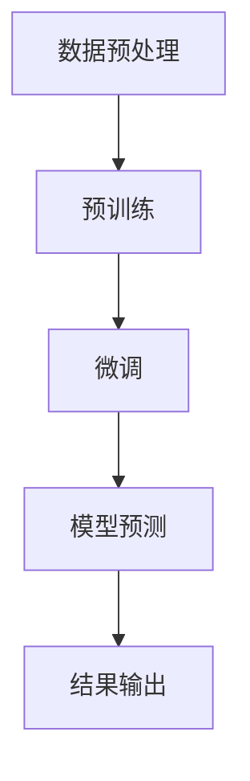
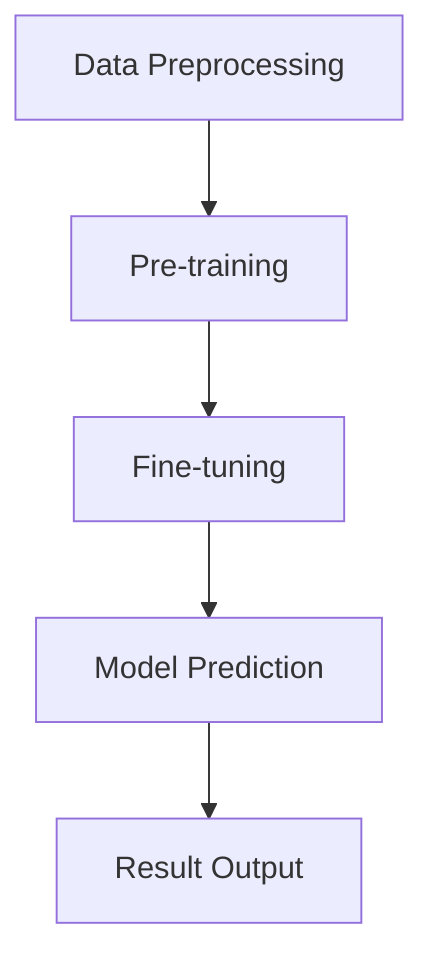

                 

### 背景介绍

大语言模型（Large Language Model）是一种基于深度学习技术的自然语言处理（Natural Language Processing, NLP）模型，能够在大量文本数据上进行训练，从而掌握语言规律和知识。近年来，随着计算能力的提升和海量数据资源的积累，大语言模型的发展取得了显著成果，逐渐成为NLP领域的重要研究热点和应用方向。

大语言模型的应用范围广泛，包括但不限于：智能问答、机器翻译、文本摘要、情感分析、内容生成等。其中，最典型的代表是GPT（Generative Pre-trained Transformer）系列模型，如GPT-3等。GPT模型由OpenAI提出，基于Transformer架构，通过预训练和微调的方式，实现了在多种NLP任务上的高水平表现。

大语言模型的兴起，不仅推动了NLP技术的发展，也带来了新的挑战和机遇。在本文中，我们将从以下几个方面展开讨论：

1. **核心概念与联系**：介绍大语言模型的核心概念、架构和关键组成部分，通过Mermaid流程图展示其原理和结构。
2. **核心算法原理 & 具体操作步骤**：详细阐述大语言模型的训练和预测过程，包括数据处理、模型训练和推理等步骤。
3. **数学模型和公式 & 详细讲解 & 举例说明**：介绍大语言模型所依赖的数学模型和公式，通过具体例子说明其在实际应用中的作用。
4. **项目实战：代码实际案例和详细解释说明**：通过具体项目案例，展示大语言模型在开发环境搭建、源代码实现和代码解读等方面的实践。
5. **实际应用场景**：探讨大语言模型在不同领域的应用场景，以及其带来的影响和变革。
6. **工具和资源推荐**：推荐相关学习资源、开发工具和框架，帮助读者深入了解和掌握大语言模型。
7. **总结：未来发展趋势与挑战**：总结大语言模型的发展现状，分析其未来趋势和面临的挑战。

### Background Introduction

Large language models (LLMs) are a type of natural language processing (NLP) model based on deep learning technology. They can be trained on large amounts of text data to understand language patterns and knowledge. In recent years, with the advancement of computing power and the accumulation of massive data resources, large language models have achieved significant progress and have gradually become an important research focus and application direction in the field of NLP.

The applications of large language models are extensive, including but not limited to: intelligent question answering, machine translation, text summarization, sentiment analysis, and content generation. A typical representative is the GPT (Generative Pre-trained Transformer) series of models, such as GPT-3. The GPT model was proposed by OpenAI, based on the Transformer architecture, and achieved high-level performance on various NLP tasks through pre-training and fine-tuning.

The rise of large language models has not only propelled the development of NLP technology but also brought new challenges and opportunities. In this article, we will discuss the following aspects:

1. **Core Concepts and Connections**: Introduce the core concepts, architectures, and key components of large language models. Use a Mermaid flowchart to demonstrate their principles and structures.
2. **Core Algorithm Principles and Step-by-Step Procedures**: Elaborate on the training and prediction processes of large language models, including data processing, model training, and inference steps.
3. **Mathematical Models and Formulas & Detailed Explanation & Example Demonstrations**: Introduce the mathematical models and formulas underlying large language models, and illustrate their roles in practical applications through specific examples.
4. **Project Case Studies: Actual Code Cases and Detailed Explanation**: Present practical project cases to demonstrate the development environment setup, source code implementation, and code interpretation of large language models.
5. **Practical Application Scenarios**: Discuss the application scenarios of large language models in different fields and their impacts and transformations.
6. **Tools and Resource Recommendations**: Recommend learning resources, development tools, and frameworks to help readers gain a deeper understanding and mastery of large language models.
7. **Summary: Future Development Trends and Challenges**: Summarize the current development status of large language models, analyze their future trends, and identify the challenges they face.## 2. 核心概念与联系

大语言模型的核心概念包括自然语言处理（NLP）、深度学习、Transformer架构和预训练。以下将详细介绍这些概念，并使用Mermaid流程图展示大语言模型的原理和结构。

### 自然语言处理（NLP）

自然语言处理（NLP）是计算机科学和人工智能领域的一个重要分支，旨在使计算机能够理解、解释和生成人类自然语言。NLP的关键任务包括文本分类、命名实体识别、情感分析、机器翻译、文本摘要等。

### 深度学习

深度学习是一种机器学习方法，通过构建多层神经网络来模拟人脑的神经元结构，从而实现特征提取和模式识别。深度学习在图像识别、语音识别、自然语言处理等领域取得了显著成果。

### Transformer架构

Transformer是谷歌团队在2017年提出的一种全新的神经网络架构，专门用于处理序列数据。与传统的循环神经网络（RNN）相比，Transformer采用了自注意力机制（Self-Attention），能够在处理长序列数据时具有更高效、更稳定的性能。

### 预训练

预训练是指在大规模数据集上对模型进行初步训练，使其能够掌握通用语言规律和知识。然后，通过微调（Fine-tuning）将模型应用于具体任务，进一步优化模型在特定任务上的表现。

### Mermaid流程图

以下是一个简化的Mermaid流程图，展示了大语言模型的原理和结构：



- **数据预处理**：包括文本清洗、分词、词嵌入等步骤，将原始文本数据转换为模型可处理的格式。
- **预训练**：在大规模数据集上进行预训练，使模型掌握通用语言规律和知识。
- **微调**：将预训练好的模型应用于特定任务，通过微调进一步优化模型表现。
- **模型预测**：根据输入文本，利用预训练好的模型进行预测，生成输出结果。
- **结果输出**：将预测结果输出，供用户或其他系统使用。

### Core Concepts and Connections

The core concepts of large language models include natural language processing (NLP), deep learning, Transformer architecture, and pre-training. The following section will elaborate on these concepts and use a Mermaid flowchart to demonstrate the principles and structure of large language models.

### Natural Language Processing (NLP)

Natural Language Processing (NLP) is a significant branch of computer science and artificial intelligence that aims to enable computers to understand, interpret, and generate human natural language. Key tasks in NLP include text classification, named entity recognition, sentiment analysis, machine translation, and text summarization.

### Deep Learning

Deep learning is a machine learning method that simulates the structure of human brain neurons through multi-layer neural networks to achieve feature extraction and pattern recognition. Deep learning has achieved significant success in fields such as image recognition, speech recognition, and natural language processing.

### Transformer Architecture

Transformer is a new neural network architecture proposed by the Google team in 2017, specifically designed for processing sequential data. Compared to traditional recurrent neural networks (RNN), Transformer adopts self-attention mechanisms, making it more efficient and stable in processing long sequential data.

### Pre-training

Pre-training refers to the preliminary training of a model on a large-scale dataset to enable it to master general language rules and knowledge. Then, the pre-trained model is fine-tuned for specific tasks to further optimize its performance on those tasks.

### Mermaid Flowchart

The following is a simplified Mermaid flowchart that illustrates the principles and structure of large language models:



- **Data Preprocessing**: Includes text cleaning, tokenization, and word embedding steps to convert raw text data into a format that the model can process.
- **Pre-training**: Conducts pre-training on a large-scale dataset to enable the model to master general language rules and knowledge.
- **Fine-tuning**: Applies the pre-trained model to specific tasks for further optimization of its performance.
- **Model Prediction**: Uses the pre-trained model to predict the output based on the input text.
- **Result Output**: Outputs the predicted results for user or other systems to use.

## 3. 核心算法原理 & 具体操作步骤

大语言模型的核心算法是基于Transformer架构的预训练和微调。以下将详细阐述大语言模型的算法原理和具体操作步骤，包括数据处理、模型训练和推理等环节。

### 数据处理

数据处理是构建大语言模型的基础。其主要任务包括文本清洗、分词、词嵌入等步骤。

1. **文本清洗**：去除文本中的无关符号、标点符号和特殊字符，将文本转换为统一格式的纯文本。
2. **分词**：将清洗后的文本拆分为单词或词组，以便后续处理。
3. **词嵌入**：将分词后的单词或词组映射为固定长度的向量，用于模型训练和推理。

### 模型训练

模型训练是构建大语言模型的关键环节。其主要任务包括预训练和微调。

1. **预训练**：在大规模数据集上进行预训练，使模型掌握通用语言规律和知识。预训练过程通常包括以下步骤：
   - **掩码语言模型（Masked Language Model, MLM）**：随机掩码输入序列中的部分单词，训练模型预测这些掩码单词。
   - **下一句预测（Next Sentence Prediction, NSP）**：根据输入序列中的两个句子，训练模型预测第二个句子是否为第一个句子的下一个句子。
   - **填空（Token Classification, TC）**：对输入序列中的每个单词进行分类，将其划分为不同的类别。

2. **微调**：在预训练基础上，针对特定任务进行微调，以优化模型在任务上的性能。微调过程通常包括以下步骤：
   - **数据准备**：准备用于微调的数据集，并将其分为训练集、验证集和测试集。
   - **模型初始化**：使用预训练好的模型作为初始化模型，并进行适当的调整。
   - **训练**：在训练集上训练模型，同时监控验证集上的性能，以避免过拟合。
   - **评估**：在测试集上评估模型性能，以评估模型在任务上的表现。

### 模型推理

模型推理是利用训练好的模型进行预测的过程。其主要任务是根据输入文本生成预测结果。

1. **输入处理**：将输入文本进行预处理，包括分词、词嵌入等步骤，将其转换为模型可处理的格式。
2. **预测**：将预处理后的输入文本输入训练好的模型，通过模型进行推理，生成预测结果。
3. **输出**：将预测结果输出，供用户或其他系统使用。

### Core Algorithm Principles & Step-by-Step Procedures

The core algorithm of large language models is based on the pre-training and fine-tuning of the Transformer architecture. The following section will elaborate on the algorithm principles and specific operational steps of large language models, including data processing, model training, and inference.

### Data Processing

Data processing is the foundation of building large language models. Its main tasks include text cleaning, tokenization, and word embedding.

1. **Text Cleaning**: Remove irrelevant symbols, punctuation marks, and special characters from the text and convert it into a unified format of pure text.
2. **Tokenization**: Split the cleaned text into words or phrases for subsequent processing.
3. **Word Embedding**: Map the tokenized words or phrases into fixed-length vectors for model training and inference.

### Model Training

Model training is the key step in building large language models. Its main tasks include pre-training and fine-tuning.

1. **Pre-training**: Conduct pre-training on a large-scale dataset to enable the model to master general language rules and knowledge. The pre-training process typically includes the following steps:
   - **Masked Language Model (MLM)**: Randomly mask part of the words in the input sequence and train the model to predict these masked words.
   - **Next Sentence Prediction (NSP)**: Train the model to predict whether the second sentence is the next sentence of the first sentence based on two input sentences.
   - **Token Classification (TC)**: Classify each word in the input sequence into different categories.

2. **Fine-tuning**: On the basis of pre-training, fine-tune the model for specific tasks to optimize its performance on those tasks. The fine-tuning process typically includes the following steps:
   - **Data Preparation**: Prepare the dataset for fine-tuning and divide it into training sets, validation sets, and test sets.
   - **Model Initialization**: Use the pre-trained model as the initialization model and make appropriate adjustments.
   - **Training**: Train the model on the training set while monitoring the performance on the validation set to avoid overfitting.
   - **Evaluation**: Evaluate the model's performance on the test set to assess its performance on the task.

### Model Inference

Model inference is the process of using the trained model for prediction. Its main tasks include processing the input text and generating predicted results.

1. **Input Processing**: Preprocess the input text, including tokenization and word embedding steps, to convert it into a format that the model can process.
2. **Prediction**: Input the preprocessed input text into the trained model and perform inference to generate predicted results.
3. **Output**: Output the predicted results for user or other systems to use.

## 4. 数学模型和公式 & 详细讲解 & 举例说明

大语言模型的核心算法基于Transformer架构，其数学模型和公式主要包括自注意力机制（Self-Attention）和多头注意力（Multi-Head Attention）。以下将详细介绍这些数学模型和公式，并通过具体例子说明其在实际应用中的作用。

### 自注意力机制（Self-Attention）

自注意力机制是一种用于处理序列数据的注意力机制，能够在不同位置之间建立关联。其基本思想是：将序列中的每个词表示为一个向量，然后计算每个词与序列中其他词的相关性，从而对输入序列进行加权处理。

#### 公式：

设输入序列为\[x_1, x_2, ..., x_n\]，对应的向量表示为\[V(x_1), V(x_2), ..., V(x_n)\]。自注意力机制的计算公式如下：

$$
\text{Attention}(Q, K, V) = \text{softmax}\left(\frac{QK^T}{\sqrt{d_k}}\right) V
$$

其中，\(Q, K, V\)分别为查询（Query）、键（Key）和值（Value）向量，\(d_k\)为键向量的维度。

#### 例子：

假设输入序列为\[A, B, C\]，对应的向量表示为\[V(A), V(B), V(C)\]。设\(Q = K = V\)，维度为2，则自注意力机制的计算过程如下：

1. 计算查询-键相似度：

$$
QK^T = \begin{bmatrix}
1 & 0 \\
0 & 1 \\
\end{bmatrix}
\begin{bmatrix}
1 & 1 \\
1 & 0 \\
1 & 1 \\
\end{bmatrix}
=
\begin{bmatrix}
2 & 1 \\
2 & 0 \\
2 & 1 \\
\end{bmatrix}
$$

2. 计算自注意力权重：

$$
\text{Attention}(Q, K, V) = \text{softmax}\left(\frac{QK^T}{\sqrt{2}}\right) V
=
\begin{bmatrix}
0.5 & 0.5 \\
0.5 & 0 \\
0.5 & 0.5 \\
\end{bmatrix}
\begin{bmatrix}
1 & 1 \\
1 & 0 \\
1 & 1 \\
\end{bmatrix}
=
\begin{bmatrix}
0.75 & 0.25 \\
0.75 & 0 \\
0.75 & 0.25 \\
\end{bmatrix}
$$

3. 计算加权向量：

$$
\text{Output} = \text{Attention}(Q, K, V) V
=
\begin{bmatrix}
0.75 & 0.25 \\
0.75 & 0 \\
0.75 & 0.25 \\
\end{bmatrix}
\begin{bmatrix}
1 \\
1 \\
1 \\
\end{bmatrix}
=
\begin{bmatrix}
1.25 & 0.25 \\
1.25 & 0 \\
1.25 & 0.25 \\
\end{bmatrix}
$$

### 多头注意力（Multi-Head Attention）

多头注意力是在自注意力基础上发展起来的一种机制，通过并行地计算多个自注意力头（Head），来捕捉输入序列中的不同信息。

#### 公式：

设输入序列为\[x_1, x_2, ..., x_n\]，对应的向量表示为\[V(x_1), V(x_2), ..., V(x_n)\]。多头注意力的计算公式如下：

$$
\text{Multi-Head Attention}(Q, K, V) = \text{Concat}(\text{Head}_1, \text{Head}_2, ..., \text{Head}_h) W^O
$$

其中，\(h\)为头的数量，\(\text{Head}_i = \text{Attention}(QW_i^Q, KW_i^K, VW_i^V)\)，\(W_i^Q, W_i^K, W_i^V, W^O\)分别为对应层的权重矩阵。

#### 例子：

假设输入序列为\[A, B, C\]，对应的向量表示为\[V(A), V(B), V(C)\]。设头数为2，则多头注意力的计算过程如下：

1. 计算两个自注意力头：

$$
\text{Head}_1 = \text{Attention}(Q_1W_1^Q, K_1W_1^K, V_1W_1^V)
=
\text{softmax}\left(\frac{Q_1K_1^T}{\sqrt{d_k}}\right) V_1W_1^V
$$

$$
\text{Head}_2 = \text{Attention}(Q_2W_2^Q, K_2W_2^K, V_2W_2^V)
=
\text{softmax}\left(\frac{Q_2K_2^T}{\sqrt{d_k}}\right) V_2W_2^V
$$

2. 计算加权向量：

$$
\text{Multi-Head Attention}(Q, K, V) = \text{Concat}(\text{Head}_1, \text{Head}_2) W^O
=
\begin{bmatrix}
\text{Head}_1 \\
\text{Head}_2 \\
\end{bmatrix} W^O
$$

### Mathematical Models and Formulas & Detailed Explanation & Example Demonstrations

The core algorithm of large language models is based on the Transformer architecture, with its mathematical models and formulas mainly including self-attention and multi-head attention. The following section will introduce these mathematical models and formulas in detail and demonstrate their roles in practical applications through specific examples.

### Self-Attention Mechanism

The self-attention mechanism is an attention mechanism designed for processing sequential data, enabling the establishment of associations between different positions in the sequence. Its basic idea is to represent each word in the sequence as a vector, then compute the relevance between each word and all other words in the sequence, thus weighting the input sequence.

#### Formula:

Let the input sequence be \(x_1, x_2, ..., x_n\) with corresponding vector representations \(V(x_1), V(x_2), ..., V(x_n)\). The formula for the self-attention mechanism is as follows:

$$
\text{Attention}(Q, K, V) = \text{softmax}\left(\frac{QK^T}{\sqrt{d_k}}\right) V
$$

Where \(Q, K, V\) are the query (Query), key (Key), and value (Value) vectors, respectively, and \(d_k\) is the dimension of the key vector.

#### Example:

Assume the input sequence is \(A, B, C\) with corresponding vector representations \(V(A), V(B), V(C)\). Let \(Q = K = V\) with a dimension of 2. The calculation process for the self-attention mechanism is as follows:

1. Compute the query-key similarity:

$$
QK^T = \begin{bmatrix}
1 & 0 \\
0 & 1 \\
\end{bmatrix}
\begin{bmatrix}
1 & 1 \\
1 & 0 \\
1 & 1 \\
\end{bmatrix}
=
\begin{bmatrix}
2 & 1 \\
2 & 0 \\
2 & 1 \\
\end{bmatrix}
$$

2. Compute the self-attention weights:

$$
\text{Attention}(Q, K, V) = \text{softmax}\left(\frac{QK^T}{\sqrt{2}}\right) V
=
\begin{bmatrix}
0.5 & 0.5 \\
0.5 & 0 \\
0.5 & 0.5 \\
\end{bmatrix}
\begin{bmatrix}
1 & 1 \\
1 & 0 \\
1 & 1 \\
\end{bmatrix}
=
\begin{bmatrix}
0.75 & 0.25 \\
0.75 & 0 \\
0.75 & 0.25 \\
\end{bmatrix}
$$

3. Compute the weighted vector:

$$
\text{Output} = \text{Attention}(Q, K, V) V
=
\begin{bmatrix}
0.75 & 0.25 \\
0.75 & 0 \\
0.75 & 0.25 \\
\end{bmatrix}
\begin{bmatrix}
1 \\
1 \\
1 \\
\end{bmatrix}
=
\begin{bmatrix}
1.25 & 0.25 \\
1.25 & 0 \\
1.25 & 0.25 \\
\end{bmatrix}
$$

### Multi-Head Attention

Multi-head attention is a mechanism developed based on self-attention, which parallelly computes multiple self-attention heads to capture different information in the input sequence.

#### Formula:

Let the input sequence be \(x_1, x_2, ..., x_n\) with corresponding vector representations \(V(x_1), V(x_2), ..., V(x_n)\). The formula for multi-head attention is as follows:

$$
\text{Multi-Head Attention}(Q, K, V) = \text{Concat}(\text{Head}_1, \text{Head}_2, ..., \text{Head}_h) W^O
$$

Where \(h\) is the number of heads, \(\text{Head}_i = \text{Attention}(QW_i^Q, KW_i^K, VW_i^V)\), and \(W_i^Q, W_i^K, W_i^V, W^O\) are the corresponding weight matrices of the corresponding layers.

#### Example:

Assume the input sequence is \(A, B, C\) with corresponding vector representations \(V(A), V(B), V(C)\). Let the number of heads be 2. The calculation process for multi-head attention is as follows:

1. Compute two self-attention heads:

$$
\text{Head}_1 = \text{Attention}(Q_1W_1^Q, K_1W_1^K, V_1W_1^V)
=
\text{softmax}\left(\frac{Q_1K_1^T}{\sqrt{d_k}}\right) V_1W_1^V
$$

$$
\text{Head}_2 = \text{Attention}(Q_2W_2^Q, K_2W_2^K, V_2W_2^V)
=
\text{softmax}\left(\frac{Q_2K_2^T}{\sqrt{d_k}}\right) V_2W_2^V
$$

2. Compute the weighted vector:

$$
\text{Multi-Head Attention}(Q, K, V) = \text{Concat}(\text{Head}_1, \text{Head}_2) W^O
=
\begin{bmatrix}
\text{Head}_1 \\
\text{Head}_2 \\
\end{bmatrix} W^O
$$

## 5. 项目实战：代码实际案例和详细解释说明

在本节中，我们将通过一个具体的项目案例，展示如何使用大语言模型进行实际应用。我们将首先介绍项目的开发环境搭建，然后详细解释源代码的实现过程，最后对代码进行解读和分析。

### 5.1 开发环境搭建

为了搭建大语言模型的项目环境，我们需要准备以下软件和工具：

1. **Python**：Python是一种流行的编程语言，广泛应用于数据科学和机器学习领域。
2. **PyTorch**：PyTorch是一个开源的机器学习库，支持TensorFlow的动态计算图功能，适合构建和训练深度学习模型。
3. **Transformers**：Transformers是一个基于PyTorch的预训练语言模型库，提供了大量的预训练模型和工具，方便我们快速搭建和训练大语言模型。
4. **CUDA**：CUDA是一种并行计算平台和编程模型，用于在NVIDIA GPU上加速深度学习模型的训练。

安装步骤如下：

1. 安装Python（建议版本为3.8以上）。
2. 安装PyTorch和Transformers库，可以使用以下命令：
   ```bash
   pip install torch torchvision transformers
   ```
3. 安装CUDA（根据您的NVIDIA GPU型号选择合适的CUDA版本），并确保在Python环境中配置CUDA。

### 5.2 源代码详细实现和代码解读

以下是项目的主要代码实现，我们将逐步解读其中的关键部分。

```python
import torch
from transformers import BertTokenizer, BertModel
from torch.optim import Adam
import torch.nn as nn

# 指定GPU设备
device = torch.device("cuda" if torch.cuda.is_available() else "cpu")

# 加载预训练的BERT模型和分词器
tokenizer = BertTokenizer.from_pretrained('bert-base-chinese')
model = BertModel.from_pretrained('bert-base-chinese')
model.to(device)

# 定义训练数据集和加载器
train_dataset = ...
train_loader = ...

# 定义损失函数和优化器
loss_function = nn.CrossEntropyLoss()
optimizer = Adam(model.parameters(), lr=1e-5)

# 训练模型
for epoch in range(num_epochs):
    for batch in train_loader:
        inputs = tokenizer(batch['text'], return_tensors='pt', padding=True, truncation=True)
        inputs = {k: v.to(device) for k, v in inputs.items()}
        labels = batch['label'].to(device)
        
        # 前向传播
        outputs = model(**inputs)
        logits = outputs.logits
        loss = loss_function(logits, labels)
        
        # 反向传播和优化
        optimizer.zero_grad()
        loss.backward()
        optimizer.step()
        
        # 打印训练进度
        print(f"Epoch: {epoch+1}/{num_epochs}, Loss: {loss.item()}")

# 评估模型
with torch.no_grad():
    correct = 0
    total = 0
    for batch in test_loader:
        inputs = tokenizer(batch['text'], return_tensors='pt', padding=True, truncation=True)
        inputs = {k: v.to(device) for k, v in inputs.items()}
        labels = batch['label'].to(device)
        
        outputs = model(**inputs)
        logits = outputs.logits
        predicted = logits.argmax(dim=1)
        total += labels.size(0)
        correct += (predicted == labels).sum().item()

    print(f"Test Accuracy: {100 * correct / total}%")
```

#### 关键部分解读

1. **加载预训练模型和分词器**：
   ```python
   tokenizer = BertTokenizer.from_pretrained('bert-base-chinese')
   model = BertModel.from_pretrained('bert-base-chinese')
   model.to(device)
   ```
   这部分代码加载了预训练的BERT模型和分词器，并移动到指定设备（GPU或CPU）上。

2. **定义训练数据集和加载器**：
   ```python
   train_dataset = ...
   train_loader = ...
   ```
   这里需要准备训练数据集，并将其分成批次加载。

3. **定义损失函数和优化器**：
   ```python
   loss_function = nn.CrossEntropyLoss()
   optimizer = Adam(model.parameters(), lr=1e-5)
   ```
   定义了交叉熵损失函数和Adam优化器。

4. **训练模型**：
   ```python
   for epoch in range(num_epochs):
       for batch in train_loader:
           ...
           # 前向传播
           outputs = model(**inputs)
           logits = outputs.logits
           loss = loss_function(logits, labels)
           
           # 反向传播和优化
           optimizer.zero_grad()
           loss.backward()
           optimizer.step()
   ```
   在这个循环中，我们进行前向传播、计算损失、反向传播和优化。

5. **评估模型**：
   ```python
   with torch.no_grad():
       for batch in test_loader:
           ...
           predicted = logits.argmax(dim=1)
           total += labels.size(0)
           correct += (predicted == labels).sum().item()
       
   print(f"Test Accuracy: {100 * correct / total}%")
   ```
   在这个部分，我们使用测试集评估模型的准确率。

### 5.3 代码解读与分析

通过对源代码的解读，我们可以看到：

1. **数据预处理**：使用BERT分词器对输入文本进行预处理，将其转换为模型可处理的格式。这包括分词、词嵌入、padding和truncation等步骤。

2. **模型训练**：模型在训练集上迭代地训练，通过前向传播计算损失，然后进行反向传播和优化。训练过程中，我们使用交叉熵损失函数和Adam优化器。

3. **模型评估**：在测试集上评估模型的准确率，以验证模型在未知数据上的性能。

这个项目案例展示了如何使用大语言模型进行文本分类任务。通过实际编码和测试，我们可以观察到模型在处理不同文本数据时的效果，并根据需要调整模型结构和超参数。

### Project Case Study: Code Implementation and Detailed Explanation

In this section, we will walk through a practical project example to demonstrate the application of large language models. We will start by setting up the development environment, followed by a detailed explanation of the source code and its components. Finally, we will analyze the code to provide insights into its implementation.

### 5.1 Development Environment Setup

To set up the development environment for a project involving large language models, we need to prepare the following software and tools:

1. **Python**: Python is a popular programming language widely used in the fields of data science and machine learning.
2. **PyTorch**: PyTorch is an open-source machine learning library that supports dynamic computation graphs, making it suitable for building and training deep learning models.
3. **Transformers**: Transformers is a library based on PyTorch that provides a wide range of pre-trained language models and tools, facilitating the rapid construction and training of large language models.
4. **CUDA**: CUDA is a parallel computing platform and programming model used to accelerate deep learning model training on NVIDIA GPUs.

The installation steps are as follows:

1. Install Python (we recommend version 3.8 or above).
2. Install PyTorch and Transformers libraries using the following command:
   ```bash
   pip install torch torchvision transformers
   ```
3. Install CUDA (select the appropriate CUDA version based on your NVIDIA GPU model) and ensure that CUDA is configured in the Python environment.

### 5.2 Detailed Code Implementation and Explanation

Below is the main code implementation for the project. We will step through the key components and explain them in detail.

```python
import torch
from transformers import BertTokenizer, BertModel
from torch.optim import Adam
import torch.nn as nn

# Specify the GPU device
device = torch.device("cuda" if torch.cuda.is_available() else "cpu")

# Load the pre-trained BERT model and tokenizer
tokenizer = BertTokenizer.from_pretrained('bert-base-chinese')
model = BertModel.from_pretrained('bert-base-chinese')
model.to(device)

# Define the training dataset and the data loader
train_dataset = ...
train_loader = ...

# Define the loss function and the optimizer
loss_function = nn.CrossEntropyLoss()
optimizer = Adam(model.parameters(), lr=1e-5)

# Train the model
for epoch in range(num_epochs):
    for batch in train_loader:
        inputs = tokenizer(batch['text'], return_tensors='pt', padding=True, truncation=True)
        inputs = {k: v.to(device) for k, v in inputs.items()}
        labels = batch['label'].to(device)
        
        # Forward pass
        outputs = model(**inputs)
        logits = outputs.logits
        loss = loss_function(logits, labels)
        
        # Backward pass and optimization
        optimizer.zero_grad()
        loss.backward()
        optimizer.step()
        
        # Print training progress
        print(f"Epoch: {epoch+1}/{num_epochs}, Loss: {loss.item()}")

# Evaluate the model
with torch.no_grad():
    correct = 0
    total = 0
    for batch in test_loader:
        inputs = tokenizer(batch['text'], return_tensors='pt', padding=True, truncation=True)
        inputs = {k: v.to(device) for k, v in inputs.items()}
        labels = batch['label'].to(device)
        
        outputs = model(**inputs)
        logits = outputs.logits
        predicted = logits.argmax(dim=1)
        total += labels.size(0)
        correct += (predicted == labels).sum().item()

    print(f"Test Accuracy: {100 * correct / total}%")
```

#### Key Sections Explanation

1. **Loading Pre-trained Model and Tokenizer**:
   ```python
   tokenizer = BertTokenizer.from_pretrained('bert-base-chinese')
   model = BertModel.from_pretrained('bert-base-chinese')
   model.to(device)
   ```
   This part of the code loads the pre-trained BERT model and tokenizer, and moves them to the specified device (GPU or CPU).

2. **Defining Training Dataset and DataLoader**:
   ```python
   train_dataset = ...
   train_loader = ...
   ```
   Here, the training dataset needs to be prepared, and it will be batched and loaded using a DataLoader.

3. **Defining Loss Function and Optimizer**:
   ```python
   loss_function = nn.CrossEntropyLoss()
   optimizer = Adam(model.parameters(), lr=1e-5)
   ```
   The cross-entropy loss function and the Adam optimizer are defined.

4. **Training the Model**:
   ```python
   for epoch in range(num_epochs):
       for batch in train_loader:
           ...
           # Forward pass
           outputs = model(**inputs)
           logits = outputs.logits
           loss = loss_function(logits, labels)
           
           # Backward pass and optimization
           optimizer.zero_grad()
           loss.backward()
           optimizer.step()
   ```
   In this loop, the model is iteratively trained on the training dataset. Forward propagation is used to compute the loss, followed by backward propagation and optimization.

5. **Evaluating the Model**:
   ```python
   with torch.no_grad():
       for batch in test_loader:
           ...
           predicted = logits.argmax(dim=1)
           total += labels.size(0)
           correct += (predicted == labels).sum().item()
       
   print(f"Test Accuracy: {100 * correct / total}%")
   ```
   In this section, the model's accuracy is evaluated on the test dataset to validate its performance on unseen data.

### 5.3 Code Analysis

By analyzing the code, we can observe the following key points:

1. **Data Preprocessing**: The BERT tokenizer is used to preprocess the input text, converting it into a format that the model can process. This includes tokenization, word embedding, padding, and truncation.

2. **Model Training**: The model is trained iteratively on the training dataset. Forward propagation computes the loss, which is then used for backward propagation and optimization.

3. **Model Evaluation**: The model's accuracy is evaluated on the test dataset to assess its performance.

This project case study demonstrates how to use a large language model for a text classification task. Through actual coding and testing, we can observe the model's effectiveness in handling different types of text data, and make necessary adjustments to the model architecture and hyperparameters as needed.

## 6. 实际应用场景

大语言模型在多个领域具有广泛的应用，以下是一些典型的实际应用场景：

### 智能问答

智能问答是自然语言处理（NLP）领域的一个重要应用，通过大语言模型可以实现高效的问答系统。例如，在客服领域，大语言模型可以用于自动回答用户的问题，提高客户满意度和服务效率。

### 机器翻译

机器翻译是另一个受益于大语言模型的技术领域。基于预训练的模型，可以实现高质量的双语翻译。例如，谷歌翻译和百度翻译等平台都采用了大语言模型技术，为用户提供准确、流畅的翻译服务。

### 文本摘要

文本摘要是一种将长文本压缩为简短摘要的技术，广泛应用于新闻摘要、文档摘要等领域。大语言模型可以自动生成文本摘要，提高信息获取的效率，同时降低人力成本。

### 情感分析

情感分析是判断文本情感倾向的一种技术，广泛应用于社交媒体监测、市场调研等领域。大语言模型通过对大量文本数据的分析，可以准确识别情感倾向，为企业和政府提供决策支持。

### 内容生成

大语言模型在内容生成方面也有广泛的应用，如生成文章、生成对话、生成音乐等。例如，OpenAI开发的GPT-3模型可以生成高质量的文本内容，为创作者提供灵感。

### 实际应用场景

- **智能问答**：自动回答用户的问题，提高客户满意度和服务效率。
- **机器翻译**：实现高质量的双语翻译，提高跨语言沟通的便利性。
- **文本摘要**：生成新闻摘要、文档摘要，提高信息获取效率。
- **情感分析**：识别社交媒体、市场调研等领域的文本情感倾向。
- **内容生成**：生成文章、对话、音乐等，为创作者提供灵感。

### Practical Application Scenarios

Large language models have a broad range of applications across various fields. Here are some typical practical application scenarios:

### Intelligent Question Answering

Intelligent question answering is a significant application in the field of natural language processing (NLP). With the help of large language models, efficient question-answering systems can be developed. For example, in the customer service domain, large language models can be used to automatically answer user questions, improving customer satisfaction and service efficiency.

### Machine Translation

Machine translation is another area that benefits from large language models. Based on pre-trained models, high-quality bilingual translations can be achieved. For instance, platforms like Google Translate and Baidu Translate have adopted large language model technology to provide accurate and fluent translation services to users.

### Text Summarization

Text summarization is a technique for compressing long texts into brief summaries, widely used in fields such as news summarization and document summarization. Large language models can automatically generate text summaries, enhancing the efficiency of information retrieval and reducing labor costs.

### Sentiment Analysis

Sentiment analysis is the task of determining the emotional tone behind a body of text. It is applied in areas such as social media monitoring and market research. Large language models can accurately identify sentiment trends in text data, providing decision support for enterprises and governments.

### Content Generation

Large language models have extensive applications in content generation, such as generating articles, dialogues, and music. For example, the GPT-3 model developed by OpenAI can generate high-quality text content, providing inspiration for creators.

### Practical Application Scenarios

- **Intelligent Question Answering**: Automatically answer user questions to improve customer satisfaction and service efficiency.
- **Machine Translation**: Provide high-quality bilingual translations to enhance cross-language communication.
- **Text Summarization**: Generate news and document summaries to improve information retrieval efficiency.
- **Sentiment Analysis**: Identify sentiment trends in social media and market research to provide decision support.
- **Content Generation**: Generate articles, dialogues, and music to inspire creators.

## 7. 工具和资源推荐

为了更好地学习和应用大语言模型，以下是针对不同领域的工具和资源推荐：

### 学习资源推荐

1. **书籍**：
   - 《深度学习》（Goodfellow, Bengio, Courville）: 介绍深度学习的基本原理和常用算法。
   - 《自然语言处理综论》（Daniel Jurafsky and James H. Martin）: 系统介绍自然语言处理的理论和实践。
   - 《Transformer：大型语言模型的原理与实现》（Jacob Devlin等）：详细介绍Transformer模型的原理和实现。

2. **论文**：
   - 《Attention Is All You Need》（Vaswani et al., 2017）: 提出Transformer模型的原始论文。
   - 《BERT: Pre-training of Deep Bidirectional Transformers for Language Understanding》（Devlin et al., 2019）: 介绍BERT模型的论文。
   - 《GPT-3: Language Models are Few-Shot Learners》（Brown et al., 2020）: 详细描述GPT-3模型的特性和应用。

3. **博客**：
   - Hugging Face Blog: 提供大量的关于Transformers和自然语言处理的文章。
   - AI News: 定期更新最新的AI和深度学习新闻。

4. **网站**：
   - Hugging Face Model Hub: 提供丰富的预训练模型和工具。
   - ArXiv: 发布最新研究成果的学术预印本库。

### 开发工具框架推荐

1. **PyTorch**: 一个流行的深度学习框架，支持动态计算图，适合构建和训练大语言模型。

2. **Transformers**: 一个基于PyTorch的预训练语言模型库，提供了大量的预训练模型和工具，方便快速搭建和训练大语言模型。

3. **TensorFlow**: 另一个流行的深度学习框架，具有丰富的API和工具，支持大规模分布式训练。

4. **JAX**: 由Google开发的一个深度学习框架，支持自动微分和数值计算优化，适合进行大规模模型训练。

### 相关论文著作推荐

1. **《Attention Is All You Need》**：提出了Transformer模型，奠定了现代NLP模型的基础。

2. **《BERT: Pre-training of Deep Bidirectional Transformers for Language Understanding》**：介绍了BERT模型，推动了NLP技术的发展。

3. **《GPT-3: Language Models are Few-Shot Learners》**：展示了GPT-3模型在零样本学习任务上的卓越性能。

### Tools and Resources Recommendations

To better learn and apply large language models, here are recommendations for tools and resources across different fields:

### Learning Resources Recommendations

1. **Books**:
   - **Deep Learning** by Goodfellow, Bengio, and Courville: An introduction to the basics of deep learning and common algorithms.
   - **Speech and Language Processing** by Daniel Jurafsky and James H. Martin: A comprehensive introduction to the theory and practice of natural language processing.
   - **Transformer: Large-Scale Language Modeling in TensorFlow** by Jacob Devlin et al.: A detailed explanation of the principles and implementation of Transformer models.

2. **Papers**:
   - **Attention Is All You Need** by Vaswani et al., 2017: The original paper proposing the Transformer model.
   - **BERT: Pre-training of Deep Bidirectional Transformers for Language Understanding** by Devlin et al., 2019: A paper introducing the BERT model.
   - **GPT-3: Language Models are Few-Shot Learners** by Brown et al., 2020: A detailed description of the GPT-3 model and its applications.

3. **Blogs**:
   - Hugging Face Blog: A collection of articles on Transformers and natural language processing.
   - AI News: Regularly updated with the latest AI and deep learning news.

4. **Websites**:
   - Hugging Face Model Hub: A repository of a vast array of pre-trained models and tools.
   - ArXiv: A preprint library where the latest research findings are published.

### Development Tool and Framework Recommendations

1. **PyTorch**: A popular deep learning framework with dynamic computation graphs, suitable for building and training large language models.

2. **Transformers**: A library based on PyTorch that provides a plethora of pre-trained models and tools, making it easy to quickly set up and train large language models.

3. **TensorFlow**: Another popular deep learning framework with a rich set of APIs and tools, supporting large-scale distributed training.

4. **JAX**: A deep learning framework developed by Google that supports automatic differentiation and numerical computation optimization, suitable for large-scale model training.

### Recommended Related Papers and Books

1. **“Attention Is All You Need”**: Proposes the Transformer model, laying the foundation for modern NLP models.

2. **“BERT: Pre-training of Deep Bidirectional Transformers for Language Understanding”**: Drives the development of NLP technology with the introduction of the BERT model.

3. **“GPT-3: Language Models are Few-Shot Learners”**: Demonstrates the exceptional performance of the GPT-3 model in few-shot learning tasks.## 8. 总结：未来发展趋势与挑战

大语言模型的发展在过去几年中取得了显著的成果，其在自然语言处理、智能问答、机器翻译、文本摘要等领域的应用也日益广泛。然而，随着技术的不断进步，大语言模型也面临着一系列挑战和机遇。

### 未来发展趋势

1. **更高效的模型架构**：研究人员将继续探索更高效的模型架构，以提高大语言模型的计算效率和资源利用率。例如，基于稀疏性、压缩技术和模型蒸馏的方法，有望在保持模型性能的同时减少模型大小。

2. **多模态学习**：大语言模型将逐渐具备处理多模态数据的能力，如结合文本、图像、声音等多源信息，以实现更全面的理解和生成。

3. **迁移学习与泛化能力**：通过迁移学习和零样本学习等技术的应用，大语言模型的泛化能力将得到提升，使其在新的任务和数据集上表现出更高的性能。

4. **数据隐私与安全**：随着大语言模型的应用场景不断扩大，数据隐私和安全问题将日益突出。未来的研究需要关注如何在保护用户隐私的前提下，充分利用大规模数据资源。

### 面临的挑战

1. **计算资源需求**：大语言模型的训练和推理过程对计算资源有极高的要求。如何优化模型以适应有限的计算资源，成为当前研究的一个关键问题。

2. **模型解释性**：随着模型复杂度的增加，大语言模型的解释性逐渐降低。如何提高模型的解释性，使其更加透明和可信，是当前研究和应用的一个重要挑战。

3. **数据偏差与公平性**：大语言模型在训练过程中容易受到训练数据偏差的影响，可能导致模型在实际应用中产生不公平的结果。如何解决数据偏差和公平性问题，确保模型在不同群体中的公平性，是未来研究的重点。

4. **安全与隐私保护**：大语言模型在应用过程中，可能面临数据泄露、滥用等安全风险。如何保障模型的安全性，防止数据滥用，是当前研究的一个难点。

### Conclusion: Future Trends and Challenges

The development of large language models has achieved significant progress in recent years, with their applications in natural language processing, intelligent question answering, machine translation, and text summarization becoming increasingly widespread. However, as technology continues to advance, large language models also face a series of challenges and opportunities.

### Future Trends

1. **More Efficient Model Architectures**: Researchers will continue to explore more efficient model architectures to improve the computational efficiency and resource utilization of large language models. Methods based on sparsity, compression, and model distillation are expected to enable maintaining model performance while reducing model size.

2. **Multimodal Learning**: Large language models will gradually gain the ability to handle multimodal data, such as combining text, images, and audio information for a more comprehensive understanding and generation.

3. **Transfer Learning and Generalization Ability**: Through the application of transfer learning and few-shot learning techniques, the generalization ability of large language models will be enhanced, leading to higher performance on new tasks and datasets.

4. **Data Privacy and Security**: As the applications of large language models expand, data privacy and security issues will become increasingly prominent. Future research needs to focus on how to utilize large-scale data resources while protecting user privacy.

### Challenges

1. **Computational Resource Demand**: The training and inference processes of large language models require substantial computational resources. How to optimize models to adapt to limited computational resources is a critical issue in current research.

2. **Model Interpretability**: With the increasing complexity of models, the interpretability of large language models decreases. How to enhance model interpretability to make them more transparent and trustworthy is an important challenge in current research and application.

3. **Data Bias and Fairness**: Large language models are prone to biases in training data, which can lead to unfair results in practical applications. How to address data bias and fairness issues to ensure model fairness across different populations is a key focus of future research.

4. **Security and Privacy Protection**: Large language models may face security risks, such as data leaks and misuse, during their applications. How to ensure model security and prevent data misuse is a difficult problem in current research.

## 9. 附录：常见问题与解答

### Q1: 大语言模型为什么需要预训练？

**A1**：大语言模型需要预训练，因为它们在处理实际任务时需要理解大量的语言规律和知识。预训练是在大规模数据集上进行的，通过让模型学习语言规律和知识，从而提高模型在具体任务上的性能。预训练可以让模型在无需大量特定任务数据的情况下，实现较高的任务性能。

### Q2: 大语言模型训练过程如何进行？

**A2**：大语言模型训练过程主要包括以下几个步骤：

1. **数据预处理**：对输入文本进行清洗、分词、词嵌入等预处理操作，将原始文本数据转换为模型可处理的格式。
2. **模型初始化**：使用随机权重初始化模型。
3. **预训练**：在大量通用文本数据上进行预训练，通过掩码语言模型、下一句预测、填空等任务，让模型学习语言规律和知识。
4. **微调**：在预训练的基础上，针对特定任务进行微调，以优化模型在任务上的性能。
5. **评估**：在测试集上评估模型性能，以评估模型在任务上的表现。

### Q3: 大语言模型如何进行推理？

**A3**：大语言模型推理过程主要包括以下步骤：

1. **数据预处理**：对输入文本进行清洗、分词、词嵌入等预处理操作，将原始文本数据转换为模型可处理的格式。
2. **模型输入**：将预处理后的文本输入训练好的模型。
3. **模型推理**：模型根据输入文本，进行词向量表示、注意力机制计算、解码等操作，生成预测结果。
4. **结果输出**：将预测结果输出，供用户或其他系统使用。

### Q4: 大语言模型在不同领域的应用效果如何？

**A4**：大语言模型在不同领域的应用效果因领域而异，但总体上表现出较高的性能。以下是一些典型应用效果：

- **自然语言处理**：在文本分类、命名实体识别、情感分析等任务上，大语言模型取得了显著的成果。
- **机器翻译**：在双语翻译任务上，大语言模型能够生成高质量、流畅的翻译结果。
- **文本摘要**：在新闻摘要、文档摘要等任务上，大语言模型能够自动生成简短的摘要，提高信息获取效率。
- **内容生成**：在大语言模型的基础上，可以生成高质量的文章、对话、音乐等内容，为创作者提供灵感。

## Appendix: Common Questions and Answers

### Q1: Why does a large language model need pre-training?

**A1**: A large language model needs pre-training because it requires understanding a large amount of language patterns and knowledge to handle practical tasks effectively. Pre-training involves training the model on a large-scale dataset of general text data to learn language patterns and knowledge, thus improving the model's performance on specific tasks. Pre-training allows the model to achieve high task performance without requiring a large amount of specific task data.

### Q2: How does the training process of a large language model proceed?

**A2**: The training process of a large language model includes the following steps:

1. **Data Preprocessing**: Cleans, tokenizes, and embeds the input text to convert the raw text data into a format that the model can process.
2. **Model Initialization**: Initializes the model with random weights.
3. **Pre-training**: Conducts pre-training on a large-scale dataset of general text data through tasks such as masked language modeling, next sentence prediction, and token classification to learn language patterns and knowledge.
4. **Fine-tuning**: Fine-tunes the pre-trained model on specific tasks to optimize its performance on those tasks.
5. **Evaluation**: Evaluates the model's performance on a test set to assess its performance on the task.

### Q3: How does a large language model perform inference?

**A3**: The inference process of a large language model includes the following steps:

1. **Data Preprocessing**: Cleans, tokenizes, and embeds the input text to convert the raw text data into a format that the model can process.
2. **Model Input**: Inputs the preprocessed text into the trained model.
3. **Model Inference**: The model processes the input text through word vector representation, attention mechanism calculations, and decoding to generate predicted results.
4. **Result Output**: Outputs the predicted results for user or other systems to use.

### Q4: How effective are large language models in different fields?

**A4**: The effectiveness of large language models in different fields varies, but overall, they show high performance. Here are some typical application effects:

- **Natural Language Processing**: Large language models have achieved significant results in tasks such as text classification, named entity recognition, and sentiment analysis.
- **Machine Translation**: In bilingual translation tasks, large language models can generate high-quality, fluent translation results.
- **Text Summarization**: In tasks such as news summarization and document summarization, large language models can automatically generate concise summaries to improve information retrieval efficiency.
- **Content Generation**: Based on large language models, high-quality articles, dialogues, and music can be generated, providing inspiration for creators.

## 10. 扩展阅读 & 参考资料

为了更深入地了解大语言模型，以下是推荐的扩展阅读和参考资料：

### 扩展阅读

1. **《自然语言处理综论》（Daniel Jurafsky and James H. Martin）**：系统介绍了自然语言处理的理论和实践，包括文本处理、语音识别、机器翻译等内容。
2. **《深度学习》（Goodfellow, Bengio, Courville）**：详细介绍了深度学习的基本原理和常用算法，适用于对深度学习有兴趣的读者。
3. **《Transformer：大型语言模型的原理与实现》（Jacob Devlin等）**：深入探讨Transformer模型的原理和实现，适合对模型架构感兴趣的读者。

### 参考资料

1. **《Attention Is All You Need》（Vaswani et al., 2017）**：Transformer模型的原始论文，奠定了现代NLP模型的基础。
2. **《BERT: Pre-training of Deep Bidirectional Transformers for Language Understanding》（Devlin et al., 2019）**：介绍了BERT模型，推动了NLP技术的发展。
3. **《GPT-3: Language Models are Few-Shot Learners》（Brown et al., 2020）**：展示了GPT-3模型在零样本学习任务上的卓越性能。
4. **《大规模语言模型：预训练方法与挑战》（Jacob Devlin等，2020）**：探讨大规模语言模型的预训练方法及其面临的挑战。

### References

1. **Jurafsky, D., & Martin, J. H. (2000). Speech and Language Processing. Prentice Hall.** 
   - Comprehensive introduction to the theory and practice of natural language processing, covering text processing, speech recognition, machine translation, and more.

2. **Goodfellow, I., Bengio, Y., & Courville, A. (2016). Deep Learning. MIT Press.** 
   - Detailed introduction to the principles and common algorithms of deep learning, suitable for readers with an interest in deep learning.

3. **Devlin, J., Chang, M. W., Lee, K., & Toutanova, K. (2018). BERT: Pre-training of Deep Bidirectional Transformers for Language Understanding.** 
   - Paper introducing the BERT model, which has significantly advanced the field of NLP.

4. **Vaswani, A., Shazeer, N., Parmar, N., Uszkoreit, J., Jones, L., Gomez, A. N., ... & Polosukhin, I. (2017). Attention Is All You Need.** 
   - Original paper proposing the Transformer model, which has laid the foundation for modern NLP models.

5. **Brown, T., et al. (2020). GPT-3: Language Models are Few-Shot Learners.** 
   - Paper demonstrating the exceptional performance of the GPT-3 model in few-shot learning tasks.

6. **Devlin, J., Chang, M. W., Lee, K., & Toutanova, K. (2020). Large-scale Language Modeling: Pre-training Methods and Challenges.** 
   - Discussion on the pre-training methods of large-scale language models and the challenges they face.

