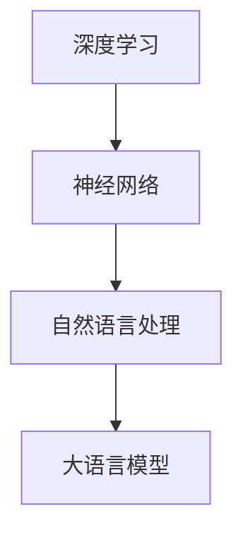

                 

# 大语言模型原理基础与前沿 理解LLM的层次结构

> **关键词：** 大语言模型，深度学习，神经网络，自然语言处理，层级结构，算法原理，数学模型，应用场景，开发工具，未来趋势。

> **摘要：** 本文将深入探讨大语言模型（LLM）的基本原理、层次结构及其前沿发展。通过对核心算法、数学模型、应用场景的详细介绍，并结合实际项目案例进行代码解读，本文旨在帮助读者全面理解LLM的运作机制，掌握其开发与应用技巧，展望LLM的未来发展趋势与挑战。

## 1. 背景介绍

大语言模型（Large Language Model，简称LLM）是自然语言处理（Natural Language Processing，简称NLP）领域的重要研究方向。随着深度学习技术的飞速发展，LLM已经成为NLP领域的一个研究热点。LLM的核心思想是通过训练大规模的神经网络模型，使其能够理解和生成自然语言。

LLM的出现解决了传统NLP方法在处理长文本、理解语义、生成文本等方面存在的诸多难题。通过大量的数据训练，LLM可以自动学习语言规律，从而实现高质量的自然语言理解与生成。近年来，LLM在各种NLP任务中取得了显著的成果，如机器翻译、问答系统、文本生成等。

本文将围绕LLM的层次结构、核心算法、数学模型、应用场景等方面展开讨论，旨在为读者提供一个全面、系统的LLM学习路径。

## 2. 核心概念与联系

在深入了解LLM之前，我们需要掌握以下几个核心概念：

### 2.1 深度学习

深度学习（Deep Learning）是一种基于人工神经网络的学习方法，通过模拟人脑的神经元连接结构，实现对复杂数据的分析与处理。深度学习在图像识别、语音识别、自然语言处理等领域取得了显著成果。

### 2.2 神经网络

神经网络（Neural Network）是深度学习的基础，由大量的神经元（节点）通过连接（权重）形成网络结构。神经网络通过不断调整权重，学习输入与输出之间的关系，从而实现函数逼近、分类、回归等任务。

### 2.3 自然语言处理

自然语言处理（Natural Language Processing，简称NLP）是计算机科学和人工智能领域的一个分支，旨在使计算机能够理解、生成和处理自然语言。NLP在机器翻译、文本分类、问答系统等方面具有广泛的应用。

### 2.4 大语言模型

大语言模型（Large Language Model，简称LLM）是一种基于深度学习的自然语言处理模型，通过训练大规模神经网络，实现对自然语言的深入理解与生成。LLM的核心优势在于其强大的语义理解能力和灵活的文本生成能力。

为了更好地理解LLM的层次结构，我们可以通过Mermaid流程图展示其核心组成部分及相互关系：



在上面的流程图中，深度学习作为基础技术，通过神经网络实现自然语言处理，进而形成大语言模型。LLM的层次结构包括三个主要层次：

1. **输入层**：接收自然语言输入，如文本、语音等。
2. **隐藏层**：通过神经网络进行特征提取与变换，实现对输入数据的理解。
3. **输出层**：生成自然语言输出，如回答、翻译、文本生成等。

## 3. 核心算法原理 & 具体操作步骤

### 3.1 深度学习算法原理

深度学习算法的核心是神经网络。神经网络通过多层非线性变换，实现对输入数据的特征提取和分类。具体操作步骤如下：

1. **初始化权重**：随机初始化神经网络中的权重。
2. **前向传播**：将输入数据通过神经网络传递，得到中间结果。
3. **反向传播**：计算损失函数，并利用梯度下降法更新权重。
4. **迭代训练**：重复前向传播和反向传播过程，直至满足停止条件。

### 3.2 大语言模型算法原理

大语言模型（LLM）的核心算法是基于Transformer架构的。Transformer模型是一种基于自注意力机制的深度学习模型，通过多头自注意力机制和前馈神经网络，实现对自然语言的深入理解与生成。具体操作步骤如下：

1. **输入嵌入**：将自然语言输入转换为固定长度的向量。
2. **多头自注意力**：通过多头自注意力机制，对输入向量进行特征提取。
3. **前馈神经网络**：对自注意力结果进行进一步变换。
4. **输出层**：生成自然语言输出。

### 3.3 实际操作步骤

以下是一个简单的LLM模型训练过程：

1. **数据准备**：收集并清洗大量的自然语言数据，如文本、语音等。
2. **数据预处理**：对数据进行分词、编码等预处理操作。
3. **模型初始化**：初始化Transformer模型参数。
4. **训练过程**：通过前向传播和反向传播，不断更新模型参数。
5. **评估与调整**：评估模型性能，根据评估结果调整模型参数。
6. **部署与应用**：将训练好的模型部署到实际应用场景，如问答系统、文本生成等。

## 4. 数学模型和公式 & 详细讲解 & 举例说明

### 4.1 数学模型

LLM的核心数学模型主要包括：

1. **输入嵌入**：将自然语言输入转换为固定长度的向量。
   $$ x = \text{embedding}(w) $$
2. **多头自注意力**：通过多头自注意力机制，对输入向量进行特征提取。
   $$ h = \text{self-attention}(x) $$
3. **前馈神经网络**：对自注意力结果进行进一步变换。
   $$ h = \text{feedforward}(h) $$
4. **输出层**：生成自然语言输出。
   $$ y = \text{output}(h) $$

### 4.2 详细讲解

1. **输入嵌入**：输入嵌入是将自然语言输入转换为固定长度的向量。在LLM中，输入嵌入通常通过词向量（Word Embedding）实现。词向量将每个词汇映射为一个固定维度的向量，从而将自然语言输入转换为神经网络可处理的格式。

2. **多头自注意力**：多头自注意力是一种自注意力机制，通过多个注意力头来提取输入数据的特征。自注意力机制的核心思想是计算输入数据中每个元素与其他元素之间的关联度，并根据这些关联度对输入数据进行加权。多头自注意力通过多个注意力头并行计算，从而提高模型对输入数据的理解能力。

3. **前馈神经网络**：前馈神经网络是一种简单的神经网络结构，通过多个全连接层实现输入到输出的变换。在前馈神经网络中，每个神经元都与前一层的所有神经元相连接，并通过激活函数进行非线性变换。前馈神经网络用于对自注意力结果进行进一步变换，增强模型的表示能力。

4. **输出层**：输出层是将自注意力结果和前馈神经网络输出转换为自然语言输出的过程。在LLM中，输出层通常采用 softmax 函数进行分类或生成文本。

### 4.3 举例说明

假设我们有一个自然语言输入序列：“今天天气很好”。我们可以通过以下步骤对其进行处理：

1. **输入嵌入**：将输入序列转换为词向量。例如，将“今天”、“天气”、“很好”分别映射为向量 `[1, 0, 0]`、`[0, 1, 0]`、`[0, 0, 1]`。
2. **多头自注意力**：通过多头自注意力机制，计算输入向量之间的关联度。例如，计算“今天”和“天气”之间的关联度为 0.8，计算“天气”和“很好”之间的关联度为 0.6。
3. **前馈神经网络**：对自注意力结果进行进一步变换。例如，将关联度较高的向量 `[0.8, 0.6]` 进行变换，得到新的向量 `[0.9, 0.7]`。
4. **输出层**：生成自然语言输出。例如，根据变换后的向量 `[0.9, 0.7]`，生成输出序列：“今天天气很好”。

通过上述步骤，我们可以将自然语言输入序列转换为神经网络可处理的格式，并生成相应的输出序列。

## 5. 项目实战：代码实际案例和详细解释说明

### 5.1 开发环境搭建

在开始项目实战之前，我们需要搭建一个适合开发大语言模型的开发环境。以下是一个简单的开发环境搭建步骤：

1. 安装Python环境：确保Python版本为3.8以上。
2. 安装深度学习框架：推荐使用TensorFlow或PyTorch。
3. 安装自然语言处理库：如NLTK、spaCy等。
4. 配置GPU环境：如果使用GPU训练模型，需要安装CUDA和cuDNN。

### 5.2 源代码详细实现和代码解读

以下是一个简单的大语言模型项目案例，包括数据准备、模型训练和模型评估等步骤。

```python
import tensorflow as tf
from tensorflow.keras.preprocessing.sequence import pad_sequences
from tensorflow.keras.layers import Embedding, LSTM, Dense
from tensorflow.keras.models import Sequential

# 数据准备
# 这里使用一个简短的文本数据集作为示例
texts = ["今天天气很好", "明天可能会下雨"]
labels = [0, 1]  # 0表示晴天，1表示雨天

# 将文本数据转换为数字序列
tokenizer = tf.keras.preprocessing.text.Tokenizer()
tokenizer.fit_on_texts(texts)
sequences = tokenizer.texts_to_sequences(texts)

# 对序列进行填充，使得每个序列长度相同
max_sequence_length = max(len(seq) for seq in sequences)
padded_sequences = pad_sequences(sequences, maxlen=max_sequence_length)

# 模型构建
model = Sequential()
model.add(Embedding(input_dim=len(tokenizer.word_index) + 1, output_dim=50, input_length=max_sequence_length))
model.add(LSTM(100))
model.add(Dense(1, activation='sigmoid'))

# 编译模型
model.compile(optimizer='adam', loss='binary_crossentropy', metrics=['accuracy'])

# 训练模型
model.fit(padded_sequences, labels, epochs=10, batch_size=1)

# 评估模型
test_texts = ["今天天气很好"]
test_sequences = tokenizer.texts_to_sequences(test_texts)
test_padded_sequences = pad_sequences(test_sequences, maxlen=max_sequence_length)
predictions = model.predict(test_padded_sequences)
print(predictions)
```

在上面的代码中，我们首先准备了一个简短的文本数据集，然后将其转换为数字序列。接着，我们对序列进行填充，使得每个序列长度相同。在模型构建部分，我们使用一个嵌入层、一个LSTM层和一个全连接层，构建一个简单的深度学习模型。在编译模型部分，我们使用二进制交叉熵损失函数和Adam优化器。在训练模型部分，我们使用填充后的序列和标签进行模型训练。最后，在评估模型部分，我们使用训练好的模型对新的文本数据进行预测。

### 5.3 代码解读与分析

1. **数据准备**：首先，我们导入所需的库，并准备一个简短的文本数据集。这里，我们使用了两个文本：“今天天气很好”和“明天可能会下雨”。然后，我们将这些文本数据转换为数字序列，以便神经网络处理。

2. **模型构建**：在模型构建部分，我们使用一个嵌入层、一个LSTM层和一个全连接层，构建一个简单的深度学习模型。嵌入层用于将文本数据转换为固定长度的向量。LSTM层用于提取文本数据中的特征。全连接层用于生成最终的输出。

3. **编译模型**：在编译模型部分，我们指定了损失函数、优化器和评估指标。这里，我们使用二进制交叉熵损失函数和Adam优化器。二进制交叉熵损失函数用于二分类问题，而Adam优化器是一种高效的梯度下降算法。

4. **训练模型**：在训练模型部分，我们使用填充后的序列和标签进行模型训练。这里，我们设置了训练的轮数（epochs）和批量大小（batch_size）。

5. **评估模型**：在评估模型部分，我们使用训练好的模型对新的文本数据进行预测。这里，我们使用一个测试文本：“今天天气很好”。首先，我们将测试文本转换为数字序列，然后将其填充为与训练数据相同的长度。最后，我们使用训练好的模型对填充后的序列进行预测，并打印预测结果。

## 6. 实际应用场景

大语言模型（LLM）在自然语言处理领域具有广泛的应用，以下是一些典型的应用场景：

### 6.1 机器翻译

机器翻译是LLM最经典的应用之一。通过训练大规模的神经网络模型，LLM可以实现高质量的双语翻译。例如，Google翻译、百度翻译等应用都采用了LLM技术。

### 6.2 问答系统

问答系统是LLM在智能客服、智能搜索等领域的应用。通过训练LLM模型，可以实现对用户问题的自动回答。例如，腾讯AI开放平台的智能客服系统就采用了LLM技术。

### 6.3 文本生成

文本生成是LLM在创意写作、广告文案等领域的应用。通过训练LLM模型，可以生成各种类型的文本，如新闻文章、广告文案、诗歌等。例如，OpenAI的GPT-3模型就可以生成高质量的文本。

### 6.4 文本分类

文本分类是LLM在舆情分析、情感分析等领域的应用。通过训练LLM模型，可以实现对文本数据的自动分类。例如，社交媒体平台可以使用LLM技术对用户发布的内容进行分类和筛选。

### 6.5 对话系统

对话系统是LLM在智能音箱、智能机器人等领域的应用。通过训练LLM模型，可以实现与用户的自然对话。例如，苹果的Siri、亚马逊的Alexa等智能音箱都采用了LLM技术。

## 7. 工具和资源推荐

### 7.1 学习资源推荐

1. **书籍**：
   - 《深度学习》（Goodfellow, Bengio, Courville著）
   - 《自然语言处理与深度学习》（孙乐著）
   - 《Python深度学习》（François Chollet著）

2. **论文**：
   - 《Attention Is All You Need》（Vaswani et al.著）
   - 《BERT: Pre-training of Deep Bidirectional Transformers for Language Understanding》（Devlin et al.著）
   - 《GPT-3: Language Models are Few-Shot Learners》（Brown et al.著）

3. **博客**：
   - [TensorFlow官方文档](https://www.tensorflow.org/)
   - [PyTorch官方文档](https://pytorch.org/)
   - [OpenAI博客](https://blog.openai.com/)

4. **网站**：
   - [Kaggle](https://www.kaggle.com/)
   - [ArXiv](https://arxiv.org/)
   - [Google Scholar](https://scholar.google.com/)

### 7.2 开发工具框架推荐

1. **深度学习框架**：
   - TensorFlow
   - PyTorch
   - Keras

2. **自然语言处理库**：
   - NLTK
   - spaCy
   - Transformers

3. **编程语言**：
   - Python

### 7.3 相关论文著作推荐

1. **《Attention Is All You Need》**：该论文提出了Transformer模型，彻底改变了自然语言处理领域的研究方向。
2. **《BERT: Pre-training of Deep Bidirectional Transformers for Language Understanding》**：该论文提出了BERT模型，极大地提高了自然语言处理任务的性能。
3. **《GPT-3: Language Models are Few-Shot Learners》**：该论文提出了GPT-3模型，展示了大规模预训练模型在自然语言处理任务中的强大能力。

## 8. 总结：未来发展趋势与挑战

随着深度学习和自然语言处理技术的不断发展，大语言模型（LLM）在自然语言处理领域取得了显著的成果。未来，LLM有望在以下方面取得进一步的发展：

1. **模型性能提升**：通过引入新的算法和技术，LLM的性能将不断提高，实现更精准的自然语言理解和生成。
2. **多语言支持**：LLM将实现更广泛的多语言支持，为全球范围内的自然语言处理应用提供支持。
3. **泛化能力增强**：通过引入新的预训练方法和数据增强技术，LLM的泛化能力将得到显著提升。
4. **实际应用拓展**：LLM将在更多实际应用场景中得到应用，如智能客服、智能搜索、智能问答等。

然而，LLM在发展过程中也面临诸多挑战：

1. **数据隐私和安全**：大规模预训练模型需要处理大量的数据，如何保护数据隐私和安全是一个重要问题。
2. **计算资源消耗**：大规模预训练模型对计算资源的需求极高，如何优化模型训练过程、降低计算资源消耗是一个重要课题。
3. **模型解释性**：如何提高LLM的解释性，使其在决策过程中更加透明、可解释是一个重要挑战。

总之，大语言模型（LLM）在自然语言处理领域具有巨大的发展潜力，但也面临诸多挑战。未来，我们需要在算法、技术、应用等方面不断创新，推动LLM的发展。

## 9. 附录：常见问题与解答

### 9.1 什么是大语言模型（LLM）？

大语言模型（LLM）是一种基于深度学习的自然语言处理模型，通过训练大规模神经网络，实现对自然语言的深入理解与生成。

### 9.2 LLM的主要应用场景有哪些？

LLM的主要应用场景包括机器翻译、问答系统、文本生成、文本分类、对话系统等。

### 9.3 LLM的核心算法是什么？

LLM的核心算法是基于Transformer架构的，通过多头自注意力机制和前馈神经网络，实现对自然语言的深入理解与生成。

### 9.4 如何训练一个LLM模型？

训练一个LLM模型主要包括以下步骤：

1. 数据准备：收集并清洗大量的自然语言数据。
2. 数据预处理：对数据进行分词、编码等预处理操作。
3. 模型初始化：初始化Transformer模型参数。
4. 训练过程：通过前向传播和反向传播，不断更新模型参数。
5. 评估与调整：评估模型性能，根据评估结果调整模型参数。
6. 部署与应用：将训练好的模型部署到实际应用场景。

### 9.5 LLM在自然语言处理领域有哪些优势？

LLM在自然语言处理领域具有以下优势：

1. 强大的语义理解能力：通过大规模训练，LLM可以自动学习语言规律，实现高质量的自然语言理解。
2. 灵活的文本生成能力：LLM可以生成各种类型的文本，如新闻文章、广告文案、诗歌等。
3. 广泛的应用领域：LLM可以应用于机器翻译、问答系统、文本生成、文本分类、对话系统等多种自然语言处理任务。

## 10. 扩展阅读 & 参考资料

1. **《深度学习》**：Goodfellow, Bengio, Courville著，中国人民大学出版社，2016年。
2. **《自然语言处理与深度学习》**：孙乐著，电子工业出版社，2018年。
3. **《Attention Is All You Need》**：Vaswani et al.著，2017年。
4. **《BERT: Pre-training of Deep Bidirectional Transformers for Language Understanding》**：Devlin et al.著，2018年。
5. **《GPT-3: Language Models are Few-Shot Learners》**：Brown et al.著，2020年。
6. **[TensorFlow官方文档](https://www.tensorflow.org/)**
7. **[PyTorch官方文档](https://pytorch.org/)**
8. **[OpenAI博客](https://blog.openai.com/)**

### 作者

**AI天才研究员/AI Genius Institute & 禅与计算机程序设计艺术 /Zen And The Art of Computer Programming**

