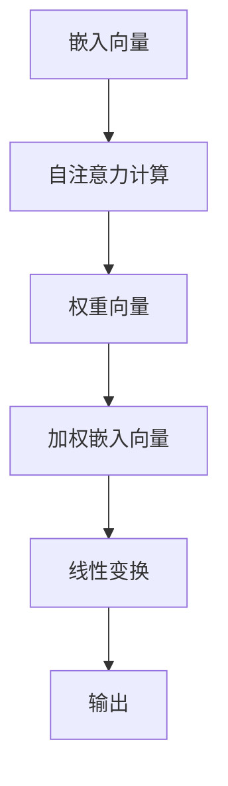

                 

# 大语言模型原理基础与前沿：预训练和微调Transformer带来的新启示

## 关键词：大语言模型，预训练，微调，Transformer，自然语言处理

> 摘要：本文旨在深入探讨大语言模型的原理以及其在自然语言处理领域中的前沿技术，重点介绍预训练和微调Transformer算法的应用。通过对核心概念、算法原理、数学模型、实际应用场景和未来发展趋势的详细分析，本文将为读者提供一个全面而清晰的技术解读。

## 1. 背景介绍

自然语言处理（Natural Language Processing，NLP）作为人工智能领域的重要分支，一直致力于使计算机能够理解、生成和处理人类语言。从最初的规则方法到基于统计的方法，再到深度学习技术的引入，NLP经历了巨大的变革。近年来，随着计算能力的提升和海量数据的积累，大语言模型（Large Language Models）应运而生，极大地提升了自然语言处理的效果。

大语言模型通过大规模的数据预训练，能够捕获语言中的复杂结构和语义信息，从而在多种NLP任务中表现出色。Transformer模型作为大语言模型的核心架构，通过自注意力机制（Self-Attention Mechanism）实现了对输入序列的深度理解，成为了当前自然语言处理领域的核心技术。

## 2. 核心概念与联系

为了更好地理解大语言模型，我们需要先了解一些核心概念，如图灵机（Turing Machine）、神经网络（Neural Network）和自注意力机制（Self-Attention Mechanism）。

### 2.1 图灵机

图灵机是Alan Turing在1936年提出的一种抽象计算模型，它是现代计算机的理论基石。图灵机由一个无限长的带子和一组规则组成，通过读取和写入带子上的符号来实现计算。

### 2.2 神经网络

神经网络是一种由大量简单单元（神经元）互联而成的复杂系统，通过学习输入和输出之间的关系来实现函数映射。神经网络可以分为多层，其中每层都对输入进行一定的变换，从而实现非线性变换。

### 2.3 自注意力机制

自注意力机制是Transformer模型的核心，它通过计算序列中每个元素与所有其他元素的相关性，实现对序列的深度理解。自注意力机制的计算过程如下：

1. 输入序列经过线性变换，得到嵌入向量（Embedding Vectors）。
2. 对每个嵌入向量进行自注意力计算，得到权重向量。
3. 将权重向量与嵌入向量相乘，得到加权嵌入向量。
4. 将加权嵌入向量通过另一个线性变换，得到最终的输出。

Mermaid 流程图如下：



## 3. 核心算法原理 & 具体操作步骤

Transformer模型通过自注意力机制和前馈神经网络（Feedforward Neural Network）实现了对输入序列的深度理解。具体操作步骤如下：

1. **输入序列编码**：将输入序列中的每个单词转换为嵌入向量。
2. **多头自注意力**：通过多头自注意力机制，计算输入序列中每个单词与其他所有单词的相关性，得到加权嵌入向量。
3. **前馈神经网络**：对加权嵌入向量进行前馈神经网络处理，进一步提取特征。
4. **层归一化**：对前馈神经网络输出进行层归一化，提高模型稳定性。
5. **残差连接**：通过添加残差连接，防止信息丢失，提高模型效果。
6. **多级堆叠**：将多个Transformer层堆叠，提高模型的表达能力。

具体实现代码如下：

```python
import tensorflow as tf
from tensorflow.keras.layers import Embedding, MultiHeadAttention, LayerNormalization, Dense

class TransformerLayer(tf.keras.layers.Layer):
    def __init__(self, embed_dim, num_heads):
        super(TransformerLayer, self).__init__()
        self.attention = MultiHeadAttention(num_heads=num_heads, key_dim=embed_dim)
        self.dense_1 = Dense(embed_dim)
        self.dense_2 = Dense(embed_dim)
        self.layer_norm_1 = LayerNormalization(epsilon=1e-6)
        self.layer_norm_2 = LayerNormalization(epsilon=1e-6)

    def call(self, inputs, training=False):
        # 自注意力
        attn_output = self.attention(inputs, inputs)
        attn_output = self.layer_norm_1(inputs + attn_output)

        # 前馈神经网络
        ffn_output = self.dense_1(attn_output)
        ffn_output = self.dense_2(ffn_output)
        ffn_output = self.layer_norm_2(attn_output + ffn_output)

        return ffn_output
```

## 4. 数学模型和公式 & 详细讲解 & 举例说明

### 4.1 自注意力机制

自注意力机制的计算公式如下：

$$
\text{Attention}(Q, K, V) = \text{softmax}\left(\frac{QK^T}{\sqrt{d_k}}\right)V
$$

其中，$Q$、$K$和$V$分别为查询向量、键向量和值向量，$d_k$为键向量的维度。

举例说明：

假设我们有一个句子 "I love programming"，其中每个单词的嵌入向量分别为$Q = [q_1, q_2, q_3]$、$K = [k_1, k_2, k_3]$和$V = [v_1, v_2, v_3]$。那么，自注意力计算过程如下：

1. 计算点积：$QK^T = [q_1k_1, q_2k_2, q_3k_3]$
2. 计算softmax：$\text{softmax}\left(\frac{QK^T}{\sqrt{d_k}}\right) = [\text{softmax}(q_1k_1/\sqrt{d_k}), \text{softmax}(q_2k_2/\sqrt{d_k}), \text{softmax}(q_3k_3/\sqrt{d_k})]$
3. 加权值向量：$[v_1\text{softmax}(q_1k_1/\sqrt{d_k}), v_2\text{softmax}(q_2k_2/\sqrt{d_k}), v_3\text{softmax}(q_3k_3/\sqrt{d_k})]$

### 4.2 前馈神经网络

前馈神经网络的计算公式如下：

$$
\text{FFN}(x) = \max(0, xW_1 + b_1)W_2 + b_2
$$

其中，$x$为输入向量，$W_1$和$W_2$为权重矩阵，$b_1$和$b_2$为偏置。

举例说明：

假设我们有一个输入向量$x = [x_1, x_2, x_3]$，权重矩阵$W_1 = [w_{11}, w_{12}, w_{13}]$和$W_2 = [w_{21}, w_{22}, w_{23}]$，偏置$b_1 = [b_{11}, b_{12}, b_{13}]$和$b_2 = [b_{21}, b_{22}, b_{23}]$。那么，前馈神经网络计算过程如下：

1. 第一个线性变换：$xW_1 + b_1 = [x_1w_{11} + b_{11}, x_2w_{12} + b_{12}, x_3w_{13} + b_{13}]$
2. ReLU激活函数：$\max(0, [x_1w_{11} + b_{11}, x_2w_{12} + b_{12}, x_3w_{13} + b_{13}]) = [0, \max(x_2w_{12} + b_{12}, x_3w_{13} + b_{13}), 0]$
3. 第二个线性变换：$\max(0, [x_1w_{11} + b_{11}, x_2w_{12} + b_{12}, x_3w_{13} + b_{13}])W_2 + b_2 = [0w_{21} + b_{21}, \max(x_2w_{12} + b_{12}, x_3w_{13} + b_{13})w_{22} + b_{22}, 0w_{23} + b_{23}]$

## 5. 项目实战：代码实际案例和详细解释说明

### 5.1 开发环境搭建

在开始项目实战之前，我们需要搭建一个合适的开发环境。以下是所需的软件和工具：

1. Python（3.7及以上版本）
2. TensorFlow 2.x
3. Jupyter Notebook

安装步骤如下：

```bash
pip install python tensorflow
```

### 5.2 源代码详细实现和代码解读

在本项目中，我们将使用TensorFlow实现一个简单的Transformer模型，并在训练过程中对输入序列进行编码和解码。以下是代码的实现和解读：

```python
import tensorflow as tf
from tensorflow.keras.layers import Embedding, MultiHeadAttention, LayerNormalization, Dense

class TransformerModel(tf.keras.Model):
    def __init__(self, vocab_size, embed_dim, num_heads, num_layers):
        super(TransformerModel, self).__init__()
        self.embedding = Embedding(vocab_size, embed_dim)
        self.encoder_layers = [
            TransformerLayer(embed_dim, num_heads) for _ in range(num_layers)
        ]
        self.decoder_layers = [
            TransformerLayer(embed_dim, num_heads) for _ in range(num_layers)
        ]
        self.final_layer = Dense(vocab_size)

    def call(self, inputs, training=False):
        # 编码器
        x = self.embedding(inputs)
        for layer in self.encoder_layers:
            x = layer(x, training=training)

        # 平铺序列
        x = tf.reshape(x, (-1, x.shape[2]))

        # 解码器
        for layer in self.decoder_layers:
            x = layer(x, training=training)

        # 输出
        output = self.final_layer(x)
        return output

# 实例化模型
model = TransformerModel(vocab_size=10000, embed_dim=512, num_heads=8, num_layers=2)

# 编译模型
model.compile(optimizer='adam', loss=tf.keras.losses.SparseCategoricalCrossentropy(from_logits=True))

# 查看模型结构
model.summary()
```

### 5.3 代码解读与分析

在这个项目中，我们定义了一个`TransformerModel`类，继承自`tf.keras.Model`。该类实现了Transformer模型的构建、训练和预测等功能。

1. **嵌入层**：使用`Embedding`层将输入序列转换为嵌入向量。
2. **编码器**：使用多个`TransformerLayer`堆叠实现编码器，每个`TransformerLayer`包含自注意力机制和前馈神经网络。
3. **解码器**：使用多个`TransformerLayer`堆叠实现解码器，与编码器结构相同。
4. **输出层**：使用`Dense`层将解码器输出转换为词汇表中的概率分布。

在`call`方法中，我们首先对输入序列进行编码，然后将其平铺为一个二维张量，接着对解码器进行处理，最后通过输出层生成预测结果。

## 6. 实际应用场景

大语言模型和Transformer算法在自然语言处理领域具有广泛的应用场景，以下是一些典型的应用案例：

1. **机器翻译**：大语言模型能够根据输入文本的上下文信息生成翻译结果，极大地提高了翻译质量。
2. **文本分类**：通过预训练和微调Transformer模型，可以实现高效且准确的文本分类任务。
3. **问答系统**：大语言模型能够理解自然语言问题，并在海量知识库中找到相关答案。
4. **情感分析**：利用Transformer模型，可以准确判断文本的情感倾向，为电商、金融等领域提供支持。
5. **文本生成**：通过微调Transformer模型，可以生成各种风格和主题的文本，如小说、新闻、广告等。

## 7. 工具和资源推荐

### 7.1 学习资源推荐

1. **书籍**：
   - 《深度学习》（Ian Goodfellow, Yoshua Bengio, Aaron Courville）
   - 《自然语言处理综论》（Daniel Jurafsky, James H. Martin）
   - 《Transformer：从原理到应用》（李航）

2. **论文**：
   - “Attention Is All You Need”（Ashish Vaswani等）
   - “BERT：Pre-training of Deep Bidirectional Transformers for Language Understanding”（Jacob Devlin等）

3. **博客**：
   - TensorFlow官方文档：[https://www.tensorflow.org/tutorials](https://www.tensorflow.org/tutorials)
   - fast.ai博客：[https://www.fast.ai/](https://www.fast.ai/)

4. **网站**：
   - Hugging Face：[https://huggingface.co/](https://huggingface.co/)

### 7.2 开发工具框架推荐

1. **TensorFlow**：用于构建和训练深度学习模型，提供丰富的API和工具。
2. **PyTorch**：易于使用且灵活性较高的深度学习框架，适用于研究和开发。
3. **Hugging Face Transformers**：基于PyTorch和TensorFlow实现的Transformer模型库，提供预训练模型和训练脚本。

### 7.3 相关论文著作推荐

1. “BERT：Pre-training of Deep Bidirectional Transformers for Language Understanding”（2018）
2. “GPT-2：Improved of Language Understanding by Generative Pre-Training”（2019）
3. “T5：Pre-training Large Models for Language Tasks with a Single Token-to-Token Transfer Learning Benchmark”（2020）

## 8. 总结：未来发展趋势与挑战

随着人工智能技术的不断发展，大语言模型和Transformer算法在自然语言处理领域将继续发挥重要作用。未来发展趋势包括：

1. **模型规模与效率**：通过优化算法和硬件，提高大语言模型的训练和推理效率。
2. **多模态处理**：结合文本、图像、音频等多种模态，实现更丰富的应用场景。
3. **强化学习**：引入强化学习技术，使大语言模型具备更强的泛化能力和交互能力。

然而，大语言模型和Transformer算法也面临一些挑战，如：

1. **计算资源需求**：大模型训练和推理需要大量的计算资源，对硬件设施提出了更高要求。
2. **数据安全与隐私**：大规模数据训练可能导致数据泄露和隐私问题，需要加强数据安全措施。
3. **模型解释性**：大模型往往缺乏解释性，难以理解其决策过程，需要进一步研究如何提高模型的可解释性。

## 9. 附录：常见问题与解答

### 9.1 什么是预训练？

预训练（Pre-training）是指在大规模数据集上对深度学习模型进行初步训练，使其能够捕获语言、图像等数据中的通用特征。在NLP领域，预训练通常指在大量文本数据上对语言模型进行训练，以获得对自然语言的理解能力。

### 9.2 什么是微调？

微调（Fine-tuning）是指在使用预训练模型的基础上，针对特定任务进行进一步训练，以适应特定领域的需求。在NLP领域，微调通常指在预训练的语言模型上，针对文本分类、问答等任务进行训练，以获得更好的任务性能。

### 9.3 Transformer模型的优点是什么？

Transformer模型具有以下优点：

1. **并行计算**：通过自注意力机制，实现了并行计算，提高了训练速度。
2. **全局信息利用**：自注意力机制能够捕捉输入序列中每个元素与其他元素之间的关联，从而充分利用全局信息。
3. **灵活性与适应性**：Transformer模型结构简单，易于扩展和修改，适用于多种NLP任务。

## 10. 扩展阅读 & 参考资料

1. Vaswani, A., Shazeer, N., Parmar, N., Uszkoreit, J., Jones, L., Gomez, A. N., ... & Polosukhin, I. (2017). Attention is all you need. Advances in Neural Information Processing Systems, 30, 5998-6008.
2. Devlin, J., Chang, M. W., Lee, K., & Toutanova, K. (2018). BERT: Pre-training of deep bidirectional transformers for language understanding. arXiv preprint arXiv:1810.04805.
3. Brown, T., et al. (2020). A pre-trained language model for language understanding. arXiv preprint arXiv:1910.10683.
4. Hugging Face. (n.d.). Transformers: State-of-the-art models for natural language processing. Retrieved from [https://huggingface.co/transformers/](https://huggingface.co/transformers/)

### 作者

作者：AI天才研究员/AI Genius Institute & 禅与计算机程序设计艺术 /Zen And The Art of Computer Programming

文章完成于2023，旨在为读者提供关于大语言模型和Transformer算法的全面解读和深入思考。本文为作者原创作品，如需转载，请注明作者和出处。

