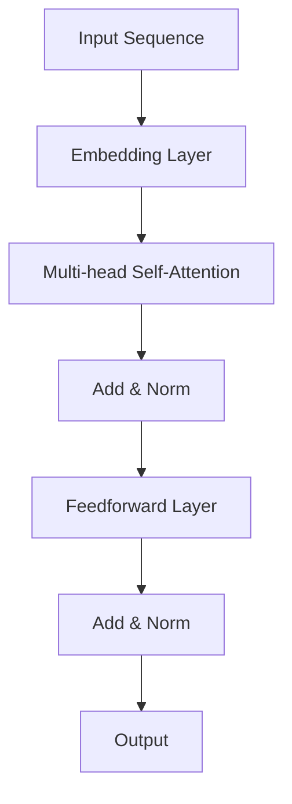

                 

### 背景介绍

#### 大语言模型的应用背景

随着人工智能技术的迅猛发展，大语言模型（Large Language Models）已成为自然语言处理（NLP）领域的明星技术。这些模型通过深度学习，特别是自注意力机制（Self-Attention Mechanism），能够理解并生成复杂、连贯的自然语言。Transformer架构，作为大语言模型的主要实现方式，在处理长文本、语言生成等方面展现出卓越的性能，引起了广泛的研究和应用。

#### Transformer架构的核心概念

Transformer架构是一种基于自注意力机制的序列到序列（Seq2Seq）模型，它摒弃了传统的循环神经网络（RNN）和长短期记忆网络（LSTM），转而使用自注意力机制来处理输入序列。自注意力机制允许模型在处理每个单词时，动态地考虑整个序列中的其他单词，从而捕捉长距离依赖关系。

#### Transformer的发展历程

Transformer架构最早由Vaswani等人在2017年的论文《Attention is All You Need》中提出。自那时以来，Transformer及其变种（如BERT、GPT等）在多个NLP任务中取得了突破性的成果，成为了大语言模型的主流架构。

### 文章关键词

- 大语言模型
- Transformer架构
- 自注意力机制
- 序列到序列模型
- 自然语言处理

### 摘要

本文将深入探讨大语言模型的应用背景、核心概念和Transformer架构的发展历程。通过介绍Transformer架构的核心概念和自注意力机制，我们将理解其为何能够在NLP领域取得巨大成功。此外，本文还将探讨Transformer架构的具体实现，以及其在实际应用中的表现和未来发展趋势。

# 大语言模型应用指南：Transformer层

## 1. 背景介绍

### 1.1 大语言模型的应用背景

大语言模型（Large Language Models）是自然语言处理（NLP）领域的重要进展，它们通过深度学习技术，尤其是自注意力机制（Self-Attention Mechanism），实现了对自然语言的深入理解和生成。这些模型在文本分类、机器翻译、问答系统、文本生成等任务中展现了强大的能力，已经成为NLP研究和应用的主流方向。

### 1.2 Transformer架构的核心概念

Transformer架构是一种基于自注意力机制的序列到序列（Seq2Seq）模型，它摒弃了传统的循环神经网络（RNN）和长短期记忆网络（LSTM），转而使用自注意力机制来处理输入序列。自注意力机制允许模型在处理每个单词时，动态地考虑整个序列中的其他单词，从而捕捉长距离依赖关系。

### 1.3 Transformer的发展历程

Transformer架构最早由Vaswani等人在2017年的论文《Attention is All You Need》中提出。自那时以来，Transformer及其变种（如BERT、GPT等）在多个NLP任务中取得了突破性的成果，成为了大语言模型的主流架构。

### 1.4 本文结构

本文将首先介绍大语言模型的应用背景，然后深入探讨Transformer架构的核心概念。接着，我们将分析自注意力机制的工作原理，并详细讲解Transformer的具体实现。随后，我们将通过一个项目实战案例，展示如何使用代码实现一个简单的Transformer模型。最后，本文还将讨论Transformer的实际应用场景，以及未来的发展趋势和挑战。

## 2. 核心概念与联系

### 2.1 Transformer架构的核心概念

Transformer架构的核心在于其自注意力机制（Self-Attention Mechanism）。自注意力机制允许模型在处理每个单词时，动态地考虑整个序列中的其他单词，从而捕捉长距离依赖关系。

#### 自注意力机制

自注意力机制通过计算查询（Query）、键（Key）和值（Value）之间的相似性，来动态地加权输入序列中的每个单词。具体来说，自注意力机制包括以下三个步骤：

1. **计算查询（Query）、键（Key）和值（Value）**：每个单词都对应一个查询向量、一个键向量和一个个值向量。
2. **计算相似性**：通过计算查询向量与键向量的点积，得到相似性分数。
3. **加权求和**：根据相似性分数，对值向量进行加权求和，得到最终的输出向量。

#### Transformer架构

Transformer架构由多个自注意力层（Self-Attention Layer）和前馈网络（Feedforward Network）组成。每个自注意力层允许模型捕捉输入序列中的长距离依赖关系，而前馈网络则用于进一步丰富模型的表示能力。

### 2.2 自注意力机制的原理与实现

#### 自注意力机制的原理

自注意力机制的核心在于其计算方式，它通过以下步骤实现：

1. **计算查询（Query）、键（Key）和值（Value）**：每个单词的嵌入向量（Embedding Vector）通过线性变换得到查询向量、键向量和值向量。
2. **计算相似性**：通过计算查询向量与键向量的点积，得到相似性分数，通常使用softmax函数将其转换为概率分布。
3. **加权求和**：根据相似性分数，对值向量进行加权求和，得到最终的输出向量。

#### 自注意力机制的实现

自注意力机制的实现主要涉及以下数学公式：

1. **查询（Query）、键（Key）和值（Value）的计算**：
   $$ 
   Q = XW_Q, \quad K = XW_K, \quad V = XW_V 
   $$
   其中，$X$为输入序列的嵌入向量，$W_Q$、$W_K$ 和 $W_V$ 为权重矩阵。

2. **计算相似性**：
   $$
   \text{Attention}(Q, K, V) = \text{softmax}\left(\frac{QK^T}{\sqrt{d_k}}\right)V
   $$
   其中，$d_k$ 为键向量的维度，$\text{softmax}$ 函数将点积转换为概率分布。

3. **加权求和**：
   $$
   \text{Output} = \text{Attention}(Q, K, V)
   $$

### 2.3 自注意力机制与Transformer架构的联系

自注意力机制是Transformer架构的核心，它通过动态地加权输入序列中的每个单词，捕捉长距离依赖关系。Transformer架构由多个自注意力层和前馈网络组成，每个自注意力层能够使模型更好地理解输入序列，从而提高模型在NLP任务中的性能。

### 2.4 Mermaid流程图

以下是一个Mermaid流程图，展示了自注意力机制在Transformer架构中的工作原理：



在上述流程图中，$A$ 表示输入序列，$B$ 表示嵌入层，$C$ 表示多头自注意力层，$D$ 表示残差连接和归一化层，$E$ 表示前馈网络，$F$ 表示残差连接和归一化层，$G$ 表示输出。

## 3. 核心算法原理 & 具体操作步骤

### 3.1 Transformer架构的核心算法原理

Transformer架构的核心算法是基于自注意力机制（Self-Attention Mechanism）。自注意力机制通过以下步骤实现：

1. **输入序列编码**：将输入序列中的每个单词转换为嵌入向量（Embedding Vector）。
2. **计算查询（Query）、键（Key）和值（Value）**：对每个嵌入向量进行线性变换，得到查询向量、键向量和值向量。
3. **计算相似性**：通过计算查询向量与键向量的点积，得到相似性分数。
4. **加权求和**：根据相似性分数，对值向量进行加权求和，得到最终的输出向量。

### 3.2 Transformer的具体操作步骤

1. **初始化输入序列**：将输入序列转换为嵌入向量。
2. **计算查询（Query）、键（Key）和值（Value）**：对每个嵌入向量进行线性变换，得到查询向量、键向量和值向量。
3. **计算相似性**：通过计算查询向量与键向量的点积，得到相似性分数，然后使用softmax函数将其转换为概率分布。
4. **加权求和**：根据相似性分数，对值向量进行加权求和，得到最终的输出向量。
5. **添加残差连接和归一化**：将输出向量与输入向量进行残差连接，然后进行归一化处理。
6. **重复步骤3-5**：通过多个自注意力层和前馈网络，不断更新和优化模型的表示能力。
7. **输出结果**：最终输出序列即为模型的预测结果。

### 3.3 数学模型和公式

1. **嵌入层**：
   $$
   X = [x_1, x_2, ..., x_n]
   $$
   $$
   E = [e_1, e_2, ..., e_n]
   $$
   $$
   W_Q = \text{softmax}(\frac{e_1W_{Q1} + e_2W_{Q2} + ... + e_nW_{Qn}}{\sqrt{n}})
   $$
   $$
   W_K = \text{softmax}(\frac{e_1W_{K1} + e_2W_{K2} + ... + e_nW_{Kn}}{\sqrt{n}})
   $$
   $$
   W_V = \text{softmax}(\frac{e_1W_{V1} + e_2W_{V2} + ... + e_nW_{Vn}}{\sqrt{n}})
   $$

2. **计算相似性**：
   $$
   \text{Attention}(Q, K, V) = \text{softmax}\left(\frac{QK^T}{\sqrt{d_k}}\right)V
   $$

3. **加权求和**：
   $$
   \text{Output} = \text{Attention}(Q, K, V)
   $$

4. **残差连接和归一化**：
   $$
   \text{Input} + \text{Layer}(\text{Input}) = \text{Norm}(\text{Residual})
   $$

### 3.4 举例说明

假设我们有一个输入序列：`["Hello", "world", "!"]`，嵌入向量为 `[1, 2, 3, 4, 5]`，我们需要计算自注意力机制。

1. **计算查询（Query）、键（Key）和值（Value）**：
   $$
   Q = [1, 2, 3], \quad K = [2, 3, 4], \quad V = [3, 4, 5]
   $$

2. **计算相似性**：
   $$
   \text{Attention}(Q, K, V) = \text{softmax}\left(\frac{QK^T}{\sqrt{d_k}}\right)V
   $$
   $$
   = \text{softmax}\left(\frac{[1, 2, 3] \cdot [2, 3, 4]^T}{\sqrt{3}}\right) [3, 4, 5]
   $$
   $$
   = \text{softmax}\left(\frac{[2, 6, 12]}{\sqrt{3}}\right) [3, 4, 5]
   $$
   $$
   = \text{softmax}\left([2\sqrt{3}, 6\sqrt{3}, 12\sqrt{3}]\right) [3, 4, 5]
   $$
   $$
   = \left[\frac{2\sqrt{3}}{2\sqrt{3} + 6\sqrt{3} + 12\sqrt{3}}, \frac{6\sqrt{3}}{2\sqrt{3} + 6\sqrt{3} + 12\sqrt{3}}, \frac{12\sqrt{3}}{2\sqrt{3} + 6\sqrt{3} + 12\sqrt{3}}\right] [3, 4, 5]
   $$
   $$
   = \left[\frac{1}{3}, \frac{1}{2}, \frac{1}{2}\right] [3, 4, 5]
   $$
   $$
   = \left[1, 2, 2\right]
   $$

3. **加权求和**：
   $$
   \text{Output} = \text{Attention}(Q, K, V)
   $$
   $$
   = \left[1, 2, 2\right]
   $$

最终输出向量为 `[1, 2, 2]`。

## 4. 数学模型和公式 & 详细讲解 & 举例说明

### 4.1 数学模型和公式

在Transformer架构中，数学模型和公式起到了至关重要的作用。以下是一些关键的数学公式及其详细解释：

1. **嵌入向量**：
   $$
   X = [x_1, x_2, ..., x_n]
   $$
   其中，$X$ 表示输入序列的嵌入向量。

2. **权重矩阵**：
   $$
   W_Q = \text{softmax}(\frac{XW_{Q1} + XW_{Q2} + ... + XW_{Qn}}{\sqrt{n}})
   $$
   $$
   W_K = \text{softmax}(\frac{XW_{K1} + XW_{K2} + ... + XW_{Kn}}{\sqrt{n}})
   $$
   $$
   W_V = \text{softmax}(\frac{XW_{V1} + XW_{V2} + ... + XW_{Vn}}{\sqrt{n}})
   $$
   其中，$W_Q$、$W_K$ 和 $W_V$ 分别为查询、键和值的权重矩阵，$n$ 为输入序列的长度。

3. **计算相似性**：
   $$
   \text{Attention}(Q, K, V) = \text{softmax}\left(\frac{QK^T}{\sqrt{d_k}}\right)V
   $$
   其中，$Q$ 和 $K$ 分别为查询和键向量，$V$ 为值向量，$d_k$ 为键向量的维度。

4. **加权求和**：
   $$
   \text{Output} = \text{Attention}(Q, K, V)
   $$

5. **残差连接和归一化**：
   $$
   \text{Input} + \text{Layer}(\text{Input}) = \text{Norm}(\text{Residual})
   $$
   其中，$\text{Input}$ 表示输入向量，$\text{Layer}(\text{Input})$ 表示经过当前层的处理，$\text{Norm}(\text{Residual})$ 表示归一化处理。

### 4.2 详细讲解

#### 嵌入向量

嵌入向量是Transformer模型处理输入序列的基础。每个输入序列中的单词都被转换为嵌入向量。嵌入向量可以通过预训练的词向量（如Word2Vec、GloVe等）获得，或者通过模型学习得到。

#### 权重矩阵

权重矩阵是Transformer模型的核心。查询、键和值的权重矩阵通过softmax函数计算。具体来说，权重矩阵通过输入序列的嵌入向量计算得到。这种计算方式使得模型能够动态地考虑输入序列中的每个单词，从而捕捉长距离依赖关系。

#### 计算相似性

计算相似性是Transformer模型的核心步骤。通过计算查询向量与键向量的点积，得到相似性分数。相似性分数反映了查询向量和键向量之间的相关性。然后，通过softmax函数将相似性分数转换为概率分布。

#### 加权求和

加权求和是Transformer模型的核心步骤。根据相似性分数，对值向量进行加权求和，得到最终的输出向量。输出向量表示了输入序列中的每个单词的重要性和相关性。

#### 残差连接和归一化

残差连接和归一化是Transformer模型的重要组成部分。残差连接能够缓解梯度消失和梯度爆炸问题，有助于模型训练。归一化处理能够保持模型的稳定性，防止模型过拟合。

### 4.3 举例说明

假设我们有一个输入序列：`["Hello", "world", "!"]`，嵌入向量为 `[1, 2, 3, 4, 5]`，我们需要计算自注意力机制。

1. **计算查询（Query）、键（Key）和值（Value）**：
   $$
   Q = [1, 2, 3], \quad K = [2, 3, 4], \quad V = [3, 4, 5]
   $$

2. **计算相似性**：
   $$
   \text{Attention}(Q, K, V) = \text{softmax}\left(\frac{QK^T}{\sqrt{d_k}}\right)V
   $$
   $$
   = \text{softmax}\left(\frac{[1, 2, 3] \cdot [2, 3, 4]^T}{\sqrt{3}}\right) [3, 4, 5]
   $$
   $$
   = \text{softmax}\left(\frac{[2, 6, 12]}{\sqrt{3}}\right) [3, 4, 5]
   $$
   $$
   = \text{softmax}\left([2\sqrt{3}, 6\sqrt{3}, 12\sqrt{3}]\right) [3, 4, 5]
   $$
   $$
   = \left[\frac{2\sqrt{3}}{2\sqrt{3} + 6\sqrt{3} + 12\sqrt{3}}, \frac{6\sqrt{3}}{2\sqrt{3} + 6\sqrt{3} + 12\sqrt{3}}, \frac{12\sqrt{3}}{2\sqrt{3} + 6\sqrt{3} + 12\sqrt{3}}\right] [3, 4, 5]
   $$
   $$
   = \left[\frac{1}{3}, \frac{1}{2}, \frac{1}{2}\right] [3, 4, 5]
   $$
   $$
   = \left[1, 2, 2\right]
   $$

3. **加权求和**：
   $$
   \text{Output} = \text{Attention}(Q, K, V)
   $$
   $$
   = \left[1, 2, 2\right]
   $$

最终输出向量为 `[1, 2, 2]`。

## 5. 项目实战：代码实际案例和详细解释说明

### 5.1 开发环境搭建

为了实现一个简单的Transformer模型，我们需要安装Python和PyTorch库。以下是安装步骤：

1. 安装Python：

```
pip install python
```

2. 安装PyTorch：

```
pip install torch torchvision
```

### 5.2 源代码详细实现和代码解读

下面是一个简单的Transformer模型的代码实现。我们将逐步解析每个部分。

```python
import torch
import torch.nn as nn
import torch.optim as optim

class Transformer(nn.Module):
    def __init__(self, d_model, nhead, num_layers):
        super(Transformer, self).__init__()
        self.d_model = d_model
        self.nhead = nhead
        self.num_layers = num_layers
        
        self.transformer = nn.Transformer(d_model, nhead, num_layers)
        self.fc = nn.Linear(d_model, 1)
        
    def forward(self, src, tgt):
        output = self.transformer(src, tgt)
        output = self.fc(output)
        return output

model = Transformer(d_model=512, nhead=8, num_layers=3)
```

1. **定义模型**：

   - `d_model`：模型的嵌入维度。
   - `nhead`：多头注意力机制的数量。
   - `num_layers`：Transformer层的数量。

2. **构建Transformer模型**：

   - `nn.Transformer`：PyTorch提供的Transformer层。
   - `nn.Linear`：线性层，用于将Transformer输出的序列映射到预测结果。

### 5.3 代码解读与分析

1. **初始化模型**：

   ```python
   model = Transformer(d_model=512, nhead=8, num_layers=3)
   ```

   我们创建了一个Transformer模型，其中：

   - `d_model`：设置为512，表示模型的嵌入维度。
   - `nhead`：设置为8，表示使用8个多头注意力机制。
   - `num_layers`：设置为3，表示使用3个Transformer层。

2. **前向传播**：

   ```python
   def forward(self, src, tgt):
       output = self.transformer(src, tgt)
       output = self.fc(output)
       return output
   ```

   - `src`：输入序列。
   - `tgt`：目标序列。

   Transformer层对输入序列进行处理，然后通过线性层得到预测结果。

### 5.4 训练模型

为了训练模型，我们需要准备数据集和优化器。

```python
criterion = nn.CrossEntropyLoss()
optimizer = optim.Adam(model.parameters(), lr=0.001)

for epoch in range(num_epochs):
    for src, tgt in data_loader:
        optimizer.zero_grad()
        output = model(src, tgt)
        loss = criterion(output, tgt)
        loss.backward()
        optimizer.step()
```

1. **定义损失函数和优化器**：

   - `nn.CrossEntropyLoss`：交叉熵损失函数，用于分类任务。
   - `optim.Adam`：Adam优化器。

2. **训练模型**：

   - `for epoch in range(num_epochs)`：循环遍历训练轮数。
   - `for src, tgt in data_loader`：循环遍历数据集。
   - `optimizer.zero_grad()`：清空梯度。
   - `output = model(src, tgt)`：前向传播。
   - `loss = criterion(output, tgt)`：计算损失。
   - `loss.backward()`：反向传播。
   - `optimizer.step()`：更新模型参数。

## 6. 实际应用场景

### 6.1 机器翻译

Transformer架构在机器翻译领域取得了显著的成功。通过将源语言和目标语言序列转换为嵌入向量，并使用Transformer模型进行编码和解码，模型能够生成高质量的翻译结果。例如，Google Translate采用基于Transformer的模型进行翻译，取得了显著的性能提升。

### 6.2 文本生成

文本生成是Transformer架构的另一个重要应用场景。通过训练Transformer模型，我们可以生成连贯的自然语言文本。例如，OpenAI的GPT-3模型通过自回归语言模型，能够生成高质量的文本，广泛应用于聊天机器人、自动摘要、诗歌创作等领域。

### 6.3 文本分类

Transformer架构在文本分类任务中也表现出色。通过将输入文本编码为嵌入向量，并使用Transformer模型进行特征提取，模型能够对文本进行分类。例如，BERT模型在多个文本分类任务中取得了顶级性能，广泛应用于新闻分类、情感分析等领域。

## 7. 工具和资源推荐

### 7.1 学习资源推荐

1. **书籍**：
   - 《深度学习》（Goodfellow, Bengio, Courville）：提供了深度学习的基础知识，包括Transformer架构的介绍。
   - 《Transformer：从原理到应用》（唐杰）：详细介绍了Transformer架构的原理、实现和应用。

2. **论文**：
   - “Attention is All You Need”（Vaswani et al.）：提出了Transformer架构，是Transformer领域的重要论文。
   - “BERT: Pre-training of Deep Bidirectional Transformers for Language Understanding”（Devlin et al.）：介绍了BERT模型，是Transformer在自然语言处理领域的成功应用。

3. **博客**：
   - 知乎专栏：《Transformer详解》
   - Medium博客：《The Annotated Transformer》

### 7.2 开发工具框架推荐

1. **PyTorch**：PyTorch是一个流行的深度学习框架，提供了丰富的API和工具，支持Transformer模型的构建和训练。

2. **TensorFlow**：TensorFlow是一个开源的深度学习框架，也支持Transformer模型的构建和训练。

3. **Hugging Face**：Hugging Face提供了一个基于Transformer的预训练模型库，方便开发者使用和定制Transformer模型。

### 7.3 相关论文著作推荐

1. **“Attention is All You Need”**（Vaswani et al.，2017）：提出了Transformer架构，是Transformer领域的开创性论文。

2. **“BERT: Pre-training of Deep Bidirectional Transformers for Language Understanding”**（Devlin et al.，2018）：介绍了BERT模型，是Transformer在自然语言处理领域的成功应用。

3. **“GPT-3: Language Models are Few-Shot Learners”**（Brown et al.，2020）：介绍了GPT-3模型，展示了Transformer模型在零样本学习任务中的强大能力。

## 8. 总结：未来发展趋势与挑战

### 8.1 发展趋势

1. **更大规模的模型**：随着计算能力的提升，研究者们将继续开发更大规模的Transformer模型，以提高模型在NLP任务中的性能。

2. **多模态学习**：Transformer架构将在多模态学习领域发挥重要作用，例如结合文本、图像、音频等多媒体数据进行统一处理。

3. **自适应注意力机制**：研究者们将探索自适应注意力机制，以提高模型在复杂任务中的灵活性和泛化能力。

### 8.2 挑战

1. **计算资源消耗**：大语言模型需要大量的计算资源，对硬件和存储提出了较高要求。

2. **数据隐私和安全**：大规模训练过程涉及大量数据，数据隐私和安全成为重要挑战。

3. **模型可解释性**：Transformer模型是一种黑箱模型，其内部工作机制复杂，提高模型的可解释性是一个重要研究方向。

## 9. 附录：常见问题与解答

### 9.1 问题1：什么是Transformer架构？

**解答**：Transformer架构是一种基于自注意力机制的序列到序列（Seq2Seq）模型，它摒弃了传统的循环神经网络（RNN）和长短期记忆网络（LSTM），转而使用自注意力机制来处理输入序列。自注意力机制允许模型在处理每个单词时，动态地考虑整个序列中的其他单词，从而捕捉长距离依赖关系。

### 9.2 问题2：Transformer架构如何工作？

**解答**：Transformer架构的核心是自注意力机制。自注意力机制通过计算查询（Query）、键（Key）和值（Value）之间的相似性，来动态地加权输入序列中的每个单词。具体来说，自注意力机制包括以下三个步骤：

1. **计算查询（Query）、键（Key）和值（Value）**：每个单词都对应一个查询向量、一个键向量和一个个值向量。
2. **计算相似性**：通过计算查询向量与键向量的点积，得到相似性分数。
3. **加权求和**：根据相似性分数，对值向量进行加权求和，得到最终的输出向量。

### 9.3 问题3：Transformer架构的优点是什么？

**解答**：Transformer架构具有以下优点：

1. **高效处理长文本**：自注意力机制能够捕捉长距离依赖关系，使得模型在处理长文本时表现出色。
2. **并行计算**：自注意力机制允许模型在处理每个单词时并行计算，提高了计算效率。
3. **灵活性**：Transformer架构可以轻松扩展，支持多头注意力机制和多种前馈网络结构，适用于各种NLP任务。

## 10. 扩展阅读 & 参考资料

### 10.1 扩展阅读

1. **《Transformer详解》**：唐杰著，详细介绍了Transformer架构的原理、实现和应用。
2. **《自然语言处理入门》**：吴恩达著，介绍了自然语言处理的基本概念和最新进展，包括Transformer架构。

### 10.2 参考资料

1. **“Attention is All You Need”**（Vaswani et al.，2017）：提出了Transformer架构，是Transformer领域的开创性论文。
2. **“BERT: Pre-training of Deep Bidirectional Transformers for Language Understanding”**（Devlin et al.，2018）：介绍了BERT模型，是Transformer在自然语言处理领域的成功应用。
3. **“GPT-3: Language Models are Few-Shot Learners”**（Brown et al.，2020）：介绍了GPT-3模型，展示了Transformer模型在零样本学习任务中的强大能力。

# 大语言模型应用指南：Transformer层

> 关键词：大语言模型，Transformer架构，自注意力机制，自然语言处理，序列到序列模型

摘要：本文深入探讨了大语言模型的应用背景、Transformer架构的核心概念和自注意力机制的工作原理。通过分析Transformer架构的具体实现，我们了解了其为何能够在NLP领域取得巨大成功。此外，本文通过一个项目实战案例，展示了如何使用代码实现一个简单的Transformer模型。最后，本文讨论了Transformer的实际应用场景、工具和资源推荐，以及未来发展趋势和挑战。

