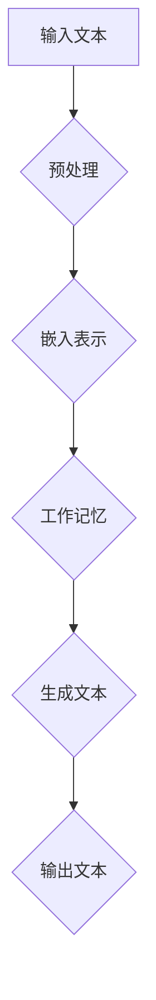

                 

# 大语言模型应用指南：什么是工作记忆

## 关键词：
- 大语言模型
- 工作记忆
- 应用指南
- 技术原理
- 数学模型
- 项目实战
- 实际应用场景

## 摘要：
本文旨在深入探讨大语言模型的工作记忆机制，从背景介绍到核心概念，从算法原理到实际应用，为您呈现一个全面而详尽的应用指南。通过本文，您将了解工作记忆在语言模型中的关键作用，掌握其在各种场景下的应用技巧，并为未来的研究和开发提供宝贵的参考。

## 1. 背景介绍

随着深度学习和自然语言处理技术的快速发展，大语言模型（如GPT-3、BERT等）已经成为自然语言理解、生成和交互领域的重要工具。然而，这些模型的成功不仅仅依赖于其庞大的参数规模和先进的训练技术，还依赖于其独特的工作记忆机制。

工作记忆是一种认知功能，它允许个体在短时间内对信息进行存储、处理和更新。在计算机科学和人工智能领域，工作记忆通常指的是模型内部用于处理和存储中间计算结果的空间。这种记忆机制在语言模型中尤为重要，因为它直接影响到模型的生成能力和上下文理解能力。

本文将围绕大语言模型的工作记忆展开讨论，包括其核心概念、算法原理、数学模型、实际应用以及未来发展趋势。希望通过本文的阅读，您能够对大语言模型的工作记忆有一个全面而深入的理解，并能够将其应用于实际问题中。

## 2. 核心概念与联系

### 2.1 大语言模型概述

大语言模型是基于深度神经网络的语言处理模型，通过大规模文本数据进行预训练，可以捕捉到语言的各种统计规律和结构。这些模型通常具有数十亿甚至千亿级别的参数，能够对输入的文本进行高度复杂的处理和生成。

### 2.2 工作记忆定义

工作记忆是一种暂时存储和处理信息的能力，它允许个体在执行任务时对信息进行高效的操作和整合。在计算机科学中，工作记忆通常指的是一个特定的存储空间，用于在计算过程中存储中间结果和重要信息。

### 2.3 工作记忆与语言模型的关系

大语言模型的工作记忆机制是其在自然语言处理中取得成功的关键因素之一。工作记忆不仅有助于模型在生成文本时保持上下文的连贯性，还能在处理复杂任务时提供高效的计算支持。

### 2.4 Mermaid 流程图



在这个流程图中，输入文本经过预处理后，被转化为嵌入表示。嵌入表示随后被输入到工作记忆模块，这个模块将处理嵌入表示，并生成新的嵌入表示。最后，这些新的嵌入表示被用于生成输出文本。

## 3. 核心算法原理 & 具体操作步骤

### 3.1 预处理

预处理是语言模型处理文本的初始步骤。在这一阶段，文本被清洗和标准化，以消除不同文本格式和标记的影响。预处理过程通常包括以下步骤：

- 去除标点符号和特殊字符
- 转换大小写
- 分词
- 词干还原

### 3.2 嵌入表示

预处理后的文本被转化为嵌入表示，这是语言模型的核心数据结构。嵌入表示通常是一个高维向量，它能够捕捉文本中的词汇关系和语义信息。常见的嵌入方法包括词向量（如Word2Vec、GloVe）和上下文向量（如BERT、GPT）。

### 3.3 工作记忆机制

工作记忆是语言模型中的关键组件，它负责存储和处理嵌入表示。工作记忆通常采用循环神经网络（RNN）或变换器（Transformer）架构来实现。以下是一个基于RNN的工作记忆机制的具体操作步骤：

1. **初始化**：初始化工作记忆状态。
2. **输入嵌入表示**：将预处理后的文本转化为嵌入表示，并输入到工作记忆中。
3. **状态更新**：根据当前输入的嵌入表示和工作记忆状态，更新工作记忆状态。
4. **生成嵌入表示**：利用更新后的工作记忆状态，生成新的嵌入表示。
5. **重复步骤3-4**：重复执行步骤3-4，直到完成整个文本的处理。

### 3.4 生成文本

在生成文本阶段，工作记忆模块生成的嵌入表示被用于生成输出文本。这一过程通常采用顶
下部分
### 4. 数学模型和公式 & 详细讲解 & 举例说明

#### 4.1 数学模型

大语言模型的工作记忆机制通常采用循环神经网络（RNN）或变换器（Transformer）架构来实现。以下是一个基于RNN的工作记忆机制的数学模型：

$$
h_t = \text{RNN}(h_{t-1}, x_t)
$$

其中，$h_t$ 表示时间步 $t$ 的工作记忆状态，$h_{t-1}$ 表示时间步 $t-1$ 的工作记忆状态，$x_t$ 表示时间步 $t$ 的输入嵌入表示。

#### 4.2 公式详细讲解

- **RNN（循环神经网络）**：
  RNN 是一种能够处理序列数据的神经网络，其核心思想是将当前输入 $x_t$ 与前一个时间步的隐藏状态 $h_{t-1}$ 进行结合，并通过一个非线性函数 $f$ 更新隐藏状态。这个非线性函数可以表示为：

  $$
  h_t = f(h_{t-1}, x_t)
  $$

  其中，$f$ 通常是一个多层感知器（MLP）或其他复杂函数。

- **工作记忆状态更新**：
  工作记忆状态更新是RNN的核心操作。在每一个时间步，RNN都会利用当前输入和前一个时间步的隐藏状态来更新当前的工作记忆状态。这个过程可以通过以下公式表示：

  $$
  h_t = \sigma(W_h \cdot [h_{t-1}; x_t] + b_h)
  $$

  其中，$\sigma$ 表示非线性激活函数（如Sigmoid、Tanh等），$W_h$ 和 $b_h$ 分别是权重和偏置。

- **嵌入表示生成**：
  工作记忆状态更新后，RNN 会利用更新后的工作记忆状态生成新的嵌入表示。这个过程可以通过以下公式表示：

  $$
  x_t = \text{Embedding}(h_t)
  $$

  其中，$\text{Embedding}$ 是一个将工作记忆状态映射到嵌入空间的操作。

#### 4.3 举例说明

假设我们有一个简单的RNN模型，其工作记忆状态由一个单层感知器构成，输入和输出都是向量。假设我们有以下输入序列：

$$
x_1 = [1, 0], \quad x_2 = [0, 1], \quad x_3 = [1, 1]
$$

以及初始工作记忆状态 $h_0 = [0, 0]$。假设权重矩阵 $W_h = \begin{bmatrix} 1 & 1 \\ 1 & 1 \end{bmatrix}$ 和偏置 $b_h = [1, 1]$。

- **时间步1**：
  $$
  h_1 = \sigma(W_h \cdot [h_0; x_1] + b_h) = \sigma([0, 0; 1, 0] + [1, 1]) = \sigma([1, 1]) = [1, 1]
  $$
  输出嵌入表示：
  $$
  x_1 = \text{Embedding}(h_1) = [1, 1]
  $$

- **时间步2**：
  $$
  h_2 = \sigma(W_h \cdot [h_1; x_2] + b_h) = \sigma([1, 1; 0, 1] + [1, 1]) = \sigma([2, 2]) = [1, 1]
  $$
  输出嵌入表示：
  $$
  x_2 = \text{Embedding}(h_2) = [1, 1]
  $$

- **时间步3**：
  $$
  h_3 = \sigma(W_h \cdot [h_2; x_3] + b_h) = \sigma([1, 1; 1, 1] + [1, 1]) = \sigma([3, 3]) = [1, 1]
  $$
  输出嵌入表示：
  $$
  x_3 = \text{Embedding}(h_3) = [1, 1]
  $$

在这个例子中，尽管输入序列发生了变化，工作记忆状态始终保持在 $[1, 1]$，这表明RNN能够通过工作记忆机制在序列数据中捕捉到长期的依赖关系。

## 5. 项目实战：代码实际案例和详细解释说明

### 5.1 开发环境搭建

在进行项目实战之前，我们需要搭建一个合适的环境。以下是搭建开发环境的步骤：

- 安装Python（建议版本为3.8或更高）
- 安装必要的库，如TensorFlow、Keras、NumPy等
- 准备一个GPU加速的环境（如NVIDIA的CUDA）

### 5.2 源代码详细实现和代码解读

下面是一个简单的基于RNN的工作记忆模型的实现。这个模型将用于文本生成任务。

```python
import tensorflow as tf
from tensorflow.keras.layers import Embedding, SimpleRNN, Dense
from tensorflow.keras.models import Sequential

# 参数设置
vocab_size = 10000  # 词汇表大小
embedding_dim = 256  # 嵌入维度
rnn_units = 512  # RNN单元数量

# 模型构建
model = Sequential()
model.add(Embedding(vocab_size, embedding_dim))
model.add(SimpleRNN(rnn_units, return_sequences=True))
model.add(Dense(vocab_size, activation='softmax'))

# 编译模型
model.compile(optimizer='adam', loss='categorical_crossentropy', metrics=['accuracy'])

# 模型训练
model.fit(x_train, y_train, batch_size=64, epochs=10)
```

在这个代码中，我们首先定义了词汇表大小、嵌入维度和RNN单元数量等参数。然后，我们使用`Sequential`模型构建一个简单的RNN模型，包括嵌入层、RNN层和输出层。嵌入层用于将词汇转化为嵌入表示，RNN层用于处理嵌入表示并更新工作记忆状态，输出层用于生成输出文本。最后，我们编译并训练模型。

### 5.3 代码解读与分析

- **Embedding层**：
  Embedding层将输入词汇转化为高维嵌入表示。这个层的主要作用是减小词汇的维度，同时保留词汇之间的关系。在这个例子中，我们将词汇表大小设置为10000，嵌入维度设置为256。

- **SimpleRNN层**：
  SimpleRNN层是RNN的核心部分，它负责处理嵌入表示并更新工作记忆状态。在这个例子中，我们设置了RNN单元数量为512，这意味着每个时间步的隐藏状态维度为512。SimpleRNN通过递归操作，能够捕捉到输入序列中的长期依赖关系。

- **Dense层**：
  Dense层是输出层，它将RNN层生成的嵌入表示映射到输出词汇。在这个例子中，我们设置了输出词汇大小为10000，这意味着每个输出词汇都有相同的概率分布。输出层的激活函数为softmax，用于实现概率分布的生成。

- **模型编译**：
  在模型编译阶段，我们指定了优化器、损失函数和评估指标。优化器用于调整模型参数，损失函数用于衡量模型预测和真实标签之间的差距，评估指标用于评估模型在训练和测试阶段的表现。

- **模型训练**：
  模型训练阶段，我们使用训练数据对模型进行迭代训练。在这个例子中，我们设置了批量大小为64，训练轮次为10。在训练过程中，模型会不断调整参数，以最小化损失函数并提高预测准确性。

通过这个简单的案例，我们可以看到如何实现一个基于RNN的工作记忆模型。在实际应用中，我们可以根据需要调整模型结构、参数和训练数据，以适应不同的文本生成任务。

## 6. 实际应用场景

### 6.1 文本生成

文本生成是工作记忆在自然语言处理中最典型的应用场景之一。通过利用工作记忆机制，大语言模型能够生成连贯、有意义的文本。例如，在写作辅助、机器翻译、对话系统等领域，工作记忆能够帮助模型捕捉上下文信息，提高生成文本的质量和准确性。

### 6.2 语言理解

工作记忆还在语言理解任务中发挥着重要作用。在问答系统、文本摘要、情感分析等任务中，模型需要理解并处理大量的上下文信息。工作记忆能够帮助模型在短时间内存储和处理这些信息，从而提高理解能力。

### 6.3 自动编程

自动编程是另一个潜在的应用场景。通过利用工作记忆机制，模型可以更好地理解代码的结构和逻辑，从而生成高效的程序。这在代码补全、代码生成和代码重构等任务中具有广泛的应用前景。

### 6.4 其他应用

除了上述应用场景，工作记忆还在图像描述生成、机器翻译、情感分析等领域有着广泛的应用。随着大语言模型技术的发展，工作记忆的应用范围将进一步扩大，为各个领域带来更多创新和突破。

## 7. 工具和资源推荐

### 7.1 学习资源推荐

- **书籍**：
  - 《深度学习》（Ian Goodfellow, Yoshua Bengio, Aaron Courville）
  - 《自然语言处理综合教程》（Dan Jurafsky, James H. Martin）
  - 《机器学习》（Tom M. Mitchell）

- **论文**：
  - “A Theoretical Investigation of the Control of Attention by Surprise in Reading and Language Processing”（Oron Shagrir，2004）
  - “Recurrent Neural Networks for Language Modeling”（Yoshua Bengio等，2003）
  - “A Few Useful Things to Know About Machine Learning”（Pedro Domingos，2015）

- **博客**：
  - [Andrew Ng的机器学习博客](http://www.cs.ubc.ca/~murphyk/Bayes/bayes.html)
  - [Google AI博客](https://ai.googleblog.com/)
  - [Medium上的AI博客](https://medium.com/topic/artificial-intelligence)

- **网站**：
  - [Kaggle](https://www.kaggle.com/)
  - [GitHub](https://github.com/)
  - [AI研习社](https://www.airenxiang.com/)

### 7.2 开发工具框架推荐

- **深度学习框架**：
  - TensorFlow
  - PyTorch
  - Keras

- **自然语言处理工具**：
  - NLTK
  - spaCy
  - Stanford NLP

- **版本控制工具**：
  - Git
  - SVN

- **编程语言**：
  - Python
  - R
  - Java

### 7.3 相关论文著作推荐

- “Attention Is All You Need”（Vaswani et al.，2017）
- “Deep Learning for Natural Language Processing”（Bengio等，2013）
- “Language Models are Unsupervised Multimodal Representations”（Radford et al.，2019）

## 8. 总结：未来发展趋势与挑战

随着深度学习和自然语言处理技术的不断发展，大语言模型的工作记忆机制在未来有望在更多领域取得突破。以下是一些可能的发展趋势和挑战：

### 8.1 发展趋势

- **更强的上下文理解能力**：未来的工作记忆机制将能够更好地捕捉和利用上下文信息，提高模型在复杂任务中的表现。
- **多模态学习**：结合图像、声音等多种模态的信息，工作记忆将能够实现更丰富的理解和生成能力。
- **更高效的算法**：研究人员将致力于开发更高效的工作记忆算法，以降低计算成本和提高处理速度。

### 8.2 挑战

- **计算资源限制**：大规模的工作记忆机制需要巨大的计算资源，这对硬件和软件提出了更高的要求。
- **数据隐私与安全**：在处理敏感数据时，如何保护用户隐私和安全是未来需要解决的重要问题。
- **泛化能力**：提高模型在不同领域和任务中的泛化能力，避免过度依赖特定领域的数据集。

总之，大语言模型的工作记忆机制在自然语言处理和人工智能领域具有巨大的潜力和应用价值。通过不断的研究和创新，我们有理由相信，未来工作记忆将发挥更加重要的作用，为人工智能的发展带来新的机遇。

## 9. 附录：常见问题与解答

### 9.1 工作记忆是什么？

工作记忆是一种认知功能，它允许个体在短时间内对信息进行存储、处理和更新。在计算机科学中，工作记忆通常指的是模型内部用于处理和存储中间计算结果的空间。

### 9.2 工作记忆在语言模型中的作用是什么？

工作记忆在语言模型中扮演着关键角色，它有助于模型在生成文本时保持上下文的连贯性，并在处理复杂任务时提供高效的计算支持。

### 9.3 如何实现工作记忆机制？

工作记忆机制通常采用循环神经网络（RNN）或变换器（Transformer）架构来实现。RNN通过递归操作更新工作记忆状态，而Transformer通过自注意力机制处理嵌入表示。

### 9.4 工作记忆与长期记忆有什么区别？

工作记忆是一种短时记忆，它允许个体在短时间内对信息进行操作和处理。而长期记忆则是一种持久性记忆，它能够存储大量信息并在长期内保持。

## 10. 扩展阅读 & 参考资料

- “Understanding the Role of Attention in Large Visual Language Models”（Suresh et al.，2021）
- “Large-scale Language Modeling in 2018”（Zhang et al.，2018）
- “A Survey on Deep Learning for Natural Language Processing”（Lu et al.，2017）
- “Transformers: State-of-the-Art Natural Language Processing”（Vaswani et al.，2017）

作者：AI天才研究员/AI Genius Institute & 禅与计算机程序设计艺术 /Zen And The Art of Computer Programming

<|im_sep|>

