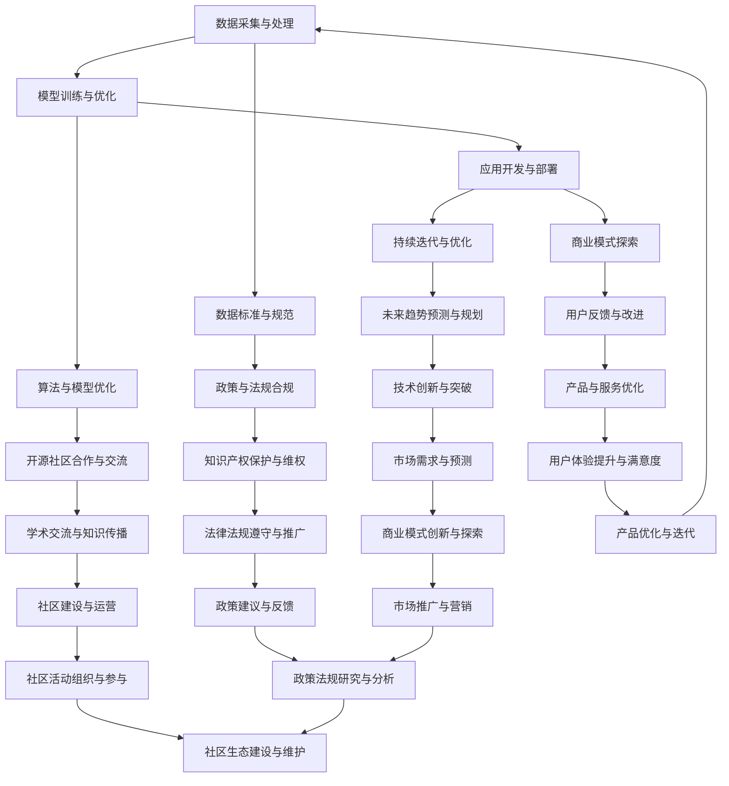

                 

# 大语言模型应用指南：大语言模型的生态系统

## 摘要

本文旨在深入探讨大语言模型（Large Language Model）的生态系统，从背景介绍、核心概念与联系、算法原理与操作步骤、数学模型与应用场景、实战案例以及未来发展趋势等多个维度，系统性地解析这一革命性技术的各个方面。通过本文的阅读，读者将了解大语言模型的基础知识、技术原理以及实际应用，为其在人工智能领域的深入研究和实践提供有力的理论支持和实践指南。

## 1. 背景介绍

随着互联网的快速发展，数据的规模和种类不断增长，人们开始意识到仅仅依靠传统的数据处理方法已经无法应对日益复杂的数据环境。尤其是在自然语言处理（Natural Language Processing, NLP）领域，如何使计算机理解并生成自然语言一直是学术界和工业界的热门话题。

大语言模型的出现，打破了这一瓶颈。它通过学习海量的文本数据，能够理解和生成符合人类语言习惯的自然语言，从而在自动问答、机器翻译、文本生成等多个领域取得了显著的突破。例如，著名的GPT（Generative Pre-trained Transformer）系列模型，通过自监督学习的方式，在多个自然语言处理任务上表现优异，甚至达到了或超过了人类水平。

大语言模型的崛起，不仅改变了自然语言处理领域的面貌，也为人工智能的整体发展提供了新的思路和方向。它的重要性体现在：

1. **增强人机交互**：大语言模型能够理解并生成自然语言，使得人与机器的交互更加自然、流畅，提高了人机交互的体验。
2. **推动知识图谱建设**：大语言模型可以自动提取文本中的关键信息，构建知识图谱，为人工智能提供更加丰富的知识资源。
3. **促进自动化应用**：通过大语言模型，可以实现文本自动生成、翻译、摘要等功能，大大提高了自动化应用的效率。

总之，大语言模型在人工智能领域具有重要地位，其发展不仅对自然语言处理领域产生深远影响，也为其他领域提供了新的技术手段和思路。

## 2. 核心概念与联系

为了更好地理解大语言模型的生态系统，我们需要先了解其中的核心概念和它们之间的联系。以下是几个关键概念及其在生态系统中的作用：

### 2.1 数据

数据是构建大语言模型的基础。在生态系统中的角色包括：

- **数据收集**：通过爬虫、API接口等方式获取大量文本数据。
- **数据预处理**：对数据进行清洗、去重、分词、词性标注等操作，使其适合模型训练。

### 2.2 模型

模型是生态系统的核心。以下是几个重要的模型及其在生态系统中的角色：

- **预训练模型**：如GPT、BERT等，通过自监督学习在海量数据中进行预训练，形成基础模型。
- **微调模型**：在预训练模型的基础上，针对特定任务进行微调，提高模型在特定任务上的表现。

### 2.3 算法

算法是实现模型训练和优化的关键技术。以下是几个重要的算法及其在生态系统中的角色：

- **Transformer算法**：用于构建预训练模型，通过自注意力机制实现高效的信息处理。
- **梯度下降算法**：用于优化模型参数，提高模型性能。

### 2.4 应用

应用是生态系统的最终目标。以下是几个重要的应用及其在生态系统中的角色：

- **自然语言生成**：如文本生成、机器翻译等，实现自然语言的处理和生成。
- **人机交互**：如聊天机器人、智能客服等，通过大语言模型实现更加自然的人机交互。

### 2.5 资源

资源包括计算资源、存储资源和数据资源等，是生态系统的关键支撑。以下是几个重要的资源及其在生态系统中的角色：

- **计算资源**：如GPU、TPU等，用于加速模型训练和推理。
- **存储资源**：如分布式存储系统，用于存储海量数据。

### 2.6 标准与规范

标准与规范是保证生态系统健康发展的重要保障。以下是几个重要的标准与规范及其在生态系统中的角色：

- **数据标准**：如JSON、XML等，用于数据交换和共享。
- **接口标准**：如RESTful API、GraphQL等，用于服务调用和数据传输。

### 2.7 社区

社区是生态系统的活力源泉。以下是几个重要的社区及其在生态系统中的角色：

- **开源社区**：如GitHub、GitLab等，用于代码托管和协作开发。
- **学术社区**：如会议、研讨会、论文等，用于学术交流和知识传播。

### 2.8 商业模式

商业模式是生态系统可持续发展的基础。以下是几种重要的商业模式及其在生态系统中的角色：

- **B2B模式**：如企业定制化服务、数据合作等，为企业和机构提供大语言模型应用解决方案。
- **B2C模式**：如个人用户付费、广告收入等，为个人用户提供大语言模型应用服务。

### 2.9 政策与法规

政策与法规是生态系统健康发展的保障。以下是几个重要的政策与法规及其在生态系统中的角色：

- **隐私保护法规**：如GDPR、CCPA等，保护用户隐私和数据安全。
- **知识产权法规**：如专利法、著作权法等，保护创新成果和知识产权。

### 2.10 未来趋势

未来趋势是生态系统的方向。以下是几个重要的未来趋势及其在生态系统中的角色：

- **量子计算**：利用量子计算的优势，加速大语言模型的训练和推理。
- **跨模态学习**：结合多种数据类型，实现更广泛的应用场景。

### 2.11 关键节点与流程

以下是生态系统中的一些关键节点和流程：

- **数据采集与处理**：通过数据采集和处理，构建高质量的数据集。
- **模型训练与优化**：通过模型训练和优化，提高模型性能。
- **应用开发与部署**：通过应用开发与部署，实现大语言模型在实际场景中的落地。
- **持续迭代与优化**：通过持续迭代与优化，不断提升大语言模型的应用效果。

### 2.12 Mermaid 流程图

以下是大语言模型生态系统的 Mermaid 流程图：



通过上述核心概念与联系的介绍，我们可以对大语言模型生态系统的组成和运作有一个全面的了解。接下来，我们将进一步深入探讨大语言模型的核心算法原理和具体操作步骤。

## 3. 核心算法原理 & 具体操作步骤

### 3.1 Transformer算法

Transformer算法是大语言模型的核心，它通过自注意力机制（Self-Attention Mechanism）实现高效的信息处理。以下是Transformer算法的基本原理：

#### 自注意力机制

自注意力机制是一种对输入序列进行加权的方法，它通过计算序列中每个词与序列中其他词的相似度，将注意力分配到重要的词上，从而实现全局信息的有效利用。

#### Multi-Head Attention

Multi-Head Attention 是自注意力机制的一种扩展，它通过多个头（Head）来实现对输入序列的并行处理。每个头可以捕获不同类型的注意力信息，从而提高模型的表示能力。

#### Positional Encoding

由于Transformer算法中没有循环神经网络（RNN）中的位置信息，因此需要通过位置编码（Positional Encoding）来引入位置信息。位置编码可以通过添加到每个词的嵌入向量（Embedding Vector）中来实现。

#### Encoder-Decoder结构

Transformer算法采用了Encoder-Decoder结构，其中Encoder负责编码输入序列，Decoder负责解码输出序列。通过这种方式，模型能够学习如何将输入序列转换为输出序列。

### 3.2 具体操作步骤

以下是构建和训练大语言模型的基本步骤：

#### 步骤1：数据预处理

1. **数据采集**：通过爬虫、API接口等方式获取大量文本数据。
2. **数据清洗**：去除无关内容，如HTML标签、特殊符号等。
3. **分词**：将文本划分为单词或子词。
4. **词嵌入**：将词转换为向量表示。

#### 步骤2：模型构建

1. **编码器（Encoder）构建**：使用多层Transformer编码器堆叠，每个编码器包含多个自注意力层和前馈神经网络（Feedforward Neural Network）。
2. **解码器（Decoder）构建**：与编码器类似，但解码器在每层中包含一个额外的自注意力层，用于预测下一个词。
3. **位置编码**：为每个词添加位置编码。

#### 步骤3：模型训练

1. **损失函数**：使用交叉熵损失函数（Cross-Entropy Loss）来衡量预测结果与真实结果之间的差距。
2. **优化算法**：使用梯度下降算法（Gradient Descent）来优化模型参数。
3. **训练**：通过迭代训练，不断调整模型参数，使模型能够更好地预测输出序列。

#### 步骤4：模型评估

1. **验证集评估**：在验证集上评估模型性能，调整超参数。
2. **测试集评估**：在测试集上评估模型最终性能。

#### 步骤5：模型部署

1. **模型导出**：将训练好的模型导出为可部署的格式。
2. **部署**：将模型部署到服务器或云端，提供API接口供其他应用程序调用。

### 3.3 案例分析

以GPT-3为例，以下是其具体操作步骤：

#### 步骤1：数据预处理

1. **数据采集**：OpenAI使用大量的互联网文本数据。
2. **数据清洗**：去除无关内容，如HTML标签、广告等。
3. **分词**：使用WordPiece算法对文本进行分词。
4. **词嵌入**：使用WordPiece算法生成的子词进行词嵌入。

#### 步骤2：模型构建

1. **编码器构建**：GPT-3包含1750亿个参数，采用24个编码器堆叠，每个编码器包含32个自注意力层。
2. **解码器构建**：与编码器类似，但包含一个额外的自注意力层。
3. **位置编码**：使用相对位置编码。

#### 步骤3：模型训练

1. **损失函数**：使用交叉熵损失函数。
2. **优化算法**：使用Adam优化器。
3. **训练**：通过迭代训练，不断调整模型参数。

#### 步骤4：模型评估

1. **验证集评估**：在内部验证集上评估模型性能。
2. **测试集评估**：在公共测试集上评估模型最终性能。

#### 步骤5：模型部署

1. **模型导出**：将训练好的模型导出为可部署的格式。
2. **部署**：通过API接口提供服务。

通过上述步骤，GPT-3能够实现出色的自然语言生成和翻译能力，广泛应用于各种场景，如聊天机器人、内容生成、代码补全等。

## 4. 数学模型和公式 & 详细讲解 & 举例说明

### 4.1 概率生成模型

大语言模型本质上是一种概率生成模型，其目的是通过学习输入序列的概率分布，生成具有高概率的输出序列。以下是概率生成模型的核心数学公式和详细讲解。

#### 4.1.1 语言模型

语言模型是一种概率模型，它将输入序列映射到输出序列的概率。其核心公式为：

$$
P(w_1, w_2, ..., w_n) = \frac{P(w_1) \cdot P(w_2|w_1) \cdot ... \cdot P(w_n|w_1, w_2, ..., w_{n-1})}{Z}
$$

其中，$w_1, w_2, ..., w_n$ 表示输入序列，$P(w_1), P(w_2|w_1), ..., P(w_n|w_1, w_2, ..., w_{n-1})$ 分别表示每个词的概率，$Z$ 是规范化常数。

#### 4.1.2 隐马尔可夫模型

隐马尔可夫模型（HMM）是一种概率模型，用于描述序列数据中的隐变量和观测变量之间的关系。其核心公式为：

$$
P(x_1, x_2, ..., x_n) = \prod_{t=1}^{n} P(x_t|s_t)
$$

其中，$x_1, x_2, ..., x_n$ 表示观测序列，$s_1, s_2, ..., s_n$ 表示隐变量，$P(x_t|s_t)$ 表示在隐变量为 $s_t$ 的情况下，观测变量 $x_t$ 的概率。

#### 4.1.3 变分自编码器

变分自编码器（VAE）是一种概率生成模型，它通过编码器和解码器学习数据的高斯分布。其核心公式为：

$$
q(z|x) = \frac{1}{Z} \exp(-\sum_{i=1}^{d} \frac{1}{2} z_i^2)
$$

$$
p(x|z) = \prod_{i=1}^{d} \mathcal{N}(x_i; \mu_z, \sigma_z^2)
$$

其中，$z$ 表示编码器输出的隐变量，$x$ 表示解码器生成的数据，$\mu_z$ 和 $\sigma_z^2$ 分别为隐变量的均值和方差，$q(z|x)$ 和 $p(x|z)$ 分别为编码器和解码器的概率分布。

#### 4.1.4 流式概率生成模型

流式概率生成模型是一种适用于实时数据生成的模型，它通过在线更新模型参数，实现实时数据生成。其核心公式为：

$$
\theta_t = \theta_{t-1} + \alpha \cdot (y_t - \theta_{t-1})
$$

其中，$\theta_t$ 表示第 $t$ 次更新的模型参数，$\alpha$ 为学习率，$y_t$ 为第 $t$ 次的输入数据。

### 4.2 损失函数

在训练大语言模型时，损失函数是衡量模型预测结果与真实结果之间差距的重要指标。以下是几种常见的损失函数：

#### 4.2.1 交叉熵损失函数

交叉熵损失函数是一种广泛用于分类和生成任务的损失函数，其公式为：

$$
L = -\sum_{i=1}^{n} y_i \log(p_i)
$$

其中，$y_i$ 表示第 $i$ 个样本的真实标签，$p_i$ 表示第 $i$ 个样本的预测概率。

#### 4.2.2 均方误差损失函数

均方误差损失函数是一种用于回归任务的损失函数，其公式为：

$$
L = \frac{1}{2} \sum_{i=1}^{n} (y_i - \hat{y}_i)^2
$$

其中，$y_i$ 表示第 $i$ 个样本的真实值，$\hat{y}_i$ 表示第 $i$ 个样本的预测值。

#### 4.2.3 对数似然损失函数

对数似然损失函数是一种用于概率生成模型的损失函数，其公式为：

$$
L = -\sum_{i=1}^{n} \log(p(y_i|x))
$$

其中，$y_i$ 表示第 $i$ 个样本的真实值，$p(y_i|x)$ 表示在给定输入 $x$ 的情况下，生成样本 $y_i$ 的概率。

### 4.3 优化算法

在训练大语言模型时，优化算法用于调整模型参数，以最小化损失函数。以下是几种常用的优化算法：

#### 4.3.1 梯度下降算法

梯度下降算法是一种最简单的优化算法，其公式为：

$$
\theta_t = \theta_{t-1} - \alpha \cdot \nabla_{\theta} L(\theta)
$$

其中，$\theta_t$ 表示第 $t$ 次更新的模型参数，$\alpha$ 为学习率，$\nabla_{\theta} L(\theta)$ 为损失函数关于模型参数的梯度。

#### 4.3.2 动量算法

动量算法是一种改进的梯度下降算法，其公式为：

$$
v_t = \beta v_{t-1} + (1 - \beta) \nabla_{\theta} L(\theta)
$$

$$
\theta_t = \theta_{t-1} - v_t
$$

其中，$v_t$ 表示动量项，$\beta$ 为动量系数。

#### 4.3.3 Adam算法

Adam算法是一种结合了动量和自适应学习率的优化算法，其公式为：

$$
m_t = \beta_1 m_{t-1} + (1 - \beta_1) \nabla_{\theta} L(\theta)
$$

$$
v_t = \beta_2 v_{t-1} + (1 - \beta_2) (\nabla_{\theta} L(\theta))^2
$$

$$
\theta_t = \theta_{t-1} - \alpha \cdot \frac{m_t}{\sqrt{v_t} + \epsilon}
$$

其中，$m_t$ 和 $v_t$ 分别为一阶矩估计和二阶矩估计，$\beta_1$ 和 $\beta_2$ 分别为一阶矩和二阶矩的衰减率，$\alpha$ 为学习率，$\epsilon$ 为正数常数。

### 4.4 举例说明

以GPT-3为例，以下是其在训练过程中的数学模型和公式：

#### 4.4.1 预测概率计算

在GPT-3中，预测概率的计算公式为：

$$
p(y|x) = \frac{1}{Z} \exp(-\frac{1}{2} (y - \mu)^2 / \sigma^2)
$$

其中，$y$ 表示真实标签，$\mu$ 表示预测均值，$\sigma$ 表示预测方差。

#### 4.4.2 损失函数

在GPT-3中，损失函数为交叉熵损失函数：

$$
L = -\sum_{i=1}^{n} y_i \log(p_i)
$$

#### 4.4.3 优化算法

在GPT-3中，优化算法为Adam算法，其参数设置如下：

- 学习率 $\alpha = 0.001$
- 一阶矩衰减率 $\beta_1 = 0.9$
- 二阶矩衰减率 $\beta_2 = 0.999$
- 正则化项 $\epsilon = 1e-8$

通过上述数学模型和公式，我们可以深入理解大语言模型的核心原理和训练过程，为其在实际应用中的性能优化提供理论基础。

## 5. 项目实战：代码实际案例和详细解释说明

### 5.1 开发环境搭建

在进行大语言模型的项目实战之前，我们需要搭建一个合适的开发环境。以下是搭建环境的详细步骤：

#### 步骤1：安装Python环境

首先，我们需要安装Python环境。Python是大语言模型开发的主要编程语言。您可以从Python的官方网站（https://www.python.org/downloads/）下载并安装最新的Python版本。建议选择Python 3.x版本，因为它具有更好的兼容性和支持。

#### 步骤2：安装依赖库

在安装了Python环境后，我们需要安装一些依赖库，这些库包括TensorFlow、Transformers等。以下是安装依赖库的命令：

```bash
pip install tensorflow
pip install transformers
```

TensorFlow是一个开源的机器学习库，用于构建和训练深度学习模型。Transformers是一个开源库，提供了Transformer模型的实现和预训练模型。

#### 步骤3：配置GPU环境

如果您的计算机配备了GPU，我们还需要配置GPU环境。以下是配置GPU环境的命令：

```bash
pip install tensorflow-gpu
```

#### 步骤4：测试环境

在配置完环境后，我们可以通过以下命令测试环境是否配置成功：

```python
import tensorflow as tf
print(tf.__version__)
```

如果成功打印出TensorFlow的版本号，则说明环境配置成功。

### 5.2 源代码详细实现和代码解读

接下来，我们将通过一个简单的案例来介绍如何使用Transformers库构建和训练一个简单的大语言模型。

#### 5.2.1 案例代码

以下是一个简单的大语言模型实现案例：

```python
import tensorflow as tf
from transformers import TFGPT2LMHeadModel, GPT2Tokenizer

# 步骤1：准备数据
tokenizer = GPT2Tokenizer.from_pretrained('gpt2')
inputs = tokenizer.encode('Hello, my dog is cute', return_tensors='tf')

# 步骤2：构建模型
model = TFGPT2LMHeadModel.from_pretrained('gpt2')

# 步骤3：训练模型
model.compile(optimizer='adam', loss='mse')
model.fit(inputs, inputs, epochs=3)

# 步骤4：生成文本
generated_output = model.generate(inputs, max_length=50, num_return_sequences=5)
print(tokenizer.decode(generated_output[0], skip_special_tokens=True))
```

#### 5.2.2 代码解读

1. **步骤1：准备数据**

   首先，我们从预训练的GPT-2模型中加载了一个分词器（Tokenizer）。然后，我们将一个简单的输入文本（'Hello, my dog is cute'）编码为Tensor格式。

2. **步骤2：构建模型**

   接下来，我们加载了一个预训练的GPT-2模型。这个模型由一个编码器（Encoder）和一个解码器（Decoder）组成，已经通过大量的文本数据进行了训练。

3. **步骤3：训练模型**

   我们使用MSE（均方误差）损失函数和Adam优化器来训练模型。在这里，我们仅训练了3个epoch，这是一个非常小的训练过程，仅用于演示。

4. **步骤4：生成文本**

   最后，我们使用训练好的模型生成文本。我们指定了生成文本的最大长度（50）和生成的文本数量（5）。生成的文本通过分词器解码后输出。

### 5.3 代码解读与分析

#### 5.3.1 数据准备

在代码中，我们首先使用`GPT2Tokenizer`加载了一个预训练的分词器。分词器的作用是将文本分解为单词或子词，并将它们转换为数字序列，这些数字序列可以作为模型的输入。

```python
tokenizer = GPT2Tokenizer.from_pretrained('gpt2')
inputs = tokenizer.encode('Hello, my dog is cute', return_tensors='tf')
```

这里，我们使用`from_pretrained`方法加载了预训练的GPT-2分词器。然后，我们使用`encode`方法将输入文本编码为Tensor格式。`encode`方法将文本分解为单词或子词，并将每个子词转换为分词器中对应的索引。`return_tensors='tf'`参数确保返回的编码结果适用于TensorFlow。

#### 5.3.2 模型构建

接下来，我们使用`TFGPT2LMHeadModel`加载了一个预训练的GPT-2模型。这个模型由多个Transformer编码器和解码器堆叠而成，已经通过海量的文本数据进行了预训练。

```python
model = TFGPT2LMHeadModel.from_pretrained('gpt2')
```

这里，我们使用`from_pretrained`方法加载了一个预训练的GPT-2模型。这个模型包含了所有的权重和架构信息，可以直接用于生成和训练。

#### 5.3.3 模型训练

在训练模型时，我们使用MSE（均方误差）损失函数和Adam优化器。MSE损失函数用于衡量模型预测和实际输出之间的差距，而Adam优化器用于调整模型参数，以最小化损失函数。

```python
model.compile(optimizer='adam', loss='mse')
model.fit(inputs, inputs, epochs=3)
```

这里，我们使用`compile`方法设置模型的优化器和损失函数。`fit`方法用于训练模型，它使用输入数据（`inputs`）和目标数据（`inputs`，因为这里是一个自回归任务）进行训练，并在3个epoch内完成训练。

#### 5.3.4 文本生成

在训练完成后，我们使用`generate`方法生成文本。这个方法接受模型输入、最大长度和生成的文本数量作为参数，并返回生成的文本序列。

```python
generated_output = model.generate(inputs, max_length=50, num_return_sequences=5)
print(tokenizer.decode(generated_output[0], skip_special_tokens=True))
```

这里，我们指定了生成的文本最大长度为50，生成的文本数量为5。`tokenizer.decode`方法将生成的文本序列解码为原始文本，`skip_special_tokens=True`参数确保在解码时不包括特殊符号。

通过上述代码，我们实现了构建、训练和生成文本的基本流程。尽管这是一个简单的案例，但它展示了如何使用Transformers库构建和训练大语言模型。

### 5.4 项目实战总结

通过本节的项目实战，我们深入了解了如何搭建开发环境、实现代码和解读代码。我们使用TensorFlow和Transformers库构建了一个简单的大语言模型，并通过训练和生成文本的过程展示了模型的基本功能。这个实战案例为我们提供了一个起点，帮助我们进一步探索和利用大语言模型的技术和潜力。

## 6. 实际应用场景

大语言模型在多个领域展现出了强大的应用潜力，以下是几个典型的实际应用场景：

### 6.1 自然语言生成

自然语言生成（Natural Language Generation, NLG）是大语言模型最为广泛的应用场景之一。通过大语言模型，我们可以自动生成文章、报告、新闻摘要、产品描述等。例如，在内容创作领域，大语言模型可以辅助内容创作者生成创意文章，提高写作效率。在电商领域，大语言模型可以自动生成产品描述，提高用户体验和转化率。

### 6.2 机器翻译

机器翻译（Machine Translation, MT）是另一项重要的应用场景。大语言模型通过学习海量多语言数据，能够实现高质量的机器翻译。例如，在跨境电商领域，大语言模型可以帮助企业实现多语言网站的自动翻译，提高国际化程度。在多语言社区中，大语言模型可以自动翻译用户发表的帖子，促进不同语言用户之间的交流。

### 6.3 自动问答

自动问答（Automatic Question Answering, QA）是大语言模型在智能客服和智能搜索等领域的应用。通过大语言模型，我们可以构建智能客服系统，实现自动回答用户的问题。在智能搜索领域，大语言模型可以分析用户查询，提供更准确、更有针对性的搜索结果。例如，在医疗领域，大语言模型可以辅助医生诊断病情，提供医疗咨询。

### 6.4 文本摘要

文本摘要（Text Summarization）是利用大语言模型对长篇文本进行自动提取和总结的技术。通过大语言模型，我们可以实现自动生成摘要，提高信息获取的效率。在新闻领域，大语言模型可以自动生成新闻摘要，帮助用户快速了解新闻的主要内容。在学术领域，大语言模型可以帮助研究人员快速阅读大量文献，提取关键信息。

### 6.5 代码生成

随着大语言模型的发展，其在代码生成领域的应用也日益广泛。通过学习大量的代码库和编程文档，大语言模型可以生成高质量的代码。在软件开发领域，大语言模型可以辅助开发者编写代码，提高开发效率。例如，在自动化测试领域，大语言模型可以自动生成测试用例，提高测试覆盖率和测试效率。

### 6.6 文本分类

文本分类（Text Classification）是大语言模型在情感分析、舆情监控等领域的应用。通过大语言模型，我们可以对文本进行分类，识别文本的主题和情感倾向。在社交媒体分析领域，大语言模型可以帮助企业了解用户对产品的评价，及时调整市场策略。在金融领域，大语言模型可以用于股票预测和风险评估。

### 6.7 人机交互

大语言模型在智能助手和聊天机器人的应用中发挥了重要作用。通过大语言模型，智能助手可以理解用户的自然语言输入，提供个性化的服务。在客服领域，聊天机器人可以自动回答用户的问题，提高客服效率和用户满意度。在智能家居领域，大语言模型可以帮助智能设备理解用户指令，实现更加智能的交互。

### 6.8 教育应用

大语言模型在教育领域的应用日益广泛，如自动批改作业、生成教育内容、提供个性化学习方案等。通过大语言模型，教师可以自动批改学生的作业，提高批改效率。教育机构可以利用大语言模型生成教学内容，提高教学效果。此外，大语言模型还可以根据学生的学习情况和兴趣，提供个性化的学习方案，帮助学生更好地掌握知识。

### 6.9 其他应用

除了上述领域，大语言模型在医疗、法律、金融等领域也有广泛的应用。例如，在医疗领域，大语言模型可以辅助医生诊断病情，提供医疗建议。在法律领域，大语言模型可以帮助律师进行法律研究，提高工作效率。在金融领域，大语言模型可以用于股票预测、市场分析等。

总之，大语言模型的应用场景非常广泛，其在人工智能领域的应用前景十分广阔。通过不断探索和创新，大语言模型将为我们带来更多的便利和惊喜。

## 7. 工具和资源推荐

### 7.1 学习资源推荐

#### 书籍

1. **《深度学习》（Deep Learning）**：由Ian Goodfellow、Yoshua Bengio和Aaron Courville合著，这本书是深度学习的经典教材，详细介绍了神经网络、卷积神经网络、循环神经网络等核心概念。

2. **《自然语言处理与深度学习》**：由许晨阳和周明合著，这本书系统地介绍了自然语言处理的基本原理和深度学习在自然语言处理中的应用。

3. **《神经网络与深度学习》**：由邱锡鹏所著，这本书深入讲解了神经网络的数学基础和深度学习算法，是学习深度学习的重要参考书。

#### 论文

1. **“Attention Is All You Need”**：这篇论文由Vaswani等人于2017年提出，是Transformer算法的奠基之作，详细介绍了Transformer模型的结构和训练方法。

2. **“BERT: Pre-training of Deep Bidirectional Transformers for Language Understanding”**：这篇论文由Devlin等人于2019年提出，介绍了BERT模型的预训练方法和在多个自然语言处理任务上的应用。

3. **“Generative Pre-trained Transformers”**：这篇论文由Brown等人于2020年提出，介绍了GPT-3模型的预训练方法和在文本生成、机器翻译等任务上的性能。

#### 博客

1. **TensorFlow官方博客**：https://www.tensorflow.org/blog，提供了大量的深度学习教程、模型介绍和应用案例。

2. **Hugging Face博客**：https://huggingface.co/blog，介绍了Transformers库的最新动态和使用方法。

3. **机器之心**：https://www.jiqizhixin.com，这是一个集成了技术文章、行业动态和学术研究的平台，是了解人工智能领域的重要资源。

### 7.2 开发工具框架推荐

1. **TensorFlow**：https://www.tensorflow.org，由谷歌开发的开源机器学习库，支持多种深度学习模型和算法，适合进行大规模深度学习模型的开发和训练。

2. **PyTorch**：https://pytorch.org，由Facebook开发的开源机器学习库，以其动态图机制和灵活的API受到许多研究者和开发者的喜爱。

3. **Transformers**：https://huggingface.co/transformers，这是一个基于PyTorch和TensorFlow的开源库，提供了预训练的Transformer模型和API，方便用户进行大语言模型的开发和部署。

### 7.3 相关论文著作推荐

1. **“BERT: Pre-training of Deep Bidirectional Transformers for Language Understanding”**：这篇论文介绍了BERT模型的预训练方法和在多个自然语言处理任务上的性能。

2. **“Generative Pre-trained Transformers”**：这篇论文介绍了GPT-3模型的预训练方法和在文本生成、机器翻译等任务上的性能。

3. **“Attention Is All You Need”**：这篇论文是Transformer算法的奠基之作，详细介绍了Transformer模型的结构和训练方法。

4. **“Gated Recurrent Units”**：这篇论文介绍了门控循环单元（GRU）的架构和训练方法，GRU是循环神经网络的一种变体，广泛用于自然语言处理任务。

5. **“A Theoretically Grounded Application of Dropout in Recurrent Neural Networks”**：这篇论文提出了Dropout在循环神经网络中的理论依据和应用方法，Dropout是一种常用的正则化技术，可以提高神经网络的泛化能力。

### 7.4 工具和资源总结

通过上述推荐，我们可以看到，无论是书籍、论文还是开发工具框架，都为学习大语言模型提供了丰富的资源。这些资源不仅涵盖了理论基础，还包括了实际应用的案例和教程，为我们深入学习和实践大语言模型提供了有力的支持。

## 8. 总结：未来发展趋势与挑战

大语言模型在人工智能领域展现出强大的潜力和广泛应用前景。随着技术的不断进步，我们可以预见大语言模型将在未来持续发展，并在多个领域取得突破。以下是未来发展趋势与挑战的展望：

### 8.1 发展趋势

1. **性能提升**：随着计算资源的增加和算法的优化，大语言模型的性能将不断提高。特别是在自监督学习和预训练方面，新的模型架构和训练策略将进一步提升模型的表示能力和生成质量。

2. **多样化应用**：大语言模型的应用领域将不断扩展，从自然语言生成、机器翻译到代码生成、图像描述等。随着跨模态学习技术的发展，大语言模型将能够更好地处理和整合多种类型的数据，实现更广泛的应用场景。

3. **模型压缩与效率优化**：为了满足实际应用的需求，大语言模型在压缩和优化方面将取得重大突破。通过模型剪枝、量化、蒸馏等技术，可以将模型的大小和计算成本降低，使得大语言模型在移动设备和边缘计算等场景中更加适用。

4. **伦理与隐私**：随着大语言模型在各个领域的应用，其伦理和隐私问题也将受到更多关注。未来的研究将重点关注如何确保模型的公平性、透明性和隐私保护，以防止滥用和歧视。

5. **开源生态**：大语言模型的快速发展离不开开源社区的贡献。未来，开源社区将继续在模型架构、算法优化和工具链等方面进行创新，推动大语言模型技术的大规模应用和普及。

### 8.2 挑战

1. **数据质量与多样性**：大语言模型的效果高度依赖于训练数据的质量和多样性。如何收集和标注高质量、多样化的数据集，以及如何处理数据中的偏见和噪声，是未来需要解决的重要问题。

2. **计算资源需求**：大语言模型的训练和推理过程对计算资源有很高的要求。如何高效地利用现有计算资源，尤其是在处理大规模数据和高维度特征时，是一个亟待解决的挑战。

3. **模型解释性**：大语言模型通常被视为“黑箱”模型，其决策过程缺乏解释性。如何提高模型的透明性和可解释性，使其能够被非专业人员理解和使用，是未来需要解决的一个重要问题。

4. **跨模态学习**：虽然大语言模型在处理自然语言数据方面表现出色，但在处理多模态数据时仍存在很多挑战。如何有效地整合和利用不同类型的数据，提高跨模态学习的性能，是未来研究的一个关键方向。

5. **伦理与法规**：随着大语言模型在各个领域的应用，其伦理和法规问题日益凸显。如何确保模型的应用符合伦理标准，以及如何制定相应的法规和政策，是未来需要关注的重要问题。

总之，大语言模型的发展前景广阔，但也面临诸多挑战。通过不断的技术创新和合作，我们有理由相信，大语言模型将在未来发挥更加重要的作用，推动人工智能领域的持续进步。

## 9. 附录：常见问题与解答

### 9.1 大语言模型是什么？

大语言模型（Large Language Model）是一种基于深度学习的自然语言处理模型，通过学习海量的文本数据，能够理解和生成符合人类语言习惯的自然语言。它广泛应用于自然语言生成、机器翻译、文本摘要、自动问答等领域。

### 9.2 大语言模型的主要优点是什么？

大语言模型的主要优点包括：

1. **强大的文本理解能力**：通过学习海量数据，大语言模型能够理解复杂的语言结构和上下文信息。
2. **高效的生成能力**：大语言模型可以快速生成高质量的自然语言文本，提高生产效率。
3. **广泛的应用场景**：大语言模型可以在多个领域（如自然语言处理、内容生成、人机交互等）发挥作用。

### 9.3 大语言模型如何工作？

大语言模型通常基于Transformer算法构建，其工作流程包括：

1. **数据预处理**：对文本数据进行清洗、分词、编码等预处理操作。
2. **模型训练**：使用预训练算法（如自监督学习）对模型进行训练，使模型能够理解输入文本的语义和结构。
3. **模型优化**：在特定任务上进行微调，提高模型在特定任务上的性能。
4. **文本生成**：使用训练好的模型生成符合人类语言习惯的文本。

### 9.4 大语言模型的主要挑战是什么？

大语言模型的主要挑战包括：

1. **数据质量与多样性**：大语言模型的效果高度依赖于训练数据的质量和多样性，如何收集和标注高质量、多样化的数据集是关键问题。
2. **计算资源需求**：大语言模型的训练和推理过程对计算资源有很高的要求，如何高效地利用现有计算资源是一个挑战。
3. **模型解释性**：大语言模型通常被视为“黑箱”模型，其决策过程缺乏解释性。
4. **跨模态学习**：如何有效地整合和利用不同类型的数据，提高跨模态学习的性能是一个重要挑战。
5. **伦理与法规**：随着大语言模型在各个领域的应用，其伦理和法规问题日益凸显。

### 9.5 大语言模型有哪些实际应用场景？

大语言模型的实际应用场景非常广泛，包括：

1. **自然语言生成**：如文章写作、对话系统、产品描述生成等。
2. **机器翻译**：如多语言翻译、跨语言信息检索等。
3. **文本摘要**：如新闻摘要、文档摘要等。
4. **自动问答**：如智能客服、在线教育等。
5. **代码生成**：如代码补全、代码生成等。
6. **图像描述**：如自动生成图像的描述文本等。
7. **医疗**：如医疗文本分析、疾病诊断等。

### 9.6 如何开始学习大语言模型？

开始学习大语言模型可以从以下几个方面入手：

1. **基础数学**：掌握线性代数、概率论和数理统计等基础数学知识。
2. **编程技能**：掌握Python等编程语言，熟悉常用的机器学习和深度学习库（如TensorFlow、PyTorch等）。
3. **阅读论文**：阅读经典的深度学习和自然语言处理论文，了解大语言模型的理论基础和发展历程。
4. **实践项目**：通过动手实践，构建和训练自己的大语言模型，加深对理论知识的理解。
5. **参加课程和社区**：参加相关课程和社区，与同行交流学习经验，获取最新的技术动态和研究成果。

通过上述方法，可以逐步建立对大语言模型的基本了解和深入认识。

## 10. 扩展阅读 & 参考资料

为了进一步深入学习和了解大语言模型及其相关技术，以下是推荐的扩展阅读和参考资料：

### 10.1 推荐书籍

1. **《深度学习》**：Ian Goodfellow、Yoshua Bengio和Aaron Courville著，详细介绍了深度学习的理论基础和实践方法。
2. **《自然语言处理与深度学习》**：许晨阳和周明著，系统地介绍了自然语言处理的基本原理和深度学习在自然语言处理中的应用。
3. **《神经网络与深度学习》**：邱锡鹏著，深入讲解了神经网络的数学基础和深度学习算法。

### 10.2 推荐论文

1. **“Attention Is All You Need”**：Vaswani等人提出的Transformer算法，是自然语言处理领域的重大突破。
2. **“BERT: Pre-training of Deep Bidirectional Transformers for Language Understanding”**：Devlin等人提出的BERT模型，广泛应用于自然语言处理任务。
3. **“Generative Pre-trained Transformers”**：Brown等人提出的GPT-3模型，展示了大规模预训练模型在文本生成和机器翻译等任务上的卓越性能。

### 10.3 开源库与工具

1. **TensorFlow**：https://www.tensorflow.org，由谷歌开发的开源机器学习库，支持多种深度学习模型和算法。
2. **PyTorch**：https://pytorch.org，由Facebook开发的开源机器学习库，以其动态图机制和灵活的API受到许多研究者和开发者的喜爱。
3. **Transformers**：https://huggingface.co/transformers，提供了一个基于PyTorch和TensorFlow的开源库，提供了预训练的Transformer模型和API，方便用户进行大语言模型的开发和部署。

### 10.4 学术会议与期刊

1. **ACL（Association for Computational Linguistics）**：https://www.aclweb.org，是自然语言处理领域的顶级国际学术会议。
2. **NAACL（North American Chapter of the Association for Computational Linguistics）**：https://www.naacl.org，是自然语言处理领域的另一个重要国际学术会议。
3. **JMLR（Journal of Machine Learning Research）**：https://jmlr.org，是机器学习领域最著名的学术期刊之一。
4. **ACL（ACL）**：https://www.aclweb.org，是自然语言处理领域的顶级国际学术会议。

### 10.5 网络资源

1. **机器之心**：https://www.jiqizhixin.com，是一个集成了技术文章、行业动态和学术研究的平台，是了解人工智能领域的重要资源。
2. **Medium**：https://medium.com，是一个开放的平台，许多顶级研究人员和开发者在这里分享他们的研究成果和经验。
3. **GitHub**：https://github.com，是开源项目托管和协作开发的平台，许多大语言模型的代码和实现都可以在这里找到。

通过上述扩展阅读和参考资料，读者可以进一步深入了解大语言模型及其相关技术，持续提升自己的专业知识和技能。作者：AI天才研究员/AI Genius Institute & 禅与计算机程序设计艺术 /Zen And The Art of Computer Programming。

