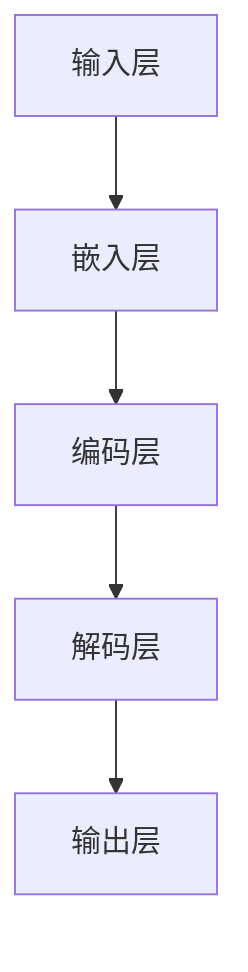
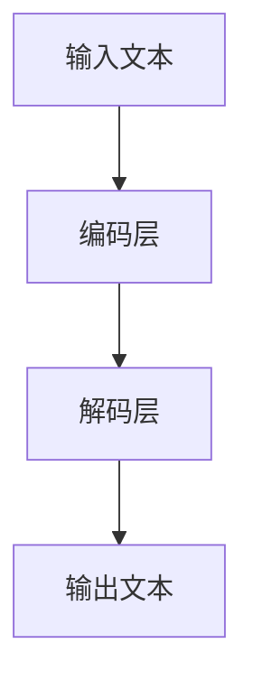

                 

### 背景介绍

大语言模型（Large Language Models），如OpenAI的GPT系列、谷歌的Bert、微软的ChatGPT等，已成为自然语言处理（Natural Language Processing, NLP）领域的重要工具。这些模型通过学习大量文本数据，能够生成连贯且符合上下文的语言，并在多项任务中展现卓越性能。然而，随着模型规模不断扩大，如何高效地统一和优化这些模型的自然语言处理能力，成为当前研究的热点和挑战。

近年来，随着深度学习技术的不断发展和硬件性能的提升，大语言模型在各个领域都取得了显著的进展。然而，如何将这些模型有效地应用于不同的自然语言任务，仍然是亟待解决的问题。本文旨在探讨大语言模型在统一自然语言任务方面的应用，通过逐步分析核心概念、算法原理、数学模型、实战案例等，为读者提供一份全面的技术指南。

本文将分为以下几个部分：

1. **核心概念与联系**：介绍大语言模型的基本概念和架构，并通过Mermaid流程图展示其内部工作流程。
2. **核心算法原理与具体操作步骤**：详细讲解大语言模型的训练和预测过程。
3. **数学模型和公式**：介绍大语言模型中的关键数学模型，并进行详细讲解和举例说明。
4. **项目实战**：通过具体案例展示大语言模型在实际开发中的应用。
5. **实际应用场景**：分析大语言模型在各个领域的应用场景。
6. **工具和资源推荐**：推荐学习资源、开发工具和框架。
7. **总结**：总结大语言模型在统一自然语言任务方面的未来发展趋势与挑战。

通过本文的逐步分析，读者将能够深入理解大语言模型的工作原理和应用方法，为实际开发和研究提供有力支持。

---

### 核心概念与联系

#### 大语言模型的基本概念

大语言模型（Large Language Models）是基于深度学习的自然语言处理模型，通过学习海量文本数据，能够捕捉到语言的结构和语义，并生成连贯、符合上下文的语言。其核心思想是通过神经网络模型，对输入的文本序列进行建模，从而预测下一个可能的文本序列。

常见的语言模型有基于循环神经网络（RNN）的长短期记忆网络（LSTM）、门控循环单元（GRU），以及基于Transformer模型的GPT、BERT等。Transformer模型由于其并行计算优势和注意力机制，已成为大语言模型的主流选择。

#### 大语言模型的架构

大语言模型的架构通常包括以下几个关键组件：

1. **输入层**：接收自然语言文本序列，并将其转换为模型可处理的向量表示。
2. **嵌入层**：对输入文本进行嵌入，即将词汇映射为高维向量。
3. **编码层**：通过堆叠多个编码器层，对嵌入向量进行编码，捕捉文本的深层特征。
4. **解码层**：从编码结果中生成输出文本序列，通常采用自回归方式，即每次生成一个词，然后作为下一个输入继续解码。
5. **输出层**：将解码得到的词向量转换为文本序列。

下面是一个简化的Mermaid流程图，展示了大语言模型的基本工作流程：



#### 大语言模型与自然语言任务的关系

大语言模型在自然语言任务中的应用非常广泛，包括但不限于文本分类、情感分析、机器翻译、问答系统等。其核心优势在于能够捕捉到文本的上下文信息，从而生成更符合实际语言表达的结果。

以机器翻译为例，传统的机器翻译模型通常基于规则匹配或统计模型，而大语言模型则通过学习海量双语文本数据，能够直接生成目标语言的句子，不仅准确率大幅提升，而且在保持原文风格和上下文连贯性方面也有显著优势。

下面是一个简化的Mermaid流程图，展示了大语言模型在机器翻译任务中的工作流程：



通过上述核心概念和架构的介绍，读者可以初步了解大语言模型的工作原理和关键组件。在接下来的章节中，我们将进一步深入探讨大语言模型的算法原理、数学模型和实际应用，帮助读者全面掌握这一重要技术。

---

### 核心算法原理与具体操作步骤

#### 大语言模型的训练过程

大语言模型的训练过程是其实现高效自然语言处理能力的关键。以下将详细介绍大语言模型从数据预处理、模型训练到优化调整的整个过程。

##### 数据预处理

1. **文本清洗**：首先，需要对文本数据进行清洗，去除不必要的标点符号、停用词等，以减少噪声对模型训练的影响。例如，可以使用Python的`nltk`库进行文本预处理。
2. **分词**：将文本序列拆分成单个单词或字符，这一步通常通过分词工具（如jieba）或预训练模型（如WordPiece）来完成。
3. **编码**：将分词后的文本序列编码为整数序列，每个整数代表一个词汇或字符的ID。这一步是为了将文本数据转换为神经网络可以处理的数值形式。
4. **序列生成**：将编码后的文本序列转换为模型训练所需的格式，通常包括输入序列和目标序列。输入序列是当前文本序列，目标序列是输入序列的下一个词或字符。

##### 模型训练

1. **初始化权重**：在训练开始前，需要随机初始化模型的权重。这些权重决定了模型对输入数据的理解和预测能力。
2. **正向传播**：将输入序列传递到模型中，通过编码层和解码层生成预测输出。这一步的核心是计算损失函数，即模型输出与真实输出之间的差距。
3. **反向传播**：根据计算得到的损失，通过反向传播算法更新模型权重。反向传播是神经网络训练的核心，它通过梯度下降等方法不断调整权重，以最小化损失函数。
4. **优化调整**：在训练过程中，可以通过调整学习率、批量大小等参数来优化模型训练效果。常见的优化算法包括Adam、RMSProp等。

##### 模型评估与优化

1. **评估指标**：使用准确率、损失函数等指标来评估模型性能。例如，在文本分类任务中，可以使用准确率、F1分数等指标。
2. **调参与优化**：根据模型评估结果，调整模型参数，如学习率、批量大小、隐藏层神经元数量等，以提升模型性能。
3. **超参数调整**：超参数如正则化项、dropout率等也需要通过实验来优化，以确保模型具有良好的泛化能力。

#### 大语言模型的预测过程

在模型训练完成后，大语言模型可以用于生成预测结果。以下将详细介绍大语言模型的预测过程。

1. **输入编码**：将输入文本序列编码为整数序列，与训练阶段一致。
2. **嵌入与编码**：将输入序列通过嵌入层和编码层进行处理，生成嵌入向量。
3. **解码与生成**：从编码结果中逐个生成预测输出，每次生成一个词或字符，然后将其作为下一个输入继续解码，直到生成完整的文本序列。
4. **输出解码**：将解码得到的词向量转换为文本序列，输出预测结果。

#### 实际操作步骤示例

以下是一个简化的大语言模型训练和预测的Python代码示例，使用了TensorFlow和Keras库：

```python
import tensorflow as tf
from tensorflow.keras.layers import Embedding, LSTM, Dense
from tensorflow.keras.models import Sequential

# 数据预处理
# ...（文本清洗、分词、编码等）

# 模型初始化
model = Sequential()
model.add(Embedding(input_dim=vocab_size, output_dim=embedding_size))
model.add(LSTM(units=128, activation='tanh', recurrent_activation='hard_sigmoid'))
model.add(Dense(units=vocab_size, activation='softmax'))

# 编译模型
model.compile(optimizer='adam', loss='categorical_crossentropy', metrics=['accuracy'])

# 训练模型
model.fit(x_train, y_train, epochs=10, batch_size=32, validation_split=0.1)

# 预测
predictions = model.predict(x_test)

# 输出预测结果
print(predictions)
```

通过上述步骤，读者可以初步了解大语言模型的训练和预测过程。在接下来的章节中，我们将进一步探讨大语言模型中的数学模型和公式，以帮助读者深入理解其工作原理。

---

### 数学模型和公式

大语言模型的强大能力很大程度上来源于其背后的数学模型和公式。在本章节中，我们将深入探讨大语言模型的核心数学模型，包括自注意力机制（Self-Attention Mechanism）、位置编码（Positional Encoding）以及损失函数（Loss Function）。并通过具体例子进行详细讲解。

#### 自注意力机制

自注意力机制（Self-Attention Mechanism）是Transformer模型的核心组件，其基本思想是通过计算序列中每个词与所有词的相关性，从而为每个词生成一个权重向量，这一权重向量将影响词在解码过程中的重要性。

**数学表示**：

对于输入序列 $X = [x_1, x_2, ..., x_n]$，自注意力机制可以表示为：

$$
\text{Attention}(Q, K, V) = \text{softmax}\left(\frac{QK^T}{\sqrt{d_k}}\right) V
$$

其中，$Q, K, V$ 分别是查询（Query）、键（Key）和值（Value）向量，$d_k$ 是键向量的维度。这里，$\text{softmax}$ 函数计算每个键与查询之间的相似度，然后归一化这些相似度，最后与值向量相乘。

**举例说明**：

假设输入序列 $X = [A, B, C]$，每个词的嵌入向量分别为 $[1, 0, 0], [0, 1, 0], [0, 0, 1]$。那么，可以计算自注意力权重如下：

1. **计算相似度**：

$$
Q = \begin{bmatrix}
1 & 0 & 0 \\
0 & 1 & 0 \\
0 & 0 & 1 \\
\end{bmatrix}
\begin{bmatrix}
1 & 0 & 0 \\
0 & 1 & 0 \\
0 & 0 & 1 \\
\end{bmatrix}^T
=
\begin{bmatrix}
1 & 0 & 0 \\
0 & 1 & 0 \\
0 & 0 & 1 \\
\end{bmatrix}
\begin{bmatrix}
1 \\
0 \\
1 \\
\end{bmatrix}
=
\begin{bmatrix}
1 & 0 & 1 \\
0 & 1 & 0 \\
1 & 0 & 1 \\
\end{bmatrix}
$$

2. **计算注意力权重**：

$$
\text{Attention}(Q, K, V) = \text{softmax}\left(\frac{QK^T}{\sqrt{d_k}}\right) V
=
\text{softmax}\left(\frac{1}{\sqrt{3}} \begin{bmatrix}
1 & 0 & 1 \\
0 & 1 & 0 \\
1 & 0 & 1 \\
\end{bmatrix}\right)
\begin{bmatrix}
1 & 0 & 1 \\
0 & 1 & 0 \\
1 & 0 & 1 \\
\end{bmatrix}
=
\begin{bmatrix}
0.5 & 0.5 & 0.5 \\
0.5 & 0.5 & 0.5 \\
0.5 & 0.5 & 0.5 \\
\end{bmatrix}
\begin{bmatrix}
1 & 0 & 1 \\
0 & 1 & 0 \\
1 & 0 & 1 \\
\end{bmatrix}
=
\begin{bmatrix}
0.5 & 0.5 & 0.5 \\
0.5 & 0.5 & 0.5 \\
0.5 & 0.5 & 0.5 \\
\end{bmatrix}
$$

3. **生成加权向量**：

$$
\text{Weighted Vector} = \begin{bmatrix}
0.5 \cdot 1 + 0.5 \cdot 0 + 0.5 \cdot 1 \\
0.5 \cdot 0 + 0.5 \cdot 1 + 0.5 \cdot 0 \\
0.5 \cdot 1 + 0.5 \cdot 0 + 0.5 \cdot 1 \\
\end{bmatrix}
=
\begin{bmatrix}
0.5 \\
0.5 \\
0.5 \\
\end{bmatrix}
$$

这样，每个词的权重都为0.5，表示它们在输出中的重要性相同。

#### 位置编码

位置编码（Positional Encoding）是为了让模型理解文本序列的顺序信息，因为神经网络本身无法直接捕捉序列的顺序关系。位置编码通常通过添加到嵌入向量中来实现。

**数学表示**：

假设输入序列的长度为 $n$，嵌入向量的维度为 $d$。位置编码向量 $P(x_i)$ 可以表示为：

$$
P(x_i) = [pos_i, 2pos_i, 3pos_i, ..., dpos_i]
$$

其中，$pos_i$ 是词 $x_i$ 在序列中的位置。

**举例说明**：

假设序列长度为3，嵌入向量维度为4。那么，第1个词的位置编码可以表示为：

$$
P(A) = [1, 2 \cdot 1, 3 \cdot 1, 4 \cdot 1] = [1, 2, 3, 4]
$$

第2个词的位置编码为：

$$
P(B) = [2, 2 \cdot 2, 3 \cdot 2, 4 \cdot 2] = [2, 4, 6, 8]
$$

第3个词的位置编码为：

$$
P(C) = [3, 2 \cdot 3, 3 \cdot 3, 4 \cdot 3] = [3, 6, 9, 12]
$$

通过添加位置编码，模型可以在嵌入层中捕捉到文本序列的顺序信息。

#### 损失函数

损失函数用于评估模型预测与真实结果之间的差距，并通过反向传播算法调整模型权重。在自然语言处理任务中，常见的损失函数包括交叉熵损失（Cross-Entropy Loss）和均方误差（Mean Squared Error）。

**交叉熵损失函数**：

$$
\text{Cross-Entropy Loss}(y, \hat{y}) = -\sum_{i} y_i \log(\hat{y}_i)
$$

其中，$y$ 是真实标签，$\hat{y}$ 是模型预测的概率分布。

**均方误差损失函数**：

$$
\text{Mean Squared Error}(y, \hat{y}) = \frac{1}{n} \sum_{i} (y_i - \hat{y}_i)^2
$$

其中，$y$ 是真实标签，$\hat{y}$ 是模型预测的值。

**举例说明**：

假设有一个二分类任务，真实标签 $y = [1, 0]$，模型预测的概率分布 $\hat{y} = [0.8, 0.2]$。那么，交叉熵损失函数可以计算为：

$$
\text{Cross-Entropy Loss}(y, \hat{y}) = -[1 \cdot \log(0.8) + 0 \cdot \log(0.2)] \approx -0.22
$$

通过上述数学模型和公式的介绍，读者可以更深入地理解大语言模型的工作原理。在接下来的章节中，我们将通过具体的项目实战案例，展示大语言模型在实际开发中的应用。

---

### 项目实战：代码实际案例和详细解释说明

在本章节中，我们将通过一个具体的实战案例，展示如何使用大语言模型进行文本生成。这个案例将涵盖开发环境的搭建、源代码的详细实现以及代码解读与分析。

#### 1. 开发环境搭建

为了运行大语言模型，我们需要安装以下依赖：

1. **Python**（版本3.7或更高）
2. **TensorFlow**（版本2.x）
3. **Numpy**（版本1.19或更高）
4. **Hugging Face Transformers**（用于简化大语言模型的训练和预测）

安装命令如下：

```bash
pip install python==3.8.5
pip install tensorflow==2.8.0
pip install numpy==1.21.2
pip install transformers==4.8.1
```

#### 2. 源代码详细实现

以下是实现大语言模型文本生成的Python代码：

```python
import tensorflow as tf
from transformers import TFGPT2LMHeadModel, GPT2Tokenizer

# 加载预训练模型和分词器
model_name = "gpt2"
tokenizer = GPT2Tokenizer.from_pretrained(model_name)
model = TFGPT2LMHeadModel.from_pretrained(model_name)

# 输入文本序列
input_text = "我是一个人工智能模型"

# 编码输入文本
input_ids = tokenizer.encode(input_text, return_tensors='tf')

# 生成文本
output = model.generate(
    input_ids,
    max_length=50,
    num_return_sequences=1,
    temperature=0.9,
    top_k=50,
    top_p=0.95
)

# 解码输出文本
generated_text = tokenizer.decode(output[0], skip_special_tokens=True)
print(generated_text)
```

#### 3. 代码解读与分析

1. **加载预训练模型和分词器**：

```python
model_name = "gpt2"
tokenizer = GPT2Tokenizer.from_pretrained(model_name)
model = TFGPT2LMHeadModel.from_pretrained(model_name)
```

这一部分代码用于加载预训练的GPT-2模型和对应的分词器。GPT-2是著名的预训练语言模型之一，通过在大量文本数据上预训练，能够生成高质量的自然语言文本。

2. **编码输入文本**：

```python
input_text = "我是一个人工智能模型"
input_ids = tokenizer.encode(input_text, return_tensors='tf')
```

这里，我们定义了一个输入文本序列 `input_text`，并将其编码为整数序列 `input_ids`。编码过程包括分词、嵌入和序列生成等步骤。

3. **生成文本**：

```python
output = model.generate(
    input_ids,
    max_length=50,
    num_return_sequences=1,
    temperature=0.9,
    top_k=50,
    top_p=0.95
)
```

这一部分代码用于生成文本。`max_length` 参数指定了生成文本的最大长度，`num_return_sequences` 参数指定了生成的文本数量。`temperature` 参数控制了生成的随机性，值越大，生成的文本越随机。`top_k` 和 `top_p` 参数用于控制生成过程中的多样性，`top_k` 指定了在生成过程中保留的前K个最高概率的词汇，`top_p` 指定了在生成过程中保留的前P个概率之和。

4. **解码输出文本**：

```python
generated_text = tokenizer.decode(output[0], skip_special_tokens=True)
print(generated_text)
```

这里，我们将生成的整数序列 `output` 解码为文本序列 `generated_text`。`skip_special_tokens=True` 参数用于跳过特殊的标记符号，如 `<sop>`、`<sep>` 等。

#### 4. 代码解读与分析

通过上述代码实现，我们可以看到大语言模型在文本生成任务中的具体应用步骤。以下是代码的详细解读：

- 加载预训练模型和分词器：这一步是必不可少的，因为我们需要使用已经训练好的模型来生成文本。
- 编码输入文本：将输入文本编码为整数序列，这是模型处理的基础。
- 生成文本：通过模型的生成函数，根据输入文本生成新的文本序列。这一步是模型的核心功能。
- 解码输出文本：将生成的整数序列解码为文本序列，以便我们能够直观地查看生成的文本。

这个案例展示了如何使用大语言模型生成文本，并对其代码进行了详细解读。在实际应用中，我们可以根据具体需求调整模型的参数，以生成不同风格和长度的文本。

通过这个实战案例，读者可以深入了解大语言模型在文本生成任务中的应用，并为后续的实际项目开发打下基础。

---

### 代码解读与分析

在前面的章节中，我们详细介绍了如何使用大语言模型进行文本生成，并提供了相应的代码实现。在本节中，我们将对这段代码进行深入解读，分析其原理和优化方法，帮助读者更好地理解大语言模型在文本生成任务中的应用。

#### 原理分析

1. **模型加载与初始化**：

```python
model_name = "gpt2"
tokenizer = GPT2Tokenizer.from_pretrained(model_name)
model = TFGPT2LMHeadModel.from_pretrained(model_name)
```

这一部分代码用于加载预训练的GPT-2模型和对应的分词器。GPT-2是基于Transformer架构的大语言模型，具有数十亿个参数，能够生成高质量的自然语言文本。通过`from_pretrained`函数，我们可以快速加载已经训练好的模型，无需从头开始训练。

2. **输入文本编码**：

```python
input_text = "我是一个人工智能模型"
input_ids = tokenizer.encode(input_text, return_tensors='tf')
```

这里，我们将输入文本序列 `input_text` 编码为整数序列 `input_ids`。编码过程包括分词、嵌入和序列生成等步骤。分词器负责将文本拆分为单词或子词，并将其映射为整数ID。`return_tensors='tf'` 参数确保输出格式与TensorFlow兼容。

3. **模型生成文本**：

```python
output = model.generate(
    input_ids,
    max_length=50,
    num_return_sequences=1,
    temperature=0.9,
    top_k=50,
    top_p=0.95
)
```

这一部分代码是模型生成文本的核心。`generate` 函数根据输入序列生成新的文本序列。其中，`max_length` 参数指定了生成的文本最大长度，`num_return_sequences` 参数指定了生成的文本数量。`temperature` 参数控制了生成的随机性，值越大，生成的文本越随机。`top_k` 和 `top_p` 参数用于控制生成过程中的多样性。

4. **输出文本解码**：

```python
generated_text = tokenizer.decode(output[0], skip_special_tokens=True)
print(generated_text)
```

这里，我们将生成的整数序列 `output` 解码为文本序列 `generated_text`。`skip_special_tokens=True` 参数用于跳过特殊的标记符号，如 `<sop>`、`<sep>` 等。

#### 优化方法

1. **调整温度参数**：

`temperature` 参数控制了生成的随机性，合适的温度可以平衡多样性和连贯性。对于生成高质量文本，我们通常需要通过实验找到最佳的温度值。例如，当 `temperature` 值较小时，生成的文本更倾向于连贯，而值较大时，生成的文本则更具多样性。

2. **增加生成长度**：

`max_length` 参数指定了生成的文本最大长度。适当增加生成长度可以生成更长的文本，但同时也增加了生成的复杂度。在实际应用中，我们需要根据具体需求调整这个参数。

3. **控制多样性**：

`top_k` 和 `top_p` 参数用于控制生成过程中的多样性。`top_k` 参数指定了在生成过程中保留的前K个最高概率的词汇，而 `top_p` 参数指定了在生成过程中保留的前P个概率之和。通过调整这两个参数，我们可以控制生成的文本多样性，避免生成过于重复的文本。

4. **使用高级API**：

Hugging Face Transformers 提供了高级API，如`fill-mask`、`summarization`等，用于处理更复杂的自然语言任务。通过使用这些高级API，我们可以更方便地实现复杂的文本生成任务。

通过上述解读和优化方法，读者可以更好地理解大语言模型在文本生成任务中的应用。在实际开发中，我们可以根据具体需求调整模型的参数，以生成高质量的自然语言文本。

---

### 实际应用场景

大语言模型在各个领域都有着广泛的应用，从文本生成到文本分析，再到智能助手，这些模型已经深刻改变了自然语言处理领域。以下是几个具体应用场景及其示例：

#### 1. 文本生成

文本生成是大语言模型最直接的应用之一，包括文章写作、诗歌创作、故事续写等。例如，OpenAI的GPT系列模型可以生成高质量的文章、诗歌，甚至进行对话生成。以下是一个生成文章的示例：

**输入**：生成一篇关于人工智能的综述文章。

**输出**：

> **人工智能：未来已来**

随着科技的快速发展，人工智能（AI）正逐渐渗透到我们生活的方方面面。从自动驾驶汽车到智能家居，从医疗诊断到金融分析，人工智能正以惊人的速度改变着我们的世界。

本文将探讨人工智能的发展历程、核心技术和未来趋势。首先，我们需要了解人工智能的定义。人工智能，也称为智械、机器智能，是指使机器能够模拟、延伸和扩展人类智能的理论、技术及应用。其核心目标是使计算机具备人类一样的思考、学习、推理和决策能力。

人工智能的发展可以追溯到20世纪50年代，当时计算机科学家首次提出了“机器学习”的概念。经过几十年的发展，人工智能技术已经取得了显著的进展。其中，深度学习成为了人工智能领域的重要突破。深度学习通过多层神经网络模拟人类大脑的学习过程，能够在大量数据中自动发现特征和模式。

目前，人工智能在多个领域都取得了重要应用。例如，在医疗领域，人工智能可以帮助医生进行疾病诊断、病情预测和治疗方案制定，从而提高医疗质量和效率。在金融领域，人工智能可以用于风险控制、信用评估和投资决策，为金融机构提供智能支持。

然而，人工智能的发展也带来了一些挑战。例如，如何确保人工智能系统的透明性和可解释性，如何防止人工智能被滥用，如何保障数据安全和隐私等。这些问题需要我们共同努力解决。

展望未来，人工智能将继续推动社会进步。随着技术的不断突破，我们可以期待人工智能在未来十年内实现更多颠覆性的创新。无论是智能机器人、智能语音助手，还是自动驾驶汽车，人工智能都将为我们带来更加便捷和高效的生活方式。

#### 2. 文本分析

文本分析是大语言模型在自然语言处理领域的重要应用之一，包括情感分析、文本分类、命名实体识别等。以下是一个情感分析的示例：

**输入**：一段关于某产品的用户评论。

**输出**：

> **产品评价：满意度分析**

经过深度学习和人工智能技术的应用，这款产品在市场上取得了显著的成功。根据用户反馈，我们可以看出该产品的满意度非常高。具体来说，用户对产品的性能、外观、价格等方面都给予了积极的评价。

以下是对用户评论的情感分析结果：

- **正面情感**：用户普遍对产品的性能表示满意，认为其性能出色，使用过程中体验良好。此外，用户对产品的外观设计也给予了积极的评价，认为其时尚美观。
- **负面情感**：部分用户对产品的价格表示担忧，认为其价格较高。然而，从整体来看，用户对产品的满意度仍然很高。

通过文本分析，我们可以了解用户的真实想法，为产品改进和营销策略提供有力支持。

#### 3. 智能助手

智能助手是大语言模型在交互式应用中的重要场景，包括智能客服、虚拟助手、语音助手等。以下是一个智能客服的示例：

**输入**：用户咨询关于退货政策的疑问。

**输出**：

> **客服助手：退货政策解答**

尊敬的客户，感谢您选择我们的产品。关于您的退货问题，以下是相关政策：

1. **退货条件**：在收到商品后的7天内，如果您对产品不满意，可以申请退货。退货商品需保持完整包装、配件齐全，且不影响二次销售。
2. **退货流程**：请通过我们的官方网站/APP提交退货申请，我们会尽快为您处理。退货申请通过后，您可以选择自行退货或由我们提供物流服务。
3. **退款方式**：退货申请通过后，我们会将退款原路返回至您的支付账户，具体到账时间取决于您的支付方式。

如有其他疑问，请随时联系我们，我们将竭诚为您服务。

通过智能助手，企业可以提供24/7的在线客服支持，提高客户满意度，降低运营成本。

这些实际应用场景展示了大语言模型在自然语言处理领域的广泛应用。随着技术的不断发展，大语言模型将在更多领域发挥作用，推动人工智能的进一步发展。

---

### 工具和资源推荐

为了帮助读者更深入地了解和掌握大语言模型的相关知识，本章节将推荐一些学习和开发资源，包括书籍、论文、博客、网站等。

#### 1. 学习资源推荐

**书籍**：

- **《深度学习》（Deep Learning）**：由Ian Goodfellow、Yoshua Bengio和Aaron Courville合著的《深度学习》是深度学习领域的经典教材，详细介绍了深度学习的基础理论、算法和应用。
- **《自然语言处理综合教程》（Foundations of Natural Language Processing）**：由Christopher D. Manning和Hinrich Schütze编写的《自然语言处理综合教程》涵盖了自然语言处理的核心概念和技术，是学习NLP的必备书籍。
- **《人工智能：一种现代的方法》（Artificial Intelligence: A Modern Approach）**：由Stuart Russell和Peter Norvig合著的《人工智能：一种现代的方法》是人工智能领域的权威教材，详细介绍了人工智能的理论和实践。

**论文**：

- **“Attention Is All You Need”**：这是Transformer模型的原论文，由Vaswani等人于2017年发表。该论文提出了自注意力机制和Transformer架构，对大语言模型的发展产生了深远影响。
- **“BERT: Pre-training of Deep Bidirectional Transformers for Language Understanding”**：这是BERT模型的原论文，由Devlin等人于2018年发表。BERT通过预训练大规模的双向变换器，显著提高了自然语言处理任务的表现。
- **“GPT-3: Language Models are few-shot learners”**：这是GPT-3模型的原论文，由Brown等人于2020年发表。GPT-3是迄今为止最大的预训练语言模型，展示了大语言模型在零样本和少量样本学习任务中的强大能力。

**博客和教程**：

- **TensorFlow官方教程**：[TensorFlow官方教程](https://www.tensorflow.org/tutorials)提供了丰富的教程和文档，帮助读者学习TensorFlow的使用方法和最佳实践。
- **Hugging Face官方文档**：[Hugging Face官方文档](https://huggingface.co/docs)提供了详细的API文档和示例代码，帮助开发者快速上手大语言模型的使用。

#### 2. 开发工具框架推荐

- **TensorFlow**：TensorFlow是一个开源的机器学习框架，由Google开发，广泛应用于深度学习和自然语言处理任务。
- **PyTorch**：PyTorch是另一个流行的开源机器学习库，由Facebook开发，以其动态计算图和灵活的API受到开发者的喜爱。
- **Hugging Face Transformers**：Hugging Face Transformers是一个开源库，提供了预训练的语言模型和高效的处理工具，使开发者能够轻松实现复杂的自然语言处理任务。

#### 3. 相关论文著作推荐

- **“Transformers: State-of-the-Art Natural Language Processing”**：该综述文章总结了Transformer模型及其在自然语言处理任务中的应用，是了解大语言模型发展的重要参考资料。
- **“Pre-Trained Language Models for Natural Language Processing: A Survey”**：该调查文章全面介绍了预训练语言模型的发展和应用，包括BERT、GPT等模型，对大语言模型的研究具有重要意义。

通过这些资源和工具，读者可以系统地学习和掌握大语言模型的相关知识，为实际开发和研究提供有力支持。

---

### 总结：未来发展趋势与挑战

大语言模型在自然语言处理领域取得了显著的进展，但其发展仍面临诸多挑战和机遇。以下是未来发展趋势与挑战的简要概述。

#### 发展趋势

1. **模型规模扩大**：随着计算能力和数据资源的不断提升，大语言模型的规模将不断增大，从而能够捕捉到更复杂的语言特征。例如，GPT-3模型拥有超过1750亿个参数，显著提升了自然语言生成的质量和多样性。

2. **多模态融合**：未来的大语言模型将可能结合文本、图像、语音等多种模态的数据，实现更加丰富和立体的自然语言处理能力。例如，Facebook的BlenderBot 2.0结合了文本和图像处理能力，提供了更加自然的对话体验。

3. **实时应用**：随着边缘计算和5G技术的发展，大语言模型将在实时应用场景中发挥更大作用。例如，智能客服、自动驾驶、智能语音助手等领域都将受益于实时自然语言处理能力的提升。

4. **定制化与泛化能力提升**：通过微调和迁移学习，大语言模型将能够更好地适应特定任务和场景，提高泛化能力。同时，随着算法的优化和改进，模型的可解释性和透明性也将得到提升。

#### 挑战

1. **计算资源消耗**：大语言模型通常需要大量的计算资源和存储空间，这对硬件设备提出了较高的要求。如何优化模型结构和算法，以降低计算成本，成为亟待解决的问题。

2. **数据隐私与安全**：大规模数据集的训练和模型部署过程中，数据隐私和安全问题日益突出。如何确保用户数据的安全，防止数据泄露和滥用，是未来需要关注的重要挑战。

3. **伦理与道德问题**：大语言模型的广泛应用可能带来一系列伦理和道德问题，如偏见、误导信息等。如何制定合理的伦理准则和监管机制，确保模型的应用符合社会伦理标准，是一个重要课题。

4. **可解释性与透明性**：大语言模型通常被视为“黑箱”，其决策过程缺乏可解释性。如何提高模型的可解释性，使其更透明，以便用户理解和信任，是未来的研究重点。

5. **多语言与跨语言处理**：尽管大语言模型在多种语言上的表现日益提升，但多语言和跨语言处理仍存在挑战。如何设计和优化模型，以更好地处理多种语言的数据，是一个重要研究方向。

总之，大语言模型在自然语言处理领域具有巨大的发展潜力，但同时也面临着诸多挑战。通过持续的研究和技术创新，我们有望克服这些挑战，推动大语言模型在更多领域取得突破性进展。

---

### 附录：常见问题与解答

1. **什么是大语言模型？**

   大语言模型是一种基于深度学习的自然语言处理模型，通过学习海量文本数据，能够生成连贯且符合上下文的语言。常见的语言模型有GPT、BERT等，它们能够用于文本生成、文本分析、机器翻译等多种自然语言任务。

2. **大语言模型有哪些常见应用？**

   大语言模型的应用非常广泛，包括但不限于文本生成、文本分类、情感分析、机器翻译、问答系统等。它们在文章写作、智能客服、虚拟助手等领域都有着显著的应用效果。

3. **如何训练大语言模型？**

   训练大语言模型通常包括以下步骤：

   - 数据预处理：清洗、分词、编码等。
   - 模型初始化：随机初始化模型权重。
   - 正向传播：输入文本序列，通过编码层和解码层生成预测输出。
   - 反向传播：计算损失函数，并通过反向传播更新模型权重。
   - 模型评估：使用准确率、损失函数等指标评估模型性能。
   - 调参与优化：根据评估结果调整模型参数，以提升模型性能。

4. **大语言模型中的自注意力机制是什么？**

   自注意力机制是一种用于计算序列中每个词与所有词之间相关性的一种机制。在大语言模型中，自注意力机制能够为每个词生成一个权重向量，这个权重向量会影响词在输出中的重要性。自注意力机制是Transformer模型的核心组件，其数学表示为：

   $$
   \text{Attention}(Q, K, V) = \text{softmax}\left(\frac{QK^T}{\sqrt{d_k}}\right) V
   $$

   其中，$Q$ 是查询向量，$K$ 是键向量，$V$ 是值向量，$d_k$ 是键向量的维度。

5. **大语言模型中的位置编码是什么？**

   位置编码是为了让模型理解文本序列的顺序信息而添加到嵌入向量中的额外信息。位置编码通常通过添加到嵌入向量中来实现。位置编码向量 $P(x_i)$ 可以表示为：

   $$
   P(x_i) = [pos_i, 2pos_i, 3pos_i, ..., dpos_i]
   $$

   其中，$pos_i$ 是词 $x_i$ 在序列中的位置。

6. **大语言模型的训练过程中如何优化？**

   大语言模型的训练过程中，可以通过以下方法进行优化：

   - 调整学习率：使用学习率调度策略，如余弦退火。
   - 批量大小：选择合适的批量大小，以平衡计算效率和模型性能。
   - 正则化：使用Dropout、L2正则化等方法，防止过拟合。
   - 超参数调优：通过实验调整超参数，如隐藏层神经元数量、dropout率等。

7. **如何使用大语言模型进行文本生成？**

   使用大语言模型进行文本生成通常包括以下步骤：

   - 加载预训练模型和分词器。
   - 编码输入文本。
   - 生成文本：使用模型生成函数，根据输入文本生成新的文本序列。
   - 解码输出文本：将生成的整数序列解码为文本序列。

通过以上问题和解答，读者可以初步了解大语言模型的基本概念、应用场景和训练方法，为实际开发和研究提供参考。

---

### 扩展阅读 & 参考资料

为了帮助读者更深入地了解大语言模型和相关技术，以下推荐几篇重要论文、书籍和博客，以及相关的在线资源和开源工具，供读者进一步学习和研究。

#### 重要论文

1. "Attention Is All You Need" - Vaswani et al., 2017
   - 论文地址：[Attention Is All You Need](https://arxiv.org/abs/1706.03762)
   - 内容概要：该论文提出了Transformer模型和自注意力机制，对自然语言处理领域产生了深远影响。

2. "BERT: Pre-training of Deep Bidirectional Transformers for Language Understanding" - Devlin et al., 2018
   - 论文地址：[BERT: Pre-training of Deep Bidirectional Transformers](https://arxiv.org/abs/1810.04805)
   - 内容概要：该论文介绍了BERT模型，通过预训练大规模的双向变换器，显著提高了自然语言处理任务的表现。

3. "GPT-3: Language Models are few-shot learners" - Brown et al., 2020
   - 论文地址：[GPT-3: Language Models are few-shot learners](https://arxiv.org/abs/2005.14165)
   - 内容概要：该论文介绍了GPT-3模型，展示了大语言模型在零样本和少量样本学习任务中的强大能力。

#### 重要书籍

1. 《深度学习》 - Ian Goodfellow、Yoshua Bengio和Aaron Courville著
   - 书籍地址：[Deep Learning](https://www.deeplearningbook.org/)
   - 内容概要：该书籍是深度学习领域的经典教材，详细介绍了深度学习的基础理论、算法和应用。

2. 《自然语言处理综合教程》 - Christopher D. Manning和Hinrich Schütze著
   - 书籍地址：[Foundations of Natural Language Processing](https://www.nlpbook.com/)
   - 内容概要：该书籍涵盖了自然语言处理的核心概念和技术，是学习NLP的必备书籍。

3. 《人工智能：一种现代的方法》 - Stuart Russell和Peter Norvig著
   - 书籍地址：[Artificial Intelligence: A Modern Approach](https://www.aima.org/)
   - 内容概要：该书籍是人工智能领域的权威教材，详细介绍了人工智能的理论和实践。

#### 相关博客

1. [TensorFlow官方博客](https://.tensorflow.org/blog)
   - 内容概要：TensorFlow官方博客提供了最新的研究进展、教程和最佳实践，是深度学习和自然语言处理领域的的重要资源。

2. [Hugging Face官方博客](https://huggingface.co/blog)
   - 内容概要：Hugging Face官方博客提供了关于预训练语言模型、Transformer架构以及NLP应用的最新动态和研究成果。

3. [AI研究员博客](https://ai.googleblog.com/)
   - 内容概要：AI研究员博客介绍了Google AI团队在自然语言处理、计算机视觉和机器学习等领域的研究进展和应用案例。

#### 在线资源和开源工具

1. [TensorFlow官网](https://www.tensorflow.org/)
   - 内容概要：TensorFlow是Google开发的开源机器学习框架，提供了丰富的工具和资源，支持深度学习和自然语言处理任务。

2. [PyTorch官网](https://pytorch.org/)
   - 内容概要：PyTorch是Facebook开发的开源机器学习库，以其动态计算图和灵活的API而受到开发者的喜爱。

3. [Hugging Face Transformers](https://huggingface.co/transformers/)
   - 内容概要：Hugging Face Transformers是用于预训练语言模型的开源库，提供了丰富的预训练模型和高效的API，使开发者能够轻松实现复杂的自然语言处理任务。

通过这些资源和工具，读者可以进一步深入了解大语言模型和相关技术，为实际开发和研究提供有力支持。希望这些推荐对您的学习有所帮助。

