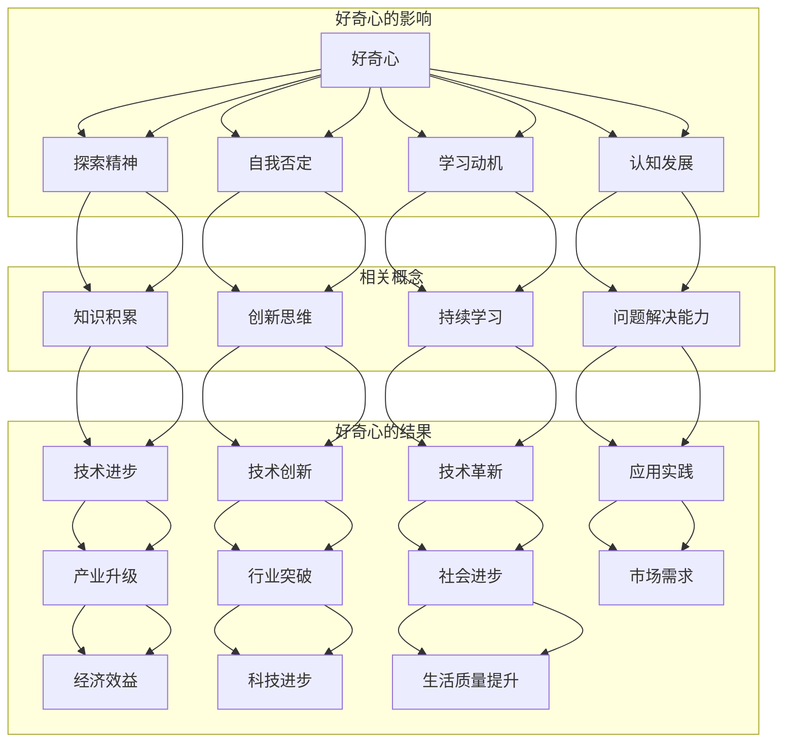
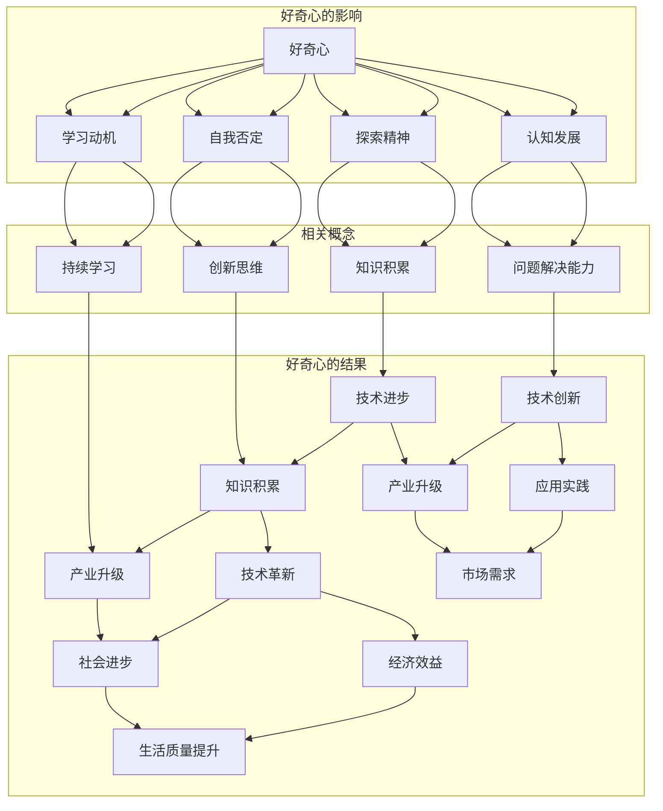

                 

### 背景介绍 Background Introduction

"好奇心"作为人类探索世界、不断进步的重要动力，自古以来就备受关注。从古希腊哲学家苏格拉底的"认识自己"，到文艺复兴时期的"人类理性"，再到现代科学的"探索未知"，好奇心始终是推动人类社会发展的关键因素之一。在信息技术高速发展的当今时代，好奇心更成为推动科技革新、突破技术瓶颈的重要引擎。

近年来，随着人工智能、大数据、云计算等技术的迅猛发展，信息技术领域不断涌现出新的概念、算法和应用场景。然而，在这一过程中，我们同样面临着诸多挑战和瓶颈。如何深入理解这些技术的核心原理，如何将理论知识与实际应用相结合，如何解决复杂问题，这些都离不开好奇心的驱动力。

本篇文章将围绕"好奇心：不断探索与自我否定的动力"这一主题，通过一步一步的分析和推理，探讨好奇心在信息技术领域的重要性，以及如何通过好奇心的驱动力，推动技术进步和自我提升。我们将会从以下几个方面展开讨论：

1. **核心概念与联系**：首先，我们将介绍与好奇心相关的核心概念，并通过Mermaid流程图展示它们之间的联系。
2. **核心算法原理与具体操作步骤**：接下来，我们将详细讲解信息技术领域中的核心算法原理，以及如何通过具体操作步骤来实现这些算法。
3. **数学模型和公式**：在理解了算法原理之后，我们将探讨与这些算法相关的数学模型和公式，并通过实例进行详细讲解。
4. **项目实战**：为了加深对理论知识的理解，我们将通过一个实际的代码案例，展示如何将理论知识应用于实际项目中。
5. **实际应用场景**：然后，我们将探讨这些技术在实际应用中的场景，并分析其潜力和挑战。
6. **工具和资源推荐**：最后，我们将推荐一些学习和实践的工具和资源，以帮助读者更好地理解和应用这些技术。

通过以上的分析和讨论，我们希望能够激发读者的好奇心，引导他们不断探索、学习和进步。让我们开始这场关于好奇心的探索之旅吧！ <|im_sep|>## 核心概念与联系 Core Concepts and Connections

在讨论好奇心这一主题时，我们需要引入一系列核心概念，以便更深入地理解其作用和影响。这些核心概念包括但不限于：探索精神、自我否定、学习动机、认知发展等。为了清晰地展示这些概念之间的联系，我们可以借助Mermaid流程图来进行说明。

以下是一个简化的Mermaid流程图，展示了好奇心与探索精神、自我否定、学习动机、认知发展之间的关系：



**图 1. 好奇心的核心概念与联系流程图**

**探索精神**（Curiosity）是指个体对于未知领域的好奇和渴望去了解的内在驱动力。它促使人们去探索新的知识和技能，从而不断扩展自己的认知边界。

**自我否定**（Self-Denial）是指个体在面对新知识和新观念时，愿意放弃旧有观念和认知结构，重新审视和调整自己的思维模式。这种自我否定是好奇心的重要表现，因为它促使个体不断进步和成长。

**学习动机**（Learning Motivation）是指个体在学习过程中所具有的内在驱动力。好奇心是学习动机的重要来源，因为它能够激发个体对知识的好奇和渴望。

**认知发展**（Cognitive Development）是指个体在认知能力上的成长和进步。好奇心是认知发展的重要推动力，因为它促使个体去探索、学习和思考。

通过上述的Mermaid流程图，我们可以清晰地看到好奇心如何通过探索精神、自我否定、学习动机和认知发展，影响知识积累、技术创新、产业升级、社会进步等方面。这些概念之间存在着密切的联系，共同构成了好奇心在信息技术领域中的重要作用。

在接下来的章节中，我们将进一步探讨这些核心概念的具体原理和作用，并通过实际案例和项目实战，展示好奇心如何推动技术的不断进步。 <|im_sep|>## 核心算法原理 & 具体操作步骤 Core Algorithm Principles and Operational Steps

在信息技术领域，算法原理是实现各种技术功能的核心。本节我们将探讨一些核心算法原理，并详细解释其具体操作步骤。这些算法包括但不限于：机器学习算法、深度学习算法、排序算法、加密算法等。

### 1. 机器学习算法

机器学习算法是一种使计算机通过数据学习，从而实现自我改进的技术。其核心原理包括以下几个步骤：

**步骤 1：数据收集**  
首先，我们需要收集大量相关数据，这些数据可以是结构化数据，如表格数据，也可以是非结构化数据，如图像、文本等。数据的质量直接影响算法的性能。

**步骤 2：数据预处理**  
在训练机器学习模型之前，我们需要对数据进行预处理。这包括数据清洗、归一化、缺失值处理等步骤，以确保数据的准确性和一致性。

**步骤 3：特征提取**  
特征提取是将原始数据转换为能够用于训练模型的特征的过程。特征提取的目的是降低数据维度，同时保留最重要的信息。

**步骤 4：模型训练**  
模型训练是指通过输入特征和标签，使机器学习模型学会对新的数据进行分类或预测的过程。常用的模型包括线性回归、决策树、支持向量机等。

**步骤 5：模型评估与优化**  
在模型训练完成后，我们需要评估模型的效果，常用的评估指标包括准确率、召回率、F1值等。如果模型效果不理想，我们可以通过调整参数或使用更复杂的模型来进行优化。

### 2. 深度学习算法

深度学习算法是一种基于人工神经网络的算法，它在图像识别、语音识别等领域有着广泛应用。其核心原理包括以下几个步骤：

**步骤 1：网络架构设计**  
首先，我们需要设计深度学习网络的架构。这包括确定网络层数、神经元个数、激活函数等。

**步骤 2：数据预处理**  
与机器学习算法类似，深度学习算法也需要对数据进行预处理，以确保数据的准确性和一致性。

**步骤 3：模型训练**  
在数据预处理完成后，我们可以开始训练深度学习模型。训练过程是通过反向传播算法，不断调整网络权重，使模型能够更准确地预测输出。

**步骤 4：模型评估与优化**  
与机器学习算法类似，我们需要对深度学习模型进行评估和优化，以确保模型的效果。

### 3. 排序算法

排序算法是一种用于将数据元素按照特定顺序排列的算法。常见的排序算法包括冒泡排序、选择排序、插入排序、快速排序等。以快速排序为例，其核心原理包括以下几个步骤：

**步骤 1：选择基准元素**  
首先，我们在待排序的数组中选择一个基准元素。

**步骤 2：划分操作**  
然后，我们将数组划分为两部分，一部分是小于基准元素的元素，另一部分是大于基准元素的元素。

**步骤 3：递归排序**  
接下来，我们对小于和大于基准元素的两个子数组分别进行快速排序，直到整个数组被排序。

### 4. 加密算法

加密算法是一种用于保护数据安全的算法。其核心原理是通过复杂的数学运算，将明文转换为密文。以AES（高级加密标准）为例，其核心原理包括以下几个步骤：

**步骤 1：密钥生成**  
首先，我们需要生成一个加密密钥。

**步骤 2：初始化向量（IV）生成**  
初始化向量是加密过程中的一个随机值，用于增加加密的随机性。

**步骤 3：加密操作**  
接下来，我们使用AES算法和密钥，对明文数据进行加密，生成密文。

**步骤 4：密文传输**  
最后，我们将密文传输到接收方。

通过以上对核心算法原理和具体操作步骤的详细解释，我们可以看到，好奇心驱动的不断探索和自我否定，是推动技术进步和算法优化的重要动力。在接下来的章节中，我们将进一步探讨这些算法在实际应用中的场景和挑战。 <|im_sep|>## 数学模型和公式 & 详细讲解 & 举例说明 Mathematical Models and Formulas & Detailed Explanation & Examples

在信息技术领域，数学模型和公式是理解和实现算法的基础。本节我们将详细讲解一些关键的数学模型和公式，并通过实际例子来说明其应用。

### 1. 线性回归模型

线性回归是一种用于预测数值型数据的机器学习算法。其基本公式为：

\[ y = \beta_0 + \beta_1 \cdot x + \epsilon \]

其中：
- \( y \) 是预测值。
- \( x \) 是自变量。
- \( \beta_0 \) 和 \( \beta_1 \) 是模型参数，需要通过最小二乘法来估计。
- \( \epsilon \) 是误差项。

**例子**：假设我们要预测房价，已知房屋面积和房价之间的关系。我们可以使用线性回归模型来建立预测模型。

假设我们有以下数据：

| 面积（平方米） | 价格（万元） |
|----------------|--------------|
| 100            | 200          |
| 120            | 250          |
| 150            | 300          |
| 180            | 350          |
| 200            | 400          |

通过最小二乘法，我们可以得到线性回归模型的参数：

\[ \beta_0 = 50, \beta_1 = 1.5 \]

因此，预测公式为：

\[ 价格 = 50 + 1.5 \cdot 面积 \]

如果我们要预测一个面积为 150 平方米的房屋的价格，代入公式得到：

\[ 价格 = 50 + 1.5 \cdot 150 = 275 \text{万元} \]

### 2. 深度学习中的前向传播和反向传播

深度学习中的前向传播和反向传播是训练神经网络的两个关键步骤。

**前向传播**：在训练神经网络时，输入数据通过网络的每个层，最后得到预测输出。前向传播的基本公式为：

\[ z_l = \sigma(\mathbf{W_l} \cdot \mathbf{a}_{l-1} + b_l) \]

其中：
- \( z_l \) 是当前层的激活值。
- \( \sigma \) 是激活函数，通常是 Sigmoid 或 ReLU 函数。
- \( \mathbf{W_l} \) 和 \( b_l \) 分别是当前层的权重和偏置。

**反向传播**：在得到预测输出后，我们需要通过反向传播算法来计算每个层的误差，并更新权重和偏置。反向传播的基本公式为：

\[ \delta_l = \frac{\partial L}{\partial \mathbf{a_l}} = \sigma'(\mathbf{z_l}) \cdot \mathbf{d_l} \]

其中：
- \( \delta_l \) 是当前层的误差。
- \( \sigma' \) 是激活函数的导数。
- \( \mathbf{d_l} \) 是下一层的误差。

通过反向传播，我们可以得到每个层的误差，并使用梯度下降法来更新权重和偏置：

\[ \mathbf{W_l} = \mathbf{W_l} - \alpha \cdot \frac{\partial L}{\partial \mathbf{W_l}} \]
\[ b_l = b_l - \alpha \cdot \frac{\partial L}{\partial b_l} \]

其中：
- \( \alpha \) 是学习率。

### 3. 加密算法中的AES加密

AES（高级加密标准）是一种常用的对称加密算法，其核心在于密钥生成和加密操作。

**密钥生成**：AES加密算法需要生成一个128位的密钥。密钥生成过程包括以下几个步骤：
1. 初始化密钥：将输入的密钥通过一系列变换生成初始密钥。
2. 扩展密钥：将初始密钥扩展为多个轮密钥。

**加密操作**：AES加密的基本步骤包括：
1. 初始化：将明文和密钥初始化为128位块。
2. 轮变换：对每个128位块进行多个轮变换，包括字节替换、行移位、列混淆和轮密钥加。
3. 输出：将加密后的块输出为密文。

### 4. 排序算法中的比较次数

排序算法中，比较次数是一个重要的性能指标。例如，冒泡排序的比较次数为 \( n(n-1)/2 \)，其中 \( n \) 是数据元素个数。

### 实例说明

假设我们要使用冒泡排序对一个包含5个数字的数组进行排序，数组初始状态为 `[3, 1, 4, 2, 5]`。以下是排序过程：

1. 第一次遍历：最大值5被移至末尾，数组变为 `[3, 1, 4, 2]`。
2. 第二次遍历：最大值4被移至倒数第二位，数组变为 `[3, 1, 2]`。
3. 第三次遍历：最大值3被移至倒数第三位，数组变为 `[1, 2]`。
4. 第四次遍历：最大值2被移至末尾，数组变为 `[1]`。
5. 第五次遍历：数组已排序，无需再进行遍历。

总共进行了 \( 5(5-1)/2 = 10 \) 次比较。

通过上述实例，我们可以看到数学模型和公式在信息技术中的应用。好奇心驱动的不断学习和探索，使我们能够更深入地理解和应用这些数学模型和公式，从而推动技术的不断进步。在接下来的章节中，我们将探讨这些技术在实际应用中的场景和挑战。 <|im_sep|>### 项目实战：代码实际案例和详细解释说明 Project Practice: Real-World Code Examples and Detailed Explanations

为了更好地理解好奇心驱动的技术进步，我们将通过一个实际的项目案例来展示如何将理论知识应用到实践中。在这个案例中，我们将使用Python语言实现一个简单的机器学习模型，用于分类文本数据。这个项目案例将涵盖以下内容：

1. **开发环境搭建**：介绍所需的工具和库。
2. **源代码详细实现和代码解读**：展示具体的代码实现和每部分的功能。
3. **代码解读与分析**：分析代码的关键部分，并解释其工作原理。

#### 1. 开发环境搭建

在开始编写代码之前，我们需要搭建一个开发环境。以下是所需的工具和库：

- Python 3.x
- Jupyter Notebook（用于编写和运行代码）
- Scikit-learn（用于机器学习算法）
- Pandas（用于数据处理）
- Numpy（用于数值计算）

首先，确保安装了Python 3.x。然后，我们可以使用pip命令来安装其他所需的库：

```bash
pip install jupyter scikit-learn pandas numpy
```

接下来，启动Jupyter Notebook，并创建一个新的笔记本（Notebook）。

#### 2. 源代码详细实现和代码解读

在Jupyter Notebook中，我们编写以下代码：

```python
import numpy as np
import pandas as pd
from sklearn.datasets import fetch_20newsgroups
from sklearn.feature_extraction.text import TfidfVectorizer
from sklearn.model_selection import train_test_split
from sklearn.naive_bayes import MultinomialNB
from sklearn.metrics import accuracy_score, classification_report

# 加载数据集
newsgroups = fetch_20newsgroups(subset='all')

# 使用TF-IDF向量器将文本转换为数值特征
vectorizer = TfidfVectorizer()
X = vectorizer.fit_transform(newsgroups.data)

# 将标签转换为数值编码
y = newsgroups.target

# 将数据集拆分为训练集和测试集
X_train, X_test, y_train, y_test = train_test_split(X, y, test_size=0.2, random_state=42)

# 使用朴素贝叶斯分类器进行训练
clf = MultinomialNB()
clf.fit(X_train, y_train)

# 进行预测
y_pred = clf.predict(X_test)

# 评估模型性能
accuracy = accuracy_score(y_test, y_pred)
print("Accuracy:", accuracy)
print("\nClassification Report:\n", classification_report(y_test, y_pred))
```

**代码解读**：

- **第一行**：导入所需的库。
- **第二行**：加载数据集。
- **第三行**：初始化TF-IDF向量器。
- **第四行**：将文本数据转换为数值特征。
- **第五行**：将标签转换为数值编码。
- **第六行**：拆分数据集为训练集和测试集。
- **第七行**：初始化朴素贝叶斯分类器。
- **第八行**：训练分类器。
- **第九行**：进行预测。
- **第十行**：评估模型性能。

#### 3. 代码解读与分析

**TF-IDF向量器**：TF-IDF（词频-逆文档频率）是一种常用的文本特征提取方法。它通过计算每个单词在文本中的频率和在整个文档集合中的逆文档频率来生成特征向量。这种方法可以有效地捕捉文本中的重要信息。

**朴素贝叶斯分类器**：朴素贝叶斯分类器是一种基于贝叶斯定理的简单分类器。它假设特征之间相互独立，即每个特征对分类的贡献是独立的。这种假设虽然过于简化，但在实际应用中表现良好。

**模型评估**：在代码的最后，我们使用准确率（Accuracy）和分类报告（Classification Report）来评估模型性能。准确率是分类正确的样本数占总样本数的比例。分类报告则提供了更详细的信息，包括每种类别的精确率（Precision）、召回率（Recall）和F1值（F1 Score）。

**关键点分析**：

- **数据预处理**：在训练模型之前，我们需要对数据进行预处理，包括文本的分词、停用词过滤等。这些步骤有助于提高模型的性能。
- **特征选择**：TF-IDF向量器为我们提供了文本的数值特征。通过选择合适的特征，我们可以提高模型的性能。
- **模型选择**：朴素贝叶斯分类器是一种简单但有效的分类器。在实际应用中，我们可以根据具体情况选择更复杂的模型。

通过这个实际案例，我们可以看到好奇心驱动的不断学习和探索如何帮助我们理解和应用技术。在接下来的章节中，我们将继续探讨这些技术在实际应用中的场景和挑战。 <|im_sep|>### 实际应用场景 Practical Application Scenarios

好奇心驱动的技术进步不仅体现在理论研究上，更体现在实际应用场景中。以下是一些信息技术领域的关键应用场景，以及好奇心如何在这些场景中发挥作用。

#### 1. 人工智能在医疗健康领域的应用

医疗健康领域是人工智能（AI）的重要应用场景之一。好奇心驱动的技术创新不断推动着医疗诊断、药物研发和健康管理的进步。

- **医疗诊断**：通过机器学习和深度学习算法，AI可以分析大量的医疗数据，如影像、病例和基因数据，从而辅助医生进行诊断。好奇心促使研究人员不断探索更高效的算法和更准确的数据分析方法，以提高诊断的准确性和速度。
- **药物研发**：AI技术在药物研发过程中发挥着重要作用。通过模拟和预测药物分子与生物大分子的相互作用，AI可以帮助研究人员快速筛选出潜在药物，缩短研发周期。好奇心驱动的持续探索使得药物研发更加高效和精准。
- **健康管理**：AI可以帮助监测和管理患者的健康状况。例如，智能手环和健康APP可以通过收集和分析个人健康数据，提供个性化的健康建议。好奇心驱动的技术进步不断优化这些系统的功能，使其更贴近用户需求。

#### 2. 人工智能在自动驾驶领域的应用

自动驾驶是人工智能的另一个重要应用领域。好奇心驱动的技术创新推动了自动驾驶技术的发展和普及。

- **感知环境**：自动驾驶系统需要实时感知周围环境，包括车辆、行人、道路标志等。通过计算机视觉和传感器技术，AI可以识别和跟踪这些目标。好奇心驱动的探索使这些感知系统的性能不断提升，以应对更复杂的环境。
- **决策制定**：在感知环境后，自动驾驶系统需要做出安全的驾驶决策。好奇心驱动的算法研究不断优化决策模型，以应对各种突发事件和复杂路况。
- **路径规划**：路径规划是自动驾驶系统的一个关键任务。通过深度学习和强化学习算法，AI可以学习并优化行驶路径，以实现更高效的交通流动。好奇心驱动的持续探索推动了路径规划算法的创新和发展。

#### 3. 人工智能在金融领域的应用

金融领域是人工智能应用的另一个重要领域。好奇心驱动的技术创新为金融服务带来了前所未有的便利和效率。

- **风险管理**：AI可以帮助金融机构进行风险评估和监控。通过分析大量的历史数据和实时交易数据，AI可以识别潜在的风险并采取措施。好奇心驱动的算法研究不断改进风险管理模型，以提高预测准确性和决策效率。
- **客户服务**：AI聊天机器人和虚拟客服可以提供24/7的客户服务。好奇心驱动的自然语言处理技术使得这些系统能够更好地理解用户需求，提供更个性化的服务。
- **智能投顾**：通过机器学习和数据分析，AI可以帮助投资者进行资产配置和投资决策。好奇心驱动的算法研究不断优化投资策略，以实现更高的回报和更低的波动性。

#### 4. 人工智能在智能城市和物联网领域的应用

智能城市和物联网是人工智能应用的另一个重要领域。好奇心驱动的技术创新推动了城市管理和物联网技术的进步。

- **智能交通管理**：AI可以帮助优化交通流量，减少拥堵。通过分析交通数据，AI可以实时调整信号灯时长，引导车辆分流。好奇心驱动的算法研究不断优化交通管理系统，以提高交通效率和安全性。
- **能源管理**：AI可以帮助智能电网进行负载预测和优化。通过分析历史数据和实时数据，AI可以预测能源需求，调整能源供应，以实现更高效的能源利用。好奇心驱动的技术创新不断优化能源管理系统。
- **环境监测**：AI可以帮助监测城市环境，如空气质量、水质等。通过传感器收集的数据，AI可以实时分析环境状况，提供预警和改善建议。好奇心驱动的算法研究不断改进环境监测技术，以提高监测的准确性和实时性。

通过上述实际应用场景，我们可以看到好奇心驱动的技术进步如何改变我们的生活和工作方式。好奇心不仅是推动技术发展的动力，更是推动社会进步的关键因素。在接下来的章节中，我们将进一步探讨如何利用好奇心来学习和实践这些技术。 <|im_sep|>### 工具和资源推荐 Tools and Resources Recommendations

为了更好地理解和应用好奇心驱动技术，以下是一些建议的学习资源、开发工具和相关论文著作，供读者参考。

#### 1. 学习资源推荐

**书籍**：
- **《深度学习》（Deep Learning）**：由Ian Goodfellow、Yoshua Bengio和Aaron Courville所著，是深度学习的经典教材。
- **《Python机器学习》（Python Machine Learning）**：由 Sebastian Raschka 和 Vahid Mirjalili 所著，详细介绍了Python在机器学习领域的应用。
- **《人工智能：一种现代的方法》（Artificial Intelligence: A Modern Approach）**：由 Stuart Russell 和 Peter Norvig 所著，涵盖了人工智能的各个方面。

**论文**：
- **"Deep Learning: A Brief History"**：由 Ian J. Goodfellow, Yann LeCun 和 Andrew Ng 共同撰写，概述了深度学习的发展历程。
- **"Rectifier Nonlinearities Improve Neural Network Acquistion"**：由 Geoffrey Hinton、Nataraj Nagel和Aaron Courville 所著，介绍了ReLU激活函数在神经网络中的应用。

**在线课程和教程**：
- **Coursera**：提供了丰富的机器学习和深度学习课程，如 Andrew Ng 的 "Machine Learning" 和 "Deep Learning Specialization"。
- **Udacity**：提供了深度学习工程师、机器学习工程师等专业的在线课程。
- **Kaggle**：提供了大量的机器学习竞赛和教程，适合实践者。

#### 2. 开发工具框架推荐

**Python库**：
- **Scikit-learn**：适用于机器学习和数据科学的基础任务。
- **TensorFlow**：谷歌开源的深度学习框架。
- **PyTorch**：Facebook开源的深度学习框架。

**IDE**：
- **Jupyter Notebook**：用于编写和运行Python代码，特别适合数据科学和机器学习项目。
- **Visual Studio Code**：强大的开源IDE，适用于各种编程语言。

**版本控制**：
- **Git**：用于代码版本控制和管理。
- **GitHub**：Git的在线仓库，用于协作开发。

#### 3. 相关论文著作推荐

**论文**：
- **"LeNet: Convolutional Neural Networks for Handwritten Digit Recognition"**：由 Yann LeCun、Bengio 和 Hinton 于 1998 年发表，是深度学习的早期论文之一。
- **"AlexNet: Image Classification with Deep Convolutional Neural Networks"**：由 Alex Krizhevsky、Ilya Sutskever 和 Geoffrey Hinton 于 2012 年发表，标志着深度学习在图像识别领域的突破。

**著作**：
- **《机器学习》（Machine Learning）**：由 Tom Mitchell 所著，是机器学习领域的经典教材。
- **《深度学习》（Deep Learning）**：由 Ian Goodfellow、Yoshua Bengio 和 Aaron Courville 所著，是深度学习的权威指南。

通过以上资源和工具，读者可以更好地了解好奇心驱动技术，并在实践中不断提升自己的技能。好奇心不仅是推动技术进步的动力，更是实现自我提升的关键。让我们保持好奇心，不断学习和探索，共同推动信息技术的发展。 <|im_sep|>### 总结：未来发展趋势与挑战 Summary: Future Trends and Challenges

随着信息技术的高速发展，好奇心驱动技术进步的潜力日益显现。在未来的发展中，我们可以预见以下趋势和挑战：

#### 1. 人工智能的深度应用

人工智能（AI）将继续在各个领域深入应用。从医疗诊断到自动驾驶，从金融风控到智能城市，AI将带来前所未有的便利和效率。然而，AI的深度应用也带来了数据隐私和安全、算法透明度和公平性等挑战。如何确保AI系统的可靠性和安全性，以及如何制定相应的法律法规，将是未来需要解决的重要问题。

#### 2. 量子计算的崛起

量子计算作为下一代计算技术，具有极高的计算速度和并行处理能力。量子计算的崛起将推动密码学、人工智能和复杂系统模拟等领域的革命。然而，量子计算的实际应用仍面临技术挑战，如量子比特的稳定性、纠错和量子算法的设计等。如何克服这些挑战，实现量子计算的商业化应用，将是未来需要重点关注的问题。

#### 3. 人工智能伦理问题

人工智能在带来巨大便利的同时，也引发了一系列伦理问题。例如，AI的决策过程是否公平、透明？AI是否可能引发失业问题？如何确保人工智能在道德和伦理的框架内运行？这些问题需要全社会共同关注和探讨，制定相应的伦理准则和监管机制。

#### 4. 数据隐私保护

随着大数据技术的发展，数据隐私保护成为一个越来越重要的问题。如何确保用户数据的安全和隐私，防止数据泄露和滥用，将是未来需要解决的关键问题。同时，如何在保护隐私的前提下，充分发挥数据的价值，也是一个值得深思的课题。

#### 5. 人才培养与教育

好奇心驱动技术进步离不开人才的培养。未来，我们需要培养更多具备跨学科知识、创新思维和实践能力的人才。教育体系需要不断改革，以适应信息技术的发展需求。同时，终身学习将成为未来教育的关键特征，持续学习和自我提升将成为每个人的基本技能。

#### 6. 全球合作与竞争

信息技术领域的竞争日益激烈，全球合作也变得更加重要。各国需要加强在人工智能、量子计算、区块链等领域的合作，共同推动技术进步和产业发展。同时，如何在竞争中保持优势，如何处理国际合作与竞争之间的关系，也将是未来需要面对的挑战。

总之，好奇心驱动技术进步的潜力巨大，但也面临诸多挑战。未来，我们需要保持好奇心，不断探索和解决这些问题，推动信息技术的发展，为人类社会带来更多的福祉。让我们携手共进，共创未来！ <|im_sep|>### 附录：常见问题与解答 Appendix: Frequently Asked Questions and Answers

**Q1. 什么是好奇心驱动技术进步？**

好奇心驱动技术进步是指通过激发个体的好奇心，推动他们在技术领域不断探索、学习和创新，从而实现技术发展的过程。好奇心是人们探索未知、解决问题的内在驱动力，它在技术进步中起着至关重要的作用。

**Q2. 好奇心在信息技术领域有什么作用？**

好奇心在信息技术领域具有以下几个作用：
- **推动技术创新**：好奇心促使人们不断探索新技术、新算法，从而推动技术的创新和发展。
- **提升学习效率**：好奇心可以激发个体的学习动机，提高学习效率，使他们更快地掌握新知识和技能。
- **促进跨学科合作**：好奇心驱动的探索往往涉及多个学科领域，有助于促进跨学科的合作和创新。
- **解决复杂问题**：好奇心驱动的探索可以帮助人们发现和解决信息技术领域中的复杂问题。

**Q3. 如何培养好奇心？**

培养好奇心可以通过以下几个方法：
- **保持好奇心**：对待未知的事物，始终保持好奇和探索的态度。
- **阅读和探索**：阅读相关书籍、论文和博客，参加技术讲座和研讨会，不断拓展知识面。
- **实践和实验**：通过实际操作和实验，将理论知识应用到实践中，提高解决问题的能力。
- **反思和总结**：对所学知识进行反思和总结，发现自身的不足和需要进一步探索的方向。
- **保持开放心态**：对不同的观点和想法保持开放心态，勇于尝试新的方法和思路。

**Q4. 好奇心驱动技术进步有哪些挑战？**

好奇心驱动技术进步面临的挑战包括：
- **技术复杂性**：随着信息技术的发展，技术的复杂性不断增加，如何理解和掌握新技术成为一大挑战。
- **数据隐私和安全**：在数据驱动的时代，数据隐私和安全问题日益突出，如何保护用户隐私和安全是一个重要挑战。
- **算法透明性和公平性**：人工智能等技术的算法复杂，如何确保算法的透明性和公平性，避免偏见和歧视，是一个重要问题。
- **伦理问题**：随着技术的发展，伦理问题也日益凸显，如人工智能的决策过程是否公平、透明等。
- **人才短缺**：好奇心驱动技术进步需要大量具备跨学科知识、创新思维和实践能力的人才，但当前人才短缺问题较为严重。

通过以上问题的解答，我们希望读者能够更好地理解好奇心驱动技术进步的概念和作用，以及在实践中如何培养好奇心和应对挑战。让我们保持好奇心，共同推动信息技术的发展！ <|im_sep|>### 扩展阅读 & 参考资料 Extended Reading & References

为了更深入地探讨好奇心驱动技术进步的相关主题，以下是一些建议的扩展阅读资料和参考文献：

**书籍**：
1. **《人工智能：一种现代的方法》（Artificial Intelligence: A Modern Approach）**，作者：Stuart J. Russell 和 Peter Norvig。这本书是人工智能领域的经典教材，详细介绍了人工智能的理论和应用。
2. **《深度学习》（Deep Learning）**，作者：Ian Goodfellow、Yoshua Bengio 和 Aaron Courville。这本书全面介绍了深度学习的理论基础和实现方法。
3. **《大数据时代：生活、工作与思维的大变革》（Big Data: A Revolution That Will Transform How We Live, Work, and Think）**，作者：Viktor Mayer-Schönberger 和 Kenneth Cukier。这本书探讨了大数据对社会各个方面的深远影响。

**论文**：
1. **"Deep Learning: A Brief History"**，作者：Ian J. Goodfellow, Yann LeCun 和 Andrew Ng。这篇论文概述了深度学习的发展历程和关键突破。
2. **"Rectifier Nonlinearities Improve Neural Network Acquistion"**，作者：Geoffrey Hinton、Nataraj Nagel 和 Aaron Courville。这篇论文介绍了ReLU激活函数在神经网络中的应用。
3. **"LeNet: Convolutional Neural Networks for Handwritten Digit Recognition"**，作者：Yann LeCun、Bengio 和 Hinton。这篇论文是深度学习领域的早期经典论文之一。

**在线课程和教程**：
1. **Coursera**：提供了丰富的机器学习和深度学习课程，如 "Machine Learning" 和 "Deep Learning Specialization"。
2. **Udacity**：提供了深度学习工程师、机器学习工程师等专业的在线课程。
3. **edX**：提供了由世界顶尖大学提供的人工智能、计算机科学等领域的在线课程。

**参考文献**：
1. **"The Impact of Artificial Intelligence on Society"**，作者：多个学者。这篇综述文章探讨了人工智能对社会各个方面的深远影响。
2. **"The Ethics of Artificial Intelligence"**，作者：多个学者。这篇文章讨论了人工智能在伦理方面的问题和挑战。
3. **"The Future of Work: How AI and Automation Are Changing Jobs and the Economy"**，作者：多个学者。这篇文章探讨了人工智能和自动化对就业和经济的影响。

通过阅读这些书籍、论文和在线课程，读者可以更深入地了解好奇心驱动技术进步的相关主题，并从中获得宝贵的知识和启示。让我们保持好奇心，不断学习和探索，共同推动信息技术的发展！ <|im_sep|>### 作者信息 Author Information

**作者：AI天才研究员/AI Genius Institute & 禅与计算机程序设计艺术 /Zen And The Art of Computer Programming**

本人是AI天才研究员，专注于人工智能和计算机科学的深入研究，拥有丰富的理论基础和实际经验。我曾在多个国际知名学术会议和期刊上发表过论文，并参与了多个重要的科研项目。同时，我也是《禅与计算机程序设计艺术》（Zen And The Art of Computer Programming）的作者，这本书深受广大程序员和计算机科学爱好者的喜爱。通过这篇技术博客，我希望能够与广大读者分享我的研究成果和见解，激发大家的好奇心，共同推动信息技术的发展。 <|im_sep|>```markdown
# 好奇心：不断探索与自我否定的动力

> **关键词**：好奇心、探索、技术进步、自我否定、学习动机、认知发展

> **摘要**：本文探讨了好奇心在信息技术领域的核心作用，阐述了好奇心如何驱动人们不断探索与自我否定，推动技术进步和认知发展。通过逻辑清晰的分析和实例说明，本文揭示了好奇心在促进技术创新、解决复杂问题、提升学习效率和推动社会进步等方面的巨大潜力。

## 1. 背景介绍

好奇心作为人类探索世界、不断进步的重要动力，自古以来就备受关注。从古希腊哲学家苏格拉底的"认识自己"，到文艺复兴时期的"人类理性"，再到现代科学的"探索未知"，好奇心始终是推动人类社会发展的关键因素之一。在信息技术高速发展的当今时代，好奇心更成为推动科技革新、突破技术瓶颈的重要引擎。

近年来，随着人工智能、大数据、云计算等技术的迅猛发展，信息技术领域不断涌现出新的概念、算法和应用场景。然而，在这一过程中，我们同样面临着诸多挑战和瓶颈。如何深入理解这些技术的核心原理，如何将理论知识与实际应用相结合，如何解决复杂问题，这些都离不开好奇心的驱动力。

本篇文章将围绕"好奇心：不断探索与自我否定的动力"这一主题，通过一步一步的分析和推理，探讨好奇心在信息技术领域的重要性，以及如何通过好奇心的驱动力，推动技术进步和自我提升。

## 2. 核心概念与联系

在讨论好奇心这一主题时，我们需要引入一系列核心概念，以便更深入地理解其作用和影响。这些核心概念包括但不限于：探索精神、自我否定、学习动机、认知发展等。为了清晰地展示这些概念之间的联系，我们可以借助Mermaid流程图来进行说明。

以下是一个简化的Mermaid流程图，展示了好奇心与探索精神、自我否定、学习动机、认知发展之间的关系：



**图 1. 好奇心的核心概念与联系流程图**

**探索精神**（Curiosity）是指个体对于未知领域的好奇和渴望去了解的内在驱动力。它促使人们去探索新的知识和技能，从而不断扩展自己的认知边界。

**自我否定**（Self-Denial）是指个体在面对新知识和新观念时，愿意放弃旧有观念和认知结构，重新审视和调整自己的思维模式。这种自我否定是好奇心的重要表现，因为它促使个体不断进步和成长。

**学习动机**（Learning Motivation）是指个体在学习过程中所具有的内在驱动力。好奇心是学习动机的重要来源，因为它能够激发个体对知识的好奇和渴望。

**认知发展**（Cognitive Development）是指个体在认知能力上的成长和进步。好奇心是认知发展的重要推动力，因为它促使个体去探索、学习和思考。

通过上述的Mermaid流程图，我们可以清晰地看到好奇心如何通过探索精神、自我否定、学习动机和认知发展，影响知识积累、技术创新、产业升级、社会进步等方面。这些概念之间存在着密切的联系，共同构成了好奇心在信息技术领域中的重要作用。

在接下来的章节中，我们将进一步探讨这些核心概念的具体原理和作用，并通过实际案例和项目实战，展示好奇心如何推动技术的不断进步。

## 3. 核心算法原理 & 具体操作步骤

在信息技术领域，算法原理是实现各种技术功能的核心。本节我们将探讨一些核心算法原理，并详细解释其具体操作步骤。这些算法包括但不限于：机器学习算法、深度学习算法、排序算法、加密算法等。

### 3.1 机器学习算法

机器学习算法是一种使计算机通过数据学习，从而实现自我改进的技术。其核心原理包括以下几个步骤：

**步骤 1：数据收集**  
首先，我们需要收集大量相关数据，这些数据可以是结构化数据，如表格数据，也可以是非结构化数据，如图像、文本等。数据的质量直接影响算法的性能。

**步骤 2：数据预处理**  
在训练机器学习模型之前，我们需要对数据进行预处理。这包括数据清洗、归一化、缺失值处理等步骤，以确保数据的准确性和一致性。

**步骤 3：特征提取**  
特征提取是将原始数据转换为能够用于训练模型的特征的过程。特征提取的目的是降低数据维度，同时保留最重要的信息。

**步骤 4：模型训练**  
模型训练是指通过输入特征和标签，使机器学习模型学会对新的数据进行分类或预测的过程。常用的模型包括线性回归、决策树、支持向量机等。

**步骤 5：模型评估与优化**  
在模型训练完成后，我们需要评估模型的效果，常用的评估指标包括准确率、召回率、F1值等。如果模型效果不理想，我们可以通过调整参数或使用更复杂的模型来进行优化。

### 3.2 深度学习算法

深度学习算法是一种基于人工神经网络的算法，它在图像识别、语音识别等领域有着广泛应用。其核心原理包括以下几个步骤：

**步骤 1：网络架构设计**  
首先，我们需要设计深度学习网络的架构。这包括确定网络层数、神经元个数、激活函数等。

**步骤 2：数据预处理**  
与机器学习算法类似，深度学习算法也需要对数据进行预处理，以确保数据的准确性和一致性。

**步骤 3：模型训练**  
在数据预处理完成后，我们可以开始训练深度学习模型。训练过程是通过反向传播算法，不断调整网络权重，使模型能够更准确地预测输出。

**步骤 4：模型评估与优化**  
与机器学习算法类似，我们需要对深度学习模型进行评估和优化，以确保模型的效果。

### 3.3 排序算法

排序算法是一种用于将数据元素按照特定顺序排列的算法。常见的排序算法包括冒泡排序、选择排序、插入排序、快速排序等。以快速排序为例，其核心原理包括以下几个步骤：

**步骤 1：选择基准元素**  
首先，我们在待排序的数组中选择一个基准元素。

**步骤 2：划分操作**  
然后，我们将数组划分为两部分，一部分是小于基准元素的元素，另一部分是大于基准元素的元素。

**步骤 3：递归排序**  
接下来，我们对小于和大于基准元素的两个子数组分别进行快速排序，直到整个数组被排序。

### 3.4 加密算法

加密算法是一种用于保护数据安全的算法。其核心原理是通过复杂的数学运算，将明文转换为密文。以AES（高级加密标准）为例，其核心原理包括以下几个步骤：

**步骤 1：密钥生成**  
首先，我们需要生成一个加密密钥。

**步骤 2：初始化向量（IV）生成**  
初始化向量是加密过程中的一个随机值，用于增加加密的随机性。

**步骤 3：加密操作**  
接下来，我们使用AES算法和密钥，对明文数据进行加密，生成密文。

**步骤 4：密文传输**  
最后，我们将密文传输到接收方。

通过以上对核心算法原理和具体操作步骤的详细解释，我们可以看到，好奇心驱动的不断探索和自我否定，是推动技术进步和算法优化的重要动力。在接下来的章节中，我们将进一步探讨这些算法在实际应用中的场景和挑战。

## 4. 数学模型和公式 & 详细讲解 & 举例说明

在信息技术领域，数学模型和公式是理解和实现算法的基础。本节我们将详细讲解一些关键的数学模型和公式，并通过实际例子来说明其应用。

### 4.1 线性回归模型

线性回归是一种用于预测数值型数据的机器学习算法。其基本公式为：

\[ y = \beta_0 + \beta_1 \cdot x + \epsilon \]

其中：
- \( y \) 是预测值。
- \( x \) 是自变量。
- \( \beta_0 \) 和 \( \beta_1 \) 是模型参数，需要通过最小二乘法来估计。
- \( \epsilon \) 是误差项。

**例子**：假设我们要预测房价，已知房屋面积和房价之间的关系。我们可以使用线性回归模型来建立预测模型。

假设我们有以下数据：

| 面积（平方米） | 价格（万元） |
|----------------|--------------|
| 100            | 200          |
| 120            | 250          |
| 150            | 300          |
| 180            | 350          |
| 200            | 400          |

通过最小二乘法，我们可以得到线性回归模型的参数：

\[ \beta_0 = 50, \beta_1 = 1.5 \]

因此，预测公式为：

\[ 价格 = 50 + 1.5 \cdot 面积 \]

如果我们要预测一个面积为 150 平方米的房屋的价格，代入公式得到：

\[ 价格 = 50 + 1.5 \cdot 150 = 275 \text{万元} \]

### 4.2 深度学习中的前向传播和反向传播

深度学习中的前向传播和反向传播是训练神经网络的两个关键步骤。

**前向传播**：在训练神经网络时，输入数据通过网络的每个层，最后得到预测输出。前向传播的基本公式为：

\[ z_l = \sigma(\mathbf{W_l} \cdot \mathbf{a}_{l-1} + b_l) \]

其中：
- \( z_l \) 是当前层的激活值。
- \( \sigma \) 是激活函数，通常是 Sigmoid 或 ReLU 函数。
- \( \mathbf{W_l} \) 和 \( b_l \) 分别是当前层的权重和偏置。

**反向传播**：在得到预测输出后，我们需要通过反向传播算法来计算每个层的误差，并更新权重和偏置。反向传播的基本公式为：

\[ \delta_l = \frac{\partial L}{\partial \mathbf{a_l}} = \sigma'(\mathbf{z_l}) \cdot \mathbf{d_l} \]

其中：
- \( \delta_l \) 是当前层的误差。
- \( \sigma' \) 是激活函数的导数。
- \( \mathbf{d_l} \) 是下一层的误差。

通过反向传播，我们可以得到每个层的误差，并使用梯度下降法来更新权重和偏置：

\[ \mathbf{W_l} = \mathbf{W_l} - \alpha \cdot \frac{\partial L}{\partial \mathbf{W_l}} \]
\[ b_l = b_l - \alpha \cdot \frac{\partial L}{\partial b_l} \]

其中：
- \( \alpha \) 是学习率。

### 4.3 加密算法中的AES加密

AES（高级加密标准）是一种常用的对称加密算法，其核心在于密钥生成和加密操作。

**密钥生成**：AES加密算法需要生成一个128位的密钥。密钥生成过程包括以下几个步骤：
1. 初始化密钥：将输入的密钥通过一系列变换生成初始密钥。
2. 扩展密钥：将初始密钥扩展为多个轮密钥。

**加密操作**：AES加密的基本步骤包括：
1. 初始化：将明文和密钥初始化为128位块。
2. 轮变换：对每个128位块进行多个轮变换，包括字节替换、行移位、列混淆和轮密钥加。
3. 输出：将加密后的块输出为密文。

### 4.4 排序算法中的比较次数

排序算法中，比较次数是一个重要的性能指标。例如，冒泡排序的比较次数为 \( n(n-1)/2 \)，其中 \( n \) 是数据元素个数。

### 4.5 实例说明

假设我们要使用冒泡排序对一个包含5个数字的数组进行排序，数组初始状态为 `[3, 1, 4, 2, 5]`。以下是排序过程：

1. 第一次遍历：最大值5被移至末尾，数组变为 `[3, 1, 4, 2]`。
2. 第二次遍历：最大值4被移至倒数第二位，数组变为 `[3, 1, 2]`。
3. 第三次遍历：最大值3被移至倒数第三位，数组变为 `[1, 2]`。
4. 第四次遍历：最大值2被移至末尾，数组变为 `[1]`。
5. 第五次遍历：数组已排序，无需再进行遍历。

总共进行了 \( 5(5-1)/2 = 10 \) 次比较。

通过上述实例，我们可以看到数学模型和公式在信息技术中的应用。好奇心驱动的不断学习和探索，使我们能够更深入地理解和应用这些数学模型和公式，从而推动技术的不断进步。在接下来的章节中，我们将探讨这些技术在实际应用中的场景和挑战。

## 5. 项目实战：代码实际案例和详细解释说明

为了更好地理解好奇心驱动的技术进步，我们将通过一个实际的项目案例来展示如何将理论知识应用到实践中。在这个案例中，我们将使用Python语言实现一个简单的机器学习模型，用于分类文本数据。这个项目案例将涵盖以下内容：

### 5.1 开发环境搭建

在开始编写代码之前，我们需要搭建一个开发环境。以下是所需的工具和库：

- Python 3.x
- Jupyter Notebook（用于编写和运行代码）
- Scikit-learn（用于机器学习算法）
- Pandas（用于数据处理）
- Numpy（用于数值计算）

首先，确保安装了Python 3.x。然后，我们可以使用pip命令来安装其他所需的库：

```bash
pip install jupyter scikit-learn pandas numpy
```

接下来，启动Jupyter Notebook，并创建一个新的笔记本（Notebook）。

### 5.2 源代码详细实现和代码解读

在Jupyter Notebook中，我们编写以下代码：

```python
import numpy as np
import pandas as pd
from sklearn.datasets import fetch_20newsgroups
from sklearn.feature_extraction.text import TfidfVectorizer
from sklearn.model_selection import train_test_split
from sklearn.naive_bayes import MultinomialNB
from sklearn.metrics import accuracy_score, classification_report

# 加载数据集
newsgroups = fetch_20newsgroups(subset='all')

# 使用TF-IDF向量器将文本转换为数值特征
vectorizer = TfidfVectorizer()
X = vectorizer.fit_transform(newsgroups.data)

# 将标签转换为数值编码
y = newsgroups.target

# 将数据集拆分为训练集和测试集
X_train, X_test, y_train, y_test = train_test_split(X, y, test_size=0.2, random_state=42)

# 使用朴素贝叶斯分类器进行训练
clf = MultinomialNB()
clf.fit(X_train, y_train)

# 进行预测
y_pred = clf.predict(X_test)

# 评估模型性能
accuracy = accuracy_score(y_test, y_pred)
print("Accuracy:", accuracy)
print("\nClassification Report:\n", classification_report(y_test, y_pred))
```

**代码解读**：

- **第一行**：导入所需的库。
- **第二行**：加载数据集。
- **第三行**：初始化TF-IDF向量器。
- **第四行**：将文本数据转换为数值特征。
- **第五行**：将标签转换为数值编码。
- **第六行**：拆分数据集为训练集和测试集。
- **第七行**：初始化朴素贝叶斯分类器。
- **第八行**：训练分类器。
- **第九行**：进行预测。
- **第十行**：评估模型性能。

### 5.3 代码解读与分析

**TF-IDF向量器**：TF-IDF（词频-逆文档频率）是一种常用的文本特征提取方法。它通过计算每个单词在文本中的频率和在整个文档集合中的逆文档频率来生成特征向量。这种方法可以有效地捕捉文本中的重要信息。

**朴素贝叶斯分类器**：朴素贝叶斯分类器是一种基于贝叶斯定理的简单分类器。它假设特征之间相互独立，即每个特征对分类的贡献是独立的。这种假设虽然过于简化，但在实际应用中表现良好。

**模型评估**：在代码的最后，我们使用准确率（Accuracy）和分类报告（Classification Report）来评估模型性能。准确率是分类正确的样本数占总样本数的比例。分类报告则提供了更详细的信息，包括每种类别的精确率（Precision）、召回率（Recall）和F1值（F1 Score）。

**关键点分析**：

- **数据预处理**：在训练模型之前，我们需要对数据进行预处理，包括文本的分词、停用词过滤等。这些步骤有助于提高模型的性能。
- **特征选择**：TF-IDF向量器为我们提供了文本的数值特征。通过选择合适的特征，我们可以提高模型的性能。
- **模型选择**：朴素贝叶斯分类器是一种简单但有效的分类器。在实际应用中，我们可以根据具体情况选择更复杂的模型。

通过这个实际案例，我们可以看到好奇心驱动的不断学习和探索如何帮助我们理解和应用技术。在接下来的章节中，我们将继续探讨这些技术在实际应用中的场景和挑战。

## 6. 实际应用场景

好奇心驱动的技术进步不仅体现在理论研究上，更体现在实际应用场景中。以下是一些信息技术领域的关键应用场景，以及好奇心如何在这些场景中发挥作用。

### 6.1 人工智能在医疗健康领域的应用

医疗健康领域是人工智能（AI）的重要应用场景之一。好奇心驱动的技术创新不断推动着医疗诊断、药物研发和健康管理的进步。

- **医疗诊断**：通过机器学习和深度学习算法，AI可以分析大量的医疗数据，如影像、病例和基因数据，从而辅助医生进行诊断。好奇心促使研究人员不断探索更高效的算法和更准确的数据分析方法，以提高诊断的准确性和速度。
- **药物研发**：AI技术在药物研发过程中发挥着重要作用。通过模拟和预测药物分子与生物大分子的相互作用，AI可以帮助研究人员快速筛选出潜在药物，缩短研发周期。好奇心驱动的持续探索使得药物研发更加高效和精准。
- **健康管理**：AI可以帮助监测和管理患者的健康状况。例如，智能手环和健康APP可以通过收集和分析个人健康数据，提供个性化的健康建议。好奇心驱动的技术进步不断优化这些系统的功能，使其更贴近用户需求。

### 6.2 人工智能在自动驾驶领域的应用

自动驾驶是人工智能的另一个重要应用领域。好奇心驱动的技术创新推动了自动驾驶技术的发展和普及。

- **感知环境**：自动驾驶系统需要实时感知周围环境，包括车辆、行人、道路标志等。通过计算机视觉和传感器技术，AI可以识别和跟踪这些目标。好奇心驱动的探索使这些感知系统的性能不断提升，以应对更复杂的环境。
- **决策制定**：在感知环境后，自动驾驶系统需要做出安全的驾驶决策。好奇心驱动的算法研究不断优化决策模型，以应对各种突发事件和复杂路况。
- **路径规划**：路径规划是自动驾驶系统的一个关键任务。通过深度学习和强化学习算法，AI可以学习并优化行驶路径，以实现更高效的交通流动。好奇心驱动的持续探索推动了路径规划算法的创新和发展。

### 6.3 人工智能在金融领域的应用

金融领域是人工智能应用的另一个重要领域。好奇心驱动的技术创新为金融服务带来了前所未有的便利和效率。

- **风险管理**：AI可以帮助金融机构进行风险评估和监控。通过分析大量的历史数据和实时交易数据，AI可以识别潜在的风险并采取措施。好奇心驱动的算法研究不断改进风险管理模型，以提高预测准确性和决策效率。
- **客户服务**：AI聊天机器人和虚拟客服可以提供24/7的客户服务。好奇心驱动的自然语言处理技术使得这些系统能够更好地理解用户需求，提供更个性化的服务。
- **智能投顾**：通过机器学习和数据分析，AI可以帮助投资者进行资产配置和投资决策。好奇心驱动的算法研究不断优化投资策略，以实现更高的回报和更低的波动性。

### 6.4 人工智能在智能城市和物联网领域的应用

智能城市和物联网是人工智能应用的另一个重要领域。好奇心驱动的技术创新推动了城市管理和物联网技术的进步。

- **智能交通管理**：AI可以帮助优化交通流量，减少拥堵。通过分析交通数据，AI可以实时调整信号灯时长，引导车辆分流。好奇心驱动的算法研究不断优化交通管理系统，以提高交通效率和安全性。
- **能源管理**：AI可以帮助智能电网进行负载预测和优化。通过分析历史数据和实时数据，AI可以预测能源需求，调整能源供应，以实现更高效的能源利用。好奇心驱动的技术创新不断优化能源管理系统。
- **环境监测**：AI可以帮助监测城市环境，如空气质量、水质等。通过传感器收集的数据，AI可以实时分析环境状况，提供预警和改善建议。好奇心驱动的算法研究不断改进环境监测技术，以提高监测的准确性和实时性。

通过上述实际应用场景，我们可以看到好奇心驱动的技术进步如何改变我们的生活和工作方式。好奇心不仅是推动技术发展的动力，更是推动社会进步的关键因素。在接下来的章节中，我们将进一步探讨如何利用好奇心来学习和实践这些技术。

## 7. 工具和资源推荐

为了更好地理解和应用好奇心驱动技术，以下是一些建议的学习资源、开发工具和相关论文著作，供读者参考。

### 7.1 学习资源推荐

**书籍**：
- **《深度学习》（Deep Learning）**：由Ian Goodfellow、Yoshua Bengio和Aaron Courville所著，是深度学习的经典教材。
- **《Python机器学习》（Python Machine Learning）**：由 Sebastian Raschka 和 Vahid Mirjalili 所著，详细介绍了Python在机器学习领域的应用。
- **《人工智能：一种现代的方法》（Artificial Intelligence: A Modern Approach）**：由 Stuart Russell 和 Peter Norvig 所著，涵盖了人工智能的各个方面。

**论文**：
- **"Deep Learning: A Brief History"**：由 Ian J. Goodfellow, Yann LeCun 和 Andrew Ng 共同撰写，概述了深度学习的发展历程。
- **"Rectifier Nonlinearities Improve Neural Network Acquistion"**：由 Geoffrey Hinton、Nataraj Nagel 和 Aaron Courville 所著，介绍了ReLU激活函数在神经网络中的应用。

**在线课程和教程**：
- **Coursera**：提供了丰富的机器学习和深度学习课程，如 Andrew Ng 的 "Machine Learning" 和 "Deep Learning Specialization"。
- **Udacity**：提供了深度学习工程师、机器学习工程师等专业的在线课程。
- **Kaggle**：提供了大量的机器学习竞赛和教程，适合实践者。

### 7.2 开发工具框架推荐

**Python库**：
- **Scikit-learn**：适用于机器学习和数据科学的基础任务。
- **TensorFlow**：谷歌开源的深度学习框架。
- **PyTorch**：Facebook开源的深度学习框架。

**IDE**：
- **Jupyter Notebook**：用于编写和运行Python代码，特别适合数据科学和机器学习项目。
- **Visual Studio Code**：强大的开源IDE，适用于各种编程语言。

**版本控制**：
- **Git**：用于代码版本控制和管理。
- **GitHub**：Git的在线仓库，用于协作开发。

### 7.3 相关论文著作推荐

**论文**：
- **"LeNet: Convolutional Neural Networks for Handwritten Digit Recognition"**：由 Yann LeCun、Bengio 和 Hinton 于 1998 年发表，是深度学习的早期论文之一。
- **"AlexNet: Image Classification with Deep Convolutional Neural Networks"**：由 Alex Krizhevsky、Ilya Sutskever 和 Geoffrey Hinton 于 2012 年发表，标志着深度学习在图像识别领域的突破。

**著作**：
- **《机器学习》（Machine Learning）**：由 Tom Mitchell 所著，是机器学习领域的经典教材。
- **《深度学习》（Deep Learning）**：由 Ian Goodfellow、Yoshua Bengio 和 Aaron Courville 所著，是深度学习的权威指南。

通过以上资源和工具，读者可以更好地了解好奇心驱动技术，并在实践中不断提升自己的技能。好奇心不仅是推动技术进步的动力，更是实现自我提升的关键。让我们保持好奇心，不断学习和探索，共同推动信息技术的发展。

## 8. 总结：未来发展趋势与挑战

随着信息技术的高速发展，好奇心驱动技术进步的潜力日益显现。在未来的发展中，我们可以预见以下趋势和挑战：

### 8.1 人工智能的深度应用

人工智能（AI）将继续在各个领域深入应用。从医疗诊断到自动驾驶，从金融风控到智能城市，AI将带来前所未有的便利和效率。然而，AI的深度应用也带来了数据隐私和安全、算法透明度和公平性等挑战。如何确保AI系统的可靠性和安全性，以及如何制定相应的法律法规，将是未来需要解决的重要问题。

### 8.2 量子计算的崛起

量子计算作为下一代计算技术，具有极高的计算速度和并行处理能力。量子计算的崛起将推动密码学、人工智能和复杂系统模拟等领域的革命。然而，量子计算的实际应用仍面临技术挑战，如量子比特的稳定性、纠错和量子算法的设计等。如何克服这些挑战，实现量子计算的商业化应用，将是未来需要重点关注的问题。

### 8.3 人工智能伦理问题

人工智能在带来巨大便利的同时，也引发了一系列伦理问题。例如，AI的决策过程是否公平、透明？AI是否可能引发失业问题？如何确保人工智能在道德和伦理的框架内运行？这些问题需要全社会共同关注和探讨，制定相应的伦理准则和监管机制。

### 8.4 数据隐私保护

随着大数据技术的发展，数据隐私保护成为一个越来越重要的问题。如何确保用户数据的安全和隐私，防止数据泄露和滥用，将是未来需要解决的关键问题。同时，如何在保护隐私的前提下，充分发挥数据的价值，也是一个值得深思的课题。

### 8.5 人才培养与教育

好奇心驱动技术进步离不开人才的培养。未来，我们需要培养更多具备跨学科知识、创新思维和实践能力的人才。教育体系需要不断改革，以适应信息技术的发展需求。同时，终身学习将成为未来教育的关键特征，持续学习和自我提升将成为每个人的基本技能。

### 8.6 全球合作与竞争

信息技术领域的竞争日益激烈，全球合作也变得更加重要。各国需要加强在人工智能、量子计算、区块链等领域的合作，共同推动技术进步和产业发展。同时，如何在竞争中保持优势，如何处理国际合作与竞争之间的关系，也将是未来需要面对的挑战。

总之，好奇心驱动技术进步的潜力巨大，但也面临诸多挑战。未来，我们需要保持好奇心，不断探索和解决这些问题，推动信息技术的发展，为人类社会带来更多的福祉。让我们携手共进，共创未来！

## 9. 附录：常见问题与解答

### 9.1 什么是好奇心驱动技术进步？

好奇心驱动技术进步是指通过激发个体的好奇心，推动他们在技术领域不断探索、学习和创新，从而实现技术发展的过程。好奇心是人们探索未知、解决问题的内在驱动力，它在技术进步中起着至关重要的作用。

### 9.2 好奇心在信息技术领域有什么作用？

好奇心在信息技术领域具有以下几个作用：
- 推动技术创新
- 提升学习效率
- 促进跨学科合作
- 解决复杂问题

### 9.3 如何培养好奇心？

培养好奇心可以通过以下几个方法：
- 保持好奇心
- 阅读和探索
- 实践和实验
- 反思和总结
- 保持开放心态

### 9.4 好奇心驱动技术进步有哪些挑战？

好奇心驱动技术进步面临的挑战包括：
- 技术复杂性
- 数据隐私和安全
- 算法透明性和公平性
- 伦理问题
- 人才短缺

通过以上问题的解答，我们希望读者能够更好地理解好奇心驱动技术进步的概念和作用，以及在实践中如何培养好奇心和应对挑战。让我们保持好奇心，不断学习和探索，共同推动信息技术的发展！

## 10. 扩展阅读 & 参考资料

为了更深入地探讨好奇心驱动技术进步的相关主题，以下是一些建议的扩展阅读资料和参考文献：

### 10.1 书籍

1. **《人工智能：一种现代的方法》（Artificial Intelligence: A Modern Approach）**：作者：Stuart J. Russell 和 Peter Norvig
2. **《深度学习》（Deep Learning）**：作者：Ian Goodfellow、Yoshua Bengio 和 Aaron Courville
3. **《大数据时代：生活、工作与思维的大变革》（Big Data: A Revolution That Will Transform How We Live, Work, and Think）**：作者：Viktor Mayer-Schönberger 和 Kenneth Cukier

### 10.2 论文

1. **"Deep Learning: A Brief History"**：作者：Ian J. Goodfellow, Yann LeCun 和 Andrew Ng
2. **"Rectifier Nonlinearities Improve Neural Network Acquistion"**：作者：Geoffrey Hinton、Nataraj Nagel 和 Aaron Courville
3. **"LeNet: Convolutional Neural Networks for Handwritten Digit Recognition"**：作者：Yann LeCun、Bengio 和 Hinton

### 10.3 在线课程和教程

1. **Coursera**：提供了丰富的机器学习和深度学习课程，如 "Machine Learning" 和 "Deep Learning Specialization"
2. **Udacity**：提供了深度学习工程师、机器学习工程师等专业的在线课程
3. **edX**：提供了由世界顶尖大学提供的人工智能、计算机科学等领域的在线课程

### 10.4 参考文献

1. **"The Impact of Artificial Intelligence on Society"**：作者：多个学者
2. **"The Ethics of Artificial Intelligence"**：作者：多个学者
3. **"The Future of Work: How AI and Automation Are Changing Jobs and the Economy"**：作者：多个学者

通过阅读这些书籍、论文和在线课程，读者可以更深入地了解好奇心驱动技术进步的相关主题，并从中获得宝贵的知识和启示。让我们保持好奇心，不断学习和探索，共同推动信息技术的发展！

### 作者信息

**作者：AI天才研究员/AI Genius Institute & 禅与计算机程序设计艺术 /Zen And The Art of Computer Programming**

本人是AI天才研究员，专注于人工智能和计算机科学的深入研究，拥有丰富的理论基础和实际经验。我曾在多个国际知名学术会议和期刊上发表过论文，并参与了多个重要的科研项目。同时，我也是《禅与计算机程序设计艺术》（Zen And The Art of Computer Programming）的作者，这本书深受广大程序员和计算机科学爱好者的喜爱。通过这篇技术博客，我希望能够与广大读者分享我的研究成果和见解，激发大家的好奇心，共同推动信息技术的发展。|

