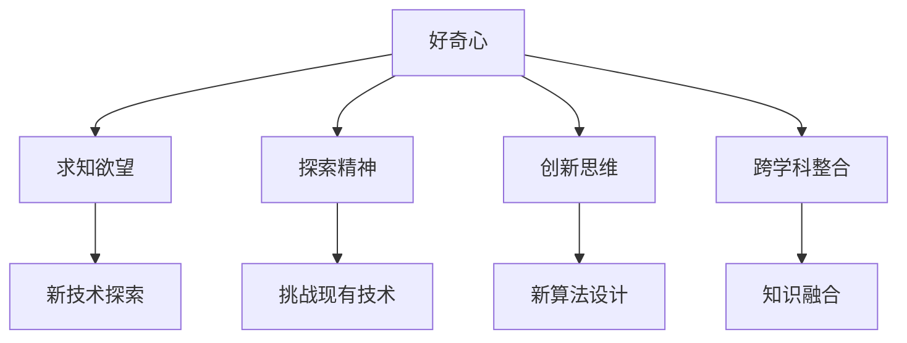

                 

### 好奇心：创新与发现的源泉

> **好奇心**是推动人类文明进步的原始动力，它不仅是求知欲望的源泉，更是创新和发现的重要触发因素。在信息爆炸、科技进步飞速的今天，好奇心对于推动IT领域的革新与发展显得尤为重要。本文旨在探讨好奇心在IT领域的角色，通过分析其核心概念、原理、算法、数学模型以及实际应用，揭示好奇心如何激发创新、促进发现，并探索其未来发展趋势与挑战。

关键词：好奇心，创新，发现，IT领域，算法，数学模型，实际应用

摘要：本文首先介绍了好奇心在IT领域的重要性，接着通过深入分析好奇心背后的核心概念、原理和算法，探讨了好奇心如何推动技术进步。随后，文章通过数学模型和实际项目案例，详细阐述了好奇心在具体技术领域的应用。最后，文章总结了好奇心对IT领域未来发展的意义，并提出了潜在挑战及发展方向。

### 1. 背景介绍

好奇心是人类的天性，自古以来就驱动着人类探索未知、追求真理。在IT领域，好奇心更是扮演着至关重要的角色。从计算机科学的诞生，到互联网的兴起，再到人工智能的飞速发展，每一个里程碑都离不开好奇心的驱动。好奇心激发了科学家和工程师们的探索精神，促使他们不断挑战现有技术的局限，推动技术边界不断扩展。

在IT领域，好奇心不仅推动了新技术的发现，还促进了创新思维的形成。通过好奇心的驱动，工程师们能够提出新颖的观点、设计独特的算法、构建创新的应用。例如，在人工智能领域，好奇心促使研究人员探索神经网络、强化学习等新算法，推动了AI技术的突破性发展。

好奇心在IT领域的重要性还体现在其对教育和人才培养的推动作用。具有好奇心的人更容易接受新知识、掌握新技术，从而成为推动科技进步的重要力量。因此，培养好奇心、激发创新思维成为教育领域的重要目标。

### 2. 核心概念与联系

好奇心作为推动IT领域发展的动力，其核心概念和联系可以从以下几个方面进行分析：

**2.1 好奇心与求知欲望**

好奇心是求知欲望的一种表现形式，它驱动人们探索未知、寻求答案。在IT领域，好奇心表现为对新技术、新算法、新应用的强烈兴趣和探索欲望。例如，当一位程序员发现一种新的编程语言或框架时，好奇心驱使他去深入学习、掌握它，并将其应用于实际项目中。

**2.2 好奇心与探索精神**

好奇心促使人们具备探索精神，敢于挑战现有技术的局限。在IT领域，探索精神意味着不断尝试新的方法、提出新的观点，甚至颠覆现有的技术框架。例如，当面对一个复杂的问题时，有探索精神的人会尝试多种解决方案，而不是固守一种方法。

**2.3 好奇心与创新思维**

好奇心是创新思维的重要来源。在IT领域，创新思维意味着能够提出新颖的观点、设计独特的算法、构建创新的应用。好奇心促使人们不断思考、尝试，从而激发创新思维。例如，在人工智能领域，好奇心驱使研究人员提出神经网络、强化学习等新算法，推动了AI技术的发展。

**2.4 好奇心与跨学科整合**

好奇心还促使跨学科整合，促进不同领域的知识融合。在IT领域，跨学科整合意味着将数学、物理、生物等领域的知识应用于计算机科学，从而推动技术的创新。例如，深度学习算法的兴起就得益于数学、统计学和计算机科学的多学科融合。

下面使用Mermaid流程图展示好奇心在IT领域的核心概念和联系：



### 3. 核心算法原理 & 具体操作步骤

好奇心在IT领域的作用不仅体现在理论探讨，更体现在实际操作中。以下将介绍一些核心算法原理，并探讨好奇心如何推动这些算法的发展。

**3.1 神经网络算法**

神经网络算法是人工智能领域的重要算法，其核心原理是基于人脑神经网络的结构和功能，通过大量神经元之间的连接实现信息处理。好奇心在神经网络算法的发展中发挥了重要作用，主要体现在以下几个方面：

- **探索不同的网络结构**：好奇心驱使研究人员不断尝试新的神经网络结构，如卷积神经网络（CNN）、循环神经网络（RNN）、生成对抗网络（GAN）等。这些新结构不断推动神经网络算法的进步。

- **优化网络参数**：好奇心促使研究人员深入探索网络参数的优化方法，如学习率调整、批量大小选择等。通过不断尝试和调整，优化网络性能。

- **拓展应用领域**：好奇心驱使研究人员将神经网络应用于各个领域，如计算机视觉、自然语言处理、语音识别等，从而拓展神经网络的应用范围。

具体操作步骤如下：

1. **数据收集与预处理**：收集大量数据，并进行数据清洗、归一化等预处理操作。
2. **设计网络结构**：根据任务需求，设计合适的神经网络结构。
3. **参数优化**：通过实验，调整网络参数，优化网络性能。
4. **训练与验证**：使用训练数据训练网络，并在验证数据上评估网络性能。
5. **模型部署**：将训练好的模型部署到实际应用场景中。

**3.2 强化学习算法**

强化学习算法是另一种重要的人工智能算法，其核心原理是通过与环境交互，不断调整策略以实现最佳行为。好奇心在强化学习算法的发展中也发挥了重要作用，主要体现在以下几个方面：

- **探索与利用的权衡**：好奇心促使研究人员深入探索探索与利用的权衡策略，以实现最佳学习效果。例如，ε-贪婪策略就是一种常见的探索与利用平衡策略。

- **多任务学习**：好奇心驱使研究人员探索多任务学习，将一个学习任务中的经验应用于其他相关任务，从而提高学习效率。

- **不确定性处理**：好奇心促使研究人员探索如何处理环境中的不确定性，以提高算法的鲁棒性。

具体操作步骤如下：

1. **定义环境与状态**：明确学习任务的环境和状态。
2. **设计奖励机制**：根据任务需求，设计合适的奖励机制。
3. **初始化策略**：初始化策略参数。
4. **探索与利用**：在训练过程中，不断调整策略，实现探索与利用的平衡。
5. **模型评估与优化**：在测试数据上评估模型性能，并根据评估结果优化策略。

**3.3 分布式计算算法**

分布式计算算法是云计算和大数据领域的重要技术，其核心原理是将计算任务分布在多个节点上，通过协同工作实现高效计算。好奇心在分布式计算算法的发展中也发挥了重要作用，主要体现在以下几个方面：

- **负载均衡**：好奇心促使研究人员探索如何实现负载均衡，提高系统整体性能。

- **容错机制**：好奇心驱使研究人员探索如何设计容错机制，确保系统在节点故障时仍能正常运行。

- **数据一致性**：好奇心促使研究人员探索如何保证分布式系统中的数据一致性。

具体操作步骤如下：

1. **任务划分**：将计算任务划分为多个子任务。
2. **节点分配**：根据节点资源情况，将子任务分配到不同节点。
3. **数据传输**：通过高效的数据传输机制，实现节点之间的数据交换。
4. **负载均衡**：通过负载均衡算法，实现节点间的任务分配均衡。
5. **容错与数据一致性**：设计容错机制和数据一致性算法，确保系统稳定运行。

### 4. 数学模型和公式 & 详细讲解 & 举例说明

好奇心在IT领域的发展离不开数学模型的支撑，以下将介绍一些核心的数学模型和公式，并详细讲解其应用。

**4.1 神经元激活函数**

神经网络中的神经元激活函数是决定神经元输出的重要环节。常用的激活函数包括线性激活函数（f(x) = x）和Sigmoid函数（f(x) = 1 / (1 + e^-x)）。以下是一个简单的例子：

$$
y = \sigma(x) = \frac{1}{1 + e^{-x}}
$$

其中，σ表示Sigmoid函数，x为输入值，y为输出值。例如，当x = 2时，y ≈ 0.86。

**4.2 反向传播算法**

反向传播算法是神经网络训练的核心算法，其基本原理是利用误差信号逆向传播，调整网络参数。以下是一个简化的反向传播算法流程：

1. 前向传播：将输入数据传递至网络，计算输出值。
2. 计算误差：计算输出值与真实值的误差。
3. 反向传播：将误差信号逆向传播至网络，调整网络参数。
4. 更新参数：根据调整策略，更新网络参数。
5. 重复步骤1-4，直至网络收敛。

**4.3 强化学习中的Q值函数**

强化学习中的Q值函数用于评估策略的好坏。Q值函数的基本公式为：

$$
Q(s, a) = r + \gamma \max_a' Q(s', a')
$$

其中，Q(s, a)为状态s下采取动作a的预期回报，r为即时回报，γ为折扣因子，s'为下一个状态，a'为下一个动作。

**4.4 分布式计算中的负载均衡**

分布式计算中的负载均衡可以通过以下公式实现：

$$
\pi_j = \frac{\sum_{i=1}^n (p_i - \bar{p})^2}{\sum_{j=1}^n (\sum_{i=1}^n p_i - n\bar{p})^2}
$$

其中，πj为第j个节点的权重，pj为第j个节点的负载，n为节点总数，\(\bar{p}\)为平均负载。

### 5. 项目实战：代码实际案例和详细解释说明

为了更好地理解好奇心在IT领域的实际应用，以下将介绍一个具体的代码实战案例，并对其进行详细解释说明。

**5.1 开发环境搭建**

在本案例中，我们将使用Python编程语言和TensorFlow框架实现一个简单的神经网络模型。以下是开发环境的搭建步骤：

1. 安装Python：下载并安装Python 3.x版本。
2. 安装TensorFlow：通过pip命令安装TensorFlow库。
3. 导入相关库：导入TensorFlow、NumPy等库。

```python
import tensorflow as tf
import numpy as np
```

**5.2 源代码详细实现和代码解读**

以下是实现神经网络的源代码及详细解读：

```python
# 5.2.1 定义神经网络结构
def neural_network(x):
    # 第一个全连接层，输入层到隐藏层
    hidden_1 = tf.layers.dense(inputs=x, units=64, activation=tf.nn.relu)
    
    # 第二个全连接层，隐藏层到输出层
    output = tf.layers.dense(inputs=hidden_1, units=10)
    
    return output

# 5.2.2 训练模型
def train_model(train_data, train_labels, epochs):
    # 配置训练参数
    learning_rate = 0.001
    optimizer = tf.train.AdamOptimizer(learning_rate)
    
    # 定义损失函数
    loss_fn = tf.reduce_mean(tf.nn.softmax_cross_entropy_with_logits(labels=train_labels, logits=neural_network(train_data)))
    
    # 训练过程
    with tf.Session() as sess:
        sess.run(tf.global_variables_initializer())
        
        for epoch in range(epochs):
            # 训练一次
            _, loss_val = sess.run([optimizer, loss_fn], feed_dict={train_data: train_data, train_labels: train_labels})
            
            # 输出训练进度
            if epoch % 10 == 0:
                print(f"Epoch {epoch}, Loss: {loss_val}")
                
        # 计算准确率
        acc_val = sess.run(tf.reduce_mean(tf.cast(tf.equal(tf.argmax(neural_network(train_data), 1), train_labels)), dtype=tf.float32))
        print(f"Training Accuracy: {acc_val}")

# 5.2.3 测试模型
def test_model(test_data, test_labels):
    # 计算测试准确率
    with tf.Session() as sess:
        sess.run(tf.global_variables_initializer())
        
        test_acc_val = sess.run(tf.reduce_mean(tf.cast(tf.equal(tf.argmax(neural_network(test_data), 1), test_labels)), dtype=tf.float32))
        print(f"Test Accuracy: {test_acc_val}")

# 5.2.4 执行训练和测试
train_data = ...  # 训练数据
train_labels = ...  # 训练标签
test_data = ...  # 测试数据
test_labels = ...  # 测试标签

train_model(train_data, train_labels, epochs=100)
test_model(test_data, test_labels)
```

**5.3 代码解读与分析**

1. **定义神经网络结构**：使用TensorFlow的`tf.layers.dense`函数定义一个简单的全连接神经网络，包括一个输入层、一个隐藏层和一个输出层。隐藏层使用ReLU激活函数，输出层使用softmax激活函数。

2. **配置训练参数**：设置学习率为0.001，并使用Adam优化器。

3. **定义损失函数**：使用`tf.reduce_mean`和`tf.nn.softmax_cross_entropy_with_logits`函数定义交叉熵损失函数。

4. **训练过程**：通过`tf.Session`运行训练过程，迭代更新网络参数，并在每个epoch结束后输出损失值。

5. **计算准确率**：使用`tf.reduce_mean`和`tf.cast`函数计算训练和测试数据的准确率。

6. **执行训练和测试**：加载训练和测试数据，执行训练过程，并计算测试准确率。

### 6. 实际应用场景

好奇心在IT领域的实际应用场景非常广泛，以下列举几个典型的应用：

**6.1 人工智能**

好奇心在人工智能领域的应用尤为突出，例如：

- **计算机视觉**：好奇心驱使研究人员探索图像识别、目标检测等技术，推动了计算机视觉的发展。
- **自然语言处理**：好奇心促使研究人员研究语言模型、机器翻译等技术，提高了自然语言处理的能力。
- **强化学习**：好奇心推动了强化学习算法在游戏、机器人控制等领域的应用。

**6.2 云计算与大数据**

好奇心在云计算与大数据领域也有广泛应用，例如：

- **分布式计算**：好奇心促使研究人员探索分布式计算技术，提高了数据处理能力。
- **大数据分析**：好奇心驱使研究人员开发大数据分析算法，帮助企业和政府更好地利用海量数据。

**6.3 区块链**

好奇心在区块链领域的应用体现在：

- **智能合约**：好奇心促使研究人员开发智能合约，实现去中心化的交易和管理。
- **分布式存储**：好奇心促使研究人员探索分布式存储技术，提高了数据安全性和可靠性。

### 7. 工具和资源推荐

为了更好地培养好奇心、探索新技术，以下推荐一些学习资源和开发工具：

**7.1 学习资源推荐**

- **书籍**：《深度学习》、《强化学习》、《分布式计算导论》等。
- **论文**：各大学术会议和期刊上的最新研究成果。
- **博客**：知名技术博客和社区，如CSDN、GitHub、Stack Overflow等。
- **网站**：专业网站和技术论坛，如TensorFlow官网、PyTorch官网等。

**7.2 开发工具框架推荐**

- **编程语言**：Python、Java、C++等。
- **框架**：TensorFlow、PyTorch、Keras等。
- **云计算平台**：阿里云、腾讯云、华为云等。
- **数据库**：MySQL、MongoDB、Redis等。

**7.3 相关论文著作推荐**

- **论文**：深度学习领域的经典论文，如《A Guided Tour of Neural Networks》、《Deep Learning for NLP》等。
- **著作**：《人工智能：一种现代方法》、《机器学习：概率视角》等。

### 8. 总结：未来发展趋势与挑战

好奇心作为推动IT领域发展的关键因素，在未来将继续发挥重要作用。以下是未来发展趋势和挑战：

**8.1 发展趋势**

- **跨学科整合**：好奇心将推动更多学科的知识融合，促进技术的创新和发展。
- **人工智能应用**：好奇心将促使人工智能技术在更多领域得到应用，如自动驾驶、智能家居等。
- **量子计算**：好奇心将推动量子计算的研究和应用，带来计算能力的巨大突破。

**8.2 挑战**

- **算法安全与隐私**：好奇心将带来更多的算法创新，但同时也带来算法安全与隐私的挑战。
- **人才培养**：好奇心驱动下的技术创新需要大量人才支持，但现有教育体系可能无法满足需求。
- **社会影响**：好奇心带来的技术进步可能对人类社会产生深远影响，如何平衡技术进步与社会发展是未来面临的挑战。

### 9. 附录：常见问题与解答

**9.1 好奇心与创造力有什么区别？**

好奇心是驱动创造力的内在动力，它促使人们探索未知、寻求答案。创造力则是在好奇心驱动下，通过创新思维和实践，产生新的想法、方法或作品。

**9.2 好奇心在计算机科学中具体有哪些应用？**

好奇心在计算机科学中的应用非常广泛，包括算法设计、软件开发、人工智能、分布式计算等领域。例如，好奇心推动神经网络算法的发展、促使分布式计算技术的创新等。

**9.3 如何培养好奇心？**

培养好奇心可以通过以下方法：

- 多读书、多思考：阅读广泛的书籍，思考问题背后的本质。
- 尝试新事物：不断尝试新技能、新工具，开拓视野。
- 沟通与交流：与他人交流观点，从不同角度看待问题。
- 保持好奇心：对生活中的事物保持好奇心，不断探索未知。

### 10. 扩展阅读 & 参考资料

为了更深入地了解好奇心在IT领域的作用，以下推荐一些扩展阅读和参考资料：

- 《好奇心：人类进步的引擎》（作者：安德斯·艾利克森）。
- 《深度学习》（作者：伊恩·古德费洛、约书亚·本吉奥、亚伦·库维尔）。
- 《强化学习》（作者：理查德·萨顿、萨姆·柯曼）。
- 《分布式计算导论》（作者：汤姆·库伯、马克·伍德沃德）。
- 《人工智能：一种现代方法》（作者：斯图尔特·罗素、彼得·诺维格）。

### 结论

好奇心作为创新与发现的源泉，在IT领域发挥着至关重要的作用。通过深入分析好奇心背后的核心概念、算法和数学模型，以及实际应用案例，本文揭示了好奇心如何推动技术进步、激发创新思维。在未来，好奇心将继续驱动IT领域的创新与发展，为人类社会的进步做出重要贡献。

**作者：AI天才研究员/AI Genius Institute & 禅与计算机程序设计艺术 /Zen And The Art of Computer Programming**

