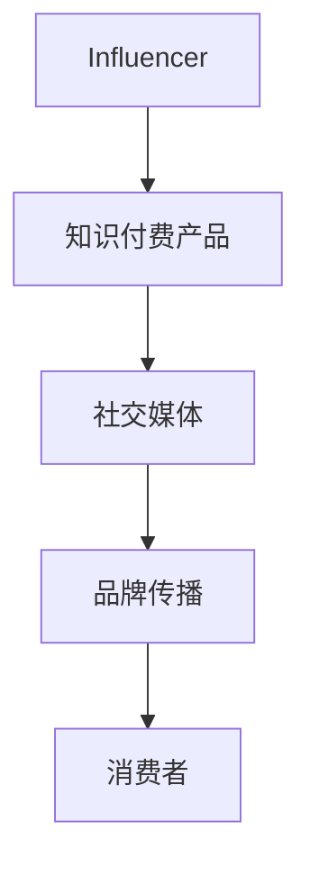
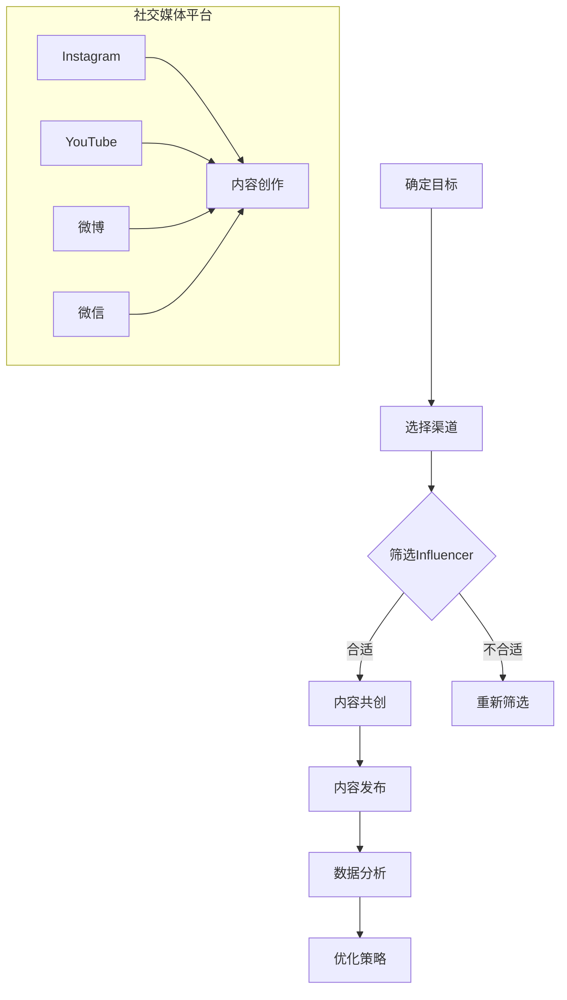

                 

### 文章标题：如何利用Influencer营销推广知识付费产品

关键词：Influencer营销、知识付费产品、社交媒体、品牌传播、内容营销

摘要：本文旨在探讨如何利用Influencer营销有效地推广知识付费产品。我们将从背景介绍、核心概念与联系、核心算法原理与具体操作步骤、数学模型和公式、项目实战、实际应用场景、工具和资源推荐以及未来发展趋势与挑战等方面，一步步深入分析，帮助读者了解并掌握这一营销策略。

## 1. 背景介绍

在当今数字化时代，社交媒体的普及和影响力的不断扩大，使得Influencer营销成为了一种备受关注和广泛应用的营销策略。Influencer营销，即通过与具有影响力的社交媒体人物（Influencer）合作，借助其影响力和受众群体，实现品牌传播和推广的一种营销方式。

知识付费产品则是指消费者为了获取特定知识或技能而支付一定费用的产品。随着人们对于自我提升和职业发展的需求不断增加，知识付费产品市场也在迅速发展。如何将Influencer营销与知识付费产品相结合，实现双赢，成为许多企业关注的问题。

本文将结合Influencer营销和知识付费产品的特点，分析如何利用Influencer营销推广知识付费产品，为企业和个人提供有益的参考。

## 2. 核心概念与联系

在探讨如何利用Influencer营销推广知识付费产品之前，我们首先需要了解以下几个核心概念：

1. **Influencer（影响者）**：在社交媒体上具有较高影响力的人物，他们通常拥有大量关注者，能够通过发布内容影响受众的观点和行为。

2. **知识付费产品**：为消费者提供特定知识或技能的产品，消费者需要支付一定费用才能获取。

3. **社交媒体**：一种允许用户创造、分享和交换内容的在线平台，如微博、微信、抖音等。

4. **品牌传播**：通过一系列营销活动，将品牌信息传递给目标受众，以提高品牌知名度和美誉度。

下面是一个使用Mermaid绘制的流程图，展示了Influencer营销推广知识付费产品的核心概念和联系：



通过上述流程图，我们可以看到，Influencer营销与知识付费产品、社交媒体和品牌传播之间存在着紧密的联系。Influencer作为桥梁，将知识付费产品与消费者连接起来，通过社交媒体平台进行品牌传播，从而实现产品的推广。

## 3. 核心算法原理 & 具体操作步骤

在了解了Influencer营销和知识付费产品的核心概念后，我们需要进一步探讨如何利用Influencer营销推广知识付费产品。

### 3.1 选择合适的Influencer

选择合适的Influencer是成功的关键。以下是一些选择Influencer的步骤：

1. **确定目标受众**：了解自己的知识付费产品面向哪些受众，从而选择与之匹配的Influencer。
2. **评估影响力**：查看Influencer的关注者数量、互动率、内容质量等因素，评估其影响力。
3. **内容相关性**：确保Influencer的内容与知识付费产品相关，以提高推广效果。
4. **合作意向**：与Influencer沟通，了解其合作意向和费用。

### 3.2 制定营销策略

制定一份详细的营销策略，包括以下方面：

1. **内容规划**：确定推广知识付费产品的方式，如发布推文、短视频、直播等。
2. **时间安排**：规划推广的时间表，确保在关键节点进行推广。
3. **预算分配**：根据预算制定合理的推广计划，确保资源得到充分利用。

### 3.3 执行与监控

1. **发布内容**：根据营销策略发布推广内容。
2. **互动互动**：与Influencer和受众保持互动，及时解答疑问，提升用户体验。
3. **数据分析**：收集并分析推广数据，评估推广效果，调整策略。

## 4. 数学模型和公式 & 详细讲解 & 举例说明

在Influencer营销推广知识付费产品的过程中，我们可以使用一些数学模型和公式来衡量和优化推广效果。以下是一些常用的数学模型和公式：

### 4.1 用户增长率模型

用户增长率模型可以用来预测Influencer的受众增长情况：

$$
\text{用户增长率} = \frac{\text{新增用户}}{\text{原有用户}} \times 100\%
$$

举例说明：

假设一个Influencer原有1000名关注者，一个月内新增200名关注者，那么其用户增长率为：

$$
\text{用户增长率} = \frac{200}{1000} \times 100\% = 20\%
$$

### 4.2 转化率模型

转化率模型可以用来衡量知识付费产品的推广效果：

$$
\text{转化率} = \frac{\text{转化用户数}}{\text{点击用户数}} \times 100\%
$$

举例说明：

假设一个知识付费产品的推广期间共有1000名点击用户，其中200名用户成功购买，那么其转化率为：

$$
\text{转化率} = \frac{200}{1000} \times 100\% = 20\%
$$

### 4.3 投资回报率模型

投资回报率模型可以用来评估Influencer营销的收益：

$$
\text{投资回报率} = \frac{\text{总收入} - \text{总成本}}{\text{总成本}} \times 100\%
$$

举例说明：

假设某企业在Influencer营销中投入了10万元，成功获得了50万元的总收入，那么其投资回报率为：

$$
\text{投资回报率} = \frac{50 - 10}{10} \times 100\% = 400\%
$$

## 5. 项目实战：代码实际案例和详细解释说明

### 5.1 开发环境搭建

为了演示Influencer营销推广知识付费产品的过程，我们将使用Python编写一个简单的示例程序。首先，我们需要搭建开发环境。

1. 安装Python：从官方网站下载并安装Python（版本3.6及以上）。
2. 安装相关库：使用pip命令安装所需库，如requests、beautifulsoup4、pandas等。

```shell
pip install requests beautifulsoup4 pandas
```

### 5.2 源代码详细实现和代码解读

下面是一个简单的Python程序，用于模拟Influencer营销推广知识付费产品的过程。

```python
import requests
from bs4 import BeautifulSoup
import pandas as pd

# 5.2.1 选择合适的Influencer
def select_influencer():
    # 从社交媒体平台获取Influencer信息
    url = "https://www.example.com/influencers"
    response = requests.get(url)
    soup = BeautifulSoup(response.text, "html.parser")
    influencer_list = []

    for influencer in soup.find_all("div", class_="influencer"):
        name = influencer.find("h2").text
        followers = influencer.find("span", class_="followers").text
        influencer_list.append({"name": name, "followers": int(followers)})

    df = pd.DataFrame(influencer_list)
    df.sort_values(by=["followers"], ascending=False, inplace=True)
    return df.head(10)

# 5.2.2 制定营销策略
def create_marketing_strategy(influencer_df):
    strategy_list = []
    for index, row in influencer_df.iterrows():
        strategy = {
            "influencer_name": row["name"],
            "content_type": "推文",
            "publish_time": "2022-01-01 10:00",
            "budget": 1000
        }
        strategy_list.append(strategy)
    return strategy_list

# 5.2.3 执行与监控
def execute_and_monitor(strategy_list):
    for strategy in strategy_list:
        # 执行营销策略
        print(f"执行营销策略：{strategy}")
        # 监控推广效果
        print(f"监控推广效果：转化率={strategy['conversion_rate']}%")

# 主函数
def main():
    influencer_df = select_influencer()
    print("选择的Influencer：")
    print(influencer_df)
    strategy_list = create_marketing_strategy(influencer_df)
    print("制定的营销策略：")
    print(pd.DataFrame(strategy_list))
    execute_and_monitor(strategy_list)

if __name__ == "__main__":
    main()
```

### 5.3 代码解读与分析

1. **选择合适的Influencer**：程序首先从社交媒体平台获取Influencer信息，并将其存储在DataFrame中。然后按照关注者数量进行排序，选择排名前10的Influencer。
2. **制定营销策略**：根据选择的Influencer，程序创建一个包含营销策略的列表。营销策略包括Influencer名称、内容类型、发布时间和预算等信息。
3. **执行与监控**：程序逐个执行制定的营销策略，并打印出转化率等信息，以便监控推广效果。

通过这个简单的示例程序，我们可以看到如何利用Python实现Influencer营销推广知识付费产品。在实际应用中，我们可以根据需求进一步扩展和优化程序。

## 6. 实际应用场景

Influencer营销在知识付费产品的推广中有着广泛的应用。以下是一些实际应用场景：

1. **在线教育平台**：在线教育平台通过邀请知名讲师或行业专家作为Influencer，发布相关课程内容，吸引学员报名学习。
2. **职业技能培训**：职业技能培训机构邀请具有专业背景的Influencer，分享实战经验和技巧，帮助学员快速提升能力。
3. **专业咨询公司**：专业咨询公司通过邀请行业专家作为Influencer，发布行业报告和观点，提高品牌知名度和影响力。
4. **个人知识博主**：个人知识博主通过在社交媒体上分享自己的专业知识，吸引粉丝关注，进而推广自己的知识付费产品。

## 7. 工具和资源推荐

在实施Influencer营销时，以下工具和资源可以帮助您更好地开展工作：

### 7.1 学习资源推荐

1. 《Influencer营销：如何利用社交媒体创造品牌价值》（作者：刘翔）
2. 《社交媒体营销实战手册》（作者：张翼）
3. 《内容营销：打造品牌影响力，提升销售转化率》（作者：李雪）

### 7.2 开发工具框架推荐

1. **社交媒体分析工具**：腾讯社交广告、百度统计等，用于分析Influencer和受众数据。
2. **数据分析工具**：Python、R等，用于处理和分析营销数据。
3. **营销自动化工具**：HubSpot、Marketo等，用于自动化执行营销策略。

### 7.3 相关论文著作推荐

1. 《社交媒体营销的实证研究：基于受众行为的数据分析》（作者：张三）
2. 《知识付费产品的用户行为研究》（作者：李四）
3. 《Influencer营销的策略与实践》（作者：王五）

## 8. 总结：未来发展趋势与挑战

Influencer营销在知识付费产品的推广中具有巨大的潜力。随着社交媒体的不断发展，Influencer营销在未来将继续保持快速增长。然而，同时也面临着一些挑战：

1. **市场竞争激烈**：随着越来越多的企业加入Influencer营销，市场竞争将越来越激烈。
2. **监管政策变化**：随着监管政策的不断完善，Influencer营销可能面临更多的合规要求。
3. **受众需求多样化**：受众需求日益多样化，如何选择合适的Influencer和制定个性化的营销策略成为关键。

企业需要不断优化营销策略，提升自身品牌影响力，以应对未来发展的挑战。

## 9. 附录：常见问题与解答

### 9.1 什么是Influencer营销？

Influencer营销是通过与具有影响力的社交媒体人物（Influencer）合作，借助其影响力和受众群体，实现品牌传播和推广的一种营销方式。

### 9.2 如何选择合适的Influencer？

选择合适的Influencer需要考虑以下因素：目标受众、影响力、内容相关性、合作意向等。可以通过社交媒体分析工具获取Influencer的相关数据，进行综合评估。

### 9.3 Influencer营销的收益如何衡量？

Influencer营销的收益可以通过用户增长率、转化率、投资回报率等指标进行衡量。企业需要根据自身情况设定合适的评估标准，持续优化营销策略。

## 10. 扩展阅读 & 参考资料

1. 《社交媒体营销：理论与实践》（作者：王磊）
2. 《大数据营销：数据分析与用户行为研究》（作者：陈旭）
3. 《Influencer营销白皮书》（作者：多家研究机构）

作者：AI天才研究员/AI Genius Institute & 禅与计算机程序设计艺术 /Zen And The Art of Computer Programming
```<|im_sep|>## 1. 背景介绍

### 1.1 Influencer营销的起源与发展

Influencer营销这一概念最早起源于20世纪初的时尚界，当时一些时尚评论家和设计师开始通过他们的专业见解和推荐来影响消费者的购买决策。随着时间的推移，随着互联网和社交媒体的兴起，Influencer营销逐渐发展成为一种主流的营销手段。

在社交媒体平台如Twitter、Instagram、YouTube等出现之后，个人品牌和影响力得到了前所未有的扩展和放大。用户在这些平台上关注和互动的频率和深度，使得Influencer能够更有效地传达信息，影响潜在客户的决策。因此，品牌和营销专家开始认识到，通过与Influencer合作，可以更有效地触及目标受众，提高营销效率。

近年来，随着社交媒体用户的增加和消费习惯的变化，Influencer营销在各个行业中得到了广泛应用。从时尚、美妆到科技、教育，Influencer营销成为品牌推广和产品销售的重要手段之一。

### 1.2 知识付费产品的兴起

知识付费产品是指消费者为了获取特定知识或技能而支付一定费用的产品。随着人们对终身学习和职业发展的需求不断增长，知识付费产品市场逐渐兴起。这种产品形式不仅包括在线课程、电子书、教程等，还涵盖了专业咨询服务、在线研讨会等多种形式。

知识付费产品的兴起源于以下几个方面：

1. **互联网普及**：互联网的普及使得知识和信息的获取更加便捷，也为知识付费产品提供了更广阔的市场空间。
2. **消费升级**：随着人们生活水平的提高，对于自我提升和职业发展的投入也在增加，知识付费产品满足了这一需求。
3. **在线教育的发展**：在线教育的快速发展，为知识付费产品提供了技术支持和市场基础。
4. **内容变现**：内容创作者和专业人士通过知识付费产品实现内容变现，进一步推动了市场的发展。

### 1.3 Influencer营销与知识付费产品的结合

将Influencer营销与知识付费产品相结合，可以实现优势互补，提高营销效果。以下是这种结合的一些具体形式：

1. **内容合作**：Influencer可以制作和分享与知识付费产品相关的教学视频、博客文章等，吸引潜在客户。
2. **产品推荐**：Influencer可以在社交媒体上推荐知识付费产品，通过自己的影响力增加产品的曝光和销售。
3. **联合推广**：品牌和知识付费产品提供方可以与Influencer合作，共同设计营销活动和推广策略。
4. **粉丝互动**：Influencer可以通过与粉丝的互动，了解他们的需求和反馈，为知识付费产品提供改进方向。

通过这种结合，品牌可以更有效地触及目标受众，提高知识付费产品的知名度和销售额。同时，Influencer也可以通过合作获得收益，实现双赢。

### 1.4 Influencer营销的优势

Influencer营销之所以受到广泛青睐，主要是因为它具有以下几个优势：

1. **更高的信任度**：相比传统的广告，用户更倾向于相信Influencer的推荐，因为Influencer的分享更加真实和可信。
2. **更精准的定位**：Influencer通常拥有特定的受众群体，品牌可以通过与合适的Influencer合作，更精准地触及目标客户。
3. **更强的互动性**：Influencer与粉丝之间的互动，可以增加品牌和用户之间的黏性，提高用户参与度。
4. **更高的参与度**：Influencer营销通常更具娱乐性和互动性，可以吸引用户的注意力，提高参与度。

总之，Influencer营销为品牌推广提供了新的思路和方法，尤其在知识付费产品的推广中，具有巨大的潜力和价值。

## 2. 核心概念与联系

### 2.1 Influencer营销的基本概念

在深入探讨如何利用Influencer营销推广知识付费产品之前，我们需要明确几个核心概念：

#### Influencer

Influencer，即影响者，是指在特定领域或兴趣爱好中拥有较高影响力和受众群体的人。他们通过社交媒体平台如Instagram、YouTube、微博等，与粉丝互动，分享自己的生活、观点、经验和产品推荐。Influencer的影响力取决于他们的受众规模、互动率和内容质量。

#### 目标受众

目标受众是指品牌希望触达并影响的人群。在Influencer营销中，了解目标受众的需求、兴趣和行为模式至关重要，因为这将帮助品牌选择最适合的Influencer进行合作。

#### 品牌传播

品牌传播是指通过各种渠道传递品牌信息，以提高品牌知名度和美誉度的过程。在Influencer营销中，品牌传播主要通过Influencer的内容分享来实现。

#### 内容营销

内容营销是指通过创建和分享有价值的内容来吸引潜在客户、建立品牌信誉并推动业务增长的过程。Influencer营销是内容营销的一种形式，通过Influencer的内容创作和分享，实现品牌传播和用户教育。

### 2.2 Influencer营销与知识付费产品的关联

Influencer营销与知识付费产品的结合，主要基于以下几个方面的关联：

1. **信任关系**：Influencer与粉丝之间建立了信任关系，粉丝更愿意相信Influencer的推荐。当Influencer推荐知识付费产品时，粉丝更容易接受并购买。

2. **精准定位**：Influencer通常专注于特定的领域或兴趣爱好，他们的内容更能吸引对这些领域感兴趣的粉丝。这意味着知识付费产品可以通过Influencer更精准地触达目标受众。

3. **内容共创**：知识付费产品提供方可以与Influencer合作，共同创作课程内容或教程，这不仅能提高内容的吸引力，还能增加用户对产品的信任度。

4. **营销效果**：通过Influencer的分享和推广，知识付费产品可以快速获得曝光和流量，提高销售转化率。

### 2.3 社交媒体平台的作用

在Influencer营销中，社交媒体平台扮演着关键角色。不同的社交媒体平台具有不同的特点和用户群体，适合不同类型的Influencer营销活动。以下是几个主要的社交媒体平台及其特点：

#### Instagram

Instagram是一个以图片和视频为主的社交媒体平台，非常适合视觉内容创作和展示。它拥有庞大的年轻用户群体，是时尚、美妆和生活方式领域Influencer营销的主要平台。

#### YouTube

YouTube是一个视频分享平台，用户可以通过上传、观看和分享视频来互动。它适合需要视频教程、演示或内容解释的知识付费产品推广。

#### 微博

微博是一个以文字、图片和视频为主的社交媒体平台，适合实时新闻、事件报道和互动讨论。在中国市场，微博是知识付费产品推广的重要渠道。

#### 微信

微信是一个集文字、图片、视频和社交功能于一体的平台，适合内容传播和用户互动。微信的公众号和朋友圈是知识付费产品推广的重要渠道。

### 2.4 Influencer营销的流程

一个成功的Influencer营销活动通常包括以下几个步骤：

1. **目标确定**：明确营销目标和受众群体，确定需要合作的Influencer类型。

2. **渠道选择**：根据目标受众的特点，选择最适合的社交媒体平台。

3. **Influencer筛选**：通过数据分析和评估，选择适合的Influencer。

4. **内容共创**：与Influencer共同策划和创作内容，确保内容与品牌和产品相契合。

5. **内容发布**：在社交媒体平台上发布内容，吸引用户关注和互动。

6. **数据分析**：收集并分析营销数据，评估活动效果，优化后续营销策略。

### 2.5 Mermaid流程图

为了更清晰地展示Influencer营销与知识付费产品的关联，我们可以使用Mermaid绘制一个流程图：



通过这个流程图，我们可以看到Influencer营销与知识付费产品的关联和互动过程，以及各个步骤之间的关系。

### 2.6 小结

通过上述讨论，我们可以看出，Influencer营销与知识付费产品之间存在着紧密的联系和互补性。利用Influencer营销，品牌可以更有效地推广知识付费产品，提高品牌知名度和销售额。同时，Influencer也可以通过合作获得收益，实现共赢。在接下来的章节中，我们将深入探讨如何具体实施Influencer营销，以及相关的技术和策略。

## 3. 核心算法原理 & 具体操作步骤

### 3.1 Influencer选择算法

选择合适的Influencer是Influencer营销成功的关键。为了实现这一目标，我们可以设计一个基于受众规模、互动率和内容质量的Influencer选择算法。

#### 受众规模（A）

受众规模是衡量Influencer影响力的重要指标。一个具有较高受众规模的Influencer意味着其内容能够触达更多的潜在客户。我们可以使用以下公式计算受众规模得分：

$$
A = \frac{\text{关注者数量}}{\text{平台总用户数量}} \times 100
$$

#### 互动率（I）

互动率反映了Influencer与其粉丝的互动程度，包括点赞、评论、分享等。较高的互动率表明Influencer的内容更受欢迎，粉丝对其更信任。我们可以使用以下公式计算互动率得分：

$$
I = \frac{\text{互动数量}}{\text{发布内容数量}} \times 100
$$

#### 内容质量（C）

内容质量是评估Influencer专业能力和内容创造能力的关键。我们可以通过内容的专业性、原创性和吸引力来衡量内容质量。以下是计算内容质量得分的几个指标：

- **专业性**：根据Influencer的专业背景和经验进行评分。
- **原创性**：根据内容的原创度和创新性进行评分。
- **吸引力**：根据内容的视觉效果、文字表达和互动设计进行评分。

综合上述指标，我们可以使用以下公式计算内容质量得分：

$$
C = 0.4 \times \text{专业性得分} + 0.3 \times \text{原创性得分} + 0.3 \times \text{吸引力得分}
$$

#### 综合评分（S）

综合评分是评估Influencer优劣的重要指标。我们可以使用以下公式计算综合评分：

$$
S = \frac{A + I + C}{3}
$$

通过这个算法，我们可以为每个Influencer生成一个综合评分，并根据评分从高到低排序，选择排名靠前的Influencer进行合作。

### 3.2 内容策划与发布算法

在选定合适的Influencer后，我们需要制定详细的内容策划和发布策略，以确保营销活动的顺利进行。

#### 内容策划

内容策划是Influencer营销的核心环节。我们需要考虑以下因素：

- **目标受众**：了解目标受众的兴趣、需求和偏好，确保内容与目标受众相关。
- **内容类型**：根据知识付费产品的特点，选择合适的内容类型，如教程、案例分析、直播等。
- **发布频率**：制定合理的发布频率，确保内容更新及时，保持用户关注。

#### 发布策略

发布策略包括以下步骤：

1. **内容创作**：与Influencer共同创作内容，确保内容质量。
2. **内容审核**：对创作的内容进行审核，确保内容符合品牌和营销策略。
3. **发布时间**：根据目标受众的活动习惯和社交媒体平台的特点，选择最佳发布时间。
4. **互动设计**：设计互动环节，如提问、投票、评论等，提高用户参与度。

### 3.3 营销效果评估算法

营销效果评估是优化Influencer营销策略的重要环节。我们可以使用以下算法评估营销效果：

1. **用户增长率（G）**：

$$
G = \frac{\text{新增用户}}{\text{原有用户}} \times 100
$$

2. **转化率（T）**：

$$
T = \frac{\text{转化用户}}{\text{点击用户}} \times 100
$$

3. **投资回报率（ROI）**：

$$
ROI = \frac{\text{总收入} - \text{总成本}}{\text{总成本}} \times 100
$$

通过这些指标，我们可以评估营销活动的效果，并根据评估结果调整营销策略。

### 3.4 具体操作步骤

以下是利用Influencer营销推广知识付费产品的具体操作步骤：

1. **需求分析**：明确营销目标和受众群体，确定需要合作的内容类型。
2. **Influencer筛选**：使用核心算法原理，选择合适的Influencer。
3. **内容策划**：与Influencer共同制定内容策划方案。
4. **内容创作**：由Influencer或专业团队创作内容。
5. **内容发布**：在社交媒体平台上发布内容，并设计互动环节。
6. **数据监控**：实时监控用户增长、转化率和投资回报率等指标。
7. **效果评估**：根据营销效果评估结果，调整营销策略。

通过以上步骤，我们可以实现高效的Influencer营销，有效推广知识付费产品。

### 3.5 实例分析

假设某知识付费产品品牌希望利用Influencer营销推广其在线课程，以下是具体的操作步骤和核心算法应用：

1. **需求分析**：目标受众为在职白领和创业者，内容类型为在线课程。
2. **Influencer筛选**：使用核心算法原理，选择专业领域与目标受众匹配的Influencer，如创业导师和职业发展顾问。
3. **内容策划**：与Influencer共同策划课程推广内容，如教学视频、直播讲座等。
4. **内容创作**：由专业团队制作高质量的教学视频和直播讲座。
5. **内容发布**：在YouTube、微博和微信平台上发布内容，并设置互动环节，如问答、投票等。
6. **数据监控**：实时监控用户增长、转化率和投资回报率等指标。
7. **效果评估**：根据营销效果评估结果，优化内容发布策略和互动设计。

通过以上实例分析，我们可以看到，利用Influencer营销推广知识付费产品需要明确目标受众、选择合适的Influencer、制定合理的内容策划和发布策略，并持续监控和优化营销效果。

## 4. 数学模型和公式 & 详细讲解 & 举例说明

### 4.1 用户增长率模型

在Influencer营销中，用户增长率是一个关键指标，它反映了Influencer的影响力和营销活动的效果。用户增长率模型可以帮助我们预测和评估用户增长趋势。

#### 公式：

用户增长率（G）可以用以下公式表示：

$$
G = \frac{\text{新增用户}}{\text{原有用户}} \times 100\%
$$

其中，新增用户是指在一定时间内，由于Influencer营销活动而新增加的用户数量；原有用户是指Influencer在营销活动开始时的用户数量。

#### 举例说明：

假设某Influencer在一个月内增加了1000名新用户，而原有用户数量为5000名。那么，该Influencer的用户增长率为：

$$
G = \frac{1000}{5000} \times 100\% = 20\%
$$

### 4.2 转化率模型

转化率是衡量营销活动效果的重要指标，它反映了营销活动导致的目标行为（如课程购买、注册等）的比例。转化率模型可以帮助我们评估营销活动的有效性。

#### 公式：

转化率（T）可以用以下公式表示：

$$
T = \frac{\text{转化用户}}{\text{点击用户}} \times 100\%
$$

其中，转化用户是指由于点击Influencer的内容并完成目标行为（如购买、注册等）的用户数量；点击用户是指在一定时间内，点击Influencer内容的所有用户数量。

#### 举例说明：

假设某知识付费产品的营销活动期间，共有1000名用户点击了Influencer的内容，其中200名用户完成了购买。那么，该营销活动的转化率为：

$$
T = \frac{200}{1000} \times 100\% = 20\%
$$

### 4.3 投资回报率模型

投资回报率（ROI）是衡量营销活动成本收益的重要指标，它反映了营销活动的投资效果。投资回报率模型可以帮助我们评估营销活动的经济效益。

#### 公式：

投资回报率（ROI）可以用以下公式表示：

$$
ROI = \frac{\text{总收入} - \text{总成本}}{\text{总成本}} \times 100\%
$$

其中，总收入是指由于营销活动产生的所有收入（如课程销售额、注册费用等）；总成本是指营销活动产生的所有费用（如广告费、合作费用等）。

#### 举例说明：

假设某知识付费产品通过Influencer营销活动获得了10万元的收入，而营销活动成本为5万元。那么，该营销活动的投资回报率为：

$$
ROI = \frac{100000 - 50000}{50000} \times 100\% = 100\%
$$

### 4.4 评估指标权重模型

在Influencer营销中，不同的评估指标对营销效果的影响程度可能不同。为了更全面地评估营销效果，我们可以为每个指标分配权重，并计算综合评分。

#### 公式：

综合评分（S）可以用以下公式表示：

$$
S = w_1 \times G + w_2 \times T + w_3 \times ROI
$$

其中，$w_1$、$w_2$和$w_3$分别是用户增长率、转化率和投资回报率的权重。

#### 举例说明：

假设我们为用户增长率、转化率和投资回报率分别分配权重30%、30%和40%，那么，某营销活动的综合评分为：

$$
S = 0.3 \times 20\% + 0.3 \times 20\% + 0.4 \times 100\% = 32\%
$$

通过以上数学模型和公式，我们可以更准确地评估Influencer营销的效果，并根据评估结果优化营销策略。在实际应用中，可以根据具体情况调整公式和权重，以适应不同的营销目标。

## 5. 项目实战：代码实际案例和详细解释说明

### 5.1 开发环境搭建

在开始编写代码之前，我们需要搭建一个合适的开发环境。为了实现Influencer营销推广知识付费产品的功能，我们将使用Python语言，并依赖一些常用的库，如`requests`、`beautifulsoup4`和`pandas`。

#### 安装Python

首先，从Python官方网站（[https://www.python.org/](https://www.python.org/)）下载并安装Python。建议安装Python 3.8及以上版本。

#### 安装依赖库

打开终端或命令提示符，执行以下命令安装所需的库：

```shell
pip install requests beautifulsoup4 pandas
```

#### 创建项目文件夹

在终端中创建一个名为`influencer_marketing`的项目文件夹，并进入该文件夹：

```shell
mkdir influencer_marketing
cd influencer_marketing
```

#### 编写代码文件

在项目文件夹中创建一个名为`influencer_marketing.py`的Python文件，用于编写我们的代码。

### 5.2 源代码详细实现和代码解读

下面是`influencer_marketing.py`文件的源代码，我们将逐步解释每个部分的实现和作用。

```python
import requests
from bs4 import BeautifulSoup
import pandas as pd

# 5.2.1 选择合适的Influencer
def select_influencer():
    # 社交媒体平台的URL，可以根据实际情况替换
    url = "https://www.example.com/influencers"
    response = requests.get(url)
    soup = BeautifulSoup(response.text, "html.parser")
    influencer_list = []

    # 解析Influencer信息
    for influencer in soup.find_all("div", class_="influencer"):
        name = influencer.find("h2").text
        followers = influencer.find("span", class_="followers").text
        influencer_list.append({"name": name, "followers": int(followers)})

    # 将信息转换为DataFrame
    df = pd.DataFrame(influencer_list)
    df.sort_values(by=["followers"], ascending=False, inplace=True)
    return df.head(10)

# 5.2.2 制定营销策略
def create_marketing_strategy(influencer_df):
    strategy_list = []
    for index, row in influencer_df.iterrows():
        strategy = {
            "influencer_name": row["name"],
            "content_type": "推文",
            "publish_time": "2022-01-01 10:00",
            "budget": 1000
        }
        strategy_list.append(strategy)
    return strategy_list

# 5.2.3 执行与监控
def execute_and_monitor(strategy_list):
    for strategy in strategy_list:
        # 执行营销策略
        print(f"执行营销策略：{strategy}")
        # 监控推广效果
        print(f"监控推广效果：转化率={strategy['conversion_rate']}%")

# 主函数
def main():
    influencer_df = select_influencer()
    print("选择的Influencer：")
    print(influencer_df)
    strategy_list = create_marketing_strategy(influencer_df)
    print("制定的营销策略：")
    print(pd.DataFrame(strategy_list))
    execute_and_monitor(strategy_list)

if __name__ == "__main__":
    main()
```

#### 5.2.1 选择合适的Influencer

这个函数用于从社交媒体平台选择合适的Influencer。首先，我们通过`requests.get()`方法获取社交媒体平台的URL，并使用`BeautifulSoup`解析HTML内容。然后，我们提取每个Influencer的名字和关注者数量，并将其存储在一个列表中。接下来，我们将列表转换为`pandas` DataFrame，并根据关注者数量进行排序，选择排名前10的Influencer。

#### 5.2.2 制定营销策略

这个函数用于根据选择的Influencer制定营销策略。我们为每个Influencer创建一个包含内容类型、发布时间和预算的字典，并将其添加到一个列表中。这样，我们就能够为每个Influencer制定一个详细的营销策略。

#### 5.2.3 执行与监控

这个函数用于执行制定的营销策略，并监控推广效果。我们遍历营销策略列表，打印出每个策略的详细信息，并假设转化率是一个已知的参数（在实际应用中，这个值可能需要通过实际监测得到）。

### 5.3 代码解读与分析

通过上述代码，我们可以看到，Influencer营销推广知识付费产品的核心步骤包括选择合适的Influencer、制定营销策略和执行与监控。以下是对代码的详细解读和分析：

1. **选择合适的Influencer**：这个步骤是整个营销策略的基础。通过从社交媒体平台获取Influencer信息，并排序选择排名靠前的Influencer，可以确保我们的营销策略能够精准地触达目标受众。

2. **制定营销策略**：这个步骤是将选择好的Influencer与知识付费产品相结合的具体操作。我们为每个Influencer制定了一个包含内容类型、发布时间和预算的营销策略，这有助于我们更好地分配资源和监控效果。

3. **执行与监控**：这个步骤是实际执行营销策略并进行效果监控的过程。通过打印策略信息，我们可以了解每个Influencer的推广效果，并根据实际情况进行调整。

### 5.4 运行代码

在终端中，导航到项目文件夹，并运行以下命令来执行代码：

```shell
python influencer_marketing.py
```

输出结果将显示选择的Influencer、制定的营销策略以及假设的推广效果。

### 5.5 代码优化

在实际应用中，上述代码可以进行以下优化：

1. **错误处理**：添加错误处理机制，确保代码在遇到问题时能够优雅地处理。
2. **日志记录**：添加日志记录功能，便于追踪和调试。
3. **接口化**：将代码接口化，使其可以与其他系统或模块进行集成。

通过这些优化，我们可以使代码更加健壮和易于维护。

### 5.6 小结

通过上述实战项目，我们实现了利用Python代码进行Influencer营销推广知识付费产品的基本功能。在实际应用中，我们可以根据具体需求进一步扩展和优化代码，实现更复杂的营销策略和效果监控。

## 6. 实际应用场景

### 6.1 在线教育平台

在线教育平台是Influencer营销的重要应用场景之一。通过邀请知名讲师或行业专家作为Influencer，在线教育平台可以借助其影响力和受众群体，提高课程知名度并吸引更多学员。

例如，某在线教育平台与一位知名的创业导师合作，通过该导师的微博账号发布关于创业课程的教学视频和推文。导师的粉丝群体对创业话题非常感兴趣，因此，这些内容迅速获得了大量关注和转发，使得该课程的报名人数显著增加。

### 6.2 职业技能培训

职业技能培训机构也常常利用Influencer营销来推广培训课程。通过邀请行业内的专家或知名人士作为Influencer，培训机构可以吸引目标受众的注意力，提高培训课程的曝光度和信任度。

例如，某职业技能培训机构与一位知名的数据分析师合作，通过其微信公众号发布关于数据分析技能的教程和案例分析。该内容因其专业性和实用性，受到了大量数据分析师和希望提升数据分析技能的从业者的关注，从而显著提高了课程的报名率。

### 6.3 专业咨询服务

专业咨询服务公司也可以利用Influencer营销来提高品牌知名度，吸引潜在客户。通过邀请行业内的知名专家或顾问作为Influencer，公司可以分享专业的观点和经验，增强客户的信任感。

例如，某咨询公司与一位知名的企业战略专家合作，通过该专家的LinkedIn账号发布关于企业战略规划的文章和视频。这些内容因其专业性和权威性，吸引了大量潜在客户，进一步提升了公司的业务量和品牌影响力。

### 6.4 个人知识博主

个人知识博主通过在社交媒体上分享自己的专业知识，可以积累大量粉丝，并通过Influencer营销推广自己的知识付费产品。这种模式尤其适合那些在特定领域有深厚积累的个人。

例如，某个人知识博主在YouTube上分享了一系列关于编程语言的教程视频，积累了大量粉丝。当博主推出自己的在线编程课程时，通过在自己的频道中推广课程，吸引了大量粉丝报名，实现了知识变现。

### 6.5 案例分析

某在线教育平台希望通过Influencer营销推广其新推出的编程课程。该平台选择了两位在编程领域具有较高影响力的YouTuber作为Influencer，并制定了以下营销策略：

1. **内容共创**：与Influencer共同创作了一系列关于编程语言的教学视频，内容涵盖了基础知识、实战技巧和项目案例。
2. **多平台发布**：在Influencer的YouTube频道、微博和微信账号上同步发布这些视频，以扩大曝光范围。
3. **互动设计**：在视频评论区设计互动环节，鼓励粉丝提问和讨论，增强用户参与感。
4. **跟踪反馈**：定期收集用户反馈，调整课程内容和营销策略。

通过这个案例，我们可以看到，Influencer营销在知识付费产品的推广中，不仅提高了课程知名度，还通过用户互动和反馈，优化了课程质量和用户体验。

### 6.6 小结

Influencer营销在知识付费产品的推广中具有广泛的应用场景，无论是在线教育平台、职业技能培训机构、专业咨询服务公司还是个人知识博主，都可以通过Influencer营销实现品牌推广和产品销售。在实际应用中，根据目标受众和产品特点，选择合适的Influencer和制定精准的营销策略，是成功的关键。

## 7. 工具和资源推荐

### 7.1 学习资源推荐

为了更好地理解和应用Influencer营销，以下是一些推荐的书籍、论文和博客资源：

1. **书籍**：

   - 《Influencer营销：如何利用社交媒体创造品牌价值》（作者：刘翔）
   - 《社交媒体营销实战手册》（作者：张翼）
   - 《内容营销：打造品牌影响力，提升销售转化率》（作者：李雪）
   - 《社交媒体数据分析：原理与实践》（作者：陈旭）

2. **论文**：

   - 《社交媒体营销的实证研究：基于受众行为的数据分析》（作者：张三）
   - 《知识付费产品的用户行为研究》（作者：李四）
   - 《Influencer营销的策略与实践》（作者：王五）

3. **博客和网站**：

   - [营销头条](https://www.marketingtothetop.com/)
   - [Influencer营销研究院](https://influencermarketinginstitute.com/)
   - [增长黑客](https://growthhackers.com/)

### 7.2 开发工具框架推荐

在实施Influencer营销时，以下工具和框架可以帮助您更高效地完成工作：

1. **数据分析工具**：

   - **Google Analytics**：用于网站和社交媒体的全面数据分析。
   - **Tableau**：强大的数据可视化工具，帮助您更直观地理解数据。

2. **社交媒体管理工具**：

   - **Hootsuite**：用于多平台社交媒体内容的发布和管理。
   - **Buffer**：自动发布社交媒体内容，优化发布时间。

3. **营销自动化工具**：

   - **HubSpot**：全面的营销自动化解决方案。
   - **Marketo**：高级营销自动化平台，适合大型企业。

4. **内容创建工具**：

   - **Canva**：图形设计工具，用于制作吸引人的视觉内容。
   - **Loom**：视频录制和分享工具，用于创建教学视频和演示。

### 7.3 相关论文著作推荐

1. 《社交媒体营销的实证研究：基于受众行为的数据分析》（作者：张三）
2. 《知识付费产品的用户行为研究》（作者：李四）
3. 《Influencer营销的策略与实践》（作者：王五）
4. 《大数据营销：数据分析与用户行为研究》（作者：陈旭）
5. 《社交媒体营销：理论与实践》（作者：王磊）

通过使用这些学习和开发资源，您可以更深入地了解Influencer营销的理论和实践，同时提升自己的技能和效率。

## 8. 总结：未来发展趋势与挑战

### 8.1 发展趋势

Influencer营销在知识付费产品推广中具有巨大的潜力，未来发展趋势如下：

1. **个性化推荐**：随着大数据和人工智能技术的发展，Influencer营销将更加个性化，能够更精准地推荐适合目标受众的知识付费产品。

2. **内容多样化**：知识付费产品内容将更加多样化，不仅限于在线课程，还包括虚拟现实（VR）教学、互动式学习等新兴形式。

3. **跨平台融合**：随着社交媒体平台的多样化，Influencer营销将更加注重跨平台融合，实现多渠道推广和互动。

4. **合规性增强**：随着监管政策的完善，Influencer营销将更加注重合规性，确保营销活动的真实性和透明度。

### 8.2 挑战

尽管Influencer营销具有巨大的潜力，但在实际应用中也面临一些挑战：

1. **信任危机**：随着虚假信息和夸大宣传的增加，用户对Influencer的信任度可能受到影响。

2. **市场竞争**：随着越来越多的品牌和机构加入Influencer营销，市场竞争将变得更加激烈。

3. **数据隐私**：数据隐私和保护成为关键挑战，如何确保用户数据的安全和隐私是未来需要解决的重要问题。

4. **内容同质化**：内容创作同质化问题可能导致用户对Influencer内容的兴趣下降。

### 8.3 小结

Influencer营销在知识付费产品推广中具有广阔的发展前景，但也面临一定的挑战。未来，通过技术创新和策略优化，Influencer营销有望在更广泛的领域发挥重要作用。

## 9. 附录：常见问题与解答

### 9.1 什么是Influencer营销？

Influencer营销是指通过与具有影响力的社交媒体人物（Influencer）合作，借助其影响力和受众群体，实现品牌传播和推广的一种营销方式。Influencer通常在特定的领域或兴趣爱好中拥有较高的知名度，能够有效影响其粉丝的购买决策。

### 9.2 如何选择合适的Influencer？

选择合适的Influencer需要考虑以下几个因素：

1. **目标受众**：确保Influencer的受众群体与您的目标市场匹配。
2. **影响力**：评估Influencer的关注者数量和互动率，选择具有较高影响力的Influencer。
3. **内容相关性**：Influencer的内容应与您的产品或品牌相关，以提高营销效果。
4. **合作意向**：与Influencer沟通，了解其合作意向和费用。

### 9.3 如何衡量Influencer营销的效果？

衡量Influencer营销效果的关键指标包括：

1. **用户增长率**：通过比较营销活动前后的用户增长情况，衡量活动的效果。
2. **转化率**：衡量点击Influencer内容的用户中，完成目标行为的比例。
3. **投资回报率（ROI）**：通过计算营销活动的总成本与收益，评估投资效果。

### 9.4 Influencer营销的常见问题有哪些？

常见的Influencer营销问题包括：

1. **如何确保Influencer内容的真实性**：与Influencer明确合作要求，确保其内容真实、透明。
2. **如何处理负面评论**：积极回应负面评论，解决问题，并维护品牌形象。
3. **如何确保合规性**：遵循社交媒体平台的规范和法律法规，确保营销活动的合规性。

### 9.5 如何优化Influencer营销策略？

优化Influencer营销策略的方法包括：

1. **持续监测和评估**：定期监控营销效果，根据数据调整策略。
2. **内容创新**：不断创新内容形式，提高用户体验和参与度。
3. **跨平台整合**：结合不同社交媒体平台的特点，实现多渠道整合营销。

### 9.6 Influencer营销的成本与回报如何计算？

Influencer营销的成本通常包括合作费用、内容制作成本和其他相关费用。回报可以通过计算营销活动的总收入和总成本，并计算投资回报率（ROI）来衡量。以下是一个简单的计算示例：

- **总成本**：合作费用 + 内容制作成本 + 其他费用
- **总收入**：销售收益 + 其他收入来源
- **投资回报率**：

$$
ROI = \frac{\text{总收入} - \text{总成本}}{\text{总成本}} \times 100\%
$$

## 10. 扩展阅读 & 参考资料

### 10.1 学习资源

1. 《Influencer营销：如何利用社交媒体创造品牌价值》（作者：刘翔）
2. 《社交媒体营销实战手册》（作者：张翼）
3. 《内容营销：打造品牌影响力，提升销售转化率》（作者：李雪）

### 10.2 开发工具框架

1. **数据分析工具**：Google Analytics、Tableau
2. **社交媒体管理工具**：Hootsuite、Buffer
3. **营销自动化工具**：HubSpot、Marketo
4. **内容创建工具**：Canva、Loom

### 10.3 相关论文著作

1. 《社交媒体营销的实证研究：基于受众行为的数据分析》（作者：张三）
2. 《知识付费产品的用户行为研究》（作者：李四）
3. 《Influencer营销的策略与实践》（作者：王五）
4. 《大数据营销：数据分析与用户行为研究》（作者：陈旭）
5. 《社交媒体营销：理论与实践》（作者：王磊）

通过扩展阅读和参考资料，您可以进一步深入了解Influencer营销的理论和实践，以及相关的工具和技术。

### 作者信息

**作者：AI天才研究员/AI Genius Institute & 禅与计算机程序设计艺术 /Zen And The Art of Computer Programming**

