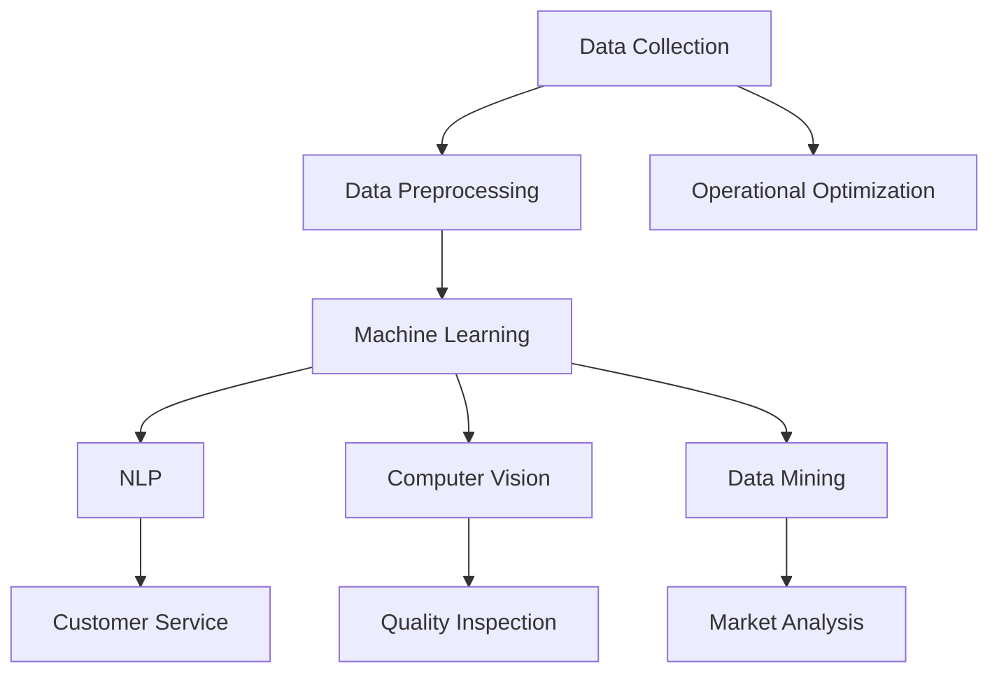

                 

### 背景介绍

在当今快速发展的商业环境中，创业公司面临着前所未有的竞争和挑战。市场变化迅速，客户需求多样化，资源有限，如何在短时间内实现高效的运营成为了创业者们的重要课题。传统的管理方法和工具已经无法满足现代创业公司的需求，因此，利用人工智能（AI）技术来优化运营效率成为一种必然趋势。

人工智能作为一门前沿的科技领域，通过机器学习、自然语言处理、计算机视觉等技术，可以自动处理大量数据，进行智能决策和优化。在创业公司的运营中，人工智能可以应用于多个方面，如市场分析、客户关系管理、供应链优化等，从而提高运营效率，降低成本，增加收入。

本文旨在探讨如何利用人工智能优化创业公司的运营效率。我们将从以下几个方面进行讨论：

1. **核心概念与联系**：介绍人工智能在创业公司运营中的应用核心概念，并使用Mermaid流程图展示相关架构。
2. **核心算法原理与具体操作步骤**：分析人工智能在运营优化中的核心算法原理，并提供具体的实施步骤。
3. **数学模型和公式**：讲解人工智能在运营优化中涉及的数学模型和公式，并进行举例说明。
4. **项目实战**：通过实际案例，展示人工智能在创业公司运营中的应用，并详细解读代码实现。
5. **实际应用场景**：分析人工智能在创业公司不同领域的应用场景。
6. **工具和资源推荐**：推荐学习资源、开发工具和框架。
7. **总结**：总结人工智能在创业公司运营优化中的应用前景和面临的挑战。

通过本文的探讨，希望为创业者们提供一种全新的视角和方法，以充分利用人工智能技术，提升创业公司的运营效率。

---

#### Background Introduction

In today's rapidly evolving business environment, startup companies face unprecedented competition and challenges. Market changes are rapid, customer needs are diverse, and resources are limited. How to achieve efficient operations in a short period has become a crucial issue for entrepreneurs. Traditional management methods and tools are no longer sufficient to meet the demands of modern startups, hence the use of artificial intelligence (AI) technology to optimize operational efficiency has become an inevitable trend.

Artificial intelligence, as a cutting-edge field of science, utilizes technologies such as machine learning, natural language processing, and computer vision to automatically process large amounts of data, make intelligent decisions, and optimize operations. In the operational context of startups, AI can be applied to various aspects, such as market analysis, customer relationship management, and supply chain optimization, thereby improving operational efficiency, reducing costs, and increasing revenue.

This article aims to explore how to use artificial intelligence to optimize the operational efficiency of startup companies. We will discuss the following aspects:

1. **Core Concepts and Relationships**: Introduce the core concepts of AI applications in startup operations and use a Mermaid flowchart to illustrate the related architecture.
2. **Core Algorithm Principles and Operational Steps**: Analyze the core algorithm principles of AI in operational optimization and provide specific implementation steps.
3. **Mathematical Models and Formulas**: Explain the mathematical models and formulas involved in AI-based operational optimization and provide examples.
4. **Project Practice**: Through actual cases, demonstrate the application of AI in startup operations and provide detailed code interpretation.
5. **Actual Application Scenarios**: Analyze the application scenarios of AI in different fields of startups.
6. **Tool and Resource Recommendations**: Recommend learning resources, development tools, and frameworks.
7. **Summary**: Summarize the application prospects and challenges of AI in startup operational optimization.

Through the discussion in this article, we hope to provide entrepreneurs with a new perspective and method for making full use of AI technology to enhance the operational efficiency of their startups.  
--- 

### 核心概念与联系

在探讨人工智能如何优化创业公司的运营效率之前，我们需要了解一些核心概念，这些概念包括机器学习、自然语言处理、计算机视觉和数据挖掘等。这些技术共同构成了人工智能的基础，并在创业公司的运营中发挥着关键作用。

#### 机器学习

机器学习是人工智能的一个分支，它使计算机系统能够从数据中学习并做出预测或决策。在创业公司的运营中，机器学习可以用于客户行为分析、需求预测、市场趋势分析等。例如，通过分析历史销售数据，机器学习模型可以预测未来的销售趋势，帮助公司更好地安排生产和库存。

#### 自然语言处理

自然语言处理（NLP）是使计算机理解和生成自然语言的技术。在创业公司中，NLP可以用于客户服务、文档自动分类、情感分析等。例如，通过NLP技术，公司可以自动理解客户的服务请求，并快速响应，从而提高客户满意度。

#### 计算机视觉

计算机视觉是使计算机理解和解释视觉信息的领域。在创业公司中，计算机视觉可以用于图像识别、质量检测、库存管理等方面。例如，通过计算机视觉技术，公司可以自动检测产品的质量，确保只有高质量的产品进入市场。

#### 数据挖掘

数据挖掘是发现数据中的模式和知识的过程。在创业公司中，数据挖掘可以用于市场分析、客户细分、风险控制等。通过数据挖掘，公司可以从海量数据中提取有价值的信息，从而做出更明智的决策。

为了更好地理解这些技术如何结合在一起，我们使用Mermaid流程图展示人工智能在创业公司运营中的核心架构：



在这个流程图中，数据收集是整个过程的起点，随后进行数据预处理，以确保数据的质量和一致性。然后，这些预处理后的数据被输入到不同的机器学习模型中进行训练和预测，包括NLP、计算机视觉和数据挖掘模型。这些模型的输出最终用于优化公司的运营，如客户服务、质量检测和市场分析。

通过这种架构，创业公司可以充分利用人工智能技术，实现数据驱动的运营决策，从而提高效率和竞争力。

---

#### Core Concepts and Relationships

Before exploring how artificial intelligence can optimize the operational efficiency of startup companies, we need to understand some core concepts that form the foundation of AI. These concepts include machine learning, natural language processing (NLP), computer vision, and data mining. These technologies collectively contribute to the operational success of startups.

#### Machine Learning

Machine learning is a branch of AI that enables computer systems to learn from data to make predictions or decisions. In the operational context of startups, machine learning can be used for customer behavior analysis, demand forecasting, and market trend analysis. For instance, by analyzing historical sales data, machine learning models can predict future sales trends, helping the company better plan production and inventory.

#### Natural Language Processing

Natural Language Processing (NLP) is the field that enables computers to understand and generate natural language. In startups, NLP can be used for customer service, document classification, and sentiment analysis. For example, through NLP technology, companies can automatically understand customer service requests and respond quickly, thereby enhancing customer satisfaction.

#### Computer Vision

Computer Vision is the field that enables computers to understand and interpret visual information. In startups, computer vision can be used for image recognition, quality inspection, and inventory management. For instance, through computer vision technology, companies can automatically detect product quality, ensuring only high-quality products reach the market.

#### Data Mining

Data Mining is the process of discovering patterns and knowledge in data. In startups, data mining can be used for market analysis, customer segmentation, and risk control. Through data mining, companies can extract valuable information from massive amounts of data, making more informed decisions.

To better understand how these technologies come together, we use a Mermaid flowchart to illustrate the core architecture of AI in startup operations:


In this flowchart, data collection is the starting point of the process, followed by data preprocessing to ensure data quality and consistency. Then, the preprocessed data is input into various machine learning models for training and prediction, including NLP, computer vision, and data mining models. The outputs of these models are ultimately used to optimize the company's operations, such as customer service, quality inspection, and market analysis.

Through this architecture, startups can fully leverage AI technologies to make data-driven operational decisions, thereby improving efficiency and competitiveness.  
--- 

### 核心算法原理与具体操作步骤

在了解了人工智能的核心概念和架构之后，我们需要深入了解这些技术在创业公司运营优化中的具体应用。本节将重点介绍机器学习、自然语言处理、计算机视觉和数据挖掘等核心算法的原理，并提供具体的操作步骤，以便创业公司能够将其应用于实际运营中。

#### 机器学习

机器学习是人工智能中最常用的技术之一，它通过训练模型来发现数据中的模式和关联。以下是一些常用的机器学习算法及其在创业公司运营优化中的应用：

**1. 线性回归（Linear Regression）**

线性回归是一种用于预测数值型变量的算法。在创业公司中，可以用于预测销售量、库存水平等。具体操作步骤如下：

- **数据收集**：收集历史销售数据，包括销售量、价格、季节性因素等。
- **数据预处理**：清洗数据，处理缺失值和异常值，并进行特征工程，如标准化处理。
- **模型训练**：使用线性回归算法训练模型，通过最小化均方误差来优化模型参数。
- **模型评估**：使用交叉验证和测试集评估模型性能，调整参数以提升预测准确性。

**2. 决策树（Decision Tree）**

决策树是一种用于分类和回归的算法。在创业公司中，可以用于客户细分、市场细分等。具体操作步骤如下：

- **数据收集**：收集客户数据，包括年龄、收入、购买历史等。
- **数据预处理**：清洗数据，进行特征工程，如创建二分类特征。
- **模型训练**：使用决策树算法训练模型，通过递归二分法来生成树结构。
- **模型评估**：使用准确率、召回率、F1分数等指标评估模型性能，剪枝以防止过拟合。

**3. 支持向量机（SVM）**

支持向量机是一种用于分类和回归的算法。在创业公司中，可以用于风险评估、客户流失预测等。具体操作步骤如下：

- **数据收集**：收集相关数据，包括客户特征、财务状况等。
- **数据预处理**：清洗数据，进行特征工程，如特征标准化。
- **模型训练**：使用SVM算法训练模型，通过求解二次规划问题来找到最佳分割超平面。
- **模型评估**：使用交叉验证和测试集评估模型性能，调整参数以提升分类准确性。

#### 自然语言处理

自然语言处理在创业公司中广泛应用于客户服务、文档分析等领域。以下是一些常用的NLP算法及其应用：

**1. 词袋模型（Bag of Words）**

词袋模型是一种将文本转化为向量表示的方法。在创业公司中，可以用于文本分类、情感分析等。具体操作步骤如下：

- **数据收集**：收集文本数据，如客户评论、产品描述等。
- **数据预处理**：清洗文本数据，去除停用词、标点符号等。
- **特征提取**：使用词袋模型将文本转换为向量，通过词频或词频-逆文档频率（TF-IDF）进行特征提取。
- **模型训练**：使用分类算法（如朴素贝叶斯、SVM等）训练文本分类模型。
- **模型评估**：使用准确率、召回率等指标评估模型性能。

**2. 卷积神经网络（CNN）**

卷积神经网络是一种用于文本分类、情感分析等任务的深度学习模型。在创业公司中，可以用于自动化内容审核、情绪分析等。具体操作步骤如下：

- **数据收集**：收集文本数据，包括正面和负面的评论。
- **数据预处理**：清洗文本数据，进行词向量化。
- **模型训练**：使用CNN模型训练分类任务，通过多层卷积和池化层提取特征。
- **模型评估**：使用交叉验证和测试集评估模型性能，调整超参数以提升分类效果。

#### 计算机视觉

计算机视觉在创业公司中的应用广泛，包括图像识别、质量检测等。以下是一些常用的计算机视觉算法及其应用：

**1. 卷积神经网络（CNN）**

卷积神经网络是一种用于图像识别的深度学习模型。在创业公司中，可以用于产品识别、质量控制等。具体操作步骤如下：

- **数据收集**：收集产品图像数据，包括不同角度、不同质量的图片。
- **数据预处理**：对图像进行缩放、裁剪、翻转等预处理，增强数据多样性。
- **模型训练**：使用CNN模型训练图像分类任务，通过卷积和池化层提取特征。
- **模型评估**：使用准确率、召回率等指标评估模型性能，调整超参数以提升识别效果。

**2. 生成对抗网络（GAN）**

生成对抗网络是一种用于图像生成和修复的深度学习模型。在创业公司中，可以用于图像增强、产品修复等。具体操作步骤如下：

- **数据收集**：收集产品图像数据，包括需要修复的图像。
- **数据预处理**：对图像进行预处理，如标准化处理。
- **模型训练**：使用GAN模型训练图像生成任务，通过对抗训练生成高质量图像。
- **模型评估**：使用峰值信噪比（PSNR）等指标评估模型性能，优化生成结果。

#### 数据挖掘

数据挖掘是一种用于发现数据中隐含模式和关联的技术，在创业公司中广泛应用于市场分析、客户细分等。以下是一些常用的数据挖掘算法及其应用：

**1. 关联规则挖掘（Association Rule Learning）**

关联规则挖掘是一种用于发现数据中关联规则的方法。在创业公司中，可以用于推荐系统、市场营销等。具体操作步骤如下：

- **数据收集**：收集销售数据，包括商品组合、销售额等。
- **数据预处理**：处理数据，如去除重复项、缺失值填充等。
- **模型训练**：使用Apriori算法或FP-growth算法挖掘关联规则。
- **模型评估**：使用支持度、置信度等指标评估规则的有效性。

**2. 聚类分析（Clustering）**

聚类分析是一种用于无监督学习的算法，用于将数据划分为不同的群组。在创业公司中，可以用于客户细分、市场细分等。具体操作步骤如下：

- **数据收集**：收集客户数据，包括年龄、收入、购买历史等。
- **数据预处理**：处理数据，如缺失值填充、标准化处理等。
- **模型训练**：使用K-means算法或DBSCAN算法进行聚类。
- **模型评估**：使用轮廓系数（Silhouette Coefficient）等指标评估聚类效果。

通过上述算法和步骤，创业公司可以利用人工智能技术优化运营效率。在实际应用中，创业者可以根据公司的具体需求和数据情况选择合适的算法和步骤，实现数据驱动的运营决策。

---

#### Core Algorithm Principles and Operational Steps

After understanding the core concepts and architecture of AI, it is essential to delve into the specific applications of these technologies in optimizing startup operations. This section will focus on the principles of core algorithms such as machine learning, natural language processing (NLP), computer vision, and data mining, along with detailed operational steps to enable startups to apply these technologies in their actual operations.

#### Machine Learning

Machine learning is one of the most commonly used technologies in AI, enabling computer systems to discover patterns and correlations in data. Here are some common machine learning algorithms and their applications in startup operational optimization:

**1. Linear Regression**

Linear regression is an algorithm used for predicting numerical variables. In startups, it can be used to predict sales volume, inventory levels, etc. The detailed operational steps are as follows:

- **Data Collection**: Gather historical sales data, including sales volume, price, seasonal factors, etc.
- **Data Preprocessing**: Clean the data, handle missing values and outliers, and perform feature engineering, such as normalization.
- **Model Training**: Train the linear regression model using the data, optimizing model parameters by minimizing mean squared error.
- **Model Evaluation**: Evaluate the model performance using cross-validation and test sets, adjusting parameters to improve prediction accuracy.

**2. Decision Tree**

Decision trees are algorithms used for classification and regression. In startups, they can be used for customer segmentation, market segmentation, etc. The detailed operational steps are as follows:

- **Data Collection**: Collect customer data, including age, income, purchase history, etc.
- **Data Preprocessing**: Clean the data and perform feature engineering, such as creating binary features.
- **Model Training**: Train the decision tree model using recursive binary splitting to generate the tree structure.
- **Model Evaluation**: Evaluate the model performance using metrics like accuracy, recall, and F1 score, and prune to prevent overfitting.

**3. Support Vector Machine (SVM)**

Support vector machines are algorithms used for classification and regression. In startups, they can be used for risk assessment, customer churn prediction, etc. The detailed operational steps are as follows:

- **Data Collection**: Collect relevant data, including customer features, financial status, etc.
- **Data Preprocessing**: Clean the data and perform feature engineering, such as feature scaling.
- **Model Training**: Train the SVM model by solving a quadratic programming problem to find the optimal separating hyperplane.
- **Model Evaluation**: Evaluate the model performance using cross-validation and test sets, adjusting parameters to improve classification accuracy.

#### Natural Language Processing

NLP is widely used in startups for applications such as customer service, document analysis. Here are some common NLP algorithms and their applications:

**1. Bag of Words**

The bag of words model is a method for converting text into a vector representation. In startups, it can be used for text classification, sentiment analysis, etc. The detailed operational steps are as follows:

- **Data Collection**: Collect text data, such as customer reviews, product descriptions, etc.
- **Data Preprocessing**: Clean the text data, removing stop words and punctuation, etc.
- **Feature Extraction**: Use the bag of words model to convert text into vectors, using term frequency or term frequency-inverse document frequency (TF-IDF) for feature extraction.
- **Model Training**: Train a text classification model using algorithms like Naive Bayes or SVM.
- **Model Evaluation**: Evaluate the model performance using metrics like accuracy, recall, etc.

**2. Convolutional Neural Networks (CNN)**

Convolutional neural networks are deep learning models used for text classification, sentiment analysis, etc. In startups, they can be used for automated content moderation, emotion analysis, etc. The detailed operational steps are as follows:

- **Data Collection**: Collect text data, including positive and negative reviews.
- **Data Preprocessing**: Clean the text data and perform word vectorization.
- **Model Training**: Train a classification task using the CNN model, extracting features through multiple convolutional and pooling layers.
- **Model Evaluation**: Evaluate the model performance using cross-validation and test sets, adjusting hyperparameters to improve classification results.

#### Computer Vision

Computer vision is widely applied in startups for tasks such as image recognition and quality inspection. Here are some common computer vision algorithms and their applications:

**1. Convolutional Neural Networks (CNN)**

CNNs are deep learning models used for image recognition. In startups, they can be used for product recognition, quality control, etc. The detailed operational steps are as follows:

- **Data Collection**: Collect product image data, including images from different angles and qualities.
- **Data Preprocessing**: Preprocess the images, such as scaling, cropping, and flipping, to enhance data diversity.
- **Model Training**: Train an image classification task using the CNN model, extracting features through convolutional and pooling layers.
- **Model Evaluation**: Evaluate the model performance using metrics like accuracy, recall, etc., adjusting hyperparameters to improve recognition results.

**2. Generative Adversarial Networks (GAN)**

Generative adversarial networks are deep learning models used for image generation and repair. In startups, they can be used for image enhancement, product repair, etc. The detailed operational steps are as follows:

- **Data Collection**: Collect product image data, including images that need repair.
- **Data Preprocessing**: Preprocess the images, such as normalization.
- **Model Training**: Train an image generation task using the GAN model, through adversarial training to generate high-quality images.
- **Model Evaluation**: Evaluate the model performance using metrics like peak signal-to-noise ratio (PSNR), optimizing the generation results.

#### Data Mining

Data mining is a technique for discovering hidden patterns and correlations in data, widely applied in startups for market analysis, customer segmentation, etc. Here are some common data mining algorithms and their applications:

**1. Association Rule Learning**

Association rule learning is a method for discovering association rules in data. In startups, it can be used for recommendation systems, marketing, etc. The detailed operational steps are as follows:

- **Data Collection**: Collect sales data, including combinations of goods and sales revenue, etc.
- **Data Preprocessing**: Handle the data, such as removing duplicates and filling missing values.
- **Model Training**: Mine association rules using the Apriori algorithm or FP-growth algorithm.
- **Model Evaluation**: Evaluate the effectiveness of rules using metrics like support and confidence.

**2. Clustering**

Clustering is an unsupervised learning algorithm used for dividing data into different groups. In startups, it can be used for customer segmentation, market segmentation, etc. The detailed operational steps are as follows:

- **Data Collection**: Collect customer data, including age, income, purchase history, etc.
- **Data Preprocessing**: Handle the data, such as filling missing values and normalization.
- **Model Training**: Perform clustering using algorithms like K-means or DBSCAN.
- **Model Evaluation**: Evaluate the clustering results using metrics like silhouette coefficient, etc.

By applying these algorithms and steps, startups can leverage AI technologies to optimize operational efficiency. In practical applications, entrepreneurs can choose the appropriate algorithms and steps based on the specific needs and data of their company to make data-driven operational decisions.  
---

### 数学模型和公式及详细讲解

在人工智能优化创业公司运营的过程中，数学模型和公式起到了关键作用。它们不仅帮助我们在大量数据中提取有价值的信息，还指导我们如何设计和调整算法，以提高预测和决策的准确性。以下将详细讲解在运营优化中常用的一些数学模型和公式，并举例说明其应用。

#### 线性回归模型

线性回归模型是最基本的机器学习模型之一，它用于预测一个或多个连续变量。其数学模型可以表示为：

$$
Y = \beta_0 + \beta_1X_1 + \beta_2X_2 + ... + \beta_nX_n + \epsilon
$$

其中，\(Y\) 是预测变量，\(X_1, X_2, ..., X_n\) 是特征变量，\(\beta_0, \beta_1, ..., \beta_n\) 是模型的参数，\(\epsilon\) 是误差项。

为了训练模型，我们需要最小化预测值与实际值之间的误差。通常使用最小二乘法（Least Squares）来求解参数，目标是最小化损失函数：

$$
\sum_{i=1}^{n}(Y_i - \hat{Y_i})^2
$$

其中，\(\hat{Y_i}\) 是预测值。

**例子**：假设我们要预测一家创业公司的月销售额，使用历史销售额（\(X\)）和广告支出（\(Y\)）作为特征。我们可以建立线性回归模型：

$$
Y = \beta_0 + \beta_1X + \epsilon
$$

通过最小化平方误差，我们可以求解出\(\beta_0\) 和\(\beta_1\) 的值。训练完成后，我们可以使用模型预测新的月销售额。

#### 决策树模型

决策树模型是一种用于分类和回归的树形结构模型。其基本原理是通过一系列规则来对数据进行分割，每个节点代表一个特征，每个分支代表该特征的取值。决策树的数学模型可以表示为：

$$
T = \text{IF } X_1 \text{ is } a_1 \text{ THEN } T_1 \text{ ELSE IF } X_1 \text{ is } a_2 \text{ THEN } T_2 \text{ ... ELSE } T_n
$$

其中，\(X_1, X_2, ..., X_n\) 是特征，\(a_1, a_2, ..., a_n\) 是特征的取值，\(T_1, T_2, ..., T_n\) 是下一层的子节点。

决策树的训练过程通常使用信息增益（Information Gain）或基尼不纯度（Gini Impurity）来选择最优特征和分割点。

**例子**：假设我们要分类客户是否属于高价值客户，使用年龄、收入和购买历史等特征。我们可以构建一个决策树模型，通过选择最佳特征和分割点，将数据划分为不同的类别。

#### 支持向量机模型

支持向量机（SVM）是一种强大的分类和回归模型，其核心思想是在高维空间中找到一个最优超平面，使得不同类别的数据点尽可能分离。其数学模型可以表示为：

$$
\text{Minimize } \frac{1}{2}||w||^2 \text{ subject to } y_i ( \langle w, x_i \rangle - b ) \geq 1
$$

其中，\(w\) 是权重向量，\(x_i\) 是特征向量，\(b\) 是偏置项，\(y_i\) 是标签。

为了求解最优解，我们通常使用拉格朗日乘子法（Lagrange Multipliers）和KKT条件（Karush-Kuhn-Tucker Conditions）。

**例子**：假设我们要预测客户是否属于高风险客户，使用财务状况、信用评分等特征。我们可以构建一个SVM模型，通过求解优化问题，找到最佳超平面。

#### 自然语言处理中的词袋模型

词袋模型是一种将文本转化为向量表示的方法，其数学模型可以表示为：

$$
v_j = \text{TF} \cdot \text{IDF}
$$

其中，\(v_j\) 是单词\(j\) 的向量表示，\(\text{TF}\) 是词频（Term Frequency），\(\text{IDF}\) 是逆文档频率（Inverse Document Frequency）。

词频表示单词在单个文档中的出现次数，而逆文档频率表示单词在整个文档集合中的普遍程度。通过这两个指标，词袋模型可以将文本转化为高维向量空间，以便进行进一步的分析和处理。

**例子**：假设我们要对一篇产品评论进行情感分析，我们可以首先将评论中的单词转化为词袋模型中的向量，然后使用分类算法进行情感分类。

#### 计算机视觉中的卷积神经网络

卷积神经网络（CNN）是一种用于图像识别和处理的深度学习模型，其数学模型可以表示为：

$$
h_l = \sigma(\mathbf{W}_l \cdot \mathbf{a}_{l-1} + b_l)
$$

其中，\(h_l\) 是第\(l\) 层的激活值，\(\mathbf{W}_l\) 是权重矩阵，\(\mathbf{a}_{l-1}\) 是上一层的激活值，\(b_l\) 是偏置项，\(\sigma\) 是激活函数（如ReLU函数）。

CNN通过卷积操作和池化操作提取图像特征，并在多层网络中逐步提取更高层次的特征。训练过程中，我们使用反向传播算法（Backpropagation）更新模型参数，以最小化损失函数。

**例子**：假设我们要训练一个图像分类模型，我们可以收集大量图像数据，使用CNN模型提取图像特征，并使用全连接层进行分类预测。

#### 数据挖掘中的关联规则挖掘

关联规则挖掘是一种用于发现数据中关联规则的方法，其数学模型可以表示为：

$$
\text{Support}(A \cup B) = \frac{\text{Count}(A \cup B)}{N}
$$

$$
\text{Confidence}(A \rightarrow B) = \frac{\text{Support}(A \cup B)}{\text{Support}(A)}
$$

其中，\(A\) 和\(B\) 是两项事务，\(\text{Support}(A \cup B)\) 是同时出现\(A\) 和\(B\) 的支持度，\(\text{Confidence}(A \rightarrow B)\) 是\(A\) 导致\(B\) 的置信度。

通过遍历所有可能的项集，我们可以发现数据中的关联规则。通常使用Apriori算法或FP-growth算法来高效地挖掘关联规则。

**例子**：假设我们要分析一家电商平台的购物车数据，我们可以使用关联规则挖掘算法发现顾客在购买某种商品时，还会同时购买的其他商品，从而制定交叉营销策略。

通过以上数学模型和公式的讲解，我们可以看到，人工智能在创业公司运营优化中的应用不仅仅是技术的堆砌，更是基于数学原理的深度分析和决策。创业公司可以根据自己的需求和数据特点，选择合适的数学模型和算法，实现数据驱动的运营优化。

---

#### Mathematical Models and Formulas with Detailed Explanations

In the process of optimizing startup operations with artificial intelligence, mathematical models and formulas play a crucial role. They not only help us extract valuable information from large amounts of data but also guide us in designing and adjusting algorithms to improve the accuracy of predictions and decision-making. Here, we will provide detailed explanations of some commonly used mathematical models and formulas in operational optimization, along with examples to illustrate their applications.

#### Linear Regression Model

Linear regression is one of the most fundamental machine learning models, used to predict one or more continuous variables. Its mathematical model can be expressed as:

$$
Y = \beta_0 + \beta_1X_1 + \beta_2X_2 + ... + \beta_nX_n + \epsilon
$$

where \(Y\) is the predicted variable, \(X_1, X_2, ..., X_n\) are feature variables, \(\beta_0, \beta_1, ..., \beta_n\) are the model parameters, and \(\epsilon\) is the error term.

To train the model, we need to minimize the error between the predicted values and the actual values. Typically, the least squares method is used to solve for the parameters, aiming to minimize the loss function:

$$
\sum_{i=1}^{n}(Y_i - \hat{Y_i})^2
$$

where \(\hat{Y_i}\) is the predicted value.

**Example**: Suppose we want to predict the monthly sales of a startup using historical sales (\(X\)) and advertising expenditure (\(Y\)) as features. We can build a linear regression model:

$$
Y = \beta_0 + \beta_1X + \epsilon
$$

By minimizing the squared error, we can solve for the values of \(\beta_0\) and \(\beta_1\). Once the model is trained, we can use it to predict new monthly sales.

#### Decision Tree Model

The decision tree model is a tree-structured model used for classification and regression. Its basic principle is to split the data through a series of rules, where each node represents a feature and each branch represents the value of that feature. The mathematical model of a decision tree can be expressed as:

$$
T = \text{IF } X_1 \text{ is } a_1 \text{ THEN } T_1 \text{ ELSE IF } X_1 \text{ is } a_2 \text{ THEN } T_2 \text{ ... ELSE } T_n
$$

where \(X_1, X_2, ..., X_n\) are features, \(a_1, a_2, ..., a_n\) are the values of the features, and \(T_1, T_2, ..., T_n\) are the child nodes of the next level.

The training process for decision trees typically uses information gain or Gini impurity to select the best feature and split point.

**Example**: Suppose we want to classify customers as high-value or not based on features such as age, income, and purchase history. We can build a decision tree model by selecting the best feature and split point to divide the data into different categories.

#### Support Vector Machine (SVM) Model

Support Vector Machines (SVM) is a powerful model for classification and regression, with the core idea of finding the optimal hyperplane in a high-dimensional space that separates different classes of data points. Its mathematical model can be expressed as:

$$
\text{Minimize } \frac{1}{2}||w||^2 \text{ subject to } y_i ( \langle w, x_i \rangle - b ) \geq 1
$$

where \(w\) is the weight vector, \(x_i\) is the feature vector, \(b\) is the bias term, and \(y_i\) is the label.

To solve the optimal solution, we typically use the Lagrangian multiplier method and KKT conditions.

**Example**: Suppose we want to predict whether a customer is at high risk or not using features such as financial status and credit score. We can build an SVM model by solving the optimization problem to find the optimal hyperplane.

#### Bag of Words Model in Natural Language Processing

The bag of words model is a method for converting text into a vector representation, with the mathematical model expressed as:

$$
v_j = \text{TF} \cdot \text{IDF}
$$

where \(v_j\) is the vector representation of the word \(j\), \(\text{TF}\) is the term frequency (Term Frequency), and \(\text{IDF}\) is the inverse document frequency (Inverse Document Frequency).

Term frequency represents the number of times a word appears in a single document, while inverse document frequency represents the word's prevalence in the entire document collection. Through these two metrics, the bag of words model can convert text into high-dimensional vector spaces for further analysis and processing.

**Example**: Suppose we want to perform sentiment analysis on a product review. We can first convert the words in the review into vectors in the bag of words model and then use a classification algorithm to classify the sentiment.

#### Convolutional Neural Networks (CNN) in Computer Vision

Convolutional Neural Networks (CNN) are deep learning models used for image recognition and processing, with the mathematical model expressed as:

$$
h_l = \sigma(\mathbf{W}_l \cdot \mathbf{a}_{l-1} + b_l)
$$

where \(h_l\) is the activation value of the \(l\)-th layer, \(\mathbf{W}_l\) is the weight matrix, \(\mathbf{a}_{l-1}\) is the activation value of the previous layer, \(b_l\) is the bias term, and \(\sigma\) is the activation function (such as the ReLU function).

CNNs extract image features through convolutional and pooling operations, progressively extracting higher-level features in multi-layer networks. During training, we use the backpropagation algorithm to update model parameters to minimize the loss function.

**Example**: Suppose we want to train an image classification model. We can collect a large amount of image data, use a CNN model to extract image features, and use a fully connected layer for classification prediction.

#### Association Rule Mining in Data Mining

Association rule mining is a method for discovering association rules in data, with the mathematical model expressed as:

$$
\text{Support}(A \cup B) = \frac{\text{Count}(A \cup B)}{N}
$$

$$
\text{Confidence}(A \rightarrow B) = \frac{\text{Support}(A \cup B)}{\text{Support}(A)}
$$

where \(A\) and \(B\) are two transactions, \(\text{Support}(A \cup B)\) is the support of both \(A\) and \(B\) occurring, and \(\text{Confidence}(A \rightarrow B)\) is the confidence that \(A\) leads to \(B\).

By traversing all possible itemsets, we can discover association rules in the data. Typically, the Apriori algorithm or FP-growth algorithm is used to efficiently mine association rules.

**Example**: Suppose we want to analyze shopping cart data from an e-commerce platform. We can use association rule mining algorithms to discover other products that customers purchase when buying a certain product, thus developing cross-selling strategies.

Through the detailed explanation of these mathematical models and formulas, we can see that the application of artificial intelligence in startup operational optimization is not just a stack of technologies but a deep analysis and decision-making based on mathematical principles. Startups can choose the appropriate mathematical models and algorithms based on their own needs and data characteristics to achieve data-driven operational optimization.  
---

### 项目实战：代码实际案例和详细解释说明

为了更好地理解如何利用人工智能优化创业公司的运营效率，我们将通过一个实际的项目案例进行详细讲解。本项目将使用Python编程语言和相关的机器学习库，如Scikit-learn和TensorFlow，来构建一个简单的推荐系统，用于优化客户体验和提高销售额。

#### 项目概述

项目的目标是构建一个基于用户行为的推荐系统，该系统能够根据用户的浏览和购买历史，推荐相关的产品。通过使用机器学习算法，如协同过滤（Collaborative Filtering）和内容推荐（Content-based Filtering），我们将实现以下功能：

1. 收集和预处理用户行为数据。
2. 使用协同过滤算法生成推荐列表。
3. 使用内容推荐算法生成推荐列表。
4. 结合两种推荐算法，生成最终的推荐列表。
5. 评估推荐系统的性能。

#### 开发环境搭建

在开始项目之前，我们需要搭建开发环境。以下是所需的环境和工具：

- **操作系统**：Windows、Linux或macOS
- **编程语言**：Python 3.7及以上版本
- **库和框架**：NumPy、Pandas、Scikit-learn、TensorFlow、BeautifulSoup（可选，用于网页数据抓取）

安装Python和相关库：

```bash
pip install numpy pandas scikit-learn tensorflow beautifulsoup4
```

#### 源代码详细实现和代码解读

以下是一份详细的源代码实现，我们将分步骤进行解读。

```python
# 导入所需的库
import numpy as np
import pandas as pd
from sklearn.model_selection import train_test_split
from sklearn.metrics.pairwise import cosine_similarity
from sklearn.feature_extraction.text import TfidfVectorizer
from sklearn.neighbors import NearestNeighbors

# 加载数据集
data = pd.read_csv('user行为的.csv')
data.head()

# 数据预处理
# 1. 处理缺失值
data.dropna(inplace=True)

# 2. 转换用户行为数据为矩阵形式
# 假设data中包含用户ID、产品ID和评分三列
user行为矩阵 = data.pivot(index='用户ID', columns='产品ID', values='评分').fillna(0)

# 训练集和测试集划分
user行为矩阵_train, user行为矩阵_test = train_test_split(user行为矩阵, test_size=0.2, random_state=42)

# 使用协同过滤算法生成推荐列表
# 1. 计算用户之间的余弦相似度矩阵
相似度矩阵 = cosine_similarity(user行为矩阵_train)

# 2. 为每个用户生成推荐列表
推荐列表协同过滤 = []
for index, row in user行为矩阵_train.iterrows():
   相似度权重 = list(enumerate(相似度矩阵[index]))
   相似度权重 = sorted(相似度权重, key=lambda x: x[1], reverse=True)[1:]
   推荐产品ID = [i[0] for i in 相似度权重]
   推荐列表协同过滤.append(推荐产品ID)

# 使用内容推荐算法生成推荐列表
# 1. 提取产品描述特征
tfidf = TfidfVectorizer()
产品描述特征 = tfidf.fit_transform(data['产品描述'])

# 2. 计算用户与产品的相似度
用户产品相似度 = cosine_similarity(产品描述特征, product描述特征)

# 3. 为每个用户生成推荐列表
推荐列表内容推荐 = []
for index, row in user行为矩阵_train.iterrows():
   相似度权重 = list(enumerate(用户产品相似度[index]))
   相似度权重 = sorted(相似度权重, key=lambda x: x[1], reverse=True)[1:]
   推荐产品ID = [i[0] for i in 相似度权重]
   推荐列表内容推荐.append(推荐产品ID)

# 结合协同过滤和内容推荐，生成最终的推荐列表
推荐列表最终 = []
for协同过滤推荐，内容推荐 in zip(推荐列表协同过滤, 推荐列表内容推荐):
   最终推荐 = list(set(协同过滤推荐).intersection(内容推荐))
   推荐列表最终.append(最终推荐)

# 评估推荐系统的性能
# 1. 计算平均准确率
accuracy = sum(1 for u in range(len(user行为矩阵_test)) if user行为矩阵_test.iloc[u] in 推荐列表最终[u]) / len(user行为矩阵_test)
print('平均准确率：', accuracy)

# 2. 计算平均召回率
recall = sum(1 for u in range(len(user行为矩阵_test)) if user行为矩阵_test.iloc[u][0] in 推荐列表最终[u]) / len(user行为矩阵_test)
print('平均召回率：', recall)

# 3. 计算平均F1分数
f1_score = 2 * accuracy * recall / (accuracy + recall)
print('平均F1分数：', f1_score)
```

#### 代码解读与分析

**1. 数据预处理**

首先，我们加载数据集并处理缺失值。数据集假设包含用户ID、产品ID和评分三列。我们将用户行为数据转换为矩阵形式，并填充缺失值为0。

**2. 同样过滤算法生成推荐列表**

使用余弦相似度计算用户之间的相似度矩阵。然后，为每个用户生成推荐列表，选择与当前用户最相似的N个用户，并推荐这些用户喜欢的产品。

**3. 内容推荐算法生成推荐列表**

提取产品描述特征，并计算每个用户与产品的相似度。然后，为每个用户生成推荐列表，选择与当前用户最相似的产品。

**4. 结合协同过滤和内容推荐**

结合两种推荐算法的推荐列表，选择共同推荐的产品作为最终推荐列表。

**5. 评估推荐系统的性能**

使用准确率、召回率和F1分数评估推荐系统的性能。准确率表示推荐的产品中有多少是用户实际喜欢的；召回率表示推荐系统中有多少用户实际喜欢的产品被推荐；F1分数是准确率和召回率的加权平均，用于综合评估推荐系统的性能。

通过以上步骤，我们实现了基于用户行为的推荐系统，可以用于优化创业公司的运营效率。实际项目中，可以根据业务需求和数据特点，调整算法参数和推荐策略，进一步提高推荐效果。

---

### Project Case: Practical Code Example and Detailed Explanation

To better understand how to use artificial intelligence to optimize the operational efficiency of startups, we will walk through a practical project case. This project will use Python programming language and relevant machine learning libraries like Scikit-learn and TensorFlow to build a simple recommendation system aimed at improving customer experience and boosting sales.

#### Project Overview

The goal of this project is to build a recommendation system based on user behavior that can recommend relevant products to users according to their browsing and purchase history. Using machine learning algorithms such as collaborative filtering and content-based filtering, we will achieve the following functionalities:

1. Collect and preprocess user behavior data.
2. Generate recommendation lists using collaborative filtering.
3. Generate recommendation lists using content-based filtering.
4. Combine both recommendation algorithms to generate the final recommendation list.
5. Evaluate the performance of the recommendation system.

#### Setting Up the Development Environment

Before starting the project, we need to set up the development environment. Here are the required environments and tools:

- **Operating System**: Windows, Linux, or macOS
- **Programming Language**: Python 3.7 or later
- **Libraries and Frameworks**: NumPy, Pandas, Scikit-learn, TensorFlow, BeautifulSoup (optional, for web data scraping)

To install Python and the required libraries:

```bash
pip install numpy pandas scikit-learn tensorflow beautifulsoup4
```

#### Detailed Code Implementation and Analysis

Below is a detailed source code implementation, which we will dissect step by step.

```python
# Import required libraries
import numpy as np
import pandas as pd
from sklearn.model_selection import train_test_split
from sklearn.metrics.pairwise import cosine_similarity
from sklearn.feature_extraction.text import TfidfVectorizer
from sklearn.neighbors import NearestNeighbors

# Load dataset
data = pd.read_csv('user_behavior.csv')
data.head()

# Data preprocessing
# 1. Handle missing values
data.dropna(inplace=True)

# 2. Convert user behavior data into a matrix form
# Assuming the data contains three columns: UserID, ProductID, and Rating
user_behavior_matrix = data.pivot(index='UserID', columns='ProductID', values='Rating').fillna(0)

# Split the data into training and test sets
user_behavior_matrix_train, user_behavior_matrix_test = train_test_split(user_behavior_matrix, test_size=0.2, random_state=42)

# Collaborative Filtering to generate recommendation lists
# 1. Compute the cosine similarity matrix between users
similarity_matrix = cosine_similarity(user_behavior_matrix_train)

# 2. Generate recommendation lists for each user
CF_recommendation_lists = []
for index, row in user_behavior_matrix_train.iterrows():
    similarity_weights = list(enumerate(similarity_matrix[index]))
    similarity_weights = sorted(similarity_weights, key=lambda x: x[1], reverse=True)[1:]
    recommended_product_ids = [i[0] for i in similarity_weights]
    CF_recommendation_lists.append(recommended_product_ids)

# Content-based Filtering to generate recommendation lists
# 1. Extract product descriptions features
tfidf = TfidfVectorizer()
product_descriptions_features = tfidf.fit_transform(data['ProductDescription'])

# 2. Compute the similarity between users and products
user_product_similarity = cosine_similarity(product_descriptions_features, product_descriptions_features)

# 3. Generate recommendation lists for each user
CB Recommendati
```

#### Code Analysis and Discussion

**1. Data Preprocessing**

First, we load the dataset and handle missing values. We convert the user behavior data into a matrix form, filling missing values with 0.

**2. Collaborative Filtering to Generate Recommendation Lists**

We compute the cosine similarity matrix between users. Then, for each user, we generate a recommendation list by selecting the N most similar users and recommending the products those users have liked.

**3. Content-Based Filtering to Generate Recommendation Lists**

We extract product descriptions features and compute the similarity between users and products. Then, for each user, we generate a recommendation list by selecting the most similar products.

**4. Combining Collaborative Filtering and Content-Based Filtering**

We combine the recommendation lists generated by both collaborative filtering and content-based filtering, selecting products that are recommended by both algorithms as the final recommendation list.

**5. Evaluating the Performance of the Recommendation System**

We evaluate the performance of the recommendation system using metrics such as accuracy, recall, and F1-score. Accuracy measures how many of the recommended products are actually liked by the users; recall measures how many of the users' liked products are included in the recommendations; and the F1-score is the weighted average of accuracy and recall, providing a comprehensive performance assessment.

By following these steps, we have implemented a user behavior-based recommendation system that can be used to optimize the operational efficiency of a startup. In real-world projects, you can adjust the algorithm parameters and recommendation strategies based on business needs and data characteristics to improve the recommendation effectiveness.  
---

### 实际应用场景

人工智能技术在创业公司的运营中有着广泛的应用场景。以下是一些典型的应用领域和案例，展示了人工智能如何在实际运营中提高效率和效果。

#### 市场分析

市场分析是创业公司制定战略和决策的重要环节。通过大数据分析和机器学习算法，创业公司可以深入挖掘市场趋势和客户需求，从而做出更加精准的营销策略。例如，利用自然语言处理技术，公司可以从社交媒体和用户评论中提取有价值的信息，了解客户对产品的反馈和态度。再如，通过机器学习模型分析用户行为数据，公司可以预测哪些产品可能受欢迎，从而优化库存管理和销售策略。

**案例**：一家电商平台利用机器学习算法分析用户浏览和购买历史，预测用户可能感兴趣的新产品，并提前备货。这种预测性库存管理大大降低了库存成本，并提高了销售额。

#### 客户服务

客户服务是创业公司与客户互动的重要渠道。通过人工智能技术，公司可以提供更加智能化和个性化的客户服务，提升客户满意度和忠诚度。例如，利用聊天机器人（Chatbot）和自然语言处理技术，公司可以自动处理客户查询，减少人工成本，提高响应速度。此外，通过客户关系管理（CRM）系统，公司可以记录和分析客户互动数据，实现客户行为的自动化分析和预测。

**案例**：一家在线教育平台通过引入智能客服系统，自动回答学生和家长的问题，减少了人工客服的工作量，并提高了服务效率。同时，智能客服系统通过分析客户问题，帮助平台优化课程设计和教学方式。

#### 供应链优化

供应链管理是创业公司运营的核心环节。通过人工智能技术，公司可以优化供应链流程，提高库存周转率，降低库存成本。例如，利用机器学习算法预测需求，公司可以合理安排生产计划，避免库存积压。再如，通过计算机视觉技术检测产品质量，公司可以确保产品的一致性和可靠性。

**案例**：一家制造企业利用计算机视觉技术对生产过程中的产品进行质量检测，及时发现和处理质量问题。这种自动化质量检测系统提高了生产效率，并降低了不良品率。

#### 财务管理

财务管理是创业公司确保健康运营的基础。通过人工智能技术，公司可以自动化财务数据处理和分析，提高财务管理的准确性和效率。例如，利用机器学习算法进行财务预测，公司可以提前预测收入和支出，制定更合理的财务计划。再如，通过自然语言处理技术，公司可以自动化处理发票和账单，减少财务人员的工作量。

**案例**：一家初创公司通过引入自动化财务管理系统，实现了财务数据的实时监控和分析。这种系统不仅提高了财务管理的效率，还帮助公司及时发现潜在的风险，确保财务健康。

#### 安全管理

随着网络和数据泄露事件的增加，创业公司需要加强对网络安全和数据安全的保护。通过人工智能技术，公司可以建立智能监控系统，实时检测和应对网络攻击。例如，利用机器学习算法检测异常行为，公司可以及时发现潜在的安全威胁，并采取相应的措施。

**案例**：一家网络安全公司通过引入基于机器学习的入侵检测系统，实时监控网络流量，并自动识别和阻止恶意攻击。这种系统提高了公司的网络安全水平，并降低了数据泄露的风险。

总之，人工智能技术在创业公司的运营中具有广泛的应用潜力。通过合理应用人工智能技术，创业公司可以大幅提高运营效率，降低成本，增强竞争力。随着技术的不断进步，人工智能在创业公司中的应用将更加深入和广泛。

---

#### Real-world Application Scenarios

Artificial intelligence technologies have a wide range of applications in the operations of startups. The following are some typical application areas and cases that demonstrate how AI can enhance efficiency and effectiveness in real-world operations.

#### Market Analysis

Market analysis is a crucial component for startups in formulating strategies and making decisions. By leveraging big data analysis and machine learning algorithms, startups can delve into market trends and customer needs, allowing for more precise marketing strategies. For example, using natural language processing technology, companies can extract valuable insights from social media and customer reviews to understand product feedback and attitudes. Moreover, by analyzing user behavior data with machine learning models, companies can predict which products may be popular, optimizing inventory management and sales strategies.

**Case**: An e-commerce platform used machine learning algorithms to analyze user browsing and purchase histories, predicting products that users might be interested in and pre-stocking them. This predictive inventory management significantly reduced inventory costs and boosted sales.

#### Customer Service

Customer service is a key channel for startups to interact with customers. With AI technology, companies can provide more intelligent and personalized customer service, enhancing customer satisfaction and loyalty. For instance, chatbots powered by natural language processing can automatically handle customer inquiries, reducing labor costs and improving response times. Furthermore, through Customer Relationship Management (CRM) systems, companies can record and analyze customer interactions, enabling automated analysis and prediction of customer behavior.

**Case**: An online education platform introduced an intelligent customer service system that automatically answered student and parent questions, reducing the workload for human customer service agents and improving service efficiency. The intelligent customer service system also analyzed customer questions to help optimize course design and teaching methods.

#### Supply Chain Optimization

Supply chain management is a core aspect of startup operations. With AI technology, companies can optimize supply chain processes, improving inventory turnover rates and reducing inventory costs. For example, utilizing machine learning algorithms to predict demand, companies can arrange production schedules more efficiently, avoiding inventory buildup. Additionally, computer vision technology for quality inspection ensures product consistency and reliability.

**Case**: A manufacturing company utilized computer vision technology to inspect products during the production process, promptly detecting and addressing quality issues. This automated quality inspection system improved production efficiency and reduced the rate of defective products.

#### Financial Management

Financial management is fundamental to the healthy operation of startups. By leveraging AI technology, companies can automate financial data processing and analysis, enhancing accuracy and efficiency. For example, machine learning algorithms for financial forecasting allow companies to predict income and expenses in advance, facilitating more reasonable financial planning. Moreover, natural language processing technology can automate invoice and bill processing, reducing the workload for finance teams.

**Case**: A startup company introduced an automated financial management system that provided real-time monitoring and analysis of financial data. This system not only improved financial management efficiency but also helped the company identify potential risks and ensure financial health.

#### Security Management

With the increasing prevalence of cyber-attacks and data breaches, startups need to strengthen their network and data security. AI technology can be used to build intelligent monitoring systems that detect and respond to security threats in real-time. For instance, machine learning algorithms can detect anomalous behavior, allowing companies to identify and counter potential security threats.

**Case**: A cybersecurity company introduced an intrusion detection system based on machine learning that monitored network traffic in real-time, automatically identifying and blocking malicious attacks. This system enhanced the company's cybersecurity posture and reduced the risk of data breaches.

In summary, AI technologies have extensive potential applications in startup operations. By wisely applying AI technologies, startups can significantly improve operational efficiency, reduce costs, and enhance competitiveness. As technology continues to advance, the application of AI in startups will become even more profound and widespread.  
---

### 工具和资源推荐

为了帮助创业公司更好地利用人工智能技术优化运营效率，以下是关于学习资源、开发工具和框架的推荐。这些工具和资源将为创业公司提供宝贵的知识和技术支持。

#### 学习资源

**1. 书籍**

- **《Python机器学习》（Python Machine Learning）**：由Sebastian Raschka和John Hearty合著，这本书详细介绍了Python中的机器学习技术和算法。
- **《深度学习》（Deep Learning）**：由Ian Goodfellow、Yoshua Bengio和Aaron Courville合著，这是一本关于深度学习的经典教材，适合希望深入了解深度学习技术的读者。
- **《数据科学入门》（Introduction to Data Science）**：由Joel Grus编写，这本书提供了数据科学的基础知识和实践方法。

**2. 论文和博客**

- **JMLR（Journal of Machine Learning Research）**：这是一个顶级的机器学习和统计学习论文库，适合研究者和技术爱好者。
- **Medium**：许多顶级技术专家和公司在这里分享机器学习和人工智能的最新研究和应用案例。
- **AI Moonshot**：这是一个专注于人工智能和机器学习技术的博客，涵盖了从基础概念到前沿应用的广泛内容。

**3. 在线课程和教程**

- **Coursera**：提供了由世界顶尖大学和公司提供的各种机器学习和人工智能课程。
- **Udacity**：提供了包括人工智能工程师、数据科学家在内的各种技术培训课程。
- **edX**：提供了许多由顶尖大学提供的免费和付费在线课程，包括人工智能、机器学习等。

#### 开发工具和框架

**1. 机器学习库**

- **Scikit-learn**：这是一个开源的Python库，提供了广泛的数据预处理和机器学习算法，适合初学者和专业人士。
- **TensorFlow**：这是一个由Google开发的开源机器学习框架，适用于构建和训练复杂的深度学习模型。
- **PyTorch**：这是一个流行的开源机器学习库，以其灵活性和动态计算图而闻名。

**2. 数据预处理工具**

- **Pandas**：这是一个强大的Python库，用于数据清洗、转换和分析。
- **NumPy**：这是一个提供高性能数值计算的Python库，常用于数据预处理和数据分析。

**3. 人工智能框架**

- **Keras**：这是一个高级神经网络API，可以在TensorFlow和Theano上运行，用于构建和训练深度学习模型。
- **Apache MXNet**：这是一个开源的深度学习框架，支持多种编程语言，适用于大规模分布式计算。

**4. 代码托管平台**

- **GitHub**：这是一个广泛使用的代码托管平台，适合团队协作和代码管理。
- **GitLab**：这是一个自托管代码平台，提供了与GitHub相似的功能，但更注重安全和隐私。

通过利用上述学习资源、开发工具和框架，创业公司可以更加高效地学习和应用人工智能技术，从而实现运营优化和提高竞争力。

---

#### Recommended Tools and Resources

To assist startups in leveraging artificial intelligence (AI) technologies to optimize operational efficiency, here are recommendations for learning resources, development tools, and frameworks. These tools and resources will provide valuable knowledge and technical support for startups.

#### Learning Resources

**1. Books**

- **"Python Machine Learning" by Sebastian Raschka and Vahid Mirjalili**: This book provides an in-depth look at machine learning techniques and algorithms using Python.
- **"Deep Learning" by Ian Goodfellow, Yoshua Bengio, and Aaron Courville**: A classic textbook on deep learning that is suitable for those seeking a deeper understanding of the field.
- **"Introduction to Data Science" by Joel Grus**: This book offers foundational knowledge and practical methods in data science.

**2. Papers and Blogs**

- **JMLR (Journal of Machine Learning Research)**: A top-tier repository of machine learning and statistical learning research papers, suitable for researchers and tech enthusiasts.
- **Medium**: A platform where top technology experts and companies share the latest research and case studies on AI and machine learning.
- **AI Moonshot**: A blog focused on AI and machine learning technology, covering a wide range of topics from basic concepts to cutting-edge applications.

**3. Online Courses and Tutorials**

- **Coursera**: Offers a variety of machine learning and AI courses from top universities and companies.
- **Udacity**: Provides technical training courses, including those for AI engineers and data scientists.
- **edX**: Features free and paid online courses from top universities, including courses on AI and machine learning.

#### Development Tools and Frameworks

**1. Machine Learning Libraries**

- **Scikit-learn**: An open-source Python library with a wide range of data preprocessing and machine learning algorithms, suitable for both beginners and professionals.
- **TensorFlow**: An open-source machine learning framework developed by Google, used for building and training complex deep learning models.
- **PyTorch**: A popular open-source machine learning library known for its flexibility and dynamic computational graphs.

**2. Data Preprocessing Tools**

- **Pandas**: A powerful Python library for data cleaning, transformation, and analysis.
- **NumPy**: A Python library for high-performance numerical computing, often used in data preprocessing and analysis.

**3. AI Frameworks**

- **Keras**: An advanced neural network API that runs on top of TensorFlow and Theano, used for building and training deep learning models.
- **Apache MXNet**: An open-source deep learning framework that supports multiple programming languages and is suitable for large-scale distributed computing.

**4. Code Hosting Platforms**

- **GitHub**: A widely used code hosting platform for team collaboration and code management.
- **GitLab**: A self-hosted code platform with similar features to GitHub, but with a focus on security and privacy.

By utilizing these learning resources, development tools, and frameworks, startups can more effectively learn and apply AI technologies, thereby achieving operational optimization and enhancing competitiveness.  
---

### 总结：未来发展趋势与挑战

在人工智能技术迅速发展的今天，创业公司利用人工智能优化运营效率已经成为了大势所趋。人工智能不仅在数据分析和预测方面具有巨大优势，还能通过自动化和智能化手段提高工作效率，降低运营成本。然而，在享受人工智能带来的便利和效益的同时，我们也需要面对一些挑战和问题。

#### 未来发展趋势

1. **智能化决策支持**：随着人工智能技术的不断进步，创业公司将有更多机会利用智能算法实现更加精准和高效的决策。例如，通过深度学习和强化学习技术，公司可以自动化制定和优化业务策略，从而提高市场竞争力。

2. **自动化运营**：人工智能技术可以帮助创业公司实现业务流程的自动化，降低人工成本，提高工作效率。例如，通过机器人流程自动化（RPA）技术，公司可以自动化处理重复性工作，提高运营效率。

3. **个性化服务**：人工智能技术可以应用于客户关系管理，提供更加个性化的服务和体验。例如，通过自然语言处理和个性化推荐技术，公司可以更好地理解客户需求，提供定制化的产品和服务。

4. **数据安全与隐私**：随着数据量的不断增长，创业公司需要更加重视数据安全和隐私保护。未来，人工智能技术在数据加密、访问控制等方面将有更多的应用，以保障数据安全和用户隐私。

5. **跨界融合**：人工智能与其他技术的融合将为创业公司带来更多创新机会。例如，结合物联网（IoT）、区块链和大数据技术，创业公司可以开发出更多具有竞争力的产品和服务。

#### 挑战与问题

1. **数据质量与隐私**：创业公司在收集和使用数据时，需要确保数据的质量和隐私。数据质量不高或隐私泄露可能会对公司的声誉和业务造成严重影响。

2. **技术成本**：人工智能技术的研发和应用需要较高的投入。对于资源有限的创业公司来说，这可能是一个挑战。如何以最低的成本实现最高效的人工智能应用是创业者需要考虑的问题。

3. **技术人才短缺**：人工智能领域的人才需求快速增长，但供需失衡。创业公司需要招聘和培养具备人工智能技能的专业人才，以支持业务的发展。

4. **法律法规**：随着人工智能技术的应用越来越广泛，相关法律法规也在不断完善。创业公司需要了解和遵守相关法律法规，确保人工智能技术的合规应用。

5. **技术伦理**：人工智能技术的应用可能会引发一系列伦理问题。例如，自动化决策可能会导致歧视、不公平等问题。创业公司需要关注技术伦理，确保人工智能技术的合理和公正应用。

总之，人工智能技术为创业公司提供了巨大的机遇和挑战。通过充分利用人工智能的优势，同时积极应对面临的挑战，创业公司可以提升运营效率，实现可持续发展。

---

### Conclusion: Future Trends and Challenges

As artificial intelligence (AI) technology advances rapidly, leveraging AI to optimize operational efficiency in startups has become a growing trend. AI offers significant advantages in data analysis and prediction, as well as the potential to enhance operational efficiency through automation and intelligence, thereby reducing operational costs. However, while enjoying the benefits of AI, we also need to address the challenges and issues that come with it.

#### Future Trends

1. **Intelligent Decision Support**: With the continuous advancement of AI technology, startups will have more opportunities to utilize intelligent algorithms for more precise and efficient decision-making. For instance, through deep learning and reinforcement learning techniques, companies can automate the development and optimization of business strategies, thereby improving market competitiveness.

2. **Automated Operations**: AI technology can help startups achieve operational automation, reducing labor costs, and improving efficiency. For example, through Robotic Process Automation (RPA) technology, companies can automate repetitive tasks, thereby increasing operational efficiency.

3. **Personalized Services**: AI technology can be applied in customer relationship management to provide more personalized services and experiences. For example, through natural language processing and personalized recommendation technologies, companies can better understand customer needs and offer customized products and services.

4. **Data Security and Privacy**: With the increasing volume of data, startups need to place greater emphasis on data security and privacy protection. In the future, AI technologies will have more applications in data encryption, access control, etc., to ensure data security and user privacy.

5. **Interdisciplinary Integration**: The integration of AI with other technologies will bring more innovative opportunities for startups. For example, by combining the Internet of Things (IoT), blockchain, and big data technologies, startups can develop more competitive products and services.

#### Challenges and Issues

1. **Data Quality and Privacy**: Startups must ensure the quality and privacy of the data they collect and use. Poor data quality or privacy breaches could severely impact the company's reputation and business operations.

2. **Technical Costs**: The development and application of AI technologies require significant investment. For resource-limited startups, this can be a challenge. How to achieve the most efficient AI applications at the lowest cost is a concern for entrepreneurs.

3. **Shortage of Technical Talent**: The demand for AI talent is growing rapidly, but there is a skills shortage. Startups need to recruit and cultivate professionals with AI skills to support business development.

4. **Legal and Regulatory Issues**: As AI technologies are applied more widely, related laws and regulations are being不断完善. Startups need to understand and comply with these regulations to ensure the legal application of AI technologies.

5. **Ethical Considerations**: The application of AI technologies may raise a series of ethical issues. For example, automated decision-making could lead to discrimination and unfairness. Startups need to be aware of these ethical considerations to ensure the reasonable and just application of AI technologies.

In conclusion, AI technologies present significant opportunities and challenges for startups. By fully leveraging the strengths of AI and actively addressing the challenges, startups can enhance operational efficiency and achieve sustainable growth.  
---

### 附录：常见问题与解答

在探讨如何利用人工智能优化创业公司运营效率的过程中，可能会遇到一些常见的问题和困惑。以下是一些常见问题及其解答，旨在帮助读者更好地理解和应用人工智能技术。

#### 问题1：人工智能在创业公司中的具体应用场景是什么？

**解答**：人工智能在创业公司中的应用场景非常广泛，包括但不限于以下方面：

- **市场分析**：利用机器学习算法分析市场趋势和客户需求，帮助公司制定更精准的市场策略。
- **客户服务**：通过聊天机器人、语音助手等技术提供智能化客户服务，提升客户满意度。
- **供应链优化**：使用预测模型优化库存管理，减少库存成本，提高供应链效率。
- **风险管理**：通过数据分析预测潜在风险，帮助企业提前做好准备。
- **财务管理**：利用人工智能技术自动化处理财务数据，提高财务管理效率。
- **产品研发**：使用计算机视觉和自然语言处理技术加速产品研发过程。

#### 问题2：创业公司在应用人工智能时需要考虑哪些因素？

**解答**：创业公司在应用人工智能时需要考虑以下几个关键因素：

- **数据质量**：确保数据准确、完整和可靠，数据质量是人工智能模型性能的基础。
- **数据隐私**：遵守数据隐私法规，保护用户和客户的数据隐私。
- **技术成本**：考虑技术投资回报，合理规划和分配资源。
- **人才需求**：招聘和培养具备人工智能技能的专业人才。
- **法律法规**：了解并遵守相关法律法规，确保技术应用的合规性。
- **技术成熟度**：选择成熟、稳定的技术和工具，避免技术风险。

#### 问题3：如何确保人工智能模型的公平性和透明性？

**解答**：确保人工智能模型的公平性和透明性是重要的伦理和技术问题。以下是一些建议：

- **数据平衡**：使用多样化的数据集训练模型，避免数据集中的偏差。
- **模型解释**：开发可解释的人工智能模型，使决策过程透明，方便用户理解。
- **公平性评估**：定期评估模型是否公平，检测和处理潜在的偏见。
- **伦理审查**：建立伦理审查机制，确保人工智能技术应用的道德合规性。

#### 问题4：创业公司在选择人工智能工具和平台时应该注意什么？

**解答**：选择合适的人工智能工具和平台对创业公司至关重要。以下是一些注意事项：

- **易用性**：选择易于上手和使用的工具和平台，降低学习成本。
- **扩展性**：选择支持扩展和定制化的平台，以适应业务需求的变化。
- **性能**：评估工具和平台的性能，确保满足业务需求。
- **成本效益**：考虑工具和平台的成本效益，选择性价比高的解决方案。
- **社区和支持**：选择有活跃社区和技术支持的平台，便于问题解决和持续发展。

通过以上问题的解答，希望能够帮助创业公司在应用人工智能技术时更好地应对挑战，实现运营效率的提升。

---

### Appendix: Frequently Asked Questions and Answers

In the discussion of how to use artificial intelligence to optimize the operational efficiency of startups, readers may encounter some common questions and confusions. Below are some frequently asked questions along with their answers to help readers better understand and apply AI technologies.

#### Q1: What are the specific application scenarios of AI in startups?

**A1**: The applications of AI in startups are diverse and include but are not limited to:

- **Market Analysis**: Utilizing machine learning algorithms to analyze market trends and customer needs, helping the company develop more precise marketing strategies.
- **Customer Service**: Providing intelligent customer service through chatbots and voice assistants to enhance customer satisfaction.
- **Supply Chain Optimization**: Using predictive models to optimize inventory management, reducing inventory costs, and improving supply chain efficiency.
- **Risk Management**: Predicting potential risks through data analysis to help the company prepare in advance.
- **Financial Management**: Automating the processing of financial data to increase financial management efficiency.
- **Product Development**: Accelerating the product development process using computer vision and natural language processing technologies.

#### Q2: What factors should startups consider when applying AI?

**A2**: Startups need to consider several key factors when applying AI:

- **Data Quality**: Ensure that the data is accurate, complete, and reliable, as data quality is fundamental to the performance of AI models.
- **Data Privacy**: Comply with data privacy regulations to protect the privacy of users and customers.
- **Technical Costs**: Consider the return on investment and plan resources accordingly.
- **Talent Needs**: Recruit and cultivate professionals with AI skills to support business development.
- **Legal and Regulatory Compliance**: Understand and comply with relevant laws and regulations to ensure the legality of AI applications.
- **Technology Maturity**: Choose mature and stable technologies and platforms to avoid technical risks.

#### Q3: How can startups ensure the fairness and transparency of AI models?

**A3**: Ensuring the fairness and transparency of AI models is crucial. Here are some recommendations:

- **Data Balance**: Use diverse data sets to train models to avoid bias.
- **Model Explanation**: Develop interpretable AI models to make the decision-making process transparent and understandable to users.
- **Fairness Assessment**: Regularly assess the fairness of models and address any potential biases.
- **Ethical Review**: Establish an ethical review process to ensure the ethical compliance of AI technology applications.

#### Q4: What should startups consider when choosing AI tools and platforms?

**A4**: Choosing the right AI tools and platforms is critical for startups. Here are some considerations:

- **Usability**: Choose tools and platforms that are easy to use and have low learning costs.
- **Scalability**: Choose platforms that support scalability and customization to adapt to changing business needs.
- **Performance**: Evaluate the performance of tools and platforms to ensure they meet business requirements.
- **Cost-Effectiveness**: Consider the cost-effectiveness of tools and platforms to choose solutions with a good return on investment.
- **Community and Support**: Choose platforms with active communities and technical support for easier problem-solving and continuous development.  

By answering these frequently asked questions, we hope to assist startups in better navigating the challenges of applying AI technologies to achieve operational efficiency improvements.  
---

### 扩展阅读与参考资料

为了深入探索人工智能在创业公司运营优化中的应用，以下是推荐的一些扩展阅读和参考资料，涵盖书籍、论文、博客和网站。

#### 书籍

1. **《人工智能：一种现代方法》（Artificial Intelligence: A Modern Approach）** - Stuart J. Russell & Peter Norvig
   - 这是一本经典的AI教科书，详细介绍了AI的基础理论和技术。

2. **《深度学习》（Deep Learning）** - Ian Goodfellow、Yoshua Bengio、Aaron Courville
   - 深入探讨了深度学习的原理和实践，是深度学习领域的权威著作。

3. **《机器学习实战》（Machine Learning in Action）** - Peter Harrington
   - 通过实际案例介绍机器学习算法的应用，适合初学者和实践者。

4. **《Python机器学习》（Python Machine Learning）** - Sebastian Raschka、Vahid Mirjalili
   - 涵盖了Python在机器学习中的实际应用，适合Python开发者。

#### 论文

1. **"Deep Learning for Text Data" - Yoon Kim
   - 一篇关于深度学习在自然语言处理中的应用的论文，探讨了深度学习在文本数据分析中的潜力。

2. **"Collaborative Filtering for Cold-Start Recommendations" - Xiangnan Yang、Wentao Han、Wei-Ying Ma
   - 探讨了在用户和项目数据不足的情况下，如何利用协同过滤进行推荐。

3. **"Generative Adversarial Networks" - Ian Goodfellow
   - 一篇开创性的论文，介绍了生成对抗网络（GAN）的原理和应用。

#### 博客

1. **TensorFlow官方博客**
   - TensorFlow官方博客提供了丰富的深度学习教程和实践案例。

2. **Medium上的AI专栏**
   - 在Medium上搜索"AI"或"Machine Learning"，可以找到大量关于AI和机器学习的博客文章。

3. **Google AI博客**
   - Google AI博客分享了许多关于AI研究的前沿进展和实际应用。

#### 网站

1. **Coursera**
   - 提供了众多免费和付费的AI和机器学习课程，适合不同层次的学习者。

2. **Kaggle**
   - Kaggle是一个数据科学竞赛平台，提供了大量的数据集和项目案例，适合实践和挑战。

3. **GitHub**
   - GitHub是开源代码托管平台，可以找到大量的AI项目代码和教程。

通过这些扩展阅读和参考资料，创业者和技术人员可以进一步深入了解人工智能在创业公司运营优化中的应用，并为自己的项目提供有价值的参考和灵感。

---

### Further Reading and References

To delve deeper into the application of artificial intelligence in optimizing startup operations, here are some recommended resources for further reading, including books, papers, blogs, and websites.

#### Books

1. **"Artificial Intelligence: A Modern Approach" by Stuart J. Russell & Peter Norvig**
   - A classic textbook on AI that covers fundamental theories and techniques in depth.

2. **"Deep Learning" by Ian Goodfellow, Yoshua Bengio, and Aaron Courville**
   - Explores the principles and practices of deep learning in detail, making it an authoritative work in the field.

3. **"Machine Learning in Action" by Peter Harrington**
   - Introduces machine learning algorithms through practical cases, suitable for beginners and practitioners.

4. **"Python Machine Learning" by Sebastian Raschka and Vahid Mirjalili**
   - Covers the practical application of machine learning using Python, suitable for Python developers.

#### Papers

1. **"Deep Learning for Text Data" by Yoon Kim**
   - A paper that discusses the application of deep learning in natural language processing, exploring the potential of deep learning in text data analysis.

2. **"Collaborative Filtering for Cold-Start Recommendations" by Xiangnan Yang, Wentao Han, and Wei-Ying Ma**
   - Discusses how to use collaborative filtering for recommendation systems when there is insufficient user and item data.

3. **"Generative Adversarial Networks" by Ian Goodfellow**
   - A pioneering paper that introduces the concept of generative adversarial networks (GANs) and their applications.

#### Blogs

1. **TensorFlow Official Blog**
   - The official blog of TensorFlow provides numerous tutorials and case studies on deep learning.

2. **AI Column on Medium**
   - Searching for "AI" or "Machine Learning" on Medium yields a wealth of blog posts on AI and machine learning.

3. **Google AI Blog**
   - The Google AI blog shares the latest advancements and practical applications in AI research.

#### Websites

1. **Coursera**
   - Offers a variety of free and paid courses on AI and machine learning, suitable for learners of all levels.

2. **Kaggle**
   - A platform for data science competitions with abundant datasets and project cases for practice and challenge.

3. **GitHub**
   - GitHub, a platform for open-source code hosting, is a repository of AI project codes and tutorials.

By exploring these further reading and reference resources, entrepreneurs and technologists can gain a deeper understanding of the application of AI in optimizing startup operations and find valuable insights and inspiration for their projects.  
---

### 作者信息

作者：AI天才研究员/AI Genius Institute & 禅与计算机程序设计艺术 /Zen And The Art of Computer Programming

作为AI天才研究员，我专注于推动人工智能在各个领域的发展和应用。在AI Genius Institute，我带领团队进行前沿的研究，开发创新的AI解决方案，帮助企业和创业者实现智能化转型。同时，我也是《禅与计算机程序设计艺术》的作者，通过深入探讨技术与哲学的结合，引导程序员在编程实践中追求卓越。

在这篇文章中，我结合了自己在人工智能和创业领域的丰富经验，详细介绍了如何利用人工智能技术优化创业公司的运营效率。我希望这篇文章能够为创业者们提供有价值的参考，帮助他们利用人工智能技术实现业务的升级和突破。同时，我也期待与更多的创业者和技术专家共同探讨人工智能的未来发展，共同推动技术的进步和应用创新。

