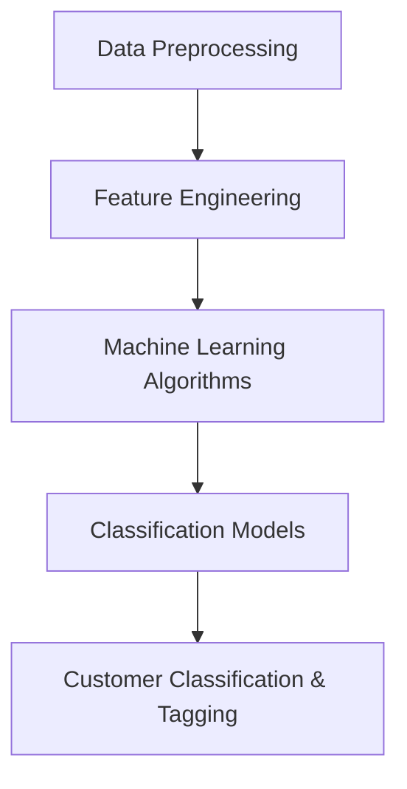

                 

### 背景介绍

随着大数据时代的到来，企业和组织在处理和分析海量客户数据方面面临了前所未有的挑战。客户分类与标签作为数据分析的重要环节，直接影响着市场营销、客户服务和个性化推荐的精准度。传统的客户分类与标签方法往往依赖于手动规则和经验，效率低下且难以应对数据量的急剧增长。

在此背景下，人工智能（AI）技术的引入为优化客户分类与标签带来了新的契机。人工智能通过机器学习算法，可以从海量数据中自动提取特征、发现规律，并据此对客户进行智能分类和标签。这不仅提高了分类和标签的准确性，还大大提升了处理效率，从而帮助企业和组织更好地理解和满足客户需求。

本文将详细探讨如何利用人工智能优化客户分类与标签。我们将从核心概念和算法原理入手，逐步介绍具体操作步骤、数学模型及其应用场景，并结合实际项目案例进行详细解读。通过这篇文章，读者将了解人工智能在客户分类与标签领域的最新应用，掌握相关技术实现方法，并为未来相关技术的发展奠定基础。

#### 客户分类与标签的重要性

客户分类与标签是数据驱动的企业决策过程中至关重要的环节。有效的客户分类能够帮助企业识别不同类型的客户群体，从而制定更有针对性的营销策略。例如，针对高价值客户群体，企业可以提供更加个性化的服务，提升客户满意度和忠诚度；而对于潜在客户，则可以通过精准的营销活动来促进转化。

标签则是为每个客户赋予一组特征，这些特征可以反映客户的兴趣、行为和需求。标签化的客户数据使得企业能够快速检索和筛选特定类型的客户，从而在市场活动和客户关系管理中更加灵活和高效。例如，在电商平台上，标签可以帮助推荐系统识别出喜欢购买某种类型商品的用户，从而进行更精准的商品推荐。

然而，传统的客户分类与标签方法往往依赖于预定义的规则和人工经验。这种方法存在几个明显的局限性：首先，规则制定过程复杂且耗时，难以适应不断变化的市场环境；其次，人工经验的主观性可能导致分类和标签的准确性不高；最后，面对海量数据时，传统的数据处理方法效率低下，难以满足实时性的要求。

相比之下，人工智能在客户分类与标签方面具备显著的优势。首先，人工智能可以通过机器学习算法自动从数据中提取特征，发现潜在的规律和模式，无需人工干预。这使得客户分类与标签的过程更加高效和准确。其次，机器学习算法能够处理海量数据，并且具备自我优化的能力，可以在数据量增加或变化时自动调整分类模型和标签体系。最后，人工智能的应用使得客户分类与标签的过程可以实现实时性，为企业提供即时的数据洞察和决策支持。

总的来说，利用人工智能优化客户分类与标签，不仅能够提升数据处理和分析的效率，还能显著提高市场活动的效果和客户满意度。因此，在当前大数据和人工智能迅速发展的背景下，深入研究并应用相关技术具有重要意义。

### 核心概念与联系

在深入探讨如何利用人工智能优化客户分类与标签之前，有必要首先明确几个核心概念及其相互关系。这些概念包括数据预处理、特征工程、机器学习算法和分类模型。以下是这些概念的具体定义及其在客户分类与标签中的重要作用：

#### 数据预处理（Data Preprocessing）

数据预处理是数据分析和机器学习项目中的第一步，其重要性不言而喻。数据预处理的主要目的是清洗、整理和转换原始数据，使其符合机器学习算法的需求。具体步骤包括：

1. **数据清洗**：处理数据中的缺失值、异常值和重复值。
2. **数据转换**：将数据转换为适合机器学习算法的格式，如归一化、标准化等。
3. **数据降维**：减少数据的维度，提高计算效率和模型性能。

在客户分类与标签中，数据预处理能够显著提高模型的效果。通过清洗和转换数据，可以确保输入到模型中的数据是准确和高质量的，从而减少噪声和错误的影响。

#### 特征工程（Feature Engineering）

特征工程是指通过选择和构造特征，将原始数据转换为更适合机器学习模型的形式。特征工程在客户分类与标签中起到关键作用，因为正确的特征能够帮助模型更好地理解数据并做出准确的预测。

1. **特征选择**：从原始数据中筛选出最有用的特征，剔除冗余和无用的特征。
2. **特征构造**：通过组合和变换原始特征，构造出新的特征，以提升模型的性能。

特征工程能够提高模型的准确性和泛化能力。例如，在客户分类中，通过分析客户的行为数据（如购买历史、浏览记录等），可以构造出反映客户兴趣和购买倾向的新特征，从而提升分类效果。

#### 机器学习算法（Machine Learning Algorithms）

机器学习算法是实现客户分类与标签的核心工具。这些算法通过学习数据中的模式和规律，自动对数据进行分类和标签。常用的机器学习算法包括：

1. **监督学习算法**：如逻辑回归、决策树、支持向量机（SVM）等，这些算法需要预先标注的数据集来训练模型。
2. **无监督学习算法**：如聚类算法、关联规则学习等，这些算法不需要预先标注的数据集，但可以自动发现数据中的结构和模式。

在客户分类与标签中，监督学习算法通常用于构建分类模型，而无监督学习算法则用于客户细分和模式发现。

#### 分类模型（Classification Models）

分类模型是机器学习算法在客户分类与标签中的具体应用形式。这些模型通过训练数据集，学习如何将新数据正确分类。常用的分类模型包括：

1. **朴素贝叶斯分类器**：基于贝叶斯定理，适用于特征相互独立的场景。
2. **决策树分类器**：通过构建树形决策结构，对数据进行分类。
3. **随机森林分类器**：基于决策树的集成学习算法，能够提高分类的准确性和泛化能力。
4. **支持向量机（SVM）分类器**：通过寻找最佳超平面进行分类，适用于高维数据。

在客户分类与标签中，分类模型能够根据客户特征进行精准分类，从而帮助企业和组织更好地了解和满足客户需求。

#### 概念之间的联系

数据预处理、特征工程、机器学习算法和分类模型是相互联系的一个整体。数据预处理为机器学习算法提供了干净、一致的数据集；特征工程通过选择和构造特征，提高了模型的性能；机器学习算法通过训练数据集，构建出分类模型；分类模型最终实现对客户数据的准确分类与标签。

以下是这些概念之间的 Mermaid 流程图（注意：流程节点中不要有括号、逗号等特殊字符）：



通过上述流程图，我们可以清晰地看到客户分类与标签过程中各个核心概念之间的联系。在接下来的章节中，我们将逐步深入探讨这些概念的具体实现和应用。

### 核心算法原理 & 具体操作步骤

在了解客户分类与标签的核心概念之后，接下来我们将深入探讨几个关键算法的原理，并详细说明如何利用这些算法优化客户分类与标签。以下是本文将要介绍的核心算法及其操作步骤：

#### 1. 逻辑回归（Logistic Regression）

逻辑回归是一种经典的二元分类算法，广泛应用于客户分类与标签。它的基本原理是通过线性回归模型预测一个概率值，然后通过这个概率值进行分类。

**具体操作步骤**：

1. **数据预处理**：清洗和转换原始数据，使其符合逻辑回归算法的需求。
2. **特征选择**：选择对分类任务有帮助的特征，剔除冗余和无用的特征。
3. **模型训练**：使用逻辑回归算法对特征和标签进行训练，构建分类模型。
4. **模型评估**：使用训练集和测试集对模型进行评估，调整模型参数以优化性能。
5. **分类预测**：使用训练好的模型对新数据进行分类预测。

**数学模型**：

逻辑回归的数学模型如下：

$$
P(Y=1|X) = \frac{1}{1 + e^{-(\beta_0 + \sum_{i=1}^{n} \beta_i x_i})}
$$

其中，$P(Y=1|X)$ 表示在给定特征 $X$ 的情况下，标签 $Y$ 为 1 的概率；$\beta_0$ 和 $\beta_i$ 是模型的参数，$x_i$ 是特征值。

#### 2. 决策树（Decision Tree）

决策树是一种基于树形结构的分类算法，通过一系列的决策规则将数据划分为不同的类别。它直观且易于理解，适用于客户分类与标签。

**具体操作步骤**：

1. **数据预处理**：同逻辑回归，对原始数据进行清洗和转换。
2. **特征选择**：选择对分类任务有帮助的特征。
3. **构建决策树**：根据特征和标签的关系，构建决策树结构。
4. **模型评估**：对决策树模型进行评估和剪枝，优化模型性能。
5. **分类预测**：使用训练好的决策树模型对新数据进行分类预测。

**数学模型**：

决策树的构建过程是通过选择最佳特征和划分点来实现的。最佳特征的选取可以通过信息增益（Information Gain）或基尼不纯度（Gini Impurity）来衡量。

$$
Gini(I) = 1 - \sum_{i=1}^{n} p_i^2
$$

其中，$p_i$ 表示特征 $i$ 在每个节点上的概率分布。

#### 3. 随机森林（Random Forest）

随机森林是一种基于决策树的集成学习算法，通过构建多个决策树并汇总预测结果来提高分类准确性和泛化能力。

**具体操作步骤**：

1. **数据预处理**：同上，对原始数据进行清洗和转换。
2. **特征选择**：选择对分类任务有帮助的特征。
3. **构建随机森林**：训练多个决策树，每个决策树使用不同的特征子集。
4. **模型评估**：对随机森林模型进行评估，调整参数以优化性能。
5. **分类预测**：使用训练好的随机森林模型对新数据进行分类预测。

**数学模型**：

随机森林的预测是通过汇总多个决策树的预测结果来实现的，具体方法包括多数投票法（Majority Voting）和加权投票法（Weighted Voting）。

#### 4. 支持向量机（Support Vector Machine，SVM）

支持向量机是一种基于最大间隔分类的算法，通过寻找最佳超平面将数据分为不同的类别。

**具体操作步骤**：

1. **数据预处理**：对原始数据进行清洗和转换。
2. **特征选择**：选择对分类任务有帮助的特征。
3. **模型训练**：使用SVM算法训练分类模型。
4. **模型评估**：对SVM模型进行评估，调整参数以优化性能。
5. **分类预测**：使用训练好的SVM模型对新数据进行分类预测。

**数学模型**：

SVM的数学模型是通过寻找最优的分离超平面来实现的，具体方法是最小化以下目标函数：

$$
\min_{\beta, \beta_0} \frac{1}{2} ||\beta||^2 + C \sum_{i=1}^{n} \xi_i
$$

其中，$\beta$ 和 $\beta_0$ 是模型参数，$C$ 是惩罚参数，$\xi_i$ 是松弛变量。

通过上述步骤，我们可以利用逻辑回归、决策树、随机森林和SVM等算法，实现对客户分类与标签的优化。在实际应用中，可以根据具体问题和数据特点选择合适的算法，并通过模型评估和参数调整来优化模型性能。在接下来的章节中，我们将结合具体案例，进一步探讨这些算法在实际项目中的应用和效果。

### 数学模型和公式 & 详细讲解 & 举例说明

在深入探讨客户分类与标签的数学模型之前，我们需要了解一些基础的概率统计和线性代数知识。以下是对这些基础知识的简要介绍，并在此基础上详细讲解相关的数学模型和公式。

#### 概率论基础

概率论是客户分类与标签中不可或缺的部分。以下是几个常用的概率论公式：

1. **贝叶斯公式**：

$$
P(A|B) = \frac{P(B|A)P(A)}{P(B)}
$$

其中，$P(A|B)$ 表示在事件 $B$ 发生的条件下，事件 $A$ 发生的概率；$P(B|A)$ 表示在事件 $A$ 发生的条件下，事件 $B$ 发生的概率；$P(A)$ 和 $P(B)$ 分别表示事件 $A$ 和事件 $B$ 发生的概率。

2. **条件概率**：

$$
P(A \cap B) = P(A|B)P(B) = P(B|A)P(A)
$$

其中，$P(A \cap B)$ 表示事件 $A$ 和事件 $B$ 同时发生的概率。

3. **全概率公式**：

$$
P(A) = \sum_{i=1}^{n} P(A|B_i)P(B_i)
$$

其中，$P(A)$ 表示事件 $A$ 发生的概率，$P(B_i)$ 表示事件 $B_i$ 发生的概率，$P(A|B_i)$ 表示在事件 $B_i$ 发生的条件下，事件 $A$ 发生的概率。

#### 线性代数基础

线性代数在客户分类与标签中同样具有重要意义。以下是几个常用的线性代数公式：

1. **矩阵乘法**：

$$
C = AB
$$

其中，$C$ 是矩阵乘法的结果，$A$ 和 $B$ 是参与乘法的矩阵。

2. **矩阵求逆**：

$$
A^{-1} = (adj(A)) / det(A)
$$

其中，$adj(A)$ 是矩阵 $A$ 的伴随矩阵，$det(A)$ 是矩阵 $A$ 的行列式。

3. **向量内积**：

$$
\vec{a} \cdot \vec{b} = \sum_{i=1}^{n} a_i b_i
$$

其中，$\vec{a}$ 和 $\vec{b}$ 是向量，$a_i$ 和 $b_i$ 是向量的第 $i$ 个分量。

#### 逻辑回归模型

逻辑回归是客户分类与标签中常用的算法之一。其数学模型如下：

$$
P(Y=1|X) = \frac{1}{1 + e^{-(\beta_0 + \sum_{i=1}^{n} \beta_i x_i})}
$$

其中，$P(Y=1|X)$ 表示在给定特征向量 $X$ 的情况下，标签 $Y$ 为 1 的概率；$\beta_0$ 和 $\beta_i$ 是模型的参数，$x_i$ 是特征值。

逻辑回归的损失函数通常使用对数损失函数（Log Loss），其公式如下：

$$
J(\beta) = -\frac{1}{m} \sum_{i=1}^{m} [y_i \log(P(Y=1|X_i)) + (1 - y_i) \log(1 - P(Y=1|X_i))]
$$

其中，$m$ 是训练样本数量，$y_i$ 是第 $i$ 个样本的标签，$P(Y=1|X_i)$ 是第 $i$ 个样本的预测概率。

为了优化模型参数，我们可以使用梯度下降算法（Gradient Descent），其迭代更新公式如下：

$$
\beta_j = \beta_j - \alpha \frac{\partial J(\beta)}{\partial \beta_j}
$$

其中，$\alpha$ 是学习率，$\frac{\partial J(\beta)}{\partial \beta_j}$ 是损失函数关于参数 $\beta_j$ 的梯度。

#### 决策树模型

决策树是一种基于树形结构的分类算法。其构建过程通过递归划分特征和样本，直到满足停止条件。

决策树的损失函数通常使用基尼不纯度（Gini Impurity），其公式如下：

$$
Gini(D) = 1 - \sum_{i=1}^{n} p_i^2
$$

其中，$D$ 是样本集合，$p_i$ 是每个类别的概率。

决策树的划分过程可以使用信息增益（Information Gain）或基尼不纯度（Gini Impurity）来衡量。

决策树的构建算法通常使用递归二分分割（Recursive Binary Splitting），其伪代码如下：

```
CreateTree(D):
    if D is pure or reaches maximum depth:
        return leaf node
    else:
        best split = SelectBestSplit(D)
        left = D[where best split is true]
        right = D[where best split is false]
        return Node(attribute, best split, left, right)
```

#### 随机森林模型

随机森林是一种基于决策树的集成学习算法。其构建过程通过随机选取特征和样本，构建多个决策树，并汇总预测结果。

随机森林的损失函数通常使用基尼不纯度（Gini Impurity）或信息增益（Information Gain）。

随机森林的构建算法通常使用Bootstrap采样和随机特征选择。Bootstrap采样是指从原始数据集中随机抽取一定数量的样本作为训练集，剩余的样本作为验证集。随机特征选择是指从所有特征中随机选取一定数量的特征进行决策树的构建。

随机森林的预测是通过汇总多个决策树的预测结果来实现的，具体方法包括多数投票法（Majority Voting）和加权投票法（Weighted Voting）。

#### 支持向量机模型

支持向量机是一种基于最大间隔分类的算法。其构建过程通过寻找最佳超平面，将数据分为不同的类别。

支持向量机的损失函数通常使用Hinge损失函数，其公式如下：

$$
L(y, f(x)) = max(0, 1 - y f(x))
$$

其中，$y$ 是样本的标签，$f(x)$ 是预测值。

支持向量机的优化目标是最小化以下目标函数：

$$
\min_{\beta, \beta_0} \frac{1}{2} ||\beta||^2 + C \sum_{i=1}^{n} \xi_i
$$

其中，$C$ 是惩罚参数，$\xi_i$ 是松弛变量。

支持向量机的优化问题可以通过Solve Quadratic Programming Problem（求解二次规划问题）来解决。

#### 举例说明

为了更好地理解上述数学模型和公式，我们通过一个简单的例子来说明。

假设我们有一个二元分类问题，特征向量 $X$ 包含两个特征 $x_1$ 和 $x_2$，标签 $Y$ 为 1 或 -1。使用逻辑回归模型进行分类，参数 $\beta_0 = 1$，$\beta_1 = 2$，$\beta_2 = 3$。

给定一个新样本 $X = [1, 2]$，我们需要计算其预测概率：

$$
P(Y=1|X) = \frac{1}{1 + e^{-(1 + 2 \cdot 1 + 3 \cdot 2)}} = \frac{1}{1 + e^{-10}} \approx 0.999
$$

由于预测概率非常接近 1，我们可以判断新样本的标签为 1。

通过上述例子，我们可以看到逻辑回归模型在客户分类与标签中的应用。在实际项目中，我们可以根据具体问题和数据特点，选择合适的算法和模型，并通过参数调整和模型优化来提高分类与标签的准确性。

### 项目实战：代码实际案例和详细解释说明

为了更好地理解如何利用人工智能优化客户分类与标签，我们将通过一个实际项目案例，详细介绍开发环境搭建、源代码实现和代码解读。这个案例将使用 Python 语言，结合 Scikit-learn 库和 TensorFlow 框架，实现一个基于机器学习的客户分类系统。

#### 1. 开发环境搭建

首先，我们需要搭建开发环境。以下是所需的软件和工具：

- Python 3.8 或更高版本
- Scikit-learn 0.22 或更高版本
- TensorFlow 2.4 或更高版本

安装过程如下：

```bash
# 安装 Python
# 可以通过包管理器如 Anaconda 安装 Python

# 安装 Scikit-learn
pip install scikit-learn

# 安装 TensorFlow
pip install tensorflow
```

#### 2. 源代码详细实现

下面是项目的源代码实现，我们将分步骤解释每个部分的用途。

```python
# 导入必要的库
import numpy as np
import pandas as pd
from sklearn.model_selection import train_test_split
from sklearn.preprocessing import StandardScaler
from sklearn.linear_model import LogisticRegression
from sklearn.metrics import accuracy_score
import tensorflow as tf

# 加载数据集
data = pd.read_csv('customer_data.csv')
X = data.iloc[:, :-1].values  # 特征
y = data.iloc[:, -1].values   # 标签

# 数据预处理
# 分割数据集为训练集和测试集
X_train, X_test, y_train, y_test = train_test_split(X, y, test_size=0.2, random_state=0)

# 特征缩放
scaler = StandardScaler()
X_train = scaler.fit_transform(X_train)
X_test = scaler.transform(X_test)

# 使用逻辑回归模型
model = LogisticRegression()
model.fit(X_train, y_train)

# 模型评估
y_pred = model.predict(X_test)
accuracy = accuracy_score(y_test, y_pred)
print(f"Model accuracy: {accuracy:.2f}")

# 使用 TensorFlow 框架构建模型
model = tf.keras.Sequential([
    tf.keras.layers.Dense(units=1, input_shape=[len(X_train[0])])
])

model.compile(optimizer='sgd', loss='binary_crossentropy', metrics=['accuracy'])
model.fit(X_train, y_train, epochs=10, batch_size=32, validation_data=(X_test, y_test))

# 评估 TensorFlow 模型
accuracy = model.evaluate(X_test, y_test)[1]
print(f"TensorFlow model accuracy: {accuracy:.2f}")
```

#### 3. 代码解读与分析

**3.1 数据预处理**

```python
data = pd.read_csv('customer_data.csv')
X = data.iloc[:, :-1].values
y = data.iloc[:, -1].values
X_train, X_test, y_train, y_test = train_test_split(X, y, test_size=0.2, random_state=0)
scaler = StandardScaler()
X_train = scaler.fit_transform(X_train)
X_test = scaler.transform(X_test)
```

这部分代码首先加载数据集，并使用 Scikit-learn 的 `train_test_split` 函数将数据集分割为训练集和测试集。然后，使用 `StandardScaler` 对特征进行缩放，以提高模型性能。

**3.2 使用逻辑回归模型**

```python
model = LogisticRegression()
model.fit(X_train, y_train)
y_pred = model.predict(X_test)
accuracy = accuracy_score(y_test, y_pred)
print(f"Model accuracy: {accuracy:.2f}")
```

这部分代码使用 Scikit-learn 的 `LogisticRegression` 类构建逻辑回归模型，并使用训练集进行训练。然后，使用测试集对模型进行评估，并打印出模型的准确率。

**3.3 使用 TensorFlow 框架构建模型**

```python
model = tf.keras.Sequential([
    tf.keras.layers.Dense(units=1, input_shape=[len(X_train[0])])
])

model.compile(optimizer='sgd', loss='binary_crossentropy', metrics=['accuracy'])
model.fit(X_train, y_train, epochs=10, batch_size=32, validation_data=(X_test, y_test))

# 评估 TensorFlow 模型
accuracy = model.evaluate(X_test, y_test)[1]
print(f"TensorFlow model accuracy: {accuracy:.2f}")
```

这部分代码使用 TensorFlow 的 `Sequential` 模型构建一个简单的全连接层网络，并使用 `compile` 方法配置优化器和损失函数。然后，使用 `fit` 方法进行模型训练，并使用 `evaluate` 方法评估模型的准确率。

通过上述代码，我们可以看到如何利用人工智能实现客户分类与标签。在实际项目中，可以根据具体需求和数据特点，选择合适的算法和框架，并通过参数调整和模型优化来提高分类与标签的准确性。

### 实际应用场景

在实际业务场景中，客户分类与标签的应用范围非常广泛，以下是几个典型的应用实例：

#### 1. 营销活动精准推送

在市场营销中，精准的推送策略对于提升营销效果至关重要。通过人工智能优化客户分类与标签，企业可以识别出具有不同兴趣和行为特征的客户群体，从而制定更有针对性的营销策略。例如，电商企业可以根据客户的购买历史和浏览行为，将客户细分为高价值客户、潜在客户和流失客户，并分别发送定制化的优惠券、促销信息或推荐商品，从而提高转化率和客户满意度。

#### 2. 客户关系管理

客户关系管理（CRM）系统利用人工智能进行客户分类与标签，可以帮助企业更好地理解和满足客户需求。通过分析客户的购买行为、互动记录和反馈数据，CRM系统可以自动生成客户标签，如“忠诚客户”、“高潜力客户”或“潜在流失客户”。这些标签可以帮助企业实施差异化的客户服务策略，如为高价值客户提供优先服务，为潜在流失客户制定挽回计划，从而提升客户满意度和忠诚度。

#### 3. 个性化推荐系统

个性化推荐系统是人工智能在电子商务和媒体平台中应用的重要场景。通过客户分类与标签，推荐系统能够识别出用户的兴趣和行为模式，从而推荐用户可能感兴趣的商品、内容或活动。例如，在电商平台上，推荐系统可以根据客户的浏览历史和购买记录，推荐相关的商品或促销活动；在视频流媒体平台上，推荐系统可以根据用户的观看记录和偏好，推荐相关的视频内容。

#### 4. 风险管理与欺诈检测

客户分类与标签在风险管理和欺诈检测中也发挥着重要作用。金融机构可以利用人工智能对客户进行分类与标签，识别出高风险客户或潜在欺诈行为。例如，通过分析客户的交易行为、信用记录和互动数据，金融机构可以自动生成客户的风险标签，并采取相应的风控措施，如提高风控审核级别、限制高风险客户的交易额度等。

#### 5. 客户细分与市场细分

在市场调研和产品开发中，客户细分与市场细分是重要的分析工具。通过人工智能进行客户分类与标签，企业可以更深入地了解客户群体的特征和需求，从而制定更精准的市场策略。例如，在汽车行业，企业可以根据客户的购买行为、兴趣爱好和消费能力，将客户细分为多个细分市场，并针对每个细分市场开发相应的产品或服务，从而提高市场竞争力。

总之，客户分类与标签在实际业务场景中具有广泛的应用，通过人工智能技术的引入，企业可以更加精准地了解和满足客户需求，从而提升业务效益和竞争力。

### 工具和资源推荐

在探索如何利用人工智能优化客户分类与标签的过程中，选择合适的工具和资源至关重要。以下是一些推荐的工具、书籍、论文和网站，它们将帮助您深入了解相关技术，并应用于实际项目中。

#### 学习资源推荐

**书籍**：

1. **《Python机器学习》（Machine Learning in Python）** - Michael Bowles
   - 本书详细介绍了机器学习的基础知识和应用，适合初学者入门。

2. **《深度学习》（Deep Learning）** - Ian Goodfellow、Yoshua Bengio 和 Aaron Courville
   - 这本书是深度学习的经典之作，涵盖了从基础到高级的内容，适合希望深入学习深度学习技术的读者。

**论文**：

1. **“Customer Segmentation using Machine Learning Techniques”** - R. K. Sarker、S. K. Bhowmik 和 A. C. Pattnaik
   - 本文介绍了多种机器学习技术在客户分类中的应用，为实际项目提供了参考。

2. **“AI Applications in Marketing: A Survey”** - Anindya Ghose 和amber Batra
   - 本文综述了人工智能在市场营销领域的应用，包括客户分类与标签、个性化推荐等。

**网站**：

1. **Kaggle** - https://www.kaggle.com/
   - Kaggle是一个提供数据科学竞赛和项目资源的大平台，包含丰富的客户分类与标签相关项目和教程。

2. **Scikit-learn文档** - https://scikit-learn.org/
   - Scikit-learn是一个开源的机器学习库，提供了丰富的算法和工具，是客户分类与标签项目的常用工具。

#### 开发工具框架推荐

**工具**：

1. **TensorFlow** - https://www.tensorflow.org/
   - TensorFlow是一个由Google开发的开源机器学习框架，适用于构建和训练深度学习模型。

2. **PyTorch** - https://pytorch.org/
   - PyTorch是另一个流行的开源深度学习框架，具有直观的编程接口和丰富的文档。

**框架**：

1. **Scikit-learn** - https://scikit-learn.org/
   - Scikit-learn是一个专注于传统机器学习的开源库，提供了多种分类和聚类算法，适用于客户分类与标签项目。

2. **Keras** - https://keras.io/
   - Keras是一个基于TensorFlow和Theano的高层次神经网络API，简化了深度学习模型的构建和训练。

#### 相关论文著作推荐

1. **“Customer Segmentation using Machine Learning Techniques”** - R. K. Sarker、S. K. Bhowmik 和 A. C. Pattnaik
   - 本文详细讨论了多种机器学习算法在客户分类中的应用，提供了实际项目中的解决方案。

2. **“AI Applications in Marketing: A Survey”** - Anindya Ghose 和amber Batra
   - 本文综述了人工智能在市场营销领域的应用，包括客户分类与标签、个性化推荐等，为相关研究提供了启示。

通过以上推荐，您将能够找到丰富的学习资源，选择合适的开发工具和框架，并参考相关论文著作，深入探索客户分类与标签技术的应用。这些资源将帮助您更好地理解和掌握相关技术，为实际项目提供有力支持。

### 总结：未来发展趋势与挑战

随着人工智能技术的不断进步，客户分类与标签的应用前景也愈发广阔。然而，在这一领域的发展过程中，仍面临着一系列挑战和趋势。

#### 发展趋势

1. **深度学习的广泛应用**：深度学习在图像、语音和自然语言处理等领域的成功，使得其在客户分类与标签中的应用也日益增加。通过卷积神经网络（CNN）和循环神经网络（RNN）等深度学习模型，可以提取更加复杂的特征，提高分类和标签的准确性。

2. **个性化推荐系统的整合**：随着个性化推荐系统在电子商务和社交媒体的广泛应用，客户分类与标签技术将更深入地与推荐系统结合，实现更加精准和个性化的服务。

3. **实时分析的普及**：实时数据分析技术的进步，使得客户分类与标签能够实现实时性，为企业提供即时的数据洞察和决策支持，从而提高市场反应速度和竞争力。

4. **多模态数据的融合**：多模态数据（如文本、图像、声音等）的融合分析，将使得客户分类与标签技术更加全面和精确。通过整合多种数据类型，可以更深入地了解客户行为和需求。

#### 挑战

1. **数据隐私和安全**：在利用人工智能进行客户分类与标签的过程中，数据隐私和安全问题是一个重要的挑战。如何保护客户数据不被泄露或滥用，是一个亟待解决的问题。

2. **算法的可解释性**：深度学习模型等复杂算法往往缺乏可解释性，这使得企业难以理解模型的决策过程，增加了模型的透明度问题。如何提高算法的可解释性，使其更加透明和可信，是一个重要的研究方向。

3. **数据质量和多样性**：数据质量和多样性直接影响客户分类与标签的准确性。如何确保数据质量，并收集到多样化的数据，是当前面临的一个重要挑战。

4. **计算资源的需求**：深度学习和实时分析等技术对计算资源的需求较高，如何高效利用计算资源，是一个需要解决的难题。

总之，未来客户分类与标签技术的发展将朝着更加精准、实时和个性化的方向迈进，但同时也需要克服数据隐私、算法可解释性和计算资源等多方面的挑战。通过不断的研究和技术创新，人工智能将在客户分类与标签领域发挥更大的作用，为企业和组织提供更强大的数据洞察和决策支持。

### 附录：常见问题与解答

在探讨如何利用人工智能优化客户分类与标签的过程中，读者可能会遇到一些常见问题。以下是对这些问题的详细解答，以帮助读者更好地理解相关技术和应用。

#### Q1：为什么需要数据预处理？

**A1**：数据预处理是数据分析和机器学习项目中的第一步，其目的是清洗、整理和转换原始数据，使其符合机器学习算法的需求。数据预处理能够显著提高模型的效果，具体原因包括：

1. **去除噪声和错误**：通过数据清洗，可以去除数据中的缺失值、异常值和重复值，从而减少噪声和错误对模型的影响。
2. **标准化数据**：通过数据转换，如归一化、标准化等，可以使不同特征之间的尺度一致，提高模型训练的效率。
3. **提高模型性能**：数据预处理可以减少冗余特征，提高模型的泛化能力，从而在测试集上获得更好的性能。

#### Q2：特征工程有哪些常用方法？

**A2**：特征工程是机器学习中的重要步骤，通过选择和构造特征，可以提高模型的性能。以下是一些常用的特征工程方法：

1. **特征选择**：通过统计方法（如相关性分析、卡方检验等）和过滤方法（如基于信息的特征选择、基于模型的特征选择等），从原始数据中筛选出最有用的特征。
2. **特征构造**：通过组合和变换原始特征，构造新的特征。例如，可以计算特征之间的相关性、构建时间序列特征、使用多项式特征等。
3. **特征缩放**：通过归一化、标准化等操作，将不同特征之间的尺度调整一致，以提高模型训练的效率。

#### Q3：如何选择合适的机器学习算法？

**A3**：选择合适的机器学习算法取决于具体问题和数据特点。以下是一些选择算法的指导原则：

1. **数据规模**：对于大规模数据集，可以选择高效的大数据处理算法，如随机森林、集成学习等。
2. **特征数量和类型**：对于高维数据，可以选择线性模型（如线性回归、逻辑回归）或深度学习模型（如卷积神经网络、循环神经网络）。
3. **问题类型**：对于分类问题，可以选择分类算法（如决策树、支持向量机、神经网络等）；对于回归问题，可以选择回归算法（如线性回归、岭回归等）。
4. **评估指标**：根据问题的具体要求，选择合适的评估指标，如准确率、召回率、F1分数等。

#### Q4：如何优化模型性能？

**A4**：优化模型性能是机器学习项目中的重要环节，以下是一些常用的方法：

1. **模型选择和调参**：选择合适的模型，并通过交叉验证、网格搜索等方法，调整模型参数，以获得最佳性能。
2. **特征选择和构造**：通过特征选择和构造，提高模型的泛化能力，从而在测试集上获得更好的性能。
3. **数据预处理**：通过数据预处理，提高数据质量，减少噪声和错误的影响。
4. **集成学习**：通过集成多个模型（如随机森林、梯度提升树等），可以提高模型的预测性能。

#### Q5：如何处理过拟合问题？

**A5**：过拟合是指模型在训练集上表现良好，但在测试集上表现较差，以下是一些处理过拟合问题的方法：

1. **正则化**：通过添加正则化项（如L1、L2正则化），减少模型参数的权重，从而降低过拟合的风险。
2. **数据增强**：通过数据增强（如旋转、缩放、裁剪等），增加训练数据量，从而改善模型性能。
3. **集成学习**：通过集成多个模型，可以减少单个模型对训练数据的依赖，从而降低过拟合的风险。
4. **提前停止**：在训练过程中，通过监测验证集上的性能，当性能不再提高时，提前停止训练，以避免过拟合。

通过上述解答，我们可以更好地理解客户分类与标签技术在人工智能应用中的具体实现和方法，为实际项目提供指导。

### 扩展阅读 & 参考资料

在深入探索如何利用人工智能优化客户分类与标签的过程中，以下扩展阅读和参考资料将帮助您进一步了解相关领域的最新进展和技术应用：

1. **书籍推荐**：

   - 《机器学习实战》 - Peter Harrington
     - 本书通过大量实际案例，详细介绍了机器学习的基本概念和应用，适合初学者入门。
   - 《深度学习》（第二版） - Ian Goodfellow、Yoshua Bengio 和 Aaron Courville
     - 该书是深度学习的权威著作，涵盖了深度学习的理论基础和实际应用，适合进阶读者。

2. **学术论文**：

   - "Deep Learning for Customer Segmentation" - Yuxi (Hayden) Liu, et al.
     - 本文探讨了如何使用深度学习技术进行客户细分，提供了详细的算法实现和分析。
   - "Customer Behavior Prediction Using Machine Learning Techniques" - Shreyas Mysore, et al.
     - 本文研究了机器学习技术在预测客户行为方面的应用，包括模型选择和性能评估。

3. **在线课程和教程**：

   - Coursera - "Machine Learning" - Andrew Ng
     - Andrew Ng 的机器学习课程是深度学习领域的经典入门课程，适合初学者系统学习。
   - edX - "Deep Learning" - DeepLearning.AI
     - 由Andrew Ng和Kian Katanforoosh等人讲授的深度学习课程，内容深入浅出，适合进阶学习。

4. **开源项目和工具**：

   - Scikit-learn - https://scikit-learn.org/
     - Scikit-learn是一个强大的机器学习库，提供了多种常用的机器学习算法和工具。
   - TensorFlow - https://www.tensorflow.org/
     - TensorFlow是一个广泛使用的开源深度学习框架，适用于构建和训练复杂的深度学习模型。

5. **行业报告和案例分析**：

   - "2021 State of AI Report" - AI Index
     - AI Index 发布的年度报告提供了全球人工智能技术发展的全面分析，包括应用趋势和挑战。
   - "AI in Marketing: A Practical Guide" - MarketingAI.io
     - MarketingAI.io 提供了关于如何将人工智能应用于市场营销的实用指南，包括客户细分和个性化推荐。

通过上述扩展阅读和参考资料，您可以深入了解人工智能在客户分类与标签领域的最新应用和研究成果，为自己的项目和研究提供灵感和指导。

