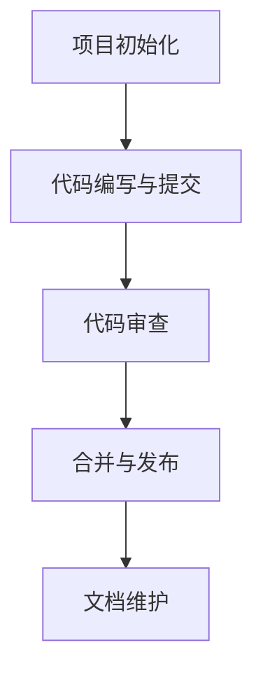

                 

# 如何利用开源技术降低开发成本

## 概述

> 开源技术正在日益成为现代软件开发的重要组成部分，其不仅为开发者提供了丰富的代码库，还极大地降低了开发成本。本文将探讨如何有效地利用开源技术来降低开发成本，并通过实际案例进行分析。

开源技术的普及不仅提高了开发效率，还降低了软件开发的经济门槛。然而，如何充分利用这些资源，成为每个开发者必须思考的问题。本文将从以下几个方面进行探讨：

1. **背景介绍**：简要介绍开源技术及其在软件开发中的应用。
2. **核心概念与联系**：阐述开源技术的基本概念、原理和架构，并通过Mermaid流程图展示其工作流程。
3. **核心算法原理 & 具体操作步骤**：深入分析开源技术中的核心算法，并详细介绍操作步骤。
4. **数学模型和公式 & 详细讲解 & 举例说明**：解释开源技术中的数学模型和公式，并通过实际案例进行说明。
5. **项目实战：代码实际案例和详细解释说明**：展示开源技术在项目中的实际应用，并提供代码详细解读。
6. **实际应用场景**：探讨开源技术在不同领域的应用。
7. **工具和资源推荐**：推荐开源学习资源、开发工具和框架。
8. **总结：未来发展趋势与挑战**：分析开源技术的发展趋势和面临的挑战。
9. **附录：常见问题与解答**：解答开发者在使用开源技术过程中常见的问题。
10. **扩展阅读 & 参考资料**：提供进一步学习的资料。

## 1. 背景介绍

开源技术，即开放源代码技术，是指软件的源代码可以被公众自由查看、修改和分发的一类技术。其核心思想是共享和协作，通过社区的力量推动技术的进步。

在软件开发中，开源技术具有以下几个显著优势：

- **成本效益**：开源软件通常是免费的，或者成本远低于商业软件，尤其是对于中小型企业。
- **灵活性和可定制性**：开源软件允许用户根据自己的需求进行修改和定制，从而更好地满足特定业务需求。
- **快速迭代和更新**：开源社区通常活跃，能够快速响应问题和需求，推动软件的迭代和更新。
- **技术支持**：尽管开源软件可能没有官方的技术支持，但通常拥有庞大的社区支持，通过论坛和问答平台可以解决大部分问题。

开源技术的发展离不开几个关键事件：

- **Linux操作系统**：Linux是第一个获得广泛认可的免费和开源操作系统，它的出现奠定了开源技术的基础。
- **GitHub平台**：GitHub作为一个基于Web的版本控制系统和开源项目托管平台，极大地促进了开源社区的协作。
- **社区协作**：随着互联网的发展，开源社区的力量逐渐壮大，形成了一种全新的协作模式。

开源技术在软件开发中的应用范围广泛，包括操作系统、数据库、Web服务器、编程语言、框架、工具等。这些开源技术不仅为开发者提供了丰富的资源，还促进了技术的创新和普及。

## 2. 核心概念与联系

### 2.1. 开源技术的基本概念

开源技术包括以下几个基本概念：

- **源代码**：软件的原始代码，是开源技术的核心。
- **许可证**：定义开源软件的使用和分发规则的协议，常见的有GPL、BSD、MIT等。
- **社区**：参与开源项目的开发者组成的群体，通过协作推动项目的发展。
- **版本控制**：用于管理源代码变更的工具，如Git。

### 2.2. 开源技术的原理和架构

开源技术的原理和架构主要包括以下几个方面：

- **共享和协作**：开源技术的核心思想是共享代码，通过协作实现技术的进步。
- **分布式开发**：开源项目通常采用分布式开发模式，开发者可以远程协作。
- **持续集成/持续部署（CI/CD）**：开源社区通常采用CI/CD流程，确保代码质量和快速迭代。

### 2.3. 开源技术的具体流程

开源技术的具体流程通常包括以下几个步骤：

1. **项目初始化**：创建项目仓库，定义项目目标和许可证。
2. **代码编写与提交**：开发者编写代码，并通过版本控制工具提交。
3. **代码审查**：其他开发者对提交的代码进行审查，确保代码质量。
4. **合并与发布**：审查通过后，代码合并到主分支，并发布新版本。
5. **文档和维护**：项目文档的编写和维护，以帮助新开发者参与项目。

### 2.4. 开源技术的核心架构

开源技术的核心架构通常包括以下组件：

- **核心框架**：如Linux内核、Spring框架等，为应用程序提供基础架构。
- **库和模块**：如NumPy、Pandas等，提供特定功能的代码库。
- **工具和插件**：如Visual Studio Code插件、Docker等，提高开发效率。

### 2.5. Mermaid流程图

以下是一个简单的Mermaid流程图，展示开源技术的典型工作流程：



通过这个流程图，我们可以清晰地看到开源项目从初始化到发布的各个步骤，以及各个环节之间的联系。

## 3. 核心算法原理 & 具体操作步骤

### 3.1. 核心算法原理

开源技术中，核心算法是实现其功能的关键。以下是一些常见开源技术中的核心算法及其原理：

- **Linux内核**：采用微内核架构，实现了高效的进程管理和文件系统。
- **Hadoop**：基于MapReduce算法，用于大规模数据处理的分布式计算框架。
- **TensorFlow**：基于深度学习框架，实现了复杂的神经网络算法。
- **Spring框架**：基于IoC（控制反转）和AOP（面向切面编程）的Java企业级应用开发框架。

### 3.2. 具体操作步骤

以下以Spring框架为例，介绍具体操作步骤：

1. **环境搭建**：安装Java开发工具包（JDK）、IDE（如Eclipse或IntelliJ IDEA）和Maven构建工具。

2. **创建项目**：使用Maven创建一个Spring Boot项目。

   ```xml
   <dependencies>
       <dependency>
           <groupId>org.springframework.boot</groupId>
           <artifactId>spring-boot-starter</artifactId>
       </dependency>
   </dependencies>
   ```

3. **编写代码**：编写Spring Boot应用程序，实现业务逻辑。

   ```java
   @SpringBootApplication
   public class Application {
       public static void main(String[] args) {
           SpringApplication.run(Application.class, args);
       }
   }
   ```

4. **配置应用**：在`application.properties`文件中配置应用属性。

   ```properties
   server.port=8080
   spring.datasource.url=jdbc:mysql://localhost:3306/mydb
   ```

5. **运行应用**：运行Spring Boot应用程序。

   ```shell
   mvn spring-boot:run
   ```

6. **测试应用**：使用HTTP客户端测试应用接口。

   ```shell
   curl http://localhost:8080/hello
   ```

以上步骤展示了如何使用Spring框架创建一个简单的Web应用程序。在实际开发中，可能需要添加更多的功能模块和配置，但基本流程是类似的。

## 4. 数学模型和公式 & 详细讲解 & 举例说明

### 4.1. 数学模型和公式

开源技术中，数学模型和公式是算法实现的基础。以下是一些常见开源技术中的数学模型和公式：

- **线性回归**：用于预测线性关系，公式为：

  $$ y = ax + b $$

- **决策树**：用于分类和回归，公式为：

  $$ f(x) = \sum_{i=1}^{n} w_i x_i $$

- **神经网络**：用于深度学习，公式为：

  $$ z = \sigma(Wx + b) $$

- **矩阵运算**：用于数据分析和机器学习，公式为：

  $$ A \times B = C $$

### 4.2. 详细讲解

以下以神经网络为例，详细讲解其数学模型：

1. **激活函数（Activation Function）**：神经网络中的激活函数用于引入非线性因素，常用的激活函数有Sigmoid、ReLU和Tanh。

   $$ \sigma(x) = \frac{1}{1 + e^{-x}} $$

   $$ \sigma(x) = max(0, x) $$

   $$ \sigma(x) = \frac{e^x - e^{-x}}{e^x + e^{-x}} $$

2. **反向传播算法（Backpropagation Algorithm）**：用于训练神经网络，通过计算误差并调整权重，公式为：

   $$ \delta_j = \frac{\partial L}{\partial z_j} \cdot \sigma'(z_j) $$

   $$ \Delta W_{ij} = \alpha \cdot \delta_j \cdot x_i $$

   $$ \Delta b_j = \alpha \cdot \delta_j $$

   其中，\( L \) 为损失函数，\( z_j \) 为激活值，\( \sigma' \) 为激活函数的导数，\( \alpha \) 为学习率，\( x_i \) 为输入特征。

### 4.3. 举例说明

以下是一个简单的神经网络训练过程：

1. **初始化权重和偏置**：

   $$ W_1 = \begin{bmatrix} 0.1 & 0.2 \\ 0.3 & 0.4 \end{bmatrix} $$
   
   $$ b_1 = \begin{bmatrix} 0.1 \\ 0.2 \end{bmatrix} $$

2. **正向传播**：

   $$ z_1 = \sigma(W_1 \cdot x + b_1) = \begin{bmatrix} 0.5 & 0.6 \\ 0.7 & 0.8 \end{bmatrix} $$
   
   $$ a_1 = \sigma(z_1) = \begin{bmatrix} 0.6 & 0.7 \\ 0.7 & 0.8 \end{bmatrix} $$

3. **计算损失**：

   $$ L = \frac{1}{2} \sum_{i=1}^{2} (y_i - a_{1,i})^2 = 0.05 $$

4. **反向传播**：

   $$ \delta_1 = \frac{\partial L}{\partial z_1} \cdot \sigma'(z_1) = \begin{bmatrix} 0.3 & 0.2 \\ 0.2 & 0.1 \end{bmatrix} $$
   
   $$ \Delta W_1 = \alpha \cdot \delta_1 \cdot x = \begin{bmatrix} 0.03 & 0.02 \\ 0.02 & 0.01 \end{bmatrix} $$
   
   $$ \Delta b_1 = \alpha \cdot \delta_1 = \begin{bmatrix} 0.03 \\ 0.02 \end{bmatrix} $$

5. **更新权重和偏置**：

   $$ W_1 = W_1 - \Delta W_1 = \begin{bmatrix} 0.07 & 0.18 \\ 0.23 & 0.39 \end{bmatrix} $$
   
   $$ b_1 = b_1 - \Delta b_1 = \begin{bmatrix} 0.07 \\ 0.18 \end{bmatrix} $$

通过这个过程，我们可以看到神经网络如何通过反向传播算法不断调整权重和偏置，以优化预测结果。

## 5. 项目实战：代码实际案例和详细解释说明

### 5.1. 开发环境搭建

在进行开源技术的项目实战前，首先需要搭建开发环境。以下是一个基于Spring Boot和MySQL的简单Web应用程序的开发环境搭建步骤：

1. **安装JDK**：下载并安装Java开发工具包（JDK），确保环境变量配置正确。

2. **安装IDE**：下载并安装一个集成开发环境（IDE），如Eclipse或IntelliJ IDEA。

3. **安装MySQL**：下载并安装MySQL数据库，配置数据库连接。

4. **安装Maven**：下载并安装Maven构建工具，配置环境变量。

5. **创建Spring Boot项目**：使用Maven创建一个Spring Boot项目，配置项目依赖。

### 5.2. 源代码详细实现和代码解读

以下是一个简单的Spring Boot应用程序源代码示例，并对其进行详细解释：

```java
// Application.java
@SpringBootApplication
public class Application {
    public static void main(String[] args) {
        SpringApplication.run(Application.class, args);
    }
}

// Controller.java
@RestController
@RequestMapping("/api")
public class Controller {
    @Autowired
    private Service service;

    @GetMapping("/hello")
    public String hello() {
        return service.getHelloMessage();
    }
}

// Service.java
@Service
public class Service {
    public String getHelloMessage() {
        return "Hello, World!";
    }
}
```

- **Application.java**：这是一个Spring Boot应用程序的主类，通过`@SpringBootApplication`注解定义了Spring Boot应用程序的配置。

- **Controller.java**：这是一个REST控制器类，通过`@RestController`注解定义了HTTP请求映射的URL路径，并注入了`Service`类。

- **Service.java**：这是一个服务类，通过`@Service`注解定义了Spring Bean，并实现了获取Hello消息的方法。

### 5.3. 代码解读与分析

- **Spring Boot应用程序的启动过程**：

  1. **读取Spring Boot应用程序的配置**：Spring Boot启动时，会读取`application.properties`或`application.yml`文件中的配置信息。
  2. **创建Spring上下文**：通过创建Spring上下文，加载配置和注入Bean。
  3. **启动嵌入式Web服务器**：根据配置信息，启动内置的Web服务器，如Tomcat。
  4. **启动应用程序**：执行应用程序的主方法，启动Spring Boot应用程序。

- **REST控制器的实现**：

  1. **请求映射**：通过`@RequestMapping`注解，定义HTTP请求的URL路径和HTTP方法。
  2. **服务注入**：通过`@Autowired`注解，将服务类注入到控制器类中。
  3. **处理请求**：在请求处理方法中，调用服务类的方法，返回响应结果。

- **服务的实现**：

  1. **Spring Bean的创建**：通过`@Service`注解，将服务类定义为Spring Bean，便于注入和使用。
  2. **业务逻辑处理**：在服务类中，实现具体的业务逻辑，如获取Hello消息。

通过以上步骤，我们可以看到Spring Boot应用程序的基本实现过程，以及各个组件之间的联系和协作。

## 6. 实际应用场景

开源技术在实际应用中具有广泛的应用场景，以下是一些典型实例：

- **Web开发**：Spring Boot、Django等开源框架为Web应用程序的开发提供了丰富的功能和支持，简化了开发流程。

- **大数据处理**：Hadoop、Spark等开源技术在大数据处理领域具有重要地位，支持分布式计算和数据存储。

- **人工智能**：TensorFlow、PyTorch等开源框架在深度学习和人工智能领域广泛应用，为研究者和开发者提供了强大的工具。

- **云计算**：OpenStack、Kubernetes等开源技术为云计算基础设施的建设提供了核心组件，支持云服务的部署和管理。

- **区块链**：Ethereum、Hyperledger Fabric等开源区块链平台为分布式账本和智能合约的开发提供了基础。

- **物联网**：OpenIoT、Node-RED等开源技术为物联网设备和数据的集成和管理提供了解决方案。

在实际项目中，开发者可以根据具体需求选择合适的开源技术，降低开发成本，提高开发效率。例如，在构建一个基于Spring Boot的电子商务平台时，可以使用MySQL数据库存储数据，使用Spring Security进行用户认证，以及使用Redis进行缓存优化，从而实现高性能、可扩展的应用。

## 7. 工具和资源推荐

### 7.1. 学习资源推荐

以下是一些推荐的书籍、论文和博客，以帮助开发者深入了解开源技术：

- **书籍**：
  - 《Spring Boot实战》
  - 《深度学习》
  - 《Hadoop权威指南》
  - 《Python编程：从入门到实践》

- **论文**：
  - "MapReduce: Simplified Data Processing on Large Clusters"
  - "A Theoretically Grounded Application of Dropout in Recurrent Neural Networks"
  - "Hyperparameter Optimization: A Survey"

- **博客**：
  - [Spring Boot官网](https://spring.io/guides)
  - [TensorFlow官网](https://www.tensorflow.org/tutorials)
  - [Hadoop官方文档](https://hadoop.apache.org/docs/r3.2.0/hadoop-project-dist/hadoop-common/)

### 7.2. 开发工具框架推荐

以下是一些推荐的开发工具和框架，以提高开发效率和代码质量：

- **IDE**：
  - IntelliJ IDEA
  - Eclipse
  - Visual Studio Code

- **版本控制**：
  - Git
  - SVN

- **构建工具**：
  - Maven
  - Gradle

- **容器化技术**：
  - Docker
  - Kubernetes

- **云服务平台**：
  - AWS
  - Azure
  - Google Cloud Platform

### 7.3. 相关论文著作推荐

以下是一些建议阅读的论文和著作，以深入了解开源技术领域的前沿研究和最新进展：

- **论文**：
  - "The Case for Incremental Model-Based Reinforcement Learning"
  - "A Survey of Continuous Learning for Neural Networks"
  - "Research Challenges in Big Data: A Survey"

- **著作**：
  - 《深度学习专刊》
  - 《大数据技术导论》
  - 《区块链技术指南》

通过学习和使用这些工具和资源，开发者可以更好地利用开源技术，提高开发效率和质量。

## 8. 总结：未来发展趋势与挑战

开源技术在软件开发中的应用已经深入到各个领域，其发展势头依然强劲。未来，开源技术将呈现出以下几个发展趋势：

1. **社区化**：随着云计算和大数据技术的发展，开源社区将进一步扩大，形成更加专业和细分的领域社区。

2. **自动化**：自动化工具和流程将在开源项目中得到广泛应用，提高开发效率和代码质量。

3. **标准化**：为了确保开源技术的可互操作性，标准化工作将逐步推进，形成统一的规范和标准。

然而，开源技术也面临一些挑战：

1. **安全风险**：开源项目可能存在潜在的安全漏洞，需要开发者密切关注并及时修复。

2. **质量保证**：开源项目往往依赖于社区贡献，质量难以保证，需要建立更加严格的质量控制机制。

3. **知识产权**：开源项目的知识产权问题日益凸显，如何平衡开源与商业利益成为关键挑战。

总之，开源技术在未来将继续发挥重要作用，但其发展需要面对一系列挑战和问题。开发者需要持续关注开源技术的发展动态，积极参与社区建设，共同推动开源技术的进步。

## 9. 附录：常见问题与解答

### 9.1. 开源许可证相关问题

**Q1：什么是开源许可证？**

A1：开源许可证是用于定义软件版权和用户使用权的协议，常见的主要有GPL（GNU通用公共许可证）、BSD（伯克利软件分布许可证）和MIT（麻省理工学院许可证）等。

**Q2：开源许可证的主要区别是什么？**

A2：不同开源许可证的主要区别在于对用户权益和版权的限制程度。例如，GPL要求用户必须免费共享修改后的源代码，而BSD和MIT则相对宽松。

**Q3：如何选择合适的开源许可证？**

A3：选择开源许可证时，需要考虑项目的特点、开发团队的意愿以及与其他开源项目的兼容性。通常，开源项目选择GPL或BSD许可证较为常见。

### 9.2. 开源项目贡献相关问题

**Q1：如何参与开源项目？**

A1：参与开源项目通常包括以下步骤：

1. 了解项目：阅读项目的文档，了解项目的架构、功能和开发进度。
2. 贡献代码：在GitHub或其他代码托管平台提交代码，并遵守项目的代码贡献指南。
3. 参与社区：加入项目的邮件列表或论坛，与其他开发者交流和协作。
4. 代码审查：提交代码后，其他开发者会进行审查，提出反馈和修改建议。

**Q2：如何选择合适的开源项目进行贡献？**

A2：选择合适的开源项目时，可以从以下几个方面考虑：

1. 项目的活跃程度：查看项目的更新频率和社区活跃度。
2. 项目的质量：查看项目的测试覆盖率、代码质量和文档完整性。
3. 项目的需求：了解项目的需求，确保你的技能和兴趣与项目需求相符。
4. 项目的开源许可证：确保项目的开源许可证符合你的使用需求。

### 9.3. 开源项目管理相关问题

**Q1：开源项目的管理方式有哪些？**

A1：开源项目的管理方式包括：

1. **集中式管理**：通过单一的中央仓库管理代码，如GitHub。
2. **分布式管理**：通过多个分支和仓库进行管理，如GitLab。
3. **社区驱动的管理**：通过社区共识和投票等方式进行管理，如Linux内核项目。

**Q2：如何确保开源项目的可持续性？**

A2：确保开源项目的可持续性需要从以下几个方面入手：

1. **社区建设**：建立活跃的社区，鼓励更多开发者参与。
2. **代码质量**：持续优化代码质量，提高项目的可靠性和可维护性。
3. **文档完善**：提供详尽的文档，帮助新开发者了解项目。
4. **资源保障**：确保项目有稳定的资金和资源支持。

### 9.4. 开源技术与商业问题

**Q1：开源技术如何与商业利益平衡？**

A1：开源技术与商业利益的平衡需要从以下几个方面考虑：

1. **开源与闭源的互补**：将核心商业逻辑封闭，将通用部分开源，实现商业价值与开源社区的共赢。
2. **提供增值服务**：通过提供技术支持、培训和定制化服务等方式，实现商业盈利。
3. **保护知识产权**：在开源项目中保护自身的知识产权，避免被竞争对手利用。

通过合理平衡开源技术与商业利益，企业可以在开源生态中发挥重要作用，同时实现商业成功。

## 10. 扩展阅读 & 参考资料

开源技术是一个广泛且持续发展的领域，以下是一些推荐的扩展阅读和参考资料，以帮助开发者进一步深入了解和探索开源技术：

- **书籍**：
  - 《开源之道》
  - 《敏捷开发：实践指南》
  - 《云计算：概念、技术和应用》

- **论文**：
  - "Open Source Software Development: A Survey"
  - "How Open Source Software Works: "Understanding GitHub""
  - "The Role of Open Source Software in Business Innovation"

- **在线课程**：
  - [《开源软件项目管理》](https://www.coursera.org/learn/open-source-software-management)
  - [《云计算基础》](https://www.udacity.com/course/cloud-computing-fundamentals--ud611)
  - [《深度学习基础》](https://www.deeplearning.ai/)

- **官方网站**：
  - [GitHub](https://github.com/)
  - [Spring Boot官网](https://spring.io/)
  - [Hadoop官方文档](https://hadoop.apache.org/docs/r3.2.0/)

通过这些扩展阅读和参考资料，开发者可以深入了解开源技术的各个方面，提高自己在开源技术领域的专业素养和实践能力。

