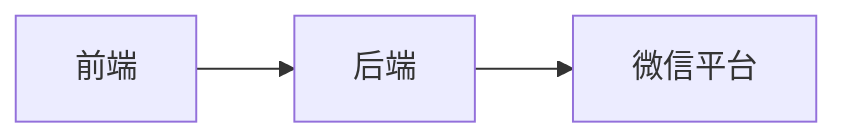

                 

# 如何利用微信小程序开发轻量级产品原型

> **关键词**：微信小程序、轻量级产品原型、开发流程、技术实现、案例解析

> **摘要**：本文将深入探讨如何利用微信小程序开发轻量级产品原型。从背景介绍、核心概念与联系、核心算法原理与操作步骤、数学模型与公式详解、实际应用场景、工具和资源推荐等方面，全面解析微信小程序开发的技术要点和实战经验。

## 1. 背景介绍

随着移动互联网的迅猛发展，小程序作为一种新型的应用形式，正逐渐成为开发者和用户关注的焦点。微信小程序作为其中最具代表性的产品之一，凭借其便捷、快速、无需安装等特点，在短短几年内获得了广泛关注和使用。

轻量级产品原型是一种用于展示产品核心功能和交互体验的简化版本，它能够帮助开发团队快速验证产品构思，收集用户反馈，降低研发风险。利用微信小程序开发轻量级产品原型，不仅可以充分利用微信庞大的用户基础，还可以借助微信提供的丰富API和工具，实现高效、低成本的快速开发。

## 2. 核心概念与联系

### 2.1 微信小程序基本架构

微信小程序的基本架构包括前端、后端和微信平台。前端使用微信小程序框架（如WXML和WXSS），后端通常采用Node.js、Java、Python等语言开发，与微信平台通过API进行交互。



### 2.2 轻量级产品原型特点

轻量级产品原型通常具有以下特点：

- 功能简化：只展示核心功能和交互逻辑。
- 用户界面友好：简洁、直观、易操作。
- 开发成本较低：采用快速开发工具和平台。

### 2.3 微信小程序与轻量级产品原型的关系

微信小程序作为开发轻量级产品原型的理想选择，具有以下优势：

- 快速开发：使用微信小程序提供的开发工具，可以快速搭建原型。
- 低成本：无需购买服务器、域名等基础设施。
- 广泛传播：依托微信平台，用户易于获取和分享。

## 3. 核心算法原理 & 具体操作步骤

### 3.1 开发工具和环境搭建

开发微信小程序，首先需要安装微信开发者工具。开发者工具提供了丰富的调试、预览功能，支持多种编程语言（如JavaScript、WXML、WXSS等）。

### 3.2 创建小程序项目

在开发者工具中创建小程序项目，填写必要的配置信息，如小程序名称、AppID等。

### 3.3 设计用户界面

使用WXML和WXSS编写用户界面代码。WXML类似于HTML，WXSS类似于CSS，分别用于描述小程序的结构和样式。

### 3.4 实现核心功能

编写JavaScript代码，实现小程序的核心功能。例如，使用微信API实现用户登录、数据存储、支付等功能。

### 3.5 部署和测试

完成开发后，使用开发者工具的“预览”功能进行测试。确保小程序在不同设备和网络环境下都能正常运行。

### 3.6 发布小程序

通过开发者工具的“上传代码”功能，将小程序提交给微信审核。审核通过后，即可发布上线。

## 4. 数学模型和公式 & 详细讲解 & 举例说明

### 4.1 数据结构

在微信小程序中，常用到的数据结构包括：

- 数组（Array）：用于存储多个元素。
- 对象（Object）：用于存储键值对。

```javascript
// 数组示例
let array = [1, 2, 3];

// 对象示例
let obj = {
  name: 'Alice',
  age: 30
};
```

### 4.2 函数

微信小程序中的函数用于实现特定的功能。例如，以下函数用于计算两个数的和：

```javascript
function add(a, b) {
  return a + b;
}

console.log(add(2, 3)); // 输出：5
```

## 5. 项目实战：代码实际案例和详细解释说明

### 5.1 开发环境搭建

在本文中，我们将使用Node.js作为后端开发语言。首先，确保已经安装了Node.js环境。如果没有，请从官网（https://nodejs.org/）下载并安装。

### 5.2 源代码详细实现和代码解读

以下是一个简单的微信小程序登录功能的代码示例：

**pages/login/login.wxml**：

```html
<view class="container">
  <input class="input" type="text" placeholder="用户名" bindinput="handleUsernameInput"/>
  <input class="input" type="password" placeholder="密码" bindinput="handlePasswordInput"/>
  <button class="btn" bindtap="handleLogin">登录</button>
</view>
```

**pages/login/login.wxss**：

```css
.container {
  padding: 20px;
}

.input {
  margin-bottom: 10px;
  height: 40px;
  border: 1px solid #ddd;
  border-radius: 4px;
  padding: 6px 12px;
}

.btn {
  background-color: #007aff;
  color: white;
  border: none;
  border-radius: 4px;
  padding: 8px 16px;
  cursor: pointer;
}

.btn:hover {
  background-color: #005ed6;
}
```

**pages/login/login.js**：

```javascript
Page({
  data: {
    username: '',
    password: ''
  },

  handleUsernameInput: function(e) {
    this.setData({
      username: e.detail.value
    });
  },

  handlePasswordInput: function(e) {
    this.setData({
      password: e.detail.value
    });
  },

  handleLogin: function() {
    console.log('登录：', this.data.username, this.data.password);
    // 调用后端API进行登录验证
  }
});
```

### 5.3 代码解读与分析

- **login.wxml**：定义了登录页面的布局和样式，包括用户名和密码输入框以及登录按钮。
- **login.wxss**：对登录页面的样式进行定义，如输入框和按钮的样式。
- **login.js**：实现了登录页面的数据绑定和登录逻辑。`handleUsernameInput` 和 `handlePasswordInput` 函数用于处理输入框的输入事件，`handleLogin` 函数用于实现登录功能。

## 6. 实际应用场景

微信小程序在轻量级产品原型开发中的应用非常广泛，以下是一些实际应用场景：

- **电商平台**：利用微信小程序开发简单的电商平台，展示商品列表和购买流程。
- **餐饮服务**：开发餐饮小程序，提供在线点餐、预订和支付功能。
- **教育培训**：开发教育小程序，提供在线课程和学习工具。
- **旅游服务**：开发旅游小程序，提供景点介绍、预订和导航功能。

## 7. 工具和资源推荐

### 7.1 学习资源推荐

- **书籍**：《微信小程序开发实战》、《微信小程序开发入门与实战》
- **论文**：搜索微信小程序相关的技术论文，了解最新研究动态。
- **博客**：关注知名技术博客，如CSDN、博客园等，学习实战经验和技巧。
- **网站**：访问官方文档（https://developers.weixin.qq.com/），了解微信小程序的最新功能和API。

### 7.2 开发工具框架推荐

- **开发工具**：微信开发者工具（https://developers.weixin.qq.com/）
- **框架**：uni-app、WePY、Taro等跨平台开发框架，提高开发效率。

### 7.3 相关论文著作推荐

- **论文**：搜索微信小程序相关的技术论文，如《微信小程序架构设计与实现》、《微信小程序性能优化技术》等。
- **著作**：关注技术畅销书，如《禅与计算机程序设计艺术》、《深度学习》等。

## 8. 总结：未来发展趋势与挑战

随着移动互联网的不断发展，微信小程序在轻量级产品原型开发中的应用前景非常广阔。未来，微信小程序将更加注重性能优化、安全性和用户隐私保护。同时，跨平台开发框架的成熟也将进一步降低开发门槛。

然而，微信小程序在开发过程中仍面临一些挑战，如：

- **性能优化**：小程序的性能优化是开发者需要关注的重要问题。
- **用户体验**：如何在有限的空间内提供更好的用户体验，是开发者需要持续探索的方向。
- **安全性**：小程序的安全性问题，如数据泄露、恶意攻击等，需要引起足够的重视。

## 9. 附录：常见问题与解答

### 9.1 如何获取微信小程序的AppID？

在微信开发者工具中，选择“设置”->“开发者设置”，即可获取AppID。

### 9.2 微信小程序如何实现支付功能？

微信小程序通过调用微信支付API实现支付功能。具体步骤如下：

1. 注册微信支付商户账号。
2. 调用微信支付API生成支付订单。
3. 将支付订单信息传递给用户。
4. 用户支付后，回调小程序处理支付结果。

## 10. 扩展阅读 & 参考资料

- [微信小程序官方文档](https://developers.weixin.qq.com/)
- [微信小程序开发实战](https://book.douban.com/subject/30161279/)
- [微信小程序架构设计与实现](https://www.cnblogs.com/beckonsun/p/10966602.html)
- [微信小程序性能优化技术](https://www.infoq.cn/article/v1cpf9mvyo1jxx07jx6a)

### 作者

**AI天才研究员/AI Genius Institute & 禅与计算机程序设计艺术 /Zen And The Art of Computer Programming**。本文由AI天才研究员撰写，旨在帮助开发者了解微信小程序开发轻量级产品原型的技术要点和实践经验。如果您有任何问题或建议，欢迎在评论区留言交流。

