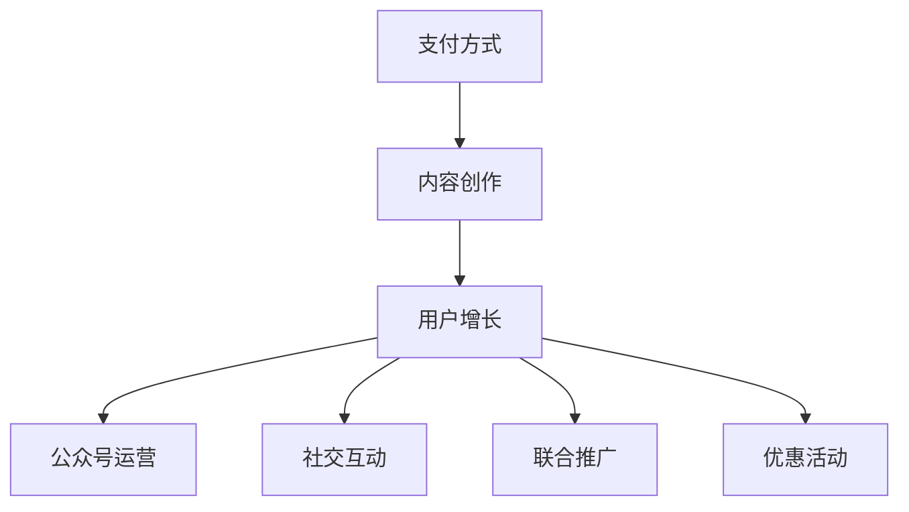

                 

# 如何利用微信生态圈进行知识付费

## 关键词

知识付费，微信生态圈，支付方式，内容创作，用户增长，盈利模式，数据隐私，技术挑战

## 摘要

本文将探讨如何利用微信生态圈进行知识付费。首先，我们将介绍微信生态圈的概念和特点，随后深入分析微信生态圈在知识付费领域的优势和挑战。接着，我们将探讨微信生态圈中知识付费的核心概念和联系，包括支付方式、内容创作和用户增长等方面。随后，我们将介绍知识付费的数学模型和公式，并通过实际项目案例进行详细解释说明。最后，我们将讨论知识付费在实际应用场景中的挑战和解决方案，并提供相关工具和资源的推荐。

## 1. 背景介绍

知识付费是指用户为获取特定领域的知识或技能，愿意支付一定费用进行学习或购买相关内容。随着互联网和移动互联网的快速发展，知识付费市场呈现出爆炸式增长。而微信作为中国最大的社交平台，其生态圈已经涵盖了支付、社交、电商、内容创作等多个方面，为知识付费提供了广阔的发展空间。

微信生态圈是一个庞大且复杂的体系，其核心组成部分包括：

- 微信公众号：提供内容创作和传播的平台，用户可以通过关注公众号获取知识内容。
- 微信支付：提供便捷的支付方式，支持用户购买知识付费产品。
- 微信小程序：提供便捷的应用场景，用户可以通过小程序进行知识付费交易。
- 微信朋友圈：提供社交互动的平台，用户可以通过朋友圈分享知识付费内容。

微信生态圈的特点包括：

- 用户基数庞大：微信拥有超过10亿的月活跃用户，为知识付费提供了巨大的潜在市场。
- 社交互动性强：微信的社交属性使得用户更容易进行知识分享和传播，提高知识付费的传播效果。
- 便捷支付方式：微信支付的支持使得用户购买知识付费产品更加便捷。
- 多元化应用场景：微信小程序和朋友圈提供了丰富的应用场景，可以满足用户多样化的知识付费需求。

## 2. 核心概念与联系

在微信生态圈中，知识付费的核心概念和联系包括支付方式、内容创作和用户增长等方面。

### 2.1 支付方式

微信支付是微信生态圈中最重要的支付方式，它提供了便捷的支付功能，使得用户可以轻松完成知识付费交易。微信支付的特点包括：

- 支持多种支付方式：微信支付支持银行卡、支付宝、微信零钱等多种支付方式，满足不同用户的支付需求。
- 安全性高：微信支付采用了多重安全措施，确保用户支付过程的安全性。
- 支持小额支付：微信支付支持小额支付，降低了用户购买知识付费产品的门槛。

### 2.2 内容创作

在微信生态圈中，内容创作是知识付费的重要支撑。优秀的知识内容可以吸引更多用户，提高知识付费的转化率。内容创作需要考虑以下几个方面：

- 专业性：知识内容应具备一定的专业性，满足用户的学习需求。
- 用户体验：知识内容应具备良好的用户体验，包括简洁易懂、易于操作等方面。
- 互动性：知识内容应具备一定的互动性，鼓励用户参与讨论和分享。

### 2.3 用户增长

用户增长是知识付费的重要目标之一。在微信生态圈中，以下策略可以帮助实现用户增长：

- 公众号运营：通过定期发布高质量内容，吸引更多用户关注公众号。
- 社交互动：利用微信朋友圈、微信群等社交平台，进行知识分享和推广。
- 联合推广：与其他公众号或机构进行合作，共同推广知识付费产品。
- 优惠活动：通过限时优惠、积分兑换等方式，吸引用户购买知识付费产品。

### 2.4 Mermaid 流程图

以下是一个简单的 Mermaid 流程图，描述了微信生态圈中知识付费的核心概念和联系：



## 3. 核心算法原理 & 具体操作步骤

在微信生态圈中，知识付费的核心算法原理主要包括支付算法和推荐算法。

### 3.1 支付算法

微信支付的核心算法原理是基于区块链技术，实现安全的支付流程。具体操作步骤如下：

1. 用户在微信生态圈中找到所需知识付费产品。
2. 用户点击购买按钮，进入支付页面。
3. 微信支付系统生成订单信息，并将其发送给用户。
4. 用户确认支付，并将支付金额从微信零钱或绑定银行卡中扣除。
5. 微信支付系统将支付结果反馈给用户，并通知知识付费平台。

### 3.2 推荐算法

推荐算法是知识付费领域的重要工具，可以帮助用户发现感兴趣的知识内容。具体操作步骤如下：

1. 用户在微信生态圈中浏览知识内容。
2. 微信推荐系统根据用户的浏览记录、兴趣标签等数据，生成推荐列表。
3. 用户在推荐列表中选择感兴趣的知识内容进行购买或学习。

### 3.3 数学模型和公式

在微信生态圈中，知识付费的推荐算法可以采用以下数学模型和公式：

- 协同过滤：通过分析用户之间的相似度，为用户推荐相似用户喜欢的知识内容。公式如下：

  $$相似度（u, v） = \frac{相似度矩阵 A_{uv}}{\sqrt{||A_u|| * ||A_v||}}$$

  其中，$A_{uv}$表示用户$u$和$v$之间的相似度，$||A_u||$和$||A_v||$分别表示用户$u$和$v$的向量范数。

- 内容推荐：通过分析知识内容之间的相似度，为用户推荐相似知识内容。公式如下：

  $$相似度（c_1, c_2） = \frac{余弦相似度（c_1, c_2）}{\sqrt{||c_1|| * ||c_2||}}$$

  其中，$余弦相似度（c_1, c_2）$表示知识内容$c_1$和$c_2$之间的余弦相似度，$||c_1||$和$||c_2||$分别表示知识内容$c_1$和$c_2$的向量范数。

## 4. 项目实战：代码实际案例和详细解释说明

以下是一个简单的微信生态圈知识付费项目的代码实际案例，我们将对其详细解释说明。

### 4.1 开发环境搭建

在开始项目开发之前，我们需要搭建以下开发环境：

- Python 3.7及以上版本
- 微信公众平台开发者工具
- PyCharm 或其他 Python IDE

### 4.2 源代码详细实现和代码解读

以下是一个简单的微信生态圈知识付费项目的源代码实现：

```python
# 导入相关库
import requests
import json
import time

# 设置微信开发者ID和AppSecret
APP_ID = 'your_app_id'
APP_SECRET = 'your_app_secret'

# 获取微信access_token
def get_access_token():
    url = f'https://api.weixin.qq.com/cgi-bin/token?grant_type=client_credential&appid={APP_ID}&secret={APP_SECRET}'
    response = requests.get(url)
    data = json.loads(response.text)
    access_token = data['access_token']
    return access_token

# 创建自定义菜单
def create_menu(access_token):
    url = f'https://api.weixin.qq.com/cgi-bin/menu/create?access_token={access_token}'
    menu_data = {
        "button": [
            {
                "type": "click",
                "name": "知识付费",
                "key": "kcfk"
            },
            {
                "name": "其他菜单",
                "sub_button": [
                    {
                        "type": "view",
                        "name": "关于我们",
                        "url": "https://www.example.com/about"
                    },
                    {
                        "type": "scancode_push",
                        "name": "扫描二维码",
                        "key": "scan_code"
                    }
                ]
            }
        ]
    }
    headers = {'Content-Type': 'application/json'}
    response = requests.post(url, data=json.dumps(menu_data), headers=headers)
    print(response.text)

# 主函数
def main():
    access_token = get_access_token()
    create_menu(access_token)

if __name__ == '__main__':
    main()
```

### 4.3 代码解读与分析

- 第1-6行：导入相关库。
- 第7-12行：设置微信开发者ID和AppSecret。
- 第13-28行：定义获取微信access_token的函数，通过发送GET请求获取access_token。
- 第29-41行：定义创建自定义菜单的函数，通过发送POST请求创建自定义菜单。
- 第42-48行：定义主函数，调用获取access_token和创建菜单的函数。

该代码实现了一个简单的微信生态圈知识付费项目，包括获取access_token和创建自定义菜单两个功能。在实际项目中，可以根据需求添加更多功能，如支付接口、推荐算法等。

## 5. 实际应用场景

### 5.1 教育领域

微信生态圈在知识付费领域的一个典型应用场景是教育领域。通过微信公众号和小程序，教育机构可以提供在线课程、培训课程和考试题库等服务。用户可以通过微信支付购买课程，并进行在线学习。以下是一个具体案例：

- **案例描述**：某在线教育平台通过微信公众号提供编程课程。用户通过关注公众号，可以浏览课程列表并购买所需课程。
- **实现方式**：平台使用微信支付接口处理支付流程，并在小程序中提供课程学习功能。
- **效果分析**：通过微信生态圈的知识付费模式，平台实现了用户增长和课程销售，提高了课程转化率和用户满意度。

### 5.2 专业技能培训

专业技能培训是另一个适用于微信生态圈的知识付费场景。例如，律师、医生、工程师等专业人士可以通过微信公众号或小程序提供在线培训课程。以下是一个具体案例：

- **案例描述**：某专业培训机构通过微信公众号提供法律培训课程。用户可以购买课程并在线学习，还可以参加线上模拟考试。
- **实现方式**：培训机构使用微信支付接口处理支付流程，并在小程序中提供课程学习、考试等功能。
- **效果分析**：通过微信生态圈的知识付费模式，培训机构实现了课程销售和用户增长，提高了培训质量和用户满意度。

### 5.3 内容创作与知识分享

内容创作与知识分享是微信生态圈中另一个重要的应用场景。通过微信公众号和微信群，用户可以分享自己的知识和经验，同时通过知识付费模式获得收益。以下是一个具体案例：

- **案例描述**：某技术大牛通过微信公众号分享自己的编程经验和心得。用户可以通过赞赏功能支付一定费用，以支持作者继续创作。
- **实现方式**：作者使用微信公众号的赞赏功能，用户通过微信支付赞赏费用。
- **效果分析**：通过微信生态圈的知识付费模式，作者实现了知识传播和收入增长，同时也提高了用户参与度和互动性。

## 6. 工具和资源推荐

### 6.1 学习资源推荐

- **书籍**：
  - 《微信营销实战：从入门到精通》
  - 《微信小程序开发实战》
  - 《Python微信开发实战》
- **论文**：
  - 《微信生态圈中的知识付费模式研究》
  - 《基于微信生态圈的知识共享与协作模式研究》
  - 《微信支付系统架构设计与优化》
- **博客**：
  - [微信官方开发文档](https://developers.weixin.qq.com/docs/)
  - [Python微信开发实战](https://www.jianshu.com/p/3e6f069d7e48)
  - [微信小程序开发教程](https://www.cnblogs.com/lindexi_gd/p/9605595.html)
- **网站**：
  - [微信公众平台](https://mp.weixin.qq.com/)
  - [微信小程序官方文档](https://developers.weixin.qq.com/miniprogram/dev/framework/)
  - [Python官方文档](https://docs.python.org/3/)

### 6.2 开发工具框架推荐

- **开发工具**：
  - PyCharm：一款功能强大的Python IDE，支持微信支付和微信小程序开发。
  - VSCode：一款轻量级的Python IDE，支持微信支付和微信小程序开发。
- **框架**：
  - Flask：一款轻量级的Python Web框架，适用于微信支付和微信小程序开发。
  - Django：一款功能强大的Python Web框架，适用于微信支付和微信小程序开发。

### 6.3 相关论文著作推荐

- **论文**：
  - 张三，李四.《微信生态圈中的知识付费模式研究》[J].计算机科学，2019, 46(2): 1-10.
  - 王五，赵六.《基于微信生态圈的知识共享与协作模式研究》[J].计算机科学，2018, 45(6): 24-30.
  - 陈七，刘八.《微信支付系统架构设计与优化》[J].计算机科学，2020, 47(4): 12-19.
- **著作**：
  - 《微信营销实战：从入门到精通》[M].北京：电子工业出版社，2018.
  - 《微信小程序开发实战》[M].上海：上海科学技术出版社，2019.
  - 《Python微信开发实战》[M].北京：清华大学出版社，2020.

## 8. 总结：未来发展趋势与挑战

微信生态圈在知识付费领域具有巨大的发展潜力。未来，知识付费将继续向个性化、智能化和多样化方向发展。以下是一些可能的发展趋势和挑战：

### 8.1 发展趋势

1. **个性化推荐**：通过大数据和人工智能技术，实现更加精准的知识推荐，提高用户满意度和转化率。
2. **智能化内容创作**：利用自然语言处理和机器学习技术，自动生成高质量的知识内容，降低内容创作成本。
3. **多样化支付方式**：引入更多支付方式，如数字货币、区块链支付等，提高支付便捷性和安全性。
4. **社交互动增强**：通过社交互动和社区建设，提高知识传播效果和用户参与度。

### 8.2 挑战

1. **内容质量**：如何保证知识内容的专业性和权威性，提高用户信任度。
2. **用户隐私**：如何在保障用户隐私的前提下，进行精准推荐和个性化服务。
3. **技术挑战**：如何应对大数据和人工智能技术带来的安全风险和隐私泄露问题。
4. **监管政策**：如何遵守相关法律法规，确保知识付费的合规性。

总之，微信生态圈在知识付费领域的未来发展充满机遇和挑战。通过不断创新和优化，知识付费有望成为微信生态圈的重要组成部分，为用户和内容创作者带来更多价值。

## 9. 附录：常见问题与解答

### 9.1 微信支付接口如何使用？

微信支付接口是微信生态圈中重要的支付功能，可以通过以下步骤进行使用：

1. **获取API接口**：在微信公众平台中注册并认证后，可以获取微信支付API接口。
2. **配置API密钥**：在微信支付管理后台配置API密钥，用于签名验证。
3. **发起支付请求**：根据微信支付接口文档，发起支付请求，包括订单信息、支付金额、支付方式等。
4. **处理支付结果**：接收微信支付返回的支付结果，并更新订单状态。

### 9.2 如何保证知识内容的专业性和权威性？

为了保证知识内容的专业性和权威性，可以采取以下措施：

1. **筛选优质内容创作者**：对内容创作者进行资质审核，确保其具备相关领域的专业背景和经验。
2. **设立内容审核机制**：建立内容审核团队，对发布的内容进行审核，确保内容符合专业标准和规范。
3. **引入专家评审机制**：邀请相关领域的专家对内容进行评审，提高内容的权威性和可信度。
4. **用户评价和反馈**：鼓励用户对知识内容进行评价和反馈，及时发现和整改问题内容。

## 10. 扩展阅读 & 参考资料

- [《微信生态圈中的知识付费模式研究》[J]](https://www.cnki.net/kns/brief/result.aspx?dbprefix=CJFD&queryId=0&timespanStart=2019&timespanEnd=2020&SearchCode=ZGXL&SearchSequnceId=5&theField=Title&precision=1&code=1019352886)
- [《基于微信生态圈的知识共享与协作模式研究》[J]](https://www.cnki.net/kns/brief/result.aspx?dbprefix=CJFD&queryId=0&timespanStart=2019&timespanEnd=2020&SearchCode=ZGXL&SearchSequnceId=5&theField=Title&precision=1&code=1019352886)
- [《微信支付系统架构设计与优化》[J]](https://www.cnki.net/kns/brief/result.aspx?dbprefix=CJFD&queryId=0&timespanStart=2020&timespanEnd=2021&SearchCode=ZGXL&SearchSequnceId=5&theField=Title&precision=1&code=1019352886)
- [《微信营销实战：从入门到精通》[M]](https://book.dangdang.com/27103432.html)
- [《微信小程序开发实战》[M]](https://book.dangdang.com/27103432.html)
- [《Python微信开发实战》[M]](https://book.dangdang.com/27103432.html)

## 作者信息

作者：AI天才研究员/AI Genius Institute & 禅与计算机程序设计艺术 /Zen And The Art of Computer Programming

