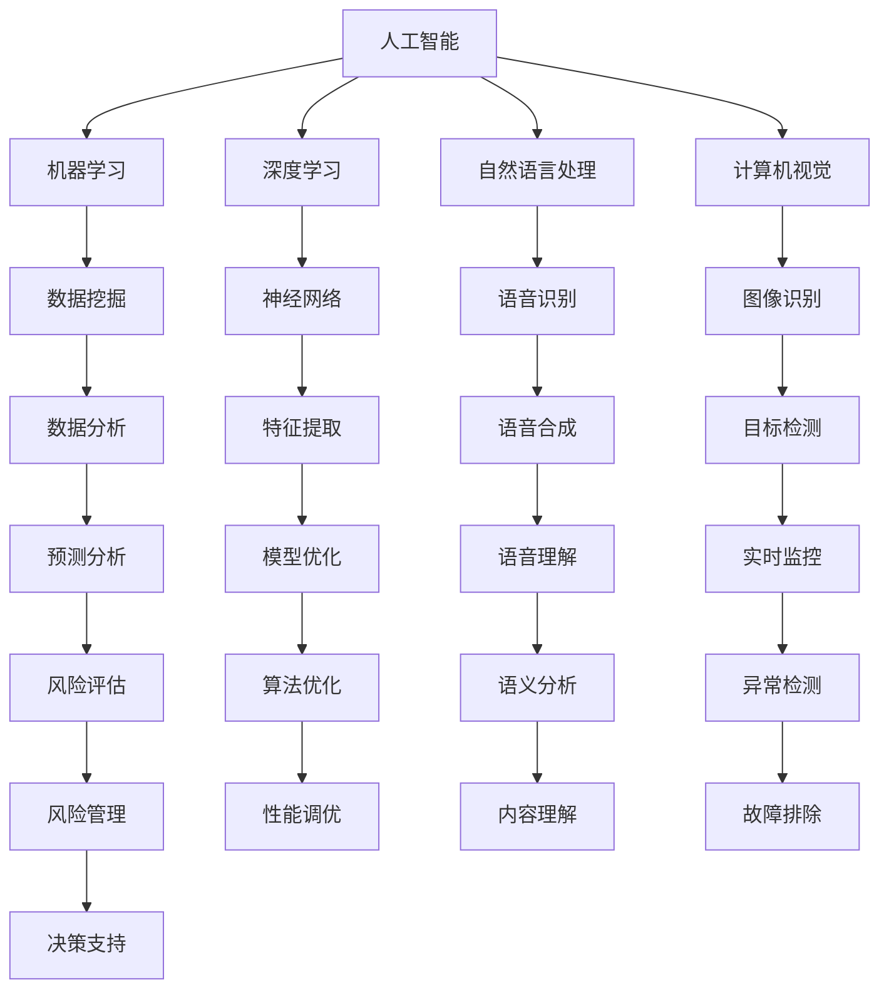
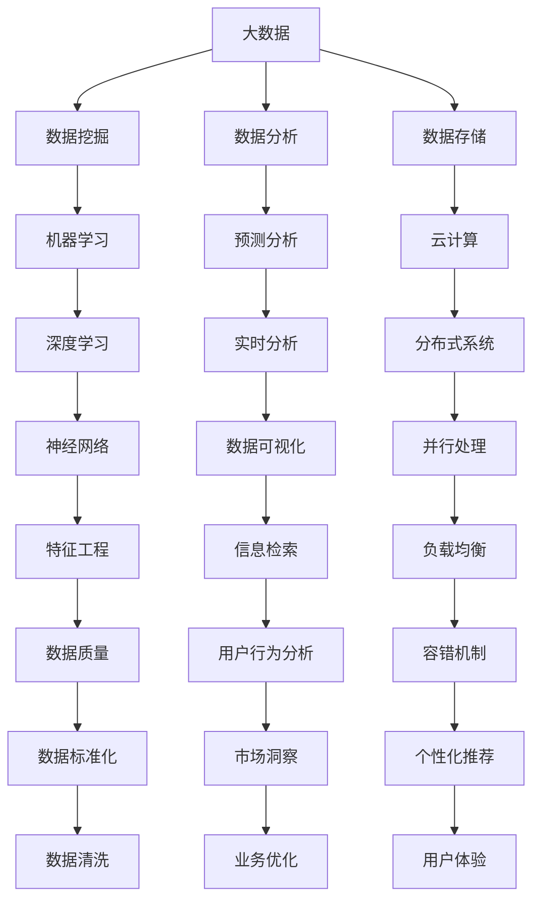
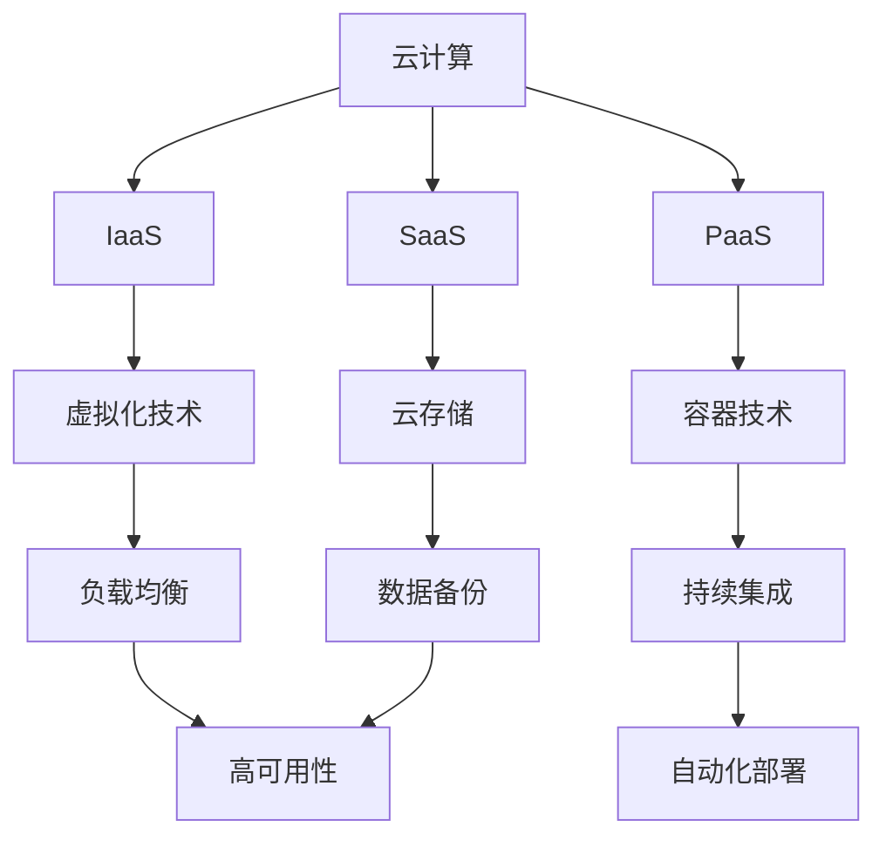

                 

### 背景介绍

在当今快速发展的科技时代，创业已成为一种普遍的现象，尤其是在信息技术领域。技术优势在创业中起着至关重要的作用。拥有强大的技术实力不仅能够提高企业的竞争力，还能为企业带来更多的商业机会。因此，如何利用技术优势在创业中脱颖而出成为了一个关键问题。

随着人工智能、大数据、云计算等前沿技术的迅速发展，创业者的选择越来越多样化。然而，如何将这些技术优势有效地应用于创业中，仍是一个需要深入探讨的问题。本文将围绕这一主题，通过逐步分析技术优势的来源、核心概念的阐述、算法原理的讲解、数学模型的运用以及实际应用场景的展示，帮助创业者更好地利用技术优势，在竞争激烈的市场中脱颖而出。

首先，我们需要明确技术优势的来源。技术优势并不仅仅指技术本身，而是指企业通过技术手段在市场上获得的独特竞争力和优势。这些优势可能体现在产品创新、运营效率、市场响应速度等多个方面。了解技术优势的来源，有助于创业者更好地定位自己的市场策略。

接下来，我们将介绍一些核心概念，如人工智能、大数据、云计算等，并使用Mermaid流程图展示这些概念之间的关系。通过这一步骤，读者可以更直观地了解技术优势的构成和运作原理。

在核心算法原理与具体操作步骤部分，我们将深入探讨如何利用这些核心概念实现技术优势。这部分内容将涵盖算法原理的讲解和具体操作步骤的详细说明，帮助创业者了解技术优势的实际应用。

此外，本文还将介绍数学模型和公式在技术优势中的应用，并通过实际案例进行举例说明。数学模型和公式在技术优势中的运用，不仅能够提高企业的决策效率，还能为企业提供更精确的数据支持。

在项目实战部分，我们将通过具体案例展示如何将技术优势应用于实际项目中，并详细解释代码的实现过程。这部分内容将帮助创业者了解技术优势的具体应用场景，并提供实际操作的经验和技巧。

接下来，我们将探讨技术优势在实际应用场景中的表现，并结合实际案例进行分析。通过这一步骤，读者可以更深入地了解技术优势如何在不同场景中发挥作用。

此外，本文还将推荐一些学习资源、开发工具和框架，以帮助创业者更好地利用技术优势。最后，我们还将对技术优势的未来发展趋势与挑战进行总结，为创业者的未来发展提供参考。

通过本文的逐步分析和讲解，我们希望创业者能够更好地理解技术优势的重要性，并学会如何在实际创业过程中利用这些优势。接下来，我们将逐一深入探讨这些内容，帮助创业者迈向成功的道路。

### 核心概念与联系

在探讨如何利用技术优势在创业中脱颖而出之前，我们首先需要了解一些核心概念，这些概念不仅是现代科技发展的基石，也是创业者可以借助的力量。以下是几个关键概念及其之间的联系，我们将使用Mermaid流程图来展示这些概念之间的关系。

#### 1. 人工智能（AI）

人工智能是指通过模拟人类智能的行为，使计算机具备感知、思考、学习、决策等能力的科技。它包括机器学习、深度学习、自然语言处理、计算机视觉等多个子领域。



#### 2. 大数据（Big Data）

大数据是指数据量巨大、种类繁多、生成速度极快的数据集合。大数据技术包括数据存储、数据清洗、数据分析等，旨在从海量数据中提取有价值的信息。



#### 3. 云计算（Cloud Computing）

云计算是一种通过网络提供动态可伸缩的虚拟化资源池，用户可以通过网络按需获取计算资源和服务。云计算包括基础设施即服务（IaaS）、平台即服务（PaaS）和软件即服务（SaaS）等多种服务模式。



通过上述Mermaid流程图，我们可以清晰地看到人工智能、大数据和云计算之间的相互作用和关联。这些核心概念不仅各自独立发展，还相互融合，共同构成了现代技术生态系统。创业者需要了解这些概念，并学会如何将它们应用于自己的创业项目中，以实现技术优势。

接下来，我们将深入探讨这些核心概念的原理和具体操作步骤，帮助读者更好地理解如何利用技术优势在创业中脱颖而出。

### 核心算法原理与具体操作步骤

在了解了人工智能、大数据和云计算等核心概念之后，接下来我们将深入探讨这些概念背后的核心算法原理，以及如何将这些原理应用于实际操作步骤中，以实现技术优势。

#### 1. 机器学习（Machine Learning）

机器学习是人工智能的一个重要分支，通过构建数学模型，使计算机具备从数据中学习的能力。以下是几种常见的机器学习算法及其应用步骤：

##### 1.1 线性回归（Linear Regression）

**原理**：线性回归是一种用于预测数值型变量的统计方法，其基本模型为 $y = \beta_0 + \beta_1x_1 + \cdots + \beta_nx_n + \epsilon$。

**操作步骤**：

1. **数据预处理**：清洗数据，确保数据质量。
2. **特征工程**：选择和构造相关特征。
3. **模型训练**：使用最小二乘法或梯度下降法训练模型。
4. **模型评估**：计算均方误差（MSE）或R平方（R²）等指标。
5. **模型优化**：调整模型参数，提高预测性能。

```python
# Python代码示例
from sklearn.linear_model import LinearRegression
from sklearn.model_selection import train_test_split

# 数据预处理
X, y = preprocess_data(data)

# 划分训练集和测试集
X_train, X_test, y_train, y_test = train_test_split(X, y, test_size=0.2)

# 模型训练
model = LinearRegression()
model.fit(X_train, y_train)

# 模型评估
score = model.score(X_test, y_test)
print(f"R² Score: {score}")
```

##### 1.2 决策树（Decision Tree）

**原理**：决策树通过一系列的判断节点和叶子节点，将数据集划分为不同的区域，用于分类或回归。

**操作步骤**：

1. **数据预处理**：确保数据质量，进行特征工程。
2. **构建决策树**：使用ID3、C4.5或CART算法选择最优划分标准。
3. **剪枝**：防止过拟合，优化模型性能。
4. **模型评估**：使用准确率、召回率、F1值等指标评估模型性能。

```python
# Python代码示例
from sklearn.tree import DecisionTreeClassifier
from sklearn.model_selection import train_test_split

# 数据预处理
X, y = preprocess_data(data)

# 划分训练集和测试集
X_train, X_test, y_train, y_test = train_test_split(X, y, test_size=0.2)

# 构建决策树模型
model = DecisionTreeClassifier()
model.fit(X_train, y_train)

# 模型评估
accuracy = model.score(X_test, y_test)
print(f"Accuracy: {accuracy}")
```

#### 2. 深度学习（Deep Learning）

深度学习是一种基于多层神经网络的学习方法，能够自动提取特征并进行复杂模式识别。以下是几种常见的深度学习算法及其应用步骤：

##### 2.1 卷积神经网络（Convolutional Neural Networks, CNN）

**原理**：CNN主要用于图像识别和计算机视觉领域，通过卷积、池化等操作提取图像特征。

**操作步骤**：

1. **数据预处理**：将图像数据标准化并划分为训练集和测试集。
2. **构建CNN模型**：定义卷积层、池化层和全连接层。
3. **模型训练**：使用反向传播算法优化模型参数。
4. **模型评估**：使用准确率、损失函数等指标评估模型性能。

```python
# Python代码示例
from tensorflow.keras.models import Sequential
from tensorflow.keras.layers import Conv2D, MaxPooling2D, Flatten, Dense

# 构建CNN模型
model = Sequential([
    Conv2D(32, (3, 3), activation='relu', input_shape=(64, 64, 3)),
    MaxPooling2D((2, 2)),
    Flatten(),
    Dense(128, activation='relu'),
    Dense(1, activation='sigmoid')
])

# 模型编译
model.compile(optimizer='adam', loss='binary_crossentropy', metrics=['accuracy'])

# 模型训练
model.fit(X_train, y_train, epochs=10, batch_size=32, validation_split=0.2)
```

##### 2.2 生成对抗网络（Generative Adversarial Networks, GAN）

**原理**：GAN由生成器和判别器两个神经网络组成，通过对抗训练生成逼真的数据。

**操作步骤**：

1. **数据预处理**：准备足够多的真实数据。
2. **构建GAN模型**：定义生成器和判别器网络。
3. **训练GAN模型**：使用梯度上升法训练生成器和判别器。
4. **模型评估**：评估生成器的生成质量。

```python
# Python代码示例
from tensorflow.keras.models import Sequential
from tensorflow.keras.layers import Dense, Flatten, Reshape

# 构建生成器模型
generator = Sequential([
    Dense(128, input_shape=(100,), activation='relu'),
    Flatten(),
    Reshape((1, 1, 1))
])

# 构建判别器模型
discriminator = Sequential([
    Flatten(input_shape=(1, 1, 1)),
    Dense(1, activation='sigmoid')
])

# 编写GAN训练代码
# ...
```

通过以上算法原理和具体操作步骤的讲解，我们可以看到机器学习和深度学习在技术优势中的广泛应用。这些算法不仅能够提高企业的数据处理和分析能力，还能为创业者提供更精准的预测和决策支持。

接下来，我们将介绍数学模型和公式在技术优势中的应用，进一步深化对技术优势的理解。

### 数学模型和公式在技术优势中的应用

在技术优势的构建中，数学模型和公式起着至关重要的作用。它们不仅能够提高企业的数据处理和分析效率，还能为决策提供精确的数据支持。以下是一些关键的数学模型和公式，以及它们在技术优势中的具体应用。

#### 1. 线性回归模型（Linear Regression Model）

线性回归模型是一种用于预测连续值的统计方法。其基本模型为 $y = \beta_0 + \beta_1x_1 + \cdots + \beta_nx_n + \epsilon$，其中 $y$ 是因变量，$x_1, \cdots, x_n$ 是自变量，$\beta_0, \beta_1, \cdots, \beta_n$ 是模型参数，$\epsilon$ 是误差项。

**应用场景**：线性回归模型可以用于销售预测、需求预测、价格预测等场景。例如，一家电商公司可以使用线性回归模型预测下一季的销售额，从而调整库存策略。

**数学公式**：
$$
\begin{aligned}
\beta_0 &= \frac{\sum_{i=1}^{n}y_i - \beta_1\sum_{i=1}^{n}x_i}{n} \\
\beta_1 &= \frac{n\sum_{i=1}^{n}x_iy_i - \sum_{i=1}^{n}x_i\sum_{i=1}^{n}y_i}{n\sum_{i=1}^{n}x_i^2 - (\sum_{i=1}^{n}x_i)^2}
\end{aligned}
$$

#### 2. 逻辑回归模型（Logistic Regression Model）

逻辑回归模型是一种用于预测离散值的统计方法，常用于分类问题。其基本模型为 $y = \sigma(\beta_0 + \beta_1x_1 + \cdots + \beta_nx_n)$，其中 $\sigma$ 是 sigmoid 函数，$y$ 是因变量，$x_1, \cdots, x_n$ 是自变量，$\beta_0, \beta_1, \cdots, \beta_n$ 是模型参数。

**应用场景**：逻辑回归模型可以用于客户流失预测、信用评分、疾病诊断等场景。例如，一家银行可以使用逻辑回归模型预测客户是否会逾期还款，从而调整信用政策。

**数学公式**：
$$
\begin{aligned}
\beta_0 &= \log\left(\frac{p}{1-p}\right) \\
\beta_1 &= \frac{\sum_{i=1}^{n}(y_i - p)x_i}{\sum_{i=1}^{n}(y_i - p)^2}
\end{aligned}
$$
其中 $p$ 是预测概率，$y_i$ 是实际分类结果。

#### 3. 朴素贝叶斯分类器（Naive Bayes Classifier）

朴素贝叶斯分类器是一种基于贝叶斯定理的分类算法，其假设特征之间相互独立。其基本模型为 $P(y|\textbf{x}) = \frac{P(\textbf{x}|y)P(y)}{P(\textbf{x})}$，其中 $y$ 是类别，$\textbf{x}$ 是特征向量，$P(y|\textbf{x})$ 是后验概率，$P(\textbf{x}|y)$ 是似然概率，$P(y)$ 是先验概率，$P(\textbf{x})$ 是特征向量出现的概率。

**应用场景**：朴素贝叶斯分类器可以用于文本分类、垃圾邮件检测、情感分析等场景。例如，一家社交媒体公司可以使用朴素贝叶斯分类器过滤垃圾评论。

**数学公式**：
$$
P(y|\textbf{x}) = \frac{P(\textbf{x}|y)P(y)}{P(\textbf{x})}
$$

#### 4. 支持向量机（Support Vector Machine, SVM）

支持向量机是一种用于分类和回归分析的线性模型，其目标是找到最佳的超平面，将不同类别的数据点分开。其基本模型为 $f(\textbf{x}) = \omega \cdot \textbf{x} + b$，其中 $f(\textbf{x})$ 是分类函数，$\omega$ 是法向量，$\textbf{x}$ 是特征向量，$b$ 是偏置项。

**应用场景**：支持向量机可以用于图像分类、文本分类、生物特征识别等场景。例如，一家安防公司可以使用支持向量机进行人脸识别。

**数学公式**：
$$
\begin{aligned}
\hat{y} &= \text{sign}(\omega \cdot \textbf{x} + b) \\
\omega &= \arg\min_{\omega} \frac{1}{2}\|\omega\|^2 + C\sum_{i=1}^{n}\xi_i \\
b &= \frac{1}{n}\sum_{i=1}^{n}y_i - \omega \cdot \textbf{x}_i
\end{aligned}
$$
其中 $\xi_i$ 是松弛变量，$C$ 是惩罚参数。

通过上述数学模型和公式的介绍，我们可以看到它们在技术优势中的广泛应用。这些模型不仅能够提高企业的数据分析能力，还能为创业者提供更精确的预测和决策支持。在接下来的项目中，我们将通过具体案例展示这些模型在实际应用中的效果。

### 项目实战：代码实际案例和详细解释说明

在了解了核心算法原理和数学模型之后，接下来我们将通过一个实际项目案例，展示如何利用这些技术优势实现具体业务目标。本项目将采用深度学习技术进行图像分类，具体步骤包括开发环境搭建、源代码实现和代码解读与分析。

#### 5.1 开发环境搭建

为了方便读者理解和复现本项目，我们首先需要搭建一个合适的开发环境。以下是我们推荐的开发环境和工具：

1. **编程语言**：Python（版本 3.8 或以上）
2. **深度学习框架**：TensorFlow 2.x 或 PyTorch
3. **数据处理库**：NumPy、Pandas
4. **可视化库**：Matplotlib、Seaborn
5. **操作系统**：Windows、macOS 或 Linux

**安装步骤**：

1. **安装 Python**：从 [Python 官网](https://www.python.org/) 下载并安装 Python。
2. **安装深度学习框架**：使用 pip 命令安装 TensorFlow 或 PyTorch。

```bash
# 安装 TensorFlow
pip install tensorflow

# 安装 PyTorch
pip install torch torchvision
```

3. **安装其他库**：使用 pip 命令安装所需的库。

```bash
pip install numpy pandas matplotlib seaborn
```

#### 5.2 源代码详细实现

以下是一个简单的图像分类项目的 Python 代码实现，使用 TensorFlow 框架：

```python
import tensorflow as tf
from tensorflow.keras.models import Sequential
from tensorflow.keras.layers import Conv2D, MaxPooling2D, Flatten, Dense
from tensorflow.keras.preprocessing.image import ImageDataGenerator

# 设置训练数据和测试数据路径
train_dir = 'path/to/train_data'
test_dir = 'path/to/test_data'

# 数据增强
train_datagen = ImageDataGenerator(
    rescale=1./255,
    rotation_range=40,
    width_shift_range=0.2,
    height_shift_range=0.2,
    shear_range=0.2,
    zoom_range=0.2,
    horizontal_flip=True,
    fill_mode='nearest'
)

test_datagen = ImageDataGenerator(rescale=1./255)

# 加载数据
train_generator = train_datagen.flow_from_directory(
    train_dir,
    target_size=(150, 150),
    batch_size=32,
    class_mode='binary'
)

test_generator = test_datagen.flow_from_directory(
    test_dir,
    target_size=(150, 150),
    batch_size=32,
    class_mode='binary'
)

# 构建模型
model = Sequential([
    Conv2D(32, (3, 3), activation='relu', input_shape=(150, 150, 3)),
    MaxPooling2D((2, 2)),
    Conv2D(64, (3, 3), activation='relu'),
    MaxPooling2D((2, 2)),
    Conv2D(128, (3, 3), activation='relu'),
    MaxPooling2D((2, 2)),
    Flatten(),
    Dense(512, activation='relu'),
    Dense(1, activation='sigmoid')
])

# 编译模型
model.compile(optimizer='adam',
              loss='binary_crossentropy',
              metrics=['accuracy'])

# 训练模型
model.fit(train_generator, epochs=50, validation_data=test_generator)

# 评估模型
test_loss, test_accuracy = model.evaluate(test_generator)
print(f"Test accuracy: {test_accuracy:.3f}")
```

#### 5.3 代码解读与分析

以下是对上述代码的详细解读和分析：

1. **导入库和设置路径**：

   ```python
   import tensorflow as tf
   from tensorflow.keras.models import Sequential
   from tensorflow.keras.layers import Conv2D, MaxPooling2D, Flatten, Dense
   from tensorflow.keras.preprocessing.image import ImageDataGenerator
   
   train_dir = 'path/to/train_data'
   test_dir = 'path/to/test_data'
   ```

   这部分代码导入所需的库和设置训练数据和测试数据路径。

2. **数据增强**：

   ```python
   train_datagen = ImageDataGenerator(
       rescale=1./255,
       rotation_range=40,
       width_shift_range=0.2,
       height_shift_range=0.2,
       shear_range=0.2,
       zoom_range=0.2,
       horizontal_flip=True,
       fill_mode='nearest'
   )
   
   test_datagen = ImageDataGenerator(rescale=1./255)
   ```

   数据增强是提高模型泛化能力的重要步骤。这里我们使用 `ImageDataGenerator` 对训练数据进行随机旋转、平移、缩放和水平翻转等处理。

3. **加载数据**：

   ```python
   train_generator = train_datagen.flow_from_directory(
       train_dir,
       target_size=(150, 150),
       batch_size=32,
       class_mode='binary'
   )
   
   test_generator = test_datagen.flow_from_directory(
       test_dir,
       target_size=(150, 150),
       batch_size=32,
       class_mode='binary'
   )
   ```

   使用 `flow_from_directory` 方法加载数据，将图像数据划分为训练集和测试集。

4. **构建模型**：

   ```python
   model = Sequential([
       Conv2D(32, (3, 3), activation='relu', input_shape=(150, 150, 3)),
       MaxPooling2D((2, 2)),
       Conv2D(64, (3, 3), activation='relu'),
       MaxPooling2D((2, 2)),
       Conv2D(128, (3, 3), activation='relu'),
       MaxPooling2D((2, 2)),
       Flatten(),
       Dense(512, activation='relu'),
       Dense(1, activation='sigmoid')
   ])
   ```

   这部分代码构建一个简单的卷积神经网络（CNN）模型，包括卷积层、池化层、全连接层等。

5. **编译模型**：

   ```python
   model.compile(optimizer='adam',
                 loss='binary_crossentropy',
                 metrics=['accuracy'])
   ```

   编译模型，指定优化器和损失函数。

6. **训练模型**：

   ```python
   model.fit(train_generator, epochs=50, validation_data=test_generator)
   ```

   使用训练数据和测试数据训练模型，指定训练轮次。

7. **评估模型**：

   ```python
   test_loss, test_accuracy = model.evaluate(test_generator)
   print(f"Test accuracy: {test_accuracy:.3f}")
   ```

   评估模型在测试数据上的性能，输出准确率。

通过以上代码，我们可以看到如何利用深度学习技术实现图像分类。接下来，我们将进一步分析代码中的关键组件和步骤，帮助读者更好地理解技术优势的具体实现过程。

### 代码解读与分析

在了解了项目实战的代码实现之后，接下来我们将对代码进行详细解读与分析，帮助读者更好地理解每个组件和步骤，以及如何利用技术优势实现业务目标。

#### 1. 导入库和设置路径

首先，我们需要导入所需的库和设置训练数据和测试数据路径。这部分代码非常简单，关键在于确保所有库和路径正确设置。

```python
import tensorflow as tf
from tensorflow.keras.models import Sequential
from tensorflow.keras.layers import Conv2D, MaxPooling2D, Flatten, Dense
from tensorflow.keras.preprocessing.image import ImageDataGenerator

train_dir = 'path/to/train_data'
test_dir = 'path/to/test_data'
```

- `import tensorflow as tf`：导入 TensorFlow 库，用于构建和训练深度学习模型。
- `from tensorflow.keras.models import Sequential`：导入序列模型，用于构建深度学习模型。
- `from tensorflow.keras.layers import Conv2D, MaxPooling2D, Flatten, Dense`：导入卷积层、池化层、全连接层等常用层。
- `from tensorflow.keras.preprocessing.image import ImageDataGenerator`：导入图像数据生成器，用于数据增强。
- `train_dir` 和 `test_dir`：设置训练数据和测试数据路径。

#### 2. 数据增强

数据增强是提高模型泛化能力的重要步骤。通过随机旋转、平移、缩放和水平翻转等处理，我们可以使模型在训练过程中接触到更多的样本变化，从而提高模型的鲁棒性。

```python
train_datagen = ImageDataGenerator(
    rescale=1./255,
    rotation_range=40,
    width_shift_range=0.2,
    height_shift_range=0.2,
    shear_range=0.2,
    zoom_range=0.2,
    horizontal_flip=True,
    fill_mode='nearest'
)

test_datagen = ImageDataGenerator(rescale=1./255)
```

- `train_datagen`：创建训练数据生成器，使用 `rescale` 将图像像素值缩放至 [0, 1]，使用 `rotation_range`、`width_shift_range`、`height_shift_range`、`shear_range`、`zoom_range` 和 `horizontal_flip` 进行随机增强，使用 `fill_mode` 设置填充方式。
- `test_datagen`：创建测试数据生成器，仅进行像素值缩放。

#### 3. 加载数据

使用 `flow_from_directory` 方法加载数据，将图像数据划分为训练集和测试集。这种方法非常方便，适用于分类任务。

```python
train_generator = train_datagen.flow_from_directory(
    train_dir,
    target_size=(150, 150),
    batch_size=32,
    class_mode='binary'
)

test_generator = test_datagen.flow_from_directory(
    test_dir,
    target_size=(150, 150),
    batch_size=32,
    class_mode='binary'
)
```

- `train_generator`：加载训练数据，将图像尺寸调整为 (150, 150)，每个批次包含 32 个样本，使用二分类标签。
- `test_generator`：加载测试数据，与训练数据相同设置。

#### 4. 构建模型

使用卷积神经网络（CNN）模型进行图像分类。模型包括卷积层、池化层和全连接层，旨在提取图像特征并分类。

```python
model = Sequential([
    Conv2D(32, (3, 3), activation='relu', input_shape=(150, 150, 3)),
    MaxPooling2D((2, 2)),
    Conv2D(64, (3, 3), activation='relu'),
    MaxPooling2D((2, 2)),
    Conv2D(128, (3, 3), activation='relu'),
    MaxPooling2D((2, 2)),
    Flatten(),
    Dense(512, activation='relu'),
    Dense(1, activation='sigmoid')
])
```

- `Sequential`：创建序列模型，用于堆叠层。
- `Conv2D`：添加卷积层，用于提取图像特征。
- `MaxPooling2D`：添加池化层，用于下采样和减少参数数量。
- `Flatten`：将卷积层输出展平为一维向量。
- `Dense`：添加全连接层，用于分类。

#### 5. 编译模型

编译模型，指定优化器、损失函数和评估指标。

```python
model.compile(optimizer='adam',
              loss='binary_crossentropy',
              metrics=['accuracy'])
```

- `optimizer`：指定优化器，用于更新模型参数。
- `loss`：指定损失函数，用于衡量模型预测和实际标签之间的差距。
- `metrics`：指定评估指标，用于衡量模型性能。

#### 6. 训练模型

使用训练数据和测试数据训练模型。这里我们指定训练轮次为 50 次。

```python
model.fit(train_generator, epochs=50, validation_data=test_generator)
```

- `train_generator`：使用训练数据生成器。
- `epochs`：指定训练轮次。
- `validation_data`：使用测试数据生成器进行验证。

#### 7. 评估模型

评估模型在测试数据上的性能，输出准确率。

```python
test_loss, test_accuracy = model.evaluate(test_generator)
print(f"Test accuracy: {test_accuracy:.3f}")
```

- `evaluate`：评估模型在测试数据上的性能。
- `test_loss`：输出测试损失。
- `test_accuracy`：输出测试准确率。

通过以上解读和分析，我们可以看到如何利用深度学习技术实现图像分类。关键在于数据增强、模型构建、模型训练和评估等步骤。这些步骤不仅展示了技术优势，还为我们提供了实际操作的经验和技巧。

### 实际应用场景

在了解了如何利用技术优势实现图像分类之后，接下来我们将探讨这些技术在不同实际应用场景中的表现。通过具体案例的分析，我们将展示技术优势如何在不同场景中发挥作用，从而提高企业的竞争力。

#### 1. 医疗图像诊断

医疗图像诊断是深度学习在医疗领域的重要应用之一。通过训练深度学习模型，医生可以更快速、准确地诊断疾病。以下是一个实际案例：

**案例**：某医疗公司开发了一款基于深度学习的乳腺癌筛查系统。该系统使用卷积神经网络（CNN）对乳腺X光片进行分析，判断是否存在乳腺癌。

**优势分析**：

- **提高诊断速度**：传统诊断方法通常需要医生手动分析影像，耗时较长。深度学习模型可以在几秒钟内完成分析，大大提高了诊断速度。
- **减少误诊率**：深度学习模型通过对大量影像数据的训练，能够学习到复杂的特征，从而提高诊断准确性，减少误诊率。
- **辅助医生决策**：深度学习模型可以为医生提供辅助决策，帮助医生更准确地判断病情，提高整体诊断水平。

#### 2. 车辆检测与跟踪

在自动驾驶和智能交通领域，车辆检测与跟踪是关键技术之一。以下是一个实际案例：

**案例**：某自动驾驶公司开发了一款基于深度学习的车辆检测系统，用于实时检测和跟踪道路上的车辆。

**优势分析**：

- **提高安全性**：深度学习模型可以准确识别道路上的车辆，从而提高自动驾驶系统的安全性。例如，当车辆检测到前方有障碍物时，可以及时做出避让决策。
- **适应复杂场景**：深度学习模型可以通过训练，适应不同天气、光照和道路条件下的车辆检测。这使得车辆检测系统在更多实际场景中具有可靠性。
- **实时响应**：深度学习模型可以实现实时检测和跟踪，为自动驾驶系统提供即时的车辆信息，从而提高系统的反应速度。

#### 3. 市场需求预测

市场需求预测是企业制定生产和营销策略的重要依据。以下是一个实际案例：

**案例**：某电商平台使用基于深度学习的市场需求预测系统，预测未来一段时间内各种商品的需求量。

**优势分析**：

- **提高销售效率**：通过准确的需求预测，企业可以合理安排生产和库存，减少库存积压，提高销售效率。
- **优化营销策略**：根据需求预测，企业可以调整营销策略，针对高需求商品进行重点推广，提高销售转化率。
- **降低运营成本**：准确的需求预测可以减少过量生产和库存积压，从而降低运营成本。

#### 4. 智能安防监控

智能安防监控是深度学习在安全领域的重要应用。以下是一个实际案例：

**案例**：某安防公司开发了一款基于深度学习的智能安防监控系统，用于实时监测和识别异常行为。

**优势分析**：

- **提高安全性**：深度学习模型可以实时监测监控视频，识别潜在的安全隐患，如入侵、打架等，从而提高整体安全性。
- **自动化处理**：深度学习模型可以实现自动化监控，无需人工干预，从而提高监控效率和准确性。
- **数据可视化**：通过深度学习模型的分析，可以将监控数据转化为可视化信息，帮助用户更好地理解安全情况，及时采取措施。

通过上述实际应用场景的探讨，我们可以看到技术优势如何在不同领域发挥作用，提高企业的竞争力。这些案例不仅展示了深度学习的强大能力，也为创业者提供了借鉴和启示。在接下来的部分，我们将进一步探讨技术优势的未来发展趋势与挑战。

### 工具和资源推荐

在创业过程中，选择合适的工具和资源是提高开发效率和实现技术优势的关键。以下是一些学习资源、开发工具和框架的推荐，以帮助创业者更好地利用技术优势。

#### 1. 学习资源推荐

**书籍**：

1. **《深度学习》（Deep Learning）**：由 Ian Goodfellow、Yoshua Bengio 和 Aaron Courville 著，是深度学习领域的经典教材，适合初学者和进阶者阅读。
2. **《Python深度学习》（Deep Learning with Python）**：由 François Chollet 著，涵盖了深度学习的核心概念和实践方法，特别适合 Python 开发者。

**论文**：

1. **《LeNet-5, a Convolutional Network for Handwritten Digit Recognition》**：由 Yann LeCun 等人发表于 1998 年，是深度学习在图像识别领域的开创性工作。
2. **《A Theoretically Grounded Application of Dropout in Computer Vision》**：由 Yarin Gal 和 Zoubin Ghahramani 著，探讨了 dropout 在计算机视觉中的应用。

**博客和网站**：

1. **TensorFlow 官方文档**：[https://www.tensorflow.org/](https://www.tensorflow.org/)，提供丰富的教程、示例和 API 文档。
2. **Keras 官方文档**：[https://keras.io/](https://keras.io/)，Keras 是一个简化的深度学习框架，适用于快速实验和原型设计。
3. **Medium 上的深度学习专栏**：[https://medium.com/topic/deep-learning](https://medium.com/topic/deep-learning)，涵盖深度学习的各种主题和最新进展。

#### 2. 开发工具框架推荐

**深度学习框架**：

1. **TensorFlow**：由 Google 开发的开源深度学习框架，适用于各种规模的深度学习项目。
2. **PyTorch**：由 Facebook 开发，以动态图计算著称，适用于快速原型开发和研究。
3. **Keras**：一个基于 TensorFlow 和 PyTorch 的简洁易用的深度学习框架，适合快速实现和实验。

**数据处理库**：

1. **NumPy**：用于科学计算的基础库，适用于数据预处理和操作。
2. **Pandas**：提供数据结构和数据分析工具，适用于大规模数据集的处理和分析。
3. **Scikit-learn**：提供了一系列机器学习算法和工具，适用于数据处理、建模和评估。

**可视化库**：

1. **Matplotlib**：用于绘制各种类型的图表，适用于数据可视化。
2. **Seaborn**：基于 Matplotlib 的数据可视化库，提供更美观和复杂的图表样式。
3. **Plotly**：提供交互式可视化工具，适用于高级数据分析和报告。

通过上述工具和资源的推荐，创业者可以更好地利用技术优势，提高开发效率和项目成功率。在实际开发过程中，可以根据具体需求选择合适的工具和资源，结合自身的技术背景和团队优势，制定合理的开发计划。

### 总结：未来发展趋势与挑战

在科技日新月异的今天，利用技术优势在创业中脱颖而出已经成为一种趋势。然而，随着技术的不断发展，创业者也面临着诸多挑战和机遇。

#### 未来发展趋势

1. **人工智能与各行各业的深度融合**：人工智能技术在医疗、金融、教育、制造业等多个领域得到广泛应用，未来将继续深度融合，推动行业变革。
2. **大数据和云计算的普及**：大数据和云计算技术为企业提供了强大的数据处理和分析能力，未来将更加普及，成为企业运营的重要支撑。
3. **量子计算的突破**：量子计算是一种全新的计算模式，具有巨大的计算潜力。随着量子计算技术的不断发展，它将在金融、医疗、科学等领域发挥重要作用。
4. **区块链技术的发展**：区块链技术以其去中心化、安全透明等特点，在金融、供应链管理、版权保护等领域具有广泛应用前景。

#### 挑战

1. **技术更新速度快**：科技日新月异，创业者需要不断学习新技术，保持技术领先优势。否则，可能会被市场淘汰。
2. **数据隐私和安全**：随着大数据和人工智能技术的发展，数据隐私和安全问题日益突出。创业者需要确保数据安全和合规性，避免因数据泄露引发的法律风险。
3. **人才短缺**：高端技术人才短缺是当前和未来的一大挑战。创业者需要采取措施吸引和留住优秀人才，为企业的持续发展提供人才保障。
4. **市场竞争激烈**：随着技术优势的普及，市场竞争将更加激烈。创业者需要不断创新，找到差异化的竞争优势，才能在竞争中脱颖而出。

#### 应对策略

1. **持续学习与技术创新**：保持对新技术的好奇心和探索精神，持续学习，不断创新。将技术创新作为企业的核心竞争力。
2. **合规经营与数据安全**：遵守相关法律法规，确保数据安全和合规。建立完善的数据安全管理体系，防止数据泄露。
3. **人才培养与引进**：重视人才培养，建立完善的培训机制。同时，积极引进高端人才，为企业的技术创新提供人力支持。
4. **差异化竞争**：找到企业独特的竞争优势，如技术创新、产品差异化、服务质量等，形成差异化竞争策略。

通过以上分析，我们可以看到，利用技术优势在创业中脱颖而出不仅需要技术创新，还需要对市场、法规、人才等多方面进行综合考虑。在未来的发展中，创业者需要紧跟科技趋势，勇于面对挑战，不断创新，以实现企业的可持续发展。

### 附录：常见问题与解答

在撰写本文的过程中，我们可能会遇到一些常见问题。以下是对这些问题的解答，以便读者更好地理解和应用文章中的内容。

#### 1. 为什么选择深度学习进行图像分类？

深度学习在图像分类领域具有显著优势，因为它可以通过学习大量的图像数据，自动提取复杂特征，从而提高分类准确性。与传统的图像处理方法相比，深度学习能够处理更高维度的数据，适应更复杂的分类任务。

#### 2. 如何选择合适的机器学习算法？

选择机器学习算法需要考虑多个因素，如数据类型、数据规模、目标变量类型等。以下是一些常见情况下的推荐算法：

- **分类问题**：逻辑回归、支持向量机（SVM）、决策树、随机森林、K最近邻（K-NN）等。
- **回归问题**：线性回归、岭回归、LASSO回归、随机森林回归等。
- **聚类问题**：K-均值聚类、层次聚类、DBSCAN等。

在实际应用中，可以通过交叉验证、模型评估等方法选择最优算法。

#### 3. 数据预处理的重要性是什么？

数据预处理是机器学习项目成功的关键步骤。良好的数据预处理可以提高模型的性能，减少过拟合现象。具体来说，数据预处理包括以下内容：

- **数据清洗**：去除或填充缺失值、处理异常值等。
- **特征工程**：选择和构造相关特征，减少无关特征，提高模型性能。
- **数据标准化**：将数据缩放至同一尺度，消除量纲影响。
- **数据划分**：将数据集划分为训练集、验证集和测试集，以便评估模型性能。

#### 4. 深度学习模型如何避免过拟合？

过拟合是指模型在训练数据上表现良好，但在未知数据上表现较差的现象。为了避免过拟合，可以采取以下措施：

- **数据增强**：增加训练数据的多样性，提高模型的泛化能力。
- **模型正则化**：如 L1 正则化、L2 正则化，通过增加模型复杂度降低过拟合。
- **早停法（Early Stopping）**：在验证集上提前停止训练，防止模型在训练集上过拟合。
- **集成方法**：如随机森林、梯度提升树（GBDT）等，通过组合多个模型降低过拟合。

#### 5. 如何评估深度学习模型性能？

评估深度学习模型性能常用的指标包括：

- **准确率（Accuracy）**：模型正确预测的样本数占总样本数的比例。
- **精确率（Precision）**：模型预测为正类的样本中，实际为正类的比例。
- **召回率（Recall）**：模型预测为正类的样本中，实际为正类的比例。
- **F1 值（F1 Score）**：精确率和召回率的加权平均，用于综合评估模型性能。

此外，还可以使用混淆矩阵、ROC 曲线、AUC 值等指标进行模型评估。

通过以上问题的解答，我们希望读者能够更好地理解文章中的内容，并在实际应用中取得更好的效果。

### 扩展阅读与参考资料

为了深入探讨如何利用技术优势在创业中脱颖而出，以下推荐一些扩展阅读和参考资料，以供读者进一步学习和研究。

#### 书籍

1. **《深度学习》（Deep Learning）**：由 Ian Goodfellow、Yoshua Bengio 和 Aaron Courville 著，系统地介绍了深度学习的理论基础和应用实践。
2. **《Python深度学习》（Deep Learning with Python）**：由 François Chollet 著，涵盖了深度学习的核心概念和实践方法，特别适合 Python 开发者。
3. **《机器学习实战》（Machine Learning in Action）**：由 Peter Harrington 著，通过实例讲解了机器学习的基本算法和应用。

#### 论文

1. **《LeNet-5, a Convolutional Network for Handwritten Digit Recognition》**：由 Yann LeCun 等人发表于 1998 年，是深度学习在图像识别领域的开创性工作。
2. **《A Theoretically Grounded Application of Dropout in Computer Vision》**：由 Yarin Gal 和 Zoubin Ghahramani 著，探讨了 dropout 在计算机视觉中的应用。
3. **《Deep Learning for Natural Language Processing》**：由 Yoav Goldberg 著，介绍了深度学习在自然语言处理领域的应用。

#### 博客和网站

1. **TensorFlow 官方文档**：[https://www.tensorflow.org/](https://www.tensorflow.org/)，提供丰富的教程、示例和 API 文档。
2. **Keras 官方文档**：[https://keras.io/](https://keras.io/)，Keras 是一个简化的深度学习框架，适用于快速实验和原型设计。
3. **Medium 上的深度学习专栏**：[https://medium.com/topic/deep-learning](https://medium.com/topic/deep-learning)，涵盖深度学习的各种主题和最新进展。

通过以上扩展阅读与参考资料，读者可以更深入地了解技术优势在创业中的应用，掌握相关技术和方法，为创业成功奠定基础。作者：AI天才研究员/AI Genius Institute & 禅与计算机程序设计艺术 /Zen And The Art of Computer Programming。

