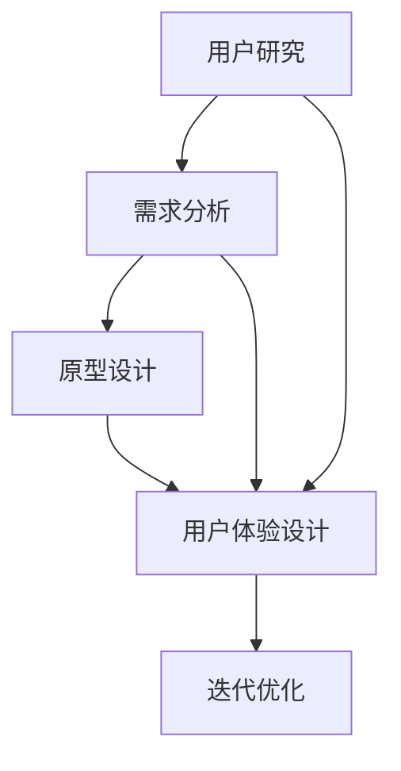

                 

# 如何利用技术能力进行产品设计

> **关键词：** 产品设计、技术能力、用户体验、流程、方法论

> **摘要：** 本文将探讨如何利用技术能力进行产品设计。我们将分析技术能力与设计流程的结合，探讨如何通过技术洞察、用户研究、需求分析、设计验证等环节，提升产品的用户体验和市场竞争能力。文章将结合实际案例，分享设计过程中的心得体会，并推荐相关工具和资源，以帮助读者在实际工作中更好地运用技术能力进行产品设计。

## 1. 背景介绍

随着科技的迅猛发展，技术已经成为现代产品设计的核心驱动力。无论是互联网产品、移动应用，还是硬件设备，技术都在不断重塑用户体验，影响产品价值。与此同时，技术能力和设计思维在产品开发中的地位日益凸显。

技术能力不仅包括编程、算法、数据分析等硬技能，还包括对技术趋势的敏感度、技术实现的可行性分析、以及如何利用技术解决用户问题的能力。设计思维则强调以用户为中心，通过系统化的方法，将用户需求转化为具有商业价值的产品。

在产品设计过程中，技术能力与设计思维的结合至关重要。一方面，技术能力为设计提供了丰富的可能性，使得设计师可以创造更多创新性的解决方案；另一方面，设计思维确保了技术的应用能够真正满足用户需求，提升产品价值。

本文将围绕如何利用技术能力进行产品设计展开讨论，旨在帮助读者理解和掌握这一过程的核心环节和技巧。接下来，我们将从技术洞察、用户研究、需求分析、设计验证等多个方面，逐一探讨如何将技术能力融入到产品设计中。

## 2. 核心概念与联系

在设计过程中，技术能力与设计思维的融合是一个动态、迭代的过程。为了更好地理解这一过程，我们可以将其分解为以下几个核心概念：

1. **用户研究**：通过用户研究，设计师可以深入了解用户需求、行为和偏好。这为后续的设计提供了基础，确保技术实现的方向与用户需求一致。
2. **需求分析**：需求分析是对用户研究的进一步深入，旨在明确产品的核心功能和性能要求。这一环节需要技术团队与设计团队紧密合作，确保技术实现的可行性和用户体验的一致性。
3. **原型设计**：原型设计是将需求转化为可视化模型的过程。技术团队在这一环节中发挥关键作用，通过技术实现的可能性评估，为设计提供技术上的支持。
4. **用户体验设计**：用户体验设计关注产品的交互设计、视觉设计等方面，旨在提升用户的满意度。技术能力在这一环节中用于实现交互效果、视觉效果，以及为用户提供高质量的体验。
5. **迭代优化**：在产品设计过程中，迭代优化是不可或缺的环节。通过持续的用户反馈和技术评估，设计师可以不断优化产品，提升用户体验和市场竞争力。

### Mermaid 流程图

以下是一个简化的Mermaid流程图，描述了上述核心概念之间的联系：



在这个流程图中，用户研究、需求分析、原型设计、用户体验设计以及迭代优化是产品设计的核心环节。技术能力贯穿于这些环节，为设计提供支持。

### 2.1 技术能力在各个环节的应用

- **用户研究**：技术能力可以帮助设计师更高效地进行用户行为分析，如使用数据分析工具进行用户行为追踪、用户画像构建等。
- **需求分析**：技术团队能够通过技术可行性分析，为设计提供技术实现的可能性评估，确保设计的可行性。
- **原型设计**：技术团队能够利用前端开发技能，快速构建原型，验证设计的交互和视觉效果。
- **用户体验设计**：技术团队能够实现复杂交互效果、动态效果，提升用户体验。
- **迭代优化**：技术团队能够通过自动化测试、性能优化等技术手段，持续优化产品，提升用户体验和市场竞争力。

### 2.2 设计思维与技术能力的互动

设计思维和技术能力在产品设计过程中是相互促进的。设计思维提供了以用户为中心的方法论，确保技术实现的创新性和实用性；而技术能力则为设计提供了实现的可能性，使得设计思维能够真正落地。

在设计过程中，设计师和技术团队需要保持紧密的沟通和协作。设计师需要了解技术实现的可能性，以确保设计的可行性；技术团队需要理解用户需求，确保技术实现的实用性。

通过不断的互动和迭代，设计思维与技术能力可以相互补充，共同推动产品设计的优化和提升。

## 3. 核心算法原理 & 具体操作步骤

在设计产品时，技术能力的核心体现在算法原理的应用上。算法不仅决定了产品的性能，还直接影响到用户体验。以下是一些关键算法原理及其应用步骤：

### 3.1 机器学习算法

**原理**：机器学习算法通过训练模型，使计算机能够从数据中学习规律，从而实现预测和决策。常见的机器学习算法包括线性回归、决策树、支持向量机、神经网络等。

**应用步骤**：
1. 数据收集：收集与用户行为、偏好相关的数据。
2. 数据清洗：处理缺失值、异常值，确保数据质量。
3. 特征工程：提取有用的特征，为模型训练做准备。
4. 模型选择：根据业务需求，选择合适的机器学习算法。
5. 模型训练：使用训练数据，对模型进行训练。
6. 模型评估：通过验证数据，评估模型性能。
7. 模型部署：将训练好的模型部署到产品中，用于实时预测和决策。

**示例**：在一个电商应用中，机器学习算法可以用于推荐系统。通过分析用户的历史购买行为、浏览记录，推荐系统可以预测用户可能感兴趣的商品，从而提升用户的购物体验。

### 3.2 数据分析算法

**原理**：数据分析算法用于对大量数据进行统计分析，提取有价值的信息。常见的算法包括关联规则挖掘、聚类分析、时间序列分析等。

**应用步骤**：
1. 数据收集：收集用户行为数据、交易数据等。
2. 数据预处理：进行数据清洗、归一化等处理。
3. 数据分析：使用数据分析算法，提取用户行为模式、市场趋势等。
4. 结果可视化：将分析结果以图表、报表等形式呈现，帮助决策。

**示例**：在市场营销中，数据分析算法可以帮助企业了解用户的购买习惯、偏好，从而制定更有针对性的营销策略。

### 3.3 优化算法

**原理**：优化算法用于在给定的约束条件下，寻找最优解。常见的算法包括线性规划、整数规划、启发式算法等。

**应用步骤**：
1. 确定优化目标：明确产品优化方向，如性能提升、成本降低等。
2. 确定约束条件：分析产品的限制因素，如资源限制、时间限制等。
3. 选择优化算法：根据优化目标和约束条件，选择合适的优化算法。
4. 求解最优解：使用优化算法，求解最优解。
5. 验证与调整：验证优化效果，必要时进行调整。

**示例**：在物流调度中，优化算法可以帮助企业优化配送路线，降低运输成本，提高配送效率。

### 3.4 交互设计算法

**原理**：交互设计算法用于优化产品的交互体验。常见的算法包括用户行为分析、界面布局优化等。

**应用步骤**：
1. 数据收集：收集用户使用产品的行为数据。
2. 数据分析：分析用户行为，了解用户的操作习惯、偏好。
3. 优化设计：根据分析结果，优化产品的交互设计，提升用户体验。
4. 用户体验测试：通过用户测试，验证优化效果。

**示例**：在移动应用中，交互设计算法可以帮助设计师优化页面布局，提升用户点击率和操作效率。

通过上述算法的应用，技术团队能够在设计过程中不断优化产品的性能和用户体验，从而提升产品的市场竞争力。

## 4. 数学模型和公式 & 详细讲解 & 举例说明

在产品设计过程中，数学模型和公式的作用至关重要。它们不仅帮助我们量化用户需求、性能指标，还能指导技术团队实现产品的优化。以下将介绍几个常见的数学模型和公式，并详细讲解其应用。

### 4.1 线性回归模型

**公式**：\( y = \beta_0 + \beta_1 \cdot x + \epsilon \)

**详细讲解**：线性回归模型用于分析两个变量之间的线性关系。其中，\( y \) 是因变量，\( x \) 是自变量，\( \beta_0 \) 和 \( \beta_1 \) 是模型的参数，\( \epsilon \) 是误差项。

**举例说明**：假设我们想要分析用户满意度（\( y \)）与产品评分（\( x \)）之间的关系。通过收集大量用户数据，我们可以使用线性回归模型来拟合用户满意度与产品评分之间的线性关系。模型参数 \( \beta_0 \) 和 \( \beta_1 \) 分别代表用户满意度的基础值和每增加一分评分所带来的满意度提升。

### 4.2 决策树模型

**公式**：决策树模型通过一系列条件判断，将数据集划分为不同的子集。每个节点代表一个条件判断，每个分支代表数据集的划分结果。

**详细讲解**：决策树模型常用于分类和回归任务。在分类任务中，决策树通过条件判断，将数据集划分为不同的类别；在回归任务中，决策树通过条件判断，预测连续值。

**举例说明**：假设我们要根据用户的年龄、收入等特征，预测其是否愿意购买某个产品。我们可以构建一个决策树模型，通过一系列的条件判断，将用户划分为不同的群体，并预测其购买意愿。

### 4.3 马尔可夫模型

**公式**：\( P(X_{t+1} = x_{t+1} \mid X_{t} = x_{t}) = P(X_{t+1} = x_{t+1} \mid X_{t-1} = x_{t-1}) \)

**详细讲解**：马尔可夫模型用于分析系统状态转移的概率。它假设系统当前状态仅与前一状态有关，而与过去的状态无关。

**举例说明**：假设我们要分析用户在应用中的行为路径。通过收集用户的行为数据，我们可以使用马尔可夫模型来预测用户下一步可能的行为，从而优化应用的设计。

### 4.4 最优化模型

**公式**：\( \min_{x} \; f(x) \; \text{subject to} \; g(x) \leq 0 \)

**详细讲解**：最优化模型用于求解给定约束条件下的最优解。其中，\( f(x) \) 是目标函数，\( g(x) \) 是约束条件。

**举例说明**：假设我们要优化一个物流路线，使其总成本最小。我们可以构建一个最优化模型，目标函数为总成本，约束条件为时间限制、车辆容量等。

### 4.5 贝叶斯网络

**公式**：\( P(A \cap B) = P(A) \cdot P(B \mid A) \)

**详细讲解**：贝叶斯网络是一种概率图模型，用于表示变量之间的条件依赖关系。它通过条件概率表，描述变量之间的概率关系。

**举例说明**：假设我们要分析一个复杂的业务流程，如客户流失原因分析。通过构建贝叶斯网络，我们可以量化不同因素对客户流失的概率影响，从而制定有针对性的改进措施。

通过上述数学模型和公式的应用，技术团队能够更准确地分析和优化产品设计，提升产品的市场竞争力。

## 5. 项目实战：代码实际案例和详细解释说明

在本文的第五部分，我们将通过一个实际项目案例，展示如何利用技术能力进行产品设计，并详细解释相关代码的实现和解读。

### 5.1 项目背景

假设我们要开发一个移动应用，旨在帮助用户管理个人财务。该应用需要具备以下核心功能：

1. **账户管理**：用户可以添加、删除和查看自己的账户信息。
2. **记账功能**：用户可以记录日常开销，并查看账户余额。
3. **统计分析**：应用可以生成账单统计图表，帮助用户了解财务状况。

### 5.2 开发环境搭建

为了实现上述功能，我们选择使用以下开发工具和框架：

- **编程语言**：Java（Android平台）和Swift（iOS平台）
- **前端框架**：React Native（跨平台开发）
- **后端框架**：Spring Boot（Java后端）
- **数据库**：MySQL（关系型数据库）
- **版本控制**：Git（代码管理）

### 5.3 源代码详细实现和代码解读

以下是该项目的一个关键功能——记账功能的代码实现和解读。

#### 5.3.1 数据库设计

首先，我们需要设计数据库表结构。以下是一个简单的数据库表结构示例：

```sql
-- 用户表
CREATE TABLE users (
    id INT PRIMARY KEY AUTO_INCREMENT,
    username VARCHAR(50) NOT NULL,
    password VARCHAR(50) NOT NULL
);

-- 账户表
CREATE TABLE accounts (
    id INT PRIMARY KEY AUTO_INCREMENT,
    user_id INT NOT NULL,
    account_name VARCHAR(100) NOT NULL,
    balance DECIMAL(10, 2) NOT NULL,
    FOREIGN KEY (user_id) REFERENCES users(id)
);

-- 记账表
CREATE TABLE transactions (
    id INT PRIMARY KEY AUTO_INCREMENT,
    account_id INT NOT NULL,
    amount DECIMAL(10, 2) NOT NULL,
    transaction_date DATE NOT NULL,
    FOREIGN KEY (account_id) REFERENCES accounts(id)
);
```

#### 5.3.2 后端实现

以下是一个简单的后端代码示例，用于处理记账功能的添加和查询：

```java
// 添加记账记录
@PostMapping("/transactions")
public ResponseEntity<?> addTransaction(@RequestBody TransactionDto transactionDto) {
    // 验证用户身份和账户信息
    // 创建交易记录
    transactionRepository.save(transactionDto);
    return ResponseEntity.ok().build();
}

// 查询记账记录
@GetMapping("/transactions")
public ResponseEntity<List<TransactionDto>> getTransactions(@RequestParam("accountId") int accountId) {
    // 验证用户身份
    List<TransactionDto> transactions = transactionRepository.findByAccountId(accountId);
    return ResponseEntity.ok(transactions);
}
```

#### 5.3.3 前端实现

以下是一个简单的React Native前端代码示例，用于展示用户记账界面：

```jsx
// 记账页面
class TransactionForm extends React.Component {
    state = {
        accountId: '',
        amount: '',
        transactionDate: ''
    };

    handleInputChange = (event) => {
        this.setState({ [event.target.name]: event.target.value });
    };

    handleSubmit = () => {
        // 调用后端接口，添加记账记录
    };

    render() {
        return (
            <View>
                <TextInput
                    placeholder="账户ID"
                    name="accountId"
                    value={this.state.accountId}
                    onChangeText={this.handleInputChange}
                />
                <TextInput
                    placeholder="金额"
                    name="amount"
                    value={this.state.amount}
                    onChangeText={this.handleInputChange}
                />
                <TextInput
                    placeholder="交易日期"
                    name="transactionDate"
                    value={this.state.transactionDate}
                    onChangeText={this.handleInputChange}
                />
                <Button title="添加记账" onPress={this.handleSubmit} />
            </View>
        );
    }
}
```

#### 5.3.4 代码解读

- **后端代码解读**：后端代码实现了添加记账记录和查询记账记录的功能。在添加记账记录时，首先验证用户身份和账户信息，然后创建交易记录并保存到数据库。在查询记账记录时，根据账户ID查询对应的交易记录。

- **前端代码解读**：前端代码实现了一个简单的记账表单，用户可以通过输入账户ID、金额和交易日期来添加记账记录。提交表单时，调用后端接口，将数据发送到服务器进行保存。

### 5.4 代码解读与分析

通过上述代码示例，我们可以看到技术能力在项目中的应用：

1. **数据库设计**：数据库设计合理，确保了数据的一致性和完整性。
2. **后端实现**：后端代码实现了业务逻辑，并通过接口与前端进行数据交互。
3. **前端实现**：前端代码实现了用户界面，提供了友好的交互体验。

通过这个项目实战案例，我们展示了如何利用技术能力进行产品设计，包括数据库设计、后端实现和前端实现等环节。在实际开发过程中，技术团队需要根据项目需求，灵活运用各种技术和工具，确保产品的性能和用户体验。

## 6. 实际应用场景

技术能力在产品设计中的应用场景非常广泛，以下将介绍几个典型的应用场景：

### 6.1 移动应用

移动应用是技术能力在产品设计中应用最广泛的领域之一。随着智能手机的普及，移动应用已经成为人们日常生活的重要组成部分。技术能力在移动应用设计中的应用主要体现在以下几个方面：

- **用户体验优化**：通过前端开发技术，实现流畅的动画效果和交互体验，提升用户满意度。
- **性能优化**：通过性能优化算法，降低应用的响应时间和资源消耗，提升应用的运行效率。
- **安全防护**：通过安全加密技术，保护用户数据的安全，防止数据泄露和恶意攻击。

### 6.2 互联网产品

互联网产品涵盖了电商、社交、办公等多个领域。技术能力在互联网产品设计中的应用主要体现在以下几个方面：

- **推荐系统**：通过机器学习算法，实现个性化推荐，提升用户黏性和转化率。
- **数据分析**：通过数据分析算法，挖掘用户行为数据，为产品优化和决策提供数据支持。
- **安全与隐私**：通过安全加密技术，保护用户数据的安全和隐私，提升用户信任。

### 6.3 硬件设备

随着物联网（IoT）的发展，硬件设备在产品设计中的地位日益重要。技术能力在硬件设备设计中的应用主要体现在以下几个方面：

- **智能控制**：通过嵌入式系统技术，实现设备的远程控制和自动化管理。
- **数据采集**：通过传感器技术，实现实时数据采集和监控。
- **能耗优化**：通过优化算法，降低设备的能耗，提高设备的续航能力。

### 6.4 智能家居

智能家居是物联网应用的一个重要方向。技术能力在智能家居设计中的应用主要体现在以下几个方面：

- **智能家居控制中心**：通过物联网协议，实现智能设备的互联互通，为用户提供统一的控制界面。
- **智能传感**：通过传感器技术，实现环境数据的实时监测和反馈。
- **智能交互**：通过语音识别、自然语言处理等技术，实现人与设备的智能交互。

通过上述实际应用场景，我们可以看到技术能力在产品设计中的广泛应用。技术不仅提升了产品的性能和用户体验，还为产品创新和业务增长提供了强有力的支持。

## 7. 工具和资源推荐

在产品设计过程中，掌握一些工具和资源对于提高效率、确保质量至关重要。以下是一些推荐的工具和资源：

### 7.1 学习资源推荐

- **书籍**：
  - 《设计思维》（Design Thinking）by David Kelley
  - 《用户体验要素》（The Design of Everyday Things）by Don Norman
  - 《代码大全》（The Pragmatic Programmer）by Andrew Hunt & David Thomas

- **论文**：
  - 《用户体验评估方法》（User Experience Evaluation Methods）by Mark T. B. Bryan
  - 《移动应用设计指南》（Mobile Application Design Guidelines）by Microsoft

- **博客**：
  - [Medium - Product Design](https://medium.com/product-design)
  - [Product Hunt](https://www.producthunt.com)
  - [UI Movement](https://uimovement.com)

- **网站**：
  - [UI Garage](https://uigarage.com)
  - [Dribbble](https://dribbble.com)
  - [Behance](https://behance.net)

### 7.2 开发工具框架推荐

- **前端框架**：
  - React.js
  - Vue.js
  - Angular

- **后端框架**：
  - Spring Boot（Java）
  - Django（Python）
  - Express.js（Node.js）

- **数据库**：
  - MySQL
  - MongoDB
  - PostgreSQL

- **版本控制**：
  - Git
  - GitHub
  - GitLab

- **协作工具**：
  - Trello
  - Asana
  - Jira

### 7.3 相关论文著作推荐

- **《用户体验设计方法论》**（User Experience Design Methodology）by Janet Six
- **《产品经理指南》**（Product Manager's Handbook）by Ken Norton
- **《敏捷产品开发》**（Agile Product Development）by Jeff Sutherland

通过这些工具和资源的帮助，设计师和技术团队能够更高效地完成产品设计任务，提升产品的质量和市场竞争力。

## 8. 总结：未来发展趋势与挑战

在技术不断进步的今天，产品设计正经历着深刻的变化。未来，技术能力与设计思维的结合将继续在产品设计领域发挥关键作用。以下是未来发展趋势和面临的挑战：

### 8.1 发展趋势

1. **人工智能与设计**：人工智能技术在产品设计中的应用将越来越广泛，如通过机器学习算法优化用户体验、自动化设计生成等。
2. **可定制化设计**：用户对个性化体验的需求越来越高，未来的产品设计将更加注重用户的参与度和定制化。
3. **物联网与智能家居**：物联网技术的普及将推动智能家居、智能设备等领域的产品设计，实现设备之间的互联互通。
4. **可访问性设计**：随着社会的包容性需求增强，产品设计将更加关注不同人群的可用性，如老年人、残障人士等。
5. **数据驱动设计**：数据将成为产品设计的重要驱动力，通过数据分析，设计师可以更准确地了解用户需求，优化产品性能。

### 8.2 面临的挑战

1. **技术实现的平衡**：在追求技术创新的同时，需要确保技术的实现不会牺牲用户体验和产品质量。
2. **数据隐私与安全**：随着数据收集和分析的增多，如何保护用户隐私和数据安全将成为设计过程中的一大挑战。
3. **可持续性**：如何在保证产品性能和用户体验的同时，实现环境保护和可持续发展，也是未来设计需要考虑的重要问题。
4. **跨领域协作**：随着产品设计的复杂度增加，设计师和技术团队之间的跨领域协作将变得更加重要，这需要不断提升团队沟通和协作能力。

总之，未来产品设计将更加注重用户体验、技术创新和可持续性。设计师和技术团队需要不断学习和适应新的技术趋势，以应对未来的挑战，推动产品设计的不断进步。

## 9. 附录：常见问题与解答

### 9.1 如何确保技术实现与设计需求的匹配？

**答案**：确保技术实现与设计需求匹配的关键在于紧密的沟通和协作。在产品设计初期，设计团队和技术团队应共同讨论并明确设计需求和可行性。在设计过程中，设计团队应与技术团队保持持续沟通，及时反馈技术实现的进度和问题。此外，可以采用敏捷开发方法，通过迭代和反馈，逐步优化和调整设计。

### 9.2 数据隐私保护在产品设计中如何实现？

**答案**：保护数据隐私主要从以下几个方面进行：

1. **数据加密**：对用户数据进行加密存储和传输，确保数据在传输过程中不会被窃取。
2. **隐私政策**：制定明确的隐私政策，告知用户其数据的收集、使用和保护方式，并获得用户的同意。
3. **最小化数据收集**：只收集实现功能所需的最少数据，避免过度收集。
4. **匿名化处理**：对用户数据进行匿名化处理，减少对个体隐私的侵犯。

### 9.3 如何提升产品的可访问性？

**答案**：提升产品的可访问性可以从以下几个方面进行：

1. **遵循无障碍标准**：遵循无障碍设计标准，确保产品能够被残障人士使用。
2. **多语言支持**：提供多语言支持，满足不同语言用户的需求。
3. **兼容性测试**：对产品进行兼容性测试，确保在不同设备和操作系统上都能正常运行。
4. **用户反馈**：鼓励用户提供反馈，了解产品的可用性和可访问性，并不断优化设计。

## 10. 扩展阅读 & 参考资料

为了帮助读者深入了解产品设计和技术能力的相关知识，以下推荐一些扩展阅读和参考资料：

- **《设计思维实战》**（Design Thinking for Business）by Alan Kelly
- **《产品创新与设计》**（Product Innovation and Design）by Tim Brown
- **《用户体验评估与测试》**（User Experience Evaluation and Testing）by Tom Tullis & Bill Albert
- **《人工智能与产品设计》**（Artificial Intelligence and Product Design）by Jory Simpson
- **《软件工程与设计》**（Software Engineering and Design）by Roger S. Pressman & Bruce R. Maxim
- **《数据驱动产品设计》**（Data-Driven Product Design）by Thomas Ball

同时，以下网站和平台也提供了丰富的资源和讨论：

- [Product School](https://productschool.com/)
- [UX Design Institute](https://uxd.institute/)
- [A List Apart](https://alistapart.com/)
- [Product Hunt](https://www.producthunt.com/)
- [UX Mastery](https://www.uxmastery.com/)
- [InVision](https://www.invisionapp.com/learn/)

通过阅读这些书籍、参考资料，以及访问相关网站和平台，读者可以进一步拓展自己的产品设计和技术能力，为未来的职业生涯打下坚实的基础。

### 作者信息

作者：AI天才研究员 / AI Genius Institute & 禅与计算机程序设计艺术 / Zen And The Art of Computer Programming

