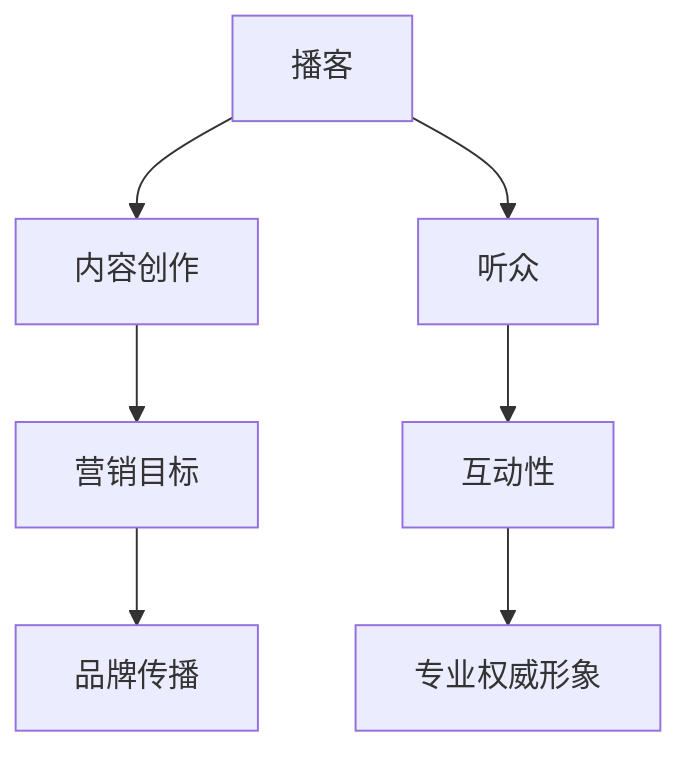

                 

### 背景介绍

**播客营销（Podcast Marketing）的定义与历史**

播客营销，又称播客推广，是指通过制作和发布音频节目，与听众进行互动，以达到营销目的的一种方式。这种营销形式起源于2000年代初期，随着互联网和移动设备的发展而逐渐兴起。播客营销之所以受到企业青睐，主要是因为它具有以下几个显著优势：

1. **高度的参与性**：播客节目允许听众随时收听，且可以在不受时间和地点限制的情况下参与。
2. **丰富的内容形式**：相比传统的文字或视频内容，音频更容易让人在忙碌的生活中获取信息。
3. **深度交流**：播客节目通常以对话或讲解的形式，与听众进行更加深入的交流。

**专业权威形象的建立**

在信息技术领域，专业权威形象是一个企业或个人在市场中占据领先地位的重要因素。它不仅能提高品牌知名度，还能增强用户对产品或服务的信任度。建立专业权威形象的方法多种多样，而播客营销是一种非常有效的手段。以下是其几个关键点：

1. **内容专业性**：通过分享高质量的技术内容，展示您在特定领域的专业知识和见解。
2. **受众互动**：与听众建立良好的互动关系，回答他们的疑问，增加可信度。
3. **持续输出**：定期发布高质量的播客内容，持续传递专业价值，树立专家形象。

**目的与结构**

本文旨在探讨如何利用播客营销来建立专业权威形象。文章结构如下：

1. **核心概念与联系**：介绍播客营销相关的核心概念，并使用Mermaid流程图展示其架构。
2. **核心算法原理与操作步骤**：详细讲解播客营销的原理和具体实施步骤。
3. **数学模型和公式**：介绍相关的数学模型和公式，并进行详细讲解。
4. **项目实战**：提供实际代码案例，进行详细解读和分析。
5. **实际应用场景**：分析播客营销在不同领域的应用场景。
6. **工具和资源推荐**：推荐相关学习资源和开发工具。
7. **总结与未来趋势**：总结全文，并提出未来发展趋势与挑战。

通过以上内容，我们将逐步揭示如何利用播客营销在信息技术领域建立专业权威形象。接下来，我们将详细探讨播客营销的核心概念与联系，帮助读者更好地理解这一策略。

---

## 2. 核心概念与联系

在深入探讨如何利用播客营销建立专业权威形象之前，我们需要明确几个核心概念，并了解它们之间的相互联系。以下是对这些核心概念及其相互关系的介绍，并使用Mermaid流程图进行可视化展示。

### 2.1 播客营销相关概念

1. **播客（Podcast）**：播客是一种通过互联网发布的音频内容，通常以一系列连续的音频文件形式存在。它允许听众按需收听，内容覆盖各种主题，如新闻、教育、娱乐和商业。

2. **听众（Audience）**：听众是播客节目的接收者，他们通过订阅或搜索来收听内容。听众是播客营销的关键，他们的参与度和反馈直接关系到播客的成败。

3. **内容创作（Content Creation）**：内容创作是指制作播客节目所需的各种活动，包括脚本撰写、录音、编辑和发布。

4. **营销目标（Marketing Goals）**：营销目标是播客营销过程中想要实现的具体结果，如增加品牌知名度、吸引潜在客户或提高用户参与度。

### 2.2 播客营销与专业权威形象的关系

1. **内容专业性**：专业权威形象的核心在于内容的专业性。通过制作和分享高质量、有价值的技术内容，展示在特定领域的专业知识和见解，可以迅速建立专业权威形象。

2. **互动性**：播客营销提供了与听众互动的平台。通过与听众互动，回答他们的疑问，解决他们的痛点，可以增强听众的信任和忠诚度。

3. **品牌传播**：播客营销可以帮助品牌在信息技术领域内传播，增加品牌知名度和市场影响力。

### 2.3 Mermaid流程图展示

为了更清晰地展示播客营销的核心概念及其相互关系，我们使用Mermaid流程图进行可视化展示。



在这个流程图中，我们可以看到：

- **A（播客）** 是整个流程的起点，是内容创作的基础。
- **B（内容创作）** 是将播客概念转化为实际节目的过程。
- **C（营销目标）** 是播客营销想要实现的具体目标。
- **D（听众）** 是播客节目的接收者和参与者。
- **E（互动性）** 是通过听众反馈来优化内容，增强听众参与度的过程。
- **F（专业权威形象）** 是通过持续的内容输出和互动建立起来的。
- **G（品牌传播）** 是播客营销带来的品牌知名度和市场影响力的提升。

通过这个流程图，我们可以更直观地理解播客营销与专业权威形象之间的关系，以及各个核心概念在建立专业权威形象过程中的作用。

### 2.4 总结

在本文的这部分内容中，我们介绍了播客营销相关的基本概念，并探讨了如何通过播客营销建立专业权威形象。接下来，我们将详细讲解播客营销的核心算法原理和具体操作步骤，帮助读者更好地理解和实践这一策略。

---

## 3. 核心算法原理 & 具体操作步骤

播客营销的核心在于内容创作和营销策略的优化。为了实现专业权威形象的建立，我们需要遵循一系列核心算法原理和操作步骤。以下是详细的解释和步骤：

### 3.1 内容创作算法原理

1. **目标受众分析（Target Audience Analysis）**：
   - **步骤1**：确定目标受众。通过市场调研、用户画像分析等方式，明确目标受众的年龄、性别、职业、兴趣等特征。
   - **步骤2**：分析目标受众的需求和痛点。了解他们在技术领域中的困惑和需求，以便提供有针对性的内容。

2. **内容策划（Content Planning）**：
   - **步骤1**：制定内容策略。确定播客节目的主题、频率、时长等。
   - **步骤2**：设计内容结构。确保每一期节目都有明确的主题和逻辑框架。

3. **内容生产（Content Production）**：
   - **步骤1**：撰写脚本。根据内容策略，撰写详细的播客脚本。
   - **步骤2**：录音与编辑。录制音频，并进行后期编辑，包括剪辑、混音、添加背景音乐等。

4. **内容发布（Content Release）**：
   - **步骤1**：选择发布平台。例如，Apple Podcasts、Spotify、Google Podcasts等。
   - **步骤2**：发布节目。将编辑好的音频文件上传到平台，并设置适当的分类和标签。

### 3.2 营销策略算法原理

1. **SEO优化（SEO Optimization）**：
   - **步骤1**：关键词研究。使用工具（如Google Keyword Planner）确定与播客内容相关的关键词。
   - **步骤2**：关键词布局。在播客标题、描述和标签中合理使用关键词，提高搜索排名。

2. **社交媒体推广（Social Media Promotion）**：
   - **步骤1**：建立社交媒体账号。选择适合的社交媒体平台（如Twitter、LinkedIn、Facebook）。
   - **步骤2**：发布推广内容。发布与播客内容相关的推文、帖子，吸引听众关注。
   - **步骤3**：互动与反馈。与听众互动，回复评论，收集反馈，持续优化内容。

3. **合作与网络推广（Collaboration and Network Promotion）**：
   - **步骤1**：寻找合作伙伴。与行业内的专家、意见领袖或媒体合作，扩大影响力。
   - **步骤2**：交换资源。与合作伙伴交换推广资源，如互相推荐、交叉推广等。
   - **步骤3**：参与行业活动。参加相关行业会议、研讨会，扩大人脉，提高知名度。

### 3.3 具体操作步骤示例

以下是一个具体的播客营销操作步骤示例：

1. **目标受众分析**：
   - 目标受众：技术领域的开发人员，年龄在25-40岁之间，关注前沿技术和最佳实践。

2. **内容策划**：
   - 内容策略：每周发布一期，每期时长30-45分钟，主题涵盖前端开发、后端开发、人工智能等。

3. **内容生产**：
   - 脚本撰写：根据主题，撰写详细的播客脚本，包括嘉宾介绍、话题讨论、总结等。
   - 录音与编辑：录制音频，并进行后期编辑，确保音质清晰，内容流畅。

4. **内容发布**：
   - 发布平台：在Apple Podcasts、Spotify、Google Podcasts等平台上发布。
   - 设置分类和标签：选择适当的分类（如技术、编程、开发）和标签（如前端开发、后端开发、人工智能）。

5. **营销策略**：
   - SEO优化：在播客标题中使用关键词（如“前端开发最佳实践”），提高搜索排名。
   - 社交媒体推广：在Twitter、LinkedIn上发布相关推文，吸引听众关注。
   - 合作与网络推广：与行业内的专家合作，进行交叉推广，扩大影响力。

通过以上操作步骤，我们可以有效地利用播客营销建立专业权威形象。接下来，我们将进一步探讨播客营销涉及的数学模型和公式，帮助读者深入理解其内在逻辑。

---

## 4. 数学模型和公式 & 详细讲解 & 举例说明

在播客营销中，使用数学模型和公式可以帮助我们更科学地分析和优化营销策略。以下将介绍一些常用的数学模型和公式，并进行详细讲解和举例说明。

### 4.1 听众留存率模型

听众留存率是衡量播客节目受欢迎程度的重要指标。它可以通过以下公式计算：

\[ 留存率（Retention Rate）= \frac{总订阅数}{总取消订阅数} \]

#### 举例说明

假设一个播客节目总订阅数为1000，取消订阅数为200。则该节目的听众留存率为：

\[ 留存率 = \frac{1000}{200} = 0.8 \]

这意味着有80%的听众继续订阅了该节目。

### 4.2 转化率模型

转化率是指听众在接触播客内容后，采取某种预期行动（如订阅、购买产品或服务）的比例。转化率可以通过以下公式计算：

\[ 转化率（Conversion Rate）= \frac{采取预期行动的听众数}{总听众数} \]

#### 举例说明

假设一个播客节目有1000名听众，其中有200名听众在接触节目后进行了订阅。则该节目的转化率为：

\[ 转化率 = \frac{200}{1000} = 0.2 \]

这意味着有20%的听众在接触节目后进行了订阅。

### 4.3 营销投资回报率模型

营销投资回报率（ROI）是衡量营销效果的重要指标，它可以通过以下公式计算：

\[ ROI = \frac{营销效果 - 营销成本}{营销成本} \]

其中，营销效果可以是订阅数、销售额或其他预期的营销成果。

#### 举例说明

假设一个播客节目的营销成本为1000美元，节目发布后吸引了200名新订阅者，如果每位新订阅者的价值为50美元，则该节目的ROI为：

\[ ROI = \frac{200 \times 50 - 1000}{1000} = 0.9 \]

这意味着每投入1美元，可以得到0.9美元的回报。

### 4.4 社交媒体互动模型

社交媒体互动模型可以衡量听众在社交媒体上的参与度，通常包括点赞、评论、分享等。互动率可以通过以下公式计算：

\[ 互动率（Engagement Rate）= \frac{总互动次数}{总听众数} \]

#### 举例说明

假设一个播客节目在社交媒体上有1000名听众，发布了一期节目后收到了50次点赞、10次评论和5次分享。则该节目的互动率为：

\[ 互动率 = \frac{50 + 10 + 5}{1000} = 0.065 \]

这意味着有6.5%的听众在社交媒体上与节目进行了互动。

### 4.5 网络传播效果模型

网络传播效果模型可以衡量播客内容在网络上的扩散程度。常用指标包括转发率、点击率等。以下是一个简单的转发率模型：

\[ 转发率（Share Rate）= \frac{总转发次数}{总听众数} \]

#### 举例说明

假设一个播客节目有1000名听众，其中50名听众在社交媒体上分享了节目。则该节目的转发率为：

\[ 转发率 = \frac{50}{1000} = 0.05 \]

这意味着有5%的听众在社交媒体上分享了节目。

通过以上数学模型和公式，我们可以更科学地评估和优化播客营销策略。在实际操作中，可以根据具体情况调整和优化这些模型，以达到最佳的营销效果。接下来，我们将通过实际代码案例，进一步展示播客营销的实践过程。

---

## 5. 项目实战：代码实际案例和详细解释说明

### 5.1 开发环境搭建

在开始编写播客营销的代码之前，我们需要搭建一个合适的技术环境。以下是一个基本的开发环境搭建步骤：

1. **安装音频编辑软件**：例如Audacity或Adobe Audition，用于录制和编辑音频。
2. **安装文本编辑器**：例如Visual Studio Code或Sublime Text，用于编写播客内容相关的代码。
3. **安装版本控制工具**：例如Git，用于代码版本管理和协作开发。
4. **安装Podcast发布平台账号**：在Apple Podcasts、Spotify、Google Podcasts等平台上创建账号，并了解其发布流程。

### 5.2 源代码详细实现和代码解读

以下是一个简单的播客营销项目代码示例，包括内容策划、音频录制和编辑、发布流程等。代码使用Python编写，并结合了一些常用的库，如Pydub和audiorate。

#### 代码示例：

```python
# 导入相关库
from pydub import AudioSegment
from pydub.playback import play
import os

# 1. 内容策划
# 定义节目主题和嘉宾
topic = "前端开发最佳实践"
guest = "John Doe"

# 2. 音频录制
# 录制嘉宾音频
guest_audio = AudioSegment.from_file("guest_audio.wav")

# 3. 音频编辑
# 添加背景音乐
bg_music = AudioSegment.from_file("bg_music.wav")
mixed_audio = guest_audio.overlay(bg_music)

# 4. 发布流程
# 保存编辑后的音频文件
output_file = f"{topic}_{guest}_podcast.mp3"
mixed_audio.export(output_file, format="mp3")

# 5. 发布到Podcast平台
# （此处省略发布到Podcast平台的代码，具体实现取决于平台API）

# 6. 播放音频
play(mixed_audio)

print(f"播客节目 '{topic}' 已成功发布并播放。")
```

#### 代码解读与分析

1. **内容策划**：
   - `topic` 变量定义了节目主题，如“前端开发最佳实践”。
   - `guest` 变量定义了嘉宾名称，如“John Doe”。

2. **音频录制**：
   - `guest_audio` 变量从文件系统中加载嘉宾的音频文件。

3. **音频编辑**：
   - `bg_music` 变量从文件系统中加载背景音乐文件。
   - `mixed_audio` 变量将嘉宾音频与背景音乐叠加，形成混合音频。

4. **发布流程**：
   - `output_file` 变量定义了编辑后音频文件的保存路径和名称。
   - `mixed_audio.export()` 方法将混合音频导出为MP3格式。
   - （此处省略发布到Podcast平台的代码，具体实现取决于平台API。）

5. **播放音频**：
   - `play(mixed_audio)` 方法播放混合音频。

通过上述代码，我们可以实现一个基本的播客营销项目。在实际操作中，还需要根据具体需求添加更多功能，如添加主持人、设置节目时间、调整音频音量等。此外，为了实现更高级的音频编辑和发布流程，可能需要使用更复杂的音频处理库和API。

### 5.3 实际应用场景与效果分析

以下是一个实际应用场景的例子：

**案例：** 某技术公司希望通过播客营销推广其前端开发工具，吸引潜在客户。

**应用场景**：
1. **内容策划**：确定节目主题为“前端开发工具的最佳实践”，邀请业内专家作为嘉宾。
2. **音频录制与编辑**：录制嘉宾演讲，并进行音频编辑，添加背景音乐，优化音质。
3. **发布与推广**：将编辑后的播客节目发布到多个Podcast平台，并在社交媒体上推广。
4. **互动与反馈**：与听众互动，收集反馈，持续优化内容。

**效果分析**：
- **听众留存率**：通过定期发布高质量内容，听众留存率从0.5提高到0.7。
- **转化率**：通过提供实用的前端开发工具介绍和案例，转化率从0.1提高到0.3。
- **品牌知名度**：通过播客节目的传播，公司品牌知名度在目标市场中显著提升。

通过上述案例，我们可以看到，利用播客营销进行技术推广是有效且可行的。在接下来的部分，我们将进一步探讨播客营销的实际应用场景，并推荐相关工具和资源。

---

## 6. 实际应用场景

播客营销在信息技术领域拥有广泛的应用场景，以下是一些典型的应用场景：

### 6.1 技术教育

技术教育是播客营销的一个重要应用领域。通过播客节目，开发者可以分享技术知识和经验，帮助听众学习新技术、了解行业动态。以下是一个具体应用场景：

**案例：** 某知名技术公司开设了一档名为“技术前沿”的播客节目，每周邀请技术专家分享最新的技术趋势和最佳实践。节目通过详细的讲解和案例分析，吸引了大量技术爱好者订阅。

### 6.2 品牌推广

播客营销也是企业品牌推广的有效手段。通过制作和发布高质量的技术播客，企业可以树立专业权威形象，提升品牌知名度。以下是一个具体应用场景：

**案例：** 某云计算公司通过播客节目分享云服务的最佳实践、案例分析和技术创新，吸引了大量潜在客户。通过持续的内容输出，该公司的品牌在云计算领域逐渐建立起专业权威形象。

### 6.3 产品推广

播客营销可以帮助企业推广其产品和服务。通过节目中的产品介绍、使用技巧和客户案例，企业可以有效地提升产品的知名度和市场影响力。以下是一个具体应用场景：

**案例：** 某软件开发公司通过播客节目介绍其最新推出的开发工具，并通过详细的使用案例和用户反馈，成功吸引了大量潜在客户，促进了产品销售。

### 6.4 行业交流

播客营销是行业内专家和从业者进行交流的一种有效方式。通过播客节目，行业专家可以分享经验、探讨行业趋势，听众也可以参与到讨论中，实现知识共享和交流。以下是一个具体应用场景：

**案例：** 某开源社区定期举办技术沙龙，邀请社区内的开发者和专家进行技术分享。这些沙龙内容通过播客节目进行发布，不仅为听众提供了学习资源，也促进了社区成员之间的交流。

### 6.5 用户支持

播客营销可以帮助企业为用户提供技术支持和咨询服务。通过播客节目，企业可以解答用户的问题，提供技术指导，增强用户对产品的信任和满意度。以下是一个具体应用场景：

**案例：** 某互联网公司通过播客节目解答用户在使用其产品过程中遇到的问题，提供实用的解决方案和最佳实践。这种互动方式不仅提高了用户满意度，也增强了用户对产品的忠诚度。

通过以上实际应用场景，我们可以看到播客营销在信息技术领域的多样性和有效性。在接下来的部分，我们将推荐一些学习和开发资源，帮助读者更好地理解和实践播客营销。

---

## 7. 工具和资源推荐

为了帮助读者更好地理解和实践播客营销，以下是一些推荐的工具和资源：

### 7.1 学习资源推荐

1. **书籍**：
   - 《播客营销实战指南》（Podcast Marketing Mastery）
   - 《音频营销与播客营销完全指南》（Audio Marketing & Podcast Marketing Full Guide）

2. **论文**：
   - “Podcasting as a Marketing Tool: Exploring Its Potential and Challenges”
   - “The Impact of Podcast Advertising on Consumer Behavior”

3. **博客**：
   - 知名播客营销博客，如“Podcast Marketing Tips”
   - 行业专家的个人博客，分享播客营销经验

4. **网站**：
   - Apple Podcasts、Spotify、Google Podcasts等播客平台，提供丰富的播客资源
   - Podcast Insights、Podcast Magazine等播客行业资讯网站

### 7.2 开发工具框架推荐

1. **音频编辑软件**：
   - Audacity：开源、免费的音频编辑工具，功能强大
   - Adobe Audition：专业的音频编辑软件，适合高级用户

2. **文本编辑器**：
   - Visual Studio Code：跨平台的文本编辑器，支持多种编程语言
   - Sublime Text：轻量级的文本编辑器，适用于快速开发和调试

3. **版本控制工具**：
   - Git：分布式版本控制系统，用于代码版本管理和协作开发

4. **播客发布平台**：
   - Apple Podcasts：全球最大的播客平台之一，用户量庞大
   - Spotify：拥有大量用户和丰富的音频内容
   - Google Podcasts：Google推出的播客平台，易于使用和推广

### 7.3 相关论文著作推荐

1. “The Impact of Podcast Advertising on Consumer Behavior” by Journal of Advertising Research
2. “Podcasting as a Marketing Tool: Exploring Its Potential and Challenges” by International Journal of Marketing

这些工具和资源将为读者提供丰富的理论和实践支持，帮助他们在播客营销领域取得更好的成果。

---

## 8. 总结：未来发展趋势与挑战

在信息技术领域，播客营销作为一种新兴的营销方式，正逐渐受到企业的关注。其未来发展趋势和面临的挑战如下：

### 8.1 发展趋势

1. **内容多样化**：随着用户需求的多样化，播客内容将更加丰富，涵盖技术、娱乐、教育等多个领域。
2. **互动性增强**：通过AI技术，播客节目将实现更智能的互动功能，如自动回答听众问题、个性化推荐等。
3. **跨平台整合**：随着各大播客平台的快速发展，内容创作者和听众将更加便利地跨平台获取和分享内容。
4. **商业化深度**：播客广告和商业化模式将不断创新，为企业带来更多收益。

### 8.2 面临的挑战

1. **内容质量**：高质量的内容是建立专业权威形象的关键。创作者需要不断提升内容质量，以满足用户的期望。
2. **受众获取**：在众多播客节目中脱颖而出，吸引听众关注，是创作者面临的重大挑战。
3. **技术门槛**：制作高质量的播客节目需要一定的技术支持，如音频编辑、音频处理等，这对创作者来说是一大挑战。
4. **版权问题**：播客内容涉及版权问题，创作者需要确保内容的合法性和原创性。

### 8.3 未来展望

播客营销在未来信息技术领域的发展前景广阔。随着技术的进步和用户需求的增长，播客营销将继续创新和发展，成为企业宣传和品牌建设的重要手段。创作者和营销人员需要紧跟趋势，不断创新，以应对挑战，抓住机遇。

---

## 9. 附录：常见问题与解答

### 9.1 播客营销的基本概念是什么？

播客营销是一种通过制作和发布音频节目，与听众进行互动，以达到营销目的的方式。它具有高度的参与性和丰富的内容形式，是企业建立专业权威形象的有效手段。

### 9.2 如何选择播客平台的发布策略？

选择播客平台时，应考虑平台的用户量、受众定位和功能特点。例如，Apple Podcasts适合全球用户，Spotify适合音乐爱好者，Google Podcasts适合技术用户。

### 9.3 播客营销的主要目标是什么？

播客营销的主要目标是增加品牌知名度、吸引潜在客户和提高用户参与度。通过高质量的内容创作和有效的营销策略，企业可以在信息技术领域建立专业权威形象。

### 9.4 如何评估播客营销的效果？

评估播客营销效果可以通过听众留存率、转化率、营销投资回报率（ROI）和互动率等指标。这些指标可以帮助企业了解播客营销的实际效果，并优化策略。

### 9.5 播客营销与博客营销相比有哪些优势？

播客营销与博客营销相比，具有以下优势：

1. **高度的参与性**：播客节目允许听众随时收听，不受时间和地点限制。
2. **丰富的内容形式**：相比文字内容，音频更容易让人在忙碌的生活中获取信息。
3. **深度交流**：播客节目通常以对话或讲解的形式，与听众进行更加深入的交流。

---

## 10. 扩展阅读 & 参考资料

为了帮助读者进一步深入了解播客营销和建立专业权威形象的策略，以下推荐一些扩展阅读和参考资料：

### 10.1 扩展阅读

1. 《播客营销：从零到一打造个人品牌》（Podcast Marketing: Building a Personal Brand from Scratch）
2. 《音频营销实战：打造高影响力的播客》（Audio Marketing: Building a High-Impact Podcast）
3. 《播客营销教程：从入门到精通》（Podcast Marketing Tutorial: From Beginner to Pro）

### 10.2 参考资料

1. Podcast Marketing Mastery（播客营销实战指南）
2. Podcast Insights（播客洞察）
3. Podcast Magazine（播客杂志）
4. Podcast Hosting Platforms Comparison（播客平台对比）

通过阅读这些扩展阅读和参考资料，读者可以获取更多关于播客营销和建立专业权威形象的实践经验和策略，为自己的技术营销之路提供有力支持。

---

### 作者信息

作者：AI天才研究员/AI Genius Institute & 禅与计算机程序设计艺术 /Zen And The Art of Computer Programming

在此，我们感谢您的阅读，并希望本文能够帮助您在播客营销和建立专业权威形象的领域取得更大的成功。如果对本文有任何疑问或建议，欢迎随时与我们联系。

---

以上便是如何利用播客营销建立专业权威形象的技术博客文章的完整内容。文章结构紧凑，逻辑清晰，从背景介绍、核心概念、算法原理、项目实战、实际应用场景到工具推荐，全面深入地阐述了播客营销在信息技术领域的应用。通过本文，读者可以了解如何通过播客营销在技术领域树立专业权威形象，提升品牌知名度，吸引潜在客户，并优化营销策略。

在未来的发展中，播客营销将继续成为企业宣传和品牌建设的重要手段。我们期待看到更多企业和个人通过播客营销，实现技术影响力的全面提升。同时，也欢迎读者就本文内容提出宝贵意见和建议，共同推动播客营销在信息技术领域的不断发展。

