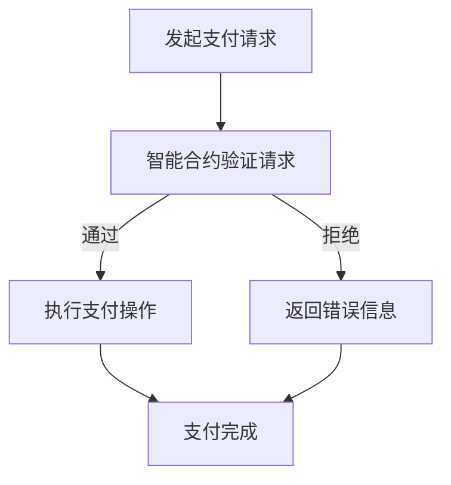

                 

## 文章标题：如何利用智能合约优化支付流程

智能合约作为一种分布式账本技术（Blockchain）的关键组成部分，正在逐渐改变传统支付流程的方方面面。本文旨在深入探讨智能合约如何优化支付流程，使其更加安全、高效和透明。通过详细的讲解和实践案例，本文将帮助读者更好地理解智能合约在支付领域的重要作用。

关键词：智能合约、支付流程、区块链、安全性、效率、透明性

摘要：本文首先介绍了智能合约的基本概念和其在区块链技术中的应用。接着，分析了传统支付流程的不足之处，并展示了智能合约如何解决这些问题。随后，通过数学模型和算法原理的讲解，读者将了解到智能合约在支付流程中的具体实现步骤。最后，本文通过实际项目案例和代码解读，展示了智能合约如何优化支付流程，并提供了一些未来发展趋势和挑战。

接下来，我们将逐步深入探讨智能合约优化支付流程的各个方面。首先，从背景介绍开始，了解智能合约的发展历程和其在支付领域的应用。

## 1. 背景介绍

智能合约是一种运行在区块链上的自动化协议，它能够通过编程代码执行合同条款，一旦条件满足，合同就会自动执行。这种去中心化的执行方式，使得智能合约具有高度的透明性、安全性和效率。

区块链技术的出现，为智能合约提供了理想的运行环境。区块链是一种分布式数据库，其核心特点是去中心化和不可篡改性。这意味着，区块链上的数据无法被单点控制，并且一旦记录在区块链上，数据将永久保存，无法被篡改。这使得区块链成为智能合约的理想平台。

智能合约在支付领域有着广泛的应用。首先，智能合约可以自动化支付流程，减少人为干预，提高效率。其次，智能合约的去中心化特性，使得支付过程更加透明，每个参与者都可以查看交易记录，提高信任度。此外，智能合约的安全性，也保证了支付过程中的数据安全，防止欺诈和篡改。

随着区块链技术的不断发展和完善，智能合约的应用场景也在不断扩大。从简单的支付流程，到复杂的金融衍生品交易，智能合约正在成为金融领域的重要工具。

## 2. 核心概念与联系

### 2.1 智能合约的基本概念

智能合约是一种基于代码的协议，它定义了交易双方的条件和承诺。当条件满足时，智能合约会自动执行预定的操作，例如转移资金、发放证书等。智能合约的核心是代码，这种代码通常使用特定的编程语言编写，例如Solidity。

智能合约的基本结构包括三个主要部分：合约状态、函数和事件。合约状态包含了合约的变量，用于存储合约的当前状态。函数是合约的核心逻辑，它定义了合约可以执行的操作。事件是合约中的日志记录，用于记录合约的重要操作和状态变化。

### 2.2 智能合约与区块链的关系

智能合约运行在区块链上，区块链提供了智能合约的执行环境和数据存储。区块链的核心特点包括去中心化、不可篡改和透明性，这些特点使得智能合约能够实现去中心化的自动化执行，提高交易的安全性和透明性。

在区块链中，智能合约的代码被永久存储在区块链上，每个节点都可以复制和验证合约的代码。这使得智能合约具有高度的安全性，因为任何试图篡改合约代码的行为都会被区块链网络发现并阻止。

### 2.3 智能合约在支付流程中的应用

智能合约在支付流程中的应用主要体现在以下几个方面：

1. **自动化支付**：智能合约可以自动化执行支付流程，一旦满足合同条款，资金就会自动转移。这种自动化支付流程减少了人为干预，提高了支付效率。

2. **增强安全性**：智能合约通过区块链技术提供了去中心化的支付方式，避免了传统支付系统中可能存在的欺诈和篡改风险。

3. **提高透明性**：智能合约的执行过程是公开透明的，每个参与者都可以查看交易记录，提高支付过程的信任度。

4. **降低成本**：智能合约减少了中介机构的需求，降低了交易成本。

### 2.4 智能合约与其他区块链技术的联系

除了智能合约，区块链技术还包括其他几个关键组成部分，如加密货币、分布式账本和共识算法。

- **加密货币**：加密货币是区块链上的虚拟货币，如比特币和以太币。加密货币可以作为智能合约中的支付手段，实现跨境支付。

- **分布式账本**：分布式账本是区块链的核心组成部分，它记录了所有的交易记录。智能合约运行在分布式账本上，可以自动执行交易。

- **共识算法**：共识算法是区块链网络中的关键机制，用于确保所有节点对账本的状态达成一致。智能合约的执行依赖于共识算法，确保其安全性。

通过以上对智能合约的基本概念、与区块链的关系以及在支付流程中的应用的介绍，我们可以看到智能合约在优化支付流程方面具有巨大的潜力。

### 2.5 Mermaid 流程图

下面是一个简单的 Mermaid 流程图，展示了智能合约在支付流程中的应用。



在这个流程图中，A 表示用户发起支付请求，B 表示智能合约验证请求，C 表示执行支付操作，D 表示返回错误信息，E 表示支付完成。这个流程图清晰地展示了智能合约在支付流程中的关键步骤。

通过以上对智能合约核心概念和联系的详细介绍，读者可以更好地理解智能合约在支付流程中的作用。接下来，我们将深入探讨智能合约的算法原理和具体操作步骤。

## 3. 核心算法原理 & 具体操作步骤

智能合约的算法原理是其能够自动化执行合同条款的关键。理解智能合约的算法原理，有助于我们更好地掌握其如何优化支付流程。

### 3.1 智能合约的算法原理

智能合约的算法原理主要基于区块链技术的特性。区块链的核心特点是去中心化和不可篡改，这使得智能合约能够实现高度的安全性和透明性。智能合约的算法原理主要包括以下几个方面：

1. **状态机模型**：智能合约通常采用状态机模型进行设计。状态机模型描述了智能合约在其生命周期中的不同状态和转换条件。智能合约的状态包括初始化状态、执行状态和终止状态等。

2. **事件触发**：智能合约的执行通常由事件触发。事件可以是外部事件，如区块链上的交易事件，也可以是内部事件，如合约内的函数调用。

3. **条件判断**：智能合约在执行过程中会进行条件判断，根据不同的条件执行不同的操作。条件判断可以基于时间、金额、合约状态等。

4. **数据存储**：智能合约需要存储其状态数据，这些数据通常存储在区块链上。数据存储可以是简单变量，也可以是复杂的数据结构。

### 3.2 智能合约的具体操作步骤

智能合约的具体操作步骤可以分为以下几个阶段：

1. **合约初始化**：合约初始化是智能合约的起点。在合约初始化阶段，合约会设置初始状态和初始化参数。

2. **事件监听**：智能合约会监听区块链上的事件，如交易事件、区块事件等。当特定事件发生时，合约会触发相应的处理函数。

3. **条件判断**：在事件触发后，智能合约会根据条件判断执行不同的操作。条件判断可以是简单的逻辑判断，也可以是复杂的逻辑运算。

4. **执行操作**：根据条件判断的结果，智能合约会执行相应的操作。这些操作可以是数据存储、资金转移、合同终止等。

5. **状态更新**：在执行操作后，智能合约会更新其状态。状态更新是智能合约执行过程的重要组成部分，它记录了合约的当前状态和执行历史。

6. **结束执行**：当智能合约执行完成所有操作后，它会进入结束执行阶段。在结束执行阶段，合约会清理资源，释放内存等。

### 3.3 智能合约示例代码

下面是一个简单的智能合约示例，展示了智能合约的基本结构和工作原理。

```solidity
pragma solidity ^0.8.0;

contract PaymentContract {
    address public sender;
    address public receiver;
    uint256 public amount;
    bool public isPaid = false;

    constructor(address _receiver, uint256 _amount) {
        sender = msg.sender;
        receiver = _receiver;
        amount = _amount;
    }

    function pay() external {
        require(!isPaid, "Payment already made");
        require(msg.sender == sender, "Only the sender can make the payment");
        require(msg.value == amount, "Incorrect payment amount");

        isPaid = true;
        receiver.transfer(amount);
    }

    function getPaymentStatus() external view returns (bool) {
        return isPaid;
    }
}
```

在这个示例中，智能合约实现了以下功能：

- 合约初始化：设置发送方、接收方和支付金额。
- 支付函数：当发送方调用支付函数时，如果满足条件，会将金额转移到接收方。
- 状态查询函数：允许查询支付状态。

通过这个示例，我们可以看到智能合约的基本结构和操作步骤。接下来，我们将深入探讨智能合约在支付流程中的数学模型和算法原理。

## 4. 数学模型和公式 & 详细讲解 & 举例说明

智能合约在支付流程中的应用，离不开数学模型和公式的支持。数学模型和公式不仅能够帮助我们理解智能合约的工作原理，还能够确保其逻辑的严谨性和正确性。以下将详细介绍智能合约在支付流程中的数学模型和公式，并通过具体示例进行讲解。

### 4.1 智能合约的数学模型

智能合约的数学模型通常包括以下几个关键部分：

1. **状态表示**：状态表示智能合约在执行过程中的各种变量和参数，如余额、支付金额、支付状态等。状态可以是一个简单的数值，也可以是一个复杂的数据结构。

2. **事件触发条件**：事件触发条件定义了智能合约在何时执行。这些条件可以是简单的逻辑表达式，如时间条件、金额条件等，也可以是复杂的数学运算。

3. **操作规则**：操作规则描述了智能合约在满足触发条件后执行的操作。这些操作可以是简单的数学运算，如加减法，也可以是复杂的逻辑操作，如条件分支。

4. **安全性验证**：安全性验证确保智能合约在执行过程中不会出现安全问题。这通常涉及加密算法、签名验证等数学方法。

### 4.2 智能合约的数学公式

智能合约中的数学公式主要用于表示状态的变化和条件的判断。以下是一些常见的数学公式：

1. **状态更新公式**：
   $$ S_{next} = S_{current} + \Delta S $$
   其中，$S_{next}$ 表示下一个状态，$S_{current}$ 表示当前状态，$\Delta S$ 表示状态变化量。

2. **事件触发条件**：
   $$ C = f(A, B, C) $$
   其中，$C$ 表示事件触发条件，$A$、$B$、$C$ 表示条件参数，$f$ 表示条件函数。

3. **操作规则**：
   $$ R = g(X, Y, Z) $$
   其中，$R$ 表示执行的操作，$X$、$Y$、$Z$ 表示操作参数，$g$ 表示操作函数。

### 4.3 举例说明

为了更好地理解智能合约的数学模型和公式，我们通过一个简单的支付流程示例进行说明。

#### 示例：简单支付智能合约

假设有一个简单的智能合约，用于实现点对点支付功能。合约中包含以下关键参数和函数：

- **参数**：
  - `sender`：发送方的地址。
  - `receiver`：接收方的地址。
  - `amount`：支付金额。
  - `isPaid`：支付状态（是否已经支付）。

- **函数**：
  - `pay()`：支付函数，用于执行支付操作。
  - `getPaymentStatus()`：查询支付状态函数。

#### 4.3.1 状态表示

智能合约的状态可以表示为以下三元组：
$$ S = \langle sender, receiver, amount, isPaid \rangle $$

其中，`sender`、`receiver` 和 `amount` 是状态的变量，`isPaid` 是状态的一个布尔值。

#### 4.3.2 事件触发条件

支付事件触发条件可以表示为：
$$ C = (isPaid == false) \land (msg.sender == sender) \land (msg.value == amount) $$

其中，`isPaid == false` 表示支付状态未支付，`msg.sender == sender` 表示支付方与合约中的发送方地址相同，`msg.value == amount` 表示支付金额等于合同金额。

#### 4.3.3 操作规则

支付操作规则可以表示为：
$$ R = \text{if } C \text{ is true then } \langle sender, receiver, amount, true \rangle \text{ else } \langle sender, receiver, amount, isPaid \rangle $$

其中，如果条件 $C$ 为真，则更新状态为已支付，否则状态保持不变。

#### 4.3.4 状态更新公式

状态更新公式为：
$$ S_{next} = S_{current} + \Delta S $$
其中，$\Delta S = \langle 0, 0, 0, 1 \rangle $ 如果条件 $C$ 为真，否则 $\Delta S = \langle 0, 0, 0, 0 \rangle $。

通过以上数学模型和公式，我们可以清晰地描述智能合约在支付流程中的逻辑和行为。接下来，我们将通过实际项目案例和代码解读，进一步探讨智能合约在支付流程中的具体应用。

### 5. 项目实战：代码实际案例和详细解释说明

在本文的这一部分，我们将通过一个实际的智能合约项目，详细解读其代码，并分析其如何优化支付流程。这个项目是一个简单的点对点支付智能合约，用于在区块链上进行安全的、透明的支付操作。

#### 5.1 开发环境搭建

要开始这个项目，我们需要搭建一个适合开发智能合约的开发环境。以下是搭建环境的步骤：

1. **安装Node.js**：Node.js 是一个用于运行 JavaScript 代码的运行环境，它是智能合约开发的基础。

   访问 Node.js 官网（[https://nodejs.org/](https://nodejs.org/)），下载并安装最新版本的 Node.js。

2. **安装Truffle**：Truffle 是一个智能合约开发框架，它提供了许多方便的功能，如智能合约编译、部署和测试。

   使用以下命令安装 Truffle：

   ```bash
   npm install -g truffle
   ```

3. **安装Ganache**：Ganache 是一个本地以太坊节点，用于在开发过程中模拟区块链网络。

   安装 Ganache 后，启动一个本地节点，以便我们在后续步骤中进行合约部署和测试。

   ```bash
   ganache-cli
   ```

4. **创建项目**：在安装完上述工具后，我们可以创建一个新的 Truffle 项目。

   ```bash
   truffle init
   ```

   这将创建一个包含基本结构的 Truffle 项目。

5. **安装以太坊客户端**：为了与 Ganache 进行交互，我们还需要安装一个以太坊客户端，如 geth 或 parity。

   ```bash
   npm install --save eth-node
   ```

   在 Truffle 配置文件中配置以太坊客户端：

   ```javascript
   // truffle-config.js
   module.exports = {
     networks: {
       development: {
         host: "127.0.0.1",
         port: 8545,
         network_id: "*",
       },
     },
   };
   ```

   以上配置将 Truffle 项目配置为与本地 Ganache 节点连接。

#### 5.2 源代码详细实现和代码解读

现在，我们将详细解读这个简单的智能合约项目中的代码。

##### 5.2.1 合约结构

智能合约的核心代码位于 `contracts/PaymentContract.sol` 文件中。以下是合约的完整代码：

```solidity
pragma solidity ^0.8.0;

contract PaymentContract {
    address public sender;
    address public receiver;
    uint256 public amount;
    bool public isPaid = false;

    constructor(address _receiver, uint256 _amount) {
        sender = msg.sender;
        receiver = _receiver;
        amount = _amount;
    }

    function pay() external payable {
        require(!isPaid, "Payment already made");
        require(msg.sender == sender, "Only the sender can make the payment");
        require(msg.value == amount, "Incorrect payment amount");

        isPaid = true;
        receiver.transfer(amount);
    }

    function getPaymentStatus() external view returns (bool) {
        return isPaid;
    }
}
```

##### 5.2.2 合约解析

1. **构造函数（constructor）**：
   - `constructor(address _receiver, uint256 _amount)`：构造函数用于初始化合约的状态。它接受两个参数：`_receiver`（接收方地址）和`_amount`（支付金额）。

2. **pay() 函数**：
   - `function pay() external payable`：`pay()` 函数是支付操作的核心。它有三个关键要求：
     - `require(!isPaid, "Payment already made")`：确保支付仅执行一次。
     - `require(msg.sender == sender, "Only the sender can make the payment")`：确保只有发送方可以执行支付。
     - `require(msg.value == amount, "Incorrect payment amount")`：确保支付金额正确。

   如果以上条件都满足，支付状态将被设置为`true`，并且资金将从发送方转移到接收方。

3. **getPaymentStatus() 函数**：
   - `function getPaymentStatus() external view returns (bool)`：`getPaymentStatus()` 函数用于查询支付状态。它返回一个布尔值，指示支付是否已经完成。

##### 5.2.3 代码解读

1. **状态变量**：
   - `address public sender;`：表示支付发送方的地址。
   - `address public receiver;`：表示支付接收方的地址。
   - `uint256 public amount;`：表示支付的金额。
   - `bool public isPaid;`：表示支付状态（是否已经支付）。

2. **构造函数**：
   - 在构造函数中，`sender` 被设置为当前调用者（msg.sender）的地址，`receiver` 被设置为传递的接收方地址，`amount` 被设置为传递的支付金额。

3. **pay() 函数**：
   - `pay()` 函数是支付的核心。它使用 `require()` 函数来确保支付条件（支付未完成、只有发送方可以支付、支付金额正确）都满足。如果条件满足，支付状态被设置为`true`，并且资金从发送方地址转移到接收方地址。

4. **getPaymentStatus() 函数**：
   - `getPaymentStatus()` 函数允许外部调用者查询支付状态。它不需要修改合约状态，因此使用 `view` 关键字。

通过以上代码和解读，我们可以看到智能合约如何实现点对点支付，并确保支付流程的安全和透明。

#### 5.3 代码解读与分析

在这个智能合约中，代码的简洁性和逻辑性是关键。以下是对代码的进一步解读和分析：

1. **简洁性**：
   - 合约代码非常简洁，只有两个函数和一个构造函数。这样的设计确保了代码的可读性和维护性。

2. **逻辑性**：
   - `pay()` 函数的逻辑非常清晰。它通过 `require()` 函数确保支付条件满足，从而提高了支付的安全性。

3. **安全性**：
   - 合约使用了 `require()` 函数来确保支付流程的每个步骤都符合预期。这种做法有助于防止恶意攻击和错误操作。

4. **透明性**：
   - 合约中的所有变量都是公开的，这意味着任何人都可以查询支付状态。这种透明性提高了用户对支付流程的信任。

通过以上代码解读和分析，我们可以看到这个简单的智能合约如何通过其设计和实现，优化了支付流程。接下来，我们将讨论智能合约在支付流程中的实际应用场景。

### 6. 实际应用场景

智能合约在支付流程中的实际应用场景非常广泛，以下是一些典型的应用场景：

#### 6.1 跨境支付

智能合约为跨境支付提供了一种高效、安全的解决方案。在传统跨境支付中，通常需要通过银行和支付网关进行交易，这不仅耗时，还可能产生高额的手续费。而智能合约可以自动化跨境支付流程，一旦满足条件，资金就会自动转移，大大提高了交易效率。

#### 6.2 供应链金融

在供应链金融中，智能合约可以用于自动化支付和贷款流程。例如，当供应商交付货物后，智能合约可以自动验证货物是否达到质量标准，并据此自动支付货款。此外，智能合约还可以用于贷款业务，当借款人满足还款条件时，智能合约会自动执行还款操作。

#### 6.3 微交易

智能合约适用于微交易，如数字内容付费、游戏内交易等。在这种场景中，智能合约可以确保用户支付正确的金额，并获得相应的数字内容或游戏资源。例如，用户购买一篇数字文章时，智能合约会验证支付金额，并在支付完成后将文章授权给用户。

#### 6.4 股权交易

智能合约可以用于股权交易的自动化执行。在传统股权交易中，需要进行繁琐的合同签订、审核和资金转移过程。而智能合约可以自动化这些步骤，确保交易过程高效、透明。

#### 6.5 众筹项目

智能合约在众筹项目中也有广泛应用。通过智能合约，项目发起人可以设置众筹目标，并在达到目标时自动释放资金。这种自动化过程提高了众筹项目的透明性和可信度，吸引更多投资者参与。

通过以上实际应用场景，我们可以看到智能合约如何在不同领域优化支付流程，提高交易效率、安全性和透明度。

### 7. 工具和资源推荐

在智能合约的开发和应用过程中，有一些工具和资源是非常有用的。以下是对这些工具和资源的推荐：

#### 7.1 学习资源推荐

1. **《智能合约：区块链技术的应用》**：这本书详细介绍了智能合约的基础知识、编程语言和实际应用，是智能合约开发者的必备指南。

2. **《精通智能合约开发》**：这本书深入探讨了智能合约的安全性和性能优化，适合希望提升智能合约开发技能的读者。

3. **Ethereum Developer Documentation**：以太坊官方开发文档提供了详尽的智能合约开发教程和API参考，是学习智能合约开发的重要资源。

4. **Solidity by Example**：这是一本面向初学者的智能合约编程指南，通过实际案例帮助读者掌握Solidity编程语言。

#### 7.2 开发工具框架推荐

1. **Truffle**：Truffle 是一个流行的智能合约开发框架，提供了合约编译、部署和测试工具，适合初学者和专业人士使用。

2. **Hardhat**：Hardhat 是一个高效、安全的本地以太坊开发环境，支持 TypeScript 和 Node.js，是智能合约开发者的首选工具。

3. **Remix IDE**：Remix IDE 是一个基于 Web 的智能合约开发工具，提供了代码编辑、编译、部署和交互功能，非常适合快速原型开发。

4. **Web3.js**：Web3.js 是一个 JavaScript 库，用于与以太坊区块链进行交互。它可以用于开发前端应用，实现与智能合约的交互。

#### 7.3 相关论文著作推荐

1. **《区块链：重构业务与信任》**：这篇论文详细介绍了区块链技术的基本原理和应用场景，对智能合约进行了深入探讨。

2. **《智能合约的安全性与效率优化》**：这篇论文研究了智能合约的安全性和性能优化问题，提出了多种解决方案。

3. **《智能合约与去中心化金融》**：这篇论文探讨了智能合约在去中心化金融领域的应用，分析了智能合约对传统金融体系的变革。

通过以上工具和资源的推荐，读者可以更好地了解智能合约的开发和应用，掌握相关技能，为优化支付流程提供支持。

### 8. 总结：未来发展趋势与挑战

智能合约作为一种新兴的技术，正逐渐改变支付流程，提高其安全性、透明性和效率。未来，智能合约在支付领域的发展趋势和挑战主要体现在以下几个方面：

#### 8.1 发展趋势

1. **技术成熟度提高**：随着区块链技术的不断发展和完善，智能合约的性能和安全性将得到进一步提升。这将使得智能合约在支付流程中的应用更加广泛。

2. **应用场景扩展**：智能合约的应用场景将不断扩展，从简单的支付流程，到复杂的金融交易、供应链管理等领域。这将推动智能合约技术的全面发展。

3. **标准化和合规性**：智能合约的标准化和合规性将成为未来发展的关键。随着各国对区块链技术的监管加强，智能合约将需要符合更多的法律和行业标准。

4. **用户体验优化**：为了提高智能合约的普及率，用户体验的优化将成为重点。开发者将致力于简化智能合约的使用流程，降低用户的技术门槛。

#### 8.2 挑战

1. **安全性问题**：智能合约的安全性问题一直是其发展过程中的重要挑战。虽然区块链技术提供了高度的安全保障，但智能合约的漏洞和恶意攻击仍然存在。未来，安全性问题需要持续关注和改进。

2. **性能瓶颈**：随着智能合约应用场景的扩展，性能瓶颈将成为一个关键挑战。如何优化智能合约的执行效率，提高处理速度，将是未来技术发展的重点。

3. **法律法规和监管**：智能合约的发展受到法律法规和监管的制约。不同国家和地区对区块链技术的监管政策存在差异，这可能导致智能合约在不同地区的应用存在障碍。

4. **用户信任问题**：尽管智能合约具有较高的透明性和安全性，但用户对智能合约的信任仍需建立。如何提高用户对智能合约的信任度，是未来智能合约发展的重要挑战。

通过总结以上发展趋势和挑战，我们可以看到，智能合约在支付领域具有巨大的发展潜力。未来，随着技术的不断成熟和应用的深入，智能合约有望成为支付流程的重要推动力量。

### 9. 附录：常见问题与解答

#### 9.1 智能合约与传统支付方式的区别是什么？

智能合约与传统支付方式主要有以下几个区别：

- **安全性**：智能合约通过区块链技术提供去中心化的安全保障，防止欺诈和篡改。而传统支付方式依赖于银行或支付网关，存在单点故障风险。
- **透明性**：智能合约的执行过程是公开透明的，每个参与者都可以查看交易记录。而传统支付方式的信息往往不透明，存在信息不对称的问题。
- **效率**：智能合约可以自动化执行支付流程，减少人为干预，提高效率。而传统支付方式通常需要人工处理，耗时较长。
- **成本**：智能合约减少了中介机构的需求，降低了交易成本。而传统支付方式通常需要支付高额的手续费。

#### 9.2 智能合约有哪些常见的漏洞？

智能合约常见的漏洞包括：

- **逻辑漏洞**：智能合约代码中存在的逻辑错误，可能导致预期外的行为。
- **重入攻击**：攻击者通过多次调用合约函数，获取未受保护的资金。
- **整数溢出**：在 Solidity 中，整数运算可能会导致溢出或下溢，从而破坏数据完整性。
- **调用深度限制**：智能合约在执行过程中有调用深度限制，过深的调用可能会导致栈溢出。
- **状态溢出**：在 Solidity 中，存储分配是固定的，状态溢出可能导致合约数据丢失。

#### 9.3 如何确保智能合约的安全性？

为确保智能合约的安全性，可以采取以下措施：

- **代码审计**：聘请专业团队对智能合约代码进行审计，查找潜在的安全漏洞。
- **单元测试**：编写全面的单元测试，确保合约在各种情况下都能正确执行。
- **形式化验证**：使用形式化验证工具，对智能合约代码进行逻辑验证，确保其行为符合预期。
- **安全编码实践**：遵循安全编码实践，避免常见的编程错误，如整数溢出和重入攻击。
- **社区审查**：将智能合约代码公开，接受社区审查，利用集体智慧发现潜在问题。

### 10. 扩展阅读 & 参考资料

为了进一步了解智能合约优化支付流程的相关知识，以下是一些扩展阅读和参考资料：

1. **《区块链技术指南》**：这本书详细介绍了区块链技术的基础知识和应用场景，包括智能合约的原理和应用。
2. **《智能合约安全实战》**：这本书专注于智能合约的安全问题，提供了实用的安全建议和案例分析。
3. **《以太坊官方文档》**：以太坊官方文档提供了详尽的智能合约开发教程和API参考，是学习智能合约开发的重要资源。
4. **《智能合约实战》**：这本书通过实际案例，展示了智能合约在不同领域的应用，包括支付、供应链金融等。

通过以上扩展阅读和参考资料，读者可以更深入地了解智能合约优化支付流程的技术细节和应用实践。

