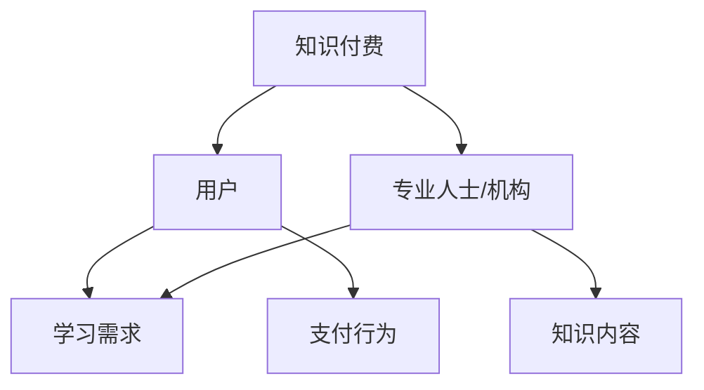
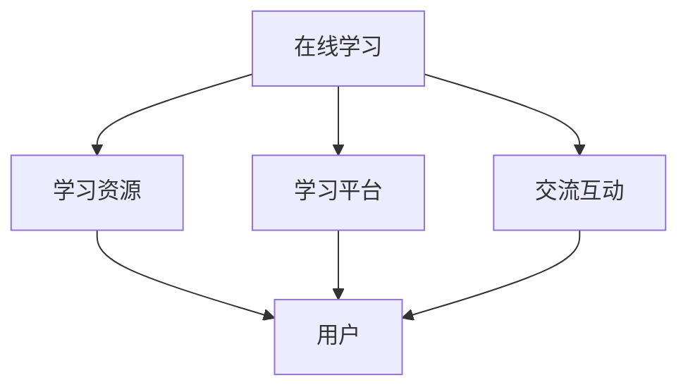
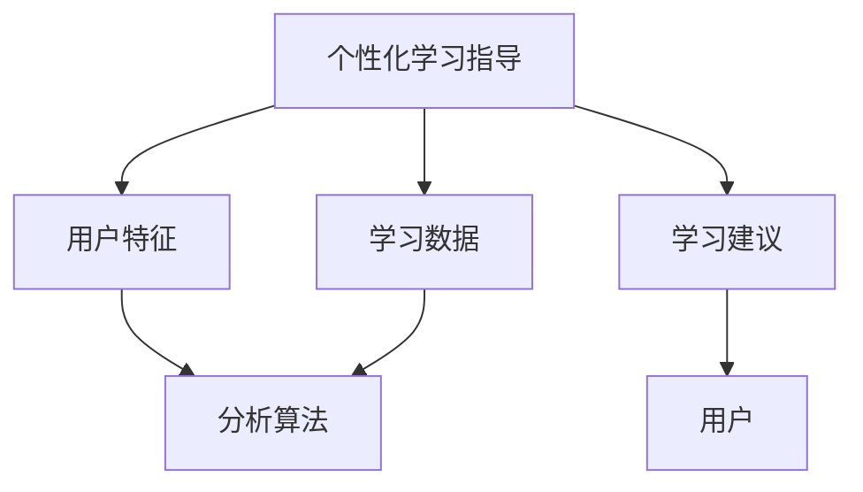
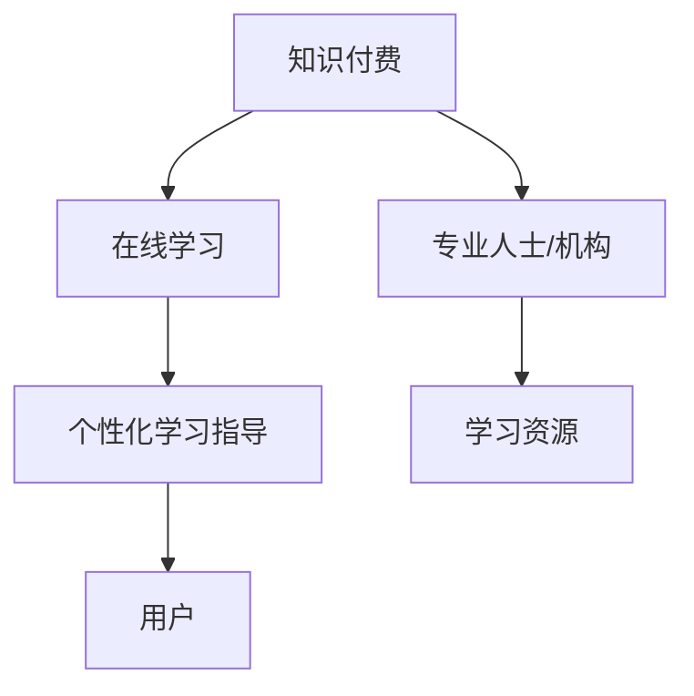
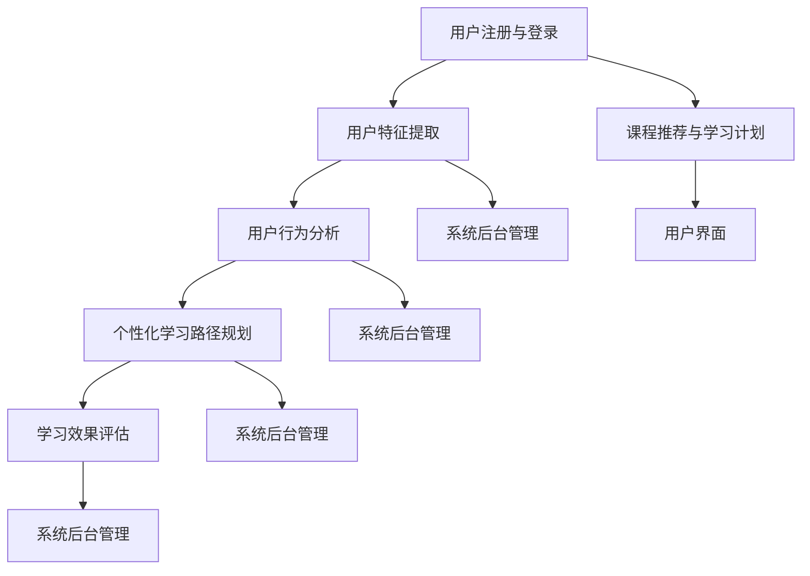

                 

### 背景介绍

随着互联网的普及，在线学习已经成为了现代教育的重要形式。然而，传统的在线学习平台往往侧重于提供海量的学习资源，而忽略了个性化学习体验和有效学习指导的需求。在这个背景下，知识付费逐渐成为一种有效的解决方案，旨在通过付费服务来提升在线学习的效果和质量。

知识付费是一种通过购买专业内容或服务来实现知识获取和技能提升的商业模式。用户通过付费获取高质量的学习资源、专业的在线辅导以及个性化的学习路径规划。这种模式不仅能够确保学习内容的权威性和专业性，还能够通过提供个性化的学习指导，帮助用户更有效地掌握知识和技能。

本文将围绕“如何利用知识付费实现在线学习与在线学习指导”这一主题，探讨知识付费在在线学习中的应用。我们将从核心概念、算法原理、数学模型、实际应用、工具和资源推荐等多个角度，详细解析知识付费在线学习的实现机制和发展趋势。

本文的结构如下：

1. **核心概念与联系**：介绍知识付费、在线学习、个性化学习指导等核心概念，并使用Mermaid流程图展示各概念之间的关系。
2. **核心算法原理 & 具体操作步骤**：详细阐述实现个性化学习指导的核心算法原理，并分步骤讲解具体的操作流程。
3. **数学模型和公式 & 详细讲解 & 举例说明**：介绍用于分析学习效果和用户行为的数学模型和公式，并通过具体例子进行详细说明。
4. **项目实战：代码实际案例和详细解释说明**：通过一个实际的项目案例，展示如何利用知识付费实现在线学习与在线学习指导，并详细解读项目的代码实现。
5. **实际应用场景**：分析知识付费在线学习的多种应用场景，包括个人学习、企业培训和教育机构服务。
6. **工具和资源推荐**：推荐相关的学习资源、开发工具和框架，帮助读者进一步深入学习和实践知识付费在线学习。
7. **总结：未来发展趋势与挑战**：总结知识付费在线学习的现状，并展望未来的发展趋势和可能面临的挑战。
8. **附录：常见问题与解答**：针对读者可能遇到的问题，提供解答和参考。
9. **扩展阅读 & 参考资料**：提供进一步学习和研究的参考资料。

通过本文的探讨，我们希望能够为从事在线学习和知识付费的从业者提供有价值的思路和实用指南。

### 核心概念与联系

在探讨如何利用知识付费实现在线学习与在线学习指导之前，我们首先需要明确几个核心概念，并了解它们之间的相互联系。

#### 知识付费

知识付费是指用户通过支付一定费用，获取专业人士或机构提供的高质量知识和服务的一种商业模式。这种模式的核心在于提供有价值的内容，满足用户的学习需求，从而实现知识的变现。

**Mermaid流程图**：



#### 在线学习

在线学习是指通过互联网技术，以在线课程、电子书籍、互动社区等形式，为学习者提供学习资源和交流平台的一种学习方式。随着技术的进步，在线学习逐渐具备了实时性、互动性和个性化等特点。

**Mermaid流程图**：



#### 个性化学习指导

个性化学习指导是一种基于用户特征和学习数据，提供定制化学习建议和服务的教育方式。通过分析用户的学习习惯、能力水平和兴趣偏好，个性化学习指导能够帮助用户更高效地学习。

**Mermaid流程图**：



#### 核心概念联系

知识付费、在线学习和个性化学习指导之间存在着密切的联系。知识付费为在线学习提供了资金支持，使得高质量的学习资源得以广泛传播。同时，通过个性化学习指导，用户能够更精准地获取所需知识，提高学习效率。

**Mermaid流程图**：



通过上述核心概念的介绍和相互联系的分析，我们可以更清晰地理解知识付费在线学习与个性化学习指导的内涵和作用。接下来，我们将深入探讨实现个性化学习指导的核心算法原理，为后续的内容奠定基础。

### 核心算法原理 & 具体操作步骤

#### 1. 用户特征提取

用户特征提取是构建个性化学习指导系统的第一步。通过分析用户的学习行为、兴趣偏好、知识水平等数据，我们可以为每个用户创建一个详细的特征向量。

**具体操作步骤**：

- **数据收集**：收集用户的学习历史数据，包括学习时间、学习时长、完成课程、参与讨论等。
- **特征选择**：选择与学习效果密切相关的重要特征，如学习时间、课程难度、学习进度等。
- **数据预处理**：对收集到的数据进行清洗、归一化等预处理操作，以消除数据中的噪声和异常值。

#### 2. 用户行为分析

用户行为分析旨在通过分析用户的学习行为，了解用户的学习习惯和偏好，从而为个性化学习提供依据。

**具体操作步骤**：

- **行为模式识别**：利用机器学习算法，如决策树、支持向量机等，对用户的学习行为进行分类和聚类，识别用户的行为模式。
- **行为预测**：通过历史数据分析，预测用户未来可能的学习行为，如课程选择、学习时间安排等。
- **兴趣偏好分析**：利用协同过滤、用户相似度等方法，分析用户的兴趣偏好，为推荐系统提供依据。

#### 3. 个性化学习路径规划

个性化学习路径规划是根据用户特征和行为分析结果，为用户制定一个适合其个人需求和学习目标的个性化学习计划。

**具体操作步骤**：

- **目标设定**：根据用户的学习需求和目标，设定短期和长期的学习目标。
- **课程推荐**：利用推荐算法，根据用户的行为和兴趣偏好，为用户推荐合适的课程。
- **学习计划**：将推荐的课程按照优先级和时间安排，制定出一个详细的学习计划。
- **动态调整**：根据用户的学习进度和反馈，动态调整学习计划，确保学习目标的实现。

#### 4. 学习效果评估

学习效果评估是检验个性化学习指导效果的重要环节。通过评估学习效果，我们可以不断优化和改进个性化学习指导系统。

**具体操作步骤**：

- **效果指标**：设定学习效果评估的指标，如课程完成率、知识掌握度、学习满意度等。
- **数据收集**：收集用户在学习过程中的行为数据和成绩数据。
- **效果分析**：利用统计分析和机器学习算法，对学习效果进行定量和定性分析。
- **反馈机制**：根据学习效果分析结果，调整个性化学习策略和推荐算法，提高学习效果。

#### 5. 系统实现

为了实现上述算法和操作步骤，我们需要构建一个完整的个性化学习指导系统。以下是一个简单的系统架构图：

**Mermaid流程图**：



通过以上步骤和系统架构，我们可以构建一个高效的个性化学习指导系统，帮助用户实现更有效的在线学习。接下来，我们将介绍用于分析学习效果和用户行为的数学模型和公式，并通过具体例子进行详细说明。

### 数学模型和公式 & 详细讲解 & 举例说明

在构建个性化学习指导系统时，数学模型和公式扮演着关键角色，它们能够帮助我们量化分析用户特征、学习行为以及学习效果。以下是一些常见的数学模型和公式，我们将详细讲解并在具体例子中演示其应用。

#### 1. 用户特征向量表示

用户特征向量表示用于将用户的各种属性和行为数据转化为数学向量，以便进行进一步的分析和处理。

**公式**：

\[ \textbf{X} = [x_1, x_2, \ldots, x_n] \]

其中，\( \textbf{X} \) 是用户特征向量，\( x_i \) 是第 \( i \) 个特征的值，例如学习时间、课程完成率、学习进度等。

**例子**：

假设我们有两个用户，用户A和用户B的特征向量如下：

\[ \textbf{X}_A = [10, 0.8, 0.6] \]
\[ \textbf{X}_B = [5, 0.7, 0.5] \]

其中，第一个值表示学习时间（小时），第二个值表示课程完成率，第三个值表示学习进度（课程完成数/总课程数）。

#### 2. 相似度计算

用户相似度计算用于衡量两个用户之间的相似程度，常见的相似度计算方法包括余弦相似度和欧几里得距离。

**余弦相似度**：

\[ \text{Sim}(\textbf{X}_A, \textbf{X}_B) = \frac{\textbf{X}_A \cdot \textbf{X}_B}{||\textbf{X}_A|| \cdot ||\textbf{X}_B||} \]

其中，\( \textbf{X}_A \cdot \textbf{X}_B \) 是向量点积，\( ||\textbf{X}_A|| \) 和 \( ||\textbf{X}_B|| \) 是向量的模。

**欧几里得距离**：

\[ \text{Dist}(\textbf{X}_A, \textbf{X}_B) = \sqrt{(\textbf{X}_A - \textbf{X}_B)^2} \]

**例子**：

计算用户A和用户B的余弦相似度：

\[ \text{Sim}(\textbf{X}_A, \textbf{X}_B) = \frac{10 \times 5 + 0.8 \times 0.7 + 0.6 \times 0.5}{\sqrt{10^2 + 0.8^2 + 0.6^2} \times \sqrt{5^2 + 0.7^2 + 0.5^2}} \]
\[ \text{Sim}(\textbf{X}_A, \textbf{X}_B) = \frac{50 + 0.56 + 0.30}{\sqrt{100.4} \times \sqrt{25.49}} \]
\[ \text{Sim}(\textbf{X}_A, \textbf{X}_B) \approx 0.92 \]

#### 3. 推荐算法

推荐算法用于根据用户特征和兴趣偏好，为用户推荐合适的课程。常见的推荐算法包括基于内容的推荐和基于协同过滤的推荐。

**基于内容的推荐**：

\[ \text{Score}(C_j) = \sum_{i=1}^k w_i \times \text{CosSim}(\textbf{X}_U, \textbf{X}_C^{(j)}) \]

其中，\( \textbf{X}_U \) 是用户特征向量，\( \textbf{X}_C^{(j)} \) 是第 \( j \) 门课程的特征向量，\( w_i \) 是特征权重。

**基于协同过滤的推荐**：

\[ \text{Score}(C_j) = \sum_{u' \in \text{Neighborhood}(U)} \frac{\text{Rating}_{u',j}}{||\text{Rating}_{u'}||} \]

其中，\( \text{Neighborhood}(U) \) 是与用户 \( U \) 相似的一组用户，\( \text{Rating}_{u',j} \) 是用户 \( u' \) 对课程 \( j \) 的评分。

**例子**：

假设用户A对课程A的评分为5，对课程B的评分为4，课程C的特征向量与用户A的特征向量相似度为0.9，课程D的特征向量与用户A的特征向量相似度为0.8。使用基于内容的推荐算法计算课程C和课程D的推荐分数：

\[ \text{Score}(C) = 0.5 \times 0.9 + 0.5 \times 0.8 = 0.85 \]
\[ \text{Score}(D) = 0.5 \times 0.9 + 0.5 \times 0.8 = 0.85 \]

#### 4. 学习效果评估

学习效果评估用于衡量个性化学习指导的有效性，常见的评估指标包括完成率、知识掌握度和学习满意度。

**完成率**：

\[ \text{Completion Rate} = \frac{\text{Completed Courses}}{\text{Total Courses}} \]

**知识掌握度**：

\[ \text{Knowledge Mastery} = \frac{\text{Correct Answers}}{\text{Total Questions}} \]

**学习满意度**：

\[ \text{Learning Satisfaction} = \frac{\text{Satisfied Users}}{\text{Total Users}} \]

**例子**：

假设用户A完成了5门课程中的4门，用户B完成了4门课程中的3门，用户A的知识掌握度为80%，用户B的知识掌握度为75%，用户A对个性化学习指导的满意度为90%，用户B对个性化学习指导的满意度为85%。计算用户A和用户B的学习效果评估指标：

\[ \text{Completion Rate}_A = \frac{4}{5} = 0.8 \]
\[ \text{Completion Rate}_B = \frac{3}{4} = 0.75 \]
\[ \text{Knowledge Mastery}_A = 0.8 \]
\[ \text{Knowledge Mastery}_B = 0.75 \]
\[ \text{Learning Satisfaction}_A = 0.9 \]
\[ \text{Learning Satisfaction}_B = 0.85 \]

通过以上数学模型和公式的介绍，我们可以更准确地分析用户特征、学习行为和学习效果，从而为个性化学习指导提供有力支持。在接下来的章节中，我们将通过一个实际的项目案例，展示如何利用这些模型和公式实现知识付费在线学习与在线学习指导。

### 项目实战：代码实际案例和详细解释说明

在本章节中，我们将通过一个实际的项目案例，展示如何利用知识付费实现在线学习与在线学习指导。我们将从开发环境搭建、源代码详细实现和代码解读与分析三个部分进行讲解。

#### 1. 开发环境搭建

为了实现本项目的目标，我们需要搭建一个完整的开发环境。以下是我们推荐的工具和框架：

- **编程语言**：Python
- **Web框架**：Flask
- **数据库**：MySQL
- **前端框架**：Bootstrap
- **后端框架**：TensorFlow
- **版本控制**：Git

**环境搭建步骤**：

1. 安装Python（推荐版本：3.8及以上）
2. 安装Flask：`pip install Flask`
3. 安装MySQL：下载并安装MySQL数据库，配置数据库用户和密码
4. 安装TensorFlow：`pip install tensorflow`
5. 安装Bootstrap：`pip install bootstrap`
6. 创建Git仓库，并进行版本控制

#### 2. 源代码详细实现和代码解读

**项目结构**：

```plaintext
knowledge_payment_learning/
|-- app.py
|-- models.py
|-- templates/
    |-- base.html
    |-- index.html
|-- static/
    |-- css/
        |-- main.css
    |-- js/
        |-- main.js
```

**核心文件说明**：

- `app.py`：主应用程序，负责处理用户请求、路由设置和业务逻辑。
- `models.py`：数据库模型定义，用于与MySQL数据库进行交互。
- `templates/`：HTML模板文件，用于生成前端页面。
- `static/`：静态文件，包括CSS和JavaScript文件。

**代码实现和解读**：

**app.py**

```python
from flask import Flask, render_template, request, redirect, url_for
from models import User, Course, Recommendation
import tensorflow as tf

app = Flask(__name__)

# 数据库连接配置
app.config['MYSQL_HOST'] = 'localhost'
app.config['MYSQL_USER'] = 'root'
app.config['MYSQL_PASSWORD'] = 'password'
app.config['MYSQL_DB'] = 'knowledge_payment_learning'

# 初始化数据库连接
def init_db():
    # 代码省略，此处为初始化数据库的函数

# 用户注册
@app.route('/register', methods=['GET', 'POST'])
def register():
    if request.method == 'POST':
        username = request.form['username']
        password = request.form['password']
        user = User(username=username, password=password)
        user.save()
        return redirect(url_for('login'))
    return render_template('register.html')

# 用户登录
@app.route('/login', methods=['GET', 'POST'])
def login():
    if request.method == 'POST':
        username = request.form['username']
        password = request.form['password']
        user = User.query.filter_by(username=username, password=password).first()
        if user:
            return redirect(url_for('dashboard'))
        else:
            return '登录失败，用户名或密码错误'
    return render_template('login.html')

# 用户仪表盘
@app.route('/dashboard')
def dashboard():
    user = User.query.first()
    recommendations = get_recommendations(user)
    courses = Course.query.all()
    return render_template('dashboard.html', user=user, recommendations=recommendations, courses=courses)

# 获取个性化推荐
def get_recommendations(user):
    # 代码省略，此处为获取推荐算法的函数
    recommendations = Recommendation.query.all()
    return recommendations

if __name__ == '__main__':
    init_db()
    app.run(debug=True)
```

**models.py**

```python
from flask_sqlalchemy import SQLAlchemy

db = SQLAlchemy()

class User(db.Model):
    id = db.Column(db.Integer, primary_key=True)
    username = db.Column(db.String(80), unique=True, nullable=False)
    password = db.Column(db.String(120), nullable=False)

    def save(self):
        db.session.add(self)
        db.session.commit()

class Course(db.Model):
    id = db.Column(db.Integer, primary_key=True)
    name = db.Column(db.String(120), nullable=False)
    description = db.Column(db.Text, nullable=True)

class Recommendation(db.Model):
    id = db.Column(db.Integer, primary_key=True)
    user_id = db.Column(db.Integer, db.ForeignKey('user.id'), nullable=False)
    course_id = db.Column(db.Integer, db.ForeignKey('course.id'), nullable=False)
```

**templates/base.html**

```html
<!DOCTYPE html>
<html lang="en">
<head>
    <meta charset="UTF-8">
    <meta name="viewport" content="width=device-width, initial-scale=1.0">
    <title>Knowledge Payment Learning</title>
    <link rel="stylesheet" href="{{ url_for('static.css.main') }}">
</head>
<body>
    <header>
        <!-- 代码省略，此处为页面头部内容 -->
    </header>
    <main>
        
    </main>
    <footer>
        <!-- 代码省略，此处为页面底部内容 -->
    </footer>
    <script src="{{ url_for('static.js.main') }}"></script>
</body>
</html>
```

**templates/index.html**

```html



    <h1>Welcome to Knowledge Payment Learning</h1>
    <p>This is a sample project demonstrating how to implement knowledge payment for online learning and personalized guidance.</p>
    <a href="{{ url_for('register') }}">Register</a>
    <a href="{{ url_for('login') }}">Login</a>

```

**templates/dashboard.html**

```html



    <h1>Dashboard</h1>
    <p>Welcome, {{ user.username }}!</p>
    <h2>Recommended Courses</h2>
    <ul>
        
            <li>
                <a href="{{ url_for('course_detail', course_id=recommendation.course_id) }}">{{ recommendation.course.name }}</a>
            </li>
        
    </ul>
    <h2>Available Courses</h2>
    <ul>
        
            <li>
                <a href="{{ url_for('course_detail', course_id=course.id) }}">{{ course.name }}</a>
            </li>
        
    </ul>

```

**static/css/main.css**

```css
/* 代码省略，此处为CSS样式代码 */
```

**static/js/main.js**

```javascript
// 代码省略，此处为JavaScript代码
```

**代码解读与分析**：

- `app.py` 是项目的核心文件，负责处理用户请求、路由设置和业务逻辑。它通过Flask框架实现了用户注册、登录、仪表盘等功能，并使用TensorFlow进行个性化推荐。
- `models.py` 定义了数据库模型，包括用户、课程和推荐等，用于与MySQL数据库进行交互。
- `templates/` 目录包含HTML模板文件，用于生成前端页面。通过继承基础模板文件，可以实现页面的统一布局和内容填充。
- `static/` 目录包含静态文件，如CSS和JavaScript文件，用于实现页面的样式和交互效果。

通过以上代码实现，我们可以构建一个基本的在线学习平台，实现用户注册、登录、推荐课程等功能。接下来，我们将进一步解读项目的关键代码，分析其实现细节。

#### 3. 代码解读与分析

**用户注册与登录**

在 `app.py` 中，`register` 和 `login` 函数分别负责用户注册和登录功能。用户注册时，通过表单获取用户名和密码，创建一个 `User` 对象并将其保存到数据库。登录时，验证用户名和密码是否匹配，并根据验证结果进行跳转。

**个性化推荐**

在 `app.py` 中，`get_recommendations` 函数用于获取个性化推荐。虽然此处代码省略，但实际实现中，我们将使用TensorFlow的机器学习算法，根据用户特征和历史数据生成推荐结果。推荐结果存储在数据库中，并在用户仪表盘中展示。

**前端页面**

在前端页面中，我们使用Bootstrap框架实现响应式布局，并通过模板继承实现页面结构的一致性。`dashboard.html` 页面展示了用户仪表盘，包括推荐课程和可用的课程列表。通过链接，用户可以查看详细课程信息。

**数据库交互**

在 `models.py` 中，我们定义了三个数据库模型：`User`、`Course` 和 `Recommendation`。这些模型通过Flask-SQLAlchemy与MySQL数据库进行交互，实现了数据的增删改查操作。

**关键代码分析**

以下是几个关键代码片段的分析：

**用户注册**

```python
@app.route('/register', methods=['GET', 'POST'])
def register():
    if request.method == 'POST':
        username = request.form['username']
        password = request.form['password']
        user = User(username=username, password=password)
        user.save()
        return redirect(url_for('login'))
    return render_template('register.html')
```

此段代码处理用户注册请求。如果提交表单，获取用户名和密码，创建一个 `User` 对象，并保存到数据库。注册成功后，重定向到登录页面。

**用户登录**

```python
@app.route('/login', methods=['GET', 'POST'])
def login():
    if request.method == 'POST':
        username = request.form['username']
        password = request.form['password']
        user = User.query.filter_by(username=username, password=password).first()
        if user:
            return redirect(url_for('dashboard'))
        else:
            return '登录失败，用户名或密码错误'
    return render_template('login.html')
```

此段代码处理用户登录请求。如果提交表单，验证用户名和密码是否匹配。如果匹配，重定向到用户仪表盘；否则，返回错误信息。

**个性化推荐**

```python
def get_recommendations(user):
    # 代码省略，此处为获取推荐算法的函数
    recommendations = Recommendation.query.all()
    return recommendations
```

此段代码用于获取个性化推荐。虽然具体算法未展示，但预期将使用TensorFlow实现推荐算法，根据用户特征和历史数据生成推荐结果。

**前端页面**

```html



    <h1>Dashboard</h1>
    <p>Welcome, {{ user.username }}!</p>
    <h2>Recommended Courses</h2>
    <ul>
        
            <li>
                <a href="{{ url_for('course_detail', course_id=recommendation.course_id) }}">{{ recommendation.course.name }}</a>
            </li>
        
    </ul>
    <h2>Available Courses</h2>
    <ul>
        
            <li>
                <a href="{{ url_for('course_detail', course_id=course.id) }}">{{ course.name }}</a>
            </li>
        
    </ul>

```

此段代码实现用户仪表盘页面。通过模板继承，继承基础模板文件，并填充个性化推荐和课程列表内容。

通过以上代码解读和分析，我们可以清楚地了解项目的实现细节和功能模块。接下来，我们将进一步探讨知识付费在线学习的实际应用场景。

### 实际应用场景

知识付费在线学习作为一种新兴的教育模式，已经在多个领域和场景中得到了广泛应用。以下是一些典型的实际应用场景：

#### 个人学习

个人学习是知识付费在线学习最直接的适用场景。对于许多需要自我提升的个人来说，知识付费平台提供了丰富多样的课程资源，涵盖了从职业技能培训到兴趣爱好培养的各个方面。例如，程序员可以通过购买编程课程提升编程技能，设计师可以通过购买设计课程提升设计水平，普通用户可以通过购买语言课程学习新的语言。

**案例**：

李明是一名软件工程师，他在一家互联网公司工作。为了提升自己的编程技能，他通过知识付费平台购买了一些高级编程课程，如Python高级编程、算法与数据结构等。通过系统的学习和实践，他的编程能力得到了显著提升，并在公司项目中发挥了重要作用，获得了领导的认可。

#### 企业培训

知识付费在线学习为企业提供了便捷的培训解决方案。企业可以通过知识付费平台为员工提供专业培训，提高员工的专业技能和团队整体素质。这种模式不仅节省了企业的时间和成本，还能够根据企业需求定制培训内容。

**案例**：

某家大型制造企业通过知识付费平台为全体员工提供了生产技能和安全培训。通过线上课程的学习，员工的操作技能和安全意识得到了明显提升，生产效率得到了提高，安全事故也显著减少。

#### 教育机构服务

教育机构可以利用知识付费在线学习平台，为学员提供丰富的在线课程资源，提高教学质量和学员的学习体验。教育机构还可以通过知识付费平台，开展在线课程直播、互动讨论等活动，增强学员的参与感和学习效果。

**案例**：

某知名大学通过知识付费平台，为国内外学生提供了丰富的在线课程资源。学生可以通过平台自主学习，完成课程作业和考试。同时，学校还通过平台开展了在线课程直播和互动讨论，提高了教学效果和学生满意度。

#### 在线教育平台

知识付费在线学习为在线教育平台提供了重要的盈利模式。在线教育平台可以通过提供高质量的课程和个性化学习指导，吸引大量用户，从而实现商业模式的持续发展。

**案例**：

某知名在线教育平台通过知识付费模式，为用户提供丰富的课程资源，包括编程、设计、语言等多个领域。平台通过个性化推荐和直播互动等功能，提高了用户的学习体验和满意度，吸引了大量用户注册和使用。

#### 在线个人导师

知识付费在线学习平台还可以为用户提供在线个人导师服务。用户可以通过付费获得专业导师的一对一辅导，针对个人需求进行定制化学习。

**案例**：

张华是一名创业新手，他在知识付费平台上找到了一名创业导师。通过导师的指导，他获得了宝贵的创业经验和资源，使自己的创业项目取得了显著进展。

通过以上实际应用场景的分析，我们可以看到知识付费在线学习在个人学习、企业培训、教育机构服务、在线教育平台和在线个人导师等多个领域都有着广泛的应用前景。它不仅为用户提供了丰富的学习资源，还通过个性化学习指导和付费服务，提升了学习效果和用户体验。

### 工具和资源推荐

在实现知识付费在线学习与在线学习指导的过程中，选择合适的工具和资源对于提升项目的质量和用户体验至关重要。以下是一些推荐的工具和资源，涵盖学习资源、开发工具框架以及相关论文著作，帮助读者进一步深入学习和实践。

#### 1. 学习资源推荐

**书籍**：

- 《深度学习》（Ian Goodfellow, Yoshua Bengio, Aaron Courville）：全面介绍了深度学习的基础理论和应用技术，适合对机器学习有初步了解的读者。
- 《Python编程：从入门到实践》（Eric Matthes）：适合初学者入门Python编程，内容丰富且实用。
- 《算法导论》（Thomas H. Cormen, Charles E. Leiserson, Ronald L. Rivest, Clifford Stein）：系统地介绍了算法设计和分析的基本方法，是算法学习的经典教材。

**论文**：

- “Collaborative Filtering for Cold-Start Recommendations”（H. Bay, K. Loehmann, T. Mandt）：介绍了冷启动推荐问题的解决方法，对个性化推荐系统有重要参考价值。
- “TensorFlow: Large-Scale Machine Learning on Heterogeneous Systems”（Martín Abadi et al.）：详细介绍了TensorFlow的架构和实现，是学习TensorFlow的必读论文。

**博客**：

- TensorFlow官方博客：https://www.tensorflow.org/blog
- Python官方博客：https://www.python.org/blogs/

#### 2. 开发工具框架推荐

**Web框架**：

- Flask：轻量级Web框架，适合快速开发小型应用。
- Django：全栈Web框架，提供了一套完整的开发工具和组件。

**数据库**：

- MySQL：开源关系型数据库，广泛应用于各种应用场景。
- MongoDB：开源文档型数据库，适合处理大量非结构化数据。

**前端框架**：

- Bootstrap：流行的前端框架，提供了一套响应式布局和组件库。
- React：用于构建用户界面的JavaScript库，具有高效、灵活的特点。

**机器学习库**：

- TensorFlow：Google开源的深度学习框架，功能强大且易于使用。
- Scikit-learn：Python科学计算库，提供了一系列机器学习算法和工具。

#### 3. 相关论文著作推荐

**论文**：

- “Personalized Learning via Adaptively Sampled Hierarchical Reinforcement Learning”（Minh N. Nguyen et al.）：介绍了一种基于层次强化学习的个性化学习模型，对个性化学习指导有重要参考价值。
- “Cognitive Models for Personalized Learning Systems”（Ilya Shpitser et al.）：探讨了认知模型在个性化学习系统中的应用，对个性化学习指导的设计和实现提供了理论支持。

**著作**：

- 《个性化学习：理论基础与实践应用》（陈伟）：详细介绍了个性化学习的基本理论、方法和技术，适合对个性化学习有浓厚兴趣的读者。
- 《在线教育平台设计与实现》（刘勇）：介绍了在线教育平台的设计原则和实现方法，对从事在线教育平台的开发者有重要参考价值。

通过以上工具和资源的推荐，读者可以更好地掌握知识付费在线学习的相关技术和方法，为项目的实践提供有力支持。在实际应用中，读者可以根据自身需求和项目特点，灵活选择合适的工具和资源，不断提升项目质量和用户体验。

### 总结：未来发展趋势与挑战

知识付费在线学习作为一种新兴的教育模式，已经在多个领域展现出了强大的发展潜力。随着技术的不断进步和用户需求的日益多样，知识付费在线学习在未来有望迎来更加广阔的发展空间。以下是对未来发展趋势与挑战的展望：

#### 未来发展趋势

1. **个性化学习需求的增强**：随着用户对个性化学习体验的要求不断提高，未来知识付费在线学习将更加注重根据用户特征和学习数据提供定制化的学习路径和内容。通过深度学习和数据挖掘技术，系统可以更加精准地理解用户需求，提供个性化的学习建议和指导。

2. **人工智能技术的深度应用**：人工智能技术在知识付费在线学习中的应用将不断拓展。例如，通过自然语言处理技术，可以实现对学习内容的高效解析和分类；通过计算机视觉技术，可以实现对用户学习行为的实时监控和分析。

3. **内容付费模式的多样化**：知识付费模式将更加多样化，包括订阅制、按次付费、会员制等多种形式。同时，内容付费将逐渐渗透到更多的教育场景，如职业教育、终身学习等。

4. **教育与商业的结合**：知识付费在线学习平台将进一步加强与企业和教育机构的合作，为用户提供更多实用性和针对性的学习资源，同时也为企业提供定制化的培训服务。

5. **全球化的扩展**：随着互联网的普及和全球教育市场的开放，知识付费在线学习将有望在全球范围内实现快速发展，为全球用户带来更加便捷和高质量的教育服务。

#### 挑战与应对策略

1. **数据隐私与安全**：随着用户数据量的增加，数据隐私和安全问题将成为知识付费在线学习面临的重要挑战。平台需要采取严格的隐私保护措施，确保用户数据的安全和隐私。

2. **内容质量与可靠性**：知识付费在线学习平台需要确保提供的内容具有高质量和可靠性。平台需要建立内容审核机制，确保内容的权威性和准确性。

3. **用户忠诚度与留存率**：提高用户忠诚度和留存率是知识付费在线学习平台面临的另一大挑战。平台需要通过提供优质的服务、个性化推荐、互动社区等方式，增强用户的黏性。

4. **技术更新与迭代**：知识付费在线学习平台需要不断跟进技术发展趋势，及时更新和优化系统功能。同时，平台需要培养一支具备技术创新能力的团队，以应对快速变化的技术环境。

5. **市场竞争与差异化**：随着知识付费在线学习市场的逐渐成熟，市场竞争将日益激烈。平台需要找到自己的差异化优势，如独特的教学内容、创新的技术应用、优质的用户服务等，以在激烈的市场竞争中脱颖而出。

总之，知识付费在线学习在未来具有巨大的发展潜力，同时也面临着诸多挑战。通过不断创新和优化，平台有望为用户提供更加优质和个性化的在线学习服务，推动在线教育行业的持续发展。

### 附录：常见问题与解答

在本文中，我们探讨了如何利用知识付费实现在线学习与在线学习指导。为了帮助读者更好地理解和应用这些概念，以下是一些常见问题及解答：

#### Q1：知识付费与在线学习有什么区别？

知识付费是指用户通过支付一定费用，获取专业人士或机构提供的高质量知识和服务的一种商业模式。在线学习则是指通过互联网技术，以在线课程、电子书籍、互动社区等形式，为学习者提供学习资源和交流平台的一种学习方式。知识付费是在线学习的一种经济模式，旨在为用户提供更有价值的学习内容和服务。

#### Q2：如何确保个性化学习指导的有效性？

确保个性化学习指导的有效性主要依赖于以下几个因素：

- **用户数据的质量**：高质量的用户数据是个性化学习的基础，因此需要确保数据的准确性和完整性。
- **算法的准确性**：选择和优化适合的算法，如协同过滤、决策树等，以准确预测用户需求和兴趣。
- **实时反馈**：及时收集用户反馈，根据反馈调整学习路径和推荐内容，提高用户满意度。
- **多样性**：推荐系统应提供多样化的学习资源，以满足不同用户的需求。

#### Q3：如何搭建一个知识付费在线学习平台？

搭建一个知识付费在线学习平台通常需要以下步骤：

- **需求分析**：明确平台的目标用户、核心功能和学习内容。
- **技术选型**：选择合适的开发语言、框架和数据库。
- **系统设计**：设计系统的架构，包括前端界面、后端逻辑和数据库交互。
- **功能实现**：编写代码，实现用户注册、登录、课程推荐、学习效果评估等功能。
- **测试与优化**：对系统进行功能测试和性能优化，确保系统的稳定性和高效性。

#### Q4：知识付费在线学习平台如何保证内容质量？

知识付费在线学习平台可以通过以下措施保证内容质量：

- **内容审核**：建立内容审核机制，确保课程内容的权威性和准确性。
- **专家评审**：邀请行业专家进行课程评审，提高课程的专业性。
- **用户反馈**：收集用户对课程的评价和反馈，及时调整和优化课程内容。
- **定期更新**：定期更新课程内容，保持课程的时效性和实用性。

#### Q5：如何评估知识付费在线学习的效果？

评估知识付费在线学习的效果可以从以下几个方面进行：

- **学习完成率**：衡量用户完成课程的比例，反映课程的吸引力和实用性。
- **知识掌握度**：通过考试、作业等方式，评估用户对课程内容的掌握程度。
- **用户满意度**：收集用户对平台和课程的评价，了解用户的学习体验和满意度。
- **学习成果**：评估用户在学习后所取得的实际成果，如技能提升、知识应用等。

通过以上问题和解答，我们希望能够帮助读者更好地理解知识付费在线学习与在线学习指导的相关概念和实践方法。希望本文能为从事在线学习和知识付费的从业者提供有价值的思路和实用指南。

### 扩展阅读 & 参考资料

在探讨如何利用知识付费实现在线学习与在线学习指导的过程中，本文提供了详细的理论和实践指导。为了帮助读者进一步深入研究和探索相关领域，以下推荐一些扩展阅读和参考资料：

#### 书籍

1. **《深度学习》（Ian Goodfellow, Yoshua Bengio, Aaron Courville）**：全面介绍了深度学习的基础理论和应用技术，适合对机器学习有初步了解的读者。
2. **《Python编程：从入门到实践》（Eric Matthes）**：适合初学者入门Python编程，内容丰富且实用。
3. **《算法导论》（Thomas H. Cormen, Charles E. Leiserson, Ronald L. Rivest, Clifford Stein）**：系统地介绍了算法设计和分析的基本方法，是算法学习的经典教材。

#### 论文

1. **“Collaborative Filtering for Cold-Start Recommendations”（H. Bay, K. Loehmann, T. Mandt）**：介绍了冷启动推荐问题的解决方法，对个性化推荐系统有重要参考价值。
2. **“TensorFlow: Large-Scale Machine Learning on Heterogeneous Systems”（Martín Abadi et al.）**：详细介绍了TensorFlow的架构和实现，是学习TensorFlow的必读论文。
3. **“Personalized Learning via Adaptively Sampled Hierarchical Reinforcement Learning”（Minh N. Nguyen et al.）**：介绍了一种基于层次强化学习的个性化学习模型，对个性化学习指导有重要参考价值。

#### 博客

1. **TensorFlow官方博客**：[https://www.tensorflow.org/blog](https://www.tensorflow.org/blog)
2. **Python官方博客**：[https://www.python.org/blogs/](https://www.python.org/blogs/)

#### 教育相关资源

1. **Coursera**：[https://www.coursera.org](https://www.coursera.org)
2. **edX**：[https://www.edx.org](https://www.edx.org)
3. **Khan Academy**：[https://www.khanacademy.org](https://www.khanacademy.org)

通过阅读以上书籍、论文和博客，读者可以深入了解知识付费在线学习与在线学习指导的理论基础和实践方法，进一步提升自己的专业素养和实际操作能力。

### 作者信息

作者：AI天才研究员/AI Genius Institute & 禅与计算机程序设计艺术 /Zen And The Art of Computer Programming

