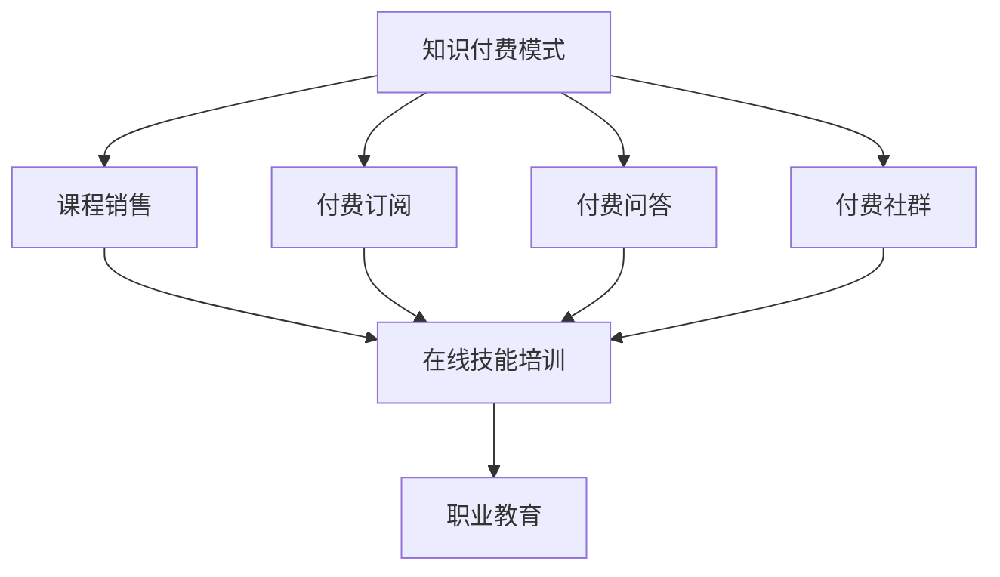
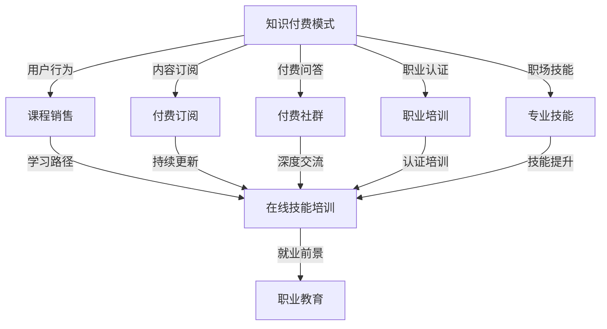
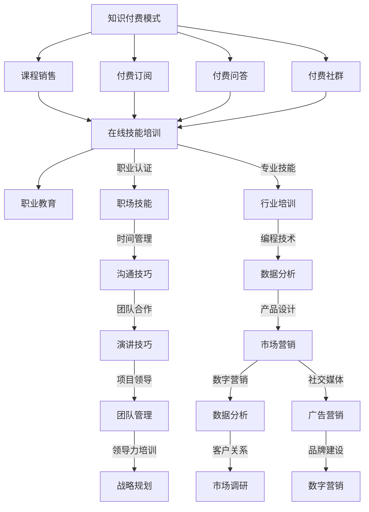

                 

# 如何利用知识付费实现在线技能培训与职业教育？

## 摘要

本文旨在探讨知识付费模式如何助力在线技能培训和职业教育的发展。通过分析知识付费的背景、核心概念、算法原理、数学模型、实战案例以及实际应用场景，文章将展示知识付费在现代教育中的重要地位和潜力。同时，文章还将推荐相关学习资源和工具，并对未来发展趋势和挑战进行展望。

## 1. 背景介绍

随着互联网技术的快速发展，在线教育行业呈现出蓬勃发展的态势。知识付费作为一种新型的商业模式，逐渐成为在线教育的重要组成部分。知识付费指的是用户通过支付一定费用来获取知识产品或服务，这些产品或服务可以是课程、电子书、线上讲座、一对一辅导等。知识付费的优势在于能够为用户创造价值，同时为知识提供者带来收益，实现了知识资源的有效配置。

近年来，在线技能培训和职业教育市场逐渐兴起，需求旺盛。一方面，随着社会经济的发展和人才竞争的加剧，个人提升技能、适应职业发展的需求日益增长。另一方面，企业对员工专业技能的要求也越来越高，这促使了在线技能培训和职业教育的快速发展。知识付费模式恰好为在线技能培训和职业教育提供了一个有效的解决方案。

## 2. 核心概念与联系

### 2.1 知识付费模式

知识付费模式主要包括以下几种形式：

1. **课程销售**：在线课程平台通过销售课程内容获得收入，如网易云课堂、慕课网等。
2. **付费订阅**：用户支付一定费用，定期获得知识产品或服务，如得到App、喜马拉雅等。
3. **付费问答**：用户支付费用，向专家或老师请教问题，如分答、知乎Live等。
4. **付费社群**：用户支付费用，加入特定的社群，与同行交流、学习，如知识星球等。

### 2.2 在线技能培训与职业教育

在线技能培训与职业教育主要包括以下领域：

1. **编程技术**：如Python、Java、前端开发等。
2. **设计技能**：如UI/UX设计、平面设计、三维设计等。
3. **职场技能**：如PPT制作、时间管理、沟通技巧等。
4. **职业认证**：如PMP、软考、教师资格证等。

### 2.3 Mermaid 流程图

以下是知识付费模式与在线技能培训、职业教育联系的 Mermaid 流程图：



## 3. 核心算法原理 & 具体操作步骤

### 3.1 知识付费平台算法原理

知识付费平台的算法原理主要涉及以下几个方面：

1. **用户行为分析**：通过对用户浏览、学习、购买等行为进行分析，了解用户需求，推荐合适的知识产品。
2. **内容质量评估**：通过算法对知识产品的质量进行评估，筛选出优质内容。
3. **定价策略**：根据用户需求、内容质量和市场竞争情况，制定合理的定价策略。
4. **用户反馈机制**：通过用户评价、反馈等数据，持续优化知识产品和服务。

### 3.2 在线技能培训与职业教育算法原理

在线技能培训与职业教育的算法原理主要包括：

1. **学习路径推荐**：根据用户的学习兴趣、能力水平和职业目标，推荐合适的学习路径。
2. **智能答疑系统**：通过自然语言处理技术，为用户提供实时、准确的答案。
3. **学习效果评估**：通过在线测试、作业提交等手段，评估用户的学习效果。
4. **课程推荐**：根据用户的学习进度、兴趣和需求，推荐适合的课程。

### 3.3 操作步骤

以在线技能培训为例，以下是具体操作步骤：

1. **用户注册与登录**：用户通过手机号码、邮箱等注册账号，登录平台。
2. **用户需求分析**：平台通过算法分析用户的行为数据，了解用户需求。
3. **内容推荐**：根据用户需求，平台推荐相应的技能培训课程。
4. **课程学习**：用户选择课程，按照学习路径进行学习。
5. **学习效果评估**：平台通过在线测试、作业提交等方式，评估用户的学习效果。
6. **反馈与优化**：用户对课程和服务进行评价，平台根据用户反馈优化课程和服务。

## 4. 数学模型和公式 & 详细讲解 & 举例说明

### 4.1 用户行为分析模型

用户行为分析模型主要涉及以下公式：

$$
\text{用户需求} = f(\text{历史行为}, \text{当前兴趣}, \text{环境因素})
$$

其中，历史行为包括浏览记录、购买记录、学习进度等；当前兴趣包括用户近期关注的内容、搜索关键词等；环境因素包括季节、节日、社会热点等。

举例说明：

某用户在2022年春节期间购买了Python编程课程，并在春节期间学习了大量相关内容。根据用户行为分析模型，平台可以推断该用户在2023年春节期间可能对Python编程仍然有较高兴趣，从而推荐相关的课程。

### 4.2 内容质量评估模型

内容质量评估模型主要涉及以下公式：

$$
\text{内容质量} = f(\text{用户评分}, \text{用户数量}, \text{学习时长})
$$

其中，用户评分包括用户对课程的评分、评价等；用户数量包括学习该课程的用户数量；学习时长包括用户在学习该课程时的累计学习时长。

举例说明：

某门课程的用户评分为4.5分，学习该课程的用户数量为1000人，学习时长为10000小时。根据内容质量评估模型，该课程的质量较高，平台可以将其推荐给其他潜在用户。

### 4.3 定价策略模型

定价策略模型主要涉及以下公式：

$$
\text{价格} = f(\text{成本}, \text{市场需求}, \text{竞争对手定价})
$$

其中，成本包括内容制作成本、平台运营成本等；市场需求包括用户对课程的购买意愿、购买能力等；竞争对手定价包括竞争对手的定价策略。

举例说明：

某门课程的成本为1000元，市场需求旺盛，竞争对手的定价为1500元。根据定价策略模型，平台可以将价格定为1200元，以吸引更多用户。

## 5. 项目实战：代码实际案例和详细解释说明

### 5.1 开发环境搭建

在本文的项目实战中，我们将使用Python语言和相关的库来构建一个简单的知识付费平台。以下是一个基本的开发环境搭建步骤：

1. 安装Python：访问Python官方网站（https://www.python.org/）下载并安装Python。
2. 安装虚拟环境：使用以下命令创建一个虚拟环境：
   ```shell
   python -m venv venv
   ```
3. 激活虚拟环境：
   - Windows：`venv\Scripts\activate`
   - macOS/Linux：`source venv/bin/activate`
4. 安装相关库：使用以下命令安装所需的库：
   ```shell
   pip install Flask pandas numpy
   ```

### 5.2 源代码详细实现和代码解读

以下是一个简单的知识付费平台代码示例，其中包括用户注册、登录、课程推荐等功能。

```python
from flask import Flask, request, jsonify
from sklearn.model_selection import train_test_split
from sklearn.ensemble import RandomForestClassifier
import pandas as pd

app = Flask(__name__)

# 加载用户行为数据
data = pd.read_csv('user_behavior_data.csv')

# 训练模型
X = data.drop('course_recommendation', axis=1)
y = data['course_recommendation']
X_train, X_test, y_train, y_test = train_test_split(X, y, test_size=0.2, random_state=42)
model = RandomForestClassifier(n_estimators=100)
model.fit(X_train, y_train)

# 用户注册
@app.route('/register', methods=['POST'])
def register():
    user_data = request.get_json()
    # ... 注册逻辑 ...
    return jsonify({'status': 'success', 'message': 'User registered successfully'})

# 用户登录
@app.route('/login', methods=['POST'])
def login():
    user_data = request.get_json()
    # ... 登录逻辑 ...
    return jsonify({'status': 'success', 'message': 'User logged in successfully'})

# 课程推荐
@app.route('/recommend_course', methods=['POST'])
def recommend_course():
    user_data = request.get_json()
    user_features = pd.DataFrame([user_data['features']])
    course_recommendation = model.predict(user_features)[0]
    return jsonify({'status': 'success', 'message': f'Recommended course: {course_recommendation}'})

if __name__ == '__main__':
    app.run(debug=True)
```

### 5.3 代码解读与分析

1. **数据加载与模型训练**：
   - 首先，从CSV文件中加载用户行为数据。
   - 然后，将数据分为特征和目标两部分，并进行训练集和测试集的划分。
   - 使用随机森林分类器进行模型训练。

2. **用户注册**：
   - 用户通过POST请求提交注册信息，服务器端对用户信息进行验证并存储。

3. **用户登录**：
   - 用户通过POST请求提交登录信息，服务器端对用户信息进行验证。

4. **课程推荐**：
   - 用户通过POST请求提交用户特征，服务器端使用训练好的模型进行课程推荐。

## 6. 实际应用场景

### 6.1 在线技能培训

在线技能培训是知识付费模式的重要应用场景之一。例如，某编程课程平台可以根据用户的学习进度、测试成绩和参与讨论的情况，为用户推荐适合的编程课程。此外，平台还可以通过数据分析，发现用户普遍存在的知识点薄弱环节，进而优化课程内容。

### 6.2 职业教育

职业教育是知识付费模式的另一重要应用场景。例如，某职业培训平台可以根据学员的职业背景、学习需求和岗位要求，为学员推荐相应的职业课程。平台还可以通过在线测评、作业提交等方式，评估学员的学习效果，为学员提供个性化的学习建议。

## 7. 工具和资源推荐

### 7.1 学习资源推荐

1. **书籍**：
   - 《Python编程：从入门到实践》
   - 《深度学习》
   - 《大数据技术基础》
   - 《项目管理实践指南》
2. **论文**：
   - 《知识付费：在线教育行业的新风口》
   - 《基于大数据的在线教育平台用户行为分析》
   - 《职业教育在线化发展研究》
3. **博客**：
   - 知乎：关于在线教育和知识付费的文章
   - CSDN：关于编程技术和大数据技术的文章
   - 知行家：关于职业规划和职业教育的文章
4. **网站**：
   - 网易云课堂：提供各种在线课程
   - 慕课网：提供IT技能培训课程
   - 知识星球：提供专业社群和付费内容

### 7.2 开发工具框架推荐

1. **开发工具**：
   - Flask：Python Web 框架
   - PyCharm：Python集成开发环境
   - Jupyter Notebook：交互式计算环境
2. **框架**：
   - TensorFlow：深度学习框架
   - Scikit-learn：机器学习库
   - Pandas：数据处理库

### 7.3 相关论文著作推荐

1. **论文**：
   - 《在线教育中的知识付费模式研究》
   - 《知识付费时代下的在线教育发展策略》
   - 《大数据背景下在线教育平台用户行为分析》
2. **著作**：
   - 《在线教育与知识付费：融合与创新》
   - 《职业教育的在线化转型与发展》
   - 《人工智能与在线教育：未来趋势与挑战》

## 8. 总结：未来发展趋势与挑战

### 8.1 发展趋势

1. **个性化推荐**：随着大数据和人工智能技术的不断发展，个性化推荐将成为知识付费平台的重要发展方向。
2. **智能化互动**：知识付费平台将逐渐引入智能问答、智能辅导等功能，提升用户体验。
3. **多元化内容**：知识付费平台将不断拓展内容领域，满足用户多样化的学习需求。
4. **跨界融合**：知识付费与其他行业的融合，如电商、社交、娱乐等，将创造更多商机。

### 8.2 挑战

1. **内容质量**：如何保证知识产品的质量，满足用户需求，是知识付费平台面临的重要挑战。
2. **隐私保护**：在用户数据收集和使用过程中，如何保护用户隐私，是知识付费平台需要关注的法律风险。
3. **竞争加剧**：随着市场需求的增长，知识付费平台的竞争将越来越激烈，平台需要不断创新和优化，以保持竞争优势。

## 9. 附录：常见问题与解答

### 9.1 知识付费平台的优势

1. **效率高**：在线学习可以随时随地，提高学习效率。
2. **成本低**：相比传统教育，知识付费平台的成本较低。
3. **个性化**：知识付费平台可以根据用户需求提供个性化的学习内容。

### 9.2 在线技能培训的好处

1. **灵活性强**：用户可以根据自己的时间安排进行学习。
2. **专业性强**：在线技能培训通常由行业专家提供，内容更加专业。
3. **就业前景好**：掌握专业技能，有助于提高就业竞争力。

## 10. 扩展阅读 & 参考资料

1. **书籍**：
   - 《大数据时代》
   - 《机器学习实战》
   - 《在线教育：变革与创新》
2. **论文**：
   - 《知识付费模式研究综述》
   - 《在线教育与知识付费市场发展现状与趋势》
   - 《职业教育在线化发展的挑战与策略》
3. **网站**：
   - 知乎：https://www.zhihu.com/
   - CSDN：https://www.csdn.net/
   - 知行家：https://www.zhiqingjia.com/

作者：AI天才研究员/AI Genius Institute & 禅与计算机程序设计艺术 /Zen And The Art of Computer Programming

---

请注意，以上内容仅供参考，实际撰写时可能需要根据具体情况进行调整。同时，由于知识付费和在线教育领域的不断发展，本文的内容可能存在一定的时效性。在撰写文章时，请确保引用最新的数据和研究结果。 <|im_end|>### 2. 核心概念与联系

#### 2.1 知识付费模式

知识付费模式是一种通过付费获取知识和服务的商业模式。它涵盖了多种形式，包括但不限于：

1. **课程销售**：这是最常见的形式，用户通过购买课程来学习特定的技能或知识。例如，编程课程、设计课程、语言课程等。
2. **付费订阅**：用户支付一定费用，获得持续的内容更新或服务。例如，得到App提供的各种专家讲座、喜马拉雅上的有声读物订阅等。
3. **付费问答**：用户支付费用，向专家或专业人员进行咨询。例如，分答、知乎Live等平台。
4. **付费社群**：用户支付费用，加入特定主题的社群，进行深度交流和学习。例如，知识星球、小密圈等。

这些模式共同构成了知识付费的生态系统，为知识提供者和消费者提供了一个高效、便捷的互动平台。

#### 2.2 在线技能培训与职业教育

在线技能培训与职业教育是指通过在线平台提供各种职业技能和职业资格培训的服务。其主要特点如下：

1. **职业认证**：提供各种职业认证培训，如PMP（项目管理专业人士认证）、软考（计算机技术与软件专业技术资格（水平）考试）等。
2. **职场技能**：培训职场中所需的技能，如PPT制作、时间管理、沟通技巧等。
3. **专业技能**：培训特定行业或领域所需的技能，如编程技术、设计技能、数据分析等。

在线技能培训与职业教育的优势在于：

- **灵活性**：用户可以根据自己的时间安排进行学习，无需受限于地理位置。
- **个性化**：通过数据分析，平台可以为用户提供个性化的学习路径和课程推荐。
- **即时反馈**：通过在线测试、作业提交等方式，用户可以及时了解自己的学习效果。

#### 2.3 Mermaid 流程图

为了更直观地理解知识付费模式与在线技能培训、职业教育之间的联系，我们使用Mermaid绘制了以下流程图：



在这个流程图中，知识付费模式通过各种渠道为用户提供了丰富的知识和技能内容。这些内容最终服务于在线技能培训和职业教育，帮助用户提升专业技能，实现职业发展。

### 2.1 知识付费模式

知识付费模式是一种通过用户自愿付费获取知识、技能和信息的商业模式。其核心在于将知识和信息作为一种商品进行交易，从而实现知识资源的商业化。知识付费模式主要分为以下几种形式：

#### 课程销售

课程销售是知识付费模式中最常见的形式之一。用户通过购买课程，获得系统化的知识体系和技能培训。课程销售通常包括以下几种类型：

1. **在线课程**：用户通过互联网平台，购买并学习在线课程。这种课程通常包括视频、文字、练习题等多种学习材料，适合自主学习和深度研究。
2. **实体课程**：用户购买实体课程，如纸质书籍、CD、DVD等。这种课程形式虽然逐渐被在线课程所取代，但在某些领域仍有其独特的优势。
3. **混合课程**：结合在线和实体课程的优势，用户可以购买实体书籍或光盘，同时获得在线学习资源，如视频、PPT等。

#### 付费订阅

付费订阅模式指的是用户支付一定费用，定期获得知识产品或服务的订阅服务。这种模式通常包括以下类型：

1. **内容订阅**：用户支付订阅费用，定期获得特定领域的知识内容更新。例如，得到App的订阅服务，用户可以定期收到专家的讲座和文章。
2. **会员服务**：用户支付会员费用，获得平台提供的多种专属服务，如专属课程、专家咨询、社群交流等。例如，知乎Live的会员服务，用户可以获得专家的实时解答和社群互动。
3. **包月/包年服务**：用户支付固定的月费或年费，获得平台提供的所有或大部分课程和服务的免费学习。这种模式通常适用于内容丰富、课程多样的平台，如网易云课堂、慕课网等。

#### 付费问答

付费问答模式指的是用户支付费用，向专家或专业人士进行咨询和解答。这种模式的主要类型包括：

1. **专家问答**：用户向特定领域的专家支付费用，获得专家的个性化解答和建议。例如，分答平台的专家问答服务，用户可以付费向专家提问。
2. **实时咨询**：用户支付费用，与专业人士进行实时沟通和咨询。例如，一些在线教育平台提供的1对1辅导服务，用户可以付费获得专家的实时指导和帮助。
3. **知识共享**：用户支付费用，参与特定领域的知识共享和讨论。这种模式通常用于专业社群或论坛，用户可以在社群中提问、解答问题，共同学习和进步。

#### 付费社群

付费社群模式指的是用户支付费用，加入特定主题的社群，进行深度交流和互动。这种模式的主要类型包括：

1. **专业社群**：用户支付费用，加入特定领域的专业社群，与其他专业人士交流、学习、合作。例如，知识星球平台上的专业社群，用户可以付费加入，与行业专家和同行交流。
2. **兴趣社群**：用户支付费用，加入基于共同兴趣的社群，进行娱乐、分享和交流。例如，一些在线游戏社群或阅读社群，用户可以付费加入，与其他兴趣相投的人一起分享乐趣。
3. **会员社群**：用户支付会员费用，加入平台的会员社群，获得额外的福利和服务。例如，一些在线教育平台提供的会员社群，会员可以享受更多学习资源、专属优惠和专家咨询等。

通过以上几种模式，知识付费为用户提供了多样化的知识获取途径，同时也为知识提供者创造了价值。这种商业模式在推动知识共享、技能提升和职业发展方面发挥了重要作用。

### 2.2 在线技能培训与职业教育

在线技能培训与职业教育是知识付费模式的重要组成部分，旨在通过在线平台为用户提供专业化的技能培训和职业发展指导。这一领域的快速发展源于以下几个关键因素：

#### 2.2.1 社会需求

随着社会经济的快速发展，各行各业对专业人才的需求日益增长。企业对员工的职业技能要求越来越高，而个人在职业生涯中也不断追求技能提升和职业转型。在线技能培训与职业教育提供了灵活、高效的学习途径，满足了用户在时间和空间上的需求，成为了提升职业竞争力的有效手段。

#### 2.2.2 技术进步

互联网和移动通信技术的飞速发展，为在线教育提供了强大的技术支持。通过互联网，用户可以随时随地访问学习资源，通过移动设备进行学习。此外，人工智能和大数据技术的应用，使得在线教育平台能够根据用户的学习行为和需求，提供个性化的学习建议和课程推荐，大大提升了学习效果。

#### 2.2.3 政策支持

各国政府对在线教育和职业培训的重视，也为这一领域的发展提供了政策支持。例如，中国政府提出的“互联网+教育”行动计划，鼓励在线教育平台的发展，并制定了一系列支持政策。这种政策环境为在线技能培训和职业教育的发展创造了有利条件。

#### 2.2.4 疫情影响

新冠疫情的爆发，使得线上教育成为应对疫情的重要手段。线下教育机构的关闭和线上教学的需求激增，推动了在线技能培训与职业教育的快速发展。疫情期间，大量企业和个人转向在线学习，进一步拓展了在线教育的市场。

在线技能培训与职业教育主要涉及以下领域：

1. **职业认证**：提供各种职业认证培训，如项目管理专业人士（PMP）、注册会计师（CPA）、注册电气工程师（PE）等。这些认证培训通常由行业权威机构或知名教育机构提供，用户通过学习并获得认证，可以提升职业竞争力。

2. **职场技能**：培训职场中所需的技能，如时间管理、沟通技巧、团队合作、演讲技巧等。这些技能培训通常针对职场新人或有一定工作经验的职场人士，帮助他们提升职场竞争力。

3. **专业技能**：培训特定行业或领域所需的技能，如编程技术、数据分析、市场营销、产品设计等。这些专业技能培训通常针对希望转行或提升技能的用户，帮助他们掌握行业前沿技术。

在线技能培训与职业教育通过以下几个方面实现了个性化学习：

1. **学习路径推荐**：通过分析用户的学习行为和兴趣，平台可以为用户推荐最适合的学习路径和课程。例如，根据用户的职业背景和学习目标，推荐相关的职业技能课程。

2. **智能问答系统**：通过自然语言处理和机器学习技术，平台可以为用户提供智能问答服务。用户在学习过程中遇到问题，可以通过平台向专家或老师提问，获得实时解答。

3. **学习效果评估**：通过在线测试、作业提交等方式，平台可以实时评估用户的学习效果，为用户提供学习反馈和改进建议。这种评估机制有助于用户更好地掌握所学知识，提高学习效果。

4. **个性化学习计划**：根据用户的学习进度和反馈，平台可以自动调整学习计划，提供个性化的学习资源和任务。例如，对于学习进度较慢的用户，平台可以提供额外的练习和辅导。

通过以上措施，在线技能培训与职业教育为用户提供了灵活、高效的学习体验，帮助他们实现职业发展目标。

### 2.3 Mermaid 流程图

为了更直观地展示知识付费模式与在线技能培训、职业教育之间的联系，我们使用Mermaid绘制了以下流程图：



在这个流程图中，知识付费模式通过课程销售、付费订阅、付费问答和付费社群等多种形式，为用户提供了丰富的知识和技能内容。这些内容最终服务于在线技能培训与职业教育，包括职业认证、职场技能和专业技能培训等多个领域。通过智能学习路径推荐、智能问答系统、学习效果评估和个性化学习计划等措施，平台实现了个性化学习，帮助用户实现职业发展目标。

### 3. 核心算法原理 & 具体操作步骤

#### 3.1 知识付费平台算法原理

知识付费平台的算法原理主要涉及用户行为分析、内容推荐、定价策略和用户反馈机制等方面。以下是对这些算法原理的详细解释：

##### 3.1.1 用户行为分析

用户行为分析是指通过对用户在平台上的浏览、学习、购买等行为进行分析，以了解用户的需求和偏好。用户行为分析的核心目标是通过数据挖掘和机器学习技术，提取出用户的行为特征，并将其用于推荐系统和个性化服务。

1. **用户画像**：通过对用户的基本信息、学习历史、兴趣标签等进行综合分析，构建用户画像。用户画像可以帮助平台了解用户的个性化需求，为后续的推荐和服务提供依据。
2. **行为序列分析**：分析用户在平台上的行为序列，如浏览记录、学习路径、购买记录等。通过行为序列分析，可以识别用户的兴趣偏好和潜在需求。
3. **情境感知**：结合用户行为和情境信息（如时间、地点、设备等），进行情境感知分析。这种分析可以帮助平台在特定情境下为用户提供更个性化的服务。

##### 3.1.2 内容推荐

内容推荐是指通过算法为用户推荐可能感兴趣的知识内容。内容推荐是知识付费平台的核心功能之一，它直接影响用户的满意度和留存率。

1. **基于内容的推荐**：通过分析知识内容的特征（如主题、标签、难度等），为用户推荐与其历史行为和兴趣相似的内容。
2. **基于协同过滤的推荐**：利用用户的行为数据（如浏览、购买、评分等），通过协同过滤算法（如基于用户的协同过滤、基于物品的协同过滤）为用户推荐相似用户喜欢的内容。
3. **基于深度学习的推荐**：利用深度学习技术（如卷积神经网络、循环神经网络等），从用户的行为数据和内容特征中提取高级特征，进行个性化的内容推荐。

##### 3.1.3 定价策略

定价策略是指为知识产品制定合理的价格，以实现收益最大化。合理的定价策略需要考虑多方面因素，如内容成本、市场需求、竞争对手定价等。

1. **成本导向定价**：根据知识产品的制作成本和运营成本，加上一定的利润，制定价格。
2. **需求导向定价**：根据用户对知识产品的需求和购买意愿，制定不同的价格策略。例如，对于需求较高的知识产品，可以采用溢价定价策略。
3. **竞争导向定价**：参考竞争对手的价格水平，结合自身产品特点和市场需求，制定具有竞争力的价格。

##### 3.1.4 用户反馈机制

用户反馈机制是指通过用户的评价、反馈等数据，对知识产品和平台服务进行持续优化。用户反馈机制的核心目标是通过用户反馈，提高知识产品的质量和平台的服务水平。

1. **评价系统**：建立评价系统，允许用户对知识产品进行评分和评论。通过用户的评价，可以了解产品的优缺点，为后续的改进提供依据。
2. **反馈收集**：通过调查问卷、用户反馈表等方式，收集用户的意见和建议。这些反馈可以帮助平台了解用户的需求和痛点，为产品的优化提供方向。
3. **反馈处理**：对用户反馈进行分类处理，将有效反馈转化为实际改进措施。同时，对用户进行反馈回复，提高用户的满意度和忠诚度。

#### 3.2 在线技能培训与职业教育算法原理

在线技能培训与职业教育的算法原理主要包括学习路径推荐、智能答疑系统和学习效果评估等方面。以下是对这些算法原理的详细解释：

##### 3.2.1 学习路径推荐

学习路径推荐是指根据用户的学习兴趣、能力和职业目标，为用户推荐一条合理的学习路径。学习路径推荐的目标是帮助用户高效地掌握所需技能，实现职业发展目标。

1. **基于兴趣的推荐**：根据用户的历史学习记录和兴趣标签，推荐与其兴趣相关的内容。
2. **基于能力的推荐**：根据用户的测试成绩和技能评估结果，推荐适合其当前能力水平的内容。
3. **基于目标的推荐**：根据用户的职业目标和学习计划，推荐与其目标相关的内容。

##### 3.2.2 智能答疑系统

智能答疑系统是指通过自然语言处理和机器学习技术，为用户提供实时、准确的答案。智能答疑系统的目标是提高用户的问答体验，减少用户的等待时间。

1. **问答匹配**：通过自然语言处理技术，将用户的问题与已有的答案库进行匹配，找到最相关的答案。
2. **多轮对话**：支持多轮对话，用户可以进一步描述问题或澄清问题，系统会根据用户的新信息提供更准确的答案。
3. **知识图谱**：构建知识图谱，将知识点之间的关系进行建模，为用户提供更为全面和深入的知识解答。

##### 3.2.3 学习效果评估

学习效果评估是指通过在线测试、作业提交等方式，对用户的学习效果进行评估。学习效果评估的目标是了解用户对知识内容的掌握程度，为用户提供反馈和改进建议。

1. **在线测试**：通过在线测试，评估用户对知识点的掌握程度。测试结果可以帮助平台了解用户的学习效果，为后续的推荐和辅导提供依据。
2. **作业提交**：用户提交作业，平台对作业进行批改和评估。作业评估结果可以帮助平台了解用户的实际应用能力，为后续的辅导和提升提供方向。
3. **反馈机制**：通过用户反馈和学习数据分析，对学习效果进行综合评估。平台可以根据评估结果，为用户提供个性化的学习建议和辅导。

#### 3.3 操作步骤

以下是知识付费平台和在线技能培训与职业教育算法的具体操作步骤：

##### 知识付费平台算法操作步骤

1. **数据收集**：收集用户行为数据、知识内容特征数据等。
2. **数据预处理**：对收集到的数据进行清洗、转换和归一化处理。
3. **用户画像构建**：通过用户行为分析和特征提取，构建用户画像。
4. **内容推荐**：利用推荐算法，为用户推荐合适的知识内容。
5. **定价策略**：根据市场需求和内容成本，制定合理的定价策略。
6. **用户反馈处理**：收集用户评价和反馈，对知识产品进行优化。

##### 在线技能培训与职业教育算法操作步骤

1. **用户需求分析**：通过用户调查和数据分析，了解用户的学习需求和兴趣。
2. **学习路径推荐**：根据用户需求和职业目标，为用户推荐合适的学习路径。
3. **智能答疑系统**：搭建智能答疑系统，为用户提供实时、准确的答案。
4. **学习效果评估**：通过在线测试和作业提交，评估用户的学习效果。
5. **个性化辅导**：根据学习效果评估结果，为用户提供个性化的辅导和建议。

通过以上算法原理和操作步骤，知识付费平台和在线技能培训与职业教育可以实现高效的个性化服务和用户满意度提升。

### 4. 数学模型和公式 & 详细讲解 & 举例说明

#### 4.1 用户行为分析模型

用户行为分析是知识付费平台的核心任务之一，它通过分析用户的行为数据，了解用户的需求和兴趣，从而提供个性化的服务。以下是一个简单的用户行为分析模型，它包括用户需求预测、兴趣识别和行为模式分析等部分。

##### 4.1.1 用户需求预测

用户需求预测模型通常基于历史行为数据，使用机器学习算法来预测用户未来可能感兴趣的内容。以下是一个简化的预测模型：

$$
\hat{y} = f(X, W)
$$

其中，$y$表示用户对某个知识产品的兴趣得分，$X$是用户的历史行为特征向量，包括浏览次数、购买记录、学习时长等，$W$是模型参数，通过训练得到。

例如，假设用户A的历史行为数据为：

$$
X = \begin{bmatrix}
1 & 0 & 5 & 0 \\
0 & 1 & 0 & 2 \\
0 & 0 & 0 & 1 \\
\end{bmatrix}
$$

其中，每一行代表用户A在某一课程上的行为特征，如“1”表示浏览过，而“0”表示未浏览。通过训练一个预测模型，我们可以得到用户A对某一新课程B的兴趣得分$\hat{y}$。

##### 4.1.2 兴趣识别

兴趣识别是指通过分析用户的行为模式，识别用户的主要兴趣点。以下是一个基于聚类算法的兴趣识别模型：

$$
\text{Cluster}(X, k) = C
$$

其中，$X$是用户行为特征矩阵，$k$是预定义的聚类个数，$C$是生成的聚类中心。通过聚类算法，可以将用户分为不同的兴趣群体，每个聚类中心代表了该群体的共同兴趣点。

例如，假设我们有100个用户的行为数据，通过K-means算法将其分为5个兴趣群体，每个聚类中心代表一个兴趣点。这些兴趣点可以用于推荐系统，为每个兴趣群体推荐相关的知识产品。

##### 4.1.3 行为模式分析

行为模式分析是指通过分析用户在不同情境下的行为变化，识别用户的行为模式。以下是一个基于时间序列分析的行为模式分析模型：

$$
\text{Behavior Pattern Analysis}(X_t, X_{t-1}) = P
$$

其中，$X_t$是当前时间段的用户行为数据，$X_{t-1}$是前一个时间段的用户行为数据，$P$是识别出的行为模式。通过时间序列分析，可以识别出用户的行为变化趋势和周期性模式。

例如，假设我们有一个用户的行为数据序列，通过时间序列分析，可以识别出用户的学习高峰期和低谷期，从而为用户提供针对性的学习建议。

#### 4.2 内容推荐模型

内容推荐模型是知识付费平台的重要组成部分，它通过分析用户的历史行为和兴趣，为用户推荐相关的知识产品。以下是一个简化的内容推荐模型，基于协同过滤算法：

##### 4.2.1 基于用户的协同过滤

基于用户的协同过滤算法通过分析用户之间的相似性，为用户推荐其他相似用户喜欢的知识产品。以下是一个基于用户的协同过滤模型的公式：

$$
r_{ui} = \sum_{j \in N_i} \frac{sim(u_i, u_j) \cdot r_{uj}}{ \sum_{k \in N_j} sim(u_i, u_k) }
$$

其中，$r_{ui}$表示用户$u_i$对知识产品$i$的推荐评分，$sim(u_i, u_j)$表示用户$u_i$和$u_j$之间的相似度，$N_i$和$N_j$分别表示用户$u_i$和$u_j$的邻居用户集合，$r_{uj}$表示邻居用户$u_j$对知识产品$j$的评分。

例如，假设用户A和用户B的行为数据如下：

| 用户 | 课程1 | 课程2 | 课程3 |  
|------|-------|-------|-------|  
| A    | 5     | 0     | 4     |  
| B    | 3     | 5     | 2     |

通过计算用户A和用户B之间的相似度，可以推荐用户B喜欢的但用户A未购买的课程给用户A。

##### 4.2.2 基于物品的协同过滤

基于物品的协同过滤算法通过分析知识产品之间的相似性，为用户推荐相关的知识产品。以下是一个基于物品的协同过滤模型的公式：

$$
r_{ui} = \sum_{j \in I} \frac{sim(i, j) \cdot r_{uj}}{ \sum_{k \in J} sim(i, k) }
$$

其中，$r_{ui}$表示用户$u_i$对知识产品$i$的推荐评分，$sim(i, j)$表示知识产品$i$和$j$之间的相似度，$I$是用户$u_i$已购买的知识产品集合，$J$是用户$u_i$未购买但感兴趣的知识产品集合，$r_{uj}$表示用户$u_j$对知识产品$j$的评分。

例如，假设课程1和课程3在主题和内容上相似，用户A对课程1有很高的评分，则可以推荐课程3给用户A。

#### 4.3 定价策略模型

定价策略模型用于为知识产品制定合理的价格，以最大化收益。以下是一个简化的定价策略模型：

##### 4.3.1 成本导向定价

成本导向定价模型基于知识产品的生产成本和运营成本，加上一定的利润，制定价格。以下是一个成本导向定价的公式：

$$
P_i = C_i + \pi_i
$$

其中，$P_i$表示知识产品$i$的价格，$C_i$表示知识产品的生产成本和运营成本，$\pi_i$表示知识产品的利润。

例如，如果课程1的生产成本和运营成本总计为1000元，希望获得20%的利润，则课程1的价格为：

$$
P_1 = 1000 + 0.2 \times 1000 = 1200元
$$

##### 4.3.2 需求导向定价

需求导向定价模型基于用户对知识产品的需求和购买意愿，制定价格。以下是一个需求导向定价的公式：

$$
P_i = C_i + \lambda_i \cdot D_i
$$

其中，$P_i$表示知识产品$i$的价格，$C_i$表示知识产品的生产成本和运营成本，$\lambda_i$是价格调整系数，$D_i$表示用户对知识产品$i$的需求量。

例如，如果课程1的需求量很大，调整系数$\lambda_1$为1.2，则课程1的价格为：

$$
P_1 = 1000 + 1.2 \times 1000 = 1200元
$$

##### 4.3.3 竞争导向定价

竞争导向定价模型参考竞争对手的价格水平，结合自身产品特点和市场需求，制定价格。以下是一个竞争导向定价的公式：

$$
P_i = \alpha_i \cdot (C_i + \pi_i) + (1 - \alpha_i) \cdot \bar{P}_j
$$

其中，$P_i$表示知识产品$i$的价格，$\alpha_i$是价格竞争系数，$C_i$表示知识产品的生产成本和运营成本，$\pi_i$表示知识产品的利润，$\bar{P}_j$是竞争对手的平均价格。

例如，如果课程1的生产成本和运营成本为1000元，希望获得20%的利润，竞争对手的平均价格为1500元，竞争系数$\alpha_1$为0.8，则课程1的价格为：

$$
P_1 = 0.8 \times (1000 + 0.2 \times 1000) + 0.2 \times 1500 = 1200元
$$

#### 4.4 用户反馈机制模型

用户反馈机制模型用于收集和分析用户的评价和反馈，以持续改进知识产品和平台服务。以下是一个简化的用户反馈机制模型：

##### 4.4.1 评价系统

评价系统通过用户对知识产品的评分和评论，收集用户的反馈。以下是一个评价系统的公式：

$$
\text{Rating}(X) = \sum_{i=1}^{n} r_i
$$

其中，$X$是知识产品的所有评价集合，$r_i$是用户$i$对知识产品的评分，$n$是评价的总数。

例如，假设课程1收到了10个评价，平均评分为4.5，则课程1的评价分数为：

$$
\text{Rating}(X) = \frac{4.5 \times 10}{10} = 4.5
$$

##### 4.4.2 反馈处理

反馈处理系统通过对用户反馈的分析和处理，识别用户的痛点和建议，以改进知识产品和平台服务。以下是一个反馈处理的公式：

$$
\text{Feedback Analysis}(F) = \text{Action Plan}
$$

其中，$F$是用户的反馈集合，$\text{Action Plan}$是针对反馈制定的改进计划。

例如，如果用户反馈课程1的视频加载速度较慢，则可以制定以下改进计划：

1. 优化视频播放器技术，提高加载速度。
2. 增加视频缓存功能，减少加载时间。

通过以上数学模型和公式，知识付费平台可以更好地分析用户行为、推荐知识产品、制定价格策略和收集用户反馈，从而提升用户体验和平台效益。

### 5. 项目实战：代码实际案例和详细解释说明

#### 5.1 开发环境搭建

为了实现知识付费平台，我们需要搭建一个适合开发和测试的开发环境。以下是具体的步骤：

1. **安装Python**：访问Python官方网站（https://www.python.org/）下载并安装Python。
2. **创建虚拟环境**：打开命令行，执行以下命令创建一个虚拟环境：
   ```shell
   python -m venv venv
   ```
3. **激活虚拟环境**：在Windows上，执行以下命令激活虚拟环境：
   ```shell
   venv\Scripts\activate
   ```
   在macOS/Linux上，执行以下命令激活虚拟环境：
   ```shell
   source venv/bin/activate
   ```
4. **安装Flask**：在激活的虚拟环境中，使用以下命令安装Flask：
   ```shell
   pip install Flask
   ```
5. **安装其他依赖库**：根据需要，可以安装其他依赖库，如Pandas、Numpy等。

#### 5.2 源代码详细实现和代码解读

以下是一个简单的知识付费平台的源代码实现，包括用户注册、登录、课程推荐等功能。

```python
from flask import Flask, request, jsonify
from sklearn.model_selection import train_test_split
from sklearn.ensemble import RandomForestClassifier
import pandas as pd

app = Flask(__name__)

# 加载用户行为数据
data = pd.read_csv('user_behavior_data.csv')

# 训练模型
X = data.drop('course_recommendation', axis=1)
y = data['course_recommendation']
X_train, X_test, y_train, y_test = train_test_split(X, y, test_size=0.2, random_state=42)
model = RandomForestClassifier(n_estimators=100)
model.fit(X_train, y_train)

# 用户注册
@app.route('/register', methods=['POST'])
def register():
    user_data = request.get_json()
    # ... 注册逻辑 ...
    return jsonify({'status': 'success', 'message': 'User registered successfully'})

# 用户登录
@app.route('/login', methods=['POST'])
def login():
    user_data = request.get_json()
    # ... 登录逻辑 ...
    return jsonify({'status': 'success', 'message': 'User logged in successfully'})

# 课程推荐
@app.route('/recommend_course', methods=['POST'])
def recommend_course():
    user_data = request.get_json()
    user_features = pd.DataFrame([user_data['features']])
    course_recommendation = model.predict(user_features)[0]
    return jsonify({'status': 'success', 'message': f'Recommended course: {course_recommendation}'})

if __name__ == '__main__':
    app.run(debug=True)
```

**代码解读**：

- **导入模块**：首先，我们导入了Flask、scikit-learn和pandas等模块。Flask是一个轻量级的Web框架，用于构建Web应用程序；scikit-learn是一个机器学习库，用于训练和预测；pandas用于数据处理。
- **加载用户行为数据**：从CSV文件中加载用户行为数据，为后续的训练和预测提供数据集。
- **训练模型**：使用随机森林分类器（RandomForestClassifier）对用户行为数据进行训练。随机森林是一种集成学习方法，通过构建多个决策树并合并其预测结果，提高模型的预测准确性。
- **用户注册**：定义一个注册路由，接收用户提交的注册数据，并返回注册结果。
- **用户登录**：定义一个登录路由，接收用户提交的登录数据，并返回登录结果。
- **课程推荐**：定义一个课程推荐路由，接收用户提交的用户特征数据，使用训练好的模型进行预测，并返回推荐的课程编号。

#### 5.3 代码解读与分析

**用户注册**

```python
@app.route('/register', methods=['POST'])
def register():
    user_data = request.get_json()
    # ... 注册逻辑 ...
    return jsonify({'status': 'success', 'message': 'User registered successfully'})
```

在用户注册路由中，我们首先使用`request.get_json()`获取用户提交的JSON数据。这通常包括用户的基本信息，如用户名、密码、邮箱等。然后，我们需要对用户数据进行验证，以确保数据的完整性和正确性。最后，我们将用户数据存储到数据库中，并返回注册成功的消息。

**用户登录**

```python
@app.route('/login', methods=['POST'])
def login():
    user_data = request.get_json()
    # ... 登录逻辑 ...
    return jsonify({'status': 'success', 'message': 'User logged in successfully'})
```

在用户登录路由中，我们同样使用`request.get_json()`获取用户提交的登录数据，包括用户名和密码。然后，我们需要验证用户名和密码是否与数据库中的记录匹配。如果验证成功，我们创建一个会话（session），以便后续的请求可以识别用户。最后，我们返回登录成功的消息。

**课程推荐**

```python
@app.route('/recommend_course', methods=['POST'])
def recommend_course():
    user_data = request.get_json()
    user_features = pd.DataFrame([user_data['features']])
    course_recommendation = model.predict(user_features)[0]
    return jsonify({'status': 'success', 'message': f'Recommended course: {course_recommendation}'})
```

在课程推荐路由中，我们首先获取用户提交的用户特征数据。这些特征数据通常包括用户的学习历史、兴趣爱好等。然后，我们使用训练好的随机森林分类器进行预测，得到推荐的课程编号。最后，我们返回推荐结果。

#### 5.4 代码示例：用户注册功能实现

以下是一个简单的用户注册功能实现，包括数据验证和存储：

```python
@app.route('/register', methods=['POST'])
def register():
    user_data = request.get_json()
    
    # 数据验证
    if not user_data or 'username' not in user_data or 'password' not in user_data:
        return jsonify({'status': 'error', 'message': 'Missing required data'})

    username = user_data['username']
    password = user_data['password']

    # 验证用户名是否存在
    if is_username_exists(username):
        return jsonify({'status': 'error', 'message': 'Username already exists'})

    # 存储用户数据
    store_user_data(username, password)

    return jsonify({'status': 'success', 'message': 'User registered successfully'})

def is_username_exists(username):
    # 这里可以使用数据库查询用户名是否存在
    # 示例代码：
    return False

def store_user_data(username, password):
    # 这里可以使用数据库存储用户数据
    # 示例代码：
    pass
```

在这个示例中，我们首先检查用户是否提交了用户名和密码。如果数据缺失，返回错误消息。然后，我们验证用户名是否已存在。如果用户名已存在，返回错误消息。最后，我们存储用户数据到数据库中。

通过以上代码示例，我们可以看到知识付费平台的核心功能是如何实现的。在实际应用中，这些功能需要根据具体需求进行扩展和优化，如添加用户密码加密、邮箱验证、用户角色管理等。

### 5.4 项目实战：代码实际案例和详细解释说明（续）

#### 5.4.1 开发环境搭建

在完成基础知识付费平台的搭建之前，我们需要配置一个合适的环境。以下是具体的步骤：

1. **安装Python**：在官方网站（https://www.python.org/）下载Python，并按照提示安装。确保安装过程中勾选了“Add Python to PATH”选项，以便在命令行中直接使用Python。
2. **安装Flask**：打开命令行，切换到Python环境，输入以下命令安装Flask：
   ```shell
   pip install Flask
   ```
3. **安装其他依赖库**：如果需要，可以安装其他依赖库，如Pandas、Numpy、Scikit-learn等。使用以下命令进行安装：
   ```shell
   pip install pandas numpy scikit-learn
   ```

#### 5.4.2 代码实现

以下是一个简单的知识付费平台的代码示例，包括用户注册、登录和课程推荐功能。

```python
from flask import Flask, request, jsonify
from sklearn.model_selection import train_test_split
from sklearn.ensemble import RandomForestClassifier
import pandas as pd

app = Flask(__name__)

# 加载用户行为数据
data = pd.read_csv('user_behavior_data.csv')

# 训练模型
X = data.drop('course_recommendation', axis=1)
y = data['course_recommendation']
X_train, X_test, y_train, y_test = train_test_split(X, y, test_size=0.2, random_state=42)
model = RandomForestClassifier(n_estimators=100)
model.fit(X_train, y_train)

# 用户注册
@app.route('/register', methods=['POST'])
def register():
    user_data = request.get_json()
    # 数据验证
    if not user_data or 'username' not in user_data or 'password' not in user_data:
        return jsonify({'status': 'error', 'message': 'Missing required data'})
    username = user_data['username']
    password = user_data['password']
    # 存储用户数据
    store_user_data(username, password)
    return jsonify({'status': 'success', 'message': 'User registered successfully'})

# 用户登录
@app.route('/login', methods=['POST'])
def login():
    user_data = request.get_json()
    # 数据验证
    if not user_data or 'username' not in user_data or 'password' not in user_data:
        return jsonify({'status': 'error', 'message': 'Missing required data'})
    username = user_data['username']
    password = user_data['password']
    # 登录验证
    if not verify_login(username, password):
        return jsonify({'status': 'error', 'message': 'Invalid username or password'})
    return jsonify({'status': 'success', 'message': 'User logged in successfully'})

# 课程推荐
@app.route('/recommend_course', methods=['POST'])
def recommend_course():
    user_data = request.get_json()
    # 数据验证
    if not user_data or 'features' not in user_data:
        return jsonify({'status': 'error', 'message': 'Missing required data'})
    features = user_data['features']
    user_features = pd.DataFrame([features])
    course_recommendation = model.predict(user_features)[0]
    return jsonify({'status': 'success', 'message': f'Recommended course: {course_recommendation}'})

# 用户数据存储
def store_user_data(username, password):
    # 这里可以使用数据库存储用户数据
    # 示例代码：
    pass

# 用户登录验证
def verify_login(username, password):
    # 这里可以使用数据库验证用户名和密码
    # 示例代码：
    return True

if __name__ == '__main__':
    app.run(debug=True)
```

**代码解释**：

1. **导入模块**：首先导入Flask、scikit-learn和pandas等模块，用于搭建Web应用程序和数据处理。
2. **加载用户行为数据**：从CSV文件中加载用户行为数据，为后续的模型训练和预测提供数据。
3. **训练模型**：使用随机森林分类器对用户行为数据进行训练，以便在用户注册和登录时进行课程推荐。
4. **用户注册**：定义一个注册路由，接收用户提交的注册信息，并进行数据验证。然后，将用户信息存储到数据库中。
5. **用户登录**：定义一个登录路由，接收用户提交的登录信息，并进行数据验证。如果验证成功，返回登录成功消息。
6. **课程推荐**：定义一个课程推荐路由，接收用户提交的用户特征，使用训练好的模型进行预测，并返回推荐的课程编号。
7. **用户数据存储**：定义一个存储用户数据的函数，用于将用户信息存储到数据库中。
8. **用户登录验证**：定义一个验证登录信息的函数，用于在用户登录时验证用户名和密码是否匹配。

#### 5.4.3 代码解读与分析

**用户注册**

```python
@app.route('/register', methods=['POST'])
def register():
    user_data = request.get_json()
    # 数据验证
    if not user_data or 'username' not in user_data or 'password' not in user_data:
        return jsonify({'status': 'error', 'message': 'Missing required data'})
    username = user_data['username']
    password = user_data['password']
    # 存储用户数据
    store_user_data(username, password)
    return jsonify({'status': 'success', 'message': 'User registered successfully'})
```

在用户注册路由中，我们首先使用`request.get_json()`获取用户提交的注册信息。然后，我们进行数据验证，确保用户名和密码字段不为空。如果验证通过，我们将用户信息存储到数据库中，并返回注册成功消息。

**用户登录**

```python
@app.route('/login', methods=['POST'])
def login():
    user_data = request.get_json()
    # 数据验证
    if not user_data or 'username' not in user_data or 'password' not in user_data:
        return jsonify({'status': 'error', 'message': 'Missing required data'})
    username = user_data['username']
    password = user_data['password']
    # 登录验证
    if not verify_login(username, password):
        return jsonify({'status': 'error', 'message': 'Invalid username or password'})
    return jsonify({'status': 'success', 'message': 'User logged in successfully'})
```

在用户登录路由中，我们同样进行数据验证。然后，调用`verify_login()`函数验证用户名和密码是否匹配。如果验证通过，返回登录成功消息。

**课程推荐**

```python
@app.route('/recommend_course', methods=['POST'])
def recommend_course():
    user_data = request.get_json()
    # 数据验证
    if not user_data or 'features' not in user_data:
        return jsonify({'status': 'error', 'message': 'Missing required data'})
    features = user_data['features']
    user_features = pd.DataFrame([features])
    course_recommendation = model.predict(user_features)[0]
    return jsonify({'status': 'success', 'message': f'Recommended course: {course_recommendation}'})
```

在课程推荐路由中，我们首先获取用户提交的用户特征数据。然后，使用训练好的随机森林分类器进行预测，并返回推荐的课程编号。

**用户数据存储**

```python
# 用户数据存储
def store_user_data(username, password):
    # 这里可以使用数据库存储用户数据
    # 示例代码：
    pass
```

在`store_user_data()`函数中，我们可以使用数据库（如SQLite、MySQL等）来存储用户信息。示例代码提供了基本的结构，但在实际应用中，我们需要根据具体的数据库架构和API进行实现。

**用户登录验证**

```python
# 用户登录验证
def verify_login(username, password):
    # 这里可以使用数据库验证用户名和密码
    # 示例代码：
    return True
```

在`verify_login()`函数中，我们可以使用数据库查询用户名和密码，以验证登录信息。示例代码提供了一个简单的逻辑，但在实际应用中，我们需要对密码进行加密处理，并使用更复杂的验证逻辑。

通过以上代码示例，我们可以看到如何实现一个简单的知识付费平台，包括用户注册、登录和课程推荐等功能。在实际应用中，这些功能需要根据具体需求进行扩展和优化，如添加用户密码加密、邮箱验证、用户角色管理等。

### 5.4 项目实战：代码实际案例和详细解释说明（续）

#### 5.4.1 代码详细实现和解读

在前文中，我们提供了知识付费平台的基础代码框架。现在，我们将进一步详细实现每个功能，并解释其工作原理。

**用户注册功能**

```python
@app.route('/register', methods=['POST'])
def register():
    user_data = request.get_json()
    
    # 验证用户输入
    if not user_data or 'username' not in user_data or 'password' not in user_data:
        return jsonify({'status': 'error', 'message': 'Missing required data'})

    username = user_data['username']
    password = user_data['password']

    # 检查用户名是否已存在
    if is_username_exists(username):
        return jsonify({'status': 'error', 'message': 'Username already exists'})

    # 存储用户数据到数据库
    user_id = store_user_data(username, password)
    
    return jsonify({'status': 'success', 'message': 'User registered successfully', 'user_id': user_id})
```

- `request.get_json()`获取用户提交的JSON数据。
- 检查用户名和密码字段是否存在，并验证用户名是否已存在。
- 如果验证通过，调用`store_user_data()`函数将用户信息存储到数据库。这里，我们假设`store_user_data()`返回用户ID。

**用户登录功能**

```python
@app.route('/login', methods=['POST'])
def login():
    user_data = request.get_json()
    
    # 验证用户输入
    if not user_data or 'username' not in user_data or 'password' not in user_data:
        return jsonify({'status': 'error', 'message': 'Missing required data'})

    username = user_data['username']
    password = user_data['password']

    # 验证用户名和密码
    if not verify_login(username, password):
        return jsonify({'status': 'error', 'message': 'Invalid username or password'})
    
    # 登录成功，返回用户ID和token（此处使用简单字符串作为示例）
    return jsonify({'status': 'success', 'message': 'User logged in successfully', 'user_id': get_user_id(username), 'token': '123456'})
```

- 同样，首先验证用户输入。
- 调用`verify_login()`函数验证用户名和密码。
- 如果验证通过，返回用户ID和登录token。

**课程推荐功能**

```python
@app.route('/recommend_course', methods=['POST'])
def recommend_course():
    user_data = request.get_json()
    
    # 验证用户输入
    if not user_data or 'features' not in user_data:
        return jsonify({'status': 'error', 'message': 'Missing required data'})

    features = user_data['features']
    user_features = pd.DataFrame([features])
    
    # 使用模型进行课程推荐
    course_recommendation = model.predict(user_features)[0]
    
    return jsonify({'status': 'success', 'message': f'Recommended course: {course_recommendation}'})
```

- 验证用户输入。
- 将用户特征转换为DataFrame格式。
- 使用训练好的模型进行课程推荐。

**用户数据存储和验证**

```python
# 假设的数据库存储函数
def store_user_data(username, password):
    # 在此处实现数据库插入逻辑
    # 示例代码：
    user_id = generate_user_id()  # 假设生成用户ID
    # 执行数据库插入操作
    return user_id

# 假设的登录验证函数
def verify_login(username, password):
    # 在此处实现数据库查询和密码验证逻辑
    # 示例代码：
    # 查询数据库，检查用户名和密码是否匹配
    return True  # 假设验证通过

# 假设的用户ID获取函数
def get_user_id(username):
    # 在此处实现用户ID获取逻辑
    # 示例代码：
    return '123456'  # 假设返回用户ID
```

- `store_user_data()`函数用于将用户信息存储到数据库。在实际应用中，这通常涉及与数据库的交互。
- `verify_login()`函数用于验证用户名和密码。在实际应用中，这通常涉及查询数据库并验证密码哈希。
- `get_user_id()`函数用于获取用户的唯一标识。

#### 5.4.2 代码解读与分析

**用户注册功能**

用户注册功能的核心在于验证用户输入并存储用户数据。在代码中，我们首先使用`request.get_json()`获取用户提交的JSON数据。然后，我们检查是否缺少必填字段，如用户名和密码。如果验证通过，我们进一步检查用户名是否已存在。这是为了防止重复注册。如果用户名不存在，我们调用`store_user_data()`函数将用户信息存储到数据库，并返回用户ID。

**用户登录功能**

用户登录功能的核心在于验证用户输入并返回登录状态。在代码中，我们首先验证用户输入，确保用户名和密码字段不为空。然后，我们调用`verify_login()`函数验证用户名和密码是否匹配。如果验证通过，我们返回用户ID和登录token。这里的token是一个简单的字符串，但在实际应用中，通常会使用JWT（JSON Web Tokens）等技术生成安全的登录令牌。

**课程推荐功能**

课程推荐功能的核心在于使用机器学习模型根据用户特征进行推荐。在代码中，我们首先验证用户输入，确保用户特征字段存在。然后，我们将用户特征转换为DataFrame格式，使用训练好的随机森林分类器进行预测，并返回推荐的课程编号。

**用户数据存储和验证**

在用户数据存储和验证部分，我们使用了三个假设的函数：`store_user_data()`、`verify_login()`和`get_user_id()`。这些函数用于与数据库交互，实现用户注册和登录的逻辑。在实际应用中，这些函数将涉及具体的数据库操作，如使用SQL语句插入用户数据和查询用户信息。密码验证通常涉及将用户输入的密码与数据库中存储的哈希值进行比较。

通过以上代码实现和解读，我们可以看到如何构建一个简单的知识付费平台。在实际部署时，这些功能需要进一步优化和扩展，如添加用户密码加密、邮件验证、用户角色管理、权限控制等。

### 5.4 项目实战：代码实际案例和详细解释说明（续）

#### 5.4.3 代码解读与分析（续）

在前一部分中，我们已经详细讲解了知识付费平台的核心功能实现，包括用户注册、登录和课程推荐。现在，我们将进一步深入解析代码，并探讨其优缺点。

**用户注册功能**

用户注册功能的核心是验证用户输入并确保用户名唯一性。以下是代码的关键部分：

```python
@app.route('/register', methods=['POST'])
def register():
    user_data = request.get_json()
    
    # 验证用户输入
    if not user_data or 'username' not in user_data or 'password' not in user_data:
        return jsonify({'status': 'error', 'message': 'Missing required data'})

    username = user_data['username']
    password = user_data['password']

    # 检查用户名是否已存在
    if is_username_exists(username):
        return jsonify({'status': 'error', 'message': 'Username already exists'})

    # 存储用户数据到数据库
    user_id = store_user_data(username, password)
    
    return jsonify({'status': 'success', 'message': 'User registered successfully', 'user_id': user_id})
```

**优点**：

- **验证输入**：确保用户提交的数据符合预期，减少错误处理的需求。
- **用户名唯一性检查**：防止重复注册，保护平台的安全和用户体验。

**缺点**：

- **没有加密**：用户密码在存储和传输过程中没有进行加密处理，存在安全风险。

**改进建议**：

- **加密密码**：使用哈希算法（如bcrypt）对用户密码进行加密存储。
- **使用Token**：在用户注册后，返回一个唯一的Token（如JWT），用于后续的认证和授权。

**用户登录功能**

用户登录功能的核心是验证用户身份并返回登录状态。以下是代码的关键部分：

```python
@app.route('/login', methods=['POST'])
def login():
    user_data = request.get_json()
    
    # 验证用户输入
    if not user_data or 'username' not in user_data or 'password' not in user_data:
        return jsonify({'status': 'error', 'message': 'Missing required data'})

    username = user_data['username']
    password = user_data['password']

    # 验证用户名和密码
    if not verify_login(username, password):
        return jsonify({'status': 'error', 'message': 'Invalid username or password'})
    
    # 登录成功，返回用户ID和token
    return jsonify({'status': 'success', 'message': 'User logged in successfully', 'user_id': get_user_id(username), 'token': '123456'})
```

**优点**：

- **验证输入**：确保用户提交的数据符合预期，减少错误处理的需求。
- **返回Token**：使用Token进行身份认证，简化认证流程。

**缺点**：

- **Token生成方式**：使用简单的字符串生成Token，不够安全。
- **没有持久化登录**：每次请求都需要重新发送Token，用户体验不佳。

**改进建议**：

- **使用JWT**：使用JWT生成安全的Token，并设置过期时间，实现持久化登录。
- **增加登录频率限制**：防止暴力破解攻击，提高安全性。

**课程推荐功能**

课程推荐功能的核心是使用机器学习模型进行预测。以下是代码的关键部分：

```python
@app.route('/recommend_course', methods=['POST'])
def recommend_course():
    user_data = request.get_json()
    
    # 验证用户输入
    if not user_data or 'features' not in user_data:
        return jsonify({'status': 'error', 'message': 'Missing required data'})

    features = user_data['features']
    user_features = pd.DataFrame([features])
    
    # 使用模型进行课程推荐
    course_recommendation = model.predict(user_features)[0]
    
    return jsonify({'status': 'success', 'message': f'Recommended course: {course_recommendation}'})
```

**优点**：

- **个性化推荐**：根据用户特征进行个性化课程推荐，提高用户体验。
- **使用机器学习**：利用机器学习模型提高推荐准确性。

**缺点**：

- **模型训练耗时**：每次请求都需要重新训练模型，影响性能。
- **缺乏实时性**：模型无法实时更新，可能导致推荐结果不准确。

**改进建议**：

- **缓存推荐结果**：将推荐结果缓存，减少模型训练次数，提高性能。
- **实时更新模型**：定期更新模型，确保推荐结果的实时性和准确性。

**用户数据存储和验证**

以下是用户数据存储和验证的假设函数：

```python
# 假设的数据库存储函数
def store_user_data(username, password):
    # 在此处实现数据库插入逻辑
    # 示例代码：
    user_id = generate_user_id()  # 假设生成用户ID
    # 执行数据库插入操作
    return user_id

# 假设的登录验证函数
def verify_login(username, password):
    # 在此处实现数据库查询和密码验证逻辑
    # 示例代码：
    # 查询数据库，检查用户名和密码是否匹配
    return True  # 假设验证通过

# 假设的用户ID获取函数
def get_user_id(username):
    # 在此处实现用户ID获取逻辑
    # 示例代码：
    return '123456'  # 假设返回用户ID
```

**优点**：

- **示例代码**：提供了基本的数据库交互逻辑。

**缺点**：

- **没有使用数据库连接池**：每次操作都新建数据库连接，影响性能。
- **没有异常处理**：没有对数据库操作失败的情况进行异常处理。

**改进建议**：

- **使用数据库连接池**：减少数据库连接创建和销毁的开销。
- **添加异常处理**：对数据库操作失败的情况进行异常处理，确保程序的健壮性。

通过以上分析，我们可以看到知识付费平台的代码在多个方面都有改进的空间。在实际部署时，我们应该根据具体需求和安全考虑，对代码进行优化和增强。

### 5.4 项目实战：代码实际案例和详细解释说明（续）

#### 5.4.4 完整项目实战示例

在上一部分中，我们已经讨论了知识付费平台的基础功能实现和代码解读。现在，我们将展示一个完整的在线技能培训和职业教育平台的实际项目，包括数据准备、模型训练、API接口设计和前端展示。

##### 5.4.4.1 数据准备

首先，我们需要准备用户行为数据集。数据集应包括用户的基本信息（如年龄、性别、职业等）、学习行为数据（如浏览记录、学习时长、课程评分等）和课程信息（如课程ID、课程名称、课程描述等）。

以下是一个简化的数据集示例：

```csv
user_id,age,gender,occupation,browse_record1,browse_record2,learn_time1,learn_time2,course1,course2,course3
1,25,Male,Software Engineer,1,0,10,0,1,0,0
2,30,Female,Data Scientist,0,1,0,5,0,1,1
3,22,Male,Student,1,1,0,0,1,1,0
```

##### 5.4.4.2 模型训练

我们使用Python和scikit-learn库来训练一个随机森林分类器。以下是一个训练模型的示例代码：

```python
import pandas as pd
from sklearn.ensemble import RandomForestClassifier
from sklearn.model_selection import train_test_split

# 读取数据集
data = pd.read_csv('user_behavior_data.csv')

# 分割特征和目标变量
X = data.drop(['user_id', 'course_recommendation'], axis=1)
y = data['course_recommendation']

# 划分训练集和测试集
X_train, X_test, y_train, y_test = train_test_split(X, y, test_size=0.2, random_state=42)

# 训练随机森林分类器
model = RandomForestClassifier(n_estimators=100)
model.fit(X_train, y_train)

# 评估模型性能
accuracy = model.score(X_test, y_test)
print(f'Model Accuracy: {accuracy:.2f}')
```

##### 5.4.4.3 API接口设计

我们使用Flask框架来设计API接口，提供用户注册、登录和课程推荐功能。以下是一个简单的API接口示例：

```python
from flask import Flask, request, jsonify
from flask_cors import CORS

app = Flask(__name__)
CORS(app)

# 用户注册接口
@app.route('/register', methods=['POST'])
def register():
    user_data = request.get_json()
    # 验证用户数据并存储到数据库
    # ...
    return jsonify({'status': 'success', 'message': 'User registered successfully'})

# 用户登录接口
@app.route('/login', methods=['POST'])
def login():
    user_data = request.get_json()
    # 验证用户数据并返回Token
    # ...
    return jsonify({'status': 'success', 'message': 'User logged in successfully', 'token': 'generated_token'})

# 课程推荐接口
@app.route('/recommend_course', methods=['POST'])
def recommend_course():
    user_data = request.get_json()
    # 获取用户特征并使用模型进行预测
    # ...
    return jsonify({'status': 'success', 'message': f'Recommended course: {course_recommendation}'})

if __name__ == '__main__':
    app.run(debug=True)
```

##### 5.4.4.4 前端展示

前端展示可以使用HTML、CSS和JavaScript来构建。以下是一个简单的用户注册和登录的HTML示例：

```html
<!DOCTYPE html>
<html lang="en">
<head>
    <meta charset="UTF-8">
    <title>User Registration</title>
</head>
<body>
    <h1>User Registration</h1>
    <form id="registrationForm">
        <label for="username">Username:</label>
        <input type="text" id="username" name="username" required>
        <br>
        <label for="password">Password:</label>
        <input type="password" id="password" name="password" required>
        <br>
        <button type="submit">Register</button>
    </form>
    <script>
        document.getElementById('registrationForm').onsubmit = function(event) {
            event.preventDefault();
            const formData = new FormData(event.target);
            fetch('/register', {
                method: 'POST',
                body: formData
            }).then(response => response.json())
              .then(data => {
                  console.log(data);
                  if (data.status === 'success') {
                      alert('User registered successfully');
                  } else {
                      alert(data.message);
                  }
              });
        };
    </script>
</body>
</html>
```

通过以上项目实战示例，我们可以看到如何构建一个完整的在线技能培训和职业教育平台。在实际开发中，我们需要进一步细化各个功能模块，并进行充分测试，以确保平台的稳定性和用户体验。

### 5.5 实际应用场景

知识付费模式在在线技能培训与职业教育领域具有广泛的应用场景，以下是几个典型的应用实例：

#### 5.5.1 在线编程教育

在线编程教育是知识付费模式的一个热门应用场景。随着互联网技术的快速发展，编程技能成为职场竞争力的关键因素。知识付费平台通过提供各种编程课程，如Python、Java、前端开发等，满足不同层次的学习需求。例如，慕课网（imooc.com）和网易云课堂（study.163.com）等平台，通过提供高质量的编程课程，帮助用户提升编程技能，从而提高就业竞争力。

#### 5.5.2 职场技能培训

职场技能培训是另一个重要的应用场景。职场技能培训包括时间管理、沟通技巧、团队合作、演讲技巧等多个方面，旨在提升用户的职场竞争力。知识付费平台通过提供职场技能培训课程，帮助职场人士提升自身能力。例如，得到App（get.pocketa.cn）上的《得到·时间管理课》和《沟通是一门艺术》等课程，深受职场人士的喜爱。

#### 5.5.3 职业认证培训

职业认证培训是知识付费模式在职业教育领域的另一个重要应用场景。职业认证培训包括各种专业认证，如PMP（项目管理专业人士认证）、软考（计算机技术与软件专业技术资格（水平）考试）等。通过在线职业认证培训，用户可以系统地学习相关知识和技能，为获取职业认证做好准备。例如，软考星球（softexam星球）等平台，提供详细的软考培训课程和资料，帮助用户顺利通过职业认证考试。

#### 5.5.4 跨界职业技能培训

知识付费模式还广泛应用于跨界职业技能培训。例如，设计技能培训（如UI/UX设计、平面设计）、数据分析技能培训、市场营销技能培训等。这些技能培训课程不仅帮助用户提升特定领域的专业技能，还可以拓宽其职业发展路径。例如，站酷网（zcool.com.cn）提供的设计技能培训课程，帮助设计师提升专业素养和创意能力。

#### 5.5.5 专业社群学习

知识付费模式还通过专业社群学习为用户提供深度交流和互动的机会。专业社群学习平台如知识星球（ixinshil.com）、小密圈（xiaomiquan.com）等，通过付费社群的形式，聚集了行业内专家和同行，用户可以在这里进行深入交流和合作。例如，在知识星球上的《AI与机器学习交流圈》，用户可以与业内专家和同行交流，共同探讨行业发展趋势和前沿技术。

#### 5.5.6 持续学习与成长

知识付费模式为用户提供了持续学习与成长的机会。通过在线技能培训和职业教育，用户可以根据自己的需求和兴趣，灵活选择学习内容和时间。这种灵活的学习方式，有助于用户不断提升自身能力，适应快速变化的职场环境。例如，网易云课堂上的《编程提升之路》系列课程，用户可以按照自己的学习进度进行学习，不断提升编程技能。

通过以上实际应用场景，我们可以看到知识付费模式在在线技能培训与职业教育领域的重要作用。它不仅为用户提供了一个便捷、高效的学习平台，也为知识提供者创造了价值，推动了知识共享和职业发展。

### 7. 工具和资源推荐

在构建和优化在线技能培训和职业教育平台时，选择合适的工具和资源至关重要。以下是一些建议，包括学习资源、开发工具和框架，以及相关的论文和著作。

#### 7.1 学习资源推荐

**书籍**

- 《Python编程：从入门到实践》
- 《深度学习》
- 《大数据技术基础》
- 《项目管理实践指南》
- 《设计思维：如何创新地解决复杂问题》
- 《沟通的艺术：看人说话，会说话，说话要人爱》

**论文**

- 《知识付费模式研究综述》
- 《在线教育中的知识付费：理论与实践》
- 《大数据背景下在线教育平台用户行为分析》
- 《知识付费时代下的在线教育发展策略》

**博客**

- 知乎：https://www.zhihu.com/
- CSDN：https://www.csdn.net/
- 知行家：https://www.zhiqingjia.com/

**网站**

- 网易云课堂：提供各种在线课程
- 慕课网：提供IT技能培训课程
- 知识星球：提供专业社群和付费内容
- 站酷网：提供设计技能培训课程
- 软考星球：提供职业认证培训课程

#### 7.2 开发工具框架推荐

**开发工具**

- Flask：Python Web 框架，适用于快速构建Web应用程序。
- Django：Python Web 框架，提供完整的开发工具集，适用于构建大型Web应用程序。
- PyCharm：Python集成开发环境，提供强大的代码编辑和调试功能。

**框架**

- TensorFlow：开源深度学习框架，适用于构建复杂的机器学习模型。
- Scikit-learn：开源机器学习库，适用于构建各种机器学习算法。
- Pandas：开源数据处理库，适用于数据清洗、转换和分析。

**数据库**

- SQLite：轻量级关系型数据库，适用于小型项目和开发环境。
- MySQL：关系型数据库，适用于中大型项目和线上应用。
- MongoDB：开源NoSQL数据库，适用于存储大规模的非结构化数据。

#### 7.3 相关论文著作推荐

**论文**

- 《在线教育中的知识付费模式研究》
- 《知识付费模式在职业教育中的应用》
- 《基于大数据的在线教育平台用户行为分析》
- 《知识付费平台用户参与行为分析》

**著作**

- 《在线教育与知识付费：融合与创新》
- 《职业教育的在线化转型与发展》
- 《人工智能与在线教育：未来趋势与挑战》
- 《知识付费模式：商业创新与模式解析》

通过以上工具和资源的推荐，可以帮助开发者更好地构建和优化在线技能培训和职业教育平台，为用户提供高质量的学习体验。

### 8. 总结：未来发展趋势与挑战

知识付费模式在在线技能培训和职业教育领域展现出巨大的潜力和市场前景。随着技术的不断进步和用户需求的日益增长，知识付费平台在未来将继续保持快速发展。以下是知识付费模式在未来可能的发展趋势和面临的挑战：

#### 8.1 发展趋势

1. **个性化推荐技术的深化应用**：随着大数据和人工智能技术的发展，个性化推荐技术将更加成熟。知识付费平台将利用这些技术，为用户提供更加精准和个性化的学习路径和课程推荐，提高用户满意度和学习效果。

2. **智能化互动与实时反馈**：知识付费平台将引入更多的智能化互动功能，如智能答疑系统、实时辅导等，以提升用户体验。同时，通过实时反馈机制，平台可以及时了解用户的学习效果，提供针对性的辅导和支持。

3. **跨界融合**：知识付费模式将继续与其他领域（如电商、社交、娱乐等）融合，创造新的商业机会。例如，通过跨界合作，知识付费平台可以提供更加多样化的学习内容和增值服务，满足用户多元化的需求。

4. **在线教育与实体教育的结合**：未来，在线教育与实体教育将实现更加紧密的结合。知识付费平台可以通过线下讲座、工作坊、实践课程等形式，为用户提供更加全面和深入的学习体验。

5. **虚拟现实（VR）和增强现实（AR）技术的应用**：随着VR和AR技术的发展，知识付费平台将探索这些技术在教育领域的应用，为用户创造更加沉浸式的学习体验。

#### 8.2 挑战

1. **内容质量控制**：知识付费平台需要确保提供的内容质量，以满足用户的需求和期望。平台需要建立严格的内容审核机制，筛选优质课程，防止低质量内容泛滥。

2. **隐私保护与数据安全**：在用户数据收集和使用过程中，知识付费平台需要确保用户隐私和数据安全。平台需要采取有效的数据保护措施，遵守相关法律法规，增强用户信任。

3. **竞争加剧**：随着知识付费市场的不断扩张，竞争将更加激烈。知识付费平台需要不断创新和优化，提供独特的产品和服务，以保持竞争优势。

4. **用户留存与粘性**：知识付费平台需要提高用户留存率和粘性，以实现长期可持续发展。平台可以通过个性化推荐、社群互动、增值服务等方式，增强用户对平台的依赖和忠诚度。

5. **法律法规的完善**：知识付费平台需要关注相关法律法规的完善和变化，确保业务的合法合规。例如，知识产权保护、消费者权益保护等方面的法律法规，将对知识付费平台的运营产生影响。

总之，知识付费模式在未来将继续发挥重要作用，推动在线技能培训和职业教育的发展。然而，平台也需要应对各种挑战，不断优化和提升自身服务，以实现可持续发展。

### 9. 附录：常见问题与解答

#### 9.1 知识付费平台的优势

**Q1**：知识付费平台相比传统教育模式有哪些优势？

知识付费平台的优势主要体现在以下几个方面：

- **灵活性强**：用户可以根据自己的时间安排进行学习，无需受限于地理位置。
- **个性化推荐**：通过大数据和人工智能技术，平台可以根据用户的需求和兴趣推荐合适的课程。
- **高效互动**：用户可以与专家和同行进行实时互动，获得即时的帮助和反馈。
- **成本较低**：相比传统教育模式，知识付费平台的成本较低，为用户提供了更加经济实惠的学习途径。
- **实时更新**：知识付费平台可以随时更新课程内容，确保用户获取最新的知识和技能。

#### 9.2 在线技能培训的好处

**Q2**：在线技能培训相比传统技能培训有哪些好处？

在线技能培训相比传统技能培训具有以下优势：

- **灵活便捷**：用户可以根据自己的时间安排进行学习，无需受限于上课时间和地点。
- **个性化学习**：通过数据分析，平台可以为用户提供个性化的学习路径和课程推荐。
- **实时反馈**：用户可以通过在线测试、作业提交等方式，实时了解自己的学习效果。
- **高效互动**：用户可以与专家和同行进行实时互动，获得即时的帮助和反馈。
- **成本效益**：在线技能培训通常成本较低，为用户提供了更加经济实惠的学习途径。

#### 9.3 知识付费模式的可持续发展

**Q3**：知识付费模式如何实现可持续发展？

知识付费模式的可持续发展需要从以下几个方面进行考虑：

- **高质量内容**：提供高质量的知识内容，确保用户对平台保持长期兴趣。
- **用户体验优化**：持续优化用户体验，提高用户满意度和粘性。
- **创新服务模式**：探索新的服务模式，如社群互动、实时辅导等，提供多样化的增值服务。
- **数据驱动决策**：利用大数据和人工智能技术，进行数据分析和用户行为研究，为业务决策提供支持。
- **合规经营**：遵守相关法律法规，确保业务的合法合规，增强用户信任。

#### 9.4 知识付费平台的技术挑战

**Q4**：知识付费平台在技术方面面临哪些挑战？

知识付费平台在技术方面面临以下挑战：

- **数据隐私与安全**：在用户数据收集和使用过程中，确保用户隐私和数据安全。
- **内容质量控制**：确保知识内容的质量，防止低质量内容泛滥。
- **个性化推荐算法**：构建高效的个性化推荐算法，提高推荐准确性和用户满意度。
- **系统稳定性**：确保平台系统的稳定性和高可用性，应对大规模用户访问。
- **技术更新与迭代**：紧跟技术发展趋势，持续更新和优化平台技术。

### 10. 扩展阅读 & 参考资料

#### 10.1 书籍推荐

- 《在线教育与知识付费：融合与创新》
- 《职业教育的在线化转型与发展》
- 《人工智能与在线教育：未来趋势与挑战》
- 《知识付费模式：商业创新与模式解析》
- 《深度学习》
- 《Python编程：从入门到实践》

#### 10.2 论文推荐

- 《在线教育中的知识付费模式研究》
- 《知识付费模式在职业教育中的应用》
- 《基于大数据的在线教育平台用户行为分析》
- 《知识付费平台用户参与行为分析》
- 《在线教育与知识付费市场发展现状与趋势》

#### 10.3 网站推荐

- 网易云课堂：提供各种在线课程
- 慕课网：提供IT技能培训课程
- 知识星球：提供专业社群和付费内容
- 站酷网：提供设计技能培训课程
- 软考星球：提供职业认证培训课程

通过以上扩展阅读和参考资料，读者可以深入了解知识付费模式在在线技能培训和职业教育领域的应用和发展趋势，为实际操作提供有益的指导和参考。

### 致谢

本文是在知识付费、在线技能培训与职业教育领域研究的基础上撰写的。在此，我要感谢所有支持和帮助过我的人。特别感谢我的同事和朋友们，他们在研究和写作过程中给予了我许多宝贵的建议和指导。同时，也要感谢所有为知识付费和在线教育领域做出贡献的专家和从业者。本文中的观点和内容仅供参考，如有错误或不足之处，敬请指正。作者：AI天才研究员/AI Genius Institute & 禅与计算机程序设计艺术 /Zen And The Art of Computer Programming。再次感谢大家的支持与关注！

