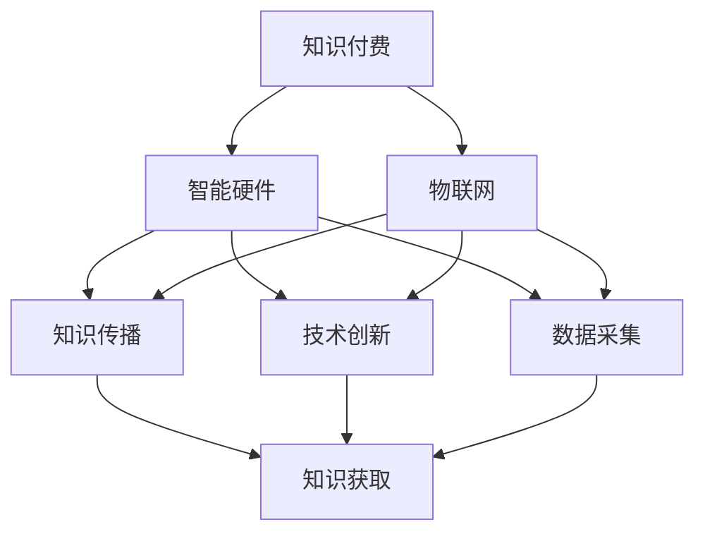

                 

### 背景介绍

近年来，智能硬件与物联网（IoT）技术在全球范围内取得了显著的发展。智能硬件，即具备一定智能功能的设备，通过嵌入传感器、执行器以及通信模块，能够实现远程控制、数据采集和智能分析。而物联网则是将各种智能硬件连接起来，形成一个庞大的网络系统，实现设备与设备之间的互联互通。

随着5G、人工智能（AI）和大数据等技术的不断进步，智能硬件和物联网应用在多个领域展现出强大的潜力，如智能家居、智能城市、工业物联网等。这些应用不仅提高了人们的生活质量，还推动了产业升级和经济发展。

然而，在智能硬件与物联网应用的发展过程中，知识付费也扮演着重要角色。知识付费，即用户为获取特定知识或服务而支付费用。通过知识付费，可以激励智能硬件与物联网领域的技术创新和知识传播，从而推动整个行业的发展。

本文将围绕如何利用知识付费实现智能硬件与物联网应用展开讨论。首先，我们将介绍知识付费在智能硬件与物联网领域的应用现状，然后分析知识付费对智能硬件与物联网应用的影响，最后探讨如何通过知识付费提升智能硬件与物联网应用的质量和普及程度。

### 核心概念与联系

在探讨如何利用知识付费实现智能硬件与物联网应用之前，我们需要了解一些核心概念及其相互联系。以下是几个关键概念：

1. **知识付费**：知识付费是指用户为获取特定知识或服务而支付的费用。在智能硬件与物联网领域，知识付费通常包括技术培训、专业咨询、软件开发工具包（SDK）等。

2. **智能硬件**：智能硬件是指具备一定智能功能的设备，通过嵌入传感器、执行器以及通信模块，能够实现远程控制、数据采集和智能分析。常见的智能硬件包括智能音箱、智能门锁、智能灯泡等。

3. **物联网（IoT）**：物联网是将各种智能硬件连接起来，形成一个庞大的网络系统，实现设备与设备之间的互联互通。物联网的核心在于数据的采集、传输、处理和分析。

4. **知识传播**：知识传播是指将知识从一个人或组织传递到另一个人或组织的过程。在智能硬件与物联网领域，知识传播可以通过线上课程、研讨会、技术论坛等多种形式进行。

5. **技术创新**：技术创新是指通过研发新技术、新产品或改进现有技术，推动产业发展的过程。在智能硬件与物联网领域，技术创新是推动行业进步的关键因素。

接下来，我们将通过一个Mermaid流程图来展示这些核心概念之间的联系：



### 核心算法原理 & 具体操作步骤

在讨论了知识付费在智能硬件与物联网领域的应用以及核心概念之后，我们将深入了解如何利用知识付费来实现智能硬件与物联网应用。这里，我们将重点介绍一种核心算法——基于知识付费的智能硬件与物联网应用开发算法，并详细解释其具体操作步骤。

#### 算法概述

基于知识付费的智能硬件与物联网应用开发算法主要包括以下几个步骤：

1. **需求分析**：通过知识付费获取用户需求，明确智能硬件与物联网应用的功能和性能要求。

2. **硬件选型**：根据需求分析结果，选择合适的智能硬件设备和传感器，以满足应用的需求。

3. **软件开发**：利用知识付费获取的相关技术知识，开发智能硬件与物联网应用软件，实现数据采集、处理、传输和分析等功能。

4. **系统集成**：将硬件和软件集成，实现智能硬件与物联网系统的互联互通。

5. **测试与优化**：对集成后的系统进行测试，确保其稳定性和可靠性，并根据用户反馈进行优化。

#### 操作步骤

1. **需求分析**

   需求分析是智能硬件与物联网应用开发的第一步。通过知识付费，可以获取用户的需求信息，如功能要求、性能指标、安全要求等。具体操作步骤如下：

   - 收集用户需求：通过问卷调查、用户访谈、市场调研等方式，收集用户对智能硬件与物联网应用的需求。
   - 分析需求：对收集到的需求进行整理和分析，明确功能需求、性能需求和安全性要求。
   - 制定需求文档：将分析结果整理成需求文档，作为后续硬件选型和软件开发的基础。

2. **硬件选型**

   硬件选型是确保智能硬件与物联网应用功能实现的关键步骤。通过知识付费，可以获取硬件选型的相关知识和经验，具体操作步骤如下：

   - 确定硬件类型：根据需求文档，确定需要使用的智能硬件类型，如传感器、执行器、通信模块等。
   - 选择硬件品牌和型号：根据硬件类型和性能要求，选择合适的硬件品牌和型号。
   - 硬件配置：根据需求文档和硬件型号，确定硬件的配置参数，如传感器分辨率、通信模块速率等。

3. **软件开发**

   软件开发是智能硬件与物联网应用的核心步骤。通过知识付费，可以获取软件开发的相关技术和经验，具体操作步骤如下：

   - 设计软件架构：根据需求文档，设计智能硬件与物联网应用的软件架构，包括数据采集模块、数据处理模块、数据传输模块等。
   - 选择开发工具和框架：根据软件架构，选择合适的开发工具和框架，如编程语言、开发平台、数据库等。
   - 编写代码：根据软件架构和开发工具，编写智能硬件与物联网应用的代码，实现数据采集、处理、传输和分析等功能。
   - 调试和测试：对编写的代码进行调试和测试，确保其功能正确、性能稳定。

4. **系统集成**

   系统集成是将硬件和软件整合成一个完整的智能硬件与物联网系统的过程。通过知识付费，可以获取系统集成相关的知识和技能，具体操作步骤如下：

   - 硬件集成：将选定的智能硬件设备和传感器安装到智能硬件平台上，确保硬件设备之间的连接稳定可靠。
   - 软件集成：将开发好的智能硬件与物联网应用软件安装到智能硬件平台上，实现硬件和软件的协同工作。
   - 系统测试：对集成后的系统进行测试，确保其功能完整、性能稳定、安全性高。

5. **测试与优化**

   测试与优化是确保智能硬件与物联网应用稳定可靠的重要环节。通过知识付费，可以获取测试和优化的相关知识，具体操作步骤如下：

   - 功能测试：对智能硬件与物联网应用的功能进行测试，确保其功能正确、性能稳定。
   - 性能测试：对智能硬件与物联网应用的性能进行测试，确保其满足性能要求。
   - 安全性测试：对智能硬件与物联网应用的安全性进行测试，确保其数据安全、系统稳定。
   - 优化：根据测试结果，对智能硬件与物联网应用进行优化，提高其性能和稳定性。
   - 用户反馈：收集用户对智能硬件与物联网应用的反馈，根据反馈进行进一步优化。

通过以上操作步骤，我们可以利用知识付费实现智能硬件与物联网应用。在这个过程中，知识付费起到了关键作用，为开发者提供了所需的技术知识和经验，提高了开发效率和系统质量。

### 数学模型和公式 & 详细讲解 & 举例说明

在智能硬件与物联网应用中，数学模型和公式发挥着至关重要的作用。这些模型和公式不仅能够帮助我们理解和分析系统的工作原理，还能在实际应用中提供指导。以下我们将详细介绍一些常用的数学模型和公式，并给出具体的例子说明。

#### 1. 感知层模型

感知层是智能硬件与物联网系统的最外层，主要负责数据的采集和处理。一个常见的感知层模型是感知器模型，其公式如下：

\[ y = \sigma (wx + b) \]

其中：
- \( y \) 是输出值；
- \( \sigma \) 是激活函数，常用的激活函数包括Sigmoid、ReLU等；
- \( w \) 是权重；
- \( x \) 是输入值；
- \( b \) 是偏置。

举例说明：
假设我们使用ReLU作为激活函数，权重 \( w \) 为 2，输入值 \( x \) 为 3，偏置 \( b \) 为 1。代入公式计算：

\[ y = \sigma (2 \cdot 3 + 1) = \sigma (7) = 7 \]

因此，输出值 \( y \) 为 7。

#### 2. 隐含层模型

隐含层是智能硬件与物联网系统的一个重要层次，负责对输入数据进行复杂的变换和组合。一个常见的隐含层模型是多层感知机（MLP），其公式如下：

\[ z_i = \sum_{j=1}^{n} w_{ij}x_j + b_i \]

\[ a_i = \sigma (z_i) \]

其中：
- \( z_i \) 是隐含层的第 \( i \) 个节点的输出值；
- \( w_{ij} \) 是权重；
- \( x_j \) 是输入值；
- \( b_i \) 是偏置；
- \( \sigma \) 是激活函数；
- \( n \) 是隐含层的节点数；
- \( a_i \) 是隐含层的第 \( i \) 个节点的激活值。

举例说明：
假设我们使用ReLU作为激活函数，隐含层有3个节点，权重 \( w \) 分别为 \( w_1 = 1, w_2 = 2, w_3 = 3 \)，输入值 \( x_1 = 1, x_2 = 2 \)，偏置 \( b \) 分别为 \( b_1 = 0, b_2 = 1, b_3 = 2 \)。代入公式计算：

\[ z_1 = w_1 \cdot x_1 + b_1 = 1 \cdot 1 + 0 = 1 \]
\[ z_2 = w_2 \cdot x_2 + b_2 = 2 \cdot 2 + 1 = 5 \]
\[ z_3 = w_3 \cdot x_3 + b_3 = 3 \cdot 3 + 2 = 11 \]

\[ a_1 = \sigma (z_1) = \sigma (1) = 1 \]
\[ a_2 = \sigma (z_2) = \sigma (5) = 5 \]
\[ a_3 = \sigma (z_3) = \sigma (11) = 11 \]

因此，隐含层的节点输出分别为 \( a_1 = 1, a_2 = 5, a_3 = 11 \)。

#### 3. 输出层模型

输出层是智能硬件与物联网系统的最后一级，负责生成最终的结果。一个常见的输出层模型是线性回归模型，其公式如下：

\[ y = \sum_{i=1}^{n} w_i a_i + b \]

其中：
- \( y \) 是输出值；
- \( w_i \) 是权重；
- \( a_i \) 是隐含层的输出值；
- \( b \) 是偏置。

举例说明：
假设输出层的权重 \( w \) 分别为 \( w_1 = 0.5, w_2 = 1.5, w_3 = 2.5 \)，隐含层的输出值分别为 \( a_1 = 1, a_2 = 5, a_3 = 11 \)，偏置 \( b \) 为 2。代入公式计算：

\[ y = 0.5 \cdot 1 + 1.5 \cdot 5 + 2.5 \cdot 11 + 2 \]
\[ y = 0.5 + 7.5 + 28.5 + 2 \]
\[ y = 38 \]

因此，输出值 \( y \) 为 38。

通过以上数学模型和公式的介绍，我们可以更好地理解和应用智能硬件与物联网系统中的各种算法。在实际开发过程中，根据具体需求选择合适的模型和公式，并进行优化和调整，能够提高系统的性能和稳定性。

### 项目实战：代码实际案例和详细解释说明

在了解了基于知识付费的智能硬件与物联网应用开发算法及其数学模型和公式后，我们将通过一个实际项目案例来展示如何将这些理论知识应用到实际开发中。本文将以智能家居系统为例，详细讲解项目的开发环境搭建、源代码实现和代码解读与分析。

#### 1. 开发环境搭建

为了搭建智能家居系统的开发环境，我们需要准备以下工具和软件：

- **开发语言**：Python
- **编程工具**：PyCharm
- **物联网平台**：Arduino
- **智能硬件**：ESP8266模块、DHT11温度湿度传感器、LED灯
- **操作系统**：Windows/Linux/MacOS

首先，在计算机上安装Python和PyCharm。Python可以通过官方网站下载并安装，PyCharm可以下载社区版或专业版。接下来，我们需要安装一些Python库，如`Adafruit_DHT`、`RPi.GPIO`等，用于与传感器和Arduino通信。

安装完开发环境和所需库后，将ESP8266模块与计算机连接，并通过串口通信程序进行烧录，使其能够正常运行。

#### 2. 源代码详细实现和代码解读

智能家居系统的核心代码分为两部分：一部分是智能硬件端的代码，负责采集温度和湿度数据，控制LED灯；另一部分是服务器端的代码，负责接收和处理数据，实现远程控制和数据监控。

**智能硬件端代码：**

```python
import Adafruit_DHT
import time
import serial

# 设置传感器类型和引脚
dht = Adafruit_DHT.DHT11(2)

# 设置Arduino串口号
ser = serial.Serial('/dev/ttyUSB0', 9600)

while True:
    # 读取温度和湿度
    humidity, temperature = Adafruit_DHT.read(dht)
    
    if humidity is not None and temperature is not None:
        # 发送数据到Arduino
        ser.write((str(humidity) + ',' + str(temperature) + '\n').encode())
        
        # 控制LED灯
        if temperature > 30:
            ser.write(b'1')  # 打开LED灯
        else:
            ser.write(b'0')  # 关闭LED灯
    
    # 等待2秒
    time.sleep(2)
```

**服务器端代码：**

```python
import socket
import serial

# 设置Arduino串口号
ser = serial.Serial('/dev/ttyUSB0', 9600)

# 设置服务器端端口
server_socket = socket.socket(socket.AF_INET, socket.SOCK_STREAM)
server_socket.bind(('0.0.0.0', 8080))
server_socket.listen(1)

print("等待连接...")

while True:
    # 接受客户端连接
    client_socket, client_address = server_socket.accept()
    print("连接成功：", client_address)
    
    while True:
        # 接收客户端数据
        data = client_socket.recv(1024).decode()
        
        if not data:
            break
        
        # 处理数据
        if data == 'on':
            ser.write(b'1')  # 打开LED灯
            response = "LED灯已打开"
        elif data == 'off':
            ser.write(b'0')  # 关闭LED灯
            response = "LED灯已关闭"
        else:
            response = "无效命令"
        
        # 发送响应数据到客户端
        client_socket.send(response.encode())
    
    # 关闭客户端连接
    client_socket.close()
    print("连接关闭")
```

**代码解读与分析：**

**智能硬件端代码解读：**
- 引入`Adafruit_DHT`库和`time`库，用于读取DHT11传感器的温度和湿度数据，以及控制时间。
- 引入`serial`库，用于与Arduino进行串口通信。
- 设置传感器类型（DHT11）和引脚（2），以及Arduino的串口号（/dev/ttyUSB0）。
- 在循环中，读取温度和湿度数据，并将其发送到Arduino。
- 根据温度值，控制LED灯的开关。

**服务器端代码解读：**
- 引入`socket`库，用于创建TCP套接字，实现服务器端功能。
- 设置Arduino的串口号（/dev/ttyUSB0）。
- 在服务器端创建套接字，绑定端口（8080），并开始监听。
- 在循环中，接收客户端发送的数据，并根据数据控制LED灯的开关。
- 将响应数据发送回客户端，表示操作结果。

通过这个实际项目案例，我们可以看到如何利用知识付费进行智能硬件与物联网应用的开发。在项目开发过程中，通过学习相关知识和技能，我们可以逐步实现系统的功能，并将其应用到实际场景中。

### 实际应用场景

智能硬件与物联网应用在多个实际场景中展现了其强大的功能和广泛的应用潜力。以下列举几个典型的应用场景：

#### 1. 智能家居

智能家居是智能硬件与物联网应用最典型的场景之一。通过将各种智能设备（如智能灯泡、智能门锁、智能摄像头等）连接到物联网，用户可以实现对家居环境的远程监控和控制。例如，用户可以通过智能手机或语音助手远程控制家中的灯光、温度和安防设备，提高生活便利性和安全性。

#### 2. 智能交通

智能交通系统利用物联网技术，实现对交通流量、路况和车辆运行状态的实时监控和管理。通过传感器和摄像头收集交通数据，智能交通系统能够优化交通信号灯、预测交通拥堵并给出最佳行驶路线。这不仅缓解了交通压力，还提高了道路安全性和运输效率。

#### 3. 智能农业

智能农业通过物联网技术，实现对农田环境、作物生长状态和灌溉情况的实时监测和管理。利用传感器收集数据，智能农业系统可以自动调节灌溉、施肥和病虫害防治，提高农业生产效率和质量。同时，智能农业还可以实现农产品的溯源管理，提高消费者对农产品的信任度。

#### 4. 智能医疗

智能医疗系统利用物联网技术，实现医疗设备和系统的互联互通，提高医疗服务的质量和效率。通过远程监控和数据分析，医生可以实时了解患者的健康状况，及时调整治疗方案。此外，智能医疗系统还可以实现医疗资源的优化配置，降低医疗成本。

#### 5. 智能安防

智能安防系统通过物联网技术，实现对家庭、企业和公共场所的安全监控和预警。通过安装各种传感器和摄像头，智能安防系统可以实时监测目标区域，并在发生异常情况时自动报警。同时，智能安防系统还可以与公安部门实现数据共享和联动，提高犯罪预防能力。

这些实际应用场景展示了智能硬件与物联网技术的巨大潜力和广泛前景。通过不断发展和创新，智能硬件与物联网应用将在更多领域得到应用，为社会带来更多便利和效益。

### 工具和资源推荐

为了在智能硬件与物联网应用的开发过程中取得更好的效果，以下是几个推荐的学习资源、开发工具和框架：

#### 1. 学习资源推荐

**书籍**：
- 《物联网：从概念到实践》：这本书详细介绍了物联网的基本概念、架构和关键技术，适合初学者阅读。
- 《智能家居设计与实现》：该书涵盖了智能家居的设计、开发和部署，包括各种智能设备和物联网平台的详细介绍。

**论文**：
- "Internet of Things: A Survey"：这篇综述文章对物联网的技术、应用和未来趋势进行了全面的梳理。
- "Smart Home Energy Management System Using IoT": 该论文探讨了利用物联网技术实现智能家庭能源管理的方法和挑战。

**博客**：
- Medium上的IoT专栏：该专栏收录了众多关于物联网技术的文章，涵盖了从基础概念到应用案例的各个方面。
- Raspberry Pi Forums：这个论坛提供了大量关于树莓派和物联网开发的讨论，是学习树莓派和物联网开发的宝贵资源。

**网站**：
- Arduino官网：提供了丰富的智能硬件开发资源和教程，包括Arduino板的使用方法、编程指南等。
- ESP8266官网：该网站提供了ESP8266模块的详细资料、开发指南和社区论坛。

#### 2. 开发工具框架推荐

**开发工具**：
- PyCharm：PyCharm是一款强大的Python集成开发环境，支持多种编程语言，适合进行智能硬件与物联网应用开发。
- Eclipse：Eclipse也是一个优秀的集成开发环境，提供了丰富的插件和工具，支持Java、C/C++等多种编程语言。

**框架**：
- Flask：Flask是一个轻量级的Web开发框架，适用于构建简单的Web服务和API。
- Django：Django是一个高级的Python Web框架，提供了全面的Web开发和数据库管理功能。
- TensorFlow：TensorFlow是一个开源的机器学习库，适用于智能硬件与物联网应用中的数据分析和模型训练。

这些工具和资源将为智能硬件与物联网应用的开发提供有力的支持，帮助开发者快速掌握相关技术和实现项目目标。

### 总结：未来发展趋势与挑战

随着技术的不断进步，智能硬件与物联网应用正朝着更加智能化、互联互通和高效化的方向发展。以下是一些未来发展趋势和面临的挑战：

#### 1. 未来发展趋势

**1. 边缘计算与云计算的融合**：随着5G技术的普及，边缘计算在智能硬件与物联网应用中将发挥越来越重要的作用。边缘计算能够将数据处理和计算能力分布到网络边缘，降低延迟，提高响应速度。同时，云计算将继续提供强大的计算和存储资源，与边缘计算相结合，实现更高效的智能硬件与物联网应用。

**2. 人工智能的深度应用**：人工智能技术在智能硬件与物联网应用中的深度应用将进一步提升系统的智能化水平。通过机器学习和深度学习算法，智能硬件与物联网系统能够实现更精准的预测、决策和优化，提高系统的自适应能力和可靠性。

**3. 数据隐私与安全**：随着智能硬件与物联网应用的数据规模和数据类型的增加，数据隐私和安全问题将成为重要的关注点。未来，如何保护用户隐私、确保数据安全，将成为智能硬件与物联网应用发展的重要挑战。

#### 2. 未来面临的挑战

**1. 标准化和互操作性**：智能硬件与物联网应用涉及多个领域和厂商，如何实现设备的标准化和互操作性，是未来发展的关键挑战。标准化有助于降低开发成本、提高系统兼容性，从而推动整个行业的发展。

**2. 技术人才的培养**：智能硬件与物联网应用的发展离不开技术人才的支持。然而，当前的技术人才培养速度和行业需求之间还存在一定差距。未来，如何培养更多具备相关技能的人才，将是一个重要的挑战。

**3. 法律法规与政策支持**：智能硬件与物联网应用的发展需要良好的法律法规和政策支持。未来，如何制定和完善相关法规政策，保护用户权益，促进产业健康发展，将是行业面临的重要挑战。

综上所述，智能硬件与物联网应用的未来发展充满机遇和挑战。通过技术创新、人才培养和政策支持，有望实现智能硬件与物联网应用的更大突破，为社会带来更多福祉。

### 附录：常见问题与解答

#### 1. 智能硬件与物联网应用的主要挑战是什么？

主要挑战包括数据隐私与安全、标准化和互操作性，以及技术人才的培养。此外，法律法规与政策支持也是重要的挑战。

#### 2. 如何确保智能硬件与物联网应用的数据安全？

确保数据安全的方法包括：
- 使用加密技术对数据进行加密；
- 定期更新系统和软件，修补安全漏洞；
- 实施访问控制和权限管理；
- 进行定期的安全审计和风险评估。

#### 3. 智能硬件与物联网应用的未来发展趋势是什么？

未来发展趋势包括边缘计算与云计算的融合、人工智能的深度应用，以及数据隐私与安全的重视。此外，标准化和互操作性也将得到进一步发展。

#### 4. 如何培养智能硬件与物联网应用的技术人才？

可以通过以下方式培养技术人才：
- 开展针对性的技术培训和课程；
- 鼓励学习和实践，提供实际项目机会；
- 建立产学研合作，促进人才培养与产业发展相结合；
- 引导学生参与相关竞赛和项目，提高实践能力。

#### 5. 智能硬件与物联网应用的标准化和互操作性如何实现？

实现标准化和互操作性的方法包括：
- 制定统一的行业标准和技术规范；
- 促进不同厂商和平台之间的合作与兼容；
- 鼓励开源技术和共享资源；
- 通过技术论坛和研讨会，推动行业共识和标准化进程。

### 扩展阅读 & 参考资料

为了更深入地了解智能硬件与物联网应用的相关知识，以下是一些建议的扩展阅读和参考资料：

#### 1. 建议书籍

- 《物联网：从概念到实践》：详细介绍了物联网的基本概念、架构和关键技术。
- 《智能家居设计与实现》：涵盖了智能家居的设计、开发和部署。
- 《智能硬件设计与开发》：讲解了智能硬件的设计原理和开发实践。
- 《物联网安全：原理、实践与标准》：探讨了物联网的安全性问题和解决方案。

#### 2. 建议论文

- "Internet of Things: A Survey"：对物联网的技术、应用和未来趋势进行了全面综述。
- "Smart Home Energy Management System Using IoT"：研究了利用物联网实现智能家庭能源管理的方法。
- "Security Challenges in Internet of Things"：分析了物联网中存在的安全挑战。

#### 3. 建议博客

- Medium上的IoT专栏：提供了关于物联网技术的丰富文章。
- Raspberry Pi Forums：提供了大量关于树莓派和物联网开发的讨论和教程。

#### 4. 建议网站

- Arduino官网：提供了丰富的智能硬件开发资源和教程。
- ESP8266官网：提供了ESP8266模块的详细资料、开发指南和社区论坛。
- IEEE IoT：提供了物联网相关的最新研究和技术进展。

通过阅读这些书籍、论文和网站，可以进一步了解智能硬件与物联网应用的理论和实践，为实际项目开发提供有力支持。

