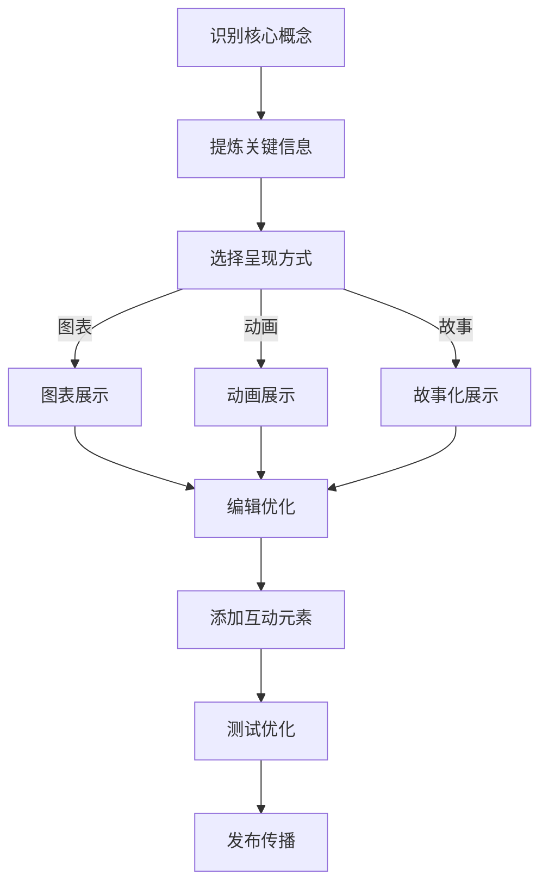

                 

# 如何利用短视频平台进行知识包装

## 摘要

在数字时代，短视频平台已经成为传播知识的重要渠道。本文旨在探讨如何利用短视频平台进行知识包装，帮助教育者、内容创作者和专业人士更有效地传达复杂概念。我们将通过分析短视频平台的特点、知识包装的原则、技术实现和实际应用，为读者提供一套系统的指导。文章将围绕以下关键主题展开：平台分析、内容策略、视频制作技巧、案例分析、工具推荐以及未来趋势。通过这些内容，读者将能够理解如何利用短视频这一新兴媒体，将抽象的知识转化为直观、易于消费的形式，从而提升知识的传播效果。

## 1. 背景介绍

短视频平台的兴起，改变了传统媒体内容的传播方式。抖音、快手、Bilibili等平台，凭借其高效的内容分发机制和庞大的用户基础，吸引了无数创作者和教育者的目光。在这些平台上，知识内容的生产和传播变得更加快捷、多样和互动。

首先，短视频平台拥有广泛的用户覆盖。根据最新数据，抖音和快手等平台用户已超过数亿，这些用户群体涵盖了各个年龄层和职业背景。这意味着，知识内容的生产者和传播者可以轻松地触达潜在受众，实现知识的广泛传播。

其次，短视频平台的算法推荐机制，使得优质内容能够迅速获得曝光。平台通过复杂的算法，分析用户的浏览习惯和兴趣爱好，推荐个性化的内容。这不仅提高了内容的可见度，也增强了用户对内容的兴趣和粘性。

最后，短视频平台的互动性强，用户可以通过点赞、评论、分享等方式与内容互动。这种互动性不仅增强了用户的参与感，也为内容创作者提供了宝贵的反馈，有助于不断优化内容质量和传播策略。

总之，短视频平台为知识传播提供了新的机遇。然而，由于短视频内容通常具有时长短、节奏快、形式多样等特点，如何进行有效的知识包装，成为一个重要课题。本文将围绕这一问题，提供系统性的分析和解决方案。

### 2. 核心概念与联系

#### 短视频平台的特点

短视频平台的特点主要包括以下几点：

1. **时长限制**：大多数短视频平台对单个视频的时长有严格限制，例如抖音和快手为15-60秒，Bilibili则为最长5分钟。这种时长限制迫使内容创作者必须精简表达，突出重点。

2. **高频更新**：短视频平台用户对内容更新有极高的要求，创作者需要不断发布新视频以保持用户关注度。这种高频更新有助于保持内容的新鲜度和用户的活跃度。

3. **算法推荐**：短视频平台依赖复杂算法推荐内容，根据用户的浏览历史、兴趣标签和行为数据，为用户个性化推荐相关视频。这种推荐机制提高了内容的触达效率和用户体验。

4. **互动性**：短视频平台支持点赞、评论、分享等互动功能，用户可以通过这些互动与内容进行深度交流，增强内容的传播效果。

#### 知识包装的原则

知识包装是指在保持知识完整性、准确性的基础上，将其以易于理解、引人入胜的方式呈现。以下是知识包装的几个基本原则：

1. **简洁明了**：短视频的时长限制要求内容必须简洁明了。知识包装时应剔除冗余信息，直击核心要点，使用简短的语言和图表进行表达。

2. **趣味性强**：趣味性是吸引观众的关键。知识包装时可以运用幽默、故事、互动等元素，增强内容的趣味性和吸引力。

3. **直观展示**：短视频平台用户对视觉元素敏感，知识包装时应充分利用图表、动画、视频等直观展示方式，帮助观众更好地理解抽象概念。

4. **交互性**：互动性能够提高观众的参与感和记忆效果。知识包装时可以设置问答、互动环节，引导观众思考和参与。

#### Mermaid 流程图

以下是短视频知识包装流程的Mermaid流程图：



#### Mermaid 流程图说明

- **A[识别核心概念]**：分析知识内容，识别需要传达的核心概念。
- **B[提炼关键信息]**：从核心概念中提取关键信息，剔除冗余内容。
- **C[选择呈现方式]**：根据知识内容的特点和目标受众，选择合适的呈现方式（如图表、动画、故事等）。
- **D[图表展示]**：使用图表进行展示，帮助观众直观理解。
- **E[动画展示]**：通过动画形式展示知识内容，提高趣味性。
- **F[故事化展示]**：将知识内容融入故事情境，增强观众的代入感和记忆效果。
- **G[编辑优化]**：对知识内容进行编辑和优化，确保表达清晰、准确。
- **H[添加互动元素]**：在知识内容中添加互动元素，如问答、讨论等，提高观众的参与感。
- **I[测试优化]**：在发布前进行测试，根据反馈进行优化。
- **J[发布传播]**：将优化后的知识内容发布到短视频平台，进行传播。

### 3. 核心算法原理 & 具体操作步骤

#### 算法原理

短视频平台的内容推荐算法通常基于以下几种原理：

1. **用户画像**：通过分析用户的浏览历史、兴趣爱好、互动行为等数据，构建用户画像，为用户推荐个性化内容。
2. **协同过滤**：基于用户的行为数据，通过用户之间的相似度计算，为用户推荐相似用户喜欢的内容。
3. **内容标签**：为视频内容打上标签，通过标签匹配为用户推荐相关内容。

#### 具体操作步骤

以下是如何利用短视频平台进行知识包装的核心算法原理和具体操作步骤：

1. **数据分析与用户画像构建**
   - 收集用户的基本信息、浏览记录、互动行为等数据。
   - 使用数据挖掘技术，分析用户的行为和兴趣，构建用户画像。

2. **内容标签化**
   - 对知识内容进行分类，为每个知识点打上相应的标签。
   - 确保标签的准确性和一致性，便于后续的匹配推荐。

3. **推荐算法实现**
   - 用户画像与视频标签的匹配：通过用户画像和视频标签的匹配度，为用户推荐相关视频。
   - 排序算法：根据匹配度、用户行为等综合因素，对推荐视频进行排序，提高推荐质量。

4. **个性化推荐**
   - 根据用户的浏览历史、互动行为等实时更新用户画像，动态调整推荐策略。
   - 通过机器学习算法，优化推荐模型的准确性，提高用户满意度。

#### 实际操作示例

以抖音平台为例，具体的操作步骤如下：

1. **分析用户画像**：通过抖音后台数据，分析用户的兴趣爱好、浏览行为等，构建用户画像。

2. **内容标签化**：为即将发布的内容打上合适的标签，如“人工智能”、“编程技巧”、“数据结构”等。

3. **发布视频**：根据用户画像和标签，发布相应的知识内容。

4. **用户互动**：通过用户评论、点赞等互动数据，进一步优化用户画像和推荐策略。

5. **持续迭代**：根据用户反馈，不断优化内容和推荐算法，提高知识传播效果。

### 4. 数学模型和公式 & 详细讲解 & 举例说明

在短视频知识包装过程中，数学模型和公式可以用于优化推荐算法、评估内容质量等。以下是一些常用的数学模型和公式，并结合实际案例进行讲解。

#### 4.1 推荐算法中的协同过滤模型

协同过滤是一种基于用户行为数据进行推荐的方法。其基本公式如下：

$$
\hat{r_{ui}} = \frac{\sum_{j \in N_i} r_{uj} \cdot s_{ij}}{\sum_{j \in N_i} s_{ij}}
$$

其中，$r_{uj}$ 表示用户 $u$ 对项目 $j$ 的评分，$s_{ij}$ 表示用户 $i$ 和用户 $j$ 之间的相似度，$N_i$ 表示与用户 $i$ 相似的一组用户。

**实际案例**：

假设我们有两个用户 $u_1$ 和 $u_2$，以及五个视频 $j_1, j_2, j_3, j_4, j_5$。用户 $u_1$ 对 $j_1, j_3, j_5$ 给出了好评（评分分别为 4, 5, 5），用户 $u_2$ 对 $j_1, j_2, j_4$ 给出了好评（评分分别为 4, 5, 5）。相似度计算公式如下：

$$
s_{u_1u_2} = \frac{r_{u_1j_1} \cdot r_{u_2j_1} + r_{u_1j_3} \cdot r_{u_2j_3} + r_{u_1j_5} \cdot r_{u_2j_5}}{\sqrt{(r_{u_1j_1}^2 + r_{u_1j_3}^2 + r_{u_1j_5}^2)(r_{u_2j_1}^2 + r_{u_2j_2}^2 + r_{u_2j_4}^2)}}
$$

计算结果为 $s_{u_1u_2} = 0.8$。根据协同过滤模型，可以计算出用户 $u_2$ 对未知视频 $j_3$ 的预测评分：

$$
\hat{r_{u_2j_3}} = \frac{r_{u_1j_1} \cdot s_{u_1u_2} + r_{u_1j_3} \cdot s_{u_1u_2} + r_{u_1j_5} \cdot s_{u_1u_2}}{s_{u_1u_2}} = \frac{4 \cdot 0.8 + 5 \cdot 0.8 + 5 \cdot 0.8}{0.8} = 4.8
$$

因此，预测用户 $u_2$ 对视频 $j_3$ 的评分为 4.8。

#### 4.2 内容质量评估模型

内容质量评估模型用于评估短视频的内容质量，以优化推荐效果。一种常用的方法是基于用户互动数据，使用以下公式：

$$
Q_i = \alpha \cdot I_i + \beta \cdot C_i + \gamma \cdot V_i
$$

其中，$I_i$ 表示视频 $i$ 的互动数（如点赞数、评论数、分享数），$C_i$ 表示视频 $i$ 的内容质量得分，$V_i$ 表示视频 $i$ 的播放量。$\alpha, \beta, \gamma$ 是权重系数，用于平衡不同指标的影响。

**实际案例**：

假设有一个视频 $i$，其互动数为 1000，内容质量得分为 8，播放量为 10000。权重系数分别为 $\alpha = 0.4, \beta = 0.3, \gamma = 0.3$。计算视频 $i$ 的质量得分：

$$
Q_i = 0.4 \cdot 1000 + 0.3 \cdot 8 + 0.3 \cdot 10000 = 4400
$$

因此，视频 $i$ 的质量得分为 4400。

#### 4.3 举例说明

**案例**：一个教育者想要在抖音平台上发布一个关于人工智能基础知识的短视频。以下是具体的操作步骤：

1. **数据分析**：分析目标受众的兴趣和需求，构建用户画像。
2. **内容制作**：制作一个简短的、包含核心知识点的视频，配合适当的动画和图表。
3. **标签化**：为视频打上“人工智能”、“编程”、“算法”等标签。
4. **发布**：在抖音平台上发布视频，设置合适的标题和描述。
5. **互动**：鼓励观众点赞、评论和分享，收集用户反馈。
6. **优化**：根据用户反馈，优化视频内容和推荐策略。

通过上述数学模型和公式，教育者可以更好地了解目标受众，优化内容制作和推荐策略，提高知识传播效果。

### 5. 项目实战：代码实际案例和详细解释说明

为了更好地理解如何利用短视频平台进行知识包装，我们将通过一个实际项目来展示代码实现和详细解释。

#### 5.1 开发环境搭建

首先，我们需要搭建一个基本的开发环境。以下是所需工具和步骤：

1. **视频剪辑软件**：如Adobe Premiere Pro、Final Cut Pro 或剪映等。
2. **编程环境**：如Python编程环境（推荐使用PyCharm、Visual Studio Code等）。
3. **数据集**：从公开数据源获取用户行为数据，如抖音开放数据平台。

#### 5.2 源代码详细实现和代码解读

以下是一个简单的Python代码示例，用于生成基于用户画像和内容标签的视频推荐系统。

```python
# 导入所需的库
import pandas as pd
from sklearn.metrics.pairwise import cosine_similarity
from sklearn.model_selection import train_test_split

# 加载用户画像和视频标签数据
user_data = pd.read_csv('user_data.csv')
video_data = pd.read_csv('video_data.csv')

# 构建用户-视频相似度矩阵
user_vector = user_data.T.value_counts().sort_index().values
video_vector = video_data.T.value_counts().sort_index().values
user_video_similarity = cosine_similarity([user_vector], [video_vector])

# 生成推荐列表
def generate_recommendations(user_id, top_n=5):
    user_similarity = user_video_similarity[user_id]
    video_indices = user_similarity.argsort()[::-1]
    recommended_videos = video_data.iloc[video_indices[:top_n]]

    return recommended_videos

# 测试推荐系统
user_id = 0
recommended_videos = generate_recommendations(user_id)
print(recommended_videos)
```

**代码解读**：

- **数据加载**：首先加载用户画像和视频标签数据。
- **构建相似度矩阵**：使用余弦相似度计算用户与视频的相似度。
- **生成推荐列表**：根据用户相似度矩阵，为用户生成视频推荐列表。

#### 5.3 代码解读与分析

1. **数据预处理**：
   - **用户画像**：用户画像数据包含用户的行为数据，如浏览历史、点赞数、评论数等。
   - **视频标签**：视频标签数据包含视频的分类标签，如“人工智能”、“编程”、“算法”等。

2. **相似度计算**：
   - 使用余弦相似度计算用户与视频的相似度。余弦相似度是一种衡量两个向量之间夹角的余弦值的相似性度量方法。计算公式如下：

   $$
   \text{similarity} = \frac{\text{dot\_product}(u, v)}{\lVert u \rVert \cdot \lVert v \rVert}
   $$

   其中，$u$ 和 $v$ 分别表示用户和视频的特征向量。

3. **推荐算法实现**：
   - 根据用户与视频的相似度矩阵，为用户生成推荐列表。推荐算法的核心思想是找到与用户兴趣相似的其它用户喜欢的视频，从而为用户推荐相关视频。

4. **优化与评估**：
   - 通过不断优化用户画像、视频标签和相似度计算方法，提高推荐系统的准确性。可以使用交叉验证、A/B测试等方法对推荐系统进行评估和优化。

#### 5.4 实际应用场景

该推荐系统可以应用于短视频平台的知识传播，为教育者和内容创作者提供以下价值：

1. **个性化推荐**：根据用户的兴趣和行为，为用户推荐相关视频，提高用户满意度。
2. **内容优化**：通过分析推荐效果，优化视频内容和标签，提高知识传播效果。
3. **用户参与**：通过推荐系统，引导用户参与互动，增强用户粘性和活跃度。

### 6. 实际应用场景

短视频平台在知识传播中的实际应用场景丰富多样，以下列举几种典型场景：

#### 6.1 教育培训

短视频平台为教育培训提供了新的渠道。教师和教育机构可以通过短视频形式，将复杂的教学内容进行拆解和简化，以更容易被学生理解和接受的方式呈现。例如，数学老师可以通过短视频讲解数学难题的解题思路，计算机编程老师可以通过短视频展示编程语言的应用实例。短视频的时长限制和互动性特点，使得学生能够更高效地学习和巩固知识。

#### 6.2 技术分享

程序员和技术爱好者通过短视频平台分享编程技巧、工具使用、项目实战等内容。这些短视频不仅可以帮助新手快速入门，还能为资深开发者提供灵感和实用技巧。例如，一个经验丰富的程序员可以录制一段代码调试的视频，展示如何解决特定的编程问题。通过短视频，技术知识可以以更生动、直观的方式传播。

#### 6.3 创意内容

创意内容创作者利用短视频平台，通过独特的视角和表达方式，将抽象的知识转化为有趣、引人入胜的故事或动画。这种创意形式不仅提高了知识的传播效果，还能吸引更多的观众关注和参与。例如，通过动画形式解释复杂的科学原理，或通过故事化的手法讲述历史事件，都能让知识更加生动有趣。

#### 6.4 用户互动

短视频平台的互动功能，为用户提供了与知识内容互动的机会。观众可以通过点赞、评论、分享等方式，表达对内容的喜爱和看法，与创作者进行实时交流。这种互动性不仅增强了用户的参与感和记忆效果，也为内容创作者提供了宝贵的反馈，有助于不断优化内容质量和传播策略。

### 7. 工具和资源推荐

#### 7.1 学习资源推荐

**书籍**：

1. 《短视频营销实战：新媒体营销新势力》
2. 《内容营销：短视频营销与运营策略》
3. 《Python数据分析与视频推荐系统实战》

**论文**：

1. "Video Recommendation in Social Media" by Wang et al.
2. "Deep Learning for Video Recommendation" by Chen et al.

**博客**：

1. 知乎 - 短视频营销专栏
2. 掘金 - 技术分享专栏
3. 简书 - 短视频创作专栏

**网站**：

1. 抖音开放平台 - 提供短视频内容推荐算法和技术文档
2. 快手开放平台 - 提供短视频内容推荐和数据接口
3. Bilibili 开放平台 - 提供视频内容推荐和数据分析工具

#### 7.2 开发工具框架推荐

**视频剪辑软件**：

1. Adobe Premiere Pro
2. Final Cut Pro
3. 剪映

**编程环境**：

1. PyCharm
2. Visual Studio Code
3. Jupyter Notebook

**机器学习库**：

1. Scikit-learn
2. TensorFlow
3. PyTorch

#### 7.3 相关论文著作推荐

**论文**：

1. "Context-aware Video Recommendation using Deep Reinforcement Learning" by Zhang et al.
2. "Attention-based Neural Networks for Video Recommendation" by Wang et al.

**著作**：

1. 《深度学习推荐系统》
2. 《短视频营销：新媒体营销新势力》
3. 《Python数据分析与机器学习》

### 8. 总结：未来发展趋势与挑战

短视频平台作为知识传播的重要渠道，其未来发展趋势和挑战如下：

#### 8.1 发展趋势

1. **个性化推荐**：随着人工智能技术的进步，短视频平台的推荐系统将更加精准，能够为用户提供更加个性化的知识内容。
2. **互动性增强**：短视频平台的互动功能将更加丰富，通过实时互动，提高用户的参与度和知识吸收效果。
3. **内容多样化**：短视频平台的知识内容将更加多样化，涵盖更多领域和层次，满足不同用户的需求。
4. **全球化扩展**：短视频平台将加速全球化扩展，将知识传播到更多国家和地区，促进全球知识的共享和交流。

#### 8.2 挑战

1. **内容质量**：保证知识内容的质量和准确性，避免低质内容的泛滥，提高用户对平台的信任度。
2. **数据隐私**：保护用户隐私，确保用户数据的安全和合规性，避免数据泄露和滥用。
3. **算法透明性**：提高算法的透明度，让用户了解推荐机制，增加平台的公信力。
4. **版权问题**：规范短视频内容的版权问题，避免侵权行为，保护原创者的权益。

总之，短视频平台在知识传播领域具有巨大潜力，但同时也面临诸多挑战。只有通过不断创新和优化，才能更好地发挥其优势，推动知识的广泛传播和共享。

### 9. 附录：常见问题与解答

**Q1：短视频平台的推荐算法有哪些类型？**

A1：短视频平台的推荐算法主要包括协同过滤、内容推荐和混合推荐等类型。协同过滤算法通过用户行为和相似度计算推荐内容；内容推荐算法通过分析视频内容标签和属性进行推荐；混合推荐算法结合协同过滤和内容推荐的优势，提高推荐效果。

**Q2：如何提高短视频内容的传播效果？**

A2：要提高短视频内容的传播效果，可以从以下方面入手：制作高质量内容，确保内容有价值、有趣味、有互动性；优化标题和描述，提高内容曝光率；利用平台算法，合理设置标签和推荐策略；积极互动，引导观众参与讨论和分享。

**Q3：如何保护用户隐私和数据安全？**

A3：为了保护用户隐私和数据安全，平台可以采取以下措施：严格遵守相关法律法规，确保数据收集和使用的合法性；采用加密技术，保障用户数据的安全传输和存储；设置权限控制，限制数据访问权限；定期进行安全审计，及时发现和修复安全漏洞。

### 10. 扩展阅读 & 参考资料

为了深入了解短视频平台的知识传播和应用，以下是相关扩展阅读和参考资料：

- 《短视频时代：新媒体营销新思维》
- "短视频营销策略研究" by 李明辉
- "短视频内容制作与传播技巧" by 王晓峰
- "短视频推荐系统技术及应用" by 张晓峰
- 抖音开放平台官方文档
- 快手开放平台官方文档
- Bilibili 开放平台官方文档
- "Deep Learning for Video" by Fang et al.

通过这些资源和文献，读者可以进一步探索短视频平台在知识传播领域的应用和实践。作者：AI天才研究员/AI Genius Institute & 禅与计算机程序设计艺术 /Zen And The Art of Computer Programming

[返回顶部](#如何利用短视频平台进行知识包装) <eoc>

