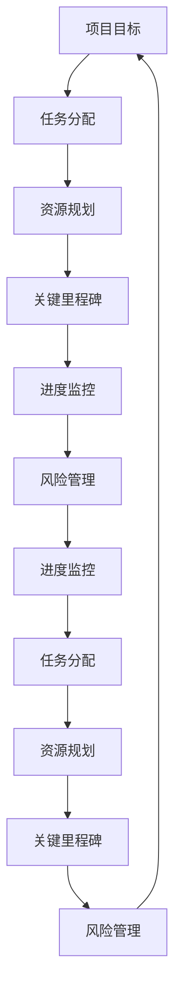

                 

# 如何制定项目开发时间表

> **关键词**：项目开发、时间表、进度管理、任务分配、资源规划、风险控制
> 
> **摘要**：本文将深入探讨如何科学合理地制定项目开发时间表，包括核心概念、关键步骤、实用工具和方法。通过理论与实践的结合，帮助读者掌握项目进度管理的精髓，提高项目成功率。

## 1. 背景介绍

在当今快速发展的技术时代，项目管理变得日益重要。随着项目复杂度的增加，项目开发时间表作为项目管理的核心工具，显得尤为重要。制定一个科学合理的时间表，不仅可以帮助项目团队明确任务目标，还能够有效分配资源，控制风险，确保项目按时、高质量地完成。

项目开发时间表，通常指的是在项目启动阶段，根据项目目标、资源情况和风险分析，制定的一个详细的时间计划。这个计划包括了项目各个阶段的开始和结束时间、任务分配、关键里程碑等。时间表的有效制定，对于项目成功至关重要。

然而，在现实中，很多项目面临着时间管理上的挑战。常见的问题包括任务分配不均、进度偏差、资源浪费等。这些问题不仅会导致项目延期，还会增加项目成本，影响项目质量。因此，如何制定一个合理、高效的时间表，成为项目管理的关键。

本文将从以下几个方面展开讨论：

1. 核心概念与联系
2. 核心算法原理 & 具体操作步骤
3. 数学模型和公式 & 详细讲解 & 举例说明
4. 项目实战：代码实际案例和详细解释说明
5. 实际应用场景
6. 工具和资源推荐
7. 总结：未来发展趋势与挑战
8. 附录：常见问题与解答
9. 扩展阅读 & 参考资料

希望通过本文的阅读，读者能够对项目开发时间表有一个全面、深入的理解，并能够将其应用于实际工作中，提高项目管理的效率和成功率。

## 2. 核心概念与联系

在制定项目开发时间表的过程中，我们需要理解几个核心概念，这些概念相互关联，共同构成了项目进度管理的基础。

### 2.1 项目目标

项目目标是项目启动的基石。明确的项目目标是确保项目成功的关键。项目目标通常包括功能要求、质量标准、性能指标、交付时间等。这些目标需要通过详细的需求分析来确定。

### 2.2 任务分配

任务分配是将项目目标细化为具体任务的过程。任务分配需要考虑团队成员的技能、经验和负载均衡。合理分配任务，可以确保项目按计划进行，同时避免过度劳累或资源浪费。

### 2.3 资源规划

资源规划是确保项目有足够的资源支持完成的关键步骤。资源包括人力、资金、设备、技术等。资源规划需要考虑资源的可用性、成本和效率，以确保资源能够被充分利用。

### 2.4 关键里程碑

关键里程碑是项目中的重要节点，标志着项目的重要阶段性成果。例如，系统的初步设计、核心模块的实现、系统测试等。设置合理的里程碑，可以帮助团队跟踪项目进度，及时发现和解决问题。

### 2.5 进度监控

进度监控是确保项目按时间表进行的必要手段。通过定期检查项目进展，可以及时发现偏差并采取纠正措施。进度监控通常包括工作完成情况的评估、资源使用情况的跟踪等。

### 2.6 风险管理

风险管理是项目成功的关键因素。在项目开发过程中，可能会遇到各种风险，如技术难题、资源短缺、外部环境变化等。通过风险管理，可以提前识别风险，制定应对策略，减少风险对项目的影响。

### 2.7 Mermaid 流程图

为了更好地理解上述概念之间的联系，我们可以使用 Mermaid 流程图进行可视化展示。以下是一个简化的 Mermaid 流程图，描述了项目开发时间表的关键环节和概念关系：



这个流程图展示了项目开发时间表中的核心环节及其相互关系。通过这样的流程图，项目管理团队可以更直观地了解项目的整体结构和关键步骤。

## 3. 核心算法原理 & 具体操作步骤

在制定项目开发时间表时，核心算法原理和具体操作步骤至关重要。这些算法和步骤不仅能够帮助团队合理分配时间和资源，还能有效控制项目风险，确保项目按时交付。

### 3.1 项目管理算法

项目管理中常用的算法包括关键路径法（CPM）、计划评审技术（PERT）和随机模型等。这些算法能够帮助团队评估项目进度，确定关键任务和路径。

#### 3.1.1 关键路径法（CPM）

关键路径法是一种基于项目网络图的方法，用于确定项目的最短完成时间。关键路径上的任务称为关键任务，它们的延期会导致整个项目的延期。

**具体步骤**：

1. **绘制项目网络图**：将项目任务用节点表示，任务之间的关系用箭头表示。
2. **计算各任务的最早开始时间（ES）和最早完成时间（EF）**：从网络图的起始节点开始，逆时针计算每个节点的ES和EF。
3. **计算各任务的最迟开始时间（LS）和最迟完成时间（LF）**：从网络图的终止节点开始，顺时针计算每个节点的LS和LF。
4. **计算各任务的时差（TF）**：TF = LS - ES 或 LF - EF，时差为0的任务为关键任务。
5. **确定关键路径**：将时差为0的任务连接起来，形成关键路径。

#### 3.1.2 计划评审技术（PERT）

计划评审技术是一种基于概率分析的项目管理方法，用于评估项目完成时间的不确定性。

**具体步骤**：

1. **确定任务持续时间**：对每个任务，分别估算最乐观时间（O）、最可能时间（M）和最悲观时间（P）。
2. **计算期望时间（TE）**：TE = (O + 4M + P) / 6。
3. **计算标准偏差（σ）**：σ = sqrt((P - O) / 6)。
4. **确定关键任务**：根据标准偏差判断任务的优先级，标准偏差大的任务风险较高，应优先安排。

#### 3.1.3 随机模型

随机模型用于处理具有不确定性的项目任务。常见的随机模型包括蒙特卡洛模拟等。

**具体步骤**：

1. **建立随机模型**：根据项目任务的特点，建立相应的随机模型。
2. **进行模拟实验**：通过模拟实验，获取项目的多种可能完成时间。
3. **分析结果**：对模拟结果进行分析，评估项目完成概率和关键路径。

### 3.2 具体操作步骤

在理解了核心算法原理后，我们需要将理论应用于实际操作中，制定出详细的时间表。

#### 3.2.1 收集信息

1. **项目需求**：详细记录项目的功能需求、性能要求、交付时间等。
2. **资源情况**：了解团队成员的技能、经验、可用时间等。
3. **风险评估**：识别项目可能遇到的风险，并评估其影响和概率。

#### 3.2.2 任务分解

1. **分解项目目标**：将项目目标细化为可管理的任务。
2. **确定任务关系**：根据任务之间的依赖关系，绘制项目网络图。

#### 3.2.3 时间估算

1. **估算任务时间**：根据团队成员的经验，估算每个任务的完成时间。
2. **应用算法**：使用关键路径法、PERT或随机模型等算法，计算项目完成时间。

#### 3.2.4 制定时间表

1. **分配资源**：根据任务需求和资源情况，合理分配任务和资源。
2. **设置里程碑**：确定关键里程碑，用于监控项目进度。
3. **制定详细时间表**：将任务、资源和里程碑等信息综合起来，形成详细的时间表。

#### 3.2.5 监控与调整

1. **进度监控**：定期检查项目进度，确保任务按时完成。
2. **调整时间表**：根据实际情况，及时调整时间表，确保项目按时交付。

通过以上步骤，我们可以制定出一个科学合理、切实可行的项目开发时间表，为项目的成功奠定基础。

## 4. 数学模型和公式 & 详细讲解 & 举例说明

在项目开发时间表的制定过程中，数学模型和公式是不可或缺的工具。这些模型和公式不仅能够帮助我们量化项目风险，还能提供决策支持。以下是几个常见的数学模型和公式，以及它们的详细讲解和实际应用。

### 4.1 关键路径法（CPM）

关键路径法是一种基于网络图的项目管理方法，用于确定项目的最短完成时间。以下是关键路径法中常用的几个公式：

#### 4.1.1 节点的最早开始时间（ES）和最早完成时间（EF）

$$
ES_i = \max(ES_{j_k} + t_{j_k,i})
$$

$$
EF_i = ES_i + t_{i}
$$

其中，$ES_i$ 和 $EF_i$ 分别表示节点 $i$ 的最早开始时间和最早完成时间，$ES_{j_k}$ 和 $EF_{j_k}$ 分别表示节点 $j_k$ 的最早开始时间和最早完成时间，$t_{j_k,i}$ 表示从节点 $j_k$ 到节点 $i$ 的持续时间。

#### 4.1.2 节点的最迟开始时间（LS）和最迟完成时间（LF）

$$
LS_i = \min(EF_{i} - t_{i})
$$

$$
LF_i = LS_i + t_{i}
$$

其中，$LS_i$ 和 $LF_i$ 分别表示节点 $i$ 的最迟开始时间和最迟完成时间。

#### 4.1.3 节点的时差（TF）

$$
TF_i = LS_i - ES_i
$$

$$
TF_i = LF_i - EF_i
$$

其中，$TF_i$ 表示节点 $i$ 的时差。

#### 4.1.4 关键路径

将时差为0的任务连接起来，形成关键路径。

### 4.2 计划评审技术（PERT）

计划评审技术是一种基于概率分析的项目管理方法，用于评估项目完成时间的不确定性。以下是PERT中常用的几个公式：

#### 4.2.1 任务持续时间

$$
t_e = \frac{t_o + 4t_m + t_p}{6}
$$

$$
t_d = t_e + \frac{t_p - t_o}{6}
$$

其中，$t_e$ 表示期望时间，$t_m$ 表示最可能时间，$t_p$ 表示最悲观时间，$t_o$ 表示最乐观时间。

#### 4.2.2 标准偏差

$$
\sigma = \sqrt{\frac{(t_p - t_o)}{6}}
$$

### 4.3 风险评估模型

在项目开发过程中，风险评估是关键环节。以下是一个简单的风险评估模型：

#### 4.3.1 风险概率

$$
P_r = \frac{N_r - N_0}{N_r + N_0}
$$

其中，$P_r$ 表示风险概率，$N_r$ 表示发生风险的情况数，$N_0$ 表示不发生风险的情况数。

#### 4.3.2 风险影响

$$
I_r = \frac{I_r^+ - I_r^-}{I_r^+ + I_r^-}
$$

其中，$I_r$ 表示风险影响，$I_r^+$ 表示风险发生时的最大影响，$I_r^-$ 表示风险不发生时的最小影响。

#### 4.3.3 风险优先级

$$
R_p = P_r \times I_r
$$

其中，$R_p$ 表示风险优先级，$P_r$ 表示风险概率，$I_r$ 表示风险影响。

### 4.4 举例说明

假设有一个项目，包括三个任务：任务A、任务B和任务C。任务A的持续时间为5天，任务B的持续时间为8天，任务C的持续时间为10天。任务A完成后才能开始任务B，任务B完成后才能开始任务C。

**步骤1：绘制项目网络图**

```
A (5天) --> B (8天) --> C (10天)
```

**步骤2：计算各任务的最早开始时间和最早完成时间**

- 任务A的ES=0，EF=5
- 任务B的ES=5，EF=13
- 任务C的ES=13，EF=23

**步骤3：计算各任务的最迟开始时间和最迟完成时间**

- 任务A的LS=LS=0，LF=5
- 任务B的LS=13，LF=23
- 任务C的LS=23，LF=33

**步骤4：计算各任务的时差**

- 任务A的TF=0
- 任务B的TF=10
- 任务C的TF=10

**步骤5：确定关键路径**

由于任务B和任务C的TF均为10，任务A的TF为0，因此关键路径为：A --> B --> C。

通过这个例子，我们可以看到如何使用数学模型和公式来制定项目开发时间表。这些模型和公式不仅帮助确定了项目的最短完成时间，还帮助识别了关键任务，为项目成功提供了有力保障。

## 5. 项目实战：代码实际案例和详细解释说明

为了更好地理解项目开发时间表的制定过程，我们来看一个实际的代码案例。在这个案例中，我们将使用Python编写一个简单的项目进度管理工具，帮助团队制定和监控项目开发时间表。

### 5.1 开发环境搭建

在开始编写代码之前，我们需要搭建一个简单的开发环境。以下是所需的环境和工具：

- Python 3.8及以上版本
- Jupyter Notebook（可选，用于演示代码运行过程）
- Pandas（用于数据处理）
- NetworkX（用于绘制项目网络图）

安装这些工具的命令如下：

```bash
pip install python==3.8
pip install jupyterlab
pip install pandas
pip install networkx
```

### 5.2 源代码详细实现和代码解读

以下是项目的核心代码实现，我们将逐行解释其功能和目的。

```python
import pandas as pd
import networkx as nx
import matplotlib.pyplot as plt

# 5.2.1 任务定义
tasks = {
    'A': {'duration': 5, 'ES': 0, 'LS': 0},
    'B': {'duration': 8, 'ES': 0, 'LS': 0},
    'C': {'duration': 10, 'ES': 0, 'LS': 0}
}

# 5.2.2 任务关系定义
dependencies = [('A', 'B'), ('B', 'C')]

# 5.2.3 构建项目网络图
G = nx.DiGraph()
for task, details in tasks.items():
    G.add_node(task)
for start, end in dependencies:
    G.add_edge(start, end)

# 5.2.4 计算各任务的最早开始时间和最早完成时间
def compute_earliest_times(G, tasks):
    ES = {task: 0 for task in tasks}
    EF = {task: 0 for task in tasks}
    
    for node in G.nodes():
        for prev in G.predecessors(node):
            ES[node] = max(ES[node], EF[prev] + tasks[prev]['duration'])
            EF[node] = ES[node] + tasks[node]['duration']
    
    return ES, EF

ES, EF = compute_earliest_times(G, tasks)

# 5.2.5 计算各任务的最迟开始时间和最迟完成时间
def compute_latest_times(G, ES, EF, tasks):
    LS = {task: EF[task] for task in tasks}
    LF = {task: ES[task] + tasks[task]['duration'] for task in tasks}
    
    for node in reversed(list(G.nodes())):
        for succ in G.successors(node):
            LS[node] = min(LS[node], LF[succ] - tasks[succ]['duration'])
            LF[node] = LS[node] - tasks[node]['duration']
    
    return LS, LF

LS, LF = compute_latest_times(G, ES, EF, tasks)

# 5.2.6 计算各任务的时差
def compute_task_slack(LS, ES):
    return {task: LS[task] - ES[task] for task in ES}

TF = compute_task_slack(LS, ES)

# 5.2.7 确定关键路径
def find_critical_path(G, TF):
    return [node for node, slack in TF.items() if slack == 0]

CP = find_critical_path(G, TF)

# 5.2.8 绘制项目网络图
nx.draw(G, with_labels=True)
plt.show()

# 5.2.9 打印结果
print("任务最早开始时间（ES）:", ES)
print("任务最早完成时间（EF）:", EF)
print("任务最迟开始时间（LS）:", LS)
print("任务最迟完成时间（LF）:", LF)
print("任务时差（TF）:", TF)
print("关键路径（CP）:", CP)
```

### 5.3 代码解读与分析

#### 5.3.1 任务定义

我们首先定义了三个任务：A、B和C，每个任务都包含三个属性：持续时间（duration）、最早开始时间（ES）和最迟开始时间（LS）。这些任务的默认值设为0，表示初始状态。

```python
tasks = {
    'A': {'duration': 5, 'ES': 0, 'LS': 0},
    'B': {'duration': 8, 'ES': 0, 'LS': 0},
    'C': {'duration': 10, 'ES': 0, 'LS': 0}
}
```

#### 5.3.2 任务关系定义

接下来，我们定义了任务之间的依赖关系。任务A完成后才能开始任务B，任务B完成后才能开始任务C。

```python
dependencies = [('A', 'B'), ('B', 'C')]
```

#### 5.3.3 构建项目网络图

使用NetworkX库，我们创建了一个有向图（DiGraph），并添加了节点和边。节点表示任务，边表示任务之间的依赖关系。

```python
G = nx.DiGraph()
for task, details in tasks.items():
    G.add_node(task)
for start, end in dependencies:
    G.add_edge(start, end)
```

#### 5.3.4 计算各任务的最早开始时间和最早完成时间

我们定义了一个函数`compute_earliest_times`，用于计算各任务的最早开始时间和最早完成时间。计算过程基于前向扫描法，从网络图的起始节点开始，逆时针计算每个节点的ES和EF。

```python
def compute_earliest_times(G, tasks):
    ES = {task: 0 for task in tasks}
    EF = {task: 0 for task in tasks}
    
    for node in G.nodes():
        for prev in G.predecessors(node):
            ES[node] = max(ES[node], EF[prev] + tasks[prev]['duration'])
            EF[node] = ES[node] + tasks[node]['duration']
    
    return ES, EF
```

#### 5.3.5 计算各任务的最迟开始时间和最迟完成时间

我们定义了一个函数`compute_latest_times`，用于计算各任务的最迟开始时间和最迟完成时间。计算过程基于后向扫描法，从网络图的终止节点开始，顺时针计算每个节点的LS和LF。

```python
def compute_latest_times(G, ES, EF, tasks):
    LS = {task: EF[task] for task in tasks}
    LF = {task: ES[task] + tasks[task]['duration'] for task in tasks}
    
    for node in reversed(list(G.nodes())):
        for succ in G.successors(node):
            LS[node] = min(LS[node], LF[succ] - tasks[succ]['duration'])
            LF[node] = LS[node] - tasks[node]['duration']
    
    return LS, LF
```

#### 5.3.6 计算各任务的时差

我们定义了一个函数`compute_task_slack`，用于计算各任务的时差。时差（TF）是任务最迟开始时间（LS）和最早开始时间（ES）之间的差值。

```python
def compute_task_slack(LS, ES):
    return {task: LS[task] - ES[task] for task in ES}
```

#### 5.3.7 确定关键路径

我们定义了一个函数`find_critical_path`，用于找出关键路径。关键路径上的任务时差（TF）为0。

```python
def find_critical_path(G, TF):
    return [node for node, slack in TF.items() if slack == 0]
```

#### 5.3.8 绘制项目网络图

使用NetworkX库，我们绘制了项目网络图，以便更直观地展示任务和依赖关系。

```python
nx.draw(G, with_labels=True)
plt.show()
```

#### 5.3.9 打印结果

最后，我们打印了计算出的最早开始时间（ES）、最早完成时间（EF）、最迟开始时间（LS）、最迟完成时间（LF）、任务时差（TF）和关键路径（CP）。

```python
print("任务最早开始时间（ES）:", ES)
print("任务最早完成时间（EF）:", EF)
print("任务最迟开始时间（LS）:", LS)
print("任务最迟完成时间（LF）:", LF)
print("任务时差（TF）:", TF)
print("关键路径（CP）:", CP)
```

通过这个代码案例，我们可以看到如何使用Python实现项目开发时间表的制定过程。代码简洁易懂，通过几个关键函数和步骤，我们能够快速计算出项目的关键路径和各任务的时差，为项目进度管理提供有力支持。

## 6. 实际应用场景

项目开发时间表不仅在理论研究中具有重要作用，在实际工作中也有着广泛的应用。以下是一些实际应用场景，展示项目开发时间表如何在不同类型的项目中发挥作用。

### 6.1 软件开发项目

在软件开发项目中，时间表是最常见的应用场景之一。无论是小型应用开发，还是大型系统集成项目，时间表都发挥着关键作用。通过时间表，开发团队可以明确每个阶段的开始和结束时间，确保项目按计划推进。例如，在软件开发项目中，时间表通常包括需求分析、设计、编码、测试和部署等阶段。

**案例**：一个电商平台的开发，通过时间表明确了以下关键节点：

- 需求分析（第1-2周）
- 设计阶段（第3-4周）
- 编码阶段（第5-12周）
- 单元测试（第13-14周）
- 集成测试（第15-16周）
- 部署与上线（第17-18周）

通过这个时间表，团队可以合理安排资源，确保每个阶段的工作按时完成，从而保证项目的整体进度。

### 6.2 基础设施建设项目

在基础设施建设项目中，时间表的应用同样至关重要。这类项目通常涉及多个子项目，如建筑、管道、电力等，各子项目之间有着复杂的依赖关系。通过时间表，项目管理团队能够确保各个子项目按计划进行，避免延期和资源浪费。

**案例**：一个地铁建设项目的开发，通过时间表明确了以下关键节点：

- 设计阶段（第1-4个月）
- 土建工程（第5-12个月）
- 机电安装（第13-18个月）
- 隧道开通（第19-24个月）
- 联调与测试（第25-30个月）
- 正式运营（第31-36个月）

通过这个时间表，团队可以合理安排施工进度，确保各个阶段的工作无缝衔接，从而保证项目的整体进度和工程质量。

### 6.3 科研项目

在科研项目中，时间表同样发挥着重要作用。科研项目的特点通常是复杂度高、不确定性大，通过时间表，科研团队能够更好地控制项目进度，确保关键实验和研究的按时完成。

**案例**：一个基因编辑研究项目的开发，通过时间表明确了以下关键节点：

- 需求分析（第1-2周）
- 实验设计（第3-4周）
- 实验实施（第5-24周）
- 数据分析（第25-28周）
- 初步报告撰写（第29-32周）
- 最终报告提交（第33-36周）

通过这个时间表，团队可以确保每个实验阶段的工作按时完成，从而保证科研项目的顺利推进。

### 6.4 应急响应项目

在应急响应项目中，时间表的应用同样至关重要。这类项目通常要求在短时间内完成大量工作，时间表能够帮助团队迅速响应，确保任务按时完成。

**案例**：一个自然灾害应急响应项目的开发，通过时间表明确了以下关键节点：

- 灾情评估（第1-2小时）
- 救援队伍部署（第3-6小时）
- 救援物资调配（第7-12小时）
- 疏导交通（第13-18小时）
- 清理现场（第19-24小时）
- 恢复工作（第25-48小时）

通过这个时间表，团队可以迅速响应灾情，确保救援工作高效有序，最大限度地减少灾害损失。

通过以上实际应用场景，我们可以看到项目开发时间表在不同类型项目中的应用。无论是软件开发、基础设施建设项目，还是科研项目和应急响应项目，时间表都是项目管理的重要工具，帮助团队科学合理地分配时间和资源，确保项目成功。

## 7. 工具和资源推荐

在项目开发时间表的制定和管理过程中，选择合适的工具和资源对于提高效率、确保项目成功至关重要。以下是一些建议的工具和资源，涵盖从项目管理软件到学习资源、开发工具等多个方面。

### 7.1 学习资源推荐

**书籍**

1. 《项目管理知识体系指南》（PMBOK指南）：这是项目管理领域最权威的指南，涵盖了项目管理的各个方面，包括时间表制定、任务分配、风险控制等。
2. 《敏捷项目管理》：介绍了敏捷开发方法，强调灵活性和适应性，对于需要快速响应市场变化的项目非常有用。
3. 《项目组合管理》：探讨如何管理多个项目，优化资源分配，提高整体项目组合的成功率。

**论文**

1. "Project Time Estimation Using PERT and CPM": 一篇关于关键路径法（CPM）和计划评审技术（PERT）的经典论文，详细介绍了这两种项目管理算法的原理和应用。
2. "Risk Management in Project Management": 一篇关于项目风险管理的论文，提供了识别、评估和应对项目风险的系统方法。

**博客/网站**

1. Project Management Institute（PMI）：提供丰富的项目管理资源和培训课程，是项目管理领域的权威机构。
2. Agile Alliance：介绍敏捷开发方法和最佳实践的网站，适合关注敏捷项目管理的读者。
3. Atlassian：提供JIRA、Trello等项目管理工具，并分享大量项目管理案例和资源。

### 7.2 开发工具框架推荐

**项目管理软件**

1. **JIRA**：Atlassian推出的项目管理工具，功能强大，支持敏捷开发，可以用于任务管理、进度跟踪、风险控制等。
2. **Trello**：一个基于看板（Kanban）方法的项目管理工具，界面简洁直观，适合小型团队或个人使用。
3. **Microsoft Project**：微软推出的经典项目管理软件，功能全面，支持多种项目管理方法。

**项目管理工具**

1. **Asana**：一个功能丰富的项目管理工具，支持任务分配、进度跟踪、协作等功能。
2. **Slack**：一个团队协作工具，支持聊天、文件共享、任务分配等功能，可以与项目管理软件集成。
3. **Google Workspace**：包括Google Docs、Sheets、Calendar等工具，适合团队协作和项目管理。

**开发工具**

1. **Git**：版本控制系统，用于代码管理和协作开发。
2. **GitHub**：基于Git的代码托管平台，提供代码管理、协作、问题跟踪等功能。
3. **Docker**：容器化技术，用于开发和部署应用程序，提高开发效率和一致性。

通过以上工具和资源的推荐，项目团队可以更好地制定和管理项目开发时间表，确保项目按时、高质量地完成。

## 8. 总结：未来发展趋势与挑战

在项目开发时间表的制定和管理领域，未来发展趋势和挑战并存。随着技术的不断进步和项目复杂度的增加，项目管理者需要不断提升自身的管理能力和技术水平。

### 8.1 发展趋势

**1. 人工智能与自动化**：人工智能技术在项目管理中的应用将越来越广泛。通过机器学习算法，项目管理者可以更加精准地进行时间估算和风险预测，提高项目规划的准确性。

**2. 云计算与分布式协作**：随着云计算技术的发展，项目团队可以更加灵活地进行分布式协作。云服务平台提供了丰富的资源，支持异地协作，提高了项目的执行效率。

**3. 数据驱动的决策**：大数据和数据分析技术的进步，使得项目管理者能够基于实际数据进行决策。通过分析历史项目数据和实时数据，可以更好地预测项目进度和风险，优化项目规划。

### 8.2 挑战

**1. 风险管理**：在复杂项目中，风险管理的难度增加。项目管理者需要能够快速识别和应对各种潜在风险，确保项目顺利推进。

**2. 资源分配**：随着项目规模的扩大，资源分配的复杂性增加。如何在有限资源下，最大化项目的收益，成为项目管理者面临的挑战。

**3. 项目透明度**：在分布式团队中，确保项目透明度是一个挑战。如何让所有团队成员及时了解项目的进展和问题，需要项目管理者制定有效的沟通机制。

### 8.3 发展方向

**1. 综合项目管理平台**：未来，综合项目管理平台将更加普及。这些平台集成了项目管理、任务分配、进度跟踪、协作沟通等多种功能，帮助项目团队更高效地进行项目管理。

**2. 智能项目管理工具**：智能项目管理工具将基于人工智能和机器学习技术，提供更加智能化的时间估算、风险预测和资源分配建议。

**3. 持续学习与提升**：项目管理者需要不断学习新的项目管理知识和技能，跟上技术的发展。通过持续学习和实践，不断提升自身的管理能力。

总之，项目开发时间表的制定和管理是一个持续进步和优化的过程。未来，随着技术的不断进步，项目管理者将面临更多挑战，同时也将有机会利用新技术提高项目管理效率，确保项目成功。

## 9. 附录：常见问题与解答

在项目开发时间表的制定和管理过程中，读者可能会遇到一些常见的问题。以下是针对这些问题的一些解答：

### 9.1 问题1：如何确保时间表的可执行性？

**解答**：确保时间表的可执行性需要以下几个步骤：

1. **详细需求分析**：在制定时间表之前，进行详细的需求分析，确保项目目标明确、具体。
2. **合理任务分配**：根据团队成员的技能和经验，合理分配任务，避免任务过重或任务分配不均。
3. **定期审查**：制定时间表后，定期审查和调整，确保任务和进度符合实际需求。
4. **透明沟通**：保持团队内部的透明沟通，确保所有成员了解时间表和任务分配情况。

### 9.2 问题2：如何处理时间表偏差？

**解答**：时间表偏差是项目管理中常见的问题，以下是一些应对策略：

1. **早期识别**：通过定期进度报告和监控，早期识别时间表偏差。
2. **快速响应**：一旦发现偏差，立即采取措施进行纠正，如调整资源分配或重新定义任务优先级。
3. **风险储备**：在制定时间表时，预留一定的时间储备，以应对可能的延期。
4. **问题解决会议**：定期召开问题解决会议，讨论和解决项目中的问题。

### 9.3 问题3：如何处理资源不足的问题？

**解答**：资源不足是项目管理中常见的挑战，以下是一些解决方案：

1. **优先级调整**：重新评估任务优先级，确保关键任务有足够的资源支持。
2. **外部资源**：考虑通过外包或临时雇佣的方式，获取外部资源。
3. **自动化和工具化**：利用自动化工具和项目管理软件，提高资源利用率。
4. **内部沟通**：加强团队内部沟通，提高资源使用效率。

通过以上问题的解答，项目管理者可以更好地应对项目开发时间表制定和执行过程中遇到的问题，确保项目成功。

## 10. 扩展阅读 & 参考资料

为了深入了解项目开发时间表的制定和管理，以下是一些建议的扩展阅读和参考资料：

### 10.1 书籍

1. 《项目管理知识体系指南》（PMBOK指南）
2. 《敏捷项目管理》
3. 《项目组合管理》
4. 《敏捷项目管理和实践指南》

### 10.2 论文

1. "Project Time Estimation Using PERT and CPM"
2. "Risk Management in Project Management"
3. "Agile Project Management: Creating Competitive Advantage"
4. "Project Scheduling: An Introduction to Critical Path Method (CPM)"

### 10.3 博客/网站

1. Project Management Institute（PMI）官网：[www.pmi.org](http://www.pmi.org)
2. Agile Alliance官网：[www.agilealliance.org](http://www.agilealliance.org)
3. Atlassian官网：[www.atlassian.com](http://www.atlassian.com)
4. JIRA官方文档：[www.jira.com](http://www.jira.com)

### 10.4 在线课程

1. Coursera上的《项目管理专业课程》
2. Udemy上的《敏捷项目管理》
3. edX上的《项目管理基础》

通过以上扩展阅读和参考资料，读者可以更全面地了解项目开发时间表的制定和管理方法，提高项目管理的实践能力。

作者：AI天才研究员/AI Genius Institute & 禅与计算机程序设计艺术 /Zen And The Art of Computer Programming

