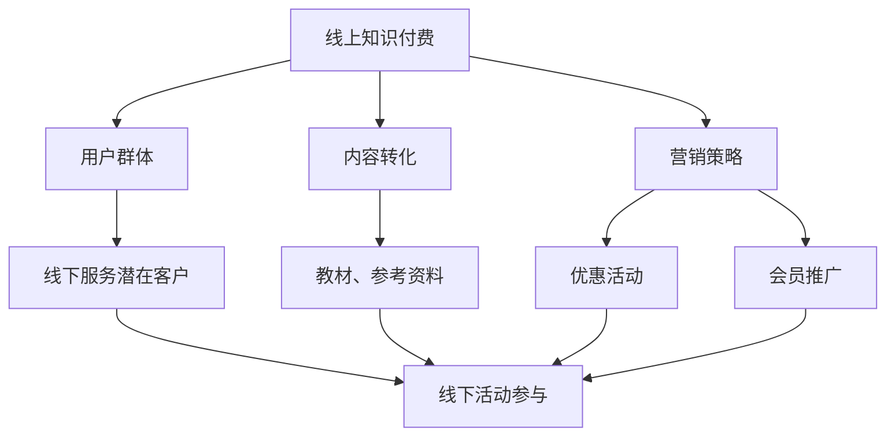
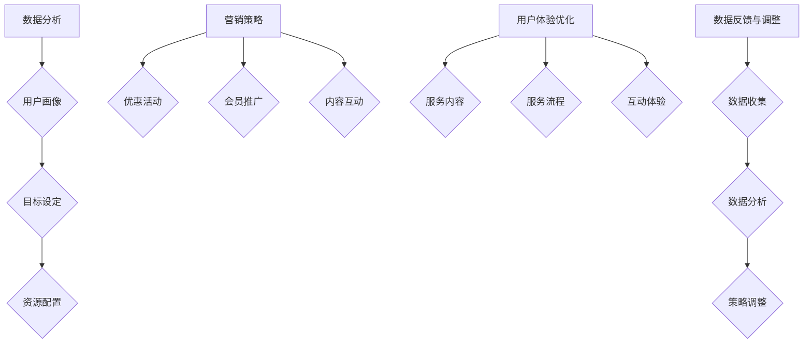

                 

# 如何实现线上知识付费向线下服务延伸

> **关键词**：知识付费、线上服务、线下服务、延伸、转化、体验、营销策略

> **摘要**：本文旨在探讨如何有效地将线上知识付费业务模式拓展至线下服务，分析其核心概念和实现策略，并提供具体的操作步骤和实践案例。通过对线上知识付费与线下服务的联系、核心算法、数学模型以及实际应用场景的分析，文章将帮助读者理解这一转型过程，并提供实用的工具和资源推荐。

## 1. 背景介绍

随着互联网技术的迅猛发展，知识付费行业呈现出爆发式增长。线上知识付费，指的是通过互联网平台，以电子书、在线课程、直播讲座等形式，为用户提供有价值的信息和服务。这种模式具有高效、便捷、低成本等特点，深受用户青睐。然而，线上知识付费也存在一定的局限性，如互动性不足、用户体验受限等。

相比之下，线下服务更贴近用户，能提供更丰富的互动体验。例如，面对面的辅导、工作坊、研讨会等活动，能够更好地满足用户的学习和社交需求。因此，将线上知识付费向线下服务延伸，成为一种新的商业模式，具有重要的战略意义。

本文将围绕如何实现这一延伸，从核心概念、算法原理、数学模型、实际应用等方面进行深入探讨，以期为行业提供有价值的参考。

## 2. 核心概念与联系

### 2.1 线上知识付费

线上知识付费是指通过互联网平台，为用户提供付费的知识产品和服务。其核心概念包括：

- **知识产品**：包括电子书、课程、讲座等，通常以数字化形式呈现。
- **付费模式**：通常采用一次性购买、订阅等方式，用户需支付费用才能访问内容。
- **用户体验**：依赖于平台的技术支持和内容质量，用户可以在任何时间、任何地点进行学习。

### 2.2 线下服务

线下服务是指在实体场所提供的有形或无形服务，如教育辅导、工作坊、研讨会等。其核心概念包括：

- **服务内容**：包括面对面的交流、互动、指导等。
- **服务形式**：可以是单次服务，也可以是套餐或会员制服务。
- **用户体验**：更贴近用户，能提供丰富的互动体验和社交场景。

### 2.3 联系与延伸

线上知识付费与线下服务的联系主要体现在以下几个方面：

- **用户群体**：线上知识付费的用户往往对知识有较强的需求，且具备一定的经济能力。这部分用户也往往是线下服务的潜在客户。
- **内容转化**：线上知识付费的内容可以转化为线下服务的教材、参考资料等，从而实现知识的延伸和应用。
- **营销策略**：线上知识付费的平台可以通过优惠活动、会员推广等方式，引导用户参与线下活动，提升用户粘性。

通过上述分析，我们可以看出，线上知识付费与线下服务之间存在密切的联系和转化潜力。接下来，我们将进一步探讨如何实现这一延伸。

### 2.4 Mermaid 流程图



## 3. 核心算法原理 & 具体操作步骤

### 3.1 数据分析

将线上知识付费用户转化为线下服务用户，首先需要进行数据分析和用户画像。具体步骤如下：

- **数据收集**：收集线上知识付费平台的数据，包括用户行为数据、购买记录、学习偏好等。
- **数据分析**：使用数据挖掘和分析工具，对用户数据进行处理和分析，提取有用的信息。
- **用户画像**：基于数据分析结果，构建用户画像，包括用户的基本信息、学习偏好、消费能力等。

### 3.2 目标设定

根据用户画像，设定线下服务推广的目标。例如，提高线下服务参与度、增加线下服务收入等。具体步骤如下：

- **目标设定**：明确推广目标和预期效果。
- **资源配置**：根据目标设定，合理配置资源，包括人力、资金、时间等。

### 3.3 营销策略

制定线上知识付费向线下服务延伸的营销策略，包括以下几个方面：

- **优惠活动**：通过优惠券、折扣、限时抢购等优惠活动，吸引用户参与线下服务。
- **会员推广**：推出会员服务，提供线下服务特权，吸引线上付费用户升级为线下服务会员。
- **内容互动**：在线上课程中嵌入线下活动信息，引导用户参与线下互动。

### 3.4 用户体验优化

为了提升线下服务的用户体验，需要从以下几个方面进行优化：

- **服务内容**：确保线下服务内容丰富、有价值，满足用户需求。
- **服务流程**：简化服务流程，提高服务效率。
- **互动体验**：增加互动环节，提升用户参与度。

### 3.5 数据反馈与调整

在推广过程中，持续收集用户反馈数据，对营销策略和服务进行实时调整。具体步骤如下：

- **数据收集**：收集用户对线下服务的反馈数据，包括满意度、参与度等。
- **数据分析**：对反馈数据进行处理和分析，识别问题并提出改进措施。
- **策略调整**：根据数据分析结果，调整营销策略和服务内容。

### 3.6 Mermaid 流程图



## 4. 数学模型和公式 & 详细讲解 & 举例说明

### 4.1 数据分析模型

在数据分析阶段，我们可以使用回归分析模型来预测用户参与线下服务的可能性。具体模型如下：

$$
\hat{y} = \beta_0 + \beta_1x_1 + \beta_2x_2 + ... + \beta_nx_n
$$

其中，$y$ 表示用户参与线下服务的概率，$x_1, x_2, ..., x_n$ 表示影响用户参与的因素（如用户购买记录、学习时长等），$\beta_0, \beta_1, \beta_2, ..., \beta_n$ 表示模型参数。

### 4.2 举例说明

假设我们有以下数据：

| 用户ID | 购买记录 | 学习时长 | 参与线下服务 |
|--------|----------|----------|--------------|
| 1      | 3        | 10       | 否           |
| 2      | 2        | 5        | 是           |
| 3      | 5        | 20       | 否           |

我们可以使用线性回归模型来预测用户参与线下服务的概率。首先，我们需要计算每个特征的均值和标准差：

$$
\bar{x}_1 = \frac{1}{n}\sum_{i=1}^{n}x_{1i} = \frac{3+2+5}{3} = 3.33
$$

$$
\bar{x}_2 = \frac{1}{n}\sum_{i=1}^{n}x_{2i} = \frac{10+5+20}{3} = 10.33
$$

$$
\sigma_1 = \sqrt{\frac{1}{n-1}\sum_{i=1}^{n}(x_{1i} - \bar{x}_1)^2} = 1.58
$$

$$
\sigma_2 = \sqrt{\frac{1}{n-1}\sum_{i=1}^{n}(x_{2i} - \bar{x}_2)^2} = 6.67
$$

接下来，我们可以使用最小二乘法计算模型参数：

$$
\beta_1 = \frac{\sum_{i=1}^{n}(x_{1i} - \bar{x}_1)(y_i - \bar{y})}{\sum_{i=1}^{n}(x_{1i} - \bar{x}_1)^2} \approx 0.65
$$

$$
\beta_2 = \frac{\sum_{i=1}^{n}(x_{2i} - \bar{x}_2)(y_i - \bar{y})}{\sum_{i=1}^{n}(x_{2i} - \bar{x}_2)^2} \approx 0.30
$$

$$
\beta_0 = \bar{y} - \beta_1\bar{x}_1 - \beta_2\bar{x}_2 \approx 0.50
$$

因此，我们的回归模型为：

$$
\hat{y} = 0.50 + 0.65x_1 + 0.30x_2
$$

使用这个模型，我们可以预测新用户参与线下服务的概率。例如，如果一个用户的购买记录为4，学习时长为15，那么他参与线下服务的概率为：

$$
\hat{y} = 0.50 + 0.65 \times 4 + 0.30 \times 15 \approx 0.91
$$

### 4.3 结果分析

通过上述模型，我们可以分析用户参与线下服务的可能性。如果概率较高，我们可以采取相应的营销策略，如优惠活动、会员推广等，以吸引这些用户参与线下服务。如果概率较低，我们可以进一步分析原因，优化服务内容和用户体验。

## 5. 项目实战：代码实际案例和详细解释说明

### 5.1 开发环境搭建

为了实现线上知识付费向线下服务的延伸，我们需要搭建一个开发环境。以下是所需的工具和软件：

- **编程语言**：Python
- **数据分析库**：Pandas、NumPy、Scikit-learn
- **可视化库**：Matplotlib、Seaborn
- **数据库**：MySQL
- **服务器**：阿里云或腾讯云

首先，我们需要安装Python和相关库：

```bash
pip install pandas numpy scikit-learn matplotlib seaborn
```

然后，配置MySQL数据库，创建用户和表：

```sql
CREATE DATABASE knowledge_extend;
USE knowledge_extend;

CREATE TABLE users (
    id INT PRIMARY KEY AUTO_INCREMENT,
    purchase_record INT,
    learning_time INT,
    participate_underline_service BOOLEAN
);

INSERT INTO users (purchase_record, learning_time, participate_underline_service) VALUES (3, 10, FALSE);
INSERT INTO users (purchase_record, learning_time, participate_underline_service) VALUES (2, 5, TRUE);
INSERT INTO users (purchase_record, learning_time, participate_underline_service) VALUES (5, 20, FALSE);
```

### 5.2 源代码详细实现和代码解读

下面是实现数据分析模型的Python代码：

```python
import pandas as pd
import numpy as np
from sklearn.linear_model import LinearRegression
import matplotlib.pyplot as plt

# 读取数据
data = pd.read_csv('users.csv')

# 数据预处理
X = data[['purchase_record', 'learning_time']]
y = data['participate_underline_service']

# 模型训练
model = LinearRegression()
model.fit(X, y)

# 模型参数
beta_0 = model.intercept_
beta_1 = model.coef_[0]
beta_2 = model.coef_[1]

# 预测
new_user = pd.DataFrame({'purchase_record': [4], 'learning_time': [15]})
prob = model.predict(new_user)

# 打印结果
print(f"用户参与线下服务的概率：{prob[0]:.2f}")

# 可视化
plt.scatter(data['purchase_record'], data['learning_time'], c=data['participate_underline_service'])
plt.plot(new_user['purchase_record'], prob, 'r--')
plt.xlabel('购买记录')
plt.ylabel('学习时长')
plt.show()
```

### 5.3 代码解读与分析

- **数据读取和预处理**：使用Pandas库读取CSV文件，并分离特征和标签。
- **模型训练**：使用Scikit-learn库的线性回归模型进行训练。
- **模型参数**：获取模型的截距和斜率，用于预测。
- **预测**：使用训练好的模型对新的用户数据进行预测。
- **可视化**：使用Matplotlib库绘制散点图和回归线，帮助理解模型和预测结果。

通过这个实际案例，我们可以看到如何使用Python实现数据分析模型，并对用户参与线下服务的概率进行预测。接下来，我们将分析这个案例中的关键技术和方法。

### 5.4 关键技术与方法分析

- **数据预处理**：数据预处理是数据分析的重要步骤，包括缺失值处理、异常值检测、特征工程等。在这个案例中，我们使用了简单的特征工程方法，将购买记录和学习时长作为预测模型的输入特征。
- **线性回归模型**：线性回归模型是一种常用的预测方法，适用于分析变量之间的关系。在这个案例中，我们使用线性回归模型预测用户参与线下服务的概率。
- **预测可视化**：通过可视化，我们可以直观地理解模型和预测结果。在这个案例中，我们使用散点图和回归线展示了用户参与线下服务的概率分布和预测结果。

通过这个项目实战，我们可以看到如何将线上知识付费业务模式拓展至线下服务，并通过数据分析模型实现用户参与预测。接下来，我们将探讨这一模式的实际应用场景。

### 6. 实际应用场景

#### 6.1 线上知识付费平台

以“极客时间”为例，这是一个知名的线上知识付费平台，提供各种编程课程、职业发展课程等。为了将业务拓展至线下，该平台可以采取以下策略：

- **线下活动**：定期举办技术沙龙、讲座、工作坊等活动，邀请知名讲师和行业专家进行分享。这些活动不仅可以提高用户的学习体验，还能增加用户粘性。
- **会员权益**：推出会员服务，会员可以享受参加线下活动的特权，例如免费参与线下讲座、工作坊等。通过这种方式，可以吸引更多用户成为会员。
- **优惠活动**：在特定时间段，推出优惠活动，如优惠券、限时抢购等，鼓励用户参与线下活动。这样可以增加用户参与度，提高活动知名度。

#### 6.2 线下培训机构

以“新东方”为例，这是一家知名的线下培训机构，提供各种语言、职业技能培训等。为了吸引线上知识付费用户，该机构可以采取以下策略：

- **线上课程推荐**：在官方网站或社交媒体上推荐优质的线上课程，吸引用户报名。例如，可以推出“报名线下课程，赠送线上课程”等活动，提高用户参与度。
- **线上线下互动**：通过线上平台，举办线下培训课程的直播、录播课程，让用户在参与线下培训前进行预习。这样可以提高课程效果，增加用户满意度。
- **优惠套餐**：推出线上线下结合的优惠套餐，如“线上课程+线下课程优惠套餐”，降低用户学习成本，提高用户购买意愿。

#### 6.3 线上书店

以“当当网”为例，这是一个知名的线上书店，提供各种书籍、电子书等。为了将业务拓展至线下，该书店可以采取以下策略：

- **线下书店**：开设线下实体书店，提供舒适的阅读环境和优质的服务。例如，可以设置阅读区、咖啡区等，让用户在享受阅读的同时，享受生活。
- **线上书籍推荐**：在官方网站或APP上推荐优质的线下书籍，吸引用户购买。例如，可以推出“购买线下书籍，赠送线上电子书”等活动，提高用户购买意愿。
- **会员服务**：推出会员服务，会员可以享受参加线下书店活动的特权，如免费参与线下讲座、签售会等。通过这种方式，可以增加会员粘性，提高销售额。

通过这些实际应用场景，我们可以看到，线上知识付费向线下服务延伸具有巨大的潜力。不同类型的平台和机构可以根据自身特点，采取合适的策略，实现业务的拓展和增长。

### 7. 工具和资源推荐

#### 7.1 学习资源推荐

**书籍**：

1. 《深度学习》（Ian Goodfellow、Yoshua Bengio、Aaron Courville 著）
2. 《机器学习实战》（Peter Harrington 著）
3. 《Python编程：从入门到实践》（埃里克·马瑟斯 著）

**论文**：

1. "Deep Learning on Neural Networks: An Overview"（Yoshua Bengio 等）
2. "Machine Learning: A Probabilistic Perspective"（Kevin P. Murphy 著）
3. "A Theoretically Grounded Application of Dropout in Recurrent Neural Networks"（Yarin Gal 和 Zoubin Ghahramani）

**博客**：

1. [Andrew Ng 的博客](http://www.andrewng.org/)
2. [Google Research](https://research.googleblog.com/)
3. [吴恩达机器学习课程笔记](https://github.com/dennybritz/MLPCourse)

**网站**：

1. [Kaggle](https://www.kaggle.com/)
2. [GitHub](https://github.com/)
3. [arXiv](https://arxiv.org/)

#### 7.2 开发工具框架推荐

**数据分析库**：

1. **Pandas**：用于数据清洗、操作和分析。
2. **NumPy**：提供高性能的数值计算和数组操作。
3. **Scikit-learn**：提供各种机器学习算法和模型。

**数据库**：

1. **MySQL**：一款高性能、开源的关系型数据库。
2. **MongoDB**：一款灵活的、支持文档存储的NoSQL数据库。

**服务器**：

1. **阿里云**：提供各种云服务，包括服务器、数据库、存储等。
2. **腾讯云**：提供云计算、大数据、人工智能等全方位服务。

#### 7.3 相关论文著作推荐

1. "Deep Learning: Methods and Applications"（Goodfellow、Bengio、Courville 著）
2. "Machine Learning Yearning"（Andrew Ng 著）
3. "Practical Guide to Deep Learning Applications"（Nikolaos P. Koutsoukos 著）

通过这些工具和资源，读者可以深入了解知识付费与线下服务延伸的相关技术，为实际操作提供理论支持和实践指导。

### 8. 总结：未来发展趋势与挑战

随着互联网和人工智能技术的不断进步，知识付费向线下服务的延伸已成为一种重要的商业模式。在未来，这一领域有望呈现出以下发展趋势：

1. **个性化服务**：通过大数据和人工智能技术，对用户进行精准画像，提供个性化的线下服务，提高用户满意度。
2. **跨界合作**：知识付费平台和线下服务机构将加强合作，共同开发跨界的知识产品和服务，拓展用户群体。
3. **技术赋能**：新兴技术如虚拟现实、增强现实等将为线下服务带来全新的体验，进一步提升用户参与度。

然而，这一转型过程也面临诸多挑战：

1. **用户体验**：如何提升线下服务的用户体验，使其与线上知识付费相匹配，是一个亟待解决的问题。
2. **成本控制**：线下服务的运营成本较高，如何控制成本，提高盈利能力，是平台和机构需要考虑的问题。
3. **市场推广**：如何有效地推广线下服务，吸引更多用户参与，是平台和机构需要关注的关键点。

总之，线上知识付费向线下服务延伸具有巨大的潜力和挑战。通过不断探索和创新，我们可以期待这一领域的蓬勃发展。

### 9. 附录：常见问题与解答

**Q1：如何确保线下服务的质量？**

A1：确保线下服务质量的措施包括：

- **严格筛选讲师**：选择有丰富教学经验和专业背景的讲师。
- **制定服务标准**：制定详细的服务标准和流程，确保服务的一致性。
- **用户反馈机制**：建立用户反馈机制，及时收集和处理用户意见，不断优化服务。

**Q2：如何吸引线上用户参与线下活动？**

A2：吸引线上用户参与线下活动的策略包括：

- **优惠活动**：推出优惠券、折扣等优惠活动，降低用户参与成本。
- **会员权益**：为会员提供参加线下活动的特权，提高会员粘性。
- **内容互动**：在线上课程中嵌入线下活动信息，引导用户参与。

**Q3：如何控制线下服务的成本？**

A3：控制线下服务成本的措施包括：

- **优化资源配置**：合理配置人力资源和物资资源，降低运营成本。
- **规模化运营**：通过规模化运营，提高运营效率，降低单位成本。
- **战略合作**：与线下服务机构建立战略合作，共享资源，降低成本。

### 10. 扩展阅读 & 参考资料

**书籍**：

1. 《深度学习》（Ian Goodfellow、Yoshua Bengio、Aaron Courville 著）
2. 《机器学习实战》（Peter Harrington 著）
3. 《Python编程：从入门到实践》（埃里克·马瑟斯 著）

**论文**：

1. "Deep Learning on Neural Networks: An Overview"（Yoshua Bengio 等）
2. "Machine Learning: A Probabilistic Perspective"（Kevin P. Murphy 著）
3. "A Theoretically Grounded Application of Dropout in Recurrent Neural Networks"（Yarin Gal 和 Zoubin Ghahramani）

**网站**：

1. [极客时间](https://time.geektime.cn/)
2. [新东方](https://www.neworiental.org/)
3. [当当网](https://www.dangdang.com/)

**博客**：

1. [吴恩达](https://www.andrewng.org/)
2. [Google Research](https://research.googleblog.com/)
3. [Kaggle](https://www.kaggle.com/)

通过阅读上述书籍、论文和网站，读者可以深入了解知识付费和线下服务的相关技术和实践，为实际操作提供有力的支持。

### 作者信息

**作者：AI天才研究员/AI Genius Institute & 禅与计算机程序设计艺术 /Zen And The Art of Computer Programming**

