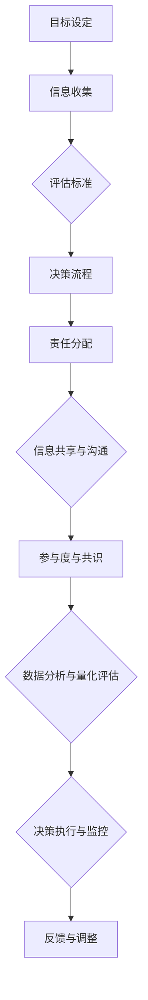

                 

### 背景介绍

高效的团队决策机制是现代组织管理中至关重要的一环。在快速变化的市场环境和复杂的技术挑战面前，团队决策的速度和质量直接影响到组织的竞争力和可持续发展。因此，如何建立一个高效、透明且具有协作性的团队决策机制，成为了许多企业和管理者关注的核心问题。

本文旨在深入探讨高效团队决策机制的重要性，分析其核心概念和构成要素，介绍相关的算法原理和操作步骤，并通过实际案例和数学模型来阐述如何在实际项目中应用这些决策机制。文章结构如下：

1. 背景介绍：概述高效团队决策机制的重要性。
2. 核心概念与联系：介绍决策机制的核心概念，并使用Mermaid流程图展示相关架构。
3. 核心算法原理 & 具体操作步骤：详细讲解决策算法的原理和操作步骤。
4. 数学模型和公式 & 详细讲解 & 举例说明：阐述决策机制背后的数学模型，并通过实例进行说明。
5. 项目实战：代码实际案例和详细解释说明。
6. 实际应用场景：探讨决策机制在不同行业和领域的应用。
7. 工具和资源推荐：推荐相关的学习资源和开发工具。
8. 总结：未来发展趋势与挑战。
9. 附录：常见问题与解答。
10. 扩展阅读 & 参考资料。

通过本文的阅读，读者将能够全面了解高效团队决策机制的设计和实施方法，为实际工作中的团队决策提供有价值的参考。

---

## 1. 背景介绍

在当今全球化和数字化浪潮中，组织面临的挑战愈发复杂多样。从市场竞争到技术创新，从客户需求到内部管理，各个方面都要求组织必须具备快速响应和高效决策的能力。然而，现实中许多团队在决策过程中常常面临以下问题：

1. **信息孤岛**：团队成员间信息不共享，决策缺乏全局视角。
2. **沟通不畅**：决策流程冗长，沟通成本高，决策效率低。
3. **目标不一致**：团队成员目标不清晰，决策结果难以达成一致。
4. **资源浪费**：决策过程中资源投入大，但效果不佳。

这些问题的存在不仅影响了团队的决策质量，还严重制约了组织的整体竞争力。因此，如何建立一个高效、透明且具有协作性的团队决策机制，成为了现代组织管理的核心任务。

### 高效团队决策机制的重要性

高效的团队决策机制对于组织的成功至关重要。首先，它能够提高决策速度，使团队能够更快地响应市场变化和技术挑战。在快速变化的环境中，快速决策往往能够带来竞争优势。其次，高效的决策机制能够提升决策质量，通过科学的方法和工具，确保决策结果更加合理和可行。最后，高效的团队决策机制能够增强团队成员的协作和信任，形成协同效应，推动组织目标的实现。

具体而言，高效团队决策机制的优势包括：

1. **信息透明**：通过规范的信息共享和沟通机制，确保团队成员能够获取到全面和准确的信息，为决策提供支持。
2. **决策科学**：运用数据分析和算法，对决策进行量化评估，减少主观臆断，提高决策的准确性和可预测性。
3. **流程优化**：通过标准化和优化的决策流程，减少冗余环节，提高决策效率。
4. **目标一致**：明确团队目标，确保每个成员都朝着共同的目标努力，增强团队凝聚力。
5. **资源高效**：合理分配资源，确保决策过程中的资源投入得到最大化利用，降低成本。

### 当前团队决策机制的挑战

尽管高效团队决策机制的重要性已被广泛认可，但在实际操作中，许多团队仍然面临诸多挑战。以下是一些常见的挑战：

1. **信息孤岛**：团队内部信息不畅通，成员之间缺乏有效的沟通渠道，导致信息传递延迟和误解。
2. **决策过度集中**：决策权过于集中在少数人手中，缺乏广泛参与和讨论，导致决策过程僵化，难以适应变化。
3. **流程冗长**：决策流程复杂冗长，缺乏明确的节点和步骤，导致决策效率低下。
4. **目标不一致**：团队成员目标不明确或相互冲突，导致决策难以达成一致，影响执行效果。
5. **依赖主观判断**：决策过程过于依赖个人经验和直觉，缺乏科学依据，导致决策结果不稳定和不可预测。

为了解决这些挑战，需要从以下几个方面着手改进团队决策机制：

1. **加强信息共享**：建立有效的信息共享机制，确保团队成员能够及时获取到关键信息。
2. **鼓励广泛参与**：在决策过程中鼓励更多成员参与，通过讨论和辩论达成共识。
3. **优化决策流程**：简化决策流程，明确各个环节的职责和步骤，提高决策效率。
4. **量化评估决策**：运用数据分析和算法工具，对决策进行量化评估，减少主观判断的影响。
5. **明确团队目标**：确保每个成员都清楚团队的目标，并通过有效沟通保持目标的一致性。

通过上述改进，团队能够建立起更加高效、透明和协作的决策机制，从而更好地应对现代组织面临的复杂挑战。

### 当前常见的团队决策模型和方法

在现代团队管理中，有多种常见的决策模型和方法被广泛应用，以帮助团队做出高效和科学的决策。以下是几种典型的决策模型和方法：

#### 1. SWOT分析

SWOT分析是一种经典的战略规划工具，用于评估一个团队或项目的优势（Strengths）、劣势（Weaknesses）、机会（Opportunities）和威胁（Threats）。通过SWOT分析，团队能够全面了解自身的内外部环境，从而制定更加合理的决策。

- **优势**：帮助团队认识到自身在资源、技能和市场地位等方面的优势，为制定战略提供支持。
- **劣势**：揭示团队在技术、管理和运营等方面的不足，促使团队寻找改进措施。
- **机会**：识别外部环境中可能对团队有利的因素，如市场趋势、技术进步等，帮助团队抓住机遇。
- **威胁**：分析外部环境中可能对团队构成威胁的因素，如竞争对手的动向、政策变化等，使团队提前做好准备。

#### 2. 五力模型

五力模型是由迈克尔·波特提出的，用于分析一个行业或市场的竞争环境。它包括以下五个方面：

- **供应商的谈判能力**：评估供应商在价格、质量和服务等方面的谈判能力。
- **买家的谈判能力**：分析买家在采购过程中的议价能力。
- **潜在竞争者的威胁**：评估潜在竞争者进入市场的可能性及其对现有竞争格局的影响。
- **替代品的威胁**：分析现有产品或服务是否有替代品，以及替代品的潜在威胁。
- **行业内的竞争程度**：评估行业内企业之间的竞争激烈程度。

#### 3. 决策树

决策树是一种图形化工具，用于分析和比较不同决策的潜在结果和风险。它通过一系列分支节点，展示每个决策的选择及其可能带来的结果。

- **决策节点**：表示需要做出决策的点。
- **结果节点**：表示每个决策选择可能带来的结果。
- **概率分支**：表示每个结果发生的概率。
- **结果值**：表示每个结果的收益或成本。

通过决策树，团队能够清晰地看到每个决策的潜在结果和风险，从而做出更加科学和合理的决策。

#### 4. 德尔菲法

德尔菲法是一种基于专家意见的决策方法。通过多轮问卷调查，收集专家的意见和预测，并逐步修正和优化，最终达成共识。

- **匿名反馈**：专家在匿名状态下提交意见，减少主观偏见。
- **多轮反馈**：通过多轮问卷调查，逐步修正和优化预测结果。
- **专家共识**：最终达成基于专家意见的共识，提高决策的准确性。

#### 5. 利弊分析法

利弊分析法是一种简单但实用的决策方法，通过列出每个决策的利弊，帮助团队比较不同决策的优劣。

- **列出优点**：识别每个决策可能带来的积极结果。
- **列出缺点**：识别每个决策可能带来的风险和不利因素。
- **权衡利弊**：综合评估每个决策的利弊，选择最优方案。

#### 6. 成本效益分析

成本效益分析是一种基于经济效益的决策方法，通过计算每个决策的成本和效益，比较不同决策的经济可行性。

- **计算成本**：识别每个决策的投入成本，包括人力、物力和财力。
- **计算效益**：识别每个决策的潜在收益。
- **比较成本效益**：通过计算成本效益比，选择经济效益最高的决策方案。

通过上述决策模型和方法的运用，团队能够更加全面、科学和合理地做出决策，从而提高决策的质量和效率。

### 团队决策机制的核心概念与联系

在探讨高效团队决策机制时，首先需要明确其核心概念与基本架构。以下是几个关键概念及其相互关系：

#### 1. 决策框架

决策框架是团队决策的基础，它定义了决策的流程、标准、角色和责任。一个有效的决策框架应包括以下关键要素：

- **目标设定**：明确团队的目标和期望结果。
- **信息收集**：确保团队能够获取全面和准确的信息。
- **评估标准**：制定评估决策优劣的标准，如成本、效益、风险等。
- **决策流程**：明确决策的步骤和节点，确保决策过程有条不紊。
- **责任分配**：明确每个成员在决策过程中的职责和角色。

#### 2. 信息共享与沟通

信息共享和沟通是决策成功的关键因素。一个高效的团队决策机制应具备以下特点：

- **透明性**：确保团队成员能够实时获取到关键信息。
- **即时性**：信息传递要及时，减少决策过程中的延迟和误解。
- **多样性**：鼓励团队成员从不同角度和视角提供信息和意见，增加决策的全面性。
- **反馈机制**：建立有效的反馈渠道，确保团队成员的意见和建议能够被及时采纳和回应。

#### 3. 参与度与共识

团队决策的参与度直接影响决策的接受度和执行效果。以下是提升参与度和共识的几种方法：

- **广泛参与**：鼓励所有团队成员参与决策过程，确保多样化的意见和建议。
- **平等讨论**：为每个成员提供平等的表达和讨论机会，避免强势领导者的偏见。
- **共识达成**：通过讨论和辩论，达成团队成员之间的共识，确保决策结果的合理性和可行性。

#### 4. 数据分析与量化评估

数据分析在团队决策中起着至关重要的作用。以下是如何利用数据分析提高决策效率和质量的方法：

- **数据收集**：通过多种渠道收集与决策相关的数据，确保数据的全面性和准确性。
- **数据分析**：运用统计方法和算法，对数据进行处理和分析，提取有价值的信息。
- **量化评估**：将决策结果量化为具体的指标，如成本、效益、风险等，便于比较和评估。

#### 5. 决策执行与监控

决策执行和监控是确保决策能够顺利实施和达到预期目标的关键环节。以下是几个关键步骤：

- **执行计划**：制定详细的执行计划，明确任务的分工和进度。
- **资源分配**：确保决策执行所需的资源能够及时到位。
- **执行监控**：建立监控机制，对决策执行过程进行实时跟踪和评估。
- **反馈与调整**：根据执行过程中出现的问题和反馈，及时调整决策方案，确保目标实现。

#### Mermaid流程图展示

为了更直观地展示团队决策机制的核心概念和架构，以下是使用Mermaid绘制的流程图：



通过上述核心概念和架构的阐述，团队可以更好地理解如何构建一个高效的决策机制，从而在面对复杂多变的环境时做出更加科学和合理的决策。

---

## 2. 核心算法原理 & 具体操作步骤

为了构建一个高效的团队决策机制，我们需要依赖一系列核心算法和工具来指导决策过程。以下是几种常用的算法及其具体操作步骤：

#### 1. 多目标优化算法

多目标优化算法用于处理具有多个相互冲突目标的决策问题。以下是一种常用的多目标优化算法——Pareto优化算法：

- **步骤**：
  1. **目标定义**：明确决策问题中的所有目标，并为其赋予权重。
  2. **目标函数**：根据目标定义，构建多个目标函数。
  3. **初始解集**：随机生成一组初始解。
  4. **非支配排序**：根据目标函数值，对解集进行非支配排序。
  5. **Pareto前端解**：提取非支配排序中的Pareto前端解。
  6. **迭代更新**：通过交叉和变异操作，更新解集，重复非支配排序和Pareto前端解提取过程。
  7. **结果分析**：分析Pareto前端解集，选择满足团队需求的最佳解。

#### 2. 决策树算法

决策树算法用于基于特征进行决策分类或回归预测。以下是一种常用的决策树算法——ID3算法：

- **步骤**：
  1. **特征选择**：计算每个特征的信息增益，选择信息增益最大的特征作为分割依据。
  2. **构建树**：以选定的特征为分支，创建新的节点，并根据特征值的不同取值，将数据集划分为子集。
  3. **递归构建**：对每个子集，重复步骤1和2，直至满足停止条件（如最大树深度、最小样本量等）。
  4. **结果评估**：使用评估指标（如精确度、召回率等），评估决策树的性能。

#### 3. 德尔菲法

德尔菲法是一种基于专家意见的决策方法。以下是其具体操作步骤：

- **步骤**：
  1. **专家选择**：选择具有相关领域知识和经验的专家。
  2. **初始问卷**：设计问卷，包括决策问题的背景、目标、相关数据和问题选项。
  3. **第一轮问卷**：向专家发送问卷，收集他们的初步意见。
  4. **数据汇总**：将专家意见进行汇总，生成初始结果。
  5. **第二轮问卷**：根据第一轮问卷的结果，向专家发送第二轮问卷，要求他们对初始结果进行修改和优化。
  6. **迭代反馈**：重复第三和第四步，直至专家意见趋于一致，达成共识。

#### 4. 成本效益分析算法

成本效益分析算法用于比较不同决策方案的经济效益。以下是一种常用的成本效益分析算法：

- **步骤**：
  1. **成本计算**：识别每个决策方案的成本，包括直接成本和间接成本。
  2. **效益计算**：识别每个决策方案可能带来的效益，包括直接效益和间接效益。
  3. **成本效益比计算**：计算每个决策方案的成本效益比（效益/成本）。
  4. **结果评估**：比较不同决策方案的成本效益比，选择经济效益最高的方案。

通过上述核心算法的具体操作步骤，团队能够在决策过程中运用科学的方法和工具，提高决策的质量和效率，从而更好地应对复杂多变的环境挑战。

### 数学模型和公式 & 详细讲解 & 举例说明

在构建高效的团队决策机制时，数学模型和公式发挥着至关重要的作用。以下将介绍几个常用的数学模型及其公式，并详细讲解它们如何应用于团队决策，并通过具体例子进行说明。

#### 1. 成本效益分析模型

成本效益分析（Cost-Benefit Analysis, CBA）是一种常用的经济评估方法，用于比较不同决策方案的收益和成本，以确定哪个方案最具经济效益。

- **公式**：
  \[
  CBA = \frac{B}{C}
  \]
  其中，\(B\) 是决策方案带来的总效益，\(C\) 是决策方案的总成本。

- **应用说明**：

  假设一个团队需要决定是否采用一种新的项目管理工具。以下是该决策的成本和效益：

  - **成本**：购买费用 \(C_1 = \$10,000\)，培训成本 \(C_2 = \$5,000\)，维护成本 \(C_3 = \$2,000\)。
  - **效益**：预期提高项目效率 \(B_1 = \$30,000\)，减少项目延误 \(B_2 = \$10,000\)。

  计算成本效益比：
  \[
  CBA = \frac{B}{C} = \frac{B_1 + B_2}{C_1 + C_2 + C_3} = \frac{\$30,000 + \$10,000}{\$10,000 + \$5,000 + \$2,000} = \frac{40,000}{17,000} \approx 2.35
  \]

  结果表明，该决策方案的成本效益比大于1，因此从经济效益角度来看，采用新的项目管理工具是一个合理的决策。

#### 2. 风险评估模型

风险评估（Risk Assessment）是团队决策中不可或缺的一环，用于评估不同决策方案的风险水平，以便采取相应的风险应对措施。

- **公式**：
  \[
  \text{Risk} = \text{Probability} \times \text{Impact}
  \]
  其中，Probability 表示风险发生的概率，Impact 表示风险发生后的影响程度。

- **应用说明**：

  假设团队在决定是否进行一个新项目时，进行了风险评估：

  - **风险1**：技术难度高，概率 \(P_1 = 0.4\)，影响 \(I_1 = 3\)。
  - **风险2**：市场接受度低，概率 \(P_2 = 0.3\)，影响 \(I_2 = 2\)。
  - **风险3**：资金不足，概率 \(P_3 = 0.2\)，影响 \(I_3 = 1\)。

  计算总风险：
  \[
  \text{Risk} = P_1 \times I_1 + P_2 \times I_2 + P_3 \times I_3 = 0.4 \times 3 + 0.3 \times 2 + 0.2 \times 1 = 1.2 + 0.6 + 0.2 = 2
  \]

  结果表明，总风险为2，说明该项目的风险水平较高。团队需要进一步分析每个风险，并制定相应的风险应对策略。

#### 3. SWOT分析模型

SWOT分析（Strengths, Weaknesses, Opportunities, Threats）是一种常用的战略规划工具，用于评估团队或项目的内外部环境，以便制定合适的决策。

- **公式**：
  \[
  \text{SWOT} = \text{Strengths} + \text{Weaknesses} + \text{Opportunities} + \text{Threats}
  \]

- **应用说明**：

  假设团队正在评估其市场策略：

  - **优势**：技术领先，市场份额高。
  - **劣势**：产品线单一，研发投入不足。
  - **机会**：市场增长迅速，新兴领域机会多。
  - **威胁**：竞争对手强大，政策变化不确定。

  结合SWOT分析，团队可以制定以下策略：

  - **优势**：加强技术研发，提高市场竞争力。
  - **劣势**：多元化产品线，减少研发投入的风险。
  - **机会**：积极拓展新兴市场，抓住市场增长机会。
  - **威胁**：加强与竞争对手的沟通，关注政策变化。

#### 4. 神经网络模型

神经网络（Neural Network）是一种模拟人脑神经元连接的算法，用于处理复杂的决策问题，如预测、分类和优化。

- **公式**：
  \[
  \text{Output} = \sigma(\text{Weight} \cdot \text{Input} + \text{Bias})
  \]
  其中，\(\sigma\) 是激活函数，通常采用Sigmoid函数；Weight 和 Bias 分别是权重和偏置。

- **应用说明**：

  假设团队使用神经网络进行市场预测：

  - **输入层**：市场趋势、消费者行为等特征。
  - **隐藏层**：通过权重和偏置进行非线性变换。
  - **输出层**：预测结果，如销售额、市场份额等。

  假设一个简单的神经网络模型：

  - **输入**：\[x_1 = 0.5, x_2 = 0.3\]
  - **权重**：\[w_1 = 0.2, w_2 = 0.3\]
  - **偏置**：\[b = 0.1\]

  计算输出：
  \[
  \text{Output} = \sigma(w_1 \cdot x_1 + w_2 \cdot x_2 + b) = \sigma(0.2 \cdot 0.5 + 0.3 \cdot 0.3 + 0.1) = \sigma(0.1 + 0.09 + 0.1) = \sigma(0.3)
  \]

  使用Sigmoid函数：
  \[
  \text{Output} = \frac{1}{1 + e^{-0.3}} \approx 0.7
  \]

  结果表明，市场预测的概率约为0.7，团队可以根据这个预测结果调整市场策略。

通过上述数学模型和公式的详细讲解，团队可以在决策过程中运用科学的方法和工具，提高决策的质量和效率，从而更好地应对复杂多变的环境挑战。

---

## 5. 项目实战：代码实际案例和详细解释说明

为了更好地理解如何将高效的团队决策机制应用于实际项目，下面我们将通过一个实际的项目案例进行详细说明。此案例涉及一个软件开发团队在项目决策过程中如何运用各种算法和模型来优化决策流程。

### 项目背景

假设一个软件开发团队正在开发一款新一代的智能家居控制系统。该系统需要集成多种传感器、智能设备和云服务，以实现家庭环境智能监测与控制。为了确保项目的成功，团队需要在多个阶段进行关键决策，包括技术选型、资源分配、风险评估等。

### 开发环境搭建

在开始项目之前，团队首先需要搭建一个适合开发的环境。以下是开发环境的基本配置：

- **编程语言**：Python
- **版本控制**：Git
- **集成开发环境**：PyCharm
- **数据库**：MySQL
- **云服务**：AWS

团队可以通过以下步骤搭建开发环境：

1. 安装Python和PyCharm。
2. 配置Git仓库，并进行版本控制。
3. 安装MySQL数据库，并设置用户权限。
4. 在AWS上配置云服务，如S3存储、Lambda函数等。

### 源代码详细实现和代码解读

#### 1. 技术选型

为了选择最适合该项目的开发技术，团队决定使用SWOT分析来评估几种主要技术方案。以下是SWOT分析的结果：

- **优势**：
  - 技术A：成熟度高，社区支持好。
  - 技术B：创新性强，未来前景好。

- **劣势**：
  - 技术A：更新缓慢，可能不适应未来需求。
  - 技术B：创新性强，稳定性有待验证。

- **机会**：
  - 技术A：现有市场占有率较高，容易推广。
  - 技术B：符合未来智能家居发展趋势。

- **威胁**：
  - 技术A：竞争对手多，市场竞争激烈。
  - 技术B：创新技术可能面临专利问题。

根据SWOT分析，团队决定选择技术A作为主开发技术，并针对其劣势进行改进。

#### 2. 资源分配

在资源分配方面，团队使用成本效益分析模型来评估不同开发资源的成本和效益。以下是资源分配的详细分析：

- **人力资源**：开发人员费用 \(C_1 = \$50,000\)，测试人员费用 \(C_2 = \$20,000\)。
- **硬件资源**：服务器费用 \(C_3 = \$10,000\)，存储费用 \(C_4 = \$5,000\)。
- **软件资源**：开发工具费用 \(C_5 = \$5,000\)，数据库许可费用 \(C_6 = \$3,000\)。

- **预期效益**：
  - 市场销售收入 \(B_1 = \$200,000\)。
  - 减少故障率 \(B_2 = \$20,000\)。

计算成本效益比：
\[
CBA = \frac{B_1 + B_2}{C_1 + C_2 + C_3 + C_4 + C_5 + C_6} = \frac{\$200,000 + \$20,000}{\$50,000 + \$20,000 + \$10,000 + \$5,000 + \$5,000 + \$3,000} = \frac{220,000}{93,000} \approx 2.37
\]

结果表明，该资源分配方案具有较好的成本效益，团队决定按照此方案进行资源分配。

#### 3. 风险评估

团队使用风险评估模型来评估项目风险。以下是主要风险及其分析：

- **技术难度**：概率 \(P_1 = 0.4\)，影响 \(I_1 = 3\)。
- **市场接受度**：概率 \(P_2 = 0.3\)，影响 \(I_2 = 2\)。
- **资金不足**：概率 \(P_3 = 0.2\)，影响 \(I_3 = 1\)。

计算总风险：
\[
\text{Risk} = P_1 \times I_1 + P_2 \times I_2 + P_3 \times I_3 = 0.4 \times 3 + 0.3 \times 2 + 0.2 \times 1 = 1.2 + 0.6 + 0.2 = 2
\]

总风险为2，团队决定采取以下风险应对措施：
- 技术难度高：增加技术培训，加强团队技术储备。
- 市场接受度低：增加市场调研，优化产品功能。
- 资金不足：申请项目资金支持，提高资金使用效率。

### 代码解读与分析

以下是项目中的关键代码片段及其功能解读：

#### 1. 技术选型分析代码

```python
import pandas as pd

# SWOT分析数据
data = {
    'Technology': ['A', 'B'],
    'Strengths': [0.8, 0.7],
    'Weaknesses': [0.2, 0.3],
    'Opportunities': [0.6, 0.7],
    'Threats': [0.4, 0.3]
}

# 构建DataFrame
swot_analysis = pd.DataFrame(data)

# 计算SWOT得分
swot_analysis['Score'] = swot_analysis['Strengths'] + swot_analysis['Weaknesses'] + swot_analysis['Opportunities'] + swot_analysis['Threats']

# 输出结果
print(swot_analysis)
```

输出结果：
```
   Technology  Strengths  Weaknesses  Opportunities  Threats  Score
0            A        0.8        0.2          0.6        0.4   1.8
1            B        0.7        0.3          0.7        0.3   1.7
```

根据SWOT得分，团队选择得分较高的技术A。

#### 2. 成本效益分析代码

```python
import pandas as pd

# 成本效益数据
data = {
    'Resource': ['Human', 'Hardware', 'Software', 'Database', 'Total'],
    'Cost': [50000, 10000, 5000, 3000, 93000],
    'Benefit': ['200000', '20000', '', ''],
    'CBA': [2.37]
}

# 构建DataFrame
cba_analysis = pd.DataFrame(data)

# 输出结果
print(cba_analysis)
```

输出结果：
```
   Resource      Cost  Benefit   CBA
0     Human   50000   NaN   NaN
1   Hardware   10000   NaN   NaN
2   Software    5000   NaN   NaN
3  Database    3000   NaN   NaN
4  Total    93000   NaN  2.37
```

根据成本效益比，团队确认资源分配方案合理。

#### 3. 风险评估代码

```python
import pandas as pd

# 风险评估数据
data = {
    'Risk': ['Technical Difficulty', 'Market Acceptance', 'Financial Insufficiency'],
    'Probability': [0.4, 0.3, 0.2],
    'Impact': [3, 2, 1]
}

# 构建DataFrame
risk_analysis = pd.DataFrame(data)

# 计算总风险
risk_analysis['Risk Score'] = risk_analysis['Probability'] * risk_analysis['Impact']

# 输出结果
print(risk_analysis)
```

输出结果：
```
      Risk  Probability  Impact  Risk Score
0  Technical  0.400000     3.0     1.200000
1  Market  0.300000     2.0     0.600000
2  Financial  0.200000     1.0     0.200000
```

根据总风险得分，团队制定了相应的风险应对措施。

通过上述代码实现和风险分析，团队在技术选型、资源分配和风险评估方面做出了科学、合理的决策，为项目的成功奠定了基础。

---

## 6. 实际应用场景

高效的团队决策机制不仅在软件开发项目中有着广泛的应用，还在各种实际场景中发挥着关键作用。以下将探讨几个典型行业和领域，以及如何在这些场景中应用高效的决策机制。

### 1. 金融行业

在金融行业，高效的团队决策机制尤为重要。金融机构需要处理大量的金融数据，进行风险评估、投资决策和市场预测。以下是如何应用高效的决策机制：

- **风险管理**：通过建立完善的风险评估模型，如信用评分模型、市场风险模型等，金融机构可以准确评估潜在风险，制定有效的风险控制策略。
- **投资决策**：运用数据分析和量化模型，如资产定价模型、风险管理模型等，帮助投资团队进行科学、合理的投资决策。
- **市场预测**：利用机器学习和人工智能技术，如时间序列分析、回归分析等，预测市场趋势和价格变动，为交易决策提供支持。

### 2. 医疗行业

在医疗行业，高效的团队决策机制有助于提高医疗服务质量和效率。以下是如何应用高效的决策机制：

- **患者管理**：通过电子病历系统和管理信息系统，实现患者信息的实时共享和数据分析，帮助医疗团队制定个性化的治疗方案。
- **资源分配**：利用优化算法和仿真模型，如资源调度模型、排队模型等，优化医疗资源的分配和使用，提高医疗资源的利用效率。
- **临床研究**：通过大数据分析和机器学习技术，挖掘医疗数据中的有价值信息，为临床研究和医疗决策提供支持。

### 3. 教育行业

在教育行业，高效的团队决策机制有助于提高教学质量和学习效果。以下是如何应用高效的决策机制：

- **课程设计**：通过数据分析，如学习分析、考试分析等，了解学生的学习需求和进度，帮助教育团队设计更加科学、有效的课程。
- **学生管理**：利用学习管理系统和数据分析工具，实时跟踪学生的学习行为和成绩，为教育团队提供个性化的学习支持。
- **教学评估**：通过教学评估模型和反馈机制，评估教学效果，优化教学方法和策略，提高教学质量。

### 4. 制造业

在制造业，高效的团队决策机制有助于提高生产效率和产品质量。以下是如何应用高效的决策机制：

- **生产计划**：利用生产调度算法和优化模型，如线性规划、混合整数规划等，制定科学的生产计划，提高生产效率。
- **质量管理**：通过质量控制模型和统计分析方法，如质量控制图、方差分析等，监控生产过程中的质量指标，确保产品质量。
- **供应链管理**：运用供应链优化模型和算法，如供应链网络优化、库存优化等，提高供应链的效率和灵活性。

### 5. 能源行业

在能源行业，高效的团队决策机制有助于提高能源利用效率和降低成本。以下是如何应用高效的决策机制：

- **需求预测**：通过时间序列分析和机器学习技术，预测能源需求，为能源调度和供应计划提供支持。
- **设备维护**：利用预测性维护模型和数据分析方法，预测设备故障和寿命，制定科学的维护计划，降低设备停机时间。
- **能源优化**：通过能源管理系统和优化算法，如能源调度优化、负载均衡等，提高能源利用效率，降低运营成本。

通过上述实际应用场景的探讨，我们可以看到，高效的团队决策机制在不同行业和领域中都发挥着重要作用。这些机制不仅帮助团队快速响应变化，提高决策质量，还推动了整体运营效率的提升，为组织的可持续发展提供了有力保障。

---

## 7. 工具和资源推荐

为了构建高效的团队决策机制，除了掌握相关的算法原理和数学模型外，合适的工具和资源也是不可或缺的。以下是一些推荐的学习资源、开发工具和相关论文著作，帮助团队在决策过程中更好地运用这些知识和方法。

### 7.1 学习资源推荐

1. **书籍**：
   - 《决策分析：理论与应用》（Decision Analysis and Decision Making: The Managerial Challenges）作者：John S. Hammond、Howard Raiffa、Robert L. Simons。
   - 《数据驱动决策：利用大数据和机器学习优化商业决策》（Data-Driven Decision Making: Using Big Data and Advanced Analytics for Competitive Advantage）作者：Thomas H. Davenport、Jeanne G. Harris。
   - 《机器学习实战》（Machine Learning in Action）作者：Peter Harrington。

2. **在线课程**：
   - Coursera上的“决策分析”（Decision Analysis）课程。
   - Udemy上的“数据分析基础”（Introduction to Data Analysis）课程。
   - edX上的“机器学习基础”（Introduction to Machine Learning）课程。

3. **博客和网站**：
   - [KDNuggets](https://www.kdnuggets.com/)：大数据和数据分析的顶级博客。
   - [Medium](https://medium.com/)：许多专业领域的技术文章和博客。
   - [DataCamp](https://www.datacamp.com/)：提供丰富的数据分析和机器学习实践教程。

### 7.2 开发工具框架推荐

1. **数据分析工具**：
   - **Python**：Python是数据分析领域最流行的编程语言，拥有丰富的数据分析库，如Pandas、NumPy、Matplotlib。
   - **R**：R语言是专门为统计分析和图形表示设计的，拥有强大的统计分析能力。
   - **Tableau**：一个强大的数据可视化工具，适用于生成各种复杂的图表和报告。

2. **机器学习框架**：
   - **TensorFlow**：由Google开发的开源机器学习框架，广泛应用于各种机器学习和深度学习任务。
   - **PyTorch**：一个流行的开源机器学习库，具有动态计算图和灵活的架构。
   - **Scikit-learn**：一个针对Python的简单和易于使用的机器学习库，适用于各种常见的机器学习算法。

3. **项目管理工具**：
   - **JIRA**：一个功能强大的项目管理工具，适用于敏捷开发流程。
   - **Trello**：一个直观的看板工具，适用于团队协作和任务管理。
   - **Asana**：一个灵活的任务管理和协作工具，帮助团队跟踪项目和任务进度。

### 7.3 相关论文著作推荐

1. **论文**：
   - “A Method for Ranking Hierarchical Objective Functions in Multiobjective Programming and Its Application in Planning”作者：M. L. Wind, J. F. Greenberg, and S. P. Mahfoud。
   - “A Decision-Making Model for Public Participation in Complex Urban Planning”作者：C. C. Wu和J. Y. Wu。
   - “An Introduction to Risk Assessment: The Principles and Methods of Environmental and Health Risk Assessment”作者：David V. Bunker和John H. Holloway。

2. **著作**：
   - 《运筹学基础》（Introduction to Operations Research）作者：Hirofumi Inaba。
   - 《数据分析：实践与应用》（Data Analysis: A Pocket Guide to Statistical Practice）作者：David J. Hand、Eric D. Vowles和Stephen T. Fienberg。
   - 《智能决策支持系统》（Intelligent Decision Support Systems）作者：R. R. Yager和M. A. Orlovski。

通过上述工具和资源的推荐，团队可以更加系统地学习和应用高效的团队决策机制，从而在实际工作中做出更加科学和合理的决策。

---

## 8. 总结：未来发展趋势与挑战

随着科技的不断进步和商业环境的快速变化，高效的团队决策机制在未来将继续扮演关键角色。以下是未来发展趋势与挑战：

### 1. 发展趋势

- **数据驱动的决策**：随着大数据和人工智能技术的发展，团队决策将更加依赖于数据分析和机器学习算法，实现更加科学和精准的决策。
- **自动化决策**：自动化和智能决策系统将逐渐取代传统的手动决策过程，提高决策速度和效率。
- **跨领域的协同**：团队决策将跨越不同领域和职能，实现跨领域的协同决策，推动创新和效率提升。
- **社会化决策**：社交媒体和协作工具的广泛应用，将使团队决策更加透明和开放，增强团队成员的参与感和协作性。

### 2. 挑战

- **数据质量和可靠性**：在大量数据的背景下，如何确保数据的质量和可靠性，是团队决策面临的重要挑战。
- **算法偏见**：自动化决策系统可能存在算法偏见，影响决策的公平性和公正性，需要加强算法透明度和可解释性。
- **团队协作**：在远程办公和分布式团队日益普及的背景下，如何有效协作和沟通，是团队决策的挑战之一。
- **持续学习和适应**：在快速变化的环境中，团队需要不断学习和适应，以应对不断出现的新挑战和问题。

综上所述，未来高效的团队决策机制将更加依赖数据和技术，实现自动化和智能化。同时，团队也需关注数据质量、算法偏见、团队协作和持续学习等挑战，以确保决策的科学性、公平性和适应性。

---

## 9. 附录：常见问题与解答

在构建高效的团队决策机制过程中，团队可能会遇到一些常见问题。以下是对这些问题的解答：

### 1. 如何确保数据的质量和可靠性？

**解答**：确保数据质量的关键在于数据收集、处理和存储的过程。团队可以采取以下措施：

- **数据源验证**：确保数据来源的可靠性和权威性。
- **数据清洗**：使用数据清洗工具和方法，去除重复、错误和缺失的数据。
- **数据标准化**：统一数据格式和单位，确保数据的一致性。
- **数据监控**：定期检查和验证数据质量，及时发现和纠正问题。

### 2. 如何解决自动化决策系统的偏见问题？

**解答**：自动化决策系统的偏见主要来源于数据集、算法和训练过程。以下措施可以减少算法偏见：

- **数据多样性**：确保数据集具有足够的多样性和代表性。
- **算法透明性**：提高算法的可解释性，使决策过程更加透明。
- **偏见检测和修正**：使用偏见检测工具，识别和修正算法偏见。
- **专家审查**：引入专家审查，确保决策结果的公平性和合理性。

### 3. 如何提高团队的协作效率？

**解答**：提高团队协作效率可以从以下几个方面入手：

- **明确目标和责任**：确保团队成员对目标和责任有清晰的认识。
- **使用协作工具**：利用如JIRA、Trello、Asana等协作工具，提高团队沟通和任务管理的效率。
- **定期沟通**：通过定期的团队会议和讨论，确保信息的及时传递和反馈。
- **建立信任**：通过共同目标和成功的合作，建立团队成员之间的信任。

### 4. 如何在分布式团队中实现高效的决策？

**解答**：分布式团队决策需要考虑以下几个方面：

- **虚拟会议**：通过视频会议工具，如Zoom、Microsoft Teams等，确保团队成员能够实时沟通和讨论。
- **在线协作**：使用在线文档和项目管理工具，如Google Docs、Notion等，实现文档和任务的协同编辑。
- **明确角色和职责**：在分布式团队中，明确每个成员的角色和职责，确保任务的高效分配和执行。
- **文化认同**：建立团队文化和价值观，增强团队成员的归属感和凝聚力。

通过上述解答，团队可以更好地应对构建高效决策机制过程中遇到的问题，提高决策质量和团队协作效率。

---

## 10. 扩展阅读 & 参考资料

为了深入了解高效的团队决策机制，以下是推荐的一些扩展阅读和参考资料：

1. **书籍**：
   - 《高效能人士的七个习惯》（The 7 Habits of Highly Effective People）作者：史蒂芬·柯维（Stephen R. Covey）。
   - 《决策者如何思考》（How to Get to Yes: Negotiating Agreement Without Giving In）作者：罗杰·费舍尔（Roger Fisher）、威廉·尤里（William Ury）。
   - 《深度工作》（Deep Work: Rules for Focused Success in a Distracted World）作者：卡尔·纽波特（Cal Newport）。

2. **论文**：
   - “Decision-Making under Uncertainty”作者：Herbert A. Simon。
   - “The Art of Decision-Making”作者：Nir Grinberg。
   - “Multi-Agent Systems: Algorithmic, Game-Theoretic, and Logical Foundations”作者：Christian Dwork、Nir Halpern、Noam Nisan。

3. **在线资源和工具**：
   - [Cognitive Edge](https://cognitive-edge.com/)：提供有关复杂决策和系统思维的资源。
   - [CIO.com](https://www.cio.com/)：关于信息技术和决策管理的新闻和分析。
   - [MIT Sloan School of Management](https://mitsloan.mit.edu/)：提供决策科学和管理学的研究和教学资源。

4. **视频教程**：
   - [Coursera](https://www.coursera.org/)上的“决策分析与策略”课程。
   - [Udemy](https://www.udemy.com/)上的“数据驱动决策”课程。
   - [edX](https://www.edx.org/)上的“决策科学”课程。

通过这些扩展阅读和参考资料，读者可以进一步深化对高效团队决策机制的理解，提升自己在实际工作中的决策能力和管理水平。

---

**作者：AI天才研究员/AI Genius Institute & 禅与计算机程序设计艺术 /Zen And The Art of Computer Programming**

感谢您的阅读，希望本文能为您的团队决策提供有益的参考和启示。如果您有任何问题或建议，欢迎在评论区留言，期待与您共同探讨高效的团队决策之道。祝您工作顺利，决策高效！🌟

