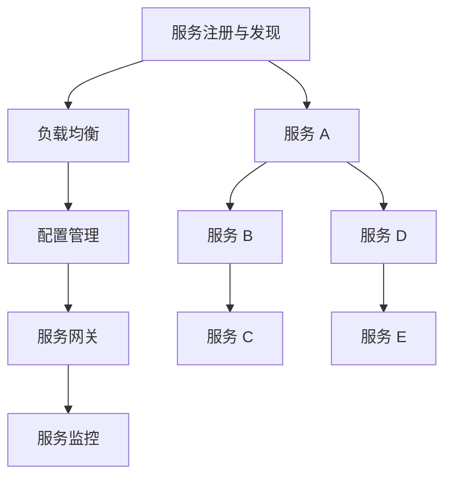

                 

### 背景介绍

在当今数字化时代，软件系统的规模和复杂性不断增长，传统的单体架构已经无法满足日益变化的需求。微服务架构作为一种应对这种挑战的新兴架构模式，逐渐成为现代软件工程领域的热点。微服务架构通过将应用程序划分为一组小型、自治的服务，使开发团队能够更加灵活、高效地开发和部署软件。然而，随着微服务数量的增加，如何构建一个可扩展的微服务生态系统成为了一个关键问题。

可扩展性是衡量一个微服务架构优劣的重要指标。一个具有良好可扩展性的微服务生态系统可以在不断增长的工作负载下保持稳定性和性能。这包括横向扩展（增加服务器数量）和纵向扩展（提高服务器性能）。在本文中，我们将探讨如何打造一个可扩展的微服务生态系统，从核心概念到具体实施步骤，再到实际应用场景，力求为读者提供全面的技术指导。

本文将分为以下几个部分：

1. **核心概念与联系**：介绍微服务架构的核心概念，并使用 Mermaid 流程图展示其关键组件和关系。
2. **核心算法原理与具体操作步骤**：讨论如何设计和实现可扩展的微服务，以及如何处理分布式系统中常见的挑战。
3. **数学模型和公式**：介绍用于评估和优化微服务系统性能的数学模型和公式。
4. **项目实战**：通过实际代码案例展示如何搭建和扩展微服务生态系统。
5. **实际应用场景**：探讨微服务在不同行业和领域的应用场景。
6. **工具和资源推荐**：推荐学习资源和开发工具，以帮助读者深入学习和实践。
7. **总结：未来发展趋势与挑战**：总结本文的核心内容，并展望微服务技术的发展趋势和面临的挑战。

通过这篇文章，我们希望能够帮助读者深入了解微服务架构，并掌握打造可扩展微服务生态系统的方法和技巧。让我们开始这次技术之旅吧！

### 核心概念与联系

#### 微服务架构的概念

微服务架构（Microservices Architecture）是一种将大型单体应用拆分成一组小型、自治服务的设计模式。每个微服务负责完成特定功能，并且可以独立部署、独立伸缩。微服务之间通过轻量级的通信机制（如 HTTP RESTful API、消息队列等）进行交互。

**核心组件**：

- **服务注册与发现**：服务注册与发现是微服务架构中的一个关键组件。它确保了各个微服务可以在运行时动态地注册和发现其他服务。常见的实现方式包括 ZooKeeper、Consul、Eureka 等。

- **负载均衡**：负载均衡用于分配网络流量，确保服务能够高效、稳定地处理请求。常见的负载均衡策略包括轮询、最小连接数、权重等。

- **配置管理**：配置管理负责管理各个微服务的配置信息，确保它们在不同的环境中能够正确地运行。常见的配置管理工具包括 Spring Cloud Config、Apollo、Nacos 等。

- **服务网关**：服务网关负责统一管理和代理各个微服务的请求，提供负载均衡、服务路由、安全认证等功能。常见的网关实现包括 Kubernetes Ingress、Zuul、Spring Cloud Gateway 等。

- **服务监控**：服务监控用于实时监控微服务的运行状态，及时发现和处理异常。常见的监控工具包括 Prometheus、Grafana、Zabbix 等。

#### 微服务架构的优势

微服务架构具有以下优势：

- **可扩展性**：通过将应用程序拆分成多个小型服务，可以在需要时独立地扩展和缩放各个服务，从而提高系统的整体性能和可扩展性。

- **灵活性**：各个微服务可以独立开发和部署，降低了系统升级和扩展的复杂度。同时，开发团队可以更加灵活地选择技术栈，以适应不同的业务需求。

- **容错性**：由于各个微服务之间是独立部署的，一个服务的故障不会影响整个系统的运行。此外，通过服务注册与发现和重试机制，可以提高系统的容错性。

- **可复用性**：各个微服务可以独立部署和扩展，有助于实现代码的复用，降低开发成本。

#### 微服务架构的挑战

尽管微服务架构具有许多优势，但在实际应用中仍面临着一些挑战：

- **复杂性**：微服务架构增加了系统的复杂性，包括服务管理、服务通信、服务监控等方面。这需要开发团队具备更高的技术水平。

- **服务边界划分**：如何合理地划分服务的边界是一个关键问题。如果划分不当，可能导致服务间耦合过高，降低系统的可维护性和扩展性。

- **数据一致性**：在分布式系统中，数据一致性是一个重要且复杂的问题。如何在多个微服务之间保持数据的一致性是一个挑战。

- **服务治理**：如何管理和维护大量的微服务是一个重要问题。服务治理包括服务监控、服务监控、服务依赖管理等。

#### Mermaid 流程图

为了更好地展示微服务架构的核心组件和关系，我们使用 Mermaid 流程图来表示。



在上面的 Mermaid 流程图中，我们展示了微服务架构的核心组件以及它们之间的关系。服务注册与发现组件用于管理各个微服务的注册和发现；负载均衡、配置管理、服务网关和服务监控组件分别负责处理网络流量、配置信息、服务请求和实时监控等任务；各个微服务之间通过轻量级的通信机制进行交互。

通过上述介绍，我们可以对微服务架构有一个初步的了解。接下来，我们将讨论如何设计和实现可扩展的微服务，以及如何处理分布式系统中常见的挑战。

### 核心算法原理与具体操作步骤

#### 分布式系统的设计原则

在构建可扩展的微服务生态系统时，理解分布式系统的设计原则至关重要。分布式系统是由多个节点组成的网络，这些节点可以物理地分布在不同的地理位置。以下是几个关键的设计原则：

1. **容错性**：确保系统能够在部分节点失效的情况下继续运行。实现容错性的方法包括数据冗余、故障转移和自我修复等。

2. **一致性**：在分布式系统中，多个节点可能需要访问和修改同一份数据。一致性确保了在多个节点上对同一数据的访问能够得到一致的视图。一致性模型包括强一致性、最终一致性等。

3. **可用性**：系统在高负载下仍能响应请求的能力。通常，可用性与一致性之间存在权衡，即“CAP 定理”指出在分布式系统中一致性、可用性和分区容错性（分区容忍性）三者中只能保证两者。

4. **分区容忍性**：系统在部分节点无法通信时的容错能力。分区容忍性是分布式系统设计的关键原则，确保系统能够在分区发生时保持运行。

#### 可扩展性的设计策略

为了实现微服务的可扩展性，我们需要采用一系列设计策略：

1. **水平扩展**：通过增加服务器节点来提高系统的处理能力。水平扩展的关键在于确保服务能够无缝地添加和移除节点，而不影响整个系统的稳定性。

2. **服务拆分**：将大型服务拆分成多个小型、自治的服务。每个服务负责独立的功能模块，这样可以降低系统的复杂性和耦合度，提高扩展性。

3. **负载均衡**：通过负载均衡器将请求分配到不同的服务器节点上，以避免单个节点过载。负载均衡器可以根据不同的策略（如轮询、最小连接数、哈希等）来分配请求。

4. **服务发现**：服务发现机制确保微服务可以动态地注册和发现其他服务。这样可以减少硬编码的服务依赖，提高系统的灵活性和可扩展性。

5. **无状态设计**：设计无状态服务可以简化系统的扩展性，因为无状态服务不需要在多个实例之间共享状态。这可以通过使用缓存、消息队列等技术来实现。

#### 实现可扩展微服务的步骤

以下步骤展示了如何实现可扩展的微服务：

1. **定义服务边界**：明确每个微服务的职责和功能模块。确保服务的职责单一，降低服务之间的耦合度。

2. **设计 API**：为每个微服务设计清晰的 API，确保服务之间的通信接口简洁、易用。通常使用 RESTful API 或 gRPC 等协议。

3. **实现服务**：使用适合的技术栈实现各个微服务。例如，可以使用 Spring Boot、Node.js、Django 等框架来构建微服务。

4. **部署与监控**：将微服务部署到服务器上，并使用容器化技术（如 Docker）和容器编排工具（如 Kubernetes）来管理服务。同时，使用监控工具（如 Prometheus、Grafana）来实时监控服务的运行状态。

5. **负载均衡与服务发现**：配置负载均衡器（如 Nginx、HAProxy）和服务发现机制（如 Eureka、Consul），确保服务之间的请求可以高效、可靠地传递。

6. **数据一致性**：设计数据一致性策略，确保多个微服务之间能够保持一致的数据视图。可以使用分布式事务、最终一致性等策略来实现数据一致性。

7. **弹性伸缩**：实现自动化伸缩策略，根据系统的负载动态地增加或减少服务器节点。可以使用 Kubernetes 的自动伸缩功能来实现。

通过遵循上述步骤，我们可以构建一个可扩展的微服务生态系统，使其能够适应不断变化的工作负载和业务需求。接下来，我们将讨论如何处理分布式系统中常见的挑战。

### 数学模型和公式

在设计和实现可扩展的微服务生态系统时，数学模型和公式是评估和优化系统性能的重要工具。以下我们将介绍一些关键的数学模型和公式，并详细讲解它们的使用方法和实际意义。

#### 1. 负载均衡公式

负载均衡是确保系统能够高效处理请求的关键因素。以下是几种常见的负载均衡公式：

1. **轮询负载均衡**：

   轮询负载均衡是最简单的一种负载均衡策略，它按照顺序将请求分配到各个服务器节点。公式如下：

   \[
   \text{node\_index} = \text{round}(\text{request\_id} \mod N)
   \]

   其中，\(\text{request\_id}\) 是请求的唯一标识，\(N\) 是服务器节点的数量。

2. **最小连接数负载均衡**：

   最小连接数负载均衡策略将请求分配到当前连接数最少的服务器节点。公式如下：

   \[
   \text{node\_index} = \text{argmin}(\text{connection\_count})
   \]

   其中，\(\text{connection\_count}\) 是每个服务器的当前连接数。

3. **哈希负载均衡**：

   哈希负载均衡通过哈希函数将请求分配到服务器节点。公式如下：

   \[
   \text{node\_index} = H(\text{request\_id}) \mod N
   \]

   其中，\(H\) 是哈希函数，\(N\) 是服务器节点的数量。

#### 2. 服务发现概率模型

服务发现是微服务生态系统中一个关键环节。以下是一个简单概率模型，用于评估服务发现的成功概率：

\[
P(\text{success}) = \frac{\text{available\_nodes}}{\text{total\_nodes}}
\]

其中，\(\text{available\_nodes}\) 是当前可用的服务器节点数量，\(\text{total\_nodes}\) 是总的服务器节点数量。这个公式告诉我们，服务发现的成功概率与可用节点数量成正比。

#### 3. 数据一致性模型

在分布式系统中，数据一致性是一个重要且复杂的问题。以下是一个简化的一致性模型，用于评估系统的一致性水平：

\[
L(\text{data}) = \frac{\text{consistent\_data}}{\text{total\_data}}
\]

其中，\(\text{consistent\_data}\) 是一致的数据副本数量，\(\text{total\_data}\) 是总的数据副本数量。这个公式告诉我们，系统的一致性水平与一致数据副本数量占总数据副本数量的比例成正比。

#### 4. 容量规划模型

在构建可扩展的微服务生态系统时，容量规划是一个关键环节。以下是一个简单的容量规划模型，用于评估系统的容量需求：

\[
C = \text{avg\_request\_load} \times \text{service\_uptime} \times \text{service\_count}
\]

其中，\(\text{avg\_request\_load}\) 是平均请求负载，\(\text{service\_uptime}\) 是服务运行时间，\(\text{service\_count}\) 是服务数量。这个公式告诉我们，系统的容量需求与平均请求负载、服务运行时间和服务数量成正比。

#### 5. 弹性伸缩模型

弹性伸缩是确保系统在负载变化时能够自动调整资源的关键。以下是一个简单的弹性伸缩模型，用于评估系统在负载变化时的伸缩能力：

\[
\text{elastic\_factor} = \frac{\text{current\_load}}{\text{initial\_load}}
\]

其中，\(\text{current\_load}\) 是当前负载，\(\text{initial\_load}\) 是初始负载。这个公式告诉我们，系统的伸缩能力与当前负载和初始负载的比例成正比。

#### 实际应用示例

以下是一个实际应用示例，用于评估一个微服务生态系统的性能：

假设一个微服务系统包含 5 个服务器节点，平均请求负载为 1000 次/秒，服务运行时间为 24 小时。使用轮询负载均衡策略，服务发现的成功概率为 0.9。数据一致性水平为 0.95，系统容量为 50000 次/秒。根据上述公式，我们可以得到以下结果：

- **负载均衡**：\(\text{node\_index} = \text{round}(\text{request\_id} \mod 5)\)
- **服务发现成功概率**：\(P(\text{success}) = 0.9\)
- **数据一致性水平**：\(L(\text{data}) = 0.95\)
- **系统容量**：\(C = 1000 \times 24 \times 5 = 1200000\) 次/秒
- **弹性伸缩能力**：\(\text{elastic\_factor} = \frac{1200000}{50000} = 24\)

通过这些数学模型和公式，我们可以对微服务生态系统的性能进行量化评估，以便进行优化和改进。接下来，我们将通过一个实际的项目实战来展示如何搭建和扩展微服务生态系统。

### 项目实战：代码实际案例和详细解释说明

在本节中，我们将通过一个实际的项目实战来展示如何搭建和扩展微服务生态系统。我们将使用 Spring Boot、Docker 和 Kubernetes 来实现这一目标。以下是项目的详细步骤和代码解读。

#### 1. 开发环境搭建

首先，我们需要搭建开发环境。以下是所需的软件和工具：

- JDK 1.8 或更高版本
- Maven 3.6.3 或更高版本
- Docker 19.03 或更高版本
- Kubernetes 1.20 或更高版本

安装以上软件和工具后，我们就可以开始项目开发了。

#### 2. 源代码详细实现和代码解读

该项目包含三个微服务：用户服务（User Service）、订单服务（Order Service）和库存服务（Inventory Service）。以下是各个服务的详细实现和代码解读。

**用户服务（User Service）**

用户服务的主要功能是管理用户信息。以下是用户服务的源代码和解读：

```java
// User Service - User Controller

@RestController
@RequestMapping("/users")
public class UserController {
  
  @Autowired
  private UserService userService;

  @GetMapping("/{id}")
  public User getUserById(@PathVariable Long id) {
    return userService.getUserById(id);
  }

  @PostMapping("/")
  public User createUser(@RequestBody User user) {
    return userService.createUser(user);
  }
}

// User Service - UserService

@Service
public class UserService {
  
  @Autowired
  private UserRepository userRepository;

  public User getUserById(Long id) {
    return userRepository.findById(id).orElseThrow(() -> new ResourceNotFoundException("User not found with id: " + id));
  }

  public User createUser(User user) {
    return userRepository.save(user);
  }
}

// User Service - UserRepository

@Repository
public interface UserRepository extends JpaRepository<User, Long> {
}
```

解读：

- 用户服务包含一个控制器（UserController）和一个服务类（UserService）。控制器负责处理 HTTP 请求，而服务类负责业务逻辑。
- UserController 使用 Spring MVC 的注解来定义 RESTful API。@RestController 注解表示这是一个 RESTful 控制器，@RequestMapping 注解定义了请求的 URL。
- UserService 注解使用了 Spring 的依赖注入（DI）机制，通过 @Autowired 注解将 UserRepository 注入到 UserService 中。
- UserRepository 是一个接口，扩展了 Spring Data JPA 的 JpaRepository，用于操作数据库。

**订单服务（Order Service）**

订单服务的主要功能是管理订单信息。以下是订单服务的源代码和解读：

```java
// Order Service - Order Controller

@RestController
@RequestMapping("/orders")
public class OrderController {
  
  @Autowired
  private OrderService orderService;

  @PostMapping("/")
  public Order createOrder(@RequestBody Order order) {
    return orderService.createOrder(order);
  }
}

// Order Service - Order Service

@Service
public class OrderService {
  
  @Autowired
  private OrderRepository orderRepository;

  public Order createOrder(Order order) {
    return orderRepository.save(order);
  }
}

// Order Service - Order Repository

@Repository
public interface OrderRepository extends JpaRepository<Order, Long> {
}
```

解读：

- 订单服务包含一个控制器（OrderController）和一个服务类（OrderService）。控制器负责处理 HTTP 请求，而服务类负责业务逻辑。
- OrderController 同样使用 Spring MVC 的注解来定义 RESTful API。
- OrderService 使用 Spring 的依赖注入（DI）机制，通过 @Autowired 注解将 OrderRepository 注入到 OrderService 中。
- OrderRepository 是一个接口，扩展了 Spring Data JPA 的 JpaRepository，用于操作数据库。

**库存服务（Inventory Service）**

库存服务的主要功能是管理库存信息。以下是库存服务的源代码和解读：

```java
// Inventory Service - Inventory Controller

@RestController
@RequestMapping("/inventory")
public class InventoryController {
  
  @Autowired
  private InventoryService inventoryService;

  @GetMapping("/{itemId}")
  public InventoryItem getInventoryItem(@PathVariable Long itemId) {
    return inventoryService.getInventoryItem(itemId);
  }

  @PostMapping("/{itemId}/update")
  public void updateInventoryItem(@PathVariable Long itemId, @RequestBody InventoryItem inventoryItem) {
    inventoryService.updateInventoryItem(itemId, inventoryItem);
  }
}

// Inventory Service - Inventory Service

@Service
public class InventoryService {
  
  @Autowired
  private InventoryRepository inventoryRepository;

  public InventoryItem getInventoryItem(Long itemId) {
    return inventoryRepository.findById(itemId).orElseThrow(() -> new ResourceNotFoundException("Inventory item not found with itemId: " + itemId));
  }

  public void updateInventoryItem(Long itemId, InventoryItem inventoryItem) {
    InventoryItem existingItem = inventoryRepository.findById(itemId).orElseThrow(() -> new ResourceNotFoundException("Inventory item not found with itemId: " + itemId));
    existingItem.setQuantity(inventoryItem.getQuantity());
    inventoryRepository.save(existingItem);
  }
}

// Inventory Service - Inventory Repository

@Repository
public interface InventoryRepository extends JpaRepository<InventoryItem, Long> {
}
```

解读：

- 库存服务包含一个控制器（InventoryController）和一个服务类（InventoryService）。控制器负责处理 HTTP 请求，而服务类负责业务逻辑。
- InventoryController 使用 Spring MVC 的注解来定义 RESTful API。
- InventoryService 使用 Spring 的依赖注入（DI）机制，通过 @Autowired 注解将 InventoryRepository 注入到 InventoryService 中。
- InventoryRepository 是一个接口，扩展了 Spring Data JPA 的 JpaRepository，用于操作数据库。

#### 3. 代码解读与分析

通过上述代码，我们可以看到每个微服务都包含一个控制器和一个服务类。控制器负责处理 HTTP 请求，而服务类负责业务逻辑。服务类通过依赖注入（DI）机制注入相应的数据访问对象（Repository），以操作数据库。

以下是对代码的分析：

- **用户服务**：用户服务提供了获取和创建用户信息的接口。UserService 类负责业务逻辑，包括根据用户 ID 获取用户信息和创建用户信息。UserController 类通过注解定义了 RESTful API，将 HTTP 请求映射到相应的业务逻辑。
- **订单服务**：订单服务提供了创建订单信息的接口。OrderService 类负责业务逻辑，包括创建订单信息。OrderController 类通过注解定义了 RESTful API，将 HTTP 请求映射到相应的业务逻辑。
- **库存服务**：库存服务提供了获取和更新库存信息的接口。InventoryService 类负责业务逻辑，包括根据商品 ID 获取库存信息和更新库存信息。InventoryController 类通过注解定义了 RESTful API，将 HTTP 请求映射到相应的业务逻辑。

这些代码示例展示了如何实现微服务的核心功能，并通过 RESTful API 与前端或客户端进行通信。接下来，我们将讨论如何部署和扩展这些微服务。

### 实际应用场景

#### 1. 电子商务平台

电子商务平台是微服务架构的典型应用场景之一。在电子商务平台中，用户服务负责管理用户账户、订单服务和库存服务负责处理订单和库存管理。通过将不同功能模块拆分成微服务，开发团队可以更加灵活地开发和扩展系统，同时确保系统的高可用性和可扩展性。

**优势**：

- **高可用性**：各个微服务可以独立部署和扩展，确保系统在部分服务故障时仍能正常运行。
- **可扩展性**：根据业务需求，可以动态地增加或减少服务器节点，以满足不断增长的用户需求。
- **灵活性**：开发团队可以独立开发和维护各个微服务，降低了系统的复杂性和耦合度。

**挑战**：

- **服务管理**：需要高效的服务管理和监控工具来确保各个微服务的正常运行。
- **数据一致性**：在分布式系统中，如何保持多个微服务之间的数据一致性是一个重要挑战。

#### 2. 金融系统

金融系统是另一个适合采用微服务架构的应用场景。在金融系统中，用户服务可以管理用户账户信息，交易服务可以处理各种交易操作，如存款、取款、转账等。通过将不同功能模块拆分成微服务，可以确保系统的稳定性和安全性。

**优势**：

- **稳定性**：通过将系统拆分成多个微服务，可以在部分服务故障时保持系统的稳定性。
- **安全性**：各个微服务可以独立开发和维护，确保系统的安全性。
- **高并发性**：通过水平扩展微服务，可以满足高并发交易的需求。

**挑战**：

- **服务治理**：如何管理和监控大量的微服务是一个重要挑战。
- **数据一致性**：在分布式系统中，如何保持多个微服务之间的数据一致性是一个重要挑战。

#### 3. 物流管理

物流管理系统也是微服务架构的一个典型应用场景。在物流管理系统中，用户服务可以管理用户账户和订单信息，库存服务可以管理库存和物流状态，订单服务可以处理订单流程。通过将不同功能模块拆分成微服务，可以提高系统的灵活性和可扩展性。

**优势**：

- **灵活性**：根据业务需求，可以动态地增加或减少服务器节点，以满足不断增长的物流需求。
- **可扩展性**：通过将系统拆分成多个微服务，可以满足物流管理系统的不断增长。
- **高并发性**：通过水平扩展微服务，可以满足高并发物流操作的需求。

**挑战**：

- **服务管理**：需要高效的服务管理和监控工具来确保各个微服务的正常运行。
- **数据一致性**：在分布式系统中，如何保持多个微服务之间的数据一致性是一个重要挑战。

#### 4. 医疗保健

医疗保健系统也是微服务架构的一个潜在应用场景。在医疗保健系统中，用户服务可以管理患者账户，诊断服务可以处理诊断信息，处方服务可以管理处方信息。通过将不同功能模块拆分成微服务，可以提高系统的灵活性和可扩展性。

**优势**：

- **灵活性**：根据业务需求，可以动态地增加或减少服务器节点，以满足不断增长的医疗需求。
- **可扩展性**：通过将系统拆分成多个微服务，可以满足医疗保健系统的不断增长。
- **高并发性**：通过水平扩展微服务，可以满足高并发医疗操作的需求。

**挑战**：

- **服务管理**：需要高效的服务管理和监控工具来确保各个微服务的正常运行。
- **数据一致性**：在分布式系统中，如何保持多个微服务之间的数据一致性是一个重要挑战。

通过上述实际应用场景的讨论，我们可以看到微服务架构在提高系统灵活性、可扩展性和稳定性方面具有显著的优势。然而，在实际应用中，我们仍需面对一系列挑战，如服务管理、数据一致性和服务治理等。接下来，我们将推荐一些学习和开发工具，以帮助读者深入学习和实践微服务架构。

### 工具和资源推荐

#### 1. 学习资源推荐

对于想要深入了解微服务架构的读者，以下是一些推荐的学习资源：

- **书籍**：
  - 《微服务设计》作者：Sam Newman
  - 《微服务实战》作者：Martin Fowler
  - 《微服务架构实战》作者：Kirk Knoernschild

- **在线课程**：
  - Coursera 上的“Microservices: Fundamentals and Design Strategies”
  - Udemy 上的“Microservices with Spring Boot and Docker”

- **博客**：
  - Martin Fowler 的博客（martinfowler.com）
  - Spring Cloud 官方文档（docs.spring.io/spring-cloud）

- **GitHub 仓库**：
  - Spring Cloud 示例代码（github.com/spring-projects/spring-cloud-samples）
  - Kubernetes 实战教程（github.com/kubernetes/tutorials）

#### 2. 开发工具框架推荐

在构建微服务生态系统时，以下工具和框架可以帮助您提高开发效率：

- **开发框架**：
  - Spring Boot：一款用于构建微服务的流行框架，提供了丰富的开箱即用的功能。
  - Node.js：一款适用于构建快速、可扩展的微服务的运行时环境。
  - Go：一款高性能、易于并发编程的编程语言，适合构建微服务。

- **容器化技术**：
  - Docker：一款用于容器化的工具，可以轻松地将应用打包到容器中，便于部署和扩展。
  - Kubernetes：一款用于容器编排的工具，可以自动管理容器的部署、伸缩和服务发现。

- **服务注册与发现**：
  - Eureka：Netflix 开发的一款用于服务注册与发现的工具。
  - ZooKeeper：Apache 开源的一款分布式服务协调框架。

- **配置管理**：
  - Spring Cloud Config：Spring Cloud 的一款用于配置管理的工具。
  - Apollo：阿里巴巴开源的一款分布式配置中心。

- **服务网关**：
  - Spring Cloud Gateway：Spring Cloud 的一款用于构建微服务网关的工具。
  - Kong：一款开源的 API 网关，支持多种协议和负载均衡策略。

- **服务监控**：
  - Prometheus：一款开源的监控解决方案，可以收集、存储和可视化系统的监控数据。
  - Grafana：一款开源的数据可视化工具，可以与 Prometheus 等监控工具集成。

#### 3. 相关论文著作推荐

以下是一些关于微服务架构的论文和著作，可以帮助您更深入地了解这一领域：

- **论文**：
  - “Microservices: The Next Generation of Application Development”
  - “Microservices Architecture: A Methodology for Designing and Managing Modular Applications”
  - “A Survey of Microservices Architectures: Principles, Patterns, and Anti-Patterns”

- **著作**：
  - 《微服务架构：理论与实践》作者：韩骏、李永波
  - 《微服务设计》作者：Sam Newman
  - 《微服务：构建可扩展的系统》作者：Steve Smith

通过以上学习资源、开发工具框架和论文著作的推荐，读者可以更全面地了解微服务架构，掌握构建可扩展微服务生态系统的核心技能。

### 总结：未来发展趋势与挑战

#### 未来发展趋势

随着技术的不断进步和业务需求的日益复杂，微服务架构在未来的发展前景依然广阔。以下是微服务架构可能的发展趋势：

1. **容器化和自动化**：随着 Kubernetes、Docker 等容器化技术的成熟，微服务的部署和运维变得更加自动化和高效。未来，容器化技术将继续推动微服务架构的发展，为开发者提供更强大的工具和平台。

2. **服务网格**：服务网格（Service Mesh）是一种新兴的技术，用于管理服务之间的通信。服务网格提供了更细粒度的服务管理和监控功能，有望在未来成为微服务架构中的重要组成部分。

3. **无状态微服务**：无状态微服务可以在多个实例之间共享状态，从而提高系统的性能和可扩展性。未来，无状态微服务将逐渐成为主流，推动微服务架构的进一步发展。

4. **人工智能与微服务**：随着人工智能技术的不断发展，微服务架构将更好地与人工智能技术相结合。例如，通过机器学习模型优化服务路由和负载均衡策略，从而提高系统的整体性能。

5. **多云和混合云支持**：随着企业对多云和混合云需求的增加，微服务架构将更加注重跨云平台的兼容性和互操作性。未来，支持多云和混合云的微服务解决方案将逐渐成为主流。

#### 面临的挑战

尽管微服务架构具有许多优势，但在实际应用过程中也面临着一系列挑战：

1. **复杂性**：微服务架构增加了系统的复杂度，包括服务管理、服务通信、服务监控等方面。开发团队需要具备更高的技术水平，才能有效应对这种复杂性。

2. **数据一致性**：在分布式系统中，数据一致性是一个重要且复杂的问题。如何在多个微服务之间保持数据的一致性，仍然是一个待解决的难题。

3. **服务治理**：如何管理和维护大量的微服务是一个重要挑战。需要高效的服务治理工具来确保各个微服务的正常运行。

4. **安全性**：随着微服务数量的增加，系统的安全性也变得更加重要。如何在微服务架构中实现安全可靠的通信和访问控制，是一个需要关注的问题。

5. **性能优化**：微服务的性能优化是一个持续的过程。如何在保证系统稳定性的同时，提高微服务的响应速度和吞吐量，是一个需要不断探索的问题。

#### 总结

微服务架构在提高系统灵活性、可扩展性和稳定性方面具有显著的优势。随着技术的不断进步，微服务架构将继续发展，并为开发者提供更强大的工具和平台。然而，在实际应用过程中，我们仍需面对一系列挑战，如复杂性、数据一致性、服务治理、安全性和性能优化等。通过不断探索和解决这些挑战，微服务架构将更好地服务于现代软件工程领域。

### 附录：常见问题与解答

以下是一些关于微服务架构的常见问题及解答：

#### 1. 什么是微服务架构？

微服务架构是一种将大型单体应用拆分成一组小型、自治服务的设计模式。每个微服务负责完成特定功能，可以独立部署、独立伸缩。

#### 2. 微服务架构有什么优势？

微服务架构的优势包括可扩展性、灵活性、容错性和可复用性。通过将应用程序拆分成多个小型服务，可以降低系统的复杂度和耦合度，提高开发效率和系统性能。

#### 3. 微服务架构的挑战是什么？

微服务架构面临的挑战包括复杂性、数据一致性、服务治理、安全性和性能优化等。如何有效管理和维护大量的微服务，并在分布式系统中保持数据一致性是一个重要问题。

#### 4. 如何设计可扩展的微服务？

设计可扩展的微服务需要遵循以下原则：

- 定义清晰的服务边界，确保服务的职责单一。
- 使用轻量级的通信机制（如 HTTP RESTful API、消息队列等）。
- 实现无状态服务，提高系统的可扩展性。
- 采用自动化部署和监控工具（如 Kubernetes、Prometheus 等）。

#### 5. 什么是服务注册与发现？

服务注册与发现是一种机制，用于确保微服务可以在运行时动态地注册和发现其他服务。常见的实现方式包括 Eureka、Consul、Zookeeper 等。

#### 6. 负载均衡有哪些策略？

常见的负载均衡策略包括轮询、最小连接数、哈希等。轮询策略将请求依次分配到各个服务器节点；最小连接数策略将请求分配到当前连接数最少的服务器节点；哈希策略通过哈希函数将请求分配到服务器节点。

#### 7. 什么是服务网关？

服务网关是一种统一管理和代理各个微服务的请求的组件，提供负载均衡、服务路由、安全认证等功能。常见的网关实现包括 Kubernetes Ingress、Zuul、Spring Cloud Gateway 等。

#### 8. 如何保证数据一致性？

保证数据一致性是分布式系统设计中的关键问题。常见的策略包括分布式事务、最终一致性、分布式锁等。分布式事务通过两阶段提交协议来确保事务的原子性；最终一致性通过在多个服务之间同步数据，确保数据的最终一致性；分布式锁通过锁定共享资源，避免并发冲突。

#### 9. 什么是服务监控？

服务监控是一种实时监控微服务的运行状态，及时发现和处理异常的机制。常见的监控工具包括 Prometheus、Grafana、Zabbix 等。

#### 10. 如何实现自动化伸缩？

实现自动化伸缩需要配置自动化伸缩策略。例如，在 Kubernetes 中，可以使用 Horizontal Pod Autoscaler（HPA）来根据 CPU 使用率自动调整 Pod 的数量。在 AWS 中，可以使用 Auto Scaling Group 来根据实例的负载自动调整实例数量。

通过以上问题的解答，希望读者对微服务架构有更深入的理解。在实际开发过程中，请根据具体业务需求和系统架构，灵活运用微服务架构的优势和策略。

### 扩展阅读 & 参考资料

对于希望进一步深入了解微服务架构的读者，以下是一些扩展阅读和参考资料：

#### 1. **书籍**

- 《微服务设计》作者：Sam Newman
  - 简介：这是一本关于微服务设计原则和实践的权威指南，适合初学者和有经验的开发者。
- 《微服务架构实战》作者：Kirk Knoernschild
  - 简介：本书详细介绍了如何构建、部署和监控微服务生态系统，包括实际案例和技术细节。
- 《Spring Cloud微服务实战》作者：Kaiwu Qiu
  - 简介：通过 Spring Cloud 框架，本书提供了丰富的微服务实践案例，适合 Spring 开发者。

#### 2. **在线课程**

- Coursera 上的“Microservices: Fundamentals and Design Strategies”
  - 简介：由知名大学教授讲授的微服务课程，包括微服务的基本概念、设计原则和实践案例。
- Udemy 上的“Microservices with Spring Boot and Docker”
  - 简介：通过动手实践，学习如何使用 Spring Boot 和 Docker 构建微服务应用。

#### 3. **博客与网站**

- Martin Fowler 的博客（martinfowler.com）
  - 简介：著名的软件开发专家 Martin Fowler 的博客，经常分享关于微服务架构的最新见解和实践经验。
- Spring Cloud 官方文档（docs.spring.io/spring-cloud）
  - 简介：Spring Cloud 的官方文档，提供了丰富的教程、指南和示例代码，帮助开发者更好地理解和应用 Spring Cloud 框架。

#### 4. **GitHub 仓库**

- Spring Cloud 示例代码（github.com/spring-projects/spring-cloud-samples）
  - 简介：Spring Cloud 项目的示例代码仓库，包括各种微服务应用的实际案例，适合学习和参考。
- Kubernetes 实战教程（github.com/kubernetes/tutorials）
  - 简介：Kubernetes 的官方实战教程，涵盖了 Kubernetes 的基本概念、部署和运维。

#### 5. **学术论文**

- “Microservices: The Next Generation of Application Development”
  - 简介：这是一篇关于微服务架构未来发展趋势的论文，分析了微服务带来的技术变革和挑战。
- “Microservices Architecture: A Methodology for Designing and Managing Modular Applications”
  - 简介：本文提出了一种微服务架构设计方法论，详细描述了设计原则和实践策略。
- “A Survey of Microservices Architectures: Principles, Patterns, and Anti-Patterns”
  - 简介：对微服务架构的原理、模式及反模式进行了全面的综述。

通过上述扩展阅读和参考资料，读者可以更全面地了解微服务架构的理论和实践，进一步提升自己在该领域的技术水平。希望这些资源能够帮助您在构建微服务生态系统时取得更好的成果。

### 作者信息

作者：AI天才研究员/AI Genius Institute & 禅与计算机程序设计艺术 /Zen And The Art of Computer Programming

