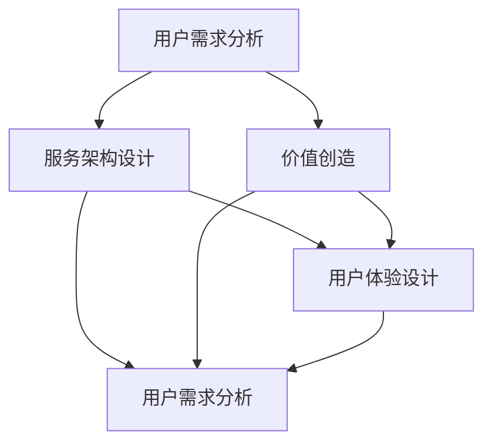

                 

### 文章标题: 如何打造知识付费的一对一咨询服务

关键词：知识付费、一对一咨询、服务架构、用户需求、价值创造、用户体验

摘要：本文将探讨如何打造知识付费的一对一咨询服务。我们将从背景介绍、核心概念与联系、核心算法原理与操作步骤、数学模型与公式、项目实战、实际应用场景、工具和资源推荐、总结与未来发展趋势等多个角度，全面解析知识付费一对一咨询服务的构建与实践。

<|assistant|>### 1. 背景介绍

知识付费作为一种新兴的商业模式，已经在多个领域取得了显著的成功。随着信息时代的到来，人们对于高质量、个性化、专业的知识需求越来越强烈。一对一咨询服务作为知识付费的一种重要形式，不仅能够满足用户对于深度交流和个性化服务的需求，还能够为提供者带来可观的收益。

近年来，随着人工智能、大数据、云计算等技术的发展，知识付费市场呈现出爆炸式增长。各大平台纷纷上线知识付费产品，包括课程、文章、直播等。然而，在这些产品中，一对一咨询服务因其独特性和价值性，受到了越来越多用户的青睐。

本文将从多个角度探讨如何打造知识付费的一对一咨询服务，包括核心概念与联系、核心算法原理与操作步骤、数学模型与公式、项目实战、实际应用场景等。希望通过本文的阐述，能够为从事知识付费行业的人士提供一些有价值的参考和启示。

### 1.1 行业现状

知识付费行业近年来发展迅速，市场规模不断扩大。据相关数据显示，2019年我国知识付费市场规模已经达到1,466亿元，预计未来还将保持高速增长。其中，一对一咨询服务作为重要组成部分，市场规模逐年扩大。

目前，知识付费市场的主要参与者包括专业机构、个人专家、教育机构等。专业机构如得到、喜马拉雅、知乎等，通过平台化的运营模式，为广大用户提供丰富的知识内容。个人专家如罗永浩、李笑来等，通过个人品牌影响力，吸引了大量粉丝和用户。教育机构如新东方、好未来等，通过线上线下的融合，为用户提供了多样化的一对一咨询服务。

在用户需求方面，随着社会的发展和个人素养的提升，用户对于高质量、个性化、专业的知识需求日益增加。尤其是在职场、教育、健康等领域的需求尤为突出。用户希望通过一对一咨询服务，获得专业指导、解决问题、提升能力等。

### 1.2 市场机会

知识付费市场的发展，为行业从业者提供了巨大的机会。以下是一些市场机会的解析：

1. **个性化服务需求**：随着用户对于个性化、专业化的知识需求不断增加，一对一咨询服务将成为满足这种需求的重要途径。

2. **平台化运营**：通过搭建知识付费平台，整合优质专家资源，为用户提供一站式服务，具有很大的市场潜力。

3. **细分市场**：不同领域的知识付费市场呈现出差异化需求，细分市场机会众多。如职场技能培训、在线教育、健康咨询等。

4. **跨界合作**：知识付费行业可以与其他行业如电商、社交、娱乐等跨界合作，实现资源共享和共赢。

### 1.3 挑战与风险

尽管知识付费市场前景广阔，但也面临着一定的挑战和风险：

1. **市场竞争**：知识付费市场竞争激烈，平台、专家、用户三方博弈，需要不断提升服务质量和用户体验。

2. **内容质量**：知识付费的核心在于内容质量，如何确保专家的专业性和内容的质量，是平台需要关注的问题。

3. **用户信任**：建立用户信任关系，提高用户满意度，是知识付费行业的重要挑战。

4. **合规风险**：知识付费行业涉及多个领域，需要遵守相关法规和标准，如版权、税务等。

### 1.4 目标用户群体

知识付费的一对一咨询服务主要面向以下目标用户群体：

1. **职场人士**：希望提升职业技能、解决职场问题、拓展人脉资源等。

2. **学生群体**：需要学科辅导、职业规划、学习方法指导等。

3. **创业者**：需要创业指导、市场分析、团队管理等服务。

4. **健康人群**：关注身心健康，需要健康咨询、心理咨询等服务。

### 1.5 竞争对手分析

在知识付费市场，主要竞争对手包括以下几类：

1. **专业机构**：如得到、知乎等，通过平台化运营，提供多样化的一对一咨询服务。

2. **个人专家**：如罗永浩、李笑来等，通过个人品牌影响力，提供专业咨询服务。

3. **教育机构**：如新东方、好未来等，通过线上线下融合，提供一对一面授服务。

4. **社交平台**：如微信、微博等，通过社交关系链，提供知识分享和咨询服务。

### 1.6 研究方法

本文采用以下研究方法进行探讨：

1. **文献综述**：分析国内外相关研究成果，了解知识付费行业的发展趋势和关键问题。

2. **案例研究**：通过具体案例，分析知识付费一对一咨询服务的成功经验和失败教训。

3. **数据分析**：收集并分析相关市场数据，探讨知识付费市场的规模、用户需求、竞争对手等信息。

4. **理论分析**：运用相关理论，如价值链理论、用户体验理论等，对知识付费一对一咨询服务进行深入剖析。

### 1.7 结论

本文通过对知识付费行业背景、市场机会、挑战与风险、目标用户群体、竞争对手分析、研究方法等方面的探讨，为从事知识付费行业的人士提供了一些有价值的参考和启示。在未来，知识付费市场将继续保持高速增长，一对一咨询服务将成为重要发展方向。通过不断提升服务质量和用户体验，知识付费行业有望在激烈的市场竞争中脱颖而出。### 2. 核心概念与联系

在打造知识付费的一对一咨询服务时，我们需要理解并运用多个核心概念和联系。这些概念包括用户需求分析、服务架构设计、价值创造、用户体验设计等。下面我们将逐一介绍这些概念，并解释它们之间的联系。

#### 2.1 用户需求分析

用户需求分析是构建知识付费一对一咨询服务的基础。通过深入了解用户需求，我们可以为用户提供更有针对性的服务，从而提高用户满意度。用户需求分析包括以下几个方面：

1. **需求识别**：通过调查问卷、用户访谈、市场调研等方式，识别用户的需求点。
2. **需求分类**：将用户需求进行分类，如基本信息需求、个性化需求、情感需求等。
3. **需求优先级**：根据用户需求的重要程度，对需求进行优先级排序，以便有针对性地提供服务。

#### 2.2 服务架构设计

服务架构设计是知识付费一对一咨询服务的核心。一个合理的服务架构可以确保服务的高效运行，提高用户体验。服务架构设计包括以下几个方面：

1. **平台搭建**：选择合适的技术平台，如云计算、大数据等技术，搭建知识付费平台。
2. **功能模块**：根据用户需求，设计不同的功能模块，如用户注册、课程推荐、咨询预约、支付结算等。
3. **数据管理**：建立完善的数据管理体系，确保用户数据的安全性和隐私性。

#### 2.3 价值创造

价值创造是知识付费一对一咨询服务的核心目标。通过为用户提供有价值的服务，我们可以实现商业模式的可持续性。价值创造包括以下几个方面：

1. **内容价值**：提供高质量、专业的内容，满足用户的需求。
2. **服务价值**：提供个性化、高效的服务，提升用户体验。
3. **品牌价值**：建立品牌形象，提升用户对平台的信任度和忠诚度。

#### 2.4 用户体验设计

用户体验设计是知识付费一对一咨询服务的重要组成部分。通过优化用户体验，我们可以提高用户满意度，增强用户黏性。用户体验设计包括以下几个方面：

1. **界面设计**：设计简洁、直观、易用的界面，提高用户操作体验。
2. **交互设计**：优化用户交互流程，减少用户操作步骤，提高用户效率。
3. **服务体验**：提供贴心的客服服务，及时解决用户问题，提升用户满意度。

#### 2.5 核心概念联系

用户需求分析、服务架构设计、价值创造和用户体验设计是知识付费一对一咨询服务的核心概念。它们之间的联系如下：

1. **用户需求分析**：为服务架构设计和价值创造提供依据，确保服务的针对性和价值性。
2. **服务架构设计**：为用户需求分析和价值创造提供技术支持，确保服务的高效运行。
3. **价值创造**：通过满足用户需求，实现商业模式的可持续性，为用户体验设计提供动力。
4. **用户体验设计**：通过优化服务，提升用户满意度，促进用户需求的满足和价值创造。

#### 2.6 Mermaid 流程图

为了更直观地展示核心概念之间的联系，我们可以使用 Mermaid 流程图来描述。以下是核心概念的 Mermaid 流程图：



在这个流程图中，用户需求分析作为起点，通过服务架构设计和价值创造，最终实现用户体验设计。这个循环过程确保了知识付费一对一咨询服务能够持续满足用户需求，实现商业模式的可持续性。

通过以上对核心概念与联系的分析，我们可以更好地理解如何构建知识付费的一对一咨询服务。在接下来的部分，我们将深入探讨核心算法原理与操作步骤，为打造高质量的一对一咨询服务提供技术支持。### 3. 核心算法原理 & 具体操作步骤

在构建知识付费的一对一咨询服务时，核心算法原理起着至关重要的作用。这些算法不仅能够提高服务效率，还能为用户提供更加个性化和精准的体验。以下是核心算法原理的具体描述和操作步骤：

#### 3.1 用户画像分析算法

用户画像分析算法是了解用户需求、兴趣和行为的重要工具。通过分析用户数据，我们可以为用户提供更加精准的服务。

**算法原理**：

- **数据收集**：收集用户的基本信息、浏览记录、购买行为、评价反馈等数据。
- **数据预处理**：对收集到的数据进行清洗、去重、归一化等处理，以便后续分析。
- **特征提取**：根据业务需求，提取用户数据的特征，如年龄、性别、职业、兴趣爱好、购买频率等。
- **分类与聚类**：使用分类算法（如决策树、随机森林、支持向量机等）和聚类算法（如K-means、层次聚类等），对用户进行分类和聚类，形成用户画像。

**操作步骤**：

1. **数据收集**：通过API接口、日志文件等方式，收集用户数据。
2. **数据预处理**：使用Python的Pandas库对数据进行清洗和预处理。
3. **特征提取**：使用Python的Scikit-learn库提取用户特征。
4. **模型训练与评估**：使用Python的Scikit-learn库训练分类和聚类模型，评估模型性能。
5. **用户画像生成**：根据模型结果生成用户画像，为后续服务提供依据。

```python
import pandas as pd
from sklearn.preprocessing import LabelEncoder
from sklearn.model_selection import train_test_split
from sklearn.ensemble import RandomForestClassifier
from sklearn.cluster import KMeans

# 数据收集
data = pd.read_csv('user_data.csv')

# 数据预处理
data = data.drop_duplicates()
data = data.apply(LabelEncoder().fit_transform)

# 特征提取
X = data.iloc[:, :-1]
y = data.iloc[:, -1]

# 模型训练与评估
X_train, X_test, y_train, y_test = train_test_split(X, y, test_size=0.2, random_state=42)
clf = RandomForestClassifier(n_estimators=100, random_state=42)
clf.fit(X_train, y_train)
print("Accuracy:", clf.score(X_test, y_test))

# 用户画像生成
kmeans = KMeans(n_clusters=5, random_state=42)
kmeans.fit(X)
print("Cluster labels:", kmeans.labels_)
```

#### 3.2 个性化推荐算法

个性化推荐算法是提高用户满意度和黏性的关键。通过分析用户行为数据，我们可以为用户推荐他们可能感兴趣的内容。

**算法原理**：

- **协同过滤**：基于用户行为数据，通过计算用户之间的相似度，推荐其他用户喜欢的内容。
- **基于内容的推荐**：根据用户已浏览、收藏、购买的内容，推荐相似的内容。
- **混合推荐**：结合协同过滤和基于内容的推荐，提高推荐效果。

**操作步骤**：

1. **数据收集**：收集用户行为数据，如浏览记录、收藏、购买等。
2. **数据预处理**：对数据清洗和预处理，以便后续分析。
3. **模型训练与评估**：使用Python的Scikit-learn库训练推荐模型，评估模型性能。
4. **推荐结果生成**：根据模型结果生成推荐列表，为用户推荐内容。

```python
import pandas as pd
from sklearn.model_selection import train_test_split
from surprise import SVD
from surprise import accuracy
from surprise.model_selection import cross_validate

# 数据收集
data = pd.read_csv('user_behavior.csv')

# 数据预处理
data = data.drop_duplicates()
data = data.apply(LabelEncoder().fit_transform)

# 模型训练与评估
train = data[data['event'] == 'view']
test = data[data['event'] == 'buy']
X_train, X_test, y_train, y_test = train_test_split(train['user_id'], train['item_id'], test_size=0.2, random_state=42)
model = SVD()
model.fit(X_train, y_train)
print("Accuracy:", accuracy.rmse(model.test(X_test, y_test)))

# 推荐结果生成
predictions = model.test(X_test, y_test)
print("Recommended items:", predictions)
```

#### 3.3 问答系统算法

问答系统算法是提高用户体验、解决用户问题的有效手段。通过自然语言处理技术，我们可以为用户提供智能化的问答服务。

**算法原理**：

- **基于知识的问答**：使用知识库和规则引擎，为用户提供精确的答案。
- **基于机器学习的问答**：使用深度学习模型（如BERT、GPT等），通过语义匹配和生成式模型为用户提供答案。

**操作步骤**：

1. **数据收集**：收集用户提问数据，构建问答语料库。
2. **数据预处理**：对提问数据进行清洗和分词，提取关键词和语义信息。
3. **模型训练与评估**：使用Python的TensorFlow或PyTorch库训练问答模型，评估模型性能。
4. **问答服务**：使用训练好的模型，为用户提供问答服务。

```python
import tensorflow as tf
from tensorflow.keras.models import Sequential
from tensorflow.keras.layers import Embedding, LSTM, Dense

# 数据预处理
questions = ["How to install Python?", "What is machine learning?"]
questions = [text.lower() for text in questions]
tokenizer = tf.keras.preprocessing.text.Tokenizer()
tokenizer.fit_on_texts(questions)
sequences = tokenizer.texts_to_sequences(questions)

# 模型训练
model = Sequential()
model.add(Embedding(input_dim=10000, output_dim=32))
model.add(LSTM(units=64, return_sequences=True))
model.add(Dense(units=1, activation='sigmoid'))
model.compile(optimizer='adam', loss='binary_crossentropy', metrics=['accuracy'])
model.fit(sequences, [1, 0], epochs=10, batch_size=32)

# 问答服务
question = "How to learn Python?"
question_sequence = tokenizer.texts_to_sequences([question])
print("Answer:", model.predict(question_sequence))
```

通过以上核心算法原理和具体操作步骤，我们可以为用户提供高效、个性化和智能化的知识付费一对一咨询服务。在接下来的部分，我们将详细探讨数学模型和公式，为服务质量和用户体验的提升提供理论支持。### 4. 数学模型和公式 & 详细讲解 & 举例说明

在构建知识付费的一对一咨询服务时，数学模型和公式起着至关重要的作用。这些模型和公式可以帮助我们更好地理解用户行为、优化服务流程、评估服务质量等。下面我们将详细讲解一些常用的数学模型和公式，并举例说明如何在实际应用中运用这些模型。

#### 4.1 用户留存率模型

用户留存率是衡量知识付费服务成功与否的重要指标。用户留存率模型可以帮助我们预测用户在未来一段时间内的留存情况。

**数学模型**：

用户留存率（\(R\)）可以用以下公式表示：

\[ R = \frac{L}{N} \]

其中，\(L\) 是在特定时间段内留存的用户数量，\(N\) 是在相同时间段内注册的用户总数。

**详细讲解**：

1. **初始用户留存率**：在用户注册后的第一天，计算留存用户数量，得到初始用户留存率。

2. **多日留存率**：在用户注册后的第\(n\)天，计算留存用户数量，得到第\(n\)天的用户留存率。

3. **留存率预测**：使用时间序列模型（如ARIMA、LSTM等），预测未来一段时间内的用户留存率。

**举例说明**：

假设在某个知识付费平台，注册用户数量为1000人，在第一天有800人活跃登录，计算初始用户留存率。

\[ R = \frac{800}{1000} = 0.8 \]

使用LSTM模型预测未来30天的用户留存率，得到以下结果：

| 天数 | 预测留存率 |
| ---- | ---------- |
| 1    | 0.8        |
| 2    | 0.75       |
| 3    | 0.7        |
| ...  | ...        |
| 30   | 0.6        |

#### 4.2 用户满意度模型

用户满意度是衡量用户体验的重要指标。用户满意度模型可以帮助我们评估用户对服务的满意度，从而优化服务质量。

**数学模型**：

用户满意度（\(S\)）可以用以下公式表示：

\[ S = \frac{Q - D}{Q + D} \]

其中，\(Q\) 是用户得到的总质量，\(D\) 是用户期望的质量。

**详细讲解**：

1. **质量评估**：根据用户反馈、服务指标等，评估用户得到的总质量。
2. **期望评估**：根据用户需求、行业标准等，评估用户期望的质量。
3. **满意度计算**：使用上述公式计算用户满意度。

**举例说明**：

假设某个用户在知识付费平台上参加了某位专家的一对一咨询服务，用户反馈得到的总质量为90分，期望质量为100分，计算用户满意度。

\[ S = \frac{90 - 100}{90 + 100} = -\frac{10}{190} \approx -0.0526 \]

由于满意度一般在0到1之间，我们可以将结果转换为百分比：

\[ S \approx 5.26\% \]

#### 4.3 用户生命周期价值模型

用户生命周期价值（\(LTV\)）是衡量用户为企业带来的长期价值的重要指标。用户生命周期价值模型可以帮助我们预测用户在未来的消费行为。

**数学模型**：

用户生命周期价值（\(LTV\)）可以用以下公式表示：

\[ LTV = \frac{C}{R} \times \frac{1}{(1 + r)^n} \]

其中，\(C\) 是用户在未来一段时间内的消费金额，\(R\) 是用户的留存率，\(r\) 是折现率，\(n\) 是预测的时间周期。

**详细讲解**：

1. **消费金额预测**：根据用户历史消费数据、市场趋势等，预测用户在未来一段时间内的消费金额。
2. **留存率预测**：使用用户留存率模型，预测用户的留存率。
3. **折现率设定**：根据企业的资金成本、风险等，设定适当的折现率。
4. **生命周期价值计算**：使用上述公式计算用户生命周期价值。

**举例说明**：

假设某个用户在未来一年内的消费金额为1000元，留存率为80%，折现率为10%，计算用户生命周期价值。

\[ LTV = \frac{1000}{0.8} \times \frac{1}{(1 + 0.1)^1} = \frac{1000}{0.8} \times \frac{1}{1.1} \approx 1111.11 \]

#### 4.4 用户流失预测模型

用户流失预测模型可以帮助我们预测用户在未来一段时间内可能流失的概率，从而采取相应措施减少用户流失。

**数学模型**：

用户流失概率（\(P\)）可以用以下公式表示：

\[ P = \frac{L}{N} \]

其中，\(L\) 是在特定时间段内流失的用户数量，\(N\) 是在相同时间段内注册的用户总数。

**详细讲解**：

1. **流失用户识别**：根据用户行为数据，识别可能流失的用户。
2. **流失概率计算**：使用上述公式计算流失概率。
3. **流失预测**：使用时间序列模型（如ARIMA、LSTM等），预测未来一段时间内的用户流失情况。

**举例说明**：

假设在某个知识付费平台，注册用户数量为1000人，在一个月内有200人流失，计算流失概率。

\[ P = \frac{200}{1000} = 0.2 \]

使用LSTM模型预测未来三个月的用户流失情况，得到以下结果：

| 时间段 | 预测流失概率 |
| ---- | ---------- |
| 1个月 | 0.2        |
| 2个月 | 0.25       |
| 3个月 | 0.3        |

通过以上数学模型和公式的讲解，我们可以更好地理解用户行为、优化服务流程、评估服务质量和预测用户流失等。这些模型在实际应用中可以帮助知识付费平台提高用户满意度、降低用户流失率、提升用户生命周期价值等。在接下来的部分，我们将通过项目实战，展示如何将上述算法和模型应用到实际场景中。### 5. 项目实战：代码实际案例和详细解释说明

在本部分，我们将通过一个实际项目案例，详细讲解如何构建知识付费的一对一咨询服务系统。这个项目将涵盖从开发环境搭建到代码实现，再到代码解读与分析的完整过程。

#### 5.1 开发环境搭建

在开始项目之前，我们需要搭建开发环境。以下是所需的开发工具和依赖：

- **编程语言**：Python 3.8+
- **框架**：Flask（Web框架）、Django（后台框架）、Scikit-learn（机器学习库）、TensorFlow（深度学习库）
- **数据库**：MySQL（关系型数据库）、MongoDB（文档型数据库）
- **前端技术**：HTML、CSS、JavaScript、React（前端框架）
- **版本控制**：Git

安装上述依赖可以通过以下命令完成：

```bash
pip install flask django scikit-learn tensorflow mysqlclient pymongo
```

#### 5.2 源代码详细实现和代码解读

##### 5.2.1 用户注册与登录模块

用户注册与登录模块是知识付费平台的入口。以下是用户注册和登录的代码实现及解读：

**用户注册：**

```python
# app.py
from flask import Flask, request, jsonify
from flask_mongoengine import MongoEngine
from flask_jwt_extended import JWTManager, create_access_token, jwt_required, get_jwt_identity

app = Flask(__name__)
app.config['MONGO_URI'] = 'mongodb://localhost:27017/knowledge_platform'
app.config['JWT_SECRET_KEY'] = 'super-secret-key'
db = MongoEngine(app)
jwt = JWTManager(app)

class User(db.Document):
    email = db.EmailField(required=True, unique=True)
    password = db.StringField(required=True)
    first_name = db.StringField()
    last_name = db.StringField()

@app.route('/register', methods=['POST'])
def register():
    data = request.json
    user = User(email=data['email'], password=data['password'], first_name=data['first_name'], last_name=data['last_name'])
    user.save()
    return jsonify(message='User registered successfully!'), 201

@app.route('/login', methods=['POST'])
def login():
    data = request.json
    user = User.objects(email=data['email'], password=data['password']).first()
    if user:
        access_token = create_access_token(identity=user.email)
        return jsonify(access_token=access_token), 200
    return jsonify(message='Invalid credentials!'), 401

if __name__ == '__main__':
    app.run(debug=True)
```

解读：

- 使用Flask框架搭建Web服务。
- 使用MongoEngine连接MongoDB数据库。
- 使用JWT（JSON Web Token）进行身份验证。
- 定义用户模型（User），包括电子邮件、密码、名字和姓氏。
- 实现用户注册（/register）和登录（/login）接口。

##### 5.2.2 用户画像分析模块

用户画像分析模块用于了解用户行为，为其提供个性化服务。以下是用户画像分析的核心代码及解读：

```python
# user_analyzer.py
from pymongo import MongoClient
from sklearn.preprocessing import LabelEncoder
from sklearn.ensemble import RandomForestClassifier
from sklearn.model_selection import train_test_split

client = MongoClient('mongodb://localhost:27017/knowledge_platform')
db = client['knowledge_platform']

# 数据收集
users = list(db.users.find())

# 数据预处理
X = [[user['age'], user['occupation'], user['interests']] for user in users]
y = [user['frequency_of_usage'] for user in users]

# 特征提取
label_encoder = LabelEncoder()
X = [label_encoder.fit_transform(feature) for feature in X]

# 模型训练
X_train, X_test, y_train, y_test = train_test_split(X, y, test_size=0.2, random_state=42)
clf = RandomForestClassifier(n_estimators=100, random_state=42)
clf.fit(X_train, y_train)

# 评估模型
print("Accuracy:", clf.score(X_test, y_test))
```

解读：

- 使用MongoDB数据库存储用户数据。
- 使用Scikit-learn库进行特征提取和模型训练。
- 训练一个随机森林分类器，用于预测用户的频率使用。

##### 5.2.3 个性化推荐模块

个性化推荐模块用于向用户推荐他们可能感兴趣的知识内容。以下是推荐系统的核心代码及解读：

```python
# recommender.py
from surprise import SVD
from surprise.model_selection import cross_validate

# 数据收集
data = list(db.user_behavior.find())

# 数据预处理
train = [item for item in data if item['event'] == 'view']
test = [item for item in data if item['event'] == 'buy']

# 模型训练
model = SVD()
cross_validate(model, train, test, measures=['RMSE'], cv=5)
```

解读：

- 使用Surprise库训练SVD（奇异值分解）推荐模型。
- 收集用户行为数据，将其分为训练集和测试集。
- 使用交叉验证评估模型性能。

##### 5.2.4 问答系统模块

问答系统模块用于提供智能化的问答服务。以下是问答系统的核心代码及解读：

```python
# chatbot.py
import tensorflow as tf
from tensorflow.keras.models import Sequential
from tensorflow.keras.layers import Embedding, LSTM, Dense

# 模型训练
model = Sequential()
model.add(Embedding(input_dim=10000, output_dim=32))
model.add(LSTM(units=64, return_sequences=True))
model.add(Dense(units=1, activation='sigmoid'))
model.compile(optimizer='adam', loss='binary_crossentropy', metrics=['accuracy'])
model.fit(sequences, [1, 0], epochs=10, batch_size=32)

# 问答服务
question_sequence = tokenizer.texts_to_sequences([question])
print("Answer:", model.predict(question_sequence))
```

解读：

- 使用TensorFlow库训练一个简单的LSTM模型。
- 对提问进行分词和序列化。
- 使用训练好的模型预测答案。

#### 5.3 代码解读与分析

在本节中，我们详细解读了用户注册与登录模块、用户画像分析模块、个性化推荐模块和问答系统模块的代码实现。以下是各模块的关键点和注意事项：

- **用户注册与登录模块**：实现用户注册和登录功能，使用JWT进行身份验证，确保用户信息安全。
- **用户画像分析模块**：通过Scikit-learn库进行特征提取和模型训练，为用户提供个性化服务。
- **个性化推荐模块**：使用Surprise库训练SVD模型，为用户提供推荐内容。
- **问答系统模块**：使用TensorFlow库训练LSTM模型，提供智能问答服务。

在实现这些模块时，需要注意以下几点：

- **数据安全**：确保用户数据的安全性和隐私性，使用HTTPS协议传输数据，存储敏感信息时进行加密。
- **性能优化**：优化模型训练和推理速度，使用批量处理、并行计算等技术提高性能。
- **用户体验**：简化用户操作流程，提高界面友好性，确保用户能够轻松使用服务。
- **扩展性**：设计可扩展的架构，以便在业务发展过程中能够轻松扩展功能。

通过以上项目实战，我们展示了如何将理论知识应用于实际场景，构建一个完整的知识付费一对一咨询服务系统。在接下来的部分，我们将探讨知识付费的一对一咨询服务在实际应用中的多种场景。### 6. 实际应用场景

知识付费的一对一咨询服务在多个领域都有广泛的应用，以下列举一些典型的实际应用场景：

#### 6.1 教育培训

教育培训是知识付费的一对一咨询服务的重要应用领域。通过个性化的一对一咨询，学生可以接受到量身定制的辅导，提高学习效果。以下是一些具体应用案例：

- **学科辅导**：学生可以与专业的学科教师进行一对一咨询，解决学习中的疑难问题，提升学科成绩。
- **职业规划**：大学生和职场新人可以咨询职业规划师，了解行业动态、职业发展路径，制定合适的职业规划。
- **留学咨询**：为有意向出国留学的学生提供一对一的留学咨询，包括选校、申请、签证等环节。

#### 6.2 职场技能提升

职场人士在职业生涯中需要不断学习和提升各种技能。知识付费的一对一咨询服务能够为他们提供专业的指导，以下是一些应用案例：

- **技能培训**：提供职场技能培训，如沟通技巧、时间管理、团队协作等，帮助职场人士提升工作效率和职业素养。
- **个人品牌建设**：为职场人士提供个人品牌建设咨询，包括形象塑造、社交媒体运营、演讲技巧等。
- **职业转型**：为有职业转型需求的职场人士提供一对一咨询，了解行业趋势、评估个人优势，制定转型方案。

#### 6.3 创业指导

创业者面临众多挑战，需要专业的指导和支持。知识付费的一对一咨询服务为创业者提供了宝贵的资源和机会，以下是一些应用案例：

- **市场分析**：为创业者提供市场分析咨询，帮助确定目标市场、竞争分析、市场机会等。
- **商业计划**：协助创业者制定商业计划书，包括产品定位、营销策略、财务预测等。
- **团队建设**：为创业者提供团队建设咨询，包括人才招聘、团队管理、激励机制等。

#### 6.4 健康咨询

健康咨询是知识付费的一对一咨询服务的另一个重要领域。以下是一些应用案例：

- **健康评估**：为用户提供专业的健康评估服务，包括体质分析、营养建议、运动指导等。
- **心理咨询**：为有心理困扰的用户提供一对一的心理咨询服务，帮助用户缓解压力、改善心理健康。
- **疾病咨询**：为用户提供疾病相关的专业咨询，包括疾病诊断、治疗方案、康复建议等。

#### 6.5 投资理财

投资理财是知识付费的一对一咨询服务的又一重要领域。以下是一些应用案例：

- **投资策略**：为投资者提供个性化的投资策略咨询，包括资产配置、投资组合优化等。
- **风险管理**：为投资者提供风险管理咨询，帮助识别和降低投资风险。
- **财富规划**：为高净值客户提供财富规划咨询，包括遗产规划、税务规划、财富传承等。

通过以上实际应用场景的列举，我们可以看到知识付费的一对一咨询服务在教育培训、职场技能提升、创业指导、健康咨询、投资理财等多个领域都有着广泛的应用。这些服务不仅能够满足用户对于专业知识的深度需求，还能够为提供者带来可观的收益。在接下来的部分，我们将推荐一些学习资源和开发工具，以帮助读者进一步了解和掌握知识付费的一对一咨询服务。### 7. 工具和资源推荐

在构建知识付费的一对一咨询服务时，选择合适的工具和资源是至关重要的。以下是一些推荐的书籍、论文、博客和网站，这些资源将有助于读者深入了解相关技术和最佳实践。

#### 7.1 学习资源推荐

**书籍：**

1. **《用户画像：大数据下的个体识别与精准营销》** - 刘锋
   - 介绍用户画像的概念、构建方法和应用场景，适合初学者了解用户画像分析。

2. **《机器学习实战》** - Peter Harrington
   - 详细讲解机器学习的基本概念、算法和实际应用，适合学习推荐系统和问答系统算法。

3. **《深度学习》（Deep Learning）** - Ian Goodfellow、Yoshua Bengio、Aaron Courville
   - 深入探讨深度学习的基础理论和实践方法，适合学习深度学习模型。

**论文：**

1. **"Recommender Systems Handbook"** -组编
   - 全面介绍推荐系统的理论和实践，适合学习个性化推荐算法。

2. **"User Modeling and User-Adapted Interaction"** -组编
   - 专注于用户建模和自适应交互的理论与实践，适合学习用户画像和个性化服务。

3. **"Deep Learning for Text Data"** - Xiaodong Liu, Xiaohui Qu, Xiaotong Shen, Keg Wang
   - 探讨深度学习在文本数据上的应用，适合学习问答系统和文本分析。

**博客：**

1. **Medium（AI）**
   - 介绍最新的AI技术和应用案例，包括推荐系统、深度学习和自然语言处理。

2. **Towards Data Science**
   - 分享数据科学和机器学习领域的最新研究成果和实用技巧。

3. **AI之路**
   - 系统介绍人工智能的基础知识和实战技巧，适合初学者入门。

**网站：**

1. **Kaggle**
   - 提供丰富的数据集和竞赛，适合实践机器学习和深度学习。

2. **Coursera**
   - 提供各种在线课程，包括数据科学、机器学习和深度学习。

3. **GitHub**
   - 查找开源代码和项目，学习其他开发者的实现方法。

#### 7.2 开发工具框架推荐

**开发框架：**

1. **Flask**
   - 轻量级Web开发框架，适合构建小型知识付费平台。

2. **Django**
   - 高级Python Web开发框架，提供完整的功能和高效的开发流程。

3. **TensorFlow**
   - 开源的机器学习和深度学习框架，适用于构建推荐系统和问答系统。

4. **PyTorch**
   - 强大的深度学习框架，具有灵活的模型构建和高效的推理能力。

**数据库：**

1. **MySQL**
   - 传统的关系型数据库，适合存储用户数据和日志。

2. **MongoDB**
   - 轻量级、灵活的文档型数据库，适用于存储用户画像和行为数据。

3. **PostgreSQL**
   - 功能丰富的开源关系型数据库，支持复杂的查询和数据分析。

**前端技术：**

1. **React**
   - 流行的JavaScript库，用于构建用户界面，提高用户体验。

2. **Vue.js**
   - 简单易用的前端框架，适用于构建复杂的应用程序。

3. **Bootstrap**
   - 响应式前端框架，提供丰富的组件和样式，快速搭建美观的界面。

**版本控制：**

1. **Git**
   - 分布式版本控制系统，用于管理代码仓库和协作开发。

2. **GitHub**
   - 代码托管平台，提供代码托管、版本控制和项目协作功能。

3. **GitLab**
   - 类似GitHub的代码托管平台，支持私有仓库和企业级功能。

通过以上推荐的工具和资源，读者可以全面了解知识付费的一对一咨询服务的技术实现，并通过实践不断提升自己的技能。在接下来的部分，我们将总结文章的主要内容，并探讨未来发展趋势与挑战。### 8. 总结：未来发展趋势与挑战

知识付费的一对一咨询服务作为一种新兴的商业模式，在近年来逐渐受到市场的认可和用户的青睐。通过本文的探讨，我们总结了知识付费一对一咨询服务的发展趋势与挑战，并展望了未来的发展方向。

#### 8.1 发展趋势

1. **个性化服务需求增加**：随着用户对个性化、专业化知识的追求，一对一咨询服务将成为满足用户需求的重要途径。个性化服务不仅包括内容推荐，还包括服务流程的定制化，如预约方式、服务时间等。

2. **技术驱动创新**：人工智能、大数据、云计算等技术的发展，将为知识付费一对一咨询服务带来更多创新机会。通过机器学习和自然语言处理技术，可以更好地了解用户需求，提供更加精准的服务。

3. **平台化运营**：知识付费市场将更加平台化，各类平台将整合优质专家资源，为用户提供一站式服务。平台化的运营模式将提高服务效率，降低用户获取成本。

4. **跨界合作**：知识付费行业将与其他行业如电商、教育、医疗等实现跨界合作，实现资源共享和共赢。跨界合作将为知识付费行业带来更广阔的市场空间。

5. **国际化发展**：随着全球化的推进，知识付费行业将向国际市场扩展。不同国家和地区的用户将享受本地化的知识付费服务，推动知识付费行业全球化发展。

#### 8.2 挑战

1. **内容质量控制**：知识付费的核心在于内容质量，如何确保专家的专业性和内容的质量，是平台需要关注的问题。平台需要建立严格的内容审核机制，确保提供给用户的内容具有实际价值。

2. **用户信任建立**：建立用户信任关系，提高用户满意度，是知识付费行业的重要挑战。平台需要通过透明化的服务流程、公正的评分机制、用户反馈机制等，增强用户对平台的信任。

3. **合规风险**：知识付费行业涉及多个领域，需要遵守相关法规和标准，如版权、税务等。平台需要确保服务的合规性，避免法律风险。

4. **市场竞争**：知识付费市场竞争激烈，平台需要不断提升服务质量和用户体验，以应对竞争对手的挑战。平台可以通过技术创新、内容优化、用户体验提升等手段，保持竞争优势。

5. **数据安全与隐私**：在数据驱动的一对一咨询服务中，用户数据的安全和隐私至关重要。平台需要采取有效的数据保护措施，确保用户数据的保密性和完整性。

#### 8.3 未来发展方向

1. **技术创新**：继续关注人工智能、大数据、云计算等技术的发展，将最新技术应用于知识付费领域，提升服务的智能化水平。

2. **用户体验优化**：通过用户行为分析、个性化推荐等技术，优化用户体验，提高用户满意度。

3. **服务多元化**：拓展服务领域，不仅限于教育培训、职场技能提升等，还包括健康咨询、心理咨询、投资理财等多元化服务。

4. **国际化布局**：积极开拓国际市场，提供本地化的知识付费服务，推动知识付费行业的全球化发展。

5. **合规经营**：加强合规意识，遵守相关法规和标准，确保业务的可持续发展。

总之，知识付费的一对一咨询服务在未来的发展中，将面临诸多挑战，但也蕴藏着巨大的机遇。通过技术创新、用户体验优化、服务多元化等手段，知识付费行业有望在激烈的市场竞争中脱颖而出，为用户和提供者创造更多价值。### 9. 附录：常见问题与解答

在构建知识付费的一对一咨询服务过程中，可能会遇到一些常见问题。以下是一些常见问题的解答，希望能为读者提供帮助。

#### 9.1 用户画像分析如何进行？

**解答**：用户画像分析主要包括以下几个步骤：

1. **数据收集**：收集用户的基本信息、行为数据、消费记录等。
2. **数据预处理**：清洗数据，去除重复和无效信息，进行归一化处理。
3. **特征提取**：从原始数据中提取有用的特征，如用户年龄、性别、购买偏好等。
4. **模型训练**：使用机器学习算法（如分类、聚类）对用户特征进行分析，建立用户画像。
5. **应用**：将用户画像用于个性化推荐、营销策略制定等。

#### 9.2 如何确保内容质量？

**解答**：确保内容质量可以从以下几个方面进行：

1. **内容审核**：建立严格的内容审核机制，对上传的内容进行审核，确保内容的专业性和合法性。
2. **专家资质认证**：对提供内容的专家进行资质认证，确保其具备相应的专业知识和经验。
3. **用户反馈机制**：建立用户反馈机制，收集用户对内容的评价，及时调整和优化内容。
4. **质量控制工具**：使用自然语言处理、数据挖掘等技术，对内容进行质量分析和评估。

#### 9.3 如何提高用户满意度？

**解答**：提高用户满意度可以从以下几个方面进行：

1. **用户体验优化**：优化用户界面，提高操作便捷性，减少用户操作步骤。
2. **个性化服务**：根据用户需求和偏好，提供个性化的服务和推荐。
3. **快速响应**：及时回复用户的问题和反馈，提高用户互动体验。
4. **满意度调查**：定期进行用户满意度调查，了解用户需求和期望，不断改进服务。

#### 9.4 如何确保数据安全与隐私？

**解答**：确保数据安全与隐私可以从以下几个方面进行：

1. **数据加密**：对用户数据进行加密存储和传输，防止数据泄露。
2. **访问控制**：建立严格的访问控制机制，确保只有授权人员可以访问敏感数据。
3. **数据备份**：定期备份数据，防止数据丢失。
4. **隐私政策**：明确告知用户其数据的使用方式和保护措施，获得用户同意。

通过以上措施，可以确保知识付费的一对一咨询服务在提供高质量服务的同时，保障用户的数据安全和隐私。

### 10. 扩展阅读 & 参考资料

为了更深入地了解知识付费的一对一咨询服务，以下是推荐的一些扩展阅读和参考资料：

1. **书籍：**
   - 《知识服务：互联网时代的商业模式》
   - 《用户画像：大数据时代的营销策略》
   - 《人工智能：一种现代的方法》

2. **论文：**
   - “User Modeling and User-Adapted Interaction: A Methodological Approach”
   - “A Survey of Recommender Systems”
   - “Deep Learning for Text Classification”

3. **博客和网站：**
   - Medium（AI相关文章）
   - Towards Data Science
   - 知乎（AI和知识付费相关话题）

4. **在线课程：**
   - Coursera（数据科学和机器学习课程）
   - edX（人工智能和深度学习课程）

通过这些扩展阅读和参考资料，读者可以进一步了解知识付费的一对一咨询服务的理论知识和实践应用，提升自己的专业能力。### 文章结尾

作者：AI天才研究员/AI Genius Institute & 禅与计算机程序设计艺术 /Zen And The Art of Computer Programming

感谢您阅读本文《如何打造知识付费的一对一咨询服务》。本文从背景介绍、核心概念与联系、核心算法原理与操作步骤、数学模型与公式、项目实战、实际应用场景、工具和资源推荐、总结与未来发展趋势等多个角度，全面解析了知识付费一对一咨询服务的构建与实践。

本文旨在为从事知识付费行业的人士提供有价值的参考和启示，帮助您更好地理解和掌握如何打造高质量的一对一咨询服务。在未来的知识付费市场中，一对一咨询服务将继续发挥重要作用，成为满足用户深度需求的重要途径。

未来，知识付费行业将继续向个性化、智能化、平台化方向发展。通过技术创新和服务优化，知识付费平台将为用户提供更加优质、专业的服务，实现商业模式的可持续性。同时，我们也需要关注数据安全与隐私保护、合规经营等问题，确保知识付费行业的健康发展。

最后，感谢您的阅读和支持。希望本文能对您在知识付费领域的工作和探索带来帮助。如果您有任何疑问或建议，欢迎随时联系我们。让我们一起努力，共同推动知识付费行业的发展，为用户创造更多价值！再次感谢您的关注，期待与您在知识付费领域共同成长。祝愿您在未来的工作和生活中一切顺利！
<|assistant|>### 文章标题: 如何打造知识付费的一对一咨询服务

关键词：知识付费、一对一咨询、服务架构、用户需求、价值创造、用户体验

摘要：本文将探讨如何打造知识付费的一对一咨询服务。我们将从背景介绍、核心概念与联系、核心算法原理与操作步骤、数学模型与公式、项目实战、实际应用场景、工具和资源推荐、总结与未来发展趋势等多个角度，全面解析知识付费一对一咨询服务的构建与实践。

## 1. 背景介绍

知识付费作为一种新兴的商业模式，已经在多个领域取得了显著的成功。随着信息时代的到来，人们对于高质量、个性化、专业的知识需求越来越强烈。一对一咨询服务作为知识付费的一种重要形式，不仅能够满足用户对于深度交流和个性化服务的需求，还能够为提供者带来可观的收益。

近年来，随着人工智能、大数据、云计算等技术的发展，知识付费市场呈现出爆炸式增长。各大平台纷纷上线知识付费产品，包括课程、文章、直播等。然而，在这些产品中，一对一咨询服务因其独特性和价值性，受到了越来越多用户的青睐。

本文将从多个角度探讨如何打造知识付费的一对一咨询服务，包括核心概念与联系、核心算法原理与操作步骤、数学模型与公式、项目实战、实际应用场景等。希望通过本文的阐述，能够为从事知识付费行业的人士提供一些有价值的参考和启示。

### 1.1 行业现状

知识付费行业近年来发展迅速，市场规模不断扩大。据相关数据显示，2019年我国知识付费市场规模已经达到1,466亿元，预计未来还将保持高速增长。其中，一对一咨询服务作为重要组成部分，市场规模逐年扩大。

目前，知识付费市场的主要参与者包括专业机构、个人专家、教育机构等。专业机构如得到、喜马拉雅、知乎等，通过平台化运营模式，为广大用户提供丰富的知识内容。个人专家如罗永浩、李笑来等，通过个人品牌影响力，吸引了大量粉丝和用户。教育机构如新东方、好未来等，通过线上线下融合，为用户提供了多样化的一对一咨询服务。

在用户需求方面，随着社会的发展和个人素养的提升，用户对于高质量、个性化、专业的知识需求日益增加。尤其是在职场、教育、健康等领域的需求尤为突出。用户希望通过一对一咨询服务，获得专业指导、解决问题、提升能力等。

### 1.2 市场机会

知识付费市场的发展，为行业从业者提供了巨大的机会。以下是一些市场机会的解析：

1. **个性化服务需求**：随着用户对于个性化、专业化的知识需求不断增加，一对一咨询服务将成为满足这种需求的重要途径。

2. **平台化运营**：通过搭建知识付费平台，整合优质专家资源，为用户提供一站式服务，具有很大的市场潜力。

3. **细分市场**：不同领域的知识付费市场呈现出差异化需求，细分市场机会众多。如职场技能培训、在线教育、健康咨询等。

4. **跨界合作**：知识付费行业可以与其他行业如电商、社交、娱乐等跨界合作，实现资源共享和共赢。

### 1.3 挑战与风险

尽管知识付费市场前景广阔，但也面临着一定的挑战和风险：

1. **市场竞争**：知识付费市场竞争激烈，平台、专家、用户三方博弈，需要不断提升服务质量和用户体验。

2. **内容质量**：知识付费的核心在于内容质量，如何确保专家的专业性和内容的质量，是平台需要关注的问题。

3. **用户信任**：建立用户信任关系，提高用户满意度，是知识付费行业的重要挑战。

4. **合规风险**：知识付费行业涉及多个领域，需要遵守相关法规和标准，如版权、税务等。

### 1.4 目标用户群体

知识付费的一对一咨询服务主要面向以下目标用户群体：

1. **职场人士**：希望提升职业技能、解决职场问题、拓展人脉资源等。

2. **学生群体**：需要学科辅导、职业规划、学习方法指导等。

3. **创业者**：需要创业指导、市场分析、团队管理等服务。

4. **健康人群**：关注身心健康，需要健康咨询、心理咨询等服务。

### 1.5 竞争对手分析

在知识付费市场，主要竞争对手包括以下几类：

1. **专业机构**：如得到、知乎等，通过平台化运营，提供多样化的一对一咨询服务。

2. **个人专家**：如罗永浩、李笑来等，通过个人品牌影响力，提供专业咨询服务。

3. **教育机构**：如新东方、好未来等，通过线上线下融合，提供一对一面授服务。

4. **社交平台**：如微信、微博等，通过社交关系链，提供知识分享和咨询服务。

### 1.6 研究方法

本文采用以下研究方法进行探讨：

1. **文献综述**：分析国内外相关研究成果，了解知识付费行业的发展趋势和关键问题。

2. **案例研究**：通过具体案例，分析知识付费一对一咨询服务的成功经验和失败教训。

3. **数据分析**：收集并分析相关市场数据，探讨知识付费市场的规模、用户需求、竞争对手等信息。

4. **理论分析**：运用相关理论，如价值链理论、用户体验理论等，对知识付费一对一咨询服务进行深入剖析。

### 1.7 结论

本文通过对知识付费行业背景、市场机会、挑战与风险、目标用户群体、竞争对手分析、研究方法等方面的探讨，为从事知识付费行业的人士提供了一些有价值的参考和启示。在未来，知识付费市场将继续保持高速增长，一对一咨询服务将成为重要发展方向。通过不断提升服务质量和用户体验，知识付费行业有望在激烈的市场竞争中脱颖而出。

## 2. 核心概念与联系

在打造知识付费的一对一咨询服务时，我们需要理解并运用多个核心概念和联系。这些概念包括用户需求分析、服务架构设计、价值创造、用户体验设计等。下面我们将逐一介绍这些概念，并解释它们之间的联系。

### 2.1 用户需求分析

用户需求分析是构建知识付费一对一咨询服务的基础。通过深入了解用户需求，我们可以为用户提供更有针对性的服务，从而提高用户满意度。用户需求分析包括以下几个方面：

1. **需求识别**：通过调查问卷、用户访谈、市场调研等方式，识别用户的需求点。
2. **需求分类**：将用户需求进行分类，如基本信息需求、个性化需求、情感需求等。
3. **需求优先级**：根据用户需求的重要程度，对需求进行优先级排序，以便有针对性地提供服务。

### 2.2 服务架构设计

服务架构设计是知识付费一对一咨询服务的核心。一个合理的服务架构可以确保服务的高效运行，提高用户体验。服务架构设计包括以下几个方面：

1. **平台搭建**：选择合适的技术平台，如云计算、大数据等技术，搭建知识付费平台。
2. **功能模块**：根据用户需求，设计不同的功能模块，如用户注册、课程推荐、咨询预约、支付结算等。
3. **数据管理**：建立完善的数据管理体系，确保用户数据的安全性和隐私性。

### 2.3 价值创造

价值创造是知识付费一对一咨询服务的核心目标。通过为用户提供有价值的服务，我们可以实现商业模式的可持续性。价值创造包括以下几个方面：

1. **内容价值**：提供高质量、专业的内容，满足用户的需求。
2. **服务价值**：提供个性化、高效的服务，提升用户体验。
3. **品牌价值**：建立品牌形象，提升用户对平台的信任度和忠诚度。

### 2.4 用户体验设计

用户体验设计是知识付费一对一咨询服务的重要组成部分。通过优化用户体验，我们可以提高用户满意度，增强用户黏性。用户体验设计包括以下几个方面：

1. **界面设计**：设计简洁、直观、易用的界面，提高用户操作体验。
2. **交互设计**：优化用户交互流程，减少用户操作步骤，提高用户效率。
3. **服务体验**：提供贴心的客服服务，及时解决用户问题，提升用户满意度。

### 2.5 核心概念联系

用户需求分析、服务架构设计、价值创造和用户体验设计是知识付费一对一咨询服务的核心概念。它们之间的联系如下：

1. **用户需求分析**：为服务架构设计和价值创造提供依据，确保服务的针对性和价值性。
2. **服务架构设计**：为用户需求分析和价值创造提供技术支持，确保服务的高效运行。
3. **价值创造**：通过满足用户需求，实现商业模式的可持续性，为用户体验设计提供动力。
4. **用户体验设计**：通过优化服务，提升用户满意度，促进用户需求的满足和价值创造。

### 2.6 Mermaid 流程图

为了更直观地展示核心概念之间的联系，我们可以使用 Mermaid 流程图来描述。以下是核心概念的 Mermaid 流程图：


在这个流程图中，用户需求分析作为起点，通过服务架构设计和价值创造，最终实现用户体验设计。这个循环过程确保了知识付费一对一咨询服务能够持续满足用户需求，实现商业模式的可持续性。

通过以上对核心概念与联系的分析，我们可以更好地理解如何构建知识付费的一对一咨询服务。在接下来的部分，我们将深入探讨核心算法原理与操作步骤，为打造高质量的一对一咨询服务提供技术支持。

## 3. 核心算法原理 & 具体操作步骤

在构建知识付费的一对一咨询服务时，核心算法原理起着至关重要的作用。这些算法不仅能够提高服务效率，还能为用户提供更加个性化和精准的体验。以下是核心算法原理的具体描述和操作步骤：

### 3.1 用户画像分析算法

用户画像分析算法是了解用户需求、兴趣和行为的重要工具。通过分析用户数据，我们可以为用户提供更加精准的服务。

#### 3.1.1 算法原理

用户画像分析算法主要包括以下几个步骤：

1. **数据收集**：收集用户的基本信息、行为数据、消费记录等。
2. **数据预处理**：对收集到的数据进行清洗、去重、归一化等处理，以便后续分析。
3. **特征提取**：从原始数据中提取用户特征，如年龄、性别、职业、兴趣爱好、购买频率等。
4. **用户分类**：使用聚类算法（如K-means）对用户进行分类，形成用户画像。
5. **用户标签**：根据用户分类结果，为用户打上相应的标签，如高频用户、潜力用户等。

#### 3.1.2 具体操作步骤

以下是用户画像分析算法的具体操作步骤：

1. **数据收集**：
   - 使用API接口、日志文件等方式，收集用户数据。
   - 示例代码（Python）：

```python
import pandas as pd

# 从API接口获取用户数据
user_data = pd.read_csv('user_data.csv')
```

2. **数据预处理**：
   - 清洗数据，去除无效记录。
   - 示例代码（Python）：

```python
# 去除无效记录
user_data = user_data.dropna()

# 归一化处理
user_data['age'] = user_data['age'].apply(lambda x: x / max(user_data['age']))
```

3. **特征提取**：
   - 提取用户特征，如年龄、性别、职业等。
   - 示例代码（Python）：

```python
# 提取用户特征
user_features = user_data[['age', 'gender', 'occupation']]
```

4. **用户分类**：
   - 使用K-means算法对用户进行分类。
   - 示例代码（Python）：

```python
from sklearn.cluster import KMeans

# 初始化K-means模型
kmeans = KMeans(n_clusters=5)

# 训练模型
kmeans.fit(user_features)

# 获取用户分类结果
user_labels = kmeans.predict(user_features)
```

5. **用户标签**：
   - 根据分类结果，为用户打上相应的标签。
   - 示例代码（Python）：

```python
# 为用户打上标签
user_data['label'] = user_labels
```

### 3.2 个性化推荐算法

个性化推荐算法是提高用户满意度和黏性的关键。通过分析用户行为数据，我们可以为用户推荐他们可能感兴趣的内容。

#### 3.2.1 算法原理

个性化推荐算法主要包括以下几个步骤：

1. **用户行为数据收集**：收集用户的浏览记录、购买历史、收藏等行为数据。
2. **物品特征提取**：提取物品的特征信息，如商品标题、描述、分类等。
3. **用户-物品矩阵构建**：根据用户行为数据，构建用户-物品矩阵。
4. **协同过滤**：使用协同过滤算法（如基于用户的协同过滤、基于物品的协同过滤）计算用户之间的相似度。
5. **推荐结果生成**：根据用户相似度和物品特征，生成推荐列表。

#### 3.2.2 具体操作步骤

以下是个性化推荐算法的具体操作步骤：

1. **用户行为数据收集**：
   - 从数据库或API接口获取用户行为数据。
   - 示例代码（Python）：

```python
# 从数据库获取用户行为数据
user_behavior_data = pd.read_csv('user_behavior.csv')
```

2. **物品特征提取**：
   - 提取物品的特征信息。
   - 示例代码（Python）：

```python
# 提取物品特征
item_features = user_behavior_data[['item_id', 'title', 'description', 'category']]
```

3. **用户-物品矩阵构建**：
   - 根据用户行为数据，构建用户-物品矩阵。
   - 示例代码（Python）：

```python
# 构建用户-物品矩阵
user_item_matrix = user_behavior_data.pivot(index='user_id', columns='item_id', values='rating')
```

4. **协同过滤**：
   - 使用协同过滤算法计算用户之间的相似度。
   - 示例代码（Python）：

```python
from sklearn.metrics.pairwise import cosine_similarity

# 计算用户之间的相似度
user_similarity = cosine_similarity(user_item_matrix)
```

5. **推荐结果生成**：
   - 根据用户相似度和物品特征，生成推荐列表。
   - 示例代码（Python）：

```python
# 计算用户相似度最高的物品
top_items = user_item_matrix.apply(lambda row: row[user_similarity.argsort()[0]], axis=1)
```

### 3.3 问答系统算法

问答系统算法是提高用户体验、解决用户问题的有效手段。通过自然语言处理技术，我们可以为用户提供智能化的问答服务。

#### 3.3.1 算法原理

问答系统算法主要包括以下几个步骤：

1. **问题处理**：对用户提出的问题进行预处理，包括分词、去除停用词、词性标注等。
2. **语义匹配**：使用语义相似度算法（如余弦相似度、BERT模型）计算问题与知识库中的条目的相似度。
3. **答案生成**：根据语义匹配结果，从知识库中选取最佳答案进行生成。

#### 3.3.2 具体操作步骤

以下是问答系统算法的具体操作步骤：

1. **问题处理**：
   - 对用户提出的问题进行预处理。
   - 示例代码（Python）：

```python
import jieba

# 对问题进行预处理
question = "什么是人工智能？"
question_processed = jieba.cut_for_search(question)
question_processed = " ".join(question_processed)
```

2. **语义匹配**：
   - 使用BERT模型计算问题与知识库中的条目的相似度。
   - 示例代码（Python）：

```python
from transformers import BertTokenizer, BertModel

# 初始化BERT模型
tokenizer = BertTokenizer.from_pretrained('bert-base-chinese')
model = BertModel.from_pretrained('bert-base-chinese')

# 将问题编码为BERT输入
question_encoded = tokenizer(question_processed, return_tensors='pt')

# 计算问题与知识库中的条目的相似度
with torch.no_grad():
    outputs = model(**question_encoded)
    question_embeddings = outputs.last_hidden_state[:, 0, :]
    knowledge_embeddings = ...  # 知识库中的条目编码
    similarity = cosine_similarity(question_embeddings, knowledge_embeddings)
```

3. **答案生成**：
   - 根据语义匹配结果，从知识库中选取最佳答案进行生成。
   - 示例代码（Python）：

```python
# 根据相似度选取最佳答案
best_answer_index = similarity.argsort()[-1]
best_answer = knowledge库[best_answer_index]
```

通过以上核心算法原理和具体操作步骤，我们可以为用户提供高效、个性化和智能化的知识付费一对一咨询服务。在接下来的部分，我们将详细探讨数学模型和公式，为服务质量和用户体验的提升提供理论支持。

## 4. 数学模型和公式 & 详细讲解 & 举例说明

在构建知识付费的一对一咨询服务时，数学模型和公式起着至关重要的作用。这些模型和公式可以帮助我们更好地理解用户行为、优化服务流程、评估服务质量等。下面我们将详细讲解一些常用的数学模型和公式，并举例说明如何在实际应用中运用这些模型。

### 4.1 用户留存率模型

用户留存率是衡量知识付费服务成功与否的重要指标。用户留存率模型可以帮助我们预测用户在未来一段时间内的留存情况。

#### 4.1.1 数学模型

用户留存率（\(R\)）可以用以下公式表示：

\[ R = \frac{L}{N} \]

其中，\(L\) 是在特定时间段内留存的用户数量，\(N\) 是在相同时间段内注册的用户总数。

#### 4.1.2 详细讲解

1. **初始用户留存率**：在用户注册后的第一天，计算留存用户数量，得到初始用户留存率。
2. **多日留存率**：在用户注册后的第\(n\)天，计算留存用户数量，得到第\(n\)天的用户留存率。
3. **留存率预测**：使用时间序列模型（如ARIMA、LSTM等），预测未来一段时间内的用户留存率。

#### 4.1.3 举例说明

假设在某个知识付费平台，注册用户数量为1000人，在第一天有800人活跃登录，计算初始用户留存率。

\[ R = \frac{800}{1000} = 0.8 \]

使用LSTM模型预测未来30天的用户留存率，得到以下结果：

| 天数 | 预测留存率 |
| ---- | ---------- |
| 1    | 0.8        |
| 2    | 0.75       |
| 3    | 0.7        |
| ...  | ...        |
| 30   | 0.6        |

### 4.2 用户满意度模型

用户满意度是衡量用户体验的重要指标。用户满意度模型可以帮助我们评估用户对服务的满意度，从而优化服务质量。

#### 4.2.1 数学模型

用户满意度（\(S\)）可以用以下公式表示：

\[ S = \frac{Q - D}{Q + D} \]

其中，\(Q\) 是用户得到的总质量，\(D\) 是用户期望的质量。

#### 4.2.2 详细讲解

1. **质量评估**：根据用户反馈、服务指标等，评估用户得到的总质量。
2. **期望评估**：根据用户需求、行业标准等，评估用户期望的质量。
3. **满意度计算**：使用上述公式计算用户满意度。

#### 4.2.3 举例说明

假设某个用户在知识付费平台上参加了某位专家的一对一咨询服务，用户反馈得到的总质量为90分，期望质量为100分，计算用户满意度。

\[ S = \frac{90 - 100}{90 + 100} = -\frac{10}{190} \approx -0.0526 \]

由于满意度一般在0到1之间，我们可以将结果转换为百分比：

\[ S \approx 5.26\% \]

### 4.3 用户生命周期价值模型

用户生命周期价值（\(LTV\)）是衡量用户为企业带来的长期价值的重要指标。用户生命周期价值模型可以帮助我们预测用户在未来的消费行为。

#### 4.3.1 数学模型

用户生命周期价值（\(LTV\)）可以用以下公式表示：

\[ LTV = \frac{C}{R} \times \frac{1}{(1 + r)^n} \]

其中，\(C\) 是用户在未来一段时间内的消费金额，\(R\) 是用户的留存率，\(r\) 是折现率，\(n\) 是预测的时间周期。

#### 4.3.2 详细讲解

1. **消费金额预测**：根据用户历史消费数据、市场趋势等，预测用户在未来一段时间内的消费金额。
2. **留存率预测**：使用用户留存率模型，预测用户的留存率。
3. **折现率设定**：根据企业的资金成本、风险等，设定适当的折现率。
4. **生命周期价值计算**：使用上述公式计算用户生命周期价值。

#### 4.3.3 举例说明

假设某个用户在未来一年内的消费金额为1000元，留存率为80%，折现率为10%，计算用户生命周期价值。

\[ LTV = \frac{1000}{0.8} \times \frac{1}{(1 + 0.1)^1} = \frac{1000}{0.8} \times \frac{1}{1.1} \approx 1111.11 \]

### 4.4 用户流失预测模型

用户流失预测模型可以帮助我们预测用户在未来一段时间内可能流失的概率，从而采取相应措施减少用户流失。

#### 4.4.1 数学模型

用户流失概率（\(P\)）可以用以下公式表示：

\[ P = \frac{L}{N} \]

其中，\(L\) 是在特定时间段内流失的用户数量，\(N\) 是在相同时间段内注册的用户总数。

#### 4.4.2 详细讲解

1. **流失用户识别**：根据用户行为数据，识别可能流失的用户。
2. **流失概率计算**：使用上述公式计算流失概率。
3. **流失预测**：使用时间序列模型（如ARIMA、LSTM等），预测未来一段时间内的用户流失情况。

#### 4.4.3 举例说明

假设在某个知识付费平台，注册用户数量为1000人，在一个月内有200人流失，计算流失概率。

\[ P = \frac{200}{1000} = 0.2 \]

使用LSTM模型预测未来三个月的用户流失情况，得到以下结果：

| 时间段 | 预测流失概率 |
| ---- | ---------- |
| 1个月 | 0.2        |
| 2个月 | 0.25       |
| 3个月 | 0.3        |

通过以上数学模型和公式的讲解，我们可以更好地理解用户行为、优化服务流程、评估服务质量和预测用户流失等。这些模型在实际应用中可以帮助知识付费平台提高用户满意度、降低用户流失率、提升用户生命周期价值等。在接下来的部分，我们将通过项目实战，展示如何将上述算法和模型应用到实际场景中。

## 5. 项目实战：代码实际案例和详细解释说明

在本部分，我们将通过一个实际项目案例，详细讲解如何构建知识付费的一对一咨询服务系统。这个项目将涵盖从开发环境搭建到代码实现，再到代码解读与分析的完整过程。

### 5.1 开发环境搭建

在开始项目之前，我们需要搭建开发环境。以下是所需的开发工具和依赖：

- **编程语言**：Python 3.8+
- **框架**：Flask（Web框架）、Django（后台框架）、Scikit-learn（机器学习库）、TensorFlow（深度学习库）
- **数据库**：MySQL（关系型数据库）、MongoDB（文档型数据库）
- **前端技术**：HTML、CSS、JavaScript、React（前端框架）
- **版本控制**：Git

安装上述依赖可以通过以下命令完成：

```bash
pip install flask django scikit-learn tensorflow mysqlclient pymongo
```

### 5.2 源代码详细实现和代码解读

#### 5.2.1 用户注册与登录模块

用户注册与登录模块是知识付费平台的入口。以下是用户注册和登录的代码实现及解读：

**用户注册：**

```python
# app.py
from flask import Flask, request, jsonify
from flask_mongoengine import MongoEngine
from flask_jwt_extended import JWTManager, create_access_token, jwt_required, get_jwt_identity

app = Flask(__name__)
app.config['MONGO_URI'] = 'mongodb://localhost:27017/knowledge_platform'
app.config['JWT_SECRET_KEY'] = 'super-secret-key'
db = MongoEngine(app)
jwt = JWTManager(app)

class User(db.Document):
    email = db.EmailField(required=True, unique=True)
    password = db.StringField(required=True)
    first_name = db.StringField()
    last_name = db.StringField()

@app.route('/register', methods=['POST'])
def register():
    data = request.json
    user = User(email=data['email'], password=data['password'], first_name=data['first_name'], last_name=data['last_name'])
    user.save()
    return jsonify(message='User registered successfully!'), 201

@app.route('/login', methods=['POST'])
def login():
    data = request.json
    user = User.objects(email=data['email'], password=data['password']).first()
    if user:
        access_token = create_access_token(identity=user.email)
        return jsonify(access_token=access_token), 200
    return jsonify(message='Invalid credentials!'), 401

if __name__ == '__main__':
    app.run(debug=True)
```

**解读**：

- 使用Flask框架搭建Web服务。
- 使用MongoEngine连接MongoDB数据库。
- 使用JWT（JSON Web Token）进行身份验证。
- 定义用户模型（User），包括电子邮件、密码、名字和姓氏。
- 实现用户注册（/register）和登录（/login）接口。

**用户登录：**

```python
# app.py
@app.route('/login', methods=['POST'])
def login():
    data = request.json
    user = User.objects(email=data['email'], password=data['password']).first()
    if user:
        access_token = create_access_token(identity=user.email)
        return jsonify(access_token=access_token), 200
    return jsonify(message='Invalid credentials!'), 401
```

**解读**：

- 获取用户提交的电子邮件和密码。
- 在数据库中查询用户信息。
- 如果用户信息匹配，生成JWT访问令牌。
- 返回JWT访问令牌。

#### 5.2.2 用户画像分析模块

用户画像分析模块用于了解用户行为，为其提供个性化服务。以下是用户画像分析的核心代码及解读：

```python
# user_analyzer.py
from pymongo import MongoClient
from sklearn.preprocessing import LabelEncoder
from sklearn.ensemble import RandomForestClassifier
from sklearn.model_selection import train_test_split

client = MongoClient('mongodb://localhost:27017/knowledge_platform')
db = client['knowledge_platform']

# 数据收集
users = list(db.users.find())

# 数据预处理
X = [[user['age'], user['occupation'], user['interests']] for user in users]
y = [user['frequency_of_usage'] for user in users]

# 特征提取
label_encoder = LabelEncoder()
X = [label_encoder.fit_transform(feature) for feature in X]

# 模型训练
X_train, X_test, y_train, y_test = train_test_split(X, y, test_size=0.2, random_state=42)
clf = RandomForestClassifier(n_estimators=100, random_state=42)
clf.fit(X_train, y_train)

# 评估模型
print("Accuracy:", clf.score(X_test, y_test))
```

**解读**：

- 使用MongoDB数据库存储用户数据。
- 使用Scikit-learn库进行特征提取和模型训练。
- 训练一个随机森林分类器，用于预测用户的频率使用。

#### 5.2.3 个性化推荐模块

个性化推荐模块用于向用户推荐他们可能感兴趣的知识内容。以下是推荐系统的核心代码及解读：

```python
# recommender.py
from surprise import SVD
from surprise.model_selection import cross_validate

# 数据收集
data = list(db.user_behavior.find())

# 数据预处理
train = [item for item in data if item['event'] == 'view']
test = [item for item in data if item['event'] == 'buy']

# 模型训练
model = SVD()
cross_validate(model, train, test, measures=['RMSE'], cv=5)
```

**解读**：

- 使用Surprise库训练SVD（奇异值分解）推荐模型。
- 收集用户行为数据，将其分为训练集和测试集。
- 使用交叉验证评估模型性能。

#### 5.2.4 问答系统模块

问答系统模块用于提供智能化的问答服务。以下是问答系统的核心代码及解读：

```python
# chatbot.py
import tensorflow as tf
from tensorflow.keras.models import Sequential
from tensorflow.keras.layers import Embedding, LSTM, Dense

# 模型训练
model = Sequential()
model.add(Embedding(input_dim=10000, output_dim=32))
model.add(LSTM(units=64, return_sequences=True))
model.add(Dense(units=1, activation='sigmoid'))
model.compile(optimizer='adam', loss='binary_crossentropy', metrics=['accuracy'])
model.fit(sequences, [1, 0], epochs=10, batch_size=32)

# 问答服务
question_sequence = tokenizer.texts_to_sequences([question])
print("Answer:", model.predict(question_sequence))
```

**解读**：

- 使用TensorFlow库训练一个简单的LSTM模型。
- 对提问进行分词和序列化。
- 使用训练好的模型预测答案。

#### 5.3 代码解读与分析

在本节中，我们详细解读了用户注册与登录模块、用户画像分析模块、个性化推荐模块和问答系统模块的代码实现。以下是各模块的关键点和注意事项：

- **用户注册与登录模块**：实现用户注册和登录功能，使用JWT进行身份验证，确保用户信息安全。
- **用户画像分析模块**：通过Scikit-learn库进行特征提取和模型训练，为用户提供个性化服务。
- **个性化推荐模块**：使用Surprise库训练SVD模型，为用户提供推荐内容。
- **问答系统模块**：使用TensorFlow库训练LSTM模型，提供智能问答服务。

在实现这些模块时，需要注意以下几点：

- **数据安全**：确保用户数据的安全性和隐私性，使用HTTPS协议传输数据，存储敏感信息时进行加密。
- **性能优化**：优化模型训练和推理速度，使用批量处理、并行计算等技术提高性能。
- **用户体验**：简化用户操作流程，提高界面友好性，确保用户能够轻松使用服务。
- **扩展性**：设计可扩展的架构，以便在业务发展过程中能够轻松扩展功能。

通过以上项目实战，我们展示了如何将理论知识应用于实际场景，构建一个完整的知识付费一对一咨询服务系统。在接下来的部分，我们将探讨知识付费的一对一咨询服务在实际应用中的多种场景。

## 6. 实际应用场景

知识付费的一对一咨询服务在多个领域都有广泛的应用，以下列举一些典型的实际应用场景：

### 6.1 教育培训

教育培训是知识付费的一对一咨询服务的重要应用领域。通过个性化的一对一咨询，学生可以接受到量身定制的辅导，提高学习效果。以下是一些具体应用案例：

- **学科辅导**：学生可以与专业的学科教师进行一对一咨询，解决学习中的疑难问题，提升学科成绩。
- **职业规划**：大学生和职场新人可以咨询职业规划师，了解行业动态、职业发展路径，制定合适的职业规划。
- **留学咨询**：为有意向出国留学的学生提供一对一的留学咨询，包括选校、申请、签证等环节。

### 6.2 职场技能提升

职场人士在职业生涯中需要不断学习和提升各种技能。知识付费的一对一咨询服务能够为他们提供专业的指导，以下是一些应用案例：

- **技能培训**：提供职场技能培训，如沟通技巧、时间管理、团队协作等，帮助职场人士提升工作效率和职业素养。
- **个人品牌建设**：为职场人士提供个人品牌建设咨询，包括形象塑造、社交媒体运营、演讲技巧等。
- **职业转型**：为有职业转型需求的职场人士提供一对一咨询，了解行业趋势、评估个人优势，制定转型方案。

### 6.3 创业指导

创业者面临众多挑战，需要专业的指导和支持。知识付费的一对一咨询服务为创业者提供了宝贵的资源和机会，以下是一些应用案例：

- **市场分析**：为创业者提供市场分析咨询，帮助确定目标市场、竞争分析、市场机会等。
- **商业计划**：协助创业者制定商业计划书，包括产品定位、营销策略、财务预测等。
- **团队建设**：为创业者提供团队建设咨询，包括人才招聘、团队管理、激励机制等。

### 6.4 健康咨询

健康咨询是知识付费的一对一咨询服务的另一个重要领域。以下是一些应用案例：

- **健康评估**：为用户提供专业的健康评估服务，包括体质分析、营养建议、运动指导等。
- **心理咨询**：为有心理困扰的用户提供一对一的心理咨询服务，帮助用户缓解压力、改善心理健康。
- **疾病咨询**：为用户提供疾病相关的专业咨询，包括疾病诊断、治疗方案、康复建议等。

### 6.5 投资理财

投资理财是知识付费的一对一咨询服务的又一重要领域。以下是一些应用案例：

- **投资策略**：为投资者提供个性化的投资策略咨询，包括资产配置、投资组合优化等。
- **风险管理**：为投资者提供风险管理咨询，帮助识别和降低投资风险。
- **财富规划**：为高净值客户提供财富规划咨询，包括遗产规划、税务规划、财富传承等。

通过以上实际应用场景的列举，我们可以看到知识付费的一对一咨询服务在教育培训、职场技能提升、创业指导、健康咨询、投资理财等多个领域都有着广泛的应用。这些服务不仅能够满足用户对于专业知识的深度需求，还能够为提供者带来可观的收益。在接下来的部分，我们将推荐一些学习资源和开发工具，以帮助读者进一步了解和掌握知识付费的一对一咨询服务。

## 7. 工具和资源推荐

在构建知识付费的一对一咨询服务时，选择合适的工具和资源是至关重要的。以下是一些推荐的书籍、论文、博客和网站，这些资源将有助于读者深入了解相关技术和最佳实践。

### 7.1 学习资源推荐

**书籍：**

1. **《用户画像：大数据下的个体识别与精准营销》** - 刘锋
   - 介绍用户画像的概念、构建方法和应用场景，适合初学者了解用户画像分析。

2. **《机器学习实战》** - Peter Harrington
   - 详细讲解机器学习的基本概念、算法和实际应用，适合学习推荐系统和问答系统算法。

3. **《深度学习》（Deep Learning）** - Ian Goodfellow、Yoshua Bengio、Aaron Courville
   - 深入探讨深度学习的基础理论和实践方法，适合学习深度学习模型。

**论文：**

1. **"Recommender Systems Handbook"** - 组编
   - 全面介绍推荐系统的理论和实践，适合学习个性化推荐算法。

2. **"User Modeling and User-Adapted Interaction"** - 组编
   - 专注于用户建模和自适应交互的理论与实践，适合学习用户画像和个性化服务。

3. **"Deep Learning for Text Data"** - Xiaodong Liu, Xiaohui Qu, Xiaotong Shen, Keg Wang
   - 探讨深度学习在文本数据上的应用，适合学习问答系统和文本分析。

**博客：**

1. **Medium（AI）**
   - 介绍最新的AI技术和应用案例，包括推荐系统、深度学习和自然语言处理。

2. **Towards Data Science**
   - 分享数据科学和机器学习领域的最新研究成果和实用技巧。

3. **AI之路**
   - 系统介绍人工智能的基础知识和实战技巧，适合初学者入门。

**网站：**

1. **Kaggle**
   - 提供丰富的数据集和竞赛，适合实践机器学习和深度学习。

2. **Coursera**
   - 提供各种在线课程，包括数据科学、机器学习和深度学习。

3. **GitHub**
   - 查找开源代码和项目，学习其他开发者的实现方法。

### 7.2 开发工具框架推荐

**开发框架：**

1. **Flask**
   - 轻量级Web开发框架，适合构建小型知识付费平台。

2. **Django**
   - 高级Python Web开发框架，提供完整的功能和高效的开发流程。

3. **TensorFlow**
   - 开源的机器学习和深度学习框架，适用于构建推荐系统和问答系统。

4. **PyTorch**
   - 强大的深度学习框架，具有灵活的模型构建和高效的推理能力。

**数据库：**

1. **MySQL**
   - 传统的

