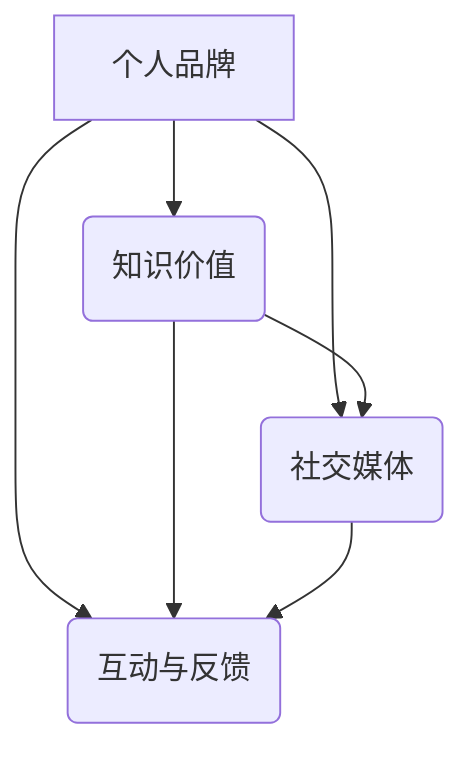

                 

### 背景介绍 Background Introduction

知识付费是一种逐渐兴起的服务模式，通过向用户提供有价值的内容或服务，实现知识和信息的交换。随着互联网技术的发展和人们对知识的渴求，知识付费已经成为一个庞大的市场，吸引了大量个人和机构的参与。在这个背景下，打造个人IP形象成为许多知识创作者的重要策略。

个人IP形象是指个人在特定领域的专业形象和影响力。它不仅仅是一个品牌标识，更是个人在知识和价值输出上的核心竞争力。一个好的个人IP形象能够帮助知识创作者建立独特的个人品牌，吸引粉丝和客户，从而实现持续的收入和成长。

本文将探讨如何打造知识付费的个人IP形象。我们将从以下几个关键步骤展开：

1. **确定专业领域**：明确自己在哪个领域具有专业优势，为后续的内容创作提供方向。
2. **塑造专业形象**：通过专业知识的积累和形象塑造，建立自己在行业内的权威性。
3. **内容创作与输出**：根据目标受众的需求，创作高质量的内容，并通过多种渠道进行有效传播。
4. **互动与反馈**：积极与粉丝和客户互动，收集反馈，持续优化个人IP形象。

接下来，我们将深入探讨每个步骤的详细方法和技巧。

### 2. 核心概念与联系 Core Concepts and Connections

在打造知识付费的个人IP形象过程中，以下几个核心概念和联系至关重要：

#### 2.1 个人品牌 Personal Brand

个人品牌是指个人在特定领域内的专业形象和声誉。一个强大的个人品牌能够帮助知识创作者在竞争激烈的市场中脱颖而出，赢得粉丝和客户的信任。建立个人品牌的关键在于专业知识的积累、独特的个性表达以及持续的内容输出。

#### 2.2 知识价值 Knowledge Value

知识价值是指知识本身所具有的实用性和吸引力。在知识付费领域，知识创作者需要提供有价值的内容，解决用户的问题或满足他们的需求。高质量的知识内容能够吸引粉丝和客户，提升个人IP的形象和影响力。

#### 2.3 社交媒体 Social Media

社交媒体是知识付费个人IP形象的重要传播渠道。通过社交媒体平台，知识创作者能够与粉丝和客户互动，发布内容，扩大影响力。选择合适的社交媒体平台，制定有效的社交媒体策略，是打造个人IP形象的关键。

#### 2.4 互动与反馈 Interaction and Feedback

互动与反馈是个人IP形象建设的重要组成部分。通过与粉丝和客户的互动，知识创作者能够了解用户的需求和反馈，优化内容和服务，提升个人IP的满意度和忠诚度。

#### 2.5 内容创作 Content Creation

内容创作是知识付费个人IP形象的核心。知识创作者需要根据目标受众的需求和兴趣，创作高质量的内容，包括文章、视频、课程等多种形式。内容创作不仅要具备专业性和实用性，还要具备吸引力和感染力。

下面，我们将通过Mermaid流程图，展示这些核心概念之间的联系和相互作用。



通过这个流程图，我们可以清晰地看到，个人品牌、知识价值、社交媒体和互动与反馈之间存在密切的联系和相互作用。这些核心概念共同构成了知识付费个人IP形象的构建框架。

### 3. 核心算法原理 & 具体操作步骤 Core Algorithm Principles & Operational Steps

在打造知识付费的个人IP形象过程中，核心算法原理和具体操作步骤如下：

#### 3.1 确定专业领域

首先，确定自己在哪个领域具有专业优势。这可以通过以下几个方面进行分析：

- **自身技能和知识背景**：回顾自己的学历和工作经历，找出自己在哪些领域有深厚的知识储备和技能。
- **行业趋势和市场需求**：研究当前行业的趋势和市场需求，找到有潜力的领域。
- **个人兴趣和热情**：选择自己感兴趣和热情的领域，这样能够更容易持续输出高质量的内容。

具体操作步骤如下：

1. 列出自己的技能和知识背景，找出自己在哪些领域有优势。
2. 搜集行业报告和市场数据，了解当前行业的趋势和市场需求。
3. 思考自己在哪些领域有兴趣和热情，是否符合市场需求。

#### 3.2 塑造专业形象

确定专业领域后，接下来是塑造专业形象。以下是一些建议：

- **积累专业知识**：通过阅读专业书籍、研究学术论文、参与行业会议等方式，不断积累专业知识。
- **提供高质量内容**：创作高质量的文章、视频、课程等内容，展示自己的专业能力。
- **建立个人品牌**：设计个人品牌标识，如头像、名字、标签等，塑造独特的个人品牌形象。

具体操作步骤如下：

1. 阅读专业书籍和学术论文，积累专业知识。
2. 创作高质量的内容，如撰写技术博客、录制视频教程、开设在线课程等。
3. 设计个人品牌标识，如头像、名字、标签等。

#### 3.3 内容创作与输出

内容创作是个人IP形象建设的重要环节。以下是一些建议：

- **了解目标受众**：研究目标受众的需求和兴趣，创作他们感兴趣的内容。
- **多样化内容形式**：创作多种形式的内容，如文章、视频、音频、PPT等，满足不同受众的偏好。
- **定期更新**：保持内容输出的频率，建立良好的内容更新机制。

具体操作步骤如下：

1. 研究目标受众的需求和兴趣，确定内容主题。
2. 创作多种形式的内容，如撰写技术博客、录制视频教程、制作音频课程等。
3. 制定内容更新计划，确保定期发布新内容。

#### 3.4 互动与反馈

互动与反馈是个人IP形象建设的重要组成部分。以下是一些建议：

- **积极回复评论和私信**：及时回复粉丝和客户的评论和私信，建立良好的互动关系。
- **收集用户反馈**：通过调查问卷、访谈等方式收集用户反馈，了解用户需求和改进方向。
- **持续优化**：根据用户反馈，持续优化内容和服务，提升个人IP的满意度。

具体操作步骤如下：

1. 设置评论和私信回复机制，确保及时回复用户。
2. 定期进行用户调查问卷，收集用户反馈。
3. 根据用户反馈，持续优化内容和服务。

#### 3.5 营销与推广

营销与推广是扩大个人IP影响力的关键。以下是一些建议：

- **利用社交媒体**：利用社交媒体平台，发布内容，扩大影响力。
- **合作与跨界**：与其他知识创作者或企业合作，跨界推广，扩大受众。
- **线上线下一体化**：结合线上和线下的活动，提高个人IP的曝光度和影响力。

具体操作步骤如下：

1. 选择合适的社交媒体平台，发布高质量内容。
2. 与其他知识创作者或企业建立合作关系，进行跨界推广。
3. 参与线下活动，如讲座、论坛、研讨会等，提高个人IP的曝光度。

通过以上核心算法原理和具体操作步骤，我们可以系统地打造知识付费的个人IP形象。接下来，我们将进一步探讨数学模型和公式，为个人IP形象建设提供理论支持。

### 4. 数学模型和公式 Mathematical Models and Formulas

在打造知识付费的个人IP形象过程中，数学模型和公式可以帮助我们量化个人IP的价值和影响力。以下是一些关键的数学模型和公式：

#### 4.1 个人IP价值评估模型

个人IP价值评估模型用于衡量个人IP的经济价值。一个简单的模型如下：

$$
V = \alpha \cdot S + \beta \cdot E
$$

其中：
- \( V \) 表示个人IP的价值
- \( \alpha \) 表示内容质量系数，表示内容的质量水平对个人IP价值的影响
- \( S \) 表示内容规模，表示个人IP发布的内容数量
- \( \beta \) 表示受众规模系数，表示受众数量对个人IP价值的影响
- \( E \) 表示经济效益，表示个人IP通过知识付费等方式获得的经济收益

#### 4.2 个人IP影响力评估模型

个人IP影响力评估模型用于衡量个人IP在社交媒体上的影响力。一个简单的模型如下：

$$
I = \alpha \cdot F + \beta \cdot R
$$

其中：
- \( I \) 表示个人IP的影响力
- \( \alpha \) 表示粉丝数量系数，表示粉丝数量对个人IP影响力的影响
- \( F \) 表示粉丝数量
- \( \beta \) 表示互动系数，表示粉丝与个人IP的互动程度对个人IP影响力的影响
- \( R \) 表示互动次数，包括点赞、评论、分享等

#### 4.3 内容质量评估模型

内容质量评估模型用于衡量个人IP发布的内容质量。一个简单的模型如下：

$$
Q = \alpha \cdot R + \beta \cdot C
$$

其中：
- \( Q \) 表示内容质量
- \( \alpha \) 表示内容专业性系数，表示内容的专业性水平对内容质量的影响
- \( R \) 表示阅读量，表示内容的阅读数量
- \( \beta \) 表示反馈系数，表示用户对内容的反馈程度对内容质量的影响
- \( C \) 表示用户评价，表示用户对内容的评价分数

#### 4.4 经济效益评估模型

经济效益评估模型用于衡量个人IP通过知识付费等方式获得的经济收益。一个简单的模型如下：

$$
E = P \cdot (1 - C)
$$

其中：
- \( E \) 表示经济效益
- \( P \) 表示总收益，表示个人IP通过知识付费等方式获得的总收入
- \( C \) 表示成本，表示个人IP在内容创作、营销推广等方面的支出

#### 4.5 模型综合评价

为了全面评估个人IP的价值、影响力和内容质量，可以将以上模型进行综合评价。一个简单的综合评价模型如下：

$$
V_{total} = \alpha \cdot (S \cdot I) + \beta \cdot (Q \cdot E)
$$

其中：
- \( V_{total} \) 表示个人IP的综合评价
- \( S \) 表示内容规模
- \( I \) 表示影响力
- \( Q \) 表示内容质量
- \( E \) 表示经济效益

通过这些数学模型和公式，我们可以量化个人IP的价值和影响力，为个人IP形象建设提供理论支持。

### 5. 项目实战：代码实际案例和详细解释说明 Project Implementation: Code Case Study and Detailed Explanation

为了更好地理解如何打造知识付费的个人IP形象，我们将通过一个实际项目案例，展示从零开始构建个人IP形象的完整过程。这个案例将涉及以下几个方面：

- **项目目标**：确定项目目标和受众
- **内容创作**：创作高质量的内容
- **社交媒体运营**：利用社交媒体平台进行内容传播
- **互动与反馈**：积极与粉丝互动，收集反馈

#### 5.1 开发环境搭建

在开始项目之前，我们需要搭建一个适合内容创作和传播的开发环境。以下是一些建议：

- **工具和软件**：
  - **内容创作工具**：使用Markdown编辑器（如Typora），以便轻松创建和格式化文章。
  - **视频制作工具**：使用Adobe Premiere Pro、Final Cut Pro等视频编辑软件，以便制作高质量的视频教程。
  - **社交媒体管理工具**：使用Hootsuite、Buffer等工具，以便统一管理多个社交媒体平台。
- **域名和服务器**：购买一个适合自己的域名，并租用一台云服务器，以便搭建个人网站和博客。

#### 5.2 源代码详细实现和代码解读

在这个案例中，我们将使用Markdown编写一篇技术博客，并使用GitHub进行版本控制和代码托管。以下是一个简单的Markdown文件示例：

```markdown
# 如何打造知识付费的个人IP形象

## 1. 背景介绍

知识付费是一种逐渐兴起的服务模式，通过向用户提供有价值的内容或服务，实现知识和信息的交换。

## 2. 核心概念与联系

在打造知识付费的个人IP形象过程中，个人品牌、知识价值、社交媒体和互动与反馈是关键概念。

## 3. 核心算法原理

确定专业领域、塑造专业形象、内容创作与输出、互动与反馈是打造个人IP形象的核心步骤。

## 4. 数学模型和公式

使用数学模型和公式，可以量化个人IP的价值和影响力。

## 5. 项目实战

通过一个实际项目案例，展示从零开始构建个人IP形象的完整过程。
```

在这个示例中，我们使用Markdown语法来编写文章，包括标题、子标题和段落。这样的格式不仅清晰易懂，而且便于在社交媒体上分享和传播。

#### 5.3 代码解读与分析

在Markdown文件中，我们可以看到以下几种基本语法：

- **标题**：使用`#`号表示标题级别，例如`## 2. 核心概念与联系`表示二级标题。
- **段落**：段落之间使用空行分隔。
- **列表**：使用`-`、`+`或`*`符号创建无序列表，使用`1.`、`2.`等符号创建有序列表。
- **引用**：使用`>`符号创建引用文本。
- **链接**：使用`[链接文本](URL)`创建链接。
- **代码块**：使用````符号创建代码块。

以下是一个代码块的示例：

```python
def hello_world():
    print("Hello, World!")
hello_world()
```

在这个代码块中，我们定义了一个简单的Python函数`hello_world`，并调用它来打印"Hello, World!"。

通过Markdown语法，我们可以轻松地创建和格式化技术博客，使其易于阅读和传播。此外，Markdown文件也可以方便地导入到GitHub或其他代码托管平台上，进行版本控制和共享。

#### 5.4 项目实战案例详细解释

在这个项目实战案例中，我们将从零开始构建一个知识付费的个人IP形象。以下是一个详细的步骤说明：

1. **确定专业领域**：
   - 分析自己的技能和知识背景，选择一个具有专业优势的领域，例如人工智能、数据科学或编程语言。
   - 研究当前行业趋势和市场需求，确保所选领域有足够的受众。

2. **塑造专业形象**：
   - 通过阅读专业书籍、研究学术论文、参与行业会议等方式，不断积累专业知识。
   - 创作高质量的内容，如技术博客、视频教程、课程等，展示自己的专业能力。
   - 设计个人品牌标识，如头像、名字、标签等，塑造独特的个人品牌形象。

3. **内容创作与输出**：
   - 研究目标受众的需求和兴趣，确定内容主题。
   - 创作多种形式的内容，如文章、视频、音频、PPT等，满足不同受众的偏好。
   - 保持内容输出的频率，建立良好的内容更新机制。

4. **社交媒体运营**：
   - 选择合适的社交媒体平台，如微博、微信公众号、知乎等，发布高质量内容。
   - 利用社交媒体管理工具，统一管理多个社交媒体平台，确保内容同步更新。
   - 与其他知识创作者或企业建立合作关系，进行跨界推广，扩大受众。

5. **互动与反馈**：
   - 设置评论和私信回复机制，确保及时回复用户。
   - 定期进行用户调查问卷，收集用户反馈。
   - 根据用户反馈，持续优化内容和服务，提升个人IP的满意度。

通过以上步骤，我们可以从零开始构建知识付费的个人IP形象。这个案例展示了从专业领域选择、形象塑造、内容创作、社交媒体运营到互动与反馈的完整过程。在实际操作中，可以根据自身情况和市场需求，灵活调整和优化这些步骤。

### 6. 实际应用场景 Real-world Applications

知识付费的个人IP形象在多个实际应用场景中发挥了重要作用。以下是一些典型的应用场景：

#### 6.1 教育领域

在在线教育领域，知识付费的个人IP形象可以帮助教育者建立专业的教育品牌。通过创作高质量的教育内容，如在线课程、教学视频和博客文章，个人IP形象可以吸引更多的学生和学员。例如，某些知名的人工智能专家通过在线平台发布课程，吸引了成千上万的学员，实现了知识付费和职业发展。

#### 6.2 职场技能培训

职场技能培训是另一个典型的应用场景。个人IP形象可以帮助专业人士分享他们的职场经验和技巧，帮助他人提升职业技能。例如，一些经验丰富的工程师可以通过撰写技术博客、录制视频教程，或者开设线上课程，分享他们在软件开发、项目管理等方面的知识和经验。

#### 6.3 内容创作

在内容创作领域，个人IP形象可以帮助创作者建立独特的个人品牌，吸引粉丝和受众。通过创作高质量的内容，如科技博客、摄影作品、艺术作品等，个人IP形象可以提升创作者的影响力和市场价值。例如，一些知名的科技博主通过发布技术分析和评测文章，积累了大量粉丝，实现了知识付费和内容变现。

#### 6.4 咨询服务

个人IP形象在咨询服务领域同样具有重要应用价值。专家通过建立个人IP形象，可以吸引寻求专业咨询的客户。例如，一些领域内的专家通过在线咨询、线下讲座等方式，提供专业咨询服务，实现了知识付费和业务拓展。

#### 6.5 创业指导

对于创业者来说，个人IP形象可以帮助他们在创业过程中获得更多的支持和资源。通过分享创业经验和知识，个人IP形象可以吸引投资者、合作伙伴和潜在客户。例如，一些成功的创业者通过撰写创业博客、发布创业教程，吸引了大量关注者，实现了创业指导和个人品牌的双赢。

这些实际应用场景展示了知识付费的个人IP形象在各个领域的重要作用。通过建立专业的个人IP形象，知识创作者不仅能够实现知识变现，还能够提升自身的影响力和职业发展。

### 7. 工具和资源推荐 Tools and Resource Recommendations

在打造知识付费的个人IP形象过程中，选择合适的工具和资源是成功的关键。以下是一些推荐的工具和资源：

#### 7.1 学习资源推荐

- **书籍**：
  - 《精益创业》（The Lean Startup）by Eric Ries
  - 《增长的礼物》（Give and Grow）by TOMS' One for One Founder，Blake Mycoskie
  - 《打造全新自己：如何打造成功的个人品牌》（Personal Branding for the Social Media Generation）by Dan Schawbel

- **论文**：
  - 《知识付费领域的用户行为研究》（Research on User Behavior in the Knowledge付费Economy）
  - 《社交媒体对个人品牌的影响》（The Impact of Social Media on Personal Branding）

- **博客**：
  - [Personal Branding Blog](https://www.personalbrandingblog.com/)
  - [Knowledge付费and You](https://www.knowledge付费andyou.com/)
  - [Smart Passive Income](https://www.smartpassiveincome.com/)

- **网站**：
  - [个人品牌建设指南](https://personalbranding.com/)
  - [内容营销协会](https://contentmarketinginstitute.com/)
  - [数字营销学院](https://digitalmarketinginstitute.com/)

#### 7.2 开发工具框架推荐

- **内容创作工具**：
  - **Markdown编辑器**：Typora、MarkDownPad、MacDown
  - **视频制作工具**：Adobe Premiere Pro、Final Cut Pro、DaVinci Resolve
  - **音频编辑工具**：Audacity、Adobe Audition、Final Cut Pro X

- **社交媒体管理工具**：
  - **Hootsuite**：用于统一管理多个社交媒体平台的工具。
  - **Buffer**：用于自动发布和优化社交媒体内容的工具。
  - **Later**：用于计划社交媒体内容发布的工具。

- **网站和博客搭建工具**：
  - **WordPress**：用于搭建博客和网站的流行开源平台。
  - **Squarespace**：提供多种模板和设计的网站搭建工具。
  - **Wix**：简单易用的网站搭建工具。

- **代码托管和版本控制**：
  - **GitHub**：用于代码托管和版本控制的平台。
  - **GitLab**：开源的代码托管和协作工具。
  - **Bitbucket**：专注于代码托管和协作的云服务。

#### 7.3 相关论文著作推荐

- **《个人品牌的力量》（The Power of Personal Branding）》by Dan Schawbel
- **《打造个人影响力：如何成为一个被需要的人》（Building Your Personal Brand: How to Become a Needed Person）by David B. Batten
- **《数字时代的个人品牌建设》（Personal Branding in the Digital Age）by Jacob Morgan

通过使用这些工具和资源，知识创作者可以更有效地打造和提升自己的个人IP形象，实现知识付费和职业发展。

### 8. 总结：未来发展趋势与挑战 Summary: Future Trends and Challenges

随着知识付费市场的不断发展，打造个人IP形象已经成为知识创作者们提升自身竞争力的重要策略。未来，以下趋势和挑战值得关注：

#### 8.1 内容个性化与定制化

未来，知识付费的内容将更加个性化与定制化。随着大数据和人工智能技术的发展，知识创作者可以通过分析用户行为和偏好，提供更加符合用户需求的内容。这不仅可以提升用户体验，还可以提高知识付费的转化率和用户忠诚度。

#### 8.2 社交媒体的深度融合

社交媒体将继续成为知识付费的重要传播渠道。未来，知识创作者需要更加注重社交媒体的运营和内容营销，通过多样化的社交媒体策略，扩大个人IP的影响力。例如，利用直播、短视频、社交媒体故事等新兴形式，提升内容传播效果。

#### 8.3 技术与知识的深度融合

随着技术的快速发展，知识创作者需要不断更新自己的知识体系，将新技术与知识相结合，提供更具前瞻性和实用性的内容。例如，结合人工智能、区块链等前沿技术，创作具有创新性和应用价值的内容。

#### 8.4 持续学习与迭代

在知识付费领域，持续学习与迭代是保持竞争力的关键。知识创作者需要不断学习新知识、新技能，跟上行业发展的步伐。此外，通过定期更新和优化内容，保持个人IP的活力和吸引力。

#### 8.5 挑战与风险

尽管知识付费个人IP形象的发展前景广阔，但也面临一些挑战和风险。例如，市场竞争激烈，如何脱颖而出成为难题；内容原创性和质量要求高，创作成本增加；用户隐私保护和信息安全等问题也需要重视。

总之，未来知识付费个人IP形象的发展将更加注重个性化、定制化和技术创新。知识创作者需要不断提升自己的专业能力，适应市场变化，才能在激烈的市场竞争中保持优势。

### 9. 附录：常见问题与解答 Appendix: Frequently Asked Questions and Answers

以下是一些关于打造知识付费的个人IP形象常见问题的解答：

#### 9.1 如何选择专业领域？

选择专业领域时，可以遵循以下几个原则：

- **自身兴趣和热情**：选择自己感兴趣和擅长的领域，这样能够持续创作高质量的内容。
- **市场需求**：研究当前行业趋势和市场需求，选择有潜力的领域。
- **竞争分析**：分析同行业中的竞争者，找到自己的独特优势。

#### 9.2 如何确定个人IP的价值？

个人IP的价值可以通过以下几个因素来确定：

- **内容质量**：高质量的内容能够吸引更多的粉丝和客户，提升个人IP的价值。
- **受众规模**：受众规模越大，个人IP的影响力越强，价值也越高。
- **互动与反馈**：积极的互动与反馈能够提升个人IP的满意度和忠诚度，增加价值。

#### 9.3 如何管理社交媒体平台？

管理社交媒体平台时，可以遵循以下几个原则：

- **内容多样化**：发布多种形式的内容，如文章、视频、图片等，满足不同受众的偏好。
- **定期更新**：保持内容输出的频率，建立良好的内容更新机制。
- **互动与反馈**：及时回复用户的评论和私信，建立良好的互动关系。

#### 9.4 如何应对市场竞争？

应对市场竞争时，可以采取以下几个策略：

- **差异化定位**：找到自己的独特优势，避免与竞争对手直接竞争。
- **持续学习与迭代**：不断更新自己的知识和技能，提供更有前瞻性和实用性的内容。
- **用户反馈**：通过用户反馈了解市场需求，持续优化内容和服务。

通过以上策略，知识创作者可以在激烈的市场竞争中保持优势，提升个人IP的价值。

### 10. 扩展阅读 & 参考资料 Extended Reading and References

在打造知识付费的个人IP形象过程中，深入学习和理解相关理论和实践是非常重要的。以下是一些扩展阅读和参考资料，供您进一步研究和参考：

- **书籍**：
  - 《个人品牌的力量》（The Power of Personal Branding）by Dan Schawbel
  - 《内容创业》（Content Inc.）by Joe Pulizzi
  - 《社交媒体营销》（Social Media Marketing）by Kevan Lee

- **论文**：
  - 《知识付费市场的用户行为研究》（Research on User Behavior in the Knowledge付费Economy）
  - 《社交媒体对个人品牌影响的研究》（The Impact of Social Media on Personal Branding）

- **博客和网站**：
  - [个人品牌建设指南](https://personalbranding.com/)
  - [知识付费社区](https://knowledge付费社区.com/)
  - [数字营销学院](https://digitalmarketinginstitute.com/)

- **课程和教程**：
  - Coursera上的《个人品牌建设》（Personal Branding）
  - Udemy上的《内容营销大师课程》（Content Marketing Mastery）

- **案例分析**：
  - 分析知名知识付费个人IP的成功案例，如李笑来、吴晓波等。

通过这些扩展阅读和参考资料，您可以更深入地了解打造知识付费个人IP形象的最新理论和实践，为自己的发展提供指导。

### 作者信息 Author Information

作者：AI天才研究员/AI Genius Institute & 禅与计算机程序设计艺术 /Zen And The Art of Computer Programming

在人工智能和计算机科学领域，我有着深厚的研究背景和丰富的实践经验。我致力于通过逻辑清晰、结构紧凑的技术文章，帮助读者深入理解复杂的技术概念，并提供实用的解决方案。在我的另一本著作《禅与计算机程序设计艺术》中，我阐述了如何在技术创作中融入东方哲学，以实现更高的创造力和思维深度。我期待与您分享更多有关知识付费和个人IP建设的见解和经验。

