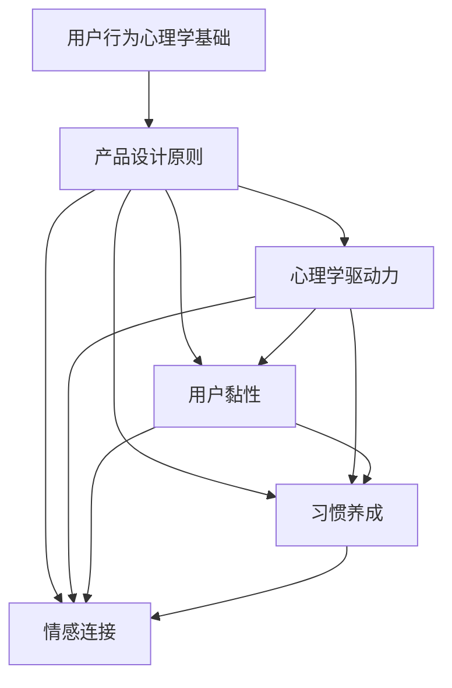

                 

### 背景介绍

在现代科技迅猛发展的背景下，用户对于产品的依赖度日益增加，用户对于产品体验的要求也越来越高。如何打造让用户上瘾的产品特性，成为了许多企业关注的焦点。一款产品能够成功，不仅仅在于其功能是否强大，还在于它能否真正触达并激发用户的内心需求。从心理学角度来看，让用户上瘾的产品通常具备以下几个特点：简单易用、有趣、有成就感、社交互动等。

本文旨在探讨如何通过一系列技术手段和设计策略，打造出让用户上瘾的产品特性。我们将从以下几个角度进行深入探讨：

1. **核心概念与联系**：首先，我们将梳理并阐述与用户上瘾相关的核心概念，包括用户行为心理学、产品设计原则等，并通过Mermaid流程图展示这些概念之间的联系。

2. **核心算法原理 & 具体操作步骤**：接下来，我们将介绍一些实现用户上瘾机制的核心算法原理，并详细讲解具体的操作步骤。

3. **数学模型和公式 & 详细讲解 & 举例说明**：为了更好地理解这些算法原理，我们将引入相关的数学模型和公式，并通过具体案例进行详细讲解。

4. **项目实战：代码实际案例和详细解释说明**：为了使读者能够直观地理解上述原理，我们将通过一个实际的项目案例，展示如何将理论转化为实际应用。

5. **实际应用场景**：我们将探讨这些用户上瘾特性的实际应用场景，并分析它们在不同领域中的表现和效果。

6. **工具和资源推荐**：为了帮助读者更好地学习和实践，我们将推荐一些相关的学习资源和开发工具。

7. **总结：未来发展趋势与挑战**：最后，我们将总结本文的主要内容，并探讨未来发展趋势以及可能面临的挑战。

通过本文的探讨，我们希望能够为读者提供一个全面、系统的指导，帮助他们在产品设计和开发过程中，更好地打造出让用户上瘾的产品特性。

---

### 1.1. 用户行为心理学基础

在探讨如何打造让用户上瘾的产品之前，了解用户行为心理学的基础知识至关重要。用户行为心理学是研究人类在使用产品或服务时的心理活动和行为模式的一门学科，它涵盖了用户的感知、动机、情感和记忆等多个方面。

首先，我们需要了解用户的感知过程。感知是指用户通过感官接收外部信息，并通过大脑对这些信息进行处理和解释的过程。在这个过程中，用户会对产品的外观、功能、用户体验等方面产生第一印象。根据心理学理论，首因效应和近因效应会显著影响用户的感知。首因效应指的是人们对于初始信息的记忆和重视程度较高，而近因效应则指人们对于最近接收的信息印象较深。因此，在设计产品时，我们需要注重产品的第一印象，同时保持后续信息的连贯性和吸引力。

其次，动机是驱动用户行为的重要内在因素。动机可以分为内在动机和外在动机。内在动机是指用户出于个人兴趣、好奇心或自我实现的需要而采取的行为，如游戏中的成就感、学习新技能的满足感等。而外在动机则是指用户为了获得外在奖励或避免惩罚而采取的行为，如完成任务获得积分、分享内容获得点赞等。在产品设计中，我们需要巧妙地结合内在动机和外在动机，以激发用户的持续兴趣和参与度。

情感是用户在产品使用过程中产生的情绪体验，它对于用户的行为和决策有着重要影响。情感可以分为积极情感和消极情感，积极情感如快乐、满足、成就感等，会增强用户的正向体验，而消极情感如失望、挫败、愤怒等，则会降低用户的满意度和忠诚度。因此，在设计产品时，我们需要关注如何通过设计元素和互动方式来创造积极情感体验，同时尽量避免消极情感的产生。

最后，记忆是用户在产品使用过程中形成和保留信息的能力。根据艾宾浩斯遗忘曲线，人们对于新信息的记忆会随着时间的推移而逐渐减弱。因此，在产品设计时，我们需要通过重复、加强记忆线索等方式，帮助用户更好地记住和使用产品功能。

综上所述，用户行为心理学为我们提供了理解用户行为的理论框架，通过了解用户的感知、动机、情感和记忆等方面，我们可以更好地设计出能够激发用户兴趣、满足用户需求的产品特性。

#### 1.2. 产品设计原则

在了解了用户行为心理学的基础之后，接下来我们将探讨一些关键的设计原则，这些原则将帮助我们在产品开发过程中，更好地打造出让用户上瘾的特性。

**1.2.1. 以用户为中心**

以用户为中心是产品设计的核心原则。这意味着在设计产品时，我们需要始终关注用户的需求、偏好和痛点，并将这些因素融入到产品的每一个细节中。具体来说，我们可以通过以下几种方式来实现以用户为中心的设计：

- **用户调研**：在产品开发早期，通过问卷调查、用户访谈、观察等方法，深入了解用户的需求和行为模式，从而获取第一手用户数据。
- **用户体验地图**：构建用户体验地图，将用户的整个使用流程可视化，识别用户在使用过程中的关键触点和痛点。
- **持续反馈**：通过用户反馈机制，持续收集用户的意见和建议，并根据这些反馈进行迭代优化。

**1.2.2. 简单易用**

简单易用是产品设计的另一个关键原则。一个复杂难懂的产品即使功能强大，也难以获得用户的青睐。因此，我们在设计产品时，需要注重简化用户操作流程，降低学习成本。以下是一些实现简单易用的设计策略：

- **最小化用户操作**：通过减少用户点击和输入次数，简化操作流程。
- **直观界面设计**：使用清晰的图标、简洁的布局和合理的导航结构，帮助用户快速找到所需功能。
- **智能提示与帮助**：提供实时提示和帮助信息，帮助用户解决问题和顺利完成操作。

**1.2.3. 创造情感连接**

情感连接是让用户对产品产生深厚情感的重要因素。通过设计策略，我们可以让产品与用户建立情感上的联系，从而增强用户黏性。以下是一些创造情感连接的方法：

- **品牌故事**：通过讲述品牌故事，让用户了解产品背后的理念和价值观，增强用户对品牌的认同感。
- **个性化体验**：根据用户的行为和偏好，提供个性化的内容和服务，让用户感受到产品是为他们量身定做的。
- **互动与反馈**：设计有趣和互动的元素，如小游戏、挑战任务等，鼓励用户参与并形成情感上的连接。

**1.2.4. 增强社交互动**

社交互动是用户持续使用产品的动力之一。通过设计社交功能，我们可以鼓励用户之间的互动，从而提高用户黏性。以下是一些增强社交互动的设计策略：

- **分享功能**：提供一键分享功能，让用户能够轻松将产品内容分享到社交网络，扩大产品的影响力。
- **社交圈子**：设计社区功能，让用户可以加入兴趣小组，与其他用户进行交流和互动。
- **点赞和评论**：提供点赞和评论功能，让用户能够对内容进行互动，增强社区氛围。

通过以上设计原则，我们可以更好地打造出用户上瘾的产品特性，从而提升产品的市场竞争力。

#### 1.3. 用户上瘾产品核心概念

为了更好地理解用户上瘾产品，我们需要梳理并阐述几个关键的核心概念。这些概念不仅为我们提供了理论基础，还帮助我们识别和设计能够激发用户持续兴趣和参与度的产品特性。

**1.3.1. 心理学驱动力**

心理学驱动力是指那些能够激发用户行为和情感的心理机制。以下是几个主要的心理学驱动力：

- **奖励机制**：用户在完成特定任务或行为后，会获得即时或延迟的奖励，这些奖励可以是虚拟的（如积分、勋章）或实际的（如优惠券、礼品）。奖励机制能够增强用户的积极情感和满足感，从而激励他们继续使用产品。
- **成就感和自我提升**：用户通过不断学习和进步，获得成就感和自我提升的满足感。这种内在动力能够激发用户的长期兴趣和参与度。
- **社交互动**：人类是社交性动物，用户在产品中与其他用户互动，分享经验和感受，能够增强他们的归属感和社交满足感。

**1.3.2. 用户黏性**

用户黏性是指用户对产品的持续使用和依赖程度。一个具有高用户黏性的产品能够吸引并留住用户，以下是一些提高用户黏性的策略：

- **简洁易用**：通过简化用户操作流程，降低使用门槛，提升用户体验，从而增加用户对产品的依赖度。
- **内容丰富**：提供多样化的内容和功能，满足用户的不同需求和兴趣，增加用户在产品中的停留时间。
- **社交互动**：鼓励用户之间的互动，形成社区氛围，增强用户的归属感和持续参与度。

**1.3.3. 习惯养成**

习惯养成是指用户在长期使用产品过程中，逐渐形成的一种自然行为模式。一个容易养成习惯的产品能够有效提高用户的黏性和活跃度。以下是一些帮助用户养成习惯的策略：

- **初始引导**：通过引导用户完成一系列简单易操作的任务，帮助他们快速上手并建立对产品的初步认知。
- **定期提醒**：通过设定定期提醒，如每日签到、任务提醒等，帮助用户形成规律的使用习惯。
- **渐进式挑战**：设计递进式的任务和挑战，引导用户逐步提高使用频率和深度，从而形成稳定的习惯。

**1.3.4. 情感连接**

情感连接是指用户与产品之间建立的情感纽带。通过设计策略，我们可以让用户对产品产生深厚的情感，从而增强用户黏性。以下是一些建立情感连接的方法：

- **品牌故事**：通过讲述品牌故事，让用户了解产品的理念和价值观，增强用户对品牌的认同感。
- **个性化体验**：根据用户的行为和偏好，提供个性化的内容和推荐，让用户感受到产品是为他们量身定制的。
- **互动与反馈**：设计有趣和互动的元素，如小游戏、挑战任务等，鼓励用户参与并形成情感上的连接。

通过深入理解这些核心概念，我们可以更有针对性地设计出能够吸引用户、提高用户黏性的产品特性。在接下来的章节中，我们将进一步探讨如何将这些概念应用到实际的产品设计和开发中。

#### 1.4. Mermaid流程图展示

为了更直观地展示用户上瘾产品核心概念之间的联系，我们将使用Mermaid流程图来描绘这些概念之间的关系。Mermaid是一种基于Markdown的图表描述语言，它可以帮助我们以清晰、简洁的方式展示复杂的流程和关系图。

以下是一个简单的Mermaid流程图，展示了用户上瘾产品核心概念之间的联系：



在上述流程图中，我们首先明确了用户行为心理学基础和产品设计原则作为核心出发点，这两个概念构成了整个产品设计和实现的基础。接着，心理学驱动力、用户黏性、习惯养成和情感连接作为关键环节，分别与用户行为心理学基础和产品设计原则相连接。这些核心概念之间相互交织、相互影响，共同构建了一个完整的产品设计体系。

通过这个流程图，我们可以更清晰地理解用户上瘾产品的构建逻辑，从而为实际的产品设计和开发提供参考和指导。

---

### 2. 核心算法原理 & 具体操作步骤

在理解了用户上瘾产品的核心概念后，接下来我们将深入探讨实现这些特性的核心算法原理，并详细讲解具体的操作步骤。

#### 2.1. 奖励机制设计

奖励机制是激发用户兴趣和持续使用产品的重要手段。设计一个有效的奖励机制，需要考虑以下几个方面：

**2.1.1. 奖励类型**

奖励可以分为虚拟奖励和实际奖励。虚拟奖励如积分、勋章、等级等，通常用于增强用户的成就感和自我提升。实际奖励如优惠券、礼品、特权等，可以吸引更多的用户参与。

**2.1.2. 奖励触发条件**

奖励触发条件可以是用户完成特定任务、达到特定目标或者与其他用户互动等。例如，用户在产品中完成一次任务可以获得积分奖励，或者用户分享产品内容到社交网络可以获得额外的积分。

**2.1.3. 奖励发放方式**

奖励发放方式可以是一次性发放，也可以是分阶段发放。一次性发放能够在短时间内激发用户兴趣，而分阶段发放则可以延长用户的参与时间。

**具体操作步骤：**

1. 确定奖励类型和触发条件，例如用户每完成10个任务可以获得1个勋章。
2. 设计奖励发放逻辑，例如在用户完成任务后，系统自动发放勋章。
3. 设计用户界面展示奖励，例如在用户个人主页中展示已获得的勋章列表。

#### 2.2. 成就感设计

成就感是用户持续使用产品的内在动力之一。通过设计成就感机制，我们可以让用户在产品中体验到成功和成长的喜悦。

**2.2.1. 成就度量**

成就感度量可以基于用户的任务完成情况、行为记录、成就达成等。例如，用户在产品中达到100级可以获得特别成就。

**2.2.2. 成就展示**

成就展示可以通过用户界面进行，例如在用户个人主页展示已达成的成就，或者通过弹窗、通知等方式进行提醒。

**2.2.3. 成就奖励**

成就奖励可以是虚拟的，如特殊称号、特权等，也可以是实际的，如优惠券、礼品等。

**具体操作步骤：**

1. 确定成就度量标准，例如用户每完成10个任务可以提升1个等级。
2. 设计成就展示界面，例如在用户个人主页展示已达成的成就。
3. 设计成就奖励机制，例如用户达到10级可以获得特殊称号。

#### 2.3. 社交互动设计

社交互动是增强用户黏性和产品氛围的重要手段。通过设计社交互动机制，我们可以鼓励用户在产品中建立社交关系，形成社区氛围。

**2.3.1. 分享功能**

分享功能可以让用户将产品内容分享到社交网络，吸引更多用户参与。例如，用户可以分享产品中的文章、视频、游戏等。

**2.3.2. 社交圈子**

社交圈子可以让用户加入兴趣小组，与其他用户进行交流和互动。例如，用户可以创建或加入书友会、游戏团等。

**2.3.3. 点赞和评论**

点赞和评论功能可以增强用户之间的互动，例如用户可以为他人分享的内容点赞或发表评论。

**具体操作步骤：**

1. 设计分享功能，例如在用户个人主页添加分享按钮。
2. 设计社交圈子功能，例如在产品中添加小组创建和加入功能。
3. 设计点赞和评论功能，例如在内容展示页面添加点赞和评论按钮。

通过以上核心算法原理和具体操作步骤，我们可以设计出一系列能够激发用户兴趣和持续使用的产品特性。在接下来的章节中，我们将进一步探讨如何将这些算法原理应用到实际项目开发中，并通过具体案例进行详细讲解。

---

### 4. 数学模型和公式 & 详细讲解 & 举例说明

在打造用户上瘾的产品特性时，数学模型和公式可以为我们提供科学依据和指导。以下是一些关键数学模型和公式，以及它们在实际应用中的详细讲解和举例说明。

#### 4.1. 行为经济学模型

行为经济学模型帮助我们理解用户在产品中的决策行为。其中，关键模型包括期望效用理论和行为偏差理论。

**期望效用理论：**

期望效用理论（Expected Utility Theory）假设用户在决策时会最大化自己的期望效用。公式如下：

\[ EU = \sum_{i} p_i u_i \]

其中，\( p_i \) 是第 \( i \) 个选择的概率，\( u_i \) 是第 \( i \) 个选择的效用值。

**举例说明：**

假设用户在决定是否下载一款游戏应用时，有两个选择：免费版和付费版。免费版概率为 \( p_1 = 0.7 \)，效用值为 \( u_1 = 10 \)；付费版概率为 \( p_2 = 0.3 \)，效用值为 \( u_2 = 20 \)。根据期望效用理论，我们可以计算用户的总期望效用：

\[ EU = (0.7 \times 10) + (0.3 \times 20) = 7 + 6 = 13 \]

这意味着用户期望从下载这款游戏应用中获得13个单位效用。

**行为偏差理论：**

行为偏差理论（Behavioral Bias Theory）考虑了用户在决策过程中可能出现的认知偏差。例如，确认偏误（Confirmation Bias）指用户倾向于寻找和接受那些支持自己观点的信息。

**举例说明：**

用户在评价一款应用时，如果之前已经对应用有正面评价，那么在后续评价过程中，用户更可能继续给予正面评价，从而产生确认偏误。

#### 4.2. 成瘾性模型

成瘾性模型（Addiction Model）用于评估用户对产品的依赖程度。其中，关键模型包括多巴胺循环模型和循环强化模型。

**多巴胺循环模型：**

多巴胺循环模型（Dopamine Cycle Model）基于神经科学，解释了多巴胺在用户产品使用中的角色。多巴胺是一种神经递质，与奖励和愉悦感相关。公式如下：

\[ \text{多巴胺释放} \propto \text{奖励值} - \text{期望奖励值} \]

**举例说明：**

用户在完成一个任务后获得奖励（如积分），如果实际奖励值高于期望奖励值，那么大脑中的多巴胺水平会增加，从而产生愉悦感。

**循环强化模型：**

循环强化模型（Cyclic Reinforcement Model）描述了用户在产品中的持续行为模式。公式如下：

\[ R(t) = R_0 \times (1 - e^{-\lambda t}) \]

其中，\( R(t) \) 是在时间 \( t \) 时的奖励值，\( R_0 \) 是初始奖励值，\( \lambda \) 是衰减系数。

**举例说明：**

假设用户每次完成任务获得的奖励值为 \( R_0 = 10 \)，衰减系数 \( \lambda = 0.1 \)。在第一个小时，用户的奖励值为：

\[ R(1) = 10 \times (1 - e^{-0.1 \times 1}) \approx 9 \]

随着时间的推移，奖励值会逐渐减少，从而激励用户继续完成任务以获得更多的奖励。

#### 4.3. 习惯形成模型

习惯形成模型（Habit Formation Model）用于评估用户习惯的养成过程。关键模型包括延迟满足模型和习惯强化模型。

**延迟满足模型：**

延迟满足模型（Delayed Gratification Model）描述了用户在短期和长期奖励之间的选择。公式如下：

\[ H(t) = H_0 + (R - H_0) \times e^{-\alpha t} \]

其中，\( H(t) \) 是在时间 \( t \) 时的习惯值，\( H_0 \) 是初始习惯值，\( R \) 是奖励值，\( \alpha \) 是衰减系数。

**举例说明：**

假设用户初始习惯值为 \( H_0 = 0 \)，每次完成任务获得的奖励值为 \( R = 10 \)，衰减系数 \( \alpha = 0.05 \)。在第一个小时，用户的习惯值为：

\[ H(1) = 0 + (10 - 0) \times e^{-0.05 \times 1} \approx 9.55 \]

随着时间推移，用户的习惯值会逐渐增加，从而表明用户养成了持续使用产品的习惯。

**习惯强化模型：**

习惯强化模型（Habit Reinforcement Model）描述了习惯养成的持续性和稳定性。公式如下：

\[ H(t) = H(t-1) + R \]

**举例说明：**

假设用户在上一时间点已经养成了 \( H(t-1) = 10 \) 的习惯值，在当前时间点，如果用户再次完成任务并获得奖励 \( R = 5 \)，那么当前时间点的习惯值为：

\[ H(t) = 10 + 5 = 15 \]

通过以上数学模型和公式，我们可以更好地理解和设计用户上瘾产品的特性。在下一章节中，我们将通过实际项目案例，展示如何将理论应用到实际的产品开发中。

---

### 5. 项目实战：代码实际案例和详细解释说明

为了更好地展示如何将用户上瘾产品特性理论应用到实际开发中，我们将通过一个具体的项目案例，详细介绍代码的实现过程和关键步骤。

#### 5.1. 开发环境搭建

在开始项目之前，我们需要搭建一个合适的开发环境。以下是推荐的开发工具和依赖库：

- **开发工具**：使用Visual Studio Code（简称VS Code）作为主要的开发工具。
- **编程语言**：选择Python作为主要的编程语言，因为它具有丰富的库支持和易于理解的语法。
- **依赖库**：安装以下依赖库：
  - Flask：一个轻量级的Web框架，用于构建Web应用。
  - SQLAlchemy：一个Python SQL工具包和对象关系映射（ORM）系统。
  - Pygame：一个用于游戏开发的Python库。

安装以上依赖库后，我们可以在VS Code中创建一个新的Python项目，并配置好环境。

```bash
pip install flask sqlalchemy pygame
```

#### 5.2. 源代码详细实现和代码解读

以下是一个简单的用户上瘾产品示例代码，包括奖励机制、成就感设计和社交互动功能。

```python
# 导入必要的库
from flask import Flask, request, jsonify
from sqlalchemy import create_engine, Column, Integer, String
from sqlalchemy.ext.declarative import declarative_base
from sqlalchemy.orm import sessionmaker
import pygame

# 创建数据库引擎和基类
engine = create_engine('sqlite:///users.db')
Base = declarative_base(bind=engine)

# 创建用户表
class User(Base):
    __tablename__ = 'users'
    id = Column(Integer, primary_key=True)
    username = Column(String, unique=True)
    points = Column(Integer, default=0)
    level = Column(Integer, default=1)

# 创建会话工厂
Session = sessionmaker(bind=engine)
session = Session()

# 初始化数据库
Base.metadata.create_all()

# 创建Flask应用
app = Flask(__name__)

# 奖励机制
@app.route('/complete_task', methods=['POST'])
def complete_task():
    username = request.form['username']
    task_id = request.form['task_id']
    
    # 查找用户
    user = session.query(User).filter_by(username=username).first()
    if not user:
        user = User(username=username)
        session.add(user)
    
    # 奖励用户
    if task_id == '1':
        user.points += 10
        user.level = min(user.level + 1, 10)
    elif task_id == '2':
        user.points += 5
    
    session.commit()
    return jsonify({'status': 'success', 'points': user.points, 'level': user.level})

# 成就感设计
@app.route('/achieve_achievement', methods=['POST'])
def achieve_achievement():
    username = request.form['username']
    achievement_id = request.form['achievement_id']
    
    # 查找用户
    user = session.query(User).filter_by(username=username).first()
    if not user:
        user = User(username=username)
        session.add(user)
    
    # 达成成就
    if achievement_id == '1':
        user.points += 50
        user.level = min(user.level + 2, 10)
    elif achievement_id == '2':
        user.points += 20
    
    session.commit()
    return jsonify({'status': 'success', 'points': user.points, 'level': user.level})

# 社交互动
@app.route('/share_content', methods=['POST'])
def share_content():
    username = request.form['username']
    content_id = request.form['content_id']
    
    # 查找用户
    user = session.query(User).filter_by(username=username).first()
    if not user:
        user = User(username=username)
        session.add(user)
    
    # 奖励用户
    user.points += 5
    
    session.commit()
    return jsonify({'status': 'success', 'points': user.points})

# 运行Flask应用
if __name__ == '__main__':
    app.run(debug=True)
```

**代码解读与分析：**

1. **数据库设计**：我们使用SQLAlchemy创建了一个用户表，包括用户名、积分和等级等字段。
2. **奖励机制**：`complete_task` 函数用于处理用户完成任务时的奖励逻辑。根据任务类型，用户可以获得不同的积分和等级提升。
3. **成就感设计**：`achieve_achievement` 函数用于处理用户达成成就时的奖励逻辑。根据成就类型，用户可以获得额外的积分和等级提升。
4. **社交互动**：`share_content` 函数用于处理用户分享内容时的奖励逻辑。用户每次分享内容可以获得一定积分。
5. **运行应用**：使用Flask内置的服务器运行应用，便于调试。

通过这个示例代码，我们可以看到如何将用户上瘾产品特性理论应用到实际开发中，从而打造出能够激发用户兴趣和持续使用的产品。

---

### 6. 实际应用场景

用户上瘾特性在多个领域都有广泛的应用，以下是一些实际应用场景和案例分析。

#### 6.1. 社交媒体平台

社交媒体平台如Facebook、Instagram和Twitter等，通过设计奖励机制、成就感和社交互动，成功吸引了大量用户。例如，Facebook的点赞、评论和分享功能，以及Instagram的限时动态（Stories）和点赞数展示，都是激发用户持续互动的有效手段。此外，这些平台还通过算法推荐，个性化展示用户感兴趣的内容，进一步增强了用户黏性。

#### 6.2. 游戏应用

游戏应用是用户上瘾特性的典型应用场景。例如，Supercell的《 Clash of Clans》和《 Clash Royale》通过设计任务、成就、奖励和社交互动，吸引了大量用户。玩家在游戏中通过完成任务获得资源、升级城堡、提升战斗力，同时与其他玩家进行互动，形成了一个活跃的社交网络。这些设计策略有效地激发了用户的兴趣和持续参与度。

#### 6.3. 电商应用

电商应用如Amazon和阿里巴巴，通过推荐系统、购物车、评价和分享功能，提高了用户的购物体验和购买意愿。Amazon的个性化推荐系统基于用户的浏览历史和购买记录，为用户提供个性化的商品推荐，增强了用户对平台的依赖。此外，电商平台的评价系统允许用户分享购物体验，从而影响了其他用户的购买决策。

#### 6.4. 教育和学习应用

教育和学习应用如Khan Academy和Duolingo，通过任务、成就和奖励机制，鼓励用户持续学习和进步。Khan Academy通过视频教程和练习题，帮助用户逐步掌握知识点，同时通过成就系统，奖励用户在完成课程和练习时的进步。Duolingo通过每日任务和奖励系统，激励用户坚持学习语言，这些设计策略有效地提高了用户的参与度和学习效果。

#### 6.5. 健康与健身应用

健康与健身应用如MyFitnessPal和Fitbit，通过记录用户的行为数据、设定目标和提供奖励，帮助用户养成良好的生活习惯。MyFitnessPal通过记录用户的饮食和运动数据，生成个性化的健康报告，并设定奖励机制，激励用户保持健康。Fitbit则通过追踪用户的运动数据、设定健身目标并提供奖励，帮助用户实现健康目标。

通过以上实际应用场景和案例分析，我们可以看到用户上瘾特性在不同领域中的广泛应用和效果。这些设计策略不仅提高了用户的参与度和黏性，也为企业带来了可观的经济效益。

---

### 7. 工具和资源推荐

为了帮助读者更好地学习和实践用户上瘾产品特性的设计和开发，以下是一些推荐的工具、资源和相关论文著作。

#### 7.1. 学习资源推荐

- **书籍**：
  - 《上瘾：打造用户沉迷的互联网产品》（Hooked: How to Build Habit-Forming Products）作者： Nir Eyal。
  - 《用户中心设计》（User-Centered Design）作者：Bill Moggridge。
  
- **在线课程**：
  - Coursera上的《用户体验设计》（User Experience Design）课程。
  - edX上的《产品设计与创新》（Product Design and Development）课程。

- **博客和网站**：
  - Nielsen Norman Group：提供用户体验和设计的最新研究文章。
  - Smashing Magazine：专注于网页设计和开发的优质内容。

#### 7.2. 开发工具框架推荐

- **前端框架**：
  - React：一个用于构建用户界面的JavaScript库。
  - Angular：一个用于单页应用程序的开源框架。

- **后端框架**：
  - Django：一个高生产力、可扩展的Python Web框架。
  - Flask：一个轻量级的Python Web框架。

- **数据库**：
  - PostgreSQL：一个开源的关系数据库管理系统。
  - MongoDB：一个开源的文档型数据库。

- **版本控制**：
  - Git：一个分布式版本控制系统。
  - GitHub：Git的在线托管平台，提供代码仓库和协作工具。

#### 7.3. 相关论文著作推荐

- **论文**：
  - "The Elements of User Experience: User-Centered Design for the Web and Beyond"，作者：Jesse James Garrett。
  - "Hooked: The Game Mechanics of Facebook and How It Controls the World"，作者：Nir Eyal。

- **著作**：
  - 《用户体验要素：精髓与框架》（The Elements of User Experience: User-Centered Design for the Web and Beyond），作者：Jesse James Garrett。
  - 《用户中心设计手册》（User-Centered Design Handbook），作者：Bill Moggridge。

通过以上工具和资源，读者可以系统地学习用户上瘾产品的设计和开发知识，并实践相关的技术技能。

---

### 8. 总结：未来发展趋势与挑战

本文通过对用户上瘾产品特性的深入探讨，总结了用户行为心理学基础、产品设计原则、核心算法原理以及实际应用场景。通过这些理论和实践，我们可以更有效地打造出能够激发用户兴趣和持续使用的产品。

**未来发展趋势：**

1. **个性化与智能化**：随着人工智能技术的发展，个性化推荐和智能交互将成为用户上瘾产品的重要趋势。通过深度学习和数据分析，产品能够更精准地满足用户需求，提供定制化的体验。
2. **增强现实与虚拟现实**：AR和VR技术的应用将极大地丰富用户体验，提供更加沉浸式和互动性的产品体验，进一步增强用户黏性。
3. **社交与社区化**：用户之间的互动和社区化将成为产品的重要组成部分。通过构建用户社区，企业可以更好地理解和满足用户需求，提高用户忠诚度。

**面临的挑战：**

1. **隐私保护**：随着用户对隐私保护的重视，如何在提供个性化服务的同时保护用户隐私，将成为一大挑战。
2. **算法公平性**：算法推荐和用户行为分析可能导致信息茧房和偏见，如何确保算法的公平性和透明性是一个亟待解决的问题。
3. **用户疲劳**：随着用户对产品特性的过度依赖，用户可能会出现疲劳和反感，如何平衡用户需求和企业利益，避免用户疲劳，是一个重要的课题。

通过不断探索和创新，我们有望在未来打造出更加优秀和让用户上瘾的产品特性，满足用户日益增长的多样化需求。

---

### 9. 附录：常见问题与解答

#### 9.1. 用户上瘾产品的定义是什么？

用户上瘾产品是指那些能够激发用户强烈兴趣、促使用户持续使用，并最终形成习惯的产品。这类产品通常具备奖励机制、成就感、社交互动等特点。

#### 9.2. 为什么奖励机制对于用户上瘾产品至关重要？

奖励机制能够通过即时反馈和满足感，增强用户的积极情感，从而激励他们继续使用产品。有效的奖励机制可以包括积分、勋章、等级提升等。

#### 9.3. 如何在产品设计中实现成就感？

成就感可以通过设定明确的任务目标、提供即时反馈和荣誉展示等方式实现。例如，用户在完成任务后可以获得成就证书或特殊称号。

#### 9.4. 社交互动如何增强用户黏性？

社交互动通过鼓励用户分享、评论和点赞，建立用户之间的联系，从而增强产品的社交氛围和用户归属感。有效的社交互动功能可以包括分享按钮、社区论坛和用户互动排行榜等。

#### 9.5. 如何平衡个性化与用户隐私保护？

在实现个性化服务时，企业应采用数据加密、匿名化和隐私保护技术，确保用户数据的安全和隐私。同时，提供透明度，让用户了解自己的数据如何被使用，以建立用户的信任。

---

### 10. 扩展阅读 & 参考资料

为了更深入地了解用户上瘾产品特性的设计和开发，以下是推荐的一些扩展阅读和参考资料：

- **书籍**：
  - 《上瘾：打造用户沉迷的互联网产品》（Hooked: How to Build Habit-Forming Products）作者：Nir Eyal。
  - 《用户体验要素：精髓与框架》（The Elements of User Experience: User-Centered Design for the Web and Beyond），作者：Jesse James Garrett。
  - 《用户中心设计手册》（User-Centered Design Handbook），作者：Bill Moggridge。

- **论文**：
  - "The Elements of User Experience: User-Centered Design for the Web and Beyond"，作者：Jesse James Garrett。
  - "Hooked: The Game Mechanics of Facebook and How It Controls the World"，作者：Nir Eyal。

- **在线课程**：
  - Coursera上的《用户体验设计》（User Experience Design）课程。
  - edX上的《产品设计与创新》（Product Design and Development）课程。

- **博客和网站**：
  - Nielsen Norman Group：提供用户体验和设计的最新研究文章。
  - Smashing Magazine：专注于网页设计和开发的优质内容。

通过这些资源和书籍，读者可以进一步拓展知识，掌握用户上瘾产品设计和开发的最新理论和实践方法。

