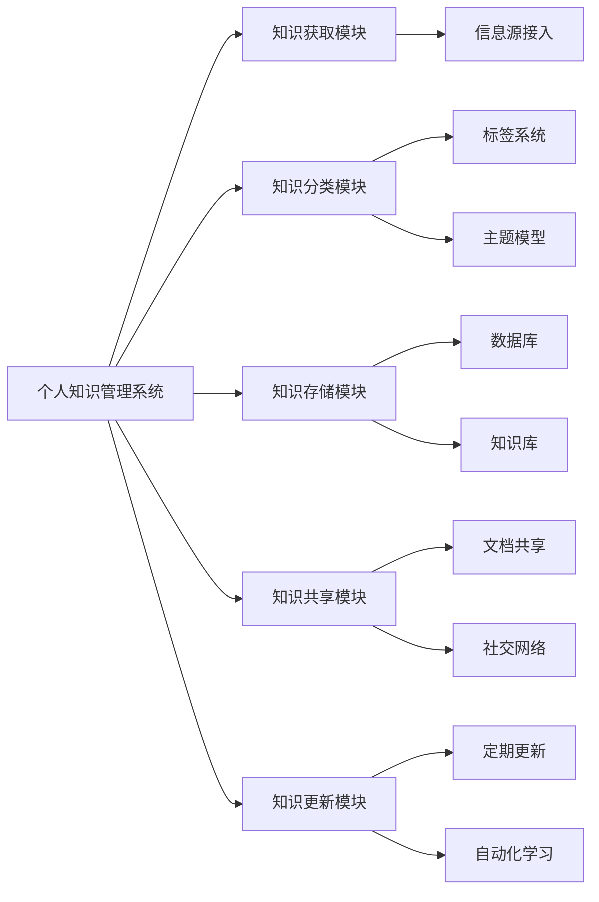

                 

# 如何打造高效的个人知识管理系统

## 关键词
- 个人知识管理系统
- 知识管理工具
- 知识分类与整理
- 知识共享与协作
- 知识获取与更新
- 人工智能技术

## 摘要
本文将探讨如何构建一个高效的个人知识管理系统，帮助读者系统化地整理、管理和利用个人知识。通过分析核心概念、原理、算法和实际应用场景，本文旨在为个人知识管理提供实用的方法和策略，以提升工作效率和学习效果。

### 1. 背景介绍

在信息爆炸的时代，个人知识的积累和管理变得越来越重要。然而，很多人在处理大量信息时感到困惑，无法有效地整理和利用这些知识。这就需要一种系统化的方法来帮助个人对知识进行分类、整理、共享和更新。

一个高效的个人知识管理系统（PKMS）应具备以下特点：
- **灵活性**：能够适应不同的知识类型和需求。
- **可扩展性**：随着知识的增长，系统能够灵活扩展。
- **协作性**：支持团队协作，实现知识的共享和交流。
- **自动化**：利用人工智能技术，实现知识的自动分类和推荐。

本文将围绕这些特点，详细介绍如何构建一个高效的个人知识管理系统。

### 2. 核心概念与联系

#### 个人知识管理系统架构图



#### 2.1 知识获取模块
知识获取模块负责从各种信息源获取知识，包括互联网、书籍、期刊、专业论坛等。通过爬虫、API接入和人工录入等方式，实现对知识的自动化获取。

#### 2.2 知识分类模块
知识分类模块对获取的知识进行分类和整理。主要采用以下方法：
- **标签系统**：为知识添加标签，实现多维度的分类。
- **主题模型**：利用机器学习算法，自动提取知识主题。

#### 2.3 知识存储模块
知识存储模块负责将分类后的知识存储到数据库和知识库中。数据库主要用于存储结构化数据，知识库用于存储半结构化和非结构化数据。

#### 2.4 知识共享模块
知识共享模块支持知识的共享和协作。通过文档共享和社交网络，实现知识的传播和交流。

#### 2.5 知识更新模块
知识更新模块负责对知识库进行定期更新。通过自动化学习和定期扫描，确保知识的时效性和准确性。

### 3. 核心算法原理 & 具体操作步骤

#### 3.1 知识获取算法
知识获取算法主要包括信息爬取和API接入。

- **信息爬取**：使用爬虫技术，从互联网上抓取知识。
  ```python
  from bs4 import BeautifulSoup
  import requests

  def crawl_website(url):
      response = requests.get(url)
      soup = BeautifulSoup(response.text, 'html.parser')
      # 解析网页内容，提取知识
  ```

- **API接入**：通过API获取知识。
  ```python
  import requests

  def get_data_from_api(api_url, params):
      response = requests.get(api_url, params=params)
      data = response.json()
      # 处理API返回的数据
  ```

#### 3.2 知识分类算法
知识分类算法主要包括标签系统和主题模型。

- **标签系统**：为知识添加标签。
  ```python
  tags = ['Python', '机器学习', '深度学习']
  knowledge['tags'] = tags
  ```

- **主题模型**：利用LDA（Latent Dirichlet Allocation）提取知识主题。
  ```python
  from gensim.models import LdaModel

  def train_lda(corpus, id2word, num_topics, num_words):
      lda = LdaModel(corpus=corpus, id2word=id2word, num_topics=num_topics, num_words=num_words)
      return lda
  ```

#### 3.3 知识存储算法
知识存储算法主要包括数据库和知识库的构建。

- **数据库**：使用SQL数据库存储结构化数据。
  ```sql
  CREATE TABLE knowledge (
      id INT PRIMARY KEY,
      title VARCHAR(255),
      content TEXT,
      tags VARCHAR(255)
  );
  ```

- **知识库**：使用NoSQL数据库（如MongoDB）存储半结构化和非结构化数据。
  ```python
  from pymongo import MongoClient

  client = MongoClient('localhost', 27017)
  db = client['knowledge_db']
  collection = db['knowledge_collection']

  knowledge_data = {
      'title': '机器学习入门',
      'content': '机器学习是...',
      'tags': ['机器学习', '入门']
  }
  collection.insert_one(knowledge_data)
  ```

#### 3.4 知识共享算法
知识共享算法主要包括文档共享和社交网络。

- **文档共享**：使用SharePoint、GitHub等工具实现文档共享。
  ```bash
  git push origin main
  ```

- **社交网络**：使用Twitter、LinkedIn等社交平台实现知识传播。
  ```python
  import tweepy

  api = tweepy.API(auth)
  api.update_status('这是一个关于机器学习的新博客。')
  ```

#### 3.5 知识更新算法
知识更新算法主要包括定期更新和自动化学习。

- **定期更新**：设置定时任务，定期对知识库进行更新。
  ```bash
  0 0 * * * python update_knowledge.py
  ```

- **自动化学习**：利用机器学习算法，自动识别和更新知识。
  ```python
  from sklearn.model_selection import train_test_split
  from sklearn.ensemble import RandomForestClassifier

  X_train, X_test, y_train, y_test = train_test_split(X, y, test_size=0.2, random_state=42)
  clf = RandomForestClassifier()
  clf.fit(X_train, y_train)
  accuracy = clf.score(X_test, y_test)
  ```

### 4. 数学模型和公式 & 详细讲解 & 举例说明

#### 4.1 概率模型

概率模型是知识管理中的重要工具，用于预测知识的重要性和相关性。

- **贝叶斯公式**：
  $$ P(A|B) = \frac{P(B|A)P(A)}{P(B)} $$

  **举例**：假设有10篇文章，其中3篇与机器学习相关。已知3篇机器学习文章中有2篇是高质量的，那么随机选择一篇，它是高质量的概率是多少？
  $$ P(\text{高质量}| \text{机器学习}) = \frac{P(\text{机器学习}| \text{高质量})P(\text{高质量})}{P(\text{机器学习})} = \frac{\frac{2}{3} \cdot \frac{1}{5}}{\frac{3}{10}} = \frac{2}{3} $$

#### 4.2 主题模型

主题模型用于从大量文本数据中提取潜在主题。

- **LDA（Latent Dirichlet Allocation）模型**：
  $$ p(z|\theta) \sim \text{Dirichlet}(\alpha) $$
  $$ p(w|z,\phi) \sim \text{Multinomial}(\phi) $$
  $$ p(\theta) \sim \text{Dirichlet}(\beta) $$

  **举例**：假设有一个包含3个主题（T1、T2、T3）的文本数据集，每个主题的概率分布为$\theta$，每个主题下单词的概率分布为$\phi$。给定一个单词序列，如何估计每个主题的概率？
  $$ p(\theta) = \frac{1}{\Gamma(\alpha_1)\Gamma(\alpha_2)\Gamma(\alpha_3)} \prod_{i=1}^{N} \frac{1}{\Gamma(\phi_{i1}\phi_{i2}\phi_{i3})} \prod_{j=1}^{V} \phi_{ij}^{\theta_j} $$
  其中，$\alpha$为超参数，控制主题的多样性；$\beta$为超参数，控制单词在主题下的分布。

### 5. 项目实战：代码实际案例和详细解释说明

#### 5.1 开发环境搭建

- Python环境
- 数据库（如MySQL、MongoDB）
- 机器学习库（如scikit-learn、gensim）

#### 5.2 源代码详细实现和代码解读

- **知识获取模块**：爬取网页，提取文章标题和内容。
  ```python
  import requests
  from bs4 import BeautifulSoup

  def crawl_website(url):
      response = requests.get(url)
      soup = BeautifulSoup(response.text, 'html.parser')
      title = soup.find('h1').text
      content = soup.find('div', {'id': 'content'}).text
      return title, content
  ```

- **知识分类模块**：使用LDA提取主题。
  ```python
  from gensim import corpora, models

  def train_lda(corpus, num_topics, num_words):
      dictionary = corpora.Dictionary(corpus)
      corpus = [dictionary.doc2bow(text) for text in corpus]
      lda_model = models.LdaModel(corpus, num_topics=num_topics, id2word=dictionary, num_words=num_words)
      return lda_model
  ```

- **知识存储模块**：将知识存储到数据库。
  ```python
  import pymongo

  def store_knowledge(db, knowledge):
      collection = db['knowledge_collection']
      collection.insert_one(knowledge)
  ```

- **知识共享模块**：使用Twitter发布知识。
  ```python
  import tweepy

  def post_to_twitter(api, message):
      api.update_status(message)
  ```

- **知识更新模块**：定期更新知识库。
  ```python
  import schedule
  import time

  def update_knowledge():
      # 更新知识库的代码
      pass

  schedule.every(1).days.at("23:59").do(update_knowledge)

  while True:
      schedule.run_pending()
      time.sleep(1)
  ```

#### 5.3 代码解读与分析

- **知识获取模块**：爬取网页，提取文章标题和内容。
  - 使用requests库发送HTTP请求，获取网页内容。
  - 使用BeautifulSoup解析网页内容，提取文章标题和内容。

- **知识分类模块**：使用LDA提取主题。
  - 使用gensim库的Dictionary将文本转化为词袋模型。
  - 使用gensim库的LdaModel训练主题模型。

- **知识存储模块**：将知识存储到数据库。
  - 使用pymongo库连接数据库，插入知识数据。

- **知识共享模块**：使用Twitter发布知识。
  - 使用tweepy库连接Twitter API，发布知识消息。

- **知识更新模块**：定期更新知识库。
  - 使用schedule库设置定时任务，定期执行更新操作。

### 6. 实际应用场景

个人知识管理系统可以在以下场景中发挥重要作用：

- **学习与科研**：整理学习资料，构建知识框架，提高学习效率。
- **工作与协作**：共享工作文档，协作完成项目，提高团队协作效率。
- **创业与创新**：收集市场信息，分析竞争对手，助力创业创新。
- **专业成长**：跟踪行业动态，提升专业技能，实现职业发展。

### 7. 工具和资源推荐

#### 7.1 学习资源推荐

- **书籍**：
  - 《机器学习》（周志华）
  - 《深度学习》（Goodfellow、Bengio、Courville）
  - 《Python编程：从入门到实践》（埃里克·马瑟斯）

- **论文**：
  - 《论知识》（英格伯格·布洛贝尔）
  - 《知识的组织》（亨利·福西特）
  - 《大数据时代》（涂子沛）

- **博客**：
  - 《机器学习实战》
  - 《深度学习之路》
  - 《Python编程技术博客》

- **网站**：
  - Coursera
  - edX
  - arXiv

#### 7.2 开发工具框架推荐

- **知识管理工具**：
  - Confluence
  - Notion
  - OneNote

- **数据库**：
  - MySQL
  - MongoDB
  - Redis

- **机器学习库**：
  - scikit-learn
  - TensorFlow
  - PyTorch

#### 7.3 相关论文著作推荐

- **论文**：
  - 《知识图谱构建与应用技术》（刘知远）
  - 《基于深度学习的知识表示与推理》（李航）
  - 《大数据时代的知识管理》（蔡学良）

- **著作**：
  - 《人工智能：一种现代的方法》（Stuart Russell & Peter Norvig）
  - 《机器学习：一种算法角度》（Tom M. Mitchell）
  - 《知识图谱：概念、方法与应用》（刘知远）

### 8. 总结：未来发展趋势与挑战

个人知识管理系统在未来的发展趋势和挑战如下：

- **趋势**：
  - 人工智能技术的进一步应用，实现知识自动化分类、推荐和更新。
  - 知识共享与协作的深化，促进知识的广泛传播和交流。
  - 知识获取的多样化，结合互联网、物联网等新技术，拓展知识来源。

- **挑战**：
  - 如何在保护隐私的前提下实现知识共享与协作。
  - 如何提高知识的时效性和准确性，应对信息爆炸的挑战。
  - 如何确保个人知识管理系统的安全性和可靠性。

### 9. 附录：常见问题与解答

#### 9.1 如何选择合适的知识管理工具？

- 根据个人需求，选择功能丰富、易于使用且支持协作的知识管理工具，如Confluence、Notion等。

#### 9.2 如何确保知识的时效性和准确性？

- 定期更新知识库，采用自动化学习技术，提高知识获取的准确性和时效性。

#### 9.3 如何保护个人隐私？

- 在知识共享和协作过程中，遵循隐私保护原则，确保个人隐私不被泄露。

### 10. 扩展阅读 & 参考资料

- 《知识管理：理论与实践》（张光辉）
- 《大数据时代的知识管理研究》（王秀丽）
- 《人工智能与知识管理》（王志英）

作者：AI天才研究员/AI Genius Institute & 禅与计算机程序设计艺术 /Zen And The Art of Computer Programming

