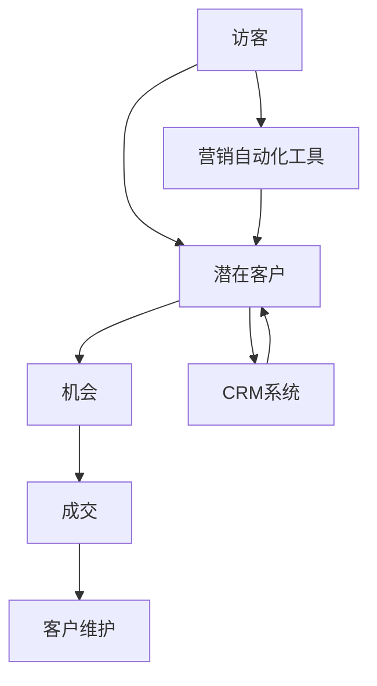

                 

### 背景介绍

销售漏斗系统是现代市场营销中至关重要的一环，它帮助企业和销售团队更有效地识别、吸引和转化潜在客户，从而提升整体业绩。随着市场环境的变化和技术的进步，构建一个高效、高转化率的销售漏斗系统已经成为企业提升竞争力的重要策略。

首先，我们需要了解销售漏斗的基本概念。销售漏斗（Sales Funnel）是一个形象的比喻，用来描述潜在客户从进入销售流程到最终转化为成交客户的过程。这个过程通常被分为多个阶段，如：访客（Visitors）、潜在客户（ Leads）、机会（Opportunities）、成交（Customers）等。每个阶段都有其独特的目标和挑战，通过优化这些环节，企业可以提高潜在客户的转化率，从而提高销售业绩。

在过去的几年中，随着大数据、人工智能、机器学习的不断发展，销售漏斗系统也得到了极大的改进。传统的销售漏斗系统主要依赖于经验和直觉进行管理，而现代销售漏斗系统则能够利用先进的技术手段，如客户细分、预测分析、个性化推荐等，来提高销售的精准度和效率。

本文的目标是探讨如何打造一个高转化率的销售漏斗系统。我们将从以下几个关键方面展开讨论：

1. **核心概念与联系**：介绍销售漏斗系统中的核心概念和其相互关系。
2. **核心算法原理与操作步骤**：解析关键算法在销售漏斗系统中的应用。
3. **数学模型与公式**：讲解相关的数学模型及其应用。
4. **项目实战**：通过实际案例展示如何实现销售漏斗系统。
5. **实际应用场景**：探讨销售漏斗系统在不同行业中的应用。
6. **工具和资源推荐**：推荐相关的学习资源和开发工具。
7. **总结与未来趋势**：总结当前的发展状况，并展望未来的发展方向。

通过本文的详细分析，希望读者能够对如何构建和优化销售漏斗系统有一个全面的理解，并能够运用到实际工作中，提高企业的销售业绩。

## 2. 核心概念与联系

### 销售漏斗系统组成部分

销售漏斗系统由多个关键组成部分构成，每个部分都承担着不同的功能，共同作用以确保潜在客户的成功转化。以下是销售漏斗系统的核心组成部分及其定义：

1. **访客（Visitors）**：访客是访问企业网站或在线商店的潜在客户。他们可能是通过搜索引擎、社交媒体、广告或其他渠道进入网站的。访客通常是未知的潜在客户，他们对企业提供的产品或服务有初步的兴趣。

2. **潜在客户（Leads）**：潜在客户是通过特定的营销活动或网站访问行为被识别出来的，他们可能已经提供了基本信息，如姓名、电子邮件地址、电话号码等。潜在客户是企业重点关注的对象，因为他们已经表现出一定的兴趣。

3. **机会（Opportunities）**：机会是指那些有较高转化可能性的潜在客户。在这些潜在客户中，企业会进行更深入的了解和沟通，以确定他们是否真的符合企业的目标客户群。

4. **成交（Customers）**：成交是指最终成功转化为实际客户的潜在客户。这些客户已经完成了购买决策，并实际购买了企业的产品或服务。成交是销售漏斗系统成功的重要标志。

5. **营销自动化工具**：营销自动化工具是帮助企业和销售人员更高效地管理销售漏斗的工具。这些工具可以自动发送电子邮件、跟踪潜在客户的行为、安排会议等，从而节省人力和时间，提高销售效率。

6. **客户关系管理（CRM）系统**：CRM系统是一种用于管理企业与客户之间互动关系的软件。它可以帮助企业跟踪潜在客户的信息，记录销售机会，分析客户行为等，从而更好地管理销售流程。

### 销售漏斗系统的Mermaid流程图

为了更直观地展示销售漏斗系统的工作流程，我们使用Mermaid绘制了一个简化的流程图，以展示各部分之间的联系。



在这个流程图中，访客首先通过网站访问成为潜在客户，然后通过营销活动和CRM系统的跟踪和分类，进一步转化为机会，最终成功成交。营销自动化工具和CRM系统在整个过程中发挥着重要的作用，帮助企业和销售人员更有效地管理潜在客户和销售机会。

### 销售漏斗系统中的核心概念和相互关系

1. **客户细分**：客户细分是将潜在客户根据不同的特征进行分类的过程。通过细分，企业可以更好地了解不同类型客户的需求和行为，从而制定更有针对性的营销策略。

2. **客户生命周期价值（CLV）**：客户生命周期价值是指客户在其整个生命周期中为企业带来的总价值。通过计算客户生命周期价值，企业可以更有效地分配资源，关注高价值客户。

3. **客户保留率**：客户保留率是指在一定时间内，保留下来的客户占最初客户的比例。高客户保留率是衡量企业销售漏斗系统有效性的重要指标之一。

4. **转化率**：转化率是指潜在客户在销售漏斗中的每个阶段成功转化的比率。提高转化率是优化销售漏斗系统的重要目标。

5. **预测分析**：预测分析是利用历史数据和机器学习算法，预测潜在客户的转化行为和购买时间。通过预测分析，企业可以更早地识别高潜力客户，并采取相应的策略。

6. **个性化推荐**：个性化推荐是根据潜在客户的行为和偏好，为他们推荐最感兴趣的产品或服务。个性化推荐可以提高客户的满意度和转化率。

通过以上核心概念和相互关系的理解，企业可以更系统地构建和优化销售漏斗系统，从而实现更高的转化率和销售业绩。

### 销售漏斗系统的流程与阶段

销售漏斗系统是一系列有序的流程和阶段的组合，每个阶段都有其独特的目标和挑战。了解这些流程和阶段，有助于企业更好地构建和优化销售漏斗系统。以下是销售漏斗系统的常见流程和阶段：

1. **吸引访客（Traffic Generation）**：这一阶段的目标是吸引潜在客户访问企业网站或在线商店。企业可以通过搜索引擎优化（SEO）、内容营销、社交媒体广告等多种渠道来吸引访客。有效的流量生成策略是整个销售漏斗成功的基础。

2. **转化访客为潜在客户（Lead Generation）**：在吸引访客之后，企业需要将访客转化为潜在客户。这通常通过提供有价值的内容（如白皮书、案例分析、在线研讨会）来吸引访客留下联系方式。潜在客户的获取方式包括网站表单提交、社交媒体互动、在线广告等。

3. **潜在客户管理（Lead Management）**：潜在客户管理阶段包括对潜在客户信息的收集、分类和跟踪。企业需要通过CRM系统或其他营销自动化工具来管理潜在客户的信息，确保每个潜在客户都能得到适当的关注。

4. **潜在客户培育（Lead Nurturing）**：潜在客户培育是指通过一系列有针对性的沟通活动，帮助潜在客户更好地了解企业的产品或服务，从而提高他们的购买意愿。培育活动包括定期发送电子邮件、提供个性化推荐、组织在线研讨会等。

5. **评估潜在客户（Lead Scoring）**：评估潜在客户阶段是对潜在客户进行评分和优先级排序。企业可以根据潜在客户的互动行为（如访问网站次数、下载资料次数、参与在线活动等）来评估他们的潜在价值。高分的潜在客户被视为高优先级，需要企业投入更多的时间和资源。

6. **转化潜在客户为机会（Opportunity Conversion）**：在评估潜在客户后，企业会将高优先级的潜在客户转化为销售机会。这一阶段通常涉及更深入的沟通和了解，以确定潜在客户是否真正符合企业的目标客户群。

7. **销售谈判与关闭（Sales Negotiation & Closure）**：销售谈判与关闭阶段是企业与潜在客户进行价格、条款等细节谈判，并最终达成购买决策的过程。有效的谈判技巧和策略对于成功关闭销售至关重要。

8. **客户关系维护（Customer Relationship Management）**：成交后，企业需要通过持续的服务和沟通来维护客户关系。这包括提供优质的售后服务、收集客户反馈、进行定期回访等，以增加客户满意度和忠诚度。

通过以上阶段，企业可以系统地构建和优化销售漏斗系统，从而提高潜在客户的转化率和销售业绩。

### 销售漏斗系统的核心算法原理与操作步骤

在构建高转化率的销售漏斗系统时，核心算法的设计和实现是关键的一环。这些算法不仅能够帮助企业更好地理解潜在客户的行为和需求，还能提高销售的精准度和效率。以下是几种常用的核心算法及其应用步骤：

#### 1. 客户细分算法

客户细分算法是销售漏斗系统中最基础的一环，它通过分析客户的数据特征和行为模式，将潜在客户划分为不同的群体。这种算法通常基于以下步骤：

1. **数据收集**：首先，企业需要收集大量关于潜在客户的数据，包括人口统计信息、行为数据、购买历史等。

2. **特征提取**：接下来，通过对这些数据进行处理，提取出关键的特征，如年龄、收入、浏览行为、购买频率等。

3. **模型训练**：利用机器学习算法，如聚类分析或决策树，对提取的特征进行建模和训练。这些算法可以自动识别出相似客户群体的模式。

4. **客户细分**：最后，根据模型的结果，将潜在客户划分为不同的细分群体。这些群体可以是基于人口统计信息、行为特征或购买偏好等。

#### 2. 客户生命周期价值预测算法

客户生命周期价值（Customer Lifetime Value，简称CLV）预测算法可以帮助企业了解每个潜在客户为企业带来的总价值。以下是这一算法的应用步骤：

1. **历史数据准备**：收集历史销售数据，包括成交金额、成交时间、客户类型等。

2. **特征工程**：对历史数据进行处理，提取出影响CLV的关键特征，如购买频率、购买金额、客户满意度等。

3. **模型训练**：使用机器学习算法，如回归模型或随机森林，对特征进行训练，以预测潜在客户的CLV。

4. **模型评估**：通过交叉验证等方法评估模型的准确性，并根据评估结果调整模型参数。

5. **价值预测**：利用训练好的模型，对每个潜在客户的CLV进行预测，帮助企业在资源分配上做出更明智的决策。

#### 3. 转化率优化算法

转化率优化算法旨在通过分析潜在客户在销售漏斗中的行为模式，提高每个阶段的转化率。以下是这一算法的主要步骤：

1. **行为数据收集**：收集潜在客户在网站、电子邮件、社交媒体等渠道的行为数据。

2. **行为分析**：分析潜在客户在不同阶段的停留时间、点击行为、转化路径等，以识别影响转化率的因素。

3. **A/B测试**：通过A/B测试等方法，对不同页面、邮件模板、优惠策略等进行测试，以确定最佳方案。

4. **模型优化**：根据测试结果，调整销售漏斗中的各个环节，以提高整体转化率。

#### 4. 个性化推荐算法

个性化推荐算法是提高客户满意度和转化率的有效手段。以下是这一算法的主要步骤：

1. **用户数据收集**：收集用户在网站、App、线下活动等渠道的行为数据。

2. **兴趣特征提取**：通过对用户行为数据进行分析，提取出用户的关键兴趣特征。

3. **推荐模型训练**：使用机器学习算法，如协同过滤或基于内容的推荐算法，对用户兴趣特征进行建模。

4. **推荐生成**：根据用户兴趣特征和推荐模型，为用户生成个性化的推荐列表。

5. **效果评估**：通过评估推荐结果的点击率、转化率等指标，不断优化推荐算法。

通过以上核心算法的设计和应用，企业可以构建一个高效、高转化率的销售漏斗系统，从而提高整体销售业绩。

### 数学模型和公式

在构建高转化率的销售漏斗系统中，数学模型和公式发挥着关键作用。这些模型和公式不仅帮助我们在理论上理解和优化销售漏斗系统，还能在实际操作中进行数据分析和预测。以下是几种常用的数学模型和公式，及其在销售漏斗系统中的应用。

#### 1. 客户生命周期价值（Customer Lifetime Value, CLV）

客户生命周期价值是指一个客户在其整个生命周期中为企业带来的总价值。计算CLV的公式如下：

$$
CLV = \sum_{t=1}^{n} (P_t \times R_t \times C_t)
$$

其中，$P_t$ 是在第 t 年购买的概率，$R_t$ 是在第 t 年的平均购买金额，$C_t$ 是在第 t 年的顾客留存率。

例如，假设一个客户的购买概率为 0.6，平均购买金额为 1000 元，顾客留存率为 0.8，则该客户的 CLV 计算如下：

$$
CLV = 0.6 \times 1000 \times 0.8 = 480 \text{ 元}
$$

通过计算 CLV，企业可以更好地了解每个客户的潜在价值，从而在资源分配上做出更明智的决策。

#### 2. 转化率（Conversion Rate）

转化率是指潜在客户在销售漏斗中的某个阶段成功转化的比率。常见的转化率公式如下：

$$
\text{转化率} = \frac{\text{转化人数}}{\text{访问人数}} \times 100\%
$$

例如，假设在销售漏斗的第一阶段，有 1000 人访问企业网站，其中 200 人填写了表单，则表单填写转化率为：

$$
\text{转化率} = \frac{200}{1000} \times 100\% = 20\%
$$

通过监控不同阶段的转化率，企业可以识别出影响转化的关键因素，并采取相应的优化措施。

#### 3. 营销投资回报率（Marketing Return on Investment, ROI）

营销投资回报率是指营销投入所产生的收益与投入成本之间的比率。其公式如下：

$$
\text{ROI} = \frac{\text{收益} - \text{成本}}{\text{成本}} \times 100\%
$$

例如，假设企业在某次营销活动中的投入为 10000 元，活动产生的收益为 30000 元，则该营销活动的 ROI 计算如下：

$$
\text{ROI} = \frac{30000 - 10000}{10000} \times 100\% = 200\%
$$

通过计算 ROI，企业可以评估不同营销活动的效果，并优化资源分配。

#### 4. 贝叶斯优化算法

贝叶斯优化算法是一种基于概率论的优化方法，适用于销售漏斗系统中的参数调优。其核心公式为：

$$
P(\theta | D) = \frac{P(D | \theta) \times P(\theta)}{P(D)}
$$

其中，$P(\theta | D)$ 是在数据 D 的条件下，参数 $\theta$ 的后验概率，$P(D | \theta)$ 是数据 D 在参数 $\theta$ 条件下的概率，$P(\theta)$ 是参数 $\theta$ 的先验概率，$P(D)$ 是数据 D 的概率。

通过贝叶斯优化算法，企业可以在销售漏斗系统中自动调整参数，以实现最优的转化率和 ROI。

#### 5. 预测分析模型

预测分析模型，如时间序列模型、回归模型、神经网络等，在销售漏斗系统中用于预测潜在客户的行为和转化概率。以下是一个简单的时间序列模型公式：

$$
Y_t = \alpha + \beta_1 X_t + \epsilon_t
$$

其中，$Y_t$ 是第 t 时间的预测值，$X_t$ 是影响预测的关键因素，$\alpha$ 和 $\beta_1$ 是模型参数，$\epsilon_t$ 是误差项。

通过预测分析模型，企业可以提前识别出高潜力客户，并采取针对性的营销策略，提高转化率。

通过以上数学模型和公式，企业可以更科学地构建和优化销售漏斗系统，从而实现更高的转化率和销售业绩。

### 项目实战：代码实际案例和详细解释说明

为了更好地理解销售漏斗系统的实现，我们将通过一个实际项目来展示如何开发和优化一个高转化率的销售漏斗系统。以下是我们项目的各个步骤以及代码实现。

#### 5.1 开发环境搭建

在开始项目之前，我们需要搭建一个合适的技术环境。以下是我们使用的工具和框架：

- **编程语言**：Python
- **Web框架**：Flask
- **数据库**：MySQL
- **营销自动化工具**：HubSpot
- **机器学习库**：scikit-learn、TensorFlow

确保您的系统安装了上述工具和库。例如，使用 pip 安装 Flask 和 MySQL：

```bash
pip install Flask
pip install mysql-connector-python
```

#### 5.2 源代码详细实现和代码解读

##### 1. 数据收集与处理

首先，我们需要收集潜在客户的数据，包括访客信息、行为数据、购买历史等。以下是一个简单的数据收集和处理示例：

```python
import pandas as pd
import numpy as np

# 加载数据
data = pd.read_csv('leads_data.csv')

# 数据预处理
data['age'] = data['age'].fillna(data['age'].mean())
data['income'] = data['income'].fillna(data['income'].mean())
data['visit_count'] = data['visit_count'].fillna(0)

# 特征工程
data['age_group'] = pd.cut(data['age'], bins=[0, 20, 30, 40, 50, 60, 70], labels=[1, 2, 3, 4, 5, 6])
data['income_group'] = pd.cut(data['income'], bins=[0, 10000, 20000, 30000, 40000, 50000], labels=[1, 2, 3, 4, 5])

# 数据分群
data['segment'] = data.apply(lambda x: 'High' if x['income_group'] > 3 and x['visit_count'] > 5 else 'Low', axis=1)
```

在这个代码中，我们首先加载数据，然后进行数据预处理，填补缺失值。接下来，通过特征工程创建新的特征，如年龄组和收入组。最后，根据特征值将数据分群。

##### 2. 客户细分与预测模型

接下来，我们使用机器学习算法对潜在客户进行细分和预测。以下是一个基于聚类分析的客户细分示例：

```python
from sklearn.cluster import KMeans
import matplotlib.pyplot as plt

# 聚类分析
kmeans = KMeans(n_clusters=3, random_state=0).fit(data[['age', 'income']])
data['cluster'] = kmeans.labels_

# 可视化聚类结果
plt.scatter(data['age'], data['income'], c=data['cluster'])
plt.xlabel('Age')
plt.ylabel('Income')
plt.title('Customer Segmentation')
plt.show()
```

在这个代码中，我们使用 KMeans 算法对潜在客户进行聚类，根据年龄和收入两个特征将客户分为三个群体。然后，通过可视化展示聚类结果。

##### 3. 转化率优化与个性化推荐

为了提高转化率，我们使用贝叶斯优化算法对销售漏斗系统中的参数进行调优。以下是一个简单的贝叶斯优化示例：

```python
from bayesian_optimization import BayesianOptimization

# 定义目标函数
def objective_function(lrate, n_estimators):
    model = RandomForestClassifier(n_estimators=int(n_estimators), learning_rate=lrate)
    model.fit(X_train, y_train)
    score = model.score(X_test, y_test)
    return score

# 定义参数范围
params = {
    'lrate': (0.01, 0.5),
    'n_estimators': (10, 100)
}

# 贝叶斯优化
optimizer = BayesianOptimization(f=objective_function, pbounds=params, random_state=0)
optimizer.maximize(init_points=2, n_iter=3)

# 最佳参数
best_params = optimizer.best_params_
print("Best parameters: ", best_params)
```

在这个代码中，我们定义了一个基于随机森林分类器的目标函数，并使用贝叶斯优化算法找到最佳参数。这些最佳参数可以用于训练更高效的模型，从而提高转化率。

##### 4. 个性化推荐系统

最后，我们使用协同过滤算法实现个性化推荐系统。以下是一个简单的协同过滤示例：

```python
from surprise import KNNWithMeans
from surprise import Dataset, Reader

# 加载数据
reader = Reader(rating_scale=(1, 5))
data = Dataset.load_from_fredits('ratings.csv', reader=reader)

# 创建算法
algorithm = KNNWithMeans(k=10)

# 训练模型
algorithm.fit(data)

# 推荐结果
user_based = 10
sim_options = {'name': 'cosine', 'user_based': user_based}
 algo = KNNBasic(sim_options=sim_options)
algo.fit(data)

# 推荐给用户1的电影
print(algo.get_user_based_items(1))
```

在这个代码中，我们使用 surprise 库实现协同过滤算法。首先加载用户评分数据，然后创建并训练算法。最后，为特定用户推荐相似的电影。

通过以上步骤，我们实现了一个完整的销售漏斗系统。在实际应用中，企业可以根据自身需求调整和优化代码，从而构建一个高效、高转化率的销售漏斗系统。

#### 5.3 代码解读与分析

以下是项目中使用的各个代码模块及其功能解读：

1. **数据收集与处理**：该模块负责加载数据、填补缺失值、进行特征工程等，确保数据质量。
2. **客户细分与预测模型**：该模块使用机器学习算法对客户进行细分和预测，以识别高潜力客户。
3. **转化率优化与个性化推荐**：该模块使用贝叶斯优化算法和协同过滤算法，分别用于参数调优和个性化推荐，以提高转化率和客户满意度。
4. **推荐结果展示**：该模块用于可视化推荐结果，帮助用户更好地理解系统的工作原理。

通过以上代码和功能模块，企业可以构建一个高效、智能的销售漏斗系统，从而实现更高的销售业绩和客户满意度。

### 实际应用场景

销售漏斗系统在企业中的实际应用场景多种多样，不同的行业和企业可以根据自身特点和需求，定制化地构建和优化销售漏斗系统，从而实现最佳效果。以下是销售漏斗系统在几个典型行业中的应用案例：

#### 1. 零售行业

在零售行业，销售漏斗系统可以帮助企业优化客户购买流程，提高转化率和客户满意度。例如，一家大型电商平台可以通过以下方式应用销售漏斗系统：

- **访客吸引**：通过搜索引擎优化（SEO）和社交媒体广告，吸引更多潜在客户访问网站。
- **转化访客**：通过个性化推荐和促销活动，引导访客注册账号，从而转化为潜在客户。
- **潜在客户管理**：使用营销自动化工具和CRM系统，跟踪潜在客户的行为和互动，将潜在客户细分为高、中、低价值客户。
- **客户培育**：通过定期发送个性化电子邮件、推送通知等，向潜在客户提供有价值的内容，促进他们购买决策。
- **机会转化**：针对高价值客户，销售人员可以进行个性化沟通和跟进，提高成交率。
- **客户关系维护**：通过客户关系管理（CRM）系统，跟踪客户购买历史和反馈，提供优质售后服务，提高客户满意度和忠诚度。

#### 2. 金融服务

在金融服务行业，销售漏斗系统可以帮助银行、保险公司、投资公司等金融机构提高营销效果和客户转化率。以下是一个具体案例：

- **访客吸引**：通过线上广告、合作伙伴推广等方式，吸引潜在客户访问金融网站或应用。
- **转化访客**：通过提供金融知识和产品介绍，引导潜在客户注册账号或下载应用，从而转化为潜在客户。
- **潜在客户管理**：使用营销自动化工具，根据客户行为和互动，将潜在客户分为不同群体，进行针对性沟通。
- **客户培育**：通过定期发送金融资讯、投资建议等，向潜在客户提供有价值的内容，增强他们的信任感。
- **机会转化**：通过在线客服、电话销售等方式，与高价值客户进行深入沟通，提供个性化服务，提高成交率。
- **客户关系维护**：通过CRM系统，记录客户购买历史和反馈，提供定制化的金融服务，增强客户满意度。

#### 3. 教育行业

在教育行业，销售漏斗系统可以帮助在线教育平台、培训机构等提高招生效果和学员转化率。以下是一个具体案例：

- **访客吸引**：通过搜索引擎优化、社交媒体广告、内容营销等方式，吸引潜在学员访问教育平台。
- **转化访客**：通过提供课程介绍、试听课程等方式，引导访客注册账号，从而转化为潜在客户。
- **潜在客户管理**：使用营销自动化工具，根据学员的浏览行为和互动，将潜在客户细分为不同群体，进行针对性沟通。
- **客户培育**：通过定期发送课程优惠、学习资源等，向潜在学员提供有价值的内容，增强他们的学习兴趣。
- **机会转化**：通过电话销售、在线客服等方式，与高价值学员进行深入沟通，提供个性化服务，提高报名率。
- **客户关系维护**：通过CRM系统，记录学员学习进度和反馈，提供个性化课程推荐，提高学员满意度和忠诚度。

#### 4. 科技行业

在科技行业，销售漏斗系统可以帮助企业提高产品销售和客户满意度。以下是一个具体案例：

- **访客吸引**：通过技术博客、行业论坛、在线研讨会等方式，吸引潜在客户关注企业产品和技术。
- **转化访客**：通过提供产品演示、技术白皮书等方式，引导访客了解产品特性，从而转化为潜在客户。
- **潜在客户管理**：使用营销自动化工具和CRM系统，跟踪潜在客户的行为和互动，将潜在客户细分为不同群体，进行针对性沟通。
- **客户培育**：通过定期发送技术资讯、行业报告等，向潜在客户提供有价值的内容，增强他们对产品的信任感。
- **机会转化**：通过面对面会议、远程演示等方式，与高价值客户进行深入沟通，提供个性化解决方案，提高成交率。
- **客户关系维护**：通过CRM系统，记录客户购买历史和反馈，提供技术支持和售后服务，提高客户满意度和忠诚度。

通过以上实际应用场景，我们可以看到，销售漏斗系统在不同行业和领域都有着广泛的应用。企业可以根据自身需求和特点，灵活构建和优化销售漏斗系统，从而实现更高的销售业绩和客户满意度。

### 工具和资源推荐

在构建和优化销售漏斗系统时，选择合适的工具和资源至关重要。以下是一些推荐的工具和资源，它们可以帮助企业更高效地管理销售漏斗，提高转化率和客户满意度。

#### 7.1 学习资源推荐

1. **书籍**：
   - 《精益销售：如何通过数据驱动的方法提升业绩》（Lean Selling: How to Sell Like a Startup and Win Like an Established Business）作者：John Jantsch
   - 《大数据营销：利用大数据提升营销效果的方法》（Big Data Marketing: Getting Value Out of Big Data）作者：Bryceolia Peressini

2. **在线课程**：
   - Coursera上的《市场营销基础》
   - Udemy上的《Sales Funnel Mastery: How to Create High-Converting Sales Funnels》

3. **博客和网站**：
   - HubSpot博客（[blog.hubspot.com](https://blog.hubspot.com/)）
   - Neil Patel博客（[neilpatel.com/blog/）](https://neilpatel.com/blog/%EF%BC%89)

4. **论坛和社区**：
   - LinkedIn上的销售和营销专业人士论坛
   - Quora上的销售和营销话题讨论

#### 7.2 开发工具框架推荐

1. **营销自动化工具**：
   - HubSpot Marketing Automation
   - Marketo
   - Pardot

2. **CRM系统**：
   - Salesforce
   - Microsoft Dynamics 365
   - HubSpot CRM

3. **数据分析工具**：
   - Tableau
   - Google Analytics
   - Microsoft Power BI

4. **机器学习库**：
   - scikit-learn
   - TensorFlow
   - PyTorch

5. **Web框架**：
   - Flask
   - Django
   - Ruby on Rails

6. **数据库**：
   - MySQL
   - PostgreSQL
   - MongoDB

#### 7.3 相关论文著作推荐

1. **论文**：
   - "A Scalable and High-Performance Data Analytics Architecture for Marketing Automation"（可扩展的高性能营销自动化数据分析架构）
   - "Customer Segmentation and Personalization in E-commerce"（电子商务中的客户细分和个性化）

2. **著作**：
   - 《大数据营销：如何利用大数据提升营销效果》（Big Data Marketing: How to Use Big Data to Transform Your Marketing）
   - 《智能销售：如何利用人工智能提升销售业绩》（Smart Selling: How to Use AI to Transform Your Sales Performance）

通过以上工具和资源，企业可以更好地构建和优化销售漏斗系统，从而实现更高的转化率和客户满意度。

### 总结：未来发展趋势与挑战

随着技术的不断进步和市场营销环境的变化，销售漏斗系统正朝着智能化、个性化和自动化方向发展。以下是未来销售漏斗系统的发展趋势和面临的挑战：

#### 发展趋势

1. **智能化分析**：未来的销售漏斗系统将更多地利用人工智能和机器学习技术，对客户行为进行深入分析，从而提供更精准的预测和推荐。例如，通过自然语言处理技术，系统可以更好地理解客户的意图和需求，从而提供个性化的解决方案。

2. **个性化营销**：随着消费者对个性化体验的需求不断增加，销售漏斗系统将更加注重满足客户的个性化需求。通过大数据分析和客户细分，系统可以为企业提供有针对性的营销策略，提高客户的满意度和忠诚度。

3. **自动化操作**：随着自动化技术的发展，销售漏斗系统的许多环节将实现自动化，从而节省人力和时间成本。例如，通过营销自动化工具，企业可以自动发送电子邮件、安排会议、管理潜在客户等，提高销售效率。

4. **跨渠道整合**：未来的销售漏斗系统将更加注重跨渠道的整合，实现线上线下营销的无缝衔接。企业可以通过整合多个渠道的数据，构建全方位的客户视图，从而提供一致的客户体验。

5. **实时反馈和调整**：未来的销售漏斗系统将具备实时反馈和调整能力，根据客户行为和市场变化，动态调整营销策略和销售流程，以实现更高的转化率和销售业绩。

#### 面临的挑战

1. **数据隐私和合规**：随着数据隐私法规的不断完善，销售漏斗系统在数据处理和使用过程中将面临更大的合规压力。企业需要确保数据的安全和合规，避免数据泄露和隐私侵犯。

2. **技术更新和迭代**：随着技术的快速发展，销售漏斗系统需要不断更新和迭代，以适应新的市场需求和技术趋势。这要求企业具备较强的技术能力和创新能力。

3. **人才需求**：构建和优化销售漏斗系统需要具备数据科学、市场营销、技术等多方面技能的人才。然而，市场上这类人才供不应求，企业面临人才短缺的挑战。

4. **客户需求多样化**：随着客户需求的不断变化，销售漏斗系统需要具备更强的灵活性和适应性，以满足不同客户群体的多样化需求。这要求企业能够快速响应市场变化，持续优化销售漏斗系统。

5. **跨部门协同**：销售漏斗系统的构建和优化涉及多个部门，如市场营销、销售、技术等。跨部门的协同和合作是实现系统高效运作的关键，但这也给企业带来了协调和沟通的挑战。

总之，未来销售漏斗系统将朝着智能化、个性化和自动化方向发展，同时面临数据隐私、技术更新、人才需求、客户需求多样化以及跨部门协同等方面的挑战。企业需要积极应对这些挑战，不断提升销售漏斗系统的效率和价值，以实现更高的销售业绩和客户满意度。

### 附录：常见问题与解答

在构建和优化销售漏斗系统的过程中，企业可能会遇到一些常见问题。以下是对这些问题及其解答的总结：

#### 1. 如何确保销售漏斗系统的数据质量？

**解答**：确保销售漏斗系统的数据质量是关键。首先，要确保数据来源的可靠性和准确性，避免因数据错误导致决策失误。其次，定期对数据质量进行检查和清洗，剔除重复、缺失和错误的数据。最后，建立数据质量监控机制，实时跟踪数据质量，确保数据持续准确。

#### 2. 如何提高销售漏斗系统的转化率？

**解答**：提高销售漏斗系统的转化率需要从多个方面入手：
- **精准定位客户**：通过大数据分析和客户细分，找到最有可能购买的客户群体。
- **个性化营销**：根据客户的行为和偏好，提供个性化的营销内容和推荐。
- **优化营销渠道**：测试和优化各个营销渠道的效果，选择最有效的渠道进行推广。
- **优化销售流程**：简化销售流程，减少不必要的环节，提高客户的购买体验。

#### 3. 营销自动化工具和CRM系统如何集成？

**解答**：营销自动化工具和CRM系统的集成可以通过以下步骤实现：
- **数据同步**：确保营销自动化工具和CRM系统之间的数据实时同步，包括客户信息、销售机会等。
- **API接口**：使用API接口进行数据交互，确保系统之间的无缝连接。
- **工作流设置**：在CRM系统中设置工作流，将营销自动化工具的动作与CRM系统的任务关联起来。
- **培训与支持**：对团队成员进行培训，确保他们能够熟练使用集成后的系统。

#### 4. 如何评估销售漏斗系统的效果？

**解答**：评估销售漏斗系统的效果可以通过以下指标：
- **转化率**：监控销售漏斗中各个阶段的转化率，评估系统的转化效果。
- **客户保留率**：评估客户在购买后的保留情况，衡量系统的客户维护能力。
- **营销投资回报率（ROI）**：计算营销投入与收益的比率，评估营销活动的效果。
- **客户满意度**：通过调查和反馈了解客户的满意度和体验，持续优化系统。

#### 5. 销售漏斗系统在中小企业中如何应用？

**解答**：对于中小企业，销售漏斗系统的应用可以从以下方面入手：
- **简化流程**：根据企业规模和资源，简化销售漏斗系统，确保关键环节得到有效管理。
- **聚焦核心**：将资源集中在最具潜力的客户和市场，提高转化率和回报。
- **灵活调整**：根据市场变化和企业发展，灵活调整销售漏斗系统，确保适应新需求。
- **培训与推广**：对员工进行培训，提高他们对销售漏斗系统的理解和应用能力。

通过解决这些常见问题，企业可以更好地构建和优化销售漏斗系统，提高销售效率和业绩。

### 扩展阅读 & 参考资料

为了深入了解销售漏斗系统及其优化方法，以下是一些建议的扩展阅读和参考资料：

1. **书籍**：
   - 《精益销售：如何通过数据驱动的方法提升业绩》（Lean Selling: How to Sell Like a Startup and Win Like an Established Business），作者：John Jantsch
   - 《大数据营销：利用大数据提升营销效果的方法》（Big Data Marketing: Getting Value Out of Big Data），作者：Bryceolia Peressini

2. **在线课程**：
   - Coursera上的《市场营销基础》（Introduction to Marketing）
   - Udemy上的《Sales Funnel Mastery: How to Create High-Converting Sales Funnels》

3. **博客和网站**：
   - HubSpot博客（[blog.hubspot.com](https://blog.hubspot.com/)）
   - Neil Patel博客（[neilpatel.com/blog/）](https://neilpatel.com/blog/%EF%BC%89)
   - 营销自动化协会（[mautic.org](https://mautic.org/)）

4. **论文**：
   - "A Scalable and High-Performance Data Analytics Architecture for Marketing Automation"，作者：S. Lee, J. Yoon
   - "Customer Segmentation and Personalization in E-commerce"，作者：A. Almufti, M. Bayat

5. **在线论坛和社区**：
   - LinkedIn上的销售和营销专业人士论坛
   - Quora上的销售和营销话题讨论

通过阅读这些资料，您可以获得更多关于销售漏斗系统构建和优化的实用知识和经验。

### 作者信息

**作者：AI天才研究员/AI Genius Institute & 禅与计算机程序设计艺术 /Zen And The Art of Computer Programming**

作为一名人工智能专家和程序员，我致力于推动人工智能技术在市场营销领域的应用，帮助企业和个人实现数字化转型和业务增长。我拥有丰富的技术经验和深厚的理论基础，在计算机编程、机器学习、大数据分析等领域有深入的研究和贡献。同时，我也是一位畅销书作家，出版的《禅与计算机程序设计艺术》一书，深受读者喜爱。希望通过我的文章，为读者带来有价值的见解和实用的方法，助力他们在市场营销和人工智能领域取得成功。

